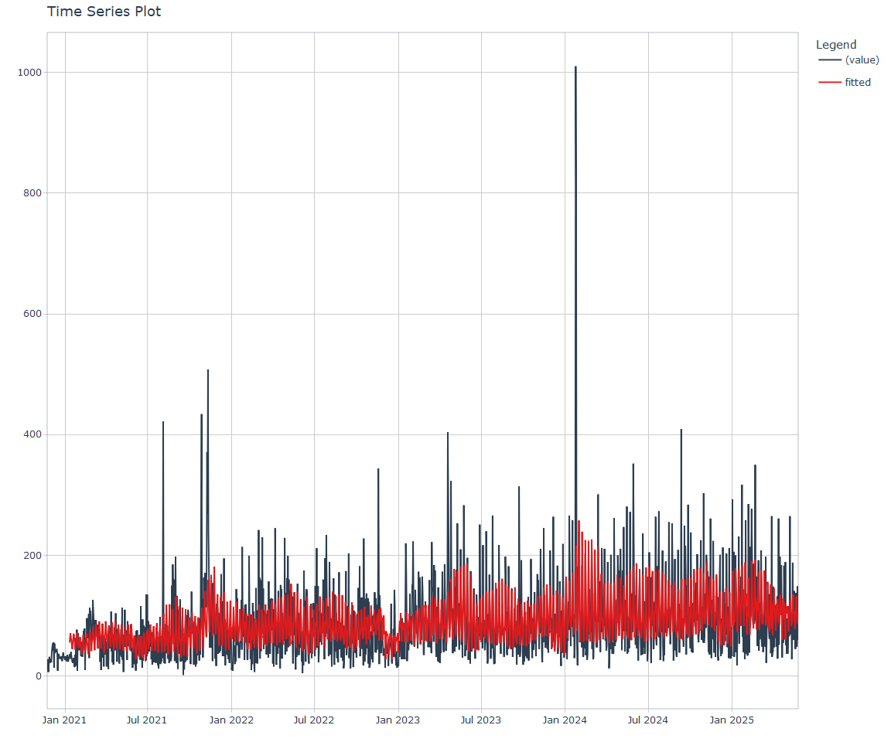

Time Series Analysis and Nested Modeling of the Healthyverse Packages
================
Steven P. Sanderson II, MPH - Date:
30 August, 2024

This analysis follows a *Nested Modeltime Workflow*.

## Get Data

``` r
glimpse(downloads_tbl)
```

    ## Rows: 112,512
    ## Columns: 11
    ## $ date      <date> 2020-11-23, 2020-11-23, 2020-11-23, 2020-11-23, 2020-11-23,…
    ## $ time      <Period> 15H 36M 55S, 11H 26M 39S, 23H 34M 44S, 18H 39M 32S, 9H 0M…
    ## $ date_time <dttm> 2020-11-23 15:36:55, 2020-11-23 11:26:39, 2020-11-23 23:34:…
    ## $ size      <int> 4858294, 4858294, 4858301, 4858295, 361, 4863722, 4864794, 4…
    ## $ r_version <chr> NA, "4.0.3", "3.5.3", "3.5.2", NA, NA, NA, NA, NA, NA, NA, N…
    ## $ r_arch    <chr> NA, "x86_64", "x86_64", "x86_64", NA, NA, NA, NA, NA, NA, NA…
    ## $ r_os      <chr> NA, "mingw32", "mingw32", "linux-gnu", NA, NA, NA, NA, NA, N…
    ## $ package   <chr> "healthyR.data", "healthyR.data", "healthyR.data", "healthyR…
    ## $ version   <chr> "1.0.0", "1.0.0", "1.0.0", "1.0.0", "1.0.0", "1.0.0", "1.0.0…
    ## $ country   <chr> "US", "US", "US", "GB", "US", "US", "DE", "HK", "JP", "US", …
    ## $ ip_id     <int> 2069, 2804, 78827, 27595, 90474, 90474, 42435, 74, 7655, 638…

The last day in the data set is 2024-08-28 23:51:49, the file was
birthed on: 2024-08-07 07:35:44, and at report knit time is -516.27
hours old. Happy analyzing!

Now that we have our data lets take a look at it using the `skimr`
package.

``` r
skim(downloads_tbl)
```

|                                                  |               |
|:-------------------------------------------------|:--------------|
| Name                                             | downloads_tbl |
| Number of rows                                   | 112512        |
| Number of columns                                | 11            |
| \_\_\_\_\_\_\_\_\_\_\_\_\_\_\_\_\_\_\_\_\_\_\_   |               |
| Column type frequency:                           |               |
| character                                        | 6             |
| Date                                             | 1             |
| numeric                                          | 2             |
| POSIXct                                          | 1             |
| Timespan                                         | 1             |
| \_\_\_\_\_\_\_\_\_\_\_\_\_\_\_\_\_\_\_\_\_\_\_\_ |               |
| Group variables                                  | None          |

Data summary

**Variable type: character**

| skim_variable | n_missing | complete_rate | min | max | empty | n_unique | whitespace |
|:--------------|----------:|--------------:|----:|----:|------:|---------:|-----------:|
| r_version     |     79076 |          0.30 |   5 |   5 |     0 |       43 |          0 |
| r_arch        |     79076 |          0.30 |   3 |   7 |     0 |        5 |          0 |
| r_os          |     79076 |          0.30 |   7 |  15 |     0 |       19 |          0 |
| package       |         0 |          1.00 |   7 |  13 |     0 |        7 |          0 |
| version       |         0 |          1.00 |   5 |  17 |     0 |       59 |          0 |
| country       |      9608 |          0.91 |   2 |   2 |     0 |      157 |          0 |

**Variable type: Date**

| skim_variable | n_missing | complete_rate | min        | max        | median     | n_unique |
|:--------------|----------:|--------------:|:-----------|:-----------|:-----------|---------:|
| date          |         0 |             1 | 2020-11-23 | 2024-08-28 | 2023-02-01 |     1375 |

**Variable type: numeric**

| skim_variable | n_missing | complete_rate |       mean |         sd |  p0 |   p25 |    p50 |     p75 |    p100 | hist  |
|:--------------|----------:|--------------:|-----------:|-----------:|----:|------:|-------:|--------:|--------:|:------|
| size          |         0 |             1 | 1178499.56 | 1559160.20 | 355 | 14701 | 274853 | 2373526 | 5677952 | ▇▁▂▁▁ |
| ip_id         |         0 |             1 |   10280.25 |   17980.54 |   1 |   319 |   3080 |   11442 |  143633 | ▇▁▁▁▁ |

**Variable type: POSIXct**

| skim_variable | n_missing | complete_rate | min                 | max                 | median              | n_unique |
|:--------------|----------:|--------------:|:--------------------|:--------------------|:--------------------|---------:|
| date_time     |         0 |             1 | 2020-11-23 09:00:41 | 2024-08-28 23:51:49 | 2023-02-01 18:42:10 |    67988 |

**Variable type: Timespan**

| skim_variable | n_missing | complete_rate | min | max | median | n_unique |
|:--------------|----------:|--------------:|----:|----:|-------:|---------:|
| time          |         0 |             1 |   0 |  59 |     24 |       60 |

We can see that the following columns are missing a lot of data and for
us are most likely not useful anyways, so we will drop them
`c(r_version, r_arch, r_os)`

## Plots

Now lets take a look at a time-series plot of the total daily downloads
by package. We will use a log scale and place a vertical line at each
version release for each package.

<!-- --><!-- -->

Now lets take a look at some time series decomposition graphs.

<!-- --><!-- --><!-- --><!-- -->

## Feature Engineering

Now that we have our basic data and a shot of what it looks like, let’s
add some features to our data which can be very helpful in modeling.
Lets start by making a `tibble` that is aggregated by the day and
package, as we are going to be interested in forecasting the next 4
weeks or 28 days for each package. First lets get our base data.

    ## 
    ## Call:
    ## stats::lm(formula = .formula, data = df)
    ## 
    ## Residuals:
    ##     Min      1Q  Median      3Q     Max 
    ## -151.06  -34.48   -9.60   25.95  799.11 
    ## 
    ## Coefficients:
    ##                                                      Estimate Std. Error
    ## (Intercept)                                        -1.706e+02  8.781e+01
    ## date                                                1.021e-02  4.652e-03
    ## lag(value, 1)                                       1.611e-01  2.644e-02
    ## lag(value, 7)                                       1.001e-01  2.751e-02
    ## lag(value, 14)                                      1.147e-01  2.761e-02
    ## lag(value, 21)                                      3.328e-02  2.773e-02
    ## lag(value, 28)                                      8.843e-02  2.752e-02
    ## lag(value, 35)                                      6.758e-02  2.769e-02
    ## lag(value, 42)                                      3.919e-02  2.785e-02
    ## lag(value, 49)                                      8.700e-02  2.768e-02
    ## month(date, label = TRUE).L                        -1.020e+01  5.700e+00
    ## month(date, label = TRUE).Q                         2.445e+00  5.540e+00
    ## month(date, label = TRUE).C                        -1.139e+01  5.705e+00
    ## month(date, label = TRUE)^4                        -8.773e+00  5.668e+00
    ## month(date, label = TRUE)^5                        -1.577e+01  5.603e+00
    ## month(date, label = TRUE)^6                        -3.904e+00  5.723e+00
    ## month(date, label = TRUE)^7                        -1.048e+01  5.541e+00
    ## month(date, label = TRUE)^8                        -6.237e-01  5.546e+00
    ## month(date, label = TRUE)^9                         7.237e+00  5.546e+00
    ## month(date, label = TRUE)^10                        7.871e+00  5.426e+00
    ## month(date, label = TRUE)^11                       -4.075e+00  5.296e+00
    ## fourier_vec(date, type = "sin", K = 1, period = 7) -1.137e+01  2.514e+00
    ## fourier_vec(date, type = "cos", K = 1, period = 7)  5.941e+00  2.601e+00
    ##                                                    t value Pr(>|t|)    
    ## (Intercept)                                         -1.942 0.052297 .  
    ## date                                                 2.194 0.028392 *  
    ## lag(value, 1)                                        6.093 1.46e-09 ***
    ## lag(value, 7)                                        3.639 0.000284 ***
    ## lag(value, 14)                                       4.153 3.50e-05 ***
    ## lag(value, 21)                                       1.200 0.230380    
    ## lag(value, 28)                                       3.214 0.001342 ** 
    ## lag(value, 35)                                       2.440 0.014814 *  
    ## lag(value, 42)                                       1.407 0.159653    
    ## lag(value, 49)                                       3.143 0.001708 ** 
    ## month(date, label = TRUE).L                         -1.789 0.073911 .  
    ## month(date, label = TRUE).Q                          0.441 0.659035    
    ## month(date, label = TRUE).C                         -1.997 0.046063 *  
    ## month(date, label = TRUE)^4                         -1.548 0.121918    
    ## month(date, label = TRUE)^5                         -2.814 0.004965 ** 
    ## month(date, label = TRUE)^6                         -0.682 0.495260    
    ## month(date, label = TRUE)^7                         -1.891 0.058790 .  
    ## month(date, label = TRUE)^8                         -0.112 0.910480    
    ## month(date, label = TRUE)^9                          1.305 0.192124    
    ## month(date, label = TRUE)^10                         1.451 0.147134    
    ## month(date, label = TRUE)^11                        -0.769 0.441745    
    ## fourier_vec(date, type = "sin", K = 1, period = 7)  -4.523 6.65e-06 ***
    ## fourier_vec(date, type = "cos", K = 1, period = 7)   2.284 0.022543 *  
    ## ---
    ## Signif. codes:  0 '***' 0.001 '**' 0.01 '*' 0.05 '.' 0.1 ' ' 1
    ## 
    ## Residual standard error: 57.52 on 1303 degrees of freedom
    ##   (49 observations deleted due to missingness)
    ## Multiple R-squared:  0.2618, Adjusted R-squared:  0.2494 
    ## F-statistic: 21.01 on 22 and 1303 DF,  p-value: < 2.2e-16

<!-- -->

Now we are going to do some basic pre-processing.

``` r
data_padded_tbl <- base_data %>%
  pad_by_time(
    .date_var  = date,
    .pad_value = 0
  )

# Get log interval and standardization parameters
log_params  <- liv(data_padded_tbl$value, limit_lower = 0, offset = 1, silent = TRUE)
limit_lower <- log_params$limit_lower
limit_upper <- log_params$limit_upper
offset      <- log_params$offset

data_liv_tbl <- data_padded_tbl %>%
  # Get log interval transform
  mutate(value_trans = liv(value, limit_lower = 0, offset = 1, silent = TRUE)$log_scaled)

# Get Standardization Params
std_params <- standard_vec(data_liv_tbl$value_trans, silent = TRUE)
std_mean   <- std_params$mean
std_sd     <- std_params$sd

data_transformed_tbl <- data_liv_tbl %>%
  # get standardization
  mutate(value_trans = standard_vec(value_trans, silent = TRUE)$standard_scaled) %>%
  select(-value)
```

Since this is panel data we can follow one of two different modeling
strategies. We can search for a global model in the panel data or we can
use nested forecasting finding the best model for each of the time
series. Since we only have 5 panels, we will use nested forecasting.

To do this we will use the `nest_timeseries` and
`split_nested_timeseries` functions to create a nested `tibble`.

``` r
horizon <- 4*7

nested_data_tbl <- data_transformed_tbl %>%
    
    # 1. Extending: We'll predict n days into the future.
    extend_timeseries(
        .id_var        = package,
        .date_var      = date,
        .length_future = horizon
    ) %>%
    
    # 2. Nesting: We'll group by id, and create a future dataset
    #    that forecasts n days of extended data and
    #    an actual dataset that contains n*2 days
    nest_timeseries(
        .id_var        = package,
        .length_future = horizon
        #.length_actual = horizon*2
    ) %>%
    
   # 3. Splitting: We'll take the actual data and create splits
   #    for accuracy and confidence interval estimation of n das (test)
   #    and the rest is training data
    split_nested_timeseries(
        .length_test = horizon
    )

nested_data_tbl
```

    ## # A tibble: 8 × 4
    ##   package       .actual_data         .future_data      .splits          
    ##   <fct>         <list>               <list>            <list>           
    ## 1 healthyR.data <tibble [1,346 × 2]> <tibble [28 × 2]> <split [1318|28]>
    ## 2 healthyR      <tibble [1,338 × 2]> <tibble [28 × 2]> <split [1310|28]>
    ## 3 <NA>          <tibble [23 × 2]>    <tibble [28 × 2]> <split [0|23]>   
    ## 4 healthyR.ts   <tibble [1,284 × 2]> <tibble [28 × 2]> <split [1256|28]>
    ## 5 healthyverse  <tibble [1,255 × 2]> <tibble [28 × 2]> <split [1227|28]>
    ## 6 healthyR.ai   <tibble [1,081 × 2]> <tibble [28 × 2]> <split [1053|28]>
    ## 7 TidyDensity   <tibble [935 × 2]>   <tibble [28 × 2]> <split [907|28]> 
    ## 8 tidyAML       <tibble [551 × 2]>   <tibble [28 × 2]> <split [523|28]>

Now it is time to make some recipes and models using the modeltime
workflow.

## Modeltime Workflow

### Recipe Object

``` r
recipe_base <- recipe(
  value_trans ~ date
  , data = extract_nested_test_split(nested_data_tbl)
  )

recipe_base

recipe_date <- recipe_base %>%
    step_mutate(date = as.numeric(date))
```

### Models

``` r
# Models ------------------------------------------------------------------

# Auto ARIMA --------------------------------------------------------------

model_spec_arima_no_boost <- arima_reg() %>%
  set_engine(engine = "auto_arima")

wflw_auto_arima <- workflow() %>%
  add_recipe(recipe = recipe_base) %>%
  add_model(model_spec_arima_no_boost)

# NNETAR ------------------------------------------------------------------

model_spec_nnetar <- nnetar_reg(
  mode              = "regression"
  , seasonal_period = "auto"
) %>%
  set_engine("nnetar")

wflw_nnetar <- workflow() %>%
  add_recipe(recipe = recipe_base) %>%
  add_model(model_spec_nnetar)

# TSLM --------------------------------------------------------------------

model_spec_lm <- linear_reg() %>%
  set_engine("lm")

wflw_lm <- workflow() %>%
  add_recipe(recipe = recipe_base) %>%
  add_model(model_spec_lm)

# MARS --------------------------------------------------------------------

model_spec_mars <- mars(mode = "regression") %>%
  set_engine("earth")

wflw_mars <- workflow() %>%
  add_recipe(recipe = recipe_base) %>%
  add_model(model_spec_mars)
```

### Nested Modeltime Tables

``` r
nested_modeltime_tbl <- modeltime_nested_fit(
  # Nested Data
  nested_data = nested_data_tbl,
   control = control_nested_fit(
     verbose = TRUE,
     allow_par = FALSE
   ),
  # Add workflows
  wflw_auto_arima,
  wflw_lm,
  wflw_mars,
  wflw_nnetar
)
```

``` r
nested_modeltime_tbl <- nested_modeltime_tbl[!is.na(nested_modeltime_tbl$package),]
```

### Model Accuracy

``` r
nested_modeltime_tbl %>%
  extract_nested_test_accuracy() %>%
  knitr::kable()
```

| package       | .model_id | .model_desc | .type |       mae |       mape |      mase |     smape |      rmse |       rsq |
|:--------------|----------:|:------------|:------|----------:|-----------:|----------:|----------:|----------:|----------:|
| healthyR.data |         1 | ARIMA       | Test  | 0.6014088 |   95.24902 | 0.7188406 | 144.00666 | 0.8341737 | 0.0431017 |
| healthyR.data |         2 | LM          | Test  | 0.8858272 |  321.13250 | 1.0587950 | 169.23919 | 1.0223275 | 0.0129951 |
| healthyR.data |         3 | EARTH       | Test  | 0.5766912 |  145.46724 | 0.6892966 | 115.07169 | 0.8396336 | 0.0129951 |
| healthyR.data |         4 | NNAR        | Test  | 0.6049632 |  105.28872 | 0.7230891 | 138.19196 | 0.8370977 | 0.0208423 |
| healthyR      |         1 | ARIMA       | Test  | 0.7412331 |   83.29674 | 0.8526069 | 144.37080 | 0.9611203 | 0.0459155 |
| healthyR      |         2 | LM          | Test  | 0.8523019 |  112.74047 | 0.9803644 | 182.14118 | 1.0501374 | 0.0011736 |
| healthyR      |         3 | EARTH       | Test  | 0.7034967 |   82.25374 | 0.8092005 | 117.17966 | 0.9234741 | 0.0011736 |
| healthyR      |         4 | NNAR        | Test  | 0.8600781 |  114.33152 | 0.9893090 | 182.18992 | 1.0586754 | 0.0325269 |
| NA            |         1 | NULL        | NA    |        NA |         NA |        NA |        NA |        NA |        NA |
| NA            |         2 | NULL        | NA    |        NA |         NA |        NA |        NA |        NA |        NA |
| NA            |         3 | NULL        | NA    |        NA |         NA |        NA |        NA |        NA |        NA |
| NA            |         4 | NULL        | NA    |        NA |         NA |        NA |        NA |        NA |        NA |
| healthyR.ts   |         1 | ARIMA       | Test  | 1.0069796 |  256.53419 | 1.0190360 | 162.50001 | 1.2933576 | 0.0518767 |
| healthyR.ts   |         2 | LM          | Test  | 0.7455901 |  210.43564 | 0.7545169 | 104.89220 | 1.0306785 | 0.0443740 |
| healthyR.ts   |         3 | EARTH       | Test  | 0.7421950 |  214.73148 | 0.7510812 | 103.66332 | 1.0280913 | 0.0443740 |
| healthyR.ts   |         4 | NNAR        | Test  | 0.9524625 |  113.63107 | 0.9638661 | 189.06874 | 1.2301789 | 0.1607296 |
| healthyverse  |         1 | ARIMA       | Test  | 0.6158766 |  542.36816 | 0.8374476 | 114.30087 | 0.7243747 | 0.2298099 |
| healthyverse  |         2 | LM          | Test  | 0.6898790 |  756.44522 | 0.9380735 | 112.31245 | 0.8001380 | 0.0591770 |
| healthyverse  |         3 | EARTH       | Test  | 0.6417488 |  523.11698 | 0.8726277 | 120.08412 | 0.7551862 | 0.0591770 |
| healthyverse  |         4 | NNAR        | Test  | 0.6108086 |  344.27886 | 0.8305562 | 126.53799 | 0.7468847 | 0.0745570 |
| healthyR.ai   |         1 | ARIMA       | Test  | 0.7652603 |  109.02681 | 0.8043294 | 161.77804 | 0.9700160 | 0.0646256 |
| healthyR.ai   |         2 | LM          | Test  | 0.7856586 |  144.09376 | 0.8257691 | 134.48014 | 1.0283277 | 0.0058792 |
| healthyR.ai   |         3 | EARTH       | Test  | 5.3402544 | 2208.66516 | 5.6128920 | 168.31246 | 5.9682808 | 0.0058792 |
| healthyR.ai   |         4 | NNAR        | Test  | 0.8054356 |  138.40623 | 0.8465558 | 150.11066 | 1.0247775 | 0.0052950 |
| TidyDensity   |         1 | ARIMA       | Test  | 0.5097388 |  334.36481 | 0.8099198 |  86.23543 | 0.6201597 | 0.0841140 |
| TidyDensity   |         2 | LM          | Test  | 0.5437649 |  376.76235 | 0.8639836 |  86.35216 | 0.6580617 | 0.0167472 |
| TidyDensity   |         3 | EARTH       | Test  | 0.8006873 |  195.60920 | 1.2722055 | 185.03048 | 0.9783759 | 0.0167472 |
| TidyDensity   |         4 | NNAR        | Test  | 0.6099762 |  108.45440 | 0.9691861 | 132.84809 | 0.7834692 | 0.0418318 |
| tidyAML       |         1 | ARIMA       | Test  | 0.5962756 |  167.59056 | 0.7872123 | 119.44731 | 0.6801915 | 0.2732020 |
| tidyAML       |         2 | LM          | Test  | 0.6522577 |  177.69276 | 0.8611208 | 116.81814 | 0.7661702 | 0.0003730 |
| tidyAML       |         3 | EARTH       | Test  | 3.7515039 | 1878.18660 | 4.9527938 | 148.22450 | 4.1737926 | 0.0003730 |
| tidyAML       |         4 | NNAR        | Test  | 0.6122388 |  260.66347 | 0.8082872 | 102.63428 | 0.7340731 | 0.1018082 |

### Plot Models

``` r
nested_modeltime_tbl %>%
  extract_nested_test_forecast() %>%
  group_by(package) %>%
  plot_modeltime_forecast(
    .interactive = FALSE,
    .conf_interval_show  = FALSE,
    .facet_scales = "free"
  ) +
  theme_minimal() +
  theme(legend.position = "bottom")
```

<!-- -->

### Best Model

``` r
best_nested_modeltime_tbl <- nested_modeltime_tbl %>%
  modeltime_nested_select_best(
    metric = "rmse",
    minimize = TRUE,
    filter_test_forecasts = TRUE
  )

best_nested_modeltime_tbl %>%
  extract_nested_best_model_report()
```

    ## # Nested Modeltime Table
    ##   # A tibble: 7 × 10
    ##   package      .model_id .model_desc .type   mae  mape  mase smape  rmse     rsq
    ##   <fct>            <int> <chr>       <chr> <dbl> <dbl> <dbl> <dbl> <dbl>   <dbl>
    ## 1 healthyR.da…         1 ARIMA       Test  0.601  95.2 0.719 144.  0.834 0.0431 
    ## 2 healthyR             3 EARTH       Test  0.703  82.3 0.809 117.  0.923 0.00117
    ## 3 healthyR.ts          3 EARTH       Test  0.742 215.  0.751 104.  1.03  0.0444 
    ## 4 healthyverse         1 ARIMA       Test  0.616 542.  0.837 114.  0.724 0.230  
    ## 5 healthyR.ai          1 ARIMA       Test  0.765 109.  0.804 162.  0.970 0.0646 
    ## 6 TidyDensity          1 ARIMA       Test  0.510 334.  0.810  86.2 0.620 0.0841 
    ## 7 tidyAML              1 ARIMA       Test  0.596 168.  0.787 119.  0.680 0.273

``` r
best_nested_modeltime_tbl %>%
  extract_nested_test_forecast() %>%
  #filter(!is.na(.model_id)) %>%
  group_by(package) %>%
  plot_modeltime_forecast(
    .interactive = FALSE,
    .conf_interval_alpha = 0.2,
    .facet_scales = "free"
  ) +
  theme_minimal() +
  theme(legend.position = "bottom")
```

<!-- -->

## Refitting and Future Forecast

Now that we have the best models, we can make our future forecasts.

``` r
nested_modeltime_refit_tbl <- best_nested_modeltime_tbl %>%
    modeltime_nested_refit(
        control = control_nested_refit(verbose = TRUE)
    )
```

``` r
nested_modeltime_refit_tbl
```

    ## # Nested Modeltime Table
    ##   # A tibble: 7 × 5
    ##   package       .actual_data .future_data .splits           .modeltime_tables 
    ##   <fct>         <list>       <list>       <list>            <list>            
    ## 1 healthyR.data <tibble>     <tibble>     <split [1318|28]> <mdl_tm_t [1 × 5]>
    ## 2 healthyR      <tibble>     <tibble>     <split [1310|28]> <mdl_tm_t [1 × 5]>
    ## 3 healthyR.ts   <tibble>     <tibble>     <split [1256|28]> <mdl_tm_t [1 × 5]>
    ## 4 healthyverse  <tibble>     <tibble>     <split [1227|28]> <mdl_tm_t [1 × 5]>
    ## 5 healthyR.ai   <tibble>     <tibble>     <split [1053|28]> <mdl_tm_t [1 × 5]>
    ## 6 TidyDensity   <tibble>     <tibble>     <split [907|28]>  <mdl_tm_t [1 × 5]>
    ## 7 tidyAML       <tibble>     <tibble>     <split [523|28]>  <mdl_tm_t [1 × 5]>

``` r
nested_modeltime_refit_tbl %>%
  extract_nested_future_forecast() %>%
  mutate(across(.value:.conf_hi, .fns = ~ standard_inv_vec(
    x    = .,
    mean = std_mean,
    sd   = std_sd
  )$standard_inverse_value)) %>%
  mutate(across(.value:.conf_hi, .fns = ~ liiv(
    x = .,
    limit_lower = limit_lower,
    limit_upper = limit_upper,
    offset      = offset
  )$rescaled_v)) %>%
  group_by(package) %>%
  plot_modeltime_forecast(
    .interactive = FALSE,
    .conf_interval_alpha = 0.2,
    .facet_scales = "free"
  ) +
  theme_minimal() +
  theme(legend.position = "bottom")
```

<!-- -->
