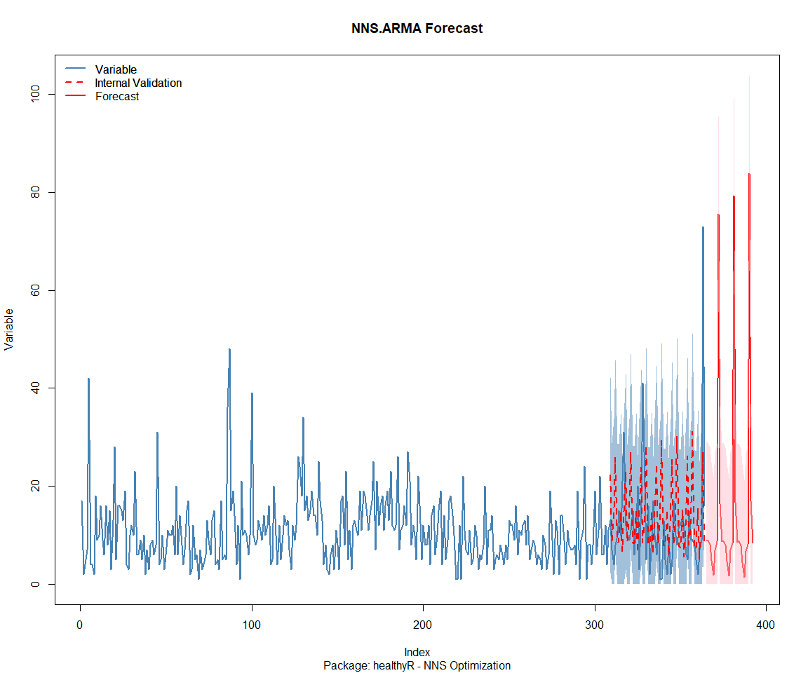
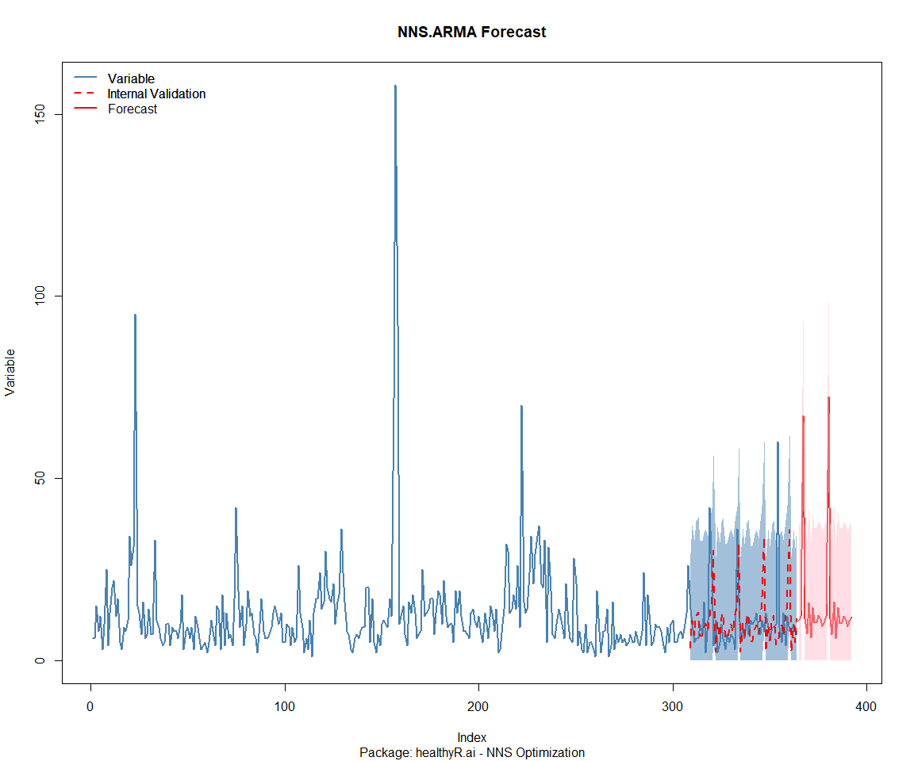
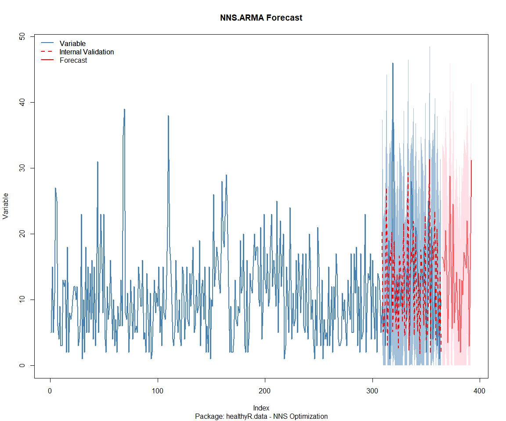
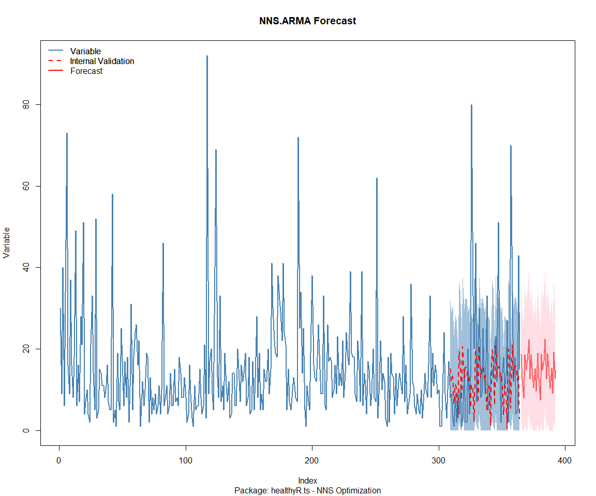
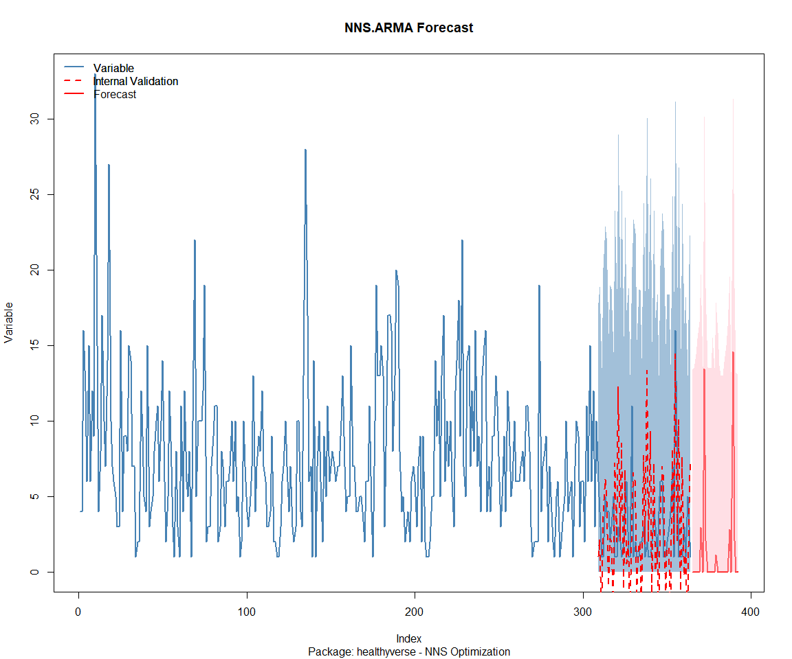
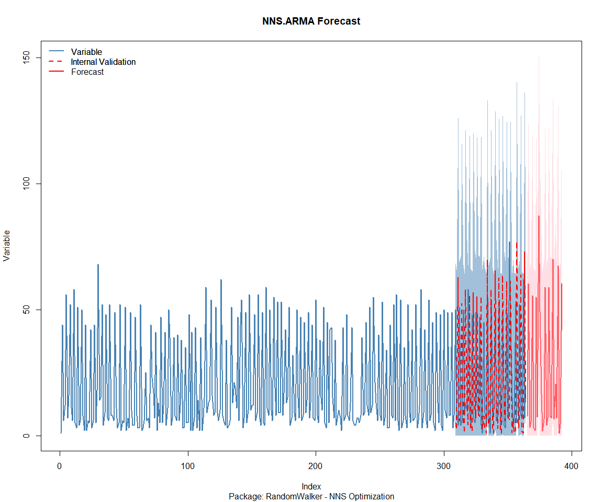
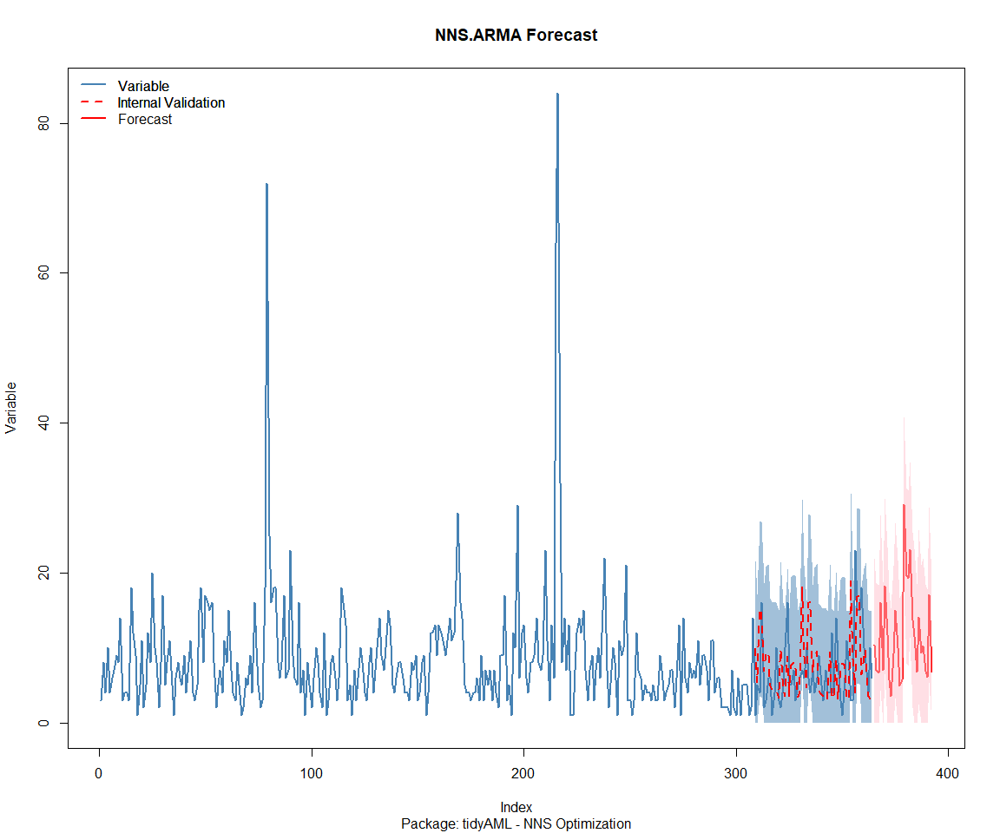
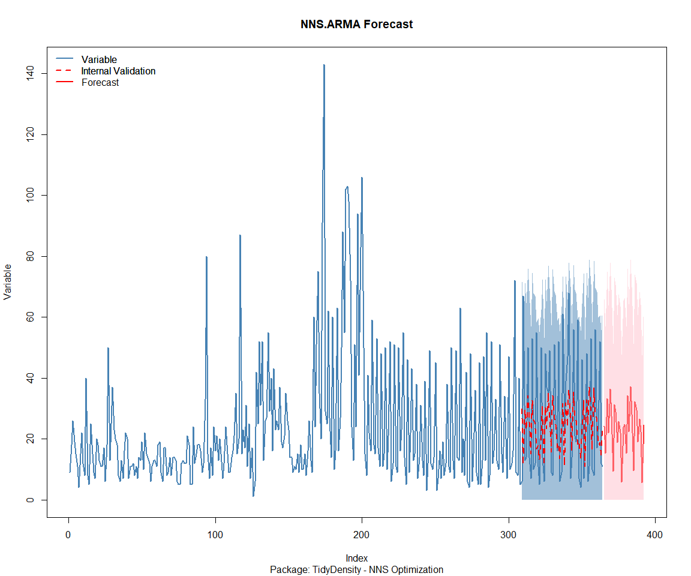

Time Series Analysis and Nested Modeling of the Healthyverse Packages
================
Steven P. Sanderson II, MPH - Date:
01 May, 2025

This analysis follows a *Nested Modeltime Workflow*.

## Get Data

``` r
glimpse(downloads_tbl)
```

    ## Rows: 138,632
    ## Columns: 11
    ## $ date      <date> 2020-11-23, 2020-11-23, 2020-11-23, 2020-11-23, 2020-11-23,…
    ## $ time      <Period> 15H 36M 55S, 11H 26M 39S, 23H 34M 44S, 18H 39M 32S, 9H 0M…
    ## $ date_time <dttm> 2020-11-23 15:36:55, 2020-11-23 11:26:39, 2020-11-23 23:34:…
    ## $ size      <int> 4858294, 4858294, 4858301, 4858295, 361, 4863722, 4864794, 4…
    ## $ r_version <chr> NA, "4.0.3", "3.5.3", "3.5.2", NA, NA, NA, NA, NA, NA, NA, N…
    ## $ r_arch    <chr> NA, "x86_64", "x86_64", "x86_64", NA, NA, NA, NA, NA, NA, NA…
    ## $ r_os      <chr> NA, "mingw32", "mingw32", "linux-gnu", NA, NA, NA, NA, NA, N…
    ## $ package   <chr> "healthyR.data", "healthyR.data", "healthyR.data", "healthyR…
    ## $ version   <chr> "1.0.0", "1.0.0", "1.0.0", "1.0.0", "1.0.0", "1.0.0", "1.0.0…
    ## $ country   <chr> "US", "US", "US", "GB", "US", "US", "DE", "HK", "JP", "US", …
    ## $ ip_id     <int> 2069, 2804, 78827, 27595, 90474, 90474, 42435, 74, 7655, 638…

The last day in the data set is 2025-04-29 23:50:12, the file was
birthed on: 2024-08-07 07:35:44, and at report knit time is -6372.24
hours old. Happy analyzing!

Now that we have our data lets take a look at it using the `skimr`
package.

``` r
skim(downloads_tbl)
```

|                                                  |               |
|:-------------------------------------------------|:--------------|
| Name                                             | downloads_tbl |
| Number of rows                                   | 138632        |
| Number of columns                                | 11            |
| \_\_\_\_\_\_\_\_\_\_\_\_\_\_\_\_\_\_\_\_\_\_\_   |               |
| Column type frequency:                           |               |
| character                                        | 6             |
| Date                                             | 1             |
| numeric                                          | 2             |
| POSIXct                                          | 1             |
| Timespan                                         | 1             |
| \_\_\_\_\_\_\_\_\_\_\_\_\_\_\_\_\_\_\_\_\_\_\_\_ |               |
| Group variables                                  | None          |

Data summary

**Variable type: character**

| skim_variable | n_missing | complete_rate | min | max | empty | n_unique | whitespace |
|:--------------|----------:|--------------:|----:|----:|------:|---------:|-----------:|
| r_version     |     99842 |          0.28 |   5 |   5 |     0 |       46 |          0 |
| r_arch        |     99842 |          0.28 |   3 |   7 |     0 |        5 |          0 |
| r_os          |     99842 |          0.28 |   7 |  15 |     0 |       22 |          0 |
| package       |         0 |          1.00 |   7 |  13 |     0 |        8 |          0 |
| version       |         0 |          1.00 |   5 |  17 |     0 |       60 |          0 |
| country       |     11746 |          0.92 |   2 |   2 |     0 |      163 |          0 |

**Variable type: Date**

| skim_variable | n_missing | complete_rate | min | max | median | n_unique |
|:---|---:|---:|:---|:---|:---|---:|
| date | 0 | 1 | 2020-11-23 | 2025-04-29 | 2023-06-13 | 1619 |

**Variable type: numeric**

| skim_variable | n_missing | complete_rate | mean | sd | p0 | p25 | p50 | p75 | p100 | hist |
|:---|---:|---:|---:|---:|---:|---:|---:|---:|---:|:---|
| size | 0 | 1 | 1134345.36 | 1520523.69 | 355 | 14701 | 278274 | 2367755 | 5677952 | ▇▁▂▁▁ |
| ip_id | 0 | 1 | 10392.15 | 18466.31 | 1 | 291 | 3058 | 11691 | 209747 | ▇▁▁▁▁ |

**Variable type: POSIXct**

| skim_variable | n_missing | complete_rate | min | max | median | n_unique |
|:---|---:|---:|:---|:---|:---|---:|
| date_time | 0 | 1 | 2020-11-23 09:00:41 | 2025-04-29 23:50:12 | 2023-06-13 07:26:48 | 84550 |

**Variable type: Timespan**

| skim_variable | n_missing | complete_rate | min | max | median | n_unique |
|:--------------|----------:|--------------:|----:|----:|-------:|---------:|
| time          |         0 |             1 |   0 |  59 |     26 |       60 |

We can see that the following columns are missing a lot of data and for
us are most likely not useful anyways, so we will drop them
`c(r_version, r_arch, r_os)`

## Plots

Now lets take a look at a time-series plot of the total daily downloads
by package. We will use a log scale and place a vertical line at each
version release for each package.

<!-- --><!-- -->

Now lets take a look at some time series decomposition graphs.

<!-- --><!-- --><!-- --><!-- -->

## Feature Engineering

Now that we have our basic data and a shot of what it looks like, let’s
add some features to our data which can be very helpful in modeling.
Lets start by making a `tibble` that is aggregated by the day and
package, as we are going to be interested in forecasting the next 4
weeks or 28 days for each package. First lets get our base data.

    ## 
    ## Call:
    ## stats::lm(formula = .formula, data = df)
    ## 
    ## Residuals:
    ##     Min      1Q  Median      3Q     Max 
    ## -146.82  -35.69  -10.83   26.60  814.79 
    ## 
    ## Coefficients:
    ##                                                      Estimate Std. Error
    ## (Intercept)                                        -192.28164   71.64565
    ## date                                                  0.01168    0.00380
    ## lag(value, 1)                                         0.10326    0.02467
    ## lag(value, 7)                                         0.09586    0.02555
    ## lag(value, 14)                                        0.09312    0.02558
    ## lag(value, 21)                                        0.06841    0.02573
    ## lag(value, 28)                                        0.06564    0.02562
    ## lag(value, 35)                                        0.06775    0.02577
    ## lag(value, 42)                                        0.04809    0.02584
    ## lag(value, 49)                                        0.06692    0.02569
    ## month(date, label = TRUE).L                         -10.26636    5.13272
    ## month(date, label = TRUE).Q                           2.67841    5.19583
    ## month(date, label = TRUE).C                         -12.20292    5.18617
    ## month(date, label = TRUE)^4                          -6.62585    5.20059
    ## month(date, label = TRUE)^5                         -12.41834    5.19844
    ## month(date, label = TRUE)^6                          -3.02184    5.24095
    ## month(date, label = TRUE)^7                          -6.30191    5.17087
    ## month(date, label = TRUE)^8                          -4.52963    5.16664
    ## month(date, label = TRUE)^9                           5.45196    5.15376
    ## month(date, label = TRUE)^10                          4.50262    5.24008
    ## month(date, label = TRUE)^11                         -5.86169    5.33523
    ## fourier_vec(date, type = "sin", K = 1, period = 7)  -11.59220    2.37405
    ## fourier_vec(date, type = "cos", K = 1, period = 7)    8.35669    2.49973
    ##                                                    t value Pr(>|t|)    
    ## (Intercept)                                         -2.684 0.007357 ** 
    ## date                                                 3.073 0.002157 ** 
    ## lag(value, 1)                                        4.186 3.00e-05 ***
    ## lag(value, 7)                                        3.751 0.000182 ***
    ## lag(value, 14)                                       3.640 0.000282 ***
    ## lag(value, 21)                                       2.659 0.007924 ** 
    ## lag(value, 28)                                       2.562 0.010508 *  
    ## lag(value, 35)                                       2.629 0.008642 ** 
    ## lag(value, 42)                                       1.861 0.062898 .  
    ## lag(value, 49)                                       2.605 0.009280 ** 
    ## month(date, label = TRUE).L                         -2.000 0.045656 *  
    ## month(date, label = TRUE).Q                          0.515 0.606284    
    ## month(date, label = TRUE).C                         -2.353 0.018749 *  
    ## month(date, label = TRUE)^4                         -1.274 0.202834    
    ## month(date, label = TRUE)^5                         -2.389 0.017020 *  
    ## month(date, label = TRUE)^6                         -0.577 0.564306    
    ## month(date, label = TRUE)^7                         -1.219 0.223131    
    ## month(date, label = TRUE)^8                         -0.877 0.380782    
    ## month(date, label = TRUE)^9                          1.058 0.290284    
    ## month(date, label = TRUE)^10                         0.859 0.390328    
    ## month(date, label = TRUE)^11                        -1.099 0.272080    
    ## fourier_vec(date, type = "sin", K = 1, period = 7)  -4.883 1.15e-06 ***
    ## fourier_vec(date, type = "cos", K = 1, period = 7)   3.343 0.000848 ***
    ## ---
    ## Signif. codes:  0 '***' 0.001 '**' 0.01 '*' 0.05 '.' 0.1 ' ' 1
    ## 
    ## Residual standard error: 58.83 on 1547 degrees of freedom
    ##   (49 observations deleted due to missingness)
    ## Multiple R-squared:  0.2445, Adjusted R-squared:  0.2337 
    ## F-statistic: 22.75 on 22 and 1547 DF,  p-value: < 2.2e-16

<!-- -->

## NNS Forecasting

This is something I have been wanting to try for a while. The `NNS`
package is a great package for forecasting time series data.

[NNS GitHub](https://github.com/OVVO-Financial/NNS)

``` r
library(NNS)

data_list <- base_data |>
    select(package, value) |>
    group_split(package)

data_list |>
    imap(
        \(x, idx) {
            obj <- x
            x <- obj |> pull(value) |> tail(7*52)
            train_set_size <- length(x) - 56
            pkg <- obj |> pluck(1) |> unique()
            sf <- NNS.seas(x, modulo = 7, plot = FALSE)$periods
            
            cat(paste0("Package: ", pkg, "\n"))
            NNS.ARMA.optim(
                variable = x,
                h = 28,
                training.set = train_set_size,
                #seasonal.factor = seq(12, 60, 7),
                seasonal.factor = sf,
                pred.int = 0.95,
                plot = TRUE
            )
            title(
                sub = paste0("\n",
                             "Package: ", pkg, " - NNS Optimization")
            )
        }
    )
```

    ## Package: healthyR
    ## [1] "CURRNET METHOD: lin"
    ## [1] "COPY LATEST PARAMETERS DIRECTLY FOR NNS.ARMA() IF ERROR:"
    ## [1] "NNS.ARMA(... method =  'lin' , seasonal.factor =  c( 84 ) ...)"
    ## [1] "CURRENT lin OBJECTIVE FUNCTION = 4.18810912155369"
    ## [1] "NNS.ARMA(... method =  'lin' , seasonal.factor =  c( 84, 63 ) ...)"
    ## [1] "CURRENT lin OBJECTIVE FUNCTION = 3.99845225474924"
    ## [1] "NNS.ARMA(... method =  'lin' , seasonal.factor =  c( 84, 63, 91 ) ...)"
    ## [1] "CURRENT lin OBJECTIVE FUNCTION = 3.58935896351303"
    ## [1] "BEST method = 'lin', seasonal.factor = c( 84, 63, 91 )"
    ## [1] "BEST lin OBJECTIVE FUNCTION = 3.58935896351303"
    ## [1] "CURRNET METHOD: nonlin"
    ## [1] "COPY LATEST PARAMETERS DIRECTLY FOR NNS.ARMA() IF ERROR:"
    ## [1] "NNS.ARMA(... method =  'nonlin' , seasonal.factor =  c( 84, 63, 91 ) ...)"
    ## [1] "CURRENT nonlin OBJECTIVE FUNCTION = 4.47965509395945"
    ## [1] "BEST method = 'nonlin' PATH MEMBER = c( 84, 63, 91 )"
    ## [1] "BEST nonlin OBJECTIVE FUNCTION = 4.47965509395945"
    ## [1] "CURRNET METHOD: both"
    ## [1] "COPY LATEST PARAMETERS DIRECTLY FOR NNS.ARMA() IF ERROR:"
    ## [1] "NNS.ARMA(... method =  'both' , seasonal.factor =  c( 84, 63, 91 ) ...)"
    ## [1] "CURRENT both OBJECTIVE FUNCTION = 3.8744132329559"
    ## [1] "BEST method = 'both' PATH MEMBER = c( 84, 63, 91 )"
    ## [1] "BEST both OBJECTIVE FUNCTION = 3.8744132329559"

<!-- -->

    ## Package: healthyR.ai
    ## [1] "CURRNET METHOD: lin"
    ## [1] "COPY LATEST PARAMETERS DIRECTLY FOR NNS.ARMA() IF ERROR:"
    ## [1] "NNS.ARMA(... method =  'lin' , seasonal.factor =  c( 84 ) ...)"
    ## [1] "CURRENT lin OBJECTIVE FUNCTION = 5.71257619504978"
    ## [1] "BEST method = 'lin', seasonal.factor = c( 84 )"
    ## [1] "BEST lin OBJECTIVE FUNCTION = 5.71257619504978"
    ## [1] "CURRNET METHOD: nonlin"
    ## [1] "COPY LATEST PARAMETERS DIRECTLY FOR NNS.ARMA() IF ERROR:"
    ## [1] "NNS.ARMA(... method =  'nonlin' , seasonal.factor =  c( 84 ) ...)"
    ## [1] "CURRENT nonlin OBJECTIVE FUNCTION = 6.25256643260283"
    ## [1] "BEST method = 'nonlin' PATH MEMBER = c( 84 )"
    ## [1] "BEST nonlin OBJECTIVE FUNCTION = 6.25256643260283"
    ## [1] "CURRNET METHOD: both"
    ## [1] "COPY LATEST PARAMETERS DIRECTLY FOR NNS.ARMA() IF ERROR:"
    ## [1] "NNS.ARMA(... method =  'both' , seasonal.factor =  c( 84 ) ...)"
    ## [1] "CURRENT both OBJECTIVE FUNCTION = 6.02857614774355"
    ## [1] "BEST method = 'both' PATH MEMBER = c( 84 )"
    ## [1] "BEST both OBJECTIVE FUNCTION = 6.02857614774355"

<!-- -->

    ## Package: healthyR.data
    ## [1] "CURRNET METHOD: lin"
    ## [1] "COPY LATEST PARAMETERS DIRECTLY FOR NNS.ARMA() IF ERROR:"
    ## [1] "NNS.ARMA(... method =  'lin' , seasonal.factor =  c( 21 ) ...)"
    ## [1] "CURRENT lin OBJECTIVE FUNCTION = 3.21398322795314"
    ## [1] "NNS.ARMA(... method =  'lin' , seasonal.factor =  c( 21, 91 ) ...)"
    ## [1] "CURRENT lin OBJECTIVE FUNCTION = 2.29827731511349"
    ## [1] "BEST method = 'lin', seasonal.factor = c( 21, 91 )"
    ## [1] "BEST lin OBJECTIVE FUNCTION = 2.29827731511349"
    ## [1] "CURRNET METHOD: nonlin"
    ## [1] "COPY LATEST PARAMETERS DIRECTLY FOR NNS.ARMA() IF ERROR:"
    ## [1] "NNS.ARMA(... method =  'nonlin' , seasonal.factor =  c( 21, 91 ) ...)"
    ## [1] "CURRENT nonlin OBJECTIVE FUNCTION = 3.10942778647756"
    ## [1] "BEST method = 'nonlin' PATH MEMBER = c( 21, 91 )"
    ## [1] "BEST nonlin OBJECTIVE FUNCTION = 3.10942778647756"
    ## [1] "CURRNET METHOD: both"
    ## [1] "COPY LATEST PARAMETERS DIRECTLY FOR NNS.ARMA() IF ERROR:"
    ## [1] "NNS.ARMA(... method =  'both' , seasonal.factor =  c( 21, 91 ) ...)"
    ## [1] "CURRENT both OBJECTIVE FUNCTION = 2.53499338102027"
    ## [1] "BEST method = 'both' PATH MEMBER = c( 21, 91 )"
    ## [1] "BEST both OBJECTIVE FUNCTION = 2.53499338102027"

<!-- -->

    ## Package: healthyR.ts
    ## [1] "CURRNET METHOD: lin"
    ## [1] "COPY LATEST PARAMETERS DIRECTLY FOR NNS.ARMA() IF ERROR:"
    ## [1] "NNS.ARMA(... method =  'lin' , seasonal.factor =  c( 63 ) ...)"
    ## [1] "CURRENT lin OBJECTIVE FUNCTION = 4.28052280364357"
    ## [1] "NNS.ARMA(... method =  'lin' , seasonal.factor =  c( 63, 91 ) ...)"
    ## [1] "CURRENT lin OBJECTIVE FUNCTION = 4.1547672508555"
    ## [1] "BEST method = 'lin', seasonal.factor = c( 63, 91 )"
    ## [1] "BEST lin OBJECTIVE FUNCTION = 4.1547672508555"
    ## [1] "CURRNET METHOD: nonlin"
    ## [1] "COPY LATEST PARAMETERS DIRECTLY FOR NNS.ARMA() IF ERROR:"
    ## [1] "NNS.ARMA(... method =  'nonlin' , seasonal.factor =  c( 63, 91 ) ...)"
    ## [1] "CURRENT nonlin OBJECTIVE FUNCTION = 5.9108118546542"
    ## [1] "BEST method = 'nonlin' PATH MEMBER = c( 63, 91 )"
    ## [1] "BEST nonlin OBJECTIVE FUNCTION = 5.9108118546542"
    ## [1] "CURRNET METHOD: both"
    ## [1] "COPY LATEST PARAMETERS DIRECTLY FOR NNS.ARMA() IF ERROR:"
    ## [1] "NNS.ARMA(... method =  'both' , seasonal.factor =  c( 63, 91 ) ...)"
    ## [1] "CURRENT both OBJECTIVE FUNCTION = 4.87245195979384"
    ## [1] "BEST method = 'both' PATH MEMBER = c( 63, 91 )"
    ## [1] "BEST both OBJECTIVE FUNCTION = 4.87245195979384"

<!-- -->

    ## Package: healthyverse
    ## [1] "CURRNET METHOD: lin"
    ## [1] "COPY LATEST PARAMETERS DIRECTLY FOR NNS.ARMA() IF ERROR:"
    ## [1] "NNS.ARMA(... method =  'lin' , seasonal.factor =  c( 35 ) ...)"
    ## [1] "CURRENT lin OBJECTIVE FUNCTION = 5.97062879001639"
    ## [1] "BEST method = 'lin', seasonal.factor = c( 35 )"
    ## [1] "BEST lin OBJECTIVE FUNCTION = 5.97062879001639"
    ## [1] "CURRNET METHOD: nonlin"
    ## [1] "COPY LATEST PARAMETERS DIRECTLY FOR NNS.ARMA() IF ERROR:"
    ## [1] "NNS.ARMA(... method =  'nonlin' , seasonal.factor =  c( 35 ) ...)"
    ## [1] "CURRENT nonlin OBJECTIVE FUNCTION = 13.6137608048039"
    ## [1] "BEST method = 'nonlin' PATH MEMBER = c( 35 )"
    ## [1] "BEST nonlin OBJECTIVE FUNCTION = 13.6137608048039"
    ## [1] "CURRNET METHOD: both"
    ## [1] "COPY LATEST PARAMETERS DIRECTLY FOR NNS.ARMA() IF ERROR:"
    ## [1] "NNS.ARMA(... method =  'both' , seasonal.factor =  c( 35 ) ...)"
    ## [1] "CURRENT both OBJECTIVE FUNCTION = 9.70239423475104"
    ## [1] "BEST method = 'both' PATH MEMBER = c( 35 )"
    ## [1] "BEST both OBJECTIVE FUNCTION = 9.70239423475104"

<!-- -->

    ## Package: RandomWalker
    ## [1] "CURRNET METHOD: lin"
    ## [1] "COPY LATEST PARAMETERS DIRECTLY FOR NNS.ARMA() IF ERROR:"
    ## [1] "NNS.ARMA(... method =  'lin' , seasonal.factor =  c( 42 ) ...)"
    ## [1] "CURRENT lin OBJECTIVE FUNCTION = 2.83609737175972"
    ## [1] "BEST method = 'lin', seasonal.factor = c( 42 )"
    ## [1] "BEST lin OBJECTIVE FUNCTION = 2.83609737175972"
    ## [1] "CURRNET METHOD: nonlin"
    ## [1] "COPY LATEST PARAMETERS DIRECTLY FOR NNS.ARMA() IF ERROR:"
    ## [1] "NNS.ARMA(... method =  'nonlin' , seasonal.factor =  c( 42 ) ...)"
    ## [1] "CURRENT nonlin OBJECTIVE FUNCTION = 4.36676464596489"
    ## [1] "BEST method = 'nonlin' PATH MEMBER = c( 42 )"
    ## [1] "BEST nonlin OBJECTIVE FUNCTION = 4.36676464596489"
    ## [1] "CURRNET METHOD: both"
    ## [1] "COPY LATEST PARAMETERS DIRECTLY FOR NNS.ARMA() IF ERROR:"
    ## [1] "NNS.ARMA(... method =  'both' , seasonal.factor =  c( 42 ) ...)"
    ## [1] "CURRENT both OBJECTIVE FUNCTION = 3.36581736957978"
    ## [1] "BEST method = 'both' PATH MEMBER = c( 42 )"
    ## [1] "BEST both OBJECTIVE FUNCTION = 3.36581736957978"

<!-- -->

    ## Package: tidyAML
    ## [1] "CURRNET METHOD: lin"
    ## [1] "COPY LATEST PARAMETERS DIRECTLY FOR NNS.ARMA() IF ERROR:"
    ## [1] "NNS.ARMA(... method =  'lin' , seasonal.factor =  c( 28 ) ...)"
    ## [1] "CURRENT lin OBJECTIVE FUNCTION = 3.73787738601405"
    ## [1] "BEST method = 'lin', seasonal.factor = c( 28 )"
    ## [1] "BEST lin OBJECTIVE FUNCTION = 3.73787738601405"
    ## [1] "CURRNET METHOD: nonlin"
    ## [1] "COPY LATEST PARAMETERS DIRECTLY FOR NNS.ARMA() IF ERROR:"
    ## [1] "NNS.ARMA(... method =  'nonlin' , seasonal.factor =  c( 28 ) ...)"
    ## [1] "CURRENT nonlin OBJECTIVE FUNCTION = 4.0071792186431"
    ## [1] "BEST method = 'nonlin' PATH MEMBER = c( 28 )"
    ## [1] "BEST nonlin OBJECTIVE FUNCTION = 4.0071792186431"
    ## [1] "CURRNET METHOD: both"
    ## [1] "COPY LATEST PARAMETERS DIRECTLY FOR NNS.ARMA() IF ERROR:"
    ## [1] "NNS.ARMA(... method =  'both' , seasonal.factor =  c( 28 ) ...)"
    ## [1] "CURRENT both OBJECTIVE FUNCTION = 3.45981832650053"
    ## [1] "BEST method = 'both' PATH MEMBER = c( 28 )"
    ## [1] "BEST both OBJECTIVE FUNCTION = 3.45981832650053"

<!-- -->

    ## Package: TidyDensity
    ## [1] "CURRNET METHOD: lin"
    ## [1] "COPY LATEST PARAMETERS DIRECTLY FOR NNS.ARMA() IF ERROR:"
    ## [1] "NNS.ARMA(... method =  'lin' , seasonal.factor =  c( 28 ) ...)"
    ## [1] "CURRENT lin OBJECTIVE FUNCTION = 3.34464900587809"
    ## [1] "NNS.ARMA(... method =  'lin' , seasonal.factor =  c( 28, 63 ) ...)"
    ## [1] "CURRENT lin OBJECTIVE FUNCTION = 3.06805830635664"
    ## [1] "NNS.ARMA(... method =  'lin' , seasonal.factor =  c( 28, 63, 84 ) ...)"
    ## [1] "CURRENT lin OBJECTIVE FUNCTION = 2.80985719558089"
    ## [1] "NNS.ARMA(... method =  'lin' , seasonal.factor =  c( 28, 63, 84, 35 ) ...)"
    ## [1] "CURRENT lin OBJECTIVE FUNCTION = 2.75230608157272"
    ## [1] "BEST method = 'lin', seasonal.factor = c( 28, 63, 84, 35 )"
    ## [1] "BEST lin OBJECTIVE FUNCTION = 2.75230608157272"
    ## [1] "CURRNET METHOD: nonlin"
    ## [1] "COPY LATEST PARAMETERS DIRECTLY FOR NNS.ARMA() IF ERROR:"
    ## [1] "NNS.ARMA(... method =  'nonlin' , seasonal.factor =  c( 28, 63, 84, 35 ) ...)"
    ## [1] "CURRENT nonlin OBJECTIVE FUNCTION = 4.22045769485223"
    ## [1] "BEST method = 'nonlin' PATH MEMBER = c( 28, 63, 84, 35 )"
    ## [1] "BEST nonlin OBJECTIVE FUNCTION = 4.22045769485223"
    ## [1] "CURRNET METHOD: both"
    ## [1] "COPY LATEST PARAMETERS DIRECTLY FOR NNS.ARMA() IF ERROR:"
    ## [1] "NNS.ARMA(... method =  'both' , seasonal.factor =  c( 28, 63, 84, 35 ) ...)"
    ## [1] "CURRENT both OBJECTIVE FUNCTION = 2.87021588454858"
    ## [1] "BEST method = 'both' PATH MEMBER = c( 28, 63, 84, 35 )"
    ## [1] "BEST both OBJECTIVE FUNCTION = 2.87021588454858"

<!-- -->

    ## [[1]]
    ## NULL
    ## 
    ## [[2]]
    ## NULL
    ## 
    ## [[3]]
    ## NULL
    ## 
    ## [[4]]
    ## NULL
    ## 
    ## [[5]]
    ## NULL
    ## 
    ## [[6]]
    ## NULL
    ## 
    ## [[7]]
    ## NULL
    ## 
    ## [[8]]
    ## NULL

## Pre-Processing

Now we are going to do some basic pre-processing.

``` r
data_padded_tbl <- base_data %>%
  pad_by_time(
    .date_var  = date,
    .pad_value = 0
  )

# Get log interval and standardization parameters
log_params  <- liv(data_padded_tbl$value, limit_lower = 0, offset = 1, silent = TRUE)
limit_lower <- log_params$limit_lower
limit_upper <- log_params$limit_upper
offset      <- log_params$offset

data_liv_tbl <- data_padded_tbl %>%
  # Get log interval transform
  mutate(value_trans = liv(value, limit_lower = 0, offset = 1, silent = TRUE)$log_scaled)

# Get Standardization Params
std_params <- standard_vec(data_liv_tbl$value_trans, silent = TRUE)
std_mean   <- std_params$mean
std_sd     <- std_params$sd

data_transformed_tbl <- data_liv_tbl %>%
  # get standardization
  mutate(value_trans = standard_vec(value_trans, silent = TRUE)$standard_scaled) %>%
  select(-value)
```

Since this is panel data we can follow one of two different modeling
strategies. We can search for a global model in the panel data or we can
use nested forecasting finding the best model for each of the time
series. Since we only have 5 panels, we will use nested forecasting.

To do this we will use the `nest_timeseries` and
`split_nested_timeseries` functions to create a nested `tibble`.

``` r
horizon <- 4*7

nested_data_tbl <- data_transformed_tbl %>%
    
    # 1. Extending: We'll predict n days into the future.
    extend_timeseries(
        .id_var        = package,
        .date_var      = date,
        .length_future = horizon
    ) %>%
    
    # 2. Nesting: We'll group by id, and create a future dataset
    #    that forecasts n days of extended data and
    #    an actual dataset that contains n*2 days
    nest_timeseries(
        .id_var        = package,
        .length_future = horizon
        #.length_actual = horizon*2
    ) %>%
    
   # 3. Splitting: We'll take the actual data and create splits
   #    for accuracy and confidence interval estimation of n das (test)
   #    and the rest is training data
    split_nested_timeseries(
        .length_test = horizon
    )

nested_data_tbl
```

    ## # A tibble: 8 × 4
    ##   package       .actual_data         .future_data      .splits          
    ##   <fct>         <list>               <list>            <list>           
    ## 1 healthyR.data <tibble [1,612 × 2]> <tibble [28 × 2]> <split [1584|28]>
    ## 2 healthyR      <tibble [1,605 × 2]> <tibble [28 × 2]> <split [1577|28]>
    ## 3 healthyR.ts   <tibble [1,549 × 2]> <tibble [28 × 2]> <split [1521|28]>
    ## 4 healthyverse  <tibble [1,520 × 2]> <tibble [28 × 2]> <split [1492|28]>
    ## 5 healthyR.ai   <tibble [1,344 × 2]> <tibble [28 × 2]> <split [1316|28]>
    ## 6 TidyDensity   <tibble [1,195 × 2]> <tibble [28 × 2]> <split [1167|28]>
    ## 7 tidyAML       <tibble [803 × 2]>   <tibble [28 × 2]> <split [775|28]> 
    ## 8 RandomWalker  <tibble [225 × 2]>   <tibble [28 × 2]> <split [197|28]>

Now it is time to make some recipes and models using the modeltime
workflow.

## Modeltime Workflow

### Recipe Object

``` r
recipe_base <- recipe(
  value_trans ~ date
  , data = extract_nested_test_split(nested_data_tbl)
  )

recipe_base

recipe_date <- recipe_base %>%
    step_mutate(date = as.numeric(date))
```

### Models

``` r
# Models ------------------------------------------------------------------

# Auto ARIMA --------------------------------------------------------------

model_spec_arima_no_boost <- arima_reg() %>%
  set_engine(engine = "auto_arima")

wflw_auto_arima <- workflow() %>%
  add_recipe(recipe = recipe_base) %>%
  add_model(model_spec_arima_no_boost)

# NNETAR ------------------------------------------------------------------

model_spec_nnetar <- nnetar_reg(
  mode              = "regression"
  , seasonal_period = "auto"
) %>%
  set_engine("nnetar")

wflw_nnetar <- workflow() %>%
  add_recipe(recipe = recipe_base) %>%
  add_model(model_spec_nnetar)

# TSLM --------------------------------------------------------------------

model_spec_lm <- linear_reg() %>%
  set_engine("lm")

wflw_lm <- workflow() %>%
  add_recipe(recipe = recipe_base) %>%
  add_model(model_spec_lm)

# MARS --------------------------------------------------------------------

model_spec_mars <- mars(mode = "regression") %>%
  set_engine("earth")

wflw_mars <- workflow() %>%
  add_recipe(recipe = recipe_base) %>%
  add_model(model_spec_mars)
```

### Nested Modeltime Tables

``` r
nested_modeltime_tbl <- modeltime_nested_fit(
  # Nested Data
  nested_data = nested_data_tbl,
   control = control_nested_fit(
     verbose = TRUE,
     allow_par = FALSE
   ),
  # Add workflows
  wflw_auto_arima,
  wflw_lm,
  wflw_mars,
  wflw_nnetar
)
```

``` r
nested_modeltime_tbl <- nested_modeltime_tbl[!is.na(nested_modeltime_tbl$package),]
```

### Model Accuracy

``` r
nested_modeltime_tbl %>%
  extract_nested_test_accuracy() %>%
  filter(!is.na(package)) %>%
  knitr::kable()
```

| package | .model_id | .model_desc | .type | mae | mape | mase | smape | rmse | rsq |
|:---|---:|:---|:---|---:|---:|---:|---:|---:|---:|
| healthyR.data | 1 | ARIMA | Test | 0.7045016 | 166.42164 | 0.6020804 | 132.87583 | 0.8280553 | 0.0000365 |
| healthyR.data | 2 | LM | Test | 0.7017159 | 176.84798 | 0.5996997 | 132.20351 | 0.8242261 | 0.0150489 |
| healthyR.data | 3 | EARTH | Test | 0.8590609 | 352.03066 | 0.7341697 | 121.12869 | 1.0309218 | 0.0150489 |
| healthyR.data | 4 | NNAR | Test | 0.7308275 | 109.26201 | 0.6245791 | 176.17002 | 0.8771881 | 0.0137973 |
| healthyR | 1 | ARIMA | Test | 0.5351930 | 90.70173 | 0.6532375 | 148.69939 | 0.6850755 | 0.0039261 |
| healthyR | 2 | LM | Test | 0.5501840 | 94.56199 | 0.6715350 | 170.17906 | 0.6799681 | 0.0207586 |
| healthyR | 3 | EARTH | Test | 0.5501689 | 98.12628 | 0.6715165 | 142.66388 | 0.6770643 | 0.0207586 |
| healthyR | 4 | NNAR | Test | 0.5421986 | 87.81555 | 0.6617883 | 139.21497 | 0.6827990 | 0.0108308 |
| healthyR.ts | 1 | ARIMA | Test | 0.8023707 | 103.29156 | 0.6570206 | 170.66103 | 0.9674291 | 0.0187516 |
| healthyR.ts | 2 | LM | Test | 0.8391509 | 170.77492 | 0.6871380 | 128.76646 | 1.0820168 | 0.0187516 |
| healthyR.ts | 3 | EARTH | Test | 1.1111765 | 324.94785 | 0.9098860 | 132.48771 | 1.3043040 | 0.0187516 |
| healthyR.ts | 4 | NNAR | Test | 0.7982556 | 215.79519 | 0.6536510 | 173.17311 | 0.9477092 | 0.0845464 |
| healthyverse | 1 | ARIMA | Test | 0.6813723 | 352.04086 | 0.7814817 | 112.42306 | 0.8311175 | 0.0111657 |
| healthyverse | 2 | LM | Test | 0.7158533 | 471.06207 | 0.8210288 | 109.80947 | 0.8362730 | 0.0072109 |
| healthyverse | 3 | EARTH | Test | 0.6851108 | 294.79500 | 0.7857694 | 117.91476 | 0.8592243 | 0.0072109 |
| healthyverse | 4 | NNAR | Test | 0.6611121 | 236.23420 | 0.7582448 | 117.68140 | 0.8521248 | 0.0502130 |
| healthyR.ai | 1 | ARIMA | Test | 0.8346284 | 120.04458 | 0.9091020 | 176.70608 | 1.0804417 | 0.0056269 |
| healthyR.ai | 2 | LM | Test | 0.8372290 | 125.55431 | 0.9119347 | 163.50378 | 1.0879822 | 0.3144403 |
| healthyR.ai | 3 | EARTH | Test | 0.8471294 | 134.07724 | 0.9227185 | 159.89156 | 1.1009424 | 0.3144403 |
| healthyR.ai | 4 | NNAR | Test | 0.8850805 | 156.81582 | 0.9640559 | 164.22175 | 1.1287085 | 0.0072065 |
| TidyDensity | 1 | ARIMA | Test | 0.5449228 | 320.78770 | 0.8244437 | 113.17279 | 0.6807536 | 0.0099032 |
| TidyDensity | 2 | LM | Test | 0.5923572 | 422.83795 | 0.8962099 | 105.68368 | 0.7461626 | 0.0039421 |
| TidyDensity | 3 | EARTH | Test | 0.5571788 | 287.41351 | 0.8429865 | 114.76312 | 0.6812361 | 0.0039421 |
| TidyDensity | 4 | NNAR | Test | 0.5351199 | 178.90877 | 0.8096124 | 134.75407 | 0.6856157 | 0.0289786 |
| tidyAML | 1 | ARIMA | Test | 0.6198866 | 256.25526 | 0.9284152 | 104.91510 | 0.7224647 | 0.0005294 |
| tidyAML | 2 | LM | Test | 0.6102459 | 274.91817 | 0.9139762 | 99.57885 | 0.7260334 | 0.0006775 |
| tidyAML | 3 | EARTH | Test | 0.5727997 | 169.81368 | 0.8578924 | 111.96124 | 0.6888534 | 0.0006775 |
| tidyAML | 4 | NNAR | Test | 0.6049893 | 265.68785 | 0.9061032 | 100.23939 | 0.7175445 | 0.0026360 |
| RandomWalker | 1 | ARIMA | Test | 1.3686376 | 114.98082 | 0.6267202 | 167.96603 | 1.6991473 | 0.2966751 |
| RandomWalker | 2 | LM | Test | 1.2178579 | 112.17148 | 0.5576758 | 171.90283 | 1.4523344 | 0.0001025 |
| RandomWalker | 3 | EARTH | Test | 1.2164015 | 113.20761 | 0.5570089 | 169.85210 | 1.4535615 | NA |
| RandomWalker | 4 | NNAR | Test | 1.2296862 | 206.59052 | 0.5630922 | 153.54031 | 1.3591775 | 0.1193343 |

### Plot Models

``` r
nested_modeltime_tbl %>%
  extract_nested_test_forecast() %>%
  group_by(package) %>%
  plot_modeltime_forecast(
    .interactive = FALSE,
    .conf_interval_show  = FALSE,
    .facet_scales = "free"
  ) +
  theme_minimal() +
  theme(legend.position = "bottom")
```

<!-- -->

### Best Model

``` r
best_nested_modeltime_tbl <- nested_modeltime_tbl %>%
  modeltime_nested_select_best(
    metric = "rmse",
    minimize = TRUE,
    filter_test_forecasts = TRUE
  )

best_nested_modeltime_tbl %>%
  extract_nested_best_model_report()
```

    ## # Nested Modeltime Table
    ## 

    ## # A tibble: 8 × 10
    ##   package      .model_id .model_desc .type   mae  mape  mase smape  rmse     rsq
    ##   <fct>            <int> <chr>       <chr> <dbl> <dbl> <dbl> <dbl> <dbl>   <dbl>
    ## 1 healthyR.da…         2 LM          Test  0.702 177.  0.600  132. 0.824 1.50e-2
    ## 2 healthyR             3 EARTH       Test  0.550  98.1 0.672  143. 0.677 2.08e-2
    ## 3 healthyR.ts          4 NNAR        Test  0.798 216.  0.654  173. 0.948 8.45e-2
    ## 4 healthyverse         1 ARIMA       Test  0.681 352.  0.781  112. 0.831 1.12e-2
    ## 5 healthyR.ai          1 ARIMA       Test  0.835 120.  0.909  177. 1.08  5.63e-3
    ## 6 TidyDensity          1 ARIMA       Test  0.545 321.  0.824  113. 0.681 9.90e-3
    ## 7 tidyAML              3 EARTH       Test  0.573 170.  0.858  112. 0.689 6.77e-4
    ## 8 RandomWalker         4 NNAR        Test  1.23  207.  0.563  154. 1.36  1.19e-1

``` r
best_nested_modeltime_tbl %>%
  extract_nested_test_forecast() %>%
  #filter(!is.na(.model_id)) %>%
  group_by(package) %>%
  plot_modeltime_forecast(
    .interactive = FALSE,
    .conf_interval_alpha = 0.2,
    .facet_scales = "free"
  ) +
  theme_minimal() +
  theme(legend.position = "bottom")
```

<!-- -->

## Refitting and Future Forecast

Now that we have the best models, we can make our future forecasts.

``` r
nested_modeltime_refit_tbl <- best_nested_modeltime_tbl %>%
    modeltime_nested_refit(
        control = control_nested_refit(verbose = TRUE)
    )
```

``` r
nested_modeltime_refit_tbl
```

    ## # Nested Modeltime Table
    ## 

    ## # A tibble: 8 × 5
    ##   package       .actual_data .future_data .splits           .modeltime_tables 
    ##   <fct>         <list>       <list>       <list>            <list>            
    ## 1 healthyR.data <tibble>     <tibble>     <split [1584|28]> <mdl_tm_t [1 × 5]>
    ## 2 healthyR      <tibble>     <tibble>     <split [1577|28]> <mdl_tm_t [1 × 5]>
    ## 3 healthyR.ts   <tibble>     <tibble>     <split [1521|28]> <mdl_tm_t [1 × 5]>
    ## 4 healthyverse  <tibble>     <tibble>     <split [1492|28]> <mdl_tm_t [1 × 5]>
    ## 5 healthyR.ai   <tibble>     <tibble>     <split [1316|28]> <mdl_tm_t [1 × 5]>
    ## 6 TidyDensity   <tibble>     <tibble>     <split [1167|28]> <mdl_tm_t [1 × 5]>
    ## 7 tidyAML       <tibble>     <tibble>     <split [775|28]>  <mdl_tm_t [1 × 5]>
    ## 8 RandomWalker  <tibble>     <tibble>     <split [197|28]>  <mdl_tm_t [1 × 5]>

``` r
nested_modeltime_refit_tbl %>%
  extract_nested_future_forecast() %>%
  mutate(across(.value:.conf_hi, .fns = ~ standard_inv_vec(
    x    = .,
    mean = std_mean,
    sd   = std_sd
  )$standard_inverse_value)) %>%
  mutate(across(.value:.conf_hi, .fns = ~ liiv(
    x = .,
    limit_lower = limit_lower,
    limit_upper = limit_upper,
    offset      = offset
  )$rescaled_v)) %>%
  group_by(package) %>%
  plot_modeltime_forecast(
    .interactive = FALSE,
    .conf_interval_alpha = 0.2,
    .facet_scales = "free"
  ) +
  theme_minimal() +
  theme(legend.position = "bottom")
```

<!-- -->
