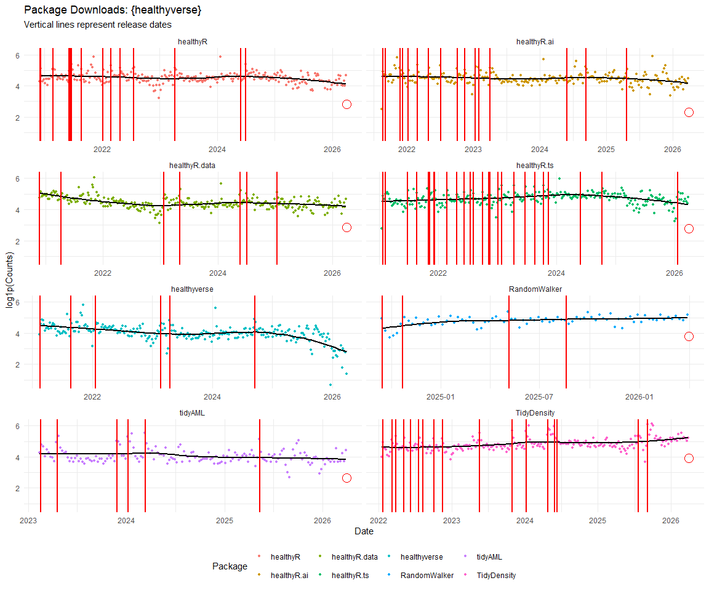
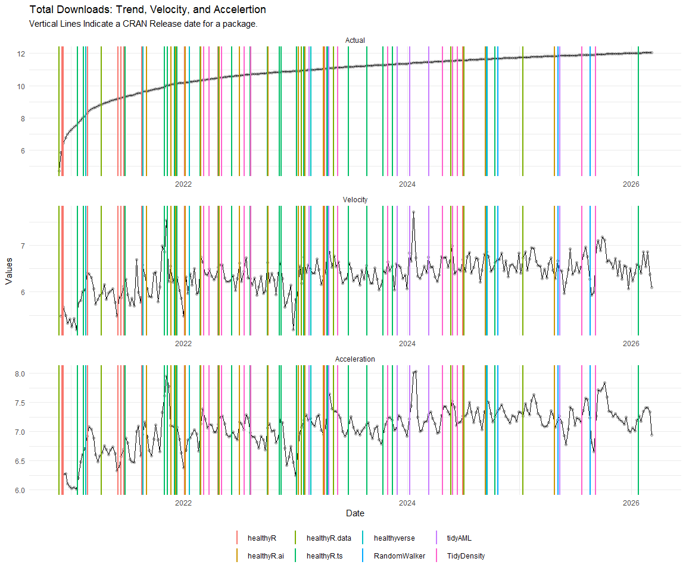
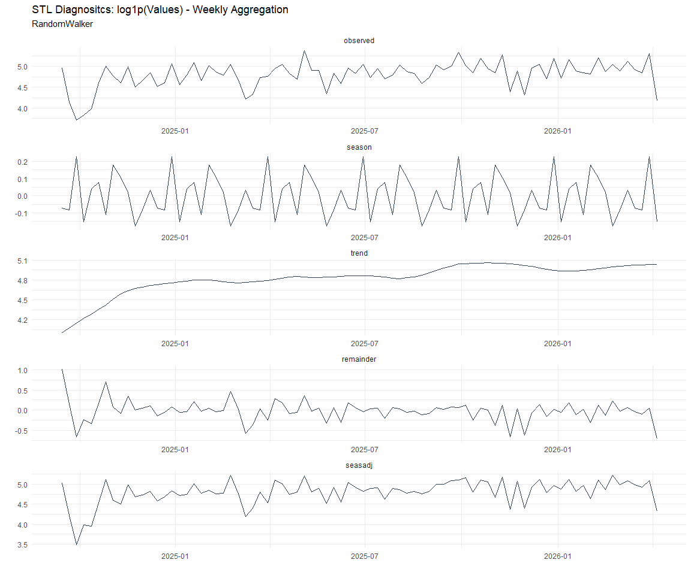
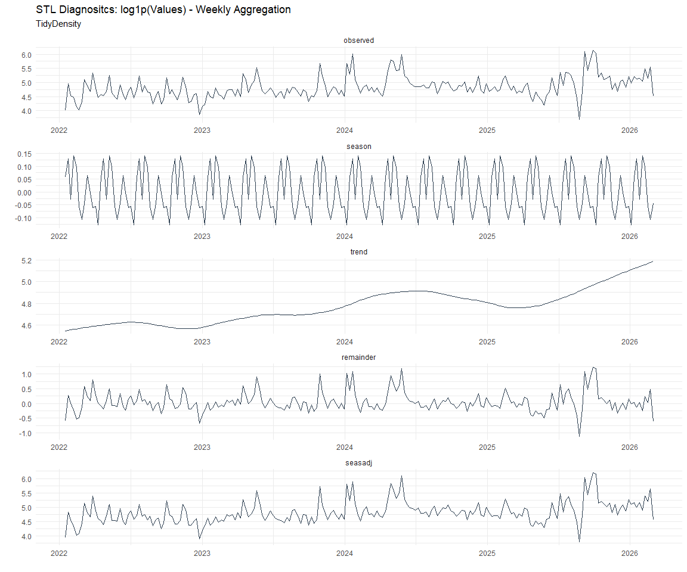
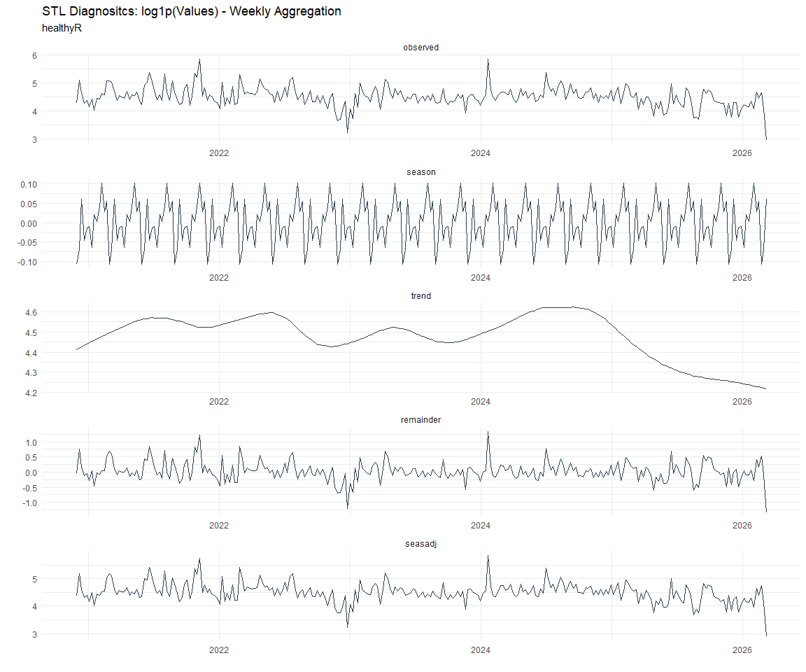
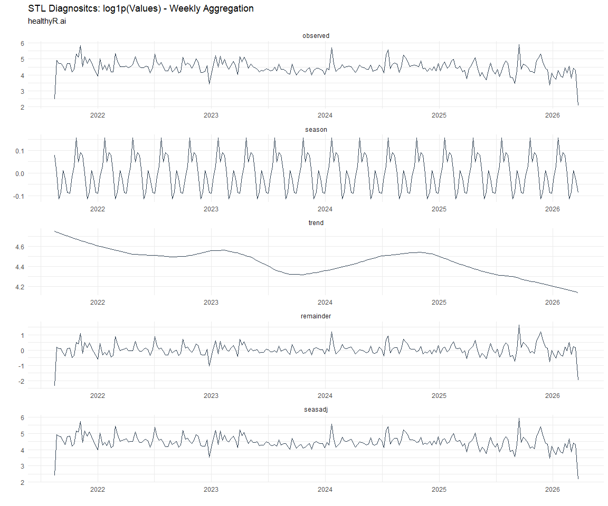
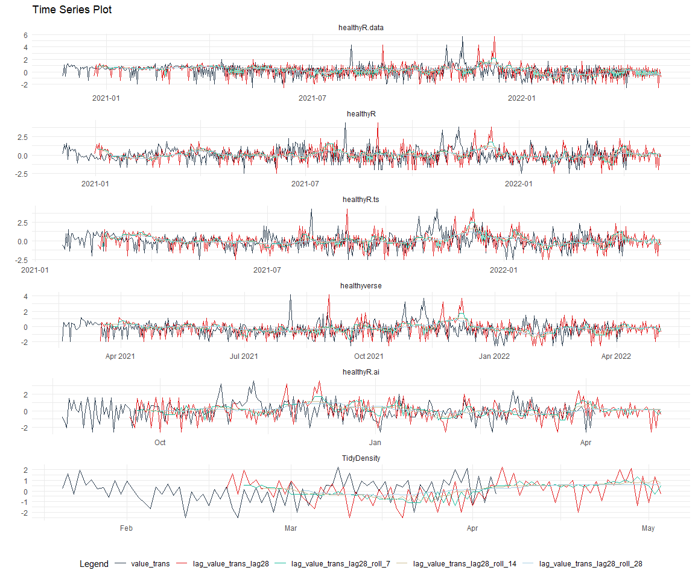
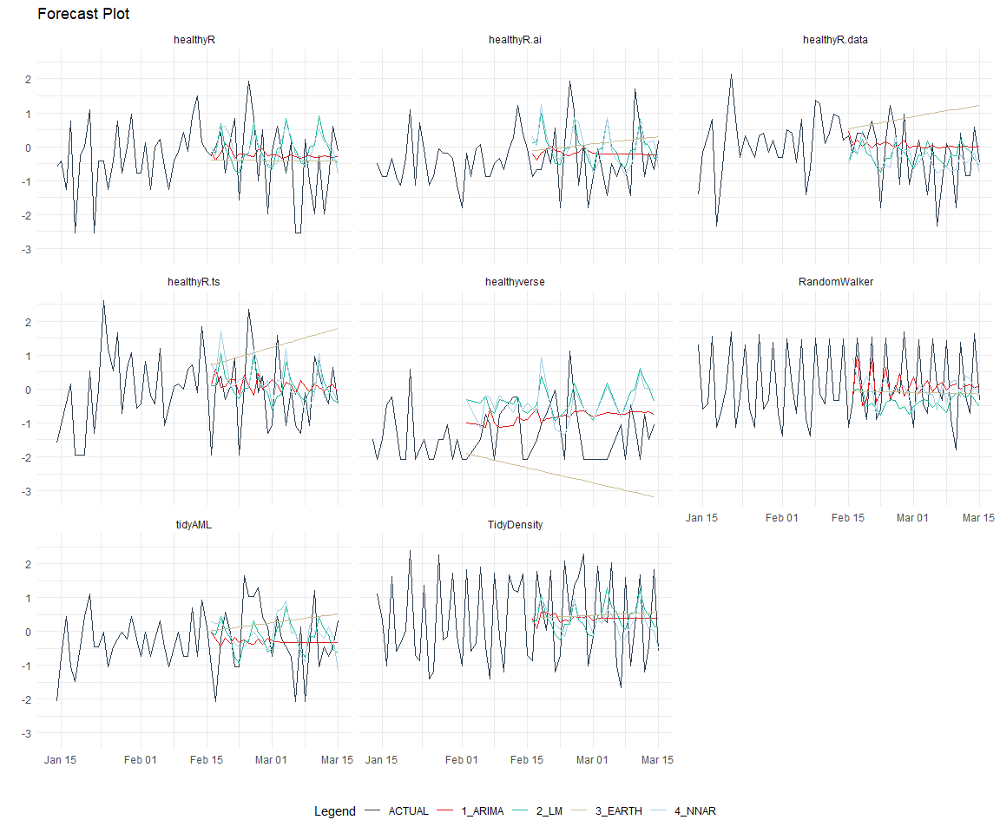
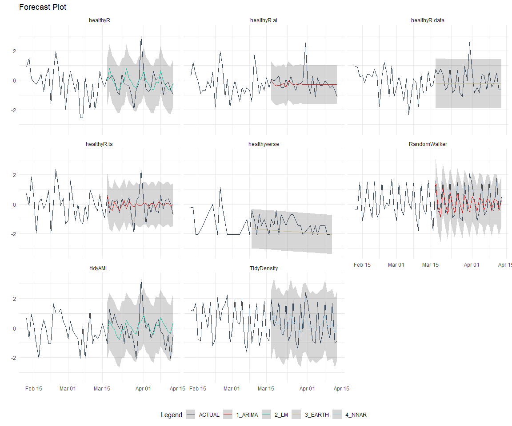
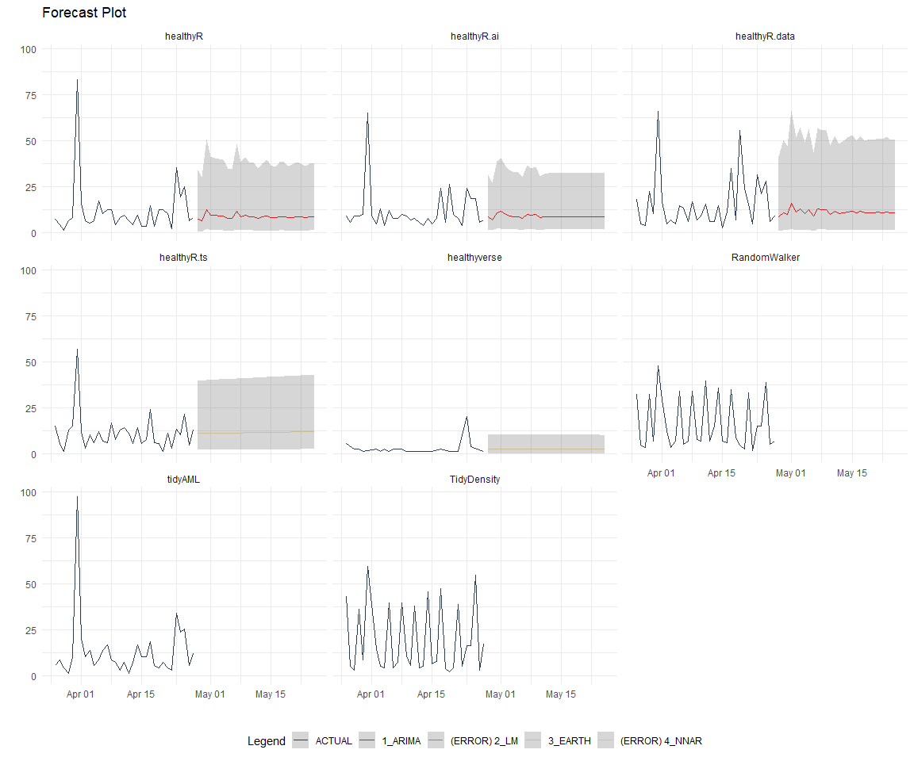

Time Series Analysis and Modeling of the Healthyverse Packages
================
Steven P. Sanderson II, MPH - Data Scientist/IT Manager
22 February, 2022

## Get Data

``` r
glimpse(downloads_tbl)
```

    ## Rows: 29,425
    ## Columns: 11
    ## $ date      <date> 2020-11-23, 2020-11-23, 2020-11-23, 2020-11-23, 2020-11-23,~
    ## $ time      <Period> 15H 36M 55S, 11H 26M 39S, 23H 34M 44S, 18H 39M 32S, 9H 0M~
    ## $ date_time <dttm> 2020-11-23 15:36:55, 2020-11-23 11:26:39, 2020-11-23 23:34:~
    ## $ size      <int> 4858294, 4858294, 4858301, 4858295, 361, 4863722, 4864794, 4~
    ## $ r_version <chr> NA, "4.0.3", "3.5.3", "3.5.2", NA, NA, NA, NA, NA, NA, NA, N~
    ## $ r_arch    <chr> NA, "x86_64", "x86_64", "x86_64", NA, NA, NA, NA, NA, NA, NA~
    ## $ r_os      <chr> NA, "mingw32", "mingw32", "linux-gnu", NA, NA, NA, NA, NA, N~
    ## $ package   <chr> "healthyR.data", "healthyR.data", "healthyR.data", "healthyR~
    ## $ version   <chr> "1.0.0", "1.0.0", "1.0.0", "1.0.0", "1.0.0", "1.0.0", "1.0.0~
    ## $ country   <chr> "US", "US", "US", "GB", "US", "US", "DE", "HK", "JP", "US", ~
    ## $ ip_id     <int> 2069, 2804, 78827, 27595, 90474, 90474, 42435, 74, 7655, 638~

The last day in the data set is 2022-02-18 22:25:01, the file was
birthed on: 2021-11-29 11:38:26, and at report knit time is -1949.78
hours old. Happy analyzing!

Now that we have our data lets take a look at it using the `skimr`
package.

``` r
skim(downloads_tbl)
```

|                                                  |                |
|:-------------------------------------------------|:---------------|
| Name                                             | downloads\_tbl |
| Number of rows                                   | 29425          |
| Number of columns                                | 11             |
| \_\_\_\_\_\_\_\_\_\_\_\_\_\_\_\_\_\_\_\_\_\_\_   |                |
| Column type frequency:                           |                |
| character                                        | 6              |
| Date                                             | 1              |
| numeric                                          | 2              |
| POSIXct                                          | 1              |
| Timespan                                         | 1              |
| \_\_\_\_\_\_\_\_\_\_\_\_\_\_\_\_\_\_\_\_\_\_\_\_ |                |
| Group variables                                  | None           |

Data summary

**Variable type: character**

| skim\_variable | n\_missing | complete\_rate | min | max | empty | n\_unique | whitespace |
|:---------------|-----------:|---------------:|----:|----:|------:|----------:|-----------:|
| r\_version     |      19565 |           0.34 |   5 |   5 |     0 |        29 |          0 |
| r\_arch        |      19565 |           0.34 |   3 |   7 |     0 |         5 |          0 |
| r\_os          |      19565 |           0.34 |   7 |  15 |     0 |        11 |          0 |
| package        |          0 |           1.00 |   8 |  13 |     0 |         6 |          0 |
| version        |          0 |           1.00 |   5 |   5 |     0 |        16 |          0 |
| country        |       2448 |           0.92 |   2 |   2 |     0 |       101 |          0 |

**Variable type: Date**

| skim\_variable | n\_missing | complete\_rate | min        | max        | median     | n\_unique |
|:---------------|-----------:|---------------:|:-----------|:-----------|:-----------|----------:|
| date           |          0 |              1 | 2020-11-23 | 2022-02-18 | 2021-08-28 |       453 |

**Variable type: numeric**

| skim\_variable | n\_missing | complete\_rate |       mean |         sd |  p0 |   p25 |    p50 |     p75 |    p100 | hist  |
|:---------------|-----------:|---------------:|-----------:|-----------:|----:|------:|-------:|--------:|--------:|:------|
| size           |          0 |              1 | 1515487.99 | 1870727.80 | 357 | 20493 | 271097 | 3247946 | 5677952 | ▇▁▂▂▁ |
| ip\_id         |          0 |              1 |    8271.81 |   15779.85 |   1 |   286 |   2742 |    8288 |  143633 | ▇▁▁▁▁ |

**Variable type: POSIXct**

| skim\_variable | n\_missing | complete\_rate | min                 | max                 | median              | n\_unique |
|:---------------|-----------:|---------------:|:--------------------|:--------------------|:--------------------|----------:|
| date\_time     |          0 |              1 | 2020-11-23 09:00:41 | 2022-02-18 22:25:01 | 2021-08-28 07:33:23 |     17159 |

**Variable type: Timespan**

| skim\_variable | n\_missing | complete\_rate | min | max |      median | n\_unique |
|:---------------|-----------:|---------------:|----:|----:|------------:|----------:|
| time           |          0 |              1 |   0 |  59 | 10H 58M 23S |        60 |

We can see that the following columns are missing a lot of data and for
us are most likely not useful anyways, so we will drop them
`c(r_version, r_arch, r_os)`

## Plots

Now lets take a look at a time-series plot of the total daily downloads
by package. We will use a log scale and place a vertical line at each
version release for each package.

<!-- --><!-- -->

Now lets take a look at some time series decomposition graphs.

<!-- --><!-- --><!-- --><!-- -->

## Feature Engineering

Now that we have our basic data and a shot of what it looks like, let’s
add some features to our data which can be very helpful in modeling.
Lets start by making a `tibble` that is aggregated by the day and
package, as we are going to be interested in forecasting the next 4
weeks or 28 days for each package. First lets get our base data.

Now we are going to do some basic pre-processing.

``` r
data_padded_tbl <- base_data %>%
  pad_by_time(
    .date_var  = date,
    .pad_value = 0
  )

# Get log interval and standardization parameters
log_params  <- liv(data_padded_tbl$value, limit_lower = 0, offset = 1, silent = TRUE)
limit_lower <- log_params$limit_lower
limit_upper <- log_params$limit_upper
offset      <- log_params$offset

data_liv_tbl <- data_padded_tbl %>%
  # Get log interval transform
  mutate(value_trans = liv(value, limit_lower = 0, offset = 1, silent = TRUE)$log_scaled)

# Get Standardization Params
std_params <- standard_vec(data_liv_tbl$value_trans, silent = TRUE)
std_mean   <- std_params$mean
std_sd     <- std_params$sd

data_transformed_tbl <- data_liv_tbl %>%
  # get standardization
  mutate(value_trans = standard_vec(value_trans, silent = TRUE)$standard_scaled) %>%
  select(-value)
```

Now that we have our full data set and saved our parameters we can
create the full data set.

``` r
horizon         <- 4*7
lag_period      <- 4*7
rolling_periods <- c(7, 14, 28)

data_prepared_full_tbl <- data_transformed_tbl %>%
  group_by(package) %>%
  
  # Add future windows
  bind_rows(
    future_frame(., .date_var = date, .length_out = horizon)
  ) %>%
  
  # Add autocorolated lags
  tk_augment_lags(value_trans, .lags = lag_period) %>%
  
  # Add rolling features
  tk_augment_slidify(
    .value     = value_trans_lag28
    , .f       = median
    , .period  = rolling_periods
    , .align   = "center"
    , .partial = TRUE
  ) %>%
  
  # Format columns
  rename_with(.cols = contains("lag"), .fn = ~ str_c("lag_", .)) %>%
  select(date, package, everything()) %>%
  ungroup()

data_prepared_full_tbl %>% 
  group_by(package) %>% 
  pivot_longer(-c(date, package)) %>% 
  plot_time_series(
    .date_var = date
    , .value = value
    , .color_var = name
    , .smooth = FALSE
    , .interactive = FALSE
    , .facet_scales = "free"
  ) +
  theme_minimal() +
  theme(legend.position = "bottom")
```

<!-- -->

Since this is panel data we can follow one of two different modeling
strategies. We can search for a global model in the panel data or we can
use nested forecasting finding the best model for each of the time
series. Since we only have 5 panels, we will use nested forecasting.

To do this we will use the `nest_timeseries` and
`split_nested_timeseries` functions to create a nested `tibble`.

``` r
data_prepared_tbl <- data_prepared_full_tbl %>%
  filter(!is.na(value_trans))

forecast_tbl <- data_prepared_full_tbl %>%
  filter(is.na(value_trans))

nested_data_tbl <- data_prepared_tbl %>%
  nest_timeseries(
    .id_var = package
    , .length_future = horizon
  ) %>%
  split_nested_timeseries(
    .length_test = horizon
  )
```

Now it is time to make some recipes and models using the modeltime
workflow.

## Modeltime Workflow

### Recipe Object

``` r
recipe_base <- recipe(
  value_trans ~ .
  , data = extract_nested_test_split(nested_data_tbl)
  ) %>%
  step_mutate(yr = lubridate::year(date)) %>%
  step_harmonic(yr, frequency = 365/12, cycle_size = 1) %>%
  step_rm(yr) %>%
  step_hai_fourier(value_trans, scale_type = "sincos", period = 365/12, order = 1) %>%
  step_lag(value_trans, lag = 1) %>%
  step_impute_knn(contains("lag_"))

recipe_base
```

    ## Recipe
    ## 
    ## Inputs:
    ## 
    ##       role #variables
    ##    outcome          1
    ##  predictor          5
    ## 
    ## Operations:
    ## 
    ## Variable mutation
    ## Harmonic numeric variables for yr
    ## Delete terms yr
    ## Fourier transformation on value_trans
    ## Lagging value_trans
    ## K-nearest neighbor imputation for contains("lag_")

### Models

``` r
# Models ------------------------------------------------------------------

# Auto ARIMA --------------------------------------------------------------

model_spec_arima_no_boost <- arima_reg() %>%
  set_engine(engine = "auto_arima")

wflw_auto_arima <- workflow() %>%
  add_recipe(recipe = recipe_base) %>%
  add_model(model_spec_arima_no_boost)

# Boosted Auto ARIMA ------------------------------------------------------

model_spec_arima_boosted <- arima_boost(
  min_n = 2
  , learn_rate = 0.015
) %>%
  set_engine(engine = "auto_arima_xgboost")

wflw_arima_boosted <- workflow() %>%
  add_recipe(recipe = recipe_base) %>%
  add_model(model_spec_arima_boosted)

# ETS ---------------------------------------------------------------------

model_spec_ets <- exp_smoothing(
  seasonal_period = "auto",
  error = "auto",
  trend = "auto",
  season = "auto",
  damping = "auto"
) %>%
  set_engine(engine = "ets") 

wflw_ets <- workflow() %>%
  add_recipe(recipe = recipe_base) %>%
  add_model(model_spec_ets)

model_spec_croston <- exp_smoothing(
  seasonal_period = "auto",
  error = "auto",
  trend = "auto",
  season = "auto",
  damping = "auto"
) %>%
  set_engine(engine = "croston")

wflw_croston <- workflow() %>%
  add_recipe(recipe = recipe_base) %>%
  add_model(model_spec_croston)

model_spec_theta <- exp_smoothing(
  seasonal_period = "auto",
  error = "auto",
  trend = "auto",
  season = "auto",
  damping = "auto"
) %>%
  set_engine(engine = "theta")

wflw_theta <- workflow() %>%
  add_recipe(recipe = recipe_base) %>%
  add_model(model_spec_theta)


# STLM ETS ----------------------------------------------------------------

model_spec_stlm_ets <- seasonal_reg(
  seasonal_period_1 = "auto",
  seasonal_period_2 = "auto",
  seasonal_period_3 = "auto"
) %>%
  set_engine("stlm_ets")

wflw_stlm_ets <- workflow() %>%
  add_recipe(recipe = recipe_base) %>%
  add_model(model_spec_stlm_ets)

model_spec_stlm_tbats <- seasonal_reg(
  seasonal_period_1 = "auto",
  seasonal_period_2 = "auto",
  seasonal_period_3 = "auto"
) %>%
  set_engine("tbats")

wflw_stlm_tbats <- workflow() %>%
  add_recipe(recipe = recipe_base) %>%
  add_model(model_spec_stlm_tbats)

model_spec_stlm_arima <- seasonal_reg(
  seasonal_period_1 = "auto",
  seasonal_period_2 = "auto",
  seasonal_period_3 = "auto"
) %>%
  set_engine("stlm_arima")

wflw_stlm_arima <- workflow() %>%
  add_recipe(recipe = recipe_base) %>%
  add_model(model_spec_stlm_arima)

# NNETAR ------------------------------------------------------------------

model_spec_nnetar <- nnetar_reg(
  mode              = "regression"
  , seasonal_period = "auto"
) %>%
  set_engine("nnetar")

wflw_nnetar <- workflow() %>%
  add_recipe(recipe = recipe_base) %>%
  add_model(model_spec_nnetar)


# Prophet -----------------------------------------------------------------

model_spec_prophet <- prophet_reg(
  seasonality_yearly = "auto",
  seasonality_weekly = "auto",
  seasonality_daily = "auto"
) %>%
  set_engine(engine = "prophet")

wflw_prophet <- workflow() %>%
  add_recipe(recipe = recipe_base) %>%
  add_model(model_spec_prophet)

model_spec_prophet_boost <- prophet_boost(
  learn_rate = 0.1
  , trees = 10
  , seasonality_yearly = FALSE
  , seasonality_weekly = FALSE
  , seasonality_daily  = FALSE
) %>% 
  set_engine("prophet_xgboost") 

wflw_prophet_boost <- workflow() %>%
  add_recipe(recipe = recipe_base) %>%
  add_model(model_spec_prophet_boost)

# TSLM --------------------------------------------------------------------

model_spec_lm <- linear_reg() %>%
  set_engine("lm")

wflw_lm <- workflow() %>%
  add_recipe(recipe = recipe_base) %>%
  add_model(model_spec_lm)

model_spec_glm <- linear_reg(
  penalty = 1,
  mixture = 0.5
) %>%
  set_engine("glmnet")

wflw_glm <- workflow() %>%
  add_recipe(recipe = recipe_base) %>%
  add_model(model_spec_glm)

# MARS --------------------------------------------------------------------

model_spec_mars <- mars(mode = "regression") %>%
  set_engine("earth")

wflw_mars <- workflow() %>%
  add_recipe(recipe = recipe_base) %>%
  add_model(model_spec_mars)

# XGBoost -----------------------------------------------------------------

model_spec_xgboost <- boost_tree(
  mode  = "regression",
  mtry  = 10,
  trees = 100,
  min_n = 5,
  tree_depth = 3,
  learn_rate = 0.3,
  loss_reduction = 0.01
) %>%
  set_engine("xgboost")

wflw_xgboost <- workflow() %>%
  add_recipe(recipe = recipe_base) %>%
  add_model(model_spec_xgboost)
```

### Nested Modeltime Tables

``` r
parallel_start(n_cores)
nested_modeltime_tbl <- modeltime_nested_fit(
  # Nested Data
  nested_data = nested_data_tbl,
  control = control_nested_fit(
    verbose = TRUE,
    allow_par = TRUE,
    cores = n_cores
  ),
  
  # Add workflows
  wflw_arima_boosted,
  wflw_auto_arima,
  wflw_croston,
  wflw_ets,
  wflw_glm,
  wflw_lm,
  wflw_mars,
  wflw_nnetar,
  wflw_prophet,
  wflw_prophet_boost,
  wflw_stlm_arima,
  wflw_stlm_ets,
  wflw_stlm_tbats,
  wflw_theta,
  wflw_xgboost
)
parallel_stop()

nested_modeltime_tbl
```

    ## # Nested Modeltime Table
    ##   # A tibble: 6 x 5
    ##   package       .actual_data     .future_data .splits          .modeltime_tables
    ##   <chr>         <list>           <list>       <list>           <list>           
    ## 1 healthyR.data <tibble>         <tibble>     <split [395|28]> <mdl_time_tbl>   
    ## 2 healthyR      <tibble>         <tibble>     <split [386|28]> <mdl_time_tbl>   
    ## 3 healthyR.ts   <tibble>         <tibble>     <split [335|28]> <mdl_time_tbl>   
    ## 4 healthyverse  <tibble>         <tibble>     <split [311|28]> <mdl_time_tbl>   
    ## 5 healthyR.ai   <tibble>         <tibble>     <split [125|28]> <mdl_time_tbl>   
    ## 6 TidyDensity   <tibble [1 x 6]> <tibble>     <split [0|1]>    <mdl_time_tbl>

### Model Accuracy

``` r
nested_modeltime_tbl %>%
  extract_nested_test_accuracy() %>%
  knitr::kable()
```

| package       | .model\_id | .model\_desc               | .type |       mae |        mape |      mase |       smape |      rmse |       rsq |
|:--------------|-----------:|:---------------------------|:------|----------:|------------:|----------:|------------:|----------:|----------:|
| healthyR.data |          1 | ARIMA                      | Test  | 0.9744569 | 292.3045123 | 0.8078280 | 146.9031766 | 1.1940354 | 0.1435503 |
| healthyR.data |          2 | REGRESSION                 | Test  | 0.0616073 |  31.2298550 | 0.0510727 |  17.8544572 | 0.0829519 | 0.9935789 |
| healthyR.data |          3 | NULL                       | NA    |        NA |          NA |        NA |          NA |        NA |        NA |
| healthyR.data |          4 | ETSANN                     | Test  | 0.8642256 | 157.7119363 | 0.7164459 | 161.3086517 | 0.9868628 |        NA |
| healthyR.data |          5 | NULL                       | NA    |        NA |          NA |        NA |          NA |        NA |        NA |
| healthyR.data |          6 | LM                         | Test  | 0.0663770 |  29.5572438 | 0.0550267 |  19.4224660 | 0.0951825 | 0.9931137 |
| healthyR.data |          7 | EARTH                      | Test  | 0.0786572 |  33.5592229 | 0.0652071 |  21.6364702 | 0.1403983 | 0.9819535 |
| healthyR.data |          8 | NNAR                       | Test  | 0.0120637 |   3.3854932 | 0.0100009 |   3.8754882 | 0.0200521 | 0.9995826 |
| healthyR.data |          9 | PROPHET W REGRESSORS       | Test  | 0.0721036 |  28.2267857 | 0.0597741 |  20.9498888 | 0.1052223 | 0.9916035 |
| healthyR.data |         10 | PROPHET W XGBOOST ERRORS   | Test  | 0.4251749 | 148.4701983 | 0.3524714 |  73.6616868 | 0.5532899 | 0.9924386 |
| healthyR.data |         11 | SEASONAL DECOMP REGRESSION | Test  | 1.1250181 | 767.5380627 | 0.9326438 | 107.6856663 | 1.3632531 | 0.3466517 |
| healthyR.data |         12 | SEASONAL DECOMP ETSANN     | Test  | 1.4266019 | 900.5931566 | 1.1826577 | 146.6934482 | 1.6362421 | 0.0043912 |
| healthyR.data |         13 | TBATS                      | Test  | 0.8340252 | 210.3925456 | 0.6914097 | 164.7955821 | 0.9446233 | 0.1216421 |
| healthyR.data |         14 | THETA METHOD               | Test  | 0.8635199 | 159.2871337 | 0.7158608 | 160.5173136 | 0.9859037 | 0.0010417 |
| healthyR.data |         15 | NULL                       | NA    |        NA |          NA |        NA |          NA |        NA |        NA |
| healthyR      |          1 | ARIMA                      | Test  | 0.8920245 | 370.5971545 | 1.0112427 | 162.6586097 | 1.0494735 | 0.4320876 |
| healthyR      |          2 | REGRESSION                 | Test  | 0.0643596 |  23.8803789 | 0.0729612 |  17.6037497 | 0.0757982 | 0.9948984 |
| healthyR      |          3 | NULL                       | NA    |        NA |          NA |        NA |          NA |        NA |        NA |
| healthyR      |          4 | ETSANA                     | Test  | 0.6258597 | 139.8905210 | 0.7095052 | 117.2736608 | 0.8544808 | 0.2288667 |
| healthyR      |          5 | NULL                       | NA    |        NA |          NA |        NA |          NA |        NA |        NA |
| healthyR      |          6 | LM                         | Test  | 0.0586761 |  20.3804900 | 0.0665181 |  17.4950603 | 0.0709756 | 0.9949163 |
| healthyR      |          7 | EARTH                      | Test  | 0.0344437 |   7.5857195 | 0.0390470 |   8.9547791 | 0.0783745 | 0.9931664 |
| healthyR      |          8 | NNAR                       | Test  | 0.0087660 |   1.7048496 | 0.0099375 |   1.8326973 | 0.0197054 | 0.9997134 |
| healthyR      |          9 | PROPHET W REGRESSORS       | Test  | 0.0632541 |  29.8017471 | 0.0717079 |  22.3898589 | 0.0767612 | 0.9939607 |
| healthyR      |         10 | PROPHET W XGBOOST ERRORS   | Test  | 0.4941202 | 261.4877243 | 0.5601589 | 106.9088766 | 0.5927801 | 0.9722650 |
| healthyR      |         11 | SEASONAL DECOMP REGRESSION | Test  | 0.9575936 | 366.6118321 | 1.0855750 | 101.5569169 | 1.2417895 | 0.5510595 |
| healthyR      |         12 | SEASONAL DECOMP ETSANN     | Test  | 1.0507712 | 429.0816322 | 1.1912057 | 125.2580948 | 1.3288649 | 0.1219299 |
| healthyR      |         13 | TBATS                      | Test  | 0.6682018 | 148.3707402 | 0.7575063 | 129.3088080 | 0.8744411 | 0.2353971 |
| healthyR      |         14 | THETA METHOD               | Test  | 0.7680056 | 189.1326429 | 0.8706488 | 147.2845789 | 0.9694595 | 0.0433206 |
| healthyR      |         15 | NULL                       | NA    |        NA |          NA |        NA |          NA |        NA |        NA |
| healthyR.ts   |          1 | ARIMA W XGBOOST ERRORS     | Test  | 1.3638468 | 777.6875673 | 1.7056907 | 176.7616681 | 1.5310783 | 0.2666404 |
| healthyR.ts   |          2 | REGRESSION                 | Test  | 0.0815872 |  52.3676731 | 0.1020368 |  21.9784241 | 0.0980760 | 0.9884302 |
| healthyR.ts   |          3 | NULL                       | NA    |        NA |          NA |        NA |          NA |        NA |        NA |
| healthyR.ts   |          4 | ETSANA                     | Test  | 0.9610833 | 455.5392134 | 1.2019758 | 164.4998454 | 1.1800570 | 0.2057549 |
| healthyR.ts   |          5 | NULL                       | NA    |        NA |          NA |        NA |          NA |        NA |        NA |
| healthyR.ts   |          6 | LM                         | Test  | 0.0724330 |  47.2229746 | 0.0905881 |  22.2283960 | 0.0879590 | 0.9888869 |
| healthyR.ts   |          7 | EARTH                      | Test  | 0.0145392 |   3.6030935 | 0.0181834 |   3.4697323 | 0.0211967 | 0.9994349 |
| healthyR.ts   |          8 | NNAR                       | Test  | 0.0152035 |   8.0812628 | 0.0190143 |   7.8175779 | 0.0300814 | 0.9989903 |
| healthyR.ts   |          9 | PROPHET W REGRESSORS       | Test  | 0.0927317 |  63.4716083 | 0.1159746 |  28.5019797 | 0.1074517 | 0.9865974 |
| healthyR.ts   |         10 | PROPHET W XGBOOST ERRORS   | Test  | 0.7348697 | 491.3516322 | 0.9190624 | 150.3881886 | 0.8130744 | 0.9744488 |
| healthyR.ts   |         11 | SEASONAL DECOMP REGRESSION | Test  | 0.9819164 | 336.6852161 | 1.2280307 |  88.9242947 | 1.3911011 | 0.5320799 |
| healthyR.ts   |         12 | SEASONAL DECOMP ETSANN     | Test  | 1.1097718 | 610.6159885 | 1.3879326 | 124.8357463 | 1.5714638 | 0.1973501 |
| healthyR.ts   |         13 | TBATS                      | Test  | 0.9976807 | 426.2479556 | 1.2477463 | 161.4484191 | 1.2195898 | 0.1316151 |
| healthyR.ts   |         14 | THETA METHOD               | Test  | 1.0686040 | 487.9876989 | 1.3364462 | 168.6999279 | 1.3163756 | 0.0019690 |
| healthyR.ts   |         15 | NULL                       | NA    |        NA |          NA |        NA |          NA |        NA |        NA |
| healthyverse  |          1 | ARIMA                      | Test  | 0.9928229 | 108.5383563 | 1.0226533 | 164.3229815 | 1.2047630 | 0.6439231 |
| healthyverse  |          2 | REGRESSION                 | Test  | 0.0612244 |   7.0741864 | 0.0630640 |   6.8922651 | 0.0871665 | 0.9906978 |
| healthyverse  |          3 | NULL                       | NA    |        NA |          NA |        NA |          NA |        NA |        NA |
| healthyverse  |          4 | ETSANA                     | Test  | 0.7679497 | 138.0823641 | 0.7910236 | 101.9157404 | 0.9245056 | 0.0360029 |
| healthyverse  |          5 | NULL                       | NA    |        NA |          NA |        NA |          NA |        NA |        NA |
| healthyverse  |          6 | LM                         | Test  | 0.0613952 |   7.5560264 | 0.0632399 |   7.5136017 | 0.0895576 | 0.9906738 |
| healthyverse  |          7 | EARTH                      | Test  | 0.0208065 |   1.8936818 | 0.0214317 |   1.8990944 | 0.0433918 | 0.9986107 |
| healthyverse  |          8 | NNAR                       | Test  | 0.0110134 |   0.6740358 | 0.0113443 |   0.6799637 | 0.0272065 | 0.9994888 |
| healthyverse  |          9 | PROPHET W REGRESSORS       | Test  | 0.0632487 |   8.3698511 | 0.0651491 |   7.8827322 | 0.0881567 | 0.9905837 |
| healthyverse  |         10 | PROPHET W XGBOOST ERRORS   | Test  | 0.6076333 |  81.0816560 | 0.6258903 | 100.1536786 | 0.7246706 | 0.9643631 |
| healthyverse  |         11 | SEASONAL DECOMP REGRESSION | Test  | 0.9027536 | 200.0525801 | 0.9298778 |  95.5516377 | 1.0884708 | 0.3871127 |
| healthyverse  |         12 | SEASONAL DECOMP ETSANN     | Test  | 1.2124315 | 255.3607007 | 1.2488603 | 136.1480574 | 1.4510472 | 0.0198036 |
| healthyverse  |         13 | TBATS                      | Test  | 0.9448688 | 111.5384502 | 0.9732584 | 144.4289971 | 1.1574143 | 0.0155387 |
| healthyverse  |         14 | THETA METHOD               | Test  | 0.7629500 | 126.1066489 | 0.7858737 |  95.5309070 | 0.9514940 | 0.0143203 |
| healthyverse  |         15 | NULL                       | NA    |        NA |          NA |        NA |          NA |        NA |        NA |
| healthyR.ai   |          1 | ARIMA W XGBOOST ERRORS     | Test  | 0.6131156 | 256.9019773 | 0.6529287 | 123.6396002 | 0.8099940 | 0.2180637 |
| healthyR.ai   |          2 | REGRESSION                 | Test  | 0.0741269 |  42.4865722 | 0.0789404 |  26.9807065 | 0.0870861 | 0.9926689 |
| healthyR.ai   |          3 | NULL                       | NA    |        NA |          NA |        NA |          NA |        NA |        NA |
| healthyR.ai   |          4 | ETSANA                     | Test  | 0.6818386 | 168.2456921 | 0.7261143 | 146.2532640 | 0.8707899 | 0.1855343 |
| healthyR.ai   |          5 | NULL                       | NA    |        NA |          NA |        NA |          NA |        NA |        NA |
| healthyR.ai   |          6 | LM                         | Test  | 0.0621318 |  23.9855280 | 0.0661664 |  20.3225798 | 0.0819552 | 0.9925616 |
| healthyR.ai   |          7 | EARTH                      | Test  | 0.0165236 |   2.4190250 | 0.0175966 |   2.3911698 | 0.0296938 | 0.9989576 |
| healthyR.ai   |          8 | NNAR                       | Test  | 0.0356095 |  15.5410059 | 0.0379218 |  12.5416360 | 0.0786704 | 0.9932376 |
| healthyR.ai   |          9 | PROPHET W REGRESSORS       | Test  | 0.0661265 |  43.1925518 | 0.0704205 |  28.8735453 | 0.0859976 | 0.9913421 |
| healthyR.ai   |         10 | PROPHET W XGBOOST ERRORS   | Test  | 0.5968861 | 492.9772143 | 0.6356454 | 132.4306860 | 0.6800999 | 0.9676578 |
| healthyR.ai   |         11 | SEASONAL DECOMP REGRESSION | Test  | 1.0187209 | 423.5472291 | 1.0848723 | 116.7404502 | 1.3317639 | 0.5223381 |
| healthyR.ai   |         12 | SEASONAL DECOMP ETSANN     | Test  | 1.0426717 | 448.8216333 | 1.1103784 | 128.0683505 | 1.3926335 | 0.1733607 |
| healthyR.ai   |         13 | TBATS                      | Test  | 0.6970532 | 251.7078147 | 0.7423168 | 157.1633845 | 0.8719271 | 0.2181260 |
| healthyR.ai   |         14 | THETA METHOD               | Test  | 0.8045305 | 223.1209729 | 0.8567732 | 164.4500294 | 1.0287573 | 0.0581271 |
| healthyR.ai   |         15 | NULL                       | NA    |        NA |          NA |        NA |          NA |        NA |        NA |
| TidyDensity   |          1 | NULL                       | NA    |        NA |          NA |        NA |          NA |        NA |        NA |
| TidyDensity   |          2 | NULL                       | NA    |        NA |          NA |        NA |          NA |        NA |        NA |
| TidyDensity   |          3 | NULL                       | NA    |        NA |          NA |        NA |          NA |        NA |        NA |
| TidyDensity   |          4 | NULL                       | NA    |        NA |          NA |        NA |          NA |        NA |        NA |
| TidyDensity   |          5 | NULL                       | NA    |        NA |          NA |        NA |          NA |        NA |        NA |
| TidyDensity   |          6 | NULL                       | NA    |        NA |          NA |        NA |          NA |        NA |        NA |
| TidyDensity   |          7 | NULL                       | NA    |        NA |          NA |        NA |          NA |        NA |        NA |
| TidyDensity   |          8 | NULL                       | NA    |        NA |          NA |        NA |          NA |        NA |        NA |
| TidyDensity   |          9 | NULL                       | NA    |        NA |          NA |        NA |          NA |        NA |        NA |
| TidyDensity   |         10 | NULL                       | NA    |        NA |          NA |        NA |          NA |        NA |        NA |
| TidyDensity   |         11 | NULL                       | NA    |        NA |          NA |        NA |          NA |        NA |        NA |
| TidyDensity   |         12 | NULL                       | NA    |        NA |          NA |        NA |          NA |        NA |        NA |
| TidyDensity   |         13 | NULL                       | NA    |        NA |          NA |        NA |          NA |        NA |        NA |
| TidyDensity   |         14 | NULL                       | NA    |        NA |          NA |        NA |          NA |        NA |        NA |
| TidyDensity   |         15 | NULL                       | NA    |        NA |          NA |        NA |          NA |        NA |        NA |

### Plot Models

``` r
nested_modeltime_tbl %>%
  extract_nested_test_forecast() %>%
  group_by(package) %>%
  plot_modeltime_forecast(
    .interactive = FALSE,
    .conf_interval_show  = FALSE,
    .facet_scales = "free"
  ) +
  theme_minimal() +
  theme(legend.position = "bottom")
```

<!-- -->

### Best Model

``` r
best_nested_modeltime_tbl <- nested_modeltime_tbl %>%
  modeltime_nested_select_best(
    metric = "rmse",
    minimize = TRUE,
    filter_test_forecasts = TRUE
  )

best_nested_modeltime_tbl %>%
  extract_nested_best_model_report()
```

    ## # Nested Modeltime Table
    ##   # A tibble: 6 x 10
    ##   package    .model_id .model_desc .type      mae   mape     mase  smape    rmse
    ##   <chr>          <int> <chr>       <chr>    <dbl>  <dbl>    <dbl>  <dbl>   <dbl>
    ## 1 healthyR.~         8 NNAR        Test   0.0121   3.39   0.0100   3.88   0.0201
    ## 2 healthyR           8 NNAR        Test   0.00877  1.70   0.00994  1.83   0.0197
    ## 3 healthyR.~         7 EARTH       Test   0.0145   3.60   0.0182   3.47   0.0212
    ## 4 healthyve~         8 NNAR        Test   0.0110   0.674  0.0113   0.680  0.0272
    ## 5 healthyR.~         7 EARTH       Test   0.0165   2.42   0.0176   2.39   0.0297
    ## 6 TidyDensi~        NA <NA>        <NA>  NA       NA     NA       NA     NA     
    ## # ... with 1 more variable: rsq <dbl>

``` r
best_nested_modeltime_tbl %>%
  extract_nested_test_forecast() %>%
  filter(!is.na(.model_id)) %>%
  group_by(package) %>%
  plot_modeltime_forecast(
    .interactive = FALSE,
    .conf_interval_alpha = 0.2,
    .facet_scales = "free"
  ) +
  theme_minimal() +
  theme(legend.position = "bottom")
```

<!-- -->

## Refitting and Future Forecast

Now that we have the best models, we can make our future forecasts.

``` r
parallel_start(n_cores)
nested_modeltime_refit_tbl <- best_nested_modeltime_tbl %>%
  modeltime_nested_refit(
    control = control_nested_refit(
      verbose = TRUE, 
      allow_par = TRUE, 
      cores = n_cores
    )
  )
parallel_stop()

nested_modeltime_refit_tbl
```

    ## # Nested Modeltime Table
    ##   # A tibble: 6 x 5
    ##   package       .actual_data     .future_data .splits          .modeltime_tables
    ##   <chr>         <list>           <list>       <list>           <list>           
    ## 1 healthyR.data <tibble>         <tibble>     <split [395|28]> <mdl_time_tbl>   
    ## 2 healthyR      <tibble>         <tibble>     <split [386|28]> <mdl_time_tbl>   
    ## 3 healthyR.ts   <tibble>         <tibble>     <split [335|28]> <mdl_time_tbl>   
    ## 4 healthyverse  <tibble>         <tibble>     <split [311|28]> <mdl_time_tbl>   
    ## 5 healthyR.ai   <tibble>         <tibble>     <split [125|28]> <mdl_time_tbl>   
    ## 6 TidyDensity   <tibble [1 x 6]> <tibble>     <split [0|1]>    <mdl_time_tbl>

``` r
nested_modeltime_refit_tbl %>%
  extract_nested_future_forecast() %>%
  mutate(across(.value:.conf_hi, .fns = ~ standard_inv_vec(
    x    = .,
    mean = std_mean,
    sd   = std_sd
  )$standard_inverse_value)) %>%
  mutate(across(.value:.conf_hi, .fns = ~ liiv(
    x = .,
    limit_lower = limit_lower,
    limit_upper = limit_upper,
    offset      = offset
  )$rescaled_v)) %>%
  group_by(package) %>%
  plot_modeltime_forecast(
    .interactive = FALSE,
    .conf_interval_alpha = 0.2,
    .facet_scales = "free"
  ) +
  theme_minimal() +
  theme(legend.position = "bottom")
```

<!-- -->
