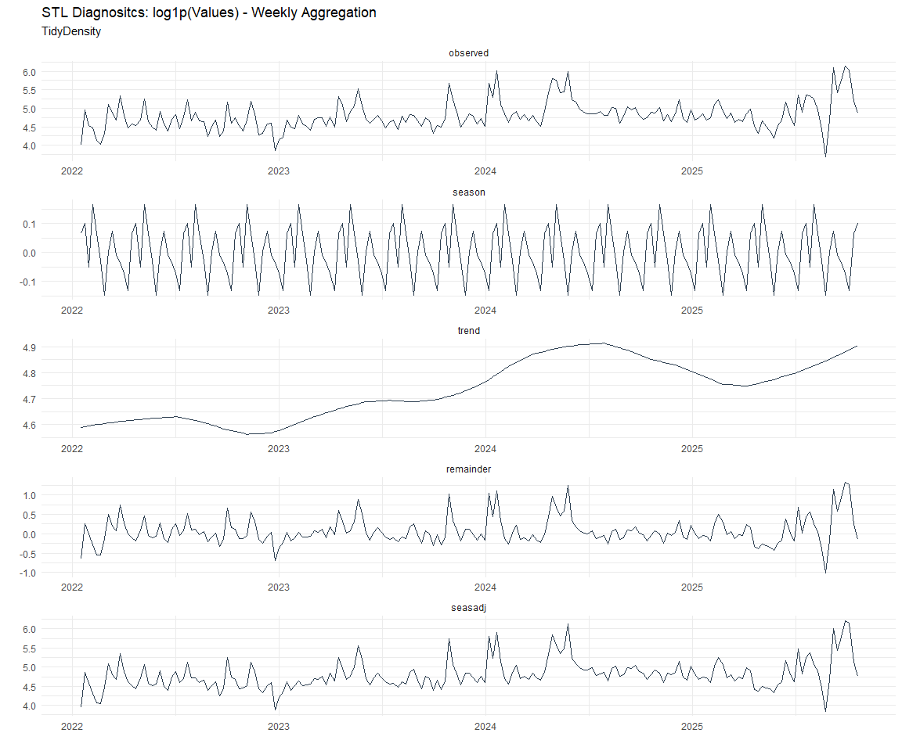

Time Series Analysis and Modeling of the Healthyverse Packages
================
Steven P. Sanderson II, MPH - Data Scientist/IT Manager
12 January, 2022

## Get Data

``` r
glimpse(downloads_tbl)
```

    ## Rows: 26,454
    ## Columns: 11
    ## $ date      <date> 2020-11-23, 2020-11-23, 2020-11-23, 2020-11-23, 2020-11-23,~
    ## $ time      <Period> 15H 36M 55S, 11H 26M 39S, 23H 34M 44S, 18H 39M 32S, 9H 0M~
    ## $ date_time <dttm> 2020-11-23 15:36:55, 2020-11-23 11:26:39, 2020-11-23 23:34:~
    ## $ size      <int> 4858294, 4858294, 4858301, 4858295, 361, 4863722, 4864794, 4~
    ## $ r_version <chr> NA, "4.0.3", "3.5.3", "3.5.2", NA, NA, NA, NA, NA, NA, NA, N~
    ## $ r_arch    <chr> NA, "x86_64", "x86_64", "x86_64", NA, NA, NA, NA, NA, NA, NA~
    ## $ r_os      <chr> NA, "mingw32", "mingw32", "linux-gnu", NA, NA, NA, NA, NA, N~
    ## $ package   <chr> "healthyR.data", "healthyR.data", "healthyR.data", "healthyR~
    ## $ version   <chr> "1.0.0", "1.0.0", "1.0.0", "1.0.0", "1.0.0", "1.0.0", "1.0.0~
    ## $ country   <chr> "US", "US", "US", "GB", "US", "US", "DE", "HK", "JP", "US", ~
    ## $ ip_id     <int> 2069, 2804, 78827, 27595, 90474, 90474, 42435, 74, 7655, 638~

The last day in the data set is 2022-01-10 19:39:21, the file was
birthed on: 2021-11-29 11:38:26, and at report knit time is -1011.02
hours old. Happy analyzing!

Now that we have our data lets take a look at it using the `skimr`
package.

``` r
skim(downloads_tbl)
```

|                                                  |                |
|:-------------------------------------------------|:---------------|
| Name                                             | downloads\_tbl |
| Number of rows                                   | 26454          |
| Number of columns                                | 11             |
| \_\_\_\_\_\_\_\_\_\_\_\_\_\_\_\_\_\_\_\_\_\_\_   |                |
| Column type frequency:                           |                |
| character                                        | 6              |
| Date                                             | 1              |
| numeric                                          | 2              |
| POSIXct                                          | 1              |
| Timespan                                         | 1              |
| \_\_\_\_\_\_\_\_\_\_\_\_\_\_\_\_\_\_\_\_\_\_\_\_ |                |
| Group variables                                  | None           |

Data summary

**Variable type: character**

| skim\_variable | n\_missing | complete\_rate | min | max | empty | n\_unique | whitespace |
|:---------------|-----------:|---------------:|----:|----:|------:|----------:|-----------:|
| r\_version     |      17669 |           0.33 |   5 |   5 |     0 |        29 |          0 |
| r\_arch        |      17669 |           0.33 |   3 |   7 |     0 |         5 |          0 |
| r\_os          |      17669 |           0.33 |   7 |  15 |     0 |        10 |          0 |
| package        |          0 |           1.00 |   8 |  13 |     0 |         5 |          0 |
| version        |          0 |           1.00 |   5 |   5 |     0 |        15 |          0 |
| country        |       2229 |           0.92 |   2 |   2 |     0 |        99 |          0 |

**Variable type: Date**

| skim\_variable | n\_missing | complete\_rate | min        | max        | median     | n\_unique |
|:---------------|-----------:|---------------:|:-----------|:-----------|:-----------|----------:|
| date           |          0 |              1 | 2020-11-23 | 2022-01-10 | 2021-08-04 |       414 |

**Variable type: numeric**

| skim\_variable | n\_missing | complete\_rate |       mean |         sd |  p0 |   p25 |    p50 |     p75 |    p100 | hist  |
|:---------------|-----------:|---------------:|-----------:|-----------:|----:|------:|-------:|--------:|--------:|:------|
| size           |          0 |              1 | 1535558.06 | 1879445.05 | 357 | 19045 | 238827 | 3246662 | 5677952 | ▇▁▂▂▁ |
| ip\_id         |          0 |              1 |    8098.26 |   15336.16 |   1 |   204 |   2823 |    8264 |  143633 | ▇▁▁▁▁ |

**Variable type: POSIXct**

| skim\_variable | n\_missing | complete\_rate | min                 | max                 | median              | n\_unique |
|:---------------|-----------:|---------------:|:--------------------|:--------------------|:--------------------|----------:|
| date\_time     |          0 |              1 | 2020-11-23 09:00:41 | 2022-01-10 19:39:21 | 2021-08-04 18:57:19 |     15456 |

**Variable type: Timespan**

| skim\_variable | n\_missing | complete\_rate | min | max | median | n\_unique |
|:---------------|-----------:|---------------:|----:|----:|-------:|----------:|
| time           |          0 |              1 |   0 |  59 |     14 |        60 |

We can see that the following columns are missing a lot of data and for
us are most likely not useful anyways, so we will drop them
`c(r_version, r_arch, r_os)`

## Plots

Now lets take a look at a time-series plot of the total daily downloads
by package. We will use a log scale and place a vertical line at each
version release for each package.

<!-- --><!-- -->

Now lets take a look at some time series decomposition graphs.

<!-- --><!-- --><!-- --><!-- -->

## Feature Engineering

Now that we have our basic data and a shot of what it looks like, let’s
add some features to our data which can be very helpful in modeling.
Lets start by making a `tibble` that is aggregated by the day and
package, as we are going to be interested in forecasting the next 4
weeks or 28 days for each package. First lets get our base data.

Now we are going to do some basic pre-processing.

``` r
data_padded_tbl <- base_data %>%
  pad_by_time(
    .date_var  = date,
    .pad_value = 0
  )

# Get log interval and standardization parameters
log_params  <- liv(data_padded_tbl$value, limit_lower = 0, offset = 1, silent = TRUE)
limit_lower <- log_params$limit_lower
limit_upper <- log_params$limit_upper
offset      <- log_params$offset

data_liv_tbl <- data_padded_tbl %>%
  # Get log interval transform
  mutate(value_trans = liv(value, limit_lower = 0, offset = 1, silent = TRUE)$log_scaled)

# Get Standardization Params
std_params <- standard_vec(data_liv_tbl$value_trans, silent = TRUE)
std_mean   <- std_params$mean
std_sd     <- std_params$sd

data_transformed_tbl <- data_liv_tbl %>%
  # get standardization
  mutate(value_trans = standard_vec(value_trans, silent = TRUE)$standard_scaled) %>%
  select(-value)
```

Now that we have our full data set and saved our parameters we can
create the full data set.

``` r
horizon         <- 4*7
lag_period      <- 4*7
rolling_periods <- c(7, 14, 28)

data_prepared_full_tbl <- data_transformed_tbl %>%
  group_by(package) %>%
  
  # Add future windows
  bind_rows(
    future_frame(., .date_var = date, .length_out = horizon)
  ) %>%
  
  # Add autocorolated lags
  tk_augment_lags(value_trans, .lags = lag_period) %>%
  
  # Add rolling features
  tk_augment_slidify(
    .value     = value_trans_lag28
    , .f       = median
    , .period  = rolling_periods
    , .align   = "center"
    , .partial = TRUE
  ) %>%
  
  # Format columns
  rename_with(.cols = contains("lag"), .fn = ~ str_c("lag_", .)) %>%
  select(date, package, everything()) %>%
  ungroup()

data_prepared_full_tbl %>% 
  group_by(package) %>% 
  pivot_longer(-c(date, package)) %>% 
  plot_time_series(
    .date_var = date
    , .value = value
    , .color_var = name
    , .smooth = FALSE
    , .interactive = FALSE
    , .facet_scales = "free"
  ) +
  theme_minimal() +
  theme(legend.position = "bottom")
```

<!-- -->

Since this is panel data we can follow one of two different modeling
strategies. We can search for a global model in the panel data or we can
use nested forecasting finding the best model for each of the time
series. Since we only have 5 panels, we will use nested forecasting.

To do this we will use the `nest_timeseries` and
`split_nested_timeseries` functions to create a nested `tibble`.

``` r
data_prepared_tbl <- data_prepared_full_tbl %>%
  filter(!is.na(value_trans))

forecast_tbl <- data_prepared_full_tbl %>%
  filter(is.na(value_trans))

nested_data_tbl <- data_prepared_tbl %>%
  nest_timeseries(
    .id_var = package
    , .length_future = horizon
  ) %>%
  split_nested_timeseries(
    .length_test = horizon
  )
```

Now it is time to make some recipes and models using the modeltime
workflow.

## Modeltime Workflow

### Recipe Object

``` r
recipe_base <- recipe(
  value_trans ~ .
  , data = extract_nested_test_split(nested_data_tbl)
  ) %>%
  step_mutate(yr = lubridate::year(date)) %>%
  step_harmonic(yr, frequency = 365/12, cycle_size = 1) %>%
  step_rm(yr) %>%
  step_hai_fourier(value_trans, scale_type = "sincos", period = 365/12, order = 1) %>%
  step_lag(value_trans, lag = 1) %>%
  step_impute_knn(contains("lag_"))

recipe_base
```

    ## Recipe
    ## 
    ## Inputs:
    ## 
    ##       role #variables
    ##    outcome          1
    ##  predictor          5
    ## 
    ## Operations:
    ## 
    ## Variable mutation
    ## Harmonic numeric variables for yr
    ## Delete terms yr
    ## Fourier transformation on value_trans
    ## Lagging value_trans
    ## K-nearest neighbor imputation for contains("lag_")

### Models

``` r
# Models ------------------------------------------------------------------

# Auto ARIMA --------------------------------------------------------------

model_spec_arima_no_boost <- arima_reg() %>%
  set_engine(engine = "auto_arima")

wflw_auto_arima <- workflow() %>%
  add_recipe(recipe = recipe_base) %>%
  add_model(model_spec_arima_no_boost)

# Boosted Auto ARIMA ------------------------------------------------------

model_spec_arima_boosted <- arima_boost(
  min_n = 2
  , learn_rate = 0.015
) %>%
  set_engine(engine = "auto_arima_xgboost")

wflw_arima_boosted <- workflow() %>%
  add_recipe(recipe = recipe_base) %>%
  add_model(model_spec_arima_boosted)

# ETS ---------------------------------------------------------------------

model_spec_ets <- exp_smoothing(
  seasonal_period = "auto",
  error = "auto",
  trend = "auto",
  season = "auto",
  damping = "auto"
) %>%
  set_engine(engine = "ets") 

wflw_ets <- workflow() %>%
  add_recipe(recipe = recipe_base) %>%
  add_model(model_spec_ets)

model_spec_croston <- exp_smoothing(
  seasonal_period = "auto",
  error = "auto",
  trend = "auto",
  season = "auto",
  damping = "auto"
) %>%
  set_engine(engine = "croston")

wflw_croston <- workflow() %>%
  add_recipe(recipe = recipe_base) %>%
  add_model(model_spec_croston)

model_spec_theta <- exp_smoothing(
  seasonal_period = "auto",
  error = "auto",
  trend = "auto",
  season = "auto",
  damping = "auto"
) %>%
  set_engine(engine = "theta")

wflw_theta <- workflow() %>%
  add_recipe(recipe = recipe_base) %>%
  add_model(model_spec_theta)


# STLM ETS ----------------------------------------------------------------

model_spec_stlm_ets <- seasonal_reg(
  seasonal_period_1 = "auto",
  seasonal_period_2 = "auto",
  seasonal_period_3 = "auto"
) %>%
  set_engine("stlm_ets")

wflw_stlm_ets <- workflow() %>%
  add_recipe(recipe = recipe_base) %>%
  add_model(model_spec_stlm_ets)

model_spec_stlm_tbats <- seasonal_reg(
  seasonal_period_1 = "auto",
  seasonal_period_2 = "auto",
  seasonal_period_3 = "auto"
) %>%
  set_engine("tbats")

wflw_stlm_tbats <- workflow() %>%
  add_recipe(recipe = recipe_base) %>%
  add_model(model_spec_stlm_tbats)

model_spec_stlm_arima <- seasonal_reg(
  seasonal_period_1 = "auto",
  seasonal_period_2 = "auto",
  seasonal_period_3 = "auto"
) %>%
  set_engine("stlm_arima")

wflw_stlm_arima <- workflow() %>%
  add_recipe(recipe = recipe_base) %>%
  add_model(model_spec_stlm_arima)

# NNETAR ------------------------------------------------------------------

model_spec_nnetar <- nnetar_reg(
  mode              = "regression"
  , seasonal_period = "auto"
) %>%
  set_engine("nnetar")

wflw_nnetar <- workflow() %>%
  add_recipe(recipe = recipe_base) %>%
  add_model(model_spec_nnetar)


# Prophet -----------------------------------------------------------------

model_spec_prophet <- prophet_reg(
  seasonality_yearly = "auto",
  seasonality_weekly = "auto",
  seasonality_daily = "auto"
) %>%
  set_engine(engine = "prophet")

wflw_prophet <- workflow() %>%
  add_recipe(recipe = recipe_base) %>%
  add_model(model_spec_prophet)

model_spec_prophet_boost <- prophet_boost(
  learn_rate = 0.1
  , trees = 10
  , seasonality_yearly = FALSE
  , seasonality_weekly = FALSE
  , seasonality_daily  = FALSE
) %>% 
  set_engine("prophet_xgboost") 

wflw_prophet_boost <- workflow() %>%
  add_recipe(recipe = recipe_base) %>%
  add_model(model_spec_prophet_boost)

# TSLM --------------------------------------------------------------------

model_spec_lm <- linear_reg() %>%
  set_engine("lm")

wflw_lm <- workflow() %>%
  add_recipe(recipe = recipe_base) %>%
  add_model(model_spec_lm)

model_spec_glm <- linear_reg(
  penalty = 1,
  mixture = 0.5
) %>%
  set_engine("glmnet")

wflw_glm <- workflow() %>%
  add_recipe(recipe = recipe_base) %>%
  add_model(model_spec_glm)

# MARS --------------------------------------------------------------------

model_spec_mars <- mars(mode = "regression") %>%
  set_engine("earth")

wflw_mars <- workflow() %>%
  add_recipe(recipe = recipe_base) %>%
  add_model(model_spec_mars)

# XGBoost -----------------------------------------------------------------

model_spec_xgboost <- boost_tree(
  mode  = "regression",
  mtry  = 10,
  trees = 100,
  min_n = 5,
  tree_depth = 3,
  learn_rate = 0.3,
  loss_reduction = 0.01
) %>%
  set_engine("xgboost")

wflw_xgboost <- workflow() %>%
  add_recipe(recipe = recipe_base) %>%
  add_model(model_spec_xgboost)
```

### Nested Modeltime Tables

``` r
parallel_start(n_cores)
nested_modeltime_tbl <- modeltime_nested_fit(
  # Nested Data
  nested_data = nested_data_tbl,
  control = control_nested_fit(
    verbose = TRUE,
    allow_par = TRUE,
    cores = n_cores
  ),
  
  # Add workflows
  wflw_arima_boosted,
  wflw_auto_arima,
  wflw_croston,
  wflw_ets,
  wflw_glm,
  wflw_lm,
  wflw_mars,
  wflw_nnetar,
  wflw_prophet,
  wflw_prophet_boost,
  wflw_stlm_arima,
  wflw_stlm_ets,
  wflw_stlm_tbats,
  wflw_theta,
  wflw_xgboost
)
parallel_stop()

nested_modeltime_tbl
```

    ## # Nested Modeltime Table
    ##   # A tibble: 5 x 5
    ##   package       .actual_data       .future_data      .splits   .modeltime_tables
    ##   <chr>         <list>             <list>            <list>    <list>           
    ## 1 healthyR.data <tibble [385 x 6]> <tibble [28 x 6]> <split [~ <mdl_time_tbl [1~
    ## 2 healthyR      <tibble [375 x 6]> <tibble [28 x 6]> <split [~ <mdl_time_tbl [1~
    ## 3 healthyR.ts   <tibble [325 x 6]> <tibble [28 x 6]> <split [~ <mdl_time_tbl [1~
    ## 4 healthyverse  <tibble [300 x 6]> <tibble [28 x 6]> <split [~ <mdl_time_tbl [1~
    ## 5 healthyR.ai   <tibble [114 x 6]> <tibble [28 x 6]> <split [~ <mdl_time_tbl [1~

### Model Accuracy

``` r
nested_modeltime_tbl %>%
  extract_nested_test_accuracy() %>%
  knitr::kable()
```

| package       | .model\_id | .model\_desc               | .type |       mae |        mape |      mase |      smape |      rmse |       rsq |
|:--------------|-----------:|:---------------------------|:------|----------:|------------:|----------:|-----------:|----------:|----------:|
| healthyR.data |          1 | ARIMA                      | Test  | 0.7107614 |  324.889190 | 0.6206958 |  98.957968 | 0.9140249 | 0.4524290 |
| healthyR.data |          2 | REGRESSION                 | Test  | 0.0833614 |   28.051139 | 0.0727981 |  27.009182 | 0.1041520 | 0.9917701 |
| healthyR.data |          3 | NULL                       | NA    |        NA |          NA |        NA |         NA |        NA |        NA |
| healthyR.data |          4 | ETSANN                     | Test  | 1.1861330 |  568.700265 | 1.0358298 | 113.094816 | 1.4457108 |        NA |
| healthyR.data |          5 | NULL                       | NA    |        NA |          NA |        NA |         NA |        NA |        NA |
| healthyR.data |          6 | LM                         | Test  | 0.1006091 |   40.455479 | 0.0878602 |  27.547055 | 0.1188320 | 0.9933139 |
| healthyR.data |          7 | EARTH                      | Test  | 0.0275324 |   10.955430 | 0.0240436 |   7.661543 | 0.0447548 | 0.9979819 |
| healthyR.data |          8 | NNAR                       | Test  | 0.0190964 |    5.409052 | 0.0166765 |   5.021771 | 0.0245227 | 0.9995584 |
| healthyR.data |          9 | PROPHET W REGRESSORS       | Test  | 0.1062570 |   40.243108 | 0.0927924 |  27.960480 | 0.1308803 | 0.9915203 |
| healthyR.data |         10 | PROPHET W XGBOOST ERRORS   | Test  | 0.5260539 |  287.129884 | 0.4593939 |  89.554369 | 0.6207239 | 0.9882470 |
| healthyR.data |         11 | SEASONAL DECOMP REGRESSION | Test  | 1.0708357 |  663.297103 | 0.9351425 | 108.298311 | 1.3196611 | 0.5652547 |
| healthyR.data |         12 | SEASONAL DECOMP ETSANN     | Test  | 1.4932285 |  397.809817 | 1.3040109 | 123.799571 | 1.8092882 | 0.1849833 |
| healthyR.data |         13 | TBATS                      | Test  | 1.1200591 |  503.429047 | 0.9781285 | 111.966961 | 1.3669059 | 0.1429027 |
| healthyR.data |         14 | THETA METHOD               | Test  | 1.1847420 |  567.977113 | 1.0346150 | 113.046077 | 1.4444418 | 0.0002596 |
| healthyR.data |         15 | NULL                       | NA    |        NA |          NA |        NA |         NA |        NA |        NA |
| healthyR      |          1 | ARIMA                      | Test  | 1.0311709 |  414.202844 | 1.0804988 | 156.653634 | 1.1024779 | 0.4008994 |
| healthyR      |          2 | REGRESSION                 | Test  | 0.0353718 |   15.237994 | 0.0370639 |  16.765047 | 0.0423379 | 0.9990524 |
| healthyR      |          3 | NULL                       | NA    |        NA |          NA |        NA |         NA |        NA |        NA |
| healthyR      |          4 | ETSANA                     | Test  | 1.2934950 |  586.571497 | 1.3553717 | 157.710728 | 1.4063089 | 0.0472436 |
| healthyR      |          5 | NULL                       | NA    |        NA |          NA |        NA |         NA |        NA |        NA |
| healthyR      |          6 | LM                         | Test  | 0.0381790 |   18.992243 | 0.0400054 |  18.203807 | 0.0473725 | 0.9990782 |
| healthyR      |          7 | EARTH                      | Test  | 0.0183984 |    5.884663 | 0.0192785 |   5.427284 | 0.0212651 | 0.9993601 |
| healthyR      |          8 | NNAR                       | Test  | 0.0648178 |    9.616489 | 0.0679185 |   9.052643 | 0.2369511 | 0.9446685 |
| healthyR      |          9 | PROPHET W REGRESSORS       | Test  | 0.0425669 |   21.338135 | 0.0446032 |  19.478734 | 0.0574922 | 0.9980804 |
| healthyR      |         10 | PROPHET W XGBOOST ERRORS   | Test  | 0.4013260 |  195.723738 | 0.4205242 | 121.475928 | 0.4628346 | 0.9961756 |
| healthyR      |         11 | SEASONAL DECOMP REGRESSION | Test  | 1.2377986 |  725.132780 | 1.2970110 | 125.702941 | 1.4984623 | 0.4942756 |
| healthyR      |         12 | SEASONAL DECOMP ETSANN     | Test  | 1.4805335 |  535.669034 | 1.5513575 | 138.482520 | 1.8810673 | 0.2177604 |
| healthyR      |         13 | TBATS                      | Test  | 0.9314474 |  357.795415 | 0.9760049 | 148.935605 | 1.0739605 | 0.0994857 |
| healthyR      |         14 | THETA METHOD               | Test  | 1.2288206 |  599.872030 | 1.2876035 | 153.161296 | 1.3709957 | 0.0422237 |
| healthyR      |         15 | NULL                       | NA    |        NA |          NA |        NA |         NA |        NA |        NA |
| healthyR.ts   |          1 | ARIMA                      | Test  | 0.7811814 |  361.726498 | 0.5008674 | 114.158586 | 0.9452680 | 0.3988632 |
| healthyR.ts   |          2 | REGRESSION                 | Test  | 0.0582234 |   57.041531 | 0.0373309 |  20.355931 | 0.0689641 | 0.9964746 |
| healthyR.ts   |          3 | NULL                       | NA    |        NA |          NA |        NA |         NA |        NA |        NA |
| healthyR.ts   |          4 | ETSANA                     | Test  | 1.4729034 | 1040.286186 | 0.9443764 | 126.399379 | 1.6776770 | 0.1251776 |
| healthyR.ts   |          5 | NULL                       | NA    |        NA |          NA |        NA |         NA |        NA |        NA |
| healthyR.ts   |          6 | LM                         | Test  | 0.0785498 |   55.793481 | 0.0503635 |  20.858404 | 0.0982199 | 0.9967828 |
| healthyR.ts   |          7 | EARTH                      | Test  | 0.0240552 |    2.780929 | 0.0154234 |   2.759082 | 0.0408633 | 0.9984008 |
| healthyR.ts   |          8 | NNAR                       | Test  | 0.0524033 |    4.610136 | 0.0335992 |   4.482922 | 0.1433905 | 0.9802875 |
| healthyR.ts   |          9 | PROPHET W REGRESSORS       | Test  | 0.1073711 |   86.448774 | 0.0688427 |  31.683827 | 0.1320455 | 0.9950723 |
| healthyR.ts   |         10 | PROPHET W XGBOOST ERRORS   | Test  | 0.3840688 |  262.040672 | 0.2462520 |  84.671822 | 0.4547520 | 0.9886896 |
| healthyR.ts   |         11 | SEASONAL DECOMP REGRESSION | Test  | 1.3488616 |  886.410773 | 0.8648449 | 125.910614 | 1.5418904 | 0.4631511 |
| healthyR.ts   |         12 | SEASONAL DECOMP ETSANN     | Test  | 1.8962466 | 1152.928939 | 1.2158099 | 133.035351 | 2.2533210 | 0.1003380 |
| healthyR.ts   |         13 | TBATS                      | Test  | 1.4886910 | 1049.776335 | 0.9544989 | 127.400843 | 1.6767079 | 0.2501963 |
| healthyR.ts   |         14 | THETA METHOD               | Test  | 1.3531498 | 1050.750738 | 0.8675944 | 120.728334 | 1.6280824 | 0.0003927 |
| healthyR.ts   |         15 | NULL                       | NA    |        NA |          NA |        NA |         NA |        NA |        NA |
| healthyverse  |          1 | ARIMA W XGBOOST ERRORS     | Test  | 1.0838971 |  607.083328 | 1.0336457 | 159.440609 | 1.2522411 | 0.4764340 |
| healthyverse  |          2 | REGRESSION                 | Test  | 0.0652266 |   30.580077 | 0.0622026 |  24.570371 | 0.0781581 | 0.9973404 |
| healthyverse  |          3 | NULL                       | NA    |        NA |          NA |        NA |         NA |        NA |        NA |
| healthyverse  |          4 | ETSANA                     | Test  | 1.3035265 |  775.054402 | 1.2430927 | 164.023591 | 1.4482089 | 0.2604280 |
| healthyverse  |          5 | NULL                       | NA    |        NA |          NA |        NA |         NA |        NA |        NA |
| healthyverse  |          6 | LM                         | Test  | 0.0689583 |   32.438761 | 0.0657612 |  25.999908 | 0.0821480 | 0.9972686 |
| healthyverse  |          7 | EARTH                      | Test  | 0.0097705 |    4.967383 | 0.0093175 |   4.462540 | 0.0141000 | 0.9997956 |
| healthyverse  |          8 | NNAR                       | Test  | 0.0076622 |   16.119430 | 0.0073069 |   6.372127 | 0.0134238 | 0.9997024 |
| healthyverse  |          9 | PROPHET W REGRESSORS       | Test  | 0.0571152 |   21.105223 | 0.0544672 |  15.688416 | 0.0692970 | 0.9969089 |
| healthyverse  |         10 | PROPHET W XGBOOST ERRORS   | Test  | 0.5745754 |  383.625271 | 0.5479371 | 135.543537 | 0.6489848 | 0.9754146 |
| healthyverse  |         11 | SEASONAL DECOMP REGRESSION | Test  | 1.1903598 |  869.129796 | 1.1351726 | 128.523978 | 1.3625281 | 0.5742147 |
| healthyverse  |         12 | SEASONAL DECOMP ETSANN     | Test  | 1.4694670 | 1012.263743 | 1.4013399 | 144.433985 | 1.8065122 | 0.2541322 |
| healthyverse  |         13 | TBATS                      | Test  | 0.8190901 |  342.371594 | 0.7811156 | 164.431594 | 0.9712305 | 0.1687700 |
| healthyverse  |         14 | THETA METHOD               | Test  | 1.2770790 |  758.943144 | 1.2178713 | 162.064016 | 1.4656904 | 0.0246922 |
| healthyverse  |         15 | NULL                       | NA    |        NA |          NA |        NA |         NA |        NA |        NA |
| healthyR.ai   |          1 | ARIMA W XGBOOST ERRORS     | Test  | 1.3123927 |  294.852680 | 0.8824850 | 123.153109 | 1.5441384 | 0.4572114 |
| healthyR.ai   |          2 | REGRESSION                 | Test  | 0.1160394 |   20.310571 | 0.0780277 |  21.863241 | 0.1338786 | 0.9969354 |
| healthyR.ai   |          3 | NULL                       | NA    |        NA |          NA |        NA |         NA |        NA |        NA |
| healthyR.ai   |          4 | ETSANN                     | Test  | 1.0521949 |  217.111502 | 0.7075216 | 115.081101 | 1.3276490 |        NA |
| healthyR.ai   |          5 | NULL                       | NA    |        NA |          NA |        NA |         NA |        NA |        NA |
| healthyR.ai   |          6 | LM                         | Test  | 0.1151312 |   20.307461 | 0.0774170 |  21.985032 | 0.1325182 | 0.9971817 |
| healthyR.ai   |          7 | EARTH                      | Test  | 0.0137589 |    1.824399 | 0.0092518 |   1.805180 | 0.0177539 | 0.9997038 |
| healthyR.ai   |          8 | NNAR                       | Test  | 0.2173455 |   25.142996 | 0.1461484 |  31.159984 | 0.2992131 | 0.9639153 |
| healthyR.ai   |          9 | PROPHET W REGRESSORS       | Test  | 0.1538346 |   26.496731 | 0.1034421 |  27.503509 | 0.1746736 | 0.9931801 |
| healthyR.ai   |         10 | PROPHET W XGBOOST ERRORS   | Test  | 1.0544993 |  234.643399 | 0.7090712 | 121.609029 | 1.1995128 | 0.8757616 |
| healthyR.ai   |         11 | SEASONAL DECOMP REGRESSION | Test  | 1.1985856 |  227.882424 | 0.8059584 | 117.207781 | 1.3805972 | 0.5387544 |
| healthyR.ai   |         12 | SEASONAL DECOMP ETSANN     | Test  | 1.5411540 |  345.080791 | 1.0363097 | 129.931739 | 1.7980780 | 0.1370379 |
| healthyR.ai   |         13 | TBATS                      | Test  | 1.1285535 |  248.369018 | 0.7588671 | 118.722789 | 1.3841710 | 0.0993206 |
| healthyR.ai   |         14 | THETA METHOD               | Test  | 1.1476120 |  247.699137 | 0.7716825 | 115.200626 | 1.4652012 | 0.0001275 |
| healthyR.ai   |         15 | NULL                       | NA    |        NA |          NA |        NA |         NA |        NA |        NA |

### Plot Models

``` r
nested_modeltime_tbl %>%
  extract_nested_test_forecast() %>%
  group_by(package) %>%
  plot_modeltime_forecast(
    .interactive = FALSE,
    .conf_interval_show  = FALSE,
    .facet_scales = "free"
  ) +
  theme_minimal() +
  theme(legend.position = "bottom")
```

<!-- -->

### Best Model

``` r
best_nested_modeltime_tbl <- nested_modeltime_tbl %>%
  modeltime_nested_select_best(
    metric = "rmse",
    minimize = TRUE,
    filter_test_forecasts = TRUE
  )

best_nested_modeltime_tbl %>%
  extract_nested_best_model_report()
```

    ## # Nested Modeltime Table
    ##   # A tibble: 5 x 10
    ##   package   .model_id .model_desc .type     mae  mape    mase smape   rmse   rsq
    ##   <chr>         <int> <chr>       <chr>   <dbl> <dbl>   <dbl> <dbl>  <dbl> <dbl>
    ## 1 healthyR~         8 NNAR        Test  0.0191   5.41 0.0167   5.02 0.0245 1.00 
    ## 2 healthyR          7 EARTH       Test  0.0184   5.88 0.0193   5.43 0.0213 0.999
    ## 3 healthyR~         7 EARTH       Test  0.0241   2.78 0.0154   2.76 0.0409 0.998
    ## 4 healthyv~         8 NNAR        Test  0.00766 16.1  0.00731  6.37 0.0134 1.00 
    ## 5 healthyR~         7 EARTH       Test  0.0138   1.82 0.00925  1.81 0.0178 1.00

``` r
best_nested_modeltime_tbl %>%
  extract_nested_test_forecast() %>%
  group_by(package) %>%
  plot_modeltime_forecast(
    .interactive = FALSE,
    .conf_interval_alpha = 0.2,
    .facet_scales = "free"
  ) +
  theme_minimal() +
  theme(legend.position = "bottom")
```

<!-- -->

## Refitting and Future Forecast

Now that we have the best models, we can make our future forecasts.

``` r
parallel_start(n_cores)
nested_modeltime_refit_tbl <- best_nested_modeltime_tbl %>%
  modeltime_nested_refit(
    control = control_nested_refit(
      verbose = TRUE, 
      allow_par = TRUE, 
      cores = n_cores
    )
  )
parallel_stop()

nested_modeltime_refit_tbl
```

    ## # Nested Modeltime Table
    ##   # A tibble: 5 x 5
    ##   package       .actual_data       .future_data      .splits   .modeltime_tables
    ##   <chr>         <list>             <list>            <list>    <list>           
    ## 1 healthyR.data <tibble [385 x 6]> <tibble [28 x 6]> <split [~ <mdl_time_tbl [1~
    ## 2 healthyR      <tibble [375 x 6]> <tibble [28 x 6]> <split [~ <mdl_time_tbl [1~
    ## 3 healthyR.ts   <tibble [325 x 6]> <tibble [28 x 6]> <split [~ <mdl_time_tbl [1~
    ## 4 healthyverse  <tibble [300 x 6]> <tibble [28 x 6]> <split [~ <mdl_time_tbl [1~
    ## 5 healthyR.ai   <tibble [114 x 6]> <tibble [28 x 6]> <split [~ <mdl_time_tbl [1~

``` r
nested_modeltime_refit_tbl %>%
  extract_nested_future_forecast() %>%
  mutate(across(.value:.conf_hi, .fns = ~ standard_inv_vec(
    x    = .,
    mean = std_mean,
    sd   = std_sd
  )$standard_inverse_value)) %>%
  mutate(across(.value:.conf_hi, .fns = ~ liiv(
    x = .,
    limit_lower = limit_lower,
    limit_upper = limit_upper,
    offset      = offset
  )$rescaled_v)) %>%
  group_by(package) %>%
  plot_modeltime_forecast(
    .interactive = FALSE,
    .conf_interval_alpha = 0.2,
    .facet_scales = "free"
  ) +
  theme_minimal() +
  theme(legend.position = "bottom")
```

<!-- -->
