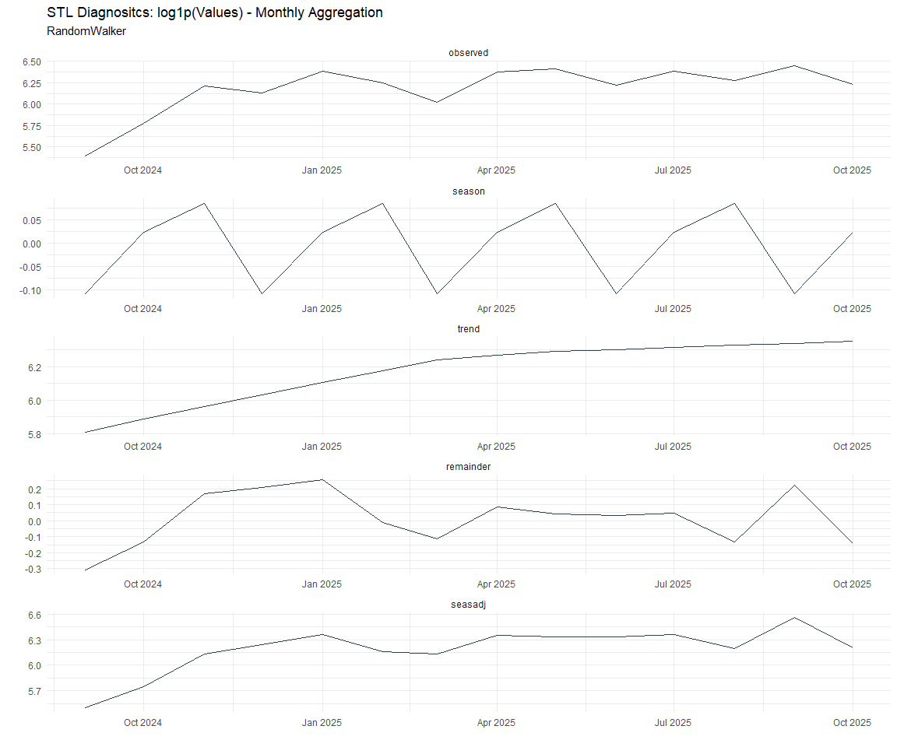

# Time Series Analysis, Modeling and Forecasting of the Healthyverse
Packages
Steven P. Sanderson II, MPH - Date:
2025-12-07

# Introduction

This analysis follows a *Nested Modeltime Workflow* from **`modeltime`**
along with using the **`NNS`** package. I use this to monitor the
downloads of all of my packages:

- [`healthyR`](https://www.spsanderson.com/healthyR/)
- [`healthyR.data`](https://www.spsanderson.com/healthyR.data/)
- [`healthyR.ts`](https://www.spsanderson.com/healthyR.ts/)
- [`healthyR.ai`](https://www.spsanderson.com/healthyR.ai/)
- [`healthyverse`](https://www.spsanderson.com/healthyverse/)
- [`TidyDensity`](https://www.spsanderson.com/TidyDensity/)
- [`tidyAML`](https://www.spsanderson.com/tidyAML/)
- [`RandomWalker`](https://www.spsanderson.com/RandomWalker/)

## Get Data

``` r
glimpse(downloads_tbl)
```

    Rows: 162,201
    Columns: 11
    $ date      <date> 2020-11-23, 2020-11-23, 2020-11-23, 2020-11-23, 2020-11-23,…
    $ time      <Period> 15H 36M 55S, 11H 26M 39S, 23H 34M 44S, 18H 39M 32S, 9H 0M…
    $ date_time <dttm> 2020-11-23 15:36:55, 2020-11-23 11:26:39, 2020-11-23 23:34:…
    $ size      <int> 4858294, 4858294, 4858301, 4858295, 361, 4863722, 4864794, 4…
    $ r_version <chr> NA, "4.0.3", "3.5.3", "3.5.2", NA, NA, NA, NA, NA, NA, NA, N…
    $ r_arch    <chr> NA, "x86_64", "x86_64", "x86_64", NA, NA, NA, NA, NA, NA, NA…
    $ r_os      <chr> NA, "mingw32", "mingw32", "linux-gnu", NA, NA, NA, NA, NA, N…
    $ package   <chr> "healthyR.data", "healthyR.data", "healthyR.data", "healthyR…
    $ version   <chr> "1.0.0", "1.0.0", "1.0.0", "1.0.0", "1.0.0", "1.0.0", "1.0.0…
    $ country   <chr> "US", "US", "US", "GB", "US", "US", "DE", "HK", "JP", "US", …
    $ ip_id     <int> 2069, 2804, 78827, 27595, 90474, 90474, 42435, 74, 7655, 638…

The last day in the data set is 2025-12-05 23:44:53, the file was
birthed on: 2022-07-02 23:58:17.511888, and at report knit time is
3.004378^{4} hours old. Happy analyzing!

Now that we have our data lets take a look at it using the `skimr`
package.

``` r
skim(downloads_tbl)
```

|                                                  |               |
|:-------------------------------------------------|:--------------|
| Name                                             | downloads_tbl |
| Number of rows                                   | 162201        |
| Number of columns                                | 11            |
| \_\_\_\_\_\_\_\_\_\_\_\_\_\_\_\_\_\_\_\_\_\_\_   |               |
| Column type frequency:                           |               |
| character                                        | 6             |
| Date                                             | 1             |
| numeric                                          | 2             |
| POSIXct                                          | 1             |
| Timespan                                         | 1             |
| \_\_\_\_\_\_\_\_\_\_\_\_\_\_\_\_\_\_\_\_\_\_\_\_ |               |
| Group variables                                  | None          |

Data summary

**Variable type: character**

| skim_variable | n_missing | complete_rate | min | max | empty | n_unique | whitespace |
|:--------------|----------:|--------------:|----:|----:|------:|---------:|-----------:|
| r_version     |    118930 |          0.27 |   5 |   7 |     0 |       50 |          0 |
| r_arch        |    118930 |          0.27 |   1 |   7 |     0 |        6 |          0 |
| r_os          |    118930 |          0.27 |   7 |  19 |     0 |       24 |          0 |
| package       |         0 |          1.00 |   7 |  13 |     0 |        8 |          0 |
| version       |         0 |          1.00 |   5 |  17 |     0 |       62 |          0 |
| country       |     15208 |          0.91 |   2 |   2 |     0 |      166 |          0 |

**Variable type: Date**

| skim_variable | n_missing | complete_rate | min | max | median | n_unique |
|:---|---:|---:|:---|:---|:---|---:|
| date | 0 | 1 | 2020-11-23 | 2025-12-05 | 2023-11-03 | 1832 |

**Variable type: numeric**

| skim_variable | n_missing | complete_rate | mean | sd | p0 | p25 | p50 | p75 | p100 | hist |
|:---|---:|---:|---:|---:|---:|---:|---:|---:|---:|:---|
| size | 0 | 1 | 1124686.85 | 1488502.62 | 355 | 27384 | 310267 | 2354018 | 5677952 | ▇▁▂▁▁ |
| ip_id | 0 | 1 | 11338.33 | 21980.46 | 1 | 236 | 2898 | 11961 | 299146 | ▇▁▁▁▁ |

**Variable type: POSIXct**

| skim_variable | n_missing | complete_rate | min | max | median | n_unique |
|:---|---:|---:|:---|:---|:---|---:|
| date_time | 0 | 1 | 2020-11-23 09:00:41 | 2025-12-05 23:44:53 | 2023-11-03 09:08:52 | 102373 |

**Variable type: Timespan**

| skim_variable | n_missing | complete_rate | min | max |     median | n_unique |
|:--------------|----------:|--------------:|----:|----:|-----------:|---------:|
| time          |         0 |             1 |   0 |  59 | 12H 6M 46S |       60 |

We can see that the following columns are missing a lot of data and for
us are most likely not useful anyways, so we will drop them
`c(r_version, r_arch, r_os)`

## Plots

Now lets take a look at a time-series plot of the total daily downloads
by package. We will use a log scale and place a vertical line at each
version release for each package.


    [[1]]


    [[2]]


    [[3]]


    [[4]]


    [[5]]


    [[6]]


    [[7]]


    [[8]]


Now lets take a look at some time series decomposition graphs.

    [[1]]


    [[2]]


    [[3]]


    [[4]]


    [[5]]


    [[6]]


    [[7]]


    [[8]]


    [[1]]




    [[2]]


    [[3]]


    [[4]]


    [[5]]


    [[6]]


    [[7]]


    [[8]]


Seasonal Diagnostics:

    [[1]]


    [[2]]


    [[3]]


    [[4]]


    [[5]]


    [[6]]


    [[7]]


    [[8]]


ACF and PACF Diagnostics:

    [[1]]


    [[2]]


    [[3]]


    [[4]]


    [[5]]


    [[6]]


    [[7]]


    [[8]]


## Feature Engineering

Now that we have our basic data and a shot of what it looks like, let’s
add some features to our data which can be very helpful in modeling.
Lets start by making a `tibble` that is aggregated by the day and
package, as we are going to be interested in forecasting the next 4
weeks or 28 days for each package. First lets get our base data.


    Call:
    stats::lm(formula = .formula, data = df)

    Residuals:
        Min      1Q  Median      3Q     Max 
    -146.49  -36.47  -11.11   27.22  819.51 

    Coefficients:
                                                         Estimate Std. Error
    (Intercept)                                        -1.791e+02  6.058e+01
    date                                                1.100e-02  3.211e-03
    lag(value, 1)                                       1.102e-01  2.321e-02
    lag(value, 7)                                       8.971e-02  2.391e-02
    lag(value, 14)                                      7.643e-02  2.389e-02
    lag(value, 21)                                      8.058e-02  2.396e-02
    lag(value, 28)                                      6.884e-02  2.389e-02
    lag(value, 35)                                      5.546e-02  2.394e-02
    lag(value, 42)                                      6.197e-02  2.406e-02
    lag(value, 49)                                      6.258e-02  2.396e-02
    month(date, label = TRUE).L                        -1.084e+01  5.031e+00
    month(date, label = TRUE).Q                         1.779e-01  4.961e+00
    month(date, label = TRUE).C                        -1.615e+01  4.989e+00
    month(date, label = TRUE)^4                        -6.314e+00  4.954e+00
    month(date, label = TRUE)^5                        -6.855e+00  4.905e+00
    month(date, label = TRUE)^6                         1.163e+00  4.913e+00
    month(date, label = TRUE)^7                        -4.552e+00  4.847e+00
    month(date, label = TRUE)^8                        -4.039e+00  4.819e+00
    month(date, label = TRUE)^9                         2.758e+00  4.832e+00
    month(date, label = TRUE)^10                        9.211e-01  4.849e+00
    month(date, label = TRUE)^11                       -4.078e+00  4.835e+00
    fourier_vec(date, type = "sin", K = 1, period = 7) -1.129e+01  2.217e+00
    fourier_vec(date, type = "cos", K = 1, period = 7)  7.259e+00  2.295e+00
                                                       t value Pr(>|t|)    
    (Intercept)                                         -2.956 0.003157 ** 
    date                                                 3.426 0.000627 ***
    lag(value, 1)                                        4.750 2.20e-06 ***
    lag(value, 7)                                        3.751 0.000182 ***
    lag(value, 14)                                       3.199 0.001404 ** 
    lag(value, 21)                                       3.364 0.000785 ***
    lag(value, 28)                                       2.881 0.004006 ** 
    lag(value, 35)                                       2.317 0.020605 *  
    lag(value, 42)                                       2.575 0.010097 *  
    lag(value, 49)                                       2.612 0.009079 ** 
    month(date, label = TRUE).L                         -2.154 0.031395 *  
    month(date, label = TRUE).Q                          0.036 0.971397    
    month(date, label = TRUE).C                         -3.237 0.001231 ** 
    month(date, label = TRUE)^4                         -1.274 0.202679    
    month(date, label = TRUE)^5                         -1.398 0.162404    
    month(date, label = TRUE)^6                          0.237 0.812936    
    month(date, label = TRUE)^7                         -0.939 0.347768    
    month(date, label = TRUE)^8                         -0.838 0.402060    
    month(date, label = TRUE)^9                          0.571 0.568212    
    month(date, label = TRUE)^10                         0.190 0.849351    
    month(date, label = TRUE)^11                        -0.844 0.399036    
    fourier_vec(date, type = "sin", K = 1, period = 7)  -5.091 3.95e-07 ***
    fourier_vec(date, type = "cos", K = 1, period = 7)   3.163 0.001586 ** 
    ---
    Signif. codes:  0 '***' 0.001 '**' 0.01 '*' 0.05 '.' 0.1 ' ' 1

    Residual standard error: 59.31 on 1760 degrees of freedom
      (49 observations deleted due to missingness)
    Multiple R-squared:   0.23, Adjusted R-squared:  0.2204 
    F-statistic:  23.9 on 22 and 1760 DF,  p-value: < 2.2e-16


## NNS Forecasting

This is something I have been wanting to try for a while. The `NNS`
package is a great package for forecasting time series data.

[NNS GitHub](https://github.com/OVVO-Financial/NNS)

``` r
library(NNS)

data_list <- base_data |>
    select(package, value) |>
    group_split(package)

data_list |>
    imap(
        \(x, idx) {
            obj <- x
            x <- obj |> pull(value) |> tail(7*52)
            train_set_size <- length(x) - 56
            pkg <- obj |> pluck(1) |> unique()
#            sf <- NNS.seas(x, modulo = 7, plot = FALSE)$periods
            seas <- t(
                sapply(
                    1:25, 
                    function(i) c(
                        i,
                        sqrt(
                            mean((
                                NNS.ARMA(x, 
                                         h = 28, 
                                         training.set = train_set_size, 
                                         method = "lin", 
                                         seasonal.factor = i, 
                                         plot=FALSE
                                         ) - tail(x, 28)) ^ 2)))
                    )
                )
            colnames(seas) <- c("Period", "RMSE")
            sf <- seas[which.min(seas[, 2]), 1]
            
            cat(paste0("Package: ", pkg, "\n"))
            NNS.ARMA.optim(
                variable = x,
                h = 28,
                training.set = train_set_size,
                #seasonal.factor = seq(12, 60, 7),
                seasonal.factor = sf,
                pred.int = 0.95,
                plot = TRUE
            )
            title(
                sub = paste0("\n",
                             "Package: ", pkg, " - NNS Optimization")
            )
        }
    )
```

    Package: healthyR
    [1] "CURRNET METHOD: lin"
    [1] "COPY LATEST PARAMETERS DIRECTLY FOR NNS.ARMA() IF ERROR:"
    [1] "NNS.ARMA(... method =  'lin' , seasonal.factor =  c( 12 ) ...)"
    [1] "CURRENT lin OBJECTIVE FUNCTION = 6.65202338339804"
    [1] "BEST method = 'lin' PATH MEMBER = c( 12 )"
    [1] "BEST lin OBJECTIVE FUNCTION = 6.65202338339804"
    [1] "CURRNET METHOD: nonlin"
    [1] "COPY LATEST PARAMETERS DIRECTLY FOR NNS.ARMA() IF ERROR:"
    [1] "NNS.ARMA(... method =  'nonlin' , seasonal.factor =  c( 12 ) ...)"
    [1] "CURRENT nonlin OBJECTIVE FUNCTION = 7.4227499485934"
    [1] "BEST method = 'nonlin' PATH MEMBER = c( 12 )"
    [1] "BEST nonlin OBJECTIVE FUNCTION = 7.4227499485934"
    [1] "CURRNET METHOD: both"
    [1] "COPY LATEST PARAMETERS DIRECTLY FOR NNS.ARMA() IF ERROR:"
    [1] "NNS.ARMA(... method =  'both' , seasonal.factor =  c( 12 ) ...)"
    [1] "CURRENT both OBJECTIVE FUNCTION = 6.33030631089571"
    [1] "BEST method = 'both' PATH MEMBER = c( 12 )"
    [1] "BEST both OBJECTIVE FUNCTION = 6.33030631089571"


    Package: healthyR.ai
    [1] "CURRNET METHOD: lin"
    [1] "COPY LATEST PARAMETERS DIRECTLY FOR NNS.ARMA() IF ERROR:"
    [1] "NNS.ARMA(... method =  'lin' , seasonal.factor =  c( 3 ) ...)"
    [1] "CURRENT lin OBJECTIVE FUNCTION = 19.6427318071377"
    [1] "BEST method = 'lin' PATH MEMBER = c( 3 )"
    [1] "BEST lin OBJECTIVE FUNCTION = 19.6427318071377"
    [1] "CURRNET METHOD: nonlin"
    [1] "COPY LATEST PARAMETERS DIRECTLY FOR NNS.ARMA() IF ERROR:"
    [1] "NNS.ARMA(... method =  'nonlin' , seasonal.factor =  c( 3 ) ...)"
    [1] "CURRENT nonlin OBJECTIVE FUNCTION = 4.20959069058834"
    [1] "BEST method = 'nonlin' PATH MEMBER = c( 3 )"
    [1] "BEST nonlin OBJECTIVE FUNCTION = 4.20959069058834"
    [1] "CURRNET METHOD: both"
    [1] "COPY LATEST PARAMETERS DIRECTLY FOR NNS.ARMA() IF ERROR:"
    [1] "NNS.ARMA(... method =  'both' , seasonal.factor =  c( 3 ) ...)"
    [1] "CURRENT both OBJECTIVE FUNCTION = 9.20597684497577"
    [1] "BEST method = 'both' PATH MEMBER = c( 3 )"
    [1] "BEST both OBJECTIVE FUNCTION = 9.20597684497577"


    Package: healthyR.data
    [1] "CURRNET METHOD: lin"
    [1] "COPY LATEST PARAMETERS DIRECTLY FOR NNS.ARMA() IF ERROR:"
    [1] "NNS.ARMA(... method =  'lin' , seasonal.factor =  c( 5 ) ...)"
    [1] "CURRENT lin OBJECTIVE FUNCTION = 33.6693503968154"
    [1] "BEST method = 'lin' PATH MEMBER = c( 5 )"
    [1] "BEST lin OBJECTIVE FUNCTION = 33.6693503968154"
    [1] "CURRNET METHOD: nonlin"
    [1] "COPY LATEST PARAMETERS DIRECTLY FOR NNS.ARMA() IF ERROR:"
    [1] "NNS.ARMA(... method =  'nonlin' , seasonal.factor =  c( 5 ) ...)"
    [1] "CURRENT nonlin OBJECTIVE FUNCTION = 11.2897038891863"
    [1] "BEST method = 'nonlin' PATH MEMBER = c( 5 )"
    [1] "BEST nonlin OBJECTIVE FUNCTION = 11.2897038891863"
    [1] "CURRNET METHOD: both"
    [1] "COPY LATEST PARAMETERS DIRECTLY FOR NNS.ARMA() IF ERROR:"
    [1] "NNS.ARMA(... method =  'both' , seasonal.factor =  c( 5 ) ...)"
    [1] "CURRENT both OBJECTIVE FUNCTION = 12.6461274907765"
    [1] "BEST method = 'both' PATH MEMBER = c( 5 )"
    [1] "BEST both OBJECTIVE FUNCTION = 12.6461274907765"


    Package: healthyR.ts
    [1] "CURRNET METHOD: lin"
    [1] "COPY LATEST PARAMETERS DIRECTLY FOR NNS.ARMA() IF ERROR:"
    [1] "NNS.ARMA(... method =  'lin' , seasonal.factor =  c( 1 ) ...)"
    [1] "CURRENT lin OBJECTIVE FUNCTION = 111.487808874278"
    [1] "BEST method = 'lin' PATH MEMBER = c( 1 )"
    [1] "BEST lin OBJECTIVE FUNCTION = 111.487808874278"
    [1] "CURRNET METHOD: nonlin"
    [1] "COPY LATEST PARAMETERS DIRECTLY FOR NNS.ARMA() IF ERROR:"
    [1] "NNS.ARMA(... method =  'nonlin' , seasonal.factor =  c( 1 ) ...)"
    [1] "CURRENT nonlin OBJECTIVE FUNCTION = 99.9041722125259"
    [1] "BEST method = 'nonlin' PATH MEMBER = c( 1 )"
    [1] "BEST nonlin OBJECTIVE FUNCTION = 99.9041722125259"
    [1] "CURRNET METHOD: both"
    [1] "COPY LATEST PARAMETERS DIRECTLY FOR NNS.ARMA() IF ERROR:"
    [1] "NNS.ARMA(... method =  'both' , seasonal.factor =  c( 1 ) ...)"
    [1] "CURRENT both OBJECTIVE FUNCTION = 261.956598172143"
    [1] "BEST method = 'both' PATH MEMBER = c( 1 )"
    [1] "BEST both OBJECTIVE FUNCTION = 261.956598172143"


    Package: healthyverse
    [1] "CURRNET METHOD: lin"
    [1] "COPY LATEST PARAMETERS DIRECTLY FOR NNS.ARMA() IF ERROR:"
    [1] "NNS.ARMA(... method =  'lin' , seasonal.factor =  c( 12 ) ...)"
    [1] "CURRENT lin OBJECTIVE FUNCTION = 5.83528712399909"
    [1] "BEST method = 'lin' PATH MEMBER = c( 12 )"
    [1] "BEST lin OBJECTIVE FUNCTION = 5.83528712399909"
    [1] "CURRNET METHOD: nonlin"
    [1] "COPY LATEST PARAMETERS DIRECTLY FOR NNS.ARMA() IF ERROR:"
    [1] "NNS.ARMA(... method =  'nonlin' , seasonal.factor =  c( 12 ) ...)"
    [1] "CURRENT nonlin OBJECTIVE FUNCTION = 9.92096738719668"
    [1] "BEST method = 'nonlin' PATH MEMBER = c( 12 )"
    [1] "BEST nonlin OBJECTIVE FUNCTION = 9.92096738719668"
    [1] "CURRNET METHOD: both"
    [1] "COPY LATEST PARAMETERS DIRECTLY FOR NNS.ARMA() IF ERROR:"
    [1] "NNS.ARMA(... method =  'both' , seasonal.factor =  c( 12 ) ...)"
    [1] "CURRENT both OBJECTIVE FUNCTION = 8.14933892380053"
    [1] "BEST method = 'both' PATH MEMBER = c( 12 )"
    [1] "BEST both OBJECTIVE FUNCTION = 8.14933892380053"


    Package: RandomWalker
    [1] "CURRNET METHOD: lin"
    [1] "COPY LATEST PARAMETERS DIRECTLY FOR NNS.ARMA() IF ERROR:"
    [1] "NNS.ARMA(... method =  'lin' , seasonal.factor =  c( 14 ) ...)"
    [1] "CURRENT lin OBJECTIVE FUNCTION = 8.16119090785943"
    [1] "BEST method = 'lin' PATH MEMBER = c( 14 )"
    [1] "BEST lin OBJECTIVE FUNCTION = 8.16119090785943"
    [1] "CURRNET METHOD: nonlin"
    [1] "COPY LATEST PARAMETERS DIRECTLY FOR NNS.ARMA() IF ERROR:"
    [1] "NNS.ARMA(... method =  'nonlin' , seasonal.factor =  c( 14 ) ...)"
    [1] "CURRENT nonlin OBJECTIVE FUNCTION = 7.68876117911321"
    [1] "BEST method = 'nonlin' PATH MEMBER = c( 14 )"
    [1] "BEST nonlin OBJECTIVE FUNCTION = 7.68876117911321"
    [1] "CURRNET METHOD: both"
    [1] "COPY LATEST PARAMETERS DIRECTLY FOR NNS.ARMA() IF ERROR:"
    [1] "NNS.ARMA(... method =  'both' , seasonal.factor =  c( 14 ) ...)"
    [1] "CURRENT both OBJECTIVE FUNCTION = 7.08249875413898"
    [1] "BEST method = 'both' PATH MEMBER = c( 14 )"
    [1] "BEST both OBJECTIVE FUNCTION = 7.08249875413898"


    Package: tidyAML
    [1] "CURRNET METHOD: lin"
    [1] "COPY LATEST PARAMETERS DIRECTLY FOR NNS.ARMA() IF ERROR:"
    [1] "NNS.ARMA(... method =  'lin' , seasonal.factor =  c( 5 ) ...)"
    [1] "CURRENT lin OBJECTIVE FUNCTION = 18.353612865021"
    [1] "BEST method = 'lin' PATH MEMBER = c( 5 )"
    [1] "BEST lin OBJECTIVE FUNCTION = 18.353612865021"
    [1] "CURRNET METHOD: nonlin"
    [1] "COPY LATEST PARAMETERS DIRECTLY FOR NNS.ARMA() IF ERROR:"
    [1] "NNS.ARMA(... method =  'nonlin' , seasonal.factor =  c( 5 ) ...)"
    [1] "CURRENT nonlin OBJECTIVE FUNCTION = 20.8297652176163"
    [1] "BEST method = 'nonlin' PATH MEMBER = c( 5 )"
    [1] "BEST nonlin OBJECTIVE FUNCTION = 20.8297652176163"
    [1] "CURRNET METHOD: both"
    [1] "COPY LATEST PARAMETERS DIRECTLY FOR NNS.ARMA() IF ERROR:"
    [1] "NNS.ARMA(... method =  'both' , seasonal.factor =  c( 5 ) ...)"
    [1] "CURRENT both OBJECTIVE FUNCTION = 17.9414486545205"
    [1] "BEST method = 'both' PATH MEMBER = c( 5 )"
    [1] "BEST both OBJECTIVE FUNCTION = 17.9414486545205"


    Package: TidyDensity
    [1] "CURRNET METHOD: lin"
    [1] "COPY LATEST PARAMETERS DIRECTLY FOR NNS.ARMA() IF ERROR:"
    [1] "NNS.ARMA(... method =  'lin' , seasonal.factor =  c( 3 ) ...)"
    [1] "CURRENT lin OBJECTIVE FUNCTION = 8.38071347350636"
    [1] "BEST method = 'lin' PATH MEMBER = c( 3 )"
    [1] "BEST lin OBJECTIVE FUNCTION = 8.38071347350636"
    [1] "CURRNET METHOD: nonlin"
    [1] "COPY LATEST PARAMETERS DIRECTLY FOR NNS.ARMA() IF ERROR:"
    [1] "NNS.ARMA(... method =  'nonlin' , seasonal.factor =  c( 3 ) ...)"
    [1] "CURRENT nonlin OBJECTIVE FUNCTION = 254.843564687428"
    [1] "BEST method = 'nonlin' PATH MEMBER = c( 3 )"
    [1] "BEST nonlin OBJECTIVE FUNCTION = 254.843564687428"
    [1] "CURRNET METHOD: both"
    [1] "COPY LATEST PARAMETERS DIRECTLY FOR NNS.ARMA() IF ERROR:"
    [1] "NNS.ARMA(... method =  'both' , seasonal.factor =  c( 3 ) ...)"
    [1] "CURRENT both OBJECTIVE FUNCTION = 161.842384677563"
    [1] "BEST method = 'both' PATH MEMBER = c( 3 )"
    [1] "BEST both OBJECTIVE FUNCTION = 161.842384677563"


    [[1]]
    NULL

    [[2]]
    NULL

    [[3]]
    NULL

    [[4]]
    NULL

    [[5]]
    NULL

    [[6]]
    NULL

    [[7]]
    NULL

    [[8]]
    NULL

## Pre-Processing

Now we are going to do some basic pre-processing.

``` r
data_padded_tbl <- base_data %>%
  pad_by_time(
    .date_var  = date,
    .pad_value = 0
  )

# Get log interval and standardization parameters
log_params  <- liv(data_padded_tbl$value, limit_lower = 0, offset = 1, silent = TRUE)
limit_lower <- log_params$limit_lower
limit_upper <- log_params$limit_upper
offset      <- log_params$offset

data_liv_tbl <- data_padded_tbl %>%
  # Get log interval transform
  mutate(value_trans = liv(value, limit_lower = 0, offset = 1, silent = TRUE)$log_scaled)

# Get Standardization Params
std_params <- standard_vec(data_liv_tbl$value_trans, silent = TRUE)
std_mean   <- std_params$mean
std_sd     <- std_params$sd

data_transformed_tbl <- data_liv_tbl %>%
  group_by(package) %>%
  # get standardization
  mutate(value_trans = standard_vec(value_trans, silent = TRUE)$standard_scaled) %>%
  tk_augment_fourier(
    .date_var = date,
    .periods  = c(7, 14, 30, 90, 180),
    .K        = 2
  ) %>%
  tk_augment_timeseries_signature(
    .date_var = date
  ) %>%
  ungroup() %>%
  select(-c(value, -year.iso))
```

Since this is panel data we can follow one of two different modeling
strategies. We can search for a global model in the panel data or we can
use nested forecasting finding the best model for each of the time
series. Since we only have 5 panels, we will use nested forecasting.

To do this we will use the `nest_timeseries` and
`split_nested_timeseries` functions to create a nested `tibble`.

``` r
horizon <- 4*7

nested_data_tbl <- data_transformed_tbl %>%

    # 0. Filter out column where package is NA
    filter(!is.na(package)) %>%
    
    # 1. Extending: We'll predict n days into the future.
    extend_timeseries(
        .id_var        = package,
        .date_var      = date,
        .length_future = horizon
    ) %>%
    
    # 2. Nesting: We'll group by id, and create a future dataset
    #    that forecasts n days of extended data and
    #    an actual dataset that contains n*2 days
    nest_timeseries(
        .id_var        = package,
        .length_future = horizon
        #.length_actual = horizon*2
    ) %>%
    
   # 3. Splitting: We'll take the actual data and create splits
   #    for accuracy and confidence interval estimation of n das (test)
   #    and the rest is training data
    split_nested_timeseries(
        .length_test = horizon
    )

nested_data_tbl
```

    # A tibble: 8 × 4
      package       .actual_data          .future_data       .splits          
      <fct>         <list>                <list>             <list>           
    1 healthyR.data <tibble [1,824 × 50]> <tibble [28 × 50]> <split [1796|28]>
    2 healthyR      <tibble [1,815 × 50]> <tibble [28 × 50]> <split [1787|28]>
    3 healthyR.ts   <tibble [1,760 × 50]> <tibble [28 × 50]> <split [1732|28]>
    4 healthyverse  <tibble [1,731 × 50]> <tibble [28 × 50]> <split [1703|28]>
    5 healthyR.ai   <tibble [1,557 × 50]> <tibble [28 × 50]> <split [1529|28]>
    6 TidyDensity   <tibble [1,408 × 50]> <tibble [28 × 50]> <split [1380|28]>
    7 tidyAML       <tibble [1,015 × 50]> <tibble [28 × 50]> <split [987|28]> 
    8 RandomWalker  <tibble [438 × 50]>   <tibble [28 × 50]> <split [410|28]> 

Now it is time to make some recipes and models using the modeltime
workflow.

## Modeltime Workflow

### Recipe Object

``` r
recipe_base <- recipe(
  value_trans ~ .
  , data = extract_nested_test_split(nested_data_tbl)
  )

recipe_base

recipe_date <- recipe(
  value_trans ~ date
  , data = extract_nested_test_split(nested_data_tbl)
  )
```

### Models

``` r
# Models ------------------------------------------------------------------

# Auto ARIMA --------------------------------------------------------------

model_spec_arima_no_boost <- arima_reg() %>%
  set_engine(engine = "auto_arima")

wflw_auto_arima <- workflow() %>%
  add_recipe(recipe = recipe_date) %>%
  add_model(model_spec_arima_no_boost)

# NNETAR ------------------------------------------------------------------

model_spec_nnetar <- nnetar_reg(
  mode              = "regression"
  , seasonal_period = "auto"
) %>%
  set_engine("nnetar")

wflw_nnetar <- workflow() %>%
  add_recipe(recipe = recipe_base) %>%
  add_model(model_spec_nnetar)

# TSLM --------------------------------------------------------------------

model_spec_lm <- linear_reg() %>%
  set_engine("lm")

wflw_lm <- workflow() %>%
  add_recipe(recipe = recipe_base) %>%
  add_model(model_spec_lm)

# MARS --------------------------------------------------------------------

model_spec_mars <- mars(mode = "regression") %>%
  set_engine("earth")

wflw_mars <- workflow() %>%
  add_recipe(recipe = recipe_date) %>%
  add_model(model_spec_mars)
```

### Nested Modeltime Tables

``` r
nested_modeltime_tbl <- modeltime_nested_fit(
  # Nested Data
  nested_data = nested_data_tbl,
   control = control_nested_fit(
     verbose = TRUE,
     allow_par = FALSE
   ),
  # Add workflows
  wflw_auto_arima,
  wflw_lm,
  wflw_mars,
  wflw_nnetar
)
```

``` r
nested_modeltime_tbl <- nested_modeltime_tbl[!is.na(nested_modeltime_tbl$package),]
```

### Model Accuracy

``` r
nested_modeltime_tbl %>%
  extract_nested_test_accuracy() %>%
  filter(!is.na(package)) %>%
  knitr::kable()
```

| package | .model_id | .model_desc | .type | mae | mape | mase | smape | rmse | rsq |
|:---|---:|:---|:---|---:|---:|---:|---:|---:|---:|
| healthyR.data | 1 | ARIMA | Test | 0.8437691 | 99.42201 | 0.7287151 | 157.1201 | 1.0198470 | 0.0469323 |
| healthyR.data | 2 | LM | Test | 0.7931584 | 175.99518 | 0.6850055 | 127.9006 | 0.9222167 | 0.0197151 |
| healthyR.data | 3 | EARTH | Test | 0.8744510 | 109.25415 | 0.7552133 | 170.7399 | 1.0406576 | 0.0031915 |
| healthyR.data | 4 | NNAR | Test | 0.7850806 | 189.69710 | 0.6780292 | 116.4043 | 0.9099128 | 0.0172959 |
| healthyR | 1 | ARIMA | Test | 0.7766232 | 179.49445 | 0.7947763 | 145.4135 | 1.0164268 | 0.0011110 |
| healthyR | 2 | LM | Test | 0.7104717 | 460.85924 | 0.7270786 | 119.9175 | 0.8780073 | 0.0449694 |
| healthyR | 3 | EARTH | Test | 0.6499397 | 488.49336 | 0.6651316 | 101.1310 | 0.8482091 | 0.0009516 |
| healthyR | 4 | NNAR | Test | 0.7674614 | 389.23537 | 0.7854003 | 132.6854 | 0.9280453 | 0.0191197 |
| healthyR.ts | 1 | ARIMA | Test | 0.7524843 | 164.02082 | 0.7565155 | 148.6750 | 0.9674465 | 0.0509100 |
| healthyR.ts | 2 | LM | Test | 0.8899913 | 269.12436 | 0.8947591 | 160.0044 | 1.0631022 | 0.0001180 |
| healthyR.ts | 3 | EARTH | Test | 0.7113556 | 115.80316 | 0.7151665 | 141.7486 | 0.9315377 | 0.0046804 |
| healthyR.ts | 4 | NNAR | Test | 0.9731767 | 320.28453 | 0.9783901 | 167.8926 | 1.1355483 | 0.0018048 |
| healthyverse | 1 | ARIMA | Test | 0.8851245 | 100.51380 | 0.9601825 | 152.2649 | 1.1145885 | 0.0027465 |
| healthyverse | 2 | LM | Test | 0.9193487 | 148.10379 | 0.9973089 | 143.7200 | 1.0626309 | 0.0016053 |
| healthyverse | 3 | EARTH | Test | 0.8245781 | 185.23231 | 0.8945018 | 111.3741 | 0.9857874 | 0.0396456 |
| healthyverse | 4 | NNAR | Test | 0.8729017 | 143.32096 | 0.9469233 | 136.6571 | 1.0453630 | 0.0086533 |
| healthyR.ai | 1 | ARIMA | Test | 0.9752663 | 103.79897 | 1.1004585 | 185.4406 | 1.1536264 | 0.0117207 |
| healthyR.ai | 2 | LM | Test | 1.1954929 | 155.20581 | 1.3489550 | 164.0372 | 1.3847690 | 0.0849085 |
| healthyR.ai | 3 | EARTH | Test | 1.4913894 | 191.98985 | 1.6828350 | 178.3417 | 1.6878221 | 0.0348017 |
| healthyR.ai | 4 | NNAR | Test | 1.1979156 | 167.12845 | 1.3516887 | 159.7321 | 1.3736177 | 0.1092835 |
| TidyDensity | 1 | ARIMA | Test | 0.9746038 | 242.87852 | 0.6462267 | 149.1447 | 1.1596522 | 0.4285271 |
| TidyDensity | 2 | LM | Test | 0.8646642 | 115.59769 | 0.5733295 | 153.3752 | 1.0505231 | 0.0471042 |
| TidyDensity | 3 | EARTH | Test | 1.2692156 | 362.01250 | 0.8415738 | 154.5490 | 1.4460913 | 0.0479124 |
| TidyDensity | 4 | NNAR | Test | 0.9810813 | 153.47045 | 0.6505218 | 153.0236 | 1.1549409 | 0.0102127 |
| tidyAML | 1 | ARIMA | Test | 0.7913115 | 113.31335 | 0.9395383 | 181.2607 | 0.9424719 | 0.0730200 |
| tidyAML | 2 | LM | Test | 0.6986177 | 215.88895 | 0.8294814 | 127.6415 | 0.8472981 | 0.0584187 |
| tidyAML | 3 | EARTH | Test | 0.9273326 | 164.73050 | 1.1010387 | 183.3334 | 1.0879849 | 0.0459931 |
| tidyAML | 4 | NNAR | Test | 0.6030920 | 158.75472 | 0.7160619 | 113.8726 | 0.7818843 | 0.1073449 |
| RandomWalker | 1 | ARIMA | Test | 0.7943307 | 132.89289 | 0.7536269 | 169.1034 | 0.8673549 | 0.2114675 |
| RandomWalker | 2 | LM | Test | 0.8792741 | 151.14417 | 0.8342176 | 161.0239 | 0.9889574 | 0.0001878 |
| RandomWalker | 3 | EARTH | Test | 0.9865742 | 176.60287 | 0.9360194 | 165.9071 | 1.0411936 | 0.0714650 |
| RandomWalker | 4 | NNAR | Test | 0.9423388 | 168.46947 | 0.8940507 | 156.8178 | 1.0692042 | 0.0081323 |

### Plot Models

``` r
nested_modeltime_tbl %>%
  extract_nested_test_forecast() %>%
  group_by(package) %>%
  filter_by_time(.date_var = .index, .start_date = max(.index) - 60) %>%
  ungroup() %>%
  plot_modeltime_forecast(
    .interactive = FALSE,
    .conf_interval_show  = FALSE,
    .facet_scales = "free"
  ) +
  theme_minimal() +
  facet_wrap(~ package, nrow = 3) +
  theme(legend.position = "bottom")
```


### Best Model

``` r
best_nested_modeltime_tbl <- nested_modeltime_tbl %>%
  modeltime_nested_select_best(
    metric = "rmse",
    minimize = TRUE,
    filter_test_forecasts = TRUE
  )

best_nested_modeltime_tbl %>%
  extract_nested_best_model_report()
```

    # Nested Modeltime Table
      

    # A tibble: 8 × 10
      package      .model_id .model_desc .type   mae  mape  mase smape  rmse     rsq
      <fct>            <int> <chr>       <chr> <dbl> <dbl> <dbl> <dbl> <dbl>   <dbl>
    1 healthyR.da…         4 NNAR        Test  0.785  190. 0.678  116. 0.910 1.73e-2
    2 healthyR             3 EARTH       Test  0.650  488. 0.665  101. 0.848 9.52e-4
    3 healthyR.ts          3 EARTH       Test  0.711  116. 0.715  142. 0.932 4.68e-3
    4 healthyverse         3 EARTH       Test  0.825  185. 0.895  111. 0.986 3.96e-2
    5 healthyR.ai          1 ARIMA       Test  0.975  104. 1.10   185. 1.15  1.17e-2
    6 TidyDensity          2 LM          Test  0.865  116. 0.573  153. 1.05  4.71e-2
    7 tidyAML              4 NNAR        Test  0.603  159. 0.716  114. 0.782 1.07e-1
    8 RandomWalker         1 ARIMA       Test  0.794  133. 0.754  169. 0.867 2.11e-1

``` r
best_nested_modeltime_tbl %>%
  extract_nested_test_forecast() %>%
  #filter(!is.na(.model_id)) %>%
  group_by(package) %>%
  filter_by_time(.date_var = .index, .start_date = max(.index) - 60) %>%
  ungroup() %>%
  plot_modeltime_forecast(
    .interactive = FALSE,
    .conf_interval_alpha = 0.2,
    .facet_scales = "free"
  ) +
  facet_wrap(~ package, nrow = 3) +
  theme_minimal() +
  theme(legend.position = "bottom")
```


## Refitting and Future Forecast

Now that we have the best models, we can make our future forecasts.

``` r
nested_modeltime_refit_tbl <- best_nested_modeltime_tbl %>%
    modeltime_nested_refit(
        control = control_nested_refit(verbose = TRUE)
    )
```

``` r
nested_modeltime_refit_tbl
```

    # Nested Modeltime Table
      

    # A tibble: 8 × 5
      package       .actual_data .future_data .splits           .modeltime_tables 
      <fct>         <list>       <list>       <list>            <list>            
    1 healthyR.data <tibble>     <tibble>     <split [1796|28]> <mdl_tm_t [1 × 5]>
    2 healthyR      <tibble>     <tibble>     <split [1787|28]> <mdl_tm_t [1 × 5]>
    3 healthyR.ts   <tibble>     <tibble>     <split [1732|28]> <mdl_tm_t [1 × 5]>
    4 healthyverse  <tibble>     <tibble>     <split [1703|28]> <mdl_tm_t [1 × 5]>
    5 healthyR.ai   <tibble>     <tibble>     <split [1529|28]> <mdl_tm_t [1 × 5]>
    6 TidyDensity   <tibble>     <tibble>     <split [1380|28]> <mdl_tm_t [1 × 5]>
    7 tidyAML       <tibble>     <tibble>     <split [987|28]>  <mdl_tm_t [1 × 5]>
    8 RandomWalker  <tibble>     <tibble>     <split [410|28]>  <mdl_tm_t [1 × 5]>

``` r
nested_modeltime_refit_tbl %>%
  extract_nested_future_forecast() %>%
  group_by(package) %>%
  mutate(across(.value:.conf_hi, .fns = ~ standard_inv_vec(
    x    = .,
    mean = std_mean,
    sd   = std_sd
  )$standard_inverse_value)) %>%
  mutate(across(.value:.conf_hi, .fns = ~ liiv(
    x = .,
    limit_lower = limit_lower,
    limit_upper = limit_upper,
    offset      = offset
  )$rescaled_v)) %>%
  filter_by_time(.date_var = .index, .start_date = max(.index) - 60) %>%
  ungroup() %>%
  plot_modeltime_forecast(
    .interactive = FALSE,
    .conf_interval_alpha = 0.2,
    .facet_scales = "free"
  ) +
  facet_wrap(~ package, nrow = 3) +
  theme_minimal() +
  theme(legend.position = "bottom")
```


