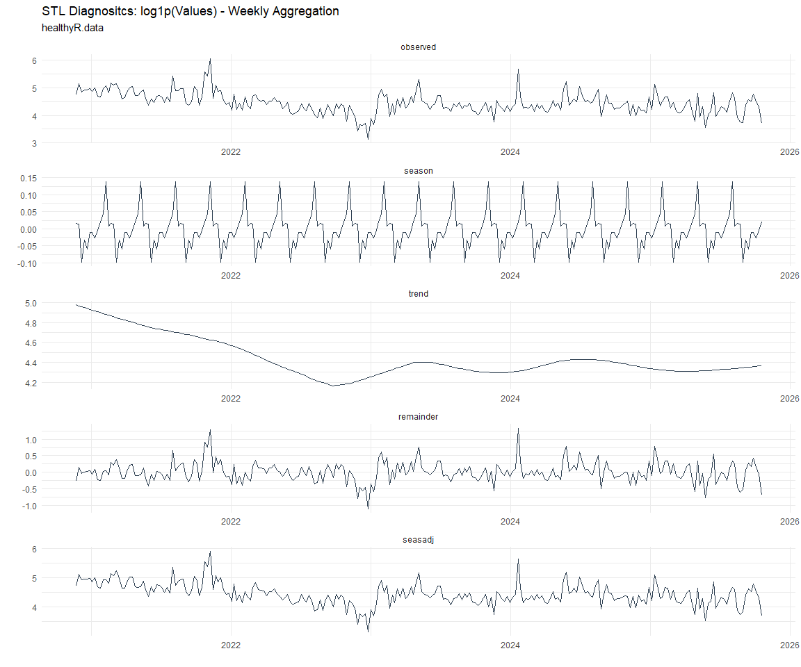

# Time Series Analysis, Modeling and Forecasting of the Healthyverse
Packages
Steven P. Sanderson II, MPH - Date:
2025-11-12

# Introduction

This analysis follows a *Nested Modeltime Workflow* from **`modeltime`**
along with using the **`NNS`** package. I use this to monitor the
downloads of all of my packages:

- [`healthyR`](https://www.spsanderson.com/healthyR/)
- [`healthyR.data`](https://www.spsanderson.com/healthyR.data/)
- [`healthyR.ts`](https://www.spsanderson.com/healthyR.ts/)
- [`healthyR.ai`](https://www.spsanderson.com/healthyR.ai/)
- [`healthyverse`](https://www.spsanderson.com/healthyverse/)
- [`TidyDensity`](https://www.spsanderson.com/TidyDensity/)
- [`tidyAML`](https://www.spsanderson.com/tidyAML/)
- [`RandomWalker`](https://www.spsanderson.com/RandomWalker/)

## Get Data

``` r
glimpse(downloads_tbl)
```

    Rows: 159,803
    Columns: 11
    $ date      <date> 2020-11-23, 2020-11-23, 2020-11-23, 2020-11-23, 2020-11-23,…
    $ time      <Period> 15H 36M 55S, 11H 26M 39S, 23H 34M 44S, 18H 39M 32S, 9H 0M…
    $ date_time <dttm> 2020-11-23 15:36:55, 2020-11-23 11:26:39, 2020-11-23 23:34:…
    $ size      <int> 4858294, 4858294, 4858301, 4858295, 361, 4863722, 4864794, 4…
    $ r_version <chr> NA, "4.0.3", "3.5.3", "3.5.2", NA, NA, NA, NA, NA, NA, NA, N…
    $ r_arch    <chr> NA, "x86_64", "x86_64", "x86_64", NA, NA, NA, NA, NA, NA, NA…
    $ r_os      <chr> NA, "mingw32", "mingw32", "linux-gnu", NA, NA, NA, NA, NA, N…
    $ package   <chr> "healthyR.data", "healthyR.data", "healthyR.data", "healthyR…
    $ version   <chr> "1.0.0", "1.0.0", "1.0.0", "1.0.0", "1.0.0", "1.0.0", "1.0.0…
    $ country   <chr> "US", "US", "US", "GB", "US", "US", "DE", "HK", "JP", "US", …
    $ ip_id     <int> 2069, 2804, 78827, 27595, 90474, 90474, 42435, 74, 7655, 638…

The last day in the data set is 2025-11-10 21:45:56, the file was
birthed on: 2022-07-02 23:58:17.511888, and at report knit time is
2.944179^{4} hours old. Happy analyzing!

Now that we have our data lets take a look at it using the `skimr`
package.

``` r
skim(downloads_tbl)
```

|                                                  |               |
|:-------------------------------------------------|:--------------|
| Name                                             | downloads_tbl |
| Number of rows                                   | 159803        |
| Number of columns                                | 11            |
| \_\_\_\_\_\_\_\_\_\_\_\_\_\_\_\_\_\_\_\_\_\_\_   |               |
| Column type frequency:                           |               |
| character                                        | 6             |
| Date                                             | 1             |
| numeric                                          | 2             |
| POSIXct                                          | 1             |
| Timespan                                         | 1             |
| \_\_\_\_\_\_\_\_\_\_\_\_\_\_\_\_\_\_\_\_\_\_\_\_ |               |
| Group variables                                  | None          |

Data summary

**Variable type: character**

| skim_variable | n_missing | complete_rate | min | max | empty | n_unique | whitespace |
|:--------------|----------:|--------------:|----:|----:|------:|---------:|-----------:|
| r_version     |    117195 |          0.27 |   5 |   7 |     0 |       50 |          0 |
| r_arch        |    117195 |          0.27 |   1 |   7 |     0 |        6 |          0 |
| r_os          |    117195 |          0.27 |   7 |  19 |     0 |       24 |          0 |
| package       |         0 |          1.00 |   7 |  13 |     0 |        8 |          0 |
| version       |         0 |          1.00 |   5 |  17 |     0 |       62 |          0 |
| country       |     14918 |          0.91 |   2 |   2 |     0 |      165 |          0 |

**Variable type: Date**

| skim_variable | n_missing | complete_rate | min | max | median | n_unique |
|:---|---:|---:|:---|:---|:---|---:|
| date | 0 | 1 | 2020-11-23 | 2025-11-10 | 2023-10-21 | 1807 |

**Variable type: numeric**

| skim_variable | n_missing | complete_rate | mean | sd | p0 | p25 | p50 | p75 | p100 | hist |
|:---|---:|---:|---:|---:|---:|---:|---:|---:|---:|:---|
| size | 0 | 1 | 1125198.66 | 1491639.79 | 355 | 24837 | 309959 | 2356031 | 5677952 | ▇▁▂▁▁ |
| ip_id | 0 | 1 | 11296.49 | 21895.54 | 1 | 228 | 2915 | 11961 | 299146 | ▇▁▁▁▁ |

**Variable type: POSIXct**

| skim_variable | n_missing | complete_rate | min | max | median | n_unique |
|:---|---:|---:|:---|:---|:---|---:|
| date_time | 0 | 1 | 2020-11-23 09:00:41 | 2025-11-10 21:45:56 | 2023-10-21 10:25:07 | 100505 |

**Variable type: Timespan**

| skim_variable | n_missing | complete_rate | min | max |     median | n_unique |
|:--------------|----------:|--------------:|----:|----:|-----------:|---------:|
| time          |         0 |             1 |   0 |  59 | 12H 6M 17S |       60 |

We can see that the following columns are missing a lot of data and for
us are most likely not useful anyways, so we will drop them
`c(r_version, r_arch, r_os)`

## Plots

Now lets take a look at a time-series plot of the total daily downloads
by package. We will use a log scale and place a vertical line at each
version release for each package.


    [[1]]


    [[2]]


    [[3]]


    [[4]]


    [[5]]


    [[6]]


    [[7]]


    [[8]]


Now lets take a look at some time series decomposition graphs.

    [[1]]


    [[2]]


    [[3]]


    [[4]]


    [[5]]




    [[6]]


    [[7]]


    [[8]]


    [[1]]


    [[2]]


    [[3]]


    [[4]]


    [[5]]


    [[6]]


    [[7]]


    [[8]]


Seasonal Diagnostics:

    [[1]]


    [[2]]


    [[3]]


    [[4]]


    [[5]]


    [[6]]


    [[7]]


    [[8]]


ACF and PACF Diagnostics:

    [[1]]


    [[2]]


    [[3]]


    [[4]]


    [[5]]


    [[6]]


    [[7]]


    [[8]]


## Feature Engineering

Now that we have our basic data and a shot of what it looks like, let’s
add some features to our data which can be very helpful in modeling.
Lets start by making a `tibble` that is aggregated by the day and
package, as we are going to be interested in forecasting the next 4
weeks or 28 days for each package. First lets get our base data.


    Call:
    stats::lm(formula = .formula, data = df)

    Residuals:
        Min      1Q  Median      3Q     Max 
    -146.68  -36.45  -11.33   27.03  818.51 

    Coefficients:
                                                         Estimate Std. Error
    (Intercept)                                        -1.980e+02  6.181e+01
    date                                                1.200e-02  3.277e-03
    lag(value, 1)                                       1.108e-01  2.337e-02
    lag(value, 7)                                       8.841e-02  2.414e-02
    lag(value, 14)                                      7.844e-02  2.414e-02
    lag(value, 21)                                      7.667e-02  2.421e-02
    lag(value, 28)                                      6.685e-02  2.413e-02
    lag(value, 35)                                      5.806e-02  2.418e-02
    lag(value, 42)                                      5.840e-02  2.436e-02
    lag(value, 49)                                      6.621e-02  2.428e-02
    month(date, label = TRUE).L                        -9.515e+00  5.091e+00
    month(date, label = TRUE).Q                         1.413e+00  5.020e+00
    month(date, label = TRUE).C                        -1.562e+01  5.027e+00
    month(date, label = TRUE)^4                        -6.728e+00  5.021e+00
    month(date, label = TRUE)^5                        -7.696e+00  4.992e+00
    month(date, label = TRUE)^6                         9.531e-02  5.018e+00
    month(date, label = TRUE)^7                        -5.408e+00  4.904e+00
    month(date, label = TRUE)^8                        -4.635e+00  4.855e+00
    month(date, label = TRUE)^9                         2.455e+00  4.844e+00
    month(date, label = TRUE)^10                        8.312e-01  4.857e+00
    month(date, label = TRUE)^11                       -4.145e+00  4.844e+00
    fourier_vec(date, type = "sin", K = 1, period = 7) -1.144e+01  2.240e+00
    fourier_vec(date, type = "cos", K = 1, period = 7)  7.388e+00  2.319e+00
                                                       t value Pr(>|t|)    
    (Intercept)                                         -3.203 0.001385 ** 
    date                                                 3.660 0.000260 ***
    lag(value, 1)                                        4.739 2.32e-06 ***
    lag(value, 7)                                        3.662 0.000258 ***
    lag(value, 14)                                       3.249 0.001181 ** 
    lag(value, 21)                                       3.167 0.001567 ** 
    lag(value, 28)                                       2.771 0.005652 ** 
    lag(value, 35)                                       2.401 0.016451 *  
    lag(value, 42)                                       2.397 0.016641 *  
    lag(value, 49)                                       2.727 0.006448 ** 
    month(date, label = TRUE).L                         -1.869 0.061795 .  
    month(date, label = TRUE).Q                          0.281 0.778401    
    month(date, label = TRUE).C                         -3.107 0.001924 ** 
    month(date, label = TRUE)^4                         -1.340 0.180457    
    month(date, label = TRUE)^5                         -1.542 0.123311    
    month(date, label = TRUE)^6                          0.019 0.984849    
    month(date, label = TRUE)^7                         -1.103 0.270273    
    month(date, label = TRUE)^8                         -0.955 0.339843    
    month(date, label = TRUE)^9                          0.507 0.612446    
    month(date, label = TRUE)^10                         0.171 0.864122    
    month(date, label = TRUE)^11                        -0.856 0.392249    
    fourier_vec(date, type = "sin", K = 1, period = 7)  -5.110 3.58e-07 ***
    fourier_vec(date, type = "cos", K = 1, period = 7)   3.185 0.001471 ** 
    ---
    Signif. codes:  0 '***' 0.001 '**' 0.01 '*' 0.05 '.' 0.1 ' ' 1

    Residual standard error: 59.4 on 1735 degrees of freedom
      (49 observations deleted due to missingness)
    Multiple R-squared:  0.2329,    Adjusted R-squared:  0.2231 
    F-statistic: 23.94 on 22 and 1735 DF,  p-value: < 2.2e-16


## NNS Forecasting

This is something I have been wanting to try for a while. The `NNS`
package is a great package for forecasting time series data.

[NNS GitHub](https://github.com/OVVO-Financial/NNS)

``` r
library(NNS)

data_list <- base_data |>
    select(package, value) |>
    group_split(package)

data_list |>
    imap(
        \(x, idx) {
            obj <- x
            x <- obj |> pull(value) |> tail(7*52)
            train_set_size <- length(x) - 56
            pkg <- obj |> pluck(1) |> unique()
#            sf <- NNS.seas(x, modulo = 7, plot = FALSE)$periods
            seas <- t(
                sapply(
                    1:25, 
                    function(i) c(
                        i,
                        sqrt(
                            mean((
                                NNS.ARMA(x, 
                                         h = 28, 
                                         training.set = train_set_size, 
                                         method = "lin", 
                                         seasonal.factor = i, 
                                         plot=FALSE
                                         ) - tail(x, 28)) ^ 2)))
                    )
                )
            colnames(seas) <- c("Period", "RMSE")
            sf <- seas[which.min(seas[, 2]), 1]
            
            cat(paste0("Package: ", pkg, "\n"))
            NNS.ARMA.optim(
                variable = x,
                h = 28,
                training.set = train_set_size,
                #seasonal.factor = seq(12, 60, 7),
                seasonal.factor = sf,
                pred.int = 0.95,
                plot = TRUE
            )
            title(
                sub = paste0("\n",
                             "Package: ", pkg, " - NNS Optimization")
            )
        }
    )
```

    Package: healthyR
    [1] "CURRNET METHOD: lin"
    [1] "COPY LATEST PARAMETERS DIRECTLY FOR NNS.ARMA() IF ERROR:"
    [1] "NNS.ARMA(... method =  'lin' , seasonal.factor =  c( 25 ) ...)"
    [1] "CURRENT lin OBJECTIVE FUNCTION = 10.9762672104486"
    [1] "BEST method = 'lin' PATH MEMBER = c( 25 )"
    [1] "BEST lin OBJECTIVE FUNCTION = 10.9762672104486"
    [1] "CURRNET METHOD: nonlin"
    [1] "COPY LATEST PARAMETERS DIRECTLY FOR NNS.ARMA() IF ERROR:"
    [1] "NNS.ARMA(... method =  'nonlin' , seasonal.factor =  c( 25 ) ...)"
    [1] "CURRENT nonlin OBJECTIVE FUNCTION = 6.42302422058769"
    [1] "BEST method = 'nonlin' PATH MEMBER = c( 25 )"
    [1] "BEST nonlin OBJECTIVE FUNCTION = 6.42302422058769"
    [1] "CURRNET METHOD: both"
    [1] "COPY LATEST PARAMETERS DIRECTLY FOR NNS.ARMA() IF ERROR:"
    [1] "NNS.ARMA(... method =  'both' , seasonal.factor =  c( 25 ) ...)"
    [1] "CURRENT both OBJECTIVE FUNCTION = 7.40898440428376"
    [1] "BEST method = 'both' PATH MEMBER = c( 25 )"
    [1] "BEST both OBJECTIVE FUNCTION = 7.40898440428376"


    Package: healthyR.ai
    [1] "CURRNET METHOD: lin"
    [1] "COPY LATEST PARAMETERS DIRECTLY FOR NNS.ARMA() IF ERROR:"
    [1] "NNS.ARMA(... method =  'lin' , seasonal.factor =  c( 3 ) ...)"
    [1] "CURRENT lin OBJECTIVE FUNCTION = 35.7561322187995"
    [1] "BEST method = 'lin' PATH MEMBER = c( 3 )"
    [1] "BEST lin OBJECTIVE FUNCTION = 35.7561322187995"
    [1] "CURRNET METHOD: nonlin"
    [1] "COPY LATEST PARAMETERS DIRECTLY FOR NNS.ARMA() IF ERROR:"
    [1] "NNS.ARMA(... method =  'nonlin' , seasonal.factor =  c( 3 ) ...)"
    [1] "CURRENT nonlin OBJECTIVE FUNCTION = 234.135200571308"
    [1] "BEST method = 'nonlin' PATH MEMBER = c( 3 )"
    [1] "BEST nonlin OBJECTIVE FUNCTION = 234.135200571308"
    [1] "CURRNET METHOD: both"
    [1] "COPY LATEST PARAMETERS DIRECTLY FOR NNS.ARMA() IF ERROR:"
    [1] "NNS.ARMA(... method =  'both' , seasonal.factor =  c( 3 ) ...)"
    [1] "CURRENT both OBJECTIVE FUNCTION = 122.163211837105"
    [1] "BEST method = 'both' PATH MEMBER = c( 3 )"
    [1] "BEST both OBJECTIVE FUNCTION = 122.163211837105"


    Package: healthyR.data
    [1] "CURRNET METHOD: lin"
    [1] "COPY LATEST PARAMETERS DIRECTLY FOR NNS.ARMA() IF ERROR:"
    [1] "NNS.ARMA(... method =  'lin' , seasonal.factor =  c( 1 ) ...)"
    [1] "CURRENT lin OBJECTIVE FUNCTION = 601.086866765432"
    [1] "BEST method = 'lin' PATH MEMBER = c( 1 )"
    [1] "BEST lin OBJECTIVE FUNCTION = 601.086866765432"
    [1] "CURRNET METHOD: nonlin"
    [1] "COPY LATEST PARAMETERS DIRECTLY FOR NNS.ARMA() IF ERROR:"
    [1] "NNS.ARMA(... method =  'nonlin' , seasonal.factor =  c( 1 ) ...)"
    [1] "CURRENT nonlin OBJECTIVE FUNCTION = 62.83309254048"
    [1] "BEST method = 'nonlin' PATH MEMBER = c( 1 )"
    [1] "BEST nonlin OBJECTIVE FUNCTION = 62.83309254048"
    [1] "CURRNET METHOD: both"
    [1] "COPY LATEST PARAMETERS DIRECTLY FOR NNS.ARMA() IF ERROR:"
    [1] "NNS.ARMA(... method =  'both' , seasonal.factor =  c( 1 ) ...)"
    [1] "CURRENT both OBJECTIVE FUNCTION = 58.295641900829"
    [1] "BEST method = 'both' PATH MEMBER = c( 1 )"
    [1] "BEST both OBJECTIVE FUNCTION = 58.295641900829"


    Package: healthyR.ts
    [1] "CURRNET METHOD: lin"
    [1] "COPY LATEST PARAMETERS DIRECTLY FOR NNS.ARMA() IF ERROR:"
    [1] "NNS.ARMA(... method =  'lin' , seasonal.factor =  c( 16 ) ...)"
    [1] "CURRENT lin OBJECTIVE FUNCTION = 11.970546415049"
    [1] "BEST method = 'lin' PATH MEMBER = c( 16 )"
    [1] "BEST lin OBJECTIVE FUNCTION = 11.970546415049"
    [1] "CURRNET METHOD: nonlin"
    [1] "COPY LATEST PARAMETERS DIRECTLY FOR NNS.ARMA() IF ERROR:"
    [1] "NNS.ARMA(... method =  'nonlin' , seasonal.factor =  c( 16 ) ...)"
    [1] "CURRENT nonlin OBJECTIVE FUNCTION = 5.72489542193972"
    [1] "BEST method = 'nonlin' PATH MEMBER = c( 16 )"
    [1] "BEST nonlin OBJECTIVE FUNCTION = 5.72489542193972"
    [1] "CURRNET METHOD: both"
    [1] "COPY LATEST PARAMETERS DIRECTLY FOR NNS.ARMA() IF ERROR:"
    [1] "NNS.ARMA(... method =  'both' , seasonal.factor =  c( 16 ) ...)"
    [1] "CURRENT both OBJECTIVE FUNCTION = 6.27838472197507"
    [1] "BEST method = 'both' PATH MEMBER = c( 16 )"
    [1] "BEST both OBJECTIVE FUNCTION = 6.27838472197507"


    Package: healthyverse
    [1] "CURRNET METHOD: lin"
    [1] "COPY LATEST PARAMETERS DIRECTLY FOR NNS.ARMA() IF ERROR:"
    [1] "NNS.ARMA(... method =  'lin' , seasonal.factor =  c( 5 ) ...)"
    [1] "CURRENT lin OBJECTIVE FUNCTION = 36.1934134078341"
    [1] "BEST method = 'lin' PATH MEMBER = c( 5 )"
    [1] "BEST lin OBJECTIVE FUNCTION = 36.1934134078341"
    [1] "CURRNET METHOD: nonlin"
    [1] "COPY LATEST PARAMETERS DIRECTLY FOR NNS.ARMA() IF ERROR:"
    [1] "NNS.ARMA(... method =  'nonlin' , seasonal.factor =  c( 5 ) ...)"
    [1] "CURRENT nonlin OBJECTIVE FUNCTION = 6.87356109123495"
    [1] "BEST method = 'nonlin' PATH MEMBER = c( 5 )"
    [1] "BEST nonlin OBJECTIVE FUNCTION = 6.87356109123495"
    [1] "CURRNET METHOD: both"
    [1] "COPY LATEST PARAMETERS DIRECTLY FOR NNS.ARMA() IF ERROR:"
    [1] "NNS.ARMA(... method =  'both' , seasonal.factor =  c( 5 ) ...)"
    [1] "CURRENT both OBJECTIVE FUNCTION = 7.07448889227327"
    [1] "BEST method = 'both' PATH MEMBER = c( 5 )"
    [1] "BEST both OBJECTIVE FUNCTION = 7.07448889227327"


    Package: RandomWalker
    [1] "CURRNET METHOD: lin"
    [1] "COPY LATEST PARAMETERS DIRECTLY FOR NNS.ARMA() IF ERROR:"
    [1] "NNS.ARMA(... method =  'lin' , seasonal.factor =  c( 1 ) ...)"
    [1] "CURRENT lin OBJECTIVE FUNCTION = 259.601900578565"
    [1] "BEST method = 'lin' PATH MEMBER = c( 1 )"
    [1] "BEST lin OBJECTIVE FUNCTION = 259.601900578565"
    [1] "CURRNET METHOD: nonlin"
    [1] "COPY LATEST PARAMETERS DIRECTLY FOR NNS.ARMA() IF ERROR:"
    [1] "NNS.ARMA(... method =  'nonlin' , seasonal.factor =  c( 1 ) ...)"
    [1] "CURRENT nonlin OBJECTIVE FUNCTION = 104.406271591453"
    [1] "BEST method = 'nonlin' PATH MEMBER = c( 1 )"
    [1] "BEST nonlin OBJECTIVE FUNCTION = 104.406271591453"
    [1] "CURRNET METHOD: both"
    [1] "COPY LATEST PARAMETERS DIRECTLY FOR NNS.ARMA() IF ERROR:"
    [1] "NNS.ARMA(... method =  'both' , seasonal.factor =  c( 1 ) ...)"
    [1] "CURRENT both OBJECTIVE FUNCTION = 235.423961401253"
    [1] "BEST method = 'both' PATH MEMBER = c( 1 )"
    [1] "BEST both OBJECTIVE FUNCTION = 235.423961401253"


    Package: tidyAML
    [1] "CURRNET METHOD: lin"
    [1] "COPY LATEST PARAMETERS DIRECTLY FOR NNS.ARMA() IF ERROR:"
    [1] "NNS.ARMA(... method =  'lin' , seasonal.factor =  c( 10 ) ...)"
    [1] "CURRENT lin OBJECTIVE FUNCTION = 52.5015598929776"
    [1] "BEST method = 'lin' PATH MEMBER = c( 10 )"
    [1] "BEST lin OBJECTIVE FUNCTION = 52.5015598929776"
    [1] "CURRNET METHOD: nonlin"
    [1] "COPY LATEST PARAMETERS DIRECTLY FOR NNS.ARMA() IF ERROR:"
    [1] "NNS.ARMA(... method =  'nonlin' , seasonal.factor =  c( 10 ) ...)"
    [1] "CURRENT nonlin OBJECTIVE FUNCTION = 10.9546856415507"
    [1] "BEST method = 'nonlin' PATH MEMBER = c( 10 )"
    [1] "BEST nonlin OBJECTIVE FUNCTION = 10.9546856415507"
    [1] "CURRNET METHOD: both"
    [1] "COPY LATEST PARAMETERS DIRECTLY FOR NNS.ARMA() IF ERROR:"
    [1] "NNS.ARMA(... method =  'both' , seasonal.factor =  c( 10 ) ...)"
    [1] "CURRENT both OBJECTIVE FUNCTION = 18.3192408946839"
    [1] "BEST method = 'both' PATH MEMBER = c( 10 )"
    [1] "BEST both OBJECTIVE FUNCTION = 18.3192408946839"


    Package: TidyDensity
    [1] "CURRNET METHOD: lin"
    [1] "COPY LATEST PARAMETERS DIRECTLY FOR NNS.ARMA() IF ERROR:"
    [1] "NNS.ARMA(... method =  'lin' , seasonal.factor =  c( 3 ) ...)"
    [1] "CURRENT lin OBJECTIVE FUNCTION = 12.0158446624347"
    [1] "BEST method = 'lin' PATH MEMBER = c( 3 )"
    [1] "BEST lin OBJECTIVE FUNCTION = 12.0158446624347"
    [1] "CURRNET METHOD: nonlin"
    [1] "COPY LATEST PARAMETERS DIRECTLY FOR NNS.ARMA() IF ERROR:"
    [1] "NNS.ARMA(... method =  'nonlin' , seasonal.factor =  c( 3 ) ...)"
    [1] "CURRENT nonlin OBJECTIVE FUNCTION = 5.61212067749576"
    [1] "BEST method = 'nonlin' PATH MEMBER = c( 3 )"
    [1] "BEST nonlin OBJECTIVE FUNCTION = 5.61212067749576"
    [1] "CURRNET METHOD: both"
    [1] "COPY LATEST PARAMETERS DIRECTLY FOR NNS.ARMA() IF ERROR:"
    [1] "NNS.ARMA(... method =  'both' , seasonal.factor =  c( 3 ) ...)"
    [1] "CURRENT both OBJECTIVE FUNCTION = 2.69993180646521"
    [1] "BEST method = 'both' PATH MEMBER = c( 3 )"
    [1] "BEST both OBJECTIVE FUNCTION = 2.69993180646521"


    [[1]]
    NULL

    [[2]]
    NULL

    [[3]]
    NULL

    [[4]]
    NULL

    [[5]]
    NULL

    [[6]]
    NULL

    [[7]]
    NULL

    [[8]]
    NULL

## Pre-Processing

Now we are going to do some basic pre-processing.

``` r
data_padded_tbl <- base_data %>%
  pad_by_time(
    .date_var  = date,
    .pad_value = 0
  )

# Get log interval and standardization parameters
log_params  <- liv(data_padded_tbl$value, limit_lower = 0, offset = 1, silent = TRUE)
limit_lower <- log_params$limit_lower
limit_upper <- log_params$limit_upper
offset      <- log_params$offset

data_liv_tbl <- data_padded_tbl %>%
  # Get log interval transform
  mutate(value_trans = liv(value, limit_lower = 0, offset = 1, silent = TRUE)$log_scaled)

# Get Standardization Params
std_params <- standard_vec(data_liv_tbl$value_trans, silent = TRUE)
std_mean   <- std_params$mean
std_sd     <- std_params$sd

data_transformed_tbl <- data_liv_tbl %>%
  group_by(package) %>%
  # get standardization
  mutate(value_trans = standard_vec(value_trans, silent = TRUE)$standard_scaled) %>%
  tk_augment_fourier(
    .date_var = date,
    .periods  = c(7, 14, 30, 90, 180),
    .K        = 2
  ) %>%
  tk_augment_timeseries_signature(
    .date_var = date
  ) %>%
  ungroup() %>%
  select(-c(value, -year.iso))
```

Since this is panel data we can follow one of two different modeling
strategies. We can search for a global model in the panel data or we can
use nested forecasting finding the best model for each of the time
series. Since we only have 5 panels, we will use nested forecasting.

To do this we will use the `nest_timeseries` and
`split_nested_timeseries` functions to create a nested `tibble`.

``` r
horizon <- 4*7

nested_data_tbl <- data_transformed_tbl %>%

    # 0. Filter out column where package is NA
    filter(!is.na(package)) %>%
    
    # 1. Extending: We'll predict n days into the future.
    extend_timeseries(
        .id_var        = package,
        .date_var      = date,
        .length_future = horizon
    ) %>%
    
    # 2. Nesting: We'll group by id, and create a future dataset
    #    that forecasts n days of extended data and
    #    an actual dataset that contains n*2 days
    nest_timeseries(
        .id_var        = package,
        .length_future = horizon
        #.length_actual = horizon*2
    ) %>%
    
   # 3. Splitting: We'll take the actual data and create splits
   #    for accuracy and confidence interval estimation of n das (test)
   #    and the rest is training data
    split_nested_timeseries(
        .length_test = horizon
    )

nested_data_tbl
```

    # A tibble: 8 × 4
      package       .actual_data          .future_data       .splits          
      <fct>         <list>                <list>             <list>           
    1 healthyR.data <tibble [1,799 × 50]> <tibble [28 × 50]> <split [1771|28]>
    2 healthyR      <tibble [1,790 × 50]> <tibble [28 × 50]> <split [1762|28]>
    3 healthyR.ts   <tibble [1,736 × 50]> <tibble [28 × 50]> <split [1708|28]>
    4 healthyverse  <tibble [1,707 × 50]> <tibble [28 × 50]> <split [1679|28]>
    5 healthyR.ai   <tibble [1,532 × 50]> <tibble [28 × 50]> <split [1504|28]>
    6 TidyDensity   <tibble [1,383 × 50]> <tibble [28 × 50]> <split [1355|28]>
    7 tidyAML       <tibble [990 × 50]>   <tibble [28 × 50]> <split [962|28]> 
    8 RandomWalker  <tibble [413 × 50]>   <tibble [28 × 50]> <split [385|28]> 

Now it is time to make some recipes and models using the modeltime
workflow.

## Modeltime Workflow

### Recipe Object

``` r
recipe_base <- recipe(
  value_trans ~ .
  , data = extract_nested_test_split(nested_data_tbl)
  )

recipe_base

recipe_date <- recipe(
  value_trans ~ date
  , data = extract_nested_test_split(nested_data_tbl)
  )
```

### Models

``` r
# Models ------------------------------------------------------------------

# Auto ARIMA --------------------------------------------------------------

model_spec_arima_no_boost <- arima_reg() %>%
  set_engine(engine = "auto_arima")

wflw_auto_arima <- workflow() %>%
  add_recipe(recipe = recipe_date) %>%
  add_model(model_spec_arima_no_boost)

# NNETAR ------------------------------------------------------------------

model_spec_nnetar <- nnetar_reg(
  mode              = "regression"
  , seasonal_period = "auto"
) %>%
  set_engine("nnetar")

wflw_nnetar <- workflow() %>%
  add_recipe(recipe = recipe_base) %>%
  add_model(model_spec_nnetar)

# TSLM --------------------------------------------------------------------

model_spec_lm <- linear_reg() %>%
  set_engine("lm")

wflw_lm <- workflow() %>%
  add_recipe(recipe = recipe_base) %>%
  add_model(model_spec_lm)

# MARS --------------------------------------------------------------------

model_spec_mars <- mars(mode = "regression") %>%
  set_engine("earth")

wflw_mars <- workflow() %>%
  add_recipe(recipe = recipe_date) %>%
  add_model(model_spec_mars)
```

### Nested Modeltime Tables

``` r
nested_modeltime_tbl <- modeltime_nested_fit(
  # Nested Data
  nested_data = nested_data_tbl,
   control = control_nested_fit(
     verbose = TRUE,
     allow_par = FALSE
   ),
  # Add workflows
  wflw_auto_arima,
  wflw_lm,
  wflw_mars,
  wflw_nnetar
)
```

``` r
nested_modeltime_tbl <- nested_modeltime_tbl[!is.na(nested_modeltime_tbl$package),]
```

### Model Accuracy

``` r
nested_modeltime_tbl %>%
  extract_nested_test_accuracy() %>%
  filter(!is.na(package)) %>%
  knitr::kable()
```

| package | .model_id | .model_desc | .type | mae | mape | mase | smape | rmse | rsq |
|:---|---:|:---|:---|---:|---:|---:|---:|---:|---:|
| healthyR.data | 1 | ARIMA | Test | 0.5898463 | 98.22906 | 0.5787444 | 142.5927 | 0.7381674 | 0.2596903 |
| healthyR.data | 2 | LM | Test | 0.7346362 | 188.76866 | 0.7208091 | 143.4743 | 0.8454787 | 0.0001036 |
| healthyR.data | 3 | EARTH | Test | 0.6745300 | 95.38971 | 0.6618342 | 169.7724 | 0.8214120 | 0.0748809 |
| healthyR.data | 4 | NNAR | Test | 0.8117681 | 253.40206 | 0.7964892 | 161.2883 | 0.8953874 | 0.0020767 |
| healthyR | 1 | ARIMA | Test | 0.7462454 | 109.37840 | 0.7217215 | 173.3025 | 1.0418684 | 0.0090964 |
| healthyR | 2 | LM | Test | 0.8091363 | 200.15940 | 0.7825456 | 137.2176 | 1.0022666 | 0.0272314 |
| healthyR | 3 | EARTH | Test | 0.8886078 | 157.36056 | 0.8594054 | 134.1160 | 1.2643559 | 0.0975973 |
| healthyR | 4 | NNAR | Test | 0.8410332 | 191.66741 | 0.8133942 | 147.3296 | 1.0819903 | 0.0044863 |
| healthyR.ts | 1 | ARIMA | Test | 0.7717690 | 93.89933 | 0.6236905 | 151.6656 | 1.0315800 | 0.1105302 |
| healthyR.ts | 2 | LM | Test | 0.9464578 | 216.36931 | 0.7648620 | 165.0503 | 1.1716475 | 0.0121367 |
| healthyR.ts | 3 | EARTH | Test | 0.8688445 | 132.85239 | 0.7021403 | 155.0147 | 1.1241029 | 0.0599307 |
| healthyR.ts | 4 | NNAR | Test | 1.0005386 | 224.03262 | 0.8085664 | 164.5696 | 1.1990922 | 0.0010571 |
| healthyverse | 1 | ARIMA | Test | 0.5770349 | 94.79308 | 1.1004320 | 138.5264 | 0.7666409 | 0.1171432 |
| healthyverse | 2 | LM | Test | 0.7265758 | 189.02409 | 1.3856135 | 143.2803 | 0.8320615 | 0.0173665 |
| healthyverse | 3 | EARTH | Test | 0.7029828 | 258.86984 | 1.3406205 | 120.0248 | 0.8475833 | 0.2791731 |
| healthyverse | 4 | NNAR | Test | 0.6334083 | 156.84522 | 1.2079387 | 128.7651 | 0.7704362 | 0.0631302 |
| healthyR.ai | 1 | ARIMA | Test | 0.4815093 | 105.47064 | 0.7612925 | 178.6509 | 0.6386527 | 0.0129614 |
| healthyR.ai | 2 | LM | Test | 0.6798273 | 258.87579 | 1.0748441 | 160.7746 | 0.8196430 | 0.0482715 |
| healthyR.ai | 3 | EARTH | Test | 0.7178236 | 244.40673 | 1.1349183 | 139.3942 | 0.9138734 | 0.0531518 |
| healthyR.ai | 4 | NNAR | Test | 0.6762512 | 248.23183 | 1.0691901 | 151.3312 | 0.8242423 | 0.0265805 |
| TidyDensity | 1 | ARIMA | Test | 1.0989181 | 547.73995 | 0.6791186 | 132.1771 | 1.2360174 | 0.0179508 |
| TidyDensity | 2 | LM | Test | 0.9095094 | 205.89661 | 0.5620663 | 143.7760 | 1.1321633 | 0.0005284 |
| TidyDensity | 3 | EARTH | Test | 1.3082280 | 366.85001 | 0.8084697 | 135.4179 | 1.7088240 | 0.0168655 |
| TidyDensity | 4 | NNAR | Test | 1.0514464 | 432.03499 | 0.6497817 | 147.8629 | 1.1841331 | 0.0046505 |
| tidyAML | 1 | ARIMA | Test | 0.7843587 | 115.50179 | 0.8302135 | 171.4844 | 1.0038563 | 0.0696568 |
| tidyAML | 2 | LM | Test | 0.7638590 | 142.90104 | 0.8085154 | 130.1036 | 0.9572747 | 0.0517978 |
| tidyAML | 3 | EARTH | Test | 9.3540628 | 3264.04232 | 9.9009155 | 185.6657 | 10.1818042 | 0.1338566 |
| tidyAML | 4 | NNAR | Test | 0.7069263 | 105.30270 | 0.7482543 | 122.2422 | 0.9408385 | 0.0633756 |
| RandomWalker | 1 | ARIMA | Test | 0.6897477 | 102.40278 | 0.5179072 | 140.0120 | 0.8070528 | 0.2605097 |
| RandomWalker | 2 | LM | Test | 0.8860710 | 177.38444 | 0.6653195 | 158.0937 | 0.9564839 | 0.0063384 |
| RandomWalker | 3 | EARTH | Test | 0.9029781 | 188.24514 | 0.6780145 | 147.6229 | 0.9592076 | 0.0039702 |
| RandomWalker | 4 | NNAR | Test | 1.0621118 | 236.05191 | 0.7975024 | 155.7294 | 1.1929814 | 0.0524174 |

### Plot Models

``` r
nested_modeltime_tbl %>%
  extract_nested_test_forecast() %>%
  group_by(package) %>%
  filter_by_time(.date_var = .index, .start_date = max(.index) - 60) %>%
  ungroup() %>%
  plot_modeltime_forecast(
    .interactive = FALSE,
    .conf_interval_show  = FALSE,
    .facet_scales = "free"
  ) +
  theme_minimal() +
  facet_wrap(~ package, nrow = 3) +
  theme(legend.position = "bottom")
```


### Best Model

``` r
best_nested_modeltime_tbl <- nested_modeltime_tbl %>%
  modeltime_nested_select_best(
    metric = "rmse",
    minimize = TRUE,
    filter_test_forecasts = TRUE
  )

best_nested_modeltime_tbl %>%
  extract_nested_best_model_report()
```

    # Nested Modeltime Table
      

    # A tibble: 8 × 10
      package      .model_id .model_desc .type   mae  mape  mase smape  rmse     rsq
      <fct>            <int> <chr>       <chr> <dbl> <dbl> <dbl> <dbl> <dbl>   <dbl>
    1 healthyR.da…         1 ARIMA       Test  0.590  98.2 0.579  143. 0.738 2.60e-1
    2 healthyR             2 LM          Test  0.809 200.  0.783  137. 1.00  2.72e-2
    3 healthyR.ts          1 ARIMA       Test  0.772  93.9 0.624  152. 1.03  1.11e-1
    4 healthyverse         1 ARIMA       Test  0.577  94.8 1.10   139. 0.767 1.17e-1
    5 healthyR.ai          1 ARIMA       Test  0.482 105.  0.761  179. 0.639 1.30e-2
    6 TidyDensity          2 LM          Test  0.910 206.  0.562  144. 1.13  5.28e-4
    7 tidyAML              4 NNAR        Test  0.707 105.  0.748  122. 0.941 6.34e-2
    8 RandomWalker         1 ARIMA       Test  0.690 102.  0.518  140. 0.807 2.61e-1

``` r
best_nested_modeltime_tbl %>%
  extract_nested_test_forecast() %>%
  #filter(!is.na(.model_id)) %>%
  group_by(package) %>%
  filter_by_time(.date_var = .index, .start_date = max(.index) - 60) %>%
  ungroup() %>%
  plot_modeltime_forecast(
    .interactive = FALSE,
    .conf_interval_alpha = 0.2,
    .facet_scales = "free"
  ) +
  facet_wrap(~ package, nrow = 3) +
  theme_minimal() +
  theme(legend.position = "bottom")
```


## Refitting and Future Forecast

Now that we have the best models, we can make our future forecasts.

``` r
nested_modeltime_refit_tbl <- best_nested_modeltime_tbl %>%
    modeltime_nested_refit(
        control = control_nested_refit(verbose = TRUE)
    )
```

``` r
nested_modeltime_refit_tbl
```

    # Nested Modeltime Table
      

    # A tibble: 8 × 5
      package       .actual_data .future_data .splits           .modeltime_tables 
      <fct>         <list>       <list>       <list>            <list>            
    1 healthyR.data <tibble>     <tibble>     <split [1771|28]> <mdl_tm_t [1 × 5]>
    2 healthyR      <tibble>     <tibble>     <split [1762|28]> <mdl_tm_t [1 × 5]>
    3 healthyR.ts   <tibble>     <tibble>     <split [1708|28]> <mdl_tm_t [1 × 5]>
    4 healthyverse  <tibble>     <tibble>     <split [1679|28]> <mdl_tm_t [1 × 5]>
    5 healthyR.ai   <tibble>     <tibble>     <split [1504|28]> <mdl_tm_t [1 × 5]>
    6 TidyDensity   <tibble>     <tibble>     <split [1355|28]> <mdl_tm_t [1 × 5]>
    7 tidyAML       <tibble>     <tibble>     <split [962|28]>  <mdl_tm_t [1 × 5]>
    8 RandomWalker  <tibble>     <tibble>     <split [385|28]>  <mdl_tm_t [1 × 5]>

``` r
nested_modeltime_refit_tbl %>%
  extract_nested_future_forecast() %>%
  group_by(package) %>%
  mutate(across(.value:.conf_hi, .fns = ~ standard_inv_vec(
    x    = .,
    mean = std_mean,
    sd   = std_sd
  )$standard_inverse_value)) %>%
  mutate(across(.value:.conf_hi, .fns = ~ liiv(
    x = .,
    limit_lower = limit_lower,
    limit_upper = limit_upper,
    offset      = offset
  )$rescaled_v)) %>%
  filter_by_time(.date_var = .index, .start_date = max(.index) - 60) %>%
  ungroup() %>%
  plot_modeltime_forecast(
    .interactive = FALSE,
    .conf_interval_alpha = 0.2,
    .facet_scales = "free"
  ) +
  facet_wrap(~ package, nrow = 3) +
  theme_minimal() +
  theme(legend.position = "bottom")
```


