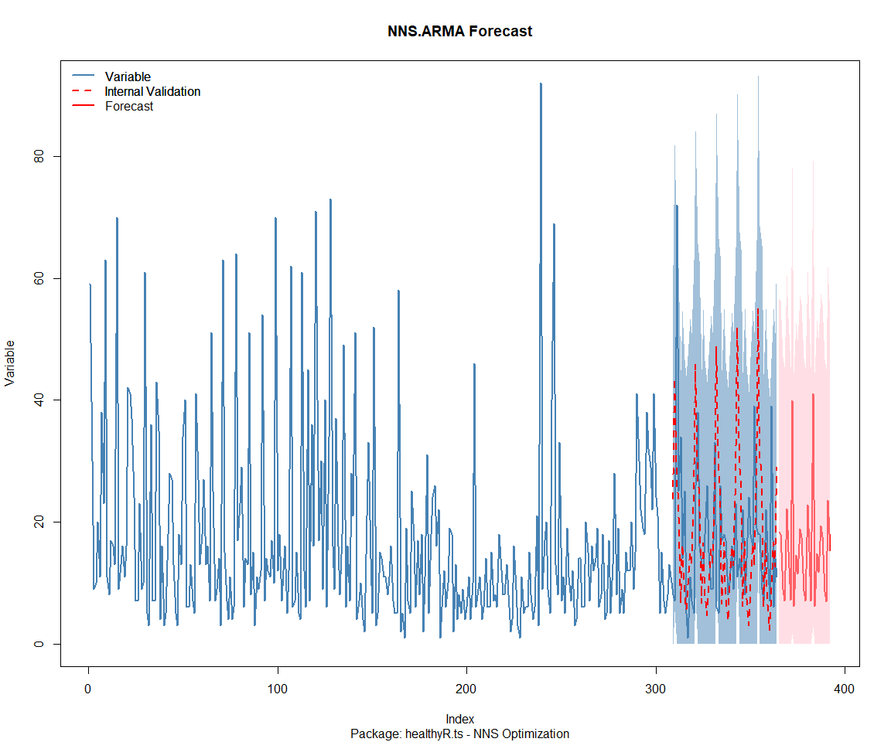

Time Series Analysis, Modeling and Forecasting of the Healthyverse
Packages
================
Steven P. Sanderson II, MPH - Date:
11 September, 2025

This analysis follows a *Nested Modeltime Workflow*.

## Get Data

``` r
glimpse(downloads_tbl)
```

    ## Rows: 151,234
    ## Columns: 11
    ## $ date      <date> 2020-11-23, 2020-11-23, 2020-11-23, 2020-11-23, 2020-11-23,…
    ## $ time      <Period> 15H 36M 55S, 11H 26M 39S, 23H 34M 44S, 18H 39M 32S, 9H 0M…
    ## $ date_time <dttm> 2020-11-23 15:36:55, 2020-11-23 11:26:39, 2020-11-23 23:34:…
    ## $ size      <int> 4858294, 4858294, 4858301, 4858295, 361, 4863722, 4864794, 4…
    ## $ r_version <chr> NA, "4.0.3", "3.5.3", "3.5.2", NA, NA, NA, NA, NA, NA, NA, N…
    ## $ r_arch    <chr> NA, "x86_64", "x86_64", "x86_64", NA, NA, NA, NA, NA, NA, NA…
    ## $ r_os      <chr> NA, "mingw32", "mingw32", "linux-gnu", NA, NA, NA, NA, NA, N…
    ## $ package   <chr> "healthyR.data", "healthyR.data", "healthyR.data", "healthyR…
    ## $ version   <chr> "1.0.0", "1.0.0", "1.0.0", "1.0.0", "1.0.0", "1.0.0", "1.0.0…
    ## $ country   <chr> "US", "US", "US", "GB", "US", "US", "DE", "HK", "JP", "US", …
    ## $ ip_id     <int> 2069, 2804, 78827, 27595, 90474, 90474, 42435, 74, 7655, 638…

The last day in the data set is 2025-09-09 23:56:27, the file was
birthed on: 2022-07-02 23:58:17.511888, and at report knit time is
-2.795597^{4} hours old. Happy analyzing!

Now that we have our data lets take a look at it using the `skimr`
package.

``` r
skim(downloads_tbl)
```

|                                                  |               |
|:-------------------------------------------------|:--------------|
| Name                                             | downloads_tbl |
| Number of rows                                   | 151234        |
| Number of columns                                | 11            |
| \_\_\_\_\_\_\_\_\_\_\_\_\_\_\_\_\_\_\_\_\_\_\_   |               |
| Column type frequency:                           |               |
| character                                        | 6             |
| Date                                             | 1             |
| numeric                                          | 2             |
| POSIXct                                          | 1             |
| Timespan                                         | 1             |
| \_\_\_\_\_\_\_\_\_\_\_\_\_\_\_\_\_\_\_\_\_\_\_\_ |               |
| Group variables                                  | None          |

Data summary

**Variable type: character**

| skim_variable | n_missing | complete_rate | min | max | empty | n_unique | whitespace |
|:--------------|----------:|--------------:|----:|----:|------:|---------:|-----------:|
| r_version     |    109855 |          0.27 |   5 |   5 |     0 |       48 |          0 |
| r_arch        |    109855 |          0.27 |   3 |   7 |     0 |        5 |          0 |
| r_os          |    109855 |          0.27 |   7 |  15 |     0 |       23 |          0 |
| package       |         0 |          1.00 |   7 |  13 |     0 |        8 |          0 |
| version       |         0 |          1.00 |   5 |  17 |     0 |       62 |          0 |
| country       |     12917 |          0.91 |   2 |   2 |     0 |      165 |          0 |

**Variable type: Date**

| skim_variable | n_missing | complete_rate | min | max | median | n_unique |
|:---|---:|---:|:---|:---|:---|---:|
| date | 0 | 1 | 2020-11-23 | 2025-09-09 | 2023-08-25 | 1745 |

**Variable type: numeric**

| skim_variable | n_missing | complete_rate | mean | sd | p0 | p25 | p50 | p75 | p100 | hist |
|:---|---:|---:|---:|---:|---:|---:|---:|---:|---:|:---|
| size | 0 | 1 | 1129862.79 | 1503490.48 | 355 | 14701 | 306729 | 2365615.00 | 5677952 | ▇▁▂▁▁ |
| ip_id | 0 | 1 | 11268.53 | 21596.45 | 1 | 287 | 3058 | 12131.75 | 299146 | ▇▁▁▁▁ |

**Variable type: POSIXct**

| skim_variable | n_missing | complete_rate | min | max | median | n_unique |
|:---|---:|---:|:---|:---|:---|---:|
| date_time | 0 | 1 | 2020-11-23 09:00:41 | 2025-09-09 23:56:27 | 2023-08-26 00:21:54 | 93973 |

**Variable type: Timespan**

| skim_variable | n_missing | complete_rate | min | max | median | n_unique |
|:--------------|----------:|--------------:|----:|----:|-------:|---------:|
| time          |         0 |             1 |   0 |  59 |     23 |       60 |

We can see that the following columns are missing a lot of data and for
us are most likely not useful anyways, so we will drop them
`c(r_version, r_arch, r_os)`

## Plots

Now lets take a look at a time-series plot of the total daily downloads
by package. We will use a log scale and place a vertical line at each
version release for each package.

<!-- --><!-- -->

Now lets take a look at some time series decomposition graphs.

<!-- --><!-- --><!-- --><!-- -->

## Feature Engineering

Now that we have our basic data and a shot of what it looks like, let’s
add some features to our data which can be very helpful in modeling.
Lets start by making a `tibble` that is aggregated by the day and
package, as we are going to be interested in forecasting the next 4
weeks or 28 days for each package. First lets get our base data.

    ## 
    ## Call:
    ## stats::lm(formula = .formula, data = df)
    ## 
    ## Residuals:
    ##     Min      1Q  Median      3Q     Max 
    ## -147.21  -36.05  -11.13   26.77  817.98 
    ## 
    ## Coefficients:
    ##                                                      Estimate Std. Error
    ## (Intercept)                                        -1.820e+02  6.287e+01
    ## date                                                1.116e-02  3.329e-03
    ## lag(value, 1)                                       1.065e-01  2.374e-02
    ## lag(value, 7)                                       9.045e-02  2.453e-02
    ## lag(value, 14)                                      8.092e-02  2.456e-02
    ## lag(value, 21)                                      6.512e-02  2.459e-02
    ## lag(value, 28)                                      6.989e-02  2.456e-02
    ## lag(value, 35)                                      6.876e-02  2.466e-02
    ## lag(value, 42)                                      5.929e-02  2.478e-02
    ## lag(value, 49)                                      6.429e-02  2.466e-02
    ## month(date, label = TRUE).L                        -9.543e+00  5.101e+00
    ## month(date, label = TRUE).Q                         3.075e+00  4.988e+00
    ## month(date, label = TRUE).C                        -1.371e+01  5.071e+00
    ## month(date, label = TRUE)^4                        -6.955e+00  5.068e+00
    ## month(date, label = TRUE)^5                        -1.081e+01  5.026e+00
    ## month(date, label = TRUE)^6                        -3.958e+00  5.104e+00
    ## month(date, label = TRUE)^7                        -7.512e+00  4.990e+00
    ## month(date, label = TRUE)^8                        -3.694e+00  4.977e+00
    ## month(date, label = TRUE)^9                         5.240e+00  4.958e+00
    ## month(date, label = TRUE)^10                        3.457e+00  4.893e+00
    ## month(date, label = TRUE)^11                       -3.051e+00  4.813e+00
    ## fourier_vec(date, type = "sin", K = 1, period = 7) -1.174e+01  2.268e+00
    ## fourier_vec(date, type = "cos", K = 1, period = 7)  7.639e+00  2.379e+00
    ##                                                    t value Pr(>|t|)    
    ## (Intercept)                                         -2.895 0.003843 ** 
    ## date                                                 3.352 0.000821 ***
    ## lag(value, 1)                                        4.486 7.77e-06 ***
    ## lag(value, 7)                                        3.687 0.000234 ***
    ## lag(value, 14)                                       3.294 0.001007 ** 
    ## lag(value, 21)                                       2.648 0.008163 ** 
    ## lag(value, 28)                                       2.846 0.004481 ** 
    ## lag(value, 35)                                       2.789 0.005351 ** 
    ## lag(value, 42)                                       2.393 0.016841 *  
    ## lag(value, 49)                                       2.607 0.009211 ** 
    ## month(date, label = TRUE).L                         -1.871 0.061533 .  
    ## month(date, label = TRUE).Q                          0.616 0.537661    
    ## month(date, label = TRUE).C                         -2.703 0.006931 ** 
    ## month(date, label = TRUE)^4                         -1.372 0.170162    
    ## month(date, label = TRUE)^5                         -2.151 0.031655 *  
    ## month(date, label = TRUE)^6                         -0.776 0.438150    
    ## month(date, label = TRUE)^7                         -1.506 0.132374    
    ## month(date, label = TRUE)^8                         -0.742 0.458039    
    ## month(date, label = TRUE)^9                          1.057 0.290683    
    ## month(date, label = TRUE)^10                         0.706 0.480022    
    ## month(date, label = TRUE)^11                        -0.634 0.526158    
    ## fourier_vec(date, type = "sin", K = 1, period = 7)  -5.178 2.52e-07 ***
    ## fourier_vec(date, type = "cos", K = 1, period = 7)   3.211 0.001346 ** 
    ## ---
    ## Signif. codes:  0 '***' 0.001 '**' 0.01 '*' 0.05 '.' 0.1 ' ' 1
    ## 
    ## Residual standard error: 58.77 on 1673 degrees of freedom
    ##   (49 observations deleted due to missingness)
    ## Multiple R-squared:  0.2327, Adjusted R-squared:  0.2226 
    ## F-statistic: 23.06 on 22 and 1673 DF,  p-value: < 2.2e-16

<!-- -->

## NNS Forecasting

This is something I have been wanting to try for a while. The `NNS`
package is a great package for forecasting time series data.

[NNS GitHub](https://github.com/OVVO-Financial/NNS)

``` r
library(NNS)

data_list <- base_data |>
    select(package, value) |>
    group_split(package)

data_list |>
    imap(
        \(x, idx) {
            obj <- x
            x <- obj |> pull(value) |> tail(7*52)
            train_set_size <- length(x) - 56
            pkg <- obj |> pluck(1) |> unique()
#            sf <- NNS.seas(x, modulo = 7, plot = FALSE)$periods
            seas <- t(
                sapply(
                    1:25, 
                    function(i) c(
                        i,
                        sqrt(
                            mean((
                                NNS.ARMA(x, 
                                         h = 28, 
                                         training.set = train_set_size, 
                                         method = "lin", 
                                         seasonal.factor = i, 
                                         plot=FALSE
                                         ) - tail(x, 28)) ^ 2)))
                    )
                )
            colnames(seas) <- c("Period", "RMSE")
            sf <- seas[which.min(seas[, 2]), 1]
            
            cat(paste0("Package: ", pkg, "\n"))
            NNS.ARMA.optim(
                variable = x,
                h = 28,
                training.set = train_set_size,
                #seasonal.factor = seq(12, 60, 7),
                seasonal.factor = sf,
                pred.int = 0.95,
                plot = TRUE
            )
            title(
                sub = paste0("\n",
                             "Package: ", pkg, " - NNS Optimization")
            )
        }
    )
```

    ## Package: healthyR
    ## [1] "CURRNET METHOD: lin"
    ## [1] "COPY LATEST PARAMETERS DIRECTLY FOR NNS.ARMA() IF ERROR:"
    ## [1] "NNS.ARMA(... method =  'lin' , seasonal.factor =  c( 24 ) ...)"
    ## [1] "CURRENT lin OBJECTIVE FUNCTION = 9.67646862037124"
    ## [1] "BEST method = 'lin' PATH MEMBER = c( 24 )"
    ## [1] "BEST lin OBJECTIVE FUNCTION = 9.67646862037124"
    ## [1] "CURRNET METHOD: nonlin"
    ## [1] "COPY LATEST PARAMETERS DIRECTLY FOR NNS.ARMA() IF ERROR:"
    ## [1] "NNS.ARMA(... method =  'nonlin' , seasonal.factor =  c( 24 ) ...)"
    ## [1] "CURRENT nonlin OBJECTIVE FUNCTION = 13.69885064829"
    ## [1] "BEST method = 'nonlin' PATH MEMBER = c( 24 )"
    ## [1] "BEST nonlin OBJECTIVE FUNCTION = 13.69885064829"
    ## [1] "CURRNET METHOD: both"
    ## [1] "COPY LATEST PARAMETERS DIRECTLY FOR NNS.ARMA() IF ERROR:"
    ## [1] "NNS.ARMA(... method =  'both' , seasonal.factor =  c( 24 ) ...)"
    ## [1] "CURRENT both OBJECTIVE FUNCTION = 9.80259252838374"
    ## [1] "BEST method = 'both' PATH MEMBER = c( 24 )"
    ## [1] "BEST both OBJECTIVE FUNCTION = 9.80259252838374"

<!-- -->

    ## Package: healthyR.ai
    ## [1] "CURRNET METHOD: lin"
    ## [1] "COPY LATEST PARAMETERS DIRECTLY FOR NNS.ARMA() IF ERROR:"
    ## [1] "NNS.ARMA(... method =  'lin' , seasonal.factor =  c( 13 ) ...)"
    ## [1] "CURRENT lin OBJECTIVE FUNCTION = 12.2795922863892"
    ## [1] "BEST method = 'lin' PATH MEMBER = c( 13 )"
    ## [1] "BEST lin OBJECTIVE FUNCTION = 12.2795922863892"
    ## [1] "CURRNET METHOD: nonlin"
    ## [1] "COPY LATEST PARAMETERS DIRECTLY FOR NNS.ARMA() IF ERROR:"
    ## [1] "NNS.ARMA(... method =  'nonlin' , seasonal.factor =  c( 13 ) ...)"
    ## [1] "CURRENT nonlin OBJECTIVE FUNCTION = 7.75475624956555"
    ## [1] "BEST method = 'nonlin' PATH MEMBER = c( 13 )"
    ## [1] "BEST nonlin OBJECTIVE FUNCTION = 7.75475624956555"
    ## [1] "CURRNET METHOD: both"
    ## [1] "COPY LATEST PARAMETERS DIRECTLY FOR NNS.ARMA() IF ERROR:"
    ## [1] "NNS.ARMA(... method =  'both' , seasonal.factor =  c( 13 ) ...)"
    ## [1] "CURRENT both OBJECTIVE FUNCTION = 13.2301410890103"
    ## [1] "BEST method = 'both' PATH MEMBER = c( 13 )"
    ## [1] "BEST both OBJECTIVE FUNCTION = 13.2301410890103"

<!-- -->

    ## Package: healthyR.data
    ## [1] "CURRNET METHOD: lin"
    ## [1] "COPY LATEST PARAMETERS DIRECTLY FOR NNS.ARMA() IF ERROR:"
    ## [1] "NNS.ARMA(... method =  'lin' , seasonal.factor =  c( 13 ) ...)"
    ## [1] "CURRENT lin OBJECTIVE FUNCTION = 6.89413785099993"
    ## [1] "BEST method = 'lin' PATH MEMBER = c( 13 )"
    ## [1] "BEST lin OBJECTIVE FUNCTION = 6.89413785099993"
    ## [1] "CURRNET METHOD: nonlin"
    ## [1] "COPY LATEST PARAMETERS DIRECTLY FOR NNS.ARMA() IF ERROR:"
    ## [1] "NNS.ARMA(... method =  'nonlin' , seasonal.factor =  c( 13 ) ...)"
    ## [1] "CURRENT nonlin OBJECTIVE FUNCTION = 8.52872769339587"
    ## [1] "BEST method = 'nonlin' PATH MEMBER = c( 13 )"
    ## [1] "BEST nonlin OBJECTIVE FUNCTION = 8.52872769339587"
    ## [1] "CURRNET METHOD: both"
    ## [1] "COPY LATEST PARAMETERS DIRECTLY FOR NNS.ARMA() IF ERROR:"
    ## [1] "NNS.ARMA(... method =  'both' , seasonal.factor =  c( 13 ) ...)"
    ## [1] "CURRENT both OBJECTIVE FUNCTION = 8.36823883889425"
    ## [1] "BEST method = 'both' PATH MEMBER = c( 13 )"
    ## [1] "BEST both OBJECTIVE FUNCTION = 8.36823883889425"

<!-- -->

    ## Package: healthyR.ts
    ## [1] "CURRNET METHOD: lin"
    ## [1] "COPY LATEST PARAMETERS DIRECTLY FOR NNS.ARMA() IF ERROR:"
    ## [1] "NNS.ARMA(... method =  'lin' , seasonal.factor =  c( 22 ) ...)"
    ## [1] "CURRENT lin OBJECTIVE FUNCTION = 8.16356695675133"
    ## [1] "BEST method = 'lin' PATH MEMBER = c( 22 )"
    ## [1] "BEST lin OBJECTIVE FUNCTION = 8.16356695675133"
    ## [1] "CURRNET METHOD: nonlin"
    ## [1] "COPY LATEST PARAMETERS DIRECTLY FOR NNS.ARMA() IF ERROR:"
    ## [1] "NNS.ARMA(... method =  'nonlin' , seasonal.factor =  c( 22 ) ...)"
    ## [1] "CURRENT nonlin OBJECTIVE FUNCTION = 3.49333288317553"
    ## [1] "BEST method = 'nonlin' PATH MEMBER = c( 22 )"
    ## [1] "BEST nonlin OBJECTIVE FUNCTION = 3.49333288317553"
    ## [1] "CURRNET METHOD: both"
    ## [1] "COPY LATEST PARAMETERS DIRECTLY FOR NNS.ARMA() IF ERROR:"
    ## [1] "NNS.ARMA(... method =  'both' , seasonal.factor =  c( 22 ) ...)"
    ## [1] "CURRENT both OBJECTIVE FUNCTION = 3.30689772728175"
    ## [1] "BEST method = 'both' PATH MEMBER = c( 22 )"
    ## [1] "BEST both OBJECTIVE FUNCTION = 3.30689772728175"

<!-- -->

    ## Package: healthyverse
    ## [1] "CURRNET METHOD: lin"
    ## [1] "COPY LATEST PARAMETERS DIRECTLY FOR NNS.ARMA() IF ERROR:"
    ## [1] "NNS.ARMA(... method =  'lin' , seasonal.factor =  c( 7 ) ...)"
    ## [1] "CURRENT lin OBJECTIVE FUNCTION = 13.9518712297608"
    ## [1] "BEST method = 'lin' PATH MEMBER = c( 7 )"
    ## [1] "BEST lin OBJECTIVE FUNCTION = 13.9518712297608"
    ## [1] "CURRNET METHOD: nonlin"
    ## [1] "COPY LATEST PARAMETERS DIRECTLY FOR NNS.ARMA() IF ERROR:"
    ## [1] "NNS.ARMA(... method =  'nonlin' , seasonal.factor =  c( 7 ) ...)"
    ## [1] "CURRENT nonlin OBJECTIVE FUNCTION = 31.2268817263884"
    ## [1] "BEST method = 'nonlin' PATH MEMBER = c( 7 )"
    ## [1] "BEST nonlin OBJECTIVE FUNCTION = 31.2268817263884"
    ## [1] "CURRNET METHOD: both"
    ## [1] "COPY LATEST PARAMETERS DIRECTLY FOR NNS.ARMA() IF ERROR:"
    ## [1] "NNS.ARMA(... method =  'both' , seasonal.factor =  c( 7 ) ...)"
    ## [1] "CURRENT both OBJECTIVE FUNCTION = 26.7880721535203"
    ## [1] "BEST method = 'both' PATH MEMBER = c( 7 )"
    ## [1] "BEST both OBJECTIVE FUNCTION = 26.7880721535203"

<!-- -->

    ## Package: RandomWalker
    ## [1] "CURRNET METHOD: lin"
    ## [1] "COPY LATEST PARAMETERS DIRECTLY FOR NNS.ARMA() IF ERROR:"
    ## [1] "NNS.ARMA(... method =  'lin' , seasonal.factor =  c( 7 ) ...)"
    ## [1] "CURRENT lin OBJECTIVE FUNCTION = 5.83199859511915"
    ## [1] "BEST method = 'lin' PATH MEMBER = c( 7 )"
    ## [1] "BEST lin OBJECTIVE FUNCTION = 5.83199859511915"
    ## [1] "CURRNET METHOD: nonlin"
    ## [1] "COPY LATEST PARAMETERS DIRECTLY FOR NNS.ARMA() IF ERROR:"
    ## [1] "NNS.ARMA(... method =  'nonlin' , seasonal.factor =  c( 7 ) ...)"
    ## [1] "CURRENT nonlin OBJECTIVE FUNCTION = 3.25543227939995"
    ## [1] "BEST method = 'nonlin' PATH MEMBER = c( 7 )"
    ## [1] "BEST nonlin OBJECTIVE FUNCTION = 3.25543227939995"
    ## [1] "CURRNET METHOD: both"
    ## [1] "COPY LATEST PARAMETERS DIRECTLY FOR NNS.ARMA() IF ERROR:"
    ## [1] "NNS.ARMA(... method =  'both' , seasonal.factor =  c( 7 ) ...)"
    ## [1] "CURRENT both OBJECTIVE FUNCTION = 3.43100431664397"
    ## [1] "BEST method = 'both' PATH MEMBER = c( 7 )"
    ## [1] "BEST both OBJECTIVE FUNCTION = 3.43100431664397"

<!-- -->

    ## Package: tidyAML
    ## [1] "CURRNET METHOD: lin"
    ## [1] "COPY LATEST PARAMETERS DIRECTLY FOR NNS.ARMA() IF ERROR:"
    ## [1] "NNS.ARMA(... method =  'lin' , seasonal.factor =  c( 2 ) ...)"
    ## [1] "CURRENT lin OBJECTIVE FUNCTION = 128.372162019312"
    ## [1] "BEST method = 'lin' PATH MEMBER = c( 2 )"
    ## [1] "BEST lin OBJECTIVE FUNCTION = 128.372162019312"
    ## [1] "CURRNET METHOD: nonlin"
    ## [1] "COPY LATEST PARAMETERS DIRECTLY FOR NNS.ARMA() IF ERROR:"
    ## [1] "NNS.ARMA(... method =  'nonlin' , seasonal.factor =  c( 2 ) ...)"
    ## [1] "CURRENT nonlin OBJECTIVE FUNCTION = 10.0682596946884"
    ## [1] "BEST method = 'nonlin' PATH MEMBER = c( 2 )"
    ## [1] "BEST nonlin OBJECTIVE FUNCTION = 10.0682596946884"
    ## [1] "CURRNET METHOD: both"
    ## [1] "COPY LATEST PARAMETERS DIRECTLY FOR NNS.ARMA() IF ERROR:"
    ## [1] "NNS.ARMA(... method =  'both' , seasonal.factor =  c( 2 ) ...)"
    ## [1] "CURRENT both OBJECTIVE FUNCTION = 20.5762842046519"
    ## [1] "BEST method = 'both' PATH MEMBER = c( 2 )"
    ## [1] "BEST both OBJECTIVE FUNCTION = 20.5762842046519"

<!-- -->

    ## Package: TidyDensity
    ## [1] "CURRNET METHOD: lin"
    ## [1] "COPY LATEST PARAMETERS DIRECTLY FOR NNS.ARMA() IF ERROR:"
    ## [1] "NNS.ARMA(... method =  'lin' , seasonal.factor =  c( 16 ) ...)"
    ## [1] "CURRENT lin OBJECTIVE FUNCTION = 26.9815474859223"
    ## [1] "BEST method = 'lin' PATH MEMBER = c( 16 )"
    ## [1] "BEST lin OBJECTIVE FUNCTION = 26.9815474859223"
    ## [1] "CURRNET METHOD: nonlin"
    ## [1] "COPY LATEST PARAMETERS DIRECTLY FOR NNS.ARMA() IF ERROR:"
    ## [1] "NNS.ARMA(... method =  'nonlin' , seasonal.factor =  c( 16 ) ...)"
    ## [1] "CURRENT nonlin OBJECTIVE FUNCTION = 9.4547572166234"
    ## [1] "BEST method = 'nonlin' PATH MEMBER = c( 16 )"
    ## [1] "BEST nonlin OBJECTIVE FUNCTION = 9.4547572166234"
    ## [1] "CURRNET METHOD: both"
    ## [1] "COPY LATEST PARAMETERS DIRECTLY FOR NNS.ARMA() IF ERROR:"
    ## [1] "NNS.ARMA(... method =  'both' , seasonal.factor =  c( 16 ) ...)"
    ## [1] "CURRENT both OBJECTIVE FUNCTION = 17.0501600016815"
    ## [1] "BEST method = 'both' PATH MEMBER = c( 16 )"
    ## [1] "BEST both OBJECTIVE FUNCTION = 17.0501600016815"

<!-- -->

    ## [[1]]
    ## NULL
    ## 
    ## [[2]]
    ## NULL
    ## 
    ## [[3]]
    ## NULL
    ## 
    ## [[4]]
    ## NULL
    ## 
    ## [[5]]
    ## NULL
    ## 
    ## [[6]]
    ## NULL
    ## 
    ## [[7]]
    ## NULL
    ## 
    ## [[8]]
    ## NULL

## Pre-Processing

Now we are going to do some basic pre-processing.

``` r
data_padded_tbl <- base_data %>%
  pad_by_time(
    .date_var  = date,
    .pad_value = 0
  )

# Get log interval and standardization parameters
log_params  <- liv(data_padded_tbl$value, limit_lower = 0, offset = 1, silent = TRUE)
limit_lower <- log_params$limit_lower
limit_upper <- log_params$limit_upper
offset      <- log_params$offset

data_liv_tbl <- data_padded_tbl %>%
  # Get log interval transform
  mutate(value_trans = liv(value, limit_lower = 0, offset = 1, silent = TRUE)$log_scaled)

# Get Standardization Params
std_params <- standard_vec(data_liv_tbl$value_trans, silent = TRUE)
std_mean   <- std_params$mean
std_sd     <- std_params$sd

data_transformed_tbl <- data_liv_tbl %>%
  # get standardization
  mutate(value_trans = standard_vec(value_trans, silent = TRUE)$standard_scaled) %>%
  select(-value)
```

Since this is panel data we can follow one of two different modeling
strategies. We can search for a global model in the panel data or we can
use nested forecasting finding the best model for each of the time
series. Since we only have 5 panels, we will use nested forecasting.

To do this we will use the `nest_timeseries` and
`split_nested_timeseries` functions to create a nested `tibble`.

``` r
horizon <- 4*7

nested_data_tbl <- data_transformed_tbl %>%
    
    # 1. Extending: We'll predict n days into the future.
    extend_timeseries(
        .id_var        = package,
        .date_var      = date,
        .length_future = horizon
    ) %>%
    
    # 2. Nesting: We'll group by id, and create a future dataset
    #    that forecasts n days of extended data and
    #    an actual dataset that contains n*2 days
    nest_timeseries(
        .id_var        = package,
        .length_future = horizon
        #.length_actual = horizon*2
    ) %>%
    
   # 3. Splitting: We'll take the actual data and create splits
   #    for accuracy and confidence interval estimation of n das (test)
   #    and the rest is training data
    split_nested_timeseries(
        .length_test = horizon
    )

nested_data_tbl
```

    ## # A tibble: 9 × 4
    ##   package       .actual_data         .future_data      .splits          
    ##   <fct>         <list>               <list>            <list>           
    ## 1 healthyR.data <tibble [1,737 × 2]> <tibble [28 × 2]> <split [1709|28]>
    ## 2 healthyR      <tibble [1,728 × 2]> <tibble [28 × 2]> <split [1700|28]>
    ## 3 healthyR.ts   <tibble [1,674 × 2]> <tibble [28 × 2]> <split [1646|28]>
    ## 4 healthyverse  <tibble [1,645 × 2]> <tibble [28 × 2]> <split [1617|28]>
    ## 5 healthyR.ai   <tibble [1,470 × 2]> <tibble [28 × 2]> <split [1442|28]>
    ## 6 TidyDensity   <tibble [1,321 × 2]> <tibble [28 × 2]> <split [1293|28]>
    ## 7 tidyAML       <tibble [928 × 2]>   <tibble [28 × 2]> <split [900|28]> 
    ## 8 RandomWalker  <tibble [351 × 2]>   <tibble [28 × 2]> <split [323|28]> 
    ## 9 <NA>          <tibble [7 × 2]>     <tibble [28 × 2]> <split [0|7]>

Now it is time to make some recipes and models using the modeltime
workflow.

## Modeltime Workflow

### Recipe Object

``` r
recipe_base <- recipe(
  value_trans ~ date
  , data = extract_nested_test_split(nested_data_tbl)
  )

recipe_base

recipe_date <- recipe_base %>%
    step_mutate(date = as.numeric(date))
```

### Models

``` r
# Models ------------------------------------------------------------------

# Auto ARIMA --------------------------------------------------------------

model_spec_arima_no_boost <- arima_reg() %>%
  set_engine(engine = "auto_arima")

wflw_auto_arima <- workflow() %>%
  add_recipe(recipe = recipe_base) %>%
  add_model(model_spec_arima_no_boost)

# NNETAR ------------------------------------------------------------------

model_spec_nnetar <- nnetar_reg(
  mode              = "regression"
  , seasonal_period = "auto"
) %>%
  set_engine("nnetar")

wflw_nnetar <- workflow() %>%
  add_recipe(recipe = recipe_base) %>%
  add_model(model_spec_nnetar)

# TSLM --------------------------------------------------------------------

model_spec_lm <- linear_reg() %>%
  set_engine("lm")

wflw_lm <- workflow() %>%
  add_recipe(recipe = recipe_base) %>%
  add_model(model_spec_lm)

# MARS --------------------------------------------------------------------

model_spec_mars <- mars(mode = "regression") %>%
  set_engine("earth")

wflw_mars <- workflow() %>%
  add_recipe(recipe = recipe_base) %>%
  add_model(model_spec_mars)
```

### Nested Modeltime Tables

``` r
nested_modeltime_tbl <- modeltime_nested_fit(
  # Nested Data
  nested_data = nested_data_tbl,
   control = control_nested_fit(
     verbose = TRUE,
     allow_par = FALSE
   ),
  # Add workflows
  wflw_auto_arima,
  wflw_lm,
  wflw_mars,
  wflw_nnetar
)
```

``` r
nested_modeltime_tbl <- nested_modeltime_tbl[!is.na(nested_modeltime_tbl$package),]
```

### Model Accuracy

``` r
nested_modeltime_tbl %>%
  extract_nested_test_accuracy() %>%
  filter(!is.na(package)) %>%
  knitr::kable()
```

| package | .model_id | .model_desc | .type | mae | mape | mase | smape | rmse | rsq |
|:---|---:|:---|:---|---:|---:|---:|---:|---:|---:|
| healthyR.data | 1 | ARIMA | Test | 0.8662304 | 117.10498 | 0.9968472 | 161.60345 | 1.0190251 | 0.0316872 |
| healthyR.data | 2 | LM | Test | 0.8989491 | 159.04184 | 1.0344994 | 148.14209 | 1.0207945 | 0.1308292 |
| healthyR.data | 3 | EARTH | Test | 0.8689765 | 134.03246 | 1.0000073 | 155.25963 | 1.0018077 | 0.1308292 |
| healthyR.data | 4 | NNAR | Test | 0.8281372 | 97.51847 | 0.9530100 | 189.48076 | 1.0053446 | 0.0256872 |
| healthyR | 1 | ARIMA | Test | 0.6445168 | 108.21290 | 0.7726243 | 172.33054 | 0.8118431 | 0.0051106 |
| healthyR | 2 | LM | Test | 0.6569974 | 113.67952 | 0.7875857 | 175.06320 | 0.7970196 | 0.0244750 |
| healthyR | 3 | EARTH | Test | 3.3905204 | 1407.87246 | 4.0644380 | 167.33709 | 3.7934400 | 0.0244750 |
| healthyR | 4 | NNAR | Test | 0.6267225 | 113.97790 | 0.7512932 | 160.37351 | 0.7755238 | 0.0778604 |
| healthyR.ts | 1 | ARIMA | Test | 0.8791128 | 149.29954 | 0.9182226 | 130.04977 | 1.0784117 | 0.0066141 |
| healthyR.ts | 2 | LM | Test | 0.9013044 | 137.24770 | 0.9414015 | 137.53866 | 1.0807714 | 0.1428272 |
| healthyR.ts | 3 | EARTH | Test | 0.9693147 | 230.52676 | 1.0124374 | 121.95056 | 1.1797713 | 0.1428272 |
| healthyR.ts | 4 | NNAR | Test | 0.8764292 | 90.03887 | 0.9154197 | 164.16153 | 1.0860442 | 0.0513342 |
| healthyverse | 1 | ARIMA | Test | 0.7343117 | 91.39103 | 1.2057858 | 96.19069 | 0.8846490 | 0.1443048 |
| healthyverse | 2 | LM | Test | 0.7518228 | 106.43682 | 1.2345402 | 91.06113 | 0.9027881 | 0.4009334 |
| healthyverse | 3 | EARTH | Test | 0.7696183 | 94.02546 | 1.2637615 | 98.10761 | 0.9245330 | NA |
| healthyverse | 4 | NNAR | Test | 0.7875653 | 82.03843 | 1.2932315 | 111.17733 | 0.9515203 | 0.3669789 |
| healthyR.ai | 1 | ARIMA | Test | 0.6387949 | 96.98010 | 0.9658470 | 142.51177 | 0.7897335 | 0.2876598 |
| healthyR.ai | 2 | LM | Test | 0.6850694 | 106.87913 | 1.0358133 | 141.18356 | 0.8402944 | 0.1460641 |
| healthyR.ai | 3 | EARTH | Test | 4.5250207 | 1796.18446 | 6.8417549 | 167.53281 | 5.1698194 | 0.1460641 |
| healthyR.ai | 4 | NNAR | Test | 0.6393466 | 93.54192 | 0.9666812 | 141.44026 | 0.8020427 | 0.1183780 |
| TidyDensity | 1 | ARIMA | Test | 0.6074096 | 245.80535 | 0.9326732 | 93.87710 | 0.8039660 | 0.0292988 |
| TidyDensity | 2 | LM | Test | 0.6372440 | 248.83219 | 0.9784837 | 96.83418 | 0.8176539 | 0.0557081 |
| TidyDensity | 3 | EARTH | Test | 0.9401300 | 529.70647 | 1.4435631 | 100.44190 | 1.0709011 | 0.0557081 |
| TidyDensity | 4 | NNAR | Test | 0.6226537 | 141.77736 | 0.9560805 | 116.25682 | 0.8993871 | 0.0199295 |
| tidyAML | 1 | ARIMA | Test | 0.6294794 | 159.37738 | 1.1430512 | 113.42487 | 0.7569042 | 0.0005689 |
| tidyAML | 2 | LM | Test | 0.6318949 | 219.05866 | 1.1474374 | 101.08911 | 0.7515088 | 0.2299579 |
| tidyAML | 3 | EARTH | Test | 0.6477053 | 158.31111 | 1.1761469 | 116.25446 | 0.7627640 | 0.2299579 |
| tidyAML | 4 | NNAR | Test | 0.5759942 | 141.50749 | 1.0459291 | 106.74314 | 0.6769281 | 0.3534644 |
| RandomWalker | 1 | ARIMA | Test | 1.1352094 | 125.35814 | 0.6698256 | 176.99891 | 1.3538199 | 0.0072352 |
| RandomWalker | 2 | LM | Test | 1.1250281 | 128.38923 | 0.6638182 | 177.99583 | 1.3255462 | 0.0166454 |
| RandomWalker | 3 | EARTH | Test | 1.1061723 | 98.27910 | 0.6526924 | 185.02081 | 1.3707919 | NA |
| RandomWalker | 4 | NNAR | Test | 1.1667488 | 188.62304 | 0.6884354 | 166.15210 | 1.3241586 | 0.0151041 |

### Plot Models

``` r
nested_modeltime_tbl %>%
  extract_nested_test_forecast() %>%
  group_by(package) %>%
  plot_modeltime_forecast(
    .interactive = FALSE,
    .conf_interval_show  = FALSE,
    .facet_scales = "free"
  ) +
  theme_minimal() +
  theme(legend.position = "bottom")
```

<!-- -->

### Best Model

``` r
best_nested_modeltime_tbl <- nested_modeltime_tbl %>%
  modeltime_nested_select_best(
    metric = "rmse",
    minimize = TRUE,
    filter_test_forecasts = TRUE
  )

best_nested_modeltime_tbl %>%
  extract_nested_best_model_report()
```

    ## # Nested Modeltime Table
    ## 

    ## # A tibble: 8 × 10
    ##   package      .model_id .model_desc .type   mae  mape  mase smape  rmse     rsq
    ##   <fct>            <int> <chr>       <chr> <dbl> <dbl> <dbl> <dbl> <dbl>   <dbl>
    ## 1 healthyR.da…         3 EARTH       Test  0.869 134.  1.00  155.  1.00  0.131  
    ## 2 healthyR             4 NNAR        Test  0.627 114.  0.751 160.  0.776 0.0779 
    ## 3 healthyR.ts          1 ARIMA       Test  0.879 149.  0.918 130.  1.08  0.00661
    ## 4 healthyverse         1 ARIMA       Test  0.734  91.4 1.21   96.2 0.885 0.144  
    ## 5 healthyR.ai          1 ARIMA       Test  0.639  97.0 0.966 143.  0.790 0.288  
    ## 6 TidyDensity          1 ARIMA       Test  0.607 246.  0.933  93.9 0.804 0.0293 
    ## 7 tidyAML              4 NNAR        Test  0.576 142.  1.05  107.  0.677 0.353  
    ## 8 RandomWalker         4 NNAR        Test  1.17  189.  0.688 166.  1.32  0.0151

``` r
best_nested_modeltime_tbl %>%
  extract_nested_test_forecast() %>%
  #filter(!is.na(.model_id)) %>%
  group_by(package) %>%
  plot_modeltime_forecast(
    .interactive = FALSE,
    .conf_interval_alpha = 0.2,
    .facet_scales = "free"
  ) +
  theme_minimal() +
  theme(legend.position = "bottom")
```

<!-- -->

## Refitting and Future Forecast

Now that we have the best models, we can make our future forecasts.

``` r
nested_modeltime_refit_tbl <- best_nested_modeltime_tbl %>%
    modeltime_nested_refit(
        control = control_nested_refit(verbose = TRUE)
    )
```

``` r
nested_modeltime_refit_tbl
```

    ## # Nested Modeltime Table
    ## 

    ## # A tibble: 8 × 5
    ##   package       .actual_data .future_data .splits           .modeltime_tables 
    ##   <fct>         <list>       <list>       <list>            <list>            
    ## 1 healthyR.data <tibble>     <tibble>     <split [1709|28]> <mdl_tm_t [1 × 5]>
    ## 2 healthyR      <tibble>     <tibble>     <split [1700|28]> <mdl_tm_t [1 × 5]>
    ## 3 healthyR.ts   <tibble>     <tibble>     <split [1646|28]> <mdl_tm_t [1 × 5]>
    ## 4 healthyverse  <tibble>     <tibble>     <split [1617|28]> <mdl_tm_t [1 × 5]>
    ## 5 healthyR.ai   <tibble>     <tibble>     <split [1442|28]> <mdl_tm_t [1 × 5]>
    ## 6 TidyDensity   <tibble>     <tibble>     <split [1293|28]> <mdl_tm_t [1 × 5]>
    ## 7 tidyAML       <tibble>     <tibble>     <split [900|28]>  <mdl_tm_t [1 × 5]>
    ## 8 RandomWalker  <tibble>     <tibble>     <split [323|28]>  <mdl_tm_t [1 × 5]>

``` r
nested_modeltime_refit_tbl %>%
  extract_nested_future_forecast() %>%
  mutate(across(.value:.conf_hi, .fns = ~ standard_inv_vec(
    x    = .,
    mean = std_mean,
    sd   = std_sd
  )$standard_inverse_value)) %>%
  mutate(across(.value:.conf_hi, .fns = ~ liiv(
    x = .,
    limit_lower = limit_lower,
    limit_upper = limit_upper,
    offset      = offset
  )$rescaled_v)) %>%
  group_by(package) %>%
  plot_modeltime_forecast(
    .interactive = FALSE,
    .conf_interval_alpha = 0.2,
    .facet_scales = "free"
  ) +
  theme_minimal() +
  theme(legend.position = "bottom")
```

<!-- -->
