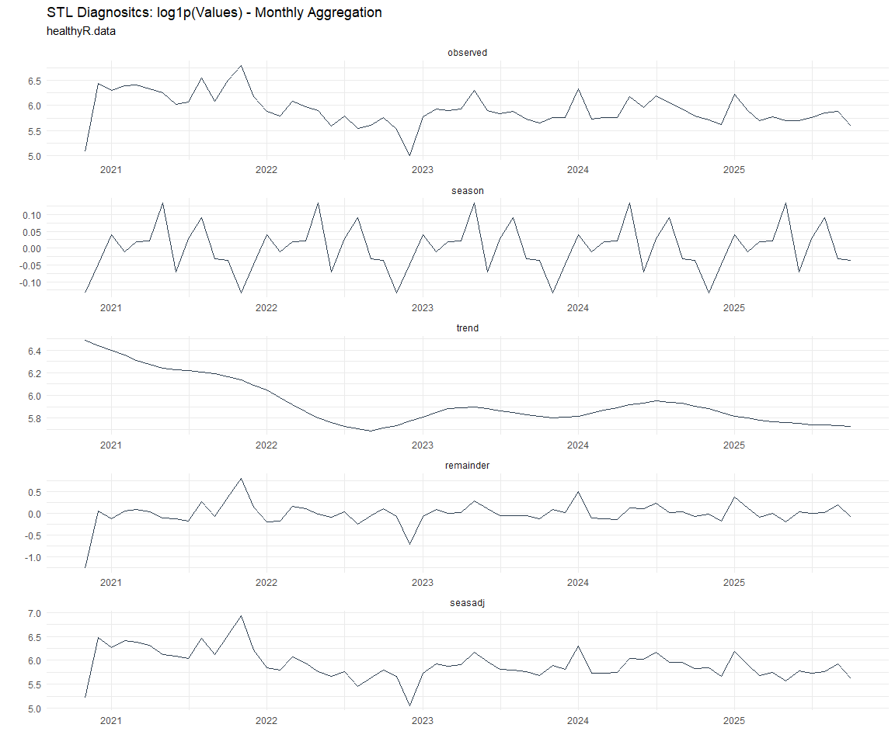

# Time Series Analysis, Modeling and Forecasting of the Healthyverse
Packages
Steven P. Sanderson II, MPH - Date:
2026-02-11

# Introduction

This analysis follows a *Nested Modeltime Workflow* from **`modeltime`**
along with using the **`NNS`** package. I use this to monitor the
downloads of all of my packages:

- [`healthyR`](https://www.spsanderson.com/healthyR/)
- [`healthyR.data`](https://www.spsanderson.com/healthyR.data/)
- [`healthyR.ts`](https://www.spsanderson.com/healthyR.ts/)
- [`healthyR.ai`](https://www.spsanderson.com/healthyR.ai/)
- [`healthyverse`](https://www.spsanderson.com/healthyverse/)
- [`TidyDensity`](https://www.spsanderson.com/TidyDensity/)
- [`tidyAML`](https://www.spsanderson.com/tidyAML/)
- [`RandomWalker`](https://www.spsanderson.com/RandomWalker/)

## Get Data

``` r
glimpse(downloads_tbl)
```

    Rows: 168,216
    Columns: 11
    $ date      <date> 2020-11-23, 2020-11-23, 2020-11-23, 2020-11-23, 2020-11-23,…
    $ time      <Period> 15H 36M 55S, 11H 26M 39S, 23H 34M 44S, 18H 39M 32S, 9H 0M…
    $ date_time <dttm> 2020-11-23 15:36:55, 2020-11-23 11:26:39, 2020-11-23 23:34:…
    $ size      <int> 4858294, 4858294, 4858301, 4858295, 361, 4863722, 4864794, 4…
    $ r_version <chr> NA, "4.0.3", "3.5.3", "3.5.2", NA, NA, NA, NA, NA, NA, NA, N…
    $ r_arch    <chr> NA, "x86_64", "x86_64", "x86_64", NA, NA, NA, NA, NA, NA, NA…
    $ r_os      <chr> NA, "mingw32", "mingw32", "linux-gnu", NA, NA, NA, NA, NA, N…
    $ package   <chr> "healthyR.data", "healthyR.data", "healthyR.data", "healthyR…
    $ version   <chr> "1.0.0", "1.0.0", "1.0.0", "1.0.0", "1.0.0", "1.0.0", "1.0.0…
    $ country   <chr> "US", "US", "US", "GB", "US", "US", "DE", "HK", "JP", "US", …
    $ ip_id     <int> 2069, 2804, 78827, 27595, 90474, 90474, 42435, 74, 7655, 638…

The last day in the data set is 2026-02-09 23:55:59, the file was
birthed on: 2025-10-31 10:47:59.603742, and at report knit time is
2433.13 hours old. Happy analyzing!

Now that we have our data lets take a look at it using the `skimr`
package.

``` r
skim(downloads_tbl)
```

|                                                  |               |
|:-------------------------------------------------|:--------------|
| Name                                             | downloads_tbl |
| Number of rows                                   | 168216        |
| Number of columns                                | 11            |
| \_\_\_\_\_\_\_\_\_\_\_\_\_\_\_\_\_\_\_\_\_\_\_   |               |
| Column type frequency:                           |               |
| character                                        | 6             |
| Date                                             | 1             |
| numeric                                          | 2             |
| POSIXct                                          | 1             |
| Timespan                                         | 1             |
| \_\_\_\_\_\_\_\_\_\_\_\_\_\_\_\_\_\_\_\_\_\_\_\_ |               |
| Group variables                                  | None          |

Data summary

**Variable type: character**

| skim_variable | n_missing | complete_rate | min | max | empty | n_unique | whitespace |
|:--------------|----------:|--------------:|----:|----:|------:|---------:|-----------:|
| r_version     |    124045 |          0.26 |   5 |   7 |     0 |       50 |          0 |
| r_arch        |    124045 |          0.26 |   1 |   7 |     0 |        6 |          0 |
| r_os          |    124045 |          0.26 |   7 |  19 |     0 |       24 |          0 |
| package       |         0 |          1.00 |   7 |  13 |     0 |        8 |          0 |
| version       |         0 |          1.00 |   5 |  17 |     0 |       63 |          0 |
| country       |     15765 |          0.91 |   2 |   2 |     0 |      166 |          0 |

**Variable type: Date**

| skim_variable | n_missing | complete_rate | min | max | median | n_unique |
|:---|---:|---:|:---|:---|:---|---:|
| date | 0 | 1 | 2020-11-23 | 2026-02-09 | 2023-12-06 | 1898 |

**Variable type: numeric**

| skim_variable | n_missing | complete_rate | mean | sd | p0 | p25 | p50 | p75 | p100 | hist |
|:---|---:|---:|---:|---:|---:|---:|---:|---:|---:|:---|
| size | 0 | 1 | 1126338.53 | 1484451.15 | 355 | 39317 | 322874 | 2348372 | 5677952 | ▇▁▂▁▁ |
| ip_id | 0 | 1 | 11217.98 | 21885.43 | 1 | 223 | 2789 | 11710 | 299146 | ▇▁▁▁▁ |

**Variable type: POSIXct**

| skim_variable | n_missing | complete_rate | min | max | median | n_unique |
|:---|---:|---:|:---|:---|:---|---:|
| date_time | 0 | 1 | 2020-11-23 09:00:41 | 2026-02-09 23:55:59 | 2023-12-06 15:44:40 | 106527 |

**Variable type: Timespan**

| skim_variable | n_missing | complete_rate | min | max | median | n_unique |
|:--------------|----------:|--------------:|----:|----:|-------:|---------:|
| time          |         0 |             1 |   0 |  59 |    1.5 |       60 |

We can see that the following columns are missing a lot of data and for
us are most likely not useful anyways, so we will drop them
`c(r_version, r_arch, r_os)`

## Plots

Now lets take a look at a time-series plot of the total daily downloads
by package. We will use a log scale and place a vertical line at each
version release for each package.


    [[1]]


    [[2]]


    [[3]]


    [[4]]


    [[5]]


    [[6]]


    [[7]]


    [[8]]


Now lets take a look at some time series decomposition graphs.

    [[1]]


    [[2]]


    [[3]]


    [[4]]


    [[5]]


    [[6]]


    [[7]]


    [[8]]


    [[1]]


    [[2]]


    [[3]]


    [[4]]


    [[5]]




    [[6]]


    [[7]]


    [[8]]


Seasonal Diagnostics:

    [[1]]


    [[2]]


    [[3]]


    [[4]]


    [[5]]


    [[6]]


    [[7]]


    [[8]]


ACF and PACF Diagnostics:

    [[1]]


    [[2]]


    [[3]]


    [[4]]


    [[5]]


    [[6]]


    [[7]]


    [[8]]


## Feature Engineering

Now that we have our basic data and a shot of what it looks like, let’s
add some features to our data which can be very helpful in modeling.
Lets start by making a `tibble` that is aggregated by the day and
package, as we are going to be interested in forecasting the next 4
weeks or 28 days for each package. First lets get our base data.


    Call:
    stats::lm(formula = .formula, data = df)

    Residuals:
        Min      1Q  Median      3Q     Max 
    -149.72  -37.10  -11.51   27.17  825.71 

    Coefficients:
                                                         Estimate Std. Error
    (Intercept)                                        -1.613e+02  5.675e+01
    date                                                1.011e-02  3.004e-03
    lag(value, 1)                                       9.927e-02  2.284e-02
    lag(value, 7)                                       8.602e-02  2.359e-02
    lag(value, 14)                                      7.349e-02  2.352e-02
    lag(value, 21)                                      8.222e-02  2.365e-02
    lag(value, 28)                                      6.805e-02  2.357e-02
    lag(value, 35)                                      4.949e-02  2.359e-02
    lag(value, 42)                                      7.338e-02  2.371e-02
    lag(value, 49)                                      6.799e-02  2.363e-02
    month(date, label = TRUE).L                        -8.665e+00  4.805e+00
    month(date, label = TRUE).Q                        -1.295e+00  4.744e+00
    month(date, label = TRUE).C                        -1.453e+01  4.796e+00
    month(date, label = TRUE)^4                        -7.606e+00  4.834e+00
    month(date, label = TRUE)^5                        -5.850e+00  4.816e+00
    month(date, label = TRUE)^6                         5.527e-01  4.860e+00
    month(date, label = TRUE)^7                        -4.156e+00  4.824e+00
    month(date, label = TRUE)^8                        -4.327e+00  4.816e+00
    month(date, label = TRUE)^9                         2.929e+00  4.837e+00
    month(date, label = TRUE)^10                        1.090e+00  4.855e+00
    month(date, label = TRUE)^11                       -4.283e+00  4.842e+00
    fourier_vec(date, type = "sin", K = 1, period = 7) -1.091e+01  2.168e+00
    fourier_vec(date, type = "cos", K = 1, period = 7)  7.268e+00  2.240e+00
                                                       t value Pr(>|t|)    
    (Intercept)                                         -2.842 0.004532 ** 
    date                                                 3.365 0.000781 ***
    lag(value, 1)                                        4.347 1.46e-05 ***
    lag(value, 7)                                        3.647 0.000273 ***
    lag(value, 14)                                       3.124 0.001812 ** 
    lag(value, 21)                                       3.477 0.000519 ***
    lag(value, 28)                                       2.887 0.003940 ** 
    lag(value, 35)                                       2.098 0.036027 *  
    lag(value, 42)                                       3.095 0.001997 ** 
    lag(value, 49)                                       2.877 0.004064 ** 
    month(date, label = TRUE).L                         -1.803 0.071487 .  
    month(date, label = TRUE).Q                         -0.273 0.784958    
    month(date, label = TRUE).C                         -3.029 0.002485 ** 
    month(date, label = TRUE)^4                         -1.573 0.115791    
    month(date, label = TRUE)^5                         -1.215 0.224662    
    month(date, label = TRUE)^6                          0.114 0.909471    
    month(date, label = TRUE)^7                         -0.862 0.389035    
    month(date, label = TRUE)^8                         -0.899 0.369015    
    month(date, label = TRUE)^9                          0.606 0.544904    
    month(date, label = TRUE)^10                         0.224 0.822470    
    month(date, label = TRUE)^11                        -0.885 0.376449    
    fourier_vec(date, type = "sin", K = 1, period = 7)  -5.031 5.37e-07 ***
    fourier_vec(date, type = "cos", K = 1, period = 7)   3.245 0.001194 ** 
    ---
    Signif. codes:  0 '***' 0.001 '**' 0.01 '*' 0.05 '.' 0.1 ' ' 1

    Residual standard error: 59.4 on 1826 degrees of freedom
      (49 observations deleted due to missingness)
    Multiple R-squared:  0.2199,    Adjusted R-squared:  0.2105 
    F-statistic:  23.4 on 22 and 1826 DF,  p-value: < 2.2e-16


## NNS Forecasting

This is something I have been wanting to try for a while. The `NNS`
package is a great package for forecasting time series data.

[NNS GitHub](https://github.com/OVVO-Financial/NNS)

``` r
library(NNS)

data_list <- base_data |>
    select(package, value) |>
    group_split(package)

data_list |>
    imap(
        \(x, idx) {
            obj <- x
            x <- obj |> pull(value) |> tail(7*52)
            train_set_size <- length(x) - 56
            pkg <- obj |> pluck(1) |> unique()
#            sf <- NNS.seas(x, modulo = 7, plot = FALSE)$periods
            seas <- t(
                sapply(
                    1:25, 
                    function(i) c(
                        i,
                        sqrt(
                            mean((
                                NNS.ARMA(x, 
                                         h = 28, 
                                         training.set = train_set_size, 
                                         method = "lin", 
                                         seasonal.factor = i, 
                                         plot=FALSE
                                         ) - tail(x, 28)) ^ 2)))
                    )
                )
            colnames(seas) <- c("Period", "RMSE")
            sf <- seas[which.min(seas[, 2]), 1]
            
            cat(paste0("Package: ", pkg, "\n"))
            NNS.ARMA.optim(
                variable = x,
                h = 28,
                training.set = train_set_size,
                #seasonal.factor = seq(12, 60, 7),
                seasonal.factor = sf,
                pred.int = 0.95,
                plot = TRUE
            )
            title(
                sub = paste0("\n",
                             "Package: ", pkg, " - NNS Optimization")
            )
        }
    )
```

    Package: healthyR
    [1] "CURRNET METHOD: lin"
    [1] "COPY LATEST PARAMETERS DIRECTLY FOR NNS.ARMA() IF ERROR:"
    [1] "NNS.ARMA(... method =  'lin' , seasonal.factor =  c( 3 ) ...)"
    [1] "CURRENT lin OBJECTIVE FUNCTION = 14.7769182026168"
    [1] "BEST method = 'lin' PATH MEMBER = c( 3 )"
    [1] "BEST lin OBJECTIVE FUNCTION = 14.7769182026168"
    [1] "CURRNET METHOD: nonlin"
    [1] "COPY LATEST PARAMETERS DIRECTLY FOR NNS.ARMA() IF ERROR:"
    [1] "NNS.ARMA(... method =  'nonlin' , seasonal.factor =  c( 3 ) ...)"
    [1] "CURRENT nonlin OBJECTIVE FUNCTION = 11.8686166890196"
    [1] "BEST method = 'nonlin' PATH MEMBER = c( 3 )"
    [1] "BEST nonlin OBJECTIVE FUNCTION = 11.8686166890196"
    [1] "CURRNET METHOD: both"
    [1] "COPY LATEST PARAMETERS DIRECTLY FOR NNS.ARMA() IF ERROR:"
    [1] "NNS.ARMA(... method =  'both' , seasonal.factor =  c( 3 ) ...)"
    [1] "CURRENT both OBJECTIVE FUNCTION = 13.3832787740318"
    [1] "BEST method = 'both' PATH MEMBER = c( 3 )"
    [1] "BEST both OBJECTIVE FUNCTION = 13.3832787740318"


    Package: healthyR.ai
    [1] "CURRNET METHOD: lin"
    [1] "COPY LATEST PARAMETERS DIRECTLY FOR NNS.ARMA() IF ERROR:"
    [1] "NNS.ARMA(... method =  'lin' , seasonal.factor =  c( 6 ) ...)"
    [1] "CURRENT lin OBJECTIVE FUNCTION = 79.8853952036472"
    [1] "BEST method = 'lin' PATH MEMBER = c( 6 )"
    [1] "BEST lin OBJECTIVE FUNCTION = 79.8853952036472"
    [1] "CURRNET METHOD: nonlin"
    [1] "COPY LATEST PARAMETERS DIRECTLY FOR NNS.ARMA() IF ERROR:"
    [1] "NNS.ARMA(... method =  'nonlin' , seasonal.factor =  c( 6 ) ...)"
    [1] "CURRENT nonlin OBJECTIVE FUNCTION = 4.55960520465043"
    [1] "BEST method = 'nonlin' PATH MEMBER = c( 6 )"
    [1] "BEST nonlin OBJECTIVE FUNCTION = 4.55960520465043"
    [1] "CURRNET METHOD: both"
    [1] "COPY LATEST PARAMETERS DIRECTLY FOR NNS.ARMA() IF ERROR:"
    [1] "NNS.ARMA(... method =  'both' , seasonal.factor =  c( 6 ) ...)"
    [1] "CURRENT both OBJECTIVE FUNCTION = 11.5799506531991"
    [1] "BEST method = 'both' PATH MEMBER = c( 6 )"
    [1] "BEST both OBJECTIVE FUNCTION = 11.5799506531991"


    Package: healthyR.data
    [1] "CURRNET METHOD: lin"
    [1] "COPY LATEST PARAMETERS DIRECTLY FOR NNS.ARMA() IF ERROR:"
    [1] "NNS.ARMA(... method =  'lin' , seasonal.factor =  c( 14 ) ...)"
    [1] "CURRENT lin OBJECTIVE FUNCTION = 6.74290796446193"
    [1] "BEST method = 'lin' PATH MEMBER = c( 14 )"
    [1] "BEST lin OBJECTIVE FUNCTION = 6.74290796446193"
    [1] "CURRNET METHOD: nonlin"
    [1] "COPY LATEST PARAMETERS DIRECTLY FOR NNS.ARMA() IF ERROR:"
    [1] "NNS.ARMA(... method =  'nonlin' , seasonal.factor =  c( 14 ) ...)"
    [1] "CURRENT nonlin OBJECTIVE FUNCTION = 5.63927669665161"
    [1] "BEST method = 'nonlin' PATH MEMBER = c( 14 )"
    [1] "BEST nonlin OBJECTIVE FUNCTION = 5.63927669665161"
    [1] "CURRNET METHOD: both"
    [1] "COPY LATEST PARAMETERS DIRECTLY FOR NNS.ARMA() IF ERROR:"
    [1] "NNS.ARMA(... method =  'both' , seasonal.factor =  c( 14 ) ...)"
    [1] "CURRENT both OBJECTIVE FUNCTION = 6.14945518374858"
    [1] "BEST method = 'both' PATH MEMBER = c( 14 )"
    [1] "BEST both OBJECTIVE FUNCTION = 6.14945518374858"


    Package: healthyR.ts
    [1] "CURRNET METHOD: lin"
    [1] "COPY LATEST PARAMETERS DIRECTLY FOR NNS.ARMA() IF ERROR:"
    [1] "NNS.ARMA(... method =  'lin' , seasonal.factor =  c( 10 ) ...)"
    [1] "CURRENT lin OBJECTIVE FUNCTION = 29.7221192888059"
    [1] "BEST method = 'lin' PATH MEMBER = c( 10 )"
    [1] "BEST lin OBJECTIVE FUNCTION = 29.7221192888059"
    [1] "CURRNET METHOD: nonlin"
    [1] "COPY LATEST PARAMETERS DIRECTLY FOR NNS.ARMA() IF ERROR:"
    [1] "NNS.ARMA(... method =  'nonlin' , seasonal.factor =  c( 10 ) ...)"
    [1] "CURRENT nonlin OBJECTIVE FUNCTION = 7.78364622641172"
    [1] "BEST method = 'nonlin' PATH MEMBER = c( 10 )"
    [1] "BEST nonlin OBJECTIVE FUNCTION = 7.78364622641172"
    [1] "CURRNET METHOD: both"
    [1] "COPY LATEST PARAMETERS DIRECTLY FOR NNS.ARMA() IF ERROR:"
    [1] "NNS.ARMA(... method =  'both' , seasonal.factor =  c( 10 ) ...)"
    [1] "CURRENT both OBJECTIVE FUNCTION = 10.7541165590785"
    [1] "BEST method = 'both' PATH MEMBER = c( 10 )"
    [1] "BEST both OBJECTIVE FUNCTION = 10.7541165590785"


    Package: healthyverse
    [1] "CURRNET METHOD: lin"
    [1] "COPY LATEST PARAMETERS DIRECTLY FOR NNS.ARMA() IF ERROR:"
    [1] "NNS.ARMA(... method =  'lin' , seasonal.factor =  c( 3 ) ...)"
    [1] "CURRENT lin OBJECTIVE FUNCTION = 45.9962711017639"
    [1] "BEST method = 'lin' PATH MEMBER = c( 3 )"
    [1] "BEST lin OBJECTIVE FUNCTION = 45.9962711017639"
    [1] "CURRNET METHOD: nonlin"
    [1] "COPY LATEST PARAMETERS DIRECTLY FOR NNS.ARMA() IF ERROR:"
    [1] "NNS.ARMA(... method =  'nonlin' , seasonal.factor =  c( 3 ) ...)"
    [1] "CURRENT nonlin OBJECTIVE FUNCTION = 8.44186057565311"
    [1] "BEST method = 'nonlin' PATH MEMBER = c( 3 )"
    [1] "BEST nonlin OBJECTIVE FUNCTION = 8.44186057565311"
    [1] "CURRNET METHOD: both"
    [1] "COPY LATEST PARAMETERS DIRECTLY FOR NNS.ARMA() IF ERROR:"
    [1] "NNS.ARMA(... method =  'both' , seasonal.factor =  c( 3 ) ...)"
    [1] "CURRENT both OBJECTIVE FUNCTION = 11.3383987023014"
    [1] "BEST method = 'both' PATH MEMBER = c( 3 )"
    [1] "BEST both OBJECTIVE FUNCTION = 11.3383987023014"


    Package: RandomWalker
    [1] "CURRNET METHOD: lin"
    [1] "COPY LATEST PARAMETERS DIRECTLY FOR NNS.ARMA() IF ERROR:"
    [1] "NNS.ARMA(... method =  'lin' , seasonal.factor =  c( 12 ) ...)"
    [1] "CURRENT lin OBJECTIVE FUNCTION = 6.89684289853628"
    [1] "BEST method = 'lin' PATH MEMBER = c( 12 )"
    [1] "BEST lin OBJECTIVE FUNCTION = 6.89684289853628"
    [1] "CURRNET METHOD: nonlin"
    [1] "COPY LATEST PARAMETERS DIRECTLY FOR NNS.ARMA() IF ERROR:"
    [1] "NNS.ARMA(... method =  'nonlin' , seasonal.factor =  c( 12 ) ...)"
    [1] "CURRENT nonlin OBJECTIVE FUNCTION = 4.98666721229567"
    [1] "BEST method = 'nonlin' PATH MEMBER = c( 12 )"
    [1] "BEST nonlin OBJECTIVE FUNCTION = 4.98666721229567"
    [1] "CURRNET METHOD: both"
    [1] "COPY LATEST PARAMETERS DIRECTLY FOR NNS.ARMA() IF ERROR:"
    [1] "NNS.ARMA(... method =  'both' , seasonal.factor =  c( 12 ) ...)"
    [1] "CURRENT both OBJECTIVE FUNCTION = 5.36820347195684"
    [1] "BEST method = 'both' PATH MEMBER = c( 12 )"
    [1] "BEST both OBJECTIVE FUNCTION = 5.36820347195684"


    Package: tidyAML
    [1] "CURRNET METHOD: lin"
    [1] "COPY LATEST PARAMETERS DIRECTLY FOR NNS.ARMA() IF ERROR:"
    [1] "NNS.ARMA(... method =  'lin' , seasonal.factor =  c( 5 ) ...)"
    [1] "CURRENT lin OBJECTIVE FUNCTION = 28.025314122231"
    [1] "BEST method = 'lin' PATH MEMBER = c( 5 )"
    [1] "BEST lin OBJECTIVE FUNCTION = 28.025314122231"
    [1] "CURRNET METHOD: nonlin"
    [1] "COPY LATEST PARAMETERS DIRECTLY FOR NNS.ARMA() IF ERROR:"
    [1] "NNS.ARMA(... method =  'nonlin' , seasonal.factor =  c( 5 ) ...)"
    [1] "CURRENT nonlin OBJECTIVE FUNCTION = 11.5385876690948"
    [1] "BEST method = 'nonlin' PATH MEMBER = c( 5 )"
    [1] "BEST nonlin OBJECTIVE FUNCTION = 11.5385876690948"
    [1] "CURRNET METHOD: both"
    [1] "COPY LATEST PARAMETERS DIRECTLY FOR NNS.ARMA() IF ERROR:"
    [1] "NNS.ARMA(... method =  'both' , seasonal.factor =  c( 5 ) ...)"
    [1] "CURRENT both OBJECTIVE FUNCTION = 28.7308508546863"
    [1] "BEST method = 'both' PATH MEMBER = c( 5 )"
    [1] "BEST both OBJECTIVE FUNCTION = 28.7308508546863"


    Package: TidyDensity
    [1] "CURRNET METHOD: lin"
    [1] "COPY LATEST PARAMETERS DIRECTLY FOR NNS.ARMA() IF ERROR:"
    [1] "NNS.ARMA(... method =  'lin' , seasonal.factor =  c( 3 ) ...)"
    [1] "CURRENT lin OBJECTIVE FUNCTION = 8.84807136628898"
    [1] "BEST method = 'lin' PATH MEMBER = c( 3 )"
    [1] "BEST lin OBJECTIVE FUNCTION = 8.84807136628898"
    [1] "CURRNET METHOD: nonlin"
    [1] "COPY LATEST PARAMETERS DIRECTLY FOR NNS.ARMA() IF ERROR:"
    [1] "NNS.ARMA(... method =  'nonlin' , seasonal.factor =  c( 3 ) ...)"
    [1] "CURRENT nonlin OBJECTIVE FUNCTION = 6.18131075880801"
    [1] "BEST method = 'nonlin' PATH MEMBER = c( 3 )"
    [1] "BEST nonlin OBJECTIVE FUNCTION = 6.18131075880801"
    [1] "CURRNET METHOD: both"
    [1] "COPY LATEST PARAMETERS DIRECTLY FOR NNS.ARMA() IF ERROR:"
    [1] "NNS.ARMA(... method =  'both' , seasonal.factor =  c( 3 ) ...)"
    [1] "CURRENT both OBJECTIVE FUNCTION = 6.41057017210278"
    [1] "BEST method = 'both' PATH MEMBER = c( 3 )"
    [1] "BEST both OBJECTIVE FUNCTION = 6.41057017210278"


    [[1]]
    NULL

    [[2]]
    NULL

    [[3]]
    NULL

    [[4]]
    NULL

    [[5]]
    NULL

    [[6]]
    NULL

    [[7]]
    NULL

    [[8]]
    NULL

## Pre-Processing

Now we are going to do some basic pre-processing.

``` r
data_padded_tbl <- base_data %>%
  pad_by_time(
    .date_var  = date,
    .pad_value = 0
  )

# Get log interval and standardization parameters
log_params  <- liv(data_padded_tbl$value, limit_lower = 0, offset = 1, silent = TRUE)
limit_lower <- log_params$limit_lower
limit_upper <- log_params$limit_upper
offset      <- log_params$offset

data_liv_tbl <- data_padded_tbl %>%
  # Get log interval transform
  mutate(value_trans = liv(value, limit_lower = 0, offset = 1, silent = TRUE)$log_scaled)

# Get Standardization Params
std_params <- standard_vec(data_liv_tbl$value_trans, silent = TRUE)
std_mean   <- std_params$mean
std_sd     <- std_params$sd

data_transformed_tbl <- data_liv_tbl %>%
  group_by(package) %>%
  # get standardization
  mutate(value_trans = standard_vec(value_trans, silent = TRUE)$standard_scaled) %>%
  tk_augment_fourier(
    .date_var = date,
    .periods  = c(7, 14, 30, 90, 180),
    .K        = 2
  ) %>%
  tk_augment_timeseries_signature(
    .date_var = date
  ) %>%
  ungroup() %>%
  select(-c(value, -year.iso))
```

Since this is panel data we can follow one of two different modeling
strategies. We can search for a global model in the panel data or we can
use nested forecasting finding the best model for each of the time
series. Since we only have 5 panels, we will use nested forecasting.

To do this we will use the `nest_timeseries` and
`split_nested_timeseries` functions to create a nested `tibble`.

``` r
horizon <- 4*7

nested_data_tbl <- data_transformed_tbl %>%

    # 0. Filter out column where package is NA
    filter(!is.na(package)) %>%
    
    # 1. Extending: We'll predict n days into the future.
    extend_timeseries(
        .id_var        = package,
        .date_var      = date,
        .length_future = horizon
    ) %>%
    
    # 2. Nesting: We'll group by id, and create a future dataset
    #    that forecasts n days of extended data and
    #    an actual dataset that contains n*2 days
    nest_timeseries(
        .id_var        = package,
        .length_future = horizon
        #.length_actual = horizon*2
    ) %>%
    
   # 3. Splitting: We'll take the actual data and create splits
   #    for accuracy and confidence interval estimation of n das (test)
   #    and the rest is training data
    split_nested_timeseries(
        .length_test = horizon
    )

nested_data_tbl
```

    # A tibble: 8 × 4
      package       .actual_data          .future_data       .splits          
      <fct>         <list>                <list>             <list>           
    1 healthyR.data <tibble [1,888 × 50]> <tibble [28 × 50]> <split [1860|28]>
    2 healthyR      <tibble [1,881 × 50]> <tibble [28 × 50]> <split [1853|28]>
    3 healthyR.ts   <tibble [1,817 × 50]> <tibble [28 × 50]> <split [1789|28]>
    4 healthyverse  <tibble [1,779 × 50]> <tibble [28 × 50]> <split [1751|28]>
    5 healthyR.ai   <tibble [1,623 × 50]> <tibble [28 × 50]> <split [1595|28]>
    6 TidyDensity   <tibble [1,474 × 50]> <tibble [28 × 50]> <split [1446|28]>
    7 tidyAML       <tibble [1,080 × 50]> <tibble [28 × 50]> <split [1052|28]>
    8 RandomWalker  <tibble [504 × 50]>   <tibble [28 × 50]> <split [476|28]> 

Now it is time to make some recipes and models using the modeltime
workflow.

## Modeltime Workflow

### Recipe Object

``` r
recipe_base <- recipe(
  value_trans ~ .
  , data = extract_nested_test_split(nested_data_tbl)
  )

recipe_base

recipe_date <- recipe(
  value_trans ~ date
  , data = extract_nested_test_split(nested_data_tbl)
  )
```

### Models

``` r
# Models ------------------------------------------------------------------

# Auto ARIMA --------------------------------------------------------------

model_spec_arima_no_boost <- arima_reg() %>%
  set_engine(engine = "auto_arima")

wflw_auto_arima <- workflow() %>%
  add_recipe(recipe = recipe_date) %>%
  add_model(model_spec_arima_no_boost)

# NNETAR ------------------------------------------------------------------

model_spec_nnetar <- nnetar_reg(
  mode              = "regression"
  , seasonal_period = "auto"
) %>%
  set_engine("nnetar")

wflw_nnetar <- workflow() %>%
  add_recipe(recipe = recipe_base) %>%
  add_model(model_spec_nnetar)

# TSLM --------------------------------------------------------------------

model_spec_lm <- linear_reg() %>%
  set_engine("lm")

wflw_lm <- workflow() %>%
  add_recipe(recipe = recipe_base) %>%
  add_model(model_spec_lm)

# MARS --------------------------------------------------------------------

model_spec_mars <- mars(mode = "regression") %>%
  set_engine("earth")

wflw_mars <- workflow() %>%
  add_recipe(recipe = recipe_date) %>%
  add_model(model_spec_mars)
```

### Nested Modeltime Tables

``` r
nested_modeltime_tbl <- modeltime_nested_fit(
  # Nested Data
  nested_data = nested_data_tbl,
   control = control_nested_fit(
     verbose = TRUE,
     allow_par = FALSE
   ),
  # Add workflows
  wflw_auto_arima,
  wflw_lm,
  wflw_mars,
  wflw_nnetar
)
```

``` r
nested_modeltime_tbl <- nested_modeltime_tbl[!is.na(nested_modeltime_tbl$package),]
```

### Model Accuracy

``` r
nested_modeltime_tbl %>%
  extract_nested_test_accuracy() %>%
  filter(!is.na(package)) %>%
  knitr::kable()
```

| package | .model_id | .model_desc | .type | mae | mape | mase | smape | rmse | rsq |
|:---|---:|:---|:---|---:|---:|---:|---:|---:|---:|
| healthyR.data | 1 | ARIMA | Test | 0.7256343 | 105.76031 | 0.7758714 | 135.37530 | 0.9410775 | 0.0405746 |
| healthyR.data | 2 | LM | Test | 0.7399511 | 108.72956 | 0.7911793 | 155.75864 | 0.9408272 | 0.0007768 |
| healthyR.data | 3 | EARTH | Test | 0.7277004 | 103.20006 | 0.7780805 | 130.73711 | 0.9579477 | 0.0530798 |
| healthyR.data | 4 | NNAR | Test | 0.8666575 | 140.40468 | 0.9266579 | 169.78914 | 1.0491261 | 0.0450809 |
| healthyR | 1 | ARIMA | Test | 0.6882600 | 543.36562 | 0.6203220 | 129.30796 | 0.9157810 | 0.0972937 |
| healthyR | 2 | LM | Test | 0.6487418 | 663.78619 | 0.5847047 | 118.06466 | 0.8878819 | 0.0766797 |
| healthyR | 3 | EARTH | Test | 0.6253358 | 687.52520 | 0.5636091 | 108.47129 | 0.8592869 | 0.0110346 |
| healthyR | 4 | NNAR | Test | 0.7120276 | 771.34592 | 0.6417436 | 130.95805 | 0.9595608 | 0.0293689 |
| healthyR.ts | 1 | ARIMA | Test | 0.8939423 | 165.75362 | 0.7134944 | 147.29848 | 1.1362555 | 0.0372383 |
| healthyR.ts | 2 | LM | Test | 1.0344229 | 180.93067 | 0.8256181 | 159.96723 | 1.3098862 | 0.0478026 |
| healthyR.ts | 3 | EARTH | Test | 1.1008573 | 447.90601 | 0.8786423 | 126.73984 | 1.3481651 | 0.1246740 |
| healthyR.ts | 4 | NNAR | Test | 1.0665645 | 161.54045 | 0.8512717 | 151.56963 | 1.3796775 | 0.1046320 |
| healthyverse | 1 | ARIMA | Test | 1.2012122 | 80.14047 | 1.5230350 | 120.16618 | 1.3161497 | 0.0805966 |
| healthyverse | 2 | LM | Test | 1.1393865 | 74.27011 | 1.4446452 | 113.12717 | 1.2892443 | 0.0351855 |
| healthyverse | 3 | EARTH | Test | 0.7102328 | 61.76624 | 0.9005148 | 56.40334 | 0.8080408 | 0.0033607 |
| healthyverse | 4 | NNAR | Test | 1.1149384 | 71.48431 | 1.4136471 | 113.67614 | 1.2879153 | 0.0956425 |
| healthyR.ai | 1 | ARIMA | Test | 0.5213950 | 82.39500 | 0.7914574 | 108.16865 | 0.6700210 | 0.0435973 |
| healthyR.ai | 2 | LM | Test | 0.5985968 | 173.50898 | 0.9086467 | 130.97896 | 0.7215702 | 0.1740871 |
| healthyR.ai | 3 | EARTH | Test | 0.4649703 | 167.73812 | 0.7058069 | 81.08518 | 0.5952370 | 0.0004279 |
| healthyR.ai | 4 | NNAR | Test | 0.6136607 | 200.22367 | 0.9315131 | 124.87658 | 0.7289253 | 0.2036525 |
| TidyDensity | 1 | ARIMA | Test | 1.0589615 | 133.92683 | 0.6031556 | 178.53379 | 1.2120334 | 0.0760846 |
| TidyDensity | 2 | LM | Test | 1.1024394 | 208.84243 | 0.6279194 | 164.47243 | 1.2088699 | 0.0384891 |
| TidyDensity | 3 | EARTH | Test | 1.0144208 | 110.56745 | 0.5777864 | 186.28912 | 1.1989025 | 0.0009217 |
| TidyDensity | 4 | NNAR | Test | 1.0641462 | 173.00482 | 0.6061087 | 164.27274 | 1.1984306 | 0.0233602 |
| tidyAML | 1 | ARIMA | Test | 0.4792721 | 219.72210 | 0.6579866 | 102.42904 | 0.6195269 | 0.0422312 |
| tidyAML | 2 | LM | Test | 0.6206845 | 273.62601 | 0.8521298 | 144.37189 | 0.8207379 | 0.0400704 |
| tidyAML | 3 | EARTH | Test | 0.9831717 | 691.65994 | 1.3497840 | 118.73287 | 1.1059787 | 0.0246141 |
| tidyAML | 4 | NNAR | Test | 0.4919983 | 257.68715 | 0.6754582 | 125.20273 | 0.6961799 | 0.0532333 |
| RandomWalker | 1 | ARIMA | Test | 0.8597807 | 117.01543 | 0.5313258 | 154.03383 | 0.9754695 | 0.2168543 |
| RandomWalker | 2 | LM | Test | 0.9539091 | 122.78620 | 0.5894951 | 168.60521 | 1.0803983 | 0.0004643 |
| RandomWalker | 3 | EARTH | Test | 0.9158975 | 102.32569 | 0.5660047 | 162.88299 | 1.0763887 | 0.0000200 |
| RandomWalker | 4 | NNAR | Test | 1.2035955 | 219.35272 | 0.7437959 | 164.29175 | 1.2979974 | 0.0351433 |

### Plot Models

``` r
nested_modeltime_tbl %>%
  extract_nested_test_forecast() %>%
  group_by(package) %>%
  filter_by_time(.date_var = .index, .start_date = max(.index) - 60) %>%
  ungroup() %>%
  plot_modeltime_forecast(
    .interactive = FALSE,
    .conf_interval_show  = FALSE,
    .facet_scales = "free"
  ) +
  theme_minimal() +
  facet_wrap(~ package, nrow = 3) +
  theme(legend.position = "bottom")
```


### Best Model

``` r
best_nested_modeltime_tbl <- nested_modeltime_tbl %>%
  modeltime_nested_select_best(
    metric = "rmse",
    minimize = TRUE,
    filter_test_forecasts = TRUE
  )

best_nested_modeltime_tbl %>%
  extract_nested_best_model_report()
```

    # Nested Modeltime Table
      

    # A tibble: 8 × 10
      package      .model_id .model_desc .type   mae  mape  mase smape  rmse     rsq
      <fct>            <int> <chr>       <chr> <dbl> <dbl> <dbl> <dbl> <dbl>   <dbl>
    1 healthyR.da…         2 LM          Test  0.740 109.  0.791 156.  0.941 7.77e-4
    2 healthyR             3 EARTH       Test  0.625 688.  0.564 108.  0.859 1.10e-2
    3 healthyR.ts          1 ARIMA       Test  0.894 166.  0.713 147.  1.14  3.72e-2
    4 healthyverse         3 EARTH       Test  0.710  61.8 0.901  56.4 0.808 3.36e-3
    5 healthyR.ai          3 EARTH       Test  0.465 168.  0.706  81.1 0.595 4.28e-4
    6 TidyDensity          4 NNAR        Test  1.06  173.  0.606 164.  1.20  2.34e-2
    7 tidyAML              1 ARIMA       Test  0.479 220.  0.658 102.  0.620 4.22e-2
    8 RandomWalker         1 ARIMA       Test  0.860 117.  0.531 154.  0.975 2.17e-1

``` r
best_nested_modeltime_tbl %>%
  extract_nested_test_forecast() %>%
  #filter(!is.na(.model_id)) %>%
  group_by(package) %>%
  filter_by_time(.date_var = .index, .start_date = max(.index) - 60) %>%
  ungroup() %>%
  plot_modeltime_forecast(
    .interactive = FALSE,
    .conf_interval_alpha = 0.2,
    .facet_scales = "free"
  ) +
  facet_wrap(~ package, nrow = 3) +
  theme_minimal() +
  theme(legend.position = "bottom")
```


## Refitting and Future Forecast

Now that we have the best models, we can make our future forecasts.

``` r
nested_modeltime_refit_tbl <- best_nested_modeltime_tbl %>%
    modeltime_nested_refit(
        control = control_nested_refit(verbose = TRUE)
    )
```

``` r
nested_modeltime_refit_tbl
```

    # Nested Modeltime Table
      

    # A tibble: 8 × 5
      package       .actual_data .future_data .splits           .modeltime_tables 
      <fct>         <list>       <list>       <list>            <list>            
    1 healthyR.data <tibble>     <tibble>     <split [1860|28]> <mdl_tm_t [1 × 5]>
    2 healthyR      <tibble>     <tibble>     <split [1853|28]> <mdl_tm_t [1 × 5]>
    3 healthyR.ts   <tibble>     <tibble>     <split [1789|28]> <mdl_tm_t [1 × 5]>
    4 healthyverse  <tibble>     <tibble>     <split [1751|28]> <mdl_tm_t [1 × 5]>
    5 healthyR.ai   <tibble>     <tibble>     <split [1595|28]> <mdl_tm_t [1 × 5]>
    6 TidyDensity   <tibble>     <tibble>     <split [1446|28]> <mdl_tm_t [1 × 5]>
    7 tidyAML       <tibble>     <tibble>     <split [1052|28]> <mdl_tm_t [1 × 5]>
    8 RandomWalker  <tibble>     <tibble>     <split [476|28]>  <mdl_tm_t [1 × 5]>

``` r
nested_modeltime_refit_tbl %>%
  extract_nested_future_forecast() %>%
  group_by(package) %>%
  mutate(across(.value:.conf_hi, .fns = ~ standard_inv_vec(
    x    = .,
    mean = std_mean,
    sd   = std_sd
  )$standard_inverse_value)) %>%
  mutate(across(.value:.conf_hi, .fns = ~ liiv(
    x = .,
    limit_lower = limit_lower,
    limit_upper = limit_upper,
    offset      = offset
  )$rescaled_v)) %>%
  filter_by_time(.date_var = .index, .start_date = max(.index) - 60) %>%
  ungroup() %>%
  plot_modeltime_forecast(
    .interactive = FALSE,
    .conf_interval_alpha = 0.2,
    .facet_scales = "free"
  ) +
  facet_wrap(~ package, nrow = 3) +
  theme_minimal() +
  theme(legend.position = "bottom")
```


