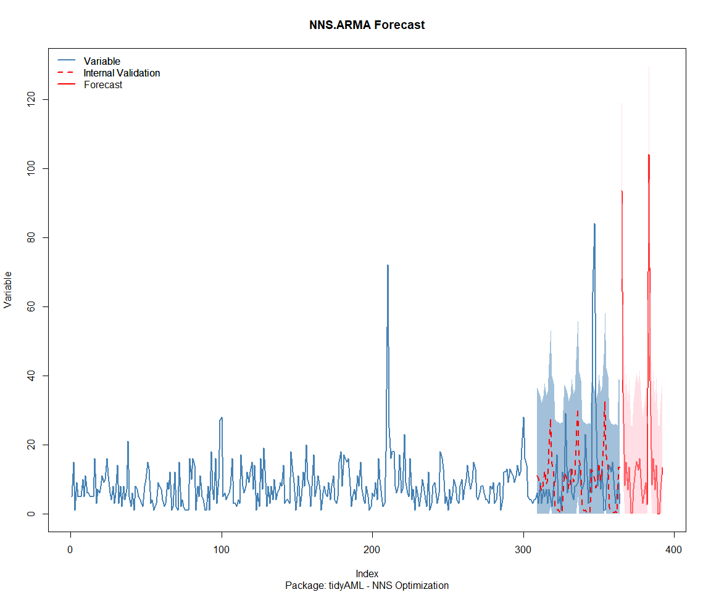

# Time Series Analysis, Modeling and Forecasting of the Healthyverse
Packages
Steven P. Sanderson II, MPH - Date:
2026-01-26

# Introduction

This analysis follows a *Nested Modeltime Workflow* from **`modeltime`**
along with using the **`NNS`** package. I use this to monitor the
downloads of all of my packages:

- [`healthyR`](https://www.spsanderson.com/healthyR/)
- [`healthyR.data`](https://www.spsanderson.com/healthyR.data/)
- [`healthyR.ts`](https://www.spsanderson.com/healthyR.ts/)
- [`healthyR.ai`](https://www.spsanderson.com/healthyR.ai/)
- [`healthyverse`](https://www.spsanderson.com/healthyverse/)
- [`TidyDensity`](https://www.spsanderson.com/TidyDensity/)
- [`tidyAML`](https://www.spsanderson.com/tidyAML/)
- [`RandomWalker`](https://www.spsanderson.com/RandomWalker/)

## Get Data

``` r
glimpse(downloads_tbl)
```

    Rows: 166,657
    Columns: 11
    $ date      <date> 2020-11-23, 2020-11-23, 2020-11-23, 2020-11-23, 2020-11-23,…
    $ time      <Period> 15H 36M 55S, 11H 26M 39S, 23H 34M 44S, 18H 39M 32S, 9H 0M…
    $ date_time <dttm> 2020-11-23 15:36:55, 2020-11-23 11:26:39, 2020-11-23 23:34:…
    $ size      <int> 4858294, 4858294, 4858301, 4858295, 361, 4863722, 4864794, 4…
    $ r_version <chr> NA, "4.0.3", "3.5.3", "3.5.2", NA, NA, NA, NA, NA, NA, NA, N…
    $ r_arch    <chr> NA, "x86_64", "x86_64", "x86_64", NA, NA, NA, NA, NA, NA, NA…
    $ r_os      <chr> NA, "mingw32", "mingw32", "linux-gnu", NA, NA, NA, NA, NA, N…
    $ package   <chr> "healthyR.data", "healthyR.data", "healthyR.data", "healthyR…
    $ version   <chr> "1.0.0", "1.0.0", "1.0.0", "1.0.0", "1.0.0", "1.0.0", "1.0.0…
    $ country   <chr> "US", "US", "US", "GB", "US", "US", "DE", "HK", "JP", "US", …
    $ ip_id     <int> 2069, 2804, 78827, 27595, 90474, 90474, 42435, 74, 7655, 638…

The last day in the data set is 2026-01-24 23:32:41, the file was
birthed on: 2022-07-02 23:58:17.511888, and at report knit time is
3.124357^{4} hours old. Happy analyzing!

Now that we have our data lets take a look at it using the `skimr`
package.

``` r
skim(downloads_tbl)
```

|                                                  |               |
|:-------------------------------------------------|:--------------|
| Name                                             | downloads_tbl |
| Number of rows                                   | 166657        |
| Number of columns                                | 11            |
| \_\_\_\_\_\_\_\_\_\_\_\_\_\_\_\_\_\_\_\_\_\_\_   |               |
| Column type frequency:                           |               |
| character                                        | 6             |
| Date                                             | 1             |
| numeric                                          | 2             |
| POSIXct                                          | 1             |
| Timespan                                         | 1             |
| \_\_\_\_\_\_\_\_\_\_\_\_\_\_\_\_\_\_\_\_\_\_\_\_ |               |
| Group variables                                  | None          |

Data summary

**Variable type: character**

| skim_variable | n_missing | complete_rate | min | max | empty | n_unique | whitespace |
|:--------------|----------:|--------------:|----:|----:|------:|---------:|-----------:|
| r_version     |    122745 |          0.26 |   5 |   7 |     0 |       50 |          0 |
| r_arch        |    122745 |          0.26 |   1 |   7 |     0 |        6 |          0 |
| r_os          |    122745 |          0.26 |   7 |  19 |     0 |       24 |          0 |
| package       |         0 |          1.00 |   7 |  13 |     0 |        8 |          0 |
| version       |         0 |          1.00 |   5 |  17 |     0 |       63 |          0 |
| country       |     15580 |          0.91 |   2 |   2 |     0 |      166 |          0 |

**Variable type: Date**

| skim_variable | n_missing | complete_rate | min | max | median | n_unique |
|:---|---:|---:|:---|:---|:---|---:|
| date | 0 | 1 | 2020-11-23 | 2026-01-24 | 2023-11-29 | 1882 |

**Variable type: numeric**

| skim_variable | n_missing | complete_rate | mean | sd | p0 | p25 | p50 | p75 | p100 | hist |
|:---|---:|---:|---:|---:|---:|---:|---:|---:|---:|:---|
| size | 0 | 1 | 1124552.64 | 1485159.2 | 355 | 34388 | 312990 | 2347869 | 5677952 | ▇▁▂▁▁ |
| ip_id | 0 | 1 | 11210.12 | 21833.1 | 1 | 223 | 2795 | 11729 | 299146 | ▇▁▁▁▁ |

**Variable type: POSIXct**

| skim_variable | n_missing | complete_rate | min | max | median | n_unique |
|:---|---:|---:|:---|:---|:---|---:|
| date_time | 0 | 1 | 2020-11-23 09:00:41 | 2026-01-24 23:32:41 | 2023-11-29 16:27:48 | 105431 |

**Variable type: Timespan**

| skim_variable | n_missing | complete_rate | min | max |     median | n_unique |
|:--------------|----------:|--------------:|----:|----:|-----------:|---------:|
| time          |         0 |             1 |   0 |  59 | 12H 6M 41S |       60 |

We can see that the following columns are missing a lot of data and for
us are most likely not useful anyways, so we will drop them
`c(r_version, r_arch, r_os)`

## Plots

Now lets take a look at a time-series plot of the total daily downloads
by package. We will use a log scale and place a vertical line at each
version release for each package.


    [[1]]


    [[2]]


    [[3]]


    [[4]]


    [[5]]


    [[6]]


    [[7]]


    [[8]]


Now lets take a look at some time series decomposition graphs.

    [[1]]


    [[2]]


    [[3]]


    [[4]]


    [[5]]


    [[6]]


    [[7]]


    [[8]]


    [[1]]


    [[2]]


    [[3]]


    [[4]]


    [[5]]


    [[6]]


    [[7]]


    [[8]]


Seasonal Diagnostics:

    [[1]]


    [[2]]


    [[3]]


    [[4]]


    [[5]]


    [[6]]


    [[7]]


    [[8]]


ACF and PACF Diagnostics:

    [[1]]


    [[2]]


    [[3]]


    [[4]]


    [[5]]


    [[6]]


    [[7]]


    [[8]]


## Feature Engineering

Now that we have our basic data and a shot of what it looks like, let’s
add some features to our data which can be very helpful in modeling.
Lets start by making a `tibble` that is aggregated by the day and
package, as we are going to be interested in forecasting the next 4
weeks or 28 days for each package. First lets get our base data.


    Call:
    stats::lm(formula = .formula, data = df)

    Residuals:
        Min      1Q  Median      3Q     Max 
    -148.48  -37.08  -11.39   27.19  823.80 

    Coefficients:
                                                         Estimate Std. Error
    (Intercept)                                        -1.620e+02  5.769e+01
    date                                                1.011e-02  3.054e-03
    lag(value, 1)                                       1.042e-01  2.291e-02
    lag(value, 7)                                       9.029e-02  2.370e-02
    lag(value, 14)                                      7.846e-02  2.366e-02
    lag(value, 21)                                      8.500e-02  2.373e-02
    lag(value, 28)                                      6.329e-02  2.366e-02
    lag(value, 35)                                      5.229e-02  2.366e-02
    lag(value, 42)                                      6.811e-02  2.376e-02
    lag(value, 49)                                      6.574e-02  2.368e-02
    month(date, label = TRUE).L                        -8.920e+00  4.853e+00
    month(date, label = TRUE).Q                        -9.937e-01  4.763e+00
    month(date, label = TRUE).C                        -1.456e+01  4.807e+00
    month(date, label = TRUE)^4                        -7.236e+00  4.860e+00
    month(date, label = TRUE)^5                        -5.849e+00  4.850e+00
    month(date, label = TRUE)^6                         7.114e-01  4.894e+00
    month(date, label = TRUE)^7                        -4.132e+00  4.842e+00
    month(date, label = TRUE)^8                        -4.227e+00  4.820e+00
    month(date, label = TRUE)^9                         2.878e+00  4.834e+00
    month(date, label = TRUE)^10                        8.846e-01  4.851e+00
    month(date, label = TRUE)^11                       -4.105e+00  4.837e+00
    fourier_vec(date, type = "sin", K = 1, period = 7) -1.083e+01  2.177e+00
    fourier_vec(date, type = "cos", K = 1, period = 7)  7.094e+00  2.251e+00
                                                       t value Pr(>|t|)    
    (Intercept)                                         -2.809 0.005026 ** 
    date                                                 3.311 0.000947 ***
    lag(value, 1)                                        4.548 5.77e-06 ***
    lag(value, 7)                                        3.810 0.000144 ***
    lag(value, 14)                                       3.317 0.000929 ***
    lag(value, 21)                                       3.582 0.000350 ***
    lag(value, 28)                                       2.675 0.007534 ** 
    lag(value, 35)                                       2.210 0.027253 *  
    lag(value, 42)                                       2.866 0.004202 ** 
    lag(value, 49)                                       2.776 0.005561 ** 
    month(date, label = TRUE).L                         -1.838 0.066204 .  
    month(date, label = TRUE).Q                         -0.209 0.834762    
    month(date, label = TRUE).C                         -3.028 0.002495 ** 
    month(date, label = TRUE)^4                         -1.489 0.136681    
    month(date, label = TRUE)^5                         -1.206 0.227988    
    month(date, label = TRUE)^6                          0.145 0.884440    
    month(date, label = TRUE)^7                         -0.853 0.393590    
    month(date, label = TRUE)^8                         -0.877 0.380652    
    month(date, label = TRUE)^9                          0.595 0.551678    
    month(date, label = TRUE)^10                         0.182 0.855318    
    month(date, label = TRUE)^11                        -0.849 0.396203    
    fourier_vec(date, type = "sin", K = 1, period = 7)  -4.975 7.15e-07 ***
    fourier_vec(date, type = "cos", K = 1, period = 7)   3.151 0.001651 ** 
    ---
    Signif. codes:  0 '***' 0.001 '**' 0.01 '*' 0.05 '.' 0.1 ' ' 1

    Residual standard error: 59.34 on 1810 degrees of freedom
      (49 observations deleted due to missingness)
    Multiple R-squared:  0.2229,    Adjusted R-squared:  0.2134 
    F-statistic: 23.59 on 22 and 1810 DF,  p-value: < 2.2e-16


## NNS Forecasting

This is something I have been wanting to try for a while. The `NNS`
package is a great package for forecasting time series data.

[NNS GitHub](https://github.com/OVVO-Financial/NNS)

``` r
library(NNS)

data_list <- base_data |>
    select(package, value) |>
    group_split(package)

data_list |>
    imap(
        \(x, idx) {
            obj <- x
            x <- obj |> pull(value) |> tail(7*52)
            train_set_size <- length(x) - 56
            pkg <- obj |> pluck(1) |> unique()
#            sf <- NNS.seas(x, modulo = 7, plot = FALSE)$periods
            seas <- t(
                sapply(
                    1:25, 
                    function(i) c(
                        i,
                        sqrt(
                            mean((
                                NNS.ARMA(x, 
                                         h = 28, 
                                         training.set = train_set_size, 
                                         method = "lin", 
                                         seasonal.factor = i, 
                                         plot=FALSE
                                         ) - tail(x, 28)) ^ 2)))
                    )
                )
            colnames(seas) <- c("Period", "RMSE")
            sf <- seas[which.min(seas[, 2]), 1]
            
            cat(paste0("Package: ", pkg, "\n"))
            NNS.ARMA.optim(
                variable = x,
                h = 28,
                training.set = train_set_size,
                #seasonal.factor = seq(12, 60, 7),
                seasonal.factor = sf,
                pred.int = 0.95,
                plot = TRUE
            )
            title(
                sub = paste0("\n",
                             "Package: ", pkg, " - NNS Optimization")
            )
        }
    )
```

    Package: healthyR
    [1] "CURRNET METHOD: lin"
    [1] "COPY LATEST PARAMETERS DIRECTLY FOR NNS.ARMA() IF ERROR:"
    [1] "NNS.ARMA(... method =  'lin' , seasonal.factor =  c( 25 ) ...)"
    [1] "CURRENT lin OBJECTIVE FUNCTION = 5.28077275350068"
    [1] "BEST method = 'lin' PATH MEMBER = c( 25 )"
    [1] "BEST lin OBJECTIVE FUNCTION = 5.28077275350068"
    [1] "CURRNET METHOD: nonlin"
    [1] "COPY LATEST PARAMETERS DIRECTLY FOR NNS.ARMA() IF ERROR:"
    [1] "NNS.ARMA(... method =  'nonlin' , seasonal.factor =  c( 25 ) ...)"
    [1] "CURRENT nonlin OBJECTIVE FUNCTION = 5.1365585150193"
    [1] "BEST method = 'nonlin' PATH MEMBER = c( 25 )"
    [1] "BEST nonlin OBJECTIVE FUNCTION = 5.1365585150193"
    [1] "CURRNET METHOD: both"
    [1] "COPY LATEST PARAMETERS DIRECTLY FOR NNS.ARMA() IF ERROR:"
    [1] "NNS.ARMA(... method =  'both' , seasonal.factor =  c( 25 ) ...)"
    [1] "CURRENT both OBJECTIVE FUNCTION = 4.27422107115088"
    [1] "BEST method = 'both' PATH MEMBER = c( 25 )"
    [1] "BEST both OBJECTIVE FUNCTION = 4.27422107115088"


    Package: healthyR.ai
    [1] "CURRNET METHOD: lin"
    [1] "COPY LATEST PARAMETERS DIRECTLY FOR NNS.ARMA() IF ERROR:"
    [1] "NNS.ARMA(... method =  'lin' , seasonal.factor =  c( 3 ) ...)"
    [1] "CURRENT lin OBJECTIVE FUNCTION = 64.0133524200342"
    [1] "BEST method = 'lin' PATH MEMBER = c( 3 )"
    [1] "BEST lin OBJECTIVE FUNCTION = 64.0133524200342"
    [1] "CURRNET METHOD: nonlin"
    [1] "COPY LATEST PARAMETERS DIRECTLY FOR NNS.ARMA() IF ERROR:"
    [1] "NNS.ARMA(... method =  'nonlin' , seasonal.factor =  c( 3 ) ...)"
    [1] "CURRENT nonlin OBJECTIVE FUNCTION = 33.2643292626815"
    [1] "BEST method = 'nonlin' PATH MEMBER = c( 3 )"
    [1] "BEST nonlin OBJECTIVE FUNCTION = 33.2643292626815"
    [1] "CURRNET METHOD: both"
    [1] "COPY LATEST PARAMETERS DIRECTLY FOR NNS.ARMA() IF ERROR:"
    [1] "NNS.ARMA(... method =  'both' , seasonal.factor =  c( 3 ) ...)"
    [1] "CURRENT both OBJECTIVE FUNCTION = 31.7676142645766"
    [1] "BEST method = 'both' PATH MEMBER = c( 3 )"
    [1] "BEST both OBJECTIVE FUNCTION = 31.7676142645766"


    Package: healthyR.data
    [1] "CURRNET METHOD: lin"
    [1] "COPY LATEST PARAMETERS DIRECTLY FOR NNS.ARMA() IF ERROR:"
    [1] "NNS.ARMA(... method =  'lin' , seasonal.factor =  c( 19 ) ...)"
    [1] "CURRENT lin OBJECTIVE FUNCTION = 7.07284566684682"
    [1] "BEST method = 'lin' PATH MEMBER = c( 19 )"
    [1] "BEST lin OBJECTIVE FUNCTION = 7.07284566684682"
    [1] "CURRNET METHOD: nonlin"
    [1] "COPY LATEST PARAMETERS DIRECTLY FOR NNS.ARMA() IF ERROR:"
    [1] "NNS.ARMA(... method =  'nonlin' , seasonal.factor =  c( 19 ) ...)"
    [1] "CURRENT nonlin OBJECTIVE FUNCTION = 7.0338206889754"
    [1] "BEST method = 'nonlin' PATH MEMBER = c( 19 )"
    [1] "BEST nonlin OBJECTIVE FUNCTION = 7.0338206889754"
    [1] "CURRNET METHOD: both"
    [1] "COPY LATEST PARAMETERS DIRECTLY FOR NNS.ARMA() IF ERROR:"
    [1] "NNS.ARMA(... method =  'both' , seasonal.factor =  c( 19 ) ...)"
    [1] "CURRENT both OBJECTIVE FUNCTION = 6.71068633612137"
    [1] "BEST method = 'both' PATH MEMBER = c( 19 )"
    [1] "BEST both OBJECTIVE FUNCTION = 6.71068633612137"


    Package: healthyR.ts
    [1] "CURRNET METHOD: lin"
    [1] "COPY LATEST PARAMETERS DIRECTLY FOR NNS.ARMA() IF ERROR:"
    [1] "NNS.ARMA(... method =  'lin' , seasonal.factor =  c( 2 ) ...)"
    [1] "CURRENT lin OBJECTIVE FUNCTION = 242.100369548191"
    [1] "BEST method = 'lin' PATH MEMBER = c( 2 )"
    [1] "BEST lin OBJECTIVE FUNCTION = 242.100369548191"
    [1] "CURRNET METHOD: nonlin"
    [1] "COPY LATEST PARAMETERS DIRECTLY FOR NNS.ARMA() IF ERROR:"
    [1] "NNS.ARMA(... method =  'nonlin' , seasonal.factor =  c( 2 ) ...)"
    [1] "CURRENT nonlin OBJECTIVE FUNCTION = 51.2620507498633"
    [1] "BEST method = 'nonlin' PATH MEMBER = c( 2 )"
    [1] "BEST nonlin OBJECTIVE FUNCTION = 51.2620507498633"
    [1] "CURRNET METHOD: both"
    [1] "COPY LATEST PARAMETERS DIRECTLY FOR NNS.ARMA() IF ERROR:"
    [1] "NNS.ARMA(... method =  'both' , seasonal.factor =  c( 2 ) ...)"
    [1] "CURRENT both OBJECTIVE FUNCTION = 104.368493856211"
    [1] "BEST method = 'both' PATH MEMBER = c( 2 )"
    [1] "BEST both OBJECTIVE FUNCTION = 104.368493856211"


    Package: healthyverse
    [1] "CURRNET METHOD: lin"
    [1] "COPY LATEST PARAMETERS DIRECTLY FOR NNS.ARMA() IF ERROR:"
    [1] "NNS.ARMA(... method =  'lin' , seasonal.factor =  c( 3 ) ...)"
    [1] "CURRENT lin OBJECTIVE FUNCTION = 49.8952283539688"
    [1] "BEST method = 'lin' PATH MEMBER = c( 3 )"
    [1] "BEST lin OBJECTIVE FUNCTION = 49.8952283539688"
    [1] "CURRNET METHOD: nonlin"
    [1] "COPY LATEST PARAMETERS DIRECTLY FOR NNS.ARMA() IF ERROR:"
    [1] "NNS.ARMA(... method =  'nonlin' , seasonal.factor =  c( 3 ) ...)"
    [1] "CURRENT nonlin OBJECTIVE FUNCTION = 13.7565077890294"
    [1] "BEST method = 'nonlin' PATH MEMBER = c( 3 )"
    [1] "BEST nonlin OBJECTIVE FUNCTION = 13.7565077890294"
    [1] "CURRNET METHOD: both"
    [1] "COPY LATEST PARAMETERS DIRECTLY FOR NNS.ARMA() IF ERROR:"
    [1] "NNS.ARMA(... method =  'both' , seasonal.factor =  c( 3 ) ...)"
    [1] "CURRENT both OBJECTIVE FUNCTION = 10.4880454211916"
    [1] "BEST method = 'both' PATH MEMBER = c( 3 )"
    [1] "BEST both OBJECTIVE FUNCTION = 10.4880454211916"


    Package: RandomWalker
    [1] "CURRNET METHOD: lin"
    [1] "COPY LATEST PARAMETERS DIRECTLY FOR NNS.ARMA() IF ERROR:"
    [1] "NNS.ARMA(... method =  'lin' , seasonal.factor =  c( 16 ) ...)"
    [1] "CURRENT lin OBJECTIVE FUNCTION = 13.2486804194472"
    [1] "BEST method = 'lin' PATH MEMBER = c( 16 )"
    [1] "BEST lin OBJECTIVE FUNCTION = 13.2486804194472"
    [1] "CURRNET METHOD: nonlin"
    [1] "COPY LATEST PARAMETERS DIRECTLY FOR NNS.ARMA() IF ERROR:"
    [1] "NNS.ARMA(... method =  'nonlin' , seasonal.factor =  c( 16 ) ...)"
    [1] "CURRENT nonlin OBJECTIVE FUNCTION = 5.0731403347936"
    [1] "BEST method = 'nonlin' PATH MEMBER = c( 16 )"
    [1] "BEST nonlin OBJECTIVE FUNCTION = 5.0731403347936"
    [1] "CURRNET METHOD: both"
    [1] "COPY LATEST PARAMETERS DIRECTLY FOR NNS.ARMA() IF ERROR:"
    [1] "NNS.ARMA(... method =  'both' , seasonal.factor =  c( 16 ) ...)"
    [1] "CURRENT both OBJECTIVE FUNCTION = 6.34541033562513"
    [1] "BEST method = 'both' PATH MEMBER = c( 16 )"
    [1] "BEST both OBJECTIVE FUNCTION = 6.34541033562513"


    Package: tidyAML
    [1] "CURRNET METHOD: lin"
    [1] "COPY LATEST PARAMETERS DIRECTLY FOR NNS.ARMA() IF ERROR:"
    [1] "NNS.ARMA(... method =  'lin' , seasonal.factor =  c( 4 ) ...)"
    [1] "CURRENT lin OBJECTIVE FUNCTION = 18.8837540712024"
    [1] "BEST method = 'lin' PATH MEMBER = c( 4 )"
    [1] "BEST lin OBJECTIVE FUNCTION = 18.8837540712024"
    [1] "CURRNET METHOD: nonlin"
    [1] "COPY LATEST PARAMETERS DIRECTLY FOR NNS.ARMA() IF ERROR:"
    [1] "NNS.ARMA(... method =  'nonlin' , seasonal.factor =  c( 4 ) ...)"
    [1] "CURRENT nonlin OBJECTIVE FUNCTION = 10.9769436053022"
    [1] "BEST method = 'nonlin' PATH MEMBER = c( 4 )"
    [1] "BEST nonlin OBJECTIVE FUNCTION = 10.9769436053022"
    [1] "CURRNET METHOD: both"
    [1] "COPY LATEST PARAMETERS DIRECTLY FOR NNS.ARMA() IF ERROR:"
    [1] "NNS.ARMA(... method =  'both' , seasonal.factor =  c( 4 ) ...)"
    [1] "CURRENT both OBJECTIVE FUNCTION = 15.9511376680049"
    [1] "BEST method = 'both' PATH MEMBER = c( 4 )"
    [1] "BEST both OBJECTIVE FUNCTION = 15.9511376680049"



    Package: TidyDensity
    [1] "CURRNET METHOD: lin"
    [1] "COPY LATEST PARAMETERS DIRECTLY FOR NNS.ARMA() IF ERROR:"
    [1] "NNS.ARMA(... method =  'lin' , seasonal.factor =  c( 11 ) ...)"
    [1] "CURRENT lin OBJECTIVE FUNCTION = 16.8126048671538"
    [1] "BEST method = 'lin' PATH MEMBER = c( 11 )"
    [1] "BEST lin OBJECTIVE FUNCTION = 16.8126048671538"
    [1] "CURRNET METHOD: nonlin"
    [1] "COPY LATEST PARAMETERS DIRECTLY FOR NNS.ARMA() IF ERROR:"
    [1] "NNS.ARMA(... method =  'nonlin' , seasonal.factor =  c( 11 ) ...)"
    [1] "CURRENT nonlin OBJECTIVE FUNCTION = 6.88721937951276"
    [1] "BEST method = 'nonlin' PATH MEMBER = c( 11 )"
    [1] "BEST nonlin OBJECTIVE FUNCTION = 6.88721937951276"
    [1] "CURRNET METHOD: both"
    [1] "COPY LATEST PARAMETERS DIRECTLY FOR NNS.ARMA() IF ERROR:"
    [1] "NNS.ARMA(... method =  'both' , seasonal.factor =  c( 11 ) ...)"
    [1] "CURRENT both OBJECTIVE FUNCTION = 7.98924527815363"
    [1] "BEST method = 'both' PATH MEMBER = c( 11 )"
    [1] "BEST both OBJECTIVE FUNCTION = 7.98924527815363"


    [[1]]
    NULL

    [[2]]
    NULL

    [[3]]
    NULL

    [[4]]
    NULL

    [[5]]
    NULL

    [[6]]
    NULL

    [[7]]
    NULL

    [[8]]
    NULL

## Pre-Processing

Now we are going to do some basic pre-processing.

``` r
data_padded_tbl <- base_data %>%
  pad_by_time(
    .date_var  = date,
    .pad_value = 0
  )

# Get log interval and standardization parameters
log_params  <- liv(data_padded_tbl$value, limit_lower = 0, offset = 1, silent = TRUE)
limit_lower <- log_params$limit_lower
limit_upper <- log_params$limit_upper
offset      <- log_params$offset

data_liv_tbl <- data_padded_tbl %>%
  # Get log interval transform
  mutate(value_trans = liv(value, limit_lower = 0, offset = 1, silent = TRUE)$log_scaled)

# Get Standardization Params
std_params <- standard_vec(data_liv_tbl$value_trans, silent = TRUE)
std_mean   <- std_params$mean
std_sd     <- std_params$sd

data_transformed_tbl <- data_liv_tbl %>%
  group_by(package) %>%
  # get standardization
  mutate(value_trans = standard_vec(value_trans, silent = TRUE)$standard_scaled) %>%
  tk_augment_fourier(
    .date_var = date,
    .periods  = c(7, 14, 30, 90, 180),
    .K        = 2
  ) %>%
  tk_augment_timeseries_signature(
    .date_var = date
  ) %>%
  ungroup() %>%
  select(-c(value, -year.iso))
```

Since this is panel data we can follow one of two different modeling
strategies. We can search for a global model in the panel data or we can
use nested forecasting finding the best model for each of the time
series. Since we only have 5 panels, we will use nested forecasting.

To do this we will use the `nest_timeseries` and
`split_nested_timeseries` functions to create a nested `tibble`.

``` r
horizon <- 4*7

nested_data_tbl <- data_transformed_tbl %>%

    # 0. Filter out column where package is NA
    filter(!is.na(package)) %>%
    
    # 1. Extending: We'll predict n days into the future.
    extend_timeseries(
        .id_var        = package,
        .date_var      = date,
        .length_future = horizon
    ) %>%
    
    # 2. Nesting: We'll group by id, and create a future dataset
    #    that forecasts n days of extended data and
    #    an actual dataset that contains n*2 days
    nest_timeseries(
        .id_var        = package,
        .length_future = horizon
        #.length_actual = horizon*2
    ) %>%
    
   # 3. Splitting: We'll take the actual data and create splits
   #    for accuracy and confidence interval estimation of n das (test)
   #    and the rest is training data
    split_nested_timeseries(
        .length_test = horizon
    )

nested_data_tbl
```

    # A tibble: 8 × 4
      package       .actual_data          .future_data       .splits          
      <fct>         <list>                <list>             <list>           
    1 healthyR.data <tibble [1,873 × 50]> <tibble [28 × 50]> <split [1845|28]>
    2 healthyR      <tibble [1,865 × 50]> <tibble [28 × 50]> <split [1837|28]>
    3 healthyR.ts   <tibble [1,801 × 50]> <tibble [28 × 50]> <split [1773|28]>
    4 healthyverse  <tibble [1,765 × 50]> <tibble [28 × 50]> <split [1737|28]>
    5 healthyR.ai   <tibble [1,607 × 50]> <tibble [28 × 50]> <split [1579|28]>
    6 TidyDensity   <tibble [1,458 × 50]> <tibble [28 × 50]> <split [1430|28]>
    7 tidyAML       <tibble [1,065 × 50]> <tibble [28 × 50]> <split [1037|28]>
    8 RandomWalker  <tibble [488 × 50]>   <tibble [28 × 50]> <split [460|28]> 

Now it is time to make some recipes and models using the modeltime
workflow.

## Modeltime Workflow

### Recipe Object

``` r
recipe_base <- recipe(
  value_trans ~ .
  , data = extract_nested_test_split(nested_data_tbl)
  )

recipe_base

recipe_date <- recipe(
  value_trans ~ date
  , data = extract_nested_test_split(nested_data_tbl)
  )
```

### Models

``` r
# Models ------------------------------------------------------------------

# Auto ARIMA --------------------------------------------------------------

model_spec_arima_no_boost <- arima_reg() %>%
  set_engine(engine = "auto_arima")

wflw_auto_arima <- workflow() %>%
  add_recipe(recipe = recipe_date) %>%
  add_model(model_spec_arima_no_boost)

# NNETAR ------------------------------------------------------------------

model_spec_nnetar <- nnetar_reg(
  mode              = "regression"
  , seasonal_period = "auto"
) %>%
  set_engine("nnetar")

wflw_nnetar <- workflow() %>%
  add_recipe(recipe = recipe_base) %>%
  add_model(model_spec_nnetar)

# TSLM --------------------------------------------------------------------

model_spec_lm <- linear_reg() %>%
  set_engine("lm")

wflw_lm <- workflow() %>%
  add_recipe(recipe = recipe_base) %>%
  add_model(model_spec_lm)

# MARS --------------------------------------------------------------------

model_spec_mars <- mars(mode = "regression") %>%
  set_engine("earth")

wflw_mars <- workflow() %>%
  add_recipe(recipe = recipe_date) %>%
  add_model(model_spec_mars)
```

### Nested Modeltime Tables

``` r
nested_modeltime_tbl <- modeltime_nested_fit(
  # Nested Data
  nested_data = nested_data_tbl,
   control = control_nested_fit(
     verbose = TRUE,
     allow_par = FALSE
   ),
  # Add workflows
  wflw_auto_arima,
  wflw_lm,
  wflw_mars,
  wflw_nnetar
)
```

``` r
nested_modeltime_tbl <- nested_modeltime_tbl[!is.na(nested_modeltime_tbl$package),]
```

### Model Accuracy

``` r
nested_modeltime_tbl %>%
  extract_nested_test_accuracy() %>%
  filter(!is.na(package)) %>%
  knitr::kable()
```

| package | .model_id | .model_desc | .type | mae | mape | mase | smape | rmse | rsq |
|:---|---:|:---|:---|---:|---:|---:|---:|---:|---:|
| healthyR.data | 1 | ARIMA | Test | 0.7816631 | 144.36181 | 0.7498412 | 144.55189 | 0.9762849 | 0.0198086 |
| healthyR.data | 2 | LM | Test | 0.7096347 | 161.75990 | 0.6807451 | 155.24119 | 0.8842274 | 0.0412574 |
| healthyR.data | 3 | EARTH | Test | 0.7010125 | 122.07047 | 0.6724739 | 166.08289 | 0.8946997 | 0.0052508 |
| healthyR.data | 4 | NNAR | Test | 0.8031843 | 193.81826 | 0.7704862 | 160.65494 | 0.9923458 | 0.0033449 |
| healthyR | 1 | ARIMA | Test | 0.7150808 | 468.51553 | 0.5981483 | 121.46542 | 0.9626551 | 0.0423896 |
| healthyR | 2 | LM | Test | 0.7497959 | 488.79123 | 0.6271866 | 125.45239 | 0.9768943 | 0.0408575 |
| healthyR | 3 | EARTH | Test | 0.6779475 | 567.70789 | 0.5670871 | 107.11726 | 0.9239553 | 0.0015983 |
| healthyR | 4 | NNAR | Test | 0.7635114 | 590.81503 | 0.6386593 | 130.56412 | 0.9884206 | 0.0361023 |
| healthyR.ts | 1 | ARIMA | Test | 1.1365460 | 117.35782 | 0.8845896 | 185.52848 | 1.4060307 | 0.0296712 |
| healthyR.ts | 2 | LM | Test | 1.1250628 | 143.23807 | 0.8756521 | 139.17674 | 1.4628747 | 0.0146238 |
| healthyR.ts | 3 | EARTH | Test | 0.9022268 | 314.07279 | 0.7022157 | 96.97698 | 1.1995336 | 0.0293234 |
| healthyR.ts | 4 | NNAR | Test | 1.1969544 | 172.50495 | 0.9316063 | 148.38555 | 1.5492458 | 0.0214388 |
| healthyverse | 1 | ARIMA | Test | 1.0090768 | 83.14960 | 1.0757984 | 119.46461 | 1.1887335 | 0.0123553 |
| healthyverse | 2 | LM | Test | 1.1018131 | 105.18930 | 1.1746665 | 133.10172 | 1.2788104 | 0.0027165 |
| healthyverse | 3 | EARTH | Test | 1.9193242 | 173.31255 | 2.0462326 | 191.07074 | 2.1864807 | 0.2312771 |
| healthyverse | 4 | NNAR | Test | 1.1361631 | 102.83213 | 1.2112878 | 141.00487 | 1.3436707 | 0.0007206 |
| healthyR.ai | 1 | ARIMA | Test | 0.7420214 | 90.51773 | 0.8194811 | 152.64766 | 0.8516705 | 0.0663504 |
| healthyR.ai | 2 | LM | Test | 0.8787198 | 137.43102 | 0.9704494 | 152.83164 | 1.0231180 | 0.0085928 |
| healthyR.ai | 3 | EARTH | Test | 2.3944485 | 558.24199 | 2.6444051 | 128.61157 | 2.6524913 | 0.0159234 |
| healthyR.ai | 4 | NNAR | Test | 0.9515826 | 157.89376 | 1.0509184 | 162.58381 | 1.0738114 | 0.0011193 |
| TidyDensity | 1 | ARIMA | Test | 0.9865263 | 152.18973 | 0.5936711 | 159.99609 | 1.1605481 | 0.0031943 |
| TidyDensity | 2 | LM | Test | 1.0487046 | 314.21804 | 0.6310887 | 156.56554 | 1.1656549 | 0.0314121 |
| TidyDensity | 3 | EARTH | Test | 0.9562348 | 133.84275 | 0.5754423 | 139.85385 | 1.2371089 | 0.0001573 |
| TidyDensity | 4 | NNAR | Test | 1.0375966 | 225.11103 | 0.6244042 | 164.30699 | 1.1865750 | 0.0097301 |
| tidyAML | 1 | ARIMA | Test | 0.7272454 | 101.92368 | 0.6342008 | 96.50090 | 0.9277674 | 0.0722437 |
| tidyAML | 2 | LM | Test | 1.1289783 | 174.32718 | 0.9845355 | 148.13359 | 1.3731056 | 0.0712163 |
| tidyAML | 3 | EARTH | Test | 0.7838430 | 171.03157 | 0.6835572 | 91.95213 | 0.9624616 | 0.1169020 |
| tidyAML | 4 | NNAR | Test | 0.8264610 | 175.57777 | 0.7207227 | 118.93297 | 1.0389120 | 0.1183389 |
| RandomWalker | 1 | ARIMA | Test | 0.9879423 | 114.15686 | 0.6145120 | 167.44601 | 1.1358721 | 0.0000168 |
| RandomWalker | 2 | LM | Test | 1.1986986 | 228.17639 | 0.7456049 | 166.33377 | 1.2741503 | 0.0144044 |
| RandomWalker | 3 | EARTH | Test | 0.9995771 | 132.62759 | 0.6217490 | 179.57106 | 1.0701406 | NA |
| RandomWalker | 4 | NNAR | Test | 1.2319362 | 246.18903 | 0.7662791 | 170.19883 | 1.2940308 | 0.0300184 |

### Plot Models

``` r
nested_modeltime_tbl %>%
  extract_nested_test_forecast() %>%
  group_by(package) %>%
  filter_by_time(.date_var = .index, .start_date = max(.index) - 60) %>%
  ungroup() %>%
  plot_modeltime_forecast(
    .interactive = FALSE,
    .conf_interval_show  = FALSE,
    .facet_scales = "free"
  ) +
  theme_minimal() +
  facet_wrap(~ package, nrow = 3) +
  theme(legend.position = "bottom")
```


### Best Model

``` r
best_nested_modeltime_tbl <- nested_modeltime_tbl %>%
  modeltime_nested_select_best(
    metric = "rmse",
    minimize = TRUE,
    filter_test_forecasts = TRUE
  )

best_nested_modeltime_tbl %>%
  extract_nested_best_model_report()
```

    # Nested Modeltime Table
      

    # A tibble: 8 × 10
      package     .model_id .model_desc .type   mae  mape  mase smape  rmse      rsq
      <fct>           <int> <chr>       <chr> <dbl> <dbl> <dbl> <dbl> <dbl>    <dbl>
    1 healthyR.d…         2 LM          Test  0.710 162.  0.681 155.  0.884  0.0413 
    2 healthyR            3 EARTH       Test  0.678 568.  0.567 107.  0.924  0.00160
    3 healthyR.ts         3 EARTH       Test  0.902 314.  0.702  97.0 1.20   0.0293 
    4 healthyver…         1 ARIMA       Test  1.01   83.1 1.08  119.  1.19   0.0124 
    5 healthyR.ai         1 ARIMA       Test  0.742  90.5 0.819 153.  0.852  0.0664 
    6 TidyDensity         1 ARIMA       Test  0.987 152.  0.594 160.  1.16   0.00319
    7 tidyAML             1 ARIMA       Test  0.727 102.  0.634  96.5 0.928  0.0722 
    8 RandomWalk…         3 EARTH       Test  1.000 133.  0.622 180.  1.07  NA      

``` r
best_nested_modeltime_tbl %>%
  extract_nested_test_forecast() %>%
  #filter(!is.na(.model_id)) %>%
  group_by(package) %>%
  filter_by_time(.date_var = .index, .start_date = max(.index) - 60) %>%
  ungroup() %>%
  plot_modeltime_forecast(
    .interactive = FALSE,
    .conf_interval_alpha = 0.2,
    .facet_scales = "free"
  ) +
  facet_wrap(~ package, nrow = 3) +
  theme_minimal() +
  theme(legend.position = "bottom")
```


## Refitting and Future Forecast

Now that we have the best models, we can make our future forecasts.

``` r
nested_modeltime_refit_tbl <- best_nested_modeltime_tbl %>%
    modeltime_nested_refit(
        control = control_nested_refit(verbose = TRUE)
    )
```

``` r
nested_modeltime_refit_tbl
```

    # Nested Modeltime Table
      

    # A tibble: 8 × 5
      package       .actual_data .future_data .splits           .modeltime_tables 
      <fct>         <list>       <list>       <list>            <list>            
    1 healthyR.data <tibble>     <tibble>     <split [1845|28]> <mdl_tm_t [1 × 5]>
    2 healthyR      <tibble>     <tibble>     <split [1837|28]> <mdl_tm_t [1 × 5]>
    3 healthyR.ts   <tibble>     <tibble>     <split [1773|28]> <mdl_tm_t [1 × 5]>
    4 healthyverse  <tibble>     <tibble>     <split [1737|28]> <mdl_tm_t [1 × 5]>
    5 healthyR.ai   <tibble>     <tibble>     <split [1579|28]> <mdl_tm_t [1 × 5]>
    6 TidyDensity   <tibble>     <tibble>     <split [1430|28]> <mdl_tm_t [1 × 5]>
    7 tidyAML       <tibble>     <tibble>     <split [1037|28]> <mdl_tm_t [1 × 5]>
    8 RandomWalker  <tibble>     <tibble>     <split [460|28]>  <mdl_tm_t [1 × 5]>

``` r
nested_modeltime_refit_tbl %>%
  extract_nested_future_forecast() %>%
  group_by(package) %>%
  mutate(across(.value:.conf_hi, .fns = ~ standard_inv_vec(
    x    = .,
    mean = std_mean,
    sd   = std_sd
  )$standard_inverse_value)) %>%
  mutate(across(.value:.conf_hi, .fns = ~ liiv(
    x = .,
    limit_lower = limit_lower,
    limit_upper = limit_upper,
    offset      = offset
  )$rescaled_v)) %>%
  filter_by_time(.date_var = .index, .start_date = max(.index) - 60) %>%
  ungroup() %>%
  plot_modeltime_forecast(
    .interactive = FALSE,
    .conf_interval_alpha = 0.2,
    .facet_scales = "free"
  ) +
  facet_wrap(~ package, nrow = 3) +
  theme_minimal() +
  theme(legend.position = "bottom")
```


