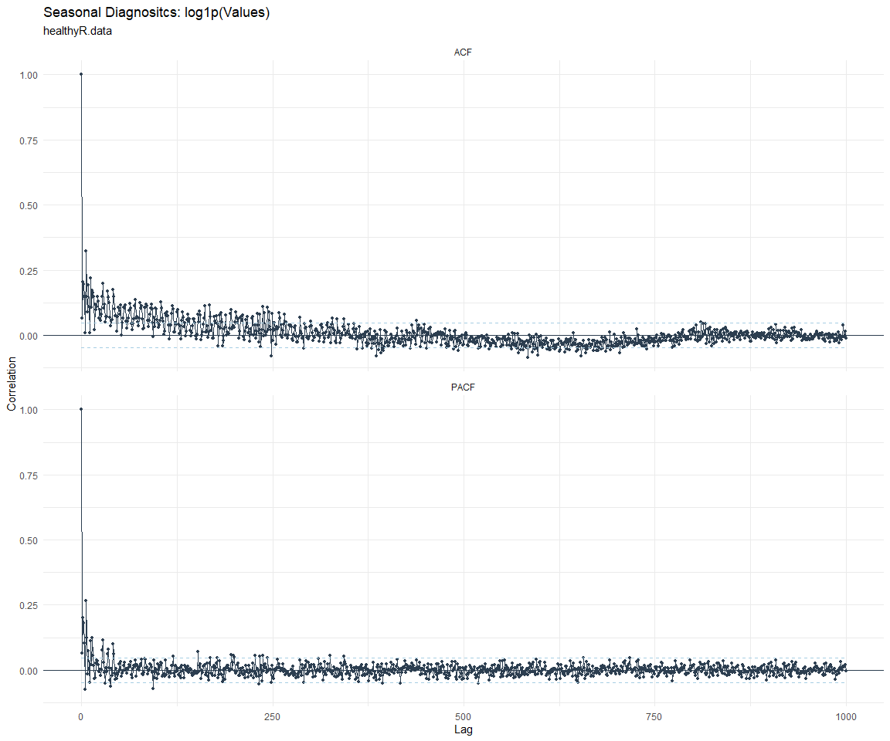

# Time Series Analysis, Modeling and Forecasting of the Healthyverse
Packages
Steven P. Sanderson II, MPH - Date:
2025-10-28

# Introduction

This analysis follows a *Nested Modeltime Workflow* from **`modeltime`**
along with using the **`NNS`** package. I use this to monitor the
downloads of all of my packages:

- [`healthyR`](https://www.spsanderson.com/healthyR/)
- [`healthyR.data`](https://www.spsanderson.com/healthyR.data/)
- [`healthyR.ts`](https://www.spsanderson.com/healthyR.ts/)
- [`healthyR.ai`](https://www.spsanderson.com/healthyR.ai/)
- [`healthyverse`](https://www.spsanderson.com/healthyverse/)
- [`TidyDensity`](https://www.spsanderson.com/TidyDensity/)
- [`tidyAML`](https://www.spsanderson.com/tidyAML/)
- [`RandomWalker`](https://www.spsanderson.com/RandomWalker/)

## Get Data

``` r
glimpse(downloads_tbl)
```

    Rows: 158,275
    Columns: 11
    $ date      <date> 2020-11-23, 2020-11-23, 2020-11-23, 2020-11-23, 2020-11-23,…
    $ time      <Period> 15H 36M 55S, 11H 26M 39S, 23H 34M 44S, 18H 39M 32S, 9H 0M…
    $ date_time <dttm> 2020-11-23 15:36:55, 2020-11-23 11:26:39, 2020-11-23 23:34:…
    $ size      <int> 4858294, 4858294, 4858301, 4858295, 361, 4863722, 4864794, 4…
    $ r_version <chr> NA, "4.0.3", "3.5.3", "3.5.2", NA, NA, NA, NA, NA, NA, NA, N…
    $ r_arch    <chr> NA, "x86_64", "x86_64", "x86_64", NA, NA, NA, NA, NA, NA, NA…
    $ r_os      <chr> NA, "mingw32", "mingw32", "linux-gnu", NA, NA, NA, NA, NA, N…
    $ package   <chr> "healthyR.data", "healthyR.data", "healthyR.data", "healthyR…
    $ version   <chr> "1.0.0", "1.0.0", "1.0.0", "1.0.0", "1.0.0", "1.0.0", "1.0.0…
    $ country   <chr> "US", "US", "US", "GB", "US", "US", "DE", "HK", "JP", "US", …
    $ ip_id     <int> 2069, 2804, 78827, 27595, 90474, 90474, 42435, 74, 7655, 638…

The last day in the data set is 2025-10-26 23:58:19, the file was
birthed on: 2022-07-02 23:58:17.511888, and at report knit time is
2.9084^{4} hours old. Happy analyzing!

Now that we have our data lets take a look at it using the `skimr`
package.

``` r
skim(downloads_tbl)
```

|                                                  |               |
|:-------------------------------------------------|:--------------|
| Name                                             | downloads_tbl |
| Number of rows                                   | 158275        |
| Number of columns                                | 11            |
| \_\_\_\_\_\_\_\_\_\_\_\_\_\_\_\_\_\_\_\_\_\_\_   |               |
| Column type frequency:                           |               |
| character                                        | 6             |
| Date                                             | 1             |
| numeric                                          | 2             |
| POSIXct                                          | 1             |
| Timespan                                         | 1             |
| \_\_\_\_\_\_\_\_\_\_\_\_\_\_\_\_\_\_\_\_\_\_\_\_ |               |
| Group variables                                  | None          |

Data summary

**Variable type: character**

| skim_variable | n_missing | complete_rate | min | max | empty | n_unique | whitespace |
|:--------------|----------:|--------------:|----:|----:|------:|---------:|-----------:|
| r_version     |    115893 |          0.27 |   5 |   5 |     0 |       48 |          0 |
| r_arch        |    115893 |          0.27 |   3 |   7 |     0 |        5 |          0 |
| r_os          |    115893 |          0.27 |   7 |  15 |     0 |       23 |          0 |
| package       |         0 |          1.00 |   7 |  13 |     0 |        8 |          0 |
| version       |         0 |          1.00 |   5 |  17 |     0 |       62 |          0 |
| country       |     14843 |          0.91 |   2 |   2 |     0 |      165 |          0 |

**Variable type: Date**

| skim_variable | n_missing | complete_rate | min | max | median | n_unique |
|:---|---:|---:|:---|:---|:---|---:|
| date | 0 | 1 | 2020-11-23 | 2025-10-26 | 2023-10-12 | 1792 |

**Variable type: numeric**

| skim_variable | n_missing | complete_rate | mean | sd | p0 | p25 | p50 | p75 | p100 | hist |
|:---|---:|---:|---:|---:|---:|---:|---:|---:|---:|:---|
| size | 0 | 1 | 1124767.8 | 1493166.96 | 355 | 19045 | 308471 | 2356890 | 5677952 | ▇▁▂▁▁ |
| ip_id | 0 | 1 | 11322.8 | 21934.05 | 1 | 218 | 2931 | 11961 | 299146 | ▇▁▁▁▁ |

**Variable type: POSIXct**

| skim_variable | n_missing | complete_rate | min | max | median | n_unique |
|:---|---:|---:|:---|:---|:---|---:|
| date_time | 0 | 1 | 2020-11-23 09:00:41 | 2025-10-26 23:58:19 | 2023-10-12 10:40:54 | 99462 |

**Variable type: Timespan**

| skim_variable | n_missing | complete_rate | min | max |     median | n_unique |
|:--------------|----------:|--------------:|----:|----:|-----------:|---------:|
| time          |         0 |             1 |   0 |  59 | 12H 6M 19S |       60 |

We can see that the following columns are missing a lot of data and for
us are most likely not useful anyways, so we will drop them
`c(r_version, r_arch, r_os)`

## Plots

Now lets take a look at a time-series plot of the total daily downloads
by package. We will use a log scale and place a vertical line at each
version release for each package.


    [[1]]


    [[2]]


    [[3]]


    [[4]]


    [[5]]


    [[6]]


    [[7]]


    [[8]]


Now lets take a look at some time series decomposition graphs.

    [[1]]


    [[2]]


    [[3]]


    [[4]]


    [[5]]


    [[6]]


    [[7]]


    [[8]]


    [[1]]


    [[2]]


    [[3]]


    [[4]]


    [[5]]


    [[6]]


    [[7]]


    [[8]]


Seasonal Diagnostics:

    [[1]]


    [[2]]


    [[3]]


    [[4]]


    [[5]]


    [[6]]


    [[7]]


    [[8]]


ACF and PACF Diagnostics:

    [[1]]


    [[2]]


    [[3]]


    [[4]]


    [[5]]




    [[6]]


    [[7]]


    [[8]]


## Feature Engineering

Now that we have our basic data and a shot of what it looks like, let’s
add some features to our data which can be very helpful in modeling.
Lets start by making a `tibble` that is aggregated by the day and
package, as we are going to be interested in forecasting the next 4
weeks or 28 days for each package. First lets get our base data.


    Call:
    stats::lm(formula = .formula, data = df)

    Residuals:
        Min      1Q  Median      3Q     Max 
    -147.61  -36.41  -11.07   27.02  816.21 

    Coefficients:
                                                         Estimate Std. Error
    (Intercept)                                        -2.116e+02  6.210e+01
    date                                                1.267e-02  3.292e-03
    lag(value, 1)                                       1.132e-01  2.341e-02
    lag(value, 7)                                       8.937e-02  2.421e-02
    lag(value, 14)                                      7.867e-02  2.422e-02
    lag(value, 21)                                      6.966e-02  2.428e-02
    lag(value, 28)                                      7.284e-02  2.422e-02
    lag(value, 35)                                      6.305e-02  2.432e-02
    lag(value, 42)                                      5.401e-02  2.455e-02
    lag(value, 49)                                      7.192e-02  2.448e-02
    month(date, label = TRUE).L                        -8.339e+00  5.102e+00
    month(date, label = TRUE).Q                         2.232e+00  5.022e+00
    month(date, label = TRUE).C                        -1.592e+01  5.027e+00
    month(date, label = TRUE)^4                        -7.961e+00  5.049e+00
    month(date, label = TRUE)^5                        -9.309e+00  5.032e+00
    month(date, label = TRUE)^6                        -1.513e+00  5.071e+00
    month(date, label = TRUE)^7                        -6.517e+00  4.938e+00
    month(date, label = TRUE)^8                        -5.258e+00  4.876e+00
    month(date, label = TRUE)^9                         2.250e+00  4.847e+00
    month(date, label = TRUE)^10                        8.201e-01  4.849e+00
    month(date, label = TRUE)^11                       -4.248e+00  4.834e+00
    fourier_vec(date, type = "sin", K = 1, period = 7) -1.130e+01  2.247e+00
    fourier_vec(date, type = "cos", K = 1, period = 7)  7.155e+00  2.330e+00
                                                       t value Pr(>|t|)    
    (Intercept)                                         -3.407 0.000673 ***
    date                                                 3.848 0.000123 ***
    lag(value, 1)                                        4.836 1.45e-06 ***
    lag(value, 7)                                        3.692 0.000229 ***
    lag(value, 14)                                       3.248 0.001185 ** 
    lag(value, 21)                                       2.869 0.004170 ** 
    lag(value, 28)                                       3.008 0.002670 ** 
    lag(value, 35)                                       2.592 0.009614 ** 
    lag(value, 42)                                       2.200 0.027929 *  
    lag(value, 49)                                       2.938 0.003344 ** 
    month(date, label = TRUE).L                         -1.634 0.102374    
    month(date, label = TRUE).Q                          0.444 0.656838    
    month(date, label = TRUE).C                         -3.166 0.001573 ** 
    month(date, label = TRUE)^4                         -1.577 0.115054    
    month(date, label = TRUE)^5                         -1.850 0.064484 .  
    month(date, label = TRUE)^6                         -0.298 0.765471    
    month(date, label = TRUE)^7                         -1.320 0.187102    
    month(date, label = TRUE)^8                         -1.078 0.281025    
    month(date, label = TRUE)^9                          0.464 0.642562    
    month(date, label = TRUE)^10                         0.169 0.865732    
    month(date, label = TRUE)^11                        -0.879 0.379612    
    fourier_vec(date, type = "sin", K = 1, period = 7)  -5.028 5.47e-07 ***
    fourier_vec(date, type = "cos", K = 1, period = 7)   3.070 0.002172 ** 
    ---
    Signif. codes:  0 '***' 0.001 '**' 0.01 '*' 0.05 '.' 0.1 ' ' 1

    Residual standard error: 59.27 on 1720 degrees of freedom
      (49 observations deleted due to missingness)
    Multiple R-squared:  0.237, Adjusted R-squared:  0.2272 
    F-statistic: 24.29 on 22 and 1720 DF,  p-value: < 2.2e-16


## NNS Forecasting

This is something I have been wanting to try for a while. The `NNS`
package is a great package for forecasting time series data.

[NNS GitHub](https://github.com/OVVO-Financial/NNS)

``` r
library(NNS)

data_list <- base_data |>
    select(package, value) |>
    group_split(package)

data_list |>
    imap(
        \(x, idx) {
            obj <- x
            x <- obj |> pull(value) |> tail(7*52)
            train_set_size <- length(x) - 56
            pkg <- obj |> pluck(1) |> unique()
#            sf <- NNS.seas(x, modulo = 7, plot = FALSE)$periods
            seas <- t(
                sapply(
                    1:25, 
                    function(i) c(
                        i,
                        sqrt(
                            mean((
                                NNS.ARMA(x, 
                                         h = 28, 
                                         training.set = train_set_size, 
                                         method = "lin", 
                                         seasonal.factor = i, 
                                         plot=FALSE
                                         ) - tail(x, 28)) ^ 2)))
                    )
                )
            colnames(seas) <- c("Period", "RMSE")
            sf <- seas[which.min(seas[, 2]), 1]
            
            cat(paste0("Package: ", pkg, "\n"))
            NNS.ARMA.optim(
                variable = x,
                h = 28,
                training.set = train_set_size,
                #seasonal.factor = seq(12, 60, 7),
                seasonal.factor = sf,
                pred.int = 0.95,
                plot = TRUE
            )
            title(
                sub = paste0("\n",
                             "Package: ", pkg, " - NNS Optimization")
            )
        }
    )
```

    Package: healthyR
    [1] "CURRNET METHOD: lin"
    [1] "COPY LATEST PARAMETERS DIRECTLY FOR NNS.ARMA() IF ERROR:"
    [1] "NNS.ARMA(... method =  'lin' , seasonal.factor =  c( 25 ) ...)"
    [1] "CURRENT lin OBJECTIVE FUNCTION = 9.61403043877718"
    [1] "BEST method = 'lin' PATH MEMBER = c( 25 )"
    [1] "BEST lin OBJECTIVE FUNCTION = 9.61403043877718"
    [1] "CURRNET METHOD: nonlin"
    [1] "COPY LATEST PARAMETERS DIRECTLY FOR NNS.ARMA() IF ERROR:"
    [1] "NNS.ARMA(... method =  'nonlin' , seasonal.factor =  c( 25 ) ...)"
    [1] "CURRENT nonlin OBJECTIVE FUNCTION = 9.72832174606114"
    [1] "BEST method = 'nonlin' PATH MEMBER = c( 25 )"
    [1] "BEST nonlin OBJECTIVE FUNCTION = 9.72832174606114"
    [1] "CURRNET METHOD: both"
    [1] "COPY LATEST PARAMETERS DIRECTLY FOR NNS.ARMA() IF ERROR:"
    [1] "NNS.ARMA(... method =  'both' , seasonal.factor =  c( 25 ) ...)"
    [1] "CURRENT both OBJECTIVE FUNCTION = 7.56506107797758"
    [1] "BEST method = 'both' PATH MEMBER = c( 25 )"
    [1] "BEST both OBJECTIVE FUNCTION = 7.56506107797758"


    Package: healthyR.ai
    [1] "CURRNET METHOD: lin"
    [1] "COPY LATEST PARAMETERS DIRECTLY FOR NNS.ARMA() IF ERROR:"
    [1] "NNS.ARMA(... method =  'lin' , seasonal.factor =  c( 5 ) ...)"
    [1] "CURRENT lin OBJECTIVE FUNCTION = 53.1751748948556"
    [1] "BEST method = 'lin' PATH MEMBER = c( 5 )"
    [1] "BEST lin OBJECTIVE FUNCTION = 53.1751748948556"
    [1] "CURRNET METHOD: nonlin"
    [1] "COPY LATEST PARAMETERS DIRECTLY FOR NNS.ARMA() IF ERROR:"
    [1] "NNS.ARMA(... method =  'nonlin' , seasonal.factor =  c( 5 ) ...)"
    [1] "CURRENT nonlin OBJECTIVE FUNCTION = 15.7493401722858"
    [1] "BEST method = 'nonlin' PATH MEMBER = c( 5 )"
    [1] "BEST nonlin OBJECTIVE FUNCTION = 15.7493401722858"
    [1] "CURRNET METHOD: both"
    [1] "COPY LATEST PARAMETERS DIRECTLY FOR NNS.ARMA() IF ERROR:"
    [1] "NNS.ARMA(... method =  'both' , seasonal.factor =  c( 5 ) ...)"
    [1] "CURRENT both OBJECTIVE FUNCTION = 28.3631564360578"
    [1] "BEST method = 'both' PATH MEMBER = c( 5 )"
    [1] "BEST both OBJECTIVE FUNCTION = 28.3631564360578"


    Package: healthyR.data
    [1] "CURRNET METHOD: lin"
    [1] "COPY LATEST PARAMETERS DIRECTLY FOR NNS.ARMA() IF ERROR:"
    [1] "NNS.ARMA(... method =  'lin' , seasonal.factor =  c( 5 ) ...)"
    [1] "CURRENT lin OBJECTIVE FUNCTION = 28.8541252981088"
    [1] "BEST method = 'lin' PATH MEMBER = c( 5 )"
    [1] "BEST lin OBJECTIVE FUNCTION = 28.8541252981088"
    [1] "CURRNET METHOD: nonlin"
    [1] "COPY LATEST PARAMETERS DIRECTLY FOR NNS.ARMA() IF ERROR:"
    [1] "NNS.ARMA(... method =  'nonlin' , seasonal.factor =  c( 5 ) ...)"
    [1] "CURRENT nonlin OBJECTIVE FUNCTION = 10.0505060080819"
    [1] "BEST method = 'nonlin' PATH MEMBER = c( 5 )"
    [1] "BEST nonlin OBJECTIVE FUNCTION = 10.0505060080819"
    [1] "CURRNET METHOD: both"
    [1] "COPY LATEST PARAMETERS DIRECTLY FOR NNS.ARMA() IF ERROR:"
    [1] "NNS.ARMA(... method =  'both' , seasonal.factor =  c( 5 ) ...)"
    [1] "CURRENT both OBJECTIVE FUNCTION = 13.548516961385"
    [1] "BEST method = 'both' PATH MEMBER = c( 5 )"
    [1] "BEST both OBJECTIVE FUNCTION = 13.548516961385"


    Package: healthyR.ts
    [1] "CURRNET METHOD: lin"
    [1] "COPY LATEST PARAMETERS DIRECTLY FOR NNS.ARMA() IF ERROR:"
    [1] "NNS.ARMA(... method =  'lin' , seasonal.factor =  c( 11 ) ...)"
    [1] "CURRENT lin OBJECTIVE FUNCTION = 8.75924306160925"
    [1] "BEST method = 'lin' PATH MEMBER = c( 11 )"
    [1] "BEST lin OBJECTIVE FUNCTION = 8.75924306160925"
    [1] "CURRNET METHOD: nonlin"
    [1] "COPY LATEST PARAMETERS DIRECTLY FOR NNS.ARMA() IF ERROR:"
    [1] "NNS.ARMA(... method =  'nonlin' , seasonal.factor =  c( 11 ) ...)"
    [1] "CURRENT nonlin OBJECTIVE FUNCTION = 10.4253062948059"
    [1] "BEST method = 'nonlin' PATH MEMBER = c( 11 )"
    [1] "BEST nonlin OBJECTIVE FUNCTION = 10.4253062948059"
    [1] "CURRNET METHOD: both"
    [1] "COPY LATEST PARAMETERS DIRECTLY FOR NNS.ARMA() IF ERROR:"
    [1] "NNS.ARMA(... method =  'both' , seasonal.factor =  c( 11 ) ...)"
    [1] "CURRENT both OBJECTIVE FUNCTION = 7.46106819484048"
    [1] "BEST method = 'both' PATH MEMBER = c( 11 )"
    [1] "BEST both OBJECTIVE FUNCTION = 7.46106819484048"


    Package: healthyverse
    [1] "CURRNET METHOD: lin"
    [1] "COPY LATEST PARAMETERS DIRECTLY FOR NNS.ARMA() IF ERROR:"
    [1] "NNS.ARMA(... method =  'lin' , seasonal.factor =  c( 6 ) ...)"
    [1] "CURRENT lin OBJECTIVE FUNCTION = 11.6908109643656"
    [1] "BEST method = 'lin' PATH MEMBER = c( 6 )"
    [1] "BEST lin OBJECTIVE FUNCTION = 11.6908109643656"
    [1] "CURRNET METHOD: nonlin"
    [1] "COPY LATEST PARAMETERS DIRECTLY FOR NNS.ARMA() IF ERROR:"
    [1] "NNS.ARMA(... method =  'nonlin' , seasonal.factor =  c( 6 ) ...)"
    [1] "CURRENT nonlin OBJECTIVE FUNCTION = 7.66485328090713"
    [1] "BEST method = 'nonlin' PATH MEMBER = c( 6 )"
    [1] "BEST nonlin OBJECTIVE FUNCTION = 7.66485328090713"
    [1] "CURRNET METHOD: both"
    [1] "COPY LATEST PARAMETERS DIRECTLY FOR NNS.ARMA() IF ERROR:"
    [1] "NNS.ARMA(... method =  'both' , seasonal.factor =  c( 6 ) ...)"
    [1] "CURRENT both OBJECTIVE FUNCTION = 11.2540940732188"
    [1] "BEST method = 'both' PATH MEMBER = c( 6 )"
    [1] "BEST both OBJECTIVE FUNCTION = 11.2540940732188"


    Package: RandomWalker
    [1] "CURRNET METHOD: lin"
    [1] "COPY LATEST PARAMETERS DIRECTLY FOR NNS.ARMA() IF ERROR:"
    [1] "NNS.ARMA(... method =  'lin' , seasonal.factor =  c( 13 ) ...)"
    [1] "CURRENT lin OBJECTIVE FUNCTION = 10.0843678911124"
    [1] "BEST method = 'lin' PATH MEMBER = c( 13 )"
    [1] "BEST lin OBJECTIVE FUNCTION = 10.0843678911124"
    [1] "CURRNET METHOD: nonlin"
    [1] "COPY LATEST PARAMETERS DIRECTLY FOR NNS.ARMA() IF ERROR:"
    [1] "NNS.ARMA(... method =  'nonlin' , seasonal.factor =  c( 13 ) ...)"
    [1] "CURRENT nonlin OBJECTIVE FUNCTION = 6.38202128261513"
    [1] "BEST method = 'nonlin' PATH MEMBER = c( 13 )"
    [1] "BEST nonlin OBJECTIVE FUNCTION = 6.38202128261513"
    [1] "CURRNET METHOD: both"
    [1] "COPY LATEST PARAMETERS DIRECTLY FOR NNS.ARMA() IF ERROR:"
    [1] "NNS.ARMA(... method =  'both' , seasonal.factor =  c( 13 ) ...)"
    [1] "CURRENT both OBJECTIVE FUNCTION = 7.7082947690549"
    [1] "BEST method = 'both' PATH MEMBER = c( 13 )"
    [1] "BEST both OBJECTIVE FUNCTION = 7.7082947690549"


    Package: tidyAML
    [1] "CURRNET METHOD: lin"
    [1] "COPY LATEST PARAMETERS DIRECTLY FOR NNS.ARMA() IF ERROR:"
    [1] "NNS.ARMA(... method =  'lin' , seasonal.factor =  c( 18 ) ...)"
    [1] "CURRENT lin OBJECTIVE FUNCTION = 50.040885868653"
    [1] "BEST method = 'lin' PATH MEMBER = c( 18 )"
    [1] "BEST lin OBJECTIVE FUNCTION = 50.040885868653"
    [1] "CURRNET METHOD: nonlin"
    [1] "COPY LATEST PARAMETERS DIRECTLY FOR NNS.ARMA() IF ERROR:"
    [1] "NNS.ARMA(... method =  'nonlin' , seasonal.factor =  c( 18 ) ...)"
    [1] "CURRENT nonlin OBJECTIVE FUNCTION = 26.854586904488"
    [1] "BEST method = 'nonlin' PATH MEMBER = c( 18 )"
    [1] "BEST nonlin OBJECTIVE FUNCTION = 26.854586904488"
    [1] "CURRNET METHOD: both"
    [1] "COPY LATEST PARAMETERS DIRECTLY FOR NNS.ARMA() IF ERROR:"
    [1] "NNS.ARMA(... method =  'both' , seasonal.factor =  c( 18 ) ...)"
    [1] "CURRENT both OBJECTIVE FUNCTION = 37.8358186907778"
    [1] "BEST method = 'both' PATH MEMBER = c( 18 )"
    [1] "BEST both OBJECTIVE FUNCTION = 37.8358186907778"


    Package: TidyDensity
    [1] "CURRNET METHOD: lin"
    [1] "COPY LATEST PARAMETERS DIRECTLY FOR NNS.ARMA() IF ERROR:"
    [1] "NNS.ARMA(... method =  'lin' , seasonal.factor =  c( 13 ) ...)"
    [1] "CURRENT lin OBJECTIVE FUNCTION = 48.4277512699383"
    [1] "BEST method = 'lin' PATH MEMBER = c( 13 )"
    [1] "BEST lin OBJECTIVE FUNCTION = 48.4277512699383"
    [1] "CURRNET METHOD: nonlin"
    [1] "COPY LATEST PARAMETERS DIRECTLY FOR NNS.ARMA() IF ERROR:"
    [1] "NNS.ARMA(... method =  'nonlin' , seasonal.factor =  c( 13 ) ...)"
    [1] "CURRENT nonlin OBJECTIVE FUNCTION = 28.2609144335137"
    [1] "BEST method = 'nonlin' PATH MEMBER = c( 13 )"
    [1] "BEST nonlin OBJECTIVE FUNCTION = 28.2609144335137"
    [1] "CURRNET METHOD: both"
    [1] "COPY LATEST PARAMETERS DIRECTLY FOR NNS.ARMA() IF ERROR:"
    [1] "NNS.ARMA(... method =  'both' , seasonal.factor =  c( 13 ) ...)"
    [1] "CURRENT both OBJECTIVE FUNCTION = 42.679912350116"
    [1] "BEST method = 'both' PATH MEMBER = c( 13 )"
    [1] "BEST both OBJECTIVE FUNCTION = 42.679912350116"


    [[1]]
    NULL

    [[2]]
    NULL

    [[3]]
    NULL

    [[4]]
    NULL

    [[5]]
    NULL

    [[6]]
    NULL

    [[7]]
    NULL

    [[8]]
    NULL

## Pre-Processing

Now we are going to do some basic pre-processing.

``` r
data_padded_tbl <- base_data %>%
  pad_by_time(
    .date_var  = date,
    .pad_value = 0
  )

# Get log interval and standardization parameters
log_params  <- liv(data_padded_tbl$value, limit_lower = 0, offset = 1, silent = TRUE)
limit_lower <- log_params$limit_lower
limit_upper <- log_params$limit_upper
offset      <- log_params$offset

data_liv_tbl <- data_padded_tbl %>%
  # Get log interval transform
  mutate(value_trans = liv(value, limit_lower = 0, offset = 1, silent = TRUE)$log_scaled)

# Get Standardization Params
std_params <- standard_vec(data_liv_tbl$value_trans, silent = TRUE)
std_mean   <- std_params$mean
std_sd     <- std_params$sd

data_transformed_tbl <- data_liv_tbl %>%
  group_by(package) %>%
  # get standardization
  mutate(value_trans = standard_vec(value_trans, silent = TRUE)$standard_scaled) %>%
  tk_augment_fourier(
    .date_var = date,
    .periods  = c(7, 14, 30, 90, 180),
    .K        = 2
  ) %>%
  tk_augment_timeseries_signature(
    .date_var = date
  ) %>%
  ungroup() %>%
  select(-c(value, -year.iso))
```

Since this is panel data we can follow one of two different modeling
strategies. We can search for a global model in the panel data or we can
use nested forecasting finding the best model for each of the time
series. Since we only have 5 panels, we will use nested forecasting.

To do this we will use the `nest_timeseries` and
`split_nested_timeseries` functions to create a nested `tibble`.

``` r
horizon <- 4*7

nested_data_tbl <- data_transformed_tbl %>%

    # 0. Filter out column where package is NA
    filter(!is.na(package)) %>%
    
    # 1. Extending: We'll predict n days into the future.
    extend_timeseries(
        .id_var        = package,
        .date_var      = date,
        .length_future = horizon
    ) %>%
    
    # 2. Nesting: We'll group by id, and create a future dataset
    #    that forecasts n days of extended data and
    #    an actual dataset that contains n*2 days
    nest_timeseries(
        .id_var        = package,
        .length_future = horizon
        #.length_actual = horizon*2
    ) %>%
    
   # 3. Splitting: We'll take the actual data and create splits
   #    for accuracy and confidence interval estimation of n das (test)
   #    and the rest is training data
    split_nested_timeseries(
        .length_test = horizon
    )

nested_data_tbl
```

    # A tibble: 8 × 4
      package       .actual_data          .future_data       .splits          
      <fct>         <list>                <list>             <list>           
    1 healthyR.data <tibble [1,784 × 50]> <tibble [28 × 50]> <split [1756|28]>
    2 healthyR      <tibble [1,775 × 50]> <tibble [28 × 50]> <split [1747|28]>
    3 healthyR.ts   <tibble [1,721 × 50]> <tibble [28 × 50]> <split [1693|28]>
    4 healthyverse  <tibble [1,692 × 50]> <tibble [28 × 50]> <split [1664|28]>
    5 healthyR.ai   <tibble [1,517 × 50]> <tibble [28 × 50]> <split [1489|28]>
    6 TidyDensity   <tibble [1,368 × 50]> <tibble [28 × 50]> <split [1340|28]>
    7 tidyAML       <tibble [975 × 50]>   <tibble [28 × 50]> <split [947|28]> 
    8 RandomWalker  <tibble [398 × 50]>   <tibble [28 × 50]> <split [370|28]> 

Now it is time to make some recipes and models using the modeltime
workflow.

## Modeltime Workflow

### Recipe Object

``` r
recipe_base <- recipe(
  value_trans ~ .
  , data = extract_nested_test_split(nested_data_tbl)
  )

recipe_base

recipe_date <- recipe(
  value_trans ~ date
  , data = extract_nested_test_split(nested_data_tbl)
  )
```

### Models

``` r
# Models ------------------------------------------------------------------

# Auto ARIMA --------------------------------------------------------------

model_spec_arima_no_boost <- arima_reg() %>%
  set_engine(engine = "auto_arima")

wflw_auto_arima <- workflow() %>%
  add_recipe(recipe = recipe_date) %>%
  add_model(model_spec_arima_no_boost)

# NNETAR ------------------------------------------------------------------

model_spec_nnetar <- nnetar_reg(
  mode              = "regression"
  , seasonal_period = "auto"
) %>%
  set_engine("nnetar")

wflw_nnetar <- workflow() %>%
  add_recipe(recipe = recipe_base) %>%
  add_model(model_spec_nnetar)

# TSLM --------------------------------------------------------------------

model_spec_lm <- linear_reg() %>%
  set_engine("lm")

wflw_lm <- workflow() %>%
  add_recipe(recipe = recipe_base) %>%
  add_model(model_spec_lm)

# MARS --------------------------------------------------------------------

model_spec_mars <- mars(mode = "regression") %>%
  set_engine("earth")

wflw_mars <- workflow() %>%
  add_recipe(recipe = recipe_date) %>%
  add_model(model_spec_mars)
```

### Nested Modeltime Tables

``` r
nested_modeltime_tbl <- modeltime_nested_fit(
  # Nested Data
  nested_data = nested_data_tbl,
   control = control_nested_fit(
     verbose = TRUE,
     allow_par = FALSE
   ),
  # Add workflows
  wflw_auto_arima,
  wflw_lm,
  wflw_mars,
  wflw_nnetar
)
```

``` r
nested_modeltime_tbl <- nested_modeltime_tbl[!is.na(nested_modeltime_tbl$package),]
```

### Model Accuracy

``` r
nested_modeltime_tbl %>%
  extract_nested_test_accuracy() %>%
  filter(!is.na(package)) %>%
  knitr::kable()
```

| package | .model_id | .model_desc | .type | mae | mape | mase | smape | rmse | rsq |
|:---|---:|:---|:---|---:|---:|---:|---:|---:|---:|
| healthyR.data | 1 | ARIMA | Test | 0.6318887 | 92.15157 | 0.6212383 | 164.1073 | 0.7830996 | 0.2364444 |
| healthyR.data | 2 | LM | Test | 0.7438907 | 149.83725 | 0.7313526 | 143.7455 | 0.8800786 | 0.0436266 |
| healthyR.data | 3 | EARTH | Test | 0.6993907 | 107.69822 | 0.6876026 | 179.3138 | 0.8395477 | 0.0604183 |
| healthyR.data | 4 | NNAR | Test | 0.7628559 | 155.64136 | 0.7499982 | 150.7226 | 0.8821919 | 0.1041335 |
| healthyR | 1 | ARIMA | Test | 0.4987529 | 125.29130 | 0.6304596 | 174.5174 | 0.6302887 | 0.1014342 |
| healthyR | 2 | LM | Test | 0.6316333 | 211.76120 | 0.7984300 | 137.5056 | 0.8312887 | 0.0019748 |
| healthyR | 3 | EARTH | Test | 0.5706432 | 209.66284 | 0.7213341 | 132.5075 | 0.7221779 | 0.1287666 |
| healthyR | 4 | NNAR | Test | 0.6574313 | 234.28773 | 0.8310405 | 153.3268 | 0.8555321 | 0.0105753 |
| healthyR.ts | 1 | ARIMA | Test | 0.5398043 | 117.20251 | 0.6486426 | 173.5550 | 0.6524731 | 0.0223968 |
| healthyR.ts | 2 | LM | Test | 0.6596648 | 158.23551 | 0.7926701 | 149.8470 | 0.8266935 | 0.0045673 |
| healthyR.ts | 3 | EARTH | Test | 0.5823070 | 155.07308 | 0.6997150 | 154.9243 | 0.6992580 | 0.0537687 |
| healthyR.ts | 4 | NNAR | Test | 0.7513544 | 225.66048 | 0.9028466 | 144.0405 | 0.9405932 | 0.0140328 |
| healthyverse | 1 | ARIMA | Test | 0.6082566 | 115.60602 | 0.8122965 | 156.6712 | 0.7098646 | 0.0295057 |
| healthyverse | 2 | LM | Test | 0.6579055 | 170.15686 | 0.8786001 | 149.9663 | 0.7425819 | 0.0995317 |
| healthyverse | 3 | EARTH | Test | 0.8353142 | 248.90146 | 1.1155207 | 123.4224 | 1.0176281 | 0.1478073 |
| healthyverse | 4 | NNAR | Test | 0.6179700 | 144.56293 | 0.8252683 | 137.2061 | 0.7294817 | 0.1015124 |
| healthyR.ai | 1 | ARIMA | Test | 0.4491046 | 103.22808 | 0.9115750 | 181.9154 | 0.5495854 | 0.0603524 |
| healthyR.ai | 2 | LM | Test | 0.6267576 | 236.41010 | 1.2721682 | 162.7617 | 0.7709748 | 0.0265258 |
| healthyR.ai | 3 | EARTH | Test | 4.1510281 | 2177.05710 | 8.4255958 | 189.1281 | 4.4391036 | 0.1606417 |
| healthyR.ai | 4 | NNAR | Test | 0.6541030 | 266.97471 | 1.3276729 | 155.9924 | 0.7775836 | 0.0498360 |
| TidyDensity | 1 | ARIMA | Test | 1.1495744 | 441.67882 | 0.8209423 | 120.5938 | 1.3336101 | 0.0003063 |
| TidyDensity | 2 | LM | Test | 1.2433571 | 182.77798 | 0.8879151 | 153.7430 | 1.5847939 | 0.1536437 |
| TidyDensity | 3 | EARTH | Test | 7.0430945 | 5037.67951 | 5.0296650 | 142.4914 | 7.9816909 | 0.2542398 |
| TidyDensity | 4 | NNAR | Test | 1.1565498 | 253.06244 | 0.8259236 | 135.8096 | 1.4222502 | 0.1226127 |
| tidyAML | 1 | ARIMA | Test | 0.9473723 | 95.47597 | 0.8341209 | 163.9324 | 1.3646926 | 0.0000647 |
| tidyAML | 2 | LM | Test | 1.0717228 | 155.33949 | 0.9436062 | 153.9995 | 1.5362148 | 0.0005374 |
| tidyAML | 3 | EARTH | Test | 0.9590137 | 112.54029 | 0.8443707 | 171.4709 | 1.3448058 | 0.0875164 |
| tidyAML | 4 | NNAR | Test | 0.9750168 | 124.49289 | 0.8584607 | 148.1449 | 1.4466995 | 0.0014046 |
| RandomWalker | 1 | ARIMA | Test | 0.6592221 | 111.35209 | 0.5304067 | 150.6972 | 0.7691889 | 0.1988927 |
| RandomWalker | 2 | LM | Test | 0.6836374 | 99.22958 | 0.5500511 | 138.1113 | 0.8797160 | 0.0066998 |
| RandomWalker | 3 | EARTH | Test | 0.7765934 | 174.64689 | 0.6248430 | 135.3155 | 0.8443497 | 0.0027779 |
| RandomWalker | 4 | NNAR | Test | 0.8193628 | 144.88752 | 0.6592551 | 154.0027 | 1.0051286 | 0.0597642 |

### Plot Models

``` r
nested_modeltime_tbl %>%
  extract_nested_test_forecast() %>%
  group_by(package) %>%
  filter_by_time(.date_var = .index, .start_date = max(.index) - 60) %>%
  ungroup() %>%
  plot_modeltime_forecast(
    .interactive = FALSE,
    .conf_interval_show  = FALSE,
    .facet_scales = "free"
  ) +
  theme_minimal() +
  facet_wrap(~ package, nrow = 3) +
  theme(legend.position = "bottom")
```


### Best Model

``` r
best_nested_modeltime_tbl <- nested_modeltime_tbl %>%
  modeltime_nested_select_best(
    metric = "rmse",
    minimize = TRUE,
    filter_test_forecasts = TRUE
  )

best_nested_modeltime_tbl %>%
  extract_nested_best_model_report()
```

    # Nested Modeltime Table
      

    # A tibble: 8 × 10
      package      .model_id .model_desc .type   mae  mape  mase smape  rmse     rsq
      <fct>            <int> <chr>       <chr> <dbl> <dbl> <dbl> <dbl> <dbl>   <dbl>
    1 healthyR.da…         1 ARIMA       Test  0.632  92.2 0.621  164. 0.783 2.36e-1
    2 healthyR             1 ARIMA       Test  0.499 125.  0.630  175. 0.630 1.01e-1
    3 healthyR.ts          1 ARIMA       Test  0.540 117.  0.649  174. 0.652 2.24e-2
    4 healthyverse         1 ARIMA       Test  0.608 116.  0.812  157. 0.710 2.95e-2
    5 healthyR.ai          1 ARIMA       Test  0.449 103.  0.912  182. 0.550 6.04e-2
    6 TidyDensity          1 ARIMA       Test  1.15  442.  0.821  121. 1.33  3.06e-4
    7 tidyAML              3 EARTH       Test  0.959 113.  0.844  171. 1.34  8.75e-2
    8 RandomWalker         1 ARIMA       Test  0.659 111.  0.530  151. 0.769 1.99e-1

``` r
best_nested_modeltime_tbl %>%
  extract_nested_test_forecast() %>%
  #filter(!is.na(.model_id)) %>%
  group_by(package) %>%
  filter_by_time(.date_var = .index, .start_date = max(.index) - 60) %>%
  ungroup() %>%
  plot_modeltime_forecast(
    .interactive = FALSE,
    .conf_interval_alpha = 0.2,
    .facet_scales = "free"
  ) +
  facet_wrap(~ package, nrow = 3) +
  theme_minimal() +
  theme(legend.position = "bottom")
```


## Refitting and Future Forecast

Now that we have the best models, we can make our future forecasts.

``` r
nested_modeltime_refit_tbl <- best_nested_modeltime_tbl %>%
    modeltime_nested_refit(
        control = control_nested_refit(verbose = TRUE)
    )
```

``` r
nested_modeltime_refit_tbl
```

    # Nested Modeltime Table
      

    # A tibble: 8 × 5
      package       .actual_data .future_data .splits           .modeltime_tables 
      <fct>         <list>       <list>       <list>            <list>            
    1 healthyR.data <tibble>     <tibble>     <split [1756|28]> <mdl_tm_t [1 × 5]>
    2 healthyR      <tibble>     <tibble>     <split [1747|28]> <mdl_tm_t [1 × 5]>
    3 healthyR.ts   <tibble>     <tibble>     <split [1693|28]> <mdl_tm_t [1 × 5]>
    4 healthyverse  <tibble>     <tibble>     <split [1664|28]> <mdl_tm_t [1 × 5]>
    5 healthyR.ai   <tibble>     <tibble>     <split [1489|28]> <mdl_tm_t [1 × 5]>
    6 TidyDensity   <tibble>     <tibble>     <split [1340|28]> <mdl_tm_t [1 × 5]>
    7 tidyAML       <tibble>     <tibble>     <split [947|28]>  <mdl_tm_t [1 × 5]>
    8 RandomWalker  <tibble>     <tibble>     <split [370|28]>  <mdl_tm_t [1 × 5]>

``` r
nested_modeltime_refit_tbl %>%
  extract_nested_future_forecast() %>%
  group_by(package) %>%
  mutate(across(.value:.conf_hi, .fns = ~ standard_inv_vec(
    x    = .,
    mean = std_mean,
    sd   = std_sd
  )$standard_inverse_value)) %>%
  mutate(across(.value:.conf_hi, .fns = ~ liiv(
    x = .,
    limit_lower = limit_lower,
    limit_upper = limit_upper,
    offset      = offset
  )$rescaled_v)) %>%
  filter_by_time(.date_var = .index, .start_date = max(.index) - 60) %>%
  ungroup() %>%
  plot_modeltime_forecast(
    .interactive = FALSE,
    .conf_interval_alpha = 0.2,
    .facet_scales = "free"
  ) +
  facet_wrap(~ package, nrow = 3) +
  theme_minimal() +
  theme(legend.position = "bottom")
```


