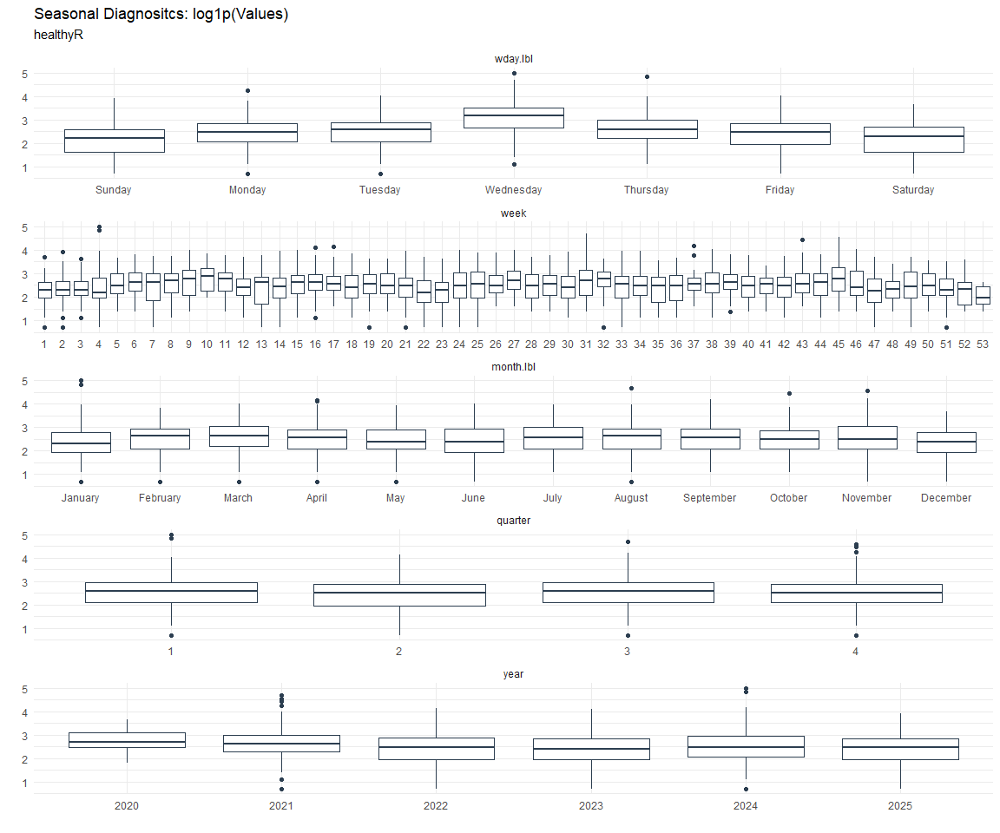

# Time Series Analysis, Modeling and Forecasting of the Healthyverse
Packages
Steven P. Sanderson II, MPH - Date:
2025-11-10

# Introduction

This analysis follows a *Nested Modeltime Workflow* from **`modeltime`**
along with using the **`NNS`** package. I use this to monitor the
downloads of all of my packages:

- [`healthyR`](https://www.spsanderson.com/healthyR/)
- [`healthyR.data`](https://www.spsanderson.com/healthyR.data/)
- [`healthyR.ts`](https://www.spsanderson.com/healthyR.ts/)
- [`healthyR.ai`](https://www.spsanderson.com/healthyR.ai/)
- [`healthyverse`](https://www.spsanderson.com/healthyverse/)
- [`TidyDensity`](https://www.spsanderson.com/TidyDensity/)
- [`tidyAML`](https://www.spsanderson.com/tidyAML/)
- [`RandomWalker`](https://www.spsanderson.com/RandomWalker/)

## Get Data

``` r
glimpse(downloads_tbl)
```

    Rows: 159,620
    Columns: 11
    $ date      <date> 2020-11-23, 2020-11-23, 2020-11-23, 2020-11-23, 2020-11-23,…
    $ time      <Period> 15H 36M 55S, 11H 26M 39S, 23H 34M 44S, 18H 39M 32S, 9H 0M…
    $ date_time <dttm> 2020-11-23 15:36:55, 2020-11-23 11:26:39, 2020-11-23 23:34:…
    $ size      <int> 4858294, 4858294, 4858301, 4858295, 361, 4863722, 4864794, 4…
    $ r_version <chr> NA, "4.0.3", "3.5.3", "3.5.2", NA, NA, NA, NA, NA, NA, NA, N…
    $ r_arch    <chr> NA, "x86_64", "x86_64", "x86_64", NA, NA, NA, NA, NA, NA, NA…
    $ r_os      <chr> NA, "mingw32", "mingw32", "linux-gnu", NA, NA, NA, NA, NA, N…
    $ package   <chr> "healthyR.data", "healthyR.data", "healthyR.data", "healthyR…
    $ version   <chr> "1.0.0", "1.0.0", "1.0.0", "1.0.0", "1.0.0", "1.0.0", "1.0.0…
    $ country   <chr> "US", "US", "US", "GB", "US", "US", "DE", "HK", "JP", "US", …
    $ ip_id     <int> 2069, 2804, 78827, 27595, 90474, 90474, 42435, 74, 7655, 638…

The last day in the data set is 2025-11-08 21:01:50, the file was
birthed on: 2022-07-02 23:58:17.511888, and at report knit time is
2.939306^{4} hours old. Happy analyzing!

Now that we have our data lets take a look at it using the `skimr`
package.

``` r
skim(downloads_tbl)
```

|                                                  |               |
|:-------------------------------------------------|:--------------|
| Name                                             | downloads_tbl |
| Number of rows                                   | 159620        |
| Number of columns                                | 11            |
| \_\_\_\_\_\_\_\_\_\_\_\_\_\_\_\_\_\_\_\_\_\_\_   |               |
| Column type frequency:                           |               |
| character                                        | 6             |
| Date                                             | 1             |
| numeric                                          | 2             |
| POSIXct                                          | 1             |
| Timespan                                         | 1             |
| \_\_\_\_\_\_\_\_\_\_\_\_\_\_\_\_\_\_\_\_\_\_\_\_ |               |
| Group variables                                  | None          |

Data summary

**Variable type: character**

| skim_variable | n_missing | complete_rate | min | max | empty | n_unique | whitespace |
|:--------------|----------:|--------------:|----:|----:|------:|---------:|-----------:|
| r_version     |    117037 |          0.27 |   5 |   7 |     0 |       50 |          0 |
| r_arch        |    117037 |          0.27 |   1 |   7 |     0 |        6 |          0 |
| r_os          |    117037 |          0.27 |   7 |  19 |     0 |       24 |          0 |
| package       |         0 |          1.00 |   7 |  13 |     0 |        8 |          0 |
| version       |         0 |          1.00 |   5 |  17 |     0 |       62 |          0 |
| country       |     14915 |          0.91 |   2 |   2 |     0 |      165 |          0 |

**Variable type: Date**

| skim_variable | n_missing | complete_rate | min | max | median | n_unique |
|:---|---:|---:|:---|:---|:---|---:|
| date | 0 | 1 | 2020-11-23 | 2025-11-08 | 2023-10-19 | 1805 |

**Variable type: numeric**

| skim_variable | n_missing | complete_rate | mean | sd | p0 | p25 | p50 | p75 | p100 | hist |
|:---|---:|---:|---:|---:|---:|---:|---:|---:|---:|:---|
| size | 0 | 1 | 1125560.7 | 1491994.98 | 355 | 24837 | 309959.0 | 2356889 | 5677952 | ▇▁▂▁▁ |
| ip_id | 0 | 1 | 11301.5 | 21899.56 | 1 | 223 | 2921.5 | 11961 | 299146 | ▇▁▁▁▁ |

**Variable type: POSIXct**

| skim_variable | n_missing | complete_rate | min | max | median | n_unique |
|:---|---:|---:|:---|:---|:---|---:|
| date_time | 0 | 1 | 2020-11-23 09:00:41 | 2025-11-08 21:01:50 | 2023-10-19 11:14:21 | 100392 |

**Variable type: Timespan**

| skim_variable | n_missing | complete_rate | min | max | median | n_unique |
|:--------------|----------:|--------------:|----:|----:|-------:|---------:|
| time          |         0 |             1 |   0 |  59 |     16 |       60 |

We can see that the following columns are missing a lot of data and for
us are most likely not useful anyways, so we will drop them
`c(r_version, r_arch, r_os)`

## Plots

Now lets take a look at a time-series plot of the total daily downloads
by package. We will use a log scale and place a vertical line at each
version release for each package.


    [[1]]


    [[2]]


    [[3]]


    [[4]]


    [[5]]


    [[6]]


    [[7]]


    [[8]]


Now lets take a look at some time series decomposition graphs.

    [[1]]


    [[2]]


    [[3]]


    [[4]]


    [[5]]


    [[6]]


    [[7]]


    [[8]]


    [[1]]


    [[2]]


    [[3]]


    [[4]]


    [[5]]


    [[6]]


    [[7]]


    [[8]]


Seasonal Diagnostics:

    [[1]]


    [[2]]


    [[3]]




    [[4]]


    [[5]]


    [[6]]


    [[7]]


    [[8]]


ACF and PACF Diagnostics:

    [[1]]


    [[2]]


    [[3]]


    [[4]]


    [[5]]


    [[6]]


    [[7]]


    [[8]]


## Feature Engineering

Now that we have our basic data and a shot of what it looks like, let’s
add some features to our data which can be very helpful in modeling.
Lets start by making a `tibble` that is aggregated by the day and
package, as we are going to be interested in forecasting the next 4
weeks or 28 days for each package. First lets get our base data.


    Call:
    stats::lm(formula = .formula, data = df)

    Residuals:
        Min      1Q  Median      3Q     Max 
    -147.23  -36.51  -11.28   27.03  817.93 

    Coefficients:
                                                         Estimate Std. Error
    (Intercept)                                        -1.981e+02  6.182e+01
    date                                                1.199e-02  3.278e-03
    lag(value, 1)                                       1.118e-01  2.337e-02
    lag(value, 7)                                       8.942e-02  2.414e-02
    lag(value, 14)                                      7.804e-02  2.414e-02
    lag(value, 21)                                      7.455e-02  2.422e-02
    lag(value, 28)                                      6.721e-02  2.412e-02
    lag(value, 35)                                      5.890e-02  2.418e-02
    lag(value, 42)                                      5.903e-02  2.441e-02
    lag(value, 49)                                      6.850e-02  2.429e-02
    month(date, label = TRUE).L                        -9.389e+00  5.092e+00
    month(date, label = TRUE).Q                         1.511e+00  5.020e+00
    month(date, label = TRUE).C                        -1.566e+01  5.025e+00
    month(date, label = TRUE)^4                        -6.892e+00  5.024e+00
    month(date, label = TRUE)^5                        -7.879e+00  4.998e+00
    month(date, label = TRUE)^6                        -1.744e-01  5.028e+00
    month(date, label = TRUE)^7                        -5.547e+00  4.907e+00
    month(date, label = TRUE)^8                        -4.768e+00  4.856e+00
    month(date, label = TRUE)^9                         2.429e+00  4.842e+00
    month(date, label = TRUE)^10                        8.393e-01  4.854e+00
    month(date, label = TRUE)^11                       -4.189e+00  4.841e+00
    fourier_vec(date, type = "sin", K = 1, period = 7) -1.147e+01  2.239e+00
    fourier_vec(date, type = "cos", K = 1, period = 7)  7.240e+00  2.321e+00
                                                       t value Pr(>|t|)    
    (Intercept)                                         -3.205 0.001375 ** 
    date                                                 3.658 0.000262 ***
    lag(value, 1)                                        4.785 1.85e-06 ***
    lag(value, 7)                                        3.704 0.000219 ***
    lag(value, 14)                                       3.233 0.001249 ** 
    lag(value, 21)                                       3.078 0.002117 ** 
    lag(value, 28)                                       2.787 0.005378 ** 
    lag(value, 35)                                       2.435 0.014980 *  
    lag(value, 42)                                       2.418 0.015712 *  
    lag(value, 49)                                       2.820 0.004856 ** 
    month(date, label = TRUE).L                         -1.844 0.065357 .  
    month(date, label = TRUE).Q                          0.301 0.763413    
    month(date, label = TRUE).C                         -3.117 0.001856 ** 
    month(date, label = TRUE)^4                         -1.372 0.170234    
    month(date, label = TRUE)^5                         -1.576 0.115110    
    month(date, label = TRUE)^6                         -0.035 0.972336    
    month(date, label = TRUE)^7                         -1.130 0.258447    
    month(date, label = TRUE)^8                         -0.982 0.326301    
    month(date, label = TRUE)^9                          0.502 0.616054    
    month(date, label = TRUE)^10                         0.173 0.862740    
    month(date, label = TRUE)^11                        -0.865 0.386960    
    fourier_vec(date, type = "sin", K = 1, period = 7)  -5.122 3.37e-07 ***
    fourier_vec(date, type = "cos", K = 1, period = 7)   3.119 0.001843 ** 
    ---
    Signif. codes:  0 '***' 0.001 '**' 0.01 '*' 0.05 '.' 0.1 ' ' 1

    Residual standard error: 59.37 on 1733 degrees of freedom
      (49 observations deleted due to missingness)
    Multiple R-squared:  0.2341,    Adjusted R-squared:  0.2243 
    F-statistic: 24.07 on 22 and 1733 DF,  p-value: < 2.2e-16


## NNS Forecasting

This is something I have been wanting to try for a while. The `NNS`
package is a great package for forecasting time series data.

[NNS GitHub](https://github.com/OVVO-Financial/NNS)

``` r
library(NNS)

data_list <- base_data |>
    select(package, value) |>
    group_split(package)

data_list |>
    imap(
        \(x, idx) {
            obj <- x
            x <- obj |> pull(value) |> tail(7*52)
            train_set_size <- length(x) - 56
            pkg <- obj |> pluck(1) |> unique()
#            sf <- NNS.seas(x, modulo = 7, plot = FALSE)$periods
            seas <- t(
                sapply(
                    1:25, 
                    function(i) c(
                        i,
                        sqrt(
                            mean((
                                NNS.ARMA(x, 
                                         h = 28, 
                                         training.set = train_set_size, 
                                         method = "lin", 
                                         seasonal.factor = i, 
                                         plot=FALSE
                                         ) - tail(x, 28)) ^ 2)))
                    )
                )
            colnames(seas) <- c("Period", "RMSE")
            sf <- seas[which.min(seas[, 2]), 1]
            
            cat(paste0("Package: ", pkg, "\n"))
            NNS.ARMA.optim(
                variable = x,
                h = 28,
                training.set = train_set_size,
                #seasonal.factor = seq(12, 60, 7),
                seasonal.factor = sf,
                pred.int = 0.95,
                plot = TRUE
            )
            title(
                sub = paste0("\n",
                             "Package: ", pkg, " - NNS Optimization")
            )
        }
    )
```

    Package: healthyR
    [1] "CURRNET METHOD: lin"
    [1] "COPY LATEST PARAMETERS DIRECTLY FOR NNS.ARMA() IF ERROR:"
    [1] "NNS.ARMA(... method =  'lin' , seasonal.factor =  c( 25 ) ...)"
    [1] "CURRENT lin OBJECTIVE FUNCTION = 15.1139795554255"
    [1] "BEST method = 'lin' PATH MEMBER = c( 25 )"
    [1] "BEST lin OBJECTIVE FUNCTION = 15.1139795554255"
    [1] "CURRNET METHOD: nonlin"
    [1] "COPY LATEST PARAMETERS DIRECTLY FOR NNS.ARMA() IF ERROR:"
    [1] "NNS.ARMA(... method =  'nonlin' , seasonal.factor =  c( 25 ) ...)"
    [1] "CURRENT nonlin OBJECTIVE FUNCTION = 6.80025196869061"
    [1] "BEST method = 'nonlin' PATH MEMBER = c( 25 )"
    [1] "BEST nonlin OBJECTIVE FUNCTION = 6.80025196869061"
    [1] "CURRNET METHOD: both"
    [1] "COPY LATEST PARAMETERS DIRECTLY FOR NNS.ARMA() IF ERROR:"
    [1] "NNS.ARMA(... method =  'both' , seasonal.factor =  c( 25 ) ...)"
    [1] "CURRENT both OBJECTIVE FUNCTION = 9.20252113823676"
    [1] "BEST method = 'both' PATH MEMBER = c( 25 )"
    [1] "BEST both OBJECTIVE FUNCTION = 9.20252113823676"


    Package: healthyR.ai
    [1] "CURRNET METHOD: lin"
    [1] "COPY LATEST PARAMETERS DIRECTLY FOR NNS.ARMA() IF ERROR:"
    [1] "NNS.ARMA(... method =  'lin' , seasonal.factor =  c( 1 ) ...)"
    [1] "CURRENT lin OBJECTIVE FUNCTION = 385.438105391863"
    [1] "BEST method = 'lin' PATH MEMBER = c( 1 )"
    [1] "BEST lin OBJECTIVE FUNCTION = 385.438105391863"
    [1] "CURRNET METHOD: nonlin"
    [1] "COPY LATEST PARAMETERS DIRECTLY FOR NNS.ARMA() IF ERROR:"
    [1] "NNS.ARMA(... method =  'nonlin' , seasonal.factor =  c( 1 ) ...)"
    [1] "CURRENT nonlin OBJECTIVE FUNCTION = 814.030708767504"
    [1] "BEST method = 'nonlin' PATH MEMBER = c( 1 )"
    [1] "BEST nonlin OBJECTIVE FUNCTION = 814.030708767504"
    [1] "CURRNET METHOD: both"
    [1] "COPY LATEST PARAMETERS DIRECTLY FOR NNS.ARMA() IF ERROR:"
    [1] "NNS.ARMA(... method =  'both' , seasonal.factor =  c( 1 ) ...)"
    [1] "CURRENT both OBJECTIVE FUNCTION = 2453.29967733907"
    [1] "BEST method = 'both' PATH MEMBER = c( 1 )"
    [1] "BEST both OBJECTIVE FUNCTION = 2453.29967733907"


    Package: healthyR.data
    [1] "CURRNET METHOD: lin"
    [1] "COPY LATEST PARAMETERS DIRECTLY FOR NNS.ARMA() IF ERROR:"
    [1] "NNS.ARMA(... method =  'lin' , seasonal.factor =  c( 8 ) ...)"
    [1] "CURRENT lin OBJECTIVE FUNCTION = 14.7391118104929"
    [1] "BEST method = 'lin' PATH MEMBER = c( 8 )"
    [1] "BEST lin OBJECTIVE FUNCTION = 14.7391118104929"
    [1] "CURRNET METHOD: nonlin"
    [1] "COPY LATEST PARAMETERS DIRECTLY FOR NNS.ARMA() IF ERROR:"
    [1] "NNS.ARMA(... method =  'nonlin' , seasonal.factor =  c( 8 ) ...)"
    [1] "CURRENT nonlin OBJECTIVE FUNCTION = 7.42938430789374"
    [1] "BEST method = 'nonlin' PATH MEMBER = c( 8 )"
    [1] "BEST nonlin OBJECTIVE FUNCTION = 7.42938430789374"
    [1] "CURRNET METHOD: both"
    [1] "COPY LATEST PARAMETERS DIRECTLY FOR NNS.ARMA() IF ERROR:"
    [1] "NNS.ARMA(... method =  'both' , seasonal.factor =  c( 8 ) ...)"
    [1] "CURRENT both OBJECTIVE FUNCTION = 9.95867835024556"
    [1] "BEST method = 'both' PATH MEMBER = c( 8 )"
    [1] "BEST both OBJECTIVE FUNCTION = 9.95867835024556"


    Package: healthyR.ts
    [1] "CURRNET METHOD: lin"
    [1] "COPY LATEST PARAMETERS DIRECTLY FOR NNS.ARMA() IF ERROR:"
    [1] "NNS.ARMA(... method =  'lin' , seasonal.factor =  c( 11 ) ...)"
    [1] "CURRENT lin OBJECTIVE FUNCTION = 16.7582089050682"
    [1] "BEST method = 'lin' PATH MEMBER = c( 11 )"
    [1] "BEST lin OBJECTIVE FUNCTION = 16.7582089050682"
    [1] "CURRNET METHOD: nonlin"
    [1] "COPY LATEST PARAMETERS DIRECTLY FOR NNS.ARMA() IF ERROR:"
    [1] "NNS.ARMA(... method =  'nonlin' , seasonal.factor =  c( 11 ) ...)"
    [1] "CURRENT nonlin OBJECTIVE FUNCTION = 11.756960301783"
    [1] "BEST method = 'nonlin' PATH MEMBER = c( 11 )"
    [1] "BEST nonlin OBJECTIVE FUNCTION = 11.756960301783"
    [1] "CURRNET METHOD: both"
    [1] "COPY LATEST PARAMETERS DIRECTLY FOR NNS.ARMA() IF ERROR:"
    [1] "NNS.ARMA(... method =  'both' , seasonal.factor =  c( 11 ) ...)"
    [1] "CURRENT both OBJECTIVE FUNCTION = 11.9283207040475"
    [1] "BEST method = 'both' PATH MEMBER = c( 11 )"
    [1] "BEST both OBJECTIVE FUNCTION = 11.9283207040475"


    Package: healthyverse
    [1] "CURRNET METHOD: lin"
    [1] "COPY LATEST PARAMETERS DIRECTLY FOR NNS.ARMA() IF ERROR:"
    [1] "NNS.ARMA(... method =  'lin' , seasonal.factor =  c( 5 ) ...)"
    [1] "CURRENT lin OBJECTIVE FUNCTION = 30.200086419193"
    [1] "BEST method = 'lin' PATH MEMBER = c( 5 )"
    [1] "BEST lin OBJECTIVE FUNCTION = 30.200086419193"
    [1] "CURRNET METHOD: nonlin"
    [1] "COPY LATEST PARAMETERS DIRECTLY FOR NNS.ARMA() IF ERROR:"
    [1] "NNS.ARMA(... method =  'nonlin' , seasonal.factor =  c( 5 ) ...)"
    [1] "CURRENT nonlin OBJECTIVE FUNCTION = 5.77867370420109"
    [1] "BEST method = 'nonlin' PATH MEMBER = c( 5 )"
    [1] "BEST nonlin OBJECTIVE FUNCTION = 5.77867370420109"
    [1] "CURRNET METHOD: both"
    [1] "COPY LATEST PARAMETERS DIRECTLY FOR NNS.ARMA() IF ERROR:"
    [1] "NNS.ARMA(... method =  'both' , seasonal.factor =  c( 5 ) ...)"
    [1] "CURRENT both OBJECTIVE FUNCTION = 8.36945769732735"
    [1] "BEST method = 'both' PATH MEMBER = c( 5 )"
    [1] "BEST both OBJECTIVE FUNCTION = 8.36945769732735"


    Package: RandomWalker
    [1] "CURRNET METHOD: lin"
    [1] "COPY LATEST PARAMETERS DIRECTLY FOR NNS.ARMA() IF ERROR:"
    [1] "NNS.ARMA(... method =  'lin' , seasonal.factor =  c( 10 ) ...)"
    [1] "CURRENT lin OBJECTIVE FUNCTION = 16.7251197138502"
    [1] "BEST method = 'lin' PATH MEMBER = c( 10 )"
    [1] "BEST lin OBJECTIVE FUNCTION = 16.7251197138502"
    [1] "CURRNET METHOD: nonlin"
    [1] "COPY LATEST PARAMETERS DIRECTLY FOR NNS.ARMA() IF ERROR:"
    [1] "NNS.ARMA(... method =  'nonlin' , seasonal.factor =  c( 10 ) ...)"
    [1] "CURRENT nonlin OBJECTIVE FUNCTION = 5.90276868537015"
    [1] "BEST method = 'nonlin' PATH MEMBER = c( 10 )"
    [1] "BEST nonlin OBJECTIVE FUNCTION = 5.90276868537015"
    [1] "CURRNET METHOD: both"
    [1] "COPY LATEST PARAMETERS DIRECTLY FOR NNS.ARMA() IF ERROR:"
    [1] "NNS.ARMA(... method =  'both' , seasonal.factor =  c( 10 ) ...)"
    [1] "CURRENT both OBJECTIVE FUNCTION = 6.16207467468275"
    [1] "BEST method = 'both' PATH MEMBER = c( 10 )"
    [1] "BEST both OBJECTIVE FUNCTION = 6.16207467468275"


    Package: tidyAML
    [1] "CURRNET METHOD: lin"
    [1] "COPY LATEST PARAMETERS DIRECTLY FOR NNS.ARMA() IF ERROR:"
    [1] "NNS.ARMA(... method =  'lin' , seasonal.factor =  c( 10 ) ...)"
    [1] "CURRENT lin OBJECTIVE FUNCTION = 54.9480322325473"
    [1] "BEST method = 'lin' PATH MEMBER = c( 10 )"
    [1] "BEST lin OBJECTIVE FUNCTION = 54.9480322325473"
    [1] "CURRNET METHOD: nonlin"
    [1] "COPY LATEST PARAMETERS DIRECTLY FOR NNS.ARMA() IF ERROR:"
    [1] "NNS.ARMA(... method =  'nonlin' , seasonal.factor =  c( 10 ) ...)"
    [1] "CURRENT nonlin OBJECTIVE FUNCTION = 24.1302769830383"
    [1] "BEST method = 'nonlin' PATH MEMBER = c( 10 )"
    [1] "BEST nonlin OBJECTIVE FUNCTION = 24.1302769830383"
    [1] "CURRNET METHOD: both"
    [1] "COPY LATEST PARAMETERS DIRECTLY FOR NNS.ARMA() IF ERROR:"
    [1] "NNS.ARMA(... method =  'both' , seasonal.factor =  c( 10 ) ...)"
    [1] "CURRENT both OBJECTIVE FUNCTION = 31.2357958653137"
    [1] "BEST method = 'both' PATH MEMBER = c( 10 )"
    [1] "BEST both OBJECTIVE FUNCTION = 31.2357958653137"


    Package: TidyDensity
    [1] "CURRNET METHOD: lin"
    [1] "COPY LATEST PARAMETERS DIRECTLY FOR NNS.ARMA() IF ERROR:"
    [1] "NNS.ARMA(... method =  'lin' , seasonal.factor =  c( 3 ) ...)"
    [1] "CURRENT lin OBJECTIVE FUNCTION = 11.9383350095498"
    [1] "BEST method = 'lin' PATH MEMBER = c( 3 )"
    [1] "BEST lin OBJECTIVE FUNCTION = 11.9383350095498"
    [1] "CURRNET METHOD: nonlin"
    [1] "COPY LATEST PARAMETERS DIRECTLY FOR NNS.ARMA() IF ERROR:"
    [1] "NNS.ARMA(... method =  'nonlin' , seasonal.factor =  c( 3 ) ...)"
    [1] "CURRENT nonlin OBJECTIVE FUNCTION = 9.3284686523469"
    [1] "BEST method = 'nonlin' PATH MEMBER = c( 3 )"
    [1] "BEST nonlin OBJECTIVE FUNCTION = 9.3284686523469"
    [1] "CURRNET METHOD: both"
    [1] "COPY LATEST PARAMETERS DIRECTLY FOR NNS.ARMA() IF ERROR:"
    [1] "NNS.ARMA(... method =  'both' , seasonal.factor =  c( 3 ) ...)"
    [1] "CURRENT both OBJECTIVE FUNCTION = 4.34154467399973"
    [1] "BEST method = 'both' PATH MEMBER = c( 3 )"
    [1] "BEST both OBJECTIVE FUNCTION = 4.34154467399973"


    [[1]]
    NULL

    [[2]]
    NULL

    [[3]]
    NULL

    [[4]]
    NULL

    [[5]]
    NULL

    [[6]]
    NULL

    [[7]]
    NULL

    [[8]]
    NULL

## Pre-Processing

Now we are going to do some basic pre-processing.

``` r
data_padded_tbl <- base_data %>%
  pad_by_time(
    .date_var  = date,
    .pad_value = 0
  )

# Get log interval and standardization parameters
log_params  <- liv(data_padded_tbl$value, limit_lower = 0, offset = 1, silent = TRUE)
limit_lower <- log_params$limit_lower
limit_upper <- log_params$limit_upper
offset      <- log_params$offset

data_liv_tbl <- data_padded_tbl %>%
  # Get log interval transform
  mutate(value_trans = liv(value, limit_lower = 0, offset = 1, silent = TRUE)$log_scaled)

# Get Standardization Params
std_params <- standard_vec(data_liv_tbl$value_trans, silent = TRUE)
std_mean   <- std_params$mean
std_sd     <- std_params$sd

data_transformed_tbl <- data_liv_tbl %>%
  group_by(package) %>%
  # get standardization
  mutate(value_trans = standard_vec(value_trans, silent = TRUE)$standard_scaled) %>%
  tk_augment_fourier(
    .date_var = date,
    .periods  = c(7, 14, 30, 90, 180),
    .K        = 2
  ) %>%
  tk_augment_timeseries_signature(
    .date_var = date
  ) %>%
  ungroup() %>%
  select(-c(value, -year.iso))
```

Since this is panel data we can follow one of two different modeling
strategies. We can search for a global model in the panel data or we can
use nested forecasting finding the best model for each of the time
series. Since we only have 5 panels, we will use nested forecasting.

To do this we will use the `nest_timeseries` and
`split_nested_timeseries` functions to create a nested `tibble`.

``` r
horizon <- 4*7

nested_data_tbl <- data_transformed_tbl %>%

    # 0. Filter out column where package is NA
    filter(!is.na(package)) %>%
    
    # 1. Extending: We'll predict n days into the future.
    extend_timeseries(
        .id_var        = package,
        .date_var      = date,
        .length_future = horizon
    ) %>%
    
    # 2. Nesting: We'll group by id, and create a future dataset
    #    that forecasts n days of extended data and
    #    an actual dataset that contains n*2 days
    nest_timeseries(
        .id_var        = package,
        .length_future = horizon
        #.length_actual = horizon*2
    ) %>%
    
   # 3. Splitting: We'll take the actual data and create splits
   #    for accuracy and confidence interval estimation of n das (test)
   #    and the rest is training data
    split_nested_timeseries(
        .length_test = horizon
    )

nested_data_tbl
```

    # A tibble: 8 × 4
      package       .actual_data          .future_data       .splits          
      <fct>         <list>                <list>             <list>           
    1 healthyR.data <tibble [1,797 × 50]> <tibble [28 × 50]> <split [1769|28]>
    2 healthyR      <tibble [1,788 × 50]> <tibble [28 × 50]> <split [1760|28]>
    3 healthyR.ts   <tibble [1,734 × 50]> <tibble [28 × 50]> <split [1706|28]>
    4 healthyverse  <tibble [1,705 × 50]> <tibble [28 × 50]> <split [1677|28]>
    5 healthyR.ai   <tibble [1,530 × 50]> <tibble [28 × 50]> <split [1502|28]>
    6 TidyDensity   <tibble [1,381 × 50]> <tibble [28 × 50]> <split [1353|28]>
    7 tidyAML       <tibble [988 × 50]>   <tibble [28 × 50]> <split [960|28]> 
    8 RandomWalker  <tibble [411 × 50]>   <tibble [28 × 50]> <split [383|28]> 

Now it is time to make some recipes and models using the modeltime
workflow.

## Modeltime Workflow

### Recipe Object

``` r
recipe_base <- recipe(
  value_trans ~ .
  , data = extract_nested_test_split(nested_data_tbl)
  )

recipe_base

recipe_date <- recipe(
  value_trans ~ date
  , data = extract_nested_test_split(nested_data_tbl)
  )
```

### Models

``` r
# Models ------------------------------------------------------------------

# Auto ARIMA --------------------------------------------------------------

model_spec_arima_no_boost <- arima_reg() %>%
  set_engine(engine = "auto_arima")

wflw_auto_arima <- workflow() %>%
  add_recipe(recipe = recipe_date) %>%
  add_model(model_spec_arima_no_boost)

# NNETAR ------------------------------------------------------------------

model_spec_nnetar <- nnetar_reg(
  mode              = "regression"
  , seasonal_period = "auto"
) %>%
  set_engine("nnetar")

wflw_nnetar <- workflow() %>%
  add_recipe(recipe = recipe_base) %>%
  add_model(model_spec_nnetar)

# TSLM --------------------------------------------------------------------

model_spec_lm <- linear_reg() %>%
  set_engine("lm")

wflw_lm <- workflow() %>%
  add_recipe(recipe = recipe_base) %>%
  add_model(model_spec_lm)

# MARS --------------------------------------------------------------------

model_spec_mars <- mars(mode = "regression") %>%
  set_engine("earth")

wflw_mars <- workflow() %>%
  add_recipe(recipe = recipe_date) %>%
  add_model(model_spec_mars)
```

### Nested Modeltime Tables

``` r
nested_modeltime_tbl <- modeltime_nested_fit(
  # Nested Data
  nested_data = nested_data_tbl,
   control = control_nested_fit(
     verbose = TRUE,
     allow_par = FALSE
   ),
  # Add workflows
  wflw_auto_arima,
  wflw_lm,
  wflw_mars,
  wflw_nnetar
)
```

``` r
nested_modeltime_tbl <- nested_modeltime_tbl[!is.na(nested_modeltime_tbl$package),]
```

### Model Accuracy

``` r
nested_modeltime_tbl %>%
  extract_nested_test_accuracy() %>%
  filter(!is.na(package)) %>%
  knitr::kable()
```

| package | .model_id | .model_desc | .type | mae | mape | mase | smape | rmse | rsq |
|:---|---:|:---|:---|---:|---:|---:|---:|---:|---:|
| healthyR.data | 1 | ARIMA | Test | 0.6182791 | 101.89588 | 0.6322819 | 147.3878 | 0.7622930 | 0.2683259 |
| healthyR.data | 2 | LM | Test | 0.7261824 | 144.91059 | 0.7426290 | 142.7817 | 0.8341618 | 0.0050764 |
| healthyR.data | 3 | EARTH | Test | 0.6929425 | 99.71256 | 0.7086363 | 175.7638 | 0.8260150 | 0.0237966 |
| healthyR.data | 4 | NNAR | Test | 0.7831552 | 183.61304 | 0.8008921 | 146.1092 | 0.8790197 | 0.0000018 |
| healthyR | 1 | ARIMA | Test | 0.6687497 | 104.21923 | 0.7703192 | 168.0528 | 0.9305935 | 0.0206200 |
| healthyR | 2 | LM | Test | 0.7188663 | 176.20709 | 0.8280475 | 133.1369 | 0.8987045 | 0.0402552 |
| healthyR | 3 | EARTH | Test | 0.8119600 | 157.29264 | 0.9352801 | 133.4596 | 1.1443618 | 0.0540612 |
| healthyR | 4 | NNAR | Test | 0.7055076 | 144.42808 | 0.8126598 | 132.9309 | 0.9395898 | 0.0241123 |
| healthyR.ts | 1 | ARIMA | Test | 0.7025101 | 90.70642 | 0.6524373 | 145.4021 | 0.9591565 | 0.0824603 |
| healthyR.ts | 2 | LM | Test | 0.8835181 | 216.93447 | 0.8205436 | 162.6526 | 1.1084400 | 0.0127680 |
| healthyR.ts | 3 | EARTH | Test | 0.7912988 | 127.38752 | 0.7348973 | 151.9335 | 1.0354440 | 0.0725818 |
| healthyR.ts | 4 | NNAR | Test | 0.9171473 | 230.83884 | 0.8517758 | 149.3415 | 1.1481513 | 0.0014009 |
| healthyverse | 1 | ARIMA | Test | 0.4954463 | 94.23965 | 0.8385819 | 134.9154 | 0.6702239 | 0.1416954 |
| healthyverse | 2 | LM | Test | 0.6836931 | 202.74152 | 1.1572042 | 146.3189 | 0.7852930 | 0.0088510 |
| healthyverse | 3 | EARTH | Test | 0.5908792 | 118.65611 | 1.0001095 | 140.7515 | 0.8000520 | 0.1009104 |
| healthyverse | 4 | NNAR | Test | 0.5667630 | 149.33520 | 0.9592908 | 119.8096 | 0.7604037 | 0.0264999 |
| healthyR.ai | 1 | ARIMA | Test | 0.4805304 | 108.07530 | 0.8423722 | 168.7101 | 0.6404277 | 0.0190758 |
| healthyR.ai | 2 | LM | Test | 0.6641057 | 248.49931 | 1.1641806 | 157.6567 | 0.8139734 | 0.0489584 |
| healthyR.ai | 3 | EARTH | Test | 1.2781181 | 493.54523 | 2.2405473 | 161.4654 | 1.4791084 | 0.0934804 |
| healthyR.ai | 4 | NNAR | Test | 0.6245026 | 244.16342 | 1.0947562 | 142.1427 | 0.7713654 | 0.0017328 |
| TidyDensity | 1 | ARIMA | Test | 1.1467686 | 649.73726 | 0.7451920 | 127.8997 | 1.3241491 | 0.0591039 |
| TidyDensity | 2 | LM | Test | 0.8748407 | 200.40197 | 0.5684880 | 138.0965 | 1.0902258 | 0.0163273 |
| TidyDensity | 3 | EARTH | Test | 1.6042294 | 986.27546 | 1.0424586 | 127.9082 | 1.9218241 | 0.0123521 |
| TidyDensity | 4 | NNAR | Test | 0.8984580 | 302.36512 | 0.5838350 | 140.0756 | 1.0485407 | 0.0857880 |
| tidyAML | 1 | ARIMA | Test | 0.7427556 | 125.95366 | 0.7626894 | 158.3733 | 0.9855210 | 0.0178647 |
| tidyAML | 2 | LM | Test | 0.7335997 | 146.02117 | 0.7532878 | 130.7946 | 0.9405822 | 0.0514813 |
| tidyAML | 3 | EARTH | Test | 7.6944906 | 2960.71496 | 7.9009920 | 180.9561 | 8.5669967 | 0.0012894 |
| tidyAML | 4 | NNAR | Test | 0.7278360 | 139.85323 | 0.7473694 | 146.7094 | 0.9367188 | 0.0319378 |
| RandomWalker | 1 | ARIMA | Test | 0.6569921 | 104.86556 | 0.5209935 | 142.8620 | 0.7686861 | 0.3034068 |
| RandomWalker | 2 | LM | Test | 0.8294347 | 171.39932 | 0.6577401 | 155.0135 | 0.9048509 | 0.0019338 |
| RandomWalker | 3 | EARTH | Test | 0.8862698 | 193.45084 | 0.7028102 | 146.9790 | 0.9418815 | 0.0066461 |
| RandomWalker | 4 | NNAR | Test | 0.9418621 | 206.39387 | 0.7468948 | 158.8312 | 0.9987513 | 0.0358462 |

### Plot Models

``` r
nested_modeltime_tbl %>%
  extract_nested_test_forecast() %>%
  group_by(package) %>%
  filter_by_time(.date_var = .index, .start_date = max(.index) - 60) %>%
  ungroup() %>%
  plot_modeltime_forecast(
    .interactive = FALSE,
    .conf_interval_show  = FALSE,
    .facet_scales = "free"
  ) +
  theme_minimal() +
  facet_wrap(~ package, nrow = 3) +
  theme(legend.position = "bottom")
```


### Best Model

``` r
best_nested_modeltime_tbl <- nested_modeltime_tbl %>%
  modeltime_nested_select_best(
    metric = "rmse",
    minimize = TRUE,
    filter_test_forecasts = TRUE
  )

best_nested_modeltime_tbl %>%
  extract_nested_best_model_report()
```

    # Nested Modeltime Table
      

    # A tibble: 8 × 10
      package       .model_id .model_desc .type   mae  mape  mase smape  rmse    rsq
      <fct>             <int> <chr>       <chr> <dbl> <dbl> <dbl> <dbl> <dbl>  <dbl>
    1 healthyR.data         1 ARIMA       Test  0.618 102.  0.632  147. 0.762 0.268 
    2 healthyR              2 LM          Test  0.719 176.  0.828  133. 0.899 0.0403
    3 healthyR.ts           1 ARIMA       Test  0.703  90.7 0.652  145. 0.959 0.0825
    4 healthyverse          1 ARIMA       Test  0.495  94.2 0.839  135. 0.670 0.142 
    5 healthyR.ai           1 ARIMA       Test  0.481 108.  0.842  169. 0.640 0.0191
    6 TidyDensity           4 NNAR        Test  0.898 302.  0.584  140. 1.05  0.0858
    7 tidyAML               4 NNAR        Test  0.728 140.  0.747  147. 0.937 0.0319
    8 RandomWalker          1 ARIMA       Test  0.657 105.  0.521  143. 0.769 0.303 

``` r
best_nested_modeltime_tbl %>%
  extract_nested_test_forecast() %>%
  #filter(!is.na(.model_id)) %>%
  group_by(package) %>%
  filter_by_time(.date_var = .index, .start_date = max(.index) - 60) %>%
  ungroup() %>%
  plot_modeltime_forecast(
    .interactive = FALSE,
    .conf_interval_alpha = 0.2,
    .facet_scales = "free"
  ) +
  facet_wrap(~ package, nrow = 3) +
  theme_minimal() +
  theme(legend.position = "bottom")
```


## Refitting and Future Forecast

Now that we have the best models, we can make our future forecasts.

``` r
nested_modeltime_refit_tbl <- best_nested_modeltime_tbl %>%
    modeltime_nested_refit(
        control = control_nested_refit(verbose = TRUE)
    )
```

``` r
nested_modeltime_refit_tbl
```

    # Nested Modeltime Table
      

    # A tibble: 8 × 5
      package       .actual_data .future_data .splits           .modeltime_tables 
      <fct>         <list>       <list>       <list>            <list>            
    1 healthyR.data <tibble>     <tibble>     <split [1769|28]> <mdl_tm_t [1 × 5]>
    2 healthyR      <tibble>     <tibble>     <split [1760|28]> <mdl_tm_t [1 × 5]>
    3 healthyR.ts   <tibble>     <tibble>     <split [1706|28]> <mdl_tm_t [1 × 5]>
    4 healthyverse  <tibble>     <tibble>     <split [1677|28]> <mdl_tm_t [1 × 5]>
    5 healthyR.ai   <tibble>     <tibble>     <split [1502|28]> <mdl_tm_t [1 × 5]>
    6 TidyDensity   <tibble>     <tibble>     <split [1353|28]> <mdl_tm_t [1 × 5]>
    7 tidyAML       <tibble>     <tibble>     <split [960|28]>  <mdl_tm_t [1 × 5]>
    8 RandomWalker  <tibble>     <tibble>     <split [383|28]>  <mdl_tm_t [1 × 5]>

``` r
nested_modeltime_refit_tbl %>%
  extract_nested_future_forecast() %>%
  group_by(package) %>%
  mutate(across(.value:.conf_hi, .fns = ~ standard_inv_vec(
    x    = .,
    mean = std_mean,
    sd   = std_sd
  )$standard_inverse_value)) %>%
  mutate(across(.value:.conf_hi, .fns = ~ liiv(
    x = .,
    limit_lower = limit_lower,
    limit_upper = limit_upper,
    offset      = offset
  )$rescaled_v)) %>%
  filter_by_time(.date_var = .index, .start_date = max(.index) - 60) %>%
  ungroup() %>%
  plot_modeltime_forecast(
    .interactive = FALSE,
    .conf_interval_alpha = 0.2,
    .facet_scales = "free"
  ) +
  facet_wrap(~ package, nrow = 3) +
  theme_minimal() +
  theme(legend.position = "bottom")
```


