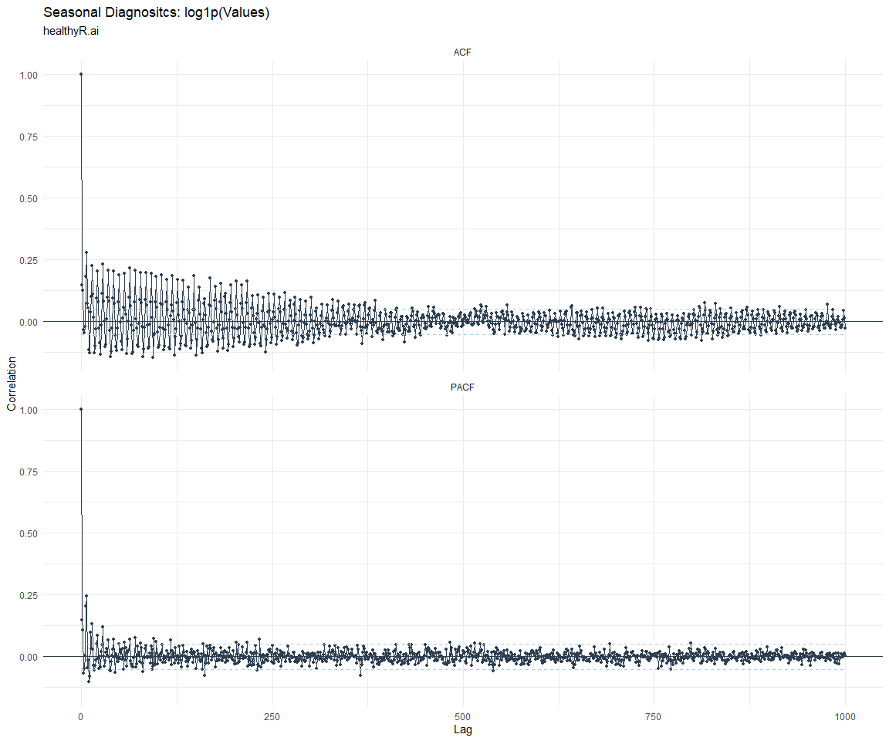

# Time Series Analysis, Modeling and Forecasting of the Healthyverse
Packages
Steven P. Sanderson II, MPH - Date:
2025-12-05

# Introduction

This analysis follows a *Nested Modeltime Workflow* from **`modeltime`**
along with using the **`NNS`** package. I use this to monitor the
downloads of all of my packages:

- [`healthyR`](https://www.spsanderson.com/healthyR/)
- [`healthyR.data`](https://www.spsanderson.com/healthyR.data/)
- [`healthyR.ts`](https://www.spsanderson.com/healthyR.ts/)
- [`healthyR.ai`](https://www.spsanderson.com/healthyR.ai/)
- [`healthyverse`](https://www.spsanderson.com/healthyverse/)
- [`TidyDensity`](https://www.spsanderson.com/TidyDensity/)
- [`tidyAML`](https://www.spsanderson.com/tidyAML/)
- [`RandomWalker`](https://www.spsanderson.com/RandomWalker/)

## Get Data

``` r
glimpse(downloads_tbl)
```

    Rows: 162,076
    Columns: 11
    $ date      <date> 2020-11-23, 2020-11-23, 2020-11-23, 2020-11-23, 2020-11-23,…
    $ time      <Period> 15H 36M 55S, 11H 26M 39S, 23H 34M 44S, 18H 39M 32S, 9H 0M…
    $ date_time <dttm> 2020-11-23 15:36:55, 2020-11-23 11:26:39, 2020-11-23 23:34:…
    $ size      <int> 4858294, 4858294, 4858301, 4858295, 361, 4863722, 4864794, 4…
    $ r_version <chr> NA, "4.0.3", "3.5.3", "3.5.2", NA, NA, NA, NA, NA, NA, NA, N…
    $ r_arch    <chr> NA, "x86_64", "x86_64", "x86_64", NA, NA, NA, NA, NA, NA, NA…
    $ r_os      <chr> NA, "mingw32", "mingw32", "linux-gnu", NA, NA, NA, NA, NA, N…
    $ package   <chr> "healthyR.data", "healthyR.data", "healthyR.data", "healthyR…
    $ version   <chr> "1.0.0", "1.0.0", "1.0.0", "1.0.0", "1.0.0", "1.0.0", "1.0.0…
    $ country   <chr> "US", "US", "US", "GB", "US", "US", "DE", "HK", "JP", "US", …
    $ ip_id     <int> 2069, 2804, 78827, 27595, 90474, 90474, 42435, 74, 7655, 638…

The last day in the data set is 2025-12-03 23:41:55, the file was
birthed on: 2022-07-02 23:58:17.511888, and at report knit time is
2.999573^{4} hours old. Happy analyzing!

Now that we have our data lets take a look at it using the `skimr`
package.

``` r
skim(downloads_tbl)
```

|                                                  |               |
|:-------------------------------------------------|:--------------|
| Name                                             | downloads_tbl |
| Number of rows                                   | 162076        |
| Number of columns                                | 11            |
| \_\_\_\_\_\_\_\_\_\_\_\_\_\_\_\_\_\_\_\_\_\_\_   |               |
| Column type frequency:                           |               |
| character                                        | 6             |
| Date                                             | 1             |
| numeric                                          | 2             |
| POSIXct                                          | 1             |
| Timespan                                         | 1             |
| \_\_\_\_\_\_\_\_\_\_\_\_\_\_\_\_\_\_\_\_\_\_\_\_ |               |
| Group variables                                  | None          |

Data summary

**Variable type: character**

| skim_variable | n_missing | complete_rate | min | max | empty | n_unique | whitespace |
|:--------------|----------:|--------------:|----:|----:|------:|---------:|-----------:|
| r_version     |    118839 |          0.27 |   5 |   7 |     0 |       50 |          0 |
| r_arch        |    118839 |          0.27 |   1 |   7 |     0 |        6 |          0 |
| r_os          |    118839 |          0.27 |   7 |  19 |     0 |       24 |          0 |
| package       |         0 |          1.00 |   7 |  13 |     0 |        8 |          0 |
| version       |         0 |          1.00 |   5 |  17 |     0 |       62 |          0 |
| country       |     15202 |          0.91 |   2 |   2 |     0 |      166 |          0 |

**Variable type: Date**

| skim_variable | n_missing | complete_rate | min | max | median | n_unique |
|:---|---:|---:|:---|:---|:---|---:|
| date | 0 | 1 | 2020-11-23 | 2025-12-03 | 2023-11-02 | 1830 |

**Variable type: numeric**

| skim_variable | n_missing | complete_rate | mean | sd | p0 | p25 | p50 | p75 | p100 | hist |
|:---|---:|---:|---:|---:|---:|---:|---:|---:|---:|:---|
| size | 0 | 1 | 1124523.34 | 1488471.59 | 355 | 27381 | 310246.5 | 2353996 | 5677952 | ▇▁▂▁▁ |
| ip_id | 0 | 1 | 11333.74 | 21980.47 | 1 | 235 | 2889.0 | 11961 | 299146 | ▇▁▁▁▁ |

**Variable type: POSIXct**

| skim_variable | n_missing | complete_rate | min | max | median | n_unique |
|:---|---:|---:|:---|:---|:---|---:|
| date_time | 0 | 1 | 2020-11-23 09:00:41 | 2025-12-03 23:41:55 | 2023-11-02 16:25:32 | 102264 |

**Variable type: Timespan**

| skim_variable | n_missing | complete_rate | min | max | median | n_unique |
|:--------------|----------:|--------------:|----:|----:|-------:|---------:|
| time          |         0 |             1 |   0 |  59 |   48.5 |       60 |

We can see that the following columns are missing a lot of data and for
us are most likely not useful anyways, so we will drop them
`c(r_version, r_arch, r_os)`

## Plots

Now lets take a look at a time-series plot of the total daily downloads
by package. We will use a log scale and place a vertical line at each
version release for each package.


    [[1]]


    [[2]]


    [[3]]


    [[4]]


    [[5]]


    [[6]]


    [[7]]


    [[8]]


Now lets take a look at some time series decomposition graphs.

    [[1]]


    [[2]]


    [[3]]


    [[4]]


    [[5]]


    [[6]]


    [[7]]


    [[8]]


    [[1]]


    [[2]]


    [[3]]


    [[4]]


    [[5]]


    [[6]]


    [[7]]


    [[8]]


Seasonal Diagnostics:

    [[1]]


    [[2]]


    [[3]]


    [[4]]


    [[5]]


    [[6]]


    [[7]]


    [[8]]


ACF and PACF Diagnostics:

    [[1]]


    [[2]]


    [[3]]


    [[4]]




    [[5]]


    [[6]]


    [[7]]


    [[8]]


## Feature Engineering

Now that we have our basic data and a shot of what it looks like, let’s
add some features to our data which can be very helpful in modeling.
Lets start by making a `tibble` that is aggregated by the day and
package, as we are going to be interested in forecasting the next 4
weeks or 28 days for each package. First lets get our base data.


    Call:
    stats::lm(formula = .formula, data = df)

    Residuals:
        Min      1Q  Median      3Q     Max 
    -146.36  -36.48  -11.22   27.08  819.45 

    Coefficients:
                                                         Estimate Std. Error
    (Intercept)                                        -1.822e+02  6.072e+01
    date                                                1.117e-02  3.219e-03
    lag(value, 1)                                       1.096e-01  2.323e-02
    lag(value, 7)                                       9.047e-02  2.395e-02
    lag(value, 14)                                      7.620e-02  2.391e-02
    lag(value, 21)                                      7.997e-02  2.397e-02
    lag(value, 28)                                      6.843e-02  2.393e-02
    lag(value, 35)                                      5.573e-02  2.398e-02
    lag(value, 42)                                      6.137e-02  2.409e-02
    lag(value, 49)                                      6.288e-02  2.398e-02
    month(date, label = TRUE).L                        -1.062e+01  5.040e+00
    month(date, label = TRUE).Q                         4.561e-01  4.974e+00
    month(date, label = TRUE).C                        -1.588e+01  5.002e+00
    month(date, label = TRUE)^4                        -6.124e+00  4.961e+00
    month(date, label = TRUE)^5                        -6.705e+00  4.910e+00
    month(date, label = TRUE)^6                         1.253e+00  4.916e+00
    month(date, label = TRUE)^7                        -4.497e+00  4.849e+00
    month(date, label = TRUE)^8                        -4.016e+00  4.821e+00
    month(date, label = TRUE)^9                         2.766e+00  4.834e+00
    month(date, label = TRUE)^10                        9.302e-01  4.850e+00
    month(date, label = TRUE)^11                       -4.077e+00  4.837e+00
    fourier_vec(date, type = "sin", K = 1, period = 7) -1.126e+01  2.219e+00
    fourier_vec(date, type = "cos", K = 1, period = 7)  7.347e+00  2.298e+00
                                                       t value Pr(>|t|)    
    (Intercept)                                         -3.000 0.002734 ** 
    date                                                 3.469 0.000534 ***
    lag(value, 1)                                        4.720 2.54e-06 ***
    lag(value, 7)                                        3.777 0.000164 ***
    lag(value, 14)                                       3.187 0.001462 ** 
    lag(value, 21)                                       3.335 0.000869 ***
    lag(value, 28)                                       2.860 0.004285 ** 
    lag(value, 35)                                       2.324 0.020237 *  
    lag(value, 42)                                       2.548 0.010931 *  
    lag(value, 49)                                       2.622 0.008820 ** 
    month(date, label = TRUE).L                         -2.106 0.035311 *  
    month(date, label = TRUE).Q                          0.092 0.926953    
    month(date, label = TRUE).C                         -3.175 0.001527 ** 
    month(date, label = TRUE)^4                         -1.234 0.217263    
    month(date, label = TRUE)^5                         -1.366 0.172260    
    month(date, label = TRUE)^6                          0.255 0.798826    
    month(date, label = TRUE)^7                         -0.927 0.353807    
    month(date, label = TRUE)^8                         -0.833 0.404939    
    month(date, label = TRUE)^9                          0.572 0.567222    
    month(date, label = TRUE)^10                         0.192 0.847931    
    month(date, label = TRUE)^11                        -0.843 0.399324    
    fourier_vec(date, type = "sin", K = 1, period = 7)  -5.075 4.28e-07 ***
    fourier_vec(date, type = "cos", K = 1, period = 7)   3.196 0.001416 ** 
    ---
    Signif. codes:  0 '***' 0.001 '**' 0.01 '*' 0.05 '.' 0.1 ' ' 1

    Residual standard error: 59.33 on 1758 degrees of freedom
      (49 observations deleted due to missingness)
    Multiple R-squared:  0.2302,    Adjusted R-squared:  0.2205 
    F-statistic: 23.89 on 22 and 1758 DF,  p-value: < 2.2e-16


## NNS Forecasting

This is something I have been wanting to try for a while. The `NNS`
package is a great package for forecasting time series data.

[NNS GitHub](https://github.com/OVVO-Financial/NNS)

``` r
library(NNS)

data_list <- base_data |>
    select(package, value) |>
    group_split(package)

data_list |>
    imap(
        \(x, idx) {
            obj <- x
            x <- obj |> pull(value) |> tail(7*52)
            train_set_size <- length(x) - 56
            pkg <- obj |> pluck(1) |> unique()
#            sf <- NNS.seas(x, modulo = 7, plot = FALSE)$periods
            seas <- t(
                sapply(
                    1:25, 
                    function(i) c(
                        i,
                        sqrt(
                            mean((
                                NNS.ARMA(x, 
                                         h = 28, 
                                         training.set = train_set_size, 
                                         method = "lin", 
                                         seasonal.factor = i, 
                                         plot=FALSE
                                         ) - tail(x, 28)) ^ 2)))
                    )
                )
            colnames(seas) <- c("Period", "RMSE")
            sf <- seas[which.min(seas[, 2]), 1]
            
            cat(paste0("Package: ", pkg, "\n"))
            NNS.ARMA.optim(
                variable = x,
                h = 28,
                training.set = train_set_size,
                #seasonal.factor = seq(12, 60, 7),
                seasonal.factor = sf,
                pred.int = 0.95,
                plot = TRUE
            )
            title(
                sub = paste0("\n",
                             "Package: ", pkg, " - NNS Optimization")
            )
        }
    )
```

    Package: healthyR
    [1] "CURRNET METHOD: lin"
    [1] "COPY LATEST PARAMETERS DIRECTLY FOR NNS.ARMA() IF ERROR:"
    [1] "NNS.ARMA(... method =  'lin' , seasonal.factor =  c( 12 ) ...)"
    [1] "CURRENT lin OBJECTIVE FUNCTION = 7.42247084181809"
    [1] "BEST method = 'lin' PATH MEMBER = c( 12 )"
    [1] "BEST lin OBJECTIVE FUNCTION = 7.42247084181809"
    [1] "CURRNET METHOD: nonlin"
    [1] "COPY LATEST PARAMETERS DIRECTLY FOR NNS.ARMA() IF ERROR:"
    [1] "NNS.ARMA(... method =  'nonlin' , seasonal.factor =  c( 12 ) ...)"
    [1] "CURRENT nonlin OBJECTIVE FUNCTION = 7.77177300180908"
    [1] "BEST method = 'nonlin' PATH MEMBER = c( 12 )"
    [1] "BEST nonlin OBJECTIVE FUNCTION = 7.77177300180908"
    [1] "CURRNET METHOD: both"
    [1] "COPY LATEST PARAMETERS DIRECTLY FOR NNS.ARMA() IF ERROR:"
    [1] "NNS.ARMA(... method =  'both' , seasonal.factor =  c( 12 ) ...)"
    [1] "CURRENT both OBJECTIVE FUNCTION = 6.80688289452525"
    [1] "BEST method = 'both' PATH MEMBER = c( 12 )"
    [1] "BEST both OBJECTIVE FUNCTION = 6.80688289452525"


    Package: healthyR.ai
    [1] "CURRNET METHOD: lin"
    [1] "COPY LATEST PARAMETERS DIRECTLY FOR NNS.ARMA() IF ERROR:"
    [1] "NNS.ARMA(... method =  'lin' , seasonal.factor =  c( 3 ) ...)"
    [1] "CURRENT lin OBJECTIVE FUNCTION = 19.3101909072865"
    [1] "BEST method = 'lin' PATH MEMBER = c( 3 )"
    [1] "BEST lin OBJECTIVE FUNCTION = 19.3101909072865"
    [1] "CURRNET METHOD: nonlin"
    [1] "COPY LATEST PARAMETERS DIRECTLY FOR NNS.ARMA() IF ERROR:"
    [1] "NNS.ARMA(... method =  'nonlin' , seasonal.factor =  c( 3 ) ...)"
    [1] "CURRENT nonlin OBJECTIVE FUNCTION = 5.88232472019315"
    [1] "BEST method = 'nonlin' PATH MEMBER = c( 3 )"
    [1] "BEST nonlin OBJECTIVE FUNCTION = 5.88232472019315"
    [1] "CURRNET METHOD: both"
    [1] "COPY LATEST PARAMETERS DIRECTLY FOR NNS.ARMA() IF ERROR:"
    [1] "NNS.ARMA(... method =  'both' , seasonal.factor =  c( 3 ) ...)"
    [1] "CURRENT both OBJECTIVE FUNCTION = 18.54670480521"
    [1] "BEST method = 'both' PATH MEMBER = c( 3 )"
    [1] "BEST both OBJECTIVE FUNCTION = 18.54670480521"


    Package: healthyR.data
    [1] "CURRNET METHOD: lin"
    [1] "COPY LATEST PARAMETERS DIRECTLY FOR NNS.ARMA() IF ERROR:"
    [1] "NNS.ARMA(... method =  'lin' , seasonal.factor =  c( 5 ) ...)"
    [1] "CURRENT lin OBJECTIVE FUNCTION = 25.6147734004602"
    [1] "BEST method = 'lin' PATH MEMBER = c( 5 )"
    [1] "BEST lin OBJECTIVE FUNCTION = 25.6147734004602"
    [1] "CURRNET METHOD: nonlin"
    [1] "COPY LATEST PARAMETERS DIRECTLY FOR NNS.ARMA() IF ERROR:"
    [1] "NNS.ARMA(... method =  'nonlin' , seasonal.factor =  c( 5 ) ...)"
    [1] "CURRENT nonlin OBJECTIVE FUNCTION = 8.64632847859436"
    [1] "BEST method = 'nonlin' PATH MEMBER = c( 5 )"
    [1] "BEST nonlin OBJECTIVE FUNCTION = 8.64632847859436"
    [1] "CURRNET METHOD: both"
    [1] "COPY LATEST PARAMETERS DIRECTLY FOR NNS.ARMA() IF ERROR:"
    [1] "NNS.ARMA(... method =  'both' , seasonal.factor =  c( 5 ) ...)"
    [1] "CURRENT both OBJECTIVE FUNCTION = 7.9302272671102"
    [1] "BEST method = 'both' PATH MEMBER = c( 5 )"
    [1] "BEST both OBJECTIVE FUNCTION = 7.9302272671102"


    Package: healthyR.ts
    [1] "CURRNET METHOD: lin"
    [1] "COPY LATEST PARAMETERS DIRECTLY FOR NNS.ARMA() IF ERROR:"
    [1] "NNS.ARMA(... method =  'lin' , seasonal.factor =  c( 1 ) ...)"
    [1] "CURRENT lin OBJECTIVE FUNCTION = 110.832998065742"
    [1] "BEST method = 'lin' PATH MEMBER = c( 1 )"
    [1] "BEST lin OBJECTIVE FUNCTION = 110.832998065742"
    [1] "CURRNET METHOD: nonlin"
    [1] "COPY LATEST PARAMETERS DIRECTLY FOR NNS.ARMA() IF ERROR:"
    [1] "NNS.ARMA(... method =  'nonlin' , seasonal.factor =  c( 1 ) ...)"
    [1] "CURRENT nonlin OBJECTIVE FUNCTION = 77.0627951140239"
    [1] "BEST method = 'nonlin' PATH MEMBER = c( 1 )"
    [1] "BEST nonlin OBJECTIVE FUNCTION = 77.0627951140239"
    [1] "CURRNET METHOD: both"
    [1] "COPY LATEST PARAMETERS DIRECTLY FOR NNS.ARMA() IF ERROR:"
    [1] "NNS.ARMA(... method =  'both' , seasonal.factor =  c( 1 ) ...)"
    [1] "CURRENT both OBJECTIVE FUNCTION = 87.8727909158634"
    [1] "BEST method = 'both' PATH MEMBER = c( 1 )"
    [1] "BEST both OBJECTIVE FUNCTION = 87.8727909158634"


    Package: healthyverse
    [1] "CURRNET METHOD: lin"
    [1] "COPY LATEST PARAMETERS DIRECTLY FOR NNS.ARMA() IF ERROR:"
    [1] "NNS.ARMA(... method =  'lin' , seasonal.factor =  c( 12 ) ...)"
    [1] "CURRENT lin OBJECTIVE FUNCTION = 6.02402780869286"
    [1] "BEST method = 'lin' PATH MEMBER = c( 12 )"
    [1] "BEST lin OBJECTIVE FUNCTION = 6.02402780869286"
    [1] "CURRNET METHOD: nonlin"
    [1] "COPY LATEST PARAMETERS DIRECTLY FOR NNS.ARMA() IF ERROR:"
    [1] "NNS.ARMA(... method =  'nonlin' , seasonal.factor =  c( 12 ) ...)"
    [1] "CURRENT nonlin OBJECTIVE FUNCTION = 11.3824053370165"
    [1] "BEST method = 'nonlin' PATH MEMBER = c( 12 )"
    [1] "BEST nonlin OBJECTIVE FUNCTION = 11.3824053370165"
    [1] "CURRNET METHOD: both"
    [1] "COPY LATEST PARAMETERS DIRECTLY FOR NNS.ARMA() IF ERROR:"
    [1] "NNS.ARMA(... method =  'both' , seasonal.factor =  c( 12 ) ...)"
    [1] "CURRENT both OBJECTIVE FUNCTION = 8.72458943634062"
    [1] "BEST method = 'both' PATH MEMBER = c( 12 )"
    [1] "BEST both OBJECTIVE FUNCTION = 8.72458943634062"


    Package: RandomWalker
    [1] "CURRNET METHOD: lin"
    [1] "COPY LATEST PARAMETERS DIRECTLY FOR NNS.ARMA() IF ERROR:"
    [1] "NNS.ARMA(... method =  'lin' , seasonal.factor =  c( 13 ) ...)"
    [1] "CURRENT lin OBJECTIVE FUNCTION = 11.3718625767837"
    [1] "BEST method = 'lin' PATH MEMBER = c( 13 )"
    [1] "BEST lin OBJECTIVE FUNCTION = 11.3718625767837"
    [1] "CURRNET METHOD: nonlin"
    [1] "COPY LATEST PARAMETERS DIRECTLY FOR NNS.ARMA() IF ERROR:"
    [1] "NNS.ARMA(... method =  'nonlin' , seasonal.factor =  c( 13 ) ...)"
    [1] "CURRENT nonlin OBJECTIVE FUNCTION = 6.12876584702821"
    [1] "BEST method = 'nonlin' PATH MEMBER = c( 13 )"
    [1] "BEST nonlin OBJECTIVE FUNCTION = 6.12876584702821"
    [1] "CURRNET METHOD: both"
    [1] "COPY LATEST PARAMETERS DIRECTLY FOR NNS.ARMA() IF ERROR:"
    [1] "NNS.ARMA(... method =  'both' , seasonal.factor =  c( 13 ) ...)"
    [1] "CURRENT both OBJECTIVE FUNCTION = 6.41728184647416"
    [1] "BEST method = 'both' PATH MEMBER = c( 13 )"
    [1] "BEST both OBJECTIVE FUNCTION = 6.41728184647416"


    Package: tidyAML
    [1] "CURRNET METHOD: lin"
    [1] "COPY LATEST PARAMETERS DIRECTLY FOR NNS.ARMA() IF ERROR:"
    [1] "NNS.ARMA(... method =  'lin' , seasonal.factor =  c( 2 ) ...)"
    [1] "CURRENT lin OBJECTIVE FUNCTION = 59.1862487005951"
    [1] "BEST method = 'lin' PATH MEMBER = c( 2 )"
    [1] "BEST lin OBJECTIVE FUNCTION = 59.1862487005951"
    [1] "CURRNET METHOD: nonlin"
    [1] "COPY LATEST PARAMETERS DIRECTLY FOR NNS.ARMA() IF ERROR:"
    [1] "NNS.ARMA(... method =  'nonlin' , seasonal.factor =  c( 2 ) ...)"
    [1] "CURRENT nonlin OBJECTIVE FUNCTION = 8.05237103840849"
    [1] "BEST method = 'nonlin' PATH MEMBER = c( 2 )"
    [1] "BEST nonlin OBJECTIVE FUNCTION = 8.05237103840849"
    [1] "CURRNET METHOD: both"
    [1] "COPY LATEST PARAMETERS DIRECTLY FOR NNS.ARMA() IF ERROR:"
    [1] "NNS.ARMA(... method =  'both' , seasonal.factor =  c( 2 ) ...)"
    [1] "CURRENT both OBJECTIVE FUNCTION = 11.9019338128146"
    [1] "BEST method = 'both' PATH MEMBER = c( 2 )"
    [1] "BEST both OBJECTIVE FUNCTION = 11.9019338128146"


    Package: TidyDensity
    [1] "CURRNET METHOD: lin"
    [1] "COPY LATEST PARAMETERS DIRECTLY FOR NNS.ARMA() IF ERROR:"
    [1] "NNS.ARMA(... method =  'lin' , seasonal.factor =  c( 16 ) ...)"
    [1] "CURRENT lin OBJECTIVE FUNCTION = 10.6500373310391"
    [1] "BEST method = 'lin' PATH MEMBER = c( 16 )"
    [1] "BEST lin OBJECTIVE FUNCTION = 10.6500373310391"
    [1] "CURRNET METHOD: nonlin"
    [1] "COPY LATEST PARAMETERS DIRECTLY FOR NNS.ARMA() IF ERROR:"
    [1] "NNS.ARMA(... method =  'nonlin' , seasonal.factor =  c( 16 ) ...)"
    [1] "CURRENT nonlin OBJECTIVE FUNCTION = 19.1226264417811"
    [1] "BEST method = 'nonlin' PATH MEMBER = c( 16 )"
    [1] "BEST nonlin OBJECTIVE FUNCTION = 19.1226264417811"
    [1] "CURRNET METHOD: both"
    [1] "COPY LATEST PARAMETERS DIRECTLY FOR NNS.ARMA() IF ERROR:"
    [1] "NNS.ARMA(... method =  'both' , seasonal.factor =  c( 16 ) ...)"
    [1] "CURRENT both OBJECTIVE FUNCTION = 13.548463171259"
    [1] "BEST method = 'both' PATH MEMBER = c( 16 )"
    [1] "BEST both OBJECTIVE FUNCTION = 13.548463171259"


    [[1]]
    NULL

    [[2]]
    NULL

    [[3]]
    NULL

    [[4]]
    NULL

    [[5]]
    NULL

    [[6]]
    NULL

    [[7]]
    NULL

    [[8]]
    NULL

## Pre-Processing

Now we are going to do some basic pre-processing.

``` r
data_padded_tbl <- base_data %>%
  pad_by_time(
    .date_var  = date,
    .pad_value = 0
  )

# Get log interval and standardization parameters
log_params  <- liv(data_padded_tbl$value, limit_lower = 0, offset = 1, silent = TRUE)
limit_lower <- log_params$limit_lower
limit_upper <- log_params$limit_upper
offset      <- log_params$offset

data_liv_tbl <- data_padded_tbl %>%
  # Get log interval transform
  mutate(value_trans = liv(value, limit_lower = 0, offset = 1, silent = TRUE)$log_scaled)

# Get Standardization Params
std_params <- standard_vec(data_liv_tbl$value_trans, silent = TRUE)
std_mean   <- std_params$mean
std_sd     <- std_params$sd

data_transformed_tbl <- data_liv_tbl %>%
  group_by(package) %>%
  # get standardization
  mutate(value_trans = standard_vec(value_trans, silent = TRUE)$standard_scaled) %>%
  tk_augment_fourier(
    .date_var = date,
    .periods  = c(7, 14, 30, 90, 180),
    .K        = 2
  ) %>%
  tk_augment_timeseries_signature(
    .date_var = date
  ) %>%
  ungroup() %>%
  select(-c(value, -year.iso))
```

Since this is panel data we can follow one of two different modeling
strategies. We can search for a global model in the panel data or we can
use nested forecasting finding the best model for each of the time
series. Since we only have 5 panels, we will use nested forecasting.

To do this we will use the `nest_timeseries` and
`split_nested_timeseries` functions to create a nested `tibble`.

``` r
horizon <- 4*7

nested_data_tbl <- data_transformed_tbl %>%

    # 0. Filter out column where package is NA
    filter(!is.na(package)) %>%
    
    # 1. Extending: We'll predict n days into the future.
    extend_timeseries(
        .id_var        = package,
        .date_var      = date,
        .length_future = horizon
    ) %>%
    
    # 2. Nesting: We'll group by id, and create a future dataset
    #    that forecasts n days of extended data and
    #    an actual dataset that contains n*2 days
    nest_timeseries(
        .id_var        = package,
        .length_future = horizon
        #.length_actual = horizon*2
    ) %>%
    
   # 3. Splitting: We'll take the actual data and create splits
   #    for accuracy and confidence interval estimation of n das (test)
   #    and the rest is training data
    split_nested_timeseries(
        .length_test = horizon
    )

nested_data_tbl
```

    # A tibble: 8 × 4
      package       .actual_data          .future_data       .splits          
      <fct>         <list>                <list>             <list>           
    1 healthyR.data <tibble [1,822 × 50]> <tibble [28 × 50]> <split [1794|28]>
    2 healthyR      <tibble [1,813 × 50]> <tibble [28 × 50]> <split [1785|28]>
    3 healthyR.ts   <tibble [1,758 × 50]> <tibble [28 × 50]> <split [1730|28]>
    4 healthyverse  <tibble [1,729 × 50]> <tibble [28 × 50]> <split [1701|28]>
    5 healthyR.ai   <tibble [1,555 × 50]> <tibble [28 × 50]> <split [1527|28]>
    6 TidyDensity   <tibble [1,406 × 50]> <tibble [28 × 50]> <split [1378|28]>
    7 tidyAML       <tibble [1,013 × 50]> <tibble [28 × 50]> <split [985|28]> 
    8 RandomWalker  <tibble [436 × 50]>   <tibble [28 × 50]> <split [408|28]> 

Now it is time to make some recipes and models using the modeltime
workflow.

## Modeltime Workflow

### Recipe Object

``` r
recipe_base <- recipe(
  value_trans ~ .
  , data = extract_nested_test_split(nested_data_tbl)
  )

recipe_base

recipe_date <- recipe(
  value_trans ~ date
  , data = extract_nested_test_split(nested_data_tbl)
  )
```

### Models

``` r
# Models ------------------------------------------------------------------

# Auto ARIMA --------------------------------------------------------------

model_spec_arima_no_boost <- arima_reg() %>%
  set_engine(engine = "auto_arima")

wflw_auto_arima <- workflow() %>%
  add_recipe(recipe = recipe_date) %>%
  add_model(model_spec_arima_no_boost)

# NNETAR ------------------------------------------------------------------

model_spec_nnetar <- nnetar_reg(
  mode              = "regression"
  , seasonal_period = "auto"
) %>%
  set_engine("nnetar")

wflw_nnetar <- workflow() %>%
  add_recipe(recipe = recipe_base) %>%
  add_model(model_spec_nnetar)

# TSLM --------------------------------------------------------------------

model_spec_lm <- linear_reg() %>%
  set_engine("lm")

wflw_lm <- workflow() %>%
  add_recipe(recipe = recipe_base) %>%
  add_model(model_spec_lm)

# MARS --------------------------------------------------------------------

model_spec_mars <- mars(mode = "regression") %>%
  set_engine("earth")

wflw_mars <- workflow() %>%
  add_recipe(recipe = recipe_date) %>%
  add_model(model_spec_mars)
```

### Nested Modeltime Tables

``` r
nested_modeltime_tbl <- modeltime_nested_fit(
  # Nested Data
  nested_data = nested_data_tbl,
   control = control_nested_fit(
     verbose = TRUE,
     allow_par = FALSE
   ),
  # Add workflows
  wflw_auto_arima,
  wflw_lm,
  wflw_mars,
  wflw_nnetar
)
```

``` r
nested_modeltime_tbl <- nested_modeltime_tbl[!is.na(nested_modeltime_tbl$package),]
```

### Model Accuracy

``` r
nested_modeltime_tbl %>%
  extract_nested_test_accuracy() %>%
  filter(!is.na(package)) %>%
  knitr::kable()
```

| package | .model_id | .model_desc | .type | mae | mape | mase | smape | rmse | rsq |
|:---|---:|:---|:---|---:|---:|---:|---:|---:|---:|
| healthyR.data | 1 | ARIMA | Test | 0.9271055 | 142.47142 | 0.7873815 | 175.7471 | 1.0944280 | 0.0234789 |
| healthyR.data | 2 | LM | Test | 0.8092850 | 160.90353 | 0.6873177 | 133.3049 | 0.9357054 | 0.0259016 |
| healthyR.data | 3 | EARTH | Test | 0.8931487 | 108.38546 | 0.7585423 | 168.9094 | 1.0557934 | 0.0003864 |
| healthyR.data | 4 | NNAR | Test | 0.8374680 | 211.86866 | 0.7112532 | 121.9725 | 0.9515265 | 0.0050638 |
| healthyR | 1 | ARIMA | Test | 0.8512157 | 144.94551 | 0.8221898 | 160.4913 | 1.1334958 | 0.0084631 |
| healthyR | 2 | LM | Test | 0.7636841 | 449.29238 | 0.7376430 | 128.3083 | 0.9697839 | 0.0341594 |
| healthyR | 3 | EARTH | Test | 1.0624454 | 304.75338 | 1.0262167 | 178.5461 | 1.3259972 | 0.0267311 |
| healthyR | 4 | NNAR | Test | 0.8091714 | 455.17968 | 0.7815792 | 136.3280 | 1.0294248 | 0.0077425 |
| healthyR.ts | 1 | ARIMA | Test | 0.6965950 | 182.62838 | 0.6797742 | 145.9751 | 0.9199612 | 0.0252838 |
| healthyR.ts | 2 | LM | Test | 0.8742884 | 344.00198 | 0.8531767 | 162.4294 | 1.0533880 | 0.0040476 |
| healthyR.ts | 3 | EARTH | Test | 0.6421260 | 126.91347 | 0.6266204 | 136.4706 | 0.8835031 | 0.0124713 |
| healthyR.ts | 4 | NNAR | Test | 0.8701253 | 342.84741 | 0.8491141 | 157.8798 | 1.0384783 | 0.0137563 |
| healthyverse | 1 | ARIMA | Test | 0.9151274 | 91.74449 | 0.9319919 | 163.3505 | 1.1587324 | 0.0891618 |
| healthyverse | 2 | LM | Test | 0.9446937 | 158.51547 | 0.9621031 | 143.2456 | 1.0921942 | 0.0123855 |
| healthyverse | 3 | EARTH | Test | 0.7849667 | 142.19034 | 0.7994324 | 113.8378 | 0.9833319 | 0.0003917 |
| healthyverse | 4 | NNAR | Test | 0.9211702 | 154.49985 | 0.9381460 | 133.7985 | 1.0880846 | 0.0016442 |
| healthyR.ai | 1 | ARIMA | Test | 0.9848080 | 99.46817 | 1.0848422 | 190.3269 | 1.1748352 | 0.0026857 |
| healthyR.ai | 2 | LM | Test | 1.2125269 | 151.83698 | 1.3356923 | 165.6941 | 1.3996556 | 0.0322248 |
| healthyR.ai | 3 | EARTH | Test | 0.8128680 | 81.32210 | 0.8954370 | 113.5764 | 1.0382718 | 0.1798390 |
| healthyR.ai | 4 | NNAR | Test | 1.2164298 | 150.14213 | 1.3399916 | 168.5875 | 1.4070368 | 0.0003136 |
| TidyDensity | 1 | ARIMA | Test | 0.9605820 | 265.67435 | 0.6116639 | 143.5840 | 1.1426382 | 0.5243825 |
| TidyDensity | 2 | LM | Test | 0.8768535 | 118.80247 | 0.5583486 | 150.0834 | 1.0675961 | 0.0803710 |
| TidyDensity | 3 | EARTH | Test | 1.1284944 | 317.74176 | 0.7185844 | 128.9309 | 1.3901836 | 0.0645247 |
| TidyDensity | 4 | NNAR | Test | 0.9308894 | 168.92310 | 0.5927567 | 149.6938 | 1.0814238 | 0.0716393 |
| tidyAML | 1 | ARIMA | Test | 0.8779933 | 119.07906 | 1.0025434 | 184.4475 | 1.0370597 | 0.0158876 |
| tidyAML | 2 | LM | Test | 0.7195456 | 206.69579 | 0.8216187 | 124.2401 | 0.8708057 | 0.0818809 |
| tidyAML | 3 | EARTH | Test | 0.9622259 | 158.90260 | 1.0987252 | 181.7720 | 1.1179834 | 0.0041723 |
| tidyAML | 4 | NNAR | Test | 0.7217111 | 191.02704 | 0.8240914 | 123.7270 | 0.8663225 | 0.0681259 |
| RandomWalker | 1 | ARIMA | Test | 0.8532957 | 127.71923 | 0.7577963 | 166.6293 | 0.9169701 | 0.2001317 |
| RandomWalker | 2 | LM | Test | 0.8987630 | 146.99003 | 0.7981749 | 157.4173 | 1.0045599 | 0.0005473 |
| RandomWalker | 3 | EARTH | Test | 0.9890069 | 167.18689 | 0.8783189 | 163.0656 | 1.0424660 | 0.0639651 |
| RandomWalker | 4 | NNAR | Test | 1.0058047 | 183.52939 | 0.8932367 | 164.1921 | 1.1041968 | 0.0030022 |

### Plot Models

``` r
nested_modeltime_tbl %>%
  extract_nested_test_forecast() %>%
  group_by(package) %>%
  filter_by_time(.date_var = .index, .start_date = max(.index) - 60) %>%
  ungroup() %>%
  plot_modeltime_forecast(
    .interactive = FALSE,
    .conf_interval_show  = FALSE,
    .facet_scales = "free"
  ) +
  theme_minimal() +
  facet_wrap(~ package, nrow = 3) +
  theme(legend.position = "bottom")
```


### Best Model

``` r
best_nested_modeltime_tbl <- nested_modeltime_tbl %>%
  modeltime_nested_select_best(
    metric = "rmse",
    minimize = TRUE,
    filter_test_forecasts = TRUE
  )

best_nested_modeltime_tbl %>%
  extract_nested_best_model_report()
```

    # Nested Modeltime Table
      

    # A tibble: 8 × 10
      package      .model_id .model_desc .type   mae  mape  mase smape  rmse     rsq
      <fct>            <int> <chr>       <chr> <dbl> <dbl> <dbl> <dbl> <dbl>   <dbl>
    1 healthyR.da…         2 LM          Test  0.809 161.  0.687  133. 0.936 2.59e-2
    2 healthyR             2 LM          Test  0.764 449.  0.738  128. 0.970 3.42e-2
    3 healthyR.ts          3 EARTH       Test  0.642 127.  0.627  136. 0.884 1.25e-2
    4 healthyverse         3 EARTH       Test  0.785 142.  0.799  114. 0.983 3.92e-4
    5 healthyR.ai          3 EARTH       Test  0.813  81.3 0.895  114. 1.04  1.80e-1
    6 TidyDensity          2 LM          Test  0.877 119.  0.558  150. 1.07  8.04e-2
    7 tidyAML              4 NNAR        Test  0.722 191.  0.824  124. 0.866 6.81e-2
    8 RandomWalker         1 ARIMA       Test  0.853 128.  0.758  167. 0.917 2.00e-1

``` r
best_nested_modeltime_tbl %>%
  extract_nested_test_forecast() %>%
  #filter(!is.na(.model_id)) %>%
  group_by(package) %>%
  filter_by_time(.date_var = .index, .start_date = max(.index) - 60) %>%
  ungroup() %>%
  plot_modeltime_forecast(
    .interactive = FALSE,
    .conf_interval_alpha = 0.2,
    .facet_scales = "free"
  ) +
  facet_wrap(~ package, nrow = 3) +
  theme_minimal() +
  theme(legend.position = "bottom")
```


## Refitting and Future Forecast

Now that we have the best models, we can make our future forecasts.

``` r
nested_modeltime_refit_tbl <- best_nested_modeltime_tbl %>%
    modeltime_nested_refit(
        control = control_nested_refit(verbose = TRUE)
    )
```

``` r
nested_modeltime_refit_tbl
```

    # Nested Modeltime Table
      

    # A tibble: 8 × 5
      package       .actual_data .future_data .splits           .modeltime_tables 
      <fct>         <list>       <list>       <list>            <list>            
    1 healthyR.data <tibble>     <tibble>     <split [1794|28]> <mdl_tm_t [1 × 5]>
    2 healthyR      <tibble>     <tibble>     <split [1785|28]> <mdl_tm_t [1 × 5]>
    3 healthyR.ts   <tibble>     <tibble>     <split [1730|28]> <mdl_tm_t [1 × 5]>
    4 healthyverse  <tibble>     <tibble>     <split [1701|28]> <mdl_tm_t [1 × 5]>
    5 healthyR.ai   <tibble>     <tibble>     <split [1527|28]> <mdl_tm_t [1 × 5]>
    6 TidyDensity   <tibble>     <tibble>     <split [1378|28]> <mdl_tm_t [1 × 5]>
    7 tidyAML       <tibble>     <tibble>     <split [985|28]>  <mdl_tm_t [1 × 5]>
    8 RandomWalker  <tibble>     <tibble>     <split [408|28]>  <mdl_tm_t [1 × 5]>

``` r
nested_modeltime_refit_tbl %>%
  extract_nested_future_forecast() %>%
  group_by(package) %>%
  mutate(across(.value:.conf_hi, .fns = ~ standard_inv_vec(
    x    = .,
    mean = std_mean,
    sd   = std_sd
  )$standard_inverse_value)) %>%
  mutate(across(.value:.conf_hi, .fns = ~ liiv(
    x = .,
    limit_lower = limit_lower,
    limit_upper = limit_upper,
    offset      = offset
  )$rescaled_v)) %>%
  filter_by_time(.date_var = .index, .start_date = max(.index) - 60) %>%
  ungroup() %>%
  plot_modeltime_forecast(
    .interactive = FALSE,
    .conf_interval_alpha = 0.2,
    .facet_scales = "free"
  ) +
  facet_wrap(~ package, nrow = 3) +
  theme_minimal() +
  theme(legend.position = "bottom")
```


