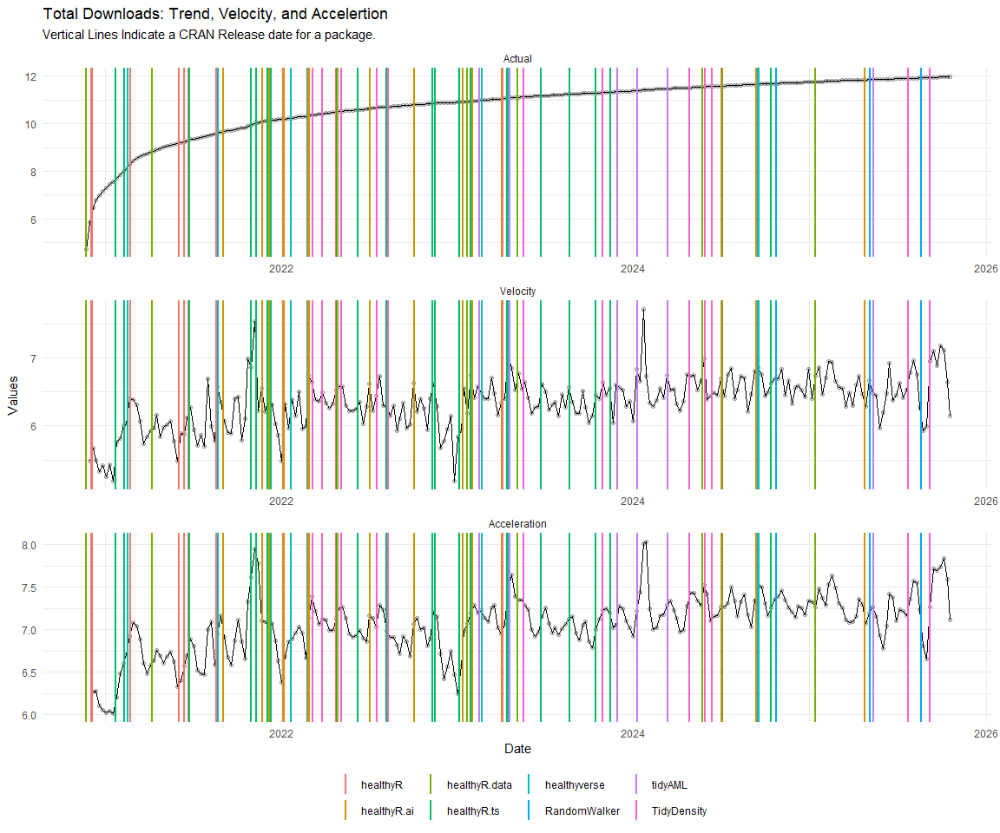

Time Series Analysis and Nested Modeling of the Healthyverse Packages
================
Steven P. Sanderson II, MPH - Date:
07 January, 2025

This analysis follows a *Nested Modeltime Workflow*.

## Get Data

``` r
glimpse(downloads_tbl)
```

    ## Rows: 126,289
    ## Columns: 11
    ## $ date      <date> 2020-11-23, 2020-11-23, 2020-11-23, 2020-11-23, 2020-11-23,…
    ## $ time      <Period> 15H 36M 55S, 11H 26M 39S, 23H 34M 44S, 18H 39M 32S, 9H 0M…
    ## $ date_time <dttm> 2020-11-23 15:36:55, 2020-11-23 11:26:39, 2020-11-23 23:34:…
    ## $ size      <int> 4858294, 4858294, 4858301, 4858295, 361, 4863722, 4864794, 4…
    ## $ r_version <chr> NA, "4.0.3", "3.5.3", "3.5.2", NA, NA, NA, NA, NA, NA, NA, N…
    ## $ r_arch    <chr> NA, "x86_64", "x86_64", "x86_64", NA, NA, NA, NA, NA, NA, NA…
    ## $ r_os      <chr> NA, "mingw32", "mingw32", "linux-gnu", NA, NA, NA, NA, NA, N…
    ## $ package   <chr> "healthyR.data", "healthyR.data", "healthyR.data", "healthyR…
    ## $ version   <chr> "1.0.0", "1.0.0", "1.0.0", "1.0.0", "1.0.0", "1.0.0", "1.0.0…
    ## $ country   <chr> "US", "US", "US", "GB", "US", "US", "DE", "HK", "JP", "US", …
    ## $ ip_id     <int> 2069, 2804, 78827, 27595, 90474, 90474, 42435, 74, 7655, 638…

The last day in the data set is 2025-01-05 22:18:15, the file was
birthed on: 2024-08-07 07:35:44, and at report knit time is -3634.71
hours old. Happy analyzing!

Now that we have our data lets take a look at it using the `skimr`
package.

``` r
skim(downloads_tbl)
```

|                                                  |               |
|:-------------------------------------------------|:--------------|
| Name                                             | downloads_tbl |
| Number of rows                                   | 126289        |
| Number of columns                                | 11            |
| \_\_\_\_\_\_\_\_\_\_\_\_\_\_\_\_\_\_\_\_\_\_\_   |               |
| Column type frequency:                           |               |
| character                                        | 6             |
| Date                                             | 1             |
| numeric                                          | 2             |
| POSIXct                                          | 1             |
| Timespan                                         | 1             |
| \_\_\_\_\_\_\_\_\_\_\_\_\_\_\_\_\_\_\_\_\_\_\_\_ |               |
| Group variables                                  | None          |

Data summary

**Variable type: character**

| skim_variable | n_missing | complete_rate | min | max | empty | n_unique | whitespace |
|:--------------|----------:|--------------:|----:|----:|------:|---------:|-----------:|
| r_version     |     89780 |          0.29 |   5 |   5 |     0 |       45 |          0 |
| r_arch        |     89780 |          0.29 |   3 |   7 |     0 |        5 |          0 |
| r_os          |     89780 |          0.29 |   7 |  15 |     0 |       21 |          0 |
| package       |         0 |          1.00 |   7 |  13 |     0 |        8 |          0 |
| version       |         0 |          1.00 |   5 |  17 |     0 |       60 |          0 |
| country       |     10764 |          0.91 |   2 |   2 |     0 |      160 |          0 |

**Variable type: Date**

| skim_variable | n_missing | complete_rate | min | max | median | n_unique |
|:---|---:|---:|:---|:---|:---|---:|
| date | 0 | 1 | 2020-11-23 | 2025-01-05 | 2023-04-18 | 1505 |

**Variable type: numeric**

| skim_variable | n_missing | complete_rate | mean | sd | p0 | p25 | p50 | p75 | p100 | hist |
|:---|---:|---:|---:|---:|---:|---:|---:|---:|---:|:---|
| size | 0 | 1 | 1145304.74 | 1533952.9 | 355 | 14701 | 260377 | 2367948 | 5677952 | ▇▁▂▁▁ |
| ip_id | 0 | 1 | 10326.68 | 17967.7 | 1 | 317 | 3098 | 11834 | 143633 | ▇▁▁▁▁ |

**Variable type: POSIXct**

| skim_variable | n_missing | complete_rate | min | max | median | n_unique |
|:---|---:|---:|:---|:---|:---|---:|
| date_time | 0 | 1 | 2020-11-23 09:00:41 | 2025-01-05 22:18:15 | 2023-04-18 07:52:43 | 76465 |

**Variable type: Timespan**

| skim_variable | n_missing | complete_rate | min | max |     median | n_unique |
|:--------------|----------:|--------------:|----:|----:|-----------:|---------:|
| time          |         0 |             1 |   0 |  59 | 12H 4M 47S |       60 |

We can see that the following columns are missing a lot of data and for
us are most likely not useful anyways, so we will drop them
`c(r_version, r_arch, r_os)`

## Plots

Now lets take a look at a time-series plot of the total daily downloads
by package. We will use a log scale and place a vertical line at each
version release for each package.

<!-- --><!-- -->

Now lets take a look at some time series decomposition graphs.

<!-- --><!-- --><!-- --><!-- -->

## Feature Engineering

Now that we have our basic data and a shot of what it looks like, let’s
add some features to our data which can be very helpful in modeling.
Lets start by making a `tibble` that is aggregated by the day and
package, as we are going to be interested in forecasting the next 4
weeks or 28 days for each package. First lets get our base data.

    ## 
    ## Call:
    ## stats::lm(formula = .formula, data = df)
    ## 
    ## Residuals:
    ##     Min      1Q  Median      3Q     Max 
    ## -154.92  -35.35   -9.94   27.19  803.99 
    ## 
    ## Coefficients:
    ##                                                      Estimate Std. Error
    ## (Intercept)                                        -1.956e+02  7.945e+01
    ## date                                                1.165e-02  4.209e-03
    ## lag(value, 1)                                       1.268e-01  2.544e-02
    ## lag(value, 7)                                       9.163e-02  2.648e-02
    ## lag(value, 14)                                      1.053e-01  2.649e-02
    ## lag(value, 21)                                      5.083e-02  2.661e-02
    ## lag(value, 28)                                      6.750e-02  2.644e-02
    ## lag(value, 35)                                      7.298e-02  2.656e-02
    ## lag(value, 42)                                      4.942e-02  2.663e-02
    ## lag(value, 49)                                      9.465e-02  2.647e-02
    ## month(date, label = TRUE).L                        -1.200e+01  5.440e+00
    ## month(date, label = TRUE).Q                         2.795e+00  5.272e+00
    ## month(date, label = TRUE).C                        -1.197e+01  5.338e+00
    ## month(date, label = TRUE)^4                        -7.061e+00  5.344e+00
    ## month(date, label = TRUE)^5                        -1.325e+01  5.318e+00
    ## month(date, label = TRUE)^6                        -6.869e-01  5.391e+00
    ## month(date, label = TRUE)^7                        -9.207e+00  5.286e+00
    ## month(date, label = TRUE)^8                        -2.130e+00  5.282e+00
    ## month(date, label = TRUE)^9                         4.135e+00  5.272e+00
    ## month(date, label = TRUE)^10                        5.181e+00  5.272e+00
    ## month(date, label = TRUE)^11                       -6.249e+00  5.286e+00
    ## fourier_vec(date, type = "sin", K = 1, period = 7) -1.154e+01  2.434e+00
    ## fourier_vec(date, type = "cos", K = 1, period = 7)  7.323e+00  2.548e+00
    ##                                                    t value Pr(>|t|)    
    ## (Intercept)                                         -2.462 0.013944 *  
    ## date                                                 2.767 0.005739 ** 
    ## lag(value, 1)                                        4.986 6.92e-07 ***
    ## lag(value, 7)                                        3.461 0.000554 ***
    ## lag(value, 14)                                       3.974 7.42e-05 ***
    ## lag(value, 21)                                       1.910 0.056288 .  
    ## lag(value, 28)                                       2.553 0.010787 *  
    ## lag(value, 35)                                       2.748 0.006078 ** 
    ## lag(value, 42)                                       1.856 0.063690 .  
    ## lag(value, 49)                                       3.576 0.000361 ***
    ## month(date, label = TRUE).L                         -2.206 0.027558 *  
    ## month(date, label = TRUE).Q                          0.530 0.596130    
    ## month(date, label = TRUE).C                         -2.242 0.025093 *  
    ## month(date, label = TRUE)^4                         -1.321 0.186615    
    ## month(date, label = TRUE)^5                         -2.492 0.012800 *  
    ## month(date, label = TRUE)^6                         -0.127 0.898620    
    ## month(date, label = TRUE)^7                         -1.742 0.081779 .  
    ## month(date, label = TRUE)^8                         -0.403 0.686782    
    ## month(date, label = TRUE)^9                          0.784 0.433046    
    ## month(date, label = TRUE)^10                         0.983 0.325899    
    ## month(date, label = TRUE)^11                        -1.182 0.237312    
    ## fourier_vec(date, type = "sin", K = 1, period = 7)  -4.740 2.35e-06 ***
    ## fourier_vec(date, type = "cos", K = 1, period = 7)   2.874 0.004107 ** 
    ## ---
    ## Signif. codes:  0 '***' 0.001 '**' 0.01 '*' 0.05 '.' 0.1 ' ' 1
    ## 
    ## Residual standard error: 57.99 on 1433 degrees of freedom
    ##   (49 observations deleted due to missingness)
    ## Multiple R-squared:  0.2591, Adjusted R-squared:  0.2477 
    ## F-statistic: 22.78 on 22 and 1433 DF,  p-value: < 2.2e-16

<!-- -->

Now we are going to do some basic pre-processing.

``` r
data_padded_tbl <- base_data %>%
  pad_by_time(
    .date_var  = date,
    .pad_value = 0
  )

# Get log interval and standardization parameters
log_params  <- liv(data_padded_tbl$value, limit_lower = 0, offset = 1, silent = TRUE)
limit_lower <- log_params$limit_lower
limit_upper <- log_params$limit_upper
offset      <- log_params$offset

data_liv_tbl <- data_padded_tbl %>%
  # Get log interval transform
  mutate(value_trans = liv(value, limit_lower = 0, offset = 1, silent = TRUE)$log_scaled)

# Get Standardization Params
std_params <- standard_vec(data_liv_tbl$value_trans, silent = TRUE)
std_mean   <- std_params$mean
std_sd     <- std_params$sd

data_transformed_tbl <- data_liv_tbl %>%
  # get standardization
  mutate(value_trans = standard_vec(value_trans, silent = TRUE)$standard_scaled) %>%
  select(-value)
```

Since this is panel data we can follow one of two different modeling
strategies. We can search for a global model in the panel data or we can
use nested forecasting finding the best model for each of the time
series. Since we only have 5 panels, we will use nested forecasting.

To do this we will use the `nest_timeseries` and
`split_nested_timeseries` functions to create a nested `tibble`.

``` r
horizon <- 4*7

nested_data_tbl <- data_transformed_tbl %>%
    
    # 1. Extending: We'll predict n days into the future.
    extend_timeseries(
        .id_var        = package,
        .date_var      = date,
        .length_future = horizon
    ) %>%
    
    # 2. Nesting: We'll group by id, and create a future dataset
    #    that forecasts n days of extended data and
    #    an actual dataset that contains n*2 days
    nest_timeseries(
        .id_var        = package,
        .length_future = horizon
        #.length_actual = horizon*2
    ) %>%
    
   # 3. Splitting: We'll take the actual data and create splits
   #    for accuracy and confidence interval estimation of n das (test)
   #    and the rest is training data
    split_nested_timeseries(
        .length_test = horizon
    )

nested_data_tbl
```

    ## # A tibble: 9 × 4
    ##   package       .actual_data         .future_data      .splits          
    ##   <fct>         <list>               <list>            <list>           
    ## 1 healthyR.data <tibble [1,470 × 2]> <tibble [28 × 2]> <split [1442|28]>
    ## 2 healthyR      <tibble [1,463 × 2]> <tibble [28 × 2]> <split [1435|28]>
    ## 3 <NA>          <tibble [28 × 2]>    <tibble [28 × 2]> <split [0|28]>   
    ## 4 healthyR.ts   <tibble [1,409 × 2]> <tibble [28 × 2]> <split [1381|28]>
    ## 5 healthyverse  <tibble [1,380 × 2]> <tibble [28 × 2]> <split [1352|28]>
    ## 6 healthyR.ai   <tibble [1,206 × 2]> <tibble [28 × 2]> <split [1178|28]>
    ## 7 TidyDensity   <tibble [1,060 × 2]> <tibble [28 × 2]> <split [1032|28]>
    ## 8 tidyAML       <tibble [676 × 2]>   <tibble [28 × 2]> <split [648|28]> 
    ## 9 RandomWalker  <tibble [110 × 2]>   <tibble [28 × 2]> <split [82|28]>

Now it is time to make some recipes and models using the modeltime
workflow.

## Modeltime Workflow

### Recipe Object

``` r
recipe_base <- recipe(
  value_trans ~ date
  , data = extract_nested_test_split(nested_data_tbl)
  )

recipe_base

recipe_date <- recipe_base %>%
    step_mutate(date = as.numeric(date))
```

### Models

``` r
# Models ------------------------------------------------------------------

# Auto ARIMA --------------------------------------------------------------

model_spec_arima_no_boost <- arima_reg() %>%
  set_engine(engine = "auto_arima")

wflw_auto_arima <- workflow() %>%
  add_recipe(recipe = recipe_base) %>%
  add_model(model_spec_arima_no_boost)

# NNETAR ------------------------------------------------------------------

model_spec_nnetar <- nnetar_reg(
  mode              = "regression"
  , seasonal_period = "auto"
) %>%
  set_engine("nnetar")

wflw_nnetar <- workflow() %>%
  add_recipe(recipe = recipe_base) %>%
  add_model(model_spec_nnetar)

# TSLM --------------------------------------------------------------------

model_spec_lm <- linear_reg() %>%
  set_engine("lm")

wflw_lm <- workflow() %>%
  add_recipe(recipe = recipe_base) %>%
  add_model(model_spec_lm)

# MARS --------------------------------------------------------------------

model_spec_mars <- mars(mode = "regression") %>%
  set_engine("earth")

wflw_mars <- workflow() %>%
  add_recipe(recipe = recipe_base) %>%
  add_model(model_spec_mars)
```

### Nested Modeltime Tables

``` r
nested_modeltime_tbl <- modeltime_nested_fit(
  # Nested Data
  nested_data = nested_data_tbl,
   control = control_nested_fit(
     verbose = TRUE,
     allow_par = FALSE
   ),
  # Add workflows
  wflw_auto_arima,
  wflw_lm,
  wflw_mars,
  wflw_nnetar
)
```

``` r
nested_modeltime_tbl <- nested_modeltime_tbl[!is.na(nested_modeltime_tbl$package),]
```

### Model Accuracy

``` r
nested_modeltime_tbl %>%
  extract_nested_test_accuracy() %>%
  filter(!is.na(package)) %>%
  knitr::kable()
```

| package | .model_id | .model_desc | .type | mae | mape | mase | smape | rmse | rsq |
|:---|---:|:---|:---|---:|---:|---:|---:|---:|---:|
| healthyR.data | 1 | ARIMA | Test | 0.8040005 | 238.58088 | 0.6792219 | 150.62455 | 0.9311669 | 0.0445041 |
| healthyR.data | 2 | LM | Test | 0.8183395 | 277.17074 | 0.6913356 | 143.56119 | 0.9544080 | 0.0430191 |
| healthyR.data | 3 | EARTH | Test | 0.9118639 | 416.23603 | 0.7703453 | 138.29004 | 1.0209470 | 0.0430191 |
| healthyR.data | 4 | NNAR | Test | 0.8339172 | 172.64877 | 0.7044957 | 170.13670 | 1.0508207 | 0.0111546 |
| healthyR | 1 | ARIMA | Test | 0.6985963 | 179.96546 | 0.6493878 | 174.82752 | 0.8214176 | 0.0251772 |
| healthyR | 2 | LM | Test | 0.6730788 | 103.11544 | 0.6256678 | 184.07656 | 0.8331824 | 0.0176898 |
| healthyR | 3 | EARTH | Test | 0.6715925 | 97.21231 | 0.6242862 | 177.69021 | 0.8372358 | 0.0176898 |
| healthyR | 4 | NNAR | Test | 0.6589830 | 145.67453 | 0.6125648 | 147.05982 | 0.8345267 | 0.0151052 |
| healthyR.ts | 1 | ARIMA | Test | 0.8557744 | 142.53893 | 0.6710903 | 125.46633 | 1.0570611 | 0.0002405 |
| healthyR.ts | 2 | LM | Test | 0.8648855 | 159.19699 | 0.6782351 | 122.31301 | 1.0610109 | 0.0000131 |
| healthyR.ts | 3 | EARTH | Test | 0.8667400 | 162.07552 | 0.6796894 | 121.85606 | 1.0622325 | 0.0000131 |
| healthyR.ts | 4 | NNAR | Test | 0.8602205 | 96.55369 | 0.6745769 | 175.68628 | 1.0717614 | 0.0676390 |
| healthyverse | 1 | ARIMA | Test | 0.5675119 | 126.69237 | 0.8150671 | 96.40818 | 0.7179595 | 0.0380832 |
| healthyverse | 2 | LM | Test | 0.6153074 | 206.14058 | 0.8837115 | 92.21875 | 0.7638022 | 0.1231132 |
| healthyverse | 3 | EARTH | Test | 0.6610748 | 226.21437 | 0.9494432 | 92.36755 | 0.8291616 | 0.1231132 |
| healthyverse | 4 | NNAR | Test | 0.5865421 | 121.66114 | 0.8423984 | 106.36698 | 0.7230216 | 0.0764267 |
| healthyR.ai | 1 | ARIMA | Test | 0.6827027 | 95.33738 | 0.7809319 | 169.19457 | 0.7866433 | 0.1660173 |
| healthyR.ai | 2 | LM | Test | 0.6959026 | 96.44362 | 0.7960310 | 151.35117 | 0.8182427 | 0.0306753 |
| healthyR.ai | 3 | EARTH | Test | 0.6869520 | 96.03870 | 0.7857926 | 137.52861 | 0.8322193 | 0.0306753 |
| healthyR.ai | 4 | NNAR | Test | 0.6545162 | 87.83126 | 0.7486898 | 152.49508 | 0.7782412 | 0.1187851 |
| TidyDensity | 1 | ARIMA | Test | 0.7610780 | 176.22658 | 0.7902862 | 125.54116 | 0.8905167 | 0.0466256 |
| TidyDensity | 2 | LM | Test | 0.8285775 | 239.93387 | 0.8603762 | 121.57832 | 0.9405597 | 0.0315466 |
| TidyDensity | 3 | EARTH | Test | 0.7718824 | 168.78154 | 0.8015053 | 127.67614 | 0.9101982 | 0.0315466 |
| TidyDensity | 4 | NNAR | Test | 0.7212428 | 109.79085 | 0.7489222 | 143.46886 | 0.9021262 | 0.1079244 |
| tidyAML | 1 | ARIMA | Test | 0.9103805 | 113.52096 | 0.9168265 | 113.77813 | 1.0676095 | 0.2128419 |
| tidyAML | 2 | LM | Test | 0.9775602 | 138.10744 | 0.9844818 | 117.07787 | 1.1177151 | 0.0180921 |
| tidyAML | 3 | EARTH | Test | 0.9429949 | 176.94770 | 0.9496718 | 106.50556 | 1.0285749 | 0.0180921 |
| tidyAML | 4 | NNAR | Test | 0.9311651 | 151.17615 | 0.9377582 | 107.92032 | 1.0439979 | 0.0511227 |
| RandomWalker | 1 | ARIMA | Test | 0.7634136 | 70.86657 | 0.3559920 | 78.68843 | 1.0296831 | 0.4741906 |
| RandomWalker | 2 | LM | Test | 1.2719589 | 99.24016 | 0.5931348 | 164.58375 | 1.4161014 | 0.0111003 |
| RandomWalker | 3 | EARTH | Test | 1.2724213 | 98.67766 | 0.5933504 | 166.08716 | 1.4147686 | NA |
| RandomWalker | 4 | NNAR | Test | 1.4241797 | 135.92709 | 0.6641178 | 145.88685 | 1.7013322 | 0.0028670 |

### Plot Models

``` r
nested_modeltime_tbl %>%
  extract_nested_test_forecast() %>%
  group_by(package) %>%
  plot_modeltime_forecast(
    .interactive = FALSE,
    .conf_interval_show  = FALSE,
    .facet_scales = "free"
  ) +
  theme_minimal() +
  theme(legend.position = "bottom")
```

<!-- -->

### Best Model

``` r
best_nested_modeltime_tbl <- nested_modeltime_tbl %>%
  modeltime_nested_select_best(
    metric = "rmse",
    minimize = TRUE,
    filter_test_forecasts = TRUE
  )

best_nested_modeltime_tbl %>%
  extract_nested_best_model_report()
```

    ## # Nested Modeltime Table
    ## 

    ## # A tibble: 8 × 10
    ##   package      .model_id .model_desc .type   mae  mape  mase smape  rmse     rsq
    ##   <fct>            <int> <chr>       <chr> <dbl> <dbl> <dbl> <dbl> <dbl>   <dbl>
    ## 1 healthyR.da…         1 ARIMA       Test  0.804 239.  0.679 151.  0.931 4.45e-2
    ## 2 healthyR             1 ARIMA       Test  0.699 180.  0.649 175.  0.821 2.52e-2
    ## 3 healthyR.ts          1 ARIMA       Test  0.856 143.  0.671 125.  1.06  2.41e-4
    ## 4 healthyverse         1 ARIMA       Test  0.568 127.  0.815  96.4 0.718 3.81e-2
    ## 5 healthyR.ai          4 NNAR        Test  0.655  87.8 0.749 152.  0.778 1.19e-1
    ## 6 TidyDensity          1 ARIMA       Test  0.761 176.  0.790 126.  0.891 4.66e-2
    ## 7 tidyAML              3 EARTH       Test  0.943 177.  0.950 107.  1.03  1.81e-2
    ## 8 RandomWalker         1 ARIMA       Test  0.763  70.9 0.356  78.7 1.03  4.74e-1

``` r
best_nested_modeltime_tbl %>%
  extract_nested_test_forecast() %>%
  #filter(!is.na(.model_id)) %>%
  group_by(package) %>%
  plot_modeltime_forecast(
    .interactive = FALSE,
    .conf_interval_alpha = 0.2,
    .facet_scales = "free"
  ) +
  theme_minimal() +
  theme(legend.position = "bottom")
```

<!-- -->

## Refitting and Future Forecast

Now that we have the best models, we can make our future forecasts.

``` r
nested_modeltime_refit_tbl <- best_nested_modeltime_tbl %>%
    modeltime_nested_refit(
        control = control_nested_refit(verbose = TRUE)
    )
```

``` r
nested_modeltime_refit_tbl
```

    ## # Nested Modeltime Table
    ## 

    ## # A tibble: 8 × 5
    ##   package       .actual_data .future_data .splits           .modeltime_tables 
    ##   <fct>         <list>       <list>       <list>            <list>            
    ## 1 healthyR.data <tibble>     <tibble>     <split [1442|28]> <mdl_tm_t [1 × 5]>
    ## 2 healthyR      <tibble>     <tibble>     <split [1435|28]> <mdl_tm_t [1 × 5]>
    ## 3 healthyR.ts   <tibble>     <tibble>     <split [1381|28]> <mdl_tm_t [1 × 5]>
    ## 4 healthyverse  <tibble>     <tibble>     <split [1352|28]> <mdl_tm_t [1 × 5]>
    ## 5 healthyR.ai   <tibble>     <tibble>     <split [1178|28]> <mdl_tm_t [1 × 5]>
    ## 6 TidyDensity   <tibble>     <tibble>     <split [1032|28]> <mdl_tm_t [1 × 5]>
    ## 7 tidyAML       <tibble>     <tibble>     <split [648|28]>  <mdl_tm_t [1 × 5]>
    ## 8 RandomWalker  <tibble>     <tibble>     <split [82|28]>   <mdl_tm_t [1 × 5]>

``` r
nested_modeltime_refit_tbl %>%
  extract_nested_future_forecast() %>%
  mutate(across(.value:.conf_hi, .fns = ~ standard_inv_vec(
    x    = .,
    mean = std_mean,
    sd   = std_sd
  )$standard_inverse_value)) %>%
  mutate(across(.value:.conf_hi, .fns = ~ liiv(
    x = .,
    limit_lower = limit_lower,
    limit_upper = limit_upper,
    offset      = offset
  )$rescaled_v)) %>%
  group_by(package) %>%
  plot_modeltime_forecast(
    .interactive = FALSE,
    .conf_interval_alpha = 0.2,
    .facet_scales = "free"
  ) +
  theme_minimal() +
  theme(legend.position = "bottom")
```

<!-- -->
