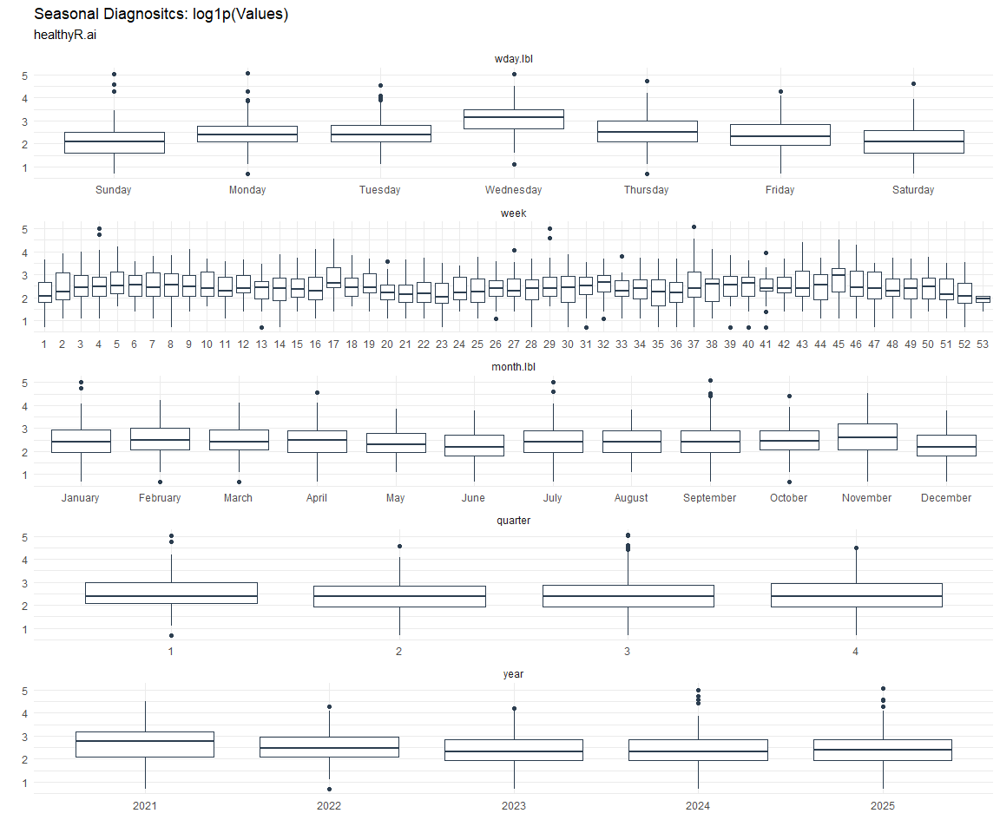

# Time Series Analysis, Modeling and Forecasting of the Healthyverse
Packages
Steven P. Sanderson II, MPH - Date:
2025-11-18

# Introduction

This analysis follows a *Nested Modeltime Workflow* from **`modeltime`**
along with using the **`NNS`** package. I use this to monitor the
downloads of all of my packages:

- [`healthyR`](https://www.spsanderson.com/healthyR/)
- [`healthyR.data`](https://www.spsanderson.com/healthyR.data/)
- [`healthyR.ts`](https://www.spsanderson.com/healthyR.ts/)
- [`healthyR.ai`](https://www.spsanderson.com/healthyR.ai/)
- [`healthyverse`](https://www.spsanderson.com/healthyverse/)
- [`TidyDensity`](https://www.spsanderson.com/TidyDensity/)
- [`tidyAML`](https://www.spsanderson.com/tidyAML/)
- [`RandomWalker`](https://www.spsanderson.com/RandomWalker/)

## Get Data

``` r
glimpse(downloads_tbl)
```

    Rows: 160,480
    Columns: 11
    $ date      <date> 2020-11-23, 2020-11-23, 2020-11-23, 2020-11-23, 2020-11-23,…
    $ time      <Period> 15H 36M 55S, 11H 26M 39S, 23H 34M 44S, 18H 39M 32S, 9H 0M…
    $ date_time <dttm> 2020-11-23 15:36:55, 2020-11-23 11:26:39, 2020-11-23 23:34:…
    $ size      <int> 4858294, 4858294, 4858301, 4858295, 361, 4863722, 4864794, 4…
    $ r_version <chr> NA, "4.0.3", "3.5.3", "3.5.2", NA, NA, NA, NA, NA, NA, NA, N…
    $ r_arch    <chr> NA, "x86_64", "x86_64", "x86_64", NA, NA, NA, NA, NA, NA, NA…
    $ r_os      <chr> NA, "mingw32", "mingw32", "linux-gnu", NA, NA, NA, NA, NA, N…
    $ package   <chr> "healthyR.data", "healthyR.data", "healthyR.data", "healthyR…
    $ version   <chr> "1.0.0", "1.0.0", "1.0.0", "1.0.0", "1.0.0", "1.0.0", "1.0.0…
    $ country   <chr> "US", "US", "US", "GB", "US", "US", "DE", "HK", "JP", "US", …
    $ ip_id     <int> 2069, 2804, 78827, 27595, 90474, 90474, 42435, 74, 7655, 638…

The last day in the data set is 2025-11-16 22:55:55, the file was
birthed on: 2025-10-31 10:47:59.603742, and at report knit time is
392.13 hours old. Happy analyzing!

Now that we have our data lets take a look at it using the `skimr`
package.

``` r
skim(downloads_tbl)
```

|                                                  |               |
|:-------------------------------------------------|:--------------|
| Name                                             | downloads_tbl |
| Number of rows                                   | 160480        |
| Number of columns                                | 11            |
| \_\_\_\_\_\_\_\_\_\_\_\_\_\_\_\_\_\_\_\_\_\_\_   |               |
| Column type frequency:                           |               |
| character                                        | 6             |
| Date                                             | 1             |
| numeric                                          | 2             |
| POSIXct                                          | 1             |
| Timespan                                         | 1             |
| \_\_\_\_\_\_\_\_\_\_\_\_\_\_\_\_\_\_\_\_\_\_\_\_ |               |
| Group variables                                  | None          |

Data summary

**Variable type: character**

| skim_variable | n_missing | complete_rate | min | max | empty | n_unique | whitespace |
|:--------------|----------:|--------------:|----:|----:|------:|---------:|-----------:|
| r_version     |    117721 |          0.27 |   5 |   7 |     0 |       50 |          0 |
| r_arch        |    117721 |          0.27 |   1 |   7 |     0 |        6 |          0 |
| r_os          |    117721 |          0.27 |   7 |  19 |     0 |       24 |          0 |
| package       |         0 |          1.00 |   7 |  13 |     0 |        8 |          0 |
| version       |         0 |          1.00 |   5 |  17 |     0 |       62 |          0 |
| country       |     15006 |          0.91 |   2 |   2 |     0 |      165 |          0 |

**Variable type: Date**

| skim_variable | n_missing | complete_rate | min | max | median | n_unique |
|:---|---:|---:|:---|:---|:---|---:|
| date | 0 | 1 | 2020-11-23 | 2025-11-16 | 2023-10-25 | 1813 |

**Variable type: numeric**

| skim_variable | n_missing | complete_rate | mean | sd | p0 | p25 | p50 | p75 | p100 | hist |
|:---|---:|---:|---:|---:|---:|---:|---:|---:|---:|:---|
| size | 0 | 1 | 1124811.93 | 1490614.97 | 355 | 27068 | 310003.5 | 2355085 | 5677952 | ▇▁▂▁▁ |
| ip_id | 0 | 1 | 11322.28 | 21976.69 | 1 | 232 | 2909.0 | 11961 | 299146 | ▇▁▁▁▁ |

**Variable type: POSIXct**

| skim_variable | n_missing | complete_rate | min | max | median | n_unique |
|:---|---:|---:|:---|:---|:---|---:|
| date_time | 0 | 1 | 2020-11-23 09:00:41 | 2025-11-16 22:55:55 | 2023-10-25 20:13:54 | 100976 |

**Variable type: Timespan**

| skim_variable | n_missing | complete_rate | min | max | median | n_unique |
|:--------------|----------:|--------------:|----:|----:|-------:|---------:|
| time          |         0 |             1 |   0 |  59 |     28 |       60 |

We can see that the following columns are missing a lot of data and for
us are most likely not useful anyways, so we will drop them
`c(r_version, r_arch, r_os)`

## Plots

Now lets take a look at a time-series plot of the total daily downloads
by package. We will use a log scale and place a vertical line at each
version release for each package.


    [[1]]


    [[2]]


    [[3]]


    [[4]]


    [[5]]


    [[6]]


    [[7]]


    [[8]]


Now lets take a look at some time series decomposition graphs.

    [[1]]


    [[2]]


    [[3]]


    [[4]]


    [[5]]


    [[6]]


    [[7]]


    [[8]]


    [[1]]


    [[2]]


    [[3]]


    [[4]]


    [[5]]


    [[6]]


    [[7]]


    [[8]]


Seasonal Diagnostics:

    [[1]]


    [[2]]


    [[3]]


    [[4]]




    [[5]]


    [[6]]


    [[7]]


    [[8]]


ACF and PACF Diagnostics:

    [[1]]


    [[2]]


    [[3]]


    [[4]]


    [[5]]


    [[6]]


    [[7]]


    [[8]]


## Feature Engineering

Now that we have our basic data and a shot of what it looks like, let’s
add some features to our data which can be very helpful in modeling.
Lets start by making a `tibble` that is aggregated by the day and
package, as we are going to be interested in forecasting the next 4
weeks or 28 days for each package. First lets get our base data.


    Call:
    stats::lm(formula = .formula, data = df)

    Residuals:
        Min      1Q  Median      3Q     Max 
    -146.30  -36.53  -11.33   27.27  819.38 

    Coefficients:
                                                         Estimate Std. Error
    (Intercept)                                        -1.967e+02  6.158e+01
    date                                                1.194e-02  3.266e-03
    lag(value, 1)                                       1.100e-01  2.335e-02
    lag(value, 7)                                       8.771e-02  2.409e-02
    lag(value, 14)                                      7.907e-02  2.407e-02
    lag(value, 21)                                      7.855e-02  2.417e-02
    lag(value, 28)                                      6.397e-02  2.408e-02
    lag(value, 35)                                      5.731e-02  2.413e-02
    lag(value, 42)                                      6.109e-02  2.426e-02
    lag(value, 49)                                      6.298e-02  2.422e-02
    month(date, label = TRUE).L                        -9.698e+00  5.081e+00
    month(date, label = TRUE).Q                         1.272e+00  5.013e+00
    month(date, label = TRUE).C                        -1.557e+01  5.027e+00
    month(date, label = TRUE)^4                        -6.535e+00  5.006e+00
    month(date, label = TRUE)^5                        -7.423e+00  4.968e+00
    month(date, label = TRUE)^6                         4.078e-01  4.986e+00
    month(date, label = TRUE)^7                        -5.166e+00  4.887e+00
    month(date, label = TRUE)^8                        -4.478e+00  4.846e+00
    month(date, label = TRUE)^9                         2.511e+00  4.843e+00
    month(date, label = TRUE)^10                        8.390e-01  4.857e+00
    month(date, label = TRUE)^11                       -4.111e+00  4.843e+00
    fourier_vec(date, type = "sin", K = 1, period = 7) -1.162e+01  2.234e+00
    fourier_vec(date, type = "cos", K = 1, period = 7)  7.415e+00  2.315e+00
                                                       t value Pr(>|t|)    
    (Intercept)                                         -3.195 0.001423 ** 
    date                                                 3.658 0.000262 ***
    lag(value, 1)                                        4.712 2.65e-06 ***
    lag(value, 7)                                        3.641 0.000280 ***
    lag(value, 14)                                       3.285 0.001039 ** 
    lag(value, 21)                                       3.250 0.001175 ** 
    lag(value, 28)                                       2.657 0.007961 ** 
    lag(value, 35)                                       2.375 0.017645 *  
    lag(value, 42)                                       2.518 0.011907 *  
    lag(value, 49)                                       2.600 0.009408 ** 
    month(date, label = TRUE).L                         -1.909 0.056456 .  
    month(date, label = TRUE).Q                          0.254 0.799694    
    month(date, label = TRUE).C                         -3.098 0.001982 ** 
    month(date, label = TRUE)^4                         -1.305 0.191927    
    month(date, label = TRUE)^5                         -1.494 0.135300    
    month(date, label = TRUE)^6                          0.082 0.934822    
    month(date, label = TRUE)^7                         -1.057 0.290590    
    month(date, label = TRUE)^8                         -0.924 0.355512    
    month(date, label = TRUE)^9                          0.519 0.604167    
    month(date, label = TRUE)^10                         0.173 0.862862    
    month(date, label = TRUE)^11                        -0.849 0.396091    
    fourier_vec(date, type = "sin", K = 1, period = 7)  -5.203 2.20e-07 ***
    fourier_vec(date, type = "cos", K = 1, period = 7)   3.203 0.001387 ** 
    ---
    Signif. codes:  0 '***' 0.001 '**' 0.01 '*' 0.05 '.' 0.1 ' ' 1

    Residual standard error: 59.4 on 1741 degrees of freedom
      (49 observations deleted due to missingness)
    Multiple R-squared:  0.2324,    Adjusted R-squared:  0.2227 
    F-statistic: 23.95 on 22 and 1741 DF,  p-value: < 2.2e-16


## NNS Forecasting

This is something I have been wanting to try for a while. The `NNS`
package is a great package for forecasting time series data.

[NNS GitHub](https://github.com/OVVO-Financial/NNS)

``` r
library(NNS)

data_list <- base_data |>
    select(package, value) |>
    group_split(package)

data_list |>
    imap(
        \(x, idx) {
            obj <- x
            x <- obj |> pull(value) |> tail(7*52)
            train_set_size <- length(x) - 56
            pkg <- obj |> pluck(1) |> unique()
#            sf <- NNS.seas(x, modulo = 7, plot = FALSE)$periods
            seas <- t(
                sapply(
                    1:25, 
                    function(i) c(
                        i,
                        sqrt(
                            mean((
                                NNS.ARMA(x, 
                                         h = 28, 
                                         training.set = train_set_size, 
                                         method = "lin", 
                                         seasonal.factor = i, 
                                         plot=FALSE
                                         ) - tail(x, 28)) ^ 2)))
                    )
                )
            colnames(seas) <- c("Period", "RMSE")
            sf <- seas[which.min(seas[, 2]), 1]
            
            cat(paste0("Package: ", pkg, "\n"))
            NNS.ARMA.optim(
                variable = x,
                h = 28,
                training.set = train_set_size,
                #seasonal.factor = seq(12, 60, 7),
                seasonal.factor = sf,
                pred.int = 0.95,
                plot = TRUE
            )
            title(
                sub = paste0("\n",
                             "Package: ", pkg, " - NNS Optimization")
            )
        }
    )
```

    Package: healthyR
    [1] "CURRNET METHOD: lin"
    [1] "COPY LATEST PARAMETERS DIRECTLY FOR NNS.ARMA() IF ERROR:"
    [1] "NNS.ARMA(... method =  'lin' , seasonal.factor =  c( 2 ) ...)"
    [1] "CURRENT lin OBJECTIVE FUNCTION = 24.5503270145997"
    [1] "BEST method = 'lin' PATH MEMBER = c( 2 )"
    [1] "BEST lin OBJECTIVE FUNCTION = 24.5503270145997"
    [1] "CURRNET METHOD: nonlin"
    [1] "COPY LATEST PARAMETERS DIRECTLY FOR NNS.ARMA() IF ERROR:"
    [1] "NNS.ARMA(... method =  'nonlin' , seasonal.factor =  c( 2 ) ...)"
    [1] "CURRENT nonlin OBJECTIVE FUNCTION = 5.94848531372717"
    [1] "BEST method = 'nonlin' PATH MEMBER = c( 2 )"
    [1] "BEST nonlin OBJECTIVE FUNCTION = 5.94848531372717"
    [1] "CURRNET METHOD: both"
    [1] "COPY LATEST PARAMETERS DIRECTLY FOR NNS.ARMA() IF ERROR:"
    [1] "NNS.ARMA(... method =  'both' , seasonal.factor =  c( 2 ) ...)"
    [1] "CURRENT both OBJECTIVE FUNCTION = 4.08888015981703"
    [1] "BEST method = 'both' PATH MEMBER = c( 2 )"
    [1] "BEST both OBJECTIVE FUNCTION = 4.08888015981703"


    Package: healthyR.ai
    [1] "CURRNET METHOD: lin"
    [1] "COPY LATEST PARAMETERS DIRECTLY FOR NNS.ARMA() IF ERROR:"
    [1] "NNS.ARMA(... method =  'lin' , seasonal.factor =  c( 6 ) ...)"
    [1] "CURRENT lin OBJECTIVE FUNCTION = 11.1197337594195"
    [1] "BEST method = 'lin' PATH MEMBER = c( 6 )"
    [1] "BEST lin OBJECTIVE FUNCTION = 11.1197337594195"
    [1] "CURRNET METHOD: nonlin"
    [1] "COPY LATEST PARAMETERS DIRECTLY FOR NNS.ARMA() IF ERROR:"
    [1] "NNS.ARMA(... method =  'nonlin' , seasonal.factor =  c( 6 ) ...)"
    [1] "CURRENT nonlin OBJECTIVE FUNCTION = 21.7456108518658"
    [1] "BEST method = 'nonlin' PATH MEMBER = c( 6 )"
    [1] "BEST nonlin OBJECTIVE FUNCTION = 21.7456108518658"
    [1] "CURRNET METHOD: both"
    [1] "COPY LATEST PARAMETERS DIRECTLY FOR NNS.ARMA() IF ERROR:"
    [1] "NNS.ARMA(... method =  'both' , seasonal.factor =  c( 6 ) ...)"
    [1] "CURRENT both OBJECTIVE FUNCTION = 12.3168550792576"
    [1] "BEST method = 'both' PATH MEMBER = c( 6 )"
    [1] "BEST both OBJECTIVE FUNCTION = 12.3168550792576"


    Package: healthyR.data
    [1] "CURRNET METHOD: lin"
    [1] "COPY LATEST PARAMETERS DIRECTLY FOR NNS.ARMA() IF ERROR:"
    [1] "NNS.ARMA(... method =  'lin' , seasonal.factor =  c( 1 ) ...)"
    [1] "CURRENT lin OBJECTIVE FUNCTION = 4005.04802409287"
    [1] "BEST method = 'lin' PATH MEMBER = c( 1 )"
    [1] "BEST lin OBJECTIVE FUNCTION = 4005.04802409287"
    [1] "CURRNET METHOD: nonlin"
    [1] "COPY LATEST PARAMETERS DIRECTLY FOR NNS.ARMA() IF ERROR:"
    [1] "NNS.ARMA(... method =  'nonlin' , seasonal.factor =  c( 1 ) ...)"
    [1] "CURRENT nonlin OBJECTIVE FUNCTION = 58.1367518809896"
    [1] "BEST method = 'nonlin' PATH MEMBER = c( 1 )"
    [1] "BEST nonlin OBJECTIVE FUNCTION = 58.1367518809896"
    [1] "CURRNET METHOD: both"
    [1] "COPY LATEST PARAMETERS DIRECTLY FOR NNS.ARMA() IF ERROR:"
    [1] "NNS.ARMA(... method =  'both' , seasonal.factor =  c( 1 ) ...)"
    [1] "CURRENT both OBJECTIVE FUNCTION = 93.0187059902894"
    [1] "BEST method = 'both' PATH MEMBER = c( 1 )"
    [1] "BEST both OBJECTIVE FUNCTION = 93.0187059902894"


    Package: healthyR.ts
    [1] "CURRNET METHOD: lin"
    [1] "COPY LATEST PARAMETERS DIRECTLY FOR NNS.ARMA() IF ERROR:"
    [1] "NNS.ARMA(... method =  'lin' , seasonal.factor =  c( 11 ) ...)"
    [1] "CURRENT lin OBJECTIVE FUNCTION = 16.1842264665745"
    [1] "BEST method = 'lin' PATH MEMBER = c( 11 )"
    [1] "BEST lin OBJECTIVE FUNCTION = 16.1842264665745"
    [1] "CURRNET METHOD: nonlin"
    [1] "COPY LATEST PARAMETERS DIRECTLY FOR NNS.ARMA() IF ERROR:"
    [1] "NNS.ARMA(... method =  'nonlin' , seasonal.factor =  c( 11 ) ...)"
    [1] "CURRENT nonlin OBJECTIVE FUNCTION = 11.2302420018725"
    [1] "BEST method = 'nonlin' PATH MEMBER = c( 11 )"
    [1] "BEST nonlin OBJECTIVE FUNCTION = 11.2302420018725"
    [1] "CURRNET METHOD: both"
    [1] "COPY LATEST PARAMETERS DIRECTLY FOR NNS.ARMA() IF ERROR:"
    [1] "NNS.ARMA(... method =  'both' , seasonal.factor =  c( 11 ) ...)"
    [1] "CURRENT both OBJECTIVE FUNCTION = 11.8426936198456"
    [1] "BEST method = 'both' PATH MEMBER = c( 11 )"
    [1] "BEST both OBJECTIVE FUNCTION = 11.8426936198456"


    Package: healthyverse
    [1] "CURRNET METHOD: lin"
    [1] "COPY LATEST PARAMETERS DIRECTLY FOR NNS.ARMA() IF ERROR:"
    [1] "NNS.ARMA(... method =  'lin' , seasonal.factor =  c( 3 ) ...)"
    [1] "CURRENT lin OBJECTIVE FUNCTION = 40.0089625094538"
    [1] "BEST method = 'lin' PATH MEMBER = c( 3 )"
    [1] "BEST lin OBJECTIVE FUNCTION = 40.0089625094538"
    [1] "CURRNET METHOD: nonlin"
    [1] "COPY LATEST PARAMETERS DIRECTLY FOR NNS.ARMA() IF ERROR:"
    [1] "NNS.ARMA(... method =  'nonlin' , seasonal.factor =  c( 3 ) ...)"
    [1] "CURRENT nonlin OBJECTIVE FUNCTION = 10.8438383397211"
    [1] "BEST method = 'nonlin' PATH MEMBER = c( 3 )"
    [1] "BEST nonlin OBJECTIVE FUNCTION = 10.8438383397211"
    [1] "CURRNET METHOD: both"
    [1] "COPY LATEST PARAMETERS DIRECTLY FOR NNS.ARMA() IF ERROR:"
    [1] "NNS.ARMA(... method =  'both' , seasonal.factor =  c( 3 ) ...)"
    [1] "CURRENT both OBJECTIVE FUNCTION = 19.3471440333635"
    [1] "BEST method = 'both' PATH MEMBER = c( 3 )"
    [1] "BEST both OBJECTIVE FUNCTION = 19.3471440333635"


    Package: RandomWalker
    [1] "CURRNET METHOD: lin"
    [1] "COPY LATEST PARAMETERS DIRECTLY FOR NNS.ARMA() IF ERROR:"
    [1] "NNS.ARMA(... method =  'lin' , seasonal.factor =  c( 11 ) ...)"
    [1] "CURRENT lin OBJECTIVE FUNCTION = 8.53320540657884"
    [1] "BEST method = 'lin' PATH MEMBER = c( 11 )"
    [1] "BEST lin OBJECTIVE FUNCTION = 8.53320540657884"
    [1] "CURRNET METHOD: nonlin"
    [1] "COPY LATEST PARAMETERS DIRECTLY FOR NNS.ARMA() IF ERROR:"
    [1] "NNS.ARMA(... method =  'nonlin' , seasonal.factor =  c( 11 ) ...)"
    [1] "CURRENT nonlin OBJECTIVE FUNCTION = 8.81679087974412"
    [1] "BEST method = 'nonlin' PATH MEMBER = c( 11 )"
    [1] "BEST nonlin OBJECTIVE FUNCTION = 8.81679087974412"
    [1] "CURRNET METHOD: both"
    [1] "COPY LATEST PARAMETERS DIRECTLY FOR NNS.ARMA() IF ERROR:"
    [1] "NNS.ARMA(... method =  'both' , seasonal.factor =  c( 11 ) ...)"
    [1] "CURRENT both OBJECTIVE FUNCTION = 9.21350441294512"
    [1] "BEST method = 'both' PATH MEMBER = c( 11 )"
    [1] "BEST both OBJECTIVE FUNCTION = 9.21350441294512"


    Package: tidyAML
    [1] "CURRNET METHOD: lin"
    [1] "COPY LATEST PARAMETERS DIRECTLY FOR NNS.ARMA() IF ERROR:"
    [1] "NNS.ARMA(... method =  'lin' , seasonal.factor =  c( 10 ) ...)"
    [1] "CURRENT lin OBJECTIVE FUNCTION = 49.4079985423846"
    [1] "BEST method = 'lin' PATH MEMBER = c( 10 )"
    [1] "BEST lin OBJECTIVE FUNCTION = 49.4079985423846"
    [1] "CURRNET METHOD: nonlin"
    [1] "COPY LATEST PARAMETERS DIRECTLY FOR NNS.ARMA() IF ERROR:"
    [1] "NNS.ARMA(... method =  'nonlin' , seasonal.factor =  c( 10 ) ...)"
    [1] "CURRENT nonlin OBJECTIVE FUNCTION = 8.69495106706482"
    [1] "BEST method = 'nonlin' PATH MEMBER = c( 10 )"
    [1] "BEST nonlin OBJECTIVE FUNCTION = 8.69495106706482"
    [1] "CURRNET METHOD: both"
    [1] "COPY LATEST PARAMETERS DIRECTLY FOR NNS.ARMA() IF ERROR:"
    [1] "NNS.ARMA(... method =  'both' , seasonal.factor =  c( 10 ) ...)"
    [1] "CURRENT both OBJECTIVE FUNCTION = 13.3959224980477"
    [1] "BEST method = 'both' PATH MEMBER = c( 10 )"
    [1] "BEST both OBJECTIVE FUNCTION = 13.3959224980477"


    Package: TidyDensity
    [1] "CURRNET METHOD: lin"
    [1] "COPY LATEST PARAMETERS DIRECTLY FOR NNS.ARMA() IF ERROR:"
    [1] "NNS.ARMA(... method =  'lin' , seasonal.factor =  c( 1 ) ...)"
    [1] "CURRENT lin OBJECTIVE FUNCTION = 451.90080523894"
    [1] "BEST method = 'lin' PATH MEMBER = c( 1 )"
    [1] "BEST lin OBJECTIVE FUNCTION = 451.90080523894"
    [1] "CURRNET METHOD: nonlin"
    [1] "COPY LATEST PARAMETERS DIRECTLY FOR NNS.ARMA() IF ERROR:"
    [1] "NNS.ARMA(... method =  'nonlin' , seasonal.factor =  c( 1 ) ...)"
    [1] "CURRENT nonlin OBJECTIVE FUNCTION = 188.975912515602"
    [1] "BEST method = 'nonlin' PATH MEMBER = c( 1 )"
    [1] "BEST nonlin OBJECTIVE FUNCTION = 188.975912515602"
    [1] "CURRNET METHOD: both"
    [1] "COPY LATEST PARAMETERS DIRECTLY FOR NNS.ARMA() IF ERROR:"
    [1] "NNS.ARMA(... method =  'both' , seasonal.factor =  c( 1 ) ...)"
    [1] "CURRENT both OBJECTIVE FUNCTION = 3098.83545344304"
    [1] "BEST method = 'both' PATH MEMBER = c( 1 )"
    [1] "BEST both OBJECTIVE FUNCTION = 3098.83545344304"


    [[1]]
    NULL

    [[2]]
    NULL

    [[3]]
    NULL

    [[4]]
    NULL

    [[5]]
    NULL

    [[6]]
    NULL

    [[7]]
    NULL

    [[8]]
    NULL

## Pre-Processing

Now we are going to do some basic pre-processing.

``` r
data_padded_tbl <- base_data %>%
  pad_by_time(
    .date_var  = date,
    .pad_value = 0
  )

# Get log interval and standardization parameters
log_params  <- liv(data_padded_tbl$value, limit_lower = 0, offset = 1, silent = TRUE)
limit_lower <- log_params$limit_lower
limit_upper <- log_params$limit_upper
offset      <- log_params$offset

data_liv_tbl <- data_padded_tbl %>%
  # Get log interval transform
  mutate(value_trans = liv(value, limit_lower = 0, offset = 1, silent = TRUE)$log_scaled)

# Get Standardization Params
std_params <- standard_vec(data_liv_tbl$value_trans, silent = TRUE)
std_mean   <- std_params$mean
std_sd     <- std_params$sd

data_transformed_tbl <- data_liv_tbl %>%
  group_by(package) %>%
  # get standardization
  mutate(value_trans = standard_vec(value_trans, silent = TRUE)$standard_scaled) %>%
  tk_augment_fourier(
    .date_var = date,
    .periods  = c(7, 14, 30, 90, 180),
    .K        = 2
  ) %>%
  tk_augment_timeseries_signature(
    .date_var = date
  ) %>%
  ungroup() %>%
  select(-c(value, -year.iso))
```

Since this is panel data we can follow one of two different modeling
strategies. We can search for a global model in the panel data or we can
use nested forecasting finding the best model for each of the time
series. Since we only have 5 panels, we will use nested forecasting.

To do this we will use the `nest_timeseries` and
`split_nested_timeseries` functions to create a nested `tibble`.

``` r
horizon <- 4*7

nested_data_tbl <- data_transformed_tbl %>%

    # 0. Filter out column where package is NA
    filter(!is.na(package)) %>%
    
    # 1. Extending: We'll predict n days into the future.
    extend_timeseries(
        .id_var        = package,
        .date_var      = date,
        .length_future = horizon
    ) %>%
    
    # 2. Nesting: We'll group by id, and create a future dataset
    #    that forecasts n days of extended data and
    #    an actual dataset that contains n*2 days
    nest_timeseries(
        .id_var        = package,
        .length_future = horizon
        #.length_actual = horizon*2
    ) %>%
    
   # 3. Splitting: We'll take the actual data and create splits
   #    for accuracy and confidence interval estimation of n das (test)
   #    and the rest is training data
    split_nested_timeseries(
        .length_test = horizon
    )

nested_data_tbl
```

    # A tibble: 8 × 4
      package       .actual_data          .future_data       .splits          
      <fct>         <list>                <list>             <list>           
    1 healthyR.data <tibble [1,805 × 50]> <tibble [28 × 50]> <split [1777|28]>
    2 healthyR      <tibble [1,796 × 50]> <tibble [28 × 50]> <split [1768|28]>
    3 healthyR.ts   <tibble [1,741 × 50]> <tibble [28 × 50]> <split [1713|28]>
    4 healthyverse  <tibble [1,712 × 50]> <tibble [28 × 50]> <split [1684|28]>
    5 healthyR.ai   <tibble [1,538 × 50]> <tibble [28 × 50]> <split [1510|28]>
    6 TidyDensity   <tibble [1,389 × 50]> <tibble [28 × 50]> <split [1361|28]>
    7 tidyAML       <tibble [996 × 50]>   <tibble [28 × 50]> <split [968|28]> 
    8 RandomWalker  <tibble [419 × 50]>   <tibble [28 × 50]> <split [391|28]> 

Now it is time to make some recipes and models using the modeltime
workflow.

## Modeltime Workflow

### Recipe Object

``` r
recipe_base <- recipe(
  value_trans ~ .
  , data = extract_nested_test_split(nested_data_tbl)
  )

recipe_base

recipe_date <- recipe(
  value_trans ~ date
  , data = extract_nested_test_split(nested_data_tbl)
  )
```

### Models

``` r
# Models ------------------------------------------------------------------

# Auto ARIMA --------------------------------------------------------------

model_spec_arima_no_boost <- arima_reg() %>%
  set_engine(engine = "auto_arima")

wflw_auto_arima <- workflow() %>%
  add_recipe(recipe = recipe_date) %>%
  add_model(model_spec_arima_no_boost)

# NNETAR ------------------------------------------------------------------

model_spec_nnetar <- nnetar_reg(
  mode              = "regression"
  , seasonal_period = "auto"
) %>%
  set_engine("nnetar")

wflw_nnetar <- workflow() %>%
  add_recipe(recipe = recipe_base) %>%
  add_model(model_spec_nnetar)

# TSLM --------------------------------------------------------------------

model_spec_lm <- linear_reg() %>%
  set_engine("lm")

wflw_lm <- workflow() %>%
  add_recipe(recipe = recipe_base) %>%
  add_model(model_spec_lm)

# MARS --------------------------------------------------------------------

model_spec_mars <- mars(mode = "regression") %>%
  set_engine("earth")

wflw_mars <- workflow() %>%
  add_recipe(recipe = recipe_date) %>%
  add_model(model_spec_mars)
```

### Nested Modeltime Tables

``` r
nested_modeltime_tbl <- modeltime_nested_fit(
  # Nested Data
  nested_data = nested_data_tbl,
   control = control_nested_fit(
     verbose = TRUE,
     allow_par = FALSE
   ),
  # Add workflows
  wflw_auto_arima,
  wflw_lm,
  wflw_mars,
  wflw_nnetar
)
```

``` r
nested_modeltime_tbl <- nested_modeltime_tbl[!is.na(nested_modeltime_tbl$package),]
```

### Model Accuracy

``` r
nested_modeltime_tbl %>%
  extract_nested_test_accuracy() %>%
  filter(!is.na(package)) %>%
  knitr::kable()
```

| package | .model_id | .model_desc | .type | mae | mape | mase | smape | rmse | rsq |
|:---|---:|:---|:---|---:|---:|---:|---:|---:|---:|
| healthyR.data | 1 | ARIMA | Test | 0.7400228 | 102.42786 | 0.6733646 | 157.3948 | 0.9260255 | 0.0130623 |
| healthyR.data | 2 | LM | Test | 0.7727020 | 167.13829 | 0.7031002 | 141.7991 | 0.8884855 | 0.0214570 |
| healthyR.data | 3 | NULL | NA | NA | NA | NA | NA | NA | NA |
| healthyR.data | 4 | NNAR | Test | 0.7576226 | 172.92611 | 0.6893790 | 140.7982 | 0.8715051 | 0.0425579 |
| healthyR | 1 | ARIMA | Test | 0.7563129 | 98.97235 | 0.7097769 | 169.4766 | 1.0452182 | 0.0210004 |
| healthyR | 2 | LM | Test | 0.7707479 | 325.02628 | 0.7233237 | 134.0835 | 0.9576152 | 0.0635316 |
| healthyR | 3 | NULL | NA | NA | NA | NA | NA | NA | NA |
| healthyR | 4 | NNAR | Test | 0.8037703 | 272.53012 | 0.7543142 | 144.3603 | 1.0395933 | 0.0106582 |
| healthyR.ts | 1 | ARIMA | Test | 0.7471923 | 128.69634 | 0.5963129 | 169.8255 | 1.0055301 | 0.0786147 |
| healthyR.ts | 2 | LM | Test | 0.9442009 | 320.34982 | 0.7535399 | 173.2325 | 1.1527960 | 0.0056499 |
| healthyR.ts | 3 | NULL | NA | NA | NA | NA | NA | NA | NA |
| healthyR.ts | 4 | NNAR | Test | 1.0355353 | 400.69995 | 0.8264313 | 177.3967 | 1.1985170 | 0.0000018 |
| healthyverse | 1 | ARIMA | Test | 0.6089734 | 98.36423 | 0.9199325 | 151.0053 | 0.8151104 | 0.0552078 |
| healthyverse | 2 | LM | Test | 0.7907630 | 208.14951 | 1.1945489 | 154.7648 | 0.9068457 | 0.0006347 |
| healthyverse | 3 | NULL | NA | NA | NA | NA | NA | NA | NA |
| healthyverse | 4 | NNAR | Test | 0.7154466 | 182.34017 | 1.0807739 | 149.8178 | 0.8718422 | 0.0044694 |
| healthyR.ai | 1 | ARIMA | Test | 0.5299675 | 97.81825 | 0.9151596 | 171.3467 | 0.7112883 | 0.0000791 |
| healthyR.ai | 2 | LM | Test | 0.6969791 | 245.44295 | 1.2035588 | 158.5876 | 0.8246686 | 0.0005755 |
| healthyR.ai | 3 | NULL | NA | NA | NA | NA | NA | NA | NA |
| healthyR.ai | 4 | NNAR | Test | 0.6935073 | 231.29568 | 1.1975638 | 161.5629 | 0.8121564 | 0.0032324 |
| TidyDensity | 1 | ARIMA | Test | 0.9964193 | 361.65017 | 0.6204758 | 131.7880 | 1.1311367 | 0.1759385 |
| TidyDensity | 2 | LM | Test | 0.8651880 | 152.88931 | 0.5387573 | 142.9170 | 1.0598939 | 0.0328869 |
| TidyDensity | 3 | NULL | NA | NA | NA | NA | NA | NA | NA |
| TidyDensity | 4 | NNAR | Test | 0.9826604 | 241.85556 | 0.6119080 | 159.7135 | 1.1310213 | 0.0027630 |
| tidyAML | 1 | ARIMA | Test | 0.7616485 | 119.42348 | 0.7888763 | 171.9552 | 0.9869828 | 0.0437373 |
| tidyAML | 2 | LM | Test | 0.7263727 | 138.39054 | 0.7523394 | 138.0749 | 0.9406152 | 0.0219465 |
| tidyAML | 3 | NULL | NA | NA | NA | NA | NA | NA | NA |
| tidyAML | 4 | NNAR | Test | 0.7207722 | 127.01745 | 0.7465387 | 143.2167 | 0.9523813 | 0.0110177 |
| RandomWalker | 1 | ARIMA | Test | 0.7596362 | 112.38798 | 0.5819961 | 150.6124 | 0.8548368 | 0.1231905 |
| RandomWalker | 2 | LM | Test | 0.8726259 | 167.39891 | 0.6685633 | 150.0383 | 0.9337721 | 0.0083092 |
| RandomWalker | 3 | NULL | NA | NA | NA | NA | NA | NA | NA |
| RandomWalker | 4 | NNAR | Test | 0.8664068 | 175.14130 | 0.6637985 | 143.2396 | 0.9469156 | 0.0335312 |

### Plot Models

``` r
nested_modeltime_tbl %>%
  extract_nested_test_forecast() %>%
  group_by(package) %>%
  filter_by_time(.date_var = .index, .start_date = max(.index) - 60) %>%
  ungroup() %>%
  plot_modeltime_forecast(
    .interactive = FALSE,
    .conf_interval_show  = FALSE,
    .facet_scales = "free"
  ) +
  theme_minimal() +
  facet_wrap(~ package, nrow = 3) +
  theme(legend.position = "bottom")
```


### Best Model

``` r
best_nested_modeltime_tbl <- nested_modeltime_tbl %>%
  modeltime_nested_select_best(
    metric = "rmse",
    minimize = TRUE,
    filter_test_forecasts = TRUE
  )

best_nested_modeltime_tbl %>%
  extract_nested_best_model_report()
```

    # Nested Modeltime Table
      

    # A tibble: 8 × 10
      package      .model_id .model_desc .type   mae  mape  mase smape  rmse     rsq
      <fct>            <int> <chr>       <chr> <dbl> <dbl> <dbl> <dbl> <dbl>   <dbl>
    1 healthyR.da…         4 NNAR        Test  0.758 173.  0.689  141. 0.872 4.26e-2
    2 healthyR             2 LM          Test  0.771 325.  0.723  134. 0.958 6.35e-2
    3 healthyR.ts          1 ARIMA       Test  0.747 129.  0.596  170. 1.01  7.86e-2
    4 healthyverse         1 ARIMA       Test  0.609  98.4 0.920  151. 0.815 5.52e-2
    5 healthyR.ai          1 ARIMA       Test  0.530  97.8 0.915  171. 0.711 7.91e-5
    6 TidyDensity          2 LM          Test  0.865 153.  0.539  143. 1.06  3.29e-2
    7 tidyAML              2 LM          Test  0.726 138.  0.752  138. 0.941 2.19e-2
    8 RandomWalker         1 ARIMA       Test  0.760 112.  0.582  151. 0.855 1.23e-1

``` r
best_nested_modeltime_tbl %>%
  extract_nested_test_forecast() %>%
  #filter(!is.na(.model_id)) %>%
  group_by(package) %>%
  filter_by_time(.date_var = .index, .start_date = max(.index) - 60) %>%
  ungroup() %>%
  plot_modeltime_forecast(
    .interactive = FALSE,
    .conf_interval_alpha = 0.2,
    .facet_scales = "free"
  ) +
  facet_wrap(~ package, nrow = 3) +
  theme_minimal() +
  theme(legend.position = "bottom")
```


## Refitting and Future Forecast

Now that we have the best models, we can make our future forecasts.

``` r
nested_modeltime_refit_tbl <- best_nested_modeltime_tbl %>%
    modeltime_nested_refit(
        control = control_nested_refit(verbose = TRUE)
    )
```

``` r
nested_modeltime_refit_tbl
```

    # Nested Modeltime Table
      

    # A tibble: 8 × 5
      package       .actual_data .future_data .splits           .modeltime_tables 
      <fct>         <list>       <list>       <list>            <list>            
    1 healthyR.data <tibble>     <tibble>     <split [1777|28]> <mdl_tm_t [1 × 5]>
    2 healthyR      <tibble>     <tibble>     <split [1768|28]> <mdl_tm_t [1 × 5]>
    3 healthyR.ts   <tibble>     <tibble>     <split [1713|28]> <mdl_tm_t [1 × 5]>
    4 healthyverse  <tibble>     <tibble>     <split [1684|28]> <mdl_tm_t [1 × 5]>
    5 healthyR.ai   <tibble>     <tibble>     <split [1510|28]> <mdl_tm_t [1 × 5]>
    6 TidyDensity   <tibble>     <tibble>     <split [1361|28]> <mdl_tm_t [1 × 5]>
    7 tidyAML       <tibble>     <tibble>     <split [968|28]>  <mdl_tm_t [1 × 5]>
    8 RandomWalker  <tibble>     <tibble>     <split [391|28]>  <mdl_tm_t [1 × 5]>

``` r
nested_modeltime_refit_tbl %>%
  extract_nested_future_forecast() %>%
  group_by(package) %>%
  mutate(across(.value:.conf_hi, .fns = ~ standard_inv_vec(
    x    = .,
    mean = std_mean,
    sd   = std_sd
  )$standard_inverse_value)) %>%
  mutate(across(.value:.conf_hi, .fns = ~ liiv(
    x = .,
    limit_lower = limit_lower,
    limit_upper = limit_upper,
    offset      = offset
  )$rescaled_v)) %>%
  filter_by_time(.date_var = .index, .start_date = max(.index) - 60) %>%
  ungroup() %>%
  plot_modeltime_forecast(
    .interactive = FALSE,
    .conf_interval_alpha = 0.2,
    .facet_scales = "free"
  ) +
  facet_wrap(~ package, nrow = 3) +
  theme_minimal() +
  theme(legend.position = "bottom")
```


