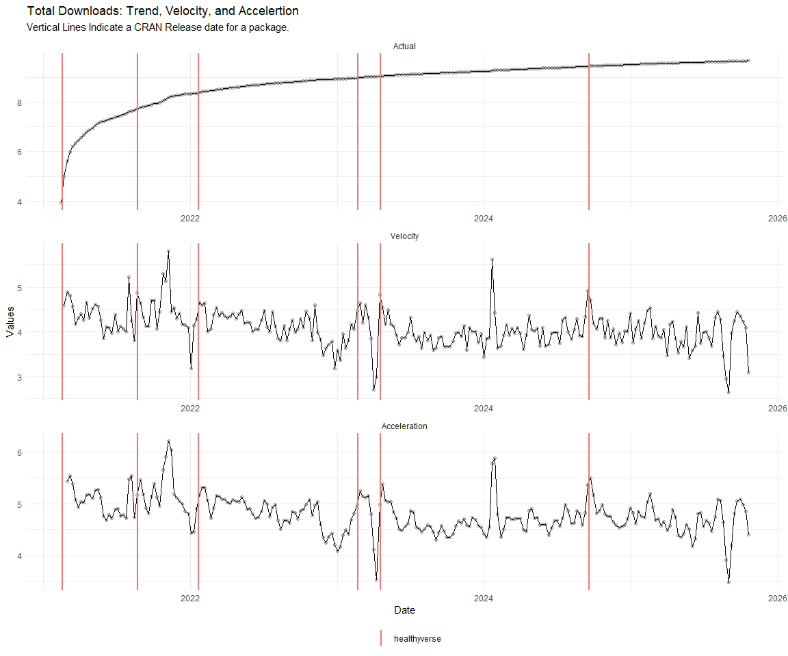
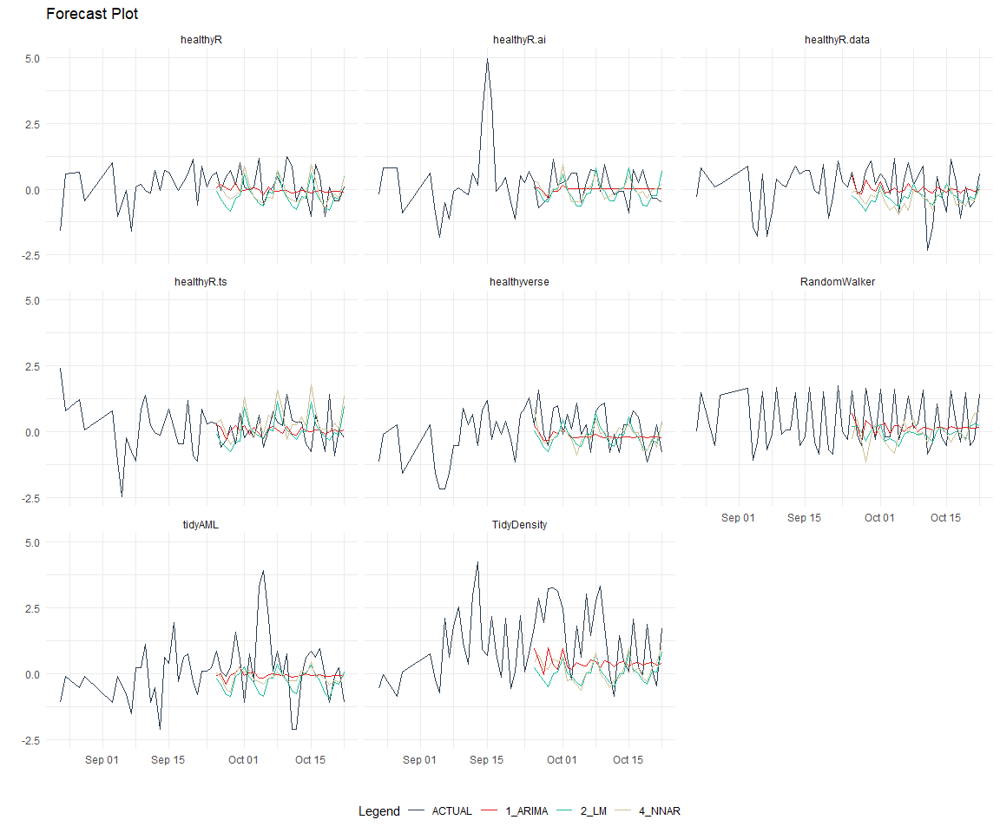

# Time Series Analysis, Modeling and Forecasting of the Healthyverse
Packages
Steven P. Sanderson II, MPH - Date:
2026-01-12

# Introduction

This analysis follows a *Nested Modeltime Workflow* from **`modeltime`**
along with using the **`NNS`** package. I use this to monitor the
downloads of all of my packages:

- [`healthyR`](https://www.spsanderson.com/healthyR/)
- [`healthyR.data`](https://www.spsanderson.com/healthyR.data/)
- [`healthyR.ts`](https://www.spsanderson.com/healthyR.ts/)
- [`healthyR.ai`](https://www.spsanderson.com/healthyR.ai/)
- [`healthyverse`](https://www.spsanderson.com/healthyverse/)
- [`TidyDensity`](https://www.spsanderson.com/TidyDensity/)
- [`tidyAML`](https://www.spsanderson.com/tidyAML/)
- [`RandomWalker`](https://www.spsanderson.com/RandomWalker/)

## Get Data

``` r
glimpse(downloads_tbl)
```

    Rows: 165,322
    Columns: 11
    $ date      <date> 2020-11-23, 2020-11-23, 2020-11-23, 2020-11-23, 2020-11-23,…
    $ time      <Period> 15H 36M 55S, 11H 26M 39S, 23H 34M 44S, 18H 39M 32S, 9H 0M…
    $ date_time <dttm> 2020-11-23 15:36:55, 2020-11-23 11:26:39, 2020-11-23 23:34:…
    $ size      <int> 4858294, 4858294, 4858301, 4858295, 361, 4863722, 4864794, 4…
    $ r_version <chr> NA, "4.0.3", "3.5.3", "3.5.2", NA, NA, NA, NA, NA, NA, NA, N…
    $ r_arch    <chr> NA, "x86_64", "x86_64", "x86_64", NA, NA, NA, NA, NA, NA, NA…
    $ r_os      <chr> NA, "mingw32", "mingw32", "linux-gnu", NA, NA, NA, NA, NA, N…
    $ package   <chr> "healthyR.data", "healthyR.data", "healthyR.data", "healthyR…
    $ version   <chr> "1.0.0", "1.0.0", "1.0.0", "1.0.0", "1.0.0", "1.0.0", "1.0.0…
    $ country   <chr> "US", "US", "US", "GB", "US", "US", "DE", "HK", "JP", "US", …
    $ ip_id     <int> 2069, 2804, 78827, 27595, 90474, 90474, 42435, 74, 7655, 638…

The last day in the data set is 2026-01-10 22:52:27, the file was
birthed on: 2022-07-02 23:58:17.511888, and at report knit time is
3.09069^{4} hours old. Happy analyzing!

Now that we have our data lets take a look at it using the `skimr`
package.

``` r
skim(downloads_tbl)
```

|                                                  |               |
|:-------------------------------------------------|:--------------|
| Name                                             | downloads_tbl |
| Number of rows                                   | 165322        |
| Number of columns                                | 11            |
| \_\_\_\_\_\_\_\_\_\_\_\_\_\_\_\_\_\_\_\_\_\_\_   |               |
| Column type frequency:                           |               |
| character                                        | 6             |
| Date                                             | 1             |
| numeric                                          | 2             |
| POSIXct                                          | 1             |
| Timespan                                         | 1             |
| \_\_\_\_\_\_\_\_\_\_\_\_\_\_\_\_\_\_\_\_\_\_\_\_ |               |
| Group variables                                  | None          |

Data summary

**Variable type: character**

| skim_variable | n_missing | complete_rate | min | max | empty | n_unique | whitespace |
|:--------------|----------:|--------------:|----:|----:|------:|---------:|-----------:|
| r_version     |    121642 |          0.26 |   5 |   7 |     0 |       50 |          0 |
| r_arch        |    121642 |          0.26 |   1 |   7 |     0 |        6 |          0 |
| r_os          |    121642 |          0.26 |   7 |  19 |     0 |       24 |          0 |
| package       |         0 |          1.00 |   7 |  13 |     0 |        8 |          0 |
| version       |         0 |          1.00 |   5 |  17 |     0 |       62 |          0 |
| country       |     15401 |          0.91 |   2 |   2 |     0 |      166 |          0 |

**Variable type: Date**

| skim_variable | n_missing | complete_rate | min | max | median | n_unique |
|:---|---:|---:|:---|:---|:---|---:|
| date | 0 | 1 | 2020-11-23 | 2026-01-10 | 2023-11-19 | 1868 |

**Variable type: numeric**

| skim_variable | n_missing | complete_rate | mean | sd | p0 | p25 | p50 | p75 | p100 | hist |
|:---|---:|---:|---:|---:|---:|---:|---:|---:|---:|:---|
| size | 0 | 1 | 1123978.74 | 1485731.09 | 355 | 32533.25 | 310796 | 2348371.8 | 5677952 | ▇▁▂▁▁ |
| ip_id | 0 | 1 | 11231.48 | 21856.15 | 1 | 230.25 | 2822 | 11786.5 | 299146 | ▇▁▁▁▁ |

**Variable type: POSIXct**

| skim_variable | n_missing | complete_rate | min | max | median | n_unique |
|:---|---:|---:|:---|:---|:---|---:|
| date_time | 0 | 1 | 2020-11-23 09:00:41 | 2026-01-10 22:52:27 | 2023-11-19 05:48:08 | 104528 |

**Variable type: Timespan**

| skim_variable | n_missing | complete_rate | min | max | median | n_unique |
|:--------------|----------:|--------------:|----:|----:|-------:|---------:|
| time          |         0 |             1 |   0 |  59 |     32 |       60 |

We can see that the following columns are missing a lot of data and for
us are most likely not useful anyways, so we will drop them
`c(r_version, r_arch, r_os)`

## Plots

Now lets take a look at a time-series plot of the total daily downloads
by package. We will use a log scale and place a vertical line at each
version release for each package.


    [[1]]


    [[2]]


    [[3]]


    [[4]]


    [[5]]


    [[6]]


    [[7]]




    [[8]]


Now lets take a look at some time series decomposition graphs.

    [[1]]


    [[2]]


    [[3]]


    [[4]]


    [[5]]


    [[6]]


    [[7]]


    [[8]]


    [[1]]


    [[2]]


    [[3]]


    [[4]]


    [[5]]


    [[6]]


    [[7]]


    [[8]]


Seasonal Diagnostics:

    [[1]]


    [[2]]


    [[3]]


    [[4]]


    [[5]]


    [[6]]


    [[7]]


    [[8]]


ACF and PACF Diagnostics:

    [[1]]


    [[2]]


    [[3]]


    [[4]]


    [[5]]


    [[6]]


    [[7]]


    [[8]]


## Feature Engineering

Now that we have our basic data and a shot of what it looks like, let’s
add some features to our data which can be very helpful in modeling.
Lets start by making a `tibble` that is aggregated by the day and
package, as we are going to be interested in forecasting the next 4
weeks or 28 days for each package. First lets get our base data.


    Call:
    stats::lm(formula = .formula, data = df)

    Residuals:
        Min      1Q  Median      3Q     Max 
    -148.57  -36.70  -11.37   27.12  821.92 

    Coefficients:
                                                         Estimate Std. Error
    (Intercept)                                        -1.658e+02  5.839e+01
    date                                                1.029e-02  3.093e-03
    lag(value, 1)                                       1.074e-01  2.296e-02
    lag(value, 7)                                       8.780e-02  2.371e-02
    lag(value, 14)                                      7.984e-02  2.366e-02
    lag(value, 21)                                      8.520e-02  2.375e-02
    lag(value, 28)                                      6.659e-02  2.365e-02
    lag(value, 35)                                      5.361e-02  2.366e-02
    lag(value, 42)                                      6.522e-02  2.376e-02
    lag(value, 49)                                      6.560e-02  2.368e-02
    month(date, label = TRUE).L                        -9.436e+00  4.896e+00
    month(date, label = TRUE).Q                        -5.317e-01  4.793e+00
    month(date, label = TRUE).C                        -1.498e+01  4.831e+00
    month(date, label = TRUE)^4                        -6.812e+00  4.866e+00
    month(date, label = TRUE)^5                        -6.104e+00  4.849e+00
    month(date, label = TRUE)^6                         9.117e-01  4.884e+00
    month(date, label = TRUE)^7                        -4.268e+00  4.830e+00
    month(date, label = TRUE)^8                        -4.148e+00  4.807e+00
    month(date, label = TRUE)^9                         2.850e+00  4.821e+00
    month(date, label = TRUE)^10                        8.610e-01  4.837e+00
    month(date, label = TRUE)^11                       -4.091e+00  4.824e+00
    fourier_vec(date, type = "sin", K = 1, period = 7) -1.100e+01  2.183e+00
    fourier_vec(date, type = "cos", K = 1, period = 7)  6.988e+00  2.258e+00
                                                       t value Pr(>|t|)    
    (Intercept)                                         -2.839 0.004573 ** 
    date                                                 3.328 0.000893 ***
    lag(value, 1)                                        4.678 3.12e-06 ***
    lag(value, 7)                                        3.703 0.000219 ***
    lag(value, 14)                                       3.374 0.000756 ***
    lag(value, 21)                                       3.587 0.000343 ***
    lag(value, 28)                                       2.816 0.004917 ** 
    lag(value, 35)                                       2.266 0.023548 *  
    lag(value, 42)                                       2.745 0.006114 ** 
    lag(value, 49)                                       2.770 0.005655 ** 
    month(date, label = TRUE).L                         -1.927 0.054094 .  
    month(date, label = TRUE).Q                         -0.111 0.911681    
    month(date, label = TRUE).C                         -3.100 0.001963 ** 
    month(date, label = TRUE)^4                         -1.400 0.161724    
    month(date, label = TRUE)^5                         -1.259 0.208283    
    month(date, label = TRUE)^6                          0.187 0.851952    
    month(date, label = TRUE)^7                         -0.884 0.376967    
    month(date, label = TRUE)^8                         -0.863 0.388354    
    month(date, label = TRUE)^9                          0.591 0.554424    
    month(date, label = TRUE)^10                         0.178 0.858750    
    month(date, label = TRUE)^11                        -0.848 0.396454    
    fourier_vec(date, type = "sin", K = 1, period = 7)  -5.038 5.18e-07 ***
    fourier_vec(date, type = "cos", K = 1, period = 7)   3.095 0.001998 ** 
    ---
    Signif. codes:  0 '***' 0.001 '**' 0.01 '*' 0.05 '.' 0.1 ' ' 1

    Residual standard error: 59.17 on 1796 degrees of freedom
      (49 observations deleted due to missingness)
    Multiple R-squared:  0.2265,    Adjusted R-squared:  0.217 
    F-statistic: 23.91 on 22 and 1796 DF,  p-value: < 2.2e-16


## NNS Forecasting

This is something I have been wanting to try for a while. The `NNS`
package is a great package for forecasting time series data.

[NNS GitHub](https://github.com/OVVO-Financial/NNS)

``` r
library(NNS)

data_list <- base_data |>
    select(package, value) |>
    group_split(package)

data_list |>
    imap(
        \(x, idx) {
            obj <- x
            x <- obj |> pull(value) |> tail(7*52)
            train_set_size <- length(x) - 56
            pkg <- obj |> pluck(1) |> unique()
#            sf <- NNS.seas(x, modulo = 7, plot = FALSE)$periods
            seas <- t(
                sapply(
                    1:25, 
                    function(i) c(
                        i,
                        sqrt(
                            mean((
                                NNS.ARMA(x, 
                                         h = 28, 
                                         training.set = train_set_size, 
                                         method = "lin", 
                                         seasonal.factor = i, 
                                         plot=FALSE
                                         ) - tail(x, 28)) ^ 2)))
                    )
                )
            colnames(seas) <- c("Period", "RMSE")
            sf <- seas[which.min(seas[, 2]), 1]
            
            cat(paste0("Package: ", pkg, "\n"))
            NNS.ARMA.optim(
                variable = x,
                h = 28,
                training.set = train_set_size,
                #seasonal.factor = seq(12, 60, 7),
                seasonal.factor = sf,
                pred.int = 0.95,
                plot = TRUE
            )
            title(
                sub = paste0("\n",
                             "Package: ", pkg, " - NNS Optimization")
            )
        }
    )
```

    Package: healthyR
    [1] "CURRNET METHOD: lin"
    [1] "COPY LATEST PARAMETERS DIRECTLY FOR NNS.ARMA() IF ERROR:"
    [1] "NNS.ARMA(... method =  'lin' , seasonal.factor =  c( 1 ) ...)"
    [1] "CURRENT lin OBJECTIVE FUNCTION = 156.861796802077"
    [1] "BEST method = 'lin' PATH MEMBER = c( 1 )"
    [1] "BEST lin OBJECTIVE FUNCTION = 156.861796802077"
    [1] "CURRNET METHOD: nonlin"
    [1] "COPY LATEST PARAMETERS DIRECTLY FOR NNS.ARMA() IF ERROR:"
    [1] "NNS.ARMA(... method =  'nonlin' , seasonal.factor =  c( 1 ) ...)"
    [1] "CURRENT nonlin OBJECTIVE FUNCTION = 227.878574274371"
    [1] "BEST method = 'nonlin' PATH MEMBER = c( 1 )"
    [1] "BEST nonlin OBJECTIVE FUNCTION = 227.878574274371"
    [1] "CURRNET METHOD: both"
    [1] "COPY LATEST PARAMETERS DIRECTLY FOR NNS.ARMA() IF ERROR:"
    [1] "NNS.ARMA(... method =  'both' , seasonal.factor =  c( 1 ) ...)"
    [1] "CURRENT both OBJECTIVE FUNCTION = 809.382431990218"
    [1] "BEST method = 'both' PATH MEMBER = c( 1 )"
    [1] "BEST both OBJECTIVE FUNCTION = 809.382431990218"


    Package: healthyR.ai
    [1] "CURRNET METHOD: lin"
    [1] "COPY LATEST PARAMETERS DIRECTLY FOR NNS.ARMA() IF ERROR:"
    [1] "NNS.ARMA(... method =  'lin' , seasonal.factor =  c( 4 ) ...)"
    [1] "CURRENT lin OBJECTIVE FUNCTION = 15.1020778961844"
    [1] "BEST method = 'lin' PATH MEMBER = c( 4 )"
    [1] "BEST lin OBJECTIVE FUNCTION = 15.1020778961844"
    [1] "CURRNET METHOD: nonlin"
    [1] "COPY LATEST PARAMETERS DIRECTLY FOR NNS.ARMA() IF ERROR:"
    [1] "NNS.ARMA(... method =  'nonlin' , seasonal.factor =  c( 4 ) ...)"
    [1] "CURRENT nonlin OBJECTIVE FUNCTION = 13.1342200131226"
    [1] "BEST method = 'nonlin' PATH MEMBER = c( 4 )"
    [1] "BEST nonlin OBJECTIVE FUNCTION = 13.1342200131226"
    [1] "CURRNET METHOD: both"
    [1] "COPY LATEST PARAMETERS DIRECTLY FOR NNS.ARMA() IF ERROR:"
    [1] "NNS.ARMA(... method =  'both' , seasonal.factor =  c( 4 ) ...)"
    [1] "CURRENT both OBJECTIVE FUNCTION = 15.7544798324362"
    [1] "BEST method = 'both' PATH MEMBER = c( 4 )"
    [1] "BEST both OBJECTIVE FUNCTION = 15.7544798324362"


    Package: healthyR.data
    [1] "CURRNET METHOD: lin"
    [1] "COPY LATEST PARAMETERS DIRECTLY FOR NNS.ARMA() IF ERROR:"
    [1] "NNS.ARMA(... method =  'lin' , seasonal.factor =  c( 23 ) ...)"
    [1] "CURRENT lin OBJECTIVE FUNCTION = 4.31281245996094"
    [1] "BEST method = 'lin' PATH MEMBER = c( 23 )"
    [1] "BEST lin OBJECTIVE FUNCTION = 4.31281245996094"
    [1] "CURRNET METHOD: nonlin"
    [1] "COPY LATEST PARAMETERS DIRECTLY FOR NNS.ARMA() IF ERROR:"
    [1] "NNS.ARMA(... method =  'nonlin' , seasonal.factor =  c( 23 ) ...)"
    [1] "CURRENT nonlin OBJECTIVE FUNCTION = 4.96145909534654"
    [1] "BEST method = 'nonlin' PATH MEMBER = c( 23 )"
    [1] "BEST nonlin OBJECTIVE FUNCTION = 4.96145909534654"
    [1] "CURRNET METHOD: both"
    [1] "COPY LATEST PARAMETERS DIRECTLY FOR NNS.ARMA() IF ERROR:"
    [1] "NNS.ARMA(... method =  'both' , seasonal.factor =  c( 23 ) ...)"
    [1] "CURRENT both OBJECTIVE FUNCTION = 4.18859766828325"
    [1] "BEST method = 'both' PATH MEMBER = c( 23 )"
    [1] "BEST both OBJECTIVE FUNCTION = 4.18859766828325"


    Package: healthyR.ts
    [1] "CURRNET METHOD: lin"
    [1] "COPY LATEST PARAMETERS DIRECTLY FOR NNS.ARMA() IF ERROR:"
    [1] "NNS.ARMA(... method =  'lin' , seasonal.factor =  c( 4 ) ...)"
    [1] "CURRENT lin OBJECTIVE FUNCTION = 11.1373750485164"
    [1] "BEST method = 'lin' PATH MEMBER = c( 4 )"
    [1] "BEST lin OBJECTIVE FUNCTION = 11.1373750485164"
    [1] "CURRNET METHOD: nonlin"
    [1] "COPY LATEST PARAMETERS DIRECTLY FOR NNS.ARMA() IF ERROR:"
    [1] "NNS.ARMA(... method =  'nonlin' , seasonal.factor =  c( 4 ) ...)"
    [1] "CURRENT nonlin OBJECTIVE FUNCTION = 5.0059641322294"
    [1] "BEST method = 'nonlin' PATH MEMBER = c( 4 )"
    [1] "BEST nonlin OBJECTIVE FUNCTION = 5.0059641322294"
    [1] "CURRNET METHOD: both"
    [1] "COPY LATEST PARAMETERS DIRECTLY FOR NNS.ARMA() IF ERROR:"
    [1] "NNS.ARMA(... method =  'both' , seasonal.factor =  c( 4 ) ...)"
    [1] "CURRENT both OBJECTIVE FUNCTION = 5.27393010908385"
    [1] "BEST method = 'both' PATH MEMBER = c( 4 )"
    [1] "BEST both OBJECTIVE FUNCTION = 5.27393010908385"


    Package: healthyverse
    [1] "CURRNET METHOD: lin"
    [1] "COPY LATEST PARAMETERS DIRECTLY FOR NNS.ARMA() IF ERROR:"
    [1] "NNS.ARMA(... method =  'lin' , seasonal.factor =  c( 20 ) ...)"
    [1] "CURRENT lin OBJECTIVE FUNCTION = 7.31015332554902"
    [1] "BEST method = 'lin' PATH MEMBER = c( 20 )"
    [1] "BEST lin OBJECTIVE FUNCTION = 7.31015332554902"
    [1] "CURRNET METHOD: nonlin"
    [1] "COPY LATEST PARAMETERS DIRECTLY FOR NNS.ARMA() IF ERROR:"
    [1] "NNS.ARMA(... method =  'nonlin' , seasonal.factor =  c( 20 ) ...)"
    [1] "CURRENT nonlin OBJECTIVE FUNCTION = 6.07352229821681"
    [1] "BEST method = 'nonlin' PATH MEMBER = c( 20 )"
    [1] "BEST nonlin OBJECTIVE FUNCTION = 6.07352229821681"
    [1] "CURRNET METHOD: both"
    [1] "COPY LATEST PARAMETERS DIRECTLY FOR NNS.ARMA() IF ERROR:"
    [1] "NNS.ARMA(... method =  'both' , seasonal.factor =  c( 20 ) ...)"
    [1] "CURRENT both OBJECTIVE FUNCTION = 6.8983998520031"
    [1] "BEST method = 'both' PATH MEMBER = c( 20 )"
    [1] "BEST both OBJECTIVE FUNCTION = 6.8983998520031"


    Package: RandomWalker
    [1] "CURRNET METHOD: lin"
    [1] "COPY LATEST PARAMETERS DIRECTLY FOR NNS.ARMA() IF ERROR:"
    [1] "NNS.ARMA(... method =  'lin' , seasonal.factor =  c( 24 ) ...)"
    [1] "CURRENT lin OBJECTIVE FUNCTION = 2.92299623727527"
    [1] "BEST method = 'lin' PATH MEMBER = c( 24 )"
    [1] "BEST lin OBJECTIVE FUNCTION = 2.92299623727527"
    [1] "CURRNET METHOD: nonlin"
    [1] "COPY LATEST PARAMETERS DIRECTLY FOR NNS.ARMA() IF ERROR:"
    [1] "NNS.ARMA(... method =  'nonlin' , seasonal.factor =  c( 24 ) ...)"
    [1] "CURRENT nonlin OBJECTIVE FUNCTION = 2.47975515555728"
    [1] "BEST method = 'nonlin' PATH MEMBER = c( 24 )"
    [1] "BEST nonlin OBJECTIVE FUNCTION = 2.47975515555728"
    [1] "CURRNET METHOD: both"
    [1] "COPY LATEST PARAMETERS DIRECTLY FOR NNS.ARMA() IF ERROR:"
    [1] "NNS.ARMA(... method =  'both' , seasonal.factor =  c( 24 ) ...)"
    [1] "CURRENT both OBJECTIVE FUNCTION = 2.40784399793535"
    [1] "BEST method = 'both' PATH MEMBER = c( 24 )"
    [1] "BEST both OBJECTIVE FUNCTION = 2.40784399793535"


    Package: tidyAML
    [1] "CURRNET METHOD: lin"
    [1] "COPY LATEST PARAMETERS DIRECTLY FOR NNS.ARMA() IF ERROR:"
    [1] "NNS.ARMA(... method =  'lin' , seasonal.factor =  c( 4 ) ...)"
    [1] "CURRENT lin OBJECTIVE FUNCTION = 24.829932241138"
    [1] "BEST method = 'lin' PATH MEMBER = c( 4 )"
    [1] "BEST lin OBJECTIVE FUNCTION = 24.829932241138"
    [1] "CURRNET METHOD: nonlin"
    [1] "COPY LATEST PARAMETERS DIRECTLY FOR NNS.ARMA() IF ERROR:"
    [1] "NNS.ARMA(... method =  'nonlin' , seasonal.factor =  c( 4 ) ...)"
    [1] "CURRENT nonlin OBJECTIVE FUNCTION = 14.5823609704111"
    [1] "BEST method = 'nonlin' PATH MEMBER = c( 4 )"
    [1] "BEST nonlin OBJECTIVE FUNCTION = 14.5823609704111"
    [1] "CURRNET METHOD: both"
    [1] "COPY LATEST PARAMETERS DIRECTLY FOR NNS.ARMA() IF ERROR:"
    [1] "NNS.ARMA(... method =  'both' , seasonal.factor =  c( 4 ) ...)"
    [1] "CURRENT both OBJECTIVE FUNCTION = 38.8690663861308"
    [1] "BEST method = 'both' PATH MEMBER = c( 4 )"
    [1] "BEST both OBJECTIVE FUNCTION = 38.8690663861308"


    Package: TidyDensity
    [1] "CURRNET METHOD: lin"
    [1] "COPY LATEST PARAMETERS DIRECTLY FOR NNS.ARMA() IF ERROR:"
    [1] "NNS.ARMA(... method =  'lin' , seasonal.factor =  c( 6 ) ...)"
    [1] "CURRENT lin OBJECTIVE FUNCTION = 5.55533002520121"
    [1] "BEST method = 'lin' PATH MEMBER = c( 6 )"
    [1] "BEST lin OBJECTIVE FUNCTION = 5.55533002520121"
    [1] "CURRNET METHOD: nonlin"
    [1] "COPY LATEST PARAMETERS DIRECTLY FOR NNS.ARMA() IF ERROR:"
    [1] "NNS.ARMA(... method =  'nonlin' , seasonal.factor =  c( 6 ) ...)"
    [1] "CURRENT nonlin OBJECTIVE FUNCTION = 2.4419380398001"
    [1] "BEST method = 'nonlin' PATH MEMBER = c( 6 )"
    [1] "BEST nonlin OBJECTIVE FUNCTION = 2.4419380398001"
    [1] "CURRNET METHOD: both"
    [1] "COPY LATEST PARAMETERS DIRECTLY FOR NNS.ARMA() IF ERROR:"
    [1] "NNS.ARMA(... method =  'both' , seasonal.factor =  c( 6 ) ...)"
    [1] "CURRENT both OBJECTIVE FUNCTION = 3.30236282345207"
    [1] "BEST method = 'both' PATH MEMBER = c( 6 )"
    [1] "BEST both OBJECTIVE FUNCTION = 3.30236282345207"


    [[1]]
    NULL

    [[2]]
    NULL

    [[3]]
    NULL

    [[4]]
    NULL

    [[5]]
    NULL

    [[6]]
    NULL

    [[7]]
    NULL

    [[8]]
    NULL

## Pre-Processing

Now we are going to do some basic pre-processing.

``` r
data_padded_tbl <- base_data %>%
  pad_by_time(
    .date_var  = date,
    .pad_value = 0
  )

# Get log interval and standardization parameters
log_params  <- liv(data_padded_tbl$value, limit_lower = 0, offset = 1, silent = TRUE)
limit_lower <- log_params$limit_lower
limit_upper <- log_params$limit_upper
offset      <- log_params$offset

data_liv_tbl <- data_padded_tbl %>%
  # Get log interval transform
  mutate(value_trans = liv(value, limit_lower = 0, offset = 1, silent = TRUE)$log_scaled)

# Get Standardization Params
std_params <- standard_vec(data_liv_tbl$value_trans, silent = TRUE)
std_mean   <- std_params$mean
std_sd     <- std_params$sd

data_transformed_tbl <- data_liv_tbl %>%
  group_by(package) %>%
  # get standardization
  mutate(value_trans = standard_vec(value_trans, silent = TRUE)$standard_scaled) %>%
  tk_augment_fourier(
    .date_var = date,
    .periods  = c(7, 14, 30, 90, 180),
    .K        = 2
  ) %>%
  tk_augment_timeseries_signature(
    .date_var = date
  ) %>%
  ungroup() %>%
  select(-c(value, -year.iso))
```

Since this is panel data we can follow one of two different modeling
strategies. We can search for a global model in the panel data or we can
use nested forecasting finding the best model for each of the time
series. Since we only have 5 panels, we will use nested forecasting.

To do this we will use the `nest_timeseries` and
`split_nested_timeseries` functions to create a nested `tibble`.

``` r
horizon <- 4*7

nested_data_tbl <- data_transformed_tbl %>%

    # 0. Filter out column where package is NA
    filter(!is.na(package)) %>%
    
    # 1. Extending: We'll predict n days into the future.
    extend_timeseries(
        .id_var        = package,
        .date_var      = date,
        .length_future = horizon
    ) %>%
    
    # 2. Nesting: We'll group by id, and create a future dataset
    #    that forecasts n days of extended data and
    #    an actual dataset that contains n*2 days
    nest_timeseries(
        .id_var        = package,
        .length_future = horizon
        #.length_actual = horizon*2
    ) %>%
    
   # 3. Splitting: We'll take the actual data and create splits
   #    for accuracy and confidence interval estimation of n das (test)
   #    and the rest is training data
    split_nested_timeseries(
        .length_test = horizon
    )

nested_data_tbl
```

    # A tibble: 8 × 4
      package       .actual_data          .future_data       .splits          
      <fct>         <list>                <list>             <list>           
    1 healthyR.data <tibble [1,859 × 50]> <tibble [28 × 50]> <split [1831|28]>
    2 healthyR      <tibble [1,851 × 50]> <tibble [28 × 50]> <split [1823|28]>
    3 healthyR.ts   <tibble [1,791 × 50]> <tibble [28 × 50]> <split [1763|28]>
    4 healthyverse  <tibble [1,755 × 50]> <tibble [28 × 50]> <split [1727|28]>
    5 healthyR.ai   <tibble [1,593 × 50]> <tibble [28 × 50]> <split [1565|28]>
    6 TidyDensity   <tibble [1,444 × 50]> <tibble [28 × 50]> <split [1416|28]>
    7 tidyAML       <tibble [1,051 × 50]> <tibble [28 × 50]> <split [1023|28]>
    8 RandomWalker  <tibble [474 × 50]>   <tibble [28 × 50]> <split [446|28]> 

Now it is time to make some recipes and models using the modeltime
workflow.

## Modeltime Workflow

### Recipe Object

``` r
recipe_base <- recipe(
  value_trans ~ .
  , data = extract_nested_test_split(nested_data_tbl)
  )

recipe_base

recipe_date <- recipe(
  value_trans ~ date
  , data = extract_nested_test_split(nested_data_tbl)
  )
```

### Models

``` r
# Models ------------------------------------------------------------------

# Auto ARIMA --------------------------------------------------------------

model_spec_arima_no_boost <- arima_reg() %>%
  set_engine(engine = "auto_arima")

wflw_auto_arima <- workflow() %>%
  add_recipe(recipe = recipe_date) %>%
  add_model(model_spec_arima_no_boost)

# NNETAR ------------------------------------------------------------------

model_spec_nnetar <- nnetar_reg(
  mode              = "regression"
  , seasonal_period = "auto"
) %>%
  set_engine("nnetar")

wflw_nnetar <- workflow() %>%
  add_recipe(recipe = recipe_base) %>%
  add_model(model_spec_nnetar)

# TSLM --------------------------------------------------------------------

model_spec_lm <- linear_reg() %>%
  set_engine("lm")

wflw_lm <- workflow() %>%
  add_recipe(recipe = recipe_base) %>%
  add_model(model_spec_lm)

# MARS --------------------------------------------------------------------

model_spec_mars <- mars(mode = "regression") %>%
  set_engine("earth")

wflw_mars <- workflow() %>%
  add_recipe(recipe = recipe_date) %>%
  add_model(model_spec_mars)
```

### Nested Modeltime Tables

``` r
nested_modeltime_tbl <- modeltime_nested_fit(
  # Nested Data
  nested_data = nested_data_tbl,
   control = control_nested_fit(
     verbose = TRUE,
     allow_par = FALSE
   ),
  # Add workflows
  wflw_auto_arima,
  wflw_lm,
  wflw_mars,
  wflw_nnetar
)
```

``` r
nested_modeltime_tbl <- nested_modeltime_tbl[!is.na(nested_modeltime_tbl$package),]
```

### Model Accuracy

``` r
nested_modeltime_tbl %>%
  extract_nested_test_accuracy() %>%
  filter(!is.na(package)) %>%
  knitr::kable()
```

| package | .model_id | .model_desc | .type | mae | mape | mase | smape | rmse | rsq |
|:---|---:|:---|:---|---:|---:|---:|---:|---:|---:|
| healthyR.data | 1 | ARIMA | Test | 0.7602006 | 165.95006 | 0.6353555 | 154.59141 | 0.8671309 | 0.0009351 |
| healthyR.data | 2 | LM | Test | 0.6864851 | 179.90386 | 0.5737460 | 136.76586 | 0.8112934 | 0.1020890 |
| healthyR.data | 3 | EARTH | Test | 0.8960835 | 356.52598 | 0.7489227 | 131.48741 | 1.0253143 | 0.0007487 |
| healthyR.data | 4 | NNAR | Test | 0.7563141 | 228.03460 | 0.6321072 | 134.66673 | 0.8977748 | 0.0099001 |
| healthyR | 1 | ARIMA | Test | 0.5971584 | 189.51885 | 0.7203043 | 132.43646 | 0.7877020 | 0.0000890 |
| healthyR | 2 | LM | Test | 0.6268425 | 449.43918 | 0.7561098 | 109.49303 | 0.8016547 | 0.0149593 |
| healthyR | 3 | EARTH | Test | 0.7027897 | 654.67962 | 0.8477188 | 106.56743 | 0.8146924 | 0.0256138 |
| healthyR | 4 | NNAR | Test | 0.6315751 | 281.99425 | 0.7618183 | 125.19180 | 0.8149703 | 0.0165696 |
| healthyR.ts | 1 | ARIMA | Test | 0.7646069 | 135.40043 | 0.8009174 | 137.13713 | 1.0532270 | 0.0259456 |
| healthyR.ts | 2 | LM | Test | 0.8418898 | 129.94486 | 0.8818704 | 135.44808 | 1.1269527 | 0.0104846 |
| healthyR.ts | 3 | EARTH | Test | 0.6806011 | 138.32935 | 0.7129222 | 98.09312 | 0.9150966 | 0.2053526 |
| healthyR.ts | 4 | NNAR | Test | 0.8700867 | 140.44370 | 0.9114063 | 154.04608 | 1.1512199 | 0.0001312 |
| healthyverse | 1 | ARIMA | Test | 0.8098866 | 103.34122 | 0.8721514 | 126.14187 | 1.0014587 | 0.0549334 |
| healthyverse | 2 | LM | Test | 0.8720590 | 124.73480 | 0.9391036 | 126.82314 | 1.0321772 | 0.0073627 |
| healthyverse | 3 | EARTH | Test | 0.9282419 | 223.21183 | 0.9996059 | 98.06044 | 1.0734546 | 0.2193657 |
| healthyverse | 4 | NNAR | Test | 0.8772157 | 111.08518 | 0.9446568 | 142.70651 | 1.0725671 | 0.0269072 |
| healthyR.ai | 1 | ARIMA | Test | 1.1236319 | 120.45822 | 0.9965283 | 184.65567 | 1.2972791 | 0.0006543 |
| healthyR.ai | 2 | LM | Test | 0.9262246 | 100.81523 | 0.8214514 | 134.50569 | 1.0915482 | 0.0873585 |
| healthyR.ai | 3 | EARTH | Test | 1.3071515 | 263.06605 | 1.1592883 | 97.02721 | 1.6066847 | 0.0120878 |
| healthyR.ai | 4 | NNAR | Test | 0.9733784 | 111.94678 | 0.8632712 | 146.14491 | 1.1049870 | 0.0754958 |
| TidyDensity | 1 | ARIMA | Test | 1.0506327 | 109.89408 | 0.5672984 | 182.40533 | 1.2190805 | 0.0122748 |
| TidyDensity | 2 | LM | Test | 1.0675693 | 278.86442 | 0.5764434 | 154.89011 | 1.1919344 | 0.0534191 |
| TidyDensity | 3 | EARTH | Test | 1.0019475 | 121.40395 | 0.5410104 | 138.10798 | 1.2447210 | 0.0000422 |
| TidyDensity | 4 | NNAR | Test | 1.0768002 | 260.74913 | 0.5814278 | 154.23116 | 1.2133255 | 0.0261486 |
| tidyAML | 1 | ARIMA | Test | 0.9902602 | 97.52629 | 0.9155582 | 160.98845 | 1.1826363 | 0.0047343 |
| tidyAML | 2 | LM | Test | 1.0903112 | 192.22826 | 1.0080616 | 137.73526 | 1.2967444 | 0.0352262 |
| tidyAML | 3 | EARTH | Test | 0.8204840 | 117.99424 | 0.7585893 | 105.06658 | 1.0032822 | 0.0101711 |
| tidyAML | 4 | NNAR | Test | 0.8955714 | 199.00618 | 0.8280124 | 128.33972 | 1.0150664 | 0.0502606 |
| RandomWalker | 1 | ARIMA | Test | 0.9512028 | 150.21533 | 0.6349148 | 175.65438 | 1.0348707 | 0.0110972 |
| RandomWalker | 2 | LM | Test | 1.0521637 | 140.15330 | 0.7023048 | 163.42373 | 1.1834045 | 0.0073539 |
| RandomWalker | 3 | EARTH | Test | 0.9866172 | 143.71822 | 0.6585534 | 164.57636 | 1.0601989 | 0.0360659 |
| RandomWalker | 4 | NNAR | Test | 0.9853461 | 152.80964 | 0.6577050 | 167.83321 | 1.0984785 | 0.0010183 |

### Plot Models

``` r
nested_modeltime_tbl %>%
  extract_nested_test_forecast() %>%
  group_by(package) %>%
  filter_by_time(.date_var = .index, .start_date = max(.index) - 60) %>%
  ungroup() %>%
  plot_modeltime_forecast(
    .interactive = FALSE,
    .conf_interval_show  = FALSE,
    .facet_scales = "free"
  ) +
  theme_minimal() +
  facet_wrap(~ package, nrow = 3) +
  theme(legend.position = "bottom")
```



### Best Model

``` r
best_nested_modeltime_tbl <- nested_modeltime_tbl %>%
  modeltime_nested_select_best(
    metric = "rmse",
    minimize = TRUE,
    filter_test_forecasts = TRUE
  )

best_nested_modeltime_tbl %>%
  extract_nested_best_model_report()
```

    # Nested Modeltime Table
      

    # A tibble: 8 × 10
      package      .model_id .model_desc .type   mae  mape  mase smape  rmse     rsq
      <fct>            <int> <chr>       <chr> <dbl> <dbl> <dbl> <dbl> <dbl>   <dbl>
    1 healthyR.da…         2 LM          Test  0.686  180. 0.574 137.  0.811 1.02e-1
    2 healthyR             1 ARIMA       Test  0.597  190. 0.720 132.  0.788 8.90e-5
    3 healthyR.ts          3 EARTH       Test  0.681  138. 0.713  98.1 0.915 2.05e-1
    4 healthyverse         1 ARIMA       Test  0.810  103. 0.872 126.  1.00  5.49e-2
    5 healthyR.ai          2 LM          Test  0.926  101. 0.821 135.  1.09  8.74e-2
    6 TidyDensity          2 LM          Test  1.07   279. 0.576 155.  1.19  5.34e-2
    7 tidyAML              3 EARTH       Test  0.820  118. 0.759 105.  1.00  1.02e-2
    8 RandomWalker         1 ARIMA       Test  0.951  150. 0.635 176.  1.03  1.11e-2

``` r
best_nested_modeltime_tbl %>%
  extract_nested_test_forecast() %>%
  #filter(!is.na(.model_id)) %>%
  group_by(package) %>%
  filter_by_time(.date_var = .index, .start_date = max(.index) - 60) %>%
  ungroup() %>%
  plot_modeltime_forecast(
    .interactive = FALSE,
    .conf_interval_alpha = 0.2,
    .facet_scales = "free"
  ) +
  facet_wrap(~ package, nrow = 3) +
  theme_minimal() +
  theme(legend.position = "bottom")
```


## Refitting and Future Forecast

Now that we have the best models, we can make our future forecasts.

``` r
nested_modeltime_refit_tbl <- best_nested_modeltime_tbl %>%
    modeltime_nested_refit(
        control = control_nested_refit(verbose = TRUE)
    )
```

``` r
nested_modeltime_refit_tbl
```

    # Nested Modeltime Table
      

    # A tibble: 8 × 5
      package       .actual_data .future_data .splits           .modeltime_tables 
      <fct>         <list>       <list>       <list>            <list>            
    1 healthyR.data <tibble>     <tibble>     <split [1831|28]> <mdl_tm_t [1 × 5]>
    2 healthyR      <tibble>     <tibble>     <split [1823|28]> <mdl_tm_t [1 × 5]>
    3 healthyR.ts   <tibble>     <tibble>     <split [1763|28]> <mdl_tm_t [1 × 5]>
    4 healthyverse  <tibble>     <tibble>     <split [1727|28]> <mdl_tm_t [1 × 5]>
    5 healthyR.ai   <tibble>     <tibble>     <split [1565|28]> <mdl_tm_t [1 × 5]>
    6 TidyDensity   <tibble>     <tibble>     <split [1416|28]> <mdl_tm_t [1 × 5]>
    7 tidyAML       <tibble>     <tibble>     <split [1023|28]> <mdl_tm_t [1 × 5]>
    8 RandomWalker  <tibble>     <tibble>     <split [446|28]>  <mdl_tm_t [1 × 5]>

``` r
nested_modeltime_refit_tbl %>%
  extract_nested_future_forecast() %>%
  group_by(package) %>%
  mutate(across(.value:.conf_hi, .fns = ~ standard_inv_vec(
    x    = .,
    mean = std_mean,
    sd   = std_sd
  )$standard_inverse_value)) %>%
  mutate(across(.value:.conf_hi, .fns = ~ liiv(
    x = .,
    limit_lower = limit_lower,
    limit_upper = limit_upper,
    offset      = offset
  )$rescaled_v)) %>%
  filter_by_time(.date_var = .index, .start_date = max(.index) - 60) %>%
  ungroup() %>%
  plot_modeltime_forecast(
    .interactive = FALSE,
    .conf_interval_alpha = 0.2,
    .facet_scales = "free"
  ) +
  facet_wrap(~ package, nrow = 3) +
  theme_minimal() +
  theme(legend.position = "bottom")
```


