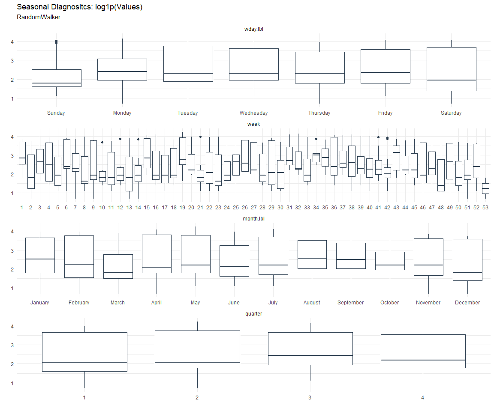

# Time Series Analysis, Modeling and Forecasting of the Healthyverse
Packages
Steven P. Sanderson II, MPH - Date:
2025-12-12

# Introduction

This analysis follows a *Nested Modeltime Workflow* from **`modeltime`**
along with using the **`NNS`** package. I use this to monitor the
downloads of all of my packages:

- [`healthyR`](https://www.spsanderson.com/healthyR/)
- [`healthyR.data`](https://www.spsanderson.com/healthyR.data/)
- [`healthyR.ts`](https://www.spsanderson.com/healthyR.ts/)
- [`healthyR.ai`](https://www.spsanderson.com/healthyR.ai/)
- [`healthyverse`](https://www.spsanderson.com/healthyverse/)
- [`TidyDensity`](https://www.spsanderson.com/TidyDensity/)
- [`tidyAML`](https://www.spsanderson.com/tidyAML/)
- [`RandomWalker`](https://www.spsanderson.com/RandomWalker/)

## Get Data

``` r
glimpse(downloads_tbl)
```

    Rows: 162,689
    Columns: 11
    $ date      <date> 2020-11-23, 2020-11-23, 2020-11-23, 2020-11-23, 2020-11-23,…
    $ time      <Period> 15H 36M 55S, 11H 26M 39S, 23H 34M 44S, 18H 39M 32S, 9H 0M…
    $ date_time <dttm> 2020-11-23 15:36:55, 2020-11-23 11:26:39, 2020-11-23 23:34:…
    $ size      <int> 4858294, 4858294, 4858301, 4858295, 361, 4863722, 4864794, 4…
    $ r_version <chr> NA, "4.0.3", "3.5.3", "3.5.2", NA, NA, NA, NA, NA, NA, NA, N…
    $ r_arch    <chr> NA, "x86_64", "x86_64", "x86_64", NA, NA, NA, NA, NA, NA, NA…
    $ r_os      <chr> NA, "mingw32", "mingw32", "linux-gnu", NA, NA, NA, NA, NA, N…
    $ package   <chr> "healthyR.data", "healthyR.data", "healthyR.data", "healthyR…
    $ version   <chr> "1.0.0", "1.0.0", "1.0.0", "1.0.0", "1.0.0", "1.0.0", "1.0.0…
    $ country   <chr> "US", "US", "US", "GB", "US", "US", "DE", "HK", "JP", "US", …
    $ ip_id     <int> 2069, 2804, 78827, 27595, 90474, 90474, 42435, 74, 7655, 638…

The last day in the data set is 2025-12-10 21:45:18, the file was
birthed on: 2022-07-02 23:58:17.511888, and at report knit time is
3.016178^{4} hours old. Happy analyzing!

Now that we have our data lets take a look at it using the `skimr`
package.

``` r
skim(downloads_tbl)
```

|                                                  |               |
|:-------------------------------------------------|:--------------|
| Name                                             | downloads_tbl |
| Number of rows                                   | 162689        |
| Number of columns                                | 11            |
| \_\_\_\_\_\_\_\_\_\_\_\_\_\_\_\_\_\_\_\_\_\_\_   |               |
| Column type frequency:                           |               |
| character                                        | 6             |
| Date                                             | 1             |
| numeric                                          | 2             |
| POSIXct                                          | 1             |
| Timespan                                         | 1             |
| \_\_\_\_\_\_\_\_\_\_\_\_\_\_\_\_\_\_\_\_\_\_\_\_ |               |
| Group variables                                  | None          |

Data summary

**Variable type: character**

| skim_variable | n_missing | complete_rate | min | max | empty | n_unique | whitespace |
|:--------------|----------:|--------------:|----:|----:|------:|---------:|-----------:|
| r_version     |    119350 |          0.27 |   5 |   7 |     0 |       50 |          0 |
| r_arch        |    119350 |          0.27 |   1 |   7 |     0 |        6 |          0 |
| r_os          |    119350 |          0.27 |   7 |  19 |     0 |       24 |          0 |
| package       |         0 |          1.00 |   7 |  13 |     0 |        8 |          0 |
| version       |         0 |          1.00 |   5 |  17 |     0 |       62 |          0 |
| country       |     15259 |          0.91 |   2 |   2 |     0 |      166 |          0 |

**Variable type: Date**

| skim_variable | n_missing | complete_rate | min | max | median | n_unique |
|:---|---:|---:|:---|:---|:---|---:|
| date | 0 | 1 | 2020-11-23 | 2025-12-10 | 2023-11-06 | 1837 |

**Variable type: numeric**

| skim_variable | n_missing | complete_rate | mean | sd | p0 | p25 | p50 | p75 | p100 | hist |
|:---|---:|---:|---:|---:|---:|---:|---:|---:|---:|:---|
| size | 0 | 1 | 1124236.46 | 1487771.95 | 355 | 27709 | 310297 | 2352686 | 5677952 | ▇▁▂▁▁ |
| ip_id | 0 | 1 | 11326.99 | 21968.41 | 1 | 236 | 2889 | 11961 | 299146 | ▇▁▁▁▁ |

**Variable type: POSIXct**

| skim_variable | n_missing | complete_rate | min | max | median | n_unique |
|:---|---:|---:|:---|:---|:---|---:|
| date_time | 0 | 1 | 2020-11-23 09:00:41 | 2025-12-10 21:45:18 | 2023-11-06 02:23:35 | 102695 |

**Variable type: Timespan**

| skim_variable | n_missing | complete_rate | min | max |     median | n_unique |
|:--------------|----------:|--------------:|----:|----:|-----------:|---------:|
| time          |         0 |             1 |   0 |  59 | 12H 6M 41S |       60 |

We can see that the following columns are missing a lot of data and for
us are most likely not useful anyways, so we will drop them
`c(r_version, r_arch, r_os)`

## Plots

Now lets take a look at a time-series plot of the total daily downloads
by package. We will use a log scale and place a vertical line at each
version release for each package.


    [[1]]


    [[2]]


    [[3]]


    [[4]]


    [[5]]


    [[6]]


    [[7]]


    [[8]]


Now lets take a look at some time series decomposition graphs.

    [[1]]


    [[2]]


    [[3]]


    [[4]]


    [[5]]


    [[6]]


    [[7]]


    [[8]]


    [[1]]


    [[2]]


    [[3]]


    [[4]]


    [[5]]


    [[6]]


    [[7]]


    [[8]]


Seasonal Diagnostics:

    [[1]]




    [[2]]


    [[3]]


    [[4]]


    [[5]]


    [[6]]


    [[7]]


    [[8]]


ACF and PACF Diagnostics:

    [[1]]


    [[2]]


    [[3]]


    [[4]]


    [[5]]


    [[6]]


    [[7]]


    [[8]]


## Feature Engineering

Now that we have our basic data and a shot of what it looks like, let’s
add some features to our data which can be very helpful in modeling.
Lets start by making a `tibble` that is aggregated by the day and
package, as we are going to be interested in forecasting the next 4
weeks or 28 days for each package. First lets get our base data.


    Call:
    stats::lm(formula = .formula, data = df)

    Residuals:
        Min      1Q  Median      3Q     Max 
    -146.39  -36.48  -11.25   27.07  819.98 

    Coefficients:
                                                         Estimate Std. Error
    (Intercept)                                        -1.818e+02  6.026e+01
    date                                                1.115e-02  3.195e-03
    lag(value, 1)                                       1.095e-01  2.318e-02
    lag(value, 7)                                       8.916e-02  2.388e-02
    lag(value, 14)                                      7.577e-02  2.385e-02
    lag(value, 21)                                      8.111e-02  2.392e-02
    lag(value, 28)                                      6.861e-02  2.383e-02
    lag(value, 35)                                      5.499e-02  2.389e-02
    lag(value, 42)                                      6.360e-02  2.401e-02
    lag(value, 49)                                      6.144e-02  2.391e-02
    month(date, label = TRUE).L                        -1.068e+01  5.010e+00
    month(date, label = TRUE).Q                         3.918e-01  4.930e+00
    month(date, label = TRUE).C                        -1.596e+01  4.960e+00
    month(date, label = TRUE)^4                        -6.181e+00  4.937e+00
    month(date, label = TRUE)^5                        -6.748e+00  4.894e+00
    month(date, label = TRUE)^6                         1.218e+00  4.906e+00
    month(date, label = TRUE)^7                        -4.515e+00  4.842e+00
    month(date, label = TRUE)^8                        -4.035e+00  4.815e+00
    month(date, label = TRUE)^9                         2.764e+00  4.828e+00
    month(date, label = TRUE)^10                        9.390e-01  4.845e+00
    month(date, label = TRUE)^11                       -4.086e+00  4.831e+00
    fourier_vec(date, type = "sin", K = 1, period = 7) -1.129e+01  2.210e+00
    fourier_vec(date, type = "cos", K = 1, period = 7)  7.284e+00  2.290e+00
                                                       t value Pr(>|t|)    
    (Intercept)                                         -3.017 0.002586 ** 
    date                                                 3.491 0.000493 ***
    lag(value, 1)                                        4.726 2.47e-06 ***
    lag(value, 7)                                        3.733 0.000195 ***
    lag(value, 14)                                       3.177 0.001512 ** 
    lag(value, 21)                                       3.391 0.000711 ***
    lag(value, 28)                                       2.879 0.004035 ** 
    lag(value, 35)                                       2.302 0.021457 *  
    lag(value, 42)                                       2.649 0.008153 ** 
    lag(value, 49)                                       2.570 0.010254 *  
    month(date, label = TRUE).L                         -2.131 0.033217 *  
    month(date, label = TRUE).Q                          0.079 0.936672    
    month(date, label = TRUE).C                         -3.218 0.001316 ** 
    month(date, label = TRUE)^4                         -1.252 0.210736    
    month(date, label = TRUE)^5                         -1.379 0.168099    
    month(date, label = TRUE)^6                          0.248 0.803901    
    month(date, label = TRUE)^7                         -0.932 0.351248    
    month(date, label = TRUE)^8                         -0.838 0.402144    
    month(date, label = TRUE)^9                          0.572 0.567064    
    month(date, label = TRUE)^10                         0.194 0.846333    
    month(date, label = TRUE)^11                        -0.846 0.397797    
    fourier_vec(date, type = "sin", K = 1, period = 7)  -5.105 3.66e-07 ***
    fourier_vec(date, type = "cos", K = 1, period = 7)   3.180 0.001497 ** 
    ---
    Signif. codes:  0 '***' 0.001 '**' 0.01 '*' 0.05 '.' 0.1 ' ' 1

    Residual standard error: 59.26 on 1765 degrees of freedom
      (49 observations deleted due to missingness)
    Multiple R-squared:  0.2297,    Adjusted R-squared:  0.2201 
    F-statistic: 23.92 on 22 and 1765 DF,  p-value: < 2.2e-16


## NNS Forecasting

This is something I have been wanting to try for a while. The `NNS`
package is a great package for forecasting time series data.

[NNS GitHub](https://github.com/OVVO-Financial/NNS)

``` r
library(NNS)

data_list <- base_data |>
    select(package, value) |>
    group_split(package)

data_list |>
    imap(
        \(x, idx) {
            obj <- x
            x <- obj |> pull(value) |> tail(7*52)
            train_set_size <- length(x) - 56
            pkg <- obj |> pluck(1) |> unique()
#            sf <- NNS.seas(x, modulo = 7, plot = FALSE)$periods
            seas <- t(
                sapply(
                    1:25, 
                    function(i) c(
                        i,
                        sqrt(
                            mean((
                                NNS.ARMA(x, 
                                         h = 28, 
                                         training.set = train_set_size, 
                                         method = "lin", 
                                         seasonal.factor = i, 
                                         plot=FALSE
                                         ) - tail(x, 28)) ^ 2)))
                    )
                )
            colnames(seas) <- c("Period", "RMSE")
            sf <- seas[which.min(seas[, 2]), 1]
            
            cat(paste0("Package: ", pkg, "\n"))
            NNS.ARMA.optim(
                variable = x,
                h = 28,
                training.set = train_set_size,
                #seasonal.factor = seq(12, 60, 7),
                seasonal.factor = sf,
                pred.int = 0.95,
                plot = TRUE
            )
            title(
                sub = paste0("\n",
                             "Package: ", pkg, " - NNS Optimization")
            )
        }
    )
```

    Package: healthyR
    [1] "CURRNET METHOD: lin"
    [1] "COPY LATEST PARAMETERS DIRECTLY FOR NNS.ARMA() IF ERROR:"
    [1] "NNS.ARMA(... method =  'lin' , seasonal.factor =  c( 1 ) ...)"
    [1] "CURRENT lin OBJECTIVE FUNCTION = 176.569523303937"
    [1] "BEST method = 'lin' PATH MEMBER = c( 1 )"
    [1] "BEST lin OBJECTIVE FUNCTION = 176.569523303937"
    [1] "CURRNET METHOD: nonlin"
    [1] "COPY LATEST PARAMETERS DIRECTLY FOR NNS.ARMA() IF ERROR:"
    [1] "NNS.ARMA(... method =  'nonlin' , seasonal.factor =  c( 1 ) ...)"
    [1] "CURRENT nonlin OBJECTIVE FUNCTION = 25.3448088330466"
    [1] "BEST method = 'nonlin' PATH MEMBER = c( 1 )"
    [1] "BEST nonlin OBJECTIVE FUNCTION = 25.3448088330466"
    [1] "CURRNET METHOD: both"
    [1] "COPY LATEST PARAMETERS DIRECTLY FOR NNS.ARMA() IF ERROR:"
    [1] "NNS.ARMA(... method =  'both' , seasonal.factor =  c( 1 ) ...)"
    [1] "CURRENT both OBJECTIVE FUNCTION = 22.1424663968508"
    [1] "BEST method = 'both' PATH MEMBER = c( 1 )"
    [1] "BEST both OBJECTIVE FUNCTION = 22.1424663968508"


    Package: healthyR.ai
    [1] "CURRNET METHOD: lin"
    [1] "COPY LATEST PARAMETERS DIRECTLY FOR NNS.ARMA() IF ERROR:"
    [1] "NNS.ARMA(... method =  'lin' , seasonal.factor =  c( 3 ) ...)"
    [1] "CURRENT lin OBJECTIVE FUNCTION = 20.9138420000945"
    [1] "BEST method = 'lin' PATH MEMBER = c( 3 )"
    [1] "BEST lin OBJECTIVE FUNCTION = 20.9138420000945"
    [1] "CURRNET METHOD: nonlin"
    [1] "COPY LATEST PARAMETERS DIRECTLY FOR NNS.ARMA() IF ERROR:"
    [1] "NNS.ARMA(... method =  'nonlin' , seasonal.factor =  c( 3 ) ...)"
    [1] "CURRENT nonlin OBJECTIVE FUNCTION = 14.5908630375361"
    [1] "BEST method = 'nonlin' PATH MEMBER = c( 3 )"
    [1] "BEST nonlin OBJECTIVE FUNCTION = 14.5908630375361"
    [1] "CURRNET METHOD: both"
    [1] "COPY LATEST PARAMETERS DIRECTLY FOR NNS.ARMA() IF ERROR:"
    [1] "NNS.ARMA(... method =  'both' , seasonal.factor =  c( 3 ) ...)"
    [1] "CURRENT both OBJECTIVE FUNCTION = 48.0877344990938"
    [1] "BEST method = 'both' PATH MEMBER = c( 3 )"
    [1] "BEST both OBJECTIVE FUNCTION = 48.0877344990938"


    Package: healthyR.data
    [1] "CURRNET METHOD: lin"
    [1] "COPY LATEST PARAMETERS DIRECTLY FOR NNS.ARMA() IF ERROR:"
    [1] "NNS.ARMA(... method =  'lin' , seasonal.factor =  c( 11 ) ...)"
    [1] "CURRENT lin OBJECTIVE FUNCTION = 8.9122926658068"
    [1] "BEST method = 'lin' PATH MEMBER = c( 11 )"
    [1] "BEST lin OBJECTIVE FUNCTION = 8.9122926658068"
    [1] "CURRNET METHOD: nonlin"
    [1] "COPY LATEST PARAMETERS DIRECTLY FOR NNS.ARMA() IF ERROR:"
    [1] "NNS.ARMA(... method =  'nonlin' , seasonal.factor =  c( 11 ) ...)"
    [1] "CURRENT nonlin OBJECTIVE FUNCTION = 8.71905526248609"
    [1] "BEST method = 'nonlin' PATH MEMBER = c( 11 )"
    [1] "BEST nonlin OBJECTIVE FUNCTION = 8.71905526248609"
    [1] "CURRNET METHOD: both"
    [1] "COPY LATEST PARAMETERS DIRECTLY FOR NNS.ARMA() IF ERROR:"
    [1] "NNS.ARMA(... method =  'both' , seasonal.factor =  c( 11 ) ...)"
    [1] "CURRENT both OBJECTIVE FUNCTION = 8.35463837626691"
    [1] "BEST method = 'both' PATH MEMBER = c( 11 )"
    [1] "BEST both OBJECTIVE FUNCTION = 8.35463837626691"


    Package: healthyR.ts
    [1] "CURRNET METHOD: lin"
    [1] "COPY LATEST PARAMETERS DIRECTLY FOR NNS.ARMA() IF ERROR:"
    [1] "NNS.ARMA(... method =  'lin' , seasonal.factor =  c( 11 ) ...)"
    [1] "CURRENT lin OBJECTIVE FUNCTION = 14.7944473567488"
    [1] "BEST method = 'lin' PATH MEMBER = c( 11 )"
    [1] "BEST lin OBJECTIVE FUNCTION = 14.7944473567488"
    [1] "CURRNET METHOD: nonlin"
    [1] "COPY LATEST PARAMETERS DIRECTLY FOR NNS.ARMA() IF ERROR:"
    [1] "NNS.ARMA(... method =  'nonlin' , seasonal.factor =  c( 11 ) ...)"
    [1] "CURRENT nonlin OBJECTIVE FUNCTION = 24.5861935875251"
    [1] "BEST method = 'nonlin' PATH MEMBER = c( 11 )"
    [1] "BEST nonlin OBJECTIVE FUNCTION = 24.5861935875251"
    [1] "CURRNET METHOD: both"
    [1] "COPY LATEST PARAMETERS DIRECTLY FOR NNS.ARMA() IF ERROR:"
    [1] "NNS.ARMA(... method =  'both' , seasonal.factor =  c( 11 ) ...)"
    [1] "CURRENT both OBJECTIVE FUNCTION = 20.5918707350301"
    [1] "BEST method = 'both' PATH MEMBER = c( 11 )"
    [1] "BEST both OBJECTIVE FUNCTION = 20.5918707350301"


    Package: healthyverse
    [1] "CURRNET METHOD: lin"
    [1] "COPY LATEST PARAMETERS DIRECTLY FOR NNS.ARMA() IF ERROR:"
    [1] "NNS.ARMA(... method =  'lin' , seasonal.factor =  c( 4 ) ...)"
    [1] "CURRENT lin OBJECTIVE FUNCTION = 10.9414658384525"
    [1] "BEST method = 'lin' PATH MEMBER = c( 4 )"
    [1] "BEST lin OBJECTIVE FUNCTION = 10.9414658384525"
    [1] "CURRNET METHOD: nonlin"
    [1] "COPY LATEST PARAMETERS DIRECTLY FOR NNS.ARMA() IF ERROR:"
    [1] "NNS.ARMA(... method =  'nonlin' , seasonal.factor =  c( 4 ) ...)"
    [1] "CURRENT nonlin OBJECTIVE FUNCTION = 4.16594400914149"
    [1] "BEST method = 'nonlin' PATH MEMBER = c( 4 )"
    [1] "BEST nonlin OBJECTIVE FUNCTION = 4.16594400914149"
    [1] "CURRNET METHOD: both"
    [1] "COPY LATEST PARAMETERS DIRECTLY FOR NNS.ARMA() IF ERROR:"
    [1] "NNS.ARMA(... method =  'both' , seasonal.factor =  c( 4 ) ...)"
    [1] "CURRENT both OBJECTIVE FUNCTION = 5.28954857371325"
    [1] "BEST method = 'both' PATH MEMBER = c( 4 )"
    [1] "BEST both OBJECTIVE FUNCTION = 5.28954857371325"


    Package: RandomWalker
    [1] "CURRNET METHOD: lin"
    [1] "COPY LATEST PARAMETERS DIRECTLY FOR NNS.ARMA() IF ERROR:"
    [1] "NNS.ARMA(... method =  'lin' , seasonal.factor =  c( 7 ) ...)"
    [1] "CURRENT lin OBJECTIVE FUNCTION = 9.71367670987443"
    [1] "BEST method = 'lin' PATH MEMBER = c( 7 )"
    [1] "BEST lin OBJECTIVE FUNCTION = 9.71367670987443"
    [1] "CURRNET METHOD: nonlin"
    [1] "COPY LATEST PARAMETERS DIRECTLY FOR NNS.ARMA() IF ERROR:"
    [1] "NNS.ARMA(... method =  'nonlin' , seasonal.factor =  c( 7 ) ...)"
    [1] "CURRENT nonlin OBJECTIVE FUNCTION = 4.55830718323456"
    [1] "BEST method = 'nonlin' PATH MEMBER = c( 7 )"
    [1] "BEST nonlin OBJECTIVE FUNCTION = 4.55830718323456"
    [1] "CURRNET METHOD: both"
    [1] "COPY LATEST PARAMETERS DIRECTLY FOR NNS.ARMA() IF ERROR:"
    [1] "NNS.ARMA(... method =  'both' , seasonal.factor =  c( 7 ) ...)"
    [1] "CURRENT both OBJECTIVE FUNCTION = 5.0221386561647"
    [1] "BEST method = 'both' PATH MEMBER = c( 7 )"
    [1] "BEST both OBJECTIVE FUNCTION = 5.0221386561647"


    Package: tidyAML
    [1] "CURRNET METHOD: lin"
    [1] "COPY LATEST PARAMETERS DIRECTLY FOR NNS.ARMA() IF ERROR:"
    [1] "NNS.ARMA(... method =  'lin' , seasonal.factor =  c( 2 ) ...)"
    [1] "CURRENT lin OBJECTIVE FUNCTION = 55.9824852532643"
    [1] "BEST method = 'lin' PATH MEMBER = c( 2 )"
    [1] "BEST lin OBJECTIVE FUNCTION = 55.9824852532643"
    [1] "CURRNET METHOD: nonlin"
    [1] "COPY LATEST PARAMETERS DIRECTLY FOR NNS.ARMA() IF ERROR:"
    [1] "NNS.ARMA(... method =  'nonlin' , seasonal.factor =  c( 2 ) ...)"
    [1] "CURRENT nonlin OBJECTIVE FUNCTION = 51.0786998186261"
    [1] "BEST method = 'nonlin' PATH MEMBER = c( 2 )"
    [1] "BEST nonlin OBJECTIVE FUNCTION = 51.0786998186261"
    [1] "CURRNET METHOD: both"
    [1] "COPY LATEST PARAMETERS DIRECTLY FOR NNS.ARMA() IF ERROR:"
    [1] "NNS.ARMA(... method =  'both' , seasonal.factor =  c( 2 ) ...)"
    [1] "CURRENT both OBJECTIVE FUNCTION = 95.0599023826288"
    [1] "BEST method = 'both' PATH MEMBER = c( 2 )"
    [1] "BEST both OBJECTIVE FUNCTION = 95.0599023826288"


    Package: TidyDensity
    [1] "CURRNET METHOD: lin"
    [1] "COPY LATEST PARAMETERS DIRECTLY FOR NNS.ARMA() IF ERROR:"
    [1] "NNS.ARMA(... method =  'lin' , seasonal.factor =  c( 7 ) ...)"
    [1] "CURRENT lin OBJECTIVE FUNCTION = 10.0192470313871"
    [1] "BEST method = 'lin' PATH MEMBER = c( 7 )"
    [1] "BEST lin OBJECTIVE FUNCTION = 10.0192470313871"
    [1] "CURRNET METHOD: nonlin"
    [1] "COPY LATEST PARAMETERS DIRECTLY FOR NNS.ARMA() IF ERROR:"
    [1] "NNS.ARMA(... method =  'nonlin' , seasonal.factor =  c( 7 ) ...)"
    [1] "CURRENT nonlin OBJECTIVE FUNCTION = 9.19230475783876"
    [1] "BEST method = 'nonlin' PATH MEMBER = c( 7 )"
    [1] "BEST nonlin OBJECTIVE FUNCTION = 9.19230475783876"
    [1] "CURRNET METHOD: both"
    [1] "COPY LATEST PARAMETERS DIRECTLY FOR NNS.ARMA() IF ERROR:"
    [1] "NNS.ARMA(... method =  'both' , seasonal.factor =  c( 7 ) ...)"
    [1] "CURRENT both OBJECTIVE FUNCTION = 7.28727379984017"
    [1] "BEST method = 'both' PATH MEMBER = c( 7 )"
    [1] "BEST both OBJECTIVE FUNCTION = 7.28727379984017"


    [[1]]
    NULL

    [[2]]
    NULL

    [[3]]
    NULL

    [[4]]
    NULL

    [[5]]
    NULL

    [[6]]
    NULL

    [[7]]
    NULL

    [[8]]
    NULL

## Pre-Processing

Now we are going to do some basic pre-processing.

``` r
data_padded_tbl <- base_data %>%
  pad_by_time(
    .date_var  = date,
    .pad_value = 0
  )

# Get log interval and standardization parameters
log_params  <- liv(data_padded_tbl$value, limit_lower = 0, offset = 1, silent = TRUE)
limit_lower <- log_params$limit_lower
limit_upper <- log_params$limit_upper
offset      <- log_params$offset

data_liv_tbl <- data_padded_tbl %>%
  # Get log interval transform
  mutate(value_trans = liv(value, limit_lower = 0, offset = 1, silent = TRUE)$log_scaled)

# Get Standardization Params
std_params <- standard_vec(data_liv_tbl$value_trans, silent = TRUE)
std_mean   <- std_params$mean
std_sd     <- std_params$sd

data_transformed_tbl <- data_liv_tbl %>%
  group_by(package) %>%
  # get standardization
  mutate(value_trans = standard_vec(value_trans, silent = TRUE)$standard_scaled) %>%
  tk_augment_fourier(
    .date_var = date,
    .periods  = c(7, 14, 30, 90, 180),
    .K        = 2
  ) %>%
  tk_augment_timeseries_signature(
    .date_var = date
  ) %>%
  ungroup() %>%
  select(-c(value, -year.iso))
```

Since this is panel data we can follow one of two different modeling
strategies. We can search for a global model in the panel data or we can
use nested forecasting finding the best model for each of the time
series. Since we only have 5 panels, we will use nested forecasting.

To do this we will use the `nest_timeseries` and
`split_nested_timeseries` functions to create a nested `tibble`.

``` r
horizon <- 4*7

nested_data_tbl <- data_transformed_tbl %>%

    # 0. Filter out column where package is NA
    filter(!is.na(package)) %>%
    
    # 1. Extending: We'll predict n days into the future.
    extend_timeseries(
        .id_var        = package,
        .date_var      = date,
        .length_future = horizon
    ) %>%
    
    # 2. Nesting: We'll group by id, and create a future dataset
    #    that forecasts n days of extended data and
    #    an actual dataset that contains n*2 days
    nest_timeseries(
        .id_var        = package,
        .length_future = horizon
        #.length_actual = horizon*2
    ) %>%
    
   # 3. Splitting: We'll take the actual data and create splits
   #    for accuracy and confidence interval estimation of n das (test)
   #    and the rest is training data
    split_nested_timeseries(
        .length_test = horizon
    )

nested_data_tbl
```

    # A tibble: 8 × 4
      package       .actual_data          .future_data       .splits          
      <fct>         <list>                <list>             <list>           
    1 healthyR.data <tibble [1,829 × 50]> <tibble [28 × 50]> <split [1801|28]>
    2 healthyR      <tibble [1,820 × 50]> <tibble [28 × 50]> <split [1792|28]>
    3 healthyR.ts   <tibble [1,765 × 50]> <tibble [28 × 50]> <split [1737|28]>
    4 healthyverse  <tibble [1,736 × 50]> <tibble [28 × 50]> <split [1708|28]>
    5 healthyR.ai   <tibble [1,562 × 50]> <tibble [28 × 50]> <split [1534|28]>
    6 TidyDensity   <tibble [1,413 × 50]> <tibble [28 × 50]> <split [1385|28]>
    7 tidyAML       <tibble [1,020 × 50]> <tibble [28 × 50]> <split [992|28]> 
    8 RandomWalker  <tibble [443 × 50]>   <tibble [28 × 50]> <split [415|28]> 

Now it is time to make some recipes and models using the modeltime
workflow.

## Modeltime Workflow

### Recipe Object

``` r
recipe_base <- recipe(
  value_trans ~ .
  , data = extract_nested_test_split(nested_data_tbl)
  )

recipe_base

recipe_date <- recipe(
  value_trans ~ date
  , data = extract_nested_test_split(nested_data_tbl)
  )
```

### Models

``` r
# Models ------------------------------------------------------------------

# Auto ARIMA --------------------------------------------------------------

model_spec_arima_no_boost <- arima_reg() %>%
  set_engine(engine = "auto_arima")

wflw_auto_arima <- workflow() %>%
  add_recipe(recipe = recipe_date) %>%
  add_model(model_spec_arima_no_boost)

# NNETAR ------------------------------------------------------------------

model_spec_nnetar <- nnetar_reg(
  mode              = "regression"
  , seasonal_period = "auto"
) %>%
  set_engine("nnetar")

wflw_nnetar <- workflow() %>%
  add_recipe(recipe = recipe_base) %>%
  add_model(model_spec_nnetar)

# TSLM --------------------------------------------------------------------

model_spec_lm <- linear_reg() %>%
  set_engine("lm")

wflw_lm <- workflow() %>%
  add_recipe(recipe = recipe_base) %>%
  add_model(model_spec_lm)

# MARS --------------------------------------------------------------------

model_spec_mars <- mars(mode = "regression") %>%
  set_engine("earth")

wflw_mars <- workflow() %>%
  add_recipe(recipe = recipe_date) %>%
  add_model(model_spec_mars)
```

### Nested Modeltime Tables

``` r
nested_modeltime_tbl <- modeltime_nested_fit(
  # Nested Data
  nested_data = nested_data_tbl,
   control = control_nested_fit(
     verbose = TRUE,
     allow_par = FALSE
   ),
  # Add workflows
  wflw_auto_arima,
  wflw_lm,
  wflw_mars,
  wflw_nnetar
)
```

``` r
nested_modeltime_tbl <- nested_modeltime_tbl[!is.na(nested_modeltime_tbl$package),]
```

### Model Accuracy

``` r
nested_modeltime_tbl %>%
  extract_nested_test_accuracy() %>%
  filter(!is.na(package)) %>%
  knitr::kable()
```

| package | .model_id | .model_desc | .type | mae | mape | mase | smape | rmse | rsq |
|:---|---:|:---|:---|---:|---:|---:|---:|---:|---:|
| healthyR.data | 1 | ARIMA | Test | 0.7422748 | 104.40889 | 0.7202115 | 151.84502 | 0.8922461 | 0.0968377 |
| healthyR.data | 2 | LM | Test | 0.6987373 | 192.97301 | 0.6779682 | 117.83168 | 0.8215401 | 0.0023428 |
| healthyR.data | 3 | EARTH | Test | 0.7777029 | 107.95896 | 0.7545866 | 162.80981 | 0.9348008 | 0.0324979 |
| healthyR.data | 4 | NNAR | Test | 0.7203570 | 206.72307 | 0.6989452 | 117.45817 | 0.8613187 | 0.0003843 |
| healthyR | 1 | ARIMA | Test | 0.6206681 | 287.08154 | 0.8913261 | 139.52289 | 0.7499832 | 0.0046133 |
| healthyR | 2 | LM | Test | 0.5400077 | 386.18720 | 0.7754916 | 107.96261 | 0.6462881 | 0.0788073 |
| healthyR | 3 | EARTH | Test | 0.7319908 | 789.92605 | 1.0511939 | 93.29021 | 0.9226627 | 0.0142535 |
| healthyR | 4 | NNAR | Test | 0.6259143 | 340.46524 | 0.8988600 | 136.10928 | 0.7197956 | 0.0380494 |
| healthyR.ts | 1 | ARIMA | Test | 0.5880230 | 219.13526 | 0.7099583 | 134.78962 | 0.7344289 | 0.0441402 |
| healthyR.ts | 2 | LM | Test | 0.7228873 | 272.47634 | 0.8727888 | 140.92345 | 0.8642904 | 0.0054960 |
| healthyR.ts | 3 | EARTH | Test | 0.5221763 | 187.38077 | 0.6304573 | 109.96546 | 0.6736939 | 0.0533812 |
| healthyR.ts | 4 | NNAR | Test | 0.7691787 | 260.00469 | 0.9286793 | 153.10259 | 0.9273533 | 0.0016830 |
| healthyverse | 1 | ARIMA | Test | 0.7027015 | 105.61902 | 0.7636533 | 133.61702 | 0.9206856 | 0.0033245 |
| healthyverse | 2 | LM | Test | 0.7694518 | 154.47515 | 0.8361936 | 131.74455 | 0.9033708 | 0.0068024 |
| healthyverse | 3 | EARTH | Test | 0.7074516 | 95.42670 | 0.7688155 | 137.13031 | 0.9399709 | NA |
| healthyverse | 4 | NNAR | Test | 0.7082230 | 144.40144 | 0.7696537 | 125.94000 | 0.8697719 | 0.0433339 |
| healthyR.ai | 1 | ARIMA | Test | 0.8444300 | 107.75673 | 1.0638781 | 192.18573 | 1.0229354 | 0.0289958 |
| healthyR.ai | 2 | LM | Test | 1.1174644 | 188.67375 | 1.4078680 | 165.38302 | 1.3312110 | 0.0466877 |
| healthyR.ai | 3 | EARTH | Test | 0.7115773 | 99.68899 | 0.8965000 | 121.25409 | 0.9135717 | 0.0668488 |
| healthyR.ai | 4 | NNAR | Test | 1.0468650 | 171.88162 | 1.3189214 | 147.83037 | 1.2722429 | 0.0451345 |
| TidyDensity | 1 | ARIMA | Test | 1.0870601 | 275.21574 | 0.7429908 | 160.95607 | 1.2383084 | 0.0298920 |
| TidyDensity | 2 | LM | Test | 0.8672790 | 128.23374 | 0.5927733 | 157.02084 | 1.0558537 | 0.0117261 |
| TidyDensity | 3 | EARTH | Test | 1.1276602 | 296.97873 | 0.7707403 | 163.71620 | 1.2568951 | 0.0000847 |
| TidyDensity | 4 | NNAR | Test | 0.9397759 | 164.68228 | 0.6423240 | 167.98021 | 1.0985928 | 0.0067000 |
| tidyAML | 1 | ARIMA | Test | 0.6294300 | 108.74555 | 0.8270355 | 178.39134 | 0.7892309 | 0.0023750 |
| tidyAML | 2 | LM | Test | 0.5984350 | 219.90947 | 0.7863098 | 124.16996 | 0.7656480 | 0.0482413 |
| tidyAML | 3 | EARTH | Test | 0.5491441 | 152.72646 | 0.7215443 | 104.80243 | 0.6813093 | 0.1275852 |
| tidyAML | 4 | NNAR | Test | 0.6238863 | 215.07668 | 0.8197514 | 122.48301 | 0.7592986 | 0.0179053 |
| RandomWalker | 1 | ARIMA | Test | 0.6740869 | 160.64262 | 0.6767488 | 146.44368 | 0.7846548 | 0.2107023 |
| RandomWalker | 2 | LM | Test | 0.8042935 | 168.79856 | 0.8074695 | 160.15269 | 0.9270806 | 0.0011328 |
| RandomWalker | 3 | EARTH | Test | 0.9254765 | 218.19338 | 0.9291310 | 167.13028 | 0.9821949 | 0.0039693 |
| RandomWalker | 4 | NNAR | Test | 0.9227835 | 189.75732 | 0.9264273 | 173.69103 | 1.0451480 | 0.0643235 |

### Plot Models

``` r
nested_modeltime_tbl %>%
  extract_nested_test_forecast() %>%
  group_by(package) %>%
  filter_by_time(.date_var = .index, .start_date = max(.index) - 60) %>%
  ungroup() %>%
  plot_modeltime_forecast(
    .interactive = FALSE,
    .conf_interval_show  = FALSE,
    .facet_scales = "free"
  ) +
  theme_minimal() +
  facet_wrap(~ package, nrow = 3) +
  theme(legend.position = "bottom")
```


### Best Model

``` r
best_nested_modeltime_tbl <- nested_modeltime_tbl %>%
  modeltime_nested_select_best(
    metric = "rmse",
    minimize = TRUE,
    filter_test_forecasts = TRUE
  )

best_nested_modeltime_tbl %>%
  extract_nested_best_model_report()
```

    # Nested Modeltime Table
      

    # A tibble: 8 × 10
      package      .model_id .model_desc .type   mae  mape  mase smape  rmse     rsq
      <fct>            <int> <chr>       <chr> <dbl> <dbl> <dbl> <dbl> <dbl>   <dbl>
    1 healthyR.da…         2 LM          Test  0.699 193.  0.678  118. 0.822 0.00234
    2 healthyR             2 LM          Test  0.540 386.  0.775  108. 0.646 0.0788 
    3 healthyR.ts          3 EARTH       Test  0.522 187.  0.630  110. 0.674 0.0534 
    4 healthyverse         4 NNAR        Test  0.708 144.  0.770  126. 0.870 0.0433 
    5 healthyR.ai          3 EARTH       Test  0.712  99.7 0.896  121. 0.914 0.0668 
    6 TidyDensity          2 LM          Test  0.867 128.  0.593  157. 1.06  0.0117 
    7 tidyAML              3 EARTH       Test  0.549 153.  0.722  105. 0.681 0.128  
    8 RandomWalker         1 ARIMA       Test  0.674 161.  0.677  146. 0.785 0.211  

``` r
best_nested_modeltime_tbl %>%
  extract_nested_test_forecast() %>%
  #filter(!is.na(.model_id)) %>%
  group_by(package) %>%
  filter_by_time(.date_var = .index, .start_date = max(.index) - 60) %>%
  ungroup() %>%
  plot_modeltime_forecast(
    .interactive = FALSE,
    .conf_interval_alpha = 0.2,
    .facet_scales = "free"
  ) +
  facet_wrap(~ package, nrow = 3) +
  theme_minimal() +
  theme(legend.position = "bottom")
```


## Refitting and Future Forecast

Now that we have the best models, we can make our future forecasts.

``` r
nested_modeltime_refit_tbl <- best_nested_modeltime_tbl %>%
    modeltime_nested_refit(
        control = control_nested_refit(verbose = TRUE)
    )
```

``` r
nested_modeltime_refit_tbl
```

    # Nested Modeltime Table
      

    # A tibble: 8 × 5
      package       .actual_data .future_data .splits           .modeltime_tables 
      <fct>         <list>       <list>       <list>            <list>            
    1 healthyR.data <tibble>     <tibble>     <split [1801|28]> <mdl_tm_t [1 × 5]>
    2 healthyR      <tibble>     <tibble>     <split [1792|28]> <mdl_tm_t [1 × 5]>
    3 healthyR.ts   <tibble>     <tibble>     <split [1737|28]> <mdl_tm_t [1 × 5]>
    4 healthyverse  <tibble>     <tibble>     <split [1708|28]> <mdl_tm_t [1 × 5]>
    5 healthyR.ai   <tibble>     <tibble>     <split [1534|28]> <mdl_tm_t [1 × 5]>
    6 TidyDensity   <tibble>     <tibble>     <split [1385|28]> <mdl_tm_t [1 × 5]>
    7 tidyAML       <tibble>     <tibble>     <split [992|28]>  <mdl_tm_t [1 × 5]>
    8 RandomWalker  <tibble>     <tibble>     <split [415|28]>  <mdl_tm_t [1 × 5]>

``` r
nested_modeltime_refit_tbl %>%
  extract_nested_future_forecast() %>%
  group_by(package) %>%
  mutate(across(.value:.conf_hi, .fns = ~ standard_inv_vec(
    x    = .,
    mean = std_mean,
    sd   = std_sd
  )$standard_inverse_value)) %>%
  mutate(across(.value:.conf_hi, .fns = ~ liiv(
    x = .,
    limit_lower = limit_lower,
    limit_upper = limit_upper,
    offset      = offset
  )$rescaled_v)) %>%
  filter_by_time(.date_var = .index, .start_date = max(.index) - 60) %>%
  ungroup() %>%
  plot_modeltime_forecast(
    .interactive = FALSE,
    .conf_interval_alpha = 0.2,
    .facet_scales = "free"
  ) +
  facet_wrap(~ package, nrow = 3) +
  theme_minimal() +
  theme(legend.position = "bottom")
```


