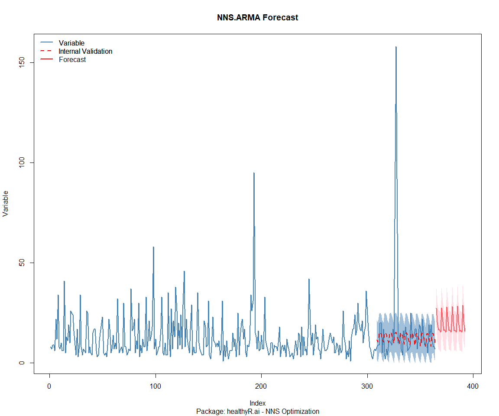

# Time Series Analysis, Modeling and Forecasting of the Healthyverse
Packages
Steven P. Sanderson II, MPH - Date:
2025-10-13

# Introduction

This analysis follows a *Nested Modeltime Workflow* from **`modeltime`**
along with using the **`NNS`** package. I use this to monitor the
downloads of all of my packages:

- [`healthyR`](https://www.spsanderson.com/healthyR/)
- [`healthyR.data`](https://www.spsanderson.com/healthyR.data/)
- [`healthyR.ts`](https://www.spsanderson.com/healthyR.ts/)
- [`healthyR.ai`](https://www.spsanderson.com/healthyR.ai/)
- [`healthyverse`](https://www.spsanderson.com/healthyverse/)
- [`TidyDensity`](https://www.spsanderson.com/TidyDensity/)
- [`tidyAML`](https://www.spsanderson.com/tidyAML/)
- [`RandomWalker`](https://www.spsanderson.com/RandomWalker/)

## Get Data

``` r
glimpse(downloads_tbl)
```

    Rows: 156,643
    Columns: 11
    $ date      <date> 2020-11-23, 2020-11-23, 2020-11-23, 2020-11-23, 2020-11-23,…
    $ time      <Period> 15H 36M 55S, 11H 26M 39S, 23H 34M 44S, 18H 39M 32S, 9H 0M…
    $ date_time <dttm> 2020-11-23 15:36:55, 2020-11-23 11:26:39, 2020-11-23 23:34:…
    $ size      <int> 4858294, 4858294, 4858301, 4858295, 361, 4863722, 4864794, 4…
    $ r_version <chr> NA, "4.0.3", "3.5.3", "3.5.2", NA, NA, NA, NA, NA, NA, NA, N…
    $ r_arch    <chr> NA, "x86_64", "x86_64", "x86_64", NA, NA, NA, NA, NA, NA, NA…
    $ r_os      <chr> NA, "mingw32", "mingw32", "linux-gnu", NA, NA, NA, NA, NA, N…
    $ package   <chr> "healthyR.data", "healthyR.data", "healthyR.data", "healthyR…
    $ version   <chr> "1.0.0", "1.0.0", "1.0.0", "1.0.0", "1.0.0", "1.0.0", "1.0.0…
    $ country   <chr> "US", "US", "US", "GB", "US", "US", "DE", "HK", "JP", "US", …
    $ ip_id     <int> 2069, 2804, 78827, 27595, 90474, 90474, 42435, 74, 7655, 638…

The last day in the data set is 2025-10-11 23:48:30, the file was
birthed on: 2022-07-02 23:58:17.511888, and at report knit time is
2.872384^{4} hours old. Happy analyzing!

Now that we have our data lets take a look at it using the `skimr`
package.

``` r
skim(downloads_tbl)
```

|                                                  |               |
|:-------------------------------------------------|:--------------|
| Name                                             | downloads_tbl |
| Number of rows                                   | 156643        |
| Number of columns                                | 11            |
| \_\_\_\_\_\_\_\_\_\_\_\_\_\_\_\_\_\_\_\_\_\_\_   |               |
| Column type frequency:                           |               |
| character                                        | 6             |
| Date                                             | 1             |
| numeric                                          | 2             |
| POSIXct                                          | 1             |
| Timespan                                         | 1             |
| \_\_\_\_\_\_\_\_\_\_\_\_\_\_\_\_\_\_\_\_\_\_\_\_ |               |
| Group variables                                  | None          |

Data summary

**Variable type: character**

| skim_variable | n_missing | complete_rate | min | max | empty | n_unique | whitespace |
|:--------------|----------:|--------------:|----:|----:|------:|---------:|-----------:|
| r_version     |    114528 |          0.27 |   5 |   5 |     0 |       48 |          0 |
| r_arch        |    114528 |          0.27 |   3 |   7 |     0 |        5 |          0 |
| r_os          |    114528 |          0.27 |   7 |  15 |     0 |       23 |          0 |
| package       |         0 |          1.00 |   7 |  13 |     0 |        8 |          0 |
| version       |         0 |          1.00 |   5 |  17 |     0 |       62 |          0 |
| country       |     14752 |          0.91 |   2 |   2 |     0 |      165 |          0 |

**Variable type: Date**

| skim_variable | n_missing | complete_rate | min | max | median | n_unique |
|:---|---:|---:|:---|:---|:---|---:|
| date | 0 | 1 | 2020-11-23 | 2025-10-11 | 2023-09-29 | 1777 |

**Variable type: numeric**

| skim_variable | n_missing | complete_rate | mean | sd | p0 | p25 | p50 | p75 | p100 | hist |
|:---|---:|---:|---:|---:|---:|---:|---:|---:|---:|:---|
| size | 0 | 1 | 1124650.47 | 1495087.19 | 355 | 16873 | 308053 | 2364040 | 5677952 | ▇▁▂▁▁ |
| ip_id | 0 | 1 | 11311.11 | 21912.62 | 1 | 200 | 2928 | 11961 | 299146 | ▇▁▁▁▁ |

**Variable type: POSIXct**

| skim_variable | n_missing | complete_rate | min | max | median | n_unique |
|:---|---:|---:|:---|:---|:---|---:|
| date_time | 0 | 1 | 2020-11-23 09:00:41 | 2025-10-11 23:48:30 | 2023-09-29 10:46:18 | 98371 |

**Variable type: Timespan**

| skim_variable | n_missing | complete_rate | min | max |     median | n_unique |
|:--------------|----------:|--------------:|----:|----:|-----------:|---------:|
| time          |         0 |             1 |   0 |  59 | 12H 6M 33S |       60 |

We can see that the following columns are missing a lot of data and for
us are most likely not useful anyways, so we will drop them
`c(r_version, r_arch, r_os)`

## Plots

Now lets take a look at a time-series plot of the total daily downloads
by package. We will use a log scale and place a vertical line at each
version release for each package.


    [[1]]


    [[2]]


    [[3]]


    [[4]]


    [[5]]


    [[6]]


    [[7]]


    [[8]]


Now lets take a look at some time series decomposition graphs.

    [[1]]


    [[2]]


    [[3]]


    [[4]]


    [[5]]


    [[6]]


    [[7]]


    [[8]]


    [[1]]


    [[2]]


    [[3]]


    [[4]]


    [[5]]


    [[6]]


    [[7]]


    [[8]]


Seasonal Diagnostics:

    [[1]]


    [[2]]


    [[3]]


    [[4]]


    [[5]]


    [[6]]


    [[7]]


    [[8]]


ACF and PACF Diagnostics:

    [[1]]


    [[2]]


    [[3]]


    [[4]]


    [[5]]


    [[6]]


    [[7]]


    [[8]]


## Feature Engineering

Now that we have our basic data and a shot of what it looks like, let’s
add some features to our data which can be very helpful in modeling.
Lets start by making a `tibble` that is aggregated by the day and
package, as we are going to be interested in forecasting the next 4
weeks or 28 days for each package. First lets get our base data.


    Call:
    stats::lm(formula = .formula, data = df)

    Residuals:
        Min      1Q  Median      3Q     Max 
    -148.00  -36.30  -10.84   27.09  814.69 

    Coefficients:
                                                         Estimate Std. Error
    (Intercept)                                        -2.189e+02  6.242e+01
    date                                                1.300e-02  3.308e-03
    lag(value, 1)                                       1.151e-01  2.347e-02
    lag(value, 7)                                       9.092e-02  2.431e-02
    lag(value, 14)                                      8.453e-02  2.439e-02
    lag(value, 21)                                      6.594e-02  2.443e-02
    lag(value, 28)                                      7.910e-02  2.442e-02
    lag(value, 35)                                      6.838e-02  2.454e-02
    lag(value, 42)                                      5.591e-02  2.469e-02
    lag(value, 49)                                      6.570e-02  2.459e-02
    month(date, label = TRUE).L                        -7.698e+00  5.113e+00
    month(date, label = TRUE).Q                         2.281e+00  5.019e+00
    month(date, label = TRUE).C                        -1.679e+01  5.049e+00
    month(date, label = TRUE)^4                        -8.825e+00  5.075e+00
    month(date, label = TRUE)^5                        -9.834e+00  5.037e+00
    month(date, label = TRUE)^6                        -9.545e-01  5.077e+00
    month(date, label = TRUE)^7                        -5.412e+00  4.976e+00
    month(date, label = TRUE)^8                        -3.827e+00  4.935e+00
    month(date, label = TRUE)^9                         3.290e+00  4.879e+00
    month(date, label = TRUE)^10                        1.290e+00  4.854e+00
    month(date, label = TRUE)^11                       -4.027e+00  4.833e+00
    fourier_vec(date, type = "sin", K = 1, period = 7) -1.129e+01  2.258e+00
    fourier_vec(date, type = "cos", K = 1, period = 7)  6.751e+00  2.349e+00
                                                       t value Pr(>|t|)    
    (Intercept)                                         -3.507 0.000465 ***
    date                                                 3.930 8.85e-05 ***
    lag(value, 1)                                        4.906 1.02e-06 ***
    lag(value, 7)                                        3.740 0.000190 ***
    lag(value, 14)                                       3.466 0.000542 ***
    lag(value, 21)                                       2.699 0.007023 ** 
    lag(value, 28)                                       3.239 0.001222 ** 
    lag(value, 35)                                       2.787 0.005383 ** 
    lag(value, 42)                                       2.264 0.023674 *  
    lag(value, 49)                                       2.672 0.007614 ** 
    month(date, label = TRUE).L                         -1.506 0.132322    
    month(date, label = TRUE).Q                          0.455 0.649500    
    month(date, label = TRUE).C                         -3.326 0.000899 ***
    month(date, label = TRUE)^4                         -1.739 0.082195 .  
    month(date, label = TRUE)^5                         -1.952 0.051060 .  
    month(date, label = TRUE)^6                         -0.188 0.850886    
    month(date, label = TRUE)^7                         -1.088 0.276890    
    month(date, label = TRUE)^8                         -0.775 0.438249    
    month(date, label = TRUE)^9                          0.674 0.500206    
    month(date, label = TRUE)^10                         0.266 0.790423    
    month(date, label = TRUE)^11                        -0.833 0.404847    
    fourier_vec(date, type = "sin", K = 1, period = 7)  -4.997 6.41e-07 ***
    fourier_vec(date, type = "cos", K = 1, period = 7)   2.873 0.004112 ** 
    ---
    Signif. codes:  0 '***' 0.001 '**' 0.01 '*' 0.05 '.' 0.1 ' ' 1

    Residual standard error: 59.23 on 1705 degrees of freedom
      (49 observations deleted due to missingness)
    Multiple R-squared:  0.2406,    Adjusted R-squared:  0.2308 
    F-statistic: 24.56 on 22 and 1705 DF,  p-value: < 2.2e-16


## NNS Forecasting

This is something I have been wanting to try for a while. The `NNS`
package is a great package for forecasting time series data.

[NNS GitHub](https://github.com/OVVO-Financial/NNS)

``` r
library(NNS)

data_list <- base_data |>
    select(package, value) |>
    group_split(package)

data_list |>
    imap(
        \(x, idx) {
            obj <- x
            x <- obj |> pull(value) |> tail(7*52)
            train_set_size <- length(x) - 56
            pkg <- obj |> pluck(1) |> unique()
#            sf <- NNS.seas(x, modulo = 7, plot = FALSE)$periods
            seas <- t(
                sapply(
                    1:25, 
                    function(i) c(
                        i,
                        sqrt(
                            mean((
                                NNS.ARMA(x, 
                                         h = 28, 
                                         training.set = train_set_size, 
                                         method = "lin", 
                                         seasonal.factor = i, 
                                         plot=FALSE
                                         ) - tail(x, 28)) ^ 2)))
                    )
                )
            colnames(seas) <- c("Period", "RMSE")
            sf <- seas[which.min(seas[, 2]), 1]
            
            cat(paste0("Package: ", pkg, "\n"))
            NNS.ARMA.optim(
                variable = x,
                h = 28,
                training.set = train_set_size,
                #seasonal.factor = seq(12, 60, 7),
                seasonal.factor = sf,
                pred.int = 0.95,
                plot = TRUE
            )
            title(
                sub = paste0("\n",
                             "Package: ", pkg, " - NNS Optimization")
            )
        }
    )
```

    Package: healthyR
    [1] "CURRNET METHOD: lin"
    [1] "COPY LATEST PARAMETERS DIRECTLY FOR NNS.ARMA() IF ERROR:"
    [1] "NNS.ARMA(... method =  'lin' , seasonal.factor =  c( 1 ) ...)"
    [1] "CURRENT lin OBJECTIVE FUNCTION = 284.565774020354"
    [1] "BEST method = 'lin' PATH MEMBER = c( 1 )"
    [1] "BEST lin OBJECTIVE FUNCTION = 284.565774020354"
    [1] "CURRNET METHOD: nonlin"
    [1] "COPY LATEST PARAMETERS DIRECTLY FOR NNS.ARMA() IF ERROR:"
    [1] "NNS.ARMA(... method =  'nonlin' , seasonal.factor =  c( 1 ) ...)"
    [1] "CURRENT nonlin OBJECTIVE FUNCTION = 15.7180202373146"
    [1] "BEST method = 'nonlin' PATH MEMBER = c( 1 )"
    [1] "BEST nonlin OBJECTIVE FUNCTION = 15.7180202373146"
    [1] "CURRNET METHOD: both"
    [1] "COPY LATEST PARAMETERS DIRECTLY FOR NNS.ARMA() IF ERROR:"
    [1] "NNS.ARMA(... method =  'both' , seasonal.factor =  c( 1 ) ...)"
    [1] "CURRENT both OBJECTIVE FUNCTION = 35.7529733506819"
    [1] "BEST method = 'both' PATH MEMBER = c( 1 )"
    [1] "BEST both OBJECTIVE FUNCTION = 35.7529733506819"


    Package: healthyR.ai
    [1] "CURRNET METHOD: lin"
    [1] "COPY LATEST PARAMETERS DIRECTLY FOR NNS.ARMA() IF ERROR:"
    [1] "NNS.ARMA(... method =  'lin' , seasonal.factor =  c( 11 ) ...)"
    [1] "CURRENT lin OBJECTIVE FUNCTION = 56.5092042895283"
    [1] "BEST method = 'lin' PATH MEMBER = c( 11 )"
    [1] "BEST lin OBJECTIVE FUNCTION = 56.5092042895283"
    [1] "CURRNET METHOD: nonlin"
    [1] "COPY LATEST PARAMETERS DIRECTLY FOR NNS.ARMA() IF ERROR:"
    [1] "NNS.ARMA(... method =  'nonlin' , seasonal.factor =  c( 11 ) ...)"
    [1] "CURRENT nonlin OBJECTIVE FUNCTION = 27.4028256340543"
    [1] "BEST method = 'nonlin' PATH MEMBER = c( 11 )"
    [1] "BEST nonlin OBJECTIVE FUNCTION = 27.4028256340543"
    [1] "CURRNET METHOD: both"
    [1] "COPY LATEST PARAMETERS DIRECTLY FOR NNS.ARMA() IF ERROR:"
    [1] "NNS.ARMA(... method =  'both' , seasonal.factor =  c( 11 ) ...)"
    [1] "CURRENT both OBJECTIVE FUNCTION = 41.8828259461013"
    [1] "BEST method = 'both' PATH MEMBER = c( 11 )"
    [1] "BEST both OBJECTIVE FUNCTION = 41.8828259461013"



    Package: healthyR.data
    [1] "CURRNET METHOD: lin"
    [1] "COPY LATEST PARAMETERS DIRECTLY FOR NNS.ARMA() IF ERROR:"
    [1] "NNS.ARMA(... method =  'lin' , seasonal.factor =  c( 5 ) ...)"
    [1] "CURRENT lin OBJECTIVE FUNCTION = 38.5689740508543"
    [1] "BEST method = 'lin' PATH MEMBER = c( 5 )"
    [1] "BEST lin OBJECTIVE FUNCTION = 38.5689740508543"
    [1] "CURRNET METHOD: nonlin"
    [1] "COPY LATEST PARAMETERS DIRECTLY FOR NNS.ARMA() IF ERROR:"
    [1] "NNS.ARMA(... method =  'nonlin' , seasonal.factor =  c( 5 ) ...)"
    [1] "CURRENT nonlin OBJECTIVE FUNCTION = 10.6504318625564"
    [1] "BEST method = 'nonlin' PATH MEMBER = c( 5 )"
    [1] "BEST nonlin OBJECTIVE FUNCTION = 10.6504318625564"
    [1] "CURRNET METHOD: both"
    [1] "COPY LATEST PARAMETERS DIRECTLY FOR NNS.ARMA() IF ERROR:"
    [1] "NNS.ARMA(... method =  'both' , seasonal.factor =  c( 5 ) ...)"
    [1] "CURRENT both OBJECTIVE FUNCTION = 9.13379718146634"
    [1] "BEST method = 'both' PATH MEMBER = c( 5 )"
    [1] "BEST both OBJECTIVE FUNCTION = 9.13379718146634"


    Package: healthyR.ts
    [1] "CURRNET METHOD: lin"
    [1] "COPY LATEST PARAMETERS DIRECTLY FOR NNS.ARMA() IF ERROR:"
    [1] "NNS.ARMA(... method =  'lin' , seasonal.factor =  c( 4 ) ...)"
    [1] "CURRENT lin OBJECTIVE FUNCTION = 19.2805956320659"
    [1] "BEST method = 'lin' PATH MEMBER = c( 4 )"
    [1] "BEST lin OBJECTIVE FUNCTION = 19.2805956320659"
    [1] "CURRNET METHOD: nonlin"
    [1] "COPY LATEST PARAMETERS DIRECTLY FOR NNS.ARMA() IF ERROR:"
    [1] "NNS.ARMA(... method =  'nonlin' , seasonal.factor =  c( 4 ) ...)"
    [1] "CURRENT nonlin OBJECTIVE FUNCTION = 12.8397755118335"
    [1] "BEST method = 'nonlin' PATH MEMBER = c( 4 )"
    [1] "BEST nonlin OBJECTIVE FUNCTION = 12.8397755118335"
    [1] "CURRNET METHOD: both"
    [1] "COPY LATEST PARAMETERS DIRECTLY FOR NNS.ARMA() IF ERROR:"
    [1] "NNS.ARMA(... method =  'both' , seasonal.factor =  c( 4 ) ...)"
    [1] "CURRENT both OBJECTIVE FUNCTION = 8.11561882035936"
    [1] "BEST method = 'both' PATH MEMBER = c( 4 )"
    [1] "BEST both OBJECTIVE FUNCTION = 8.11561882035936"


    Package: healthyverse
    [1] "CURRNET METHOD: lin"
    [1] "COPY LATEST PARAMETERS DIRECTLY FOR NNS.ARMA() IF ERROR:"
    [1] "NNS.ARMA(... method =  'lin' , seasonal.factor =  c( 2 ) ...)"
    [1] "CURRENT lin OBJECTIVE FUNCTION = 50.368681635977"
    [1] "BEST method = 'lin' PATH MEMBER = c( 2 )"
    [1] "BEST lin OBJECTIVE FUNCTION = 50.368681635977"
    [1] "CURRNET METHOD: nonlin"
    [1] "COPY LATEST PARAMETERS DIRECTLY FOR NNS.ARMA() IF ERROR:"
    [1] "NNS.ARMA(... method =  'nonlin' , seasonal.factor =  c( 2 ) ...)"
    [1] "CURRENT nonlin OBJECTIVE FUNCTION = 4.6614385272388"
    [1] "BEST method = 'nonlin' PATH MEMBER = c( 2 )"
    [1] "BEST nonlin OBJECTIVE FUNCTION = 4.6614385272388"
    [1] "CURRNET METHOD: both"
    [1] "COPY LATEST PARAMETERS DIRECTLY FOR NNS.ARMA() IF ERROR:"
    [1] "NNS.ARMA(... method =  'both' , seasonal.factor =  c( 2 ) ...)"
    [1] "CURRENT both OBJECTIVE FUNCTION = 4.12046994535484"
    [1] "BEST method = 'both' PATH MEMBER = c( 2 )"
    [1] "BEST both OBJECTIVE FUNCTION = 4.12046994535484"


    Package: RandomWalker
    [1] "CURRNET METHOD: lin"
    [1] "COPY LATEST PARAMETERS DIRECTLY FOR NNS.ARMA() IF ERROR:"
    [1] "NNS.ARMA(... method =  'lin' , seasonal.factor =  c( 25 ) ...)"
    [1] "CURRENT lin OBJECTIVE FUNCTION = 3.6514555835629"
    [1] "BEST method = 'lin' PATH MEMBER = c( 25 )"
    [1] "BEST lin OBJECTIVE FUNCTION = 3.6514555835629"
    [1] "CURRNET METHOD: nonlin"
    [1] "COPY LATEST PARAMETERS DIRECTLY FOR NNS.ARMA() IF ERROR:"
    [1] "NNS.ARMA(... method =  'nonlin' , seasonal.factor =  c( 25 ) ...)"
    [1] "CURRENT nonlin OBJECTIVE FUNCTION = 6.14359588572236"
    [1] "BEST method = 'nonlin' PATH MEMBER = c( 25 )"
    [1] "BEST nonlin OBJECTIVE FUNCTION = 6.14359588572236"
    [1] "CURRNET METHOD: both"
    [1] "COPY LATEST PARAMETERS DIRECTLY FOR NNS.ARMA() IF ERROR:"
    [1] "NNS.ARMA(... method =  'both' , seasonal.factor =  c( 25 ) ...)"
    [1] "CURRENT both OBJECTIVE FUNCTION = 5.06836069819103"
    [1] "BEST method = 'both' PATH MEMBER = c( 25 )"
    [1] "BEST both OBJECTIVE FUNCTION = 5.06836069819103"


    Package: tidyAML
    [1] "CURRNET METHOD: lin"
    [1] "COPY LATEST PARAMETERS DIRECTLY FOR NNS.ARMA() IF ERROR:"
    [1] "NNS.ARMA(... method =  'lin' , seasonal.factor =  c( 18 ) ...)"
    [1] "CURRENT lin OBJECTIVE FUNCTION = 24.3891993257384"
    [1] "BEST method = 'lin' PATH MEMBER = c( 18 )"
    [1] "BEST lin OBJECTIVE FUNCTION = 24.3891993257384"
    [1] "CURRNET METHOD: nonlin"
    [1] "COPY LATEST PARAMETERS DIRECTLY FOR NNS.ARMA() IF ERROR:"
    [1] "NNS.ARMA(... method =  'nonlin' , seasonal.factor =  c( 18 ) ...)"
    [1] "CURRENT nonlin OBJECTIVE FUNCTION = 10.3891550301384"
    [1] "BEST method = 'nonlin' PATH MEMBER = c( 18 )"
    [1] "BEST nonlin OBJECTIVE FUNCTION = 10.3891550301384"
    [1] "CURRNET METHOD: both"
    [1] "COPY LATEST PARAMETERS DIRECTLY FOR NNS.ARMA() IF ERROR:"
    [1] "NNS.ARMA(... method =  'both' , seasonal.factor =  c( 18 ) ...)"
    [1] "CURRENT both OBJECTIVE FUNCTION = 25.8218518037563"
    [1] "BEST method = 'both' PATH MEMBER = c( 18 )"
    [1] "BEST both OBJECTIVE FUNCTION = 25.8218518037563"


    Package: TidyDensity
    [1] "CURRNET METHOD: lin"
    [1] "COPY LATEST PARAMETERS DIRECTLY FOR NNS.ARMA() IF ERROR:"
    [1] "NNS.ARMA(... method =  'lin' , seasonal.factor =  c( 11 ) ...)"
    [1] "CURRENT lin OBJECTIVE FUNCTION = 32.0355729062663"
    [1] "BEST method = 'lin' PATH MEMBER = c( 11 )"
    [1] "BEST lin OBJECTIVE FUNCTION = 32.0355729062663"
    [1] "CURRNET METHOD: nonlin"
    [1] "COPY LATEST PARAMETERS DIRECTLY FOR NNS.ARMA() IF ERROR:"
    [1] "NNS.ARMA(... method =  'nonlin' , seasonal.factor =  c( 11 ) ...)"
    [1] "CURRENT nonlin OBJECTIVE FUNCTION = 6.77897928515714"
    [1] "BEST method = 'nonlin' PATH MEMBER = c( 11 )"
    [1] "BEST nonlin OBJECTIVE FUNCTION = 6.77897928515714"
    [1] "CURRNET METHOD: both"
    [1] "COPY LATEST PARAMETERS DIRECTLY FOR NNS.ARMA() IF ERROR:"
    [1] "NNS.ARMA(... method =  'both' , seasonal.factor =  c( 11 ) ...)"
    [1] "CURRENT both OBJECTIVE FUNCTION = 12.962026391627"
    [1] "BEST method = 'both' PATH MEMBER = c( 11 )"
    [1] "BEST both OBJECTIVE FUNCTION = 12.962026391627"


    [[1]]
    NULL

    [[2]]
    NULL

    [[3]]
    NULL

    [[4]]
    NULL

    [[5]]
    NULL

    [[6]]
    NULL

    [[7]]
    NULL

    [[8]]
    NULL

## Pre-Processing

Now we are going to do some basic pre-processing.

``` r
data_padded_tbl <- base_data %>%
  pad_by_time(
    .date_var  = date,
    .pad_value = 0
  )

# Get log interval and standardization parameters
log_params  <- liv(data_padded_tbl$value, limit_lower = 0, offset = 1, silent = TRUE)
limit_lower <- log_params$limit_lower
limit_upper <- log_params$limit_upper
offset      <- log_params$offset

data_liv_tbl <- data_padded_tbl %>%
  # Get log interval transform
  mutate(value_trans = liv(value, limit_lower = 0, offset = 1, silent = TRUE)$log_scaled)

# Get Standardization Params
std_params <- standard_vec(data_liv_tbl$value_trans, silent = TRUE)
std_mean   <- std_params$mean
std_sd     <- std_params$sd

data_transformed_tbl <- data_liv_tbl %>%
  group_by(package) %>%
  # get standardization
  mutate(value_trans = standard_vec(value_trans, silent = TRUE)$standard_scaled) %>%
  tk_augment_fourier(
    .date_var = date,
    .periods  = c(7, 14, 30, 90, 180),
    .K        = 2
  ) %>%
  tk_augment_timeseries_signature(
    .date_var = date
  ) %>%
  ungroup() %>%
  select(-c(value, -year.iso))
```

Since this is panel data we can follow one of two different modeling
strategies. We can search for a global model in the panel data or we can
use nested forecasting finding the best model for each of the time
series. Since we only have 5 panels, we will use nested forecasting.

To do this we will use the `nest_timeseries` and
`split_nested_timeseries` functions to create a nested `tibble`.

``` r
horizon <- 4*7

nested_data_tbl <- data_transformed_tbl %>%

    # 0. Filter out column where package is NA
    filter(!is.na(package)) %>%
    
    # 1. Extending: We'll predict n days into the future.
    extend_timeseries(
        .id_var        = package,
        .date_var      = date,
        .length_future = horizon
    ) %>%
    
    # 2. Nesting: We'll group by id, and create a future dataset
    #    that forecasts n days of extended data and
    #    an actual dataset that contains n*2 days
    nest_timeseries(
        .id_var        = package,
        .length_future = horizon
        #.length_actual = horizon*2
    ) %>%
    
   # 3. Splitting: We'll take the actual data and create splits
   #    for accuracy and confidence interval estimation of n das (test)
   #    and the rest is training data
    split_nested_timeseries(
        .length_test = horizon
    )

nested_data_tbl
```

    # A tibble: 8 × 4
      package       .actual_data          .future_data       .splits          
      <fct>         <list>                <list>             <list>           
    1 healthyR.data <tibble [1,769 × 50]> <tibble [28 × 50]> <split [1741|28]>
    2 healthyR      <tibble [1,760 × 50]> <tibble [28 × 50]> <split [1732|28]>
    3 healthyR.ts   <tibble [1,706 × 50]> <tibble [28 × 50]> <split [1678|28]>
    4 healthyverse  <tibble [1,677 × 50]> <tibble [28 × 50]> <split [1649|28]>
    5 healthyR.ai   <tibble [1,502 × 50]> <tibble [28 × 50]> <split [1474|28]>
    6 TidyDensity   <tibble [1,353 × 50]> <tibble [28 × 50]> <split [1325|28]>
    7 tidyAML       <tibble [960 × 50]>   <tibble [28 × 50]> <split [932|28]> 
    8 RandomWalker  <tibble [383 × 50]>   <tibble [28 × 50]> <split [355|28]> 

Now it is time to make some recipes and models using the modeltime
workflow.

## Modeltime Workflow

### Recipe Object

``` r
recipe_base <- recipe(
  value_trans ~ .
  , data = extract_nested_test_split(nested_data_tbl)
  )

recipe_base

recipe_date <- recipe(
  value_trans ~ date
  , data = extract_nested_test_split(nested_data_tbl)
  )
```

### Models

``` r
# Models ------------------------------------------------------------------

# Auto ARIMA --------------------------------------------------------------

model_spec_arima_no_boost <- arima_reg() %>%
  set_engine(engine = "auto_arima")

wflw_auto_arima <- workflow() %>%
  add_recipe(recipe = recipe_date) %>%
  add_model(model_spec_arima_no_boost)

# NNETAR ------------------------------------------------------------------

model_spec_nnetar <- nnetar_reg(
  mode              = "regression"
  , seasonal_period = "auto"
) %>%
  set_engine("nnetar")

wflw_nnetar <- workflow() %>%
  add_recipe(recipe = recipe_base) %>%
  add_model(model_spec_nnetar)

# TSLM --------------------------------------------------------------------

model_spec_lm <- linear_reg() %>%
  set_engine("lm")

wflw_lm <- workflow() %>%
  add_recipe(recipe = recipe_base) %>%
  add_model(model_spec_lm)

# MARS --------------------------------------------------------------------

model_spec_mars <- mars(mode = "regression") %>%
  set_engine("earth")

wflw_mars <- workflow() %>%
  add_recipe(recipe = recipe_date) %>%
  add_model(model_spec_mars)
```

### Nested Modeltime Tables

``` r
nested_modeltime_tbl <- modeltime_nested_fit(
  # Nested Data
  nested_data = nested_data_tbl,
   control = control_nested_fit(
     verbose = TRUE,
     allow_par = FALSE
   ),
  # Add workflows
  wflw_auto_arima,
  wflw_lm,
  wflw_mars,
  wflw_nnetar
)
```

``` r
nested_modeltime_tbl <- nested_modeltime_tbl[!is.na(nested_modeltime_tbl$package),]
```

### Model Accuracy

``` r
nested_modeltime_tbl %>%
  extract_nested_test_accuracy() %>%
  filter(!is.na(package)) %>%
  knitr::kable()
```

| package | .model_id | .model_desc | .type | mae | mape | mase | smape | rmse | rsq |
|:---|---:|:---|:---|---:|---:|---:|---:|---:|---:|
| healthyR.data | 1 | ARIMA | Test | 0.6601326 | 120.32843 | 0.8116885 | 164.4103 | 0.8169147 | 0.0485435 |
| healthyR.data | 2 | LM | Test | 0.8573454 | 201.35971 | 1.0541781 | 158.3865 | 1.0249038 | 0.0078142 |
| healthyR.data | 3 | EARTH | Test | 0.7066368 | 134.71174 | 0.8688692 | 162.5467 | 0.8601775 | 0.0188740 |
| healthyR.data | 4 | NNAR | Test | 0.8752959 | 215.51733 | 1.0762497 | 164.4546 | 1.0268361 | 0.0004709 |
| healthyR | 1 | ARIMA | Test | 0.6169887 | 212.42010 | 1.0217282 | 183.4842 | 0.7239929 | 0.0723092 |
| healthyR | 2 | LM | Test | 0.8000694 | 304.33726 | 1.3249083 | 164.7589 | 0.9966224 | 0.0281565 |
| healthyR | 3 | EARTH | Test | 0.4916071 | 480.82459 | 0.8140973 | 100.7094 | 0.6119789 | 0.0000764 |
| healthyR | 4 | NNAR | Test | 0.6256170 | 229.05396 | 1.0360166 | 153.7098 | 0.8025323 | 0.0061851 |
| healthyR.ts | 1 | ARIMA | Test | 0.5182842 | 102.31963 | 0.7162126 | 157.9529 | 0.6457418 | 0.0000009 |
| healthyR.ts | 2 | LM | Test | 0.6623307 | 157.03842 | 0.9152693 | 138.0505 | 0.8007437 | 0.0066360 |
| healthyR.ts | 3 | EARTH | Test | 0.4949660 | 95.35195 | 0.6839895 | 139.4596 | 0.6035165 | 0.0350152 |
| healthyR.ts | 4 | NNAR | Test | 0.7426797 | 223.08156 | 1.0263030 | 155.8543 | 0.8540704 | 0.0022885 |
| healthyverse | 1 | ARIMA | Test | 0.8259814 | 163.12823 | 0.9596370 | 159.7028 | 0.9561649 | 0.2379739 |
| healthyverse | 2 | LM | Test | 0.7387473 | 162.33591 | 0.8582872 | 143.1533 | 0.9092614 | 0.0953879 |
| healthyverse | 3 | EARTH | Test | 0.7104780 | 108.07383 | 0.8254435 | 158.2362 | 0.8555899 | 0.0006976 |
| healthyverse | 4 | NNAR | Test | 0.6826699 | 154.72782 | 0.7931356 | 134.0292 | 0.8568329 | 0.0665412 |
| healthyR.ai | 1 | ARIMA | Test | 0.9140297 | 126.15368 | 1.1587857 | 170.6439 | 1.4492604 | 0.0698213 |
| healthyR.ai | 2 | LM | Test | 0.8946417 | 156.31456 | 1.1342060 | 146.8623 | 1.4790552 | 0.0034261 |
| healthyR.ai | 3 | EARTH | Test | 0.7685198 | 109.62776 | 0.9743116 | 123.4129 | 1.3506950 | 0.1265967 |
| healthyR.ai | 4 | NNAR | Test | 0.8691727 | 155.52177 | 1.1019170 | 140.6139 | 1.4486625 | 0.0325782 |
| TidyDensity | 1 | ARIMA | Test | 1.3043497 | 237.47468 | 1.0099802 | 116.2396 | 1.5725287 | 0.0337912 |
| TidyDensity | 2 | LM | Test | 1.6324695 | 172.02761 | 1.2640488 | 167.6056 | 2.0032615 | 0.0067521 |
| TidyDensity | 3 | EARTH | Test | 3.9591177 | 2079.12323 | 3.0656121 | 117.8534 | 4.3251322 | 0.0813785 |
| TidyDensity | 4 | NNAR | Test | 1.4014346 | 196.50316 | 1.0851546 | 136.7340 | 1.6869273 | 0.0019135 |
| tidyAML | 1 | ARIMA | Test | 1.0848220 | 176.51751 | 0.9821354 | 173.0720 | 1.4869497 | 0.0000056 |
| tidyAML | 2 | LM | Test | 1.1471393 | 228.62558 | 1.0385539 | 169.7834 | 1.5754629 | 0.0068864 |
| tidyAML | 3 | EARTH | Test | 1.1689967 | 226.01051 | 1.0583424 | 167.1438 | 1.5454116 | 0.0046012 |
| tidyAML | 4 | NNAR | Test | 1.1537900 | 231.42765 | 1.0445751 | 162.8369 | 1.5460495 | 0.0020810 |
| RandomWalker | 1 | ARIMA | Test | 0.7850295 | 369.06370 | 0.5850664 | 148.5667 | 0.8773627 | 0.2731129 |
| RandomWalker | 2 | LM | Test | 0.8248683 | 687.15444 | 0.6147574 | 147.1050 | 0.9481699 | 0.0045047 |
| RandomWalker | 3 | EARTH | Test | 0.9173230 | 603.79778 | 0.6836620 | 144.7441 | 0.9714919 | 0.0209685 |
| RandomWalker | 4 | NNAR | Test | 0.9476746 | 908.61466 | 0.7062824 | 153.7996 | 1.1238585 | 0.0157189 |

### Plot Models

``` r
nested_modeltime_tbl %>%
  extract_nested_test_forecast() %>%
  group_by(package) %>%
  filter_by_time(.date_var = .index, .start_date = max(.index) - 60) %>%
  ungroup() %>%
  plot_modeltime_forecast(
    .interactive = FALSE,
    .conf_interval_show  = FALSE,
    .facet_scales = "free"
  ) +
  theme_minimal() +
  facet_wrap(~ package, nrow = 3) +
  theme(legend.position = "bottom")
```


### Best Model

``` r
best_nested_modeltime_tbl <- nested_modeltime_tbl %>%
  modeltime_nested_select_best(
    metric = "rmse",
    minimize = TRUE,
    filter_test_forecasts = TRUE
  )

best_nested_modeltime_tbl %>%
  extract_nested_best_model_report()
```

    # Nested Modeltime Table
      

    # A tibble: 8 × 10
      package      .model_id .model_desc .type   mae  mape  mase smape  rmse     rsq
      <fct>            <int> <chr>       <chr> <dbl> <dbl> <dbl> <dbl> <dbl>   <dbl>
    1 healthyR.da…         1 ARIMA       Test  0.660 120.  0.812  164. 0.817 4.85e-2
    2 healthyR             3 EARTH       Test  0.492 481.  0.814  101. 0.612 7.64e-5
    3 healthyR.ts          3 EARTH       Test  0.495  95.4 0.684  139. 0.604 3.50e-2
    4 healthyverse         3 EARTH       Test  0.710 108.  0.825  158. 0.856 6.98e-4
    5 healthyR.ai          3 EARTH       Test  0.769 110.  0.974  123. 1.35  1.27e-1
    6 TidyDensity          1 ARIMA       Test  1.30  237.  1.01   116. 1.57  3.38e-2
    7 tidyAML              1 ARIMA       Test  1.08  177.  0.982  173. 1.49  5.57e-6
    8 RandomWalker         1 ARIMA       Test  0.785 369.  0.585  149. 0.877 2.73e-1

``` r
best_nested_modeltime_tbl %>%
  extract_nested_test_forecast() %>%
  #filter(!is.na(.model_id)) %>%
  group_by(package) %>%
  filter_by_time(.date_var = .index, .start_date = max(.index) - 60) %>%
  ungroup() %>%
  plot_modeltime_forecast(
    .interactive = FALSE,
    .conf_interval_alpha = 0.2,
    .facet_scales = "free"
  ) +
  facet_wrap(~ package, nrow = 3) +
  theme_minimal() +
  theme(legend.position = "bottom")
```


## Refitting and Future Forecast

Now that we have the best models, we can make our future forecasts.

``` r
nested_modeltime_refit_tbl <- best_nested_modeltime_tbl %>%
    modeltime_nested_refit(
        control = control_nested_refit(verbose = TRUE)
    )
```

``` r
nested_modeltime_refit_tbl
```

    # Nested Modeltime Table
      

    # A tibble: 8 × 5
      package       .actual_data .future_data .splits           .modeltime_tables 
      <fct>         <list>       <list>       <list>            <list>            
    1 healthyR.data <tibble>     <tibble>     <split [1741|28]> <mdl_tm_t [1 × 5]>
    2 healthyR      <tibble>     <tibble>     <split [1732|28]> <mdl_tm_t [1 × 5]>
    3 healthyR.ts   <tibble>     <tibble>     <split [1678|28]> <mdl_tm_t [1 × 5]>
    4 healthyverse  <tibble>     <tibble>     <split [1649|28]> <mdl_tm_t [1 × 5]>
    5 healthyR.ai   <tibble>     <tibble>     <split [1474|28]> <mdl_tm_t [1 × 5]>
    6 TidyDensity   <tibble>     <tibble>     <split [1325|28]> <mdl_tm_t [1 × 5]>
    7 tidyAML       <tibble>     <tibble>     <split [932|28]>  <mdl_tm_t [1 × 5]>
    8 RandomWalker  <tibble>     <tibble>     <split [355|28]>  <mdl_tm_t [1 × 5]>

``` r
nested_modeltime_refit_tbl %>%
  extract_nested_future_forecast() %>%
  group_by(package) %>%
  mutate(across(.value:.conf_hi, .fns = ~ standard_inv_vec(
    x    = .,
    mean = std_mean,
    sd   = std_sd
  )$standard_inverse_value)) %>%
  mutate(across(.value:.conf_hi, .fns = ~ liiv(
    x = .,
    limit_lower = limit_lower,
    limit_upper = limit_upper,
    offset      = offset
  )$rescaled_v)) %>%
  filter_by_time(.date_var = .index, .start_date = max(.index) - 60) %>%
  ungroup() %>%
  plot_modeltime_forecast(
    .interactive = FALSE,
    .conf_interval_alpha = 0.2,
    .facet_scales = "free"
  ) +
  facet_wrap(~ package, nrow = 3) +
  theme_minimal() +
  theme(legend.position = "bottom")
```


