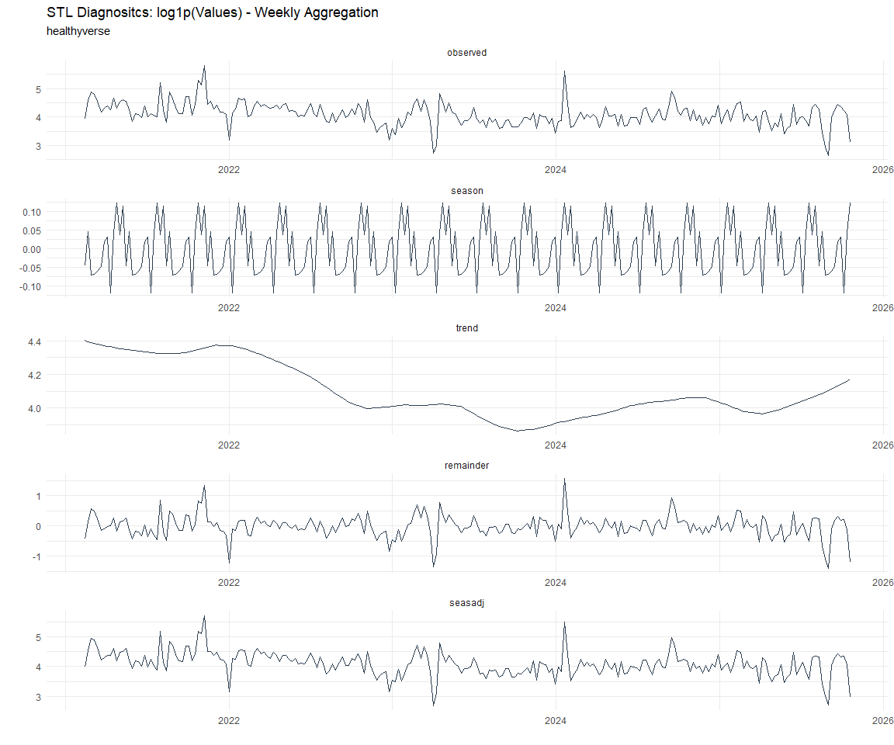

# Time Series Analysis, Modeling and Forecasting of the Healthyverse
Packages
Steven P. Sanderson II, MPH - Date:
2026-02-23

# Introduction

This analysis follows a *Nested Modeltime Workflow* from **`modeltime`**
along with using the **`NNS`** package. I use this to monitor the
downloads of all of my packages:

- [`healthyR`](https://www.spsanderson.com/healthyR/)
- [`healthyR.data`](https://www.spsanderson.com/healthyR.data/)
- [`healthyR.ts`](https://www.spsanderson.com/healthyR.ts/)
- [`healthyR.ai`](https://www.spsanderson.com/healthyR.ai/)
- [`healthyverse`](https://www.spsanderson.com/healthyverse/)
- [`TidyDensity`](https://www.spsanderson.com/TidyDensity/)
- [`tidyAML`](https://www.spsanderson.com/tidyAML/)
- [`RandomWalker`](https://www.spsanderson.com/RandomWalker/)

## Get Data

``` r
glimpse(downloads_tbl)
```

    Rows: 169,614
    Columns: 11
    $ date      <date> 2020-11-23, 2020-11-23, 2020-11-23, 2020-11-23, 2020-11-23,…
    $ time      <Period> 15H 36M 55S, 11H 26M 39S, 23H 34M 44S, 18H 39M 32S, 9H 0M…
    $ date_time <dttm> 2020-11-23 15:36:55, 2020-11-23 11:26:39, 2020-11-23 23:34:…
    $ size      <int> 4858294, 4858294, 4858301, 4858295, 361, 4863722, 4864794, 4…
    $ r_version <chr> NA, "4.0.3", "3.5.3", "3.5.2", NA, NA, NA, NA, NA, NA, NA, N…
    $ r_arch    <chr> NA, "x86_64", "x86_64", "x86_64", NA, NA, NA, NA, NA, NA, NA…
    $ r_os      <chr> NA, "mingw32", "mingw32", "linux-gnu", NA, NA, NA, NA, NA, N…
    $ package   <chr> "healthyR.data", "healthyR.data", "healthyR.data", "healthyR…
    $ version   <chr> "1.0.0", "1.0.0", "1.0.0", "1.0.0", "1.0.0", "1.0.0", "1.0.0…
    $ country   <chr> "US", "US", "US", "GB", "US", "US", "DE", "HK", "JP", "US", …
    $ ip_id     <int> 2069, 2804, 78827, 27595, 90474, 90474, 42435, 74, 7655, 638…

The last day in the data set is 2026-02-21 19:50:12, the file was
birthed on: 2022-07-02 23:58:17.511888, and at report knit time is
3.191187^{4} hours old. Happy analyzing!

Now that we have our data lets take a look at it using the `skimr`
package.

``` r
skim(downloads_tbl)
```

|                                                  |               |
|:-------------------------------------------------|:--------------|
| Name                                             | downloads_tbl |
| Number of rows                                   | 169614        |
| Number of columns                                | 11            |
| \_\_\_\_\_\_\_\_\_\_\_\_\_\_\_\_\_\_\_\_\_\_\_   |               |
| Column type frequency:                           |               |
| character                                        | 6             |
| Date                                             | 1             |
| numeric                                          | 2             |
| POSIXct                                          | 1             |
| Timespan                                         | 1             |
| \_\_\_\_\_\_\_\_\_\_\_\_\_\_\_\_\_\_\_\_\_\_\_\_ |               |
| Group variables                                  | None          |

Data summary

**Variable type: character**

| skim_variable | n_missing | complete_rate | min | max | empty | n_unique | whitespace |
|:--------------|----------:|--------------:|----:|----:|------:|---------:|-----------:|
| r_version     |    125325 |          0.26 |   5 |   7 |     0 |       50 |          0 |
| r_arch        |    125325 |          0.26 |   1 |   7 |     0 |        6 |          0 |
| r_os          |    125325 |          0.26 |   7 |  19 |     0 |       24 |          0 |
| package       |         0 |          1.00 |   7 |  13 |     0 |        8 |          0 |
| version       |         0 |          1.00 |   5 |  17 |     0 |       63 |          0 |
| country       |     15911 |          0.91 |   2 |   2 |     0 |      167 |          0 |

**Variable type: Date**

| skim_variable | n_missing | complete_rate | min | max | median | n_unique |
|:---|---:|---:|:---|:---|:---|---:|
| date | 0 | 1 | 2020-11-23 | 2026-02-21 | 2023-12-13 | 1910 |

**Variable type: numeric**

| skim_variable | n_missing | complete_rate | mean | sd | p0 | p25 | p50 | p75 | p100 | hist |
|:---|---:|---:|---:|---:|---:|---:|---:|---:|---:|:---|
| size | 0 | 1 | 1127476.6 | 1483506.1 | 355 | 42118.5 | 322892.0 | 2348407 | 5677952 | ▇▁▂▁▁ |
| ip_id | 0 | 1 | 11486.1 | 22874.7 | 1 | 207.0 | 2775.5 | 11827 | 299146 | ▇▁▁▁▁ |

**Variable type: POSIXct**

| skim_variable | n_missing | complete_rate | min | max | median | n_unique |
|:---|---:|---:|:---|:---|:---|---:|
| date_time | 0 | 1 | 2020-11-23 09:00:41 | 2026-02-21 19:50:12 | 2023-12-13 14:13:52 | 107583 |

**Variable type: Timespan**

| skim_variable | n_missing | complete_rate | min | max | median | n_unique |
|:--------------|----------:|--------------:|----:|----:|-------:|---------:|
| time          |         0 |             1 |   0 |  59 |     59 |       60 |

We can see that the following columns are missing a lot of data and for
us are most likely not useful anyways, so we will drop them
`c(r_version, r_arch, r_os)`

## Plots

Now lets take a look at a time-series plot of the total daily downloads
by package. We will use a log scale and place a vertical line at each
version release for each package.


    [[1]]


    [[2]]


    [[3]]


    [[4]]


    [[5]]


    [[6]]


    [[7]]


    [[8]]


Now lets take a look at some time series decomposition graphs.

    [[1]]


    [[2]]


    [[3]]


    [[4]]


    [[5]]


    [[6]]


    [[7]]




    [[8]]


    [[1]]


    [[2]]


    [[3]]


    [[4]]


    [[5]]


    [[6]]


    [[7]]


    [[8]]


Seasonal Diagnostics:

    [[1]]


    [[2]]


    [[3]]


    [[4]]


    [[5]]


    [[6]]


    [[7]]


    [[8]]


ACF and PACF Diagnostics:

    [[1]]


    [[2]]


    [[3]]


    [[4]]


    [[5]]


    [[6]]


    [[7]]


    [[8]]


## Feature Engineering

Now that we have our basic data and a shot of what it looks like, let’s
add some features to our data which can be very helpful in modeling.
Lets start by making a `tibble` that is aggregated by the day and
package, as we are going to be interested in forecasting the next 4
weeks or 28 days for each package. First lets get our base data.


    Call:
    stats::lm(formula = .formula, data = df)

    Residuals:
        Min      1Q  Median      3Q     Max 
    -149.39  -37.16  -11.30   27.27  826.35 

    Coefficients:
                                                         Estimate Std. Error
    (Intercept)                                        -1.655e+02  5.595e+01
    date                                                1.033e-02  2.961e-03
    lag(value, 1)                                       9.892e-02  2.278e-02
    lag(value, 7)                                       8.430e-02  2.349e-02
    lag(value, 14)                                      7.052e-02  2.338e-02
    lag(value, 21)                                      8.761e-02  2.348e-02
    lag(value, 28)                                      6.887e-02  2.342e-02
    lag(value, 35)                                      4.829e-02  2.349e-02
    lag(value, 42)                                      7.240e-02  2.362e-02
    lag(value, 49)                                      6.762e-02  2.355e-02
    month(date, label = TRUE).L                        -8.938e+00  4.769e+00
    month(date, label = TRUE).Q                        -1.174e+00  4.733e+00
    month(date, label = TRUE).C                        -1.449e+01  4.789e+00
    month(date, label = TRUE)^4                        -7.797e+00  4.809e+00
    month(date, label = TRUE)^5                        -5.576e+00  4.774e+00
    month(date, label = TRUE)^6                         2.757e-01  4.818e+00
    month(date, label = TRUE)^7                        -3.975e+00  4.796e+00
    month(date, label = TRUE)^8                        -4.490e+00  4.801e+00
    month(date, label = TRUE)^9                         2.981e+00  4.830e+00
    month(date, label = TRUE)^10                        1.050e+00  4.850e+00
    month(date, label = TRUE)^11                       -4.259e+00  4.837e+00
    fourier_vec(date, type = "sin", K = 1, period = 7) -1.073e+01  2.156e+00
    fourier_vec(date, type = "cos", K = 1, period = 7)  7.393e+00  2.227e+00
                                                       t value Pr(>|t|)    
    (Intercept)                                         -2.958 0.003133 ** 
    date                                                 3.490 0.000494 ***
    lag(value, 1)                                        4.344 1.48e-05 ***
    lag(value, 7)                                        3.588 0.000341 ***
    lag(value, 14)                                       3.016 0.002593 ** 
    lag(value, 21)                                       3.732 0.000196 ***
    lag(value, 28)                                       2.940 0.003318 ** 
    lag(value, 35)                                       2.056 0.039944 *  
    lag(value, 42)                                       3.065 0.002205 ** 
    lag(value, 49)                                       2.872 0.004128 ** 
    month(date, label = TRUE).L                         -1.874 0.061057 .  
    month(date, label = TRUE).Q                         -0.248 0.804201    
    month(date, label = TRUE).C                         -3.026 0.002514 ** 
    month(date, label = TRUE)^4                         -1.622 0.105074    
    month(date, label = TRUE)^5                         -1.168 0.242942    
    month(date, label = TRUE)^6                          0.057 0.954375    
    month(date, label = TRUE)^7                         -0.829 0.407289    
    month(date, label = TRUE)^8                         -0.935 0.349779    
    month(date, label = TRUE)^9                          0.617 0.537230    
    month(date, label = TRUE)^10                         0.217 0.828601    
    month(date, label = TRUE)^11                        -0.881 0.378677    
    fourier_vec(date, type = "sin", K = 1, period = 7)  -4.977 7.07e-07 ***
    fourier_vec(date, type = "cos", K = 1, period = 7)   3.319 0.000920 ***
    ---
    Signif. codes:  0 '***' 0.001 '**' 0.01 '*' 0.05 '.' 0.1 ' ' 1

    Residual standard error: 59.34 on 1838 degrees of freedom
      (49 observations deleted due to missingness)
    Multiple R-squared:  0.2196,    Adjusted R-squared:  0.2103 
    F-statistic: 23.51 on 22 and 1838 DF,  p-value: < 2.2e-16


## NNS Forecasting

This is something I have been wanting to try for a while. The `NNS`
package is a great package for forecasting time series data.

[NNS GitHub](https://github.com/OVVO-Financial/NNS)

``` r
library(NNS)

data_list <- base_data |>
    select(package, value) |>
    group_split(package)

data_list |>
    imap(
        \(x, idx) {
            obj <- x
            x <- obj |> pull(value) |> tail(7*52)
            train_set_size <- length(x) - 56
            pkg <- obj |> pluck(1) |> unique()
#            sf <- NNS.seas(x, modulo = 7, plot = FALSE)$periods
            seas <- t(
                sapply(
                    1:25, 
                    function(i) c(
                        i,
                        sqrt(
                            mean((
                                NNS.ARMA(x, 
                                         h = 28, 
                                         training.set = train_set_size, 
                                         method = "lin", 
                                         seasonal.factor = i, 
                                         plot=FALSE
                                         ) - tail(x, 28)) ^ 2)))
                    )
                )
            colnames(seas) <- c("Period", "RMSE")
            sf <- seas[which.min(seas[, 2]), 1]
            
            cat(paste0("Package: ", pkg, "\n"))
            NNS.ARMA.optim(
                variable = x,
                h = 28,
                training.set = train_set_size,
                #seasonal.factor = seq(12, 60, 7),
                seasonal.factor = sf,
                pred.int = 0.95,
                plot = TRUE
            )
            title(
                sub = paste0("\n",
                             "Package: ", pkg, " - NNS Optimization")
            )
        }
    )
```

    Package: healthyR
    [1] "CURRNET METHOD: lin"
    [1] "COPY LATEST PARAMETERS DIRECTLY FOR NNS.ARMA() IF ERROR:"
    [1] "NNS.ARMA(... method =  'lin' , seasonal.factor =  c( 18 ) ...)"
    [1] "CURRENT lin OBJECTIVE FUNCTION = 5.65990785226615"
    [1] "BEST method = 'lin' PATH MEMBER = c( 18 )"
    [1] "BEST lin OBJECTIVE FUNCTION = 5.65990785226615"
    [1] "CURRNET METHOD: nonlin"
    [1] "COPY LATEST PARAMETERS DIRECTLY FOR NNS.ARMA() IF ERROR:"
    [1] "NNS.ARMA(... method =  'nonlin' , seasonal.factor =  c( 18 ) ...)"
    [1] "CURRENT nonlin OBJECTIVE FUNCTION = 8.30069884988854"
    [1] "BEST method = 'nonlin' PATH MEMBER = c( 18 )"
    [1] "BEST nonlin OBJECTIVE FUNCTION = 8.30069884988854"
    [1] "CURRNET METHOD: both"
    [1] "COPY LATEST PARAMETERS DIRECTLY FOR NNS.ARMA() IF ERROR:"
    [1] "NNS.ARMA(... method =  'both' , seasonal.factor =  c( 18 ) ...)"
    [1] "CURRENT both OBJECTIVE FUNCTION = 8.14935797075224"
    [1] "BEST method = 'both' PATH MEMBER = c( 18 )"
    [1] "BEST both OBJECTIVE FUNCTION = 8.14935797075224"


    Package: healthyR.ai
    [1] "CURRNET METHOD: lin"
    [1] "COPY LATEST PARAMETERS DIRECTLY FOR NNS.ARMA() IF ERROR:"
    [1] "NNS.ARMA(... method =  'lin' , seasonal.factor =  c( 2 ) ...)"
    [1] "CURRENT lin OBJECTIVE FUNCTION = 71.453889400247"
    [1] "BEST method = 'lin' PATH MEMBER = c( 2 )"
    [1] "BEST lin OBJECTIVE FUNCTION = 71.453889400247"
    [1] "CURRNET METHOD: nonlin"
    [1] "COPY LATEST PARAMETERS DIRECTLY FOR NNS.ARMA() IF ERROR:"
    [1] "NNS.ARMA(... method =  'nonlin' , seasonal.factor =  c( 2 ) ...)"
    [1] "CURRENT nonlin OBJECTIVE FUNCTION = 67.8667082535363"
    [1] "BEST method = 'nonlin' PATH MEMBER = c( 2 )"
    [1] "BEST nonlin OBJECTIVE FUNCTION = 67.8667082535363"
    [1] "CURRNET METHOD: both"
    [1] "COPY LATEST PARAMETERS DIRECTLY FOR NNS.ARMA() IF ERROR:"
    [1] "NNS.ARMA(... method =  'both' , seasonal.factor =  c( 2 ) ...)"
    [1] "CURRENT both OBJECTIVE FUNCTION = 46.294466628539"
    [1] "BEST method = 'both' PATH MEMBER = c( 2 )"
    [1] "BEST both OBJECTIVE FUNCTION = 46.294466628539"


    Package: healthyR.data
    [1] "CURRNET METHOD: lin"
    [1] "COPY LATEST PARAMETERS DIRECTLY FOR NNS.ARMA() IF ERROR:"
    [1] "NNS.ARMA(... method =  'lin' , seasonal.factor =  c( 5 ) ...)"
    [1] "CURRENT lin OBJECTIVE FUNCTION = 35.1714551591616"
    [1] "BEST method = 'lin' PATH MEMBER = c( 5 )"
    [1] "BEST lin OBJECTIVE FUNCTION = 35.1714551591616"
    [1] "CURRNET METHOD: nonlin"
    [1] "COPY LATEST PARAMETERS DIRECTLY FOR NNS.ARMA() IF ERROR:"
    [1] "NNS.ARMA(... method =  'nonlin' , seasonal.factor =  c( 5 ) ...)"
    [1] "CURRENT nonlin OBJECTIVE FUNCTION = 7.78045911881327"
    [1] "BEST method = 'nonlin' PATH MEMBER = c( 5 )"
    [1] "BEST nonlin OBJECTIVE FUNCTION = 7.78045911881327"
    [1] "CURRNET METHOD: both"
    [1] "COPY LATEST PARAMETERS DIRECTLY FOR NNS.ARMA() IF ERROR:"
    [1] "NNS.ARMA(... method =  'both' , seasonal.factor =  c( 5 ) ...)"
    [1] "CURRENT both OBJECTIVE FUNCTION = 8.65635431365215"
    [1] "BEST method = 'both' PATH MEMBER = c( 5 )"
    [1] "BEST both OBJECTIVE FUNCTION = 8.65635431365215"


    Package: healthyR.ts
    [1] "CURRNET METHOD: lin"
    [1] "COPY LATEST PARAMETERS DIRECTLY FOR NNS.ARMA() IF ERROR:"
    [1] "NNS.ARMA(... method =  'lin' , seasonal.factor =  c( 23 ) ...)"
    [1] "CURRENT lin OBJECTIVE FUNCTION = 5.94722473780075"
    [1] "BEST method = 'lin' PATH MEMBER = c( 23 )"
    [1] "BEST lin OBJECTIVE FUNCTION = 5.94722473780075"
    [1] "CURRNET METHOD: nonlin"
    [1] "COPY LATEST PARAMETERS DIRECTLY FOR NNS.ARMA() IF ERROR:"
    [1] "NNS.ARMA(... method =  'nonlin' , seasonal.factor =  c( 23 ) ...)"
    [1] "CURRENT nonlin OBJECTIVE FUNCTION = 8.19453130498727"
    [1] "BEST method = 'nonlin' PATH MEMBER = c( 23 )"
    [1] "BEST nonlin OBJECTIVE FUNCTION = 8.19453130498727"
    [1] "CURRNET METHOD: both"
    [1] "COPY LATEST PARAMETERS DIRECTLY FOR NNS.ARMA() IF ERROR:"
    [1] "NNS.ARMA(... method =  'both' , seasonal.factor =  c( 23 ) ...)"
    [1] "CURRENT both OBJECTIVE FUNCTION = 7.93543164145296"
    [1] "BEST method = 'both' PATH MEMBER = c( 23 )"
    [1] "BEST both OBJECTIVE FUNCTION = 7.93543164145296"


    Package: healthyverse
    [1] "CURRNET METHOD: lin"
    [1] "COPY LATEST PARAMETERS DIRECTLY FOR NNS.ARMA() IF ERROR:"
    [1] "NNS.ARMA(... method =  'lin' , seasonal.factor =  c( 3 ) ...)"
    [1] "CURRENT lin OBJECTIVE FUNCTION = 41.7975795792188"
    [1] "BEST method = 'lin' PATH MEMBER = c( 3 )"
    [1] "BEST lin OBJECTIVE FUNCTION = 41.7975795792188"
    [1] "CURRNET METHOD: nonlin"
    [1] "COPY LATEST PARAMETERS DIRECTLY FOR NNS.ARMA() IF ERROR:"
    [1] "NNS.ARMA(... method =  'nonlin' , seasonal.factor =  c( 3 ) ...)"
    [1] "CURRENT nonlin OBJECTIVE FUNCTION = 22.3653755608903"
    [1] "BEST method = 'nonlin' PATH MEMBER = c( 3 )"
    [1] "BEST nonlin OBJECTIVE FUNCTION = 22.3653755608903"
    [1] "CURRNET METHOD: both"
    [1] "COPY LATEST PARAMETERS DIRECTLY FOR NNS.ARMA() IF ERROR:"
    [1] "NNS.ARMA(... method =  'both' , seasonal.factor =  c( 3 ) ...)"
    [1] "CURRENT both OBJECTIVE FUNCTION = 41.6124104073949"
    [1] "BEST method = 'both' PATH MEMBER = c( 3 )"
    [1] "BEST both OBJECTIVE FUNCTION = 41.6124104073949"


    Package: RandomWalker
    [1] "CURRNET METHOD: lin"
    [1] "COPY LATEST PARAMETERS DIRECTLY FOR NNS.ARMA() IF ERROR:"
    [1] "NNS.ARMA(... method =  'lin' , seasonal.factor =  c( 3 ) ...)"
    [1] "CURRENT lin OBJECTIVE FUNCTION = 6.2523422121918"
    [1] "BEST method = 'lin' PATH MEMBER = c( 3 )"
    [1] "BEST lin OBJECTIVE FUNCTION = 6.2523422121918"
    [1] "CURRNET METHOD: nonlin"
    [1] "COPY LATEST PARAMETERS DIRECTLY FOR NNS.ARMA() IF ERROR:"
    [1] "NNS.ARMA(... method =  'nonlin' , seasonal.factor =  c( 3 ) ...)"
    [1] "CURRENT nonlin OBJECTIVE FUNCTION = 1.32572314480233"
    [1] "BEST method = 'nonlin' PATH MEMBER = c( 3 )"
    [1] "BEST nonlin OBJECTIVE FUNCTION = 1.32572314480233"
    [1] "CURRNET METHOD: both"
    [1] "COPY LATEST PARAMETERS DIRECTLY FOR NNS.ARMA() IF ERROR:"
    [1] "NNS.ARMA(... method =  'both' , seasonal.factor =  c( 3 ) ...)"
    [1] "CURRENT both OBJECTIVE FUNCTION = 2.23177171428353"
    [1] "BEST method = 'both' PATH MEMBER = c( 3 )"
    [1] "BEST both OBJECTIVE FUNCTION = 2.23177171428353"


    Package: tidyAML
    [1] "CURRNET METHOD: lin"
    [1] "COPY LATEST PARAMETERS DIRECTLY FOR NNS.ARMA() IF ERROR:"
    [1] "NNS.ARMA(... method =  'lin' , seasonal.factor =  c( 2 ) ...)"
    [1] "CURRENT lin OBJECTIVE FUNCTION = 456.905981158125"
    [1] "BEST method = 'lin' PATH MEMBER = c( 2 )"
    [1] "BEST lin OBJECTIVE FUNCTION = 456.905981158125"
    [1] "CURRNET METHOD: nonlin"
    [1] "COPY LATEST PARAMETERS DIRECTLY FOR NNS.ARMA() IF ERROR:"
    [1] "NNS.ARMA(... method =  'nonlin' , seasonal.factor =  c( 2 ) ...)"
    [1] "CURRENT nonlin OBJECTIVE FUNCTION = 5.97106437488622"
    [1] "BEST method = 'nonlin' PATH MEMBER = c( 2 )"
    [1] "BEST nonlin OBJECTIVE FUNCTION = 5.97106437488622"
    [1] "CURRNET METHOD: both"
    [1] "COPY LATEST PARAMETERS DIRECTLY FOR NNS.ARMA() IF ERROR:"
    [1] "NNS.ARMA(... method =  'both' , seasonal.factor =  c( 2 ) ...)"
    [1] "CURRENT both OBJECTIVE FUNCTION = 6.71364349339655"
    [1] "BEST method = 'both' PATH MEMBER = c( 2 )"
    [1] "BEST both OBJECTIVE FUNCTION = 6.71364349339655"


    Package: TidyDensity
    [1] "CURRNET METHOD: lin"
    [1] "COPY LATEST PARAMETERS DIRECTLY FOR NNS.ARMA() IF ERROR:"
    [1] "NNS.ARMA(... method =  'lin' , seasonal.factor =  c( 9 ) ...)"
    [1] "CURRENT lin OBJECTIVE FUNCTION = 7.89603779500383"
    [1] "BEST method = 'lin' PATH MEMBER = c( 9 )"
    [1] "BEST lin OBJECTIVE FUNCTION = 7.89603779500383"
    [1] "CURRNET METHOD: nonlin"
    [1] "COPY LATEST PARAMETERS DIRECTLY FOR NNS.ARMA() IF ERROR:"
    [1] "NNS.ARMA(... method =  'nonlin' , seasonal.factor =  c( 9 ) ...)"
    [1] "CURRENT nonlin OBJECTIVE FUNCTION = 1.33297112980837"
    [1] "BEST method = 'nonlin' PATH MEMBER = c( 9 )"
    [1] "BEST nonlin OBJECTIVE FUNCTION = 1.33297112980837"
    [1] "CURRNET METHOD: both"
    [1] "COPY LATEST PARAMETERS DIRECTLY FOR NNS.ARMA() IF ERROR:"
    [1] "NNS.ARMA(... method =  'both' , seasonal.factor =  c( 9 ) ...)"
    [1] "CURRENT both OBJECTIVE FUNCTION = 1.96131855463569"
    [1] "BEST method = 'both' PATH MEMBER = c( 9 )"
    [1] "BEST both OBJECTIVE FUNCTION = 1.96131855463569"


    [[1]]
    NULL

    [[2]]
    NULL

    [[3]]
    NULL

    [[4]]
    NULL

    [[5]]
    NULL

    [[6]]
    NULL

    [[7]]
    NULL

    [[8]]
    NULL

## Pre-Processing

Now we are going to do some basic pre-processing.

``` r
data_padded_tbl <- base_data %>%
  pad_by_time(
    .date_var  = date,
    .pad_value = 0
  )

# Get log interval and standardization parameters
log_params  <- liv(data_padded_tbl$value, limit_lower = 0, offset = 1, silent = TRUE)
limit_lower <- log_params$limit_lower
limit_upper <- log_params$limit_upper
offset      <- log_params$offset

data_liv_tbl <- data_padded_tbl %>%
  # Get log interval transform
  mutate(value_trans = liv(value, limit_lower = 0, offset = 1, silent = TRUE)$log_scaled)

# Get Standardization Params
std_params <- standard_vec(data_liv_tbl$value_trans, silent = TRUE)
std_mean   <- std_params$mean
std_sd     <- std_params$sd

data_transformed_tbl <- data_liv_tbl %>%
  group_by(package) %>%
  # get standardization
  mutate(value_trans = standard_vec(value_trans, silent = TRUE)$standard_scaled) %>%
  tk_augment_fourier(
    .date_var = date,
    .periods  = c(7, 14, 30, 90, 180),
    .K        = 2
  ) %>%
  tk_augment_timeseries_signature(
    .date_var = date
  ) %>%
  ungroup() %>%
  select(-c(value, -year.iso))
```

Since this is panel data we can follow one of two different modeling
strategies. We can search for a global model in the panel data or we can
use nested forecasting finding the best model for each of the time
series. Since we only have 5 panels, we will use nested forecasting.

To do this we will use the `nest_timeseries` and
`split_nested_timeseries` functions to create a nested `tibble`.

``` r
horizon <- 4*7

nested_data_tbl <- data_transformed_tbl %>%

    # 0. Filter out column where package is NA
    filter(!is.na(package)) %>%
    
    # 1. Extending: We'll predict n days into the future.
    extend_timeseries(
        .id_var        = package,
        .date_var      = date,
        .length_future = horizon
    ) %>%
    
    # 2. Nesting: We'll group by id, and create a future dataset
    #    that forecasts n days of extended data and
    #    an actual dataset that contains n*2 days
    nest_timeseries(
        .id_var        = package,
        .length_future = horizon
        #.length_actual = horizon*2
    ) %>%
    
   # 3. Splitting: We'll take the actual data and create splits
   #    for accuracy and confidence interval estimation of n das (test)
   #    and the rest is training data
    split_nested_timeseries(
        .length_test = horizon
    )

nested_data_tbl
```

    # A tibble: 8 × 4
      package       .actual_data          .future_data       .splits          
      <fct>         <list>                <list>             <list>           
    1 healthyR.data <tibble [1,900 × 50]> <tibble [28 × 50]> <split [1872|28]>
    2 healthyR      <tibble [1,893 × 50]> <tibble [28 × 50]> <split [1865|28]>
    3 healthyR.ts   <tibble [1,829 × 50]> <tibble [28 × 50]> <split [1801|28]>
    4 healthyverse  <tibble [1,787 × 50]> <tibble [28 × 50]> <split [1759|28]>
    5 healthyR.ai   <tibble [1,635 × 50]> <tibble [28 × 50]> <split [1607|28]>
    6 TidyDensity   <tibble [1,486 × 50]> <tibble [28 × 50]> <split [1458|28]>
    7 tidyAML       <tibble [1,092 × 50]> <tibble [28 × 50]> <split [1064|28]>
    8 RandomWalker  <tibble [516 × 50]>   <tibble [28 × 50]> <split [488|28]> 

Now it is time to make some recipes and models using the modeltime
workflow.

## Modeltime Workflow

### Recipe Object

``` r
recipe_base <- recipe(
  value_trans ~ .
  , data = extract_nested_test_split(nested_data_tbl)
  )

recipe_base

recipe_date <- recipe(
  value_trans ~ date
  , data = extract_nested_test_split(nested_data_tbl)
  )
```

### Models

``` r
# Models ------------------------------------------------------------------

# Auto ARIMA --------------------------------------------------------------

model_spec_arima_no_boost <- arima_reg() %>%
  set_engine(engine = "auto_arima")

wflw_auto_arima <- workflow() %>%
  add_recipe(recipe = recipe_date) %>%
  add_model(model_spec_arima_no_boost)

# NNETAR ------------------------------------------------------------------

model_spec_nnetar <- nnetar_reg(
  mode              = "regression"
  , seasonal_period = "auto"
) %>%
  set_engine("nnetar")

wflw_nnetar <- workflow() %>%
  add_recipe(recipe = recipe_base) %>%
  add_model(model_spec_nnetar)

# TSLM --------------------------------------------------------------------

model_spec_lm <- linear_reg() %>%
  set_engine("lm")

wflw_lm <- workflow() %>%
  add_recipe(recipe = recipe_base) %>%
  add_model(model_spec_lm)

# MARS --------------------------------------------------------------------

model_spec_mars <- mars(mode = "regression") %>%
  set_engine("earth")

wflw_mars <- workflow() %>%
  add_recipe(recipe = recipe_date) %>%
  add_model(model_spec_mars)
```

### Nested Modeltime Tables

``` r
nested_modeltime_tbl <- modeltime_nested_fit(
  # Nested Data
  nested_data = nested_data_tbl,
   control = control_nested_fit(
     verbose = TRUE,
     allow_par = FALSE
   ),
  # Add workflows
  wflw_auto_arima,
  wflw_lm,
  wflw_mars,
  wflw_nnetar
)
```

``` r
nested_modeltime_tbl <- nested_modeltime_tbl[!is.na(nested_modeltime_tbl$package),]
```

### Model Accuracy

``` r
nested_modeltime_tbl %>%
  extract_nested_test_accuracy() %>%
  filter(!is.na(package)) %>%
  knitr::kable()
```

| package | .model_id | .model_desc | .type | mae | mape | mase | smape | rmse | rsq |
|:---|---:|:---|:---|---:|---:|---:|---:|---:|---:|
| healthyR.data | 1 | ARIMA | Test | 0.6225748 | 137.25688 | 1.0402933 | 165.02927 | 0.7471427 | 0.0045553 |
| healthyR.data | 2 | LM | Test | 0.6232274 | 143.66592 | 1.0413838 | 152.89984 | 0.7721386 | 0.0000903 |
| healthyR.data | 3 | EARTH | Test | 0.6452085 | 146.88121 | 1.0781132 | 157.10366 | 0.7764537 | 0.0576379 |
| healthyR.data | 4 | NNAR | Test | 0.7105525 | 163.20555 | 1.1873000 | 158.21861 | 0.8485573 | 0.0003002 |
| healthyR | 1 | ARIMA | Test | 0.5699266 | 437.85841 | 0.7185043 | 134.87772 | 0.7363838 | 0.0463473 |
| healthyR | 2 | LM | Test | 0.6034194 | 638.46576 | 0.7607285 | 134.20454 | 0.7717762 | 0.0231270 |
| healthyR | 3 | EARTH | Test | 0.6508335 | 793.50595 | 0.8205033 | 131.12337 | 0.7974392 | 0.1005666 |
| healthyR | 4 | NNAR | Test | 0.5402351 | 631.19187 | 0.6810723 | 122.59348 | 0.6928052 | 0.1231077 |
| healthyR.ts | 1 | ARIMA | Test | 0.6770144 | 174.37197 | 0.6718323 | 143.16923 | 0.8234953 | 0.1154122 |
| healthyR.ts | 2 | LM | Test | 0.7796635 | 123.85956 | 0.7736957 | 148.16419 | 1.0077767 | 0.0348983 |
| healthyR.ts | 3 | EARTH | Test | 1.1520329 | 552.65430 | 1.1432147 | 152.11384 | 1.3390371 | 0.0218644 |
| healthyR.ts | 4 | NNAR | Test | 0.8111143 | 196.13310 | 0.8049057 | 156.24731 | 1.0104376 | 0.0188829 |
| healthyverse | 1 | ARIMA | Test | 1.0256351 | 115.65360 | 1.3740324 | 102.16630 | 1.1550376 | 0.0526605 |
| healthyverse | 2 | LM | Test | 1.0198019 | 148.09718 | 1.3662177 | 109.06859 | 1.1440825 | 0.1163979 |
| healthyverse | 3 | EARTH | Test | 0.6890330 | 232.46778 | 0.9230902 | 58.00252 | 0.8169596 | 0.0485326 |
| healthyverse | 4 | NNAR | Test | 1.0914933 | 150.08002 | 1.4622620 | 120.29653 | 1.2355436 | 0.0857399 |
| healthyR.ai | 1 | ARIMA | Test | 0.5011492 | 120.96755 | 0.9520943 | 132.62150 | 0.6266054 | 0.0183758 |
| healthyR.ai | 2 | LM | Test | 0.5823409 | 215.74613 | 1.1063442 | 136.75060 | 0.7194295 | 0.0660603 |
| healthyR.ai | 3 | EARTH | Test | 0.5179143 | 114.81448 | 0.9839451 | 141.56536 | 0.6575353 | 0.1238520 |
| healthyR.ai | 4 | NNAR | Test | 0.6332374 | 232.57520 | 1.2030384 | 138.71126 | 0.7828429 | 0.0465722 |
| TidyDensity | 1 | ARIMA | Test | 1.1583355 | 147.39836 | 0.7131219 | 178.51239 | 1.2625908 | 0.0255918 |
| TidyDensity | 2 | LM | Test | 1.1213543 | 169.57949 | 0.6903547 | 160.80174 | 1.2330504 | 0.0290164 |
| TidyDensity | 3 | EARTH | Test | 1.1182149 | 119.41514 | 0.6884219 | 183.15685 | 1.2506639 | 0.0221610 |
| TidyDensity | 4 | NNAR | Test | 1.0748320 | 148.85663 | 0.6617135 | 157.16159 | 1.2046873 | 0.0580514 |
| tidyAML | 1 | ARIMA | Test | 0.5040197 | 331.53819 | 0.6393364 | 105.23070 | 0.6409978 | 0.0130285 |
| tidyAML | 2 | LM | Test | 0.6002178 | 314.15954 | 0.7613613 | 152.76189 | 0.7335376 | 0.0116618 |
| tidyAML | 3 | EARTH | Test | 0.6527589 | 545.63332 | 0.8280085 | 107.83561 | 0.8094050 | 0.0036434 |
| tidyAML | 4 | NNAR | Test | 0.6571769 | 339.41676 | 0.8336126 | 150.90335 | 0.8371529 | 0.0135533 |
| RandomWalker | 1 | ARIMA | Test | 0.8202949 | 99.77741 | 0.5102002 | 154.72226 | 0.9290035 | 0.3510347 |
| RandomWalker | 2 | LM | Test | 0.8829066 | 86.89815 | 0.5491429 | 144.57176 | 1.0910051 | 0.0039251 |
| RandomWalker | 3 | EARTH | Test | 0.9056121 | 90.43364 | 0.5632651 | 161.48815 | 1.0717315 | 0.0049696 |
| RandomWalker | 4 | NNAR | Test | 1.0675376 | 154.63815 | 0.6639782 | 172.60847 | 1.1457815 | 0.0055639 |

### Plot Models

``` r
nested_modeltime_tbl %>%
  extract_nested_test_forecast() %>%
  group_by(package) %>%
  filter_by_time(.date_var = .index, .start_date = max(.index) - 60) %>%
  ungroup() %>%
  plot_modeltime_forecast(
    .interactive = FALSE,
    .conf_interval_show  = FALSE,
    .facet_scales = "free"
  ) +
  theme_minimal() +
  facet_wrap(~ package, nrow = 3) +
  theme(legend.position = "bottom")
```


### Best Model

``` r
best_nested_modeltime_tbl <- nested_modeltime_tbl %>%
  modeltime_nested_select_best(
    metric = "rmse",
    minimize = TRUE,
    filter_test_forecasts = TRUE
  )

best_nested_modeltime_tbl %>%
  extract_nested_best_model_report()
```

    # Nested Modeltime Table
      

    # A tibble: 8 × 10
      package      .model_id .model_desc .type   mae  mape  mase smape  rmse     rsq
      <fct>            <int> <chr>       <chr> <dbl> <dbl> <dbl> <dbl> <dbl>   <dbl>
    1 healthyR.da…         1 ARIMA       Test  0.623 137.  1.04  165.  0.747 0.00456
    2 healthyR             4 NNAR        Test  0.540 631.  0.681 123.  0.693 0.123  
    3 healthyR.ts          1 ARIMA       Test  0.677 174.  0.672 143.  0.823 0.115  
    4 healthyverse         3 EARTH       Test  0.689 232.  0.923  58.0 0.817 0.0485 
    5 healthyR.ai          1 ARIMA       Test  0.501 121.  0.952 133.  0.627 0.0184 
    6 TidyDensity          4 NNAR        Test  1.07  149.  0.662 157.  1.20  0.0581 
    7 tidyAML              1 ARIMA       Test  0.504 332.  0.639 105.  0.641 0.0130 
    8 RandomWalker         1 ARIMA       Test  0.820  99.8 0.510 155.  0.929 0.351  

``` r
best_nested_modeltime_tbl %>%
  extract_nested_test_forecast() %>%
  #filter(!is.na(.model_id)) %>%
  group_by(package) %>%
  filter_by_time(.date_var = .index, .start_date = max(.index) - 60) %>%
  ungroup() %>%
  plot_modeltime_forecast(
    .interactive = FALSE,
    .conf_interval_alpha = 0.2,
    .facet_scales = "free"
  ) +
  facet_wrap(~ package, nrow = 3) +
  theme_minimal() +
  theme(legend.position = "bottom")
```


## Refitting and Future Forecast

Now that we have the best models, we can make our future forecasts.

``` r
nested_modeltime_refit_tbl <- best_nested_modeltime_tbl %>%
    modeltime_nested_refit(
        control = control_nested_refit(verbose = TRUE)
    )
```

``` r
nested_modeltime_refit_tbl
```

    # Nested Modeltime Table
      

    # A tibble: 8 × 5
      package       .actual_data .future_data .splits           .modeltime_tables 
      <fct>         <list>       <list>       <list>            <list>            
    1 healthyR.data <tibble>     <tibble>     <split [1872|28]> <mdl_tm_t [1 × 5]>
    2 healthyR      <tibble>     <tibble>     <split [1865|28]> <mdl_tm_t [1 × 5]>
    3 healthyR.ts   <tibble>     <tibble>     <split [1801|28]> <mdl_tm_t [1 × 5]>
    4 healthyverse  <tibble>     <tibble>     <split [1759|28]> <mdl_tm_t [1 × 5]>
    5 healthyR.ai   <tibble>     <tibble>     <split [1607|28]> <mdl_tm_t [1 × 5]>
    6 TidyDensity   <tibble>     <tibble>     <split [1458|28]> <mdl_tm_t [1 × 5]>
    7 tidyAML       <tibble>     <tibble>     <split [1064|28]> <mdl_tm_t [1 × 5]>
    8 RandomWalker  <tibble>     <tibble>     <split [488|28]>  <mdl_tm_t [1 × 5]>

``` r
nested_modeltime_refit_tbl %>%
  extract_nested_future_forecast() %>%
  group_by(package) %>%
  mutate(across(.value:.conf_hi, .fns = ~ standard_inv_vec(
    x    = .,
    mean = std_mean,
    sd   = std_sd
  )$standard_inverse_value)) %>%
  mutate(across(.value:.conf_hi, .fns = ~ liiv(
    x = .,
    limit_lower = limit_lower,
    limit_upper = limit_upper,
    offset      = offset
  )$rescaled_v)) %>%
  filter_by_time(.date_var = .index, .start_date = max(.index) - 60) %>%
  ungroup() %>%
  plot_modeltime_forecast(
    .interactive = FALSE,
    .conf_interval_alpha = 0.2,
    .facet_scales = "free"
  ) +
  facet_wrap(~ package, nrow = 3) +
  theme_minimal() +
  theme(legend.position = "bottom")
```


