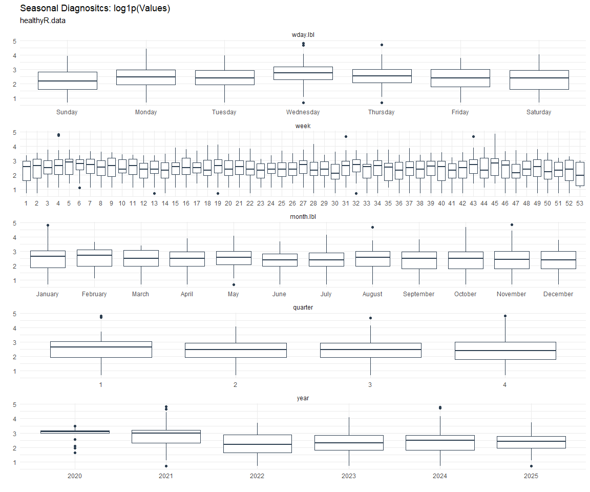

# Time Series Analysis, Modeling and Forecasting of the Healthyverse
Packages
Steven P. Sanderson II, MPH - Date:
2025-10-27

# Introduction

This analysis follows a *Nested Modeltime Workflow* from **`modeltime`**
along with using the **`NNS`** package. I use this to monitor the
downloads of all of my packages:

- [`healthyR`](https://www.spsanderson.com/healthyR/)
- [`healthyR.data`](https://www.spsanderson.com/healthyR.data/)
- [`healthyR.ts`](https://www.spsanderson.com/healthyR.ts/)
- [`healthyR.ai`](https://www.spsanderson.com/healthyR.ai/)
- [`healthyverse`](https://www.spsanderson.com/healthyverse/)
- [`TidyDensity`](https://www.spsanderson.com/TidyDensity/)
- [`tidyAML`](https://www.spsanderson.com/tidyAML/)
- [`RandomWalker`](https://www.spsanderson.com/RandomWalker/)

## Get Data

``` r
glimpse(downloads_tbl)
```

    Rows: 158,206
    Columns: 11
    $ date      <date> 2020-11-23, 2020-11-23, 2020-11-23, 2020-11-23, 2020-11-23,…
    $ time      <Period> 15H 36M 55S, 11H 26M 39S, 23H 34M 44S, 18H 39M 32S, 9H 0M…
    $ date_time <dttm> 2020-11-23 15:36:55, 2020-11-23 11:26:39, 2020-11-23 23:34:…
    $ size      <int> 4858294, 4858294, 4858301, 4858295, 361, 4863722, 4864794, 4…
    $ r_version <chr> NA, "4.0.3", "3.5.3", "3.5.2", NA, NA, NA, NA, NA, NA, NA, N…
    $ r_arch    <chr> NA, "x86_64", "x86_64", "x86_64", NA, NA, NA, NA, NA, NA, NA…
    $ r_os      <chr> NA, "mingw32", "mingw32", "linux-gnu", NA, NA, NA, NA, NA, N…
    $ package   <chr> "healthyR.data", "healthyR.data", "healthyR.data", "healthyR…
    $ version   <chr> "1.0.0", "1.0.0", "1.0.0", "1.0.0", "1.0.0", "1.0.0", "1.0.0…
    $ country   <chr> "US", "US", "US", "GB", "US", "US", "DE", "HK", "JP", "US", …
    $ ip_id     <int> 2069, 2804, 78827, 27595, 90474, 90474, 42435, 74, 7655, 638…

The last day in the data set is 2025-10-25 23:33:03, the file was
birthed on: 2024-08-07 07:35:44.428716, and at report knit time is
1.066796^{4} hours old. Happy analyzing!

Now that we have our data lets take a look at it using the `skimr`
package.

``` r
skim(downloads_tbl)
```

|                                                  |               |
|:-------------------------------------------------|:--------------|
| Name                                             | downloads_tbl |
| Number of rows                                   | 158206        |
| Number of columns                                | 11            |
| \_\_\_\_\_\_\_\_\_\_\_\_\_\_\_\_\_\_\_\_\_\_\_   |               |
| Column type frequency:                           |               |
| character                                        | 6             |
| Date                                             | 1             |
| numeric                                          | 2             |
| POSIXct                                          | 1             |
| Timespan                                         | 1             |
| \_\_\_\_\_\_\_\_\_\_\_\_\_\_\_\_\_\_\_\_\_\_\_\_ |               |
| Group variables                                  | None          |

Data summary

**Variable type: character**

| skim_variable | n_missing | complete_rate | min | max | empty | n_unique | whitespace |
|:--------------|----------:|--------------:|----:|----:|------:|---------:|-----------:|
| r_version     |    115837 |          0.27 |   5 |   5 |     0 |       48 |          0 |
| r_arch        |    115837 |          0.27 |   3 |   7 |     0 |        5 |          0 |
| r_os          |    115837 |          0.27 |   7 |  15 |     0 |       23 |          0 |
| package       |         0 |          1.00 |   7 |  13 |     0 |        8 |          0 |
| version       |         0 |          1.00 |   5 |  17 |     0 |       62 |          0 |
| country       |     14818 |          0.91 |   2 |   2 |     0 |      165 |          0 |

**Variable type: Date**

| skim_variable | n_missing | complete_rate | min | max | median | n_unique |
|:---|---:|---:|:---|:---|:---|---:|
| date | 0 | 1 | 2020-11-23 | 2025-10-25 | 2023-10-12 | 1791 |

**Variable type: numeric**

| skim_variable | n_missing | complete_rate | mean | sd | p0 | p25 | p50 | p75 | p100 | hist |
|:---|---:|---:|---:|---:|---:|---:|---:|---:|---:|:---|
| size | 0 | 1 | 1124715.75 | 1493181.75 | 355 | 18904 | 308449.5 | 2356890 | 5677952 | ▇▁▂▁▁ |
| ip_id | 0 | 1 | 11324.31 | 21937.31 | 1 | 219 | 2928.0 | 11961 | 299146 | ▇▁▁▁▁ |

**Variable type: POSIXct**

| skim_variable | n_missing | complete_rate | min | max | median | n_unique |
|:---|---:|---:|:---|:---|:---|---:|
| date_time | 0 | 1 | 2020-11-23 09:00:41 | 2025-10-25 23:33:03 | 2023-10-12 03:29:42 | 99409 |

**Variable type: Timespan**

| skim_variable | n_missing | complete_rate | min | max | median | n_unique |
|:--------------|----------:|--------------:|----:|----:|-------:|---------:|
| time          |         0 |             1 |   0 |  59 |     14 |       60 |

We can see that the following columns are missing a lot of data and for
us are most likely not useful anyways, so we will drop them
`c(r_version, r_arch, r_os)`

## Plots

Now lets take a look at a time-series plot of the total daily downloads
by package. We will use a log scale and place a vertical line at each
version release for each package.


    [[1]]


    [[2]]


    [[3]]


    [[4]]


    [[5]]


    [[6]]


    [[7]]


    [[8]]


Now lets take a look at some time series decomposition graphs.

    [[1]]


    [[2]]


    [[3]]


    [[4]]


    [[5]]


    [[6]]


    [[7]]


    [[8]]


    [[1]]


    [[2]]


    [[3]]


    [[4]]


    [[5]]


    [[6]]


    [[7]]


    [[8]]


Seasonal Diagnostics:

    [[1]]


    [[2]]


    [[3]]


    [[4]]


    [[5]]




    [[6]]


    [[7]]


    [[8]]


ACF and PACF Diagnostics:

    [[1]]


    [[2]]


    [[3]]


    [[4]]


    [[5]]


    [[6]]


    [[7]]


    [[8]]


## Feature Engineering

Now that we have our basic data and a shot of what it looks like, let’s
add some features to our data which can be very helpful in modeling.
Lets start by making a `tibble` that is aggregated by the day and
package, as we are going to be interested in forecasting the next 4
weeks or 28 days for each package. First lets get our base data.


    Call:
    stats::lm(formula = .formula, data = df)

    Residuals:
        Min      1Q  Median      3Q     Max 
    -147.64  -36.27  -11.05   27.09  816.17 

    Coefficients:
                                                         Estimate Std. Error
    (Intercept)                                        -2.124e+02  6.211e+01
    date                                                1.270e-02  3.292e-03
    lag(value, 1)                                       1.137e-01  2.342e-02
    lag(value, 7)                                       8.993e-02  2.422e-02
    lag(value, 14)                                      7.813e-02  2.423e-02
    lag(value, 21)                                      7.001e-02  2.429e-02
    lag(value, 28)                                      7.399e-02  2.425e-02
    lag(value, 35)                                      6.244e-02  2.433e-02
    lag(value, 42)                                      5.486e-02  2.457e-02
    lag(value, 49)                                      7.143e-02  2.448e-02
    month(date, label = TRUE).L                        -8.260e+00  5.104e+00
    month(date, label = TRUE).Q                         2.238e+00  5.022e+00
    month(date, label = TRUE).C                        -1.602e+01  5.029e+00
    month(date, label = TRUE)^4                        -8.070e+00  5.051e+00
    month(date, label = TRUE)^5                        -9.363e+00  5.032e+00
    month(date, label = TRUE)^6                        -1.453e+00  5.071e+00
    month(date, label = TRUE)^7                        -6.374e+00  4.941e+00
    month(date, label = TRUE)^8                        -5.093e+00  4.880e+00
    month(date, label = TRUE)^9                         2.381e+00  4.849e+00
    month(date, label = TRUE)^10                        8.866e-01  4.850e+00
    month(date, label = TRUE)^11                       -4.218e+00  4.834e+00
    fourier_vec(date, type = "sin", K = 1, period = 7) -1.125e+01  2.248e+00
    fourier_vec(date, type = "cos", K = 1, period = 7)  7.059e+00  2.333e+00
                                                       t value Pr(>|t|)    
    (Intercept)                                         -3.420 0.000642 ***
    date                                                 3.859 0.000118 ***
    lag(value, 1)                                        4.856 1.31e-06 ***
    lag(value, 7)                                        3.714 0.000211 ***
    lag(value, 14)                                       3.224 0.001287 ** 
    lag(value, 21)                                       2.883 0.003992 ** 
    lag(value, 28)                                       3.051 0.002318 ** 
    lag(value, 35)                                       2.566 0.010375 *  
    lag(value, 42)                                       2.233 0.025703 *  
    lag(value, 49)                                       2.917 0.003578 ** 
    month(date, label = TRUE).L                         -1.618 0.105759    
    month(date, label = TRUE).Q                          0.446 0.655863    
    month(date, label = TRUE).C                         -3.186 0.001467 ** 
    month(date, label = TRUE)^4                         -1.598 0.110303    
    month(date, label = TRUE)^5                         -1.861 0.062973 .  
    month(date, label = TRUE)^6                         -0.287 0.774461    
    month(date, label = TRUE)^7                         -1.290 0.197272    
    month(date, label = TRUE)^8                         -1.044 0.296741    
    month(date, label = TRUE)^9                          0.491 0.623474    
    month(date, label = TRUE)^10                         0.183 0.854977    
    month(date, label = TRUE)^11                        -0.873 0.383020    
    fourier_vec(date, type = "sin", K = 1, period = 7)  -5.003 6.21e-07 ***
    fourier_vec(date, type = "cos", K = 1, period = 7)   3.026 0.002517 ** 
    ---
    Signif. codes:  0 '***' 0.001 '**' 0.01 '*' 0.05 '.' 0.1 ' ' 1

    Residual standard error: 59.27 on 1719 degrees of freedom
      (49 observations deleted due to missingness)
    Multiple R-squared:  0.2373,    Adjusted R-squared:  0.2276 
    F-statistic: 24.31 on 22 and 1719 DF,  p-value: < 2.2e-16


## NNS Forecasting

This is something I have been wanting to try for a while. The `NNS`
package is a great package for forecasting time series data.

[NNS GitHub](https://github.com/OVVO-Financial/NNS)

``` r
library(NNS)

data_list <- base_data |>
    select(package, value) |>
    group_split(package)

data_list |>
    imap(
        \(x, idx) {
            obj <- x
            x <- obj |> pull(value) |> tail(7*52)
            train_set_size <- length(x) - 56
            pkg <- obj |> pluck(1) |> unique()
#            sf <- NNS.seas(x, modulo = 7, plot = FALSE)$periods
            seas <- t(
                sapply(
                    1:25, 
                    function(i) c(
                        i,
                        sqrt(
                            mean((
                                NNS.ARMA(x, 
                                         h = 28, 
                                         training.set = train_set_size, 
                                         method = "lin", 
                                         seasonal.factor = i, 
                                         plot=FALSE
                                         ) - tail(x, 28)) ^ 2)))
                    )
                )
            colnames(seas) <- c("Period", "RMSE")
            sf <- seas[which.min(seas[, 2]), 1]
            
            cat(paste0("Package: ", pkg, "\n"))
            NNS.ARMA.optim(
                variable = x,
                h = 28,
                training.set = train_set_size,
                #seasonal.factor = seq(12, 60, 7),
                seasonal.factor = sf,
                pred.int = 0.95,
                plot = TRUE
            )
            title(
                sub = paste0("\n",
                             "Package: ", pkg, " - NNS Optimization")
            )
        }
    )
```

    Package: healthyR
    [1] "CURRNET METHOD: lin"
    [1] "COPY LATEST PARAMETERS DIRECTLY FOR NNS.ARMA() IF ERROR:"
    [1] "NNS.ARMA(... method =  'lin' , seasonal.factor =  c( 25 ) ...)"
    [1] "CURRENT lin OBJECTIVE FUNCTION = 9.1898647091881"
    [1] "BEST method = 'lin' PATH MEMBER = c( 25 )"
    [1] "BEST lin OBJECTIVE FUNCTION = 9.1898647091881"
    [1] "CURRNET METHOD: nonlin"
    [1] "COPY LATEST PARAMETERS DIRECTLY FOR NNS.ARMA() IF ERROR:"
    [1] "NNS.ARMA(... method =  'nonlin' , seasonal.factor =  c( 25 ) ...)"
    [1] "CURRENT nonlin OBJECTIVE FUNCTION = 9.28209673894402"
    [1] "BEST method = 'nonlin' PATH MEMBER = c( 25 )"
    [1] "BEST nonlin OBJECTIVE FUNCTION = 9.28209673894402"
    [1] "CURRNET METHOD: both"
    [1] "COPY LATEST PARAMETERS DIRECTLY FOR NNS.ARMA() IF ERROR:"
    [1] "NNS.ARMA(... method =  'both' , seasonal.factor =  c( 25 ) ...)"
    [1] "CURRENT both OBJECTIVE FUNCTION = 7.52253412050057"
    [1] "BEST method = 'both' PATH MEMBER = c( 25 )"
    [1] "BEST both OBJECTIVE FUNCTION = 7.52253412050057"


    Package: healthyR.ai
    [1] "CURRNET METHOD: lin"
    [1] "COPY LATEST PARAMETERS DIRECTLY FOR NNS.ARMA() IF ERROR:"
    [1] "NNS.ARMA(... method =  'lin' , seasonal.factor =  c( 5 ) ...)"
    [1] "CURRENT lin OBJECTIVE FUNCTION = 61.9383999144114"
    [1] "BEST method = 'lin' PATH MEMBER = c( 5 )"
    [1] "BEST lin OBJECTIVE FUNCTION = 61.9383999144114"
    [1] "CURRNET METHOD: nonlin"
    [1] "COPY LATEST PARAMETERS DIRECTLY FOR NNS.ARMA() IF ERROR:"
    [1] "NNS.ARMA(... method =  'nonlin' , seasonal.factor =  c( 5 ) ...)"
    [1] "CURRENT nonlin OBJECTIVE FUNCTION = 109.346138047789"
    [1] "BEST method = 'nonlin' PATH MEMBER = c( 5 )"
    [1] "BEST nonlin OBJECTIVE FUNCTION = 109.346138047789"
    [1] "CURRNET METHOD: both"
    [1] "COPY LATEST PARAMETERS DIRECTLY FOR NNS.ARMA() IF ERROR:"
    [1] "NNS.ARMA(... method =  'both' , seasonal.factor =  c( 5 ) ...)"
    [1] "CURRENT both OBJECTIVE FUNCTION = 276.615944193795"
    [1] "BEST method = 'both' PATH MEMBER = c( 5 )"
    [1] "BEST both OBJECTIVE FUNCTION = 276.615944193795"


    Package: healthyR.data
    [1] "CURRNET METHOD: lin"
    [1] "COPY LATEST PARAMETERS DIRECTLY FOR NNS.ARMA() IF ERROR:"
    [1] "NNS.ARMA(... method =  'lin' , seasonal.factor =  c( 5 ) ...)"
    [1] "CURRENT lin OBJECTIVE FUNCTION = 23.509900795053"
    [1] "BEST method = 'lin' PATH MEMBER = c( 5 )"
    [1] "BEST lin OBJECTIVE FUNCTION = 23.509900795053"
    [1] "CURRNET METHOD: nonlin"
    [1] "COPY LATEST PARAMETERS DIRECTLY FOR NNS.ARMA() IF ERROR:"
    [1] "NNS.ARMA(... method =  'nonlin' , seasonal.factor =  c( 5 ) ...)"
    [1] "CURRENT nonlin OBJECTIVE FUNCTION = 12.7693929962987"
    [1] "BEST method = 'nonlin' PATH MEMBER = c( 5 )"
    [1] "BEST nonlin OBJECTIVE FUNCTION = 12.7693929962987"
    [1] "CURRNET METHOD: both"
    [1] "COPY LATEST PARAMETERS DIRECTLY FOR NNS.ARMA() IF ERROR:"
    [1] "NNS.ARMA(... method =  'both' , seasonal.factor =  c( 5 ) ...)"
    [1] "CURRENT both OBJECTIVE FUNCTION = 26.2709660501601"
    [1] "BEST method = 'both' PATH MEMBER = c( 5 )"
    [1] "BEST both OBJECTIVE FUNCTION = 26.2709660501601"


    Package: healthyR.ts
    [1] "CURRNET METHOD: lin"
    [1] "COPY LATEST PARAMETERS DIRECTLY FOR NNS.ARMA() IF ERROR:"
    [1] "NNS.ARMA(... method =  'lin' , seasonal.factor =  c( 11 ) ...)"
    [1] "CURRENT lin OBJECTIVE FUNCTION = 8.66954072644088"
    [1] "BEST method = 'lin' PATH MEMBER = c( 11 )"
    [1] "BEST lin OBJECTIVE FUNCTION = 8.66954072644088"
    [1] "CURRNET METHOD: nonlin"
    [1] "COPY LATEST PARAMETERS DIRECTLY FOR NNS.ARMA() IF ERROR:"
    [1] "NNS.ARMA(... method =  'nonlin' , seasonal.factor =  c( 11 ) ...)"
    [1] "CURRENT nonlin OBJECTIVE FUNCTION = 10.6922750134523"
    [1] "BEST method = 'nonlin' PATH MEMBER = c( 11 )"
    [1] "BEST nonlin OBJECTIVE FUNCTION = 10.6922750134523"
    [1] "CURRNET METHOD: both"
    [1] "COPY LATEST PARAMETERS DIRECTLY FOR NNS.ARMA() IF ERROR:"
    [1] "NNS.ARMA(... method =  'both' , seasonal.factor =  c( 11 ) ...)"
    [1] "CURRENT both OBJECTIVE FUNCTION = 7.62299165686105"
    [1] "BEST method = 'both' PATH MEMBER = c( 11 )"
    [1] "BEST both OBJECTIVE FUNCTION = 7.62299165686105"


    Package: healthyverse
    [1] "CURRNET METHOD: lin"
    [1] "COPY LATEST PARAMETERS DIRECTLY FOR NNS.ARMA() IF ERROR:"
    [1] "NNS.ARMA(... method =  'lin' , seasonal.factor =  c( 6 ) ...)"
    [1] "CURRENT lin OBJECTIVE FUNCTION = 11.3765940812377"
    [1] "BEST method = 'lin' PATH MEMBER = c( 6 )"
    [1] "BEST lin OBJECTIVE FUNCTION = 11.3765940812377"
    [1] "CURRNET METHOD: nonlin"
    [1] "COPY LATEST PARAMETERS DIRECTLY FOR NNS.ARMA() IF ERROR:"
    [1] "NNS.ARMA(... method =  'nonlin' , seasonal.factor =  c( 6 ) ...)"
    [1] "CURRENT nonlin OBJECTIVE FUNCTION = 9.53334602549729"
    [1] "BEST method = 'nonlin' PATH MEMBER = c( 6 )"
    [1] "BEST nonlin OBJECTIVE FUNCTION = 9.53334602549729"
    [1] "CURRNET METHOD: both"
    [1] "COPY LATEST PARAMETERS DIRECTLY FOR NNS.ARMA() IF ERROR:"
    [1] "NNS.ARMA(... method =  'both' , seasonal.factor =  c( 6 ) ...)"
    [1] "CURRENT both OBJECTIVE FUNCTION = 13.5765172484858"
    [1] "BEST method = 'both' PATH MEMBER = c( 6 )"
    [1] "BEST both OBJECTIVE FUNCTION = 13.5765172484858"


    Package: RandomWalker
    [1] "CURRNET METHOD: lin"
    [1] "COPY LATEST PARAMETERS DIRECTLY FOR NNS.ARMA() IF ERROR:"
    [1] "NNS.ARMA(... method =  'lin' , seasonal.factor =  c( 13 ) ...)"
    [1] "CURRENT lin OBJECTIVE FUNCTION = 11.2023386174711"
    [1] "BEST method = 'lin' PATH MEMBER = c( 13 )"
    [1] "BEST lin OBJECTIVE FUNCTION = 11.2023386174711"
    [1] "CURRNET METHOD: nonlin"
    [1] "COPY LATEST PARAMETERS DIRECTLY FOR NNS.ARMA() IF ERROR:"
    [1] "NNS.ARMA(... method =  'nonlin' , seasonal.factor =  c( 13 ) ...)"
    [1] "CURRENT nonlin OBJECTIVE FUNCTION = 5.23799734480568"
    [1] "BEST method = 'nonlin' PATH MEMBER = c( 13 )"
    [1] "BEST nonlin OBJECTIVE FUNCTION = 5.23799734480568"
    [1] "CURRNET METHOD: both"
    [1] "COPY LATEST PARAMETERS DIRECTLY FOR NNS.ARMA() IF ERROR:"
    [1] "NNS.ARMA(... method =  'both' , seasonal.factor =  c( 13 ) ...)"
    [1] "CURRENT both OBJECTIVE FUNCTION = 6.15865109736973"
    [1] "BEST method = 'both' PATH MEMBER = c( 13 )"
    [1] "BEST both OBJECTIVE FUNCTION = 6.15865109736973"


    Package: tidyAML
    [1] "CURRNET METHOD: lin"
    [1] "COPY LATEST PARAMETERS DIRECTLY FOR NNS.ARMA() IF ERROR:"
    [1] "NNS.ARMA(... method =  'lin' , seasonal.factor =  c( 18 ) ...)"
    [1] "CURRENT lin OBJECTIVE FUNCTION = 47.6655988046034"
    [1] "BEST method = 'lin' PATH MEMBER = c( 18 )"
    [1] "BEST lin OBJECTIVE FUNCTION = 47.6655988046034"
    [1] "CURRNET METHOD: nonlin"
    [1] "COPY LATEST PARAMETERS DIRECTLY FOR NNS.ARMA() IF ERROR:"
    [1] "NNS.ARMA(... method =  'nonlin' , seasonal.factor =  c( 18 ) ...)"
    [1] "CURRENT nonlin OBJECTIVE FUNCTION = 27.1390295803235"
    [1] "BEST method = 'nonlin' PATH MEMBER = c( 18 )"
    [1] "BEST nonlin OBJECTIVE FUNCTION = 27.1390295803235"
    [1] "CURRNET METHOD: both"
    [1] "COPY LATEST PARAMETERS DIRECTLY FOR NNS.ARMA() IF ERROR:"
    [1] "NNS.ARMA(... method =  'both' , seasonal.factor =  c( 18 ) ...)"
    [1] "CURRENT both OBJECTIVE FUNCTION = 37.3054313320506"
    [1] "BEST method = 'both' PATH MEMBER = c( 18 )"
    [1] "BEST both OBJECTIVE FUNCTION = 37.3054313320506"


    Package: TidyDensity
    [1] "CURRNET METHOD: lin"
    [1] "COPY LATEST PARAMETERS DIRECTLY FOR NNS.ARMA() IF ERROR:"
    [1] "NNS.ARMA(... method =  'lin' , seasonal.factor =  c( 25 ) ...)"
    [1] "CURRENT lin OBJECTIVE FUNCTION = 22.2448051647384"
    [1] "BEST method = 'lin' PATH MEMBER = c( 25 )"
    [1] "BEST lin OBJECTIVE FUNCTION = 22.2448051647384"
    [1] "CURRNET METHOD: nonlin"
    [1] "COPY LATEST PARAMETERS DIRECTLY FOR NNS.ARMA() IF ERROR:"
    [1] "NNS.ARMA(... method =  'nonlin' , seasonal.factor =  c( 25 ) ...)"
    [1] "CURRENT nonlin OBJECTIVE FUNCTION = 8.20129576829426"
    [1] "BEST method = 'nonlin' PATH MEMBER = c( 25 )"
    [1] "BEST nonlin OBJECTIVE FUNCTION = 8.20129576829426"
    [1] "CURRNET METHOD: both"
    [1] "COPY LATEST PARAMETERS DIRECTLY FOR NNS.ARMA() IF ERROR:"
    [1] "NNS.ARMA(... method =  'both' , seasonal.factor =  c( 25 ) ...)"
    [1] "CURRENT both OBJECTIVE FUNCTION = 12.3553112584779"
    [1] "BEST method = 'both' PATH MEMBER = c( 25 )"
    [1] "BEST both OBJECTIVE FUNCTION = 12.3553112584779"


    [[1]]
    NULL

    [[2]]
    NULL

    [[3]]
    NULL

    [[4]]
    NULL

    [[5]]
    NULL

    [[6]]
    NULL

    [[7]]
    NULL

    [[8]]
    NULL

## Pre-Processing

Now we are going to do some basic pre-processing.

``` r
data_padded_tbl <- base_data %>%
  pad_by_time(
    .date_var  = date,
    .pad_value = 0
  )

# Get log interval and standardization parameters
log_params  <- liv(data_padded_tbl$value, limit_lower = 0, offset = 1, silent = TRUE)
limit_lower <- log_params$limit_lower
limit_upper <- log_params$limit_upper
offset      <- log_params$offset

data_liv_tbl <- data_padded_tbl %>%
  # Get log interval transform
  mutate(value_trans = liv(value, limit_lower = 0, offset = 1, silent = TRUE)$log_scaled)

# Get Standardization Params
std_params <- standard_vec(data_liv_tbl$value_trans, silent = TRUE)
std_mean   <- std_params$mean
std_sd     <- std_params$sd

data_transformed_tbl <- data_liv_tbl %>%
  group_by(package) %>%
  # get standardization
  mutate(value_trans = standard_vec(value_trans, silent = TRUE)$standard_scaled) %>%
  tk_augment_fourier(
    .date_var = date,
    .periods  = c(7, 14, 30, 90, 180),
    .K        = 2
  ) %>%
  tk_augment_timeseries_signature(
    .date_var = date
  ) %>%
  ungroup() %>%
  select(-c(value, -year.iso))
```

Since this is panel data we can follow one of two different modeling
strategies. We can search for a global model in the panel data or we can
use nested forecasting finding the best model for each of the time
series. Since we only have 5 panels, we will use nested forecasting.

To do this we will use the `nest_timeseries` and
`split_nested_timeseries` functions to create a nested `tibble`.

``` r
horizon <- 4*7

nested_data_tbl <- data_transformed_tbl %>%

    # 0. Filter out column where package is NA
    filter(!is.na(package)) %>%
    
    # 1. Extending: We'll predict n days into the future.
    extend_timeseries(
        .id_var        = package,
        .date_var      = date,
        .length_future = horizon
    ) %>%
    
    # 2. Nesting: We'll group by id, and create a future dataset
    #    that forecasts n days of extended data and
    #    an actual dataset that contains n*2 days
    nest_timeseries(
        .id_var        = package,
        .length_future = horizon
        #.length_actual = horizon*2
    ) %>%
    
   # 3. Splitting: We'll take the actual data and create splits
   #    for accuracy and confidence interval estimation of n das (test)
   #    and the rest is training data
    split_nested_timeseries(
        .length_test = horizon
    )

nested_data_tbl
```

    # A tibble: 8 × 4
      package       .actual_data          .future_data       .splits          
      <fct>         <list>                <list>             <list>           
    1 healthyR.data <tibble [1,783 × 50]> <tibble [28 × 50]> <split [1755|28]>
    2 healthyR      <tibble [1,774 × 50]> <tibble [28 × 50]> <split [1746|28]>
    3 healthyR.ts   <tibble [1,720 × 50]> <tibble [28 × 50]> <split [1692|28]>
    4 healthyverse  <tibble [1,691 × 50]> <tibble [28 × 50]> <split [1663|28]>
    5 healthyR.ai   <tibble [1,516 × 50]> <tibble [28 × 50]> <split [1488|28]>
    6 TidyDensity   <tibble [1,367 × 50]> <tibble [28 × 50]> <split [1339|28]>
    7 tidyAML       <tibble [974 × 50]>   <tibble [28 × 50]> <split [946|28]> 
    8 RandomWalker  <tibble [397 × 50]>   <tibble [28 × 50]> <split [369|28]> 

Now it is time to make some recipes and models using the modeltime
workflow.

## Modeltime Workflow

### Recipe Object

``` r
recipe_base <- recipe(
  value_trans ~ .
  , data = extract_nested_test_split(nested_data_tbl)
  )

recipe_base

recipe_date <- recipe(
  value_trans ~ date
  , data = extract_nested_test_split(nested_data_tbl)
  )
```

### Models

``` r
# Models ------------------------------------------------------------------

# Auto ARIMA --------------------------------------------------------------

model_spec_arima_no_boost <- arima_reg() %>%
  set_engine(engine = "auto_arima")

wflw_auto_arima <- workflow() %>%
  add_recipe(recipe = recipe_date) %>%
  add_model(model_spec_arima_no_boost)

# NNETAR ------------------------------------------------------------------

model_spec_nnetar <- nnetar_reg(
  mode              = "regression"
  , seasonal_period = "auto"
) %>%
  set_engine("nnetar")

wflw_nnetar <- workflow() %>%
  add_recipe(recipe = recipe_base) %>%
  add_model(model_spec_nnetar)

# TSLM --------------------------------------------------------------------

model_spec_lm <- linear_reg() %>%
  set_engine("lm")

wflw_lm <- workflow() %>%
  add_recipe(recipe = recipe_base) %>%
  add_model(model_spec_lm)

# MARS --------------------------------------------------------------------

model_spec_mars <- mars(mode = "regression") %>%
  set_engine("earth")

wflw_mars <- workflow() %>%
  add_recipe(recipe = recipe_date) %>%
  add_model(model_spec_mars)
```

### Nested Modeltime Tables

``` r
nested_modeltime_tbl <- modeltime_nested_fit(
  # Nested Data
  nested_data = nested_data_tbl,
   control = control_nested_fit(
     verbose = TRUE,
     allow_par = FALSE
   ),
  # Add workflows
  wflw_auto_arima,
  wflw_lm,
  wflw_mars,
  wflw_nnetar
)
```

``` r
nested_modeltime_tbl <- nested_modeltime_tbl[!is.na(nested_modeltime_tbl$package),]
```

### Model Accuracy

``` r
nested_modeltime_tbl %>%
  extract_nested_test_accuracy() %>%
  filter(!is.na(package)) %>%
  knitr::kable()
```

| package | .model_id | .model_desc | .type | mae | mape | mase | smape | rmse | rsq |
|:---|---:|:---|:---|---:|---:|---:|---:|---:|---:|
| healthyR.data | 1 | ARIMA | Test | 0.6436886 | 94.47309 | 0.6393303 | 165.4753 | 0.7882278 | 0.2405576 |
| healthyR.data | 2 | LM | Test | 0.7833859 | 153.41969 | 0.7780817 | 147.7485 | 0.9242091 | 0.0139763 |
| healthyR.data | 3 | NULL | NA | NA | NA | NA | NA | NA | NA |
| healthyR.data | 4 | NNAR | Test | 0.8837007 | 183.27805 | 0.8777174 | 155.5024 | 1.0375537 | 0.0000426 |
| healthyR | 1 | ARIMA | Test | 0.5011290 | 132.80252 | 0.6567580 | 169.9441 | 0.6365772 | 0.0713766 |
| healthyR | 2 | LM | Test | 0.6818219 | 219.95639 | 0.8935661 | 142.9517 | 0.8824744 | 0.0089806 |
| healthyR | 3 | NULL | NA | NA | NA | NA | NA | NA | NA |
| healthyR | 4 | NNAR | Test | 0.7115453 | 225.76004 | 0.9325204 | 155.6815 | 0.9108007 | 0.0873075 |
| healthyR.ts | 1 | ARIMA | Test | 0.5211773 | 118.91842 | 0.6368688 | 175.9967 | 0.6381459 | 0.0097398 |
| healthyR.ts | 2 | LM | Test | 0.6855425 | 173.27108 | 0.8377201 | 155.5374 | 0.8467883 | 0.0293037 |
| healthyR.ts | 3 | NULL | NA | NA | NA | NA | NA | NA | NA |
| healthyR.ts | 4 | NNAR | Test | 0.7804233 | 249.36931 | 0.9536626 | 147.0591 | 0.9709248 | 0.0381005 |
| healthyverse | 1 | ARIMA | Test | 0.6150208 | 114.54790 | 0.7760220 | 159.7456 | 0.7063264 | 0.0238237 |
| healthyverse | 2 | LM | Test | 0.6349238 | 161.44299 | 0.8011352 | 146.7863 | 0.7275086 | 0.1047894 |
| healthyverse | 3 | NULL | NA | NA | NA | NA | NA | NA | NA |
| healthyverse | 4 | NNAR | Test | 0.5870984 | 144.77372 | 0.7407900 | 142.2079 | 0.6977900 | 0.1004928 |
| healthyR.ai | 1 | ARIMA | Test | 0.4473379 | 97.62439 | 0.8341318 | 174.7105 | 0.5493083 | 0.0001306 |
| healthyR.ai | 2 | LM | Test | 0.6029382 | 156.58363 | 1.1242729 | 157.1099 | 0.7563173 | 0.0215822 |
| healthyR.ai | 3 | NULL | NA | NA | NA | NA | NA | NA | NA |
| healthyR.ai | 4 | NNAR | Test | 0.6134179 | 162.00350 | 1.1438140 | 163.5500 | 0.7575012 | 0.0854751 |
| TidyDensity | 1 | ARIMA | Test | 1.1831907 | 389.22342 | 0.9008612 | 120.4551 | 1.3937511 | 0.0141460 |
| TidyDensity | 2 | LM | Test | 1.3767036 | 183.97798 | 1.0481986 | 161.6007 | 1.7381284 | 0.0602170 |
| TidyDensity | 3 | NULL | NA | NA | NA | NA | NA | NA | NA |
| TidyDensity | 4 | NNAR | Test | 1.2378700 | 236.70010 | 0.9424932 | 141.7230 | 1.5294635 | 0.1247467 |
| tidyAML | 1 | ARIMA | Test | 0.9241160 | 94.47236 | 0.8108820 | 161.7994 | 1.3581176 | 0.0007033 |
| tidyAML | 2 | LM | Test | 1.0363456 | 163.09402 | 0.9093598 | 155.3520 | 1.4975617 | 0.0001682 |
| tidyAML | 3 | NULL | NA | NA | NA | NA | NA | NA | NA |
| tidyAML | 4 | NNAR | Test | 0.9787494 | 145.22098 | 0.8588210 | 160.4573 | 1.4120972 | 0.0000967 |
| RandomWalker | 1 | ARIMA | Test | 0.6776342 | 101.08909 | 0.5587273 | 145.3103 | 0.8143168 | 0.2005901 |
| RandomWalker | 2 | LM | Test | 0.7712310 | 103.95659 | 0.6359004 | 158.0458 | 0.9883801 | 0.0000950 |
| RandomWalker | 3 | NULL | NA | NA | NA | NA | NA | NA | NA |
| RandomWalker | 4 | NNAR | Test | 0.8500494 | 145.90427 | 0.7008882 | 137.1955 | 1.0482718 | 0.0699109 |

### Plot Models

``` r
nested_modeltime_tbl %>%
  extract_nested_test_forecast() %>%
  group_by(package) %>%
  filter_by_time(.date_var = .index, .start_date = max(.index) - 60) %>%
  ungroup() %>%
  plot_modeltime_forecast(
    .interactive = FALSE,
    .conf_interval_show  = FALSE,
    .facet_scales = "free"
  ) +
  theme_minimal() +
  facet_wrap(~ package, nrow = 3) +
  theme(legend.position = "bottom")
```


### Best Model

``` r
best_nested_modeltime_tbl <- nested_modeltime_tbl %>%
  modeltime_nested_select_best(
    metric = "rmse",
    minimize = TRUE,
    filter_test_forecasts = TRUE
  )

best_nested_modeltime_tbl %>%
  extract_nested_best_model_report()
```

    # Nested Modeltime Table
      

    # A tibble: 8 × 10
      package      .model_id .model_desc .type   mae  mape  mase smape  rmse     rsq
      <fct>            <int> <chr>       <chr> <dbl> <dbl> <dbl> <dbl> <dbl>   <dbl>
    1 healthyR.da…         1 ARIMA       Test  0.644  94.5 0.639  165. 0.788 2.41e-1
    2 healthyR             1 ARIMA       Test  0.501 133.  0.657  170. 0.637 7.14e-2
    3 healthyR.ts          1 ARIMA       Test  0.521 119.  0.637  176. 0.638 9.74e-3
    4 healthyverse         4 NNAR        Test  0.587 145.  0.741  142. 0.698 1.00e-1
    5 healthyR.ai          1 ARIMA       Test  0.447  97.6 0.834  175. 0.549 1.31e-4
    6 TidyDensity          1 ARIMA       Test  1.18  389.  0.901  120. 1.39  1.41e-2
    7 tidyAML              1 ARIMA       Test  0.924  94.5 0.811  162. 1.36  7.03e-4
    8 RandomWalker         1 ARIMA       Test  0.678 101.  0.559  145. 0.814 2.01e-1

``` r
best_nested_modeltime_tbl %>%
  extract_nested_test_forecast() %>%
  #filter(!is.na(.model_id)) %>%
  group_by(package) %>%
  filter_by_time(.date_var = .index, .start_date = max(.index) - 60) %>%
  ungroup() %>%
  plot_modeltime_forecast(
    .interactive = FALSE,
    .conf_interval_alpha = 0.2,
    .facet_scales = "free"
  ) +
  facet_wrap(~ package, nrow = 3) +
  theme_minimal() +
  theme(legend.position = "bottom")
```


## Refitting and Future Forecast

Now that we have the best models, we can make our future forecasts.

``` r
nested_modeltime_refit_tbl <- best_nested_modeltime_tbl %>%
    modeltime_nested_refit(
        control = control_nested_refit(verbose = TRUE)
    )
```

``` r
nested_modeltime_refit_tbl
```

    # Nested Modeltime Table
      

    # A tibble: 8 × 5
      package       .actual_data .future_data .splits           .modeltime_tables 
      <fct>         <list>       <list>       <list>            <list>            
    1 healthyR.data <tibble>     <tibble>     <split [1755|28]> <mdl_tm_t [1 × 5]>
    2 healthyR      <tibble>     <tibble>     <split [1746|28]> <mdl_tm_t [1 × 5]>
    3 healthyR.ts   <tibble>     <tibble>     <split [1692|28]> <mdl_tm_t [1 × 5]>
    4 healthyverse  <tibble>     <tibble>     <split [1663|28]> <mdl_tm_t [1 × 5]>
    5 healthyR.ai   <tibble>     <tibble>     <split [1488|28]> <mdl_tm_t [1 × 5]>
    6 TidyDensity   <tibble>     <tibble>     <split [1339|28]> <mdl_tm_t [1 × 5]>
    7 tidyAML       <tibble>     <tibble>     <split [946|28]>  <mdl_tm_t [1 × 5]>
    8 RandomWalker  <tibble>     <tibble>     <split [369|28]>  <mdl_tm_t [1 × 5]>

``` r
nested_modeltime_refit_tbl %>%
  extract_nested_future_forecast() %>%
  group_by(package) %>%
  mutate(across(.value:.conf_hi, .fns = ~ standard_inv_vec(
    x    = .,
    mean = std_mean,
    sd   = std_sd
  )$standard_inverse_value)) %>%
  mutate(across(.value:.conf_hi, .fns = ~ liiv(
    x = .,
    limit_lower = limit_lower,
    limit_upper = limit_upper,
    offset      = offset
  )$rescaled_v)) %>%
  filter_by_time(.date_var = .index, .start_date = max(.index) - 60) %>%
  ungroup() %>%
  plot_modeltime_forecast(
    .interactive = FALSE,
    .conf_interval_alpha = 0.2,
    .facet_scales = "free"
  ) +
  facet_wrap(~ package, nrow = 3) +
  theme_minimal() +
  theme(legend.position = "bottom")
```


