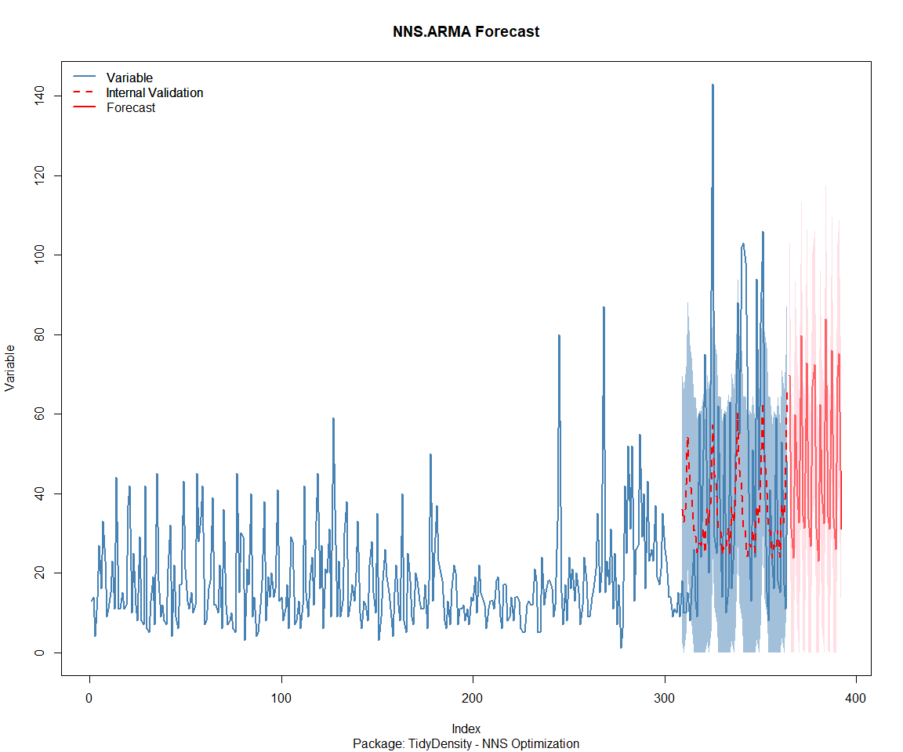

Time Series Analysis and Nested Modeling of the Healthyverse Packages
================
Steven P. Sanderson II, MPH - Date:
16 July, 2025

This analysis follows a *Nested Modeltime Workflow*.

## Get Data

``` r
glimpse(downloads_tbl)
```

    ## Rows: 145,648
    ## Columns: 11
    ## $ date      <date> 2020-11-23, 2020-11-23, 2020-11-23, 2020-11-23, 2020-11-23,…
    ## $ time      <Period> 15H 36M 55S, 11H 26M 39S, 23H 34M 44S, 18H 39M 32S, 9H 0M…
    ## $ date_time <dttm> 2020-11-23 15:36:55, 2020-11-23 11:26:39, 2020-11-23 23:34:…
    ## $ size      <int> 4858294, 4858294, 4858301, 4858295, 361, 4863722, 4864794, 4…
    ## $ r_version <chr> NA, "4.0.3", "3.5.3", "3.5.2", NA, NA, NA, NA, NA, NA, NA, N…
    ## $ r_arch    <chr> NA, "x86_64", "x86_64", "x86_64", NA, NA, NA, NA, NA, NA, NA…
    ## $ r_os      <chr> NA, "mingw32", "mingw32", "linux-gnu", NA, NA, NA, NA, NA, N…
    ## $ package   <chr> "healthyR.data", "healthyR.data", "healthyR.data", "healthyR…
    ## $ version   <chr> "1.0.0", "1.0.0", "1.0.0", "1.0.0", "1.0.0", "1.0.0", "1.0.0…
    ## $ country   <chr> "US", "US", "US", "GB", "US", "US", "DE", "HK", "JP", "US", …
    ## $ ip_id     <int> 2069, 2804, 78827, 27595, 90474, 90474, 42435, 74, 7655, 638…

The last day in the data set is 2025-07-14 22:37:51, the file was
birthed on: 2024-08-07 07:35:44.428716, and at report knit time is
-8195.04 hours old. Happy analyzing!

Now that we have our data lets take a look at it using the `skimr`
package.

``` r
skim(downloads_tbl)
```

|                                                  |               |
|:-------------------------------------------------|:--------------|
| Name                                             | downloads_tbl |
| Number of rows                                   | 145648        |
| Number of columns                                | 11            |
| \_\_\_\_\_\_\_\_\_\_\_\_\_\_\_\_\_\_\_\_\_\_\_   |               |
| Column type frequency:                           |               |
| character                                        | 6             |
| Date                                             | 1             |
| numeric                                          | 2             |
| POSIXct                                          | 1             |
| Timespan                                         | 1             |
| \_\_\_\_\_\_\_\_\_\_\_\_\_\_\_\_\_\_\_\_\_\_\_\_ |               |
| Group variables                                  | None          |

Data summary

**Variable type: character**

| skim_variable | n_missing | complete_rate | min | max | empty | n_unique | whitespace |
|:--------------|----------:|--------------:|----:|----:|------:|---------:|-----------:|
| r_version     |    105277 |          0.28 |   5 |   5 |     0 |       48 |          0 |
| r_arch        |    105277 |          0.28 |   3 |   7 |     0 |        5 |          0 |
| r_os          |    105277 |          0.28 |   7 |  15 |     0 |       23 |          0 |
| package       |         0 |          1.00 |   7 |  13 |     0 |        8 |          0 |
| version       |         0 |          1.00 |   5 |  17 |     0 |       60 |          0 |
| country       |     12305 |          0.92 |   2 |   2 |     0 |      163 |          0 |

**Variable type: Date**

| skim_variable | n_missing | complete_rate | min | max | median | n_unique |
|:---|---:|---:|:---|:---|:---|---:|
| date | 0 | 1 | 2020-11-23 | 2025-07-14 | 2023-07-24 | 1695 |

**Variable type: numeric**

| skim_variable | n_missing | complete_rate | mean | sd | p0 | p25 | p50 | p75 | p100 | hist |
|:---|---:|---:|---:|---:|---:|---:|---:|---:|---:|:---|
| size | 0 | 1 | 1131459.40 | 1512245.52 | 355 | 14701 | 293463.5 | 2367666.00 | 5677952 | ▇▁▂▁▁ |
| ip_id | 0 | 1 | 10474.51 | 18607.08 | 1 | 288 | 3045.0 | 11843.25 | 209747 | ▇▁▁▁▁ |

**Variable type: POSIXct**

| skim_variable | n_missing | complete_rate | min | max | median | n_unique |
|:---|---:|---:|:---|:---|:---|---:|
| date_time | 0 | 1 | 2020-11-23 09:00:41 | 2025-07-14 22:37:51 | 2023-07-24 09:43:36 | 89557 |

**Variable type: Timespan**

| skim_variable | n_missing | complete_rate | min | max | median | n_unique |
|:--------------|----------:|--------------:|----:|----:|-------:|---------:|
| time          |         0 |             1 |   0 |  59 |     43 |       60 |

We can see that the following columns are missing a lot of data and for
us are most likely not useful anyways, so we will drop them
`c(r_version, r_arch, r_os)`

## Plots

Now lets take a look at a time-series plot of the total daily downloads
by package. We will use a log scale and place a vertical line at each
version release for each package.

<!-- --><!-- -->

Now lets take a look at some time series decomposition graphs.

<!-- --><!-- --><!-- --><!-- -->

## Feature Engineering

Now that we have our basic data and a shot of what it looks like, let’s
add some features to our data which can be very helpful in modeling.
Lets start by making a `tibble` that is aggregated by the day and
package, as we are going to be interested in forecasting the next 4
weeks or 28 days for each package. First lets get our base data.

    ## 
    ## Call:
    ## stats::lm(formula = .formula, data = df)
    ## 
    ## Residuals:
    ##     Min      1Q  Median      3Q     Max 
    ## -148.00  -36.02  -11.13   26.83  816.56 
    ## 
    ## Coefficients:
    ##                                                      Estimate Std. Error
    ## (Intercept)                                        -1.783e+02  6.535e+01
    ## date                                                1.097e-02  3.459e-03
    ## lag(value, 1)                                       1.023e-01  2.407e-02
    ## lag(value, 7)                                       9.425e-02  2.492e-02
    ## lag(value, 14)                                      8.564e-02  2.492e-02
    ## lag(value, 21)                                      6.307e-02  2.496e-02
    ## lag(value, 28)                                      7.074e-02  2.496e-02
    ## lag(value, 35)                                      6.938e-02  2.502e-02
    ## lag(value, 42)                                      5.525e-02  2.514e-02
    ## lag(value, 49)                                      6.434e-02  2.503e-02
    ## month(date, label = TRUE).L                        -9.716e+00  5.108e+00
    ## month(date, label = TRUE).Q                         3.200e+00  5.043e+00
    ## month(date, label = TRUE).C                        -1.333e+01  5.123e+00
    ## month(date, label = TRUE)^4                        -6.723e+00  5.099e+00
    ## month(date, label = TRUE)^5                        -1.125e+01  5.100e+00
    ## month(date, label = TRUE)^6                        -4.271e+00  5.151e+00
    ## month(date, label = TRUE)^7                        -7.276e+00  5.056e+00
    ## month(date, label = TRUE)^8                        -2.879e+00  5.043e+00
    ## month(date, label = TRUE)^9                         5.435e+00  5.030e+00
    ## month(date, label = TRUE)^10                        2.546e+00  5.042e+00
    ## month(date, label = TRUE)^11                       -4.022e+00  4.983e+00
    ## fourier_vec(date, type = "sin", K = 1, period = 7) -1.186e+01  2.302e+00
    ## fourier_vec(date, type = "cos", K = 1, period = 7)  8.297e+00  2.420e+00
    ##                                                    t value Pr(>|t|)    
    ## (Intercept)                                         -2.728 0.006441 ** 
    ## date                                                 3.170 0.001555 ** 
    ## lag(value, 1)                                        4.251 2.25e-05 ***
    ## lag(value, 7)                                        3.782 0.000161 ***
    ## lag(value, 14)                                       3.436 0.000605 ***
    ## lag(value, 21)                                       2.527 0.011587 *  
    ## lag(value, 28)                                       2.835 0.004642 ** 
    ## lag(value, 35)                                       2.773 0.005614 ** 
    ## lag(value, 42)                                       2.197 0.028130 *  
    ## lag(value, 49)                                       2.571 0.010228 *  
    ## month(date, label = TRUE).L                         -1.902 0.057321 .  
    ## month(date, label = TRUE).Q                          0.635 0.525825    
    ## month(date, label = TRUE).C                         -2.602 0.009363 ** 
    ## month(date, label = TRUE)^4                         -1.319 0.187501    
    ## month(date, label = TRUE)^5                         -2.205 0.027588 *  
    ## month(date, label = TRUE)^6                         -0.829 0.407115    
    ## month(date, label = TRUE)^7                         -1.439 0.150312    
    ## month(date, label = TRUE)^8                         -0.571 0.568131    
    ## month(date, label = TRUE)^9                          1.081 0.280016    
    ## month(date, label = TRUE)^10                         0.505 0.613642    
    ## month(date, label = TRUE)^11                        -0.807 0.419766    
    ## fourier_vec(date, type = "sin", K = 1, period = 7)  -5.153 2.87e-07 ***
    ## fourier_vec(date, type = "cos", K = 1, period = 7)   3.428 0.000623 ***
    ## ---
    ## Signif. codes:  0 '***' 0.001 '**' 0.01 '*' 0.05 '.' 0.1 ' ' 1
    ## 
    ## Residual standard error: 58.72 on 1623 degrees of freedom
    ##   (49 observations deleted due to missingness)
    ## Multiple R-squared:  0.2371, Adjusted R-squared:  0.2268 
    ## F-statistic: 22.93 on 22 and 1623 DF,  p-value: < 2.2e-16

<!-- -->

## NNS Forecasting

This is something I have been wanting to try for a while. The `NNS`
package is a great package for forecasting time series data.

[NNS GitHub](https://github.com/OVVO-Financial/NNS)

``` r
library(NNS)

data_list <- base_data |>
    select(package, value) |>
    group_split(package)

data_list |>
    imap(
        \(x, idx) {
            obj <- x
            x <- obj |> pull(value) |> tail(7*52)
            train_set_size <- length(x) - 56
            pkg <- obj |> pluck(1) |> unique()
#            sf <- NNS.seas(x, modulo = 7, plot = FALSE)$periods
            seas <- t(
                sapply(
                    1:25, 
                    function(i) c(
                        i,
                        sqrt(
                            mean((
                                NNS.ARMA(x, 
                                         h = 28, 
                                         training.set = train_set_size, 
                                         method = "lin", 
                                         seasonal.factor = i, 
                                         plot=FALSE
                                         ) - tail(AirPassengers, 44)) ^ 2)))
                    )
                )
            colnames(seas) <- c("Period", "RMSE")
            sf <- seas[which.min(seas[, 2]), 1]
            
            cat(paste0("Package: ", pkg, "\n"))
            NNS.ARMA.optim(
                variable = x,
                h = 28,
                training.set = train_set_size,
                #seasonal.factor = seq(12, 60, 7),
                seasonal.factor = sf,
                pred.int = 0.95,
                plot = TRUE
            )
            title(
                sub = paste0("\n",
                             "Package: ", pkg, " - NNS Optimization")
            )
        }
    )
```

    ## Package: healthyR
    ## [1] "CURRNET METHOD: lin"
    ## [1] "COPY LATEST PARAMETERS DIRECTLY FOR NNS.ARMA() IF ERROR:"
    ## [1] "NNS.ARMA(... method =  'lin' , seasonal.factor =  c( 20 ) ...)"
    ## [1] "CURRENT lin OBJECTIVE FUNCTION = 19.081491273446"
    ## [1] "BEST method = 'lin' PATH MEMBER = c( 20 )"
    ## [1] "BEST lin OBJECTIVE FUNCTION = 19.081491273446"
    ## [1] "CURRNET METHOD: nonlin"
    ## [1] "COPY LATEST PARAMETERS DIRECTLY FOR NNS.ARMA() IF ERROR:"
    ## [1] "NNS.ARMA(... method =  'nonlin' , seasonal.factor =  c( 20 ) ...)"
    ## [1] "CURRENT nonlin OBJECTIVE FUNCTION = 24.1998628498921"
    ## [1] "BEST method = 'nonlin' PATH MEMBER = c( 20 )"
    ## [1] "BEST nonlin OBJECTIVE FUNCTION = 24.1998628498921"
    ## [1] "CURRNET METHOD: both"
    ## [1] "COPY LATEST PARAMETERS DIRECTLY FOR NNS.ARMA() IF ERROR:"
    ## [1] "NNS.ARMA(... method =  'both' , seasonal.factor =  c( 20 ) ...)"
    ## [1] "CURRENT both OBJECTIVE FUNCTION = 35.655023448715"
    ## [1] "BEST method = 'both' PATH MEMBER = c( 20 )"
    ## [1] "BEST both OBJECTIVE FUNCTION = 35.655023448715"

<!-- -->

    ## Package: healthyR.ai
    ## [1] "CURRNET METHOD: lin"
    ## [1] "COPY LATEST PARAMETERS DIRECTLY FOR NNS.ARMA() IF ERROR:"
    ## [1] "NNS.ARMA(... method =  'lin' , seasonal.factor =  c( 25 ) ...)"
    ## [1] "CURRENT lin OBJECTIVE FUNCTION = 10.177903015307"
    ## [1] "BEST method = 'lin' PATH MEMBER = c( 25 )"
    ## [1] "BEST lin OBJECTIVE FUNCTION = 10.177903015307"
    ## [1] "CURRNET METHOD: nonlin"
    ## [1] "COPY LATEST PARAMETERS DIRECTLY FOR NNS.ARMA() IF ERROR:"
    ## [1] "NNS.ARMA(... method =  'nonlin' , seasonal.factor =  c( 25 ) ...)"
    ## [1] "CURRENT nonlin OBJECTIVE FUNCTION = 34.6494400106803"
    ## [1] "BEST method = 'nonlin' PATH MEMBER = c( 25 )"
    ## [1] "BEST nonlin OBJECTIVE FUNCTION = 34.6494400106803"
    ## [1] "CURRNET METHOD: both"
    ## [1] "COPY LATEST PARAMETERS DIRECTLY FOR NNS.ARMA() IF ERROR:"
    ## [1] "NNS.ARMA(... method =  'both' , seasonal.factor =  c( 25 ) ...)"
    ## [1] "CURRENT both OBJECTIVE FUNCTION = 21.8454031236289"
    ## [1] "BEST method = 'both' PATH MEMBER = c( 25 )"
    ## [1] "BEST both OBJECTIVE FUNCTION = 21.8454031236289"

<!-- -->

    ## Package: healthyR.data
    ## [1] "CURRNET METHOD: lin"
    ## [1] "COPY LATEST PARAMETERS DIRECTLY FOR NNS.ARMA() IF ERROR:"
    ## [1] "NNS.ARMA(... method =  'lin' , seasonal.factor =  c( 19 ) ...)"
    ## [1] "CURRENT lin OBJECTIVE FUNCTION = 12.1698547196582"
    ## [1] "BEST method = 'lin' PATH MEMBER = c( 19 )"
    ## [1] "BEST lin OBJECTIVE FUNCTION = 12.1698547196582"
    ## [1] "CURRNET METHOD: nonlin"
    ## [1] "COPY LATEST PARAMETERS DIRECTLY FOR NNS.ARMA() IF ERROR:"
    ## [1] "NNS.ARMA(... method =  'nonlin' , seasonal.factor =  c( 19 ) ...)"
    ## [1] "CURRENT nonlin OBJECTIVE FUNCTION = 21.4544710534478"
    ## [1] "BEST method = 'nonlin' PATH MEMBER = c( 19 )"
    ## [1] "BEST nonlin OBJECTIVE FUNCTION = 21.4544710534478"
    ## [1] "CURRNET METHOD: both"
    ## [1] "COPY LATEST PARAMETERS DIRECTLY FOR NNS.ARMA() IF ERROR:"
    ## [1] "NNS.ARMA(... method =  'both' , seasonal.factor =  c( 19 ) ...)"
    ## [1] "CURRENT both OBJECTIVE FUNCTION = 17.7184962393041"
    ## [1] "BEST method = 'both' PATH MEMBER = c( 19 )"
    ## [1] "BEST both OBJECTIVE FUNCTION = 17.7184962393041"

<!-- -->

    ## Package: healthyR.ts
    ## [1] "CURRNET METHOD: lin"
    ## [1] "COPY LATEST PARAMETERS DIRECTLY FOR NNS.ARMA() IF ERROR:"
    ## [1] "NNS.ARMA(... method =  'lin' , seasonal.factor =  c( 20 ) ...)"
    ## [1] "CURRENT lin OBJECTIVE FUNCTION = 22.770816998437"
    ## [1] "BEST method = 'lin' PATH MEMBER = c( 20 )"
    ## [1] "BEST lin OBJECTIVE FUNCTION = 22.770816998437"
    ## [1] "CURRNET METHOD: nonlin"
    ## [1] "COPY LATEST PARAMETERS DIRECTLY FOR NNS.ARMA() IF ERROR:"
    ## [1] "NNS.ARMA(... method =  'nonlin' , seasonal.factor =  c( 20 ) ...)"
    ## [1] "CURRENT nonlin OBJECTIVE FUNCTION = 29.2666393061871"
    ## [1] "BEST method = 'nonlin' PATH MEMBER = c( 20 )"
    ## [1] "BEST nonlin OBJECTIVE FUNCTION = 29.2666393061871"
    ## [1] "CURRNET METHOD: both"
    ## [1] "COPY LATEST PARAMETERS DIRECTLY FOR NNS.ARMA() IF ERROR:"
    ## [1] "NNS.ARMA(... method =  'both' , seasonal.factor =  c( 20 ) ...)"
    ## [1] "CURRENT both OBJECTIVE FUNCTION = 35.4588332899772"
    ## [1] "BEST method = 'both' PATH MEMBER = c( 20 )"
    ## [1] "BEST both OBJECTIVE FUNCTION = 35.4588332899772"

<!-- -->

    ## Package: healthyverse
    ## [1] "CURRNET METHOD: lin"
    ## [1] "COPY LATEST PARAMETERS DIRECTLY FOR NNS.ARMA() IF ERROR:"
    ## [1] "NNS.ARMA(... method =  'lin' , seasonal.factor =  c( 20 ) ...)"
    ## [1] "CURRENT lin OBJECTIVE FUNCTION = 9.50189490904949"
    ## [1] "BEST method = 'lin' PATH MEMBER = c( 20 )"
    ## [1] "BEST lin OBJECTIVE FUNCTION = 9.50189490904949"
    ## [1] "CURRNET METHOD: nonlin"
    ## [1] "COPY LATEST PARAMETERS DIRECTLY FOR NNS.ARMA() IF ERROR:"
    ## [1] "NNS.ARMA(... method =  'nonlin' , seasonal.factor =  c( 20 ) ...)"
    ## [1] "CURRENT nonlin OBJECTIVE FUNCTION = 12.7679645557425"
    ## [1] "BEST method = 'nonlin' PATH MEMBER = c( 20 )"
    ## [1] "BEST nonlin OBJECTIVE FUNCTION = 12.7679645557425"
    ## [1] "CURRNET METHOD: both"
    ## [1] "COPY LATEST PARAMETERS DIRECTLY FOR NNS.ARMA() IF ERROR:"
    ## [1] "NNS.ARMA(... method =  'both' , seasonal.factor =  c( 20 ) ...)"
    ## [1] "CURRENT both OBJECTIVE FUNCTION = 11.3555968572476"
    ## [1] "BEST method = 'both' PATH MEMBER = c( 20 )"
    ## [1] "BEST both OBJECTIVE FUNCTION = 11.3555968572476"

<!-- -->

    ## Package: RandomWalker
    ## [1] "CURRNET METHOD: lin"
    ## [1] "COPY LATEST PARAMETERS DIRECTLY FOR NNS.ARMA() IF ERROR:"
    ## [1] "NNS.ARMA(... method =  'lin' , seasonal.factor =  c( 20 ) ...)"
    ## [1] "CURRENT lin OBJECTIVE FUNCTION = 14.0032461209574"
    ## [1] "BEST method = 'lin' PATH MEMBER = c( 20 )"
    ## [1] "BEST lin OBJECTIVE FUNCTION = 14.0032461209574"
    ## [1] "CURRNET METHOD: nonlin"
    ## [1] "COPY LATEST PARAMETERS DIRECTLY FOR NNS.ARMA() IF ERROR:"
    ## [1] "NNS.ARMA(... method =  'nonlin' , seasonal.factor =  c( 20 ) ...)"
    ## [1] "CURRENT nonlin OBJECTIVE FUNCTION = 8.01191292077805"
    ## [1] "BEST method = 'nonlin' PATH MEMBER = c( 20 )"
    ## [1] "BEST nonlin OBJECTIVE FUNCTION = 8.01191292077805"
    ## [1] "CURRNET METHOD: both"
    ## [1] "COPY LATEST PARAMETERS DIRECTLY FOR NNS.ARMA() IF ERROR:"
    ## [1] "NNS.ARMA(... method =  'both' , seasonal.factor =  c( 20 ) ...)"
    ## [1] "CURRENT both OBJECTIVE FUNCTION = 8.77453305089406"
    ## [1] "BEST method = 'both' PATH MEMBER = c( 20 )"
    ## [1] "BEST both OBJECTIVE FUNCTION = 8.77453305089406"

<!-- -->

    ## Package: tidyAML
    ## [1] "CURRNET METHOD: lin"
    ## [1] "COPY LATEST PARAMETERS DIRECTLY FOR NNS.ARMA() IF ERROR:"
    ## [1] "NNS.ARMA(... method =  'lin' , seasonal.factor =  c( 16 ) ...)"
    ## [1] "CURRENT lin OBJECTIVE FUNCTION = 11.0685390992462"
    ## [1] "BEST method = 'lin' PATH MEMBER = c( 16 )"
    ## [1] "BEST lin OBJECTIVE FUNCTION = 11.0685390992462"
    ## [1] "CURRNET METHOD: nonlin"
    ## [1] "COPY LATEST PARAMETERS DIRECTLY FOR NNS.ARMA() IF ERROR:"
    ## [1] "NNS.ARMA(... method =  'nonlin' , seasonal.factor =  c( 16 ) ...)"
    ## [1] "CURRENT nonlin OBJECTIVE FUNCTION = 33.9462072885402"
    ## [1] "BEST method = 'nonlin' PATH MEMBER = c( 16 )"
    ## [1] "BEST nonlin OBJECTIVE FUNCTION = 33.9462072885402"
    ## [1] "CURRNET METHOD: both"
    ## [1] "COPY LATEST PARAMETERS DIRECTLY FOR NNS.ARMA() IF ERROR:"
    ## [1] "NNS.ARMA(... method =  'both' , seasonal.factor =  c( 16 ) ...)"
    ## [1] "CURRENT both OBJECTIVE FUNCTION = 22.1086666386323"
    ## [1] "BEST method = 'both' PATH MEMBER = c( 16 )"
    ## [1] "BEST both OBJECTIVE FUNCTION = 22.1086666386323"

<!-- -->

    ## Package: TidyDensity
    ## [1] "CURRNET METHOD: lin"
    ## [1] "COPY LATEST PARAMETERS DIRECTLY FOR NNS.ARMA() IF ERROR:"
    ## [1] "NNS.ARMA(... method =  'lin' , seasonal.factor =  c( 23 ) ...)"
    ## [1] "CURRENT lin OBJECTIVE FUNCTION = 13.2827101028565"
    ## [1] "BEST method = 'lin' PATH MEMBER = c( 23 )"
    ## [1] "BEST lin OBJECTIVE FUNCTION = 13.2827101028565"
    ## [1] "CURRNET METHOD: nonlin"
    ## [1] "COPY LATEST PARAMETERS DIRECTLY FOR NNS.ARMA() IF ERROR:"
    ## [1] "NNS.ARMA(... method =  'nonlin' , seasonal.factor =  c( 23 ) ...)"
    ## [1] "CURRENT nonlin OBJECTIVE FUNCTION = 16.1635782972464"
    ## [1] "BEST method = 'nonlin' PATH MEMBER = c( 23 )"
    ## [1] "BEST nonlin OBJECTIVE FUNCTION = 16.1635782972464"
    ## [1] "CURRNET METHOD: both"
    ## [1] "COPY LATEST PARAMETERS DIRECTLY FOR NNS.ARMA() IF ERROR:"
    ## [1] "NNS.ARMA(... method =  'both' , seasonal.factor =  c( 23 ) ...)"
    ## [1] "CURRENT both OBJECTIVE FUNCTION = 20.0138991300445"
    ## [1] "BEST method = 'both' PATH MEMBER = c( 23 )"
    ## [1] "BEST both OBJECTIVE FUNCTION = 20.0138991300445"

<!-- -->

    ## [[1]]
    ## NULL
    ## 
    ## [[2]]
    ## NULL
    ## 
    ## [[3]]
    ## NULL
    ## 
    ## [[4]]
    ## NULL
    ## 
    ## [[5]]
    ## NULL
    ## 
    ## [[6]]
    ## NULL
    ## 
    ## [[7]]
    ## NULL
    ## 
    ## [[8]]
    ## NULL

## Pre-Processing

Now we are going to do some basic pre-processing.

``` r
data_padded_tbl <- base_data %>%
  pad_by_time(
    .date_var  = date,
    .pad_value = 0
  )

# Get log interval and standardization parameters
log_params  <- liv(data_padded_tbl$value, limit_lower = 0, offset = 1, silent = TRUE)
limit_lower <- log_params$limit_lower
limit_upper <- log_params$limit_upper
offset      <- log_params$offset

data_liv_tbl <- data_padded_tbl %>%
  # Get log interval transform
  mutate(value_trans = liv(value, limit_lower = 0, offset = 1, silent = TRUE)$log_scaled)

# Get Standardization Params
std_params <- standard_vec(data_liv_tbl$value_trans, silent = TRUE)
std_mean   <- std_params$mean
std_sd     <- std_params$sd

data_transformed_tbl <- data_liv_tbl %>%
  # get standardization
  mutate(value_trans = standard_vec(value_trans, silent = TRUE)$standard_scaled) %>%
  select(-value)
```

Since this is panel data we can follow one of two different modeling
strategies. We can search for a global model in the panel data or we can
use nested forecasting finding the best model for each of the time
series. Since we only have 5 panels, we will use nested forecasting.

To do this we will use the `nest_timeseries` and
`split_nested_timeseries` functions to create a nested `tibble`.

``` r
horizon <- 4*7

nested_data_tbl <- data_transformed_tbl %>%
    
    # 1. Extending: We'll predict n days into the future.
    extend_timeseries(
        .id_var        = package,
        .date_var      = date,
        .length_future = horizon
    ) %>%
    
    # 2. Nesting: We'll group by id, and create a future dataset
    #    that forecasts n days of extended data and
    #    an actual dataset that contains n*2 days
    nest_timeseries(
        .id_var        = package,
        .length_future = horizon
        #.length_actual = horizon*2
    ) %>%
    
   # 3. Splitting: We'll take the actual data and create splits
   #    for accuracy and confidence interval estimation of n das (test)
   #    and the rest is training data
    split_nested_timeseries(
        .length_test = horizon
    )

nested_data_tbl
```

    ## # A tibble: 8 × 4
    ##   package       .actual_data         .future_data      .splits          
    ##   <fct>         <list>               <list>            <list>           
    ## 1 healthyR.data <tibble [1,687 × 2]> <tibble [28 × 2]> <split [1659|28]>
    ## 2 healthyR      <tibble [1,681 × 2]> <tibble [28 × 2]> <split [1653|28]>
    ## 3 healthyR.ts   <tibble [1,625 × 2]> <tibble [28 × 2]> <split [1597|28]>
    ## 4 healthyverse  <tibble [1,595 × 2]> <tibble [28 × 2]> <split [1567|28]>
    ## 5 healthyR.ai   <tibble [1,420 × 2]> <tibble [28 × 2]> <split [1392|28]>
    ## 6 TidyDensity   <tibble [1,271 × 2]> <tibble [28 × 2]> <split [1243|28]>
    ## 7 tidyAML       <tibble [879 × 2]>   <tibble [28 × 2]> <split [851|28]> 
    ## 8 RandomWalker  <tibble [301 × 2]>   <tibble [28 × 2]> <split [273|28]>

Now it is time to make some recipes and models using the modeltime
workflow.

## Modeltime Workflow

### Recipe Object

``` r
recipe_base <- recipe(
  value_trans ~ date
  , data = extract_nested_test_split(nested_data_tbl)
  )

recipe_base

recipe_date <- recipe_base %>%
    step_mutate(date = as.numeric(date))
```

### Models

``` r
# Models ------------------------------------------------------------------

# Auto ARIMA --------------------------------------------------------------

model_spec_arima_no_boost <- arima_reg() %>%
  set_engine(engine = "auto_arima")

wflw_auto_arima <- workflow() %>%
  add_recipe(recipe = recipe_base) %>%
  add_model(model_spec_arima_no_boost)

# NNETAR ------------------------------------------------------------------

model_spec_nnetar <- nnetar_reg(
  mode              = "regression"
  , seasonal_period = "auto"
) %>%
  set_engine("nnetar")

wflw_nnetar <- workflow() %>%
  add_recipe(recipe = recipe_base) %>%
  add_model(model_spec_nnetar)

# TSLM --------------------------------------------------------------------

model_spec_lm <- linear_reg() %>%
  set_engine("lm")

wflw_lm <- workflow() %>%
  add_recipe(recipe = recipe_base) %>%
  add_model(model_spec_lm)

# MARS --------------------------------------------------------------------

model_spec_mars <- mars(mode = "regression") %>%
  set_engine("earth")

wflw_mars <- workflow() %>%
  add_recipe(recipe = recipe_base) %>%
  add_model(model_spec_mars)
```

### Nested Modeltime Tables

``` r
nested_modeltime_tbl <- modeltime_nested_fit(
  # Nested Data
  nested_data = nested_data_tbl,
   control = control_nested_fit(
     verbose = TRUE,
     allow_par = FALSE
   ),
  # Add workflows
  wflw_auto_arima,
  wflw_lm,
  wflw_mars,
  wflw_nnetar
)
```

``` r
nested_modeltime_tbl <- nested_modeltime_tbl[!is.na(nested_modeltime_tbl$package),]
```

### Model Accuracy

``` r
nested_modeltime_tbl %>%
  extract_nested_test_accuracy() %>%
  filter(!is.na(package)) %>%
  knitr::kable()
```

| package | .model_id | .model_desc | .type | mae | mape | mase | smape | rmse | rsq |
|:---|---:|:---|:---|---:|---:|---:|---:|---:|---:|
| healthyR.data | 1 | ARIMA | Test | 0.6722928 | 125.78613 | 0.8834007 | 136.00990 | 0.8156436 | 0.0156751 |
| healthyR.data | 2 | LM | Test | 0.6849096 | 133.31191 | 0.8999794 | 132.03659 | 0.8041991 | 0.0323503 |
| healthyR.data | 3 | NULL | NA | NA | NA | NA | NA | NA | NA |
| healthyR.data | 4 | NNAR | Test | 0.6835497 | 102.62679 | 0.8981924 | 194.27333 | 0.7899739 | 0.0052318 |
| healthyR | 1 | ARIMA | Test | 0.7446380 | 197.00703 | 0.8518613 | 153.72340 | 0.9790428 | 0.0081854 |
| healthyR | 2 | LM | Test | 0.6338677 | 107.82593 | 0.7251408 | 150.36305 | 0.9035316 | 0.0604238 |
| healthyR | 3 | NULL | NA | NA | NA | NA | NA | NA | NA |
| healthyR | 4 | NNAR | Test | 0.6418655 | 113.05246 | 0.7342902 | 150.67827 | 0.9167677 | 0.0546516 |
| healthyR.ts | 1 | ARIMA | Test | 0.6498316 | 149.31478 | 0.7132244 | 129.34739 | 0.8373743 | 0.1151606 |
| healthyR.ts | 2 | LM | Test | 0.6897740 | 143.04869 | 0.7570632 | 123.86228 | 0.9029398 | 0.0619979 |
| healthyR.ts | 3 | NULL | NA | NA | NA | NA | NA | NA | NA |
| healthyR.ts | 4 | NNAR | Test | 0.5807969 | 81.73933 | 0.6374551 | 151.67358 | 0.7332072 | 0.3606326 |
| healthyverse | 1 | ARIMA | Test | 0.6153933 | 221.53606 | 0.7987127 | 84.46808 | 0.8656490 | 0.0917268 |
| healthyverse | 2 | LM | Test | 0.5998788 | 213.94589 | 0.7785767 | 85.97397 | 0.8124406 | 0.0353502 |
| healthyverse | 3 | NULL | NA | NA | NA | NA | NA | NA | NA |
| healthyverse | 4 | NNAR | Test | 0.5994751 | 141.57280 | 0.7780526 | 95.92703 | 0.8465762 | 0.3282978 |
| healthyR.ai | 1 | ARIMA | Test | 0.5880698 | 139.79574 | 0.9018912 | 143.20975 | 0.7374338 | 0.0180685 |
| healthyR.ai | 2 | LM | Test | 0.5448507 | 112.26477 | 0.8356084 | 140.74377 | 0.7060516 | 0.1166246 |
| healthyR.ai | 3 | NULL | NA | NA | NA | NA | NA | NA | NA |
| healthyR.ai | 4 | NNAR | Test | 0.5463400 | 123.07016 | 0.8378924 | 143.05939 | 0.6813527 | 0.0860501 |
| TidyDensity | 1 | ARIMA | Test | 0.6397367 | 79.96873 | 0.7216416 | 104.11754 | 0.9365129 | 0.0047658 |
| TidyDensity | 2 | LM | Test | 0.5646154 | 97.76403 | 0.6369026 | 77.44028 | 0.8425839 | 0.0038367 |
| TidyDensity | 3 | NULL | NA | NA | NA | NA | NA | NA | NA |
| TidyDensity | 4 | NNAR | Test | 0.7041053 | 85.58372 | 0.7942512 | 128.48801 | 0.9840897 | 0.0046692 |
| tidyAML | 1 | ARIMA | Test | 0.5578437 | 198.97771 | 0.8704163 | 94.19258 | 0.7077266 | 0.0133688 |
| tidyAML | 2 | LM | Test | 0.5807613 | 205.10543 | 0.9061752 | 98.86266 | 0.7041002 | 0.0058103 |
| tidyAML | 3 | NULL | NA | NA | NA | NA | NA | NA | NA |
| tidyAML | 4 | NNAR | Test | 0.5927081 | 208.47367 | 0.9248160 | 98.72698 | 0.7188839 | 0.0066935 |
| RandomWalker | 1 | ARIMA | Test | 1.1141891 | 103.77772 | 0.6230592 | 167.41705 | 1.2875977 | 0.0438576 |
| RandomWalker | 2 | LM | Test | 1.1387095 | 100.64930 | 0.6367710 | 199.04544 | 1.3141541 | 0.0138052 |
| RandomWalker | 3 | NULL | NA | NA | NA | NA | NA | NA | NA |
| RandomWalker | 4 | NNAR | Test | 1.2440725 | 160.17846 | 0.6956905 | 166.86933 | 1.3423053 | 0.0020732 |

### Plot Models

``` r
nested_modeltime_tbl %>%
  extract_nested_test_forecast() %>%
  group_by(package) %>%
  plot_modeltime_forecast(
    .interactive = FALSE,
    .conf_interval_show  = FALSE,
    .facet_scales = "free"
  ) +
  theme_minimal() +
  theme(legend.position = "bottom")
```

<!-- -->

### Best Model

``` r
best_nested_modeltime_tbl <- nested_modeltime_tbl %>%
  modeltime_nested_select_best(
    metric = "rmse",
    minimize = TRUE,
    filter_test_forecasts = TRUE
  )

best_nested_modeltime_tbl %>%
  extract_nested_best_model_report()
```

    ## # Nested Modeltime Table
    ## 

    ## # A tibble: 8 × 10
    ##   package      .model_id .model_desc .type   mae  mape  mase smape  rmse     rsq
    ##   <fct>            <int> <chr>       <chr> <dbl> <dbl> <dbl> <dbl> <dbl>   <dbl>
    ## 1 healthyR.da…         4 NNAR        Test  0.684 103.  0.898 194.  0.790 0.00523
    ## 2 healthyR             2 LM          Test  0.634 108.  0.725 150.  0.904 0.0604 
    ## 3 healthyR.ts          4 NNAR        Test  0.581  81.7 0.637 152.  0.733 0.361  
    ## 4 healthyverse         2 LM          Test  0.600 214.  0.779  86.0 0.812 0.0354 
    ## 5 healthyR.ai          4 NNAR        Test  0.546 123.  0.838 143.  0.681 0.0861 
    ## 6 TidyDensity          2 LM          Test  0.565  97.8 0.637  77.4 0.843 0.00384
    ## 7 tidyAML              2 LM          Test  0.581 205.  0.906  98.9 0.704 0.00581
    ## 8 RandomWalker         1 ARIMA       Test  1.11  104.  0.623 167.  1.29  0.0439

``` r
best_nested_modeltime_tbl %>%
  extract_nested_test_forecast() %>%
  #filter(!is.na(.model_id)) %>%
  group_by(package) %>%
  plot_modeltime_forecast(
    .interactive = FALSE,
    .conf_interval_alpha = 0.2,
    .facet_scales = "free"
  ) +
  theme_minimal() +
  theme(legend.position = "bottom")
```

<!-- -->

## Refitting and Future Forecast

Now that we have the best models, we can make our future forecasts.

``` r
nested_modeltime_refit_tbl <- best_nested_modeltime_tbl %>%
    modeltime_nested_refit(
        control = control_nested_refit(verbose = TRUE)
    )
```

``` r
nested_modeltime_refit_tbl
```

    ## # Nested Modeltime Table
    ## 

    ## # A tibble: 8 × 5
    ##   package       .actual_data .future_data .splits           .modeltime_tables 
    ##   <fct>         <list>       <list>       <list>            <list>            
    ## 1 healthyR.data <tibble>     <tibble>     <split [1659|28]> <mdl_tm_t [1 × 5]>
    ## 2 healthyR      <tibble>     <tibble>     <split [1653|28]> <mdl_tm_t [1 × 5]>
    ## 3 healthyR.ts   <tibble>     <tibble>     <split [1597|28]> <mdl_tm_t [1 × 5]>
    ## 4 healthyverse  <tibble>     <tibble>     <split [1567|28]> <mdl_tm_t [1 × 5]>
    ## 5 healthyR.ai   <tibble>     <tibble>     <split [1392|28]> <mdl_tm_t [1 × 5]>
    ## 6 TidyDensity   <tibble>     <tibble>     <split [1243|28]> <mdl_tm_t [1 × 5]>
    ## 7 tidyAML       <tibble>     <tibble>     <split [851|28]>  <mdl_tm_t [1 × 5]>
    ## 8 RandomWalker  <tibble>     <tibble>     <split [273|28]>  <mdl_tm_t [1 × 5]>

``` r
nested_modeltime_refit_tbl %>%
  extract_nested_future_forecast() %>%
  mutate(across(.value:.conf_hi, .fns = ~ standard_inv_vec(
    x    = .,
    mean = std_mean,
    sd   = std_sd
  )$standard_inverse_value)) %>%
  mutate(across(.value:.conf_hi, .fns = ~ liiv(
    x = .,
    limit_lower = limit_lower,
    limit_upper = limit_upper,
    offset      = offset
  )$rescaled_v)) %>%
  group_by(package) %>%
  plot_modeltime_forecast(
    .interactive = FALSE,
    .conf_interval_alpha = 0.2,
    .facet_scales = "free"
  ) +
  theme_minimal() +
  theme(legend.position = "bottom")
```

<!-- -->
