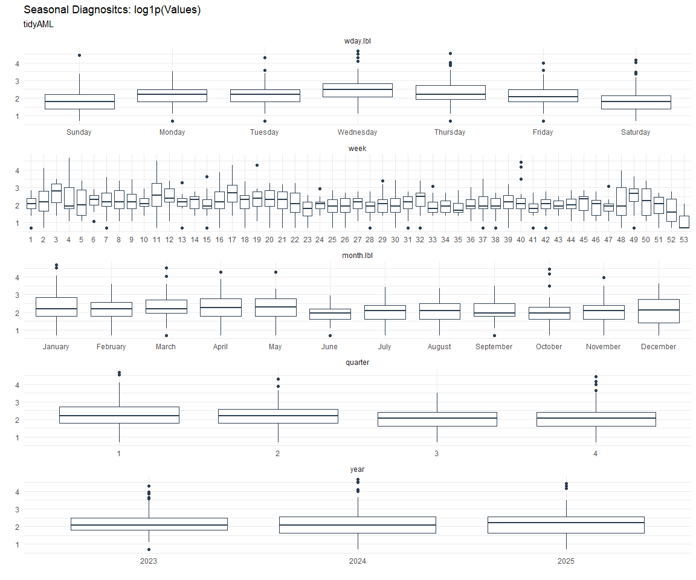

# Time Series Analysis, Modeling and Forecasting of the Healthyverse
Packages
Steven P. Sanderson II, MPH - Date:
2025-10-30

# Introduction

This analysis follows a *Nested Modeltime Workflow* from **`modeltime`**
along with using the **`NNS`** package. I use this to monitor the
downloads of all of my packages:

- [`healthyR`](https://www.spsanderson.com/healthyR/)
- [`healthyR.data`](https://www.spsanderson.com/healthyR.data/)
- [`healthyR.ts`](https://www.spsanderson.com/healthyR.ts/)
- [`healthyR.ai`](https://www.spsanderson.com/healthyR.ai/)
- [`healthyverse`](https://www.spsanderson.com/healthyverse/)
- [`TidyDensity`](https://www.spsanderson.com/TidyDensity/)
- [`tidyAML`](https://www.spsanderson.com/tidyAML/)
- [`RandomWalker`](https://www.spsanderson.com/RandomWalker/)

## Get Data

``` r
glimpse(downloads_tbl)
```

    Rows: 158,554
    Columns: 11
    $ date      <date> 2020-11-23, 2020-11-23, 2020-11-23, 2020-11-23, 2020-11-23,…
    $ time      <Period> 15H 36M 55S, 11H 26M 39S, 23H 34M 44S, 18H 39M 32S, 9H 0M…
    $ date_time <dttm> 2020-11-23 15:36:55, 2020-11-23 11:26:39, 2020-11-23 23:34:…
    $ size      <int> 4858294, 4858294, 4858301, 4858295, 361, 4863722, 4864794, 4…
    $ r_version <chr> NA, "4.0.3", "3.5.3", "3.5.2", NA, NA, NA, NA, NA, NA, NA, N…
    $ r_arch    <chr> NA, "x86_64", "x86_64", "x86_64", NA, NA, NA, NA, NA, NA, NA…
    $ r_os      <chr> NA, "mingw32", "mingw32", "linux-gnu", NA, NA, NA, NA, NA, N…
    $ package   <chr> "healthyR.data", "healthyR.data", "healthyR.data", "healthyR…
    $ version   <chr> "1.0.0", "1.0.0", "1.0.0", "1.0.0", "1.0.0", "1.0.0", "1.0.0…
    $ country   <chr> "US", "US", "US", "GB", "US", "US", "DE", "HK", "JP", "US", …
    $ ip_id     <int> 2069, 2804, 78827, 27595, 90474, 90474, 42435, 74, 7655, 638…

The last day in the data set is 2025-10-28 23:15:24, the file was
birthed on: 2024-08-07 07:35:44.428716, and at report knit time is
1.073966^{4} hours old. Happy analyzing!

Now that we have our data lets take a look at it using the `skimr`
package.

``` r
skim(downloads_tbl)
```

|                                                  |               |
|:-------------------------------------------------|:--------------|
| Name                                             | downloads_tbl |
| Number of rows                                   | 158554        |
| Number of columns                                | 11            |
| \_\_\_\_\_\_\_\_\_\_\_\_\_\_\_\_\_\_\_\_\_\_\_   |               |
| Column type frequency:                           |               |
| character                                        | 6             |
| Date                                             | 1             |
| numeric                                          | 2             |
| POSIXct                                          | 1             |
| Timespan                                         | 1             |
| \_\_\_\_\_\_\_\_\_\_\_\_\_\_\_\_\_\_\_\_\_\_\_\_ |               |
| Group variables                                  | None          |

Data summary

**Variable type: character**

| skim_variable | n_missing | complete_rate | min | max | empty | n_unique | whitespace |
|:--------------|----------:|--------------:|----:|----:|------:|---------:|-----------:|
| r_version     |    116127 |          0.27 |   5 |   5 |     0 |       48 |          0 |
| r_arch        |    116127 |          0.27 |   3 |   7 |     0 |        5 |          0 |
| r_os          |    116127 |          0.27 |   7 |  15 |     0 |       23 |          0 |
| package       |         0 |          1.00 |   7 |  13 |     0 |        8 |          0 |
| version       |         0 |          1.00 |   5 |  17 |     0 |       62 |          0 |
| country       |     14862 |          0.91 |   2 |   2 |     0 |      165 |          0 |

**Variable type: Date**

| skim_variable | n_missing | complete_rate | min | max | median | n_unique |
|:---|---:|---:|:---|:---|:---|---:|
| date | 0 | 1 | 2020-11-23 | 2025-10-28 | 2023-10-14 | 1794 |

**Variable type: numeric**

| skim_variable | n_missing | complete_rate | mean | sd | p0 | p25 | p50 | p75 | p100 | hist |
|:---|---:|---:|---:|---:|---:|---:|---:|---:|---:|:---|
| size | 0 | 1 | 1124713.90 | 1492883.8 | 355 | 20493 | 308787 | 2356728 | 5677952 | ▇▁▂▁▁ |
| ip_id | 0 | 1 | 11313.06 | 21923.3 | 1 | 223 | 2938 | 11961 | 299146 | ▇▁▁▁▁ |

**Variable type: POSIXct**

| skim_variable | n_missing | complete_rate | min | max | median | n_unique |
|:---|---:|---:|:---|:---|:---|---:|
| date_time | 0 | 1 | 2020-11-23 09:00:41 | 2025-10-28 23:15:24 | 2023-10-14 21:28:27 | 99647 |

**Variable type: Timespan**

| skim_variable | n_missing | complete_rate | min | max | median | n_unique |
|:--------------|----------:|--------------:|----:|----:|-------:|---------:|
| time          |         0 |             1 |   0 |  59 |     12 |       60 |

We can see that the following columns are missing a lot of data and for
us are most likely not useful anyways, so we will drop them
`c(r_version, r_arch, r_os)`

## Plots

Now lets take a look at a time-series plot of the total daily downloads
by package. We will use a log scale and place a vertical line at each
version release for each package.


    [[1]]


    [[2]]


    [[3]]


    [[4]]


    [[5]]


    [[6]]


    [[7]]


    [[8]]


Now lets take a look at some time series decomposition graphs.

    [[1]]


    [[2]]


    [[3]]


    [[4]]


    [[5]]


    [[6]]


    [[7]]


    [[8]]


    [[1]]


    [[2]]


    [[3]]


    [[4]]


    [[5]]


    [[6]]


    [[7]]


    [[8]]


Seasonal Diagnostics:

    [[1]]


    [[2]]


    [[3]]


    [[4]]


    [[5]]


    [[6]]


    [[7]]


    [[8]]



ACF and PACF Diagnostics:

    [[1]]


    [[2]]


    [[3]]


    [[4]]


    [[5]]


    [[6]]


    [[7]]


    [[8]]


## Feature Engineering

Now that we have our basic data and a shot of what it looks like, let’s
add some features to our data which can be very helpful in modeling.
Lets start by making a `tibble` that is aggregated by the day and
package, as we are going to be interested in forecasting the next 4
weeks or 28 days for each package. First lets get our base data.


    Call:
    stats::lm(formula = .formula, data = df)

    Residuals:
        Min      1Q  Median      3Q     Max 
    -147.62  -36.29  -11.04   27.01  816.18 

    Coefficients:
                                                         Estimate Std. Error
    (Intercept)                                        -211.73141   62.05081
    date                                                  0.01268    0.00329
    lag(value, 1)                                         0.11329    0.02340
    lag(value, 7)                                         0.08952    0.02417
    lag(value, 14)                                        0.07844    0.02420
    lag(value, 21)                                        0.06943    0.02426
    lag(value, 28)                                        0.07262    0.02419
    lag(value, 35)                                        0.06234    0.02429
    lag(value, 42)                                        0.05383    0.02444
    lag(value, 49)                                        0.07242    0.02446
    month(date, label = TRUE).L                          -8.34327    5.09923
    month(date, label = TRUE).Q                           2.23289    5.01964
    month(date, label = TRUE).C                         -15.88383    5.01975
    month(date, label = TRUE)^4                          -7.94951    5.04132
    month(date, label = TRUE)^5                          -9.29155    5.02835
    month(date, label = TRUE)^6                          -1.52608    5.06841
    month(date, label = TRUE)^7                          -6.53025    4.93141
    month(date, label = TRUE)^8                          -5.28874    4.86879
    month(date, label = TRUE)^9                           2.23027    4.83998
    month(date, label = TRUE)^10                          0.81483    4.84551
    month(date, label = TRUE)^11                         -4.25005    4.83185
    fourier_vec(date, type = "sin", K = 1, period = 7)  -11.32948    2.24524
    fourier_vec(date, type = "cos", K = 1, period = 7)    7.19977    2.32671
                                                       t value Pr(>|t|)    
    (Intercept)                                         -3.412 0.000659 ***
    date                                                 3.855 0.000120 ***
    lag(value, 1)                                        4.842 1.40e-06 ***
    lag(value, 7)                                        3.704 0.000219 ***
    lag(value, 14)                                       3.241 0.001214 ** 
    lag(value, 21)                                       2.862 0.004266 ** 
    lag(value, 28)                                       3.002 0.002720 ** 
    lag(value, 35)                                       2.567 0.010355 *  
    lag(value, 42)                                       2.203 0.027752 *  
    lag(value, 49)                                       2.961 0.003103 ** 
    month(date, label = TRUE).L                         -1.636 0.101984    
    month(date, label = TRUE).Q                          0.445 0.656498    
    month(date, label = TRUE).C                         -3.164 0.001582 ** 
    month(date, label = TRUE)^4                         -1.577 0.115009    
    month(date, label = TRUE)^5                         -1.848 0.064798 .  
    month(date, label = TRUE)^6                         -0.301 0.763377    
    month(date, label = TRUE)^7                         -1.324 0.185607    
    month(date, label = TRUE)^8                         -1.086 0.277519    
    month(date, label = TRUE)^9                          0.461 0.644998    
    month(date, label = TRUE)^10                         0.168 0.866476    
    month(date, label = TRUE)^11                        -0.880 0.379204    
    fourier_vec(date, type = "sin", K = 1, period = 7)  -5.046 4.99e-07 ***
    fourier_vec(date, type = "cos", K = 1, period = 7)   3.094 0.002004 ** 
    ---
    Signif. codes:  0 '***' 0.001 '**' 0.01 '*' 0.05 '.' 0.1 ' ' 1

    Residual standard error: 59.24 on 1722 degrees of freedom
      (49 observations deleted due to missingness)
    Multiple R-squared:  0.2375,    Adjusted R-squared:  0.2277 
    F-statistic: 24.38 on 22 and 1722 DF,  p-value: < 2.2e-16


## NNS Forecasting

This is something I have been wanting to try for a while. The `NNS`
package is a great package for forecasting time series data.

[NNS GitHub](https://github.com/OVVO-Financial/NNS)

``` r
library(NNS)

data_list <- base_data |>
    select(package, value) |>
    group_split(package)

data_list |>
    imap(
        \(x, idx) {
            obj <- x
            x <- obj |> pull(value) |> tail(7*52)
            train_set_size <- length(x) - 56
            pkg <- obj |> pluck(1) |> unique()
#            sf <- NNS.seas(x, modulo = 7, plot = FALSE)$periods
            seas <- t(
                sapply(
                    1:25, 
                    function(i) c(
                        i,
                        sqrt(
                            mean((
                                NNS.ARMA(x, 
                                         h = 28, 
                                         training.set = train_set_size, 
                                         method = "lin", 
                                         seasonal.factor = i, 
                                         plot=FALSE
                                         ) - tail(x, 28)) ^ 2)))
                    )
                )
            colnames(seas) <- c("Period", "RMSE")
            sf <- seas[which.min(seas[, 2]), 1]
            
            cat(paste0("Package: ", pkg, "\n"))
            NNS.ARMA.optim(
                variable = x,
                h = 28,
                training.set = train_set_size,
                #seasonal.factor = seq(12, 60, 7),
                seasonal.factor = sf,
                pred.int = 0.95,
                plot = TRUE
            )
            title(
                sub = paste0("\n",
                             "Package: ", pkg, " - NNS Optimization")
            )
        }
    )
```

    Package: healthyR
    [1] "CURRNET METHOD: lin"
    [1] "COPY LATEST PARAMETERS DIRECTLY FOR NNS.ARMA() IF ERROR:"
    [1] "NNS.ARMA(... method =  'lin' , seasonal.factor =  c( 3 ) ...)"
    [1] "CURRENT lin OBJECTIVE FUNCTION = 6.28000697410491"
    [1] "BEST method = 'lin' PATH MEMBER = c( 3 )"
    [1] "BEST lin OBJECTIVE FUNCTION = 6.28000697410491"
    [1] "CURRNET METHOD: nonlin"
    [1] "COPY LATEST PARAMETERS DIRECTLY FOR NNS.ARMA() IF ERROR:"
    [1] "NNS.ARMA(... method =  'nonlin' , seasonal.factor =  c( 3 ) ...)"
    [1] "CURRENT nonlin OBJECTIVE FUNCTION = 4.31682461575015"
    [1] "BEST method = 'nonlin' PATH MEMBER = c( 3 )"
    [1] "BEST nonlin OBJECTIVE FUNCTION = 4.31682461575015"
    [1] "CURRNET METHOD: both"
    [1] "COPY LATEST PARAMETERS DIRECTLY FOR NNS.ARMA() IF ERROR:"
    [1] "NNS.ARMA(... method =  'both' , seasonal.factor =  c( 3 ) ...)"
    [1] "CURRENT both OBJECTIVE FUNCTION = 3.66240603352726"
    [1] "BEST method = 'both' PATH MEMBER = c( 3 )"
    [1] "BEST both OBJECTIVE FUNCTION = 3.66240603352726"


    Package: healthyR.ai
    [1] "CURRNET METHOD: lin"
    [1] "COPY LATEST PARAMETERS DIRECTLY FOR NNS.ARMA() IF ERROR:"
    [1] "NNS.ARMA(... method =  'lin' , seasonal.factor =  c( 1 ) ...)"
    [1] "CURRENT lin OBJECTIVE FUNCTION = 671.211168006785"
    [1] "BEST method = 'lin' PATH MEMBER = c( 1 )"
    [1] "BEST lin OBJECTIVE FUNCTION = 671.211168006785"
    [1] "CURRNET METHOD: nonlin"
    [1] "COPY LATEST PARAMETERS DIRECTLY FOR NNS.ARMA() IF ERROR:"
    [1] "NNS.ARMA(... method =  'nonlin' , seasonal.factor =  c( 1 ) ...)"
    [1] "CURRENT nonlin OBJECTIVE FUNCTION = 125.462494218441"
    [1] "BEST method = 'nonlin' PATH MEMBER = c( 1 )"
    [1] "BEST nonlin OBJECTIVE FUNCTION = 125.462494218441"
    [1] "CURRNET METHOD: both"
    [1] "COPY LATEST PARAMETERS DIRECTLY FOR NNS.ARMA() IF ERROR:"
    [1] "NNS.ARMA(... method =  'both' , seasonal.factor =  c( 1 ) ...)"
    [1] "CURRENT both OBJECTIVE FUNCTION = 193.859069965138"
    [1] "BEST method = 'both' PATH MEMBER = c( 1 )"
    [1] "BEST both OBJECTIVE FUNCTION = 193.859069965138"


    Package: healthyR.data
    [1] "CURRNET METHOD: lin"
    [1] "COPY LATEST PARAMETERS DIRECTLY FOR NNS.ARMA() IF ERROR:"
    [1] "NNS.ARMA(... method =  'lin' , seasonal.factor =  c( 5 ) ...)"
    [1] "CURRENT lin OBJECTIVE FUNCTION = 29.6210668064107"
    [1] "BEST method = 'lin' PATH MEMBER = c( 5 )"
    [1] "BEST lin OBJECTIVE FUNCTION = 29.6210668064107"
    [1] "CURRNET METHOD: nonlin"
    [1] "COPY LATEST PARAMETERS DIRECTLY FOR NNS.ARMA() IF ERROR:"
    [1] "NNS.ARMA(... method =  'nonlin' , seasonal.factor =  c( 5 ) ...)"
    [1] "CURRENT nonlin OBJECTIVE FUNCTION = 11.1144284923724"
    [1] "BEST method = 'nonlin' PATH MEMBER = c( 5 )"
    [1] "BEST nonlin OBJECTIVE FUNCTION = 11.1144284923724"
    [1] "CURRNET METHOD: both"
    [1] "COPY LATEST PARAMETERS DIRECTLY FOR NNS.ARMA() IF ERROR:"
    [1] "NNS.ARMA(... method =  'both' , seasonal.factor =  c( 5 ) ...)"
    [1] "CURRENT both OBJECTIVE FUNCTION = 16.0486198333402"
    [1] "BEST method = 'both' PATH MEMBER = c( 5 )"
    [1] "BEST both OBJECTIVE FUNCTION = 16.0486198333402"


    Package: healthyR.ts
    [1] "CURRNET METHOD: lin"
    [1] "COPY LATEST PARAMETERS DIRECTLY FOR NNS.ARMA() IF ERROR:"
    [1] "NNS.ARMA(... method =  'lin' , seasonal.factor =  c( 11 ) ...)"
    [1] "CURRENT lin OBJECTIVE FUNCTION = 8.25806371108004"
    [1] "BEST method = 'lin' PATH MEMBER = c( 11 )"
    [1] "BEST lin OBJECTIVE FUNCTION = 8.25806371108004"
    [1] "CURRNET METHOD: nonlin"
    [1] "COPY LATEST PARAMETERS DIRECTLY FOR NNS.ARMA() IF ERROR:"
    [1] "NNS.ARMA(... method =  'nonlin' , seasonal.factor =  c( 11 ) ...)"
    [1] "CURRENT nonlin OBJECTIVE FUNCTION = 10.4957696401706"
    [1] "BEST method = 'nonlin' PATH MEMBER = c( 11 )"
    [1] "BEST nonlin OBJECTIVE FUNCTION = 10.4957696401706"
    [1] "CURRNET METHOD: both"
    [1] "COPY LATEST PARAMETERS DIRECTLY FOR NNS.ARMA() IF ERROR:"
    [1] "NNS.ARMA(... method =  'both' , seasonal.factor =  c( 11 ) ...)"
    [1] "CURRENT both OBJECTIVE FUNCTION = 7.23522560043687"
    [1] "BEST method = 'both' PATH MEMBER = c( 11 )"
    [1] "BEST both OBJECTIVE FUNCTION = 7.23522560043687"


    Package: healthyverse
    [1] "CURRNET METHOD: lin"
    [1] "COPY LATEST PARAMETERS DIRECTLY FOR NNS.ARMA() IF ERROR:"
    [1] "NNS.ARMA(... method =  'lin' , seasonal.factor =  c( 6 ) ...)"
    [1] "CURRENT lin OBJECTIVE FUNCTION = 13.990555163827"
    [1] "BEST method = 'lin' PATH MEMBER = c( 6 )"
    [1] "BEST lin OBJECTIVE FUNCTION = 13.990555163827"
    [1] "CURRNET METHOD: nonlin"
    [1] "COPY LATEST PARAMETERS DIRECTLY FOR NNS.ARMA() IF ERROR:"
    [1] "NNS.ARMA(... method =  'nonlin' , seasonal.factor =  c( 6 ) ...)"
    [1] "CURRENT nonlin OBJECTIVE FUNCTION = 15.5145945132688"
    [1] "BEST method = 'nonlin' PATH MEMBER = c( 6 )"
    [1] "BEST nonlin OBJECTIVE FUNCTION = 15.5145945132688"
    [1] "CURRNET METHOD: both"
    [1] "COPY LATEST PARAMETERS DIRECTLY FOR NNS.ARMA() IF ERROR:"
    [1] "NNS.ARMA(... method =  'both' , seasonal.factor =  c( 6 ) ...)"
    [1] "CURRENT both OBJECTIVE FUNCTION = 25.3746139111182"
    [1] "BEST method = 'both' PATH MEMBER = c( 6 )"
    [1] "BEST both OBJECTIVE FUNCTION = 25.3746139111182"


    Package: RandomWalker
    [1] "CURRNET METHOD: lin"
    [1] "COPY LATEST PARAMETERS DIRECTLY FOR NNS.ARMA() IF ERROR:"
    [1] "NNS.ARMA(... method =  'lin' , seasonal.factor =  c( 19 ) ...)"
    [1] "CURRENT lin OBJECTIVE FUNCTION = 8.80092749676161"
    [1] "BEST method = 'lin' PATH MEMBER = c( 19 )"
    [1] "BEST lin OBJECTIVE FUNCTION = 8.80092749676161"
    [1] "CURRNET METHOD: nonlin"
    [1] "COPY LATEST PARAMETERS DIRECTLY FOR NNS.ARMA() IF ERROR:"
    [1] "NNS.ARMA(... method =  'nonlin' , seasonal.factor =  c( 19 ) ...)"
    [1] "CURRENT nonlin OBJECTIVE FUNCTION = 4.56390051649117"
    [1] "BEST method = 'nonlin' PATH MEMBER = c( 19 )"
    [1] "BEST nonlin OBJECTIVE FUNCTION = 4.56390051649117"
    [1] "CURRNET METHOD: both"
    [1] "COPY LATEST PARAMETERS DIRECTLY FOR NNS.ARMA() IF ERROR:"
    [1] "NNS.ARMA(... method =  'both' , seasonal.factor =  c( 19 ) ...)"
    [1] "CURRENT both OBJECTIVE FUNCTION = 4.93203429406487"
    [1] "BEST method = 'both' PATH MEMBER = c( 19 )"
    [1] "BEST both OBJECTIVE FUNCTION = 4.93203429406487"


    Package: tidyAML
    [1] "CURRNET METHOD: lin"
    [1] "COPY LATEST PARAMETERS DIRECTLY FOR NNS.ARMA() IF ERROR:"
    [1] "NNS.ARMA(... method =  'lin' , seasonal.factor =  c( 18 ) ...)"
    [1] "CURRENT lin OBJECTIVE FUNCTION = 50.7553512532221"
    [1] "BEST method = 'lin' PATH MEMBER = c( 18 )"
    [1] "BEST lin OBJECTIVE FUNCTION = 50.7553512532221"
    [1] "CURRNET METHOD: nonlin"
    [1] "COPY LATEST PARAMETERS DIRECTLY FOR NNS.ARMA() IF ERROR:"
    [1] "NNS.ARMA(... method =  'nonlin' , seasonal.factor =  c( 18 ) ...)"
    [1] "CURRENT nonlin OBJECTIVE FUNCTION = 27.1671360242482"
    [1] "BEST method = 'nonlin' PATH MEMBER = c( 18 )"
    [1] "BEST nonlin OBJECTIVE FUNCTION = 27.1671360242482"
    [1] "CURRNET METHOD: both"
    [1] "COPY LATEST PARAMETERS DIRECTLY FOR NNS.ARMA() IF ERROR:"
    [1] "NNS.ARMA(... method =  'both' , seasonal.factor =  c( 18 ) ...)"
    [1] "CURRENT both OBJECTIVE FUNCTION = 37.5741427466319"
    [1] "BEST method = 'both' PATH MEMBER = c( 18 )"
    [1] "BEST both OBJECTIVE FUNCTION = 37.5741427466319"


    Package: TidyDensity
    [1] "CURRNET METHOD: lin"
    [1] "COPY LATEST PARAMETERS DIRECTLY FOR NNS.ARMA() IF ERROR:"
    [1] "NNS.ARMA(... method =  'lin' , seasonal.factor =  c( 13 ) ...)"
    [1] "CURRENT lin OBJECTIVE FUNCTION = 54.2770633650448"
    [1] "BEST method = 'lin' PATH MEMBER = c( 13 )"
    [1] "BEST lin OBJECTIVE FUNCTION = 54.2770633650448"
    [1] "CURRNET METHOD: nonlin"
    [1] "COPY LATEST PARAMETERS DIRECTLY FOR NNS.ARMA() IF ERROR:"
    [1] "NNS.ARMA(... method =  'nonlin' , seasonal.factor =  c( 13 ) ...)"
    [1] "CURRENT nonlin OBJECTIVE FUNCTION = 32.117671846105"
    [1] "BEST method = 'nonlin' PATH MEMBER = c( 13 )"
    [1] "BEST nonlin OBJECTIVE FUNCTION = 32.117671846105"
    [1] "CURRNET METHOD: both"
    [1] "COPY LATEST PARAMETERS DIRECTLY FOR NNS.ARMA() IF ERROR:"
    [1] "NNS.ARMA(... method =  'both' , seasonal.factor =  c( 13 ) ...)"
    [1] "CURRENT both OBJECTIVE FUNCTION = 63.825565026336"
    [1] "BEST method = 'both' PATH MEMBER = c( 13 )"
    [1] "BEST both OBJECTIVE FUNCTION = 63.825565026336"


    [[1]]
    NULL

    [[2]]
    NULL

    [[3]]
    NULL

    [[4]]
    NULL

    [[5]]
    NULL

    [[6]]
    NULL

    [[7]]
    NULL

    [[8]]
    NULL

## Pre-Processing

Now we are going to do some basic pre-processing.

``` r
data_padded_tbl <- base_data %>%
  pad_by_time(
    .date_var  = date,
    .pad_value = 0
  )

# Get log interval and standardization parameters
log_params  <- liv(data_padded_tbl$value, limit_lower = 0, offset = 1, silent = TRUE)
limit_lower <- log_params$limit_lower
limit_upper <- log_params$limit_upper
offset      <- log_params$offset

data_liv_tbl <- data_padded_tbl %>%
  # Get log interval transform
  mutate(value_trans = liv(value, limit_lower = 0, offset = 1, silent = TRUE)$log_scaled)

# Get Standardization Params
std_params <- standard_vec(data_liv_tbl$value_trans, silent = TRUE)
std_mean   <- std_params$mean
std_sd     <- std_params$sd

data_transformed_tbl <- data_liv_tbl %>%
  group_by(package) %>%
  # get standardization
  mutate(value_trans = standard_vec(value_trans, silent = TRUE)$standard_scaled) %>%
  tk_augment_fourier(
    .date_var = date,
    .periods  = c(7, 14, 30, 90, 180),
    .K        = 2
  ) %>%
  tk_augment_timeseries_signature(
    .date_var = date
  ) %>%
  ungroup() %>%
  select(-c(value, -year.iso))
```

Since this is panel data we can follow one of two different modeling
strategies. We can search for a global model in the panel data or we can
use nested forecasting finding the best model for each of the time
series. Since we only have 5 panels, we will use nested forecasting.

To do this we will use the `nest_timeseries` and
`split_nested_timeseries` functions to create a nested `tibble`.

``` r
horizon <- 4*7

nested_data_tbl <- data_transformed_tbl %>%

    # 0. Filter out column where package is NA
    filter(!is.na(package)) %>%
    
    # 1. Extending: We'll predict n days into the future.
    extend_timeseries(
        .id_var        = package,
        .date_var      = date,
        .length_future = horizon
    ) %>%
    
    # 2. Nesting: We'll group by id, and create a future dataset
    #    that forecasts n days of extended data and
    #    an actual dataset that contains n*2 days
    nest_timeseries(
        .id_var        = package,
        .length_future = horizon
        #.length_actual = horizon*2
    ) %>%
    
   # 3. Splitting: We'll take the actual data and create splits
   #    for accuracy and confidence interval estimation of n das (test)
   #    and the rest is training data
    split_nested_timeseries(
        .length_test = horizon
    )

nested_data_tbl
```

    # A tibble: 8 × 4
      package       .actual_data          .future_data       .splits          
      <fct>         <list>                <list>             <list>           
    1 healthyR.data <tibble [1,786 × 50]> <tibble [28 × 50]> <split [1758|28]>
    2 healthyR      <tibble [1,777 × 50]> <tibble [28 × 50]> <split [1749|28]>
    3 healthyR.ts   <tibble [1,723 × 50]> <tibble [28 × 50]> <split [1695|28]>
    4 healthyverse  <tibble [1,694 × 50]> <tibble [28 × 50]> <split [1666|28]>
    5 healthyR.ai   <tibble [1,519 × 50]> <tibble [28 × 50]> <split [1491|28]>
    6 TidyDensity   <tibble [1,370 × 50]> <tibble [28 × 50]> <split [1342|28]>
    7 tidyAML       <tibble [977 × 50]>   <tibble [28 × 50]> <split [949|28]> 
    8 RandomWalker  <tibble [400 × 50]>   <tibble [28 × 50]> <split [372|28]> 

Now it is time to make some recipes and models using the modeltime
workflow.

## Modeltime Workflow

### Recipe Object

``` r
recipe_base <- recipe(
  value_trans ~ .
  , data = extract_nested_test_split(nested_data_tbl)
  )

recipe_base

recipe_date <- recipe(
  value_trans ~ date
  , data = extract_nested_test_split(nested_data_tbl)
  )
```

### Models

``` r
# Models ------------------------------------------------------------------

# Auto ARIMA --------------------------------------------------------------

model_spec_arima_no_boost <- arima_reg() %>%
  set_engine(engine = "auto_arima")

wflw_auto_arima <- workflow() %>%
  add_recipe(recipe = recipe_date) %>%
  add_model(model_spec_arima_no_boost)

# NNETAR ------------------------------------------------------------------

model_spec_nnetar <- nnetar_reg(
  mode              = "regression"
  , seasonal_period = "auto"
) %>%
  set_engine("nnetar")

wflw_nnetar <- workflow() %>%
  add_recipe(recipe = recipe_base) %>%
  add_model(model_spec_nnetar)

# TSLM --------------------------------------------------------------------

model_spec_lm <- linear_reg() %>%
  set_engine("lm")

wflw_lm <- workflow() %>%
  add_recipe(recipe = recipe_base) %>%
  add_model(model_spec_lm)

# MARS --------------------------------------------------------------------

model_spec_mars <- mars(mode = "regression") %>%
  set_engine("earth")

wflw_mars <- workflow() %>%
  add_recipe(recipe = recipe_date) %>%
  add_model(model_spec_mars)
```

### Nested Modeltime Tables

``` r
nested_modeltime_tbl <- modeltime_nested_fit(
  # Nested Data
  nested_data = nested_data_tbl,
   control = control_nested_fit(
     verbose = TRUE,
     allow_par = FALSE
   ),
  # Add workflows
  wflw_auto_arima,
  wflw_lm,
  wflw_mars,
  wflw_nnetar
)
```

``` r
nested_modeltime_tbl <- nested_modeltime_tbl[!is.na(nested_modeltime_tbl$package),]
```

### Model Accuracy

``` r
nested_modeltime_tbl %>%
  extract_nested_test_accuracy() %>%
  filter(!is.na(package)) %>%
  knitr::kable()
```

| package | .model_id | .model_desc | .type | mae | mape | mase | smape | rmse | rsq |
|:---|---:|:---|:---|---:|---:|---:|---:|---:|---:|
| healthyR.data | 1 | ARIMA | Test | 0.6228904 | 89.71849 | 0.6185839 | 159.0163 | 0.7972084 | 0.0720932 |
| healthyR.data | 2 | LM | Test | 0.7379562 | 152.76984 | 0.7328542 | 143.4616 | 0.8709951 | 0.0330888 |
| healthyR.data | 3 | NULL | NA | NA | NA | NA | NA | NA | NA |
| healthyR.data | 4 | NNAR | Test | 0.7877482 | 175.63934 | 0.7823019 | 146.4291 | 0.9164340 | 0.0220043 |
| healthyR | 1 | ARIMA | Test | 0.4914541 | 140.90590 | 0.6367397 | 173.2535 | 0.6161931 | 0.0382120 |
| healthyR | 2 | LM | Test | 0.6232241 | 217.42164 | 0.8074641 | 135.2559 | 0.8218803 | 0.0004299 |
| healthyR | 3 | NULL | NA | NA | NA | NA | NA | NA | NA |
| healthyR | 4 | NNAR | Test | 0.6400508 | 248.01515 | 0.8292652 | 140.4587 | 0.8609400 | 0.0207995 |
| healthyR.ts | 1 | ARIMA | Test | 0.5122952 | 108.47075 | 0.6335767 | 161.3415 | 0.6270174 | 0.0875021 |
| healthyR.ts | 2 | LM | Test | 0.6575038 | 159.43733 | 0.8131623 | 150.0237 | 0.8242632 | 0.0044787 |
| healthyR.ts | 3 | NULL | NA | NA | NA | NA | NA | NA | NA |
| healthyR.ts | 4 | NNAR | Test | 0.7235608 | 204.78396 | 0.8948577 | 140.7828 | 0.9429791 | 0.0220064 |
| healthyverse | 1 | ARIMA | Test | 0.5511980 | 118.76785 | 0.7281889 | 157.6065 | 0.6518837 | 0.0060833 |
| healthyverse | 2 | LM | Test | 0.6309616 | 175.47812 | 0.8335648 | 145.9316 | 0.7137460 | 0.0951106 |
| healthyverse | 3 | NULL | NA | NA | NA | NA | NA | NA | NA |
| healthyverse | 4 | NNAR | Test | 0.6050846 | 162.37389 | 0.7993787 | 138.0213 | 0.7432029 | 0.0470587 |
| healthyR.ai | 1 | ARIMA | Test | 0.3927363 | 94.48328 | 0.8264598 | 173.2579 | 0.4850755 | 0.0006333 |
| healthyR.ai | 2 | LM | Test | 0.6027480 | 243.43245 | 1.2684005 | 159.0505 | 0.7440158 | 0.0335384 |
| healthyR.ai | 3 | NULL | NA | NA | NA | NA | NA | NA | NA |
| healthyR.ai | 4 | NNAR | Test | 0.6600875 | 254.86905 | 1.3890637 | 173.9911 | 0.7923037 | 0.1476153 |
| TidyDensity | 1 | ARIMA | Test | 1.0367906 | 610.77104 | 0.7100957 | 107.1676 | 1.1528434 | 0.1154505 |
| TidyDensity | 2 | LM | Test | 1.1138308 | 181.81636 | 0.7628604 | 150.8975 | 1.4321896 | 0.0955668 |
| TidyDensity | 3 | NULL | NA | NA | NA | NA | NA | NA | NA |
| TidyDensity | 4 | NNAR | Test | 1.0292635 | 258.04364 | 0.7049404 | 138.4346 | 1.2630587 | 0.0424938 |
| tidyAML | 1 | ARIMA | Test | 0.9528825 | 115.20704 | 0.8534783 | 174.0184 | 1.3554396 | 0.0067197 |
| tidyAML | 2 | LM | Test | 1.0838439 | 166.38910 | 0.9707779 | 156.0703 | 1.5515638 | 0.0047988 |
| tidyAML | 3 | NULL | NA | NA | NA | NA | NA | NA | NA |
| tidyAML | 4 | NNAR | Test | 1.0208364 | 128.17746 | 0.9143434 | 159.0256 | 1.4762201 | 0.0152328 |
| RandomWalker | 1 | ARIMA | Test | 0.7002888 | 113.95797 | 0.5790546 | 149.2045 | 0.8189644 | 0.0913553 |
| RandomWalker | 2 | LM | Test | 0.6928153 | 91.40663 | 0.5728748 | 136.7040 | 0.8992648 | 0.0327939 |
| RandomWalker | 3 | NULL | NA | NA | NA | NA | NA | NA | NA |
| RandomWalker | 4 | NNAR | Test | 0.7590340 | 118.91472 | 0.6276298 | 150.3789 | 0.9594885 | 0.0001989 |

### Plot Models

``` r
nested_modeltime_tbl %>%
  extract_nested_test_forecast() %>%
  group_by(package) %>%
  filter_by_time(.date_var = .index, .start_date = max(.index) - 60) %>%
  ungroup() %>%
  plot_modeltime_forecast(
    .interactive = FALSE,
    .conf_interval_show  = FALSE,
    .facet_scales = "free"
  ) +
  theme_minimal() +
  facet_wrap(~ package, nrow = 3) +
  theme(legend.position = "bottom")
```


### Best Model

``` r
best_nested_modeltime_tbl <- nested_modeltime_tbl %>%
  modeltime_nested_select_best(
    metric = "rmse",
    minimize = TRUE,
    filter_test_forecasts = TRUE
  )

best_nested_modeltime_tbl %>%
  extract_nested_best_model_report()
```

    # Nested Modeltime Table
      

    # A tibble: 8 × 10
      package      .model_id .model_desc .type   mae  mape  mase smape  rmse     rsq
      <fct>            <int> <chr>       <chr> <dbl> <dbl> <dbl> <dbl> <dbl>   <dbl>
    1 healthyR.da…         1 ARIMA       Test  0.623  89.7 0.619  159. 0.797 7.21e-2
    2 healthyR             1 ARIMA       Test  0.491 141.  0.637  173. 0.616 3.82e-2
    3 healthyR.ts          1 ARIMA       Test  0.512 108.  0.634  161. 0.627 8.75e-2
    4 healthyverse         1 ARIMA       Test  0.551 119.  0.728  158. 0.652 6.08e-3
    5 healthyR.ai          1 ARIMA       Test  0.393  94.5 0.826  173. 0.485 6.33e-4
    6 TidyDensity          1 ARIMA       Test  1.04  611.  0.710  107. 1.15  1.15e-1
    7 tidyAML              1 ARIMA       Test  0.953 115.  0.853  174. 1.36  6.72e-3
    8 RandomWalker         1 ARIMA       Test  0.700 114.  0.579  149. 0.819 9.14e-2

``` r
best_nested_modeltime_tbl %>%
  extract_nested_test_forecast() %>%
  #filter(!is.na(.model_id)) %>%
  group_by(package) %>%
  filter_by_time(.date_var = .index, .start_date = max(.index) - 60) %>%
  ungroup() %>%
  plot_modeltime_forecast(
    .interactive = FALSE,
    .conf_interval_alpha = 0.2,
    .facet_scales = "free"
  ) +
  facet_wrap(~ package, nrow = 3) +
  theme_minimal() +
  theme(legend.position = "bottom")
```


## Refitting and Future Forecast

Now that we have the best models, we can make our future forecasts.

``` r
nested_modeltime_refit_tbl <- best_nested_modeltime_tbl %>%
    modeltime_nested_refit(
        control = control_nested_refit(verbose = TRUE)
    )
```

``` r
nested_modeltime_refit_tbl
```

    # Nested Modeltime Table
      

    # A tibble: 8 × 5
      package       .actual_data .future_data .splits           .modeltime_tables 
      <fct>         <list>       <list>       <list>            <list>            
    1 healthyR.data <tibble>     <tibble>     <split [1758|28]> <mdl_tm_t [1 × 5]>
    2 healthyR      <tibble>     <tibble>     <split [1749|28]> <mdl_tm_t [1 × 5]>
    3 healthyR.ts   <tibble>     <tibble>     <split [1695|28]> <mdl_tm_t [1 × 5]>
    4 healthyverse  <tibble>     <tibble>     <split [1666|28]> <mdl_tm_t [1 × 5]>
    5 healthyR.ai   <tibble>     <tibble>     <split [1491|28]> <mdl_tm_t [1 × 5]>
    6 TidyDensity   <tibble>     <tibble>     <split [1342|28]> <mdl_tm_t [1 × 5]>
    7 tidyAML       <tibble>     <tibble>     <split [949|28]>  <mdl_tm_t [1 × 5]>
    8 RandomWalker  <tibble>     <tibble>     <split [372|28]>  <mdl_tm_t [1 × 5]>

``` r
nested_modeltime_refit_tbl %>%
  extract_nested_future_forecast() %>%
  group_by(package) %>%
  mutate(across(.value:.conf_hi, .fns = ~ standard_inv_vec(
    x    = .,
    mean = std_mean,
    sd   = std_sd
  )$standard_inverse_value)) %>%
  mutate(across(.value:.conf_hi, .fns = ~ liiv(
    x = .,
    limit_lower = limit_lower,
    limit_upper = limit_upper,
    offset      = offset
  )$rescaled_v)) %>%
  filter_by_time(.date_var = .index, .start_date = max(.index) - 60) %>%
  ungroup() %>%
  plot_modeltime_forecast(
    .interactive = FALSE,
    .conf_interval_alpha = 0.2,
    .facet_scales = "free"
  ) +
  facet_wrap(~ package, nrow = 3) +
  theme_minimal() +
  theme(legend.position = "bottom")
```


