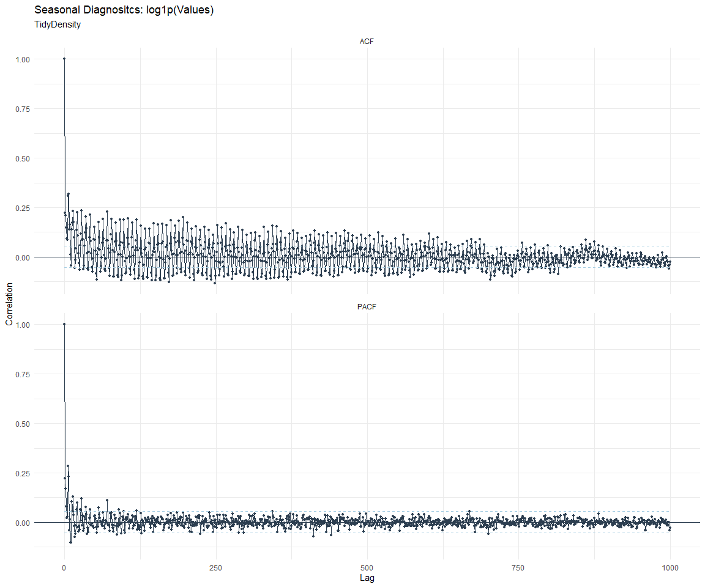
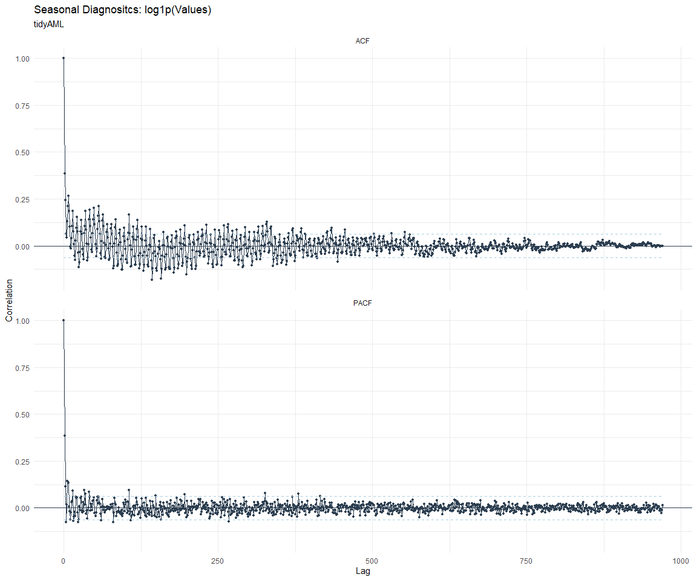

# Time Series Analysis, Modeling and Forecasting of the Healthyverse
Packages
Steven P. Sanderson II, MPH - Date:
2026-02-02

# Introduction

This analysis follows a *Nested Modeltime Workflow* from **`modeltime`**
along with using the **`NNS`** package. I use this to monitor the
downloads of all of my packages:

- [`healthyR`](https://www.spsanderson.com/healthyR/)
- [`healthyR.data`](https://www.spsanderson.com/healthyR.data/)
- [`healthyR.ts`](https://www.spsanderson.com/healthyR.ts/)
- [`healthyR.ai`](https://www.spsanderson.com/healthyR.ai/)
- [`healthyverse`](https://www.spsanderson.com/healthyverse/)
- [`TidyDensity`](https://www.spsanderson.com/TidyDensity/)
- [`tidyAML`](https://www.spsanderson.com/tidyAML/)
- [`RandomWalker`](https://www.spsanderson.com/RandomWalker/)

## Get Data

``` r
glimpse(downloads_tbl)
```

    Rows: 167,363
    Columns: 11
    $ date      <date> 2020-11-23, 2020-11-23, 2020-11-23, 2020-11-23, 2020-11-23,…
    $ time      <Period> 15H 36M 55S, 11H 26M 39S, 23H 34M 44S, 18H 39M 32S, 9H 0M…
    $ date_time <dttm> 2020-11-23 15:36:55, 2020-11-23 11:26:39, 2020-11-23 23:34:…
    $ size      <int> 4858294, 4858294, 4858301, 4858295, 361, 4863722, 4864794, 4…
    $ r_version <chr> NA, "4.0.3", "3.5.3", "3.5.2", NA, NA, NA, NA, NA, NA, NA, N…
    $ r_arch    <chr> NA, "x86_64", "x86_64", "x86_64", NA, NA, NA, NA, NA, NA, NA…
    $ r_os      <chr> NA, "mingw32", "mingw32", "linux-gnu", NA, NA, NA, NA, NA, N…
    $ package   <chr> "healthyR.data", "healthyR.data", "healthyR.data", "healthyR…
    $ version   <chr> "1.0.0", "1.0.0", "1.0.0", "1.0.0", "1.0.0", "1.0.0", "1.0.0…
    $ country   <chr> "US", "US", "US", "GB", "US", "US", "DE", "HK", "JP", "US", …
    $ ip_id     <int> 2069, 2804, 78827, 27595, 90474, 90474, 42435, 74, 7655, 638…

The last day in the data set is 2026-01-31 23:08:15, the file was
birthed on: 2025-10-31 10:47:59.603742, and at report knit time is
2216.34 hours old. Happy analyzing!

Now that we have our data lets take a look at it using the `skimr`
package.

``` r
skim(downloads_tbl)
```

|                                                  |               |
|:-------------------------------------------------|:--------------|
| Name                                             | downloads_tbl |
| Number of rows                                   | 167363        |
| Number of columns                                | 11            |
| \_\_\_\_\_\_\_\_\_\_\_\_\_\_\_\_\_\_\_\_\_\_\_   |               |
| Column type frequency:                           |               |
| character                                        | 6             |
| Date                                             | 1             |
| numeric                                          | 2             |
| POSIXct                                          | 1             |
| Timespan                                         | 1             |
| \_\_\_\_\_\_\_\_\_\_\_\_\_\_\_\_\_\_\_\_\_\_\_\_ |               |
| Group variables                                  | None          |

Data summary

**Variable type: character**

| skim_variable | n_missing | complete_rate | min | max | empty | n_unique | whitespace |
|:--------------|----------:|--------------:|----:|----:|------:|---------:|-----------:|
| r_version     |    123336 |          0.26 |   5 |   7 |     0 |       50 |          0 |
| r_arch        |    123336 |          0.26 |   1 |   7 |     0 |        6 |          0 |
| r_os          |    123336 |          0.26 |   7 |  19 |     0 |       24 |          0 |
| package       |         0 |          1.00 |   7 |  13 |     0 |        8 |          0 |
| version       |         0 |          1.00 |   5 |  17 |     0 |       63 |          0 |
| country       |     15676 |          0.91 |   2 |   2 |     0 |      166 |          0 |

**Variable type: Date**

| skim_variable | n_missing | complete_rate | min | max | median | n_unique |
|:---|---:|---:|:---|:---|:---|---:|
| date | 0 | 1 | 2020-11-23 | 2026-01-31 | 2023-12-01 | 1889 |

**Variable type: numeric**

| skim_variable | n_missing | complete_rate | mean | sd | p0 | p25 | p50 | p75 | p100 | hist |
|:---|---:|---:|---:|---:|---:|---:|---:|---:|---:|:---|
| size | 0 | 1 | 1125418.4 | 1484617.00 | 355 | 36421 | 313331 | 2348230.0 | 5677952 | ▇▁▂▁▁ |
| ip_id | 0 | 1 | 11201.6 | 21824.36 | 1 | 223 | 2791 | 11718.5 | 299146 | ▇▁▁▁▁ |

**Variable type: POSIXct**

| skim_variable | n_missing | complete_rate | min | max | median | n_unique |
|:---|---:|---:|:---|:---|:---|---:|
| date_time | 0 | 1 | 2020-11-23 09:00:41 | 2026-01-31 23:08:15 | 2023-12-01 06:39:05 | 105946 |

**Variable type: Timespan**

| skim_variable | n_missing | complete_rate | min | max |     median | n_unique |
|:--------------|----------:|--------------:|----:|----:|-----------:|---------:|
| time          |         0 |             1 |   0 |  59 | 12H 6M 51S |       60 |

We can see that the following columns are missing a lot of data and for
us are most likely not useful anyways, so we will drop them
`c(r_version, r_arch, r_os)`

## Plots

Now lets take a look at a time-series plot of the total daily downloads
by package. We will use a log scale and place a vertical line at each
version release for each package.


    [[1]]


    [[2]]


    [[3]]


    [[4]]


    [[5]]


    [[6]]


    [[7]]


    [[8]]


Now lets take a look at some time series decomposition graphs.

    [[1]]


    [[2]]


    [[3]]


    [[4]]


    [[5]]


    [[6]]


    [[7]]


    [[8]]


    [[1]]


    [[2]]


    [[3]]


    [[4]]


    [[5]]


    [[6]]


    [[7]]


    [[8]]


Seasonal Diagnostics:

    [[1]]


    [[2]]


    [[3]]


    [[4]]


    [[5]]


    [[6]]


    [[7]]


    [[8]]


ACF and PACF Diagnostics:

    [[1]]


    [[2]]




    [[3]]


    [[4]]


    [[5]]


    [[6]]


    [[7]]


    [[8]]



## Feature Engineering

Now that we have our basic data and a shot of what it looks like, let’s
add some features to our data which can be very helpful in modeling.
Lets start by making a `tibble` that is aggregated by the day and
package, as we are going to be interested in forecasting the next 4
weeks or 28 days for each package. First lets get our base data.


    Call:
    stats::lm(formula = .formula, data = df)

    Residuals:
        Min      1Q  Median      3Q     Max 
    -149.22  -36.99  -11.49   27.05  824.78 

    Coefficients:
                                                         Estimate Std. Error
    (Intercept)                                        -1.614e+02  5.739e+01
    date                                                1.010e-02  3.039e-03
    lag(value, 1)                                       1.014e-01  2.287e-02
    lag(value, 7)                                       8.792e-02  2.363e-02
    lag(value, 14)                                      7.658e-02  2.362e-02
    lag(value, 21)                                      8.397e-02  2.371e-02
    lag(value, 28)                                      6.323e-02  2.363e-02
    lag(value, 35)                                      5.199e-02  2.363e-02
    lag(value, 42)                                      6.879e-02  2.375e-02
    lag(value, 49)                                      6.893e-02  2.366e-02
    month(date, label = TRUE).L                        -8.722e+00  4.832e+00
    month(date, label = TRUE).Q                        -1.227e+00  4.747e+00
    month(date, label = TRUE).C                        -1.443e+01  4.796e+00
    month(date, label = TRUE)^4                        -7.555e+00  4.853e+00
    month(date, label = TRUE)^5                        -5.737e+00  4.849e+00
    month(date, label = TRUE)^6                         5.402e-01  4.895e+00
    month(date, label = TRUE)^7                        -4.072e+00  4.844e+00
    month(date, label = TRUE)^8                        -4.315e+00  4.824e+00
    month(date, label = TRUE)^9                         2.917e+00  4.837e+00
    month(date, label = TRUE)^10                        9.713e-01  4.854e+00
    month(date, label = TRUE)^11                       -4.197e+00  4.840e+00
    fourier_vec(date, type = "sin", K = 1, period = 7) -1.090e+01  2.173e+00
    fourier_vec(date, type = "cos", K = 1, period = 7)  7.256e+00  2.246e+00
                                                       t value Pr(>|t|)    
    (Intercept)                                         -2.812 0.004979 ** 
    date                                                 3.324 0.000906 ***
    lag(value, 1)                                        4.432 9.90e-06 ***
    lag(value, 7)                                        3.721 0.000205 ***
    lag(value, 14)                                       3.241 0.001211 ** 
    lag(value, 21)                                       3.541 0.000409 ***
    lag(value, 28)                                       2.675 0.007529 ** 
    lag(value, 35)                                       2.200 0.027914 *  
    lag(value, 42)                                       2.896 0.003822 ** 
    lag(value, 49)                                       2.913 0.003623 ** 
    month(date, label = TRUE).L                         -1.805 0.071266 .  
    month(date, label = TRUE).Q                         -0.259 0.796025    
    month(date, label = TRUE).C                         -3.009 0.002654 ** 
    month(date, label = TRUE)^4                         -1.557 0.119735    
    month(date, label = TRUE)^5                         -1.183 0.236846    
    month(date, label = TRUE)^6                          0.110 0.912127    
    month(date, label = TRUE)^7                         -0.840 0.400749    
    month(date, label = TRUE)^8                         -0.895 0.371161    
    month(date, label = TRUE)^9                          0.603 0.546594    
    month(date, label = TRUE)^10                         0.200 0.841411    
    month(date, label = TRUE)^11                        -0.867 0.385969    
    fourier_vec(date, type = "sin", K = 1, period = 7)  -5.015 5.82e-07 ***
    fourier_vec(date, type = "cos", K = 1, period = 7)   3.231 0.001256 ** 
    ---
    Signif. codes:  0 '***' 0.001 '**' 0.01 '*' 0.05 '.' 0.1 ' ' 1

    Residual standard error: 59.38 on 1817 degrees of freedom
      (49 observations deleted due to missingness)
    Multiple R-squared:  0.2215,    Adjusted R-squared:  0.2121 
    F-statistic:  23.5 on 22 and 1817 DF,  p-value: < 2.2e-16


## NNS Forecasting

This is something I have been wanting to try for a while. The `NNS`
package is a great package for forecasting time series data.

[NNS GitHub](https://github.com/OVVO-Financial/NNS)

``` r
library(NNS)

data_list <- base_data |>
    select(package, value) |>
    group_split(package)

data_list |>
    imap(
        \(x, idx) {
            obj <- x
            x <- obj |> pull(value) |> tail(7*52)
            train_set_size <- length(x) - 56
            pkg <- obj |> pluck(1) |> unique()
#            sf <- NNS.seas(x, modulo = 7, plot = FALSE)$periods
            seas <- t(
                sapply(
                    1:25, 
                    function(i) c(
                        i,
                        sqrt(
                            mean((
                                NNS.ARMA(x, 
                                         h = 28, 
                                         training.set = train_set_size, 
                                         method = "lin", 
                                         seasonal.factor = i, 
                                         plot=FALSE
                                         ) - tail(x, 28)) ^ 2)))
                    )
                )
            colnames(seas) <- c("Period", "RMSE")
            sf <- seas[which.min(seas[, 2]), 1]
            
            cat(paste0("Package: ", pkg, "\n"))
            NNS.ARMA.optim(
                variable = x,
                h = 28,
                training.set = train_set_size,
                #seasonal.factor = seq(12, 60, 7),
                seasonal.factor = sf,
                pred.int = 0.95,
                plot = TRUE
            )
            title(
                sub = paste0("\n",
                             "Package: ", pkg, " - NNS Optimization")
            )
        }
    )
```

    Package: healthyR
    [1] "CURRNET METHOD: lin"
    [1] "COPY LATEST PARAMETERS DIRECTLY FOR NNS.ARMA() IF ERROR:"
    [1] "NNS.ARMA(... method =  'lin' , seasonal.factor =  c( 9 ) ...)"
    [1] "CURRENT lin OBJECTIVE FUNCTION = 9.66796627501031"
    [1] "BEST method = 'lin' PATH MEMBER = c( 9 )"
    [1] "BEST lin OBJECTIVE FUNCTION = 9.66796627501031"
    [1] "CURRNET METHOD: nonlin"
    [1] "COPY LATEST PARAMETERS DIRECTLY FOR NNS.ARMA() IF ERROR:"
    [1] "NNS.ARMA(... method =  'nonlin' , seasonal.factor =  c( 9 ) ...)"
    [1] "CURRENT nonlin OBJECTIVE FUNCTION = 4.47902439018413"
    [1] "BEST method = 'nonlin' PATH MEMBER = c( 9 )"
    [1] "BEST nonlin OBJECTIVE FUNCTION = 4.47902439018413"
    [1] "CURRNET METHOD: both"
    [1] "COPY LATEST PARAMETERS DIRECTLY FOR NNS.ARMA() IF ERROR:"
    [1] "NNS.ARMA(... method =  'both' , seasonal.factor =  c( 9 ) ...)"
    [1] "CURRENT both OBJECTIVE FUNCTION = 5.69407580455691"
    [1] "BEST method = 'both' PATH MEMBER = c( 9 )"
    [1] "BEST both OBJECTIVE FUNCTION = 5.69407580455691"


    Package: healthyR.ai
    [1] "CURRNET METHOD: lin"
    [1] "COPY LATEST PARAMETERS DIRECTLY FOR NNS.ARMA() IF ERROR:"
    [1] "NNS.ARMA(... method =  'lin' , seasonal.factor =  c( 1 ) ...)"
    [1] "CURRENT lin OBJECTIVE FUNCTION = 286.396881256229"
    [1] "BEST method = 'lin' PATH MEMBER = c( 1 )"
    [1] "BEST lin OBJECTIVE FUNCTION = 286.396881256229"
    [1] "CURRNET METHOD: nonlin"
    [1] "COPY LATEST PARAMETERS DIRECTLY FOR NNS.ARMA() IF ERROR:"
    [1] "NNS.ARMA(... method =  'nonlin' , seasonal.factor =  c( 1 ) ...)"
    [1] "CURRENT nonlin OBJECTIVE FUNCTION = 18.4940537446869"
    [1] "BEST method = 'nonlin' PATH MEMBER = c( 1 )"
    [1] "BEST nonlin OBJECTIVE FUNCTION = 18.4940537446869"
    [1] "CURRNET METHOD: both"
    [1] "COPY LATEST PARAMETERS DIRECTLY FOR NNS.ARMA() IF ERROR:"
    [1] "NNS.ARMA(... method =  'both' , seasonal.factor =  c( 1 ) ...)"
    [1] "CURRENT both OBJECTIVE FUNCTION = 35.0835690870278"
    [1] "BEST method = 'both' PATH MEMBER = c( 1 )"
    [1] "BEST both OBJECTIVE FUNCTION = 35.0835690870278"


    Package: healthyR.data
    [1] "CURRNET METHOD: lin"
    [1] "COPY LATEST PARAMETERS DIRECTLY FOR NNS.ARMA() IF ERROR:"
    [1] "NNS.ARMA(... method =  'lin' , seasonal.factor =  c( 14 ) ...)"
    [1] "CURRENT lin OBJECTIVE FUNCTION = 6.61938195198145"
    [1] "BEST method = 'lin' PATH MEMBER = c( 14 )"
    [1] "BEST lin OBJECTIVE FUNCTION = 6.61938195198145"
    [1] "CURRNET METHOD: nonlin"
    [1] "COPY LATEST PARAMETERS DIRECTLY FOR NNS.ARMA() IF ERROR:"
    [1] "NNS.ARMA(... method =  'nonlin' , seasonal.factor =  c( 14 ) ...)"
    [1] "CURRENT nonlin OBJECTIVE FUNCTION = 8.51877587034205"
    [1] "BEST method = 'nonlin' PATH MEMBER = c( 14 )"
    [1] "BEST nonlin OBJECTIVE FUNCTION = 8.51877587034205"
    [1] "CURRNET METHOD: both"
    [1] "COPY LATEST PARAMETERS DIRECTLY FOR NNS.ARMA() IF ERROR:"
    [1] "NNS.ARMA(... method =  'both' , seasonal.factor =  c( 14 ) ...)"
    [1] "CURRENT both OBJECTIVE FUNCTION = 8.47014456898351"
    [1] "BEST method = 'both' PATH MEMBER = c( 14 )"
    [1] "BEST both OBJECTIVE FUNCTION = 8.47014456898351"


    Package: healthyR.ts
    [1] "CURRNET METHOD: lin"
    [1] "COPY LATEST PARAMETERS DIRECTLY FOR NNS.ARMA() IF ERROR:"
    [1] "NNS.ARMA(... method =  'lin' , seasonal.factor =  c( 25 ) ...)"
    [1] "CURRENT lin OBJECTIVE FUNCTION = 7.1302754450794"
    [1] "BEST method = 'lin' PATH MEMBER = c( 25 )"
    [1] "BEST lin OBJECTIVE FUNCTION = 7.1302754450794"
    [1] "CURRNET METHOD: nonlin"
    [1] "COPY LATEST PARAMETERS DIRECTLY FOR NNS.ARMA() IF ERROR:"
    [1] "NNS.ARMA(... method =  'nonlin' , seasonal.factor =  c( 25 ) ...)"
    [1] "CURRENT nonlin OBJECTIVE FUNCTION = 8.910923163428"
    [1] "BEST method = 'nonlin' PATH MEMBER = c( 25 )"
    [1] "BEST nonlin OBJECTIVE FUNCTION = 8.910923163428"
    [1] "CURRNET METHOD: both"
    [1] "COPY LATEST PARAMETERS DIRECTLY FOR NNS.ARMA() IF ERROR:"
    [1] "NNS.ARMA(... method =  'both' , seasonal.factor =  c( 25 ) ...)"
    [1] "CURRENT both OBJECTIVE FUNCTION = 9.8926409317596"
    [1] "BEST method = 'both' PATH MEMBER = c( 25 )"
    [1] "BEST both OBJECTIVE FUNCTION = 9.8926409317596"


    Package: healthyverse
    [1] "CURRNET METHOD: lin"
    [1] "COPY LATEST PARAMETERS DIRECTLY FOR NNS.ARMA() IF ERROR:"
    [1] "NNS.ARMA(... method =  'lin' , seasonal.factor =  c( 5 ) ...)"
    [1] "CURRENT lin OBJECTIVE FUNCTION = 40.5217953242202"
    [1] "BEST method = 'lin' PATH MEMBER = c( 5 )"
    [1] "BEST lin OBJECTIVE FUNCTION = 40.5217953242202"
    [1] "CURRNET METHOD: nonlin"
    [1] "COPY LATEST PARAMETERS DIRECTLY FOR NNS.ARMA() IF ERROR:"
    [1] "NNS.ARMA(... method =  'nonlin' , seasonal.factor =  c( 5 ) ...)"
    [1] "CURRENT nonlin OBJECTIVE FUNCTION = 6.13448604367107"
    [1] "BEST method = 'nonlin' PATH MEMBER = c( 5 )"
    [1] "BEST nonlin OBJECTIVE FUNCTION = 6.13448604367107"
    [1] "CURRNET METHOD: both"
    [1] "COPY LATEST PARAMETERS DIRECTLY FOR NNS.ARMA() IF ERROR:"
    [1] "NNS.ARMA(... method =  'both' , seasonal.factor =  c( 5 ) ...)"
    [1] "CURRENT both OBJECTIVE FUNCTION = 9.78966130317836"
    [1] "BEST method = 'both' PATH MEMBER = c( 5 )"
    [1] "BEST both OBJECTIVE FUNCTION = 9.78966130317836"


    Package: RandomWalker
    [1] "CURRNET METHOD: lin"
    [1] "COPY LATEST PARAMETERS DIRECTLY FOR NNS.ARMA() IF ERROR:"
    [1] "NNS.ARMA(... method =  'lin' , seasonal.factor =  c( 16 ) ...)"
    [1] "CURRENT lin OBJECTIVE FUNCTION = 19.0930171915734"
    [1] "BEST method = 'lin' PATH MEMBER = c( 16 )"
    [1] "BEST lin OBJECTIVE FUNCTION = 19.0930171915734"
    [1] "CURRNET METHOD: nonlin"
    [1] "COPY LATEST PARAMETERS DIRECTLY FOR NNS.ARMA() IF ERROR:"
    [1] "NNS.ARMA(... method =  'nonlin' , seasonal.factor =  c( 16 ) ...)"
    [1] "CURRENT nonlin OBJECTIVE FUNCTION = 4.47429932071481"
    [1] "BEST method = 'nonlin' PATH MEMBER = c( 16 )"
    [1] "BEST nonlin OBJECTIVE FUNCTION = 4.47429932071481"
    [1] "CURRNET METHOD: both"
    [1] "COPY LATEST PARAMETERS DIRECTLY FOR NNS.ARMA() IF ERROR:"
    [1] "NNS.ARMA(... method =  'both' , seasonal.factor =  c( 16 ) ...)"
    [1] "CURRENT both OBJECTIVE FUNCTION = 6.09101875341244"
    [1] "BEST method = 'both' PATH MEMBER = c( 16 )"
    [1] "BEST both OBJECTIVE FUNCTION = 6.09101875341244"


    Package: tidyAML
    [1] "CURRNET METHOD: lin"
    [1] "COPY LATEST PARAMETERS DIRECTLY FOR NNS.ARMA() IF ERROR:"
    [1] "NNS.ARMA(... method =  'lin' , seasonal.factor =  c( 4 ) ...)"
    [1] "CURRENT lin OBJECTIVE FUNCTION = 15.7726903198075"
    [1] "BEST method = 'lin' PATH MEMBER = c( 4 )"
    [1] "BEST lin OBJECTIVE FUNCTION = 15.7726903198075"
    [1] "CURRNET METHOD: nonlin"
    [1] "COPY LATEST PARAMETERS DIRECTLY FOR NNS.ARMA() IF ERROR:"
    [1] "NNS.ARMA(... method =  'nonlin' , seasonal.factor =  c( 4 ) ...)"
    [1] "CURRENT nonlin OBJECTIVE FUNCTION = 8.17155415645095"
    [1] "BEST method = 'nonlin' PATH MEMBER = c( 4 )"
    [1] "BEST nonlin OBJECTIVE FUNCTION = 8.17155415645095"
    [1] "CURRNET METHOD: both"
    [1] "COPY LATEST PARAMETERS DIRECTLY FOR NNS.ARMA() IF ERROR:"
    [1] "NNS.ARMA(... method =  'both' , seasonal.factor =  c( 4 ) ...)"
    [1] "CURRENT both OBJECTIVE FUNCTION = 10.8121211919706"
    [1] "BEST method = 'both' PATH MEMBER = c( 4 )"
    [1] "BEST both OBJECTIVE FUNCTION = 10.8121211919706"


    Package: TidyDensity
    [1] "CURRNET METHOD: lin"
    [1] "COPY LATEST PARAMETERS DIRECTLY FOR NNS.ARMA() IF ERROR:"
    [1] "NNS.ARMA(... method =  'lin' , seasonal.factor =  c( 3 ) ...)"
    [1] "CURRENT lin OBJECTIVE FUNCTION = 5.828397550397"
    [1] "BEST method = 'lin' PATH MEMBER = c( 3 )"
    [1] "BEST lin OBJECTIVE FUNCTION = 5.828397550397"
    [1] "CURRNET METHOD: nonlin"
    [1] "COPY LATEST PARAMETERS DIRECTLY FOR NNS.ARMA() IF ERROR:"
    [1] "NNS.ARMA(... method =  'nonlin' , seasonal.factor =  c( 3 ) ...)"
    [1] "CURRENT nonlin OBJECTIVE FUNCTION = 3.70602888671157"
    [1] "BEST method = 'nonlin' PATH MEMBER = c( 3 )"
    [1] "BEST nonlin OBJECTIVE FUNCTION = 3.70602888671157"
    [1] "CURRNET METHOD: both"
    [1] "COPY LATEST PARAMETERS DIRECTLY FOR NNS.ARMA() IF ERROR:"
    [1] "NNS.ARMA(... method =  'both' , seasonal.factor =  c( 3 ) ...)"
    [1] "CURRENT both OBJECTIVE FUNCTION = 3.88897899881938"
    [1] "BEST method = 'both' PATH MEMBER = c( 3 )"
    [1] "BEST both OBJECTIVE FUNCTION = 3.88897899881938"


    [[1]]
    NULL

    [[2]]
    NULL

    [[3]]
    NULL

    [[4]]
    NULL

    [[5]]
    NULL

    [[6]]
    NULL

    [[7]]
    NULL

    [[8]]
    NULL

## Pre-Processing

Now we are going to do some basic pre-processing.

``` r
data_padded_tbl <- base_data %>%
  pad_by_time(
    .date_var  = date,
    .pad_value = 0
  )

# Get log interval and standardization parameters
log_params  <- liv(data_padded_tbl$value, limit_lower = 0, offset = 1, silent = TRUE)
limit_lower <- log_params$limit_lower
limit_upper <- log_params$limit_upper
offset      <- log_params$offset

data_liv_tbl <- data_padded_tbl %>%
  # Get log interval transform
  mutate(value_trans = liv(value, limit_lower = 0, offset = 1, silent = TRUE)$log_scaled)

# Get Standardization Params
std_params <- standard_vec(data_liv_tbl$value_trans, silent = TRUE)
std_mean   <- std_params$mean
std_sd     <- std_params$sd

data_transformed_tbl <- data_liv_tbl %>%
  group_by(package) %>%
  # get standardization
  mutate(value_trans = standard_vec(value_trans, silent = TRUE)$standard_scaled) %>%
  tk_augment_fourier(
    .date_var = date,
    .periods  = c(7, 14, 30, 90, 180),
    .K        = 2
  ) %>%
  tk_augment_timeseries_signature(
    .date_var = date
  ) %>%
  ungroup() %>%
  select(-c(value, -year.iso))
```

Since this is panel data we can follow one of two different modeling
strategies. We can search for a global model in the panel data or we can
use nested forecasting finding the best model for each of the time
series. Since we only have 5 panels, we will use nested forecasting.

To do this we will use the `nest_timeseries` and
`split_nested_timeseries` functions to create a nested `tibble`.

``` r
horizon <- 4*7

nested_data_tbl <- data_transformed_tbl %>%

    # 0. Filter out column where package is NA
    filter(!is.na(package)) %>%
    
    # 1. Extending: We'll predict n days into the future.
    extend_timeseries(
        .id_var        = package,
        .date_var      = date,
        .length_future = horizon
    ) %>%
    
    # 2. Nesting: We'll group by id, and create a future dataset
    #    that forecasts n days of extended data and
    #    an actual dataset that contains n*2 days
    nest_timeseries(
        .id_var        = package,
        .length_future = horizon
        #.length_actual = horizon*2
    ) %>%
    
   # 3. Splitting: We'll take the actual data and create splits
   #    for accuracy and confidence interval estimation of n das (test)
   #    and the rest is training data
    split_nested_timeseries(
        .length_test = horizon
    )

nested_data_tbl
```

    # A tibble: 8 × 4
      package       .actual_data          .future_data       .splits          
      <fct>         <list>                <list>             <list>           
    1 healthyR.data <tibble [1,879 × 50]> <tibble [28 × 50]> <split [1851|28]>
    2 healthyR      <tibble [1,872 × 50]> <tibble [28 × 50]> <split [1844|28]>
    3 healthyR.ts   <tibble [1,808 × 50]> <tibble [28 × 50]> <split [1780|28]>
    4 healthyverse  <tibble [1,772 × 50]> <tibble [28 × 50]> <split [1744|28]>
    5 healthyR.ai   <tibble [1,614 × 50]> <tibble [28 × 50]> <split [1586|28]>
    6 TidyDensity   <tibble [1,465 × 50]> <tibble [28 × 50]> <split [1437|28]>
    7 tidyAML       <tibble [1,072 × 50]> <tibble [28 × 50]> <split [1044|28]>
    8 RandomWalker  <tibble [495 × 50]>   <tibble [28 × 50]> <split [467|28]> 

Now it is time to make some recipes and models using the modeltime
workflow.

## Modeltime Workflow

### Recipe Object

``` r
recipe_base <- recipe(
  value_trans ~ .
  , data = extract_nested_test_split(nested_data_tbl)
  )

recipe_base

recipe_date <- recipe(
  value_trans ~ date
  , data = extract_nested_test_split(nested_data_tbl)
  )
```

### Models

``` r
# Models ------------------------------------------------------------------

# Auto ARIMA --------------------------------------------------------------

model_spec_arima_no_boost <- arima_reg() %>%
  set_engine(engine = "auto_arima")

wflw_auto_arima <- workflow() %>%
  add_recipe(recipe = recipe_date) %>%
  add_model(model_spec_arima_no_boost)

# NNETAR ------------------------------------------------------------------

model_spec_nnetar <- nnetar_reg(
  mode              = "regression"
  , seasonal_period = "auto"
) %>%
  set_engine("nnetar")

wflw_nnetar <- workflow() %>%
  add_recipe(recipe = recipe_base) %>%
  add_model(model_spec_nnetar)

# TSLM --------------------------------------------------------------------

model_spec_lm <- linear_reg() %>%
  set_engine("lm")

wflw_lm <- workflow() %>%
  add_recipe(recipe = recipe_base) %>%
  add_model(model_spec_lm)

# MARS --------------------------------------------------------------------

model_spec_mars <- mars(mode = "regression") %>%
  set_engine("earth")

wflw_mars <- workflow() %>%
  add_recipe(recipe = recipe_date) %>%
  add_model(model_spec_mars)
```

### Nested Modeltime Tables

``` r
nested_modeltime_tbl <- modeltime_nested_fit(
  # Nested Data
  nested_data = nested_data_tbl,
   control = control_nested_fit(
     verbose = TRUE,
     allow_par = FALSE
   ),
  # Add workflows
  wflw_auto_arima,
  wflw_lm,
  wflw_mars,
  wflw_nnetar
)
```

``` r
nested_modeltime_tbl <- nested_modeltime_tbl[!is.na(nested_modeltime_tbl$package),]
```

### Model Accuracy

``` r
nested_modeltime_tbl %>%
  extract_nested_test_accuracy() %>%
  filter(!is.na(package)) %>%
  knitr::kable()
```

| package | .model_id | .model_desc | .type | mae | mape | mase | smape | rmse | rsq |
|:---|---:|:---|:---|---:|---:|---:|---:|---:|---:|
| healthyR.data | 1 | ARIMA | Test | 0.6690690 | 116.33663 | 0.6952493 | 142.93115 | 0.9026346 | 0.1143793 |
| healthyR.data | 2 | LM | Test | 0.6067390 | 117.93228 | 0.6304803 | 143.73952 | 0.8222486 | 0.0857641 |
| healthyR.data | 3 | EARTH | Test | 0.6437567 | 135.49809 | 0.6689466 | 130.41933 | 0.8693011 | 0.0710440 |
| healthyR.data | 4 | NNAR | Test | 0.7124109 | 152.72108 | 0.7402871 | 145.18824 | 0.9286151 | 0.0001885 |
| healthyR | 1 | ARIMA | Test | 0.6814549 | 663.07555 | 0.5843591 | 127.75475 | 0.9090339 | 0.0107250 |
| healthyR | 2 | LM | Test | 0.7037685 | 558.95993 | 0.6034934 | 127.20819 | 0.9377474 | 0.0455680 |
| healthyR | 3 | EARTH | Test | 0.6961786 | 937.37174 | 0.5969850 | 112.03777 | 0.9124514 | 0.0014370 |
| healthyR | 4 | NNAR | Test | 0.7205581 | 590.08340 | 0.6178908 | 128.02568 | 0.9716449 | 0.0217214 |
| healthyR.ts | 1 | ARIMA | Test | 1.0924921 | 142.84503 | 0.8210889 | 169.06656 | 1.3344510 | 0.0076083 |
| healthyR.ts | 2 | LM | Test | 1.1382348 | 146.36462 | 0.8554679 | 156.02195 | 1.4026099 | 0.0091400 |
| healthyR.ts | 3 | EARTH | Test | 1.0600715 | 368.99862 | 0.7967224 | 113.07094 | 1.3153265 | 0.2172606 |
| healthyR.ts | 4 | NNAR | Test | 1.1063069 | 112.54497 | 0.8314717 | 144.95862 | 1.4114753 | 0.0030143 |
| healthyverse | 1 | ARIMA | Test | 1.2548975 | 81.19581 | 1.6624334 | 137.43604 | 1.3999599 | 0.0024875 |
| healthyverse | 2 | LM | Test | 1.1854548 | 82.55551 | 1.5704387 | 123.79313 | 1.3412695 | 0.0638141 |
| healthyverse | 3 | EARTH | Test | 2.3690446 | 179.15308 | 3.1384068 | 195.32760 | 2.5208334 | 0.0177360 |
| healthyverse | 4 | NNAR | Test | 1.1365943 | 75.52607 | 1.5057105 | 119.39615 | 1.3514197 | 0.0323349 |
| healthyR.ai | 1 | ARIMA | Test | 0.6362862 | 80.26582 | 0.9045968 | 141.40591 | 0.7398117 | 0.0532967 |
| healthyR.ai | 2 | LM | Test | 0.7135580 | 133.68430 | 1.0144528 | 138.57280 | 0.8339982 | 0.0873669 |
| healthyR.ai | 3 | EARTH | Test | 1.7238338 | 562.23989 | 2.4507438 | 113.88207 | 1.9279963 | 0.0442232 |
| healthyR.ai | 4 | NNAR | Test | 0.7802051 | 150.59898 | 1.1092037 | 156.57119 | 0.8662514 | 0.0944034 |
| TidyDensity | 1 | ARIMA | Test | 0.9108302 | 167.38351 | 0.5695151 | 158.97404 | 1.0967883 | 0.0373725 |
| TidyDensity | 2 | LM | Test | 1.0368632 | 341.38473 | 0.6483198 | 163.30117 | 1.1387661 | 0.0412483 |
| TidyDensity | 3 | EARTH | Test | 0.8912389 | 111.21044 | 0.5572652 | 147.23084 | 1.1750856 | 0.0000417 |
| TidyDensity | 4 | NNAR | Test | 1.0144250 | 286.75025 | 0.6342898 | 170.30716 | 1.1658082 | 0.0063616 |
| tidyAML | 1 | ARIMA | Test | 0.5669526 | 145.18153 | 0.5629186 | 89.97508 | 0.7635147 | 0.2073043 |
| tidyAML | 2 | LM | Test | 0.9182049 | 235.75071 | 0.9116716 | 151.03376 | 1.1662950 | 0.0314220 |
| tidyAML | 3 | EARTH | Test | 2.0083498 | 924.86585 | 1.9940600 | 129.89995 | 2.2573103 | 0.0646153 |
| tidyAML | 4 | NNAR | Test | 0.6220577 | 165.08049 | 0.6176316 | 113.80587 | 0.8636475 | 0.0753619 |
| RandomWalker | 1 | ARIMA | Test | 0.9171533 | 119.17722 | 0.5680716 | 171.11913 | 1.0102643 | 0.1643107 |
| RandomWalker | 2 | LM | Test | 1.0073023 | 161.30784 | 0.6239085 | 178.91232 | 1.0615529 | 0.0248847 |
| RandomWalker | 3 | EARTH | Test | 0.9965368 | 127.08635 | 0.6172406 | 183.04496 | 1.0697160 | NA |
| RandomWalker | 4 | NNAR | Test | 1.1921788 | 231.60340 | 0.7384184 | 174.39775 | 1.2422309 | 0.0077977 |

### Plot Models

``` r
nested_modeltime_tbl %>%
  extract_nested_test_forecast() %>%
  group_by(package) %>%
  filter_by_time(.date_var = .index, .start_date = max(.index) - 60) %>%
  ungroup() %>%
  plot_modeltime_forecast(
    .interactive = FALSE,
    .conf_interval_show  = FALSE,
    .facet_scales = "free"
  ) +
  theme_minimal() +
  facet_wrap(~ package, nrow = 3) +
  theme(legend.position = "bottom")
```


### Best Model

``` r
best_nested_modeltime_tbl <- nested_modeltime_tbl %>%
  modeltime_nested_select_best(
    metric = "rmse",
    minimize = TRUE,
    filter_test_forecasts = TRUE
  )

best_nested_modeltime_tbl %>%
  extract_nested_best_model_report()
```

    # Nested Modeltime Table
      

    # A tibble: 8 × 10
      package       .model_id .model_desc .type   mae  mape  mase smape  rmse    rsq
      <fct>             <int> <chr>       <chr> <dbl> <dbl> <dbl> <dbl> <dbl>  <dbl>
    1 healthyR.data         2 LM          Test  0.607 118.  0.630 144.  0.822 0.0858
    2 healthyR              1 ARIMA       Test  0.681 663.  0.584 128.  0.909 0.0107
    3 healthyR.ts           3 EARTH       Test  1.06  369.  0.797 113.  1.32  0.217 
    4 healthyverse          2 LM          Test  1.19   82.6 1.57  124.  1.34  0.0638
    5 healthyR.ai           1 ARIMA       Test  0.636  80.3 0.905 141.  0.740 0.0533
    6 TidyDensity           1 ARIMA       Test  0.911 167.  0.570 159.  1.10  0.0374
    7 tidyAML               1 ARIMA       Test  0.567 145.  0.563  90.0 0.764 0.207 
    8 RandomWalker          1 ARIMA       Test  0.917 119.  0.568 171.  1.01  0.164 

``` r
best_nested_modeltime_tbl %>%
  extract_nested_test_forecast() %>%
  #filter(!is.na(.model_id)) %>%
  group_by(package) %>%
  filter_by_time(.date_var = .index, .start_date = max(.index) - 60) %>%
  ungroup() %>%
  plot_modeltime_forecast(
    .interactive = FALSE,
    .conf_interval_alpha = 0.2,
    .facet_scales = "free"
  ) +
  facet_wrap(~ package, nrow = 3) +
  theme_minimal() +
  theme(legend.position = "bottom")
```


## Refitting and Future Forecast

Now that we have the best models, we can make our future forecasts.

``` r
nested_modeltime_refit_tbl <- best_nested_modeltime_tbl %>%
    modeltime_nested_refit(
        control = control_nested_refit(verbose = TRUE)
    )
```

``` r
nested_modeltime_refit_tbl
```

    # Nested Modeltime Table
      

    # A tibble: 8 × 5
      package       .actual_data .future_data .splits           .modeltime_tables 
      <fct>         <list>       <list>       <list>            <list>            
    1 healthyR.data <tibble>     <tibble>     <split [1851|28]> <mdl_tm_t [1 × 5]>
    2 healthyR      <tibble>     <tibble>     <split [1844|28]> <mdl_tm_t [1 × 5]>
    3 healthyR.ts   <tibble>     <tibble>     <split [1780|28]> <mdl_tm_t [1 × 5]>
    4 healthyverse  <tibble>     <tibble>     <split [1744|28]> <mdl_tm_t [1 × 5]>
    5 healthyR.ai   <tibble>     <tibble>     <split [1586|28]> <mdl_tm_t [1 × 5]>
    6 TidyDensity   <tibble>     <tibble>     <split [1437|28]> <mdl_tm_t [1 × 5]>
    7 tidyAML       <tibble>     <tibble>     <split [1044|28]> <mdl_tm_t [1 × 5]>
    8 RandomWalker  <tibble>     <tibble>     <split [467|28]>  <mdl_tm_t [1 × 5]>

``` r
nested_modeltime_refit_tbl %>%
  extract_nested_future_forecast() %>%
  group_by(package) %>%
  mutate(across(.value:.conf_hi, .fns = ~ standard_inv_vec(
    x    = .,
    mean = std_mean,
    sd   = std_sd
  )$standard_inverse_value)) %>%
  mutate(across(.value:.conf_hi, .fns = ~ liiv(
    x = .,
    limit_lower = limit_lower,
    limit_upper = limit_upper,
    offset      = offset
  )$rescaled_v)) %>%
  filter_by_time(.date_var = .index, .start_date = max(.index) - 60) %>%
  ungroup() %>%
  plot_modeltime_forecast(
    .interactive = FALSE,
    .conf_interval_alpha = 0.2,
    .facet_scales = "free"
  ) +
  facet_wrap(~ package, nrow = 3) +
  theme_minimal() +
  theme(legend.position = "bottom")
```


