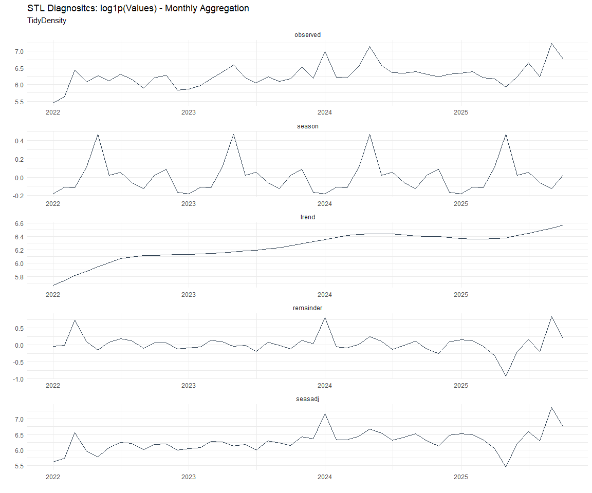

# Time Series Analysis, Modeling and Forecasting of the Healthyverse
Packages
Steven P. Sanderson II, MPH - Date:
2026-01-06

# Introduction

This analysis follows a *Nested Modeltime Workflow* from **`modeltime`**
along with using the **`NNS`** package. I use this to monitor the
downloads of all of my packages:

- [`healthyR`](https://www.spsanderson.com/healthyR/)
- [`healthyR.data`](https://www.spsanderson.com/healthyR.data/)
- [`healthyR.ts`](https://www.spsanderson.com/healthyR.ts/)
- [`healthyR.ai`](https://www.spsanderson.com/healthyR.ai/)
- [`healthyverse`](https://www.spsanderson.com/healthyverse/)
- [`TidyDensity`](https://www.spsanderson.com/TidyDensity/)
- [`tidyAML`](https://www.spsanderson.com/tidyAML/)
- [`RandomWalker`](https://www.spsanderson.com/RandomWalker/)

## Get Data

``` r
glimpse(downloads_tbl)
```

    Rows: 164,853
    Columns: 11
    $ date      <date> 2020-11-23, 2020-11-23, 2020-11-23, 2020-11-23, 2020-11-23,…
    $ time      <Period> 15H 36M 55S, 11H 26M 39S, 23H 34M 44S, 18H 39M 32S, 9H 0M…
    $ date_time <dttm> 2020-11-23 15:36:55, 2020-11-23 11:26:39, 2020-11-23 23:34:…
    $ size      <int> 4858294, 4858294, 4858301, 4858295, 361, 4863722, 4864794, 4…
    $ r_version <chr> NA, "4.0.3", "3.5.3", "3.5.2", NA, NA, NA, NA, NA, NA, NA, N…
    $ r_arch    <chr> NA, "x86_64", "x86_64", "x86_64", NA, NA, NA, NA, NA, NA, NA…
    $ r_os      <chr> NA, "mingw32", "mingw32", "linux-gnu", NA, NA, NA, NA, NA, N…
    $ package   <chr> "healthyR.data", "healthyR.data", "healthyR.data", "healthyR…
    $ version   <chr> "1.0.0", "1.0.0", "1.0.0", "1.0.0", "1.0.0", "1.0.0", "1.0.0…
    $ country   <chr> "US", "US", "US", "GB", "US", "US", "DE", "HK", "JP", "US", …
    $ ip_id     <int> 2069, 2804, 78827, 27595, 90474, 90474, 42435, 74, 7655, 638…

The last day in the data set is 2026-01-04 23:48:33, the file was
birthed on: 2025-10-31 10:47:59.603742, and at report knit time is
1569.01 hours old. Happy analyzing!

Now that we have our data lets take a look at it using the `skimr`
package.

``` r
skim(downloads_tbl)
```

|                                                  |               |
|:-------------------------------------------------|:--------------|
| Name                                             | downloads_tbl |
| Number of rows                                   | 164853        |
| Number of columns                                | 11            |
| \_\_\_\_\_\_\_\_\_\_\_\_\_\_\_\_\_\_\_\_\_\_\_   |               |
| Column type frequency:                           |               |
| character                                        | 6             |
| Date                                             | 1             |
| numeric                                          | 2             |
| POSIXct                                          | 1             |
| Timespan                                         | 1             |
| \_\_\_\_\_\_\_\_\_\_\_\_\_\_\_\_\_\_\_\_\_\_\_\_ |               |
| Group variables                                  | None          |

Data summary

**Variable type: character**

| skim_variable | n_missing | complete_rate | min | max | empty | n_unique | whitespace |
|:--------------|----------:|--------------:|----:|----:|------:|---------:|-----------:|
| r_version     |    121226 |          0.26 |   5 |   7 |     0 |       50 |          0 |
| r_arch        |    121226 |          0.26 |   1 |   7 |     0 |        6 |          0 |
| r_os          |    121226 |          0.26 |   7 |  19 |     0 |       24 |          0 |
| package       |         0 |          1.00 |   7 |  13 |     0 |        8 |          0 |
| version       |         0 |          1.00 |   5 |  17 |     0 |       62 |          0 |
| country       |     15388 |          0.91 |   2 |   2 |     0 |      166 |          0 |

**Variable type: Date**

| skim_variable | n_missing | complete_rate | min | max | median | n_unique |
|:---|---:|---:|:---|:---|:---|---:|
| date | 0 | 1 | 2020-11-23 | 2026-01-04 | 2023-11-16 | 1862 |

**Variable type: numeric**

| skim_variable | n_missing | complete_rate | mean | sd | p0 | p25 | p50 | p75 | p100 | hist |
|:---|---:|---:|---:|---:|---:|---:|---:|---:|---:|:---|
| size | 0 | 1 | 1124052 | 1486102.27 | 355 | 31085 | 310611 | 2348407 | 5677952 | ▇▁▂▁▁ |
| ip_id | 0 | 1 | 11241 | 21872.59 | 1 | 231 | 2831 | 11809 | 299146 | ▇▁▁▁▁ |

**Variable type: POSIXct**

| skim_variable | n_missing | complete_rate | min | max | median | n_unique |
|:---|---:|---:|:---|:---|:---|---:|
| date_time | 0 | 1 | 2020-11-23 09:00:41 | 2026-01-04 23:48:33 | 2023-11-16 19:35:16 | 104194 |

**Variable type: Timespan**

| skim_variable | n_missing | complete_rate | min | max |     median | n_unique |
|:--------------|----------:|--------------:|----:|----:|-----------:|---------:|
| time          |         0 |             1 |   0 |  59 | 12H 6M 40S |       60 |

We can see that the following columns are missing a lot of data and for
us are most likely not useful anyways, so we will drop them
`c(r_version, r_arch, r_os)`

## Plots

Now lets take a look at a time-series plot of the total daily downloads
by package. We will use a log scale and place a vertical line at each
version release for each package.


    [[1]]


    [[2]]


    [[3]]


    [[4]]


    [[5]]


    [[6]]


    [[7]]


    [[8]]


Now lets take a look at some time series decomposition graphs.

    [[1]]


    [[2]]


    [[3]]


    [[4]]


    [[5]]


    [[6]]


    [[7]]


    [[8]]


    [[1]]


    [[2]]




    [[3]]


    [[4]]


    [[5]]


    [[6]]


    [[7]]


    [[8]]


Seasonal Diagnostics:

    [[1]]


    [[2]]


    [[3]]


    [[4]]


    [[5]]


    [[6]]


    [[7]]


    [[8]]


ACF and PACF Diagnostics:

    [[1]]


    [[2]]


    [[3]]


    [[4]]


    [[5]]


    [[6]]


    [[7]]


    [[8]]


## Feature Engineering

Now that we have our basic data and a shot of what it looks like, let’s
add some features to our data which can be very helpful in modeling.
Lets start by making a `tibble` that is aggregated by the day and
package, as we are going to be interested in forecasting the next 4
weeks or 28 days for each package. First lets get our base data.


    Call:
    stats::lm(formula = .formula, data = df)

    Residuals:
        Min      1Q  Median      3Q     Max 
    -148.20  -36.68  -11.15   27.17  820.65 

    Coefficients:
                                                         Estimate Std. Error
    (Intercept)                                        -1.759e+02  5.881e+01
    date                                                1.083e-02  3.116e-03
    lag(value, 1)                                       1.070e-01  2.301e-02
    lag(value, 7)                                       8.802e-02  2.373e-02
    lag(value, 14)                                      7.659e-02  2.370e-02
    lag(value, 21)                                      8.485e-02  2.377e-02
    lag(value, 28)                                      6.879e-02  2.368e-02
    lag(value, 35)                                      5.217e-02  2.368e-02
    lag(value, 42)                                      6.442e-02  2.380e-02
    lag(value, 49)                                      6.580e-02  2.369e-02
    month(date, label = TRUE).L                        -1.019e+01  4.924e+00
    month(date, label = TRUE).Q                         1.265e-01  4.814e+00
    month(date, label = TRUE).C                        -1.558e+01  4.849e+00
    month(date, label = TRUE)^4                        -6.377e+00  4.876e+00
    month(date, label = TRUE)^5                        -6.455e+00  4.855e+00
    month(date, label = TRUE)^6                         1.110e+00  4.886e+00
    month(date, label = TRUE)^7                        -4.404e+00  4.831e+00
    month(date, label = TRUE)^8                        -4.111e+00  4.807e+00
    month(date, label = TRUE)^9                         2.822e+00  4.820e+00
    month(date, label = TRUE)^10                        9.179e-01  4.837e+00
    month(date, label = TRUE)^11                       -4.105e+00  4.823e+00
    fourier_vec(date, type = "sin", K = 1, period = 7) -1.109e+01  2.188e+00
    fourier_vec(date, type = "cos", K = 1, period = 7)  7.166e+00  2.264e+00
                                                       t value Pr(>|t|)    
    (Intercept)                                         -2.991 0.002817 ** 
    date                                                 3.477 0.000519 ***
    lag(value, 1)                                        4.648 3.60e-06 ***
    lag(value, 7)                                        3.709 0.000215 ***
    lag(value, 14)                                       3.232 0.001252 ** 
    lag(value, 21)                                       3.570 0.000366 ***
    lag(value, 28)                                       2.906 0.003708 ** 
    lag(value, 35)                                       2.203 0.027715 *  
    lag(value, 42)                                       2.707 0.006852 ** 
    lag(value, 49)                                       2.778 0.005524 ** 
    month(date, label = TRUE).L                         -2.069 0.038651 *  
    month(date, label = TRUE).Q                          0.026 0.979041    
    month(date, label = TRUE).C                         -3.213 0.001339 ** 
    month(date, label = TRUE)^4                         -1.308 0.191056    
    month(date, label = TRUE)^5                         -1.329 0.183876    
    month(date, label = TRUE)^6                          0.227 0.820331    
    month(date, label = TRUE)^7                         -0.912 0.362018    
    month(date, label = TRUE)^8                         -0.855 0.392491    
    month(date, label = TRUE)^9                          0.586 0.558271    
    month(date, label = TRUE)^10                         0.190 0.849511    
    month(date, label = TRUE)^11                        -0.851 0.394820    
    fourier_vec(date, type = "sin", K = 1, period = 7)  -5.067 4.45e-07 ***
    fourier_vec(date, type = "cos", K = 1, period = 7)   3.165 0.001575 ** 
    ---
    Signif. codes:  0 '***' 0.001 '**' 0.01 '*' 0.05 '.' 0.1 ' ' 1

    Residual standard error: 59.17 on 1790 degrees of freedom
      (49 observations deleted due to missingness)
    Multiple R-squared:  0.2278,    Adjusted R-squared:  0.2183 
    F-statistic:    24 on 22 and 1790 DF,  p-value: < 2.2e-16


## NNS Forecasting

This is something I have been wanting to try for a while. The `NNS`
package is a great package for forecasting time series data.

[NNS GitHub](https://github.com/OVVO-Financial/NNS)

``` r
library(NNS)

data_list <- base_data |>
    select(package, value) |>
    group_split(package)

data_list |>
    imap(
        \(x, idx) {
            obj <- x
            x <- obj |> pull(value) |> tail(7*52)
            train_set_size <- length(x) - 56
            pkg <- obj |> pluck(1) |> unique()
#            sf <- NNS.seas(x, modulo = 7, plot = FALSE)$periods
            seas <- t(
                sapply(
                    1:25, 
                    function(i) c(
                        i,
                        sqrt(
                            mean((
                                NNS.ARMA(x, 
                                         h = 28, 
                                         training.set = train_set_size, 
                                         method = "lin", 
                                         seasonal.factor = i, 
                                         plot=FALSE
                                         ) - tail(x, 28)) ^ 2)))
                    )
                )
            colnames(seas) <- c("Period", "RMSE")
            sf <- seas[which.min(seas[, 2]), 1]
            
            cat(paste0("Package: ", pkg, "\n"))
            NNS.ARMA.optim(
                variable = x,
                h = 28,
                training.set = train_set_size,
                #seasonal.factor = seq(12, 60, 7),
                seasonal.factor = sf,
                pred.int = 0.95,
                plot = TRUE
            )
            title(
                sub = paste0("\n",
                             "Package: ", pkg, " - NNS Optimization")
            )
        }
    )
```

    Package: healthyR
    [1] "CURRNET METHOD: lin"
    [1] "COPY LATEST PARAMETERS DIRECTLY FOR NNS.ARMA() IF ERROR:"
    [1] "NNS.ARMA(... method =  'lin' , seasonal.factor =  c( 16 ) ...)"
    [1] "CURRENT lin OBJECTIVE FUNCTION = 15.3375447195002"
    [1] "BEST method = 'lin' PATH MEMBER = c( 16 )"
    [1] "BEST lin OBJECTIVE FUNCTION = 15.3375447195002"
    [1] "CURRNET METHOD: nonlin"
    [1] "COPY LATEST PARAMETERS DIRECTLY FOR NNS.ARMA() IF ERROR:"
    [1] "NNS.ARMA(... method =  'nonlin' , seasonal.factor =  c( 16 ) ...)"
    [1] "CURRENT nonlin OBJECTIVE FUNCTION = 11.4040218368602"
    [1] "BEST method = 'nonlin' PATH MEMBER = c( 16 )"
    [1] "BEST nonlin OBJECTIVE FUNCTION = 11.4040218368602"
    [1] "CURRNET METHOD: both"
    [1] "COPY LATEST PARAMETERS DIRECTLY FOR NNS.ARMA() IF ERROR:"
    [1] "NNS.ARMA(... method =  'both' , seasonal.factor =  c( 16 ) ...)"
    [1] "CURRENT both OBJECTIVE FUNCTION = 12.7446804945547"
    [1] "BEST method = 'both' PATH MEMBER = c( 16 )"
    [1] "BEST both OBJECTIVE FUNCTION = 12.7446804945547"


    Package: healthyR.ai
    [1] "CURRNET METHOD: lin"
    [1] "COPY LATEST PARAMETERS DIRECTLY FOR NNS.ARMA() IF ERROR:"
    [1] "NNS.ARMA(... method =  'lin' , seasonal.factor =  c( 4 ) ...)"
    [1] "CURRENT lin OBJECTIVE FUNCTION = 14.7927325169035"
    [1] "BEST method = 'lin' PATH MEMBER = c( 4 )"
    [1] "BEST lin OBJECTIVE FUNCTION = 14.7927325169035"
    [1] "CURRNET METHOD: nonlin"
    [1] "COPY LATEST PARAMETERS DIRECTLY FOR NNS.ARMA() IF ERROR:"
    [1] "NNS.ARMA(... method =  'nonlin' , seasonal.factor =  c( 4 ) ...)"
    [1] "CURRENT nonlin OBJECTIVE FUNCTION = 11.1807889213948"
    [1] "BEST method = 'nonlin' PATH MEMBER = c( 4 )"
    [1] "BEST nonlin OBJECTIVE FUNCTION = 11.1807889213948"
    [1] "CURRNET METHOD: both"
    [1] "COPY LATEST PARAMETERS DIRECTLY FOR NNS.ARMA() IF ERROR:"
    [1] "NNS.ARMA(... method =  'both' , seasonal.factor =  c( 4 ) ...)"
    [1] "CURRENT both OBJECTIVE FUNCTION = 13.9919188580079"
    [1] "BEST method = 'both' PATH MEMBER = c( 4 )"
    [1] "BEST both OBJECTIVE FUNCTION = 13.9919188580079"


    Package: healthyR.data
    [1] "CURRNET METHOD: lin"
    [1] "COPY LATEST PARAMETERS DIRECTLY FOR NNS.ARMA() IF ERROR:"
    [1] "NNS.ARMA(... method =  'lin' , seasonal.factor =  c( 13 ) ...)"
    [1] "CURRENT lin OBJECTIVE FUNCTION = 6.90966524552178"
    [1] "BEST method = 'lin' PATH MEMBER = c( 13 )"
    [1] "BEST lin OBJECTIVE FUNCTION = 6.90966524552178"
    [1] "CURRNET METHOD: nonlin"
    [1] "COPY LATEST PARAMETERS DIRECTLY FOR NNS.ARMA() IF ERROR:"
    [1] "NNS.ARMA(... method =  'nonlin' , seasonal.factor =  c( 13 ) ...)"
    [1] "CURRENT nonlin OBJECTIVE FUNCTION = 5.55986339902426"
    [1] "BEST method = 'nonlin' PATH MEMBER = c( 13 )"
    [1] "BEST nonlin OBJECTIVE FUNCTION = 5.55986339902426"
    [1] "CURRNET METHOD: both"
    [1] "COPY LATEST PARAMETERS DIRECTLY FOR NNS.ARMA() IF ERROR:"
    [1] "NNS.ARMA(... method =  'both' , seasonal.factor =  c( 13 ) ...)"
    [1] "CURRENT both OBJECTIVE FUNCTION = 5.54586930660454"
    [1] "BEST method = 'both' PATH MEMBER = c( 13 )"
    [1] "BEST both OBJECTIVE FUNCTION = 5.54586930660454"


    Package: healthyR.ts
    [1] "CURRNET METHOD: lin"
    [1] "COPY LATEST PARAMETERS DIRECTLY FOR NNS.ARMA() IF ERROR:"
    [1] "NNS.ARMA(... method =  'lin' , seasonal.factor =  c( 8 ) ...)"
    [1] "CURRENT lin OBJECTIVE FUNCTION = 8.29321733613347"
    [1] "BEST method = 'lin' PATH MEMBER = c( 8 )"
    [1] "BEST lin OBJECTIVE FUNCTION = 8.29321733613347"
    [1] "CURRNET METHOD: nonlin"
    [1] "COPY LATEST PARAMETERS DIRECTLY FOR NNS.ARMA() IF ERROR:"
    [1] "NNS.ARMA(... method =  'nonlin' , seasonal.factor =  c( 8 ) ...)"
    [1] "CURRENT nonlin OBJECTIVE FUNCTION = 29.6485301004523"
    [1] "BEST method = 'nonlin' PATH MEMBER = c( 8 )"
    [1] "BEST nonlin OBJECTIVE FUNCTION = 29.6485301004523"
    [1] "CURRNET METHOD: both"
    [1] "COPY LATEST PARAMETERS DIRECTLY FOR NNS.ARMA() IF ERROR:"
    [1] "NNS.ARMA(... method =  'both' , seasonal.factor =  c( 8 ) ...)"
    [1] "CURRENT both OBJECTIVE FUNCTION = 21.048140338863"
    [1] "BEST method = 'both' PATH MEMBER = c( 8 )"
    [1] "BEST both OBJECTIVE FUNCTION = 21.048140338863"


    Package: healthyverse
    [1] "CURRNET METHOD: lin"
    [1] "COPY LATEST PARAMETERS DIRECTLY FOR NNS.ARMA() IF ERROR:"
    [1] "NNS.ARMA(... method =  'lin' , seasonal.factor =  c( 2 ) ...)"
    [1] "CURRENT lin OBJECTIVE FUNCTION = 12.2768225695489"
    [1] "BEST method = 'lin' PATH MEMBER = c( 2 )"
    [1] "BEST lin OBJECTIVE FUNCTION = 12.2768225695489"
    [1] "CURRNET METHOD: nonlin"
    [1] "COPY LATEST PARAMETERS DIRECTLY FOR NNS.ARMA() IF ERROR:"
    [1] "NNS.ARMA(... method =  'nonlin' , seasonal.factor =  c( 2 ) ...)"
    [1] "CURRENT nonlin OBJECTIVE FUNCTION = 60.0571785006502"
    [1] "BEST method = 'nonlin' PATH MEMBER = c( 2 )"
    [1] "BEST nonlin OBJECTIVE FUNCTION = 60.0571785006502"
    [1] "CURRNET METHOD: both"
    [1] "COPY LATEST PARAMETERS DIRECTLY FOR NNS.ARMA() IF ERROR:"
    [1] "NNS.ARMA(... method =  'both' , seasonal.factor =  c( 2 ) ...)"
    [1] "CURRENT both OBJECTIVE FUNCTION = 23.0419899836871"
    [1] "BEST method = 'both' PATH MEMBER = c( 2 )"
    [1] "BEST both OBJECTIVE FUNCTION = 23.0419899836871"


    Package: RandomWalker
    [1] "CURRNET METHOD: lin"
    [1] "COPY LATEST PARAMETERS DIRECTLY FOR NNS.ARMA() IF ERROR:"
    [1] "NNS.ARMA(... method =  'lin' , seasonal.factor =  c( 22 ) ...)"
    [1] "CURRENT lin OBJECTIVE FUNCTION = 4.49838184941311"
    [1] "BEST method = 'lin' PATH MEMBER = c( 22 )"
    [1] "BEST lin OBJECTIVE FUNCTION = 4.49838184941311"
    [1] "CURRNET METHOD: nonlin"
    [1] "COPY LATEST PARAMETERS DIRECTLY FOR NNS.ARMA() IF ERROR:"
    [1] "NNS.ARMA(... method =  'nonlin' , seasonal.factor =  c( 22 ) ...)"
    [1] "CURRENT nonlin OBJECTIVE FUNCTION = 10.8607772737289"
    [1] "BEST method = 'nonlin' PATH MEMBER = c( 22 )"
    [1] "BEST nonlin OBJECTIVE FUNCTION = 10.8607772737289"
    [1] "CURRNET METHOD: both"
    [1] "COPY LATEST PARAMETERS DIRECTLY FOR NNS.ARMA() IF ERROR:"
    [1] "NNS.ARMA(... method =  'both' , seasonal.factor =  c( 22 ) ...)"
    [1] "CURRENT both OBJECTIVE FUNCTION = 10.1224422810556"
    [1] "BEST method = 'both' PATH MEMBER = c( 22 )"
    [1] "BEST both OBJECTIVE FUNCTION = 10.1224422810556"


    Package: tidyAML
    [1] "CURRNET METHOD: lin"
    [1] "COPY LATEST PARAMETERS DIRECTLY FOR NNS.ARMA() IF ERROR:"
    [1] "NNS.ARMA(... method =  'lin' , seasonal.factor =  c( 5 ) ...)"
    [1] "CURRENT lin OBJECTIVE FUNCTION = 33.8463297800922"
    [1] "BEST method = 'lin' PATH MEMBER = c( 5 )"
    [1] "BEST lin OBJECTIVE FUNCTION = 33.8463297800922"
    [1] "CURRNET METHOD: nonlin"
    [1] "COPY LATEST PARAMETERS DIRECTLY FOR NNS.ARMA() IF ERROR:"
    [1] "NNS.ARMA(... method =  'nonlin' , seasonal.factor =  c( 5 ) ...)"
    [1] "CURRENT nonlin OBJECTIVE FUNCTION = 7.30132358836258"
    [1] "BEST method = 'nonlin' PATH MEMBER = c( 5 )"
    [1] "BEST nonlin OBJECTIVE FUNCTION = 7.30132358836258"
    [1] "CURRNET METHOD: both"
    [1] "COPY LATEST PARAMETERS DIRECTLY FOR NNS.ARMA() IF ERROR:"
    [1] "NNS.ARMA(... method =  'both' , seasonal.factor =  c( 5 ) ...)"
    [1] "CURRENT both OBJECTIVE FUNCTION = 7.30013562751861"
    [1] "BEST method = 'both' PATH MEMBER = c( 5 )"
    [1] "BEST both OBJECTIVE FUNCTION = 7.30013562751861"


    Package: TidyDensity
    [1] "CURRNET METHOD: lin"
    [1] "COPY LATEST PARAMETERS DIRECTLY FOR NNS.ARMA() IF ERROR:"
    [1] "NNS.ARMA(... method =  'lin' , seasonal.factor =  c( 6 ) ...)"
    [1] "CURRENT lin OBJECTIVE FUNCTION = 5.89623069258596"
    [1] "BEST method = 'lin' PATH MEMBER = c( 6 )"
    [1] "BEST lin OBJECTIVE FUNCTION = 5.89623069258596"
    [1] "CURRNET METHOD: nonlin"
    [1] "COPY LATEST PARAMETERS DIRECTLY FOR NNS.ARMA() IF ERROR:"
    [1] "NNS.ARMA(... method =  'nonlin' , seasonal.factor =  c( 6 ) ...)"
    [1] "CURRENT nonlin OBJECTIVE FUNCTION = 2.55886607400594"
    [1] "BEST method = 'nonlin' PATH MEMBER = c( 6 )"
    [1] "BEST nonlin OBJECTIVE FUNCTION = 2.55886607400594"
    [1] "CURRNET METHOD: both"
    [1] "COPY LATEST PARAMETERS DIRECTLY FOR NNS.ARMA() IF ERROR:"
    [1] "NNS.ARMA(... method =  'both' , seasonal.factor =  c( 6 ) ...)"
    [1] "CURRENT both OBJECTIVE FUNCTION = 3.19430517670565"
    [1] "BEST method = 'both' PATH MEMBER = c( 6 )"
    [1] "BEST both OBJECTIVE FUNCTION = 3.19430517670565"


    [[1]]
    NULL

    [[2]]
    NULL

    [[3]]
    NULL

    [[4]]
    NULL

    [[5]]
    NULL

    [[6]]
    NULL

    [[7]]
    NULL

    [[8]]
    NULL

## Pre-Processing

Now we are going to do some basic pre-processing.

``` r
data_padded_tbl <- base_data %>%
  pad_by_time(
    .date_var  = date,
    .pad_value = 0
  )

# Get log interval and standardization parameters
log_params  <- liv(data_padded_tbl$value, limit_lower = 0, offset = 1, silent = TRUE)
limit_lower <- log_params$limit_lower
limit_upper <- log_params$limit_upper
offset      <- log_params$offset

data_liv_tbl <- data_padded_tbl %>%
  # Get log interval transform
  mutate(value_trans = liv(value, limit_lower = 0, offset = 1, silent = TRUE)$log_scaled)

# Get Standardization Params
std_params <- standard_vec(data_liv_tbl$value_trans, silent = TRUE)
std_mean   <- std_params$mean
std_sd     <- std_params$sd

data_transformed_tbl <- data_liv_tbl %>%
  group_by(package) %>%
  # get standardization
  mutate(value_trans = standard_vec(value_trans, silent = TRUE)$standard_scaled) %>%
  tk_augment_fourier(
    .date_var = date,
    .periods  = c(7, 14, 30, 90, 180),
    .K        = 2
  ) %>%
  tk_augment_timeseries_signature(
    .date_var = date
  ) %>%
  ungroup() %>%
  select(-c(value, -year.iso))
```

Since this is panel data we can follow one of two different modeling
strategies. We can search for a global model in the panel data or we can
use nested forecasting finding the best model for each of the time
series. Since we only have 5 panels, we will use nested forecasting.

To do this we will use the `nest_timeseries` and
`split_nested_timeseries` functions to create a nested `tibble`.

``` r
horizon <- 4*7

nested_data_tbl <- data_transformed_tbl %>%

    # 0. Filter out column where package is NA
    filter(!is.na(package)) %>%
    
    # 1. Extending: We'll predict n days into the future.
    extend_timeseries(
        .id_var        = package,
        .date_var      = date,
        .length_future = horizon
    ) %>%
    
    # 2. Nesting: We'll group by id, and create a future dataset
    #    that forecasts n days of extended data and
    #    an actual dataset that contains n*2 days
    nest_timeseries(
        .id_var        = package,
        .length_future = horizon
        #.length_actual = horizon*2
    ) %>%
    
   # 3. Splitting: We'll take the actual data and create splits
   #    for accuracy and confidence interval estimation of n das (test)
   #    and the rest is training data
    split_nested_timeseries(
        .length_test = horizon
    )

nested_data_tbl
```

    # A tibble: 8 × 4
      package       .actual_data          .future_data       .splits          
      <fct>         <list>                <list>             <list>           
    1 healthyR.data <tibble [1,853 × 50]> <tibble [28 × 50]> <split [1825|28]>
    2 healthyR      <tibble [1,845 × 50]> <tibble [28 × 50]> <split [1817|28]>
    3 healthyR.ts   <tibble [1,787 × 50]> <tibble [28 × 50]> <split [1759|28]>
    4 healthyverse  <tibble [1,752 × 50]> <tibble [28 × 50]> <split [1724|28]>
    5 healthyR.ai   <tibble [1,587 × 50]> <tibble [28 × 50]> <split [1559|28]>
    6 TidyDensity   <tibble [1,438 × 50]> <tibble [28 × 50]> <split [1410|28]>
    7 tidyAML       <tibble [1,045 × 50]> <tibble [28 × 50]> <split [1017|28]>
    8 RandomWalker  <tibble [468 × 50]>   <tibble [28 × 50]> <split [440|28]> 

Now it is time to make some recipes and models using the modeltime
workflow.

## Modeltime Workflow

### Recipe Object

``` r
recipe_base <- recipe(
  value_trans ~ .
  , data = extract_nested_test_split(nested_data_tbl)
  )

recipe_base

recipe_date <- recipe(
  value_trans ~ date
  , data = extract_nested_test_split(nested_data_tbl)
  )
```

### Models

``` r
# Models ------------------------------------------------------------------

# Auto ARIMA --------------------------------------------------------------

model_spec_arima_no_boost <- arima_reg() %>%
  set_engine(engine = "auto_arima")

wflw_auto_arima <- workflow() %>%
  add_recipe(recipe = recipe_date) %>%
  add_model(model_spec_arima_no_boost)

# NNETAR ------------------------------------------------------------------

model_spec_nnetar <- nnetar_reg(
  mode              = "regression"
  , seasonal_period = "auto"
) %>%
  set_engine("nnetar")

wflw_nnetar <- workflow() %>%
  add_recipe(recipe = recipe_base) %>%
  add_model(model_spec_nnetar)

# TSLM --------------------------------------------------------------------

model_spec_lm <- linear_reg() %>%
  set_engine("lm")

wflw_lm <- workflow() %>%
  add_recipe(recipe = recipe_base) %>%
  add_model(model_spec_lm)

# MARS --------------------------------------------------------------------

model_spec_mars <- mars(mode = "regression") %>%
  set_engine("earth")

wflw_mars <- workflow() %>%
  add_recipe(recipe = recipe_date) %>%
  add_model(model_spec_mars)
```

### Nested Modeltime Tables

``` r
nested_modeltime_tbl <- modeltime_nested_fit(
  # Nested Data
  nested_data = nested_data_tbl,
   control = control_nested_fit(
     verbose = TRUE,
     allow_par = FALSE
   ),
  # Add workflows
  wflw_auto_arima,
  wflw_lm,
  wflw_mars,
  wflw_nnetar
)
```

``` r
nested_modeltime_tbl <- nested_modeltime_tbl[!is.na(nested_modeltime_tbl$package),]
```

### Model Accuracy

``` r
nested_modeltime_tbl %>%
  extract_nested_test_accuracy() %>%
  filter(!is.na(package)) %>%
  knitr::kable()
```

| package | .model_id | .model_desc | .type | mae | mape | mase | smape | rmse | rsq |
|:---|---:|:---|:---|---:|---:|---:|---:|---:|---:|
| healthyR.data | 1 | ARIMA | Test | 0.7578340 | 145.0835 | 0.6554213 | 141.35743 | 0.8644076 | 0.0292705 |
| healthyR.data | 2 | LM | Test | 0.6874184 | 168.3160 | 0.5945216 | 124.63111 | 0.8097925 | 0.1051755 |
| healthyR.data | 3 | EARTH | Test | 0.9220000 | 282.3848 | 0.7974021 | 119.54934 | 1.1239345 | 0.0073992 |
| healthyR.data | 4 | NNAR | Test | 0.8022747 | 187.7042 | 0.6938563 | 146.95421 | 0.9343985 | 0.0028730 |
| healthyR | 1 | ARIMA | Test | 0.5593000 | 277.2975 | 0.7688134 | 125.73295 | 0.7107429 | 0.0732535 |
| healthyR | 2 | LM | Test | 0.6150742 | 422.4944 | 0.8454805 | 110.47498 | 0.7660006 | 0.0020377 |
| healthyR | 3 | EARTH | Test | 0.8784828 | 598.5638 | 1.2075619 | 116.97903 | 1.0117449 | 0.1666974 |
| healthyR | 4 | NNAR | Test | 0.6226752 | 303.1489 | 0.8559290 | 129.43005 | 0.7947137 | 0.0029335 |
| healthyR.ts | 1 | ARIMA | Test | 0.7597291 | 130.8912 | 0.8607072 | 147.56726 | 1.0403687 | 0.0046170 |
| healthyR.ts | 2 | LM | Test | 0.7732641 | 120.1110 | 0.8760411 | 120.62104 | 1.0685448 | 0.0012692 |
| healthyR.ts | 3 | EARTH | Test | 0.6628172 | 129.9172 | 0.7509144 | 98.06494 | 0.9151926 | 0.0599089 |
| healthyR.ts | 4 | NNAR | Test | 0.8317930 | 134.7523 | 0.9423493 | 137.34422 | 1.1134440 | 0.0000005 |
| healthyverse | 1 | ARIMA | Test | 0.6972805 | 104.3177 | 0.7581001 | 109.43981 | 0.8683722 | 0.0013685 |
| healthyverse | 2 | LM | Test | 0.7664275 | 127.5640 | 0.8332783 | 120.03474 | 0.9063872 | 0.0154571 |
| healthyverse | 3 | EARTH | Test | 0.9256873 | 231.2822 | 1.0064293 | 101.57561 | 1.0751317 | 0.0867023 |
| healthyverse | 4 | NNAR | Test | 0.7778497 | 114.0167 | 0.8456968 | 135.66577 | 0.9826632 | 0.0007080 |
| healthyR.ai | 1 | ARIMA | Test | 1.0498128 | 141.9263 | 0.9799937 | 173.96545 | 1.2699094 | 0.0025039 |
| healthyR.ai | 2 | LM | Test | 0.8670401 | 150.1914 | 0.8093765 | 138.33875 | 1.0296104 | 0.0698462 |
| healthyR.ai | 3 | EARTH | Test | 2.6385236 | 636.7184 | 2.4630453 | 135.50133 | 3.0270917 | 0.1583030 |
| healthyR.ai | 4 | NNAR | Test | 0.8904333 | 142.6743 | 0.8312140 | 129.86041 | 1.0754060 | 0.0765659 |
| TidyDensity | 1 | ARIMA | Test | 1.0791580 | 184.3950 | 0.5602839 | 160.30866 | 1.1977793 | 0.1424087 |
| TidyDensity | 2 | LM | Test | 1.1100839 | 197.9702 | 0.5763402 | 159.99910 | 1.2462530 | 0.0258848 |
| TidyDensity | 3 | EARTH | Test | 1.0574536 | 142.2518 | 0.5490152 | 122.41830 | 1.3426785 | 0.0110361 |
| TidyDensity | 4 | NNAR | Test | 1.0871069 | 214.1447 | 0.5644109 | 149.91781 | 1.2085986 | 0.0662454 |
| tidyAML | 1 | ARIMA | Test | 0.8066408 | 103.1856 | 1.0480649 | 139.27949 | 1.0249866 | 0.0214404 |
| tidyAML | 2 | LM | Test | 0.8801796 | 194.9474 | 1.1436135 | 143.51536 | 1.0615945 | 0.0238070 |
| tidyAML | 3 | EARTH | Test | 0.7259201 | 259.4140 | 0.9431849 | 101.24153 | 0.7990809 | 0.3428368 |
| tidyAML | 4 | NNAR | Test | 0.7326149 | 257.8381 | 0.9518834 | 111.45094 | 0.8711499 | 0.0932576 |
| RandomWalker | 1 | ARIMA | Test | 0.8225549 | 116.6033 | 0.5919664 | 171.75555 | 0.9516447 | 0.0522229 |
| RandomWalker | 2 | LM | Test | 0.9187576 | 139.9568 | 0.6612004 | 162.57131 | 1.0776926 | 0.0001276 |
| RandomWalker | 3 | EARTH | Test | 1.0186079 | 214.2086 | 0.7330595 | 119.98713 | 1.3655629 | 0.0395202 |
| RandomWalker | 4 | NNAR | Test | 0.8433133 | 149.2491 | 0.6069056 | 151.06505 | 1.0100312 | 0.0157962 |

### Plot Models

``` r
nested_modeltime_tbl %>%
  extract_nested_test_forecast() %>%
  group_by(package) %>%
  filter_by_time(.date_var = .index, .start_date = max(.index) - 60) %>%
  ungroup() %>%
  plot_modeltime_forecast(
    .interactive = FALSE,
    .conf_interval_show  = FALSE,
    .facet_scales = "free"
  ) +
  theme_minimal() +
  facet_wrap(~ package, nrow = 3) +
  theme(legend.position = "bottom")
```


### Best Model

``` r
best_nested_modeltime_tbl <- nested_modeltime_tbl %>%
  modeltime_nested_select_best(
    metric = "rmse",
    minimize = TRUE,
    filter_test_forecasts = TRUE
  )

best_nested_modeltime_tbl %>%
  extract_nested_best_model_report()
```

    # Nested Modeltime Table
      

    # A tibble: 8 × 10
      package      .model_id .model_desc .type   mae  mape  mase smape  rmse     rsq
      <fct>            <int> <chr>       <chr> <dbl> <dbl> <dbl> <dbl> <dbl>   <dbl>
    1 healthyR.da…         2 LM          Test  0.687  168. 0.595 125.  0.810 0.105  
    2 healthyR             1 ARIMA       Test  0.559  277. 0.769 126.  0.711 0.0733 
    3 healthyR.ts          3 EARTH       Test  0.663  130. 0.751  98.1 0.915 0.0599 
    4 healthyverse         1 ARIMA       Test  0.697  104. 0.758 109.  0.868 0.00137
    5 healthyR.ai          2 LM          Test  0.867  150. 0.809 138.  1.03  0.0698 
    6 TidyDensity          1 ARIMA       Test  1.08   184. 0.560 160.  1.20  0.142  
    7 tidyAML              3 EARTH       Test  0.726  259. 0.943 101.  0.799 0.343  
    8 RandomWalker         1 ARIMA       Test  0.823  117. 0.592 172.  0.952 0.0522 

``` r
best_nested_modeltime_tbl %>%
  extract_nested_test_forecast() %>%
  #filter(!is.na(.model_id)) %>%
  group_by(package) %>%
  filter_by_time(.date_var = .index, .start_date = max(.index) - 60) %>%
  ungroup() %>%
  plot_modeltime_forecast(
    .interactive = FALSE,
    .conf_interval_alpha = 0.2,
    .facet_scales = "free"
  ) +
  facet_wrap(~ package, nrow = 3) +
  theme_minimal() +
  theme(legend.position = "bottom")
```


## Refitting and Future Forecast

Now that we have the best models, we can make our future forecasts.

``` r
nested_modeltime_refit_tbl <- best_nested_modeltime_tbl %>%
    modeltime_nested_refit(
        control = control_nested_refit(verbose = TRUE)
    )
```

``` r
nested_modeltime_refit_tbl
```

    # Nested Modeltime Table
      

    # A tibble: 8 × 5
      package       .actual_data .future_data .splits           .modeltime_tables 
      <fct>         <list>       <list>       <list>            <list>            
    1 healthyR.data <tibble>     <tibble>     <split [1825|28]> <mdl_tm_t [1 × 5]>
    2 healthyR      <tibble>     <tibble>     <split [1817|28]> <mdl_tm_t [1 × 5]>
    3 healthyR.ts   <tibble>     <tibble>     <split [1759|28]> <mdl_tm_t [1 × 5]>
    4 healthyverse  <tibble>     <tibble>     <split [1724|28]> <mdl_tm_t [1 × 5]>
    5 healthyR.ai   <tibble>     <tibble>     <split [1559|28]> <mdl_tm_t [1 × 5]>
    6 TidyDensity   <tibble>     <tibble>     <split [1410|28]> <mdl_tm_t [1 × 5]>
    7 tidyAML       <tibble>     <tibble>     <split [1017|28]> <mdl_tm_t [1 × 5]>
    8 RandomWalker  <tibble>     <tibble>     <split [440|28]>  <mdl_tm_t [1 × 5]>

``` r
nested_modeltime_refit_tbl %>%
  extract_nested_future_forecast() %>%
  group_by(package) %>%
  mutate(across(.value:.conf_hi, .fns = ~ standard_inv_vec(
    x    = .,
    mean = std_mean,
    sd   = std_sd
  )$standard_inverse_value)) %>%
  mutate(across(.value:.conf_hi, .fns = ~ liiv(
    x = .,
    limit_lower = limit_lower,
    limit_upper = limit_upper,
    offset      = offset
  )$rescaled_v)) %>%
  filter_by_time(.date_var = .index, .start_date = max(.index) - 60) %>%
  ungroup() %>%
  plot_modeltime_forecast(
    .interactive = FALSE,
    .conf_interval_alpha = 0.2,
    .facet_scales = "free"
  ) +
  facet_wrap(~ package, nrow = 3) +
  theme_minimal() +
  theme(legend.position = "bottom")
```


