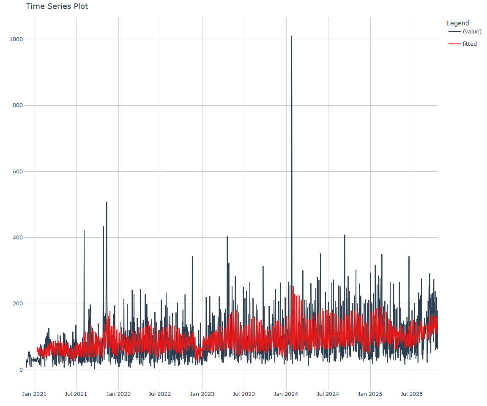

Time Series Analysis and Nested Modeling of the Healthyverse Packages
================
Steven P. Sanderson II, MPH - Date:
11 September, 2024

This analysis follows a *Nested Modeltime Workflow*.

## Get Data

``` r
glimpse(downloads_tbl)
```

    ## Rows: 113,482
    ## Columns: 11
    ## $ date      <date> 2020-11-23, 2020-11-23, 2020-11-23, 2020-11-23, 2020-11-23,…
    ## $ time      <Period> 15H 36M 55S, 11H 26M 39S, 23H 34M 44S, 18H 39M 32S, 9H 0M…
    ## $ date_time <dttm> 2020-11-23 15:36:55, 2020-11-23 11:26:39, 2020-11-23 23:34:…
    ## $ size      <int> 4858294, 4858294, 4858301, 4858295, 361, 4863722, 4864794, 4…
    ## $ r_version <chr> NA, "4.0.3", "3.5.3", "3.5.2", NA, NA, NA, NA, NA, NA, NA, N…
    ## $ r_arch    <chr> NA, "x86_64", "x86_64", "x86_64", NA, NA, NA, NA, NA, NA, NA…
    ## $ r_os      <chr> NA, "mingw32", "mingw32", "linux-gnu", NA, NA, NA, NA, NA, N…
    ## $ package   <chr> "healthyR.data", "healthyR.data", "healthyR.data", "healthyR…
    ## $ version   <chr> "1.0.0", "1.0.0", "1.0.0", "1.0.0", "1.0.0", "1.0.0", "1.0.0…
    ## $ country   <chr> "US", "US", "US", "GB", "US", "US", "DE", "HK", "JP", "US", …
    ## $ ip_id     <int> 2069, 2804, 78827, 27595, 90474, 90474, 42435, 74, 7655, 638…

The last day in the data set is 2024-09-09 23:12:19, the file was
birthed on: 2024-08-07 07:35:44, and at report knit time is -803.61
hours old. Happy analyzing!

Now that we have our data lets take a look at it using the `skimr`
package.

``` r
skim(downloads_tbl)
```

|                                                  |               |
|:-------------------------------------------------|:--------------|
| Name                                             | downloads_tbl |
| Number of rows                                   | 113482        |
| Number of columns                                | 11            |
| \_\_\_\_\_\_\_\_\_\_\_\_\_\_\_\_\_\_\_\_\_\_\_   |               |
| Column type frequency:                           |               |
| character                                        | 6             |
| Date                                             | 1             |
| numeric                                          | 2             |
| POSIXct                                          | 1             |
| Timespan                                         | 1             |
| \_\_\_\_\_\_\_\_\_\_\_\_\_\_\_\_\_\_\_\_\_\_\_\_ |               |
| Group variables                                  | None          |

Data summary

**Variable type: character**

| skim_variable | n_missing | complete_rate | min | max | empty | n_unique | whitespace |
|:--------------|----------:|--------------:|----:|----:|------:|---------:|-----------:|
| r_version     |     79839 |          0.30 |   5 |   5 |     0 |       43 |          0 |
| r_arch        |     79839 |          0.30 |   3 |   7 |     0 |        5 |          0 |
| r_os          |     79839 |          0.30 |   7 |  15 |     0 |       19 |          0 |
| package       |         0 |          1.00 |   7 |  13 |     0 |        7 |          0 |
| version       |         0 |          1.00 |   5 |  17 |     0 |       59 |          0 |
| country       |      9682 |          0.91 |   2 |   2 |     0 |      157 |          0 |

**Variable type: Date**

| skim_variable | n_missing | complete_rate | min        | max        | median     | n_unique |
|:--------------|----------:|--------------:|:-----------|:-----------|:-----------|---------:|
| date          |         0 |             1 | 2020-11-23 | 2024-09-09 | 2023-02-06 |     1387 |

**Variable type: numeric**

| skim_variable | n_missing | complete_rate |       mean |         sd |  p0 |   p25 |    p50 |     p75 |    p100 | hist  |
|:--------------|----------:|--------------:|-----------:|-----------:|----:|------:|-------:|--------:|--------:|:------|
| size          |         0 |             1 | 1176277.22 | 1557390.56 | 355 | 14701 | 271736 | 2373412 | 5677952 | ▇▁▂▁▁ |
| ip_id         |         0 |             1 |   10246.04 |   17950.61 |   1 |   317 |   3064 |   11354 |  143633 | ▇▁▁▁▁ |

**Variable type: POSIXct**

| skim_variable | n_missing | complete_rate | min                 | max                 | median              | n_unique |
|:--------------|----------:|--------------:|:--------------------|:--------------------|:--------------------|---------:|
| date_time     |         0 |             1 | 2020-11-23 09:00:41 | 2024-09-09 23:12:19 | 2023-02-06 06:36:05 |    68655 |

**Variable type: Timespan**

| skim_variable | n_missing | complete_rate | min | max | median | n_unique |
|:--------------|----------:|--------------:|----:|----:|-------:|---------:|
| time          |         0 |             1 |   0 |  59 |     30 |       60 |

We can see that the following columns are missing a lot of data and for
us are most likely not useful anyways, so we will drop them
`c(r_version, r_arch, r_os)`

## Plots

Now lets take a look at a time-series plot of the total daily downloads
by package. We will use a log scale and place a vertical line at each
version release for each package.

<!-- --><!-- -->

Now lets take a look at some time series decomposition graphs.

<!-- --><!-- --><!-- --><!-- -->

## Feature Engineering

Now that we have our basic data and a shot of what it looks like, let’s
add some features to our data which can be very helpful in modeling.
Lets start by making a `tibble` that is aggregated by the day and
package, as we are going to be interested in forecasting the next 4
weeks or 28 days for each package. First lets get our base data.

    ## 
    ## Call:
    ## stats::lm(formula = .formula, data = df)
    ## 
    ## Residuals:
    ##     Min      1Q  Median      3Q     Max 
    ## -151.38  -34.41   -9.38   26.05  800.46 
    ## 
    ## Coefficients:
    ##                                                      Estimate Std. Error
    ## (Intercept)                                        -1.670e+02  8.676e+01
    ## date                                                1.005e-02  4.597e-03
    ## lag(value, 1)                                       1.578e-01  2.634e-02
    ## lag(value, 7)                                       9.943e-02  2.737e-02
    ## lag(value, 14)                                      1.091e-01  2.747e-02
    ## lag(value, 21)                                      2.913e-02  2.762e-02
    ## lag(value, 28)                                      8.642e-02  2.744e-02
    ## lag(value, 35)                                      6.924e-02  2.755e-02
    ## lag(value, 42)                                      4.259e-02  2.762e-02
    ## lag(value, 49)                                      9.104e-02  2.748e-02
    ## month(date, label = TRUE).L                        -1.032e+01  5.686e+00
    ## month(date, label = TRUE).Q                         2.713e+00  5.527e+00
    ## month(date, label = TRUE).C                        -1.110e+01  5.657e+00
    ## month(date, label = TRUE)^4                        -9.283e+00  5.649e+00
    ## month(date, label = TRUE)^5                        -1.623e+01  5.575e+00
    ## month(date, label = TRUE)^6                        -4.240e+00  5.676e+00
    ## month(date, label = TRUE)^7                        -1.002e+01  5.523e+00
    ## month(date, label = TRUE)^8                        -5.441e-01  5.514e+00
    ## month(date, label = TRUE)^9                         6.885e+00  5.470e+00
    ## month(date, label = TRUE)^10                        7.270e+00  5.355e+00
    ## month(date, label = TRUE)^11                       -4.838e+00  5.265e+00
    ## fourier_vec(date, type = "sin", K = 1, period = 7) -1.152e+01  2.504e+00
    ## fourier_vec(date, type = "cos", K = 1, period = 7)  5.970e+00  2.591e+00
    ##                                                    t value Pr(>|t|)    
    ## (Intercept)                                         -1.925 0.054421 .  
    ## date                                                 2.186 0.028993 *  
    ## lag(value, 1)                                        5.992 2.68e-09 ***
    ## lag(value, 7)                                        3.633 0.000291 ***
    ## lag(value, 14)                                       3.972 7.51e-05 ***
    ## lag(value, 21)                                       1.055 0.291728    
    ## lag(value, 28)                                       3.150 0.001671 ** 
    ## lag(value, 35)                                       2.513 0.012094 *  
    ## lag(value, 42)                                       1.542 0.123257    
    ## lag(value, 49)                                       3.313 0.000949 ***
    ## month(date, label = TRUE).L                         -1.814 0.069846 .  
    ## month(date, label = TRUE).Q                          0.491 0.623624    
    ## month(date, label = TRUE).C                         -1.962 0.050011 .  
    ## month(date, label = TRUE)^4                         -1.643 0.100519    
    ## month(date, label = TRUE)^5                         -2.911 0.003659 ** 
    ## month(date, label = TRUE)^6                         -0.747 0.455153    
    ## month(date, label = TRUE)^7                         -1.815 0.069732 .  
    ## month(date, label = TRUE)^8                         -0.099 0.921411    
    ## month(date, label = TRUE)^9                          1.259 0.208357    
    ## month(date, label = TRUE)^10                         1.358 0.174751    
    ## month(date, label = TRUE)^11                        -0.919 0.358293    
    ## fourier_vec(date, type = "sin", K = 1, period = 7)  -4.602 4.58e-06 ***
    ## fourier_vec(date, type = "cos", K = 1, period = 7)   2.304 0.021350 *  
    ## ---
    ## Signif. codes:  0 '***' 0.001 '**' 0.01 '*' 0.05 '.' 0.1 ' ' 1
    ## 
    ## Residual standard error: 57.46 on 1315 degrees of freedom
    ##   (49 observations deleted due to missingness)
    ## Multiple R-squared:  0.2599, Adjusted R-squared:  0.2475 
    ## F-statistic: 20.99 on 22 and 1315 DF,  p-value: < 2.2e-16

<!-- -->

Now we are going to do some basic pre-processing.

``` r
data_padded_tbl <- base_data %>%
  pad_by_time(
    .date_var  = date,
    .pad_value = 0
  )

# Get log interval and standardization parameters
log_params  <- liv(data_padded_tbl$value, limit_lower = 0, offset = 1, silent = TRUE)
limit_lower <- log_params$limit_lower
limit_upper <- log_params$limit_upper
offset      <- log_params$offset

data_liv_tbl <- data_padded_tbl %>%
  # Get log interval transform
  mutate(value_trans = liv(value, limit_lower = 0, offset = 1, silent = TRUE)$log_scaled)

# Get Standardization Params
std_params <- standard_vec(data_liv_tbl$value_trans, silent = TRUE)
std_mean   <- std_params$mean
std_sd     <- std_params$sd

data_transformed_tbl <- data_liv_tbl %>%
  # get standardization
  mutate(value_trans = standard_vec(value_trans, silent = TRUE)$standard_scaled) %>%
  select(-value)
```

Since this is panel data we can follow one of two different modeling
strategies. We can search for a global model in the panel data or we can
use nested forecasting finding the best model for each of the time
series. Since we only have 5 panels, we will use nested forecasting.

To do this we will use the `nest_timeseries` and
`split_nested_timeseries` functions to create a nested `tibble`.

``` r
horizon <- 4*7

nested_data_tbl <- data_transformed_tbl %>%
    
    # 1. Extending: We'll predict n days into the future.
    extend_timeseries(
        .id_var        = package,
        .date_var      = date,
        .length_future = horizon
    ) %>%
    
    # 2. Nesting: We'll group by id, and create a future dataset
    #    that forecasts n days of extended data and
    #    an actual dataset that contains n*2 days
    nest_timeseries(
        .id_var        = package,
        .length_future = horizon
        #.length_actual = horizon*2
    ) %>%
    
   # 3. Splitting: We'll take the actual data and create splits
   #    for accuracy and confidence interval estimation of n das (test)
   #    and the rest is training data
    split_nested_timeseries(
        .length_test = horizon
    )

nested_data_tbl
```

    ## # A tibble: 8 × 4
    ##   package       .actual_data         .future_data      .splits          
    ##   <fct>         <list>               <list>            <list>           
    ## 1 healthyR.data <tibble [1,355 × 2]> <tibble [28 × 2]> <split [1327|28]>
    ## 2 healthyR      <tibble [1,347 × 2]> <tibble [28 × 2]> <split [1319|28]>
    ## 3 <NA>          <tibble [26 × 2]>    <tibble [28 × 2]> <split [0|26]>   
    ## 4 healthyR.ts   <tibble [1,293 × 2]> <tibble [28 × 2]> <split [1265|28]>
    ## 5 healthyverse  <tibble [1,264 × 2]> <tibble [28 × 2]> <split [1236|28]>
    ## 6 healthyR.ai   <tibble [1,090 × 2]> <tibble [28 × 2]> <split [1062|28]>
    ## 7 TidyDensity   <tibble [944 × 2]>   <tibble [28 × 2]> <split [916|28]> 
    ## 8 tidyAML       <tibble [560 × 2]>   <tibble [28 × 2]> <split [532|28]>

Now it is time to make some recipes and models using the modeltime
workflow.

## Modeltime Workflow

### Recipe Object

``` r
recipe_base <- recipe(
  value_trans ~ date
  , data = extract_nested_test_split(nested_data_tbl)
  )

recipe_base

recipe_date <- recipe_base %>%
    step_mutate(date = as.numeric(date))
```

### Models

``` r
# Models ------------------------------------------------------------------

# Auto ARIMA --------------------------------------------------------------

model_spec_arima_no_boost <- arima_reg() %>%
  set_engine(engine = "auto_arima")

wflw_auto_arima <- workflow() %>%
  add_recipe(recipe = recipe_base) %>%
  add_model(model_spec_arima_no_boost)

# NNETAR ------------------------------------------------------------------

model_spec_nnetar <- nnetar_reg(
  mode              = "regression"
  , seasonal_period = "auto"
) %>%
  set_engine("nnetar")

wflw_nnetar <- workflow() %>%
  add_recipe(recipe = recipe_base) %>%
  add_model(model_spec_nnetar)

# TSLM --------------------------------------------------------------------

model_spec_lm <- linear_reg() %>%
  set_engine("lm")

wflw_lm <- workflow() %>%
  add_recipe(recipe = recipe_base) %>%
  add_model(model_spec_lm)

# MARS --------------------------------------------------------------------

model_spec_mars <- mars(mode = "regression") %>%
  set_engine("earth")

wflw_mars <- workflow() %>%
  add_recipe(recipe = recipe_base) %>%
  add_model(model_spec_mars)
```

### Nested Modeltime Tables

``` r
nested_modeltime_tbl <- modeltime_nested_fit(
  # Nested Data
  nested_data = nested_data_tbl,
   control = control_nested_fit(
     verbose = TRUE,
     allow_par = FALSE
   ),
  # Add workflows
  wflw_auto_arima,
  wflw_lm,
  wflw_mars,
  wflw_nnetar
)
```

``` r
nested_modeltime_tbl <- nested_modeltime_tbl[!is.na(nested_modeltime_tbl$package),]
```

### Model Accuracy

``` r
nested_modeltime_tbl %>%
  extract_nested_test_accuracy() %>%
  knitr::kable()
```

| package       | .model_id | .model_desc | .type |       mae |       mape |      mase |     smape |      rmse |       rsq |
|:--------------|----------:|:------------|:------|----------:|-----------:|----------:|----------:|----------:|----------:|
| healthyR.data |         1 | ARIMA       | Test  | 0.6084702 |  112.26275 | 0.6883307 | 171.77281 | 0.8256842 | 0.0012624 |
| healthyR.data |         2 | LM          | Test  | 0.8739882 |  386.61250 | 0.9886974 | 176.94888 | 0.9944654 | 0.0617720 |
| healthyR.data |         3 | EARTH       | Test  | 0.5473888 |  154.55862 | 0.6192325 | 121.38253 | 0.8058766 | 0.0617720 |
| healthyR.data |         4 | NNAR        | Test  | 0.5949587 |  172.05422 | 0.6730458 | 151.24797 | 0.8170865 | 0.0000012 |
| healthyR      |         1 | ARIMA       | Test  | 0.6870764 |   81.95767 | 0.6301849 | 126.10076 | 0.9208555 | 0.0690328 |
| healthyR      |         2 | LM          | Test  | 0.8357121 |  118.22076 | 0.7665132 | 191.96183 | 1.0348902 | 0.0410130 |
| healthyR      |         3 | EARTH       | Test  | 0.6435038 |   74.91718 | 0.5902202 |  93.11888 | 0.9299289 | 0.0410130 |
| healthyR      |         4 | NNAR        | Test  | 0.7917955 |  112.10705 | 0.7262330 | 170.84231 | 0.9713191 | 0.1296825 |
| NA            |         1 | NULL        | NA    |        NA |         NA |        NA |        NA |        NA |        NA |
| NA            |         2 | NULL        | NA    |        NA |         NA |        NA |        NA |        NA |        NA |
| NA            |         3 | NULL        | NA    |        NA |         NA |        NA |        NA |        NA |        NA |
| NA            |         4 | NULL        | NA    |        NA |         NA |        NA |        NA |        NA |        NA |
| healthyR.ts   |         1 | ARIMA       | Test  | 0.6412284 |   84.85193 | 0.6677382 |  95.98647 | 0.8819694 | 0.0220327 |
| healthyR.ts   |         2 | LM          | Test  | 0.6224020 |   78.92430 | 0.6481335 |  89.85490 | 0.8853818 | 0.0390899 |
| healthyR.ts   |         3 | EARTH       | Test  | 0.6175859 |   78.94022 | 0.6431183 |  88.41272 | 0.8820500 | 0.0390899 |
| healthyR.ts   |         4 | NNAR        | Test  | 0.7709719 |   97.82530 | 0.8028456 | 177.11241 | 0.9532687 | 0.2322050 |
| healthyverse  |         1 | ARIMA       | Test  | 0.6048599 |  326.43352 | 0.7813787 | 113.68443 | 0.6864767 | 0.1324455 |
| healthyverse  |         2 | LM          | Test  | 0.6576746 |  477.57057 | 0.8496066 | 105.09245 | 0.7825995 | 0.0153784 |
| healthyverse  |         3 | EARTH       | Test  | 0.5859517 |  329.28294 | 0.7569525 | 107.47793 | 0.7218173 | 0.0153784 |
| healthyverse  |         4 | NNAR        | Test  | 0.5626803 |  227.98036 | 0.7268897 | 117.53935 | 0.7120338 | 0.0720768 |
| healthyR.ai   |         1 | ARIMA       | Test  | 0.7148010 |  106.08745 | 0.6148586 | 159.45844 | 0.9475416 | 0.0348392 |
| healthyR.ai   |         2 | LM          | Test  | 0.7358055 |  184.29040 | 0.6329263 | 135.59201 | 0.9896603 | 0.0193965 |
| healthyR.ai   |         3 | EARTH       | Test  | 1.8203464 | 1020.57036 | 1.5658283 | 154.01271 | 2.1847913 | 0.0193965 |
| healthyR.ai   |         4 | NNAR        | Test  | 0.7133383 |  131.54019 | 0.6136004 | 143.18925 | 0.9563150 | 0.0202128 |
| TidyDensity   |         1 | ARIMA       | Test  | 0.4805966 |  352.82432 | 0.8072419 |  85.37103 | 0.5928876 | 0.0169063 |
| TidyDensity   |         2 | LM          | Test  | 0.5093088 |  401.92124 | 0.8554688 |  85.29193 | 0.6119414 | 0.0201693 |
| TidyDensity   |         3 | EARTH       | Test  | 0.4627909 |  239.86551 | 0.7773342 |  88.13625 | 0.6147426 | 0.0201693 |
| TidyDensity   |         4 | NNAR        | Test  | 0.5135189 |  101.93693 | 0.8625404 | 120.30542 | 0.6843548 | 0.2144613 |
| tidyAML       |         1 | ARIMA       | Test  | 0.5553996 |  179.48088 | 0.8506840 | 130.84588 | 0.6427794 | 0.0658450 |
| tidyAML       |         2 | LM          | Test  | 0.5664292 |  232.68943 | 0.8675776 | 115.21736 | 0.6463087 | 0.0343668 |
| tidyAML       |         3 | EARTH       | Test  | 3.6198586 | 2060.10242 | 5.5443966 | 181.88851 | 4.0259725 | 0.0343668 |
| tidyAML       |         4 | NNAR        | Test  | 0.5572034 |  327.60752 | 0.8534469 |  99.26590 | 0.6784932 | 0.0188308 |

### Plot Models

``` r
nested_modeltime_tbl %>%
  extract_nested_test_forecast() %>%
  group_by(package) %>%
  plot_modeltime_forecast(
    .interactive = FALSE,
    .conf_interval_show  = FALSE,
    .facet_scales = "free"
  ) +
  theme_minimal() +
  theme(legend.position = "bottom")
```

<!-- -->

### Best Model

``` r
best_nested_modeltime_tbl <- nested_modeltime_tbl %>%
  modeltime_nested_select_best(
    metric = "rmse",
    minimize = TRUE,
    filter_test_forecasts = TRUE
  )

best_nested_modeltime_tbl %>%
  extract_nested_best_model_report()
```

    ## # Nested Modeltime Table
    ##   # A tibble: 7 × 10
    ##   package       .model_id .model_desc .type   mae  mape  mase smape  rmse    rsq
    ##   <fct>             <int> <chr>       <chr> <dbl> <dbl> <dbl> <dbl> <dbl>  <dbl>
    ## 1 healthyR.data         3 EARTH       Test  0.547 155.  0.619 121.  0.806 0.0618
    ## 2 healthyR              1 ARIMA       Test  0.687  82.0 0.630 126.  0.921 0.0690
    ## 3 healthyR.ts           1 ARIMA       Test  0.641  84.9 0.668  96.0 0.882 0.0220
    ## 4 healthyverse          1 ARIMA       Test  0.605 326.  0.781 114.  0.686 0.132 
    ## 5 healthyR.ai           1 ARIMA       Test  0.715 106.  0.615 159.  0.948 0.0348
    ## 6 TidyDensity           1 ARIMA       Test  0.481 353.  0.807  85.4 0.593 0.0169
    ## 7 tidyAML               1 ARIMA       Test  0.555 179.  0.851 131.  0.643 0.0658

``` r
best_nested_modeltime_tbl %>%
  extract_nested_test_forecast() %>%
  #filter(!is.na(.model_id)) %>%
  group_by(package) %>%
  plot_modeltime_forecast(
    .interactive = FALSE,
    .conf_interval_alpha = 0.2,
    .facet_scales = "free"
  ) +
  theme_minimal() +
  theme(legend.position = "bottom")
```

<!-- -->

## Refitting and Future Forecast

Now that we have the best models, we can make our future forecasts.

``` r
nested_modeltime_refit_tbl <- best_nested_modeltime_tbl %>%
    modeltime_nested_refit(
        control = control_nested_refit(verbose = TRUE)
    )
```

``` r
nested_modeltime_refit_tbl
```

    ## # Nested Modeltime Table
    ##   # A tibble: 7 × 5
    ##   package       .actual_data .future_data .splits           .modeltime_tables 
    ##   <fct>         <list>       <list>       <list>            <list>            
    ## 1 healthyR.data <tibble>     <tibble>     <split [1327|28]> <mdl_tm_t [1 × 5]>
    ## 2 healthyR      <tibble>     <tibble>     <split [1319|28]> <mdl_tm_t [1 × 5]>
    ## 3 healthyR.ts   <tibble>     <tibble>     <split [1265|28]> <mdl_tm_t [1 × 5]>
    ## 4 healthyverse  <tibble>     <tibble>     <split [1236|28]> <mdl_tm_t [1 × 5]>
    ## 5 healthyR.ai   <tibble>     <tibble>     <split [1062|28]> <mdl_tm_t [1 × 5]>
    ## 6 TidyDensity   <tibble>     <tibble>     <split [916|28]>  <mdl_tm_t [1 × 5]>
    ## 7 tidyAML       <tibble>     <tibble>     <split [532|28]>  <mdl_tm_t [1 × 5]>

``` r
nested_modeltime_refit_tbl %>%
  extract_nested_future_forecast() %>%
  mutate(across(.value:.conf_hi, .fns = ~ standard_inv_vec(
    x    = .,
    mean = std_mean,
    sd   = std_sd
  )$standard_inverse_value)) %>%
  mutate(across(.value:.conf_hi, .fns = ~ liiv(
    x = .,
    limit_lower = limit_lower,
    limit_upper = limit_upper,
    offset      = offset
  )$rescaled_v)) %>%
  group_by(package) %>%
  plot_modeltime_forecast(
    .interactive = FALSE,
    .conf_interval_alpha = 0.2,
    .facet_scales = "free"
  ) +
  theme_minimal() +
  theme(legend.position = "bottom")
```

<!-- -->
