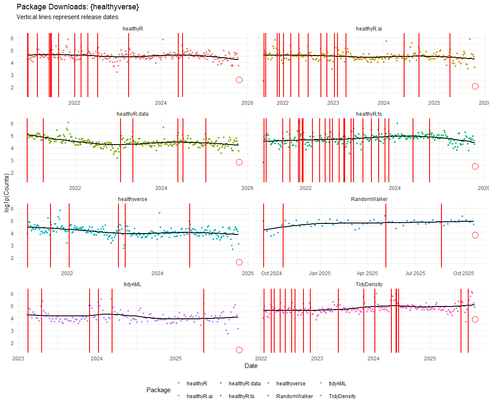

Time Series Analysis and Nested Modeling of the Healthyverse Packages
================
Steven P. Sanderson II, MPH - Date:
09 April, 2025

This analysis follows a *Nested Modeltime Workflow*.

## Get Data

``` r
glimpse(downloads_tbl)
```

    ## Rows: 136,270
    ## Columns: 11
    ## $ date      <date> 2020-11-23, 2020-11-23, 2020-11-23, 2020-11-23, 2020-11-23,…
    ## $ time      <Period> 15H 36M 55S, 11H 26M 39S, 23H 34M 44S, 18H 39M 32S, 9H 0M…
    ## $ date_time <dttm> 2020-11-23 15:36:55, 2020-11-23 11:26:39, 2020-11-23 23:34:…
    ## $ size      <int> 4858294, 4858294, 4858301, 4858295, 361, 4863722, 4864794, 4…
    ## $ r_version <chr> NA, "4.0.3", "3.5.3", "3.5.2", NA, NA, NA, NA, NA, NA, NA, N…
    ## $ r_arch    <chr> NA, "x86_64", "x86_64", "x86_64", NA, NA, NA, NA, NA, NA, NA…
    ## $ r_os      <chr> NA, "mingw32", "mingw32", "linux-gnu", NA, NA, NA, NA, NA, N…
    ## $ package   <chr> "healthyR.data", "healthyR.data", "healthyR.data", "healthyR…
    ## $ version   <chr> "1.0.0", "1.0.0", "1.0.0", "1.0.0", "1.0.0", "1.0.0", "1.0.0…
    ## $ country   <chr> "US", "US", "US", "GB", "US", "US", "DE", "HK", "JP", "US", …
    ## $ ip_id     <int> 2069, 2804, 78827, 27595, 90474, 90474, 42435, 74, 7655, 638…

The last day in the data set is 2025-04-07 23:44:25, the file was
birthed on: 2024-08-07 07:35:44, and at report knit time is -5844.14
hours old. Happy analyzing!

Now that we have our data lets take a look at it using the `skimr`
package.

``` r
skim(downloads_tbl)
```

|                                                  |               |
|:-------------------------------------------------|:--------------|
| Name                                             | downloads_tbl |
| Number of rows                                   | 136270        |
| Number of columns                                | 11            |
| \_\_\_\_\_\_\_\_\_\_\_\_\_\_\_\_\_\_\_\_\_\_\_   |               |
| Column type frequency:                           |               |
| character                                        | 6             |
| Date                                             | 1             |
| numeric                                          | 2             |
| POSIXct                                          | 1             |
| Timespan                                         | 1             |
| \_\_\_\_\_\_\_\_\_\_\_\_\_\_\_\_\_\_\_\_\_\_\_\_ |               |
| Group variables                                  | None          |

Data summary

**Variable type: character**

| skim_variable | n_missing | complete_rate | min | max | empty | n_unique | whitespace |
|:--------------|----------:|--------------:|----:|----:|------:|---------:|-----------:|
| r_version     |     97989 |          0.28 |   5 |   5 |     0 |       46 |          0 |
| r_arch        |     97989 |          0.28 |   3 |   7 |     0 |        5 |          0 |
| r_os          |     97989 |          0.28 |   7 |  15 |     0 |       21 |          0 |
| package       |         0 |          1.00 |   7 |  13 |     0 |        8 |          0 |
| version       |         0 |          1.00 |   5 |  17 |     0 |       60 |          0 |
| country       |     11466 |          0.92 |   2 |   2 |     0 |      163 |          0 |

**Variable type: Date**

| skim_variable | n_missing | complete_rate | min | max | median | n_unique |
|:---|---:|---:|:---|:---|:---|---:|
| date | 0 | 1 | 2020-11-23 | 2025-04-07 | 2023-05-28 | 1597 |

**Variable type: numeric**

| skim_variable | n_missing | complete_rate | mean | sd | p0 | p25 | p50 | p75 | p100 | hist |
|:---|---:|---:|---:|---:|---:|---:|---:|---:|---:|:---|
| size | 0 | 1 | 1134748.16 | 1523548.30 | 355 | 14701 | 271483 | 2367770.75 | 5677952 | ▇▁▂▁▁ |
| ip_id | 0 | 1 | 10354.09 | 18359.76 | 1 | 300 | 3064 | 11712.75 | 209747 | ▇▁▁▁▁ |

**Variable type: POSIXct**

| skim_variable | n_missing | complete_rate | min | max | median | n_unique |
|:---|---:|---:|:---|:---|:---|---:|
| date_time | 0 | 1 | 2020-11-23 09:00:41 | 2025-04-07 23:44:25 | 2023-05-28 13:52:02 | 82896 |

**Variable type: Timespan**

| skim_variable | n_missing | complete_rate | min | max | median | n_unique |
|:--------------|----------:|--------------:|----:|----:|-------:|---------:|
| time          |         0 |             1 |   0 |  59 |   11.5 |       60 |

We can see that the following columns are missing a lot of data and for
us are most likely not useful anyways, so we will drop them
`c(r_version, r_arch, r_os)`

## Plots

Now lets take a look at a time-series plot of the total daily downloads
by package. We will use a log scale and place a vertical line at each
version release for each package.

<!-- --><!-- -->

Now lets take a look at some time series decomposition graphs.

<!-- --><!-- --><!-- --><!-- -->

## Feature Engineering

Now that we have our basic data and a shot of what it looks like, let’s
add some features to our data which can be very helpful in modeling.
Lets start by making a `tibble` that is aggregated by the day and
package, as we are going to be interested in forecasting the next 4
weeks or 28 days for each package. First lets get our base data.

    ## 
    ## Call:
    ## stats::lm(formula = .formula, data = df)
    ## 
    ## Residuals:
    ##     Min      1Q  Median      3Q     Max 
    ## -148.94  -35.41  -10.64   26.55  812.56 
    ## 
    ## Coefficients:
    ##                                                      Estimate Std. Error
    ## (Intercept)                                        -1.838e+02  7.325e+01
    ## date                                                1.119e-02  3.886e-03
    ## lag(value, 1)                                       1.080e-01  2.479e-02
    ## lag(value, 7)                                       9.800e-02  2.567e-02
    ## lag(value, 14)                                      9.604e-02  2.580e-02
    ## lag(value, 21)                                      6.564e-02  2.584e-02
    ## lag(value, 28)                                      5.992e-02  2.574e-02
    ## lag(value, 35)                                      6.877e-02  2.582e-02
    ## lag(value, 42)                                      4.786e-02  2.591e-02
    ## lag(value, 49)                                      7.652e-02  2.587e-02
    ## month(date, label = TRUE).L                        -1.023e+01  5.139e+00
    ## month(date, label = TRUE).Q                         2.752e+00  5.197e+00
    ## month(date, label = TRUE).C                        -1.233e+01  5.228e+00
    ## month(date, label = TRUE)^4                        -6.645e+00  5.192e+00
    ## month(date, label = TRUE)^5                        -1.223e+01  5.205e+00
    ## month(date, label = TRUE)^6                        -3.155e+00  5.277e+00
    ## month(date, label = TRUE)^7                        -6.162e+00  5.161e+00
    ## month(date, label = TRUE)^8                        -4.549e+00  5.179e+00
    ## month(date, label = TRUE)^9                         5.422e+00  5.221e+00
    ## month(date, label = TRUE)^10                        4.553e+00  5.286e+00
    ## month(date, label = TRUE)^11                       -5.897e+00  5.335e+00
    ## fourier_vec(date, type = "sin", K = 1, period = 7) -1.177e+01  2.390e+00
    ## fourier_vec(date, type = "cos", K = 1, period = 7)  8.082e+00  2.516e+00
    ##                                                    t value Pr(>|t|)    
    ## (Intercept)                                         -2.510 0.012186 *  
    ## date                                                 2.879 0.004042 ** 
    ## lag(value, 1)                                        4.357 1.41e-05 ***
    ## lag(value, 7)                                        3.818 0.000140 ***
    ## lag(value, 14)                                       3.722 0.000205 ***
    ## lag(value, 21)                                       2.540 0.011182 *  
    ## lag(value, 28)                                       2.328 0.020069 *  
    ## lag(value, 35)                                       2.663 0.007820 ** 
    ## lag(value, 42)                                       1.847 0.064917 .  
    ## lag(value, 49)                                       2.958 0.003142 ** 
    ## month(date, label = TRUE).L                         -1.990 0.046747 *  
    ## month(date, label = TRUE).Q                          0.530 0.596505    
    ## month(date, label = TRUE).C                         -2.358 0.018510 *  
    ## month(date, label = TRUE)^4                         -1.280 0.200832    
    ## month(date, label = TRUE)^5                         -2.349 0.018940 *  
    ## month(date, label = TRUE)^6                         -0.598 0.549936    
    ## month(date, label = TRUE)^7                         -1.194 0.232638    
    ## month(date, label = TRUE)^8                         -0.878 0.379889    
    ## month(date, label = TRUE)^9                          1.039 0.299152    
    ## month(date, label = TRUE)^10                         0.861 0.389138    
    ## month(date, label = TRUE)^11                        -1.105 0.269190    
    ## fourier_vec(date, type = "sin", K = 1, period = 7)  -4.923 9.45e-07 ***
    ## fourier_vec(date, type = "cos", K = 1, period = 7)   3.213 0.001343 ** 
    ## ---
    ## Signif. codes:  0 '***' 0.001 '**' 0.01 '*' 0.05 '.' 0.1 ' ' 1
    ## 
    ## Residual standard error: 58.65 on 1525 degrees of freedom
    ##   (49 observations deleted due to missingness)
    ## Multiple R-squared:  0.2496, Adjusted R-squared:  0.2388 
    ## F-statistic: 23.06 on 22 and 1525 DF,  p-value: < 2.2e-16

<!-- -->

## NNS Forecasting

This is something I have been wanting to try for a while. The `NNS`
package is a great package for forecasting time series data.

[NNS GitHub](https://github.com/OVVO-Financial/NNS)

``` r
library(NNS)

data_list <- base_data |>
    select(package, value) |>
    group_split(package)

data_list |>
    imap(
        \(x, idx) {
            obj <- x
            x <- obj |> pull(value) |> tail(7*52)
            train_set_size <- length(x) - 56
            pkg <- obj |> pluck(1) |> unique()
            sf <- NNS.seas(x, modulo = 7, plot = FALSE)$periods
            
            cat(paste0("Package: ", pkg, "\n"))
            NNS.ARMA.optim(
                variable = x,
                h = 28,
                training.set = train_set_size,
                #seasonal.factor = seq(12, 60, 7),
                seasonal.factor = sf,
                pred.int = 0.95,
                plot = TRUE
            )
            title(
                sub = paste0("\n",
                             "Package: ", pkg, " - NNS Optimization")
            )
        }
    )
```

    ## Package: healthyR
    ## [1] "CURRNET METHOD: lin"
    ## [1] "COPY LATEST PARAMETERS DIRECTLY FOR NNS.ARMA() IF ERROR:"
    ## [1] "NNS.ARMA(... method =  'lin' , seasonal.factor =  c( 21 ) ...)"
    ## [1] "CURRENT lin OBJECTIVE FUNCTION = 2.77410985792204"
    ## [1] "NNS.ARMA(... method =  'lin' , seasonal.factor =  c( 21, 70 ) ...)"
    ## [1] "CURRENT lin OBJECTIVE FUNCTION = 2.44191127992598"
    ## [1] "NNS.ARMA(... method =  'lin' , seasonal.factor =  c( 21, 70, 77 ) ...)"
    ## [1] "CURRENT lin OBJECTIVE FUNCTION = 2.40364718339527"
    ## [1] "NNS.ARMA(... method =  'lin' , seasonal.factor =  c( 21, 70, 77, 63 ) ...)"
    ## [1] "CURRENT lin OBJECTIVE FUNCTION = 2.39384984098874"
    ## [1] "NNS.ARMA(... method =  'lin' , seasonal.factor =  c( 21, 70, 77, 63, 98 ) ...)"
    ## [1] "CURRENT lin OBJECTIVE FUNCTION = 2.37700542982855"
    ## [1] "BEST method = 'lin', seasonal.factor = c( 21, 70, 77, 63, 98 )"
    ## [1] "BEST lin OBJECTIVE FUNCTION = 2.37700542982855"
    ## [1] "CURRNET METHOD: nonlin"
    ## [1] "COPY LATEST PARAMETERS DIRECTLY FOR NNS.ARMA() IF ERROR:"
    ## [1] "NNS.ARMA(... method =  'nonlin' , seasonal.factor =  c( 21, 70, 77, 63, 98 ) ...)"
    ## [1] "CURRENT nonlin OBJECTIVE FUNCTION = 2.7944173433042"
    ## [1] "BEST method = 'nonlin' PATH MEMBER = c( 21, 70, 77, 63, 98 )"
    ## [1] "BEST nonlin OBJECTIVE FUNCTION = 2.7944173433042"
    ## [1] "CURRNET METHOD: both"
    ## [1] "COPY LATEST PARAMETERS DIRECTLY FOR NNS.ARMA() IF ERROR:"
    ## [1] "NNS.ARMA(... method =  'both' , seasonal.factor =  c( 21, 70, 77, 63, 98 ) ...)"
    ## [1] "CURRENT both OBJECTIVE FUNCTION = 2.50917472463829"
    ## [1] "BEST method = 'both' PATH MEMBER = c( 21, 70, 77, 63, 98 )"
    ## [1] "BEST both OBJECTIVE FUNCTION = 2.50917472463829"

<!-- -->

    ## Package: healthyR.ai
    ## [1] "CURRNET METHOD: lin"
    ## [1] "COPY LATEST PARAMETERS DIRECTLY FOR NNS.ARMA() IF ERROR:"
    ## [1] "NNS.ARMA(... method =  'lin' , seasonal.factor =  c( 77 ) ...)"
    ## [1] "CURRENT lin OBJECTIVE FUNCTION = 2.12498334131809"
    ## [1] "NNS.ARMA(... method =  'lin' , seasonal.factor =  c( 77, 21 ) ...)"
    ## [1] "CURRENT lin OBJECTIVE FUNCTION = 1.81878252199926"
    ## [1] "NNS.ARMA(... method =  'lin' , seasonal.factor =  c( 77, 21, 98 ) ...)"
    ## [1] "CURRENT lin OBJECTIVE FUNCTION = 1.73126484632295"
    ## [1] "NNS.ARMA(... method =  'lin' , seasonal.factor =  c( 77, 21, 98, 63 ) ...)"
    ## [1] "CURRENT lin OBJECTIVE FUNCTION = 1.72270895260547"
    ## [1] "BEST method = 'lin', seasonal.factor = c( 77, 21, 98, 63 )"
    ## [1] "BEST lin OBJECTIVE FUNCTION = 1.72270895260547"
    ## [1] "CURRNET METHOD: nonlin"
    ## [1] "COPY LATEST PARAMETERS DIRECTLY FOR NNS.ARMA() IF ERROR:"
    ## [1] "NNS.ARMA(... method =  'nonlin' , seasonal.factor =  c( 77, 21, 98, 63 ) ...)"
    ## [1] "CURRENT nonlin OBJECTIVE FUNCTION = 1.93980529231879"
    ## [1] "BEST method = 'nonlin' PATH MEMBER = c( 77, 21, 98, 63 )"
    ## [1] "BEST nonlin OBJECTIVE FUNCTION = 1.93980529231879"
    ## [1] "CURRNET METHOD: both"
    ## [1] "COPY LATEST PARAMETERS DIRECTLY FOR NNS.ARMA() IF ERROR:"
    ## [1] "NNS.ARMA(... method =  'both' , seasonal.factor =  c( 77, 21, 98, 63 ) ...)"
    ## [1] "CURRENT both OBJECTIVE FUNCTION = 1.76114123150584"
    ## [1] "BEST method = 'both' PATH MEMBER = c( 77, 21, 98, 63 )"
    ## [1] "BEST both OBJECTIVE FUNCTION = 1.76114123150584"

<!-- -->

    ## Package: healthyR.data
    ## [1] "CURRNET METHOD: lin"
    ## [1] "COPY LATEST PARAMETERS DIRECTLY FOR NNS.ARMA() IF ERROR:"
    ## [1] "NNS.ARMA(... method =  'lin' , seasonal.factor =  c( 98 ) ...)"
    ## [1] "CURRENT lin OBJECTIVE FUNCTION = 2.23944722256551"
    ## [1] "BEST method = 'lin', seasonal.factor = c( 98 )"
    ## [1] "BEST lin OBJECTIVE FUNCTION = 2.23944722256551"
    ## [1] "CURRNET METHOD: nonlin"
    ## [1] "COPY LATEST PARAMETERS DIRECTLY FOR NNS.ARMA() IF ERROR:"
    ## [1] "NNS.ARMA(... method =  'nonlin' , seasonal.factor =  c( 98 ) ...)"
    ## [1] "CURRENT nonlin OBJECTIVE FUNCTION = 2.78863957622744"
    ## [1] "BEST method = 'nonlin' PATH MEMBER = c( 98 )"
    ## [1] "BEST nonlin OBJECTIVE FUNCTION = 2.78863957622744"
    ## [1] "CURRNET METHOD: both"
    ## [1] "COPY LATEST PARAMETERS DIRECTLY FOR NNS.ARMA() IF ERROR:"
    ## [1] "NNS.ARMA(... method =  'both' , seasonal.factor =  c( 98 ) ...)"
    ## [1] "CURRENT both OBJECTIVE FUNCTION = 2.32702205855079"
    ## [1] "BEST method = 'both' PATH MEMBER = c( 98 )"
    ## [1] "BEST both OBJECTIVE FUNCTION = 2.32702205855079"

<!-- -->

    ## Package: healthyR.ts
    ## [1] "CURRNET METHOD: lin"
    ## [1] "COPY LATEST PARAMETERS DIRECTLY FOR NNS.ARMA() IF ERROR:"
    ## [1] "NNS.ARMA(... method =  'lin' , seasonal.factor =  c( 63 ) ...)"
    ## [1] "CURRENT lin OBJECTIVE FUNCTION = 2.21033359931242"
    ## [1] "NNS.ARMA(... method =  'lin' , seasonal.factor =  c( 63, 98 ) ...)"
    ## [1] "CURRENT lin OBJECTIVE FUNCTION = 1.68408761307259"
    ## [1] "BEST method = 'lin', seasonal.factor = c( 63, 98 )"
    ## [1] "BEST lin OBJECTIVE FUNCTION = 1.68408761307259"
    ## [1] "CURRNET METHOD: nonlin"
    ## [1] "COPY LATEST PARAMETERS DIRECTLY FOR NNS.ARMA() IF ERROR:"
    ## [1] "NNS.ARMA(... method =  'nonlin' , seasonal.factor =  c( 63, 98 ) ...)"
    ## [1] "CURRENT nonlin OBJECTIVE FUNCTION = 2.48741019888011"
    ## [1] "BEST method = 'nonlin' PATH MEMBER = c( 63, 98 )"
    ## [1] "BEST nonlin OBJECTIVE FUNCTION = 2.48741019888011"
    ## [1] "CURRNET METHOD: both"
    ## [1] "COPY LATEST PARAMETERS DIRECTLY FOR NNS.ARMA() IF ERROR:"
    ## [1] "NNS.ARMA(... method =  'both' , seasonal.factor =  c( 63, 98 ) ...)"
    ## [1] "CURRENT both OBJECTIVE FUNCTION = 1.95081099221302"
    ## [1] "BEST method = 'both' PATH MEMBER = c( 63, 98 )"
    ## [1] "BEST both OBJECTIVE FUNCTION = 1.95081099221302"

<!-- -->

    ## Package: healthyverse
    ## [1] "CURRNET METHOD: lin"
    ## [1] "COPY LATEST PARAMETERS DIRECTLY FOR NNS.ARMA() IF ERROR:"
    ## [1] "NNS.ARMA(... method =  'lin' , seasonal.factor =  c( 77 ) ...)"
    ## [1] "CURRENT lin OBJECTIVE FUNCTION = 2.77834002210202"
    ## [1] "NNS.ARMA(... method =  'lin' , seasonal.factor =  c( 77, 49 ) ...)"
    ## [1] "CURRENT lin OBJECTIVE FUNCTION = 2.34931614276929"
    ## [1] "BEST method = 'lin', seasonal.factor = c( 77, 49 )"
    ## [1] "BEST lin OBJECTIVE FUNCTION = 2.34931614276929"
    ## [1] "CURRNET METHOD: nonlin"
    ## [1] "COPY LATEST PARAMETERS DIRECTLY FOR NNS.ARMA() IF ERROR:"
    ## [1] "NNS.ARMA(... method =  'nonlin' , seasonal.factor =  c( 77, 49 ) ...)"
    ## [1] "CURRENT nonlin OBJECTIVE FUNCTION = 4.24450757477579"
    ## [1] "BEST method = 'nonlin' PATH MEMBER = c( 77, 49 )"
    ## [1] "BEST nonlin OBJECTIVE FUNCTION = 4.24450757477579"
    ## [1] "CURRNET METHOD: both"
    ## [1] "COPY LATEST PARAMETERS DIRECTLY FOR NNS.ARMA() IF ERROR:"
    ## [1] "NNS.ARMA(... method =  'both' , seasonal.factor =  c( 77, 49 ) ...)"
    ## [1] "CURRENT both OBJECTIVE FUNCTION = 3.08818277914707"
    ## [1] "BEST method = 'both' PATH MEMBER = c( 77, 49 )"
    ## [1] "BEST both OBJECTIVE FUNCTION = 3.08818277914707"

<!-- -->

    ## Package: RandomWalker
    ## [1] "CURRNET METHOD: lin"
    ## [1] "COPY LATEST PARAMETERS DIRECTLY FOR NNS.ARMA() IF ERROR:"
    ## [1] "NNS.ARMA(... method =  'lin' , seasonal.factor =  c( 49 ) ...)"
    ## [1] "CURRENT lin OBJECTIVE FUNCTION = 3.12498594459426"
    ## [1] "NNS.ARMA(... method =  'lin' , seasonal.factor =  c( 49, 35 ) ...)"
    ## [1] "CURRENT lin OBJECTIVE FUNCTION = 2.33322508526163"
    ## [1] "BEST method = 'lin', seasonal.factor = c( 49, 35 )"
    ## [1] "BEST lin OBJECTIVE FUNCTION = 2.33322508526163"
    ## [1] "CURRNET METHOD: nonlin"
    ## [1] "COPY LATEST PARAMETERS DIRECTLY FOR NNS.ARMA() IF ERROR:"
    ## [1] "NNS.ARMA(... method =  'nonlin' , seasonal.factor =  c( 49, 35 ) ...)"
    ## [1] "CURRENT nonlin OBJECTIVE FUNCTION = 2.64089282279528"
    ## [1] "BEST method = 'nonlin' PATH MEMBER = c( 49, 35 )"
    ## [1] "BEST nonlin OBJECTIVE FUNCTION = 2.64089282279528"
    ## [1] "CURRNET METHOD: both"
    ## [1] "COPY LATEST PARAMETERS DIRECTLY FOR NNS.ARMA() IF ERROR:"
    ## [1] "NNS.ARMA(... method =  'both' , seasonal.factor =  c( 49, 35 ) ...)"
    ## [1] "CURRENT both OBJECTIVE FUNCTION = 2.40725942264216"
    ## [1] "BEST method = 'both' PATH MEMBER = c( 49, 35 )"
    ## [1] "BEST both OBJECTIVE FUNCTION = 2.40725942264216"

<!-- -->

    ## Package: tidyAML
    ## [1] "CURRNET METHOD: lin"
    ## [1] "COPY LATEST PARAMETERS DIRECTLY FOR NNS.ARMA() IF ERROR:"
    ## [1] "NNS.ARMA(... method =  'lin' , seasonal.factor =  c( 28 ) ...)"
    ## [1] "CURRENT lin OBJECTIVE FUNCTION = 4.08496402603428"
    ## [1] "BEST method = 'lin', seasonal.factor = c( 28 )"
    ## [1] "BEST lin OBJECTIVE FUNCTION = 4.08496402603428"
    ## [1] "CURRNET METHOD: nonlin"
    ## [1] "COPY LATEST PARAMETERS DIRECTLY FOR NNS.ARMA() IF ERROR:"
    ## [1] "NNS.ARMA(... method =  'nonlin' , seasonal.factor =  c( 28 ) ...)"
    ## [1] "CURRENT nonlin OBJECTIVE FUNCTION = 4.83608232114275"
    ## [1] "BEST method = 'nonlin' PATH MEMBER = c( 28 )"
    ## [1] "BEST nonlin OBJECTIVE FUNCTION = 4.83608232114275"
    ## [1] "CURRNET METHOD: both"
    ## [1] "COPY LATEST PARAMETERS DIRECTLY FOR NNS.ARMA() IF ERROR:"
    ## [1] "NNS.ARMA(... method =  'both' , seasonal.factor =  c( 28 ) ...)"
    ## [1] "CURRENT both OBJECTIVE FUNCTION = 3.52986446148527"
    ## [1] "BEST method = 'both' PATH MEMBER = c( 28 )"
    ## [1] "BEST both OBJECTIVE FUNCTION = 3.52986446148527"

<!-- -->

    ## Package: TidyDensity
    ## [1] "CURRNET METHOD: lin"
    ## [1] "COPY LATEST PARAMETERS DIRECTLY FOR NNS.ARMA() IF ERROR:"
    ## [1] "NNS.ARMA(... method =  'lin' , seasonal.factor =  c( 63 ) ...)"
    ## [1] "CURRENT lin OBJECTIVE FUNCTION = 2.06228286390727"
    ## [1] "NNS.ARMA(... method =  'lin' , seasonal.factor =  c( 63, 77 ) ...)"
    ## [1] "CURRENT lin OBJECTIVE FUNCTION = 1.74737851616904"
    ## [1] "BEST method = 'lin', seasonal.factor = c( 63, 77 )"
    ## [1] "BEST lin OBJECTIVE FUNCTION = 1.74737851616904"
    ## [1] "CURRNET METHOD: nonlin"
    ## [1] "COPY LATEST PARAMETERS DIRECTLY FOR NNS.ARMA() IF ERROR:"
    ## [1] "NNS.ARMA(... method =  'nonlin' , seasonal.factor =  c( 63, 77 ) ...)"
    ## [1] "CURRENT nonlin OBJECTIVE FUNCTION = 3.14621165148609"
    ## [1] "BEST method = 'nonlin' PATH MEMBER = c( 63, 77 )"
    ## [1] "BEST nonlin OBJECTIVE FUNCTION = 3.14621165148609"
    ## [1] "CURRNET METHOD: both"
    ## [1] "COPY LATEST PARAMETERS DIRECTLY FOR NNS.ARMA() IF ERROR:"
    ## [1] "NNS.ARMA(... method =  'both' , seasonal.factor =  c( 63, 77 ) ...)"
    ## [1] "CURRENT both OBJECTIVE FUNCTION = 2.17520840629087"
    ## [1] "BEST method = 'both' PATH MEMBER = c( 63, 77 )"
    ## [1] "BEST both OBJECTIVE FUNCTION = 2.17520840629087"

<!-- -->

    ## [[1]]
    ## NULL
    ## 
    ## [[2]]
    ## NULL
    ## 
    ## [[3]]
    ## NULL
    ## 
    ## [[4]]
    ## NULL
    ## 
    ## [[5]]
    ## NULL
    ## 
    ## [[6]]
    ## NULL
    ## 
    ## [[7]]
    ## NULL
    ## 
    ## [[8]]
    ## NULL

## Pre-Processing

Now we are going to do some basic pre-processing.

``` r
data_padded_tbl <- base_data %>%
  pad_by_time(
    .date_var  = date,
    .pad_value = 0
  )

# Get log interval and standardization parameters
log_params  <- liv(data_padded_tbl$value, limit_lower = 0, offset = 1, silent = TRUE)
limit_lower <- log_params$limit_lower
limit_upper <- log_params$limit_upper
offset      <- log_params$offset

data_liv_tbl <- data_padded_tbl %>%
  # Get log interval transform
  mutate(value_trans = liv(value, limit_lower = 0, offset = 1, silent = TRUE)$log_scaled)

# Get Standardization Params
std_params <- standard_vec(data_liv_tbl$value_trans, silent = TRUE)
std_mean   <- std_params$mean
std_sd     <- std_params$sd

data_transformed_tbl <- data_liv_tbl %>%
  # get standardization
  mutate(value_trans = standard_vec(value_trans, silent = TRUE)$standard_scaled) %>%
  select(-value)
```

Since this is panel data we can follow one of two different modeling
strategies. We can search for a global model in the panel data or we can
use nested forecasting finding the best model for each of the time
series. Since we only have 5 panels, we will use nested forecasting.

To do this we will use the `nest_timeseries` and
`split_nested_timeseries` functions to create a nested `tibble`.

``` r
horizon <- 4*7

nested_data_tbl <- data_transformed_tbl %>%
    
    # 1. Extending: We'll predict n days into the future.
    extend_timeseries(
        .id_var        = package,
        .date_var      = date,
        .length_future = horizon
    ) %>%
    
    # 2. Nesting: We'll group by id, and create a future dataset
    #    that forecasts n days of extended data and
    #    an actual dataset that contains n*2 days
    nest_timeseries(
        .id_var        = package,
        .length_future = horizon
        #.length_actual = horizon*2
    ) %>%
    
   # 3. Splitting: We'll take the actual data and create splits
   #    for accuracy and confidence interval estimation of n das (test)
   #    and the rest is training data
    split_nested_timeseries(
        .length_test = horizon
    )

nested_data_tbl
```

    ## # A tibble: 8 × 4
    ##   package       .actual_data         .future_data      .splits          
    ##   <fct>         <list>               <list>            <list>           
    ## 1 healthyR.data <tibble [1,590 × 2]> <tibble [28 × 2]> <split [1562|28]>
    ## 2 healthyR      <tibble [1,583 × 2]> <tibble [28 × 2]> <split [1555|28]>
    ## 3 healthyR.ts   <tibble [1,527 × 2]> <tibble [28 × 2]> <split [1499|28]>
    ## 4 healthyverse  <tibble [1,498 × 2]> <tibble [28 × 2]> <split [1470|28]>
    ## 5 healthyR.ai   <tibble [1,322 × 2]> <tibble [28 × 2]> <split [1294|28]>
    ## 6 TidyDensity   <tibble [1,173 × 2]> <tibble [28 × 2]> <split [1145|28]>
    ## 7 tidyAML       <tibble [781 × 2]>   <tibble [28 × 2]> <split [753|28]> 
    ## 8 RandomWalker  <tibble [203 × 2]>   <tibble [28 × 2]> <split [175|28]>

Now it is time to make some recipes and models using the modeltime
workflow.

## Modeltime Workflow

### Recipe Object

``` r
recipe_base <- recipe(
  value_trans ~ date
  , data = extract_nested_test_split(nested_data_tbl)
  )

recipe_base

recipe_date <- recipe_base %>%
    step_mutate(date = as.numeric(date))
```

### Models

``` r
# Models ------------------------------------------------------------------

# Auto ARIMA --------------------------------------------------------------

model_spec_arima_no_boost <- arima_reg() %>%
  set_engine(engine = "auto_arima")

wflw_auto_arima <- workflow() %>%
  add_recipe(recipe = recipe_base) %>%
  add_model(model_spec_arima_no_boost)

# NNETAR ------------------------------------------------------------------

model_spec_nnetar <- nnetar_reg(
  mode              = "regression"
  , seasonal_period = "auto"
) %>%
  set_engine("nnetar")

wflw_nnetar <- workflow() %>%
  add_recipe(recipe = recipe_base) %>%
  add_model(model_spec_nnetar)

# TSLM --------------------------------------------------------------------

model_spec_lm <- linear_reg() %>%
  set_engine("lm")

wflw_lm <- workflow() %>%
  add_recipe(recipe = recipe_base) %>%
  add_model(model_spec_lm)

# MARS --------------------------------------------------------------------

model_spec_mars <- mars(mode = "regression") %>%
  set_engine("earth")

wflw_mars <- workflow() %>%
  add_recipe(recipe = recipe_base) %>%
  add_model(model_spec_mars)
```

### Nested Modeltime Tables

``` r
nested_modeltime_tbl <- modeltime_nested_fit(
  # Nested Data
  nested_data = nested_data_tbl,
   control = control_nested_fit(
     verbose = TRUE,
     allow_par = FALSE
   ),
  # Add workflows
  wflw_auto_arima,
  wflw_lm,
  wflw_mars,
  wflw_nnetar
)
```

``` r
nested_modeltime_tbl <- nested_modeltime_tbl[!is.na(nested_modeltime_tbl$package),]
```

### Model Accuracy

``` r
nested_modeltime_tbl %>%
  extract_nested_test_accuracy() %>%
  filter(!is.na(package)) %>%
  knitr::kable()
```

| package | .model_id | .model_desc | .type | mae | mape | mase | smape | rmse | rsq |
|:---|---:|:---|:---|---:|---:|---:|---:|---:|---:|
| healthyR.data | 1 | ARIMA | Test | 0.7095064 | 145.02839 | 0.6255128 | 163.60440 | 0.8766375 | 0.0039491 |
| healthyR.data | 2 | LM | Test | 0.6890581 | 165.25902 | 0.6074851 | 135.39942 | 0.8419189 | 0.0000380 |
| healthyR.data | 3 | EARTH | Test | 1.0590519 | 393.30759 | 0.9336779 | 131.92028 | 1.2044098 | 0.0000380 |
| healthyR.data | 4 | NNAR | Test | 0.6867405 | 109.77182 | 0.6054419 | 163.48559 | 0.9154886 | 0.0538342 |
| healthyR | 1 | ARIMA | Test | 0.7440211 | 102.34944 | 0.7531486 | 176.30509 | 0.9255064 | 0.0503230 |
| healthyR | 2 | LM | Test | 0.7433845 | 98.55165 | 0.7525042 | 186.10762 | 0.9192814 | 0.0134735 |
| healthyR | 3 | EARTH | Test | 0.7379860 | 96.31628 | 0.7470395 | 177.82825 | 0.9156762 | 0.0134735 |
| healthyR | 4 | NNAR | Test | 0.6941950 | 88.70877 | 0.7027113 | 145.61820 | 0.8917736 | 0.0532927 |
| healthyR.ts | 1 | ARIMA | Test | 0.9343741 | 232.94332 | 0.7424035 | 138.78378 | 1.1699439 | 0.0328219 |
| healthyR.ts | 2 | LM | Test | 0.9578370 | 263.40097 | 0.7610458 | 136.19909 | 1.1987154 | 0.0328219 |
| healthyR.ts | 3 | EARTH | Test | 3.0011161 | 1396.90062 | 2.3845257 | 155.94226 | 3.3426410 | 0.0328219 |
| healthyR.ts | 4 | NNAR | Test | 0.7944693 | 96.39285 | 0.6312426 | 157.22188 | 1.0364350 | 0.1160600 |
| healthyverse | 1 | ARIMA | Test | 0.6364035 | 285.70661 | 0.7225130 | 105.20603 | 0.7822763 | 0.0228121 |
| healthyverse | 2 | LM | Test | 0.6091626 | 363.74327 | 0.6915862 | 96.25883 | 0.7378856 | 0.0506810 |
| healthyverse | 3 | EARTH | Test | 3.8275900 | 2450.29907 | 4.3454874 | 147.84447 | 4.1355040 | 0.0506810 |
| healthyverse | 4 | NNAR | Test | 0.6235415 | 221.62307 | 0.7079106 | 109.62620 | 0.7978235 | 0.0000017 |
| healthyR.ai | 1 | ARIMA | Test | 0.7008593 | 95.53971 | 0.6921777 | 155.90437 | 0.9273455 | 0.0656516 |
| healthyR.ai | 2 | LM | Test | 0.7084528 | 138.62750 | 0.6996771 | 143.07477 | 0.9202525 | 0.1090391 |
| healthyR.ai | 3 | EARTH | Test | 0.7147302 | 123.86962 | 0.7058767 | 151.03429 | 0.9265935 | 0.1090391 |
| healthyR.ai | 4 | NNAR | Test | 0.6512279 | 133.63201 | 0.6431610 | 127.31604 | 0.8689552 | 0.1511084 |
| TidyDensity | 1 | ARIMA | Test | 0.6006524 | 212.56748 | 0.6491397 | 113.53785 | 0.7578490 | 0.0742523 |
| TidyDensity | 2 | LM | Test | 0.6620323 | 314.74555 | 0.7154745 | 105.96420 | 0.8501345 | 0.0179061 |
| TidyDensity | 3 | EARTH | Test | 0.6279482 | 234.50839 | 0.6786390 | 113.14754 | 0.7844496 | 0.0179061 |
| TidyDensity | 4 | NNAR | Test | 0.5892507 | 117.33928 | 0.6368177 | 131.49258 | 0.7328226 | 0.1564729 |
| tidyAML | 1 | ARIMA | Test | 0.5601915 | 368.96946 | 0.6036363 | 92.25530 | 0.7419236 | 0.0274740 |
| tidyAML | 2 | LM | Test | 0.6021296 | 405.34298 | 0.6488268 | 97.19258 | 0.7592555 | 0.0001931 |
| tidyAML | 3 | EARTH | Test | 0.5601380 | 225.13985 | 0.6035786 | 103.59067 | 0.7815825 | 0.0001931 |
| tidyAML | 4 | NNAR | Test | 0.5572182 | 388.68141 | 0.6004324 | 95.56433 | 0.7252427 | 0.0685572 |
| RandomWalker | 1 | ARIMA | Test | 1.3387793 | 143.20336 | 0.7543275 | 154.39102 | 1.5860470 | 0.1061139 |
| RandomWalker | 2 | LM | Test | 1.2151541 | 103.05266 | 0.6846716 | 196.64679 | 1.3633269 | 0.0035759 |
| RandomWalker | 3 | EARTH | Test | 1.1607857 | 90.87160 | 0.6540380 | 165.43123 | 1.3357068 | NA |
| RandomWalker | 4 | NNAR | Test | 1.1751534 | 95.86267 | 0.6621334 | 169.53642 | 1.3499429 | 0.0029786 |

### Plot Models

``` r
nested_modeltime_tbl %>%
  extract_nested_test_forecast() %>%
  group_by(package) %>%
  plot_modeltime_forecast(
    .interactive = FALSE,
    .conf_interval_show  = FALSE,
    .facet_scales = "free"
  ) +
  theme_minimal() +
  theme(legend.position = "bottom")
```

<!-- -->

### Best Model

``` r
best_nested_modeltime_tbl <- nested_modeltime_tbl %>%
  modeltime_nested_select_best(
    metric = "rmse",
    minimize = TRUE,
    filter_test_forecasts = TRUE
  )

best_nested_modeltime_tbl %>%
  extract_nested_best_model_report()
```

    ## # Nested Modeltime Table
    ## 

    ## # A tibble: 8 × 10
    ##   package     .model_id .model_desc .type   mae  mape  mase smape  rmse      rsq
    ##   <fct>           <int> <chr>       <chr> <dbl> <dbl> <dbl> <dbl> <dbl>    <dbl>
    ## 1 healthyR.d…         2 LM          Test  0.689 165.  0.607 135.  0.842  3.80e-5
    ## 2 healthyR            4 NNAR        Test  0.694  88.7 0.703 146.  0.892  5.33e-2
    ## 3 healthyR.ts         4 NNAR        Test  0.794  96.4 0.631 157.  1.04   1.16e-1
    ## 4 healthyver…         2 LM          Test  0.609 364.  0.692  96.3 0.738  5.07e-2
    ## 5 healthyR.ai         4 NNAR        Test  0.651 134.  0.643 127.  0.869  1.51e-1
    ## 6 TidyDensity         4 NNAR        Test  0.589 117.  0.637 131.  0.733  1.56e-1
    ## 7 tidyAML             4 NNAR        Test  0.557 389.  0.600  95.6 0.725  6.86e-2
    ## 8 RandomWalk…         3 EARTH       Test  1.16   90.9 0.654 165.  1.34  NA

``` r
best_nested_modeltime_tbl %>%
  extract_nested_test_forecast() %>%
  #filter(!is.na(.model_id)) %>%
  group_by(package) %>%
  plot_modeltime_forecast(
    .interactive = FALSE,
    .conf_interval_alpha = 0.2,
    .facet_scales = "free"
  ) +
  theme_minimal() +
  theme(legend.position = "bottom")
```

<!-- -->

## Refitting and Future Forecast

Now that we have the best models, we can make our future forecasts.

``` r
nested_modeltime_refit_tbl <- best_nested_modeltime_tbl %>%
    modeltime_nested_refit(
        control = control_nested_refit(verbose = TRUE)
    )
```

``` r
nested_modeltime_refit_tbl
```

    ## # Nested Modeltime Table
    ## 

    ## # A tibble: 8 × 5
    ##   package       .actual_data .future_data .splits           .modeltime_tables 
    ##   <fct>         <list>       <list>       <list>            <list>            
    ## 1 healthyR.data <tibble>     <tibble>     <split [1562|28]> <mdl_tm_t [1 × 5]>
    ## 2 healthyR      <tibble>     <tibble>     <split [1555|28]> <mdl_tm_t [1 × 5]>
    ## 3 healthyR.ts   <tibble>     <tibble>     <split [1499|28]> <mdl_tm_t [1 × 5]>
    ## 4 healthyverse  <tibble>     <tibble>     <split [1470|28]> <mdl_tm_t [1 × 5]>
    ## 5 healthyR.ai   <tibble>     <tibble>     <split [1294|28]> <mdl_tm_t [1 × 5]>
    ## 6 TidyDensity   <tibble>     <tibble>     <split [1145|28]> <mdl_tm_t [1 × 5]>
    ## 7 tidyAML       <tibble>     <tibble>     <split [753|28]>  <mdl_tm_t [1 × 5]>
    ## 8 RandomWalker  <tibble>     <tibble>     <split [175|28]>  <mdl_tm_t [1 × 5]>

``` r
nested_modeltime_refit_tbl %>%
  extract_nested_future_forecast() %>%
  mutate(across(.value:.conf_hi, .fns = ~ standard_inv_vec(
    x    = .,
    mean = std_mean,
    sd   = std_sd
  )$standard_inverse_value)) %>%
  mutate(across(.value:.conf_hi, .fns = ~ liiv(
    x = .,
    limit_lower = limit_lower,
    limit_upper = limit_upper,
    offset      = offset
  )$rescaled_v)) %>%
  group_by(package) %>%
  plot_modeltime_forecast(
    .interactive = FALSE,
    .conf_interval_alpha = 0.2,
    .facet_scales = "free"
  ) +
  theme_minimal() +
  theme(legend.position = "bottom")
```

<!-- -->
