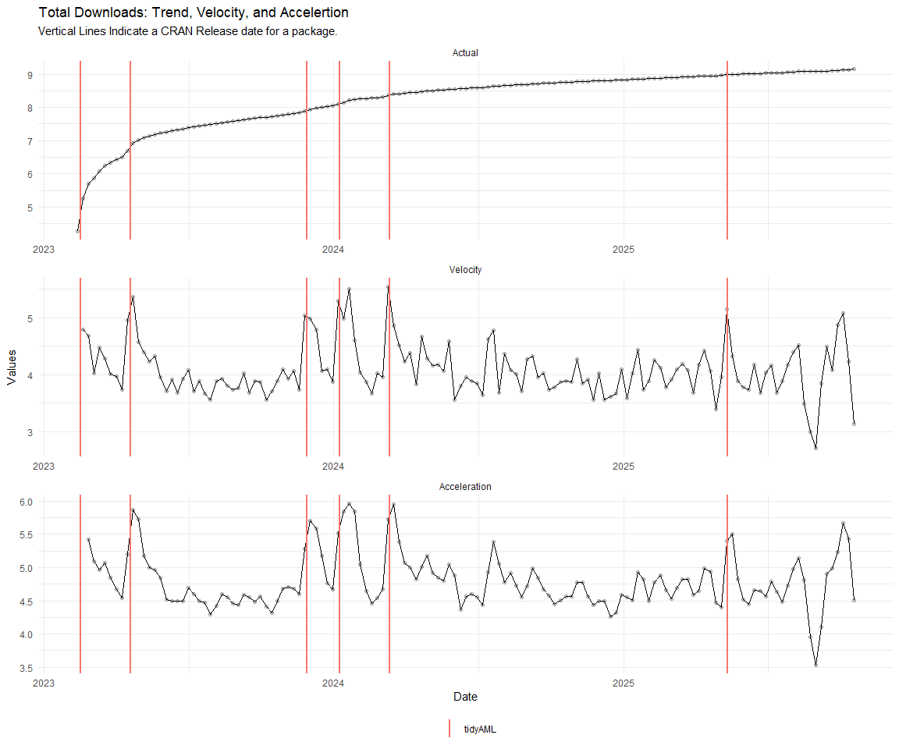

# Time Series Analysis, Modeling and Forecasting of the Healthyverse
Packages
Steven P. Sanderson II, MPH - Date:
2025-11-02

# Introduction

This analysis follows a *Nested Modeltime Workflow* from **`modeltime`**
along with using the **`NNS`** package. I use this to monitor the
downloads of all of my packages:

- [`healthyR`](https://www.spsanderson.com/healthyR/)
- [`healthyR.data`](https://www.spsanderson.com/healthyR.data/)
- [`healthyR.ts`](https://www.spsanderson.com/healthyR.ts/)
- [`healthyR.ai`](https://www.spsanderson.com/healthyR.ai/)
- [`healthyverse`](https://www.spsanderson.com/healthyverse/)
- [`TidyDensity`](https://www.spsanderson.com/TidyDensity/)
- [`tidyAML`](https://www.spsanderson.com/tidyAML/)
- [`RandomWalker`](https://www.spsanderson.com/RandomWalker/)

## Get Data

``` r
glimpse(downloads_tbl)
```

    Rows: 158,895
    Columns: 11
    $ date      <date> 2020-11-23, 2020-11-23, 2020-11-23, 2020-11-23, 2020-11-23,…
    $ time      <Period> 15H 36M 55S, 11H 26M 39S, 23H 34M 44S, 18H 39M 32S, 9H 0M…
    $ date_time <dttm> 2020-11-23 15:36:55, 2020-11-23 11:26:39, 2020-11-23 23:34:…
    $ size      <int> 4858294, 4858294, 4858301, 4858295, 361, 4863722, 4864794, 4…
    $ r_version <chr> NA, "4.0.3", "3.5.3", "3.5.2", NA, NA, NA, NA, NA, NA, NA, N…
    $ r_arch    <chr> NA, "x86_64", "x86_64", "x86_64", NA, NA, NA, NA, NA, NA, NA…
    $ r_os      <chr> NA, "mingw32", "mingw32", "linux-gnu", NA, NA, NA, NA, NA, N…
    $ package   <chr> "healthyR.data", "healthyR.data", "healthyR.data", "healthyR…
    $ version   <chr> "1.0.0", "1.0.0", "1.0.0", "1.0.0", "1.0.0", "1.0.0", "1.0.0…
    $ country   <chr> "US", "US", "US", "GB", "US", "US", "DE", "HK", "JP", "US", …
    $ ip_id     <int> 2069, 2804, 78827, 27595, 90474, 90474, 42435, 74, 7655, 638…

The last day in the data set is 2025-10-31 22:51:50, the file was
birthed on: 2022-07-02 23:58:17.511888, and at report knit time is
2.920289^{4} hours old. Happy analyzing!

Now that we have our data lets take a look at it using the `skimr`
package.

``` r
skim(downloads_tbl)
```

|                                                  |               |
|:-------------------------------------------------|:--------------|
| Name                                             | downloads_tbl |
| Number of rows                                   | 158895        |
| Number of columns                                | 11            |
| \_\_\_\_\_\_\_\_\_\_\_\_\_\_\_\_\_\_\_\_\_\_\_   |               |
| Column type frequency:                           |               |
| character                                        | 6             |
| Date                                             | 1             |
| numeric                                          | 2             |
| POSIXct                                          | 1             |
| Timespan                                         | 1             |
| \_\_\_\_\_\_\_\_\_\_\_\_\_\_\_\_\_\_\_\_\_\_\_\_ |               |
| Group variables                                  | None          |

Data summary

**Variable type: character**

| skim_variable | n_missing | complete_rate | min | max | empty | n_unique | whitespace |
|:--------------|----------:|--------------:|----:|----:|------:|---------:|-----------:|
| r_version     |    116429 |          0.27 |   5 |   5 |     0 |       48 |          0 |
| r_arch        |    116429 |          0.27 |   3 |   7 |     0 |        5 |          0 |
| r_os          |    116429 |          0.27 |   7 |  15 |     0 |       23 |          0 |
| package       |         0 |          1.00 |   7 |  13 |     0 |        8 |          0 |
| version       |         0 |          1.00 |   5 |  17 |     0 |       62 |          0 |
| country       |     14869 |          0.91 |   2 |   2 |     0 |      165 |          0 |

**Variable type: Date**

| skim_variable | n_missing | complete_rate | min | max | median | n_unique |
|:---|---:|---:|:---|:---|:---|---:|
| date | 0 | 1 | 2020-11-23 | 2025-10-31 | 2023-10-16 | 1797 |

**Variable type: numeric**

| skim_variable | n_missing | complete_rate | mean | sd | p0 | p25 | p50 | p75 | p100 | hist |
|:---|---:|---:|---:|---:|---:|---:|---:|---:|---:|:---|
| size | 0 | 1 | 1125146.29 | 1492593.09 | 355 | 23083.5 | 309574 | 2356775 | 5677952 | ▇▁▂▁▁ |
| ip_id | 0 | 1 | 11304.81 | 21910.38 | 1 | 223.0 | 2938 | 11961 | 299146 | ▇▁▁▁▁ |

**Variable type: POSIXct**

| skim_variable | n_missing | complete_rate | min | max | median | n_unique |
|:---|---:|---:|:---|:---|:---|---:|
| date_time | 0 | 1 | 2020-11-23 09:00:41 | 2025-10-31 22:51:50 | 2023-10-16 11:04:28 | 99873 |

**Variable type: Timespan**

| skim_variable | n_missing | complete_rate | min | max |     median | n_unique |
|:--------------|----------:|--------------:|----:|----:|-----------:|---------:|
| time          |         0 |             1 |   0 |  59 | 12H 6M 18S |       60 |

We can see that the following columns are missing a lot of data and for
us are most likely not useful anyways, so we will drop them
`c(r_version, r_arch, r_os)`

## Plots

Now lets take a look at a time-series plot of the total daily downloads
by package. We will use a log scale and place a vertical line at each
version release for each package.


    [[1]]


    [[2]]


    [[3]]


    [[4]]


    [[5]]


    [[6]]


    [[7]]


    [[8]]



Now lets take a look at some time series decomposition graphs.

    [[1]]


    [[2]]


    [[3]]


    [[4]]


    [[5]]


    [[6]]


    [[7]]


    [[8]]


    [[1]]


    [[2]]


    [[3]]


    [[4]]


    [[5]]


    [[6]]


    [[7]]


    [[8]]


Seasonal Diagnostics:

    [[1]]


    [[2]]


    [[3]]


    [[4]]


    [[5]]


    [[6]]


    [[7]]


    [[8]]


ACF and PACF Diagnostics:

    [[1]]


    [[2]]


    [[3]]


    [[4]]


    [[5]]


    [[6]]


    [[7]]


    [[8]]


## Feature Engineering

Now that we have our basic data and a shot of what it looks like, let’s
add some features to our data which can be very helpful in modeling.
Lets start by making a `tibble` that is aggregated by the day and
package, as we are going to be interested in forecasting the next 4
weeks or 28 days for each package. First lets get our base data.


    Call:
    stats::lm(formula = .formula, data = df)

    Residuals:
        Min      1Q  Median      3Q     Max 
    -148.23  -36.48  -11.00   26.90  816.46 

    Coefficients:
                                                         Estimate Std. Error
    (Intercept)                                        -2.081e+02  6.202e+01
    date                                                1.248e-02  3.288e-03
    lag(value, 1)                                       1.125e-01  2.340e-02
    lag(value, 7)                                       9.023e-02  2.418e-02
    lag(value, 14)                                      7.808e-02  2.420e-02
    lag(value, 21)                                      6.980e-02  2.426e-02
    lag(value, 28)                                      7.133e-02  2.420e-02
    lag(value, 35)                                      6.226e-02  2.431e-02
    lag(value, 42)                                      5.686e-02  2.444e-02
    lag(value, 49)                                      7.369e-02  2.447e-02
    month(date, label = TRUE).L                        -8.492e+00  5.103e+00
    month(date, label = TRUE).Q                         2.215e+00  5.025e+00
    month(date, label = TRUE).C                        -1.584e+01  5.021e+00
    month(date, label = TRUE)^4                        -7.829e+00  5.041e+00
    month(date, label = TRUE)^5                        -9.214e+00  5.032e+00
    month(date, label = TRUE)^6                        -1.655e+00  5.073e+00
    month(date, label = TRUE)^7                        -6.672e+00  4.930e+00
    month(date, label = TRUE)^8                        -5.525e+00  4.865e+00
    month(date, label = TRUE)^9                         2.111e+00  4.840e+00
    month(date, label = TRUE)^10                        7.541e-01  4.849e+00
    month(date, label = TRUE)^11                       -4.312e+00  4.837e+00
    fourier_vec(date, type = "sin", K = 1, period = 7) -1.108e+01  2.245e+00
    fourier_vec(date, type = "cos", K = 1, period = 7)  7.068e+00  2.327e+00
                                                       t value Pr(>|t|)    
    (Intercept)                                         -3.355 0.000811 ***
    date                                                 3.795 0.000153 ***
    lag(value, 1)                                        4.806 1.67e-06 ***
    lag(value, 7)                                        3.732 0.000196 ***
    lag(value, 14)                                       3.227 0.001275 ** 
    lag(value, 21)                                       2.877 0.004069 ** 
    lag(value, 28)                                       2.948 0.003246 ** 
    lag(value, 35)                                       2.561 0.010509 *  
    lag(value, 42)                                       2.327 0.020084 *  
    lag(value, 49)                                       3.011 0.002640 ** 
    month(date, label = TRUE).L                         -1.664 0.096230 .  
    month(date, label = TRUE).Q                          0.441 0.659400    
    month(date, label = TRUE).C                         -3.156 0.001629 ** 
    month(date, label = TRUE)^4                         -1.553 0.120531    
    month(date, label = TRUE)^5                         -1.831 0.067265 .  
    month(date, label = TRUE)^6                         -0.326 0.744230    
    month(date, label = TRUE)^7                         -1.353 0.176116    
    month(date, label = TRUE)^8                         -1.136 0.256232    
    month(date, label = TRUE)^9                          0.436 0.662788    
    month(date, label = TRUE)^10                         0.156 0.876443    
    month(date, label = TRUE)^11                        -0.891 0.372825    
    fourier_vec(date, type = "sin", K = 1, period = 7)  -4.934 8.82e-07 ***
    fourier_vec(date, type = "cos", K = 1, period = 7)   3.037 0.002421 ** 
    ---
    Signif. codes:  0 '***' 0.001 '**' 0.01 '*' 0.05 '.' 0.1 ' ' 1

    Residual standard error: 59.31 on 1725 degrees of freedom
      (49 observations deleted due to missingness)
    Multiple R-squared:  0.2365,    Adjusted R-squared:  0.2268 
    F-statistic: 24.29 on 22 and 1725 DF,  p-value: < 2.2e-16


## NNS Forecasting

This is something I have been wanting to try for a while. The `NNS`
package is a great package for forecasting time series data.

[NNS GitHub](https://github.com/OVVO-Financial/NNS)

``` r
library(NNS)

data_list <- base_data |>
    select(package, value) |>
    group_split(package)

data_list |>
    imap(
        \(x, idx) {
            obj <- x
            x <- obj |> pull(value) |> tail(7*52)
            train_set_size <- length(x) - 56
            pkg <- obj |> pluck(1) |> unique()
#            sf <- NNS.seas(x, modulo = 7, plot = FALSE)$periods
            seas <- t(
                sapply(
                    1:25, 
                    function(i) c(
                        i,
                        sqrt(
                            mean((
                                NNS.ARMA(x, 
                                         h = 28, 
                                         training.set = train_set_size, 
                                         method = "lin", 
                                         seasonal.factor = i, 
                                         plot=FALSE
                                         ) - tail(x, 28)) ^ 2)))
                    )
                )
            colnames(seas) <- c("Period", "RMSE")
            sf <- seas[which.min(seas[, 2]), 1]
            
            cat(paste0("Package: ", pkg, "\n"))
            NNS.ARMA.optim(
                variable = x,
                h = 28,
                training.set = train_set_size,
                #seasonal.factor = seq(12, 60, 7),
                seasonal.factor = sf,
                pred.int = 0.95,
                plot = TRUE
            )
            title(
                sub = paste0("\n",
                             "Package: ", pkg, " - NNS Optimization")
            )
        }
    )
```

    Package: healthyR
    [1] "CURRNET METHOD: lin"
    [1] "COPY LATEST PARAMETERS DIRECTLY FOR NNS.ARMA() IF ERROR:"
    [1] "NNS.ARMA(... method =  'lin' , seasonal.factor =  c( 25 ) ...)"
    [1] "CURRENT lin OBJECTIVE FUNCTION = 15.5804295627958"
    [1] "BEST method = 'lin' PATH MEMBER = c( 25 )"
    [1] "BEST lin OBJECTIVE FUNCTION = 15.5804295627958"
    [1] "CURRNET METHOD: nonlin"
    [1] "COPY LATEST PARAMETERS DIRECTLY FOR NNS.ARMA() IF ERROR:"
    [1] "NNS.ARMA(... method =  'nonlin' , seasonal.factor =  c( 25 ) ...)"
    [1] "CURRENT nonlin OBJECTIVE FUNCTION = 8.96341410993083"
    [1] "BEST method = 'nonlin' PATH MEMBER = c( 25 )"
    [1] "BEST nonlin OBJECTIVE FUNCTION = 8.96341410993083"
    [1] "CURRNET METHOD: both"
    [1] "COPY LATEST PARAMETERS DIRECTLY FOR NNS.ARMA() IF ERROR:"
    [1] "NNS.ARMA(... method =  'both' , seasonal.factor =  c( 25 ) ...)"
    [1] "CURRENT both OBJECTIVE FUNCTION = 11.2143130732662"
    [1] "BEST method = 'both' PATH MEMBER = c( 25 )"
    [1] "BEST both OBJECTIVE FUNCTION = 11.2143130732662"


    Package: healthyR.ai
    [1] "CURRNET METHOD: lin"
    [1] "COPY LATEST PARAMETERS DIRECTLY FOR NNS.ARMA() IF ERROR:"
    [1] "NNS.ARMA(... method =  'lin' , seasonal.factor =  c( 1 ) ...)"
    [1] "CURRENT lin OBJECTIVE FUNCTION = 590.741224979835"
    [1] "BEST method = 'lin' PATH MEMBER = c( 1 )"
    [1] "BEST lin OBJECTIVE FUNCTION = 590.741224979835"
    [1] "CURRNET METHOD: nonlin"
    [1] "COPY LATEST PARAMETERS DIRECTLY FOR NNS.ARMA() IF ERROR:"
    [1] "NNS.ARMA(... method =  'nonlin' , seasonal.factor =  c( 1 ) ...)"
    [1] "CURRENT nonlin OBJECTIVE FUNCTION = 156.395721368508"
    [1] "BEST method = 'nonlin' PATH MEMBER = c( 1 )"
    [1] "BEST nonlin OBJECTIVE FUNCTION = 156.395721368508"
    [1] "CURRNET METHOD: both"
    [1] "COPY LATEST PARAMETERS DIRECTLY FOR NNS.ARMA() IF ERROR:"
    [1] "NNS.ARMA(... method =  'both' , seasonal.factor =  c( 1 ) ...)"
    [1] "CURRENT both OBJECTIVE FUNCTION = 218.542195347468"
    [1] "BEST method = 'both' PATH MEMBER = c( 1 )"
    [1] "BEST both OBJECTIVE FUNCTION = 218.542195347468"


    Package: healthyR.data
    [1] "CURRNET METHOD: lin"
    [1] "COPY LATEST PARAMETERS DIRECTLY FOR NNS.ARMA() IF ERROR:"
    [1] "NNS.ARMA(... method =  'lin' , seasonal.factor =  c( 1 ) ...)"
    [1] "CURRENT lin OBJECTIVE FUNCTION = 498.129063591367"
    [1] "BEST method = 'lin' PATH MEMBER = c( 1 )"
    [1] "BEST lin OBJECTIVE FUNCTION = 498.129063591367"
    [1] "CURRNET METHOD: nonlin"
    [1] "COPY LATEST PARAMETERS DIRECTLY FOR NNS.ARMA() IF ERROR:"
    [1] "NNS.ARMA(... method =  'nonlin' , seasonal.factor =  c( 1 ) ...)"
    [1] "CURRENT nonlin OBJECTIVE FUNCTION = 129.304167568464"
    [1] "BEST method = 'nonlin' PATH MEMBER = c( 1 )"
    [1] "BEST nonlin OBJECTIVE FUNCTION = 129.304167568464"
    [1] "CURRNET METHOD: both"
    [1] "COPY LATEST PARAMETERS DIRECTLY FOR NNS.ARMA() IF ERROR:"
    [1] "NNS.ARMA(... method =  'both' , seasonal.factor =  c( 1 ) ...)"
    [1] "CURRENT both OBJECTIVE FUNCTION = 113.558305726733"
    [1] "BEST method = 'both' PATH MEMBER = c( 1 )"
    [1] "BEST both OBJECTIVE FUNCTION = 113.558305726733"


    Package: healthyR.ts
    [1] "CURRNET METHOD: lin"
    [1] "COPY LATEST PARAMETERS DIRECTLY FOR NNS.ARMA() IF ERROR:"
    [1] "NNS.ARMA(... method =  'lin' , seasonal.factor =  c( 11 ) ...)"
    [1] "CURRENT lin OBJECTIVE FUNCTION = 11.5124886039259"
    [1] "BEST method = 'lin' PATH MEMBER = c( 11 )"
    [1] "BEST lin OBJECTIVE FUNCTION = 11.5124886039259"
    [1] "CURRNET METHOD: nonlin"
    [1] "COPY LATEST PARAMETERS DIRECTLY FOR NNS.ARMA() IF ERROR:"
    [1] "NNS.ARMA(... method =  'nonlin' , seasonal.factor =  c( 11 ) ...)"
    [1] "CURRENT nonlin OBJECTIVE FUNCTION = 10.7646114514462"
    [1] "BEST method = 'nonlin' PATH MEMBER = c( 11 )"
    [1] "BEST nonlin OBJECTIVE FUNCTION = 10.7646114514462"
    [1] "CURRNET METHOD: both"
    [1] "COPY LATEST PARAMETERS DIRECTLY FOR NNS.ARMA() IF ERROR:"
    [1] "NNS.ARMA(... method =  'both' , seasonal.factor =  c( 11 ) ...)"
    [1] "CURRENT both OBJECTIVE FUNCTION = 7.79736991134872"
    [1] "BEST method = 'both' PATH MEMBER = c( 11 )"
    [1] "BEST both OBJECTIVE FUNCTION = 7.79736991134872"


    Package: healthyverse
    [1] "CURRNET METHOD: lin"
    [1] "COPY LATEST PARAMETERS DIRECTLY FOR NNS.ARMA() IF ERROR:"
    [1] "NNS.ARMA(... method =  'lin' , seasonal.factor =  c( 6 ) ...)"
    [1] "CURRENT lin OBJECTIVE FUNCTION = 19.1986964491719"
    [1] "BEST method = 'lin' PATH MEMBER = c( 6 )"
    [1] "BEST lin OBJECTIVE FUNCTION = 19.1986964491719"
    [1] "CURRNET METHOD: nonlin"
    [1] "COPY LATEST PARAMETERS DIRECTLY FOR NNS.ARMA() IF ERROR:"
    [1] "NNS.ARMA(... method =  'nonlin' , seasonal.factor =  c( 6 ) ...)"
    [1] "CURRENT nonlin OBJECTIVE FUNCTION = 12.316936393815"
    [1] "BEST method = 'nonlin' PATH MEMBER = c( 6 )"
    [1] "BEST nonlin OBJECTIVE FUNCTION = 12.316936393815"
    [1] "CURRNET METHOD: both"
    [1] "COPY LATEST PARAMETERS DIRECTLY FOR NNS.ARMA() IF ERROR:"
    [1] "NNS.ARMA(... method =  'both' , seasonal.factor =  c( 6 ) ...)"
    [1] "CURRENT both OBJECTIVE FUNCTION = 15.3148719434479"
    [1] "BEST method = 'both' PATH MEMBER = c( 6 )"
    [1] "BEST both OBJECTIVE FUNCTION = 15.3148719434479"


    Package: RandomWalker
    [1] "CURRNET METHOD: lin"
    [1] "COPY LATEST PARAMETERS DIRECTLY FOR NNS.ARMA() IF ERROR:"
    [1] "NNS.ARMA(... method =  'lin' , seasonal.factor =  c( 19 ) ...)"
    [1] "CURRENT lin OBJECTIVE FUNCTION = 9.09180073278475"
    [1] "BEST method = 'lin' PATH MEMBER = c( 19 )"
    [1] "BEST lin OBJECTIVE FUNCTION = 9.09180073278475"
    [1] "CURRNET METHOD: nonlin"
    [1] "COPY LATEST PARAMETERS DIRECTLY FOR NNS.ARMA() IF ERROR:"
    [1] "NNS.ARMA(... method =  'nonlin' , seasonal.factor =  c( 19 ) ...)"
    [1] "CURRENT nonlin OBJECTIVE FUNCTION = 4.74767708554997"
    [1] "BEST method = 'nonlin' PATH MEMBER = c( 19 )"
    [1] "BEST nonlin OBJECTIVE FUNCTION = 4.74767708554997"
    [1] "CURRNET METHOD: both"
    [1] "COPY LATEST PARAMETERS DIRECTLY FOR NNS.ARMA() IF ERROR:"
    [1] "NNS.ARMA(... method =  'both' , seasonal.factor =  c( 19 ) ...)"
    [1] "CURRENT both OBJECTIVE FUNCTION = 4.89001128838205"
    [1] "BEST method = 'both' PATH MEMBER = c( 19 )"
    [1] "BEST both OBJECTIVE FUNCTION = 4.89001128838205"


    Package: tidyAML
    [1] "CURRNET METHOD: lin"
    [1] "COPY LATEST PARAMETERS DIRECTLY FOR NNS.ARMA() IF ERROR:"
    [1] "NNS.ARMA(... method =  'lin' , seasonal.factor =  c( 18 ) ...)"
    [1] "CURRENT lin OBJECTIVE FUNCTION = 46.8517827452422"
    [1] "BEST method = 'lin' PATH MEMBER = c( 18 )"
    [1] "BEST lin OBJECTIVE FUNCTION = 46.8517827452422"
    [1] "CURRNET METHOD: nonlin"
    [1] "COPY LATEST PARAMETERS DIRECTLY FOR NNS.ARMA() IF ERROR:"
    [1] "NNS.ARMA(... method =  'nonlin' , seasonal.factor =  c( 18 ) ...)"
    [1] "CURRENT nonlin OBJECTIVE FUNCTION = 26.0158208352096"
    [1] "BEST method = 'nonlin' PATH MEMBER = c( 18 )"
    [1] "BEST nonlin OBJECTIVE FUNCTION = 26.0158208352096"
    [1] "CURRNET METHOD: both"
    [1] "COPY LATEST PARAMETERS DIRECTLY FOR NNS.ARMA() IF ERROR:"
    [1] "NNS.ARMA(... method =  'both' , seasonal.factor =  c( 18 ) ...)"
    [1] "CURRENT both OBJECTIVE FUNCTION = 37.6861374537695"
    [1] "BEST method = 'both' PATH MEMBER = c( 18 )"
    [1] "BEST both OBJECTIVE FUNCTION = 37.6861374537695"


    Package: TidyDensity
    [1] "CURRNET METHOD: lin"
    [1] "COPY LATEST PARAMETERS DIRECTLY FOR NNS.ARMA() IF ERROR:"
    [1] "NNS.ARMA(... method =  'lin' , seasonal.factor =  c( 13 ) ...)"
    [1] "CURRENT lin OBJECTIVE FUNCTION = 52.9480030817349"
    [1] "BEST method = 'lin' PATH MEMBER = c( 13 )"
    [1] "BEST lin OBJECTIVE FUNCTION = 52.9480030817349"
    [1] "CURRNET METHOD: nonlin"
    [1] "COPY LATEST PARAMETERS DIRECTLY FOR NNS.ARMA() IF ERROR:"
    [1] "NNS.ARMA(... method =  'nonlin' , seasonal.factor =  c( 13 ) ...)"
    [1] "CURRENT nonlin OBJECTIVE FUNCTION = 24.5047389265562"
    [1] "BEST method = 'nonlin' PATH MEMBER = c( 13 )"
    [1] "BEST nonlin OBJECTIVE FUNCTION = 24.5047389265562"
    [1] "CURRNET METHOD: both"
    [1] "COPY LATEST PARAMETERS DIRECTLY FOR NNS.ARMA() IF ERROR:"
    [1] "NNS.ARMA(... method =  'both' , seasonal.factor =  c( 13 ) ...)"
    [1] "CURRENT both OBJECTIVE FUNCTION = 41.8594838789343"
    [1] "BEST method = 'both' PATH MEMBER = c( 13 )"
    [1] "BEST both OBJECTIVE FUNCTION = 41.8594838789343"


    [[1]]
    NULL

    [[2]]
    NULL

    [[3]]
    NULL

    [[4]]
    NULL

    [[5]]
    NULL

    [[6]]
    NULL

    [[7]]
    NULL

    [[8]]
    NULL

## Pre-Processing

Now we are going to do some basic pre-processing.

``` r
data_padded_tbl <- base_data %>%
  pad_by_time(
    .date_var  = date,
    .pad_value = 0
  )

# Get log interval and standardization parameters
log_params  <- liv(data_padded_tbl$value, limit_lower = 0, offset = 1, silent = TRUE)
limit_lower <- log_params$limit_lower
limit_upper <- log_params$limit_upper
offset      <- log_params$offset

data_liv_tbl <- data_padded_tbl %>%
  # Get log interval transform
  mutate(value_trans = liv(value, limit_lower = 0, offset = 1, silent = TRUE)$log_scaled)

# Get Standardization Params
std_params <- standard_vec(data_liv_tbl$value_trans, silent = TRUE)
std_mean   <- std_params$mean
std_sd     <- std_params$sd

data_transformed_tbl <- data_liv_tbl %>%
  group_by(package) %>%
  # get standardization
  mutate(value_trans = standard_vec(value_trans, silent = TRUE)$standard_scaled) %>%
  tk_augment_fourier(
    .date_var = date,
    .periods  = c(7, 14, 30, 90, 180),
    .K        = 2
  ) %>%
  tk_augment_timeseries_signature(
    .date_var = date
  ) %>%
  ungroup() %>%
  select(-c(value, -year.iso))
```

Since this is panel data we can follow one of two different modeling
strategies. We can search for a global model in the panel data or we can
use nested forecasting finding the best model for each of the time
series. Since we only have 5 panels, we will use nested forecasting.

To do this we will use the `nest_timeseries` and
`split_nested_timeseries` functions to create a nested `tibble`.

``` r
horizon <- 4*7

nested_data_tbl <- data_transformed_tbl %>%

    # 0. Filter out column where package is NA
    filter(!is.na(package)) %>%
    
    # 1. Extending: We'll predict n days into the future.
    extend_timeseries(
        .id_var        = package,
        .date_var      = date,
        .length_future = horizon
    ) %>%
    
    # 2. Nesting: We'll group by id, and create a future dataset
    #    that forecasts n days of extended data and
    #    an actual dataset that contains n*2 days
    nest_timeseries(
        .id_var        = package,
        .length_future = horizon
        #.length_actual = horizon*2
    ) %>%
    
   # 3. Splitting: We'll take the actual data and create splits
   #    for accuracy and confidence interval estimation of n das (test)
   #    and the rest is training data
    split_nested_timeseries(
        .length_test = horizon
    )

nested_data_tbl
```

    # A tibble: 8 × 4
      package       .actual_data          .future_data       .splits          
      <fct>         <list>                <list>             <list>           
    1 healthyR.data <tibble [1,789 × 50]> <tibble [28 × 50]> <split [1761|28]>
    2 healthyR      <tibble [1,780 × 50]> <tibble [28 × 50]> <split [1752|28]>
    3 healthyR.ts   <tibble [1,726 × 50]> <tibble [28 × 50]> <split [1698|28]>
    4 healthyverse  <tibble [1,697 × 50]> <tibble [28 × 50]> <split [1669|28]>
    5 healthyR.ai   <tibble [1,522 × 50]> <tibble [28 × 50]> <split [1494|28]>
    6 TidyDensity   <tibble [1,373 × 50]> <tibble [28 × 50]> <split [1345|28]>
    7 tidyAML       <tibble [980 × 50]>   <tibble [28 × 50]> <split [952|28]> 
    8 RandomWalker  <tibble [403 × 50]>   <tibble [28 × 50]> <split [375|28]> 

Now it is time to make some recipes and models using the modeltime
workflow.

## Modeltime Workflow

### Recipe Object

``` r
recipe_base <- recipe(
  value_trans ~ .
  , data = extract_nested_test_split(nested_data_tbl)
  )

recipe_base

recipe_date <- recipe(
  value_trans ~ date
  , data = extract_nested_test_split(nested_data_tbl)
  )
```

### Models

``` r
# Models ------------------------------------------------------------------

# Auto ARIMA --------------------------------------------------------------

model_spec_arima_no_boost <- arima_reg() %>%
  set_engine(engine = "auto_arima")

wflw_auto_arima <- workflow() %>%
  add_recipe(recipe = recipe_date) %>%
  add_model(model_spec_arima_no_boost)

# NNETAR ------------------------------------------------------------------

model_spec_nnetar <- nnetar_reg(
  mode              = "regression"
  , seasonal_period = "auto"
) %>%
  set_engine("nnetar")

wflw_nnetar <- workflow() %>%
  add_recipe(recipe = recipe_base) %>%
  add_model(model_spec_nnetar)

# TSLM --------------------------------------------------------------------

model_spec_lm <- linear_reg() %>%
  set_engine("lm")

wflw_lm <- workflow() %>%
  add_recipe(recipe = recipe_base) %>%
  add_model(model_spec_lm)

# MARS --------------------------------------------------------------------

model_spec_mars <- mars(mode = "regression") %>%
  set_engine("earth")

wflw_mars <- workflow() %>%
  add_recipe(recipe = recipe_date) %>%
  add_model(model_spec_mars)
```

### Nested Modeltime Tables

``` r
nested_modeltime_tbl <- modeltime_nested_fit(
  # Nested Data
  nested_data = nested_data_tbl,
   control = control_nested_fit(
     verbose = TRUE,
     allow_par = FALSE
   ),
  # Add workflows
  wflw_auto_arima,
  wflw_lm,
  wflw_mars,
  wflw_nnetar
)
```

``` r
nested_modeltime_tbl <- nested_modeltime_tbl[!is.na(nested_modeltime_tbl$package),]
```

### Model Accuracy

``` r
nested_modeltime_tbl %>%
  extract_nested_test_accuracy() %>%
  filter(!is.na(package)) %>%
  knitr::kable()
```

| package | .model_id | .model_desc | .type | mae | mape | mase | smape | rmse | rsq |
|:---|---:|:---|:---|---:|---:|---:|---:|---:|---:|
| healthyR.data | 1 | ARIMA | Test | 0.6860566 | 94.49646 | 0.6583493 | 165.4495 | 0.8373105 | 0.0393588 |
| healthyR.data | 2 | LM | Test | 0.7686737 | 150.39057 | 0.7376298 | 143.2891 | 0.8983241 | 0.0109533 |
| healthyR.data | 3 | EARTH | Test | 0.7117346 | 104.52915 | 0.6829902 | 188.4506 | 0.8411133 | 0.0055827 |
| healthyR.data | 4 | NNAR | Test | 0.8393499 | 152.17171 | 0.8054516 | 161.7203 | 0.9756989 | 0.0386855 |
| healthyR | 1 | ARIMA | Test | 0.5639221 | 125.57805 | 0.6498882 | 178.6568 | 0.6775840 | 0.0388675 |
| healthyR | 2 | LM | Test | 0.6730510 | 194.22445 | 0.7756530 | 134.6001 | 0.8541241 | 0.0047002 |
| healthyR | 3 | EARTH | Test | 0.6234456 | 184.72431 | 0.7184856 | 130.2775 | 0.7932458 | 0.0588763 |
| healthyR | 4 | NNAR | Test | 0.6569660 | 212.97460 | 0.7571160 | 140.2323 | 0.8522134 | 0.0012272 |
| healthyR.ts | 1 | ARIMA | Test | 0.6104449 | 98.35892 | 0.6723201 | 167.0193 | 0.7668557 | 0.0624548 |
| healthyR.ts | 2 | LM | Test | 0.7574262 | 143.83200 | 0.8341997 | 151.1368 | 0.9644850 | 0.0243804 |
| healthyR.ts | 3 | EARTH | Test | 0.6626469 | 137.05704 | 0.7298134 | 158.2388 | 0.8272858 | 0.0282012 |
| healthyR.ts | 4 | NNAR | Test | 0.8260545 | 166.20969 | 0.9097842 | 151.3799 | 1.0560208 | 0.0597480 |
| healthyverse | 1 | ARIMA | Test | 0.5234617 | 98.06902 | 0.7711117 | 148.7501 | 0.6325840 | 0.0196648 |
| healthyverse | 2 | LM | Test | 0.6205639 | 172.85390 | 0.9141530 | 138.0963 | 0.7078485 | 0.1027186 |
| healthyverse | 3 | EARTH | Test | 0.5613246 | 135.96826 | 0.8268875 | 135.1150 | 0.6727175 | 0.0784386 |
| healthyverse | 4 | NNAR | Test | 0.5747948 | 140.93812 | 0.8467305 | 128.4128 | 0.6971829 | 0.0927693 |
| healthyR.ai | 1 | ARIMA | Test | 0.4099173 | 98.75522 | 0.7532129 | 162.2933 | 0.4972562 | 0.0496672 |
| healthyR.ai | 2 | LM | Test | 0.6263568 | 248.08636 | 1.1509152 | 159.2367 | 0.7615087 | 0.0480105 |
| healthyR.ai | 3 | EARTH | Test | 0.6131487 | 264.94641 | 1.1266456 | 133.1625 | 0.7246789 | 0.1290064 |
| healthyR.ai | 4 | NNAR | Test | 0.5998022 | 242.64702 | 1.1021217 | 160.0853 | 0.7147325 | 0.0737152 |
| TidyDensity | 1 | ARIMA | Test | 1.0806159 | 505.16562 | 0.7158534 | 117.5164 | 1.2031337 | 0.0371943 |
| TidyDensity | 2 | LM | Test | 1.1698583 | 185.87785 | 0.7749720 | 155.3346 | 1.4718949 | 0.0050785 |
| TidyDensity | 3 | EARTH | Test | 3.5318479 | 1431.16638 | 2.3396708 | 172.2272 | 4.0293758 | 0.1655473 |
| TidyDensity | 4 | NNAR | Test | 1.1386690 | 275.96302 | 0.7543107 | 142.1892 | 1.3743394 | 0.0001612 |
| tidyAML | 1 | ARIMA | Test | 0.9703106 | 114.85221 | 0.9711516 | 186.9399 | 1.3837520 | 0.0428769 |
| tidyAML | 2 | LM | Test | 1.0954919 | 172.68211 | 1.0964414 | 157.8769 | 1.5642754 | 0.0072444 |
| tidyAML | 3 | EARTH | Test | 0.9421739 | 132.84946 | 0.9429905 | 162.6788 | 1.3432733 | 0.1350014 |
| tidyAML | 4 | NNAR | Test | 1.0996885 | 157.91933 | 1.1006417 | 154.3496 | 1.5435356 | 0.0535841 |
| RandomWalker | 1 | ARIMA | Test | 0.6914439 | 103.07454 | 0.5631983 | 146.9817 | 0.8070400 | 0.1793714 |
| RandomWalker | 2 | LM | Test | 0.7231889 | 101.53182 | 0.5890554 | 140.5219 | 0.8968436 | 0.0055565 |
| RandomWalker | 3 | EARTH | Test | 0.7772962 | 143.46483 | 0.6331271 | 137.4004 | 0.8521892 | 0.0020101 |
| RandomWalker | 4 | NNAR | Test | 0.8306189 | 145.88454 | 0.6765598 | 161.6142 | 0.9502803 | 0.0203947 |

### Plot Models

``` r
nested_modeltime_tbl %>%
  extract_nested_test_forecast() %>%
  group_by(package) %>%
  filter_by_time(.date_var = .index, .start_date = max(.index) - 60) %>%
  ungroup() %>%
  plot_modeltime_forecast(
    .interactive = FALSE,
    .conf_interval_show  = FALSE,
    .facet_scales = "free"
  ) +
  theme_minimal() +
  facet_wrap(~ package, nrow = 3) +
  theme(legend.position = "bottom")
```


### Best Model

``` r
best_nested_modeltime_tbl <- nested_modeltime_tbl %>%
  modeltime_nested_select_best(
    metric = "rmse",
    minimize = TRUE,
    filter_test_forecasts = TRUE
  )

best_nested_modeltime_tbl %>%
  extract_nested_best_model_report()
```

    # Nested Modeltime Table
      

    # A tibble: 8 × 10
      package       .model_id .model_desc .type   mae  mape  mase smape  rmse    rsq
      <fct>             <int> <chr>       <chr> <dbl> <dbl> <dbl> <dbl> <dbl>  <dbl>
    1 healthyR.data         1 ARIMA       Test  0.686  94.5 0.658  165. 0.837 0.0394
    2 healthyR              1 ARIMA       Test  0.564 126.  0.650  179. 0.678 0.0389
    3 healthyR.ts           1 ARIMA       Test  0.610  98.4 0.672  167. 0.767 0.0625
    4 healthyverse          1 ARIMA       Test  0.523  98.1 0.771  149. 0.633 0.0197
    5 healthyR.ai           1 ARIMA       Test  0.410  98.8 0.753  162. 0.497 0.0497
    6 TidyDensity           1 ARIMA       Test  1.08  505.  0.716  118. 1.20  0.0372
    7 tidyAML               3 EARTH       Test  0.942 133.  0.943  163. 1.34  0.135 
    8 RandomWalker          1 ARIMA       Test  0.691 103.  0.563  147. 0.807 0.179 

``` r
best_nested_modeltime_tbl %>%
  extract_nested_test_forecast() %>%
  #filter(!is.na(.model_id)) %>%
  group_by(package) %>%
  filter_by_time(.date_var = .index, .start_date = max(.index) - 60) %>%
  ungroup() %>%
  plot_modeltime_forecast(
    .interactive = FALSE,
    .conf_interval_alpha = 0.2,
    .facet_scales = "free"
  ) +
  facet_wrap(~ package, nrow = 3) +
  theme_minimal() +
  theme(legend.position = "bottom")
```


## Refitting and Future Forecast

Now that we have the best models, we can make our future forecasts.

``` r
nested_modeltime_refit_tbl <- best_nested_modeltime_tbl %>%
    modeltime_nested_refit(
        control = control_nested_refit(verbose = TRUE)
    )
```

``` r
nested_modeltime_refit_tbl
```

    # Nested Modeltime Table
      

    # A tibble: 8 × 5
      package       .actual_data .future_data .splits           .modeltime_tables 
      <fct>         <list>       <list>       <list>            <list>            
    1 healthyR.data <tibble>     <tibble>     <split [1761|28]> <mdl_tm_t [1 × 5]>
    2 healthyR      <tibble>     <tibble>     <split [1752|28]> <mdl_tm_t [1 × 5]>
    3 healthyR.ts   <tibble>     <tibble>     <split [1698|28]> <mdl_tm_t [1 × 5]>
    4 healthyverse  <tibble>     <tibble>     <split [1669|28]> <mdl_tm_t [1 × 5]>
    5 healthyR.ai   <tibble>     <tibble>     <split [1494|28]> <mdl_tm_t [1 × 5]>
    6 TidyDensity   <tibble>     <tibble>     <split [1345|28]> <mdl_tm_t [1 × 5]>
    7 tidyAML       <tibble>     <tibble>     <split [952|28]>  <mdl_tm_t [1 × 5]>
    8 RandomWalker  <tibble>     <tibble>     <split [375|28]>  <mdl_tm_t [1 × 5]>

``` r
nested_modeltime_refit_tbl %>%
  extract_nested_future_forecast() %>%
  group_by(package) %>%
  mutate(across(.value:.conf_hi, .fns = ~ standard_inv_vec(
    x    = .,
    mean = std_mean,
    sd   = std_sd
  )$standard_inverse_value)) %>%
  mutate(across(.value:.conf_hi, .fns = ~ liiv(
    x = .,
    limit_lower = limit_lower,
    limit_upper = limit_upper,
    offset      = offset
  )$rescaled_v)) %>%
  filter_by_time(.date_var = .index, .start_date = max(.index) - 60) %>%
  ungroup() %>%
  plot_modeltime_forecast(
    .interactive = FALSE,
    .conf_interval_alpha = 0.2,
    .facet_scales = "free"
  ) +
  facet_wrap(~ package, nrow = 3) +
  theme_minimal() +
  theme(legend.position = "bottom")
```


