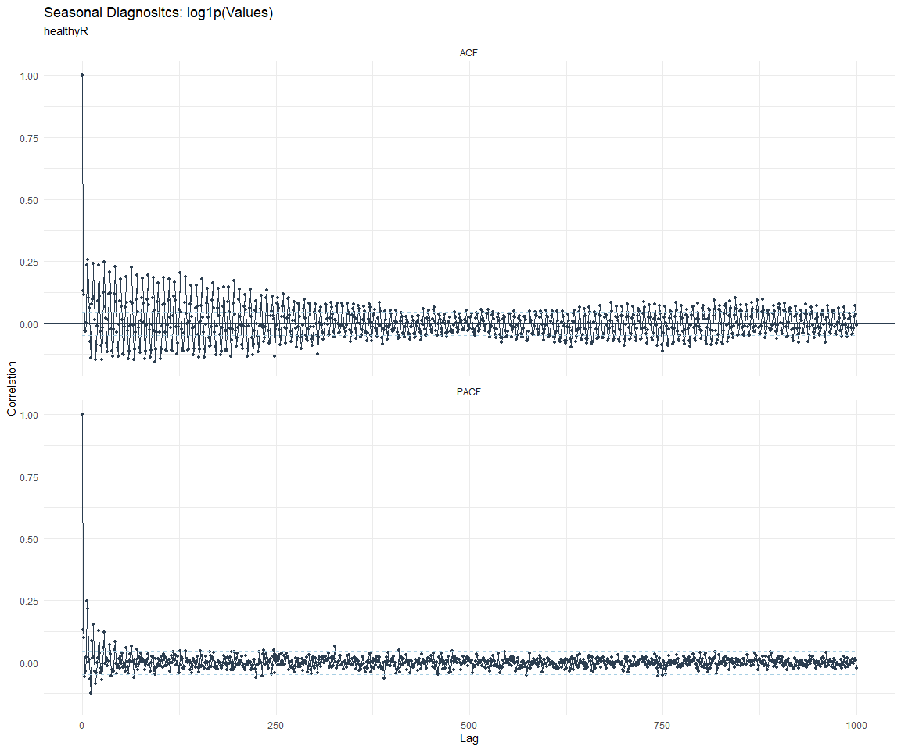
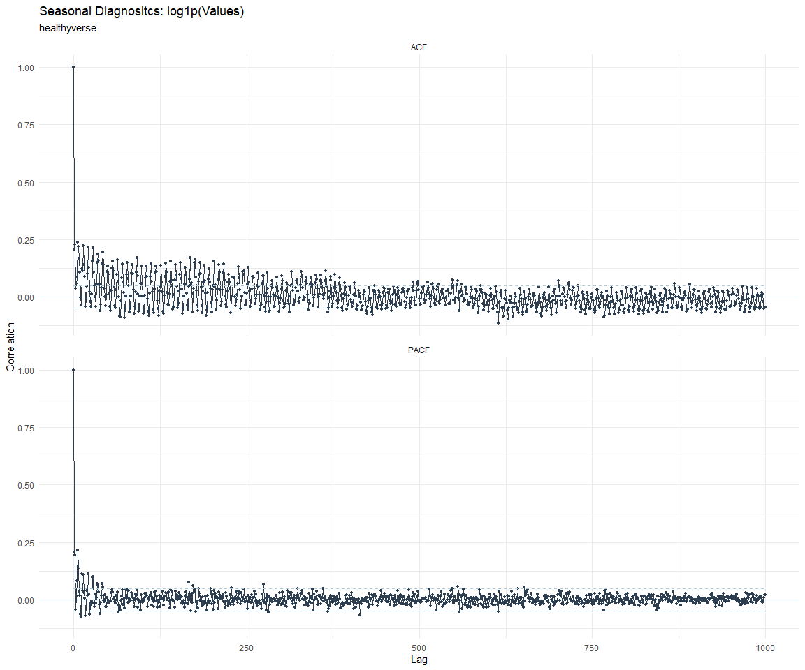

# Time Series Analysis, Modeling and Forecasting of the Healthyverse
Packages
Steven P. Sanderson II, MPH - Date:
2025-12-19

# Introduction

This analysis follows a *Nested Modeltime Workflow* from **`modeltime`**
along with using the **`NNS`** package. I use this to monitor the
downloads of all of my packages:

- [`healthyR`](https://www.spsanderson.com/healthyR/)
- [`healthyR.data`](https://www.spsanderson.com/healthyR.data/)
- [`healthyR.ts`](https://www.spsanderson.com/healthyR.ts/)
- [`healthyR.ai`](https://www.spsanderson.com/healthyR.ai/)
- [`healthyverse`](https://www.spsanderson.com/healthyverse/)
- [`TidyDensity`](https://www.spsanderson.com/TidyDensity/)
- [`tidyAML`](https://www.spsanderson.com/tidyAML/)
- [`RandomWalker`](https://www.spsanderson.com/RandomWalker/)

## Get Data

``` r
glimpse(downloads_tbl)
```

    Rows: 163,511
    Columns: 11
    $ date      <date> 2020-11-23, 2020-11-23, 2020-11-23, 2020-11-23, 2020-11-23,…
    $ time      <Period> 15H 36M 55S, 11H 26M 39S, 23H 34M 44S, 18H 39M 32S, 9H 0M…
    $ date_time <dttm> 2020-11-23 15:36:55, 2020-11-23 11:26:39, 2020-11-23 23:34:…
    $ size      <int> 4858294, 4858294, 4858301, 4858295, 361, 4863722, 4864794, 4…
    $ r_version <chr> NA, "4.0.3", "3.5.3", "3.5.2", NA, NA, NA, NA, NA, NA, NA, N…
    $ r_arch    <chr> NA, "x86_64", "x86_64", "x86_64", NA, NA, NA, NA, NA, NA, NA…
    $ r_os      <chr> NA, "mingw32", "mingw32", "linux-gnu", NA, NA, NA, NA, NA, N…
    $ package   <chr> "healthyR.data", "healthyR.data", "healthyR.data", "healthyR…
    $ version   <chr> "1.0.0", "1.0.0", "1.0.0", "1.0.0", "1.0.0", "1.0.0", "1.0.0…
    $ country   <chr> "US", "US", "US", "GB", "US", "US", "DE", "HK", "JP", "US", …
    $ ip_id     <int> 2069, 2804, 78827, 27595, 90474, 90474, 42435, 74, 7655, 638…

The last day in the data set is 2025-12-17 23:59:43, the file was
birthed on: 2022-07-02 23:58:17.511888, and at report knit time is
3.033202^{4} hours old. Happy analyzing!

Now that we have our data lets take a look at it using the `skimr`
package.

``` r
skim(downloads_tbl)
```

|                                                  |               |
|:-------------------------------------------------|:--------------|
| Name                                             | downloads_tbl |
| Number of rows                                   | 163511        |
| Number of columns                                | 11            |
| \_\_\_\_\_\_\_\_\_\_\_\_\_\_\_\_\_\_\_\_\_\_\_   |               |
| Column type frequency:                           |               |
| character                                        | 6             |
| Date                                             | 1             |
| numeric                                          | 2             |
| POSIXct                                          | 1             |
| Timespan                                         | 1             |
| \_\_\_\_\_\_\_\_\_\_\_\_\_\_\_\_\_\_\_\_\_\_\_\_ |               |
| Group variables                                  | None          |

Data summary

**Variable type: character**

| skim_variable | n_missing | complete_rate | min | max | empty | n_unique | whitespace |
|:--------------|----------:|--------------:|----:|----:|------:|---------:|-----------:|
| r_version     |    120030 |          0.27 |   5 |   7 |     0 |       50 |          0 |
| r_arch        |    120030 |          0.27 |   1 |   7 |     0 |        6 |          0 |
| r_os          |    120030 |          0.27 |   7 |  19 |     0 |       24 |          0 |
| package       |         0 |          1.00 |   7 |  13 |     0 |        8 |          0 |
| version       |         0 |          1.00 |   5 |  17 |     0 |       62 |          0 |
| country       |     15313 |          0.91 |   2 |   2 |     0 |      166 |          0 |

**Variable type: Date**

| skim_variable | n_missing | complete_rate | min | max | median | n_unique |
|:---|---:|---:|:---|:---|:---|---:|
| date | 0 | 1 | 2020-11-23 | 2025-12-17 | 2023-11-09 | 1844 |

**Variable type: numeric**

| skim_variable | n_missing | complete_rate | mean | sd | p0 | p25 | p50 | p75 | p100 | hist |
|:---|---:|---:|---:|---:|---:|---:|---:|---:|---:|:---|
| size | 0 | 1 | 1124616.56 | 1487041.16 | 355 | 29181 | 310345 | 2351945 | 5677952 | ▇▁▂▁▁ |
| ip_id | 0 | 1 | 11299.56 | 21935.53 | 1 | 230 | 2883 | 11923 | 299146 | ▇▁▁▁▁ |

**Variable type: POSIXct**

| skim_variable | n_missing | complete_rate | min | max | median | n_unique |
|:---|---:|---:|:---|:---|:---|---:|
| date_time | 0 | 1 | 2020-11-23 09:00:41 | 2025-12-17 23:59:43 | 2023-11-09 04:48:12 | 103305 |

**Variable type: Timespan**

| skim_variable | n_missing | complete_rate | min | max |     median | n_unique |
|:--------------|----------:|--------------:|----:|----:|-----------:|---------:|
| time          |         0 |             1 |   0 |  59 | 12H 6M 51S |       60 |

We can see that the following columns are missing a lot of data and for
us are most likely not useful anyways, so we will drop them
`c(r_version, r_arch, r_os)`

## Plots

Now lets take a look at a time-series plot of the total daily downloads
by package. We will use a log scale and place a vertical line at each
version release for each package.


    [[1]]


    [[2]]


    [[3]]


    [[4]]


    [[5]]


    [[6]]


    [[7]]


    [[8]]


Now lets take a look at some time series decomposition graphs.

    [[1]]


    [[2]]


    [[3]]


    [[4]]


    [[5]]


    [[6]]


    [[7]]


    [[8]]


    [[1]]


    [[2]]


    [[3]]


    [[4]]


    [[5]]


    [[6]]


    [[7]]


    [[8]]


Seasonal Diagnostics:

    [[1]]


    [[2]]


    [[3]]


    [[4]]


    [[5]]


    [[6]]


    [[7]]


    [[8]]


ACF and PACF Diagnostics:

    [[1]]


    [[2]]


    [[3]]




    [[4]]


    [[5]]


    [[6]]


    [[7]]




    [[8]]


## Feature Engineering

Now that we have our basic data and a shot of what it looks like, let’s
add some features to our data which can be very helpful in modeling.
Lets start by making a `tibble` that is aggregated by the day and
package, as we are going to be interested in forecasting the next 4
weeks or 28 days for each package. First lets get our base data.


    Call:
    stats::lm(formula = .formula, data = df)

    Residuals:
        Min      1Q  Median      3Q     Max 
    -146.89  -36.44  -11.30   26.89  820.26 

    Coefficients:
                                                         Estimate Std. Error
    (Intercept)                                        -1.883e+02  5.987e+01
    date                                                1.149e-02  3.174e-03
    lag(value, 1)                                       1.091e-01  2.314e-02
    lag(value, 7)                                       8.818e-02  2.386e-02
    lag(value, 14)                                      7.737e-02  2.380e-02
    lag(value, 21)                                      8.279e-02  2.387e-02
    lag(value, 28)                                      6.705e-02  2.379e-02
    lag(value, 35)                                      5.181e-02  2.380e-02
    lag(value, 42)                                      6.655e-02  2.394e-02
    lag(value, 49)                                      6.102e-02  2.386e-02
    month(date, label = TRUE).L                        -1.016e+01  4.986e+00
    month(date, label = TRUE).Q                         1.091e+00  4.894e+00
    month(date, label = TRUE).C                        -1.532e+01  4.924e+00
    month(date, label = TRUE)^4                        -5.662e+00  4.917e+00
    month(date, label = TRUE)^5                        -6.370e+00  4.881e+00
    month(date, label = TRUE)^6                         1.445e+00  4.900e+00
    month(date, label = TRUE)^7                        -4.368e+00  4.839e+00
    month(date, label = TRUE)^8                        -4.001e+00  4.813e+00
    month(date, label = TRUE)^9                         2.794e+00  4.826e+00
    month(date, label = TRUE)^10                        9.302e-01  4.842e+00
    month(date, label = TRUE)^11                       -4.059e+00  4.829e+00
    fourier_vec(date, type = "sin", K = 1, period = 7) -1.123e+01  2.204e+00
    fourier_vec(date, type = "cos", K = 1, period = 7)  7.240e+00  2.283e+00
                                                       t value Pr(>|t|)    
    (Intercept)                                         -3.145 0.001689 ** 
    date                                                 3.621 0.000302 ***
    lag(value, 1)                                        4.717 2.58e-06 ***
    lag(value, 7)                                        3.696 0.000226 ***
    lag(value, 14)                                       3.251 0.001171 ** 
    lag(value, 21)                                       3.468 0.000537 ***
    lag(value, 28)                                       2.819 0.004875 ** 
    lag(value, 35)                                       2.177 0.029637 *  
    lag(value, 42)                                       2.779 0.005504 ** 
    lag(value, 49)                                       2.558 0.010619 *  
    month(date, label = TRUE).L                         -2.037 0.041802 *  
    month(date, label = TRUE).Q                          0.223 0.823671    
    month(date, label = TRUE).C                         -3.112 0.001890 ** 
    month(date, label = TRUE)^4                         -1.151 0.249694    
    month(date, label = TRUE)^5                         -1.305 0.192054    
    month(date, label = TRUE)^6                          0.295 0.768127    
    month(date, label = TRUE)^7                         -0.903 0.366795    
    month(date, label = TRUE)^8                         -0.831 0.405956    
    month(date, label = TRUE)^9                          0.579 0.562730    
    month(date, label = TRUE)^10                         0.192 0.847693    
    month(date, label = TRUE)^11                        -0.841 0.400644    
    fourier_vec(date, type = "sin", K = 1, period = 7)  -5.097 3.82e-07 ***
    fourier_vec(date, type = "cos", K = 1, period = 7)   3.172 0.001542 ** 
    ---
    Signif. codes:  0 '***' 0.001 '**' 0.01 '*' 0.05 '.' 0.1 ' ' 1

    Residual standard error: 59.23 on 1772 degrees of freedom
      (49 observations deleted due to missingness)
    Multiple R-squared:  0.2293,    Adjusted R-squared:  0.2197 
    F-statistic: 23.96 on 22 and 1772 DF,  p-value: < 2.2e-16


## NNS Forecasting

This is something I have been wanting to try for a while. The `NNS`
package is a great package for forecasting time series data.

[NNS GitHub](https://github.com/OVVO-Financial/NNS)

``` r
library(NNS)

data_list <- base_data |>
    select(package, value) |>
    group_split(package)

data_list |>
    imap(
        \(x, idx) {
            obj <- x
            x <- obj |> pull(value) |> tail(7*52)
            train_set_size <- length(x) - 56
            pkg <- obj |> pluck(1) |> unique()
#            sf <- NNS.seas(x, modulo = 7, plot = FALSE)$periods
            seas <- t(
                sapply(
                    1:25, 
                    function(i) c(
                        i,
                        sqrt(
                            mean((
                                NNS.ARMA(x, 
                                         h = 28, 
                                         training.set = train_set_size, 
                                         method = "lin", 
                                         seasonal.factor = i, 
                                         plot=FALSE
                                         ) - tail(x, 28)) ^ 2)))
                    )
                )
            colnames(seas) <- c("Period", "RMSE")
            sf <- seas[which.min(seas[, 2]), 1]
            
            cat(paste0("Package: ", pkg, "\n"))
            NNS.ARMA.optim(
                variable = x,
                h = 28,
                training.set = train_set_size,
                #seasonal.factor = seq(12, 60, 7),
                seasonal.factor = sf,
                pred.int = 0.95,
                plot = TRUE
            )
            title(
                sub = paste0("\n",
                             "Package: ", pkg, " - NNS Optimization")
            )
        }
    )
```

    Package: healthyR
    [1] "CURRNET METHOD: lin"
    [1] "COPY LATEST PARAMETERS DIRECTLY FOR NNS.ARMA() IF ERROR:"
    [1] "NNS.ARMA(... method =  'lin' , seasonal.factor =  c( 1 ) ...)"
    [1] "CURRENT lin OBJECTIVE FUNCTION = 242.700244394241"
    [1] "BEST method = 'lin' PATH MEMBER = c( 1 )"
    [1] "BEST lin OBJECTIVE FUNCTION = 242.700244394241"
    [1] "CURRNET METHOD: nonlin"
    [1] "COPY LATEST PARAMETERS DIRECTLY FOR NNS.ARMA() IF ERROR:"
    [1] "NNS.ARMA(... method =  'nonlin' , seasonal.factor =  c( 1 ) ...)"
    [1] "CURRENT nonlin OBJECTIVE FUNCTION = 92.5014119403181"
    [1] "BEST method = 'nonlin' PATH MEMBER = c( 1 )"
    [1] "BEST nonlin OBJECTIVE FUNCTION = 92.5014119403181"
    [1] "CURRNET METHOD: both"
    [1] "COPY LATEST PARAMETERS DIRECTLY FOR NNS.ARMA() IF ERROR:"
    [1] "NNS.ARMA(... method =  'both' , seasonal.factor =  c( 1 ) ...)"
    [1] "CURRENT both OBJECTIVE FUNCTION = 241.039343973972"
    [1] "BEST method = 'both' PATH MEMBER = c( 1 )"
    [1] "BEST both OBJECTIVE FUNCTION = 241.039343973972"


    Package: healthyR.ai
    [1] "CURRNET METHOD: lin"
    [1] "COPY LATEST PARAMETERS DIRECTLY FOR NNS.ARMA() IF ERROR:"
    [1] "NNS.ARMA(... method =  'lin' , seasonal.factor =  c( 4 ) ...)"
    [1] "CURRENT lin OBJECTIVE FUNCTION = 17.9305583661461"
    [1] "BEST method = 'lin' PATH MEMBER = c( 4 )"
    [1] "BEST lin OBJECTIVE FUNCTION = 17.9305583661461"
    [1] "CURRNET METHOD: nonlin"
    [1] "COPY LATEST PARAMETERS DIRECTLY FOR NNS.ARMA() IF ERROR:"
    [1] "NNS.ARMA(... method =  'nonlin' , seasonal.factor =  c( 4 ) ...)"
    [1] "CURRENT nonlin OBJECTIVE FUNCTION = 29.5659778093089"
    [1] "BEST method = 'nonlin' PATH MEMBER = c( 4 )"
    [1] "BEST nonlin OBJECTIVE FUNCTION = 29.5659778093089"
    [1] "CURRNET METHOD: both"
    [1] "COPY LATEST PARAMETERS DIRECTLY FOR NNS.ARMA() IF ERROR:"
    [1] "NNS.ARMA(... method =  'both' , seasonal.factor =  c( 4 ) ...)"
    [1] "CURRENT both OBJECTIVE FUNCTION = 35.8188837331646"
    [1] "BEST method = 'both' PATH MEMBER = c( 4 )"
    [1] "BEST both OBJECTIVE FUNCTION = 35.8188837331646"


    Package: healthyR.data
    [1] "CURRNET METHOD: lin"
    [1] "COPY LATEST PARAMETERS DIRECTLY FOR NNS.ARMA() IF ERROR:"
    [1] "NNS.ARMA(... method =  'lin' , seasonal.factor =  c( 23 ) ...)"
    [1] "CURRENT lin OBJECTIVE FUNCTION = 13.1114651351477"
    [1] "BEST method = 'lin' PATH MEMBER = c( 23 )"
    [1] "BEST lin OBJECTIVE FUNCTION = 13.1114651351477"
    [1] "CURRNET METHOD: nonlin"
    [1] "COPY LATEST PARAMETERS DIRECTLY FOR NNS.ARMA() IF ERROR:"
    [1] "NNS.ARMA(... method =  'nonlin' , seasonal.factor =  c( 23 ) ...)"
    [1] "CURRENT nonlin OBJECTIVE FUNCTION = 8.17289711785975"
    [1] "BEST method = 'nonlin' PATH MEMBER = c( 23 )"
    [1] "BEST nonlin OBJECTIVE FUNCTION = 8.17289711785975"
    [1] "CURRNET METHOD: both"
    [1] "COPY LATEST PARAMETERS DIRECTLY FOR NNS.ARMA() IF ERROR:"
    [1] "NNS.ARMA(... method =  'both' , seasonal.factor =  c( 23 ) ...)"
    [1] "CURRENT both OBJECTIVE FUNCTION = 8.91477157753465"
    [1] "BEST method = 'both' PATH MEMBER = c( 23 )"
    [1] "BEST both OBJECTIVE FUNCTION = 8.91477157753465"


    Package: healthyR.ts
    [1] "CURRNET METHOD: lin"
    [1] "COPY LATEST PARAMETERS DIRECTLY FOR NNS.ARMA() IF ERROR:"
    [1] "NNS.ARMA(... method =  'lin' , seasonal.factor =  c( 19 ) ...)"
    [1] "CURRENT lin OBJECTIVE FUNCTION = 17.9116783526816"
    [1] "BEST method = 'lin' PATH MEMBER = c( 19 )"
    [1] "BEST lin OBJECTIVE FUNCTION = 17.9116783526816"
    [1] "CURRNET METHOD: nonlin"
    [1] "COPY LATEST PARAMETERS DIRECTLY FOR NNS.ARMA() IF ERROR:"
    [1] "NNS.ARMA(... method =  'nonlin' , seasonal.factor =  c( 19 ) ...)"
    [1] "CURRENT nonlin OBJECTIVE FUNCTION = 21.413870893939"
    [1] "BEST method = 'nonlin' PATH MEMBER = c( 19 )"
    [1] "BEST nonlin OBJECTIVE FUNCTION = 21.413870893939"
    [1] "CURRNET METHOD: both"
    [1] "COPY LATEST PARAMETERS DIRECTLY FOR NNS.ARMA() IF ERROR:"
    [1] "NNS.ARMA(... method =  'both' , seasonal.factor =  c( 19 ) ...)"
    [1] "CURRENT both OBJECTIVE FUNCTION = 22.3342953546365"
    [1] "BEST method = 'both' PATH MEMBER = c( 19 )"
    [1] "BEST both OBJECTIVE FUNCTION = 22.3342953546365"


    Package: healthyverse
    [1] "CURRNET METHOD: lin"
    [1] "COPY LATEST PARAMETERS DIRECTLY FOR NNS.ARMA() IF ERROR:"
    [1] "NNS.ARMA(... method =  'lin' , seasonal.factor =  c( 4 ) ...)"
    [1] "CURRENT lin OBJECTIVE FUNCTION = 8.08859695435358"
    [1] "BEST method = 'lin' PATH MEMBER = c( 4 )"
    [1] "BEST lin OBJECTIVE FUNCTION = 8.08859695435358"
    [1] "CURRNET METHOD: nonlin"
    [1] "COPY LATEST PARAMETERS DIRECTLY FOR NNS.ARMA() IF ERROR:"
    [1] "NNS.ARMA(... method =  'nonlin' , seasonal.factor =  c( 4 ) ...)"
    [1] "CURRENT nonlin OBJECTIVE FUNCTION = 9.31449660384881"
    [1] "BEST method = 'nonlin' PATH MEMBER = c( 4 )"
    [1] "BEST nonlin OBJECTIVE FUNCTION = 9.31449660384881"
    [1] "CURRNET METHOD: both"
    [1] "COPY LATEST PARAMETERS DIRECTLY FOR NNS.ARMA() IF ERROR:"
    [1] "NNS.ARMA(... method =  'both' , seasonal.factor =  c( 4 ) ...)"
    [1] "CURRENT both OBJECTIVE FUNCTION = 9.34246121461806"
    [1] "BEST method = 'both' PATH MEMBER = c( 4 )"
    [1] "BEST both OBJECTIVE FUNCTION = 9.34246121461806"


    Package: RandomWalker
    [1] "CURRNET METHOD: lin"
    [1] "COPY LATEST PARAMETERS DIRECTLY FOR NNS.ARMA() IF ERROR:"
    [1] "NNS.ARMA(... method =  'lin' , seasonal.factor =  c( 23 ) ...)"
    [1] "CURRENT lin OBJECTIVE FUNCTION = 9.96297363830218"
    [1] "BEST method = 'lin' PATH MEMBER = c( 23 )"
    [1] "BEST lin OBJECTIVE FUNCTION = 9.96297363830218"
    [1] "CURRNET METHOD: nonlin"
    [1] "COPY LATEST PARAMETERS DIRECTLY FOR NNS.ARMA() IF ERROR:"
    [1] "NNS.ARMA(... method =  'nonlin' , seasonal.factor =  c( 23 ) ...)"
    [1] "CURRENT nonlin OBJECTIVE FUNCTION = 5.40288044047232"
    [1] "BEST method = 'nonlin' PATH MEMBER = c( 23 )"
    [1] "BEST nonlin OBJECTIVE FUNCTION = 5.40288044047232"
    [1] "CURRNET METHOD: both"
    [1] "COPY LATEST PARAMETERS DIRECTLY FOR NNS.ARMA() IF ERROR:"
    [1] "NNS.ARMA(... method =  'both' , seasonal.factor =  c( 23 ) ...)"
    [1] "CURRENT both OBJECTIVE FUNCTION = 5.84217977662865"
    [1] "BEST method = 'both' PATH MEMBER = c( 23 )"
    [1] "BEST both OBJECTIVE FUNCTION = 5.84217977662865"


    Package: tidyAML
    [1] "CURRNET METHOD: lin"
    [1] "COPY LATEST PARAMETERS DIRECTLY FOR NNS.ARMA() IF ERROR:"
    [1] "NNS.ARMA(... method =  'lin' , seasonal.factor =  c( 1 ) ...)"
    [1] "CURRENT lin OBJECTIVE FUNCTION = 143.373591575554"
    [1] "BEST method = 'lin' PATH MEMBER = c( 1 )"
    [1] "BEST lin OBJECTIVE FUNCTION = 143.373591575554"
    [1] "CURRNET METHOD: nonlin"
    [1] "COPY LATEST PARAMETERS DIRECTLY FOR NNS.ARMA() IF ERROR:"
    [1] "NNS.ARMA(... method =  'nonlin' , seasonal.factor =  c( 1 ) ...)"
    [1] "CURRENT nonlin OBJECTIVE FUNCTION = 33.355052512478"
    [1] "BEST method = 'nonlin' PATH MEMBER = c( 1 )"
    [1] "BEST nonlin OBJECTIVE FUNCTION = 33.355052512478"
    [1] "CURRNET METHOD: both"
    [1] "COPY LATEST PARAMETERS DIRECTLY FOR NNS.ARMA() IF ERROR:"
    [1] "NNS.ARMA(... method =  'both' , seasonal.factor =  c( 1 ) ...)"
    [1] "CURRENT both OBJECTIVE FUNCTION = 33.4499679243025"
    [1] "BEST method = 'both' PATH MEMBER = c( 1 )"
    [1] "BEST both OBJECTIVE FUNCTION = 33.4499679243025"


    Package: TidyDensity
    [1] "CURRNET METHOD: lin"
    [1] "COPY LATEST PARAMETERS DIRECTLY FOR NNS.ARMA() IF ERROR:"
    [1] "NNS.ARMA(... method =  'lin' , seasonal.factor =  c( 7 ) ...)"
    [1] "CURRENT lin OBJECTIVE FUNCTION = 12.1936934358323"
    [1] "BEST method = 'lin' PATH MEMBER = c( 7 )"
    [1] "BEST lin OBJECTIVE FUNCTION = 12.1936934358323"
    [1] "CURRNET METHOD: nonlin"
    [1] "COPY LATEST PARAMETERS DIRECTLY FOR NNS.ARMA() IF ERROR:"
    [1] "NNS.ARMA(... method =  'nonlin' , seasonal.factor =  c( 7 ) ...)"
    [1] "CURRENT nonlin OBJECTIVE FUNCTION = 12.0372311255434"
    [1] "BEST method = 'nonlin' PATH MEMBER = c( 7 )"
    [1] "BEST nonlin OBJECTIVE FUNCTION = 12.0372311255434"
    [1] "CURRNET METHOD: both"
    [1] "COPY LATEST PARAMETERS DIRECTLY FOR NNS.ARMA() IF ERROR:"
    [1] "NNS.ARMA(... method =  'both' , seasonal.factor =  c( 7 ) ...)"
    [1] "CURRENT both OBJECTIVE FUNCTION = 14.9322055844842"
    [1] "BEST method = 'both' PATH MEMBER = c( 7 )"
    [1] "BEST both OBJECTIVE FUNCTION = 14.9322055844842"


    [[1]]
    NULL

    [[2]]
    NULL

    [[3]]
    NULL

    [[4]]
    NULL

    [[5]]
    NULL

    [[6]]
    NULL

    [[7]]
    NULL

    [[8]]
    NULL

## Pre-Processing

Now we are going to do some basic pre-processing.

``` r
data_padded_tbl <- base_data %>%
  pad_by_time(
    .date_var  = date,
    .pad_value = 0
  )

# Get log interval and standardization parameters
log_params  <- liv(data_padded_tbl$value, limit_lower = 0, offset = 1, silent = TRUE)
limit_lower <- log_params$limit_lower
limit_upper <- log_params$limit_upper
offset      <- log_params$offset

data_liv_tbl <- data_padded_tbl %>%
  # Get log interval transform
  mutate(value_trans = liv(value, limit_lower = 0, offset = 1, silent = TRUE)$log_scaled)

# Get Standardization Params
std_params <- standard_vec(data_liv_tbl$value_trans, silent = TRUE)
std_mean   <- std_params$mean
std_sd     <- std_params$sd

data_transformed_tbl <- data_liv_tbl %>%
  group_by(package) %>%
  # get standardization
  mutate(value_trans = standard_vec(value_trans, silent = TRUE)$standard_scaled) %>%
  tk_augment_fourier(
    .date_var = date,
    .periods  = c(7, 14, 30, 90, 180),
    .K        = 2
  ) %>%
  tk_augment_timeseries_signature(
    .date_var = date
  ) %>%
  ungroup() %>%
  select(-c(value, -year.iso))
```

Since this is panel data we can follow one of two different modeling
strategies. We can search for a global model in the panel data or we can
use nested forecasting finding the best model for each of the time
series. Since we only have 5 panels, we will use nested forecasting.

To do this we will use the `nest_timeseries` and
`split_nested_timeseries` functions to create a nested `tibble`.

``` r
horizon <- 4*7

nested_data_tbl <- data_transformed_tbl %>%

    # 0. Filter out column where package is NA
    filter(!is.na(package)) %>%
    
    # 1. Extending: We'll predict n days into the future.
    extend_timeseries(
        .id_var        = package,
        .date_var      = date,
        .length_future = horizon
    ) %>%
    
    # 2. Nesting: We'll group by id, and create a future dataset
    #    that forecasts n days of extended data and
    #    an actual dataset that contains n*2 days
    nest_timeseries(
        .id_var        = package,
        .length_future = horizon
        #.length_actual = horizon*2
    ) %>%
    
   # 3. Splitting: We'll take the actual data and create splits
   #    for accuracy and confidence interval estimation of n das (test)
   #    and the rest is training data
    split_nested_timeseries(
        .length_test = horizon
    )

nested_data_tbl
```

    # A tibble: 8 × 4
      package       .actual_data          .future_data       .splits          
      <fct>         <list>                <list>             <list>           
    1 healthyR.data <tibble [1,836 × 50]> <tibble [28 × 50]> <split [1808|28]>
    2 healthyR      <tibble [1,827 × 50]> <tibble [28 × 50]> <split [1799|28]>
    3 healthyR.ts   <tibble [1,772 × 50]> <tibble [28 × 50]> <split [1744|28]>
    4 healthyverse  <tibble [1,743 × 50]> <tibble [28 × 50]> <split [1715|28]>
    5 healthyR.ai   <tibble [1,569 × 50]> <tibble [28 × 50]> <split [1541|28]>
    6 TidyDensity   <tibble [1,420 × 50]> <tibble [28 × 50]> <split [1392|28]>
    7 tidyAML       <tibble [1,027 × 50]> <tibble [28 × 50]> <split [999|28]> 
    8 RandomWalker  <tibble [450 × 50]>   <tibble [28 × 50]> <split [422|28]> 

Now it is time to make some recipes and models using the modeltime
workflow.

## Modeltime Workflow

### Recipe Object

``` r
recipe_base <- recipe(
  value_trans ~ .
  , data = extract_nested_test_split(nested_data_tbl)
  )

recipe_base

recipe_date <- recipe(
  value_trans ~ date
  , data = extract_nested_test_split(nested_data_tbl)
  )
```

### Models

``` r
# Models ------------------------------------------------------------------

# Auto ARIMA --------------------------------------------------------------

model_spec_arima_no_boost <- arima_reg() %>%
  set_engine(engine = "auto_arima")

wflw_auto_arima <- workflow() %>%
  add_recipe(recipe = recipe_date) %>%
  add_model(model_spec_arima_no_boost)

# NNETAR ------------------------------------------------------------------

model_spec_nnetar <- nnetar_reg(
  mode              = "regression"
  , seasonal_period = "auto"
) %>%
  set_engine("nnetar")

wflw_nnetar <- workflow() %>%
  add_recipe(recipe = recipe_base) %>%
  add_model(model_spec_nnetar)

# TSLM --------------------------------------------------------------------

model_spec_lm <- linear_reg() %>%
  set_engine("lm")

wflw_lm <- workflow() %>%
  add_recipe(recipe = recipe_base) %>%
  add_model(model_spec_lm)

# MARS --------------------------------------------------------------------

model_spec_mars <- mars(mode = "regression") %>%
  set_engine("earth")

wflw_mars <- workflow() %>%
  add_recipe(recipe = recipe_date) %>%
  add_model(model_spec_mars)
```

### Nested Modeltime Tables

``` r
nested_modeltime_tbl <- modeltime_nested_fit(
  # Nested Data
  nested_data = nested_data_tbl,
   control = control_nested_fit(
     verbose = TRUE,
     allow_par = FALSE
   ),
  # Add workflows
  wflw_auto_arima,
  wflw_lm,
  wflw_mars,
  wflw_nnetar
)
```

``` r
nested_modeltime_tbl <- nested_modeltime_tbl[!is.na(nested_modeltime_tbl$package),]
```

### Model Accuracy

``` r
nested_modeltime_tbl %>%
  extract_nested_test_accuracy() %>%
  filter(!is.na(package)) %>%
  knitr::kable()
```

| package | .model_id | .model_desc | .type | mae | mape | mase | smape | rmse | rsq |
|:---|---:|:---|:---|---:|---:|---:|---:|---:|---:|
| healthyR.data | 1 | ARIMA | Test | 0.6362652 | 146.73987 | 0.6875762 | 135.5357 | 0.7237018 | 0.1423817 |
| healthyR.data | 2 | LM | Test | 0.6331317 | 212.52819 | 0.6841900 | 113.0083 | 0.7684610 | 0.0566708 |
| healthyR.data | 3 | EARTH | Test | 1.5424332 | 695.27895 | 1.6668212 | 125.4436 | 1.7917357 | 0.0799753 |
| healthyR.data | 4 | NNAR | Test | 0.6783203 | 250.04467 | 0.7330228 | 117.4472 | 0.8073344 | 0.0228395 |
| healthyR | 1 | ARIMA | Test | 0.5633894 | 210.81238 | 0.8811322 | 143.0725 | 0.7127060 | 0.0178204 |
| healthyR | 2 | LM | Test | 0.5449087 | 432.41507 | 0.8522286 | 107.0818 | 0.6754512 | 0.0756057 |
| healthyR | 3 | EARTH | Test | 0.7762126 | 802.78277 | 1.2139844 | 107.2825 | 0.9436162 | 0.1506292 |
| healthyR | 4 | NNAR | Test | 0.5520662 | 271.96860 | 0.8634228 | 130.3029 | 0.6810516 | 0.0609572 |
| healthyR.ts | 1 | ARIMA | Test | 0.6003038 | 108.24737 | 0.6918060 | 146.4585 | 0.7517885 | 0.0300262 |
| healthyR.ts | 2 | LM | Test | 0.7198734 | 149.95762 | 0.8296011 | 134.5545 | 0.8796846 | 0.0073324 |
| healthyR.ts | 3 | EARTH | Test | 0.5666663 | 118.39886 | 0.6530412 | 104.6119 | 0.7353458 | 0.0105083 |
| healthyR.ts | 4 | NNAR | Test | 0.7352198 | 143.30717 | 0.8472868 | 137.3605 | 0.9188905 | 0.0320685 |
| healthyverse | 1 | ARIMA | Test | 0.7032529 | 85.33082 | 0.6922529 | 130.1368 | 0.9210379 | 0.0401491 |
| healthyverse | 2 | LM | Test | 0.7937788 | 135.64752 | 0.7813629 | 121.5733 | 0.9338528 | 0.0021528 |
| healthyverse | 3 | EARTH | Test | 0.9266721 | 223.08120 | 0.9121776 | 107.7131 | 1.0953853 | 0.2454382 |
| healthyverse | 4 | NNAR | Test | 0.7829644 | 143.30999 | 0.7707177 | 127.1476 | 0.9002979 | 0.0410234 |
| healthyR.ai | 1 | ARIMA | Test | 0.7287586 | 97.24260 | 0.9949989 | 161.7215 | 0.8348559 | 0.2499296 |
| healthyR.ai | 2 | LM | Test | 0.9932906 | 185.79387 | 1.3561735 | 152.4263 | 1.1960719 | 0.0275594 |
| healthyR.ai | 3 | EARTH | Test | 2.8329454 | 899.23545 | 3.8679167 | 132.5484 | 3.2638350 | 0.1706755 |
| healthyR.ai | 4 | NNAR | Test | 0.9742196 | 187.23280 | 1.3301352 | 153.0333 | 1.1614390 | 0.0157495 |
| TidyDensity | 1 | ARIMA | Test | 1.1040711 | 222.05648 | 0.6838000 | 161.0735 | 1.2181749 | 0.1504666 |
| TidyDensity | 2 | LM | Test | 0.9434274 | 122.41148 | 0.5843063 | 155.4419 | 1.1500310 | 0.0086790 |
| TidyDensity | 3 | EARTH | Test | 0.9377936 | 108.43669 | 0.5808170 | 183.8646 | 1.1370379 | 0.0359213 |
| TidyDensity | 4 | NNAR | Test | 1.0335927 | 138.75564 | 0.6401496 | 158.0720 | 1.1988975 | 0.0038843 |
| tidyAML | 1 | ARIMA | Test | 0.5429638 | 117.09213 | 0.6611443 | 136.4154 | 0.6891761 | 0.0829489 |
| tidyAML | 2 | LM | Test | 0.6276139 | 279.10001 | 0.7642192 | 134.3035 | 0.7877972 | 0.0509991 |
| tidyAML | 3 | EARTH | Test | 1.3099296 | 642.36872 | 1.5950464 | 132.5770 | 1.5151005 | 0.1317782 |
| tidyAML | 4 | NNAR | Test | 0.7785673 | 410.70385 | 0.9480287 | 131.1527 | 0.9101556 | 0.0074425 |
| RandomWalker | 1 | ARIMA | Test | 0.6754456 | 114.69793 | 0.6548303 | 155.0856 | 0.8066527 | 0.1564620 |
| RandomWalker | 2 | LM | Test | 0.7136471 | 136.49046 | 0.6918658 | 146.9614 | 0.8912711 | 0.0128773 |
| RandomWalker | 3 | EARTH | Test | 0.8609206 | 220.91045 | 0.8346443 | 161.6064 | 0.9275314 | 0.0676317 |
| RandomWalker | 4 | NNAR | Test | 0.7293669 | 143.54218 | 0.7071057 | 145.2223 | 0.9335385 | 0.0130316 |

### Plot Models

``` r
nested_modeltime_tbl %>%
  extract_nested_test_forecast() %>%
  group_by(package) %>%
  filter_by_time(.date_var = .index, .start_date = max(.index) - 60) %>%
  ungroup() %>%
  plot_modeltime_forecast(
    .interactive = FALSE,
    .conf_interval_show  = FALSE,
    .facet_scales = "free"
  ) +
  theme_minimal() +
  facet_wrap(~ package, nrow = 3) +
  theme(legend.position = "bottom")
```


### Best Model

``` r
best_nested_modeltime_tbl <- nested_modeltime_tbl %>%
  modeltime_nested_select_best(
    metric = "rmse",
    minimize = TRUE,
    filter_test_forecasts = TRUE
  )

best_nested_modeltime_tbl %>%
  extract_nested_best_model_report()
```

    # Nested Modeltime Table
      

    # A tibble: 8 × 10
      package       .model_id .model_desc .type   mae  mape  mase smape  rmse    rsq
      <fct>             <int> <chr>       <chr> <dbl> <dbl> <dbl> <dbl> <dbl>  <dbl>
    1 healthyR.data         1 ARIMA       Test  0.636 147.  0.688  136. 0.724 0.142 
    2 healthyR              2 LM          Test  0.545 432.  0.852  107. 0.675 0.0756
    3 healthyR.ts           3 EARTH       Test  0.567 118.  0.653  105. 0.735 0.0105
    4 healthyverse          4 NNAR        Test  0.783 143.  0.771  127. 0.900 0.0410
    5 healthyR.ai           1 ARIMA       Test  0.729  97.2 0.995  162. 0.835 0.250 
    6 TidyDensity           3 EARTH       Test  0.938 108.  0.581  184. 1.14  0.0359
    7 tidyAML               1 ARIMA       Test  0.543 117.  0.661  136. 0.689 0.0829
    8 RandomWalker          1 ARIMA       Test  0.675 115.  0.655  155. 0.807 0.156 

``` r
best_nested_modeltime_tbl %>%
  extract_nested_test_forecast() %>%
  #filter(!is.na(.model_id)) %>%
  group_by(package) %>%
  filter_by_time(.date_var = .index, .start_date = max(.index) - 60) %>%
  ungroup() %>%
  plot_modeltime_forecast(
    .interactive = FALSE,
    .conf_interval_alpha = 0.2,
    .facet_scales = "free"
  ) +
  facet_wrap(~ package, nrow = 3) +
  theme_minimal() +
  theme(legend.position = "bottom")
```


## Refitting and Future Forecast

Now that we have the best models, we can make our future forecasts.

``` r
nested_modeltime_refit_tbl <- best_nested_modeltime_tbl %>%
    modeltime_nested_refit(
        control = control_nested_refit(verbose = TRUE)
    )
```

``` r
nested_modeltime_refit_tbl
```

    # Nested Modeltime Table
      

    # A tibble: 8 × 5
      package       .actual_data .future_data .splits           .modeltime_tables 
      <fct>         <list>       <list>       <list>            <list>            
    1 healthyR.data <tibble>     <tibble>     <split [1808|28]> <mdl_tm_t [1 × 5]>
    2 healthyR      <tibble>     <tibble>     <split [1799|28]> <mdl_tm_t [1 × 5]>
    3 healthyR.ts   <tibble>     <tibble>     <split [1744|28]> <mdl_tm_t [1 × 5]>
    4 healthyverse  <tibble>     <tibble>     <split [1715|28]> <mdl_tm_t [1 × 5]>
    5 healthyR.ai   <tibble>     <tibble>     <split [1541|28]> <mdl_tm_t [1 × 5]>
    6 TidyDensity   <tibble>     <tibble>     <split [1392|28]> <mdl_tm_t [1 × 5]>
    7 tidyAML       <tibble>     <tibble>     <split [999|28]>  <mdl_tm_t [1 × 5]>
    8 RandomWalker  <tibble>     <tibble>     <split [422|28]>  <mdl_tm_t [1 × 5]>

``` r
nested_modeltime_refit_tbl %>%
  extract_nested_future_forecast() %>%
  group_by(package) %>%
  mutate(across(.value:.conf_hi, .fns = ~ standard_inv_vec(
    x    = .,
    mean = std_mean,
    sd   = std_sd
  )$standard_inverse_value)) %>%
  mutate(across(.value:.conf_hi, .fns = ~ liiv(
    x = .,
    limit_lower = limit_lower,
    limit_upper = limit_upper,
    offset      = offset
  )$rescaled_v)) %>%
  filter_by_time(.date_var = .index, .start_date = max(.index) - 60) %>%
  ungroup() %>%
  plot_modeltime_forecast(
    .interactive = FALSE,
    .conf_interval_alpha = 0.2,
    .facet_scales = "free"
  ) +
  facet_wrap(~ package, nrow = 3) +
  theme_minimal() +
  theme(legend.position = "bottom")
```


