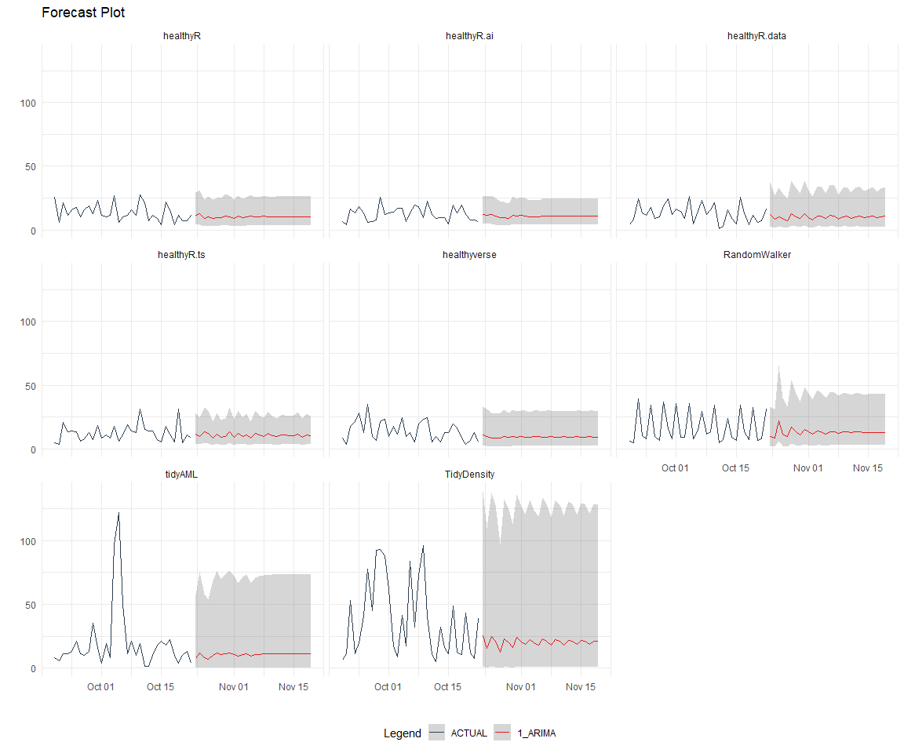

Time Series Analysis, Modeling and Forecasting of the Healthyverse
Packages
================
Steven P. Sanderson II, MPH - Date:
01 August, 2025

This analysis follows a *Nested Modeltime Workflow*.

## Get Data

``` r
glimpse(downloads_tbl)
```

    ## Rows: 147,209
    ## Columns: 11
    ## $ date      <date> 2020-11-23, 2020-11-23, 2020-11-23, 2020-11-23, 2020-11-23,…
    ## $ time      <Period> 15H 36M 55S, 11H 26M 39S, 23H 34M 44S, 18H 39M 32S, 9H 0M…
    ## $ date_time <dttm> 2020-11-23 15:36:55, 2020-11-23 11:26:39, 2020-11-23 23:34:…
    ## $ size      <int> 4858294, 4858294, 4858301, 4858295, 361, 4863722, 4864794, 4…
    ## $ r_version <chr> NA, "4.0.3", "3.5.3", "3.5.2", NA, NA, NA, NA, NA, NA, NA, N…
    ## $ r_arch    <chr> NA, "x86_64", "x86_64", "x86_64", NA, NA, NA, NA, NA, NA, NA…
    ## $ r_os      <chr> NA, "mingw32", "mingw32", "linux-gnu", NA, NA, NA, NA, NA, N…
    ## $ package   <chr> "healthyR.data", "healthyR.data", "healthyR.data", "healthyR…
    ## $ version   <chr> "1.0.0", "1.0.0", "1.0.0", "1.0.0", "1.0.0", "1.0.0", "1.0.0…
    ## $ country   <chr> "US", "US", "US", "GB", "US", "US", "DE", "HK", "JP", "US", …
    ## $ ip_id     <int> 2069, 2804, 78827, 27595, 90474, 90474, 42435, 74, 7655, 638…

The last day in the data set is 2025-07-30 23:52:40, the file was
birthed on: 2024-08-07 07:35:44.428716, and at report knit time is
-8580.28 hours old. Happy analyzing!

Now that we have our data lets take a look at it using the `skimr`
package.

``` r
skim(downloads_tbl)
```

|                                                  |               |
|:-------------------------------------------------|:--------------|
| Name                                             | downloads_tbl |
| Number of rows                                   | 147209        |
| Number of columns                                | 11            |
| \_\_\_\_\_\_\_\_\_\_\_\_\_\_\_\_\_\_\_\_\_\_\_   |               |
| Column type frequency:                           |               |
| character                                        | 6             |
| Date                                             | 1             |
| numeric                                          | 2             |
| POSIXct                                          | 1             |
| Timespan                                         | 1             |
| \_\_\_\_\_\_\_\_\_\_\_\_\_\_\_\_\_\_\_\_\_\_\_\_ |               |
| Group variables                                  | None          |

Data summary

**Variable type: character**

| skim_variable | n_missing | complete_rate | min | max | empty | n_unique | whitespace |
|:--------------|----------:|--------------:|----:|----:|------:|---------:|-----------:|
| r_version     |    106475 |          0.28 |   5 |   5 |     0 |       48 |          0 |
| r_arch        |    106475 |          0.28 |   3 |   7 |     0 |        5 |          0 |
| r_os          |    106475 |          0.28 |   7 |  15 |     0 |       23 |          0 |
| package       |         0 |          1.00 |   7 |  13 |     0 |        8 |          0 |
| version       |         0 |          1.00 |   5 |  17 |     0 |       61 |          0 |
| country       |     12414 |          0.92 |   2 |   2 |     0 |      163 |          0 |

**Variable type: Date**

| skim_variable | n_missing | complete_rate | min | max | median | n_unique |
|:---|---:|---:|:---|:---|:---|---:|
| date | 0 | 1 | 2020-11-23 | 2025-07-30 | 2023-08-03 | 1711 |

**Variable type: numeric**

| skim_variable | n_missing | complete_rate | mean | sd | p0 | p25 | p50 | p75 | p100 | hist |
|:---|---:|---:|---:|---:|---:|---:|---:|---:|---:|:---|
| size | 0 | 1 | 1131650.6 | 1510285.67 | 355 | 14701 | 305335 | 2367640 | 5677952 | ▇▁▂▁▁ |
| ip_id | 0 | 1 | 10494.9 | 18643.74 | 1 | 280 | 3030 | 11845 | 209747 | ▇▁▁▁▁ |

**Variable type: POSIXct**

| skim_variable | n_missing | complete_rate | min | max | median | n_unique |
|:---|---:|---:|:---|:---|:---|---:|
| date_time | 0 | 1 | 2020-11-23 09:00:41 | 2025-07-30 23:52:40 | 2023-08-03 09:21:50 | 90720 |

**Variable type: Timespan**

| skim_variable | n_missing | complete_rate | min | max |     median | n_unique |
|:--------------|----------:|--------------:|----:|----:|-----------:|---------:|
| time          |         0 |             1 |   0 |  59 | 12H 6M 20S |       60 |

We can see that the following columns are missing a lot of data and for
us are most likely not useful anyways, so we will drop them
`c(r_version, r_arch, r_os)`

## Plots

Now lets take a look at a time-series plot of the total daily downloads
by package. We will use a log scale and place a vertical line at each
version release for each package.

<!-- --><!-- -->

Now lets take a look at some time series decomposition graphs.

<!-- --><!-- --><!-- --><!-- -->

## Feature Engineering

Now that we have our basic data and a shot of what it looks like, let’s
add some features to our data which can be very helpful in modeling.
Lets start by making a `tibble` that is aggregated by the day and
package, as we are going to be interested in forecasting the next 4
weeks or 28 days for each package. First lets get our base data.

    ## 
    ## Call:
    ## stats::lm(formula = .formula, data = df)
    ## 
    ## Residuals:
    ##     Min      1Q  Median      3Q     Max 
    ## -148.75  -36.12  -11.25   26.79  817.65 
    ## 
    ## Coefficients:
    ##                                                      Estimate Std. Error
    ## (Intercept)                                        -1.734e+02  6.444e+01
    ## date                                                1.072e-02  3.411e-03
    ## lag(value, 1)                                       1.001e-01  2.398e-02
    ## lag(value, 7)                                       9.355e-02  2.480e-02
    ## lag(value, 14)                                      8.445e-02  2.481e-02
    ## lag(value, 21)                                      6.451e-02  2.489e-02
    ## lag(value, 28)                                      6.661e-02  2.476e-02
    ## lag(value, 35)                                      6.779e-02  2.480e-02
    ## lag(value, 42)                                      6.020e-02  2.490e-02
    ## lag(value, 49)                                      6.608e-02  2.489e-02
    ## month(date, label = TRUE).L                        -9.787e+00  5.106e+00
    ## month(date, label = TRUE).Q                         3.520e+00  5.015e+00
    ## month(date, label = TRUE).C                        -1.327e+01  5.117e+00
    ## month(date, label = TRUE)^4                        -7.111e+00  5.076e+00
    ## month(date, label = TRUE)^5                        -1.141e+01  5.091e+00
    ## month(date, label = TRUE)^6                        -4.130e+00  5.127e+00
    ## month(date, label = TRUE)^7                        -7.017e+00  5.038e+00
    ## month(date, label = TRUE)^8                        -3.229e+00  5.022e+00
    ## month(date, label = TRUE)^9                         5.145e+00  5.000e+00
    ## month(date, label = TRUE)^10                        2.809e+00  5.028e+00
    ## month(date, label = TRUE)^11                       -3.555e+00  4.901e+00
    ## fourier_vec(date, type = "sin", K = 1, period = 7) -1.172e+01  2.290e+00
    ## fourier_vec(date, type = "cos", K = 1, period = 7)  8.305e+00  2.406e+00
    ##                                                    t value Pr(>|t|)    
    ## (Intercept)                                         -2.691 0.007198 ** 
    ## date                                                 3.142 0.001706 ** 
    ## lag(value, 1)                                        4.173 3.16e-05 ***
    ## lag(value, 7)                                        3.772 0.000168 ***
    ## lag(value, 14)                                       3.403 0.000682 ***
    ## lag(value, 21)                                       2.592 0.009628 ** 
    ## lag(value, 28)                                       2.691 0.007207 ** 
    ## lag(value, 35)                                       2.733 0.006338 ** 
    ## lag(value, 42)                                       2.418 0.015717 *  
    ## lag(value, 49)                                       2.655 0.008007 ** 
    ## month(date, label = TRUE).L                         -1.917 0.055423 .  
    ## month(date, label = TRUE).Q                          0.702 0.482889    
    ## month(date, label = TRUE).C                         -2.592 0.009617 ** 
    ## month(date, label = TRUE)^4                         -1.401 0.161427    
    ## month(date, label = TRUE)^5                         -2.242 0.025099 *  
    ## month(date, label = TRUE)^6                         -0.806 0.420614    
    ## month(date, label = TRUE)^7                         -1.393 0.163873    
    ## month(date, label = TRUE)^8                         -0.643 0.520411    
    ## month(date, label = TRUE)^9                          1.029 0.303680    
    ## month(date, label = TRUE)^10                         0.559 0.576487    
    ## month(date, label = TRUE)^11                        -0.725 0.468399    
    ## fourier_vec(date, type = "sin", K = 1, period = 7)  -5.116 3.49e-07 ***
    ## fourier_vec(date, type = "cos", K = 1, period = 7)   3.451 0.000572 ***
    ## ---
    ## Signif. codes:  0 '***' 0.001 '**' 0.01 '*' 0.05 '.' 0.1 ' ' 1
    ## 
    ## Residual standard error: 58.7 on 1639 degrees of freedom
    ##   (49 observations deleted due to missingness)
    ## Multiple R-squared:  0.2351, Adjusted R-squared:  0.2249 
    ## F-statistic:  22.9 on 22 and 1639 DF,  p-value: < 2.2e-16

<!-- -->

## NNS Forecasting

This is something I have been wanting to try for a while. The `NNS`
package is a great package for forecasting time series data.

[NNS GitHub](https://github.com/OVVO-Financial/NNS)

``` r
library(NNS)

data_list <- base_data |>
    select(package, value) |>
    group_split(package)

data_list |>
    imap(
        \(x, idx) {
            obj <- x
            x <- obj |> pull(value) |> tail(7*52)
            train_set_size <- length(x) - 56
            pkg <- obj |> pluck(1) |> unique()
#            sf <- NNS.seas(x, modulo = 7, plot = FALSE)$periods
            seas <- t(
                sapply(
                    1:25, 
                    function(i) c(
                        i,
                        sqrt(
                            mean((
                                NNS.ARMA(x, 
                                         h = 28, 
                                         training.set = train_set_size, 
                                         method = "lin", 
                                         seasonal.factor = i, 
                                         plot=FALSE
                                         ) - tail(AirPassengers, 44)) ^ 2)))
                    )
                )
            colnames(seas) <- c("Period", "RMSE")
            sf <- seas[which.min(seas[, 2]), 1]
            
            cat(paste0("Package: ", pkg, "\n"))
            NNS.ARMA.optim(
                variable = x,
                h = 28,
                training.set = train_set_size,
                #seasonal.factor = seq(12, 60, 7),
                seasonal.factor = sf,
                pred.int = 0.95,
                plot = TRUE
            )
            title(
                sub = paste0("\n",
                             "Package: ", pkg, " - NNS Optimization")
            )
        }
    )
```

    ## Package: healthyR
    ## [1] "CURRNET METHOD: lin"
    ## [1] "COPY LATEST PARAMETERS DIRECTLY FOR NNS.ARMA() IF ERROR:"
    ## [1] "NNS.ARMA(... method =  'lin' , seasonal.factor =  c( 21 ) ...)"
    ## [1] "CURRENT lin OBJECTIVE FUNCTION = 4.24352594168677"
    ## [1] "BEST method = 'lin' PATH MEMBER = c( 21 )"
    ## [1] "BEST lin OBJECTIVE FUNCTION = 4.24352594168677"
    ## [1] "CURRNET METHOD: nonlin"
    ## [1] "COPY LATEST PARAMETERS DIRECTLY FOR NNS.ARMA() IF ERROR:"
    ## [1] "NNS.ARMA(... method =  'nonlin' , seasonal.factor =  c( 21 ) ...)"
    ## [1] "CURRENT nonlin OBJECTIVE FUNCTION = 10.6940888094212"
    ## [1] "BEST method = 'nonlin' PATH MEMBER = c( 21 )"
    ## [1] "BEST nonlin OBJECTIVE FUNCTION = 10.6940888094212"
    ## [1] "CURRNET METHOD: both"
    ## [1] "COPY LATEST PARAMETERS DIRECTLY FOR NNS.ARMA() IF ERROR:"
    ## [1] "NNS.ARMA(... method =  'both' , seasonal.factor =  c( 21 ) ...)"
    ## [1] "CURRENT both OBJECTIVE FUNCTION = 6.96846164054262"
    ## [1] "BEST method = 'both' PATH MEMBER = c( 21 )"
    ## [1] "BEST both OBJECTIVE FUNCTION = 6.96846164054262"

<!-- -->

    ## Package: healthyR.ai
    ## [1] "CURRNET METHOD: lin"
    ## [1] "COPY LATEST PARAMETERS DIRECTLY FOR NNS.ARMA() IF ERROR:"
    ## [1] "NNS.ARMA(... method =  'lin' , seasonal.factor =  c( 22 ) ...)"
    ## [1] "CURRENT lin OBJECTIVE FUNCTION = 16.1453763883529"
    ## [1] "BEST method = 'lin' PATH MEMBER = c( 22 )"
    ## [1] "BEST lin OBJECTIVE FUNCTION = 16.1453763883529"
    ## [1] "CURRNET METHOD: nonlin"
    ## [1] "COPY LATEST PARAMETERS DIRECTLY FOR NNS.ARMA() IF ERROR:"
    ## [1] "NNS.ARMA(... method =  'nonlin' , seasonal.factor =  c( 22 ) ...)"
    ## [1] "CURRENT nonlin OBJECTIVE FUNCTION = 11.2903335243763"
    ## [1] "BEST method = 'nonlin' PATH MEMBER = c( 22 )"
    ## [1] "BEST nonlin OBJECTIVE FUNCTION = 11.2903335243763"
    ## [1] "CURRNET METHOD: both"
    ## [1] "COPY LATEST PARAMETERS DIRECTLY FOR NNS.ARMA() IF ERROR:"
    ## [1] "NNS.ARMA(... method =  'both' , seasonal.factor =  c( 22 ) ...)"
    ## [1] "CURRENT both OBJECTIVE FUNCTION = 13.5413655691888"
    ## [1] "BEST method = 'both' PATH MEMBER = c( 22 )"
    ## [1] "BEST both OBJECTIVE FUNCTION = 13.5413655691888"

<!-- -->

    ## Package: healthyR.data
    ## [1] "CURRNET METHOD: lin"
    ## [1] "COPY LATEST PARAMETERS DIRECTLY FOR NNS.ARMA() IF ERROR:"
    ## [1] "NNS.ARMA(... method =  'lin' , seasonal.factor =  c( 19 ) ...)"
    ## [1] "CURRENT lin OBJECTIVE FUNCTION = 9.96690420679657"
    ## [1] "BEST method = 'lin' PATH MEMBER = c( 19 )"
    ## [1] "BEST lin OBJECTIVE FUNCTION = 9.96690420679657"
    ## [1] "CURRNET METHOD: nonlin"
    ## [1] "COPY LATEST PARAMETERS DIRECTLY FOR NNS.ARMA() IF ERROR:"
    ## [1] "NNS.ARMA(... method =  'nonlin' , seasonal.factor =  c( 19 ) ...)"
    ## [1] "CURRENT nonlin OBJECTIVE FUNCTION = 7.5953481075925"
    ## [1] "BEST method = 'nonlin' PATH MEMBER = c( 19 )"
    ## [1] "BEST nonlin OBJECTIVE FUNCTION = 7.5953481075925"
    ## [1] "CURRNET METHOD: both"
    ## [1] "COPY LATEST PARAMETERS DIRECTLY FOR NNS.ARMA() IF ERROR:"
    ## [1] "NNS.ARMA(... method =  'both' , seasonal.factor =  c( 19 ) ...)"
    ## [1] "CURRENT both OBJECTIVE FUNCTION = 9.40330556025448"
    ## [1] "BEST method = 'both' PATH MEMBER = c( 19 )"
    ## [1] "BEST both OBJECTIVE FUNCTION = 9.40330556025448"

<!-- -->

    ## Package: healthyR.ts
    ## [1] "CURRNET METHOD: lin"
    ## [1] "COPY LATEST PARAMETERS DIRECTLY FOR NNS.ARMA() IF ERROR:"
    ## [1] "NNS.ARMA(... method =  'lin' , seasonal.factor =  c( 17 ) ...)"
    ## [1] "CURRENT lin OBJECTIVE FUNCTION = 10.0300873968054"
    ## [1] "BEST method = 'lin' PATH MEMBER = c( 17 )"
    ## [1] "BEST lin OBJECTIVE FUNCTION = 10.0300873968054"
    ## [1] "CURRNET METHOD: nonlin"
    ## [1] "COPY LATEST PARAMETERS DIRECTLY FOR NNS.ARMA() IF ERROR:"
    ## [1] "NNS.ARMA(... method =  'nonlin' , seasonal.factor =  c( 17 ) ...)"
    ## [1] "CURRENT nonlin OBJECTIVE FUNCTION = 16.6160327142451"
    ## [1] "BEST method = 'nonlin' PATH MEMBER = c( 17 )"
    ## [1] "BEST nonlin OBJECTIVE FUNCTION = 16.6160327142451"
    ## [1] "CURRNET METHOD: both"
    ## [1] "COPY LATEST PARAMETERS DIRECTLY FOR NNS.ARMA() IF ERROR:"
    ## [1] "NNS.ARMA(... method =  'both' , seasonal.factor =  c( 17 ) ...)"
    ## [1] "CURRENT both OBJECTIVE FUNCTION = 14.6531388819862"
    ## [1] "BEST method = 'both' PATH MEMBER = c( 17 )"
    ## [1] "BEST both OBJECTIVE FUNCTION = 14.6531388819862"

<!-- -->

    ## Package: healthyverse
    ## [1] "CURRNET METHOD: lin"
    ## [1] "COPY LATEST PARAMETERS DIRECTLY FOR NNS.ARMA() IF ERROR:"
    ## [1] "NNS.ARMA(... method =  'lin' , seasonal.factor =  c( 19 ) ...)"
    ## [1] "CURRENT lin OBJECTIVE FUNCTION = 16.062630167632"
    ## [1] "BEST method = 'lin' PATH MEMBER = c( 19 )"
    ## [1] "BEST lin OBJECTIVE FUNCTION = 16.062630167632"
    ## [1] "CURRNET METHOD: nonlin"
    ## [1] "COPY LATEST PARAMETERS DIRECTLY FOR NNS.ARMA() IF ERROR:"
    ## [1] "NNS.ARMA(... method =  'nonlin' , seasonal.factor =  c( 19 ) ...)"
    ## [1] "CURRENT nonlin OBJECTIVE FUNCTION = 14.2804894740452"
    ## [1] "BEST method = 'nonlin' PATH MEMBER = c( 19 )"
    ## [1] "BEST nonlin OBJECTIVE FUNCTION = 14.2804894740452"
    ## [1] "CURRNET METHOD: both"
    ## [1] "COPY LATEST PARAMETERS DIRECTLY FOR NNS.ARMA() IF ERROR:"
    ## [1] "NNS.ARMA(... method =  'both' , seasonal.factor =  c( 19 ) ...)"
    ## [1] "CURRENT both OBJECTIVE FUNCTION = 22.9260207714363"
    ## [1] "BEST method = 'both' PATH MEMBER = c( 19 )"
    ## [1] "BEST both OBJECTIVE FUNCTION = 22.9260207714363"

<!-- -->

    ## Package: RandomWalker
    ## [1] "CURRNET METHOD: lin"
    ## [1] "COPY LATEST PARAMETERS DIRECTLY FOR NNS.ARMA() IF ERROR:"
    ## [1] "NNS.ARMA(... method =  'lin' , seasonal.factor =  c( 23 ) ...)"
    ## [1] "CURRENT lin OBJECTIVE FUNCTION = 4.03195573218664"
    ## [1] "BEST method = 'lin' PATH MEMBER = c( 23 )"
    ## [1] "BEST lin OBJECTIVE FUNCTION = 4.03195573218664"
    ## [1] "CURRNET METHOD: nonlin"
    ## [1] "COPY LATEST PARAMETERS DIRECTLY FOR NNS.ARMA() IF ERROR:"
    ## [1] "NNS.ARMA(... method =  'nonlin' , seasonal.factor =  c( 23 ) ...)"
    ## [1] "CURRENT nonlin OBJECTIVE FUNCTION = 5.53018800595677"
    ## [1] "BEST method = 'nonlin' PATH MEMBER = c( 23 )"
    ## [1] "BEST nonlin OBJECTIVE FUNCTION = 5.53018800595677"
    ## [1] "CURRNET METHOD: both"
    ## [1] "COPY LATEST PARAMETERS DIRECTLY FOR NNS.ARMA() IF ERROR:"
    ## [1] "NNS.ARMA(... method =  'both' , seasonal.factor =  c( 23 ) ...)"
    ## [1] "CURRENT both OBJECTIVE FUNCTION = 4.73315629431989"
    ## [1] "BEST method = 'both' PATH MEMBER = c( 23 )"
    ## [1] "BEST both OBJECTIVE FUNCTION = 4.73315629431989"

<!-- -->

    ## Package: tidyAML
    ## [1] "CURRNET METHOD: lin"
    ## [1] "COPY LATEST PARAMETERS DIRECTLY FOR NNS.ARMA() IF ERROR:"
    ## [1] "NNS.ARMA(... method =  'lin' , seasonal.factor =  c( 24 ) ...)"
    ## [1] "CURRENT lin OBJECTIVE FUNCTION = 14.0446586307924"
    ## [1] "BEST method = 'lin' PATH MEMBER = c( 24 )"
    ## [1] "BEST lin OBJECTIVE FUNCTION = 14.0446586307924"
    ## [1] "CURRNET METHOD: nonlin"
    ## [1] "COPY LATEST PARAMETERS DIRECTLY FOR NNS.ARMA() IF ERROR:"
    ## [1] "NNS.ARMA(... method =  'nonlin' , seasonal.factor =  c( 24 ) ...)"
    ## [1] "CURRENT nonlin OBJECTIVE FUNCTION = 40.8595648628057"
    ## [1] "BEST method = 'nonlin' PATH MEMBER = c( 24 )"
    ## [1] "BEST nonlin OBJECTIVE FUNCTION = 40.8595648628057"
    ## [1] "CURRNET METHOD: both"
    ## [1] "COPY LATEST PARAMETERS DIRECTLY FOR NNS.ARMA() IF ERROR:"
    ## [1] "NNS.ARMA(... method =  'both' , seasonal.factor =  c( 24 ) ...)"
    ## [1] "CURRENT both OBJECTIVE FUNCTION = 28.0515117904379"
    ## [1] "BEST method = 'both' PATH MEMBER = c( 24 )"
    ## [1] "BEST both OBJECTIVE FUNCTION = 28.0515117904379"

<!-- -->

    ## Package: TidyDensity
    ## [1] "CURRNET METHOD: lin"
    ## [1] "COPY LATEST PARAMETERS DIRECTLY FOR NNS.ARMA() IF ERROR:"
    ## [1] "NNS.ARMA(... method =  'lin' , seasonal.factor =  c( 11 ) ...)"
    ## [1] "CURRENT lin OBJECTIVE FUNCTION = 24.8508363187975"
    ## [1] "BEST method = 'lin' PATH MEMBER = c( 11 )"
    ## [1] "BEST lin OBJECTIVE FUNCTION = 24.8508363187975"
    ## [1] "CURRNET METHOD: nonlin"
    ## [1] "COPY LATEST PARAMETERS DIRECTLY FOR NNS.ARMA() IF ERROR:"
    ## [1] "NNS.ARMA(... method =  'nonlin' , seasonal.factor =  c( 11 ) ...)"
    ## [1] "CURRENT nonlin OBJECTIVE FUNCTION = 18.9840850952372"
    ## [1] "BEST method = 'nonlin' PATH MEMBER = c( 11 )"
    ## [1] "BEST nonlin OBJECTIVE FUNCTION = 18.9840850952372"
    ## [1] "CURRNET METHOD: both"
    ## [1] "COPY LATEST PARAMETERS DIRECTLY FOR NNS.ARMA() IF ERROR:"
    ## [1] "NNS.ARMA(... method =  'both' , seasonal.factor =  c( 11 ) ...)"
    ## [1] "CURRENT both OBJECTIVE FUNCTION = 30.5935692657208"
    ## [1] "BEST method = 'both' PATH MEMBER = c( 11 )"
    ## [1] "BEST both OBJECTIVE FUNCTION = 30.5935692657208"

<!-- -->

    ## [[1]]
    ## NULL
    ## 
    ## [[2]]
    ## NULL
    ## 
    ## [[3]]
    ## NULL
    ## 
    ## [[4]]
    ## NULL
    ## 
    ## [[5]]
    ## NULL
    ## 
    ## [[6]]
    ## NULL
    ## 
    ## [[7]]
    ## NULL
    ## 
    ## [[8]]
    ## NULL

## Pre-Processing

Now we are going to do some basic pre-processing.

``` r
data_padded_tbl <- base_data %>%
  pad_by_time(
    .date_var  = date,
    .pad_value = 0
  )

# Get log interval and standardization parameters
log_params  <- liv(data_padded_tbl$value, limit_lower = 0, offset = 1, silent = TRUE)
limit_lower <- log_params$limit_lower
limit_upper <- log_params$limit_upper
offset      <- log_params$offset

data_liv_tbl <- data_padded_tbl %>%
  # Get log interval transform
  mutate(value_trans = liv(value, limit_lower = 0, offset = 1, silent = TRUE)$log_scaled)

# Get Standardization Params
std_params <- standard_vec(data_liv_tbl$value_trans, silent = TRUE)
std_mean   <- std_params$mean
std_sd     <- std_params$sd

data_transformed_tbl <- data_liv_tbl %>%
  # get standardization
  mutate(value_trans = standard_vec(value_trans, silent = TRUE)$standard_scaled) %>%
  select(-value)
```

Since this is panel data we can follow one of two different modeling
strategies. We can search for a global model in the panel data or we can
use nested forecasting finding the best model for each of the time
series. Since we only have 5 panels, we will use nested forecasting.

To do this we will use the `nest_timeseries` and
`split_nested_timeseries` functions to create a nested `tibble`.

``` r
horizon <- 4*7

nested_data_tbl <- data_transformed_tbl %>%
    
    # 1. Extending: We'll predict n days into the future.
    extend_timeseries(
        .id_var        = package,
        .date_var      = date,
        .length_future = horizon
    ) %>%
    
    # 2. Nesting: We'll group by id, and create a future dataset
    #    that forecasts n days of extended data and
    #    an actual dataset that contains n*2 days
    nest_timeseries(
        .id_var        = package,
        .length_future = horizon
        #.length_actual = horizon*2
    ) %>%
    
   # 3. Splitting: We'll take the actual data and create splits
   #    for accuracy and confidence interval estimation of n das (test)
   #    and the rest is training data
    split_nested_timeseries(
        .length_test = horizon
    )

nested_data_tbl
```

    ## # A tibble: 8 × 4
    ##   package       .actual_data         .future_data      .splits          
    ##   <fct>         <list>               <list>            <list>           
    ## 1 healthyR.data <tibble [1,703 × 2]> <tibble [28 × 2]> <split [1675|28]>
    ## 2 healthyR      <tibble [1,695 × 2]> <tibble [28 × 2]> <split [1667|28]>
    ## 3 healthyR.ts   <tibble [1,640 × 2]> <tibble [28 × 2]> <split [1612|28]>
    ## 4 healthyverse  <tibble [1,611 × 2]> <tibble [28 × 2]> <split [1583|28]>
    ## 5 healthyR.ai   <tibble [1,436 × 2]> <tibble [28 × 2]> <split [1408|28]>
    ## 6 TidyDensity   <tibble [1,287 × 2]> <tibble [28 × 2]> <split [1259|28]>
    ## 7 tidyAML       <tibble [895 × 2]>   <tibble [28 × 2]> <split [867|28]> 
    ## 8 RandomWalker  <tibble [317 × 2]>   <tibble [28 × 2]> <split [289|28]>

Now it is time to make some recipes and models using the modeltime
workflow.

## Modeltime Workflow

### Recipe Object

``` r
recipe_base <- recipe(
  value_trans ~ date
  , data = extract_nested_test_split(nested_data_tbl)
  )

recipe_base

recipe_date <- recipe_base %>%
    step_mutate(date = as.numeric(date))
```

### Models

``` r
# Models ------------------------------------------------------------------

# Auto ARIMA --------------------------------------------------------------

model_spec_arima_no_boost <- arima_reg() %>%
  set_engine(engine = "auto_arima")

wflw_auto_arima <- workflow() %>%
  add_recipe(recipe = recipe_base) %>%
  add_model(model_spec_arima_no_boost)

# NNETAR ------------------------------------------------------------------

model_spec_nnetar <- nnetar_reg(
  mode              = "regression"
  , seasonal_period = "auto"
) %>%
  set_engine("nnetar")

wflw_nnetar <- workflow() %>%
  add_recipe(recipe = recipe_base) %>%
  add_model(model_spec_nnetar)

# TSLM --------------------------------------------------------------------

model_spec_lm <- linear_reg() %>%
  set_engine("lm")

wflw_lm <- workflow() %>%
  add_recipe(recipe = recipe_base) %>%
  add_model(model_spec_lm)

# MARS --------------------------------------------------------------------

model_spec_mars <- mars(mode = "regression") %>%
  set_engine("earth")

wflw_mars <- workflow() %>%
  add_recipe(recipe = recipe_base) %>%
  add_model(model_spec_mars)
```

### Nested Modeltime Tables

``` r
nested_modeltime_tbl <- modeltime_nested_fit(
  # Nested Data
  nested_data = nested_data_tbl,
   control = control_nested_fit(
     verbose = TRUE,
     allow_par = FALSE
   ),
  # Add workflows
  wflw_auto_arima,
  wflw_lm,
  wflw_mars,
  wflw_nnetar
)
```

``` r
nested_modeltime_tbl <- nested_modeltime_tbl[!is.na(nested_modeltime_tbl$package),]
```

### Model Accuracy

``` r
nested_modeltime_tbl %>%
  extract_nested_test_accuracy() %>%
  filter(!is.na(package)) %>%
  knitr::kable()
```

| package | .model_id | .model_desc | .type | mae | mape | mase | smape | rmse | rsq |
|:---|---:|:---|:---|---:|---:|---:|---:|---:|---:|
| healthyR.data | 1 | ARIMA | Test | 0.6287474 | 111.61524 | 0.6072926 | 128.57213 | 0.7955929 | 0.0507680 |
| healthyR.data | 2 | LM | Test | 0.6605959 | 130.52064 | 0.6380543 | 123.91263 | 0.8181336 | 0.0048154 |
| healthyR.data | 3 | NULL | NA | NA | NA | NA | NA | NA | NA |
| healthyR.data | 4 | NNAR | Test | 0.6575004 | 95.77687 | 0.6350644 | 180.68141 | 0.8611795 | 0.0391931 |
| healthyR | 1 | ARIMA | Test | 0.5493760 | 167.59507 | 0.7852992 | 159.29649 | 0.7254168 | 0.0668905 |
| healthyR | 2 | LM | Test | 0.4808884 | 103.55639 | 0.6874004 | 150.55064 | 0.6647000 | 0.0134965 |
| healthyR | 3 | NULL | NA | NA | NA | NA | NA | NA | NA |
| healthyR | 4 | NNAR | Test | 0.4992024 | 123.98440 | 0.7135791 | 157.84800 | 0.6828925 | 0.0244344 |
| healthyR.ts | 1 | ARIMA | Test | 0.6002136 | 100.03286 | 0.6885002 | 135.21301 | 0.7209687 | 0.0047899 |
| healthyR.ts | 2 | LM | Test | 0.5852740 | 102.49529 | 0.6713631 | 117.47842 | 0.7326268 | 0.0022457 |
| healthyR.ts | 3 | NULL | NA | NA | NA | NA | NA | NA | NA |
| healthyR.ts | 4 | NNAR | Test | 0.5823166 | 97.40353 | 0.6679706 | 180.73261 | 0.6557889 | 0.0081012 |
| healthyverse | 1 | ARIMA | Test | 0.4625294 | 188.79633 | 0.8802918 | 69.77812 | 0.6217246 | 0.0011550 |
| healthyverse | 2 | LM | Test | 0.4644017 | 188.93715 | 0.8838553 | 69.89902 | 0.6224494 | 0.0310843 |
| healthyverse | 3 | NULL | NA | NA | NA | NA | NA | NA | NA |
| healthyverse | 4 | NNAR | Test | 0.5042844 | 124.75702 | 0.9597605 | 88.65694 | 0.6540645 | 0.0046531 |
| healthyR.ai | 1 | ARIMA | Test | 0.5822793 | 116.83110 | 0.7874394 | 136.71572 | 0.7575625 | 0.0036575 |
| healthyR.ai | 2 | LM | Test | 0.5844972 | 112.35215 | 0.7904388 | 138.12080 | 0.7630252 | 0.0020049 |
| healthyR.ai | 3 | NULL | NA | NA | NA | NA | NA | NA | NA |
| healthyR.ai | 4 | NNAR | Test | 0.5897300 | 109.64171 | 0.7975152 | 143.90677 | 0.7685448 | 0.0066685 |
| TidyDensity | 1 | ARIMA | Test | 0.9009618 | 110.20298 | 0.8165713 | 115.30610 | 1.1542942 | 0.0194355 |
| TidyDensity | 2 | LM | Test | 0.8166904 | 133.04979 | 0.7401934 | 92.38727 | 1.0842370 | 0.0595751 |
| TidyDensity | 3 | NULL | NA | NA | NA | NA | NA | NA | NA |
| TidyDensity | 4 | NNAR | Test | 0.9761381 | 100.25274 | 0.8847061 | 140.14667 | 1.2260020 | 0.0062841 |
| tidyAML | 1 | ARIMA | Test | 0.5281563 | 189.64782 | 0.9876886 | 90.46241 | 0.6420992 | 0.0077796 |
| tidyAML | 2 | LM | Test | 0.5168240 | 181.88951 | 0.9664966 | 90.18427 | 0.6233389 | 0.1063398 |
| tidyAML | 3 | NULL | NA | NA | NA | NA | NA | NA | NA |
| tidyAML | 4 | NNAR | Test | 0.5151102 | 172.12162 | 0.9632916 | 89.73603 | 0.6293380 | 0.0022519 |
| RandomWalker | 1 | ARIMA | Test | 1.1488081 | 93.46549 | 0.5414636 | 161.99049 | 1.3187365 | 0.1402973 |
| RandomWalker | 2 | LM | Test | 1.2699512 | 101.15111 | 0.5985616 | 178.02829 | 1.4090839 | 0.0017114 |
| RandomWalker | 3 | NULL | NA | NA | NA | NA | NA | NA | NA |
| RandomWalker | 4 | NNAR | Test | 1.3565311 | 122.02832 | 0.6393690 | 168.92285 | 1.5228342 | 0.0150910 |

### Plot Models

``` r
nested_modeltime_tbl %>%
  extract_nested_test_forecast() %>%
  group_by(package) %>%
  plot_modeltime_forecast(
    .interactive = FALSE,
    .conf_interval_show  = FALSE,
    .facet_scales = "free"
  ) +
  theme_minimal() +
  theme(legend.position = "bottom")
```

<!-- -->

### Best Model

``` r
best_nested_modeltime_tbl <- nested_modeltime_tbl %>%
  modeltime_nested_select_best(
    metric = "rmse",
    minimize = TRUE,
    filter_test_forecasts = TRUE
  )

best_nested_modeltime_tbl %>%
  extract_nested_best_model_report()
```

    ## # Nested Modeltime Table
    ## 

    ## # A tibble: 8 × 10
    ##   package      .model_id .model_desc .type   mae  mape  mase smape  rmse     rsq
    ##   <fct>            <int> <chr>       <chr> <dbl> <dbl> <dbl> <dbl> <dbl>   <dbl>
    ## 1 healthyR.da…         1 ARIMA       Test  0.629 112.  0.607 129.  0.796 0.0508 
    ## 2 healthyR             2 LM          Test  0.481 104.  0.687 151.  0.665 0.0135 
    ## 3 healthyR.ts          4 NNAR        Test  0.582  97.4 0.668 181.  0.656 0.00810
    ## 4 healthyverse         1 ARIMA       Test  0.463 189.  0.880  69.8 0.622 0.00115
    ## 5 healthyR.ai          1 ARIMA       Test  0.582 117.  0.787 137.  0.758 0.00366
    ## 6 TidyDensity          2 LM          Test  0.817 133.  0.740  92.4 1.08  0.0596 
    ## 7 tidyAML              2 LM          Test  0.517 182.  0.966  90.2 0.623 0.106  
    ## 8 RandomWalker         1 ARIMA       Test  1.15   93.5 0.541 162.  1.32  0.140

``` r
best_nested_modeltime_tbl %>%
  extract_nested_test_forecast() %>%
  #filter(!is.na(.model_id)) %>%
  group_by(package) %>%
  plot_modeltime_forecast(
    .interactive = FALSE,
    .conf_interval_alpha = 0.2,
    .facet_scales = "free"
  ) +
  theme_minimal() +
  theme(legend.position = "bottom")
```

<!-- -->

## Refitting and Future Forecast

Now that we have the best models, we can make our future forecasts.

``` r
nested_modeltime_refit_tbl <- best_nested_modeltime_tbl %>%
    modeltime_nested_refit(
        control = control_nested_refit(verbose = TRUE)
    )
```

``` r
nested_modeltime_refit_tbl
```

    ## # Nested Modeltime Table
    ## 

    ## # A tibble: 8 × 5
    ##   package       .actual_data .future_data .splits           .modeltime_tables 
    ##   <fct>         <list>       <list>       <list>            <list>            
    ## 1 healthyR.data <tibble>     <tibble>     <split [1675|28]> <mdl_tm_t [1 × 5]>
    ## 2 healthyR      <tibble>     <tibble>     <split [1667|28]> <mdl_tm_t [1 × 5]>
    ## 3 healthyR.ts   <tibble>     <tibble>     <split [1612|28]> <mdl_tm_t [1 × 5]>
    ## 4 healthyverse  <tibble>     <tibble>     <split [1583|28]> <mdl_tm_t [1 × 5]>
    ## 5 healthyR.ai   <tibble>     <tibble>     <split [1408|28]> <mdl_tm_t [1 × 5]>
    ## 6 TidyDensity   <tibble>     <tibble>     <split [1259|28]> <mdl_tm_t [1 × 5]>
    ## 7 tidyAML       <tibble>     <tibble>     <split [867|28]>  <mdl_tm_t [1 × 5]>
    ## 8 RandomWalker  <tibble>     <tibble>     <split [289|28]>  <mdl_tm_t [1 × 5]>

``` r
nested_modeltime_refit_tbl %>%
  extract_nested_future_forecast() %>%
  mutate(across(.value:.conf_hi, .fns = ~ standard_inv_vec(
    x    = .,
    mean = std_mean,
    sd   = std_sd
  )$standard_inverse_value)) %>%
  mutate(across(.value:.conf_hi, .fns = ~ liiv(
    x = .,
    limit_lower = limit_lower,
    limit_upper = limit_upper,
    offset      = offset
  )$rescaled_v)) %>%
  group_by(package) %>%
  plot_modeltime_forecast(
    .interactive = FALSE,
    .conf_interval_alpha = 0.2,
    .facet_scales = "free"
  ) +
  theme_minimal() +
  theme(legend.position = "bottom")
```

<!-- -->
