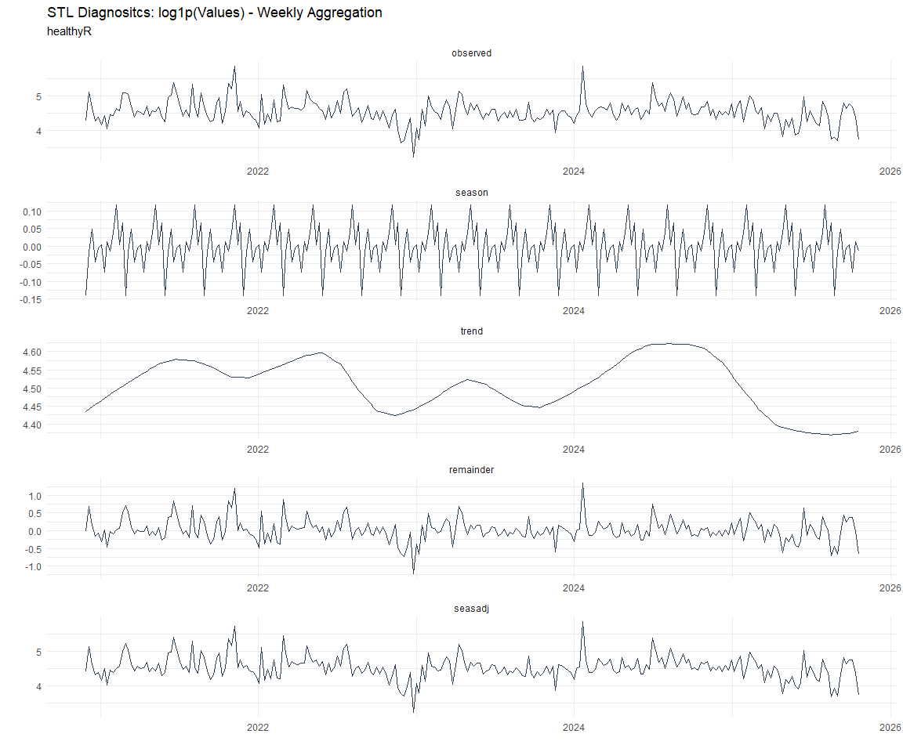

Time Series Analysis and Modeling of the Healthyverse Packages
================
Steven P. Sanderson II, MPH - Data Scientist/IT Manager
09 January, 2022

## Get Data

``` r
glimpse(downloads_tbl)
```

    ## Rows: 26,366
    ## Columns: 11
    ## $ date      <date> 2020-11-23, 2020-11-23, 2020-11-23, 2020-11-23, 2020-11-23,~
    ## $ time      <Period> 15H 36M 55S, 11H 26M 39S, 23H 34M 44S, 18H 39M 32S, 9H 0M~
    ## $ date_time <dttm> 2020-11-23 15:36:55, 2020-11-23 11:26:39, 2020-11-23 23:34:~
    ## $ size      <int> 4858294, 4858294, 4858301, 4858295, 361, 4863722, 4864794, 4~
    ## $ r_version <chr> NA, "4.0.3", "3.5.3", "3.5.2", NA, NA, NA, NA, NA, NA, NA, N~
    ## $ r_arch    <chr> NA, "x86_64", "x86_64", "x86_64", NA, NA, NA, NA, NA, NA, NA~
    ## $ r_os      <chr> NA, "mingw32", "mingw32", "linux-gnu", NA, NA, NA, NA, NA, N~
    ## $ package   <chr> "healthyR.data", "healthyR.data", "healthyR.data", "healthyR~
    ## $ version   <chr> "1.0.0", "1.0.0", "1.0.0", "1.0.0", "1.0.0", "1.0.0", "1.0.0~
    ## $ country   <chr> "US", "US", "US", "GB", "US", "US", "DE", "HK", "JP", "US", ~
    ## $ ip_id     <int> 2069, 2804, 78827, 27595, 90474, 90474, 42435, 74, 7655, 638~

The last day in the data set is 2022-01-07 23:54:55, the file was
birthed on: 2021-11-29 11:38:26, and at report knit time is -943.27
hours old. Happy analyzing!

Now that we have our data lets take a look at it using the `skimr`
package.

``` r
skim(downloads_tbl)
```

|                                                  |                |
|:-------------------------------------------------|:---------------|
| Name                                             | downloads\_tbl |
| Number of rows                                   | 26366          |
| Number of columns                                | 11             |
| \_\_\_\_\_\_\_\_\_\_\_\_\_\_\_\_\_\_\_\_\_\_\_   |                |
| Column type frequency:                           |                |
| character                                        | 6              |
| Date                                             | 1              |
| numeric                                          | 2              |
| POSIXct                                          | 1              |
| Timespan                                         | 1              |
| \_\_\_\_\_\_\_\_\_\_\_\_\_\_\_\_\_\_\_\_\_\_\_\_ |                |
| Group variables                                  | None           |

Data summary

**Variable type: character**

| skim\_variable | n\_missing | complete\_rate | min | max | empty | n\_unique | whitespace |
|:---------------|-----------:|---------------:|----:|----:|------:|----------:|-----------:|
| r\_version     |      17641 |           0.33 |   5 |   5 |     0 |        29 |          0 |
| r\_arch        |      17641 |           0.33 |   3 |   7 |     0 |         5 |          0 |
| r\_os          |      17641 |           0.33 |   7 |  15 |     0 |        10 |          0 |
| package        |          0 |           1.00 |   8 |  13 |     0 |         5 |          0 |
| version        |          0 |           1.00 |   5 |   5 |     0 |        15 |          0 |
| country        |       2223 |           0.92 |   2 |   2 |     0 |        99 |          0 |

**Variable type: Date**

| skim\_variable | n\_missing | complete\_rate | min        | max        | median     | n\_unique |
|:---------------|-----------:|---------------:|:-----------|:-----------|:-----------|----------:|
| date           |          0 |              1 | 2020-11-23 | 2022-01-07 | 2021-08-04 |       411 |

**Variable type: numeric**

| skim\_variable | n\_missing | complete\_rate |       mean |         sd |  p0 |   p25 |    p50 |     p75 |    p100 | hist  |
|:---------------|-----------:|---------------:|-----------:|-----------:|----:|------:|-------:|--------:|--------:|:------|
| size           |          0 |              1 | 1532968.57 | 1879113.03 | 357 | 17597 | 238655 | 3246657 | 5677952 | ▇▁▂▂▁ |
| ip\_id         |          0 |              1 |    8085.27 |   15324.49 |   1 |   204 |   2823 |    8264 |  143633 | ▇▁▁▁▁ |

**Variable type: POSIXct**

| skim\_variable | n\_missing | complete\_rate | min                 | max                 | median              | n\_unique |
|:---------------|-----------:|---------------:|:--------------------|:--------------------|:--------------------|----------:|
| date\_time     |          0 |              1 | 2020-11-23 09:00:41 | 2022-01-07 23:54:55 | 2021-08-04 14:56:03 |     15383 |

**Variable type: Timespan**

| skim\_variable | n\_missing | complete\_rate | min | max | median | n\_unique |
|:---------------|-----------:|---------------:|----:|----:|-------:|----------:|
| time           |          0 |              1 |   0 |  59 |     48 |        60 |

We can see that the following columns are missing a lot of data and for
us are most likely not useful anyways, so we will drop them
`c(r_version, r_arch, r_os)`

## Plots

Now lets take a look at a time-series plot of the total daily downloads
by package. We will use a log scale and place a vertical line at each
version release for each package.

<!-- --><!-- -->

Now lets take a look at some time series decomposition graphs.

<!-- --><!-- --><!-- --><!-- -->

## Feature Engineering

Now that we have our basic data and a shot of what it looks like, let’s
add some features to our data which can be very helpful in modeling.
Lets start by making a `tibble` that is aggregated by the day and
package, as we are going to be interested in forecasting the next 4
weeks or 28 days for each package. First lets get our base data.

Now we are going to do some basic pre-processing.

``` r
data_padded_tbl <- base_data %>%
  pad_by_time(
    .date_var  = date,
    .pad_value = 0
  )

# Get log interval and standardization parameters
log_params  <- liv(data_padded_tbl$value, limit_lower = 0, offset = 1, silent = TRUE)
limit_lower <- log_params$limit_lower
limit_upper <- log_params$limit_upper
offset      <- log_params$offset

data_liv_tbl <- data_padded_tbl %>%
  # Get log interval transform
  mutate(value_trans = liv(value, limit_lower = 0, offset = 1, silent = TRUE)$log_scaled)

# Get Standardization Params
std_params <- standard_vec(data_liv_tbl$value_trans, silent = TRUE)
std_mean   <- std_params$mean
std_sd     <- std_params$sd

data_transformed_tbl <- data_liv_tbl %>%
  # get standardization
  mutate(value_trans = standard_vec(value_trans, silent = TRUE)$standard_scaled) %>%
  select(-value)
```

Now that we have our full data set and saved our parameters we can
create the full data set.

``` r
horizon         <- 4*7
lag_period      <- 4*7
rolling_periods <- c(7, 14, 28)

data_prepared_full_tbl <- data_transformed_tbl %>%
  group_by(package) %>%
  
  # Add future windows
  bind_rows(
    future_frame(., .date_var = date, .length_out = horizon)
  ) %>%
  
  # Add autocorolated lags
  tk_augment_lags(value_trans, .lags = lag_period) %>%
  
  # Add rolling features
  tk_augment_slidify(
    .value     = value_trans_lag28
    , .f       = median
    , .period  = rolling_periods
    , .align   = "center"
    , .partial = TRUE
  ) %>%
  
  # Format columns
  rename_with(.cols = contains("lag"), .fn = ~ str_c("lag_", .)) %>%
  select(date, package, everything()) %>%
  ungroup()

data_prepared_full_tbl %>% 
  group_by(package) %>% 
  pivot_longer(-c(date, package)) %>% 
  plot_time_series(
    .date_var = date
    , .value = value
    , .color_var = name
    , .smooth = FALSE
    , .interactive = FALSE
    , .facet_scales = "free"
  ) +
  theme_minimal() +
  theme(legend.position = "bottom")
```

<!-- -->

Since this is panel data we can follow one of two different modeling
strategies. We can search for a global model in the panel data or we can
use nested forecasting finding the best model for each of the time
series. Since we only have 5 panels, we will use nested forecasting.

To do this we will use the `nest_timeseries` and
`split_nested_timeseries` functions to create a nested `tibble`.

``` r
data_prepared_tbl <- data_prepared_full_tbl %>%
  filter(!is.na(value_trans))

forecast_tbl <- data_prepared_full_tbl %>%
  filter(is.na(value_trans))

nested_data_tbl <- data_prepared_tbl %>%
  nest_timeseries(
    .id_var = package
    , .length_future = horizon
  ) %>%
  split_nested_timeseries(
    .length_test = horizon
  )
```

Now it is time to make some recipes and models using the modeltime
workflow.

## Modeltime Workflow

### Recipe Object

``` r
recipe_base <- recipe(
  value_trans ~ .
  , data = extract_nested_test_split(nested_data_tbl)
  ) %>%
  step_mutate(yr = lubridate::year(date)) %>%
  step_harmonic(yr, frequency = 365/12, cycle_size = 1) %>%
  step_rm(yr) %>%
  step_hai_fourier(value_trans, scale_type = "sincos", period = 365/12, order = 1) %>%
  step_lag(value_trans, lag = 1) %>%
  step_impute_knn(contains("lag_"))

recipe_base
```

    ## Recipe
    ## 
    ## Inputs:
    ## 
    ##       role #variables
    ##    outcome          1
    ##  predictor          5
    ## 
    ## Operations:
    ## 
    ## Variable mutation
    ## Harmonic numeric variables for yr
    ## Delete terms yr
    ## Fourier transformation on value_trans
    ## Lagging value_trans
    ## K-nearest neighbor imputation for contains("lag_")

### Models

``` r
# Models ------------------------------------------------------------------

# Auto ARIMA --------------------------------------------------------------

model_spec_arima_no_boost <- arima_reg() %>%
  set_engine(engine = "auto_arima")

wflw_auto_arima <- workflow() %>%
  add_recipe(recipe = recipe_base) %>%
  add_model(model_spec_arima_no_boost)

# Boosted Auto ARIMA ------------------------------------------------------

model_spec_arima_boosted <- arima_boost(
  min_n = 2
  , learn_rate = 0.015
) %>%
  set_engine(engine = "auto_arima_xgboost")

wflw_arima_boosted <- workflow() %>%
  add_recipe(recipe = recipe_base) %>%
  add_model(model_spec_arima_boosted)

# ETS ---------------------------------------------------------------------

model_spec_ets <- exp_smoothing(
  seasonal_period = "auto",
  error = "auto",
  trend = "auto",
  season = "auto",
  damping = "auto"
) %>%
  set_engine(engine = "ets") 

wflw_ets <- workflow() %>%
  add_recipe(recipe = recipe_base) %>%
  add_model(model_spec_ets)

model_spec_croston <- exp_smoothing(
  seasonal_period = "auto",
  error = "auto",
  trend = "auto",
  season = "auto",
  damping = "auto"
) %>%
  set_engine(engine = "croston")

wflw_croston <- workflow() %>%
  add_recipe(recipe = recipe_base) %>%
  add_model(model_spec_croston)

model_spec_theta <- exp_smoothing(
  seasonal_period = "auto",
  error = "auto",
  trend = "auto",
  season = "auto",
  damping = "auto"
) %>%
  set_engine(engine = "theta")

wflw_theta <- workflow() %>%
  add_recipe(recipe = recipe_base) %>%
  add_model(model_spec_theta)


# STLM ETS ----------------------------------------------------------------

model_spec_stlm_ets <- seasonal_reg(
  seasonal_period_1 = "auto",
  seasonal_period_2 = "auto",
  seasonal_period_3 = "auto"
) %>%
  set_engine("stlm_ets")

wflw_stlm_ets <- workflow() %>%
  add_recipe(recipe = recipe_base) %>%
  add_model(model_spec_stlm_ets)

model_spec_stlm_tbats <- seasonal_reg(
  seasonal_period_1 = "auto",
  seasonal_period_2 = "auto",
  seasonal_period_3 = "auto"
) %>%
  set_engine("tbats")

wflw_stlm_tbats <- workflow() %>%
  add_recipe(recipe = recipe_base) %>%
  add_model(model_spec_stlm_tbats)

model_spec_stlm_arima <- seasonal_reg(
  seasonal_period_1 = "auto",
  seasonal_period_2 = "auto",
  seasonal_period_3 = "auto"
) %>%
  set_engine("stlm_arima")

wflw_stlm_arima <- workflow() %>%
  add_recipe(recipe = recipe_base) %>%
  add_model(model_spec_stlm_arima)

# NNETAR ------------------------------------------------------------------

model_spec_nnetar <- nnetar_reg(
  mode              = "regression"
  , seasonal_period = "auto"
) %>%
  set_engine("nnetar")

wflw_nnetar <- workflow() %>%
  add_recipe(recipe = recipe_base) %>%
  add_model(model_spec_nnetar)


# Prophet -----------------------------------------------------------------

model_spec_prophet <- prophet_reg(
  seasonality_yearly = "auto",
  seasonality_weekly = "auto",
  seasonality_daily = "auto"
) %>%
  set_engine(engine = "prophet")

wflw_prophet <- workflow() %>%
  add_recipe(recipe = recipe_base) %>%
  add_model(model_spec_prophet)

model_spec_prophet_boost <- prophet_boost(
  learn_rate = 0.1
  , trees = 10
  , seasonality_yearly = FALSE
  , seasonality_weekly = FALSE
  , seasonality_daily  = FALSE
) %>% 
  set_engine("prophet_xgboost") 

wflw_prophet_boost <- workflow() %>%
  add_recipe(recipe = recipe_base) %>%
  add_model(model_spec_prophet_boost)

# TSLM --------------------------------------------------------------------

model_spec_lm <- linear_reg() %>%
  set_engine("lm")

wflw_lm <- workflow() %>%
  add_recipe(recipe = recipe_base) %>%
  add_model(model_spec_lm)

model_spec_glm <- linear_reg(
  penalty = 1,
  mixture = 0.5
) %>%
  set_engine("glmnet")

wflw_glm <- workflow() %>%
  add_recipe(recipe = recipe_base) %>%
  add_model(model_spec_glm)

# MARS --------------------------------------------------------------------

model_spec_mars <- mars(mode = "regression") %>%
  set_engine("earth")

wflw_mars <- workflow() %>%
  add_recipe(recipe = recipe_base) %>%
  add_model(model_spec_mars)

# XGBoost -----------------------------------------------------------------

model_spec_xgboost <- boost_tree(
  mode  = "regression",
  mtry  = 10,
  trees = 100,
  min_n = 5,
  tree_depth = 3,
  learn_rate = 0.3,
  loss_reduction = 0.01
) %>%
  set_engine("xgboost")

wflw_xgboost <- workflow() %>%
  add_recipe(recipe = recipe_base) %>%
  add_model(model_spec_xgboost)
```

### Nested Modeltime Tables

``` r
parallel_start(n_cores)
nested_modeltime_tbl <- modeltime_nested_fit(
  # Nested Data
  nested_data = nested_data_tbl,
  control = control_nested_fit(
    verbose = TRUE,
    allow_par = TRUE,
    cores = n_cores
  ),
  
  # Add workflows
  wflw_arima_boosted,
  wflw_auto_arima,
  wflw_croston,
  wflw_ets,
  wflw_glm,
  wflw_lm,
  wflw_mars,
  wflw_nnetar,
  wflw_prophet,
  wflw_prophet_boost,
  wflw_stlm_arima,
  wflw_stlm_ets,
  wflw_stlm_tbats,
  wflw_theta,
  wflw_xgboost
)
parallel_stop()

nested_modeltime_tbl
```

    ## # Nested Modeltime Table
    ##   # A tibble: 5 x 5
    ##   package       .actual_data       .future_data      .splits   .modeltime_tables
    ##   <chr>         <list>             <list>            <list>    <list>           
    ## 1 healthyR.data <tibble [382 x 6]> <tibble [28 x 6]> <split [~ <mdl_time_tbl [1~
    ## 2 healthyR      <tibble [372 x 6]> <tibble [28 x 6]> <split [~ <mdl_time_tbl [1~
    ## 3 healthyR.ts   <tibble [322 x 6]> <tibble [28 x 6]> <split [~ <mdl_time_tbl [1~
    ## 4 healthyverse  <tibble [297 x 6]> <tibble [28 x 6]> <split [~ <mdl_time_tbl [1~
    ## 5 healthyR.ai   <tibble [111 x 6]> <tibble [28 x 6]> <split [~ <mdl_time_tbl [1~

### Model Accuracy

``` r
nested_modeltime_tbl %>%
  extract_nested_test_accuracy() %>%
  knitr::kable()
```

| package       | .model\_id | .model\_desc               | .type |       mae |        mape |      mase |      smape |      rmse |       rsq |
|:--------------|-----------:|:---------------------------|:------|----------:|------------:|----------:|-----------:|----------:|----------:|
| healthyR.data |          1 | ARIMA                      | Test  | 1.0334914 |  334.747955 | 0.9187240 | 107.820953 | 1.2699819 | 0.0790916 |
| healthyR.data |          2 | REGRESSION                 | Test  | 0.1892365 |   43.666076 | 0.1682222 |  45.056814 | 0.2390529 | 0.9440180 |
| healthyR.data |          3 | NULL                       | NA    |        NA |          NA |        NA |         NA |        NA |        NA |
| healthyR.data |          4 | ETSANN                     | Test  | 1.4815955 |  552.069113 | 1.3170670 | 121.471584 | 1.7051361 |        NA |
| healthyR.data |          5 | NULL                       | NA    |        NA |          NA |        NA |         NA |        NA |        NA |
| healthyR.data |          6 | LM                         | Test  | 0.1124027 |   33.494562 | 0.0999206 |  29.050087 | 0.1314659 | 0.9922959 |
| healthyR.data |          7 | EARTH                      | Test  | 0.0234629 |    8.077781 | 0.0208574 |   6.579142 | 0.0318166 | 0.9992106 |
| healthyR.data |          8 | NNAR                       | Test  | 0.0233114 |    3.141583 | 0.0207227 |   3.207286 | 0.0429462 | 0.9980844 |
| healthyR.data |          9 | PROPHET W REGRESSORS       | Test  | 0.1190726 |   33.961913 | 0.1058498 |  29.635063 | 0.1432709 | 0.9905994 |
| healthyR.data |         10 | PROPHET W XGBOOST ERRORS   | Test  | 0.4346393 |  178.168842 | 0.3863734 |  85.880332 | 0.5230189 | 0.9915047 |
| healthyR.data |         11 | SEASONAL DECOMP REGRESSION | Test  | 1.1772415 |  450.166535 | 1.0465110 | 120.119206 | 1.3582965 | 0.4572302 |
| healthyR.data |         12 | SEASONAL DECOMP ETSANN     | Test  | 1.7536988 |  353.165009 | 1.5589537 | 134.334288 | 2.1253749 | 0.1037326 |
| healthyR.data |         13 | TBATS                      | Test  | 1.6456222 |  587.516236 | 1.4628788 | 125.847419 | 1.8497828 | 0.0042343 |
| healthyR.data |         14 | THETA METHOD               | Test  | 1.4798525 |  551.425406 | 1.3155176 | 121.421564 | 1.7036306 | 0.0007796 |
| healthyR.data |         15 | NULL                       | NA    |        NA |          NA |        NA |         NA |        NA |        NA |
| healthyR      |          1 | ARIMA                      | Test  | 1.3550295 |  378.091156 | 1.3652405 | 152.726898 | 1.4619507 | 0.2785936 |
| healthyR      |          2 | REGRESSION                 | Test  | 0.0388014 |   10.374738 | 0.0390938 |   9.879012 | 0.0468318 | 0.9990489 |
| healthyR      |          3 | NULL                       | NA    |        NA |          NA |        NA |         NA |        NA |        NA |
| healthyR      |          4 | ETSANA                     | Test  | 1.5569134 |  443.173559 | 1.5686458 | 153.773336 | 1.6878273 | 0.0109687 |
| healthyR      |          5 | NULL                       | NA    |        NA |          NA |        NA |         NA |        NA |        NA |
| healthyR      |          6 | LM                         | Test  | 0.0429210 |   12.496681 | 0.0432444 |  11.867771 | 0.0537931 | 0.9990906 |
| healthyR      |          7 | EARTH                      | Test  | 0.0076647 |    1.327817 | 0.0077224 |   1.322926 | 0.0122485 | 0.9997448 |
| healthyR      |          8 | NNAR                       | Test  | 0.0823359 |   12.726684 | 0.0829563 |  11.791501 | 0.2768461 | 0.9289455 |
| healthyR      |          9 | PROPHET W REGRESSORS       | Test  | 0.0487847 |   14.318401 | 0.0491523 |  13.420462 | 0.0651691 | 0.9981582 |
| healthyR      |         10 | PROPHET W XGBOOST ERRORS   | Test  | 0.4318108 |  120.058261 | 0.4350648 | 117.124244 | 0.4998904 | 0.9952110 |
| healthyR      |         11 | SEASONAL DECOMP REGRESSION | Test  | 1.3559750 |  360.470722 | 1.3661931 | 134.811514 | 1.5575895 | 0.4333056 |
| healthyR      |         12 | SEASONAL DECOMP ETSANN     | Test  | 1.9039330 |  505.243512 | 1.9182804 | 173.020369 | 2.2658681 | 0.1569523 |
| healthyR      |         13 | TBATS                      | Test  | 1.2333735 |  344.135011 | 1.2426678 | 146.591271 | 1.3827878 | 0.0225575 |
| healthyR      |         14 | THETA METHOD               | Test  | 1.5633836 |  448.345813 | 1.5751648 | 152.671397 | 1.7074804 | 0.0460063 |
| healthyR      |         15 | NULL                       | NA    |        NA |          NA |        NA |         NA |        NA |        NA |
| healthyR.ts   |          1 | ARIMA                      | Test  | 1.0536130 |  351.973169 | 0.6821307 | 111.263015 | 1.3150110 | 0.1277605 |
| healthyR.ts   |          2 | REGRESSION                 | Test  | 0.0859507 |   30.405628 | 0.0556463 |  21.408824 | 0.1469764 | 0.9855116 |
| healthyR.ts   |          3 | NULL                       | NA    |        NA |          NA |        NA |         NA |        NA |        NA |
| healthyR.ts   |          4 | ETSANA                     | Test  | 1.7983473 |  702.044921 | 1.1642870 | 127.876642 | 2.0356741 | 0.0949507 |
| healthyR.ts   |          5 | NULL                       | NA    |        NA |          NA |        NA |         NA |        NA |        NA |
| healthyR.ts   |          6 | LM                         | Test  | 0.0780247 |   15.695361 | 0.0505148 |  15.823199 | 0.0957337 | 0.9976701 |
| healthyR.ts   |          7 | EARTH                      | Test  | 0.0311438 |    2.140065 | 0.0201631 |   2.111932 | 0.0641940 | 0.9970262 |
| healthyR.ts   |          8 | NNAR                       | Test  | 0.0655308 |   14.833845 | 0.0424260 |   9.811918 | 0.1396142 | 0.9836912 |
| healthyR.ts   |          9 | PROPHET W REGRESSORS       | Test  | 0.1158794 |   31.332852 | 0.0750227 |  30.685053 | 0.1330503 | 0.9966307 |
| healthyR.ts   |         10 | PROPHET W XGBOOST ERRORS   | Test  | 0.3978295 |  132.528424 | 0.2575630 |  84.304583 | 0.4779076 | 0.9915321 |
| healthyR.ts   |         11 | SEASONAL DECOMP REGRESSION | Test  | 1.3694182 |  408.437212 | 0.8865895 | 123.259409 | 1.5581395 | 0.4519565 |
| healthyR.ts   |         12 | SEASONAL DECOMP ETSANN     | Test  | 2.0688885 |  837.555970 | 1.3394409 | 135.851351 | 2.4376221 | 0.0704671 |
| healthyR.ts   |         13 | TBATS                      | Test  | 2.0327797 |  797.067849 | 1.3160634 | 130.595036 | 2.2895066 | 0.0059145 |
| healthyR.ts   |         14 | THETA METHOD               | Test  | 1.7577993 |  681.847948 | 1.1380354 | 125.155985 | 2.0476890 | 0.0211229 |
| healthyR.ts   |         15 | NULL                       | NA    |        NA |          NA |        NA |         NA |        NA |        NA |
| healthyverse  |          1 | ARIMA W XGBOOST ERRORS     | Test  | 1.8466063 |  775.222555 | 1.7568837 | 166.324978 | 1.9926179 | 0.0260624 |
| healthyverse  |          2 | REGRESSION                 | Test  | 0.0671978 |   15.704666 | 0.0639328 |  15.783556 | 0.0822834 | 0.9969391 |
| healthyverse  |          3 | NULL                       | NA    |        NA |          NA |        NA |         NA |        NA |        NA |
| healthyverse  |          4 | ETSANA                     | Test  | 1.7235166 |  722.313778 | 1.6397746 | 165.391255 | 1.8575696 | 0.1681431 |
| healthyverse  |          5 | NULL                       | NA    |        NA |          NA |        NA |         NA |        NA |        NA |
| healthyverse  |          6 | LM                         | Test  | 0.0668309 |   16.092529 | 0.0635837 |  16.087062 | 0.0816051 | 0.9970702 |
| healthyverse  |          7 | EARTH                      | Test  | 0.0088529 |    2.745901 | 0.0084227 |   2.688003 | 0.0132698 | 0.9998426 |
| healthyverse  |          8 | NNAR                       | Test  | 0.0096504 |    2.284139 | 0.0091815 |   2.325220 | 0.0144495 | 0.9998326 |
| healthyverse  |          9 | PROPHET W REGRESSORS       | Test  | 0.0579880 |   15.888084 | 0.0551705 |  13.884515 | 0.0712604 | 0.9968157 |
| healthyverse  |         10 | PROPHET W XGBOOST ERRORS   | Test  | 0.5346755 |  208.921715 | 0.5086967 | 127.829547 | 0.6129754 | 0.9786301 |
| healthyverse  |         11 | SEASONAL DECOMP REGRESSION | Test  | 1.2003277 |  497.647667 | 1.1420064 | 131.452111 | 1.3336801 | 0.5206870 |
| healthyverse  |         12 | SEASONAL DECOMP ETSANN     | Test  | 1.9648065 | 1045.314229 | 1.8693408 | 170.495784 | 2.2676900 | 0.1664039 |
| healthyverse  |         13 | TBATS                      | Test  | 1.1778881 |  486.835333 | 1.1206570 | 155.341379 | 1.3564776 | 0.1070343 |
| healthyverse  |         14 | THETA METHOD               | Test  | 1.7044303 |  671.181246 | 1.6216157 | 164.475112 | 1.8657459 | 0.0499787 |
| healthyverse  |         15 | NULL                       | NA    |        NA |          NA |        NA |         NA |        NA |        NA |
| healthyR.ai   |          1 | ARIMA W XGBOOST ERRORS     | Test  | 1.9453311 |  401.773305 | 1.3968753 | 136.144637 | 2.1171411 | 0.4413439 |
| healthyR.ai   |          2 | REGRESSION                 | Test  | 0.1347598 |   21.547245 | 0.0967664 |  23.014121 | 0.1555958 | 0.9966434 |
| healthyR.ai   |          3 | NULL                       | NA    |        NA |          NA |        NA |         NA |        NA |        NA |
| healthyR.ai   |          4 | ETSANN                     | Test  | 1.2505316 |  267.587433 | 0.8979637 | 115.867068 | 1.5659333 |        NA |
| healthyR.ai   |          5 | NULL                       | NA    |        NA |          NA |        NA |         NA |        NA |        NA |
| healthyR.ai   |          6 | LM                         | Test  | 0.1318815 |   21.706693 | 0.0946995 |  23.831362 | 0.1511742 | 0.9975555 |
| healthyR.ai   |          7 | EARTH                      | Test  | 0.0242441 |    3.103098 | 0.0174089 |   3.077183 | 0.0314465 | 0.9990541 |
| healthyR.ai   |          8 | NNAR                       | Test  | 0.1520922 |   19.850660 | 0.1092121 |  22.498213 | 0.2271514 | 0.9619216 |
| healthyR.ai   |          9 | PROPHET W REGRESSORS       | Test  | 0.1675391 |   26.921869 | 0.1203041 |  28.755817 | 0.1922228 | 0.9940944 |
| healthyR.ai   |         10 | PROPHET W XGBOOST ERRORS   | Test  | 1.0503526 |  221.082965 | 0.7542220 | 119.913846 | 1.1872819 | 0.8582754 |
| healthyR.ai   |         11 | SEASONAL DECOMP REGRESSION | Test  | 1.1345417 |  212.272080 | 0.8146753 | 111.449363 | 1.2877507 | 0.5408033 |
| healthyR.ai   |         12 | SEASONAL DECOMP ETSANN     | Test  | 1.6051720 |  354.394484 | 1.1526188 | 128.593467 | 1.8730263 | 0.1244825 |
| healthyR.ai   |         13 | TBATS                      | Test  | 1.4351093 |  308.900723 | 1.0305026 | 122.406021 | 1.7031436 | 0.0633983 |
| healthyR.ai   |         14 | THETA METHOD               | Test  | 1.4133821 |  301.545723 | 1.0149010 | 120.174428 | 1.7229546 | 0.0082322 |
| healthyR.ai   |         15 | NULL                       | NA    |        NA |          NA |        NA |         NA |        NA |        NA |

### Plot Models

``` r
nested_modeltime_tbl %>%
  extract_nested_test_forecast() %>%
  group_by(package) %>%
  plot_modeltime_forecast(
    .interactive = FALSE,
    .conf_interval_show  = FALSE,
    .facet_scales = "free"
  ) +
  theme_minimal() +
  theme(legend.position = "bottom")
```

<!-- -->

### Best Model

``` r
best_nested_modeltime_tbl <- nested_modeltime_tbl %>%
  modeltime_nested_select_best(
    metric = "rmse",
    minimize = TRUE,
    filter_test_forecasts = TRUE
  )

best_nested_modeltime_tbl %>%
  extract_nested_best_model_report()
```

    ## # Nested Modeltime Table
    ##   # A tibble: 5 x 10
    ##   package   .model_id .model_desc .type     mae  mape    mase smape   rmse   rsq
    ##   <chr>         <int> <chr>       <chr>   <dbl> <dbl>   <dbl> <dbl>  <dbl> <dbl>
    ## 1 healthyR~         7 EARTH       Test  0.0235   8.08 0.0209   6.58 0.0318 0.999
    ## 2 healthyR          7 EARTH       Test  0.00766  1.33 0.00772  1.32 0.0122 1.00 
    ## 3 healthyR~         7 EARTH       Test  0.0311   2.14 0.0202   2.11 0.0642 0.997
    ## 4 healthyv~         7 EARTH       Test  0.00885  2.75 0.00842  2.69 0.0133 1.00 
    ## 5 healthyR~         7 EARTH       Test  0.0242   3.10 0.0174   3.08 0.0314 0.999

``` r
best_nested_modeltime_tbl %>%
  extract_nested_test_forecast() %>%
  group_by(package) %>%
  plot_modeltime_forecast(
    .interactive = FALSE,
    .conf_interval_alpha = 0.2,
    .facet_scales = "free"
  ) +
  theme_minimal() +
  theme(legend.position = "bottom")
```

<!-- -->

## Refitting and Future Forecast

Now that we have the best models, we can make our future forecasts.

``` r
parallel_start(n_cores)
nested_modeltime_refit_tbl <- best_nested_modeltime_tbl %>%
  modeltime_nested_refit(
    control = control_nested_refit(
      verbose = TRUE, 
      allow_par = TRUE, 
      cores = n_cores
    )
  )
parallel_stop()

nested_modeltime_refit_tbl
```

    ## # Nested Modeltime Table
    ##   # A tibble: 5 x 5
    ##   package       .actual_data       .future_data      .splits   .modeltime_tables
    ##   <chr>         <list>             <list>            <list>    <list>           
    ## 1 healthyR.data <tibble [382 x 6]> <tibble [28 x 6]> <split [~ <mdl_time_tbl [1~
    ## 2 healthyR      <tibble [372 x 6]> <tibble [28 x 6]> <split [~ <mdl_time_tbl [1~
    ## 3 healthyR.ts   <tibble [322 x 6]> <tibble [28 x 6]> <split [~ <mdl_time_tbl [1~
    ## 4 healthyverse  <tibble [297 x 6]> <tibble [28 x 6]> <split [~ <mdl_time_tbl [1~
    ## 5 healthyR.ai   <tibble [111 x 6]> <tibble [28 x 6]> <split [~ <mdl_time_tbl [1~

``` r
nested_modeltime_refit_tbl %>%
  extract_nested_future_forecast() %>%
  mutate(across(.value:.conf_hi, .fns = ~ standard_inv_vec(
    x    = .,
    mean = std_mean,
    sd   = std_sd
  )$standard_inverse_value)) %>%
  mutate(across(.value:.conf_hi, .fns = ~ liiv(
    x = .,
    limit_lower = limit_lower,
    limit_upper = limit_upper,
    offset      = offset
  )$rescaled_v)) %>%
  group_by(package) %>%
  plot_modeltime_forecast(
    .interactive = FALSE,
    .conf_interval_alpha = 0.2,
    .facet_scales = "free"
  ) +
  theme_minimal() +
  theme(legend.position = "bottom")
```

<!-- -->
