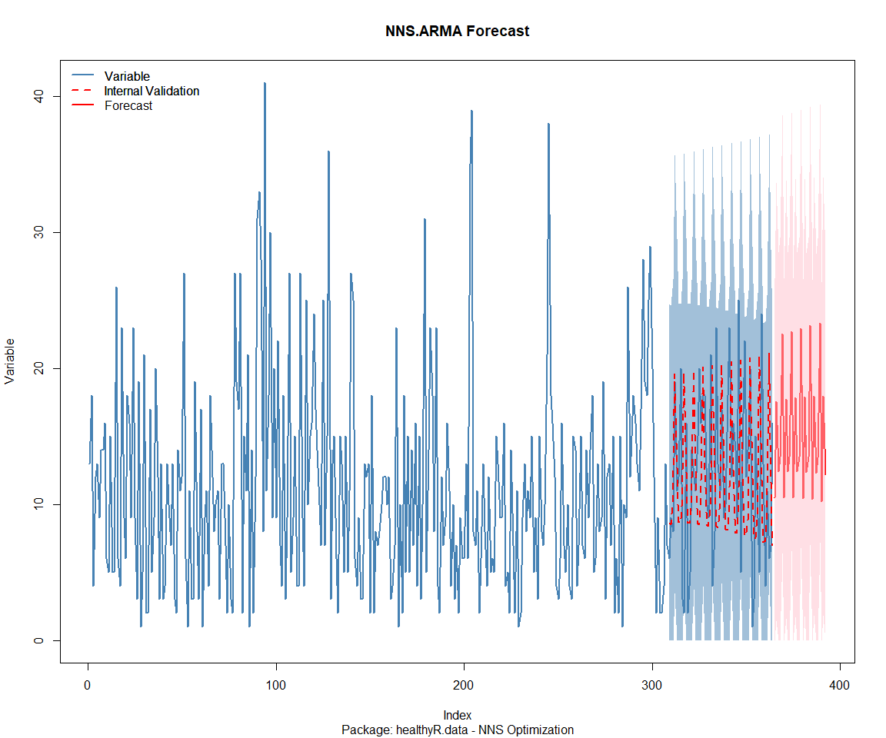

Time Series Analysis, Modeling and Forecasting of the Healthyverse
Packages
================
Steven P. Sanderson II, MPH - Date:
22 August, 2025

This analysis follows a *Nested Modeltime Workflow*.

## Get Data

``` r
glimpse(downloads_tbl)
```

    ## Rows: 149,814
    ## Columns: 11
    ## $ date      <date> 2020-11-23, 2020-11-23, 2020-11-23, 2020-11-23, 2020-11-23,…
    ## $ time      <Period> 15H 36M 55S, 11H 26M 39S, 23H 34M 44S, 18H 39M 32S, 9H 0M…
    ## $ date_time <dttm> 2020-11-23 15:36:55, 2020-11-23 11:26:39, 2020-11-23 23:34:…
    ## $ size      <int> 4858294, 4858294, 4858301, 4858295, 361, 4863722, 4864794, 4…
    ## $ r_version <chr> NA, "4.0.3", "3.5.3", "3.5.2", NA, NA, NA, NA, NA, NA, NA, N…
    ## $ r_arch    <chr> NA, "x86_64", "x86_64", "x86_64", NA, NA, NA, NA, NA, NA, NA…
    ## $ r_os      <chr> NA, "mingw32", "mingw32", "linux-gnu", NA, NA, NA, NA, NA, N…
    ## $ package   <chr> "healthyR.data", "healthyR.data", "healthyR.data", "healthyR…
    ## $ version   <chr> "1.0.0", "1.0.0", "1.0.0", "1.0.0", "1.0.0", "1.0.0", "1.0.0…
    ## $ country   <chr> "US", "US", "US", "GB", "US", "US", "DE", "HK", "JP", "US", …
    ## $ ip_id     <int> 2069, 2804, 78827, 27595, 90474, 90474, 42435, 74, 7655, 638…

The last day in the data set is 2025-08-20 23:52:14, the file was
birthed on: 2022-07-02 23:58:17.511888, and at report knit time is
-2.74759^{4} hours old. Happy analyzing!

Now that we have our data lets take a look at it using the `skimr`
package.

``` r
skim(downloads_tbl)
```

|                                                  |               |
|:-------------------------------------------------|:--------------|
| Name                                             | downloads_tbl |
| Number of rows                                   | 149814        |
| Number of columns                                | 11            |
| \_\_\_\_\_\_\_\_\_\_\_\_\_\_\_\_\_\_\_\_\_\_\_   |               |
| Column type frequency:                           |               |
| character                                        | 6             |
| Date                                             | 1             |
| numeric                                          | 2             |
| POSIXct                                          | 1             |
| Timespan                                         | 1             |
| \_\_\_\_\_\_\_\_\_\_\_\_\_\_\_\_\_\_\_\_\_\_\_\_ |               |
| Group variables                                  | None          |

Data summary

**Variable type: character**

| skim_variable | n_missing | complete_rate | min | max | empty | n_unique | whitespace |
|:--------------|----------:|--------------:|----:|----:|------:|---------:|-----------:|
| r_version     |    108711 |          0.27 |   5 |   5 |     0 |       48 |          0 |
| r_arch        |    108711 |          0.27 |   3 |   7 |     0 |        5 |          0 |
| r_os          |    108711 |          0.27 |   7 |  15 |     0 |       23 |          0 |
| package       |         0 |          1.00 |   7 |  13 |     0 |        8 |          0 |
| version       |         0 |          1.00 |   5 |  17 |     0 |       61 |          0 |
| country       |     12799 |          0.91 |   2 |   2 |     0 |      165 |          0 |

**Variable type: Date**

| skim_variable | n_missing | complete_rate | min | max | median | n_unique |
|:---|---:|---:|:---|:---|:---|---:|
| date | 0 | 1 | 2020-11-23 | 2025-08-20 | 2023-08-19 | 1732 |

**Variable type: numeric**

| skim_variable | n_missing | complete_rate | mean | sd | p0 | p25 | p50 | p75 | p100 | hist |
|:---|---:|---:|---:|---:|---:|---:|---:|---:|---:|:---|
| size | 0 | 1 | 1130042.38 | 1505492.93 | 355 | 14701 | 306566 | 2366044.75 | 5677952 | ▇▁▂▁▁ |
| ip_id | 0 | 1 | 11254.24 | 21572.83 | 1 | 280 | 3064 | 12140.25 | 299146 | ▇▁▁▁▁ |

**Variable type: POSIXct**

| skim_variable | n_missing | complete_rate | min | max | median | n_unique |
|:---|---:|---:|:---|:---|:---|---:|
| date_time | 0 | 1 | 2020-11-23 09:00:41 | 2025-08-20 23:52:14 | 2023-08-19 14:50:53 | 92967 |

**Variable type: Timespan**

| skim_variable | n_missing | complete_rate | min | max | median | n_unique |
|:--------------|----------:|--------------:|----:|----:|-------:|---------:|
| time          |         0 |             1 |   0 |  59 |     18 |       60 |

We can see that the following columns are missing a lot of data and for
us are most likely not useful anyways, so we will drop them
`c(r_version, r_arch, r_os)`

## Plots

Now lets take a look at a time-series plot of the total daily downloads
by package. We will use a log scale and place a vertical line at each
version release for each package.

<!-- --><!-- -->

Now lets take a look at some time series decomposition graphs.

<!-- --><!-- --><!-- --><!-- -->

## Feature Engineering

Now that we have our basic data and a shot of what it looks like, let’s
add some features to our data which can be very helpful in modeling.
Lets start by making a `tibble` that is aggregated by the day and
package, as we are going to be interested in forecasting the next 4
weeks or 28 days for each package. First lets get our base data.

    ## 
    ## Call:
    ## stats::lm(formula = .formula, data = df)
    ## 
    ## Residuals:
    ##     Min      1Q  Median      3Q     Max 
    ## -147.59  -36.13  -11.16   26.70  817.77 
    ## 
    ## Coefficients:
    ##                                                      Estimate Std. Error
    ## (Intercept)                                        -1.819e+02  6.353e+01
    ## date                                                1.116e-02  3.364e-03
    ## lag(value, 1)                                       1.067e-01  2.382e-02
    ## lag(value, 7)                                       9.050e-02  2.463e-02
    ## lag(value, 14)                                      8.106e-02  2.471e-02
    ## lag(value, 21)                                      6.467e-02  2.476e-02
    ## lag(value, 28)                                      6.937e-02  2.468e-02
    ## lag(value, 35)                                      6.669e-02  2.474e-02
    ## lag(value, 42)                                      5.957e-02  2.487e-02
    ## lag(value, 49)                                      6.578e-02  2.474e-02
    ## month(date, label = TRUE).L                        -9.567e+00  5.110e+00
    ## month(date, label = TRUE).Q                         3.082e+00  4.998e+00
    ## month(date, label = TRUE).C                        -1.365e+01  5.101e+00
    ## month(date, label = TRUE)^4                        -6.919e+00  5.077e+00
    ## month(date, label = TRUE)^5                        -1.080e+01  5.047e+00
    ## month(date, label = TRUE)^6                        -4.050e+00  5.132e+00
    ## month(date, label = TRUE)^7                        -7.560e+00  5.006e+00
    ## month(date, label = TRUE)^8                        -3.696e+00  4.997e+00
    ## month(date, label = TRUE)^9                         5.368e+00  4.999e+00
    ## month(date, label = TRUE)^10                        3.615e+00  4.945e+00
    ## month(date, label = TRUE)^11                       -2.961e+00  4.838e+00
    ## fourier_vec(date, type = "sin", K = 1, period = 7) -1.166e+01  2.279e+00
    ## fourier_vec(date, type = "cos", K = 1, period = 7)  7.937e+00  2.393e+00
    ##                                                    t value Pr(>|t|)    
    ## (Intercept)                                         -2.863 0.004245 ** 
    ## date                                                 3.317 0.000931 ***
    ## lag(value, 1)                                        4.481 7.93e-06 ***
    ## lag(value, 7)                                        3.675 0.000246 ***
    ## lag(value, 14)                                       3.281 0.001055 ** 
    ## lag(value, 21)                                       2.612 0.009088 ** 
    ## lag(value, 28)                                       2.810 0.005008 ** 
    ## lag(value, 35)                                       2.695 0.007106 ** 
    ## lag(value, 42)                                       2.396 0.016698 *  
    ## lag(value, 49)                                       2.659 0.007924 ** 
    ## month(date, label = TRUE).L                         -1.872 0.061337 .  
    ## month(date, label = TRUE).Q                          0.617 0.537535    
    ## month(date, label = TRUE).C                         -2.676 0.007529 ** 
    ## month(date, label = TRUE)^4                         -1.363 0.173133    
    ## month(date, label = TRUE)^5                         -2.140 0.032512 *  
    ## month(date, label = TRUE)^6                         -0.789 0.430108    
    ## month(date, label = TRUE)^7                         -1.510 0.131207    
    ## month(date, label = TRUE)^8                         -0.740 0.459622    
    ## month(date, label = TRUE)^9                          1.074 0.283051    
    ## month(date, label = TRUE)^10                         0.731 0.464908    
    ## month(date, label = TRUE)^11                        -0.612 0.540636    
    ## fourier_vec(date, type = "sin", K = 1, period = 7)  -5.118 3.44e-07 ***
    ## fourier_vec(date, type = "cos", K = 1, period = 7)   3.316 0.000932 ***
    ## ---
    ## Signif. codes:  0 '***' 0.001 '**' 0.01 '*' 0.05 '.' 0.1 ' ' 1
    ## 
    ## Residual standard error: 58.8 on 1660 degrees of freedom
    ##   (49 observations deleted due to missingness)
    ## Multiple R-squared:  0.2335, Adjusted R-squared:  0.2234 
    ## F-statistic: 22.99 on 22 and 1660 DF,  p-value: < 2.2e-16

<!-- -->

## NNS Forecasting

This is something I have been wanting to try for a while. The `NNS`
package is a great package for forecasting time series data.

[NNS GitHub](https://github.com/OVVO-Financial/NNS)

``` r
library(NNS)

data_list <- base_data |>
    select(package, value) |>
    group_split(package)

data_list |>
    imap(
        \(x, idx) {
            obj <- x
            x <- obj |> pull(value) |> tail(7*52)
            train_set_size <- length(x) - 56
            pkg <- obj |> pluck(1) |> unique()
#            sf <- NNS.seas(x, modulo = 7, plot = FALSE)$periods
            seas <- t(
                sapply(
                    1:25, 
                    function(i) c(
                        i,
                        sqrt(
                            mean((
                                NNS.ARMA(x, 
                                         h = 28, 
                                         training.set = train_set_size, 
                                         method = "lin", 
                                         seasonal.factor = i, 
                                         plot=FALSE
                                         ) - tail(x, 28)) ^ 2)))
                    )
                )
            colnames(seas) <- c("Period", "RMSE")
            sf <- seas[which.min(seas[, 2]), 1]
            
            cat(paste0("Package: ", pkg, "\n"))
            NNS.ARMA.optim(
                variable = x,
                h = 28,
                training.set = train_set_size,
                #seasonal.factor = seq(12, 60, 7),
                seasonal.factor = sf,
                pred.int = 0.95,
                plot = TRUE
            )
            title(
                sub = paste0("\n",
                             "Package: ", pkg, " - NNS Optimization")
            )
        }
    )
```

    ## Package: healthyR
    ## [1] "CURRNET METHOD: lin"
    ## [1] "COPY LATEST PARAMETERS DIRECTLY FOR NNS.ARMA() IF ERROR:"
    ## [1] "NNS.ARMA(... method =  'lin' , seasonal.factor =  c( 22 ) ...)"
    ## [1] "CURRENT lin OBJECTIVE FUNCTION = 9.51486194371308"
    ## [1] "BEST method = 'lin' PATH MEMBER = c( 22 )"
    ## [1] "BEST lin OBJECTIVE FUNCTION = 9.51486194371308"
    ## [1] "CURRNET METHOD: nonlin"
    ## [1] "COPY LATEST PARAMETERS DIRECTLY FOR NNS.ARMA() IF ERROR:"
    ## [1] "NNS.ARMA(... method =  'nonlin' , seasonal.factor =  c( 22 ) ...)"
    ## [1] "CURRENT nonlin OBJECTIVE FUNCTION = 5.3706455043666"
    ## [1] "BEST method = 'nonlin' PATH MEMBER = c( 22 )"
    ## [1] "BEST nonlin OBJECTIVE FUNCTION = 5.3706455043666"
    ## [1] "CURRNET METHOD: both"
    ## [1] "COPY LATEST PARAMETERS DIRECTLY FOR NNS.ARMA() IF ERROR:"
    ## [1] "NNS.ARMA(... method =  'both' , seasonal.factor =  c( 22 ) ...)"
    ## [1] "CURRENT both OBJECTIVE FUNCTION = 5.13160204833046"
    ## [1] "BEST method = 'both' PATH MEMBER = c( 22 )"
    ## [1] "BEST both OBJECTIVE FUNCTION = 5.13160204833046"

<!-- -->

    ## Package: healthyR.ai
    ## [1] "CURRNET METHOD: lin"
    ## [1] "COPY LATEST PARAMETERS DIRECTLY FOR NNS.ARMA() IF ERROR:"
    ## [1] "NNS.ARMA(... method =  'lin' , seasonal.factor =  c( 13 ) ...)"
    ## [1] "CURRENT lin OBJECTIVE FUNCTION = 9.72843170188855"
    ## [1] "BEST method = 'lin' PATH MEMBER = c( 13 )"
    ## [1] "BEST lin OBJECTIVE FUNCTION = 9.72843170188855"
    ## [1] "CURRNET METHOD: nonlin"
    ## [1] "COPY LATEST PARAMETERS DIRECTLY FOR NNS.ARMA() IF ERROR:"
    ## [1] "NNS.ARMA(... method =  'nonlin' , seasonal.factor =  c( 13 ) ...)"
    ## [1] "CURRENT nonlin OBJECTIVE FUNCTION = 6.99253880219715"
    ## [1] "BEST method = 'nonlin' PATH MEMBER = c( 13 )"
    ## [1] "BEST nonlin OBJECTIVE FUNCTION = 6.99253880219715"
    ## [1] "CURRNET METHOD: both"
    ## [1] "COPY LATEST PARAMETERS DIRECTLY FOR NNS.ARMA() IF ERROR:"
    ## [1] "NNS.ARMA(... method =  'both' , seasonal.factor =  c( 13 ) ...)"
    ## [1] "CURRENT both OBJECTIVE FUNCTION = 7.50184432364485"
    ## [1] "BEST method = 'both' PATH MEMBER = c( 13 )"
    ## [1] "BEST both OBJECTIVE FUNCTION = 7.50184432364485"

<!-- -->

    ## Package: healthyR.data
    ## [1] "CURRNET METHOD: lin"
    ## [1] "COPY LATEST PARAMETERS DIRECTLY FOR NNS.ARMA() IF ERROR:"
    ## [1] "NNS.ARMA(... method =  'lin' , seasonal.factor =  c( 13 ) ...)"
    ## [1] "CURRENT lin OBJECTIVE FUNCTION = 6.00810524035878"
    ## [1] "BEST method = 'lin' PATH MEMBER = c( 13 )"
    ## [1] "BEST lin OBJECTIVE FUNCTION = 6.00810524035878"
    ## [1] "CURRNET METHOD: nonlin"
    ## [1] "COPY LATEST PARAMETERS DIRECTLY FOR NNS.ARMA() IF ERROR:"
    ## [1] "NNS.ARMA(... method =  'nonlin' , seasonal.factor =  c( 13 ) ...)"
    ## [1] "CURRENT nonlin OBJECTIVE FUNCTION = 6.74071297589007"
    ## [1] "BEST method = 'nonlin' PATH MEMBER = c( 13 )"
    ## [1] "BEST nonlin OBJECTIVE FUNCTION = 6.74071297589007"
    ## [1] "CURRNET METHOD: both"
    ## [1] "COPY LATEST PARAMETERS DIRECTLY FOR NNS.ARMA() IF ERROR:"
    ## [1] "NNS.ARMA(... method =  'both' , seasonal.factor =  c( 13 ) ...)"
    ## [1] "CURRENT both OBJECTIVE FUNCTION = 5.88638801823055"
    ## [1] "BEST method = 'both' PATH MEMBER = c( 13 )"
    ## [1] "BEST both OBJECTIVE FUNCTION = 5.88638801823055"

<!-- -->

    ## Package: healthyR.ts
    ## [1] "CURRNET METHOD: lin"
    ## [1] "COPY LATEST PARAMETERS DIRECTLY FOR NNS.ARMA() IF ERROR:"
    ## [1] "NNS.ARMA(... method =  'lin' , seasonal.factor =  c( 4 ) ...)"
    ## [1] "CURRENT lin OBJECTIVE FUNCTION = 11.0972912556835"
    ## [1] "BEST method = 'lin' PATH MEMBER = c( 4 )"
    ## [1] "BEST lin OBJECTIVE FUNCTION = 11.0972912556835"
    ## [1] "CURRNET METHOD: nonlin"
    ## [1] "COPY LATEST PARAMETERS DIRECTLY FOR NNS.ARMA() IF ERROR:"
    ## [1] "NNS.ARMA(... method =  'nonlin' , seasonal.factor =  c( 4 ) ...)"
    ## [1] "CURRENT nonlin OBJECTIVE FUNCTION = 9.12548687967123"
    ## [1] "BEST method = 'nonlin' PATH MEMBER = c( 4 )"
    ## [1] "BEST nonlin OBJECTIVE FUNCTION = 9.12548687967123"
    ## [1] "CURRNET METHOD: both"
    ## [1] "COPY LATEST PARAMETERS DIRECTLY FOR NNS.ARMA() IF ERROR:"
    ## [1] "NNS.ARMA(... method =  'both' , seasonal.factor =  c( 4 ) ...)"
    ## [1] "CURRENT both OBJECTIVE FUNCTION = 8.55115464421558"
    ## [1] "BEST method = 'both' PATH MEMBER = c( 4 )"
    ## [1] "BEST both OBJECTIVE FUNCTION = 8.55115464421558"

<!-- -->

    ## Package: healthyverse
    ## [1] "CURRNET METHOD: lin"
    ## [1] "COPY LATEST PARAMETERS DIRECTLY FOR NNS.ARMA() IF ERROR:"
    ## [1] "NNS.ARMA(... method =  'lin' , seasonal.factor =  c( 7 ) ...)"
    ## [1] "CURRENT lin OBJECTIVE FUNCTION = 17.9655397892277"
    ## [1] "BEST method = 'lin' PATH MEMBER = c( 7 )"
    ## [1] "BEST lin OBJECTIVE FUNCTION = 17.9655397892277"
    ## [1] "CURRNET METHOD: nonlin"
    ## [1] "COPY LATEST PARAMETERS DIRECTLY FOR NNS.ARMA() IF ERROR:"
    ## [1] "NNS.ARMA(... method =  'nonlin' , seasonal.factor =  c( 7 ) ...)"
    ## [1] "CURRENT nonlin OBJECTIVE FUNCTION = 6.2084651928051"
    ## [1] "BEST method = 'nonlin' PATH MEMBER = c( 7 )"
    ## [1] "BEST nonlin OBJECTIVE FUNCTION = 6.2084651928051"
    ## [1] "CURRNET METHOD: both"
    ## [1] "COPY LATEST PARAMETERS DIRECTLY FOR NNS.ARMA() IF ERROR:"
    ## [1] "NNS.ARMA(... method =  'both' , seasonal.factor =  c( 7 ) ...)"
    ## [1] "CURRENT both OBJECTIVE FUNCTION = 6.64112130321914"
    ## [1] "BEST method = 'both' PATH MEMBER = c( 7 )"
    ## [1] "BEST both OBJECTIVE FUNCTION = 6.64112130321914"

<!-- -->

    ## Package: RandomWalker
    ## [1] "CURRNET METHOD: lin"
    ## [1] "COPY LATEST PARAMETERS DIRECTLY FOR NNS.ARMA() IF ERROR:"
    ## [1] "NNS.ARMA(... method =  'lin' , seasonal.factor =  c( 13 ) ...)"
    ## [1] "CURRENT lin OBJECTIVE FUNCTION = 7.07646984439074"
    ## [1] "BEST method = 'lin' PATH MEMBER = c( 13 )"
    ## [1] "BEST lin OBJECTIVE FUNCTION = 7.07646984439074"
    ## [1] "CURRNET METHOD: nonlin"
    ## [1] "COPY LATEST PARAMETERS DIRECTLY FOR NNS.ARMA() IF ERROR:"
    ## [1] "NNS.ARMA(... method =  'nonlin' , seasonal.factor =  c( 13 ) ...)"
    ## [1] "CURRENT nonlin OBJECTIVE FUNCTION = 3.88606158305356"
    ## [1] "BEST method = 'nonlin' PATH MEMBER = c( 13 )"
    ## [1] "BEST nonlin OBJECTIVE FUNCTION = 3.88606158305356"
    ## [1] "CURRNET METHOD: both"
    ## [1] "COPY LATEST PARAMETERS DIRECTLY FOR NNS.ARMA() IF ERROR:"
    ## [1] "NNS.ARMA(... method =  'both' , seasonal.factor =  c( 13 ) ...)"
    ## [1] "CURRENT both OBJECTIVE FUNCTION = 4.43648692703896"
    ## [1] "BEST method = 'both' PATH MEMBER = c( 13 )"
    ## [1] "BEST both OBJECTIVE FUNCTION = 4.43648692703896"

<!-- -->

    ## Package: tidyAML
    ## [1] "CURRNET METHOD: lin"
    ## [1] "COPY LATEST PARAMETERS DIRECTLY FOR NNS.ARMA() IF ERROR:"
    ## [1] "NNS.ARMA(... method =  'lin' , seasonal.factor =  c( 9 ) ...)"
    ## [1] "CURRENT lin OBJECTIVE FUNCTION = 3.79538154008297"
    ## [1] "BEST method = 'lin' PATH MEMBER = c( 9 )"
    ## [1] "BEST lin OBJECTIVE FUNCTION = 3.79538154008297"
    ## [1] "CURRNET METHOD: nonlin"
    ## [1] "COPY LATEST PARAMETERS DIRECTLY FOR NNS.ARMA() IF ERROR:"
    ## [1] "NNS.ARMA(... method =  'nonlin' , seasonal.factor =  c( 9 ) ...)"
    ## [1] "CURRENT nonlin OBJECTIVE FUNCTION = 3.6289154172365"
    ## [1] "BEST method = 'nonlin' PATH MEMBER = c( 9 )"
    ## [1] "BEST nonlin OBJECTIVE FUNCTION = 3.6289154172365"
    ## [1] "CURRNET METHOD: both"
    ## [1] "COPY LATEST PARAMETERS DIRECTLY FOR NNS.ARMA() IF ERROR:"
    ## [1] "NNS.ARMA(... method =  'both' , seasonal.factor =  c( 9 ) ...)"
    ## [1] "CURRENT both OBJECTIVE FUNCTION = 3.17618647472085"
    ## [1] "BEST method = 'both' PATH MEMBER = c( 9 )"
    ## [1] "BEST both OBJECTIVE FUNCTION = 3.17618647472085"

<!-- -->

    ## Package: TidyDensity
    ## [1] "CURRNET METHOD: lin"
    ## [1] "COPY LATEST PARAMETERS DIRECTLY FOR NNS.ARMA() IF ERROR:"
    ## [1] "NNS.ARMA(... method =  'lin' , seasonal.factor =  c( 9 ) ...)"
    ## [1] "CURRENT lin OBJECTIVE FUNCTION = 12.3738970349428"
    ## [1] "BEST method = 'lin' PATH MEMBER = c( 9 )"
    ## [1] "BEST lin OBJECTIVE FUNCTION = 12.3738970349428"
    ## [1] "CURRNET METHOD: nonlin"
    ## [1] "COPY LATEST PARAMETERS DIRECTLY FOR NNS.ARMA() IF ERROR:"
    ## [1] "NNS.ARMA(... method =  'nonlin' , seasonal.factor =  c( 9 ) ...)"
    ## [1] "CURRENT nonlin OBJECTIVE FUNCTION = 8.83807176267652"
    ## [1] "BEST method = 'nonlin' PATH MEMBER = c( 9 )"
    ## [1] "BEST nonlin OBJECTIVE FUNCTION = 8.83807176267652"
    ## [1] "CURRNET METHOD: both"
    ## [1] "COPY LATEST PARAMETERS DIRECTLY FOR NNS.ARMA() IF ERROR:"
    ## [1] "NNS.ARMA(... method =  'both' , seasonal.factor =  c( 9 ) ...)"
    ## [1] "CURRENT both OBJECTIVE FUNCTION = 6.68127698690018"
    ## [1] "BEST method = 'both' PATH MEMBER = c( 9 )"
    ## [1] "BEST both OBJECTIVE FUNCTION = 6.68127698690018"

<!-- -->

    ## [[1]]
    ## NULL
    ## 
    ## [[2]]
    ## NULL
    ## 
    ## [[3]]
    ## NULL
    ## 
    ## [[4]]
    ## NULL
    ## 
    ## [[5]]
    ## NULL
    ## 
    ## [[6]]
    ## NULL
    ## 
    ## [[7]]
    ## NULL
    ## 
    ## [[8]]
    ## NULL

## Pre-Processing

Now we are going to do some basic pre-processing.

``` r
data_padded_tbl <- base_data %>%
  pad_by_time(
    .date_var  = date,
    .pad_value = 0
  )

# Get log interval and standardization parameters
log_params  <- liv(data_padded_tbl$value, limit_lower = 0, offset = 1, silent = TRUE)
limit_lower <- log_params$limit_lower
limit_upper <- log_params$limit_upper
offset      <- log_params$offset

data_liv_tbl <- data_padded_tbl %>%
  # Get log interval transform
  mutate(value_trans = liv(value, limit_lower = 0, offset = 1, silent = TRUE)$log_scaled)

# Get Standardization Params
std_params <- standard_vec(data_liv_tbl$value_trans, silent = TRUE)
std_mean   <- std_params$mean
std_sd     <- std_params$sd

data_transformed_tbl <- data_liv_tbl %>%
  # get standardization
  mutate(value_trans = standard_vec(value_trans, silent = TRUE)$standard_scaled) %>%
  select(-value)
```

Since this is panel data we can follow one of two different modeling
strategies. We can search for a global model in the panel data or we can
use nested forecasting finding the best model for each of the time
series. Since we only have 5 panels, we will use nested forecasting.

To do this we will use the `nest_timeseries` and
`split_nested_timeseries` functions to create a nested `tibble`.

``` r
horizon <- 4*7

nested_data_tbl <- data_transformed_tbl %>%
    
    # 1. Extending: We'll predict n days into the future.
    extend_timeseries(
        .id_var        = package,
        .date_var      = date,
        .length_future = horizon
    ) %>%
    
    # 2. Nesting: We'll group by id, and create a future dataset
    #    that forecasts n days of extended data and
    #    an actual dataset that contains n*2 days
    nest_timeseries(
        .id_var        = package,
        .length_future = horizon
        #.length_actual = horizon*2
    ) %>%
    
   # 3. Splitting: We'll take the actual data and create splits
   #    for accuracy and confidence interval estimation of n das (test)
   #    and the rest is training data
    split_nested_timeseries(
        .length_test = horizon
    )

nested_data_tbl
```

    ## # A tibble: 8 × 4
    ##   package       .actual_data         .future_data      .splits          
    ##   <fct>         <list>               <list>            <list>           
    ## 1 healthyR.data <tibble [1,724 × 2]> <tibble [28 × 2]> <split [1696|28]>
    ## 2 healthyR      <tibble [1,716 × 2]> <tibble [28 × 2]> <split [1688|28]>
    ## 3 healthyR.ts   <tibble [1,661 × 2]> <tibble [28 × 2]> <split [1633|28]>
    ## 4 healthyverse  <tibble [1,632 × 2]> <tibble [28 × 2]> <split [1604|28]>
    ## 5 healthyR.ai   <tibble [1,457 × 2]> <tibble [28 × 2]> <split [1429|28]>
    ## 6 TidyDensity   <tibble [1,308 × 2]> <tibble [28 × 2]> <split [1280|28]>
    ## 7 tidyAML       <tibble [916 × 2]>   <tibble [28 × 2]> <split [888|28]> 
    ## 8 RandomWalker  <tibble [338 × 2]>   <tibble [28 × 2]> <split [310|28]>

Now it is time to make some recipes and models using the modeltime
workflow.

## Modeltime Workflow

### Recipe Object

``` r
recipe_base <- recipe(
  value_trans ~ date
  , data = extract_nested_test_split(nested_data_tbl)
  )

recipe_base

recipe_date <- recipe_base %>%
    step_mutate(date = as.numeric(date))
```

### Models

``` r
# Models ------------------------------------------------------------------

# Auto ARIMA --------------------------------------------------------------

model_spec_arima_no_boost <- arima_reg() %>%
  set_engine(engine = "auto_arima")

wflw_auto_arima <- workflow() %>%
  add_recipe(recipe = recipe_base) %>%
  add_model(model_spec_arima_no_boost)

# NNETAR ------------------------------------------------------------------

model_spec_nnetar <- nnetar_reg(
  mode              = "regression"
  , seasonal_period = "auto"
) %>%
  set_engine("nnetar")

wflw_nnetar <- workflow() %>%
  add_recipe(recipe = recipe_base) %>%
  add_model(model_spec_nnetar)

# TSLM --------------------------------------------------------------------

model_spec_lm <- linear_reg() %>%
  set_engine("lm")

wflw_lm <- workflow() %>%
  add_recipe(recipe = recipe_base) %>%
  add_model(model_spec_lm)

# MARS --------------------------------------------------------------------

model_spec_mars <- mars(mode = "regression") %>%
  set_engine("earth")

wflw_mars <- workflow() %>%
  add_recipe(recipe = recipe_base) %>%
  add_model(model_spec_mars)
```

### Nested Modeltime Tables

``` r
nested_modeltime_tbl <- modeltime_nested_fit(
  # Nested Data
  nested_data = nested_data_tbl,
   control = control_nested_fit(
     verbose = TRUE,
     allow_par = FALSE
   ),
  # Add workflows
  wflw_auto_arima,
  wflw_lm,
  wflw_mars,
  wflw_nnetar
)
```

``` r
nested_modeltime_tbl <- nested_modeltime_tbl[!is.na(nested_modeltime_tbl$package),]
```

### Model Accuracy

``` r
nested_modeltime_tbl %>%
  extract_nested_test_accuracy() %>%
  filter(!is.na(package)) %>%
  knitr::kable()
```

| package | .model_id | .model_desc | .type | mae | mape | mase | smape | rmse | rsq |
|:---|---:|:---|:---|---:|---:|---:|---:|---:|---:|
| healthyR.data | 1 | ARIMA | Test | 0.8756985 | 144.44278 | 1.0096703 | 162.92792 | 1.0233513 | 0.0667165 |
| healthyR.data | 2 | LM | Test | 0.9446021 | 187.60158 | 1.0891153 | 160.29539 | 1.0715162 | 0.0033328 |
| healthyR.data | 3 | NULL | NA | NA | NA | NA | NA | NA | NA |
| healthyR.data | 4 | NNAR | Test | 0.8134316 | 99.46646 | 0.9378772 | 185.93211 | 1.0212581 | 0.0004587 |
| healthyR | 1 | ARIMA | Test | 0.7329809 | 115.70660 | 1.1309179 | 168.51195 | 0.8716420 | 0.0012983 |
| healthyR | 2 | LM | Test | 0.7127985 | 105.96040 | 1.0997784 | 174.76508 | 0.8538969 | 0.1375920 |
| healthyR | 3 | NULL | NA | NA | NA | NA | NA | NA | NA |
| healthyR | 4 | NNAR | Test | 0.7183170 | 108.37856 | 1.1082930 | 172.76762 | 0.8550665 | 0.0074730 |
| healthyR.ts | 1 | ARIMA | Test | 0.6863300 | 105.18089 | 1.0789521 | 122.93733 | 0.8405506 | 0.0256284 |
| healthyR.ts | 2 | LM | Test | 0.7033002 | 120.15607 | 1.1056302 | 121.93317 | 0.8357023 | 0.0021382 |
| healthyR.ts | 3 | NULL | NA | NA | NA | NA | NA | NA | NA |
| healthyR.ts | 4 | NNAR | Test | 0.7852830 | 97.86434 | 1.2345121 | 176.42650 | 0.9341947 | 0.0314398 |
| healthyverse | 1 | ARIMA | Test | 0.8405068 | 311.02994 | 1.2490478 | 125.14206 | 0.9562655 | 0.0001463 |
| healthyverse | 2 | LM | Test | 0.8211964 | 300.24528 | 1.2203514 | 123.71795 | 0.9469965 | 0.0456450 |
| healthyverse | 3 | NULL | NA | NA | NA | NA | NA | NA | NA |
| healthyverse | 4 | NNAR | Test | 0.7730622 | 225.61812 | 1.1488208 | 134.26776 | 0.8863470 | 0.0045502 |
| healthyR.ai | 1 | ARIMA | Test | 0.8622535 | 136.77163 | 1.2695124 | 164.02449 | 1.0150419 | 0.0586233 |
| healthyR.ai | 2 | LM | Test | 0.8412642 | 125.18732 | 1.2386094 | 168.26807 | 0.9786386 | 0.0105301 |
| healthyR.ai | 3 | NULL | NA | NA | NA | NA | NA | NA | NA |
| healthyR.ai | 4 | NNAR | Test | 0.8614955 | 128.43246 | 1.2683964 | 166.43086 | 1.0461268 | 0.0780609 |
| TidyDensity | 1 | ARIMA | Test | 0.7453899 | 126.51699 | 1.1838792 | 104.90318 | 0.9120048 | 0.0680550 |
| TidyDensity | 2 | LM | Test | 0.6744411 | 156.56280 | 1.0711935 | 84.46106 | 0.8167519 | 0.4918952 |
| TidyDensity | 3 | NULL | NA | NA | NA | NA | NA | NA | NA |
| TidyDensity | 4 | NNAR | Test | 0.8375712 | 103.29119 | 1.3302880 | 128.79430 | 1.0337915 | 0.0090470 |
| tidyAML | 1 | ARIMA | Test | 0.7521894 | 366.74009 | 1.6391181 | 134.88038 | 0.8527427 | 0.0026866 |
| tidyAML | 2 | LM | Test | 0.7342895 | 358.63761 | 1.6001118 | 132.47557 | 0.8413973 | 0.0041823 |
| tidyAML | 3 | NULL | NA | NA | NA | NA | NA | NA | NA |
| tidyAML | 4 | NNAR | Test | 0.7416471 | 355.13278 | 1.6161449 | 134.79022 | 0.8412296 | 0.0009382 |
| RandomWalker | 1 | ARIMA | Test | 1.2478902 | 172.08257 | 0.7541047 | 168.61791 | 1.5384574 | 0.0275858 |
| RandomWalker | 2 | LM | Test | 1.0160466 | 108.90668 | 0.6140007 | 175.17392 | 1.2720435 | 0.0001435 |
| RandomWalker | 3 | NULL | NA | NA | NA | NA | NA | NA | NA |
| RandomWalker | 4 | NNAR | Test | 1.1744892 | 143.91641 | 0.7097482 | 148.05124 | 1.4004504 | 0.0080388 |

### Plot Models

``` r
nested_modeltime_tbl %>%
  extract_nested_test_forecast() %>%
  group_by(package) %>%
  plot_modeltime_forecast(
    .interactive = FALSE,
    .conf_interval_show  = FALSE,
    .facet_scales = "free"
  ) +
  theme_minimal() +
  theme(legend.position = "bottom")
```

<!-- -->

### Best Model

``` r
best_nested_modeltime_tbl <- nested_modeltime_tbl %>%
  modeltime_nested_select_best(
    metric = "rmse",
    minimize = TRUE,
    filter_test_forecasts = TRUE
  )

best_nested_modeltime_tbl %>%
  extract_nested_best_model_report()
```

    ## # Nested Modeltime Table
    ## 

    ## # A tibble: 8 × 10
    ##   package      .model_id .model_desc .type   mae  mape  mase smape  rmse     rsq
    ##   <fct>            <int> <chr>       <chr> <dbl> <dbl> <dbl> <dbl> <dbl>   <dbl>
    ## 1 healthyR.da…         4 NNAR        Test  0.813  99.5 0.938 186.  1.02  4.59e-4
    ## 2 healthyR             2 LM          Test  0.713 106.  1.10  175.  0.854 1.38e-1
    ## 3 healthyR.ts          2 LM          Test  0.703 120.  1.11  122.  0.836 2.14e-3
    ## 4 healthyverse         4 NNAR        Test  0.773 226.  1.15  134.  0.886 4.55e-3
    ## 5 healthyR.ai          2 LM          Test  0.841 125.  1.24  168.  0.979 1.05e-2
    ## 6 TidyDensity          2 LM          Test  0.674 157.  1.07   84.5 0.817 4.92e-1
    ## 7 tidyAML              4 NNAR        Test  0.742 355.  1.62  135.  0.841 9.38e-4
    ## 8 RandomWalker         2 LM          Test  1.02  109.  0.614 175.  1.27  1.44e-4

``` r
best_nested_modeltime_tbl %>%
  extract_nested_test_forecast() %>%
  #filter(!is.na(.model_id)) %>%
  group_by(package) %>%
  plot_modeltime_forecast(
    .interactive = FALSE,
    .conf_interval_alpha = 0.2,
    .facet_scales = "free"
  ) +
  theme_minimal() +
  theme(legend.position = "bottom")
```

<!-- -->

## Refitting and Future Forecast

Now that we have the best models, we can make our future forecasts.

``` r
nested_modeltime_refit_tbl <- best_nested_modeltime_tbl %>%
    modeltime_nested_refit(
        control = control_nested_refit(verbose = TRUE)
    )
```

``` r
nested_modeltime_refit_tbl
```

    ## # Nested Modeltime Table
    ## 

    ## # A tibble: 8 × 5
    ##   package       .actual_data .future_data .splits           .modeltime_tables 
    ##   <fct>         <list>       <list>       <list>            <list>            
    ## 1 healthyR.data <tibble>     <tibble>     <split [1696|28]> <mdl_tm_t [1 × 5]>
    ## 2 healthyR      <tibble>     <tibble>     <split [1688|28]> <mdl_tm_t [1 × 5]>
    ## 3 healthyR.ts   <tibble>     <tibble>     <split [1633|28]> <mdl_tm_t [1 × 5]>
    ## 4 healthyverse  <tibble>     <tibble>     <split [1604|28]> <mdl_tm_t [1 × 5]>
    ## 5 healthyR.ai   <tibble>     <tibble>     <split [1429|28]> <mdl_tm_t [1 × 5]>
    ## 6 TidyDensity   <tibble>     <tibble>     <split [1280|28]> <mdl_tm_t [1 × 5]>
    ## 7 tidyAML       <tibble>     <tibble>     <split [888|28]>  <mdl_tm_t [1 × 5]>
    ## 8 RandomWalker  <tibble>     <tibble>     <split [310|28]>  <mdl_tm_t [1 × 5]>

``` r
nested_modeltime_refit_tbl %>%
  extract_nested_future_forecast() %>%
  mutate(across(.value:.conf_hi, .fns = ~ standard_inv_vec(
    x    = .,
    mean = std_mean,
    sd   = std_sd
  )$standard_inverse_value)) %>%
  mutate(across(.value:.conf_hi, .fns = ~ liiv(
    x = .,
    limit_lower = limit_lower,
    limit_upper = limit_upper,
    offset      = offset
  )$rescaled_v)) %>%
  group_by(package) %>%
  plot_modeltime_forecast(
    .interactive = FALSE,
    .conf_interval_alpha = 0.2,
    .facet_scales = "free"
  ) +
  theme_minimal() +
  theme(legend.position = "bottom")
```

<!-- -->
