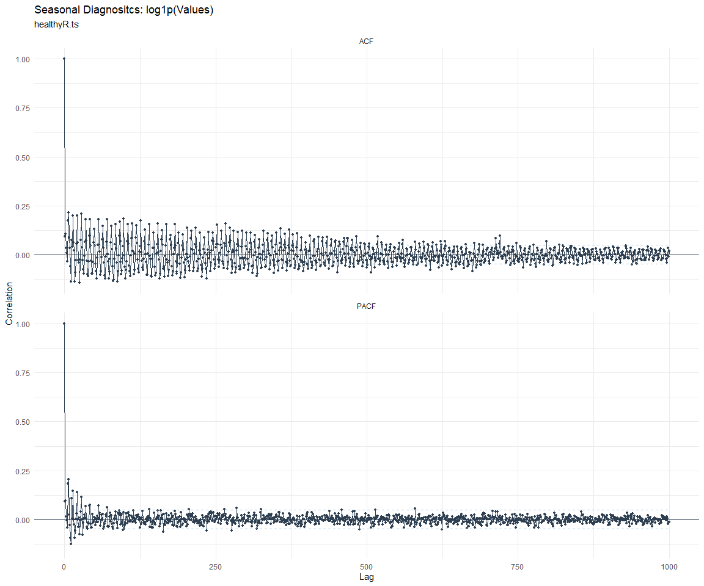

# Time Series Analysis, Modeling and Forecasting of the Healthyverse
Packages
Steven P. Sanderson II, MPH - Date:
2025-09-21

# Introduction

This analysis follows a *Nested Modeltime Workflow* from **`modeltime`**
along with using the **`NNS`** package. I use this to monitor the
downloads of all of my packages:

- [`healthyR`](https://www.spsanderson.com/healthyR/)
- [`healthyR.data`](https://www.spsanderson.com/healthyR.data/)
- [`healthyR.ts`](https://www.spsanderson.com/healthyR.ts/)
- [`healthyR.ai`](https://www.spsanderson.com/healthyR.ai/)
- [`healthyverse`](https://www.spsanderson.com/healthyverse/)
- [`TidyDensity`](https://www.spsanderson.com/TidyDensity/)
- [`tidyAML`](https://www.spsanderson.com/tidyAML/)
- [`RandomWalker`](https://www.spsanderson.com/RandomWalker/)

## Get Data

``` r
glimpse(downloads_tbl)
```

    Rows: 153,054
    Columns: 11
    $ date      <date> 2020-11-23, 2020-11-23, 2020-11-23, 2020-11-23, 2020-11-23,…
    $ time      <Period> 15H 36M 55S, 11H 26M 39S, 23H 34M 44S, 18H 39M 32S, 9H 0M…
    $ date_time <dttm> 2020-11-23 15:36:55, 2020-11-23 11:26:39, 2020-11-23 23:34:…
    $ size      <int> 4858294, 4858294, 4858301, 4858295, 361, 4863722, 4864794, 4…
    $ r_version <chr> NA, "4.0.3", "3.5.3", "3.5.2", NA, NA, NA, NA, NA, NA, NA, N…
    $ r_arch    <chr> NA, "x86_64", "x86_64", "x86_64", NA, NA, NA, NA, NA, NA, NA…
    $ r_os      <chr> NA, "mingw32", "mingw32", "linux-gnu", NA, NA, NA, NA, NA, N…
    $ package   <chr> "healthyR.data", "healthyR.data", "healthyR.data", "healthyR…
    $ version   <chr> "1.0.0", "1.0.0", "1.0.0", "1.0.0", "1.0.0", "1.0.0", "1.0.0…
    $ country   <chr> "US", "US", "US", "GB", "US", "US", "DE", "HK", "JP", "US", …
    $ ip_id     <int> 2069, 2804, 78827, 27595, 90474, 90474, 42435, 74, 7655, 638…

The last day in the data set is 2025-09-19 23:58:10, the file was
birthed on: 2022-07-02 23:58:17.511888, and at report knit time is
2.8196^{4} hours old. Happy analyzing!

Now that we have our data lets take a look at it using the `skimr`
package.

``` r
skim(downloads_tbl)
```

|                                                  |               |
|:-------------------------------------------------|:--------------|
| Name                                             | downloads_tbl |
| Number of rows                                   | 153054        |
| Number of columns                                | 11            |
| \_\_\_\_\_\_\_\_\_\_\_\_\_\_\_\_\_\_\_\_\_\_\_   |               |
| Column type frequency:                           |               |
| character                                        | 6             |
| Date                                             | 1             |
| numeric                                          | 2             |
| POSIXct                                          | 1             |
| Timespan                                         | 1             |
| \_\_\_\_\_\_\_\_\_\_\_\_\_\_\_\_\_\_\_\_\_\_\_\_ |               |
| Group variables                                  | None          |

Data summary

**Variable type: character**

| skim_variable | n_missing | complete_rate | min | max | empty | n_unique | whitespace |
|:--------------|----------:|--------------:|----:|----:|------:|---------:|-----------:|
| r_version     |    111452 |          0.27 |   5 |   5 |     0 |       48 |          0 |
| r_arch        |    111452 |          0.27 |   3 |   7 |     0 |        5 |          0 |
| r_os          |    111452 |          0.27 |   7 |  15 |     0 |       23 |          0 |
| package       |         0 |          1.00 |   7 |  13 |     0 |        8 |          0 |
| version       |         0 |          1.00 |   5 |  17 |     0 |       62 |          0 |
| country       |     13647 |          0.91 |   2 |   2 |     0 |      165 |          0 |

**Variable type: Date**

| skim_variable | n_missing | complete_rate | min | max | median | n_unique |
|:---|---:|---:|:---|:---|:---|---:|
| date | 0 | 1 | 2020-11-23 | 2025-09-19 | 2023-09-06 | 1755 |

**Variable type: numeric**

| skim_variable | n_missing | complete_rate | mean | sd | p0 | p25 | p50 | p75 | p100 | hist |
|:---|---:|---:|---:|---:|---:|---:|---:|---:|---:|:---|
| size | 0 | 1 | 1127921.47 | 1500451.2 | 355 | 16111.25 | 307013 | 2365132.00 | 5677952 | ▇▁▂▁▁ |
| ip_id | 0 | 1 | 11254.93 | 21655.4 | 1 | 237.25 | 3007 | 12054.75 | 299146 | ▇▁▁▁▁ |

**Variable type: POSIXct**

| skim_variable | n_missing | complete_rate | min | max | median | n_unique |
|:---|---:|---:|:---|:---|:---|---:|
| date_time | 0 | 1 | 2020-11-23 09:00:41 | 2025-09-19 23:58:10 | 2023-09-06 20:22:20 | 95470 |

**Variable type: Timespan**

| skim_variable | n_missing | complete_rate | min | max | median | n_unique |
|:--------------|----------:|--------------:|----:|----:|-------:|---------:|
| time          |         0 |             1 |   0 |  59 |     32 |       60 |

We can see that the following columns are missing a lot of data and for
us are most likely not useful anyways, so we will drop them
`c(r_version, r_arch, r_os)`

## Plots

Now lets take a look at a time-series plot of the total daily downloads
by package. We will use a log scale and place a vertical line at each
version release for each package.


Now lets take a look at some time series decomposition graphs.

    [[1]]


    [[2]]


    [[3]]


    [[4]]


    [[5]]


    [[6]]


    [[7]]


    [[8]]


    [[1]]


    [[2]]


    [[3]]


    [[4]]


    [[5]]


    [[6]]


    [[7]]


    [[8]]


Seasonal Diagnostics:

    [[1]]


    [[2]]


    [[3]]


    [[4]]


    [[5]]


    [[6]]


    [[7]]


    [[8]]


ACF and PACF Diagnostics:

    [[1]]


    [[2]]


    [[3]]


    [[4]]


    [[5]]


    [[6]]




    [[7]]


    [[8]]


## Feature Engineering

Now that we have our basic data and a shot of what it looks like, let’s
add some features to our data which can be very helpful in modeling.
Lets start by making a `tibble` that is aggregated by the day and
package, as we are going to be interested in forecasting the next 4
weeks or 28 days for each package. First lets get our base data.


    Call:
    stats::lm(formula = .formula, data = df)

    Residuals:
        Min      1Q  Median      3Q     Max 
    -146.32  -36.23  -11.01   26.70  816.21 

    Coefficients:
                                                         Estimate Std. Error
    (Intercept)                                        -1.994e+02  6.281e+01
    date                                                1.201e-02  3.327e-03
    lag(value, 1)                                       1.131e-01  2.366e-02
    lag(value, 7)                                       9.377e-02  2.459e-02
    lag(value, 14)                                      8.036e-02  2.463e-02
    lag(value, 21)                                      6.142e-02  2.466e-02
    lag(value, 28)                                      7.647e-02  2.458e-02
    lag(value, 35)                                      7.278e-02  2.468e-02
    lag(value, 42)                                      5.722e-02  2.484e-02
    lag(value, 49)                                      6.276e-02  2.473e-02
    month(date, label = TRUE).L                        -8.702e+00  5.122e+00
    month(date, label = TRUE).Q                         2.404e+00  5.011e+00
    month(date, label = TRUE).C                        -1.533e+01  5.076e+00
    month(date, label = TRUE)^4                        -7.598e+00  5.090e+00
    month(date, label = TRUE)^5                        -9.745e+00  5.043e+00
    month(date, label = TRUE)^6                        -2.147e+00  5.103e+00
    month(date, label = TRUE)^7                        -6.831e+00  5.013e+00
    month(date, label = TRUE)^8                        -4.740e+00  4.993e+00
    month(date, label = TRUE)^9                         3.075e+00  4.939e+00
    month(date, label = TRUE)^10                        1.545e+00  4.886e+00
    month(date, label = TRUE)^11                       -3.939e+00  4.830e+00
    fourier_vec(date, type = "sin", K = 1, period = 7) -1.143e+01  2.273e+00
    fourier_vec(date, type = "cos", K = 1, period = 7)  7.008e+00  2.377e+00
                                                       t value Pr(>|t|)    
    (Intercept)                                         -3.175 0.001526 ** 
    date                                                 3.612 0.000313 ***
    lag(value, 1)                                        4.779 1.92e-06 ***
    lag(value, 7)                                        3.813 0.000142 ***
    lag(value, 14)                                       3.262 0.001127 ** 
    lag(value, 21)                                       2.490 0.012858 *  
    lag(value, 28)                                       3.112 0.001892 ** 
    lag(value, 35)                                       2.949 0.003230 ** 
    lag(value, 42)                                       2.304 0.021352 *  
    lag(value, 49)                                       2.537 0.011264 *  
    month(date, label = TRUE).L                         -1.699 0.089516 .  
    month(date, label = TRUE).Q                          0.480 0.631518    
    month(date, label = TRUE).C                         -3.021 0.002559 ** 
    month(date, label = TRUE)^4                         -1.493 0.135751    
    month(date, label = TRUE)^5                         -1.932 0.053468 .  
    month(date, label = TRUE)^6                         -0.421 0.674038    
    month(date, label = TRUE)^7                         -1.363 0.173120    
    month(date, label = TRUE)^8                         -0.949 0.342522    
    month(date, label = TRUE)^9                          0.623 0.533635    
    month(date, label = TRUE)^10                         0.316 0.751883    
    month(date, label = TRUE)^11                        -0.815 0.414954    
    fourier_vec(date, type = "sin", K = 1, period = 7)  -5.029 5.45e-07 ***
    fourier_vec(date, type = "cos", K = 1, period = 7)   2.948 0.003245 ** 
    ---
    Signif. codes:  0 '***' 0.001 '**' 0.01 '*' 0.05 '.' 0.1 ' ' 1

    Residual standard error: 59.09 on 1683 degrees of freedom
      (49 observations deleted due to missingness)
    Multiple R-squared:  0.2343,    Adjusted R-squared:  0.2243 
    F-statistic: 23.41 on 22 and 1683 DF,  p-value: < 2.2e-16


## NNS Forecasting

This is something I have been wanting to try for a while. The `NNS`
package is a great package for forecasting time series data.

[NNS GitHub](https://github.com/OVVO-Financial/NNS)

``` r
library(NNS)

data_list <- base_data |>
    select(package, value) |>
    group_split(package)

data_list |>
    imap(
        \(x, idx) {
            obj <- x
            x <- obj |> pull(value) |> tail(7*52)
            train_set_size <- length(x) - 56
            pkg <- obj |> pluck(1) |> unique()
#            sf <- NNS.seas(x, modulo = 7, plot = FALSE)$periods
            seas <- t(
                sapply(
                    1:25, 
                    function(i) c(
                        i,
                        sqrt(
                            mean((
                                NNS.ARMA(x, 
                                         h = 28, 
                                         training.set = train_set_size, 
                                         method = "lin", 
                                         seasonal.factor = i, 
                                         plot=FALSE
                                         ) - tail(x, 28)) ^ 2)))
                    )
                )
            colnames(seas) <- c("Period", "RMSE")
            sf <- seas[which.min(seas[, 2]), 1]
            
            cat(paste0("Package: ", pkg, "\n"))
            NNS.ARMA.optim(
                variable = x,
                h = 28,
                training.set = train_set_size,
                #seasonal.factor = seq(12, 60, 7),
                seasonal.factor = sf,
                pred.int = 0.95,
                plot = TRUE
            )
            title(
                sub = paste0("\n",
                             "Package: ", pkg, " - NNS Optimization")
            )
        }
    )
```

    Package: healthyR
    [1] "CURRNET METHOD: lin"
    [1] "COPY LATEST PARAMETERS DIRECTLY FOR NNS.ARMA() IF ERROR:"
    [1] "NNS.ARMA(... method =  'lin' , seasonal.factor =  c( 24 ) ...)"
    [1] "CURRENT lin OBJECTIVE FUNCTION = 12.00933102772"
    [1] "BEST method = 'lin' PATH MEMBER = c( 24 )"
    [1] "BEST lin OBJECTIVE FUNCTION = 12.00933102772"
    [1] "CURRNET METHOD: nonlin"
    [1] "COPY LATEST PARAMETERS DIRECTLY FOR NNS.ARMA() IF ERROR:"
    [1] "NNS.ARMA(... method =  'nonlin' , seasonal.factor =  c( 24 ) ...)"
    [1] "CURRENT nonlin OBJECTIVE FUNCTION = 15.2588022089925"
    [1] "BEST method = 'nonlin' PATH MEMBER = c( 24 )"
    [1] "BEST nonlin OBJECTIVE FUNCTION = 15.2588022089925"
    [1] "CURRNET METHOD: both"
    [1] "COPY LATEST PARAMETERS DIRECTLY FOR NNS.ARMA() IF ERROR:"
    [1] "NNS.ARMA(... method =  'both' , seasonal.factor =  c( 24 ) ...)"
    [1] "CURRENT both OBJECTIVE FUNCTION = 13.6659674286063"
    [1] "BEST method = 'both' PATH MEMBER = c( 24 )"
    [1] "BEST both OBJECTIVE FUNCTION = 13.6659674286063"


    Package: healthyR.ai
    [1] "CURRNET METHOD: lin"
    [1] "COPY LATEST PARAMETERS DIRECTLY FOR NNS.ARMA() IF ERROR:"
    [1] "NNS.ARMA(... method =  'lin' , seasonal.factor =  c( 18 ) ...)"
    [1] "CURRENT lin OBJECTIVE FUNCTION = 57.9795402574179"
    [1] "BEST method = 'lin' PATH MEMBER = c( 18 )"
    [1] "BEST lin OBJECTIVE FUNCTION = 57.9795402574179"
    [1] "CURRNET METHOD: nonlin"
    [1] "COPY LATEST PARAMETERS DIRECTLY FOR NNS.ARMA() IF ERROR:"
    [1] "NNS.ARMA(... method =  'nonlin' , seasonal.factor =  c( 18 ) ...)"
    [1] "CURRENT nonlin OBJECTIVE FUNCTION = 66.6016021233071"
    [1] "BEST method = 'nonlin' PATH MEMBER = c( 18 )"
    [1] "BEST nonlin OBJECTIVE FUNCTION = 66.6016021233071"
    [1] "CURRNET METHOD: both"
    [1] "COPY LATEST PARAMETERS DIRECTLY FOR NNS.ARMA() IF ERROR:"
    [1] "NNS.ARMA(... method =  'both' , seasonal.factor =  c( 18 ) ...)"
    [1] "CURRENT both OBJECTIVE FUNCTION = 67.0603624755802"
    [1] "BEST method = 'both' PATH MEMBER = c( 18 )"
    [1] "BEST both OBJECTIVE FUNCTION = 67.0603624755802"


    Package: healthyR.data
    [1] "CURRNET METHOD: lin"
    [1] "COPY LATEST PARAMETERS DIRECTLY FOR NNS.ARMA() IF ERROR:"
    [1] "NNS.ARMA(... method =  'lin' , seasonal.factor =  c( 13 ) ...)"
    [1] "CURRENT lin OBJECTIVE FUNCTION = 9.36965375575732"
    [1] "BEST method = 'lin' PATH MEMBER = c( 13 )"
    [1] "BEST lin OBJECTIVE FUNCTION = 9.36965375575732"
    [1] "CURRNET METHOD: nonlin"
    [1] "COPY LATEST PARAMETERS DIRECTLY FOR NNS.ARMA() IF ERROR:"
    [1] "NNS.ARMA(... method =  'nonlin' , seasonal.factor =  c( 13 ) ...)"
    [1] "CURRENT nonlin OBJECTIVE FUNCTION = 8.56583546595981"
    [1] "BEST method = 'nonlin' PATH MEMBER = c( 13 )"
    [1] "BEST nonlin OBJECTIVE FUNCTION = 8.56583546595981"
    [1] "CURRNET METHOD: both"
    [1] "COPY LATEST PARAMETERS DIRECTLY FOR NNS.ARMA() IF ERROR:"
    [1] "NNS.ARMA(... method =  'both' , seasonal.factor =  c( 13 ) ...)"
    [1] "CURRENT both OBJECTIVE FUNCTION = 10.2156222631764"
    [1] "BEST method = 'both' PATH MEMBER = c( 13 )"
    [1] "BEST both OBJECTIVE FUNCTION = 10.2156222631764"


    Package: healthyR.ts
    [1] "CURRNET METHOD: lin"
    [1] "COPY LATEST PARAMETERS DIRECTLY FOR NNS.ARMA() IF ERROR:"
    [1] "NNS.ARMA(... method =  'lin' , seasonal.factor =  c( 11 ) ...)"
    [1] "CURRENT lin OBJECTIVE FUNCTION = 13.0052619817435"
    [1] "BEST method = 'lin' PATH MEMBER = c( 11 )"
    [1] "BEST lin OBJECTIVE FUNCTION = 13.0052619817435"
    [1] "CURRNET METHOD: nonlin"
    [1] "COPY LATEST PARAMETERS DIRECTLY FOR NNS.ARMA() IF ERROR:"
    [1] "NNS.ARMA(... method =  'nonlin' , seasonal.factor =  c( 11 ) ...)"
    [1] "CURRENT nonlin OBJECTIVE FUNCTION = 7.47550124654386"
    [1] "BEST method = 'nonlin' PATH MEMBER = c( 11 )"
    [1] "BEST nonlin OBJECTIVE FUNCTION = 7.47550124654386"
    [1] "CURRNET METHOD: both"
    [1] "COPY LATEST PARAMETERS DIRECTLY FOR NNS.ARMA() IF ERROR:"
    [1] "NNS.ARMA(... method =  'both' , seasonal.factor =  c( 11 ) ...)"
    [1] "CURRENT both OBJECTIVE FUNCTION = 10.7430938392059"
    [1] "BEST method = 'both' PATH MEMBER = c( 11 )"
    [1] "BEST both OBJECTIVE FUNCTION = 10.7430938392059"


    Package: healthyverse
    [1] "CURRNET METHOD: lin"
    [1] "COPY LATEST PARAMETERS DIRECTLY FOR NNS.ARMA() IF ERROR:"
    [1] "NNS.ARMA(... method =  'lin' , seasonal.factor =  c( 7 ) ...)"
    [1] "CURRENT lin OBJECTIVE FUNCTION = 12.1978086146496"
    [1] "BEST method = 'lin' PATH MEMBER = c( 7 )"
    [1] "BEST lin OBJECTIVE FUNCTION = 12.1978086146496"
    [1] "CURRNET METHOD: nonlin"
    [1] "COPY LATEST PARAMETERS DIRECTLY FOR NNS.ARMA() IF ERROR:"
    [1] "NNS.ARMA(... method =  'nonlin' , seasonal.factor =  c( 7 ) ...)"
    [1] "CURRENT nonlin OBJECTIVE FUNCTION = 7.13447284550509"
    [1] "BEST method = 'nonlin' PATH MEMBER = c( 7 )"
    [1] "BEST nonlin OBJECTIVE FUNCTION = 7.13447284550509"
    [1] "CURRNET METHOD: both"
    [1] "COPY LATEST PARAMETERS DIRECTLY FOR NNS.ARMA() IF ERROR:"
    [1] "NNS.ARMA(... method =  'both' , seasonal.factor =  c( 7 ) ...)"
    [1] "CURRENT both OBJECTIVE FUNCTION = 7.58036699611076"
    [1] "BEST method = 'both' PATH MEMBER = c( 7 )"
    [1] "BEST both OBJECTIVE FUNCTION = 7.58036699611076"


    Package: RandomWalker
    [1] "CURRNET METHOD: lin"
    [1] "COPY LATEST PARAMETERS DIRECTLY FOR NNS.ARMA() IF ERROR:"
    [1] "NNS.ARMA(... method =  'lin' , seasonal.factor =  c( 7 ) ...)"
    [1] "CURRENT lin OBJECTIVE FUNCTION = 6.4597209308818"
    [1] "BEST method = 'lin' PATH MEMBER = c( 7 )"
    [1] "BEST lin OBJECTIVE FUNCTION = 6.4597209308818"
    [1] "CURRNET METHOD: nonlin"
    [1] "COPY LATEST PARAMETERS DIRECTLY FOR NNS.ARMA() IF ERROR:"
    [1] "NNS.ARMA(... method =  'nonlin' , seasonal.factor =  c( 7 ) ...)"
    [1] "CURRENT nonlin OBJECTIVE FUNCTION = 9.09944379268161"
    [1] "BEST method = 'nonlin' PATH MEMBER = c( 7 )"
    [1] "BEST nonlin OBJECTIVE FUNCTION = 9.09944379268161"
    [1] "CURRNET METHOD: both"
    [1] "COPY LATEST PARAMETERS DIRECTLY FOR NNS.ARMA() IF ERROR:"
    [1] "NNS.ARMA(... method =  'both' , seasonal.factor =  c( 7 ) ...)"
    [1] "CURRENT both OBJECTIVE FUNCTION = 9.57309046317048"
    [1] "BEST method = 'both' PATH MEMBER = c( 7 )"
    [1] "BEST both OBJECTIVE FUNCTION = 9.57309046317048"


    Package: tidyAML
    [1] "CURRNET METHOD: lin"
    [1] "COPY LATEST PARAMETERS DIRECTLY FOR NNS.ARMA() IF ERROR:"
    [1] "NNS.ARMA(... method =  'lin' , seasonal.factor =  c( 15 ) ...)"
    [1] "CURRENT lin OBJECTIVE FUNCTION = 6.23713171941219"
    [1] "BEST method = 'lin' PATH MEMBER = c( 15 )"
    [1] "BEST lin OBJECTIVE FUNCTION = 6.23713171941219"
    [1] "CURRNET METHOD: nonlin"
    [1] "COPY LATEST PARAMETERS DIRECTLY FOR NNS.ARMA() IF ERROR:"
    [1] "NNS.ARMA(... method =  'nonlin' , seasonal.factor =  c( 15 ) ...)"
    [1] "CURRENT nonlin OBJECTIVE FUNCTION = 6.15044667933889"
    [1] "BEST method = 'nonlin' PATH MEMBER = c( 15 )"
    [1] "BEST nonlin OBJECTIVE FUNCTION = 6.15044667933889"
    [1] "CURRNET METHOD: both"
    [1] "COPY LATEST PARAMETERS DIRECTLY FOR NNS.ARMA() IF ERROR:"
    [1] "NNS.ARMA(... method =  'both' , seasonal.factor =  c( 15 ) ...)"
    [1] "CURRENT both OBJECTIVE FUNCTION = 7.56373799841753"
    [1] "BEST method = 'both' PATH MEMBER = c( 15 )"
    [1] "BEST both OBJECTIVE FUNCTION = 7.56373799841753"


    Package: TidyDensity
    [1] "CURRNET METHOD: lin"
    [1] "COPY LATEST PARAMETERS DIRECTLY FOR NNS.ARMA() IF ERROR:"
    [1] "NNS.ARMA(... method =  'lin' , seasonal.factor =  c( 13 ) ...)"
    [1] "CURRENT lin OBJECTIVE FUNCTION = 36.0082410332013"
    [1] "BEST method = 'lin' PATH MEMBER = c( 13 )"
    [1] "BEST lin OBJECTIVE FUNCTION = 36.0082410332013"
    [1] "CURRNET METHOD: nonlin"
    [1] "COPY LATEST PARAMETERS DIRECTLY FOR NNS.ARMA() IF ERROR:"
    [1] "NNS.ARMA(... method =  'nonlin' , seasonal.factor =  c( 13 ) ...)"
    [1] "CURRENT nonlin OBJECTIVE FUNCTION = 8.95702533292487"
    [1] "BEST method = 'nonlin' PATH MEMBER = c( 13 )"
    [1] "BEST nonlin OBJECTIVE FUNCTION = 8.95702533292487"
    [1] "CURRNET METHOD: both"
    [1] "COPY LATEST PARAMETERS DIRECTLY FOR NNS.ARMA() IF ERROR:"
    [1] "NNS.ARMA(... method =  'both' , seasonal.factor =  c( 13 ) ...)"
    [1] "CURRENT both OBJECTIVE FUNCTION = 12.8272405209903"
    [1] "BEST method = 'both' PATH MEMBER = c( 13 )"
    [1] "BEST both OBJECTIVE FUNCTION = 12.8272405209903"


    [[1]]
    NULL

    [[2]]
    NULL

    [[3]]
    NULL

    [[4]]
    NULL

    [[5]]
    NULL

    [[6]]
    NULL

    [[7]]
    NULL

    [[8]]
    NULL

## Pre-Processing

Now we are going to do some basic pre-processing.

``` r
data_padded_tbl <- base_data %>%
  pad_by_time(
    .date_var  = date,
    .pad_value = 0
  )

# Get log interval and standardization parameters
log_params  <- liv(data_padded_tbl$value, limit_lower = 0, offset = 1, silent = TRUE)
limit_lower <- log_params$limit_lower
limit_upper <- log_params$limit_upper
offset      <- log_params$offset

data_liv_tbl <- data_padded_tbl %>%
  # Get log interval transform
  mutate(value_trans = liv(value, limit_lower = 0, offset = 1, silent = TRUE)$log_scaled)

# Get Standardization Params
std_params <- standard_vec(data_liv_tbl$value_trans, silent = TRUE)
std_mean   <- std_params$mean
std_sd     <- std_params$sd

data_transformed_tbl <- data_liv_tbl %>%
  # get standardization
  mutate(value_trans = standard_vec(value_trans, silent = TRUE)$standard_scaled) %>%
  select(-value)
```

Since this is panel data we can follow one of two different modeling
strategies. We can search for a global model in the panel data or we can
use nested forecasting finding the best model for each of the time
series. Since we only have 5 panels, we will use nested forecasting.

To do this we will use the `nest_timeseries` and
`split_nested_timeseries` functions to create a nested `tibble`.

``` r
horizon <- 4*7

nested_data_tbl <- data_transformed_tbl %>%

    # 0. Filter out column where package is NA
    filter(!is.na(package)) %>%
    
    # 1. Extending: We'll predict n days into the future.
    extend_timeseries(
        .id_var        = package,
        .date_var      = date,
        .length_future = horizon
    ) %>%
    
    # 2. Nesting: We'll group by id, and create a future dataset
    #    that forecasts n days of extended data and
    #    an actual dataset that contains n*2 days
    nest_timeseries(
        .id_var        = package,
        .length_future = horizon
        #.length_actual = horizon*2
    ) %>%
    
   # 3. Splitting: We'll take the actual data and create splits
   #    for accuracy and confidence interval estimation of n das (test)
   #    and the rest is training data
    split_nested_timeseries(
        .length_test = horizon
    )

nested_data_tbl
```

    # A tibble: 8 × 4
      package       .actual_data         .future_data      .splits          
      <fct>         <list>               <list>            <list>           
    1 healthyR.data <tibble [1,747 × 2]> <tibble [28 × 2]> <split [1719|28]>
    2 healthyR      <tibble [1,738 × 2]> <tibble [28 × 2]> <split [1710|28]>
    3 healthyR.ts   <tibble [1,684 × 2]> <tibble [28 × 2]> <split [1656|28]>
    4 healthyverse  <tibble [1,655 × 2]> <tibble [28 × 2]> <split [1627|28]>
    5 healthyR.ai   <tibble [1,480 × 2]> <tibble [28 × 2]> <split [1452|28]>
    6 TidyDensity   <tibble [1,331 × 2]> <tibble [28 × 2]> <split [1303|28]>
    7 tidyAML       <tibble [938 × 2]>   <tibble [28 × 2]> <split [910|28]> 
    8 RandomWalker  <tibble [361 × 2]>   <tibble [28 × 2]> <split [333|28]> 

Now it is time to make some recipes and models using the modeltime
workflow.

## Modeltime Workflow

### Recipe Object

``` r
recipe_base <- recipe(
  value_trans ~ date
  , data = extract_nested_test_split(nested_data_tbl)
  )

recipe_base

recipe_date <- recipe_base %>%
    step_mutate(date = as.numeric(date))
```

### Models

``` r
# Models ------------------------------------------------------------------

# Auto ARIMA --------------------------------------------------------------

model_spec_arima_no_boost <- arima_reg() %>%
  set_engine(engine = "auto_arima")

wflw_auto_arima <- workflow() %>%
  add_recipe(recipe = recipe_base) %>%
  add_model(model_spec_arima_no_boost)

# NNETAR ------------------------------------------------------------------

model_spec_nnetar <- nnetar_reg(
  mode              = "regression"
  , seasonal_period = "auto"
) %>%
  set_engine("nnetar")

wflw_nnetar <- workflow() %>%
  add_recipe(recipe = recipe_base) %>%
  add_model(model_spec_nnetar)

# TSLM --------------------------------------------------------------------

model_spec_lm <- linear_reg() %>%
  set_engine("lm")

wflw_lm <- workflow() %>%
  add_recipe(recipe = recipe_base) %>%
  add_model(model_spec_lm)

# MARS --------------------------------------------------------------------

model_spec_mars <- mars(mode = "regression") %>%
  set_engine("earth")

wflw_mars <- workflow() %>%
  add_recipe(recipe = recipe_base) %>%
  add_model(model_spec_mars)
```

### Nested Modeltime Tables

``` r
nested_modeltime_tbl <- modeltime_nested_fit(
  # Nested Data
  nested_data = nested_data_tbl,
   control = control_nested_fit(
     verbose = TRUE,
     allow_par = FALSE
   ),
  # Add workflows
  wflw_auto_arima,
  wflw_lm,
  wflw_mars,
  wflw_nnetar
)
```

``` r
nested_modeltime_tbl <- nested_modeltime_tbl[!is.na(nested_modeltime_tbl$package),]
```

### Model Accuracy

``` r
nested_modeltime_tbl %>%
  extract_nested_test_accuracy() %>%
  filter(!is.na(package)) %>%
  knitr::kable()
```

| package | .model_id | .model_desc | .type | mae | mape | mase | smape | rmse | rsq |
|:---|---:|:---|:---|---:|---:|---:|---:|---:|---:|
| healthyR.data | 1 | ARIMA | Test | 0.6839183 | 116.69025 | 0.9858528 | 162.87412 | 0.8653074 | 0.0127871 |
| healthyR.data | 2 | LM | Test | 0.7674147 | 206.14883 | 1.1062110 | 148.88659 | 0.8775362 | 0.2086075 |
| healthyR.data | 3 | EARTH | Test | 4.9732809 | 2318.61391 | 7.1688725 | 162.14621 | 5.7668576 | 0.2086075 |
| healthyR.data | 4 | NNAR | Test | 0.7166367 | 104.45363 | 1.0330157 | 188.69982 | 0.9156511 | 0.0697253 |
| healthyR | 1 | ARIMA | Test | 0.6264544 | 130.87027 | 0.8140264 | 190.79690 | 0.7979651 | 0.0713987 |
| healthyR | 2 | LM | Test | 0.6039213 | 132.56105 | 0.7847463 | 176.81189 | 0.7587424 | 0.3382761 |
| healthyR | 3 | EARTH | Test | 0.7837368 | 399.01852 | 1.0184019 | 134.90500 | 1.0081611 | 0.3382761 |
| healthyR | 4 | NNAR | Test | 0.6227064 | 139.13475 | 0.8091561 | 176.14168 | 0.7784599 | 0.0032599 |
| healthyR.ts | 1 | ARIMA | Test | 0.8011473 | 170.72670 | 0.8884888 | 132.95207 | 1.0006067 | 0.0257022 |
| healthyR.ts | 2 | LM | Test | 0.7882211 | 156.15968 | 0.8741534 | 134.01104 | 1.0039445 | 0.0182819 |
| healthyR.ts | 3 | EARTH | Test | 1.0424651 | 373.48913 | 1.1561152 | 126.04424 | 1.2716152 | 0.0182819 |
| healthyR.ts | 4 | NNAR | Test | 0.8341051 | 116.37938 | 0.9250397 | 176.82740 | 1.0562137 | 0.0152900 |
| healthyverse | 1 | ARIMA | Test | 0.6983771 | 141.71704 | 1.0156233 | 98.75095 | 0.8597564 | 0.0149253 |
| healthyverse | 2 | LM | Test | 0.6582589 | 170.30155 | 0.9572810 | 87.61682 | 0.7991567 | 0.1965919 |
| healthyverse | 3 | EARTH | Test | 2.3356508 | 982.90900 | 3.3966485 | 113.12549 | 2.8712624 | 0.1965919 |
| healthyverse | 4 | NNAR | Test | 0.7343405 | 121.15177 | 1.0679236 | 109.07648 | 0.9185098 | 0.0252492 |
| healthyR.ai | 1 | ARIMA | Test | 0.9238268 | 96.18868 | 1.0693398 | 155.61530 | 1.4385237 | 0.0494104 |
| healthyR.ai | 2 | LM | Test | 0.9005986 | 111.70558 | 1.0424529 | 140.78705 | 1.4362467 | 0.2461241 |
| healthyR.ai | 3 | EARTH | Test | 1.9230034 | 858.04653 | 2.2258977 | 161.43809 | 2.0676014 | 0.2461241 |
| healthyR.ai | 4 | NNAR | Test | 0.9623672 | 119.67342 | 1.1139506 | 146.06278 | 1.4864855 | 0.0502443 |
| TidyDensity | 1 | ARIMA | Test | 0.9731765 | 245.74202 | 0.9522748 | 114.61809 | 1.3059123 | 0.0060090 |
| TidyDensity | 2 | LM | Test | 0.9514468 | 255.32550 | 0.9310118 | 109.91154 | 1.2680949 | 0.4257413 |
| TidyDensity | 3 | EARTH | Test | 1.0159209 | 454.91771 | 0.9941012 | 100.07834 | 1.1692159 | 0.4257413 |
| TidyDensity | 4 | NNAR | Test | 1.0908128 | 181.85745 | 1.0673845 | 146.28835 | 1.4944469 | 0.1082914 |
| tidyAML | 1 | ARIMA | Test | 0.7295827 | 111.04048 | 0.8934217 | 120.59993 | 0.8670460 | 0.0128854 |
| tidyAML | 2 | LM | Test | 0.6270494 | 136.32252 | 0.7678630 | 89.97377 | 0.7686225 | 0.1830929 |
| tidyAML | 3 | EARTH | Test | 1.0672259 | 165.21520 | 1.3068878 | 179.17350 | 1.2223595 | 0.1830929 |
| tidyAML | 4 | NNAR | Test | 0.7297070 | 144.99969 | 0.8935739 | 111.70683 | 0.8605456 | 0.0756904 |
| RandomWalker | 1 | ARIMA | Test | 1.0602660 | 110.28713 | 0.6409496 | 167.62851 | 1.3162406 | 0.1894392 |
| RandomWalker | 2 | LM | Test | 1.0984199 | 126.01573 | 0.6640144 | 163.77613 | 1.3100965 | 0.0097208 |
| RandomWalker | 3 | EARTH | Test | 1.0960005 | 100.25992 | 0.6625517 | 190.44437 | 1.3640095 | NA |
| RandomWalker | 4 | NNAR | Test | 1.2939060 | 183.61801 | 0.7821891 | 151.37352 | 1.5401958 | 0.0018221 |

### Plot Models

``` r
nested_modeltime_tbl %>%
  extract_nested_test_forecast() %>%
  group_by(package) %>%
  plot_modeltime_forecast(
    .interactive = FALSE,
    .conf_interval_show  = FALSE,
    .facet_scales = "free"
  ) +
  theme_minimal() +
  theme(legend.position = "bottom")
```


### Best Model

``` r
best_nested_modeltime_tbl <- nested_modeltime_tbl %>%
  modeltime_nested_select_best(
    metric = "rmse",
    minimize = TRUE,
    filter_test_forecasts = TRUE
  )

best_nested_modeltime_tbl %>%
  extract_nested_best_model_report()
```

    # Nested Modeltime Table
      

    # A tibble: 8 × 10
      package      .model_id .model_desc .type   mae  mape  mase smape  rmse     rsq
      <fct>            <int> <chr>       <chr> <dbl> <dbl> <dbl> <dbl> <dbl>   <dbl>
    1 healthyR.da…         1 ARIMA       Test  0.684  117. 0.986 163.  0.865 0.0128 
    2 healthyR             2 LM          Test  0.604  133. 0.785 177.  0.759 0.338  
    3 healthyR.ts          1 ARIMA       Test  0.801  171. 0.888 133.  1.00  0.0257 
    4 healthyverse         2 LM          Test  0.658  170. 0.957  87.6 0.799 0.197  
    5 healthyR.ai          2 LM          Test  0.901  112. 1.04  141.  1.44  0.246  
    6 TidyDensity          3 EARTH       Test  1.02   455. 0.994 100.  1.17  0.426  
    7 tidyAML              2 LM          Test  0.627  136. 0.768  90.0 0.769 0.183  
    8 RandomWalker         2 LM          Test  1.10   126. 0.664 164.  1.31  0.00972

``` r
best_nested_modeltime_tbl %>%
  extract_nested_test_forecast() %>%
  #filter(!is.na(.model_id)) %>%
  group_by(package) %>%
  plot_modeltime_forecast(
    .interactive = FALSE,
    .conf_interval_alpha = 0.2,
    .facet_scales = "free"
  ) +
  theme_minimal() +
  theme(legend.position = "bottom")
```


## Refitting and Future Forecast

Now that we have the best models, we can make our future forecasts.

``` r
nested_modeltime_refit_tbl <- best_nested_modeltime_tbl %>%
    modeltime_nested_refit(
        control = control_nested_refit(verbose = TRUE)
    )
```

``` r
nested_modeltime_refit_tbl
```

    # Nested Modeltime Table
      

    # A tibble: 8 × 5
      package       .actual_data .future_data .splits           .modeltime_tables 
      <fct>         <list>       <list>       <list>            <list>            
    1 healthyR.data <tibble>     <tibble>     <split [1719|28]> <mdl_tm_t [1 × 5]>
    2 healthyR      <tibble>     <tibble>     <split [1710|28]> <mdl_tm_t [1 × 5]>
    3 healthyR.ts   <tibble>     <tibble>     <split [1656|28]> <mdl_tm_t [1 × 5]>
    4 healthyverse  <tibble>     <tibble>     <split [1627|28]> <mdl_tm_t [1 × 5]>
    5 healthyR.ai   <tibble>     <tibble>     <split [1452|28]> <mdl_tm_t [1 × 5]>
    6 TidyDensity   <tibble>     <tibble>     <split [1303|28]> <mdl_tm_t [1 × 5]>
    7 tidyAML       <tibble>     <tibble>     <split [910|28]>  <mdl_tm_t [1 × 5]>
    8 RandomWalker  <tibble>     <tibble>     <split [333|28]>  <mdl_tm_t [1 × 5]>

``` r
nested_modeltime_refit_tbl %>%
  extract_nested_future_forecast() %>%
  mutate(across(.value:.conf_hi, .fns = ~ standard_inv_vec(
    x    = .,
    mean = std_mean,
    sd   = std_sd
  )$standard_inverse_value)) %>%
  mutate(across(.value:.conf_hi, .fns = ~ liiv(
    x = .,
    limit_lower = limit_lower,
    limit_upper = limit_upper,
    offset      = offset
  )$rescaled_v)) %>%
  group_by(package) %>%
  plot_modeltime_forecast(
    .interactive = FALSE,
    .conf_interval_alpha = 0.2,
    .facet_scales = "free"
  ) +
  theme_minimal() +
  theme(legend.position = "bottom")
```


