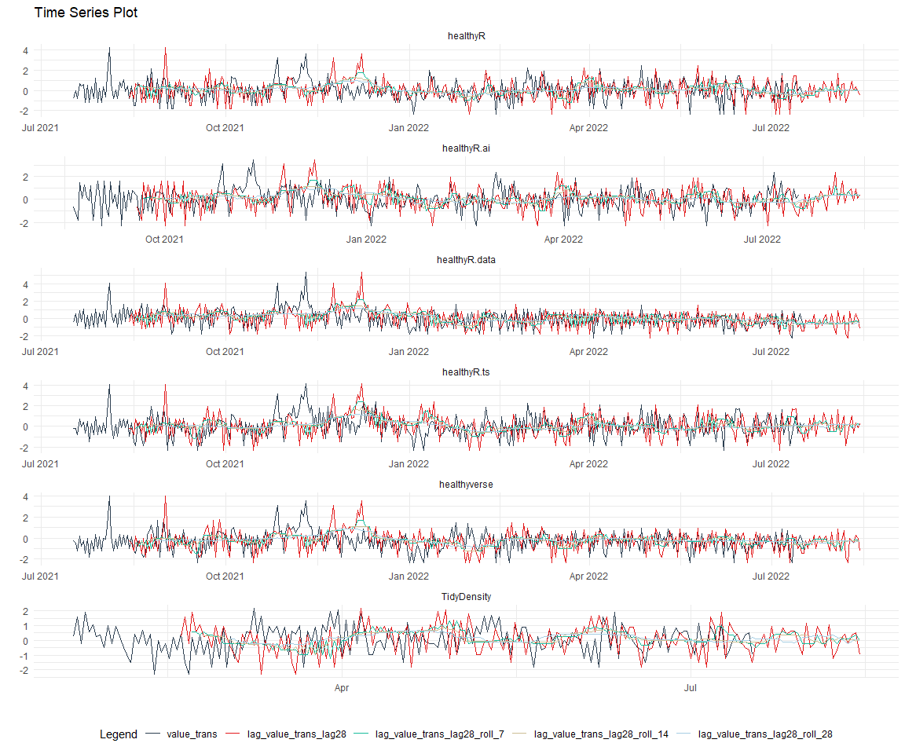

Time Series Analysis and Modeling of the Healthyverse Packages
================
Steven P. Sanderson II, MPH - Data Scientist/IT Manager
23 February, 2022

## Get Data

``` r
glimpse(downloads_tbl)
```

    ## Rows: 29,537
    ## Columns: 11
    ## $ date      <date> 2020-11-23, 2020-11-23, 2020-11-23, 2020-11-23, 2020-11-23,~
    ## $ time      <Period> 15H 36M 55S, 11H 26M 39S, 23H 34M 44S, 18H 39M 32S, 9H 0M~
    ## $ date_time <dttm> 2020-11-23 15:36:55, 2020-11-23 11:26:39, 2020-11-23 23:34:~
    ## $ size      <int> 4858294, 4858294, 4858301, 4858295, 361, 4863722, 4864794, 4~
    ## $ r_version <chr> NA, "4.0.3", "3.5.3", "3.5.2", NA, NA, NA, NA, NA, NA, NA, N~
    ## $ r_arch    <chr> NA, "x86_64", "x86_64", "x86_64", NA, NA, NA, NA, NA, NA, NA~
    ## $ r_os      <chr> NA, "mingw32", "mingw32", "linux-gnu", NA, NA, NA, NA, NA, N~
    ## $ package   <chr> "healthyR.data", "healthyR.data", "healthyR.data", "healthyR~
    ## $ version   <chr> "1.0.0", "1.0.0", "1.0.0", "1.0.0", "1.0.0", "1.0.0", "1.0.0~
    ## $ country   <chr> "US", "US", "US", "GB", "US", "US", "DE", "HK", "JP", "US", ~
    ## $ ip_id     <int> 2069, 2804, 78827, 27595, 90474, 90474, 42435, 74, 7655, 638~

The last day in the data set is 2022-02-21 22:40:27, the file was
birthed on: 2021-11-29 11:38:26, and at report knit time is -2022.03
hours old. Happy analyzing!

Now that we have our data lets take a look at it using the `skimr`
package.

``` r
skim(downloads_tbl)
```

|                                                  |                |
|:-------------------------------------------------|:---------------|
| Name                                             | downloads\_tbl |
| Number of rows                                   | 29537          |
| Number of columns                                | 11             |
| \_\_\_\_\_\_\_\_\_\_\_\_\_\_\_\_\_\_\_\_\_\_\_   |                |
| Column type frequency:                           |                |
| character                                        | 6              |
| Date                                             | 1              |
| numeric                                          | 2              |
| POSIXct                                          | 1              |
| Timespan                                         | 1              |
| \_\_\_\_\_\_\_\_\_\_\_\_\_\_\_\_\_\_\_\_\_\_\_\_ |                |
| Group variables                                  | None           |

Data summary

**Variable type: character**

| skim\_variable | n\_missing | complete\_rate | min | max | empty | n\_unique | whitespace |
|:---------------|-----------:|---------------:|----:|----:|------:|----------:|-----------:|
| r\_version     |      19628 |           0.34 |   5 |   5 |     0 |        29 |          0 |
| r\_arch        |      19628 |           0.34 |   3 |   7 |     0 |         5 |          0 |
| r\_os          |      19628 |           0.34 |   7 |  15 |     0 |        11 |          0 |
| package        |          0 |           1.00 |   8 |  13 |     0 |         6 |          0 |
| version        |          0 |           1.00 |   5 |   5 |     0 |        16 |          0 |
| country        |       2480 |           0.92 |   2 |   2 |     0 |       101 |          0 |

**Variable type: Date**

| skim\_variable | n\_missing | complete\_rate | min        | max        | median     | n\_unique |
|:---------------|-----------:|---------------:|:-----------|:-----------|:-----------|----------:|
| date           |          0 |              1 | 2020-11-23 | 2022-02-21 | 2021-08-28 |       456 |

**Variable type: numeric**

| skim\_variable | n\_missing | complete\_rate |       mean |         sd |  p0 |   p25 |    p50 |     p75 |    p100 | hist  |
|:---------------|-----------:|---------------:|-----------:|-----------:|----:|------:|-------:|--------:|--------:|:------|
| size           |          0 |              1 | 1514965.22 | 1870422.84 | 357 | 20493 | 271097 | 3247946 | 5677952 | ▇▁▂▂▁ |
| ip\_id         |          0 |              1 |    8251.28 |   15756.63 |   1 |   279 |   2742 |    8288 |  143633 | ▇▁▁▁▁ |

**Variable type: POSIXct**

| skim\_variable | n\_missing | complete\_rate | min                 | max                 | median              | n\_unique |
|:---------------|-----------:|---------------:|:--------------------|:--------------------|:--------------------|----------:|
| date\_time     |          0 |              1 | 2020-11-23 09:00:41 | 2022-02-21 22:40:27 | 2021-08-28 13:57:30 |     17222 |

**Variable type: Timespan**

| skim\_variable | n\_missing | complete\_rate | min | max |      median | n\_unique |
|:---------------|-----------:|---------------:|----:|----:|------------:|----------:|
| time           |          0 |              1 |   0 |  59 | 10H 58M 45S |        60 |

We can see that the following columns are missing a lot of data and for
us are most likely not useful anyways, so we will drop them
`c(r_version, r_arch, r_os)`

## Plots

Now lets take a look at a time-series plot of the total daily downloads
by package. We will use a log scale and place a vertical line at each
version release for each package.

<!-- --><!-- -->

Now lets take a look at some time series decomposition graphs.

<!-- --><!-- --><!-- --><!-- -->

## Feature Engineering

Now that we have our basic data and a shot of what it looks like, let’s
add some features to our data which can be very helpful in modeling.
Lets start by making a `tibble` that is aggregated by the day and
package, as we are going to be interested in forecasting the next 4
weeks or 28 days for each package. First lets get our base data.

Now we are going to do some basic pre-processing.

``` r
data_padded_tbl <- base_data %>%
  pad_by_time(
    .date_var  = date,
    .pad_value = 0
  )

# Get log interval and standardization parameters
log_params  <- liv(data_padded_tbl$value, limit_lower = 0, offset = 1, silent = TRUE)
limit_lower <- log_params$limit_lower
limit_upper <- log_params$limit_upper
offset      <- log_params$offset

data_liv_tbl <- data_padded_tbl %>%
  # Get log interval transform
  mutate(value_trans = liv(value, limit_lower = 0, offset = 1, silent = TRUE)$log_scaled)

# Get Standardization Params
std_params <- standard_vec(data_liv_tbl$value_trans, silent = TRUE)
std_mean   <- std_params$mean
std_sd     <- std_params$sd

data_transformed_tbl <- data_liv_tbl %>%
  # get standardization
  mutate(value_trans = standard_vec(value_trans, silent = TRUE)$standard_scaled) %>%
  select(-value)
```

Now that we have our full data set and saved our parameters we can
create the full data set.

``` r
horizon         <- 4*7
lag_period      <- 4*7
rolling_periods <- c(7, 14, 28)

data_prepared_full_tbl <- data_transformed_tbl %>%
  group_by(package) %>%
  
  # Add future windows
  bind_rows(
    future_frame(., .date_var = date, .length_out = horizon)
  ) %>%
  
  # Add autocorolated lags
  tk_augment_lags(value_trans, .lags = lag_period) %>%
  
  # Add rolling features
  tk_augment_slidify(
    .value     = value_trans_lag28
    , .f       = median
    , .period  = rolling_periods
    , .align   = "center"
    , .partial = TRUE
  ) %>%
  
  # Format columns
  rename_with(.cols = contains("lag"), .fn = ~ str_c("lag_", .)) %>%
  select(date, package, everything()) %>%
  ungroup()

data_prepared_full_tbl %>% 
  group_by(package) %>% 
  pivot_longer(-c(date, package)) %>% 
  plot_time_series(
    .date_var = date
    , .value = value
    , .color_var = name
    , .smooth = FALSE
    , .interactive = FALSE
    , .facet_scales = "free"
  ) +
  theme_minimal() +
  theme(legend.position = "bottom")
```

<!-- -->

Since this is panel data we can follow one of two different modeling
strategies. We can search for a global model in the panel data or we can
use nested forecasting finding the best model for each of the time
series. Since we only have 5 panels, we will use nested forecasting.

To do this we will use the `nest_timeseries` and
`split_nested_timeseries` functions to create a nested `tibble`.

``` r
data_prepared_tbl <- data_prepared_full_tbl %>%
  filter(!is.na(value_trans))

forecast_tbl <- data_prepared_full_tbl %>%
  filter(is.na(value_trans))

nested_data_tbl <- data_prepared_tbl %>%
  nest_timeseries(
    .id_var = package
    , .length_future = horizon
  ) %>%
  split_nested_timeseries(
    .length_test = horizon
  )
```

Now it is time to make some recipes and models using the modeltime
workflow.

## Modeltime Workflow

### Recipe Object

``` r
recipe_base <- recipe(
  value_trans ~ .
  , data = extract_nested_test_split(nested_data_tbl)
  ) %>%
  step_mutate(yr = lubridate::year(date)) %>%
  step_harmonic(yr, frequency = 365/12, cycle_size = 1) %>%
  step_rm(yr) %>%
  step_hai_fourier(value_trans, scale_type = "sincos", period = 365/12, order = 1) %>%
  step_lag(value_trans, lag = 1) %>%
  step_impute_knn(contains("lag_"))

recipe_base
```

    ## Recipe
    ## 
    ## Inputs:
    ## 
    ##       role #variables
    ##    outcome          1
    ##  predictor          5
    ## 
    ## Operations:
    ## 
    ## Variable mutation
    ## Harmonic numeric variables for yr
    ## Delete terms yr
    ## Fourier transformation on value_trans
    ## Lagging value_trans
    ## K-nearest neighbor imputation for contains("lag_")

### Models

``` r
# Models ------------------------------------------------------------------

# Auto ARIMA --------------------------------------------------------------

model_spec_arima_no_boost <- arima_reg() %>%
  set_engine(engine = "auto_arima")

wflw_auto_arima <- workflow() %>%
  add_recipe(recipe = recipe_base) %>%
  add_model(model_spec_arima_no_boost)

# Boosted Auto ARIMA ------------------------------------------------------

model_spec_arima_boosted <- arima_boost(
  min_n = 2
  , learn_rate = 0.015
) %>%
  set_engine(engine = "auto_arima_xgboost")

wflw_arima_boosted <- workflow() %>%
  add_recipe(recipe = recipe_base) %>%
  add_model(model_spec_arima_boosted)

# ETS ---------------------------------------------------------------------

model_spec_ets <- exp_smoothing(
  seasonal_period = "auto",
  error = "auto",
  trend = "auto",
  season = "auto",
  damping = "auto"
) %>%
  set_engine(engine = "ets") 

wflw_ets <- workflow() %>%
  add_recipe(recipe = recipe_base) %>%
  add_model(model_spec_ets)

model_spec_croston <- exp_smoothing(
  seasonal_period = "auto",
  error = "auto",
  trend = "auto",
  season = "auto",
  damping = "auto"
) %>%
  set_engine(engine = "croston")

wflw_croston <- workflow() %>%
  add_recipe(recipe = recipe_base) %>%
  add_model(model_spec_croston)

model_spec_theta <- exp_smoothing(
  seasonal_period = "auto",
  error = "auto",
  trend = "auto",
  season = "auto",
  damping = "auto"
) %>%
  set_engine(engine = "theta")

wflw_theta <- workflow() %>%
  add_recipe(recipe = recipe_base) %>%
  add_model(model_spec_theta)


# STLM ETS ----------------------------------------------------------------

model_spec_stlm_ets <- seasonal_reg(
  seasonal_period_1 = "auto",
  seasonal_period_2 = "auto",
  seasonal_period_3 = "auto"
) %>%
  set_engine("stlm_ets")

wflw_stlm_ets <- workflow() %>%
  add_recipe(recipe = recipe_base) %>%
  add_model(model_spec_stlm_ets)

model_spec_stlm_tbats <- seasonal_reg(
  seasonal_period_1 = "auto",
  seasonal_period_2 = "auto",
  seasonal_period_3 = "auto"
) %>%
  set_engine("tbats")

wflw_stlm_tbats <- workflow() %>%
  add_recipe(recipe = recipe_base) %>%
  add_model(model_spec_stlm_tbats)

model_spec_stlm_arima <- seasonal_reg(
  seasonal_period_1 = "auto",
  seasonal_period_2 = "auto",
  seasonal_period_3 = "auto"
) %>%
  set_engine("stlm_arima")

wflw_stlm_arima <- workflow() %>%
  add_recipe(recipe = recipe_base) %>%
  add_model(model_spec_stlm_arima)

# NNETAR ------------------------------------------------------------------

model_spec_nnetar <- nnetar_reg(
  mode              = "regression"
  , seasonal_period = "auto"
) %>%
  set_engine("nnetar")

wflw_nnetar <- workflow() %>%
  add_recipe(recipe = recipe_base) %>%
  add_model(model_spec_nnetar)


# Prophet -----------------------------------------------------------------

model_spec_prophet <- prophet_reg(
  seasonality_yearly = "auto",
  seasonality_weekly = "auto",
  seasonality_daily = "auto"
) %>%
  set_engine(engine = "prophet")

wflw_prophet <- workflow() %>%
  add_recipe(recipe = recipe_base) %>%
  add_model(model_spec_prophet)

model_spec_prophet_boost <- prophet_boost(
  learn_rate = 0.1
  , trees = 10
  , seasonality_yearly = FALSE
  , seasonality_weekly = FALSE
  , seasonality_daily  = FALSE
) %>% 
  set_engine("prophet_xgboost") 

wflw_prophet_boost <- workflow() %>%
  add_recipe(recipe = recipe_base) %>%
  add_model(model_spec_prophet_boost)

# TSLM --------------------------------------------------------------------

model_spec_lm <- linear_reg() %>%
  set_engine("lm")

wflw_lm <- workflow() %>%
  add_recipe(recipe = recipe_base) %>%
  add_model(model_spec_lm)

model_spec_glm <- linear_reg(
  penalty = 1,
  mixture = 0.5
) %>%
  set_engine("glmnet")

wflw_glm <- workflow() %>%
  add_recipe(recipe = recipe_base) %>%
  add_model(model_spec_glm)

# MARS --------------------------------------------------------------------

model_spec_mars <- mars(mode = "regression") %>%
  set_engine("earth")

wflw_mars <- workflow() %>%
  add_recipe(recipe = recipe_base) %>%
  add_model(model_spec_mars)

# XGBoost -----------------------------------------------------------------

model_spec_xgboost <- boost_tree(
  mode  = "regression",
  mtry  = 10,
  trees = 100,
  min_n = 5,
  tree_depth = 3,
  learn_rate = 0.3,
  loss_reduction = 0.01
) %>%
  set_engine("xgboost")

wflw_xgboost <- workflow() %>%
  add_recipe(recipe = recipe_base) %>%
  add_model(model_spec_xgboost)
```

### Nested Modeltime Tables

``` r
parallel_start(n_cores)
nested_modeltime_tbl <- modeltime_nested_fit(
  # Nested Data
  nested_data = nested_data_tbl,
  control = control_nested_fit(
    verbose = TRUE,
    allow_par = TRUE,
    cores = n_cores
  ),
  
  # Add workflows
  wflw_arima_boosted,
  wflw_auto_arima,
  wflw_croston,
  wflw_ets,
  wflw_glm,
  wflw_lm,
  wflw_mars,
  wflw_nnetar,
  wflw_prophet,
  wflw_prophet_boost,
  wflw_stlm_arima,
  wflw_stlm_ets,
  wflw_stlm_tbats,
  wflw_theta,
  wflw_xgboost
)
parallel_stop()

nested_modeltime_tbl
```

    ## # Nested Modeltime Table
    ##   # A tibble: 6 x 5
    ##   package       .actual_data     .future_data .splits          .modeltime_tables
    ##   <chr>         <list>           <list>       <list>           <list>           
    ## 1 healthyR.data <tibble>         <tibble>     <split [397|28]> <mdl_time_tbl>   
    ## 2 healthyR      <tibble>         <tibble>     <split [389|28]> <mdl_time_tbl>   
    ## 3 healthyR.ts   <tibble>         <tibble>     <split [338|28]> <mdl_time_tbl>   
    ## 4 healthyverse  <tibble>         <tibble>     <split [314|28]> <mdl_time_tbl>   
    ## 5 healthyR.ai   <tibble>         <tibble>     <split [128|28]> <mdl_time_tbl>   
    ## 6 TidyDensity   <tibble [4 x 6]> <tibble>     <split [0|4]>    <mdl_time_tbl>

### Model Accuracy

``` r
nested_modeltime_tbl %>%
  extract_nested_test_accuracy() %>%
  knitr::kable()
```

| package       | .model\_id | .model\_desc               | .type |       mae |       mape |      mase |      smape |      rmse |       rsq |
|:--------------|-----------:|:---------------------------|:------|----------:|-----------:|----------:|-----------:|----------:|----------:|
| healthyR.data |          1 | ARIMA                      | Test  | 0.9107547 | 216.869540 | 0.8027097 | 136.464651 | 1.1410425 | 0.4137489 |
| healthyR.data |          2 | REGRESSION                 | Test  | 0.0629136 |  22.080666 | 0.0554500 |  18.541911 | 0.0828999 | 0.9936801 |
| healthyR.data |          3 | NULL                       | NA    |        NA |         NA |        NA |         NA |        NA |        NA |
| healthyR.data |          4 | ETSANN                     | Test  | 0.8364304 | 131.111762 | 0.7372027 | 152.826528 | 0.9647552 |        NA |
| healthyR.data |          5 | NULL                       | NA    |        NA |         NA |        NA |         NA |        NA |        NA |
| healthyR.data |          6 | LM                         | Test  | 0.0678958 |  22.073220 | 0.0598412 |  19.736585 | 0.0964910 | 0.9931280 |
| healthyR.data |          7 | EARTH                      | Test  | 0.0849104 |  29.915544 | 0.0748373 |  24.178397 | 0.1476713 | 0.9813667 |
| healthyR.data |          8 | NNAR                       | Test  | 0.0136516 |   3.449121 | 0.0120321 |   3.150541 | 0.0276021 | 0.9991864 |
| healthyR.data |          9 | PROPHET W REGRESSORS       | Test  | 0.0740106 |  22.160397 | 0.0652306 |  21.478883 | 0.1054546 | 0.9916184 |
| healthyR.data |         10 | PROPHET W XGBOOST ERRORS   | Test  | 0.4283600 | 106.368533 | 0.3775426 |  78.578542 | 0.5534505 | 0.9920039 |
| healthyR.data |         11 | SEASONAL DECOMP REGRESSION | Test  | 1.1013981 | 477.467909 | 0.9707367 | 112.485872 | 1.2939335 | 0.3510547 |
| healthyR.data |         12 | SEASONAL DECOMP ETSANN     | Test  | 1.4750868 | 583.685908 | 1.3000938 | 148.091465 | 1.6576492 | 0.0002880 |
| healthyR.data |         13 | TBATS                      | Test  | 0.7968411 | 134.482311 | 0.7023100 | 159.928930 | 0.9305596 | 0.2217525 |
| healthyR.data |         14 | THETA METHOD               | Test  | 0.8361571 | 132.097330 | 0.7369618 | 152.175636 | 0.9641000 | 0.0109031 |
| healthyR.data |         15 | NULL                       | NA    |        NA |         NA |        NA |         NA |        NA |        NA |
| healthyR      |          1 | ARIMA                      | Test  | 0.7330936 | 206.173601 | 0.8077039 | 143.877013 | 0.8907742 | 0.4996138 |
| healthyR      |          2 | REGRESSION                 | Test  | 0.0591688 |  12.255349 | 0.0651907 |  13.869332 | 0.0719222 | 0.9952492 |
| healthyR      |          3 | NULL                       | NA    |        NA |         NA |        NA |         NA |        NA |        NA |
| healthyR      |          4 | ETSANA                     | Test  | 0.6051324 | 189.303890 | 0.6667195 | 102.647971 | 0.8634904 | 0.2105600 |
| healthyR      |          5 | NULL                       | NA    |        NA |         NA |        NA |         NA |        NA |        NA |
| healthyR      |          6 | LM                         | Test  | 0.0546012 |  10.786139 | 0.0601582 |   9.951854 | 0.0678050 | 0.9952732 |
| healthyR      |          7 | EARTH                      | Test  | 0.0320037 |   4.852801 | 0.0352609 |   4.944517 | 0.0711538 | 0.9944286 |
| healthyR      |          8 | NNAR                       | Test  | 0.0086521 |   6.008436 | 0.0095327 |   3.825596 | 0.0197982 | 0.9996734 |
| healthyR      |          9 | PROPHET W REGRESSORS       | Test  | 0.0589173 |  13.794903 | 0.0649135 |  17.025939 | 0.0735071 | 0.9943681 |
| healthyR      |         10 | PROPHET W XGBOOST ERRORS   | Test  | 0.4409531 | 153.165587 | 0.4858309 |  96.359261 | 0.5444435 | 0.9769032 |
| healthyR      |         11 | SEASONAL DECOMP REGRESSION | Test  | 0.8667689 | 310.616745 | 0.9549839 |  88.985368 | 1.1945072 | 0.5744272 |
| healthyR      |         12 | SEASONAL DECOMP ETSANN     | Test  | 1.0325222 | 438.806808 | 1.1376067 | 117.580784 | 1.2954962 | 0.1235242 |
| healthyR      |         13 | TBATS                      | Test  | 0.6208214 | 105.930836 | 0.6840053 | 106.731073 | 0.8625972 | 0.1946592 |
| healthyR      |         14 | THETA METHOD               | Test  | 0.7524570 | 263.308489 | 0.8290380 | 123.528957 | 0.9632008 | 0.0302722 |
| healthyR      |         15 | NULL                       | NA    |        NA |         NA |        NA |         NA |        NA |        NA |
| healthyR.ts   |          1 | ARIMA W XGBOOST ERRORS     | Test  | 1.1480552 | 494.964075 | 1.4109774 | 173.807718 | 1.3228141 | 0.5558305 |
| healthyR.ts   |          2 | REGRESSION                 | Test  | 0.0783924 |  32.639481 | 0.0963455 |  22.159934 | 0.0946153 | 0.9891227 |
| healthyR.ts   |          3 | NULL                       | NA    |        NA |         NA |        NA |         NA |        NA |        NA |
| healthyR.ts   |          4 | ETSANA                     | Test  | 0.7715030 | 169.304597 | 0.9481890 | 146.402211 | 1.0019294 | 0.2174065 |
| healthyR.ts   |          5 | NULL                       | NA    |        NA |         NA |        NA |         NA |        NA |        NA |
| healthyR.ts   |          6 | LM                         | Test  | 0.0688659 |  30.338032 | 0.0846373 |  21.952425 | 0.0845217 | 0.9895685 |
| healthyR.ts   |          7 | EARTH                      | Test  | 0.0131625 |   2.803161 | 0.0161769 |   2.747149 | 0.0199910 | 0.9995103 |
| healthyR.ts   |          8 | NNAR                       | Test  | 0.0131600 |   4.668947 | 0.0161739 |   4.297711 | 0.0283633 | 0.9991566 |
| healthyR.ts   |          9 | PROPHET W REGRESSORS       | Test  | 0.0814530 |  33.152969 | 0.1001070 |  26.035466 | 0.0975645 | 0.9873904 |
| healthyR.ts   |         10 | PROPHET W XGBOOST ERRORS   | Test  | 0.7521457 | 384.621724 | 0.9243986 | 151.131287 | 0.8304213 | 0.9765208 |
| healthyR.ts   |         11 | SEASONAL DECOMP REGRESSION | Test  | 0.9369650 | 317.762604 | 1.1515443 |  90.008361 | 1.3380816 | 0.5472484 |
| healthyR.ts   |         12 | SEASONAL DECOMP ETSANN     | Test  | 1.0187355 | 349.884852 | 1.2520416 | 129.641628 | 1.4329569 | 0.2115508 |
| healthyR.ts   |         13 | TBATS                      | Test  | 0.8732007 | 243.777275 | 1.0731771 | 156.113301 | 1.0916485 | 0.1889748 |
| healthyR.ts   |         14 | THETA METHOD               | Test  | 0.8629962 | 190.794125 | 1.0606356 | 174.684256 | 1.1007022 | 0.0006823 |
| healthyR.ts   |         15 | NULL                       | NA    |        NA |         NA |        NA |         NA |        NA |        NA |
| healthyverse  |          1 | ARIMA                      | Test  | 0.9914966 | 118.215159 | 0.9788949 | 168.552364 | 1.1809040 | 0.7196131 |
| healthyverse  |          2 | REGRESSION                 | Test  | 0.0651028 |   7.907712 | 0.0642754 |   7.698851 | 0.0895193 | 0.9924302 |
| healthyverse  |          3 | NULL                       | NA    |        NA |         NA |        NA |         NA |        NA |        NA |
| healthyverse  |          4 | ETSANA                     | Test  | 0.8480925 | 157.128958 | 0.8373134 | 109.437617 | 1.0169026 | 0.0274493 |
| healthyverse  |          5 | NULL                       | NA    |        NA |         NA |        NA |         NA |        NA |        NA |
| healthyverse  |          6 | LM                         | Test  | 0.0699460 |   9.348866 | 0.0690570 |   9.320692 | 0.0952339 | 0.9923929 |
| healthyverse  |          7 | EARTH                      | Test  | 0.0269458 |   2.525845 | 0.0266034 |   2.506753 | 0.0521755 | 0.9977950 |
| healthyverse  |          8 | NNAR                       | Test  | 0.0217240 |   2.669729 | 0.0214479 |   2.524760 | 0.0437332 | 0.9984633 |
| healthyverse  |          9 | PROPHET W REGRESSORS       | Test  | 0.0674200 |   8.351986 | 0.0665631 |   8.291153 | 0.0922881 | 0.9921350 |
| healthyverse  |         10 | PROPHET W XGBOOST ERRORS   | Test  | 0.5330982 |  68.220793 | 0.5263227 |  88.244669 | 0.6633042 | 0.9752913 |
| healthyverse  |         11 | SEASONAL DECOMP REGRESSION | Test  | 0.7640929 | 188.965429 | 0.7543814 |  85.491288 | 0.9431090 | 0.5588426 |
| healthyverse  |         12 | SEASONAL DECOMP ETSANN     | Test  | 1.1609534 | 254.710992 | 1.1461980 | 137.366826 | 1.3974383 | 0.0165794 |
| healthyverse  |         13 | TBATS                      | Test  | 0.9156520 | 103.675057 | 0.9040142 | 143.651367 | 1.1514483 | 0.0475970 |
| healthyverse  |         14 | THETA METHOD               | Test  | 0.8239618 | 155.635974 | 0.8134895 | 100.035681 | 1.0190587 | 0.1723848 |
| healthyverse  |         15 | NULL                       | NA    |        NA |         NA |        NA |         NA |        NA |        NA |
| healthyR.ai   |          1 | ARIMA W XGBOOST ERRORS     | Test  | 0.6697221 | 213.179150 | 0.7540522 | 145.784663 | 0.8431523 | 0.3922278 |
| healthyR.ai   |          2 | REGRESSION                 | Test  | 0.0685499 |  24.953431 | 0.0771816 |  25.842220 | 0.0809294 | 0.9937802 |
| healthyR.ai   |          3 | NULL                       | NA    |        NA |         NA |        NA |         NA |        NA |        NA |
| healthyR.ai   |          4 | ETSANA                     | Test  | 0.6903522 | 158.516952 | 0.7772800 | 141.707875 | 0.9005014 | 0.1142478 |
| healthyR.ai   |          5 | NULL                       | NA    |        NA |         NA |        NA |         NA |        NA |        NA |
| healthyR.ai   |          6 | LM                         | Test  | 0.0652233 |  20.528961 | 0.0734361 |  24.807885 | 0.0844501 | 0.9933334 |
| healthyR.ai   |          7 | EARTH                      | Test  | 0.0163447 |   2.426473 | 0.0184028 |   2.397250 | 0.0289274 | 0.9990271 |
| healthyR.ai   |          8 | NNAR                       | Test  | 0.0247714 |   7.832849 | 0.0278905 |   6.755604 | 0.0522504 | 0.9972630 |
| healthyR.ai   |          9 | PROPHET W REGRESSORS       | Test  | 0.0670010 |  27.364816 | 0.0754376 |  31.850914 | 0.0873215 | 0.9918521 |
| healthyR.ai   |         10 | PROPHET W XGBOOST ERRORS   | Test  | 0.9124996 | 499.606914 | 1.0273998 | 159.544757 | 0.9887908 | 0.9081545 |
| healthyR.ai   |         11 | SEASONAL DECOMP REGRESSION | Test  | 0.9755509 | 367.377416 | 1.0983903 | 118.089314 | 1.2920801 | 0.4455296 |
| healthyR.ai   |         12 | SEASONAL DECOMP ETSANN     | Test  | 1.1141247 | 396.590711 | 1.2544131 | 140.027774 | 1.4301440 | 0.0961208 |
| healthyR.ai   |         13 | TBATS                      | Test  | 0.7118290 | 217.301505 | 0.8014611 | 145.701851 | 0.9080897 | 0.1351647 |
| healthyR.ai   |         14 | THETA METHOD               | Test  | 0.7430878 | 111.087798 | 0.8366559 | 174.660490 | 0.9580972 | 0.1294197 |
| healthyR.ai   |         15 | NULL                       | NA    |        NA |         NA |        NA |         NA |        NA |        NA |
| TidyDensity   |          1 | NULL                       | NA    |        NA |         NA |        NA |         NA |        NA |        NA |
| TidyDensity   |          2 | NULL                       | NA    |        NA |         NA |        NA |         NA |        NA |        NA |
| TidyDensity   |          3 | NULL                       | NA    |        NA |         NA |        NA |         NA |        NA |        NA |
| TidyDensity   |          4 | NULL                       | NA    |        NA |         NA |        NA |         NA |        NA |        NA |
| TidyDensity   |          5 | NULL                       | NA    |        NA |         NA |        NA |         NA |        NA |        NA |
| TidyDensity   |          6 | NULL                       | NA    |        NA |         NA |        NA |         NA |        NA |        NA |
| TidyDensity   |          7 | NULL                       | NA    |        NA |         NA |        NA |         NA |        NA |        NA |
| TidyDensity   |          8 | NULL                       | NA    |        NA |         NA |        NA |         NA |        NA |        NA |
| TidyDensity   |          9 | NULL                       | NA    |        NA |         NA |        NA |         NA |        NA |        NA |
| TidyDensity   |         10 | NULL                       | NA    |        NA |         NA |        NA |         NA |        NA |        NA |
| TidyDensity   |         11 | NULL                       | NA    |        NA |         NA |        NA |         NA |        NA |        NA |
| TidyDensity   |         12 | NULL                       | NA    |        NA |         NA |        NA |         NA |        NA |        NA |
| TidyDensity   |         13 | NULL                       | NA    |        NA |         NA |        NA |         NA |        NA |        NA |
| TidyDensity   |         14 | NULL                       | NA    |        NA |         NA |        NA |         NA |        NA |        NA |
| TidyDensity   |         15 | NULL                       | NA    |        NA |         NA |        NA |         NA |        NA |        NA |

### Plot Models

``` r
nested_modeltime_tbl %>%
  extract_nested_test_forecast() %>%
  group_by(package) %>%
  plot_modeltime_forecast(
    .interactive = FALSE,
    .conf_interval_show  = FALSE,
    .facet_scales = "free"
  ) +
  theme_minimal() +
  theme(legend.position = "bottom")
```

<!-- -->

### Best Model

``` r
best_nested_modeltime_tbl <- nested_modeltime_tbl %>%
  modeltime_nested_select_best(
    metric = "rmse",
    minimize = TRUE,
    filter_test_forecasts = TRUE
  )

best_nested_modeltime_tbl %>%
  extract_nested_best_model_report()
```

    ## # Nested Modeltime Table
    ##   # A tibble: 6 x 10
    ##   package      .model_id .model_desc .type      mae  mape     mase smape    rmse
    ##   <chr>            <int> <chr>       <chr>    <dbl> <dbl>    <dbl> <dbl>   <dbl>
    ## 1 healthyR.da~         8 NNAR        Test   0.0137   3.45  0.0120   3.15  0.0276
    ## 2 healthyR             8 NNAR        Test   0.00865  6.01  0.00953  3.83  0.0198
    ## 3 healthyR.ts          7 EARTH       Test   0.0132   2.80  0.0162   2.75  0.0200
    ## 4 healthyverse         8 NNAR        Test   0.0217   2.67  0.0214   2.52  0.0437
    ## 5 healthyR.ai          7 EARTH       Test   0.0163   2.43  0.0184   2.40  0.0289
    ## 6 TidyDensity         NA <NA>        <NA>  NA       NA    NA       NA    NA     
    ## # ... with 1 more variable: rsq <dbl>

``` r
best_nested_modeltime_tbl %>%
  extract_nested_test_forecast() %>%
  filter(!is.na(.model_id)) %>%
  group_by(package) %>%
  plot_modeltime_forecast(
    .interactive = FALSE,
    .conf_interval_alpha = 0.2,
    .facet_scales = "free"
  ) +
  theme_minimal() +
  theme(legend.position = "bottom")
```

<!-- -->

## Refitting and Future Forecast

Now that we have the best models, we can make our future forecasts.

``` r
parallel_start(n_cores)
nested_modeltime_refit_tbl <- best_nested_modeltime_tbl %>%
  modeltime_nested_refit(
    control = control_nested_refit(
      verbose = TRUE, 
      allow_par = TRUE, 
      cores = n_cores
    )
  )
parallel_stop()

nested_modeltime_refit_tbl
```

    ## # Nested Modeltime Table
    ##   # A tibble: 6 x 5
    ##   package       .actual_data     .future_data .splits          .modeltime_tables
    ##   <chr>         <list>           <list>       <list>           <list>           
    ## 1 healthyR.data <tibble>         <tibble>     <split [397|28]> <mdl_time_tbl>   
    ## 2 healthyR      <tibble>         <tibble>     <split [389|28]> <mdl_time_tbl>   
    ## 3 healthyR.ts   <tibble>         <tibble>     <split [338|28]> <mdl_time_tbl>   
    ## 4 healthyverse  <tibble>         <tibble>     <split [314|28]> <mdl_time_tbl>   
    ## 5 healthyR.ai   <tibble>         <tibble>     <split [128|28]> <mdl_time_tbl>   
    ## 6 TidyDensity   <tibble [4 x 6]> <tibble>     <split [0|4]>    <mdl_time_tbl>

``` r
nested_modeltime_refit_tbl %>%
  extract_nested_future_forecast() %>%
  mutate(across(.value:.conf_hi, .fns = ~ standard_inv_vec(
    x    = .,
    mean = std_mean,
    sd   = std_sd
  )$standard_inverse_value)) %>%
  mutate(across(.value:.conf_hi, .fns = ~ liiv(
    x = .,
    limit_lower = limit_lower,
    limit_upper = limit_upper,
    offset      = offset
  )$rescaled_v)) %>%
  group_by(package) %>%
  plot_modeltime_forecast(
    .interactive = FALSE,
    .conf_interval_alpha = 0.2,
    .facet_scales = "free"
  ) +
  theme_minimal() +
  theme(legend.position = "bottom")
```

<!-- -->
