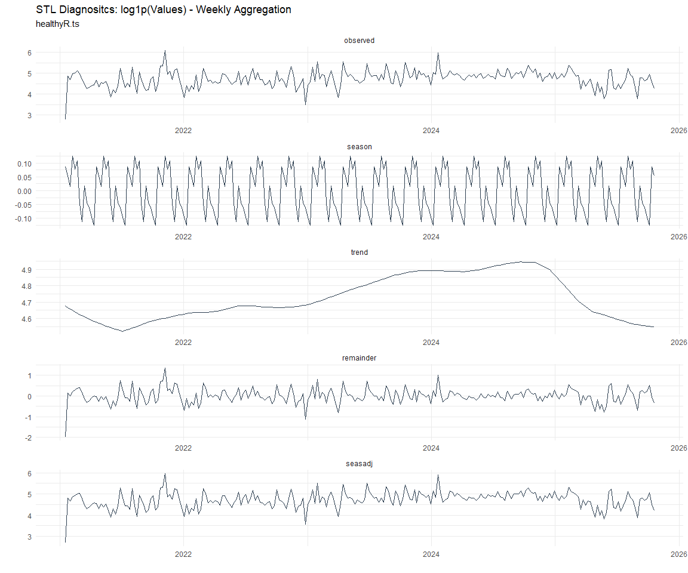

# Time Series Analysis, Modeling and Forecasting of the Healthyverse
Packages
Steven P. Sanderson II, MPH - Date:
2025-11-26

# Introduction

This analysis follows a *Nested Modeltime Workflow* from **`modeltime`**
along with using the **`NNS`** package. I use this to monitor the
downloads of all of my packages:

- [`healthyR`](https://www.spsanderson.com/healthyR/)
- [`healthyR.data`](https://www.spsanderson.com/healthyR.data/)
- [`healthyR.ts`](https://www.spsanderson.com/healthyR.ts/)
- [`healthyR.ai`](https://www.spsanderson.com/healthyR.ai/)
- [`healthyverse`](https://www.spsanderson.com/healthyverse/)
- [`TidyDensity`](https://www.spsanderson.com/TidyDensity/)
- [`tidyAML`](https://www.spsanderson.com/tidyAML/)
- [`RandomWalker`](https://www.spsanderson.com/RandomWalker/)

## Get Data

``` r
glimpse(downloads_tbl)
```

    Rows: 161,281
    Columns: 11
    $ date      <date> 2020-11-23, 2020-11-23, 2020-11-23, 2020-11-23, 2020-11-23,…
    $ time      <Period> 15H 36M 55S, 11H 26M 39S, 23H 34M 44S, 18H 39M 32S, 9H 0M…
    $ date_time <dttm> 2020-11-23 15:36:55, 2020-11-23 11:26:39, 2020-11-23 23:34:…
    $ size      <int> 4858294, 4858294, 4858301, 4858295, 361, 4863722, 4864794, 4…
    $ r_version <chr> NA, "4.0.3", "3.5.3", "3.5.2", NA, NA, NA, NA, NA, NA, NA, N…
    $ r_arch    <chr> NA, "x86_64", "x86_64", "x86_64", NA, NA, NA, NA, NA, NA, NA…
    $ r_os      <chr> NA, "mingw32", "mingw32", "linux-gnu", NA, NA, NA, NA, NA, N…
    $ package   <chr> "healthyR.data", "healthyR.data", "healthyR.data", "healthyR…
    $ version   <chr> "1.0.0", "1.0.0", "1.0.0", "1.0.0", "1.0.0", "1.0.0", "1.0.0…
    $ country   <chr> "US", "US", "US", "GB", "US", "US", "DE", "HK", "JP", "US", …
    $ ip_id     <int> 2069, 2804, 78827, 27595, 90474, 90474, 42435, 74, 7655, 638…

The last day in the data set is 2025-11-24 23:49:59, the file was
birthed on: 2022-07-02 23:58:17.511888, and at report knit time is
2.977986^{4} hours old. Happy analyzing!

Now that we have our data lets take a look at it using the `skimr`
package.

``` r
skim(downloads_tbl)
```

|                                                  |               |
|:-------------------------------------------------|:--------------|
| Name                                             | downloads_tbl |
| Number of rows                                   | 161281        |
| Number of columns                                | 11            |
| \_\_\_\_\_\_\_\_\_\_\_\_\_\_\_\_\_\_\_\_\_\_\_   |               |
| Column type frequency:                           |               |
| character                                        | 6             |
| Date                                             | 1             |
| numeric                                          | 2             |
| POSIXct                                          | 1             |
| Timespan                                         | 1             |
| \_\_\_\_\_\_\_\_\_\_\_\_\_\_\_\_\_\_\_\_\_\_\_\_ |               |
| Group variables                                  | None          |

Data summary

**Variable type: character**

| skim_variable | n_missing | complete_rate | min | max | empty | n_unique | whitespace |
|:--------------|----------:|--------------:|----:|----:|------:|---------:|-----------:|
| r_version     |    118334 |          0.27 |   5 |   7 |     0 |       50 |          0 |
| r_arch        |    118334 |          0.27 |   1 |   7 |     0 |        6 |          0 |
| r_os          |    118334 |          0.27 |   7 |  19 |     0 |       24 |          0 |
| package       |         0 |          1.00 |   7 |  13 |     0 |        8 |          0 |
| version       |         0 |          1.00 |   5 |  17 |     0 |       62 |          0 |
| country       |     15143 |          0.91 |   2 |   2 |     0 |      165 |          0 |

**Variable type: Date**

| skim_variable | n_missing | complete_rate | min | max | median | n_unique |
|:---|---:|---:|:---|:---|:---|---:|
| date | 0 | 1 | 2020-11-23 | 2025-11-24 | 2023-10-30 | 1821 |

**Variable type: numeric**

| skim_variable | n_missing | complete_rate | mean | sd | p0 | p25 | p50 | p75 | p100 | hist |
|:---|---:|---:|---:|---:|---:|---:|---:|---:|---:|:---|
| size | 0 | 1 | 1124377.06 | 1489469.89 | 355 | 27068 | 310114 | 2354900 | 5677952 | ▇▁▂▁▁ |
| ip_id | 0 | 1 | 11321.91 | 21982.44 | 1 | 224 | 2889 | 11961 | 299146 | ▇▁▁▁▁ |

**Variable type: POSIXct**

| skim_variable | n_missing | complete_rate | min | max | median | n_unique |
|:---|---:|---:|:---|:---|:---|---:|
| date_time | 0 | 1 | 2020-11-23 09:00:41 | 2025-11-24 23:49:59 | 2023-10-30 18:00:44 | 101594 |

**Variable type: Timespan**

| skim_variable | n_missing | complete_rate | min | max |     median | n_unique |
|:--------------|----------:|--------------:|----:|----:|-----------:|---------:|
| time          |         0 |             1 |   0 |  59 | 12H 6M 29S |       60 |

We can see that the following columns are missing a lot of data and for
us are most likely not useful anyways, so we will drop them
`c(r_version, r_arch, r_os)`

## Plots

Now lets take a look at a time-series plot of the total daily downloads
by package. We will use a log scale and place a vertical line at each
version release for each package.


    [[1]]


    [[2]]


    [[3]]


    [[4]]


    [[5]]


    [[6]]


    [[7]]


    [[8]]


Now lets take a look at some time series decomposition graphs.

    [[1]]


    [[2]]


    [[3]]


    [[4]]


    [[5]]


    [[6]]




    [[7]]


    [[8]]


    [[1]]


    [[2]]


    [[3]]


    [[4]]


    [[5]]


    [[6]]


    [[7]]


    [[8]]


Seasonal Diagnostics:

    [[1]]


    [[2]]


    [[3]]


    [[4]]


    [[5]]


    [[6]]


    [[7]]


    [[8]]


ACF and PACF Diagnostics:

    [[1]]


    [[2]]


    [[3]]


    [[4]]


    [[5]]


    [[6]]


    [[7]]


    [[8]]


## Feature Engineering

Now that we have our basic data and a shot of what it looks like, let’s
add some features to our data which can be very helpful in modeling.
Lets start by making a `tibble` that is aggregated by the day and
package, as we are going to be interested in forecasting the next 4
weeks or 28 days for each package. First lets get our base data.


    Call:
    stats::lm(formula = .formula, data = df)

    Residuals:
        Min      1Q  Median      3Q     Max 
    -145.87  -36.45  -11.32   27.12  819.54 

    Coefficients:
                                                         Estimate Std. Error
    (Intercept)                                        -1.910e+02  6.122e+01
    date                                                1.164e-02  3.247e-03
    lag(value, 1)                                       1.109e-01  2.330e-02
    lag(value, 7)                                       8.813e-02  2.402e-02
    lag(value, 14)                                      7.774e-02  2.397e-02
    lag(value, 21)                                      8.153e-02  2.406e-02
    lag(value, 28)                                      6.577e-02  2.402e-02
    lag(value, 35)                                      5.580e-02  2.405e-02
    lag(value, 42)                                      6.014e-02  2.417e-02
    lag(value, 49)                                      6.158e-02  2.407e-02
    month(date, label = TRUE).L                        -1.004e+01  5.064e+00
    month(date, label = TRUE).Q                         1.002e+00  5.001e+00
    month(date, label = TRUE).C                        -1.552e+01  5.022e+00
    month(date, label = TRUE)^4                        -6.130e+00  4.984e+00
    month(date, label = TRUE)^5                        -6.930e+00  4.936e+00
    month(date, label = TRUE)^6                         9.859e-01  4.944e+00
    month(date, label = TRUE)^7                        -4.780e+00  4.865e+00
    month(date, label = TRUE)^8                        -4.182e+00  4.831e+00
    month(date, label = TRUE)^9                         2.629e+00  4.838e+00
    month(date, label = TRUE)^10                        8.552e-01  4.853e+00
    month(date, label = TRUE)^11                       -4.050e+00  4.839e+00
    fourier_vec(date, type = "sin", K = 1, period = 7) -1.160e+01  2.228e+00
    fourier_vec(date, type = "cos", K = 1, period = 7)  7.314e+00  2.307e+00
                                                       t value Pr(>|t|)    
    (Intercept)                                         -3.120 0.001836 ** 
    date                                                 3.586 0.000345 ***
    lag(value, 1)                                        4.760 2.09e-06 ***
    lag(value, 7)                                        3.670 0.000250 ***
    lag(value, 14)                                       3.244 0.001202 ** 
    lag(value, 21)                                       3.388 0.000720 ***
    lag(value, 28)                                       2.738 0.006235 ** 
    lag(value, 35)                                       2.320 0.020439 *  
    lag(value, 42)                                       2.488 0.012956 *  
    lag(value, 49)                                       2.559 0.010586 *  
    month(date, label = TRUE).L                         -1.982 0.047637 *  
    month(date, label = TRUE).Q                          0.200 0.841178    
    month(date, label = TRUE).C                         -3.091 0.002029 ** 
    month(date, label = TRUE)^4                         -1.230 0.218896    
    month(date, label = TRUE)^5                         -1.404 0.160554    
    month(date, label = TRUE)^6                          0.199 0.841965    
    month(date, label = TRUE)^7                         -0.983 0.325904    
    month(date, label = TRUE)^8                         -0.866 0.386753    
    month(date, label = TRUE)^9                          0.543 0.586885    
    month(date, label = TRUE)^10                         0.176 0.860138    
    month(date, label = TRUE)^11                        -0.837 0.402758    
    fourier_vec(date, type = "sin", K = 1, period = 7)  -5.208 2.14e-07 ***
    fourier_vec(date, type = "cos", K = 1, period = 7)   3.170 0.001551 ** 
    ---
    Signif. codes:  0 '***' 0.001 '**' 0.01 '*' 0.05 '.' 0.1 ' ' 1

    Residual standard error: 59.36 on 1749 degrees of freedom
      (49 observations deleted due to missingness)
    Multiple R-squared:  0.2314,    Adjusted R-squared:  0.2217 
    F-statistic: 23.93 on 22 and 1749 DF,  p-value: < 2.2e-16


## NNS Forecasting

This is something I have been wanting to try for a while. The `NNS`
package is a great package for forecasting time series data.

[NNS GitHub](https://github.com/OVVO-Financial/NNS)

``` r
library(NNS)

data_list <- base_data |>
    select(package, value) |>
    group_split(package)

data_list |>
    imap(
        \(x, idx) {
            obj <- x
            x <- obj |> pull(value) |> tail(7*52)
            train_set_size <- length(x) - 56
            pkg <- obj |> pluck(1) |> unique()
#            sf <- NNS.seas(x, modulo = 7, plot = FALSE)$periods
            seas <- t(
                sapply(
                    1:25, 
                    function(i) c(
                        i,
                        sqrt(
                            mean((
                                NNS.ARMA(x, 
                                         h = 28, 
                                         training.set = train_set_size, 
                                         method = "lin", 
                                         seasonal.factor = i, 
                                         plot=FALSE
                                         ) - tail(x, 28)) ^ 2)))
                    )
                )
            colnames(seas) <- c("Period", "RMSE")
            sf <- seas[which.min(seas[, 2]), 1]
            
            cat(paste0("Package: ", pkg, "\n"))
            NNS.ARMA.optim(
                variable = x,
                h = 28,
                training.set = train_set_size,
                #seasonal.factor = seq(12, 60, 7),
                seasonal.factor = sf,
                pred.int = 0.95,
                plot = TRUE
            )
            title(
                sub = paste0("\n",
                             "Package: ", pkg, " - NNS Optimization")
            )
        }
    )
```

    Package: healthyR
    [1] "CURRNET METHOD: lin"
    [1] "COPY LATEST PARAMETERS DIRECTLY FOR NNS.ARMA() IF ERROR:"
    [1] "NNS.ARMA(... method =  'lin' , seasonal.factor =  c( 12 ) ...)"
    [1] "CURRENT lin OBJECTIVE FUNCTION = 5.95733489475418"
    [1] "BEST method = 'lin' PATH MEMBER = c( 12 )"
    [1] "BEST lin OBJECTIVE FUNCTION = 5.95733489475418"
    [1] "CURRNET METHOD: nonlin"
    [1] "COPY LATEST PARAMETERS DIRECTLY FOR NNS.ARMA() IF ERROR:"
    [1] "NNS.ARMA(... method =  'nonlin' , seasonal.factor =  c( 12 ) ...)"
    [1] "CURRENT nonlin OBJECTIVE FUNCTION = 7.36887760102778"
    [1] "BEST method = 'nonlin' PATH MEMBER = c( 12 )"
    [1] "BEST nonlin OBJECTIVE FUNCTION = 7.36887760102778"
    [1] "CURRNET METHOD: both"
    [1] "COPY LATEST PARAMETERS DIRECTLY FOR NNS.ARMA() IF ERROR:"
    [1] "NNS.ARMA(... method =  'both' , seasonal.factor =  c( 12 ) ...)"
    [1] "CURRENT both OBJECTIVE FUNCTION = 5.57222630440943"
    [1] "BEST method = 'both' PATH MEMBER = c( 12 )"
    [1] "BEST both OBJECTIVE FUNCTION = 5.57222630440943"


    Package: healthyR.ai
    [1] "CURRNET METHOD: lin"
    [1] "COPY LATEST PARAMETERS DIRECTLY FOR NNS.ARMA() IF ERROR:"
    [1] "NNS.ARMA(... method =  'lin' , seasonal.factor =  c( 6 ) ...)"
    [1] "CURRENT lin OBJECTIVE FUNCTION = 22.54059533424"
    [1] "BEST method = 'lin' PATH MEMBER = c( 6 )"
    [1] "BEST lin OBJECTIVE FUNCTION = 22.54059533424"
    [1] "CURRNET METHOD: nonlin"
    [1] "COPY LATEST PARAMETERS DIRECTLY FOR NNS.ARMA() IF ERROR:"
    [1] "NNS.ARMA(... method =  'nonlin' , seasonal.factor =  c( 6 ) ...)"
    [1] "CURRENT nonlin OBJECTIVE FUNCTION = 10.4013716283794"
    [1] "BEST method = 'nonlin' PATH MEMBER = c( 6 )"
    [1] "BEST nonlin OBJECTIVE FUNCTION = 10.4013716283794"
    [1] "CURRNET METHOD: both"
    [1] "COPY LATEST PARAMETERS DIRECTLY FOR NNS.ARMA() IF ERROR:"
    [1] "NNS.ARMA(... method =  'both' , seasonal.factor =  c( 6 ) ...)"
    [1] "CURRENT both OBJECTIVE FUNCTION = 21.7162022067252"
    [1] "BEST method = 'both' PATH MEMBER = c( 6 )"
    [1] "BEST both OBJECTIVE FUNCTION = 21.7162022067252"


    Package: healthyR.data
    [1] "CURRNET METHOD: lin"
    [1] "COPY LATEST PARAMETERS DIRECTLY FOR NNS.ARMA() IF ERROR:"
    [1] "NNS.ARMA(... method =  'lin' , seasonal.factor =  c( 1 ) ...)"
    [1] "CURRENT lin OBJECTIVE FUNCTION = 2512.84320959355"
    [1] "BEST method = 'lin' PATH MEMBER = c( 1 )"
    [1] "BEST lin OBJECTIVE FUNCTION = 2512.84320959355"
    [1] "CURRNET METHOD: nonlin"
    [1] "COPY LATEST PARAMETERS DIRECTLY FOR NNS.ARMA() IF ERROR:"
    [1] "NNS.ARMA(... method =  'nonlin' , seasonal.factor =  c( 1 ) ...)"
    [1] "CURRENT nonlin OBJECTIVE FUNCTION = 102.845849348489"
    [1] "BEST method = 'nonlin' PATH MEMBER = c( 1 )"
    [1] "BEST nonlin OBJECTIVE FUNCTION = 102.845849348489"
    [1] "CURRNET METHOD: both"
    [1] "COPY LATEST PARAMETERS DIRECTLY FOR NNS.ARMA() IF ERROR:"
    [1] "NNS.ARMA(... method =  'both' , seasonal.factor =  c( 1 ) ...)"
    [1] "CURRENT both OBJECTIVE FUNCTION = 76.119728480367"
    [1] "BEST method = 'both' PATH MEMBER = c( 1 )"
    [1] "BEST both OBJECTIVE FUNCTION = 76.119728480367"


    Package: healthyR.ts
    [1] "CURRNET METHOD: lin"
    [1] "COPY LATEST PARAMETERS DIRECTLY FOR NNS.ARMA() IF ERROR:"
    [1] "NNS.ARMA(... method =  'lin' , seasonal.factor =  c( 11 ) ...)"
    [1] "CURRENT lin OBJECTIVE FUNCTION = 19.469767463053"
    [1] "BEST method = 'lin' PATH MEMBER = c( 11 )"
    [1] "BEST lin OBJECTIVE FUNCTION = 19.469767463053"
    [1] "CURRNET METHOD: nonlin"
    [1] "COPY LATEST PARAMETERS DIRECTLY FOR NNS.ARMA() IF ERROR:"
    [1] "NNS.ARMA(... method =  'nonlin' , seasonal.factor =  c( 11 ) ...)"
    [1] "CURRENT nonlin OBJECTIVE FUNCTION = 11.2259600933533"
    [1] "BEST method = 'nonlin' PATH MEMBER = c( 11 )"
    [1] "BEST nonlin OBJECTIVE FUNCTION = 11.2259600933533"
    [1] "CURRNET METHOD: both"
    [1] "COPY LATEST PARAMETERS DIRECTLY FOR NNS.ARMA() IF ERROR:"
    [1] "NNS.ARMA(... method =  'both' , seasonal.factor =  c( 11 ) ...)"
    [1] "CURRENT both OBJECTIVE FUNCTION = 13.4471510624972"
    [1] "BEST method = 'both' PATH MEMBER = c( 11 )"
    [1] "BEST both OBJECTIVE FUNCTION = 13.4471510624972"


    Package: healthyverse
    [1] "CURRNET METHOD: lin"
    [1] "COPY LATEST PARAMETERS DIRECTLY FOR NNS.ARMA() IF ERROR:"
    [1] "NNS.ARMA(... method =  'lin' , seasonal.factor =  c( 12 ) ...)"
    [1] "CURRENT lin OBJECTIVE FUNCTION = 4.98892943385331"
    [1] "BEST method = 'lin' PATH MEMBER = c( 12 )"
    [1] "BEST lin OBJECTIVE FUNCTION = 4.98892943385331"
    [1] "CURRNET METHOD: nonlin"
    [1] "COPY LATEST PARAMETERS DIRECTLY FOR NNS.ARMA() IF ERROR:"
    [1] "NNS.ARMA(... method =  'nonlin' , seasonal.factor =  c( 12 ) ...)"
    [1] "CURRENT nonlin OBJECTIVE FUNCTION = 8.41929555558362"
    [1] "BEST method = 'nonlin' PATH MEMBER = c( 12 )"
    [1] "BEST nonlin OBJECTIVE FUNCTION = 8.41929555558362"
    [1] "CURRNET METHOD: both"
    [1] "COPY LATEST PARAMETERS DIRECTLY FOR NNS.ARMA() IF ERROR:"
    [1] "NNS.ARMA(... method =  'both' , seasonal.factor =  c( 12 ) ...)"
    [1] "CURRENT both OBJECTIVE FUNCTION = 6.0465702160831"
    [1] "BEST method = 'both' PATH MEMBER = c( 12 )"
    [1] "BEST both OBJECTIVE FUNCTION = 6.0465702160831"


    Package: RandomWalker
    [1] "CURRNET METHOD: lin"
    [1] "COPY LATEST PARAMETERS DIRECTLY FOR NNS.ARMA() IF ERROR:"
    [1] "NNS.ARMA(... method =  'lin' , seasonal.factor =  c( 14 ) ...)"
    [1] "CURRENT lin OBJECTIVE FUNCTION = 5.26475000812472"
    [1] "BEST method = 'lin' PATH MEMBER = c( 14 )"
    [1] "BEST lin OBJECTIVE FUNCTION = 5.26475000812472"
    [1] "CURRNET METHOD: nonlin"
    [1] "COPY LATEST PARAMETERS DIRECTLY FOR NNS.ARMA() IF ERROR:"
    [1] "NNS.ARMA(... method =  'nonlin' , seasonal.factor =  c( 14 ) ...)"
    [1] "CURRENT nonlin OBJECTIVE FUNCTION = 5.53796861249714"
    [1] "BEST method = 'nonlin' PATH MEMBER = c( 14 )"
    [1] "BEST nonlin OBJECTIVE FUNCTION = 5.53796861249714"
    [1] "CURRNET METHOD: both"
    [1] "COPY LATEST PARAMETERS DIRECTLY FOR NNS.ARMA() IF ERROR:"
    [1] "NNS.ARMA(... method =  'both' , seasonal.factor =  c( 14 ) ...)"
    [1] "CURRENT both OBJECTIVE FUNCTION = 4.73709519604234"
    [1] "BEST method = 'both' PATH MEMBER = c( 14 )"
    [1] "BEST both OBJECTIVE FUNCTION = 4.73709519604234"


    Package: tidyAML
    [1] "CURRNET METHOD: lin"
    [1] "COPY LATEST PARAMETERS DIRECTLY FOR NNS.ARMA() IF ERROR:"
    [1] "NNS.ARMA(... method =  'lin' , seasonal.factor =  c( 10 ) ...)"
    [1] "CURRENT lin OBJECTIVE FUNCTION = 50.9046254710883"
    [1] "BEST method = 'lin' PATH MEMBER = c( 10 )"
    [1] "BEST lin OBJECTIVE FUNCTION = 50.9046254710883"
    [1] "CURRNET METHOD: nonlin"
    [1] "COPY LATEST PARAMETERS DIRECTLY FOR NNS.ARMA() IF ERROR:"
    [1] "NNS.ARMA(... method =  'nonlin' , seasonal.factor =  c( 10 ) ...)"
    [1] "CURRENT nonlin OBJECTIVE FUNCTION = 15.4817890891716"
    [1] "BEST method = 'nonlin' PATH MEMBER = c( 10 )"
    [1] "BEST nonlin OBJECTIVE FUNCTION = 15.4817890891716"
    [1] "CURRNET METHOD: both"
    [1] "COPY LATEST PARAMETERS DIRECTLY FOR NNS.ARMA() IF ERROR:"
    [1] "NNS.ARMA(... method =  'both' , seasonal.factor =  c( 10 ) ...)"
    [1] "CURRENT both OBJECTIVE FUNCTION = 23.5258646024169"
    [1] "BEST method = 'both' PATH MEMBER = c( 10 )"
    [1] "BEST both OBJECTIVE FUNCTION = 23.5258646024169"


    Package: TidyDensity
    [1] "CURRNET METHOD: lin"
    [1] "COPY LATEST PARAMETERS DIRECTLY FOR NNS.ARMA() IF ERROR:"
    [1] "NNS.ARMA(... method =  'lin' , seasonal.factor =  c( 16 ) ...)"
    [1] "CURRENT lin OBJECTIVE FUNCTION = 10.5159816976464"
    [1] "BEST method = 'lin' PATH MEMBER = c( 16 )"
    [1] "BEST lin OBJECTIVE FUNCTION = 10.5159816976464"
    [1] "CURRNET METHOD: nonlin"
    [1] "COPY LATEST PARAMETERS DIRECTLY FOR NNS.ARMA() IF ERROR:"
    [1] "NNS.ARMA(... method =  'nonlin' , seasonal.factor =  c( 16 ) ...)"
    [1] "CURRENT nonlin OBJECTIVE FUNCTION = 10.990403240886"
    [1] "BEST method = 'nonlin' PATH MEMBER = c( 16 )"
    [1] "BEST nonlin OBJECTIVE FUNCTION = 10.990403240886"
    [1] "CURRNET METHOD: both"
    [1] "COPY LATEST PARAMETERS DIRECTLY FOR NNS.ARMA() IF ERROR:"
    [1] "NNS.ARMA(... method =  'both' , seasonal.factor =  c( 16 ) ...)"
    [1] "CURRENT both OBJECTIVE FUNCTION = 9.09410506832649"
    [1] "BEST method = 'both' PATH MEMBER = c( 16 )"
    [1] "BEST both OBJECTIVE FUNCTION = 9.09410506832649"


    [[1]]
    NULL

    [[2]]
    NULL

    [[3]]
    NULL

    [[4]]
    NULL

    [[5]]
    NULL

    [[6]]
    NULL

    [[7]]
    NULL

    [[8]]
    NULL

## Pre-Processing

Now we are going to do some basic pre-processing.

``` r
data_padded_tbl <- base_data %>%
  pad_by_time(
    .date_var  = date,
    .pad_value = 0
  )

# Get log interval and standardization parameters
log_params  <- liv(data_padded_tbl$value, limit_lower = 0, offset = 1, silent = TRUE)
limit_lower <- log_params$limit_lower
limit_upper <- log_params$limit_upper
offset      <- log_params$offset

data_liv_tbl <- data_padded_tbl %>%
  # Get log interval transform
  mutate(value_trans = liv(value, limit_lower = 0, offset = 1, silent = TRUE)$log_scaled)

# Get Standardization Params
std_params <- standard_vec(data_liv_tbl$value_trans, silent = TRUE)
std_mean   <- std_params$mean
std_sd     <- std_params$sd

data_transformed_tbl <- data_liv_tbl %>%
  group_by(package) %>%
  # get standardization
  mutate(value_trans = standard_vec(value_trans, silent = TRUE)$standard_scaled) %>%
  tk_augment_fourier(
    .date_var = date,
    .periods  = c(7, 14, 30, 90, 180),
    .K        = 2
  ) %>%
  tk_augment_timeseries_signature(
    .date_var = date
  ) %>%
  ungroup() %>%
  select(-c(value, -year.iso))
```

Since this is panel data we can follow one of two different modeling
strategies. We can search for a global model in the panel data or we can
use nested forecasting finding the best model for each of the time
series. Since we only have 5 panels, we will use nested forecasting.

To do this we will use the `nest_timeseries` and
`split_nested_timeseries` functions to create a nested `tibble`.

``` r
horizon <- 4*7

nested_data_tbl <- data_transformed_tbl %>%

    # 0. Filter out column where package is NA
    filter(!is.na(package)) %>%
    
    # 1. Extending: We'll predict n days into the future.
    extend_timeseries(
        .id_var        = package,
        .date_var      = date,
        .length_future = horizon
    ) %>%
    
    # 2. Nesting: We'll group by id, and create a future dataset
    #    that forecasts n days of extended data and
    #    an actual dataset that contains n*2 days
    nest_timeseries(
        .id_var        = package,
        .length_future = horizon
        #.length_actual = horizon*2
    ) %>%
    
   # 3. Splitting: We'll take the actual data and create splits
   #    for accuracy and confidence interval estimation of n das (test)
   #    and the rest is training data
    split_nested_timeseries(
        .length_test = horizon
    )

nested_data_tbl
```

    # A tibble: 8 × 4
      package       .actual_data          .future_data       .splits          
      <fct>         <list>                <list>             <list>           
    1 healthyR.data <tibble [1,813 × 50]> <tibble [28 × 50]> <split [1785|28]>
    2 healthyR      <tibble [1,804 × 50]> <tibble [28 × 50]> <split [1776|28]>
    3 healthyR.ts   <tibble [1,749 × 50]> <tibble [28 × 50]> <split [1721|28]>
    4 healthyverse  <tibble [1,720 × 50]> <tibble [28 × 50]> <split [1692|28]>
    5 healthyR.ai   <tibble [1,546 × 50]> <tibble [28 × 50]> <split [1518|28]>
    6 TidyDensity   <tibble [1,397 × 50]> <tibble [28 × 50]> <split [1369|28]>
    7 tidyAML       <tibble [1,004 × 50]> <tibble [28 × 50]> <split [976|28]> 
    8 RandomWalker  <tibble [427 × 50]>   <tibble [28 × 50]> <split [399|28]> 

Now it is time to make some recipes and models using the modeltime
workflow.

## Modeltime Workflow

### Recipe Object

``` r
recipe_base <- recipe(
  value_trans ~ .
  , data = extract_nested_test_split(nested_data_tbl)
  )

recipe_base

recipe_date <- recipe(
  value_trans ~ date
  , data = extract_nested_test_split(nested_data_tbl)
  )
```

### Models

``` r
# Models ------------------------------------------------------------------

# Auto ARIMA --------------------------------------------------------------

model_spec_arima_no_boost <- arima_reg() %>%
  set_engine(engine = "auto_arima")

wflw_auto_arima <- workflow() %>%
  add_recipe(recipe = recipe_date) %>%
  add_model(model_spec_arima_no_boost)

# NNETAR ------------------------------------------------------------------

model_spec_nnetar <- nnetar_reg(
  mode              = "regression"
  , seasonal_period = "auto"
) %>%
  set_engine("nnetar")

wflw_nnetar <- workflow() %>%
  add_recipe(recipe = recipe_base) %>%
  add_model(model_spec_nnetar)

# TSLM --------------------------------------------------------------------

model_spec_lm <- linear_reg() %>%
  set_engine("lm")

wflw_lm <- workflow() %>%
  add_recipe(recipe = recipe_base) %>%
  add_model(model_spec_lm)

# MARS --------------------------------------------------------------------

model_spec_mars <- mars(mode = "regression") %>%
  set_engine("earth")

wflw_mars <- workflow() %>%
  add_recipe(recipe = recipe_date) %>%
  add_model(model_spec_mars)
```

### Nested Modeltime Tables

``` r
nested_modeltime_tbl <- modeltime_nested_fit(
  # Nested Data
  nested_data = nested_data_tbl,
   control = control_nested_fit(
     verbose = TRUE,
     allow_par = FALSE
   ),
  # Add workflows
  wflw_auto_arima,
  wflw_lm,
  wflw_mars,
  wflw_nnetar
)
```

``` r
nested_modeltime_tbl <- nested_modeltime_tbl[!is.na(nested_modeltime_tbl$package),]
```

### Model Accuracy

``` r
nested_modeltime_tbl %>%
  extract_nested_test_accuracy() %>%
  filter(!is.na(package)) %>%
  knitr::kable()
```

| package | .model_id | .model_desc | .type | mae | mape | mase | smape | rmse | rsq |
|:---|---:|:---|:---|---:|---:|---:|---:|---:|---:|
| healthyR.data | 1 | ARIMA | Test | 0.7807817 | 105.13866 | 0.6538378 | 158.4458 | 0.9691104 | 0.2164486 |
| healthyR.data | 2 | LM | Test | 0.8068847 | 160.08798 | 0.6756968 | 140.5044 | 0.9190913 | 0.0195537 |
| healthyR.data | 3 | EARTH | Test | 0.8401953 | 95.89508 | 0.7035916 | 174.3560 | 1.0012730 | 0.0468646 |
| healthyR.data | 4 | NNAR | Test | 0.8177501 | 179.60121 | 0.6847956 | 148.2270 | 0.9042544 | 0.0526419 |
| healthyR | 1 | ARIMA | Test | 0.8307935 | 124.33199 | 0.7865419 | 167.3751 | 1.0932373 | 0.1862862 |
| healthyR | 2 | LM | Test | 0.7976599 | 335.85071 | 0.7551732 | 134.4735 | 0.9830141 | 0.0695386 |
| healthyR | 3 | EARTH | Test | 0.9450659 | 206.32802 | 0.8947277 | 155.2843 | 1.2514366 | 0.0204724 |
| healthyR | 4 | NNAR | Test | 0.8343839 | 277.86261 | 0.7899411 | 141.9346 | 1.0596272 | 0.0258613 |
| healthyR.ts | 1 | ARIMA | Test | 0.5961539 | 106.85403 | 0.4963655 | 124.1593 | 0.8700359 | 0.2907571 |
| healthyR.ts | 2 | LM | Test | 0.8560500 | 336.11162 | 0.7127584 | 162.1722 | 1.0844147 | 0.0003069 |
| healthyR.ts | 3 | EARTH | Test | 0.6800584 | 133.42463 | 0.5662254 | 149.4374 | 0.9427327 | 0.0000860 |
| healthyR.ts | 4 | NNAR | Test | 0.8662574 | 436.03643 | 0.7212572 | 162.2909 | 1.0610323 | 0.0346056 |
| healthyverse | 1 | ARIMA | Test | 0.7830762 | 97.10340 | 1.0081897 | 162.2372 | 1.0447361 | 0.0148398 |
| healthyverse | 2 | LM | Test | 0.8882267 | 202.02771 | 1.1435682 | 152.5954 | 1.0279319 | 0.0005914 |
| healthyverse | 3 | EARTH | Test | 0.7352304 | 244.66890 | 0.9465895 | 109.5570 | 0.8649184 | 0.1495365 |
| healthyverse | 4 | NNAR | Test | 0.8011659 | 155.14662 | 1.0314797 | 137.7226 | 0.9889638 | 0.0276803 |
| healthyR.ai | 1 | ARIMA | Test | 0.7206644 | 102.76530 | 0.8676642 | 190.2420 | 0.9629315 | 0.0511344 |
| healthyR.ai | 2 | LM | Test | 0.8857638 | 178.53364 | 1.0664402 | 164.6116 | 1.0628560 | 0.0261865 |
| healthyR.ai | 3 | EARTH | Test | 0.6240607 | 99.86305 | 0.7513554 | 102.4851 | 0.9079065 | 0.2801793 |
| healthyR.ai | 4 | NNAR | Test | 0.9320661 | 182.88409 | 1.1221872 | 161.8682 | 1.1379233 | 0.0000772 |
| TidyDensity | 1 | ARIMA | Test | 0.9024204 | 232.36366 | 0.5461928 | 130.8825 | 1.0812677 | 0.4257812 |
| TidyDensity | 2 | LM | Test | 0.9723478 | 134.04657 | 0.5885165 | 150.1900 | 1.1527747 | 0.0235816 |
| TidyDensity | 3 | EARTH | Test | 2.3215969 | 691.05833 | 1.4051538 | 151.7616 | 2.6743066 | 0.0125215 |
| TidyDensity | 4 | NNAR | Test | 1.0172798 | 177.51964 | 0.6157118 | 151.3649 | 1.1714964 | 0.0115781 |
| tidyAML | 1 | ARIMA | Test | 0.8896435 | 169.44132 | 1.0424294 | 163.3396 | 1.1027407 | 0.0007354 |
| tidyAML | 2 | LM | Test | 0.7075449 | 182.21442 | 0.8290575 | 132.0522 | 0.8623576 | 0.0974132 |
| tidyAML | 3 | EARTH | Test | 0.8906422 | 150.02127 | 1.0435997 | 161.1079 | 1.1035273 | 0.0320559 |
| tidyAML | 4 | NNAR | Test | 0.7304734 | 179.05090 | 0.8559238 | 127.1574 | 0.9224578 | 0.0847112 |
| RandomWalker | 1 | ARIMA | Test | 0.7823060 | 111.06059 | 0.6039389 | 154.8778 | 0.8707625 | 0.3203946 |
| RandomWalker | 2 | LM | Test | 0.9327498 | 169.60920 | 0.7200812 | 158.4016 | 1.0024526 | 0.0011163 |
| RandomWalker | 3 | EARTH | Test | 0.9409635 | 161.82703 | 0.7264221 | 153.3243 | 1.0006407 | 0.0102778 |
| RandomWalker | 4 | NNAR | Test | 1.0946287 | 212.96973 | 0.8450515 | 149.2471 | 1.2001023 | 0.0651345 |

### Plot Models

``` r
nested_modeltime_tbl %>%
  extract_nested_test_forecast() %>%
  group_by(package) %>%
  filter_by_time(.date_var = .index, .start_date = max(.index) - 60) %>%
  ungroup() %>%
  plot_modeltime_forecast(
    .interactive = FALSE,
    .conf_interval_show  = FALSE,
    .facet_scales = "free"
  ) +
  theme_minimal() +
  facet_wrap(~ package, nrow = 3) +
  theme(legend.position = "bottom")
```


### Best Model

``` r
best_nested_modeltime_tbl <- nested_modeltime_tbl %>%
  modeltime_nested_select_best(
    metric = "rmse",
    minimize = TRUE,
    filter_test_forecasts = TRUE
  )

best_nested_modeltime_tbl %>%
  extract_nested_best_model_report()
```

    # Nested Modeltime Table
      

    # A tibble: 8 × 10
      package       .model_id .model_desc .type   mae  mape  mase smape  rmse    rsq
      <fct>             <int> <chr>       <chr> <dbl> <dbl> <dbl> <dbl> <dbl>  <dbl>
    1 healthyR.data         4 NNAR        Test  0.818 180.  0.685  148. 0.904 0.0526
    2 healthyR              2 LM          Test  0.798 336.  0.755  134. 0.983 0.0695
    3 healthyR.ts           1 ARIMA       Test  0.596 107.  0.496  124. 0.870 0.291 
    4 healthyverse          3 EARTH       Test  0.735 245.  0.947  110. 0.865 0.150 
    5 healthyR.ai           3 EARTH       Test  0.624  99.9 0.751  102. 0.908 0.280 
    6 TidyDensity           1 ARIMA       Test  0.902 232.  0.546  131. 1.08  0.426 
    7 tidyAML               2 LM          Test  0.708 182.  0.829  132. 0.862 0.0974
    8 RandomWalker          1 ARIMA       Test  0.782 111.  0.604  155. 0.871 0.320 

``` r
best_nested_modeltime_tbl %>%
  extract_nested_test_forecast() %>%
  #filter(!is.na(.model_id)) %>%
  group_by(package) %>%
  filter_by_time(.date_var = .index, .start_date = max(.index) - 60) %>%
  ungroup() %>%
  plot_modeltime_forecast(
    .interactive = FALSE,
    .conf_interval_alpha = 0.2,
    .facet_scales = "free"
  ) +
  facet_wrap(~ package, nrow = 3) +
  theme_minimal() +
  theme(legend.position = "bottom")
```


## Refitting and Future Forecast

Now that we have the best models, we can make our future forecasts.

``` r
nested_modeltime_refit_tbl <- best_nested_modeltime_tbl %>%
    modeltime_nested_refit(
        control = control_nested_refit(verbose = TRUE)
    )
```

``` r
nested_modeltime_refit_tbl
```

    # Nested Modeltime Table
      

    # A tibble: 8 × 5
      package       .actual_data .future_data .splits           .modeltime_tables 
      <fct>         <list>       <list>       <list>            <list>            
    1 healthyR.data <tibble>     <tibble>     <split [1785|28]> <mdl_tm_t [1 × 5]>
    2 healthyR      <tibble>     <tibble>     <split [1776|28]> <mdl_tm_t [1 × 5]>
    3 healthyR.ts   <tibble>     <tibble>     <split [1721|28]> <mdl_tm_t [1 × 5]>
    4 healthyverse  <tibble>     <tibble>     <split [1692|28]> <mdl_tm_t [1 × 5]>
    5 healthyR.ai   <tibble>     <tibble>     <split [1518|28]> <mdl_tm_t [1 × 5]>
    6 TidyDensity   <tibble>     <tibble>     <split [1369|28]> <mdl_tm_t [1 × 5]>
    7 tidyAML       <tibble>     <tibble>     <split [976|28]>  <mdl_tm_t [1 × 5]>
    8 RandomWalker  <tibble>     <tibble>     <split [399|28]>  <mdl_tm_t [1 × 5]>

``` r
nested_modeltime_refit_tbl %>%
  extract_nested_future_forecast() %>%
  group_by(package) %>%
  mutate(across(.value:.conf_hi, .fns = ~ standard_inv_vec(
    x    = .,
    mean = std_mean,
    sd   = std_sd
  )$standard_inverse_value)) %>%
  mutate(across(.value:.conf_hi, .fns = ~ liiv(
    x = .,
    limit_lower = limit_lower,
    limit_upper = limit_upper,
    offset      = offset
  )$rescaled_v)) %>%
  filter_by_time(.date_var = .index, .start_date = max(.index) - 60) %>%
  ungroup() %>%
  plot_modeltime_forecast(
    .interactive = FALSE,
    .conf_interval_alpha = 0.2,
    .facet_scales = "free"
  ) +
  facet_wrap(~ package, nrow = 3) +
  theme_minimal() +
  theme(legend.position = "bottom")
```


