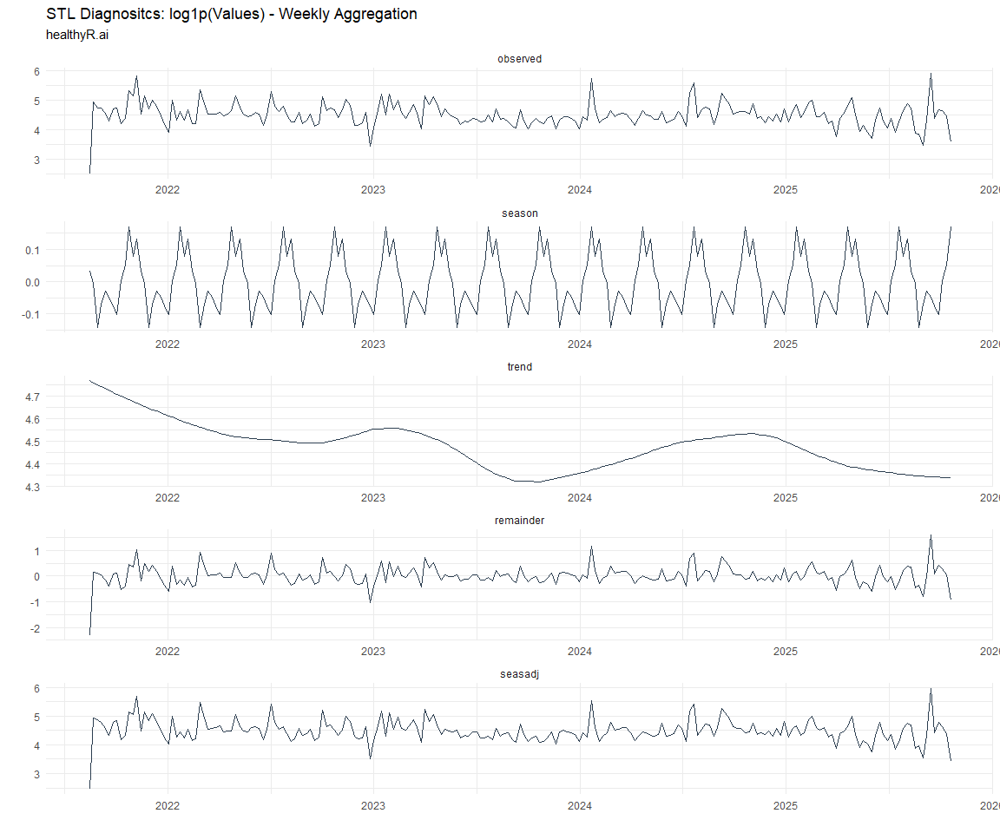

Time Series Analysis and Modeling of the Healthyverse Packages
================
Steven P. Sanderson II, MPH - Data Scientist/IT Manager
02 January, 2022

## Get Data

``` r
glimpse(downloads_tbl)
```

    ## Rows: 26,137
    ## Columns: 11
    ## $ date      <date> 2020-11-23, 2020-11-23, 2020-11-23, 2020-11-23, 2020-11-23,~
    ## $ time      <Period> 15H 36M 55S, 11H 26M 39S, 23H 34M 44S, 18H 39M 32S, 9H 0M~
    ## $ date_time <dttm> 2020-11-23 15:36:55, 2020-11-23 11:26:39, 2020-11-23 23:34:~
    ## $ size      <int> 4858294, 4858294, 4858301, 4858295, 361, 4863722, 4864794, 4~
    ## $ r_version <chr> NA, "4.0.3", "3.5.3", "3.5.2", NA, NA, NA, NA, NA, NA, NA, N~
    ## $ r_arch    <chr> NA, "x86_64", "x86_64", "x86_64", NA, NA, NA, NA, NA, NA, NA~
    ## $ r_os      <chr> NA, "mingw32", "mingw32", "linux-gnu", NA, NA, NA, NA, NA, N~
    ## $ package   <chr> "healthyR.data", "healthyR.data", "healthyR.data", "healthyR~
    ## $ version   <chr> "1.0.0", "1.0.0", "1.0.0", "1.0.0", "1.0.0", "1.0.0", "1.0.0~
    ## $ country   <chr> "US", "US", "US", "GB", "US", "US", "DE", "HK", "JP", "US", ~
    ## $ ip_id     <int> 2069, 2804, 78827, 27595, 90474, 90474, 42435, 74, 7655, 638~

The last day in the data set is 2021-12-31 12:12:07, the file was
birthed on: 2021-11-29 11:38:26, and at report knit time is -763.56
hours old. Happy analyzing!

Now that we have our data lets take a look at it using the `skimr`
package.

``` r
skim(downloads_tbl)
```

|                                                  |                |
|:-------------------------------------------------|:---------------|
| Name                                             | downloads\_tbl |
| Number of rows                                   | 26137          |
| Number of columns                                | 11             |
| \_\_\_\_\_\_\_\_\_\_\_\_\_\_\_\_\_\_\_\_\_\_\_   |                |
| Column type frequency:                           |                |
| character                                        | 6              |
| Date                                             | 1              |
| numeric                                          | 2              |
| POSIXct                                          | 1              |
| Timespan                                         | 1              |
| \_\_\_\_\_\_\_\_\_\_\_\_\_\_\_\_\_\_\_\_\_\_\_\_ |                |
| Group variables                                  | None           |

Data summary

**Variable type: character**

| skim\_variable | n\_missing | complete\_rate | min | max | empty | n\_unique | whitespace |
|:---------------|-----------:|---------------:|----:|----:|------:|----------:|-----------:|
| r\_version     |      17528 |           0.33 |   5 |   5 |     0 |        29 |          0 |
| r\_arch        |      17528 |           0.33 |   3 |   7 |     0 |         5 |          0 |
| r\_os          |      17528 |           0.33 |   7 |  15 |     0 |        10 |          0 |
| package        |          0 |           1.00 |   8 |  13 |     0 |         5 |          0 |
| version        |          0 |           1.00 |   5 |   5 |     0 |        14 |          0 |
| country        |       2215 |           0.92 |   2 |   2 |     0 |        99 |          0 |

**Variable type: Date**

| skim\_variable | n\_missing | complete\_rate | min        | max        | median     | n\_unique |
|:---------------|-----------:|---------------:|:-----------|:-----------|:-----------|----------:|
| date           |          0 |              1 | 2020-11-23 | 2021-12-31 | 2021-08-04 |       404 |

**Variable type: numeric**

| skim\_variable | n\_missing | complete\_rate |       mean |         sd |  p0 |   p25 |    p50 |     p75 |    p100 | hist  |
|:---------------|-----------:|---------------:|-----------:|-----------:|----:|------:|-------:|--------:|--------:|:------|
| size           |          0 |              1 | 1528493.95 | 1877908.51 | 357 | 17597 | 238433 | 3246404 | 5677952 | ▇▁▂▂▁ |
| ip\_id         |          0 |              1 |    8028.44 |   15248.45 |   1 |   202 |   2806 |    8199 |  143633 | ▇▁▁▁▁ |

**Variable type: POSIXct**

| skim\_variable | n\_missing | complete\_rate | min                 | max                 | median              | n\_unique |
|:---------------|-----------:|---------------:|:--------------------|:--------------------|:--------------------|----------:|
| date\_time     |          0 |              1 | 2020-11-23 09:00:41 | 2021-12-31 12:12:07 | 2021-08-04 06:17:34 |     15222 |

**Variable type: Timespan**

| skim\_variable | n\_missing | complete\_rate | min | max |      median | n\_unique |
|:---------------|-----------:|---------------:|----:|----:|------------:|----------:|
| time           |          0 |              1 |   0 |  59 | 10H 48M 42S |        60 |

We can see that the following columns are missing a lot of data and for
us are most likely not useful anyways, so we will drop them
`c(r_version, r_arch, r_os)`

## Plots

Now lets take a look at a time-series plot of the total daily downloads
by package. We will use a log scale and place a vertical line at each
version release for each package.

<!-- --><!-- -->

Now lets take a look at some time series decomposition graphs.

<!-- --><!-- --><!-- --><!-- -->

## Feature Engineering

Now that we have our basic data and a shot of what it looks like, let’s
add some features to our data which can be very helpful in modeling.
Lets start by making a `tibble` that is aggregated by the day and
package, as we are going to be interested in forecasting the next 4
weeks or 28 days for each package. First lets get our base data.

Now we are going to do some basic pre-processing.

``` r
data_padded_tbl <- base_data %>%
  pad_by_time(
    .date_var  = date,
    .pad_value = 0
  )

# Get log interval and standardization parameters
log_params  <- liv(data_padded_tbl$value, limit_lower = 0, offset = 1, silent = TRUE)
limit_lower <- log_params$limit_lower
limit_upper <- log_params$limit_upper
offset      <- log_params$offset

data_liv_tbl <- data_padded_tbl %>%
  # Get log interval transform
  mutate(value_trans = liv(value, limit_lower = 0, offset = 1, silent = TRUE)$log_scaled)

# Get Standardization Params
std_params <- standard_vec(data_liv_tbl$value_trans, silent = TRUE)
std_mean   <- std_params$mean
std_sd     <- std_params$sd

data_transformed_tbl <- data_liv_tbl %>%
  # get standardization
  mutate(value_trans = standard_vec(value_trans, silent = TRUE)$standard_scaled) %>%
  select(-value)
```

Now that we have our full data set and saved our parameters we can
create the full data set.

``` r
horizon         <- 4*7
lag_period      <- 4*7
rolling_periods <- c(7, 14, 28)

data_prepared_full_tbl <- data_transformed_tbl %>%
  group_by(package) %>%
  
  # Add future windows
  bind_rows(
    future_frame(., .date_var = date, .length_out = horizon)
  ) %>%
  
  # Add autocorolated lags
  tk_augment_lags(value_trans, .lags = lag_period) %>%
  
  # Add rolling features
  tk_augment_slidify(
    .value     = value_trans_lag28
    , .f       = median
    , .period  = rolling_periods
    , .align   = "center"
    , .partial = TRUE
  ) %>%
  
  # Format columns
  rename_with(.cols = contains("lag"), .fn = ~ str_c("lag_", .)) %>%
  select(date, package, everything()) %>%
  ungroup()

data_prepared_full_tbl %>% 
  group_by(package) %>% 
  pivot_longer(-c(date, package)) %>% 
  plot_time_series(
    .date_var = date
    , .value = value
    , .color_var = name
    , .smooth = FALSE
    , .interactive = FALSE
    , .facet_scales = "free"
  ) +
  theme_minimal() +
  theme(legend.position = "bottom")
```

<!-- -->

Since this is panel data we can follow one of two different modeling
strategies. We can search for a global model in the panel data or we can
use nested forecasting finding the best model for each of the time
series. Since we only have 5 panels, we will use nested forecasting.

To do this we will use the `nest_timeseries` and
`split_nested_timeseries` functions to create a nested `tibble`.

``` r
data_prepared_tbl <- data_prepared_full_tbl %>%
  filter(!is.na(value_trans))

forecast_tbl <- data_prepared_full_tbl %>%
  filter(is.na(value_trans))

nested_data_tbl <- data_prepared_tbl %>%
  nest_timeseries(
    .id_var = package
    , .length_future = horizon
  ) %>%
  split_nested_timeseries(
    .length_test = horizon
  )
```

Now it is time to make some recipes and models using the modeltime
workflow.

## Modeltime Workflow

### Recipe Object

``` r
recipe_base <- recipe(
  value_trans ~ .
  , data = extract_nested_test_split(nested_data_tbl)
  ) %>%
  step_mutate(yr = lubridate::year(date)) %>%
  step_harmonic(yr, frequency = 365/12, cycle_size = 1) %>%
  step_rm(yr) %>%
  step_hai_fourier(value_trans, scale_type = "sincos", period = 365/12, order = 1) %>%
  step_lag(value_trans, lag = 1) %>%
  step_impute_knn(contains("lag_"))

recipe_base
```

    ## Recipe
    ## 
    ## Inputs:
    ## 
    ##       role #variables
    ##    outcome          1
    ##  predictor          5
    ## 
    ## Operations:
    ## 
    ## Variable mutation
    ## Harmonic numeric variables for yr
    ## Delete terms yr
    ## Fourier transformation on value_trans
    ## Lagging value_trans
    ## K-nearest neighbor imputation for contains("lag_")

### Models

``` r
# Models ------------------------------------------------------------------

# Auto ARIMA --------------------------------------------------------------

model_spec_arima_no_boost <- arima_reg() %>%
  set_engine(engine = "auto_arima")

wflw_auto_arima <- workflow() %>%
  add_recipe(recipe = recipe_base) %>%
  add_model(model_spec_arima_no_boost)

# Boosted Auto ARIMA ------------------------------------------------------

model_spec_arima_boosted <- arima_boost(
  min_n = 2
  , learn_rate = 0.015
) %>%
  set_engine(engine = "auto_arima_xgboost")

wflw_arima_boosted <- workflow() %>%
  add_recipe(recipe = recipe_base) %>%
  add_model(model_spec_arima_boosted)

# ETS ---------------------------------------------------------------------

model_spec_ets <- exp_smoothing(
  seasonal_period = "auto",
  error = "auto",
  trend = "auto",
  season = "auto",
  damping = "auto"
) %>%
  set_engine(engine = "ets") 

wflw_ets <- workflow() %>%
  add_recipe(recipe = recipe_base) %>%
  add_model(model_spec_ets)

model_spec_croston <- exp_smoothing(
  seasonal_period = "auto",
  error = "auto",
  trend = "auto",
  season = "auto",
  damping = "auto"
) %>%
  set_engine(engine = "croston")

wflw_croston <- workflow() %>%
  add_recipe(recipe = recipe_base) %>%
  add_model(model_spec_croston)

model_spec_theta <- exp_smoothing(
  seasonal_period = "auto",
  error = "auto",
  trend = "auto",
  season = "auto",
  damping = "auto"
) %>%
  set_engine(engine = "theta")

wflw_theta <- workflow() %>%
  add_recipe(recipe = recipe_base) %>%
  add_model(model_spec_theta)


# STLM ETS ----------------------------------------------------------------

model_spec_stlm_ets <- seasonal_reg(
  seasonal_period_1 = "auto",
  seasonal_period_2 = "auto",
  seasonal_period_3 = "auto"
) %>%
  set_engine("stlm_ets")

wflw_stlm_ets <- workflow() %>%
  add_recipe(recipe = recipe_base) %>%
  add_model(model_spec_stlm_ets)

model_spec_stlm_tbats <- seasonal_reg(
  seasonal_period_1 = "auto",
  seasonal_period_2 = "auto",
  seasonal_period_3 = "auto"
) %>%
  set_engine("tbats")

wflw_stlm_tbats <- workflow() %>%
  add_recipe(recipe = recipe_base) %>%
  add_model(model_spec_stlm_tbats)

model_spec_stlm_arima <- seasonal_reg(
  seasonal_period_1 = "auto",
  seasonal_period_2 = "auto",
  seasonal_period_3 = "auto"
) %>%
  set_engine("stlm_arima")

wflw_stlm_arima <- workflow() %>%
  add_recipe(recipe = recipe_base) %>%
  add_model(model_spec_stlm_arima)

# NNETAR ------------------------------------------------------------------

model_spec_nnetar <- nnetar_reg(
  mode              = "regression"
  , seasonal_period = "auto"
) %>%
  set_engine("nnetar")

wflw_nnetar <- workflow() %>%
  add_recipe(recipe = recipe_base) %>%
  add_model(model_spec_nnetar)


# Prophet -----------------------------------------------------------------

model_spec_prophet <- prophet_reg(
  seasonality_yearly = "auto",
  seasonality_weekly = "auto",
  seasonality_daily = "auto"
) %>%
  set_engine(engine = "prophet")

wflw_prophet <- workflow() %>%
  add_recipe(recipe = recipe_base) %>%
  add_model(model_spec_prophet)

model_spec_prophet_boost <- prophet_boost(
  learn_rate = 0.1
  , trees = 10
  , seasonality_yearly = FALSE
  , seasonality_weekly = FALSE
  , seasonality_daily  = FALSE
) %>% 
  set_engine("prophet_xgboost") 

wflw_prophet_boost <- workflow() %>%
  add_recipe(recipe = recipe_base) %>%
  add_model(model_spec_prophet_boost)

# TSLM --------------------------------------------------------------------

model_spec_lm <- linear_reg() %>%
  set_engine("lm")

wflw_lm <- workflow() %>%
  add_recipe(recipe = recipe_base) %>%
  add_model(model_spec_lm)

model_spec_glm <- linear_reg(
  penalty = 1,
  mixture = 0.5
) %>%
  set_engine("glmnet")

wflw_glm <- workflow() %>%
  add_recipe(recipe = recipe_base) %>%
  add_model(model_spec_glm)

# MARS --------------------------------------------------------------------

model_spec_mars <- mars(mode = "regression") %>%
  set_engine("earth")

wflw_mars <- workflow() %>%
  add_recipe(recipe = recipe_base) %>%
  add_model(model_spec_mars)

# XGBoost -----------------------------------------------------------------

model_spec_xgboost <- boost_tree(
  mode  = "regression",
  mtry  = 10,
  trees = 100,
  min_n = 5,
  tree_depth = 3,
  learn_rate = 0.3,
  loss_reduction = 0.01
) %>%
  set_engine("xgboost")

wflw_xgboost <- workflow() %>%
  add_recipe(recipe = recipe_base) %>%
  add_model(model_spec_xgboost)
```

### Nested Modeltime Tables

``` r
parallel_start(n_cores)
nested_modeltime_tbl <- modeltime_nested_fit(
  # Nested Data
  nested_data = nested_data_tbl,
  control = control_nested_fit(
    verbose = TRUE,
    allow_par = TRUE,
    cores = n_cores
  ),
  
  # Add workflows
  wflw_arima_boosted,
  wflw_auto_arima,
  wflw_croston,
  wflw_ets,
  wflw_glm,
  wflw_lm,
  wflw_mars,
  wflw_nnetar,
  wflw_prophet,
  wflw_prophet_boost,
  wflw_stlm_arima,
  wflw_stlm_ets,
  wflw_stlm_tbats,
  wflw_theta,
  wflw_xgboost
)
parallel_stop()

nested_modeltime_tbl
```

    ## # Nested Modeltime Table
    ##   # A tibble: 5 x 5
    ##   package       .actual_data       .future_data      .splits   .modeltime_tables
    ##   <chr>         <list>             <list>            <list>    <list>           
    ## 1 healthyR.data <tibble [375 x 6]> <tibble [28 x 6]> <split [~ <mdl_time_tbl [1~
    ## 2 healthyR      <tibble [365 x 6]> <tibble [28 x 6]> <split [~ <mdl_time_tbl [1~
    ## 3 healthyR.ts   <tibble [316 x 6]> <tibble [28 x 6]> <split [~ <mdl_time_tbl [1~
    ## 4 healthyverse  <tibble [290 x 6]> <tibble [28 x 6]> <split [~ <mdl_time_tbl [1~
    ## 5 healthyR.ai   <tibble [105 x 6]> <tibble [28 x 6]> <split [~ <mdl_time_tbl [1~

### Model Accuracy

``` r
nested_modeltime_tbl %>%
  extract_nested_test_accuracy() %>%
  knitr::kable()
```

| package       | .model\_id | .model\_desc               | .type |       mae |       mape |      mase |      smape |      rmse |       rsq |
|:--------------|-----------:|:---------------------------|:------|----------:|-----------:|----------:|-----------:|----------:|----------:|
| healthyR.data |          1 | ARIMA W XGBOOST ERRORS     | Test  | 0.8635335 | 104.741367 | 0.6199732 |  89.568018 | 1.2053804 | 0.5655946 |
| healthyR.data |          2 | REGRESSION                 | Test  | 0.2129468 |  10.958160 | 0.1528850 |  12.097447 | 0.7204957 | 0.7754303 |
| healthyR.data |          3 | NULL                       | NA    |        NA |         NA |        NA |         NA |        NA |        NA |
| healthyR.data |          4 | ETSANN                     | Test  | 1.0108993 | 106.773357 | 0.7257745 |  99.319173 | 1.4506559 |        NA |
| healthyR.data |          5 | NULL                       | NA    |        NA |         NA |        NA |         NA |        NA |        NA |
| healthyR.data |          6 | LM                         | Test  | 0.2157840 |  10.562406 | 0.1549220 |  11.415767 | 0.7123595 | 0.7739582 |
| healthyR.data |          7 | EARTH                      | Test  | 0.2082472 |   6.354889 | 0.1495109 |   6.937945 | 0.6766528 | 0.7821936 |
| healthyR.data |          8 | NNAR                       | Test  | 0.2305004 |   6.732936 | 0.1654876 |   7.219883 | 0.7519362 | 0.7326887 |
| healthyR.data |          9 | PROPHET W REGRESSORS       | Test  | 0.2111233 |   9.573899 | 0.1515758 |  10.362548 | 0.7055491 | 0.7799557 |
| healthyR.data |         10 | PROPHET W XGBOOST ERRORS   | Test  | 0.4995122 |  37.942619 | 0.3586245 |  52.223639 | 0.9372763 | 0.7492598 |
| healthyR.data |         11 | SEASONAL DECOMP REGRESSION | Test  | 0.9987859 | 135.051574 | 0.7170776 |  94.757175 | 1.2008755 | 0.5625742 |
| healthyR.data |         12 | SEASONAL DECOMP ETSANN     | Test  | 1.2281410 | 141.972732 | 0.8817430 | 115.876063 | 1.4908526 | 0.1362602 |
| healthyR.data |         13 | BATS                       | Test  | 1.0285884 | 121.028233 | 0.7384743 |  96.695101 | 1.4461862 | 0.0011051 |
| healthyR.data |         14 | THETA METHOD               | Test  | 1.0099175 | 105.688905 | 0.7250695 |  99.710930 | 1.4500398 | 0.2326997 |
| healthyR.data |         15 | NULL                       | NA    |        NA |         NA |        NA |         NA |        NA |        NA |
| healthyR      |          1 | ARIMA                      | Test  | 0.7866664 | 182.374768 | 0.7481095 | 118.080733 | 0.9046058 | 0.7000892 |
| healthyR      |          2 | REGRESSION                 | Test  | 0.0888796 |   9.312060 | 0.0845234 |   9.109167 | 0.2222956 | 0.9689837 |
| healthyR      |          3 | NULL                       | NA    |        NA |         NA |        NA |         NA |        NA |        NA |
| healthyR      |          4 | ETSANA                     | Test  | 0.9450306 | 188.270030 | 0.8987118 | 128.234554 | 1.1818198 | 0.0007491 |
| healthyR      |          5 | NULL                       | NA    |        NA |         NA |        NA |         NA |        NA |        NA |
| healthyR      |          6 | LM                         | Test  | 0.0910293 |  10.743325 | 0.0865677 |  10.341038 | 0.2212288 | 0.9690074 |
| healthyR      |          7 | EARTH                      | Test  | 0.0403695 |   2.457725 | 0.0383909 |   2.373700 | 0.1051636 | 0.9940135 |
| healthyR      |          8 | NNAR                       | Test  | 0.1302168 |   9.157890 | 0.1238344 |   8.223099 | 0.2632699 | 0.9841416 |
| healthyR      |          9 | PROPHET W REGRESSORS       | Test  | 0.0895721 |   9.240088 | 0.0851819 |   8.936063 | 0.2174922 | 0.9702634 |
| healthyR      |         10 | PROPHET W XGBOOST ERRORS   | Test  | 0.3692459 |  79.827123 | 0.3511480 |  82.206245 | 0.4857862 | 0.9837512 |
| healthyR      |         11 | SEASONAL DECOMP REGRESSION | Test  | 1.0168481 | 235.582226 | 0.9670092 | 110.074242 | 1.2709126 | 0.5632414 |
| healthyR      |         12 | SEASONAL DECOMP ETSANN     | Test  | 1.2473925 | 253.477116 | 1.1862539 | 130.848750 | 1.5124055 | 0.1108901 |
| healthyR      |         13 | TBATS                      | Test  | 0.8866544 | 150.925041 | 0.8431967 | 132.967409 | 1.1318449 | 0.0410408 |
| healthyR      |         14 | THETA METHOD               | Test  | 0.9293055 | 185.862082 | 0.8837574 | 125.723411 | 1.1627597 | 0.3833445 |
| healthyR      |         15 | NULL                       | NA    |        NA |         NA |        NA |         NA |        NA |        NA |
| healthyR.ts   |          1 | ARIMA                      | Test  | 0.9572499 | 111.599071 | 0.5770774 | 102.482307 | 1.1512964 | 0.5842000 |
| healthyR.ts   |          2 | REGRESSION                 | Test  | 0.1271488 |   7.302593 | 0.0766515 |   7.546172 | 0.3377525 | 0.9535435 |
| healthyR.ts   |          3 | NULL                       | NA    |        NA |         NA |        NA |         NA |        NA |        NA |
| healthyR.ts   |          4 | ETSANA                     | Test  | 1.0867847 | 118.655478 | 0.6551673 | 112.394180 | 1.3290699 | 0.1085559 |
| healthyR.ts   |          5 | NULL                       | NA    |        NA |         NA |        NA |         NA |        NA |        NA |
| healthyR.ts   |          6 | LM                         | Test  | 0.1272525 |   7.405361 | 0.0767141 |   7.614383 | 0.3386735 | 0.9537584 |
| healthyR.ts   |          7 | EARTH                      | Test  | 0.1102622 |   4.917450 | 0.0664715 |   4.801328 | 0.2139441 | 0.9776822 |
| healthyR.ts   |          8 | NNAR                       | Test  | 0.1563353 |   9.332028 | 0.0942466 |   8.489828 | 0.3144252 | 0.9546587 |
| healthyR.ts   |          9 | PROPHET W REGRESSORS       | Test  | 0.1305652 |   8.317973 | 0.0787111 |   8.422921 | 0.3348953 | 0.9549927 |
| healthyR.ts   |         10 | PROPHET W XGBOOST ERRORS   | Test  | 0.5101032 |  39.289422 | 0.3075153 |  49.870666 | 0.6869075 | 0.9659385 |
| healthyR.ts   |         11 | SEASONAL DECOMP REGRESSION | Test  | 1.0930326 | 176.967904 | 0.6589339 |  99.222414 | 1.3235749 | 0.5998863 |
| healthyR.ts   |         12 | SEASONAL DECOMP ETSANN     | Test  | 1.4444787 | 213.911601 | 0.8708029 | 126.377047 | 1.6794165 | 0.0998793 |
| healthyR.ts   |         13 | TBATS                      | Test  | 1.2350058 | 105.476296 | 0.7445223 | 159.004617 | 1.4740510 | 0.1100576 |
| healthyR.ts   |         14 | THETA METHOD               | Test  | 1.1251140 | 119.890522 | 0.6782742 | 113.346217 | 1.4035244 | 0.3328555 |
| healthyR.ts   |         15 | NULL                       | NA    |        NA |         NA |        NA |         NA |        NA |        NA |
| healthyverse  |          1 | ARIMA                      | Test  | 0.7914972 | 186.836536 | 0.7390666 | 141.686439 | 0.9615117 | 0.6573752 |
| healthyverse  |          2 | REGRESSION                 | Test  | 0.1055139 |  20.898750 | 0.0985244 |  22.663941 | 0.2008970 | 0.9770469 |
| healthyverse  |          3 | NULL                       | NA    |        NA |         NA |        NA |         NA |        NA |        NA |
| healthyverse  |          4 | ETSANA                     | Test  | 0.9454690 | 235.416055 | 0.8828390 | 157.318832 | 1.1520518 | 0.1253989 |
| healthyverse  |          5 | NULL                       | NA    |        NA |         NA |        NA |         NA |        NA |        NA |
| healthyverse  |          6 | LM                         | Test  | 0.1154031 |  27.234894 | 0.1077585 |  27.576797 | 0.2063861 | 0.9769062 |
| healthyverse  |          7 | EARTH                      | Test  | 0.0536461 |   5.511879 | 0.0500924 |   5.430419 | 0.1209803 | 0.9923965 |
| healthyverse  |          8 | NNAR                       | Test  | 0.0696257 |   5.065334 | 0.0650136 |   4.771794 | 0.1615254 | 0.9931379 |
| healthyverse  |          9 | PROPHET W REGRESSORS       | Test  | 0.1057444 |  21.910755 | 0.0987396 |  22.423240 | 0.1964772 | 0.9781937 |
| healthyverse  |         10 | PROPHET W XGBOOST ERRORS   | Test  | 0.3700311 |  60.565888 | 0.3455194 |  70.422213 | 0.5190893 | 0.9848241 |
| healthyverse  |         11 | SEASONAL DECOMP REGRESSION | Test  | 0.7924945 | 340.635466 | 0.7399978 | 103.393974 | 0.9663317 | 0.7198675 |
| healthyverse  |         12 | SEASONAL DECOMP ETSANN     | Test  | 1.2399524 | 557.348501 | 1.1578151 | 139.793666 | 1.4021356 | 0.1401734 |
| healthyverse  |         13 | TBATS                      | Test  | 0.8479921 | 103.594927 | 0.7918192 | 140.435574 | 1.1256109 | 0.4701471 |
| healthyverse  |         14 | THETA METHOD               | Test  | 0.9375107 | 168.711008 | 0.8754078 | 151.923577 | 1.2153699 | 0.3932231 |
| healthyverse  |         15 | NULL                       | NA    |        NA |         NA |        NA |         NA |        NA |        NA |
| healthyR.ai   |          1 | ARIMA                      | Test  | 0.7814596 |  99.253451 | 0.5861214 | 110.709641 | 0.9642054 | 0.6428510 |
| healthyR.ai   |          2 | REGRESSION                 | Test  | 0.1507126 |  17.661273 | 0.1130396 |  20.376449 | 0.2201870 | 0.9680028 |
| healthyR.ai   |          3 | NULL                       | NA    |        NA |         NA |        NA |         NA |        NA |        NA |
| healthyR.ai   |          4 | ETSANN                     | Test  | 1.1198522 | 100.333918 | 0.8399274 | 178.493847 | 1.3694035 |        NA |
| healthyR.ai   |          5 | NULL                       | NA    |        NA |         NA |        NA |         NA |        NA |        NA |
| healthyR.ai   |          6 | LM                         | Test  | 0.1510874 |  17.521596 | 0.1133207 |  20.082710 | 0.2221231 | 0.9670939 |
| healthyR.ai   |          7 | EARTH                      | Test  | 0.0522293 |   3.807975 | 0.0391738 |   3.836749 | 0.1133953 | 0.9911468 |
| healthyR.ai   |          8 | NNAR                       | Test  | 0.2823676 |  34.962967 | 0.2117853 |  39.003144 | 0.3904494 | 0.9345867 |
| healthyR.ai   |          9 | PROPHET W REGRESSORS       | Test  | 0.1427830 |  17.321309 | 0.1070921 |  19.326003 | 0.2183136 | 0.9656424 |
| healthyR.ai   |         10 | PROPHET W XGBOOST ERRORS   | Test  | 0.5636750 | 105.946703 | 0.4227756 |  84.285755 | 0.7293383 | 0.8600943 |
| healthyR.ai   |         11 | SEASONAL DECOMP REGRESSION | Test  | 0.9321982 | 149.667297 | 0.6991805 |  96.151576 | 1.1954219 | 0.5917901 |
| healthyR.ai   |         12 | SEASONAL DECOMP ETSANN     | Test  | 1.2709146 | 173.276513 | 0.9532294 | 131.181368 | 1.5184395 | 0.1681472 |
| healthyR.ai   |         13 | TBATS                      | Test  | 1.0284308 | 110.940678 | 0.7713583 | 158.076899 | 1.2385529 | 0.1162505 |
| healthyR.ai   |         14 | THETA METHOD               | Test  | 0.9875903 | 111.353138 | 0.7407265 | 133.004521 | 1.2097507 | 0.1708802 |
| healthyR.ai   |         15 | NULL                       | NA    |        NA |         NA |        NA |         NA |        NA |        NA |

### Plot Models

``` r
nested_modeltime_tbl %>%
  extract_nested_test_forecast() %>%
  group_by(package) %>%
  plot_modeltime_forecast(
    .interactive = FALSE,
    .conf_interval_show  = FALSE,
    .facet_scales = "free"
  ) +
  theme_minimal() +
  theme(legend.position = "bottom")
```

<!-- -->

### Best Model

``` r
best_nested_modeltime_tbl <- nested_modeltime_tbl %>%
  modeltime_nested_select_best(
    metric = "rmse",
    minimize = TRUE,
    filter_test_forecasts = TRUE
  )

best_nested_modeltime_tbl %>%
  extract_nested_best_model_report()
```

    ## # Nested Modeltime Table
    ##   # A tibble: 5 x 10
    ##   package      .model_id .model_desc .type    mae  mape   mase smape  rmse   rsq
    ##   <chr>            <int> <chr>       <chr>  <dbl> <dbl>  <dbl> <dbl> <dbl> <dbl>
    ## 1 healthyR.da~         7 EARTH       Test  0.208   6.35 0.150   6.94 0.677 0.782
    ## 2 healthyR             7 EARTH       Test  0.0404  2.46 0.0384  2.37 0.105 0.994
    ## 3 healthyR.ts          7 EARTH       Test  0.110   4.92 0.0665  4.80 0.214 0.978
    ## 4 healthyverse         7 EARTH       Test  0.0536  5.51 0.0501  5.43 0.121 0.992
    ## 5 healthyR.ai          7 EARTH       Test  0.0522  3.81 0.0392  3.84 0.113 0.991

``` r
best_nested_modeltime_tbl %>%
  extract_nested_test_forecast() %>%
  group_by(package) %>%
  plot_modeltime_forecast(
    .interactive = FALSE,
    .conf_interval_alpha = 0.2,
    .facet_scales = "free"
  ) +
  theme_minimal() +
  theme(legend.position = "bottom")
```

<!-- -->

## Refitting and Future Forecast

Now that we have the best models, we can make our future forecasts.

``` r
parallel_start(n_cores)
nested_modeltime_refit_tbl <- best_nested_modeltime_tbl %>%
  modeltime_nested_refit(
    control = control_nested_refit(
      verbose = TRUE, 
      allow_par = TRUE, 
      cores = n_cores
    )
  )
parallel_stop()

nested_modeltime_refit_tbl
```

    ## # Nested Modeltime Table
    ##   # A tibble: 5 x 5
    ##   package       .actual_data       .future_data      .splits   .modeltime_tables
    ##   <chr>         <list>             <list>            <list>    <list>           
    ## 1 healthyR.data <tibble [375 x 6]> <tibble [28 x 6]> <split [~ <mdl_time_tbl [1~
    ## 2 healthyR      <tibble [365 x 6]> <tibble [28 x 6]> <split [~ <mdl_time_tbl [1~
    ## 3 healthyR.ts   <tibble [316 x 6]> <tibble [28 x 6]> <split [~ <mdl_time_tbl [1~
    ## 4 healthyverse  <tibble [290 x 6]> <tibble [28 x 6]> <split [~ <mdl_time_tbl [1~
    ## 5 healthyR.ai   <tibble [105 x 6]> <tibble [28 x 6]> <split [~ <mdl_time_tbl [1~

``` r
nested_modeltime_refit_tbl %>%
  extract_nested_future_forecast() %>%
  mutate(across(.value:.conf_hi, .fns = ~ standard_inv_vec(
    x    = .,
    mean = std_mean,
    sd   = std_sd
  )$standard_inverse_value)) %>%
  mutate(across(.value:.conf_hi, .fns = ~ liiv(
    x = .,
    limit_lower = limit_lower,
    limit_upper = limit_upper,
    offset      = offset
  )$rescaled_v)) %>%
  group_by(package) %>%
  plot_modeltime_forecast(
    .interactive = FALSE,
    .conf_interval_alpha = 0.2,
    .facet_scales = "free"
  ) +
  theme_minimal() +
  theme(legend.position = "bottom")
```

<!-- -->
