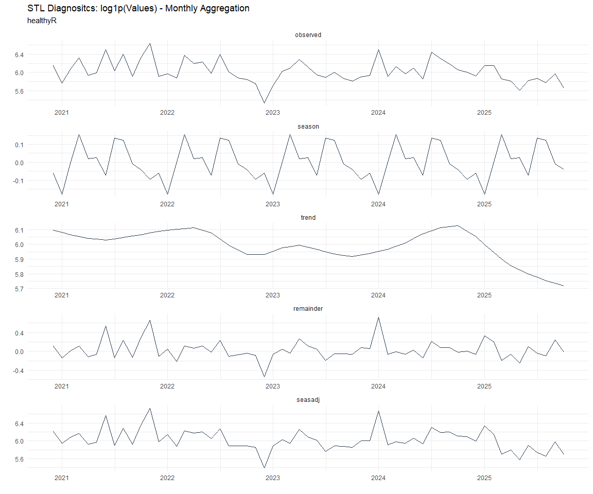
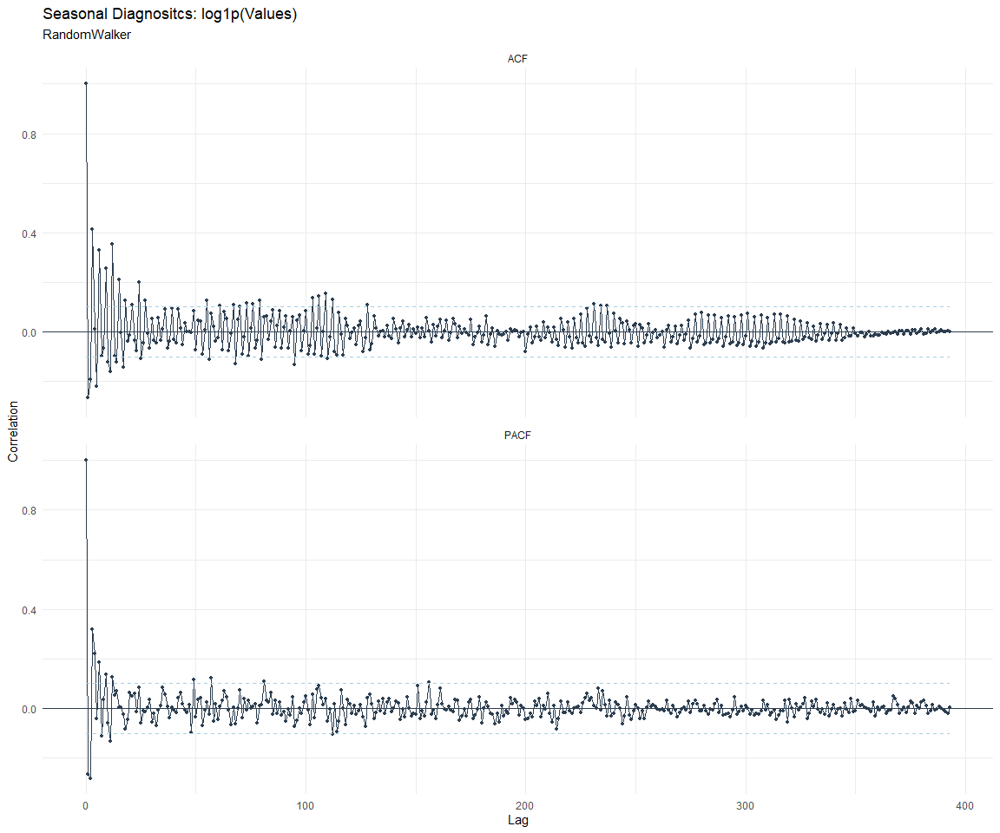

# Time Series Analysis, Modeling and Forecasting of the Healthyverse
Packages
Steven P. Sanderson II, MPH - Date:
2025-12-09

# Introduction

This analysis follows a *Nested Modeltime Workflow* from **`modeltime`**
along with using the **`NNS`** package. I use this to monitor the
downloads of all of my packages:

- [`healthyR`](https://www.spsanderson.com/healthyR/)
- [`healthyR.data`](https://www.spsanderson.com/healthyR.data/)
- [`healthyR.ts`](https://www.spsanderson.com/healthyR.ts/)
- [`healthyR.ai`](https://www.spsanderson.com/healthyR.ai/)
- [`healthyverse`](https://www.spsanderson.com/healthyverse/)
- [`TidyDensity`](https://www.spsanderson.com/TidyDensity/)
- [`tidyAML`](https://www.spsanderson.com/tidyAML/)
- [`RandomWalker`](https://www.spsanderson.com/RandomWalker/)

## Get Data

``` r
glimpse(downloads_tbl)
```

    Rows: 162,377
    Columns: 11
    $ date      <date> 2020-11-23, 2020-11-23, 2020-11-23, 2020-11-23, 2020-11-23,…
    $ time      <Period> 15H 36M 55S, 11H 26M 39S, 23H 34M 44S, 18H 39M 32S, 9H 0M…
    $ date_time <dttm> 2020-11-23 15:36:55, 2020-11-23 11:26:39, 2020-11-23 23:34:…
    $ size      <int> 4858294, 4858294, 4858301, 4858295, 361, 4863722, 4864794, 4…
    $ r_version <chr> NA, "4.0.3", "3.5.3", "3.5.2", NA, NA, NA, NA, NA, NA, NA, N…
    $ r_arch    <chr> NA, "x86_64", "x86_64", "x86_64", NA, NA, NA, NA, NA, NA, NA…
    $ r_os      <chr> NA, "mingw32", "mingw32", "linux-gnu", NA, NA, NA, NA, NA, N…
    $ package   <chr> "healthyR.data", "healthyR.data", "healthyR.data", "healthyR…
    $ version   <chr> "1.0.0", "1.0.0", "1.0.0", "1.0.0", "1.0.0", "1.0.0", "1.0.0…
    $ country   <chr> "US", "US", "US", "GB", "US", "US", "DE", "HK", "JP", "US", …
    $ ip_id     <int> 2069, 2804, 78827, 27595, 90474, 90474, 42435, 74, 7655, 638…

The last day in the data set is 2025-12-07 23:54:25, the file was
birthed on: 2025-10-31 10:47:59.603742, and at report knit time is
897.11 hours old. Happy analyzing!

Now that we have our data lets take a look at it using the `skimr`
package.

``` r
skim(downloads_tbl)
```

|                                                  |               |
|:-------------------------------------------------|:--------------|
| Name                                             | downloads_tbl |
| Number of rows                                   | 162377        |
| Number of columns                                | 11            |
| \_\_\_\_\_\_\_\_\_\_\_\_\_\_\_\_\_\_\_\_\_\_\_   |               |
| Column type frequency:                           |               |
| character                                        | 6             |
| Date                                             | 1             |
| numeric                                          | 2             |
| POSIXct                                          | 1             |
| Timespan                                         | 1             |
| \_\_\_\_\_\_\_\_\_\_\_\_\_\_\_\_\_\_\_\_\_\_\_\_ |               |
| Group variables                                  | None          |

Data summary

**Variable type: character**

| skim_variable | n_missing | complete_rate | min | max | empty | n_unique | whitespace |
|:--------------|----------:|--------------:|----:|----:|------:|---------:|-----------:|
| r_version     |    119085 |          0.27 |   5 |   7 |     0 |       50 |          0 |
| r_arch        |    119085 |          0.27 |   1 |   7 |     0 |        6 |          0 |
| r_os          |    119085 |          0.27 |   7 |  19 |     0 |       24 |          0 |
| package       |         0 |          1.00 |   7 |  13 |     0 |        8 |          0 |
| version       |         0 |          1.00 |   5 |  17 |     0 |       62 |          0 |
| country       |     15227 |          0.91 |   2 |   2 |     0 |      166 |          0 |

**Variable type: Date**

| skim_variable | n_missing | complete_rate | min | max | median | n_unique |
|:---|---:|---:|:---|:---|:---|---:|
| date | 0 | 1 | 2020-11-23 | 2025-12-07 | 2023-11-03 | 1834 |

**Variable type: numeric**

| skim_variable | n_missing | complete_rate | mean | sd | p0 | p25 | p50 | p75 | p100 | hist |
|:---|---:|---:|---:|---:|---:|---:|---:|---:|---:|:---|
| size | 0 | 1 | 1124314.53 | 1488191.37 | 355 | 27384 | 310267 | 2353151 | 5677952 | ▇▁▂▁▁ |
| ip_id | 0 | 1 | 11329.12 | 21972.21 | 1 | 236 | 2889 | 11961 | 299146 | ▇▁▁▁▁ |

**Variable type: POSIXct**

| skim_variable | n_missing | complete_rate | min | max | median | n_unique |
|:---|---:|---:|:---|:---|:---|---:|
| date_time | 0 | 1 | 2020-11-23 09:00:41 | 2025-12-07 23:54:25 | 2023-11-03 15:38:34 | 102485 |

**Variable type: Timespan**

| skim_variable | n_missing | complete_rate | min | max |     median | n_unique |
|:--------------|----------:|--------------:|----:|----:|-----------:|---------:|
| time          |         0 |             1 |   0 |  59 | 12H 6M 49S |       60 |

We can see that the following columns are missing a lot of data and for
us are most likely not useful anyways, so we will drop them
`c(r_version, r_arch, r_os)`

## Plots

Now lets take a look at a time-series plot of the total daily downloads
by package. We will use a log scale and place a vertical line at each
version release for each package.


    [[1]]


    [[2]]


    [[3]]


    [[4]]


    [[5]]


    [[6]]


    [[7]]


    [[8]]


Now lets take a look at some time series decomposition graphs.

    [[1]]


    [[2]]


    [[3]]


    [[4]]


    [[5]]


    [[6]]


    [[7]]


    [[8]]


    [[1]]


    [[2]]


    [[3]]




    [[4]]


    [[5]]


    [[6]]


    [[7]]


    [[8]]


Seasonal Diagnostics:

    [[1]]


    [[2]]


    [[3]]


    [[4]]


    [[5]]


    [[6]]


    [[7]]


    [[8]]


ACF and PACF Diagnostics:

    [[1]]




    [[2]]


    [[3]]


    [[4]]


    [[5]]


    [[6]]


    [[7]]


    [[8]]


## Feature Engineering

Now that we have our basic data and a shot of what it looks like, let’s
add some features to our data which can be very helpful in modeling.
Lets start by making a `tibble` that is aggregated by the day and
package, as we are going to be interested in forecasting the next 4
weeks or 28 days for each package. First lets get our base data.


    Call:
    stats::lm(formula = .formula, data = df)

    Residuals:
        Min      1Q  Median      3Q     Max 
    -146.38  -36.51  -11.21   27.06  819.78 

    Coefficients:
                                                         Estimate Std. Error
    (Intercept)                                        -1.808e+02  6.047e+01
    date                                                1.110e-02  3.206e-03
    lag(value, 1)                                       1.098e-01  2.319e-02
    lag(value, 7)                                       8.973e-02  2.391e-02
    lag(value, 14)                                      7.634e-02  2.388e-02
    lag(value, 21)                                      8.135e-02  2.393e-02
    lag(value, 28)                                      6.791e-02  2.387e-02
    lag(value, 35)                                      5.521e-02  2.392e-02
    lag(value, 42)                                      6.275e-02  2.405e-02
    lag(value, 49)                                      6.195e-02  2.394e-02
    month(date, label = TRUE).L                        -1.072e+01  5.023e+00
    month(date, label = TRUE).Q                         3.286e-01  4.948e+00
    month(date, label = TRUE).C                        -1.601e+01  4.978e+00
    month(date, label = TRUE)^4                        -6.208e+00  4.947e+00
    month(date, label = TRUE)^5                        -6.778e+00  4.900e+00
    month(date, label = TRUE)^6                         1.212e+00  4.910e+00
    month(date, label = TRUE)^7                        -4.523e+00  4.845e+00
    month(date, label = TRUE)^8                        -4.031e+00  4.818e+00
    month(date, label = TRUE)^9                         2.758e+00  4.830e+00
    month(date, label = TRUE)^10                        9.192e-01  4.847e+00
    month(date, label = TRUE)^11                       -4.072e+00  4.833e+00
    fourier_vec(date, type = "sin", K = 1, period = 7) -1.124e+01  2.216e+00
    fourier_vec(date, type = "cos", K = 1, period = 7)  7.284e+00  2.293e+00
                                                       t value Pr(>|t|)    
    (Intercept)                                         -2.990 0.002826 ** 
    date                                                 3.461 0.000550 ***
    lag(value, 1)                                        4.734 2.38e-06 ***
    lag(value, 7)                                        3.753 0.000180 ***
    lag(value, 14)                                       3.196 0.001418 ** 
    lag(value, 21)                                       3.399 0.000691 ***
    lag(value, 28)                                       2.845 0.004488 ** 
    lag(value, 35)                                       2.308 0.021097 *  
    lag(value, 42)                                       2.610 0.009133 ** 
    lag(value, 49)                                       2.588 0.009729 ** 
    month(date, label = TRUE).L                         -2.135 0.032939 *  
    month(date, label = TRUE).Q                          0.066 0.947066    
    month(date, label = TRUE).C                         -3.216 0.001323 ** 
    month(date, label = TRUE)^4                         -1.255 0.209711    
    month(date, label = TRUE)^5                         -1.383 0.166752    
    month(date, label = TRUE)^6                          0.247 0.805139    
    month(date, label = TRUE)^7                         -0.934 0.350621    
    month(date, label = TRUE)^8                         -0.837 0.402876    
    month(date, label = TRUE)^9                          0.571 0.568057    
    month(date, label = TRUE)^10                         0.190 0.849608    
    month(date, label = TRUE)^11                        -0.842 0.399700    
    fourier_vec(date, type = "sin", K = 1, period = 7)  -5.073 4.33e-07 ***
    fourier_vec(date, type = "cos", K = 1, period = 7)   3.177 0.001516 ** 
    ---
    Signif. codes:  0 '***' 0.001 '**' 0.01 '*' 0.05 '.' 0.1 ' ' 1

    Residual standard error: 59.29 on 1762 degrees of freedom
      (49 observations deleted due to missingness)
    Multiple R-squared:  0.2298,    Adjusted R-squared:  0.2202 
    F-statistic: 23.89 on 22 and 1762 DF,  p-value: < 2.2e-16


## NNS Forecasting

This is something I have been wanting to try for a while. The `NNS`
package is a great package for forecasting time series data.

[NNS GitHub](https://github.com/OVVO-Financial/NNS)

``` r
library(NNS)

data_list <- base_data |>
    select(package, value) |>
    group_split(package)

data_list |>
    imap(
        \(x, idx) {
            obj <- x
            x <- obj |> pull(value) |> tail(7*52)
            train_set_size <- length(x) - 56
            pkg <- obj |> pluck(1) |> unique()
#            sf <- NNS.seas(x, modulo = 7, plot = FALSE)$periods
            seas <- t(
                sapply(
                    1:25, 
                    function(i) c(
                        i,
                        sqrt(
                            mean((
                                NNS.ARMA(x, 
                                         h = 28, 
                                         training.set = train_set_size, 
                                         method = "lin", 
                                         seasonal.factor = i, 
                                         plot=FALSE
                                         ) - tail(x, 28)) ^ 2)))
                    )
                )
            colnames(seas) <- c("Period", "RMSE")
            sf <- seas[which.min(seas[, 2]), 1]
            
            cat(paste0("Package: ", pkg, "\n"))
            NNS.ARMA.optim(
                variable = x,
                h = 28,
                training.set = train_set_size,
                #seasonal.factor = seq(12, 60, 7),
                seasonal.factor = sf,
                pred.int = 0.95,
                plot = TRUE
            )
            title(
                sub = paste0("\n",
                             "Package: ", pkg, " - NNS Optimization")
            )
        }
    )
```

    Package: healthyR
    [1] "CURRNET METHOD: lin"
    [1] "COPY LATEST PARAMETERS DIRECTLY FOR NNS.ARMA() IF ERROR:"
    [1] "NNS.ARMA(... method =  'lin' , seasonal.factor =  c( 1 ) ...)"
    [1] "CURRENT lin OBJECTIVE FUNCTION = 315.393379127833"
    [1] "BEST method = 'lin' PATH MEMBER = c( 1 )"
    [1] "BEST lin OBJECTIVE FUNCTION = 315.393379127833"
    [1] "CURRNET METHOD: nonlin"
    [1] "COPY LATEST PARAMETERS DIRECTLY FOR NNS.ARMA() IF ERROR:"
    [1] "NNS.ARMA(... method =  'nonlin' , seasonal.factor =  c( 1 ) ...)"
    [1] "CURRENT nonlin OBJECTIVE FUNCTION = 26.5081328898038"
    [1] "BEST method = 'nonlin' PATH MEMBER = c( 1 )"
    [1] "BEST nonlin OBJECTIVE FUNCTION = 26.5081328898038"
    [1] "CURRNET METHOD: both"
    [1] "COPY LATEST PARAMETERS DIRECTLY FOR NNS.ARMA() IF ERROR:"
    [1] "NNS.ARMA(... method =  'both' , seasonal.factor =  c( 1 ) ...)"
    [1] "CURRENT both OBJECTIVE FUNCTION = 43.415683324375"
    [1] "BEST method = 'both' PATH MEMBER = c( 1 )"
    [1] "BEST both OBJECTIVE FUNCTION = 43.415683324375"


    Package: healthyR.ai
    [1] "CURRNET METHOD: lin"
    [1] "COPY LATEST PARAMETERS DIRECTLY FOR NNS.ARMA() IF ERROR:"
    [1] "NNS.ARMA(... method =  'lin' , seasonal.factor =  c( 3 ) ...)"
    [1] "CURRENT lin OBJECTIVE FUNCTION = 21.1768663164885"
    [1] "BEST method = 'lin' PATH MEMBER = c( 3 )"
    [1] "BEST lin OBJECTIVE FUNCTION = 21.1768663164885"
    [1] "CURRNET METHOD: nonlin"
    [1] "COPY LATEST PARAMETERS DIRECTLY FOR NNS.ARMA() IF ERROR:"
    [1] "NNS.ARMA(... method =  'nonlin' , seasonal.factor =  c( 3 ) ...)"
    [1] "CURRENT nonlin OBJECTIVE FUNCTION = 5.22364995840783"
    [1] "BEST method = 'nonlin' PATH MEMBER = c( 3 )"
    [1] "BEST nonlin OBJECTIVE FUNCTION = 5.22364995840783"
    [1] "CURRNET METHOD: both"
    [1] "COPY LATEST PARAMETERS DIRECTLY FOR NNS.ARMA() IF ERROR:"
    [1] "NNS.ARMA(... method =  'both' , seasonal.factor =  c( 3 ) ...)"
    [1] "CURRENT both OBJECTIVE FUNCTION = 8.7214203048742"
    [1] "BEST method = 'both' PATH MEMBER = c( 3 )"
    [1] "BEST both OBJECTIVE FUNCTION = 8.7214203048742"


    Package: healthyR.data
    [1] "CURRNET METHOD: lin"
    [1] "COPY LATEST PARAMETERS DIRECTLY FOR NNS.ARMA() IF ERROR:"
    [1] "NNS.ARMA(... method =  'lin' , seasonal.factor =  c( 5 ) ...)"
    [1] "CURRENT lin OBJECTIVE FUNCTION = 49.1076330868979"
    [1] "BEST method = 'lin' PATH MEMBER = c( 5 )"
    [1] "BEST lin OBJECTIVE FUNCTION = 49.1076330868979"
    [1] "CURRNET METHOD: nonlin"
    [1] "COPY LATEST PARAMETERS DIRECTLY FOR NNS.ARMA() IF ERROR:"
    [1] "NNS.ARMA(... method =  'nonlin' , seasonal.factor =  c( 5 ) ...)"
    [1] "CURRENT nonlin OBJECTIVE FUNCTION = 6.45824987498401"
    [1] "BEST method = 'nonlin' PATH MEMBER = c( 5 )"
    [1] "BEST nonlin OBJECTIVE FUNCTION = 6.45824987498401"
    [1] "CURRNET METHOD: both"
    [1] "COPY LATEST PARAMETERS DIRECTLY FOR NNS.ARMA() IF ERROR:"
    [1] "NNS.ARMA(... method =  'both' , seasonal.factor =  c( 5 ) ...)"
    [1] "CURRENT both OBJECTIVE FUNCTION = 6.63105700874425"
    [1] "BEST method = 'both' PATH MEMBER = c( 5 )"
    [1] "BEST both OBJECTIVE FUNCTION = 6.63105700874425"


    Package: healthyR.ts
    [1] "CURRNET METHOD: lin"
    [1] "COPY LATEST PARAMETERS DIRECTLY FOR NNS.ARMA() IF ERROR:"
    [1] "NNS.ARMA(... method =  'lin' , seasonal.factor =  c( 19 ) ...)"
    [1] "CURRENT lin OBJECTIVE FUNCTION = 17.6219452892029"
    [1] "BEST method = 'lin' PATH MEMBER = c( 19 )"
    [1] "BEST lin OBJECTIVE FUNCTION = 17.6219452892029"
    [1] "CURRNET METHOD: nonlin"
    [1] "COPY LATEST PARAMETERS DIRECTLY FOR NNS.ARMA() IF ERROR:"
    [1] "NNS.ARMA(... method =  'nonlin' , seasonal.factor =  c( 19 ) ...)"
    [1] "CURRENT nonlin OBJECTIVE FUNCTION = 16.0462442311698"
    [1] "BEST method = 'nonlin' PATH MEMBER = c( 19 )"
    [1] "BEST nonlin OBJECTIVE FUNCTION = 16.0462442311698"
    [1] "CURRNET METHOD: both"
    [1] "COPY LATEST PARAMETERS DIRECTLY FOR NNS.ARMA() IF ERROR:"
    [1] "NNS.ARMA(... method =  'both' , seasonal.factor =  c( 19 ) ...)"
    [1] "CURRENT both OBJECTIVE FUNCTION = 20.2841003021695"
    [1] "BEST method = 'both' PATH MEMBER = c( 19 )"
    [1] "BEST both OBJECTIVE FUNCTION = 20.2841003021695"


    Package: healthyverse
    [1] "CURRNET METHOD: lin"
    [1] "COPY LATEST PARAMETERS DIRECTLY FOR NNS.ARMA() IF ERROR:"
    [1] "NNS.ARMA(... method =  'lin' , seasonal.factor =  c( 12 ) ...)"
    [1] "CURRENT lin OBJECTIVE FUNCTION = 5.26074812428274"
    [1] "BEST method = 'lin' PATH MEMBER = c( 12 )"
    [1] "BEST lin OBJECTIVE FUNCTION = 5.26074812428274"
    [1] "CURRNET METHOD: nonlin"
    [1] "COPY LATEST PARAMETERS DIRECTLY FOR NNS.ARMA() IF ERROR:"
    [1] "NNS.ARMA(... method =  'nonlin' , seasonal.factor =  c( 12 ) ...)"
    [1] "CURRENT nonlin OBJECTIVE FUNCTION = 7.75597068033984"
    [1] "BEST method = 'nonlin' PATH MEMBER = c( 12 )"
    [1] "BEST nonlin OBJECTIVE FUNCTION = 7.75597068033984"
    [1] "CURRNET METHOD: both"
    [1] "COPY LATEST PARAMETERS DIRECTLY FOR NNS.ARMA() IF ERROR:"
    [1] "NNS.ARMA(... method =  'both' , seasonal.factor =  c( 12 ) ...)"
    [1] "CURRENT both OBJECTIVE FUNCTION = 6.42258956079061"
    [1] "BEST method = 'both' PATH MEMBER = c( 12 )"
    [1] "BEST both OBJECTIVE FUNCTION = 6.42258956079061"


    Package: RandomWalker
    [1] "CURRNET METHOD: lin"
    [1] "COPY LATEST PARAMETERS DIRECTLY FOR NNS.ARMA() IF ERROR:"
    [1] "NNS.ARMA(... method =  'lin' , seasonal.factor =  c( 7 ) ...)"
    [1] "CURRENT lin OBJECTIVE FUNCTION = 12.2092785664917"
    [1] "BEST method = 'lin' PATH MEMBER = c( 7 )"
    [1] "BEST lin OBJECTIVE FUNCTION = 12.2092785664917"
    [1] "CURRNET METHOD: nonlin"
    [1] "COPY LATEST PARAMETERS DIRECTLY FOR NNS.ARMA() IF ERROR:"
    [1] "NNS.ARMA(... method =  'nonlin' , seasonal.factor =  c( 7 ) ...)"
    [1] "CURRENT nonlin OBJECTIVE FUNCTION = 4.52816991634619"
    [1] "BEST method = 'nonlin' PATH MEMBER = c( 7 )"
    [1] "BEST nonlin OBJECTIVE FUNCTION = 4.52816991634619"
    [1] "CURRNET METHOD: both"
    [1] "COPY LATEST PARAMETERS DIRECTLY FOR NNS.ARMA() IF ERROR:"
    [1] "NNS.ARMA(... method =  'both' , seasonal.factor =  c( 7 ) ...)"
    [1] "CURRENT both OBJECTIVE FUNCTION = 4.96900388257792"
    [1] "BEST method = 'both' PATH MEMBER = c( 7 )"
    [1] "BEST both OBJECTIVE FUNCTION = 4.96900388257792"


    Package: tidyAML
    [1] "CURRNET METHOD: lin"
    [1] "COPY LATEST PARAMETERS DIRECTLY FOR NNS.ARMA() IF ERROR:"
    [1] "NNS.ARMA(... method =  'lin' , seasonal.factor =  c( 2 ) ...)"
    [1] "CURRENT lin OBJECTIVE FUNCTION = 53.2904585071428"
    [1] "BEST method = 'lin' PATH MEMBER = c( 2 )"
    [1] "BEST lin OBJECTIVE FUNCTION = 53.2904585071428"
    [1] "CURRNET METHOD: nonlin"
    [1] "COPY LATEST PARAMETERS DIRECTLY FOR NNS.ARMA() IF ERROR:"
    [1] "NNS.ARMA(... method =  'nonlin' , seasonal.factor =  c( 2 ) ...)"
    [1] "CURRENT nonlin OBJECTIVE FUNCTION = 166.460934900864"
    [1] "BEST method = 'nonlin' PATH MEMBER = c( 2 )"
    [1] "BEST nonlin OBJECTIVE FUNCTION = 166.460934900864"
    [1] "CURRNET METHOD: both"
    [1] "COPY LATEST PARAMETERS DIRECTLY FOR NNS.ARMA() IF ERROR:"
    [1] "NNS.ARMA(... method =  'both' , seasonal.factor =  c( 2 ) ...)"
    [1] "CURRENT both OBJECTIVE FUNCTION = 52.9480006249371"
    [1] "BEST method = 'both' PATH MEMBER = c( 2 )"
    [1] "BEST both OBJECTIVE FUNCTION = 52.9480006249371"


    Package: TidyDensity
    [1] "CURRNET METHOD: lin"
    [1] "COPY LATEST PARAMETERS DIRECTLY FOR NNS.ARMA() IF ERROR:"
    [1] "NNS.ARMA(... method =  'lin' , seasonal.factor =  c( 7 ) ...)"
    [1] "CURRENT lin OBJECTIVE FUNCTION = 10.446864882845"
    [1] "BEST method = 'lin' PATH MEMBER = c( 7 )"
    [1] "BEST lin OBJECTIVE FUNCTION = 10.446864882845"
    [1] "CURRNET METHOD: nonlin"
    [1] "COPY LATEST PARAMETERS DIRECTLY FOR NNS.ARMA() IF ERROR:"
    [1] "NNS.ARMA(... method =  'nonlin' , seasonal.factor =  c( 7 ) ...)"
    [1] "CURRENT nonlin OBJECTIVE FUNCTION = 13.087850240764"
    [1] "BEST method = 'nonlin' PATH MEMBER = c( 7 )"
    [1] "BEST nonlin OBJECTIVE FUNCTION = 13.087850240764"
    [1] "CURRNET METHOD: both"
    [1] "COPY LATEST PARAMETERS DIRECTLY FOR NNS.ARMA() IF ERROR:"
    [1] "NNS.ARMA(... method =  'both' , seasonal.factor =  c( 7 ) ...)"
    [1] "CURRENT both OBJECTIVE FUNCTION = 9.8864736988725"
    [1] "BEST method = 'both' PATH MEMBER = c( 7 )"
    [1] "BEST both OBJECTIVE FUNCTION = 9.8864736988725"


    [[1]]
    NULL

    [[2]]
    NULL

    [[3]]
    NULL

    [[4]]
    NULL

    [[5]]
    NULL

    [[6]]
    NULL

    [[7]]
    NULL

    [[8]]
    NULL

## Pre-Processing

Now we are going to do some basic pre-processing.

``` r
data_padded_tbl <- base_data %>%
  pad_by_time(
    .date_var  = date,
    .pad_value = 0
  )

# Get log interval and standardization parameters
log_params  <- liv(data_padded_tbl$value, limit_lower = 0, offset = 1, silent = TRUE)
limit_lower <- log_params$limit_lower
limit_upper <- log_params$limit_upper
offset      <- log_params$offset

data_liv_tbl <- data_padded_tbl %>%
  # Get log interval transform
  mutate(value_trans = liv(value, limit_lower = 0, offset = 1, silent = TRUE)$log_scaled)

# Get Standardization Params
std_params <- standard_vec(data_liv_tbl$value_trans, silent = TRUE)
std_mean   <- std_params$mean
std_sd     <- std_params$sd

data_transformed_tbl <- data_liv_tbl %>%
  group_by(package) %>%
  # get standardization
  mutate(value_trans = standard_vec(value_trans, silent = TRUE)$standard_scaled) %>%
  tk_augment_fourier(
    .date_var = date,
    .periods  = c(7, 14, 30, 90, 180),
    .K        = 2
  ) %>%
  tk_augment_timeseries_signature(
    .date_var = date
  ) %>%
  ungroup() %>%
  select(-c(value, -year.iso))
```

Since this is panel data we can follow one of two different modeling
strategies. We can search for a global model in the panel data or we can
use nested forecasting finding the best model for each of the time
series. Since we only have 5 panels, we will use nested forecasting.

To do this we will use the `nest_timeseries` and
`split_nested_timeseries` functions to create a nested `tibble`.

``` r
horizon <- 4*7

nested_data_tbl <- data_transformed_tbl %>%

    # 0. Filter out column where package is NA
    filter(!is.na(package)) %>%
    
    # 1. Extending: We'll predict n days into the future.
    extend_timeseries(
        .id_var        = package,
        .date_var      = date,
        .length_future = horizon
    ) %>%
    
    # 2. Nesting: We'll group by id, and create a future dataset
    #    that forecasts n days of extended data and
    #    an actual dataset that contains n*2 days
    nest_timeseries(
        .id_var        = package,
        .length_future = horizon
        #.length_actual = horizon*2
    ) %>%
    
   # 3. Splitting: We'll take the actual data and create splits
   #    for accuracy and confidence interval estimation of n das (test)
   #    and the rest is training data
    split_nested_timeseries(
        .length_test = horizon
    )

nested_data_tbl
```

    # A tibble: 8 × 4
      package       .actual_data          .future_data       .splits          
      <fct>         <list>                <list>             <list>           
    1 healthyR.data <tibble [1,826 × 50]> <tibble [28 × 50]> <split [1798|28]>
    2 healthyR      <tibble [1,817 × 50]> <tibble [28 × 50]> <split [1789|28]>
    3 healthyR.ts   <tibble [1,762 × 50]> <tibble [28 × 50]> <split [1734|28]>
    4 healthyverse  <tibble [1,733 × 50]> <tibble [28 × 50]> <split [1705|28]>
    5 healthyR.ai   <tibble [1,559 × 50]> <tibble [28 × 50]> <split [1531|28]>
    6 TidyDensity   <tibble [1,410 × 50]> <tibble [28 × 50]> <split [1382|28]>
    7 tidyAML       <tibble [1,017 × 50]> <tibble [28 × 50]> <split [989|28]> 
    8 RandomWalker  <tibble [440 × 50]>   <tibble [28 × 50]> <split [412|28]> 

Now it is time to make some recipes and models using the modeltime
workflow.

## Modeltime Workflow

### Recipe Object

``` r
recipe_base <- recipe(
  value_trans ~ .
  , data = extract_nested_test_split(nested_data_tbl)
  )

recipe_base

recipe_date <- recipe(
  value_trans ~ date
  , data = extract_nested_test_split(nested_data_tbl)
  )
```

### Models

``` r
# Models ------------------------------------------------------------------

# Auto ARIMA --------------------------------------------------------------

model_spec_arima_no_boost <- arima_reg() %>%
  set_engine(engine = "auto_arima")

wflw_auto_arima <- workflow() %>%
  add_recipe(recipe = recipe_date) %>%
  add_model(model_spec_arima_no_boost)

# NNETAR ------------------------------------------------------------------

model_spec_nnetar <- nnetar_reg(
  mode              = "regression"
  , seasonal_period = "auto"
) %>%
  set_engine("nnetar")

wflw_nnetar <- workflow() %>%
  add_recipe(recipe = recipe_base) %>%
  add_model(model_spec_nnetar)

# TSLM --------------------------------------------------------------------

model_spec_lm <- linear_reg() %>%
  set_engine("lm")

wflw_lm <- workflow() %>%
  add_recipe(recipe = recipe_base) %>%
  add_model(model_spec_lm)

# MARS --------------------------------------------------------------------

model_spec_mars <- mars(mode = "regression") %>%
  set_engine("earth")

wflw_mars <- workflow() %>%
  add_recipe(recipe = recipe_date) %>%
  add_model(model_spec_mars)
```

### Nested Modeltime Tables

``` r
nested_modeltime_tbl <- modeltime_nested_fit(
  # Nested Data
  nested_data = nested_data_tbl,
   control = control_nested_fit(
     verbose = TRUE,
     allow_par = FALSE
   ),
  # Add workflows
  wflw_auto_arima,
  wflw_lm,
  wflw_mars,
  wflw_nnetar
)
```

``` r
nested_modeltime_tbl <- nested_modeltime_tbl[!is.na(nested_modeltime_tbl$package),]
```

### Model Accuracy

``` r
nested_modeltime_tbl %>%
  extract_nested_test_accuracy() %>%
  filter(!is.na(package)) %>%
  knitr::kable()
```

| package | .model_id | .model_desc | .type | mae | mape | mase | smape | rmse | rsq |
|:---|---:|:---|:---|---:|---:|---:|---:|---:|---:|
| healthyR.data | 1 | ARIMA | Test | 0.7908849 | 113.5604 | 0.7396269 | 155.0831 | 0.9443636 | 0.0006468 |
| healthyR.data | 2 | LM | Test | 0.7325117 | 189.0234 | 0.6850369 | 122.6139 | 0.8517161 | 0.0208420 |
| healthyR.data | 3 | NULL | NA | NA | NA | NA | NA | NA | NA |
| healthyR.data | 4 | NNAR | Test | 0.8018393 | 215.8758 | 0.7498714 | 130.3093 | 0.9105572 | 0.0065961 |
| healthyR | 1 | ARIMA | Test | 0.7034915 | 217.4445 | 0.8438294 | 141.1206 | 0.8971515 | 0.0138439 |
| healthyR | 2 | LM | Test | 0.6250419 | 440.9638 | 0.7497301 | 110.4670 | 0.7857957 | 0.0557461 |
| healthyR | 3 | NULL | NA | NA | NA | NA | NA | NA | NA |
| healthyR | 4 | NNAR | Test | 0.7398222 | 410.4642 | 0.8874076 | 131.8995 | 0.9005632 | 0.0214885 |
| healthyR.ts | 1 | ARIMA | Test | 0.6686674 | 207.1362 | 0.7103639 | 135.8789 | 0.8291175 | 0.0077706 |
| healthyR.ts | 2 | LM | Test | 0.7788081 | 257.5644 | 0.8273728 | 146.4459 | 0.9272043 | 0.0020383 |
| healthyR.ts | 3 | NULL | NA | NA | NA | NA | NA | NA | NA |
| healthyR.ts | 4 | NNAR | Test | 0.8510269 | 268.0148 | 0.9040950 | 159.4200 | 0.9995145 | 0.0025252 |
| healthyverse | 1 | ARIMA | Test | 0.7748501 | 122.8397 | 0.7884196 | 140.6905 | 0.9711912 | 0.0360754 |
| healthyverse | 2 | LM | Test | 0.8428281 | 154.6862 | 0.8575882 | 137.6478 | 0.9734310 | 0.0034912 |
| healthyverse | 3 | NULL | NA | NA | NA | NA | NA | NA | NA |
| healthyverse | 4 | NNAR | Test | 0.8090258 | 151.1235 | 0.8231938 | 129.0820 | 0.9765984 | 0.0117473 |
| healthyR.ai | 1 | ARIMA | Test | 0.9736663 | 105.8204 | 1.1458813 | 183.9824 | 1.1545111 | 0.0015793 |
| healthyR.ai | 2 | LM | Test | 1.1775723 | 164.4910 | 1.3858527 | 161.5150 | 1.3814196 | 0.1276228 |
| healthyR.ai | 3 | NULL | NA | NA | NA | NA | NA | NA | NA |
| healthyR.ai | 4 | NNAR | Test | 1.2343459 | 169.2648 | 1.4526680 | 165.2670 | 1.4303843 | 0.0504745 |
| TidyDensity | 1 | ARIMA | Test | 1.0589555 | 254.5510 | 0.7378978 | 153.0182 | 1.2427523 | 0.0248273 |
| TidyDensity | 2 | LM | Test | 0.8062588 | 112.5400 | 0.5618146 | 147.2138 | 0.9992365 | 0.0564486 |
| TidyDensity | 3 | NULL | NA | NA | NA | NA | NA | NA | NA |
| TidyDensity | 4 | NNAR | Test | 0.9607268 | 168.2874 | 0.6694505 | 152.3001 | 1.1291900 | 0.0001016 |
| tidyAML | 1 | ARIMA | Test | 0.6339798 | 103.4071 | 0.7783023 | 160.6634 | 0.7876695 | 0.0007753 |
| tidyAML | 2 | LM | Test | 0.6525333 | 233.2275 | 0.8010793 | 130.6825 | 0.8016113 | 0.0278730 |
| tidyAML | 3 | NULL | NA | NA | NA | NA | NA | NA | NA |
| tidyAML | 4 | NNAR | Test | 0.6550214 | 209.2227 | 0.8041339 | 116.9532 | 0.7780038 | 0.0085007 |
| RandomWalker | 1 | ARIMA | Test | 0.7675187 | 126.3953 | 0.7690272 | 157.3323 | 0.8772847 | 0.0375149 |
| RandomWalker | 2 | LM | Test | 0.8325393 | 148.6196 | 0.8341756 | 156.4699 | 0.9471841 | 0.0002392 |
| RandomWalker | 3 | NULL | NA | NA | NA | NA | NA | NA | NA |
| RandomWalker | 4 | NNAR | Test | 0.8731715 | 161.2106 | 0.8748876 | 155.9783 | 1.0053617 | 0.0001371 |

### Plot Models

``` r
nested_modeltime_tbl %>%
  extract_nested_test_forecast() %>%
  group_by(package) %>%
  filter_by_time(.date_var = .index, .start_date = max(.index) - 60) %>%
  ungroup() %>%
  plot_modeltime_forecast(
    .interactive = FALSE,
    .conf_interval_show  = FALSE,
    .facet_scales = "free"
  ) +
  theme_minimal() +
  facet_wrap(~ package, nrow = 3) +
  theme(legend.position = "bottom")
```


### Best Model

``` r
best_nested_modeltime_tbl <- nested_modeltime_tbl %>%
  modeltime_nested_select_best(
    metric = "rmse",
    minimize = TRUE,
    filter_test_forecasts = TRUE
  )

best_nested_modeltime_tbl %>%
  extract_nested_best_model_report()
```

    # Nested Modeltime Table
      

    # A tibble: 8 × 10
      package      .model_id .model_desc .type   mae  mape  mase smape  rmse     rsq
      <fct>            <int> <chr>       <chr> <dbl> <dbl> <dbl> <dbl> <dbl>   <dbl>
    1 healthyR.da…         2 LM          Test  0.733  189. 0.685  123. 0.852 0.0208 
    2 healthyR             2 LM          Test  0.625  441. 0.750  110. 0.786 0.0557 
    3 healthyR.ts          1 ARIMA       Test  0.669  207. 0.710  136. 0.829 0.00777
    4 healthyverse         1 ARIMA       Test  0.775  123. 0.788  141. 0.971 0.0361 
    5 healthyR.ai          1 ARIMA       Test  0.974  106. 1.15   184. 1.15  0.00158
    6 TidyDensity          2 LM          Test  0.806  113. 0.562  147. 0.999 0.0564 
    7 tidyAML              4 NNAR        Test  0.655  209. 0.804  117. 0.778 0.00850
    8 RandomWalker         1 ARIMA       Test  0.768  126. 0.769  157. 0.877 0.0375 

``` r
best_nested_modeltime_tbl %>%
  extract_nested_test_forecast() %>%
  #filter(!is.na(.model_id)) %>%
  group_by(package) %>%
  filter_by_time(.date_var = .index, .start_date = max(.index) - 60) %>%
  ungroup() %>%
  plot_modeltime_forecast(
    .interactive = FALSE,
    .conf_interval_alpha = 0.2,
    .facet_scales = "free"
  ) +
  facet_wrap(~ package, nrow = 3) +
  theme_minimal() +
  theme(legend.position = "bottom")
```


## Refitting and Future Forecast

Now that we have the best models, we can make our future forecasts.

``` r
nested_modeltime_refit_tbl <- best_nested_modeltime_tbl %>%
    modeltime_nested_refit(
        control = control_nested_refit(verbose = TRUE)
    )
```

``` r
nested_modeltime_refit_tbl
```

    # Nested Modeltime Table
      

    # A tibble: 8 × 5
      package       .actual_data .future_data .splits           .modeltime_tables 
      <fct>         <list>       <list>       <list>            <list>            
    1 healthyR.data <tibble>     <tibble>     <split [1798|28]> <mdl_tm_t [1 × 5]>
    2 healthyR      <tibble>     <tibble>     <split [1789|28]> <mdl_tm_t [1 × 5]>
    3 healthyR.ts   <tibble>     <tibble>     <split [1734|28]> <mdl_tm_t [1 × 5]>
    4 healthyverse  <tibble>     <tibble>     <split [1705|28]> <mdl_tm_t [1 × 5]>
    5 healthyR.ai   <tibble>     <tibble>     <split [1531|28]> <mdl_tm_t [1 × 5]>
    6 TidyDensity   <tibble>     <tibble>     <split [1382|28]> <mdl_tm_t [1 × 5]>
    7 tidyAML       <tibble>     <tibble>     <split [989|28]>  <mdl_tm_t [1 × 5]>
    8 RandomWalker  <tibble>     <tibble>     <split [412|28]>  <mdl_tm_t [1 × 5]>

``` r
nested_modeltime_refit_tbl %>%
  extract_nested_future_forecast() %>%
  group_by(package) %>%
  mutate(across(.value:.conf_hi, .fns = ~ standard_inv_vec(
    x    = .,
    mean = std_mean,
    sd   = std_sd
  )$standard_inverse_value)) %>%
  mutate(across(.value:.conf_hi, .fns = ~ liiv(
    x = .,
    limit_lower = limit_lower,
    limit_upper = limit_upper,
    offset      = offset
  )$rescaled_v)) %>%
  filter_by_time(.date_var = .index, .start_date = max(.index) - 60) %>%
  ungroup() %>%
  plot_modeltime_forecast(
    .interactive = FALSE,
    .conf_interval_alpha = 0.2,
    .facet_scales = "free"
  ) +
  facet_wrap(~ package, nrow = 3) +
  theme_minimal() +
  theme(legend.position = "bottom")
```


