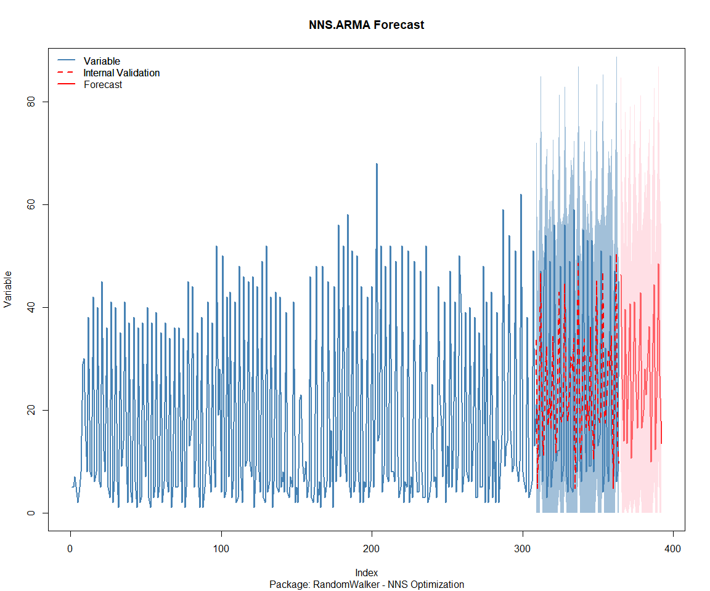

Time Series Analysis and Nested Modeling of the Healthyverse Packages
================
Steven P. Sanderson II, MPH - Date:
27 March, 2025

This analysis follows a *Nested Modeltime Workflow*.

## Get Data

``` r
glimpse(downloads_tbl)
```

    ## Rows: 135,167
    ## Columns: 11
    ## $ date      <date> 2020-11-23, 2020-11-23, 2020-11-23, 2020-11-23, 2020-11-23,…
    ## $ time      <Period> 15H 36M 55S, 11H 26M 39S, 23H 34M 44S, 18H 39M 32S, 9H 0M…
    ## $ date_time <dttm> 2020-11-23 15:36:55, 2020-11-23 11:26:39, 2020-11-23 23:34:…
    ## $ size      <int> 4858294, 4858294, 4858301, 4858295, 361, 4863722, 4864794, 4…
    ## $ r_version <chr> NA, "4.0.3", "3.5.3", "3.5.2", NA, NA, NA, NA, NA, NA, NA, N…
    ## $ r_arch    <chr> NA, "x86_64", "x86_64", "x86_64", NA, NA, NA, NA, NA, NA, NA…
    ## $ r_os      <chr> NA, "mingw32", "mingw32", "linux-gnu", NA, NA, NA, NA, NA, N…
    ## $ package   <chr> "healthyR.data", "healthyR.data", "healthyR.data", "healthyR…
    ## $ version   <chr> "1.0.0", "1.0.0", "1.0.0", "1.0.0", "1.0.0", "1.0.0", "1.0.0…
    ## $ country   <chr> "US", "US", "US", "GB", "US", "US", "DE", "HK", "JP", "US", …
    ## $ ip_id     <int> 2069, 2804, 78827, 27595, 90474, 90474, 42435, 74, 7655, 638…

The last day in the data set is 2025-03-25 23:55:34, the file was
birthed on: 2024-08-07 07:35:44, and at report knit time is -5532.33
hours old. Happy analyzing!

Now that we have our data lets take a look at it using the `skimr`
package.

``` r
skim(downloads_tbl)
```

|                                                  |               |
|:-------------------------------------------------|:--------------|
| Name                                             | downloads_tbl |
| Number of rows                                   | 135167        |
| Number of columns                                | 11            |
| \_\_\_\_\_\_\_\_\_\_\_\_\_\_\_\_\_\_\_\_\_\_\_   |               |
| Column type frequency:                           |               |
| character                                        | 6             |
| Date                                             | 1             |
| numeric                                          | 2             |
| POSIXct                                          | 1             |
| Timespan                                         | 1             |
| \_\_\_\_\_\_\_\_\_\_\_\_\_\_\_\_\_\_\_\_\_\_\_\_ |               |
| Group variables                                  | None          |

Data summary

**Variable type: character**

| skim_variable | n_missing | complete_rate | min | max | empty | n_unique | whitespace |
|:--------------|----------:|--------------:|----:|----:|------:|---------:|-----------:|
| r_version     |     97123 |          0.28 |   5 |   5 |     0 |       46 |          0 |
| r_arch        |     97123 |          0.28 |   3 |   7 |     0 |        5 |          0 |
| r_os          |     97123 |          0.28 |   7 |  15 |     0 |       21 |          0 |
| package       |         0 |          1.00 |   7 |  13 |     0 |        8 |          0 |
| version       |         0 |          1.00 |   5 |  17 |     0 |       60 |          0 |
| country       |     11361 |          0.92 |   2 |   2 |     0 |      163 |          0 |

**Variable type: Date**

| skim_variable | n_missing | complete_rate | min | max | median | n_unique |
|:---|---:|---:|:---|:---|:---|---:|
| date | 0 | 1 | 2020-11-23 | 2025-03-25 | 2023-05-24 | 1584 |

**Variable type: numeric**

| skim_variable | n_missing | complete_rate | mean | sd | p0 | p25 | p50 | p75 | p100 | hist |
|:---|---:|---:|---:|---:|---:|---:|---:|---:|---:|:---|
| size | 0 | 1 | 1135302.50 | 1524626.50 | 355 | 14701 | 262144 | 2367773 | 5677952 | ▇▁▂▁▁ |
| ip_id | 0 | 1 | 10364.87 | 18354.51 | 1 | 305 | 3075 | 11769 | 209747 | ▇▁▁▁▁ |

**Variable type: POSIXct**

| skim_variable | n_missing | complete_rate | min | max | median | n_unique |
|:---|---:|---:|:---|:---|:---|---:|
| date_time | 0 | 1 | 2020-11-23 09:00:41 | 2025-03-25 23:55:34 | 2023-05-24 02:12:13 | 82161 |

**Variable type: Timespan**

| skim_variable | n_missing | complete_rate | min | max |     median | n_unique |
|:--------------|----------:|--------------:|----:|----:|-----------:|---------:|
| time          |         0 |             1 |   0 |  59 | 12H 8M 21S |       60 |

We can see that the following columns are missing a lot of data and for
us are most likely not useful anyways, so we will drop them
`c(r_version, r_arch, r_os)`

## Plots

Now lets take a look at a time-series plot of the total daily downloads
by package. We will use a log scale and place a vertical line at each
version release for each package.

<!-- --><!-- -->

Now lets take a look at some time series decomposition graphs.

<!-- --><!-- --><!-- --><!-- -->

## Feature Engineering

Now that we have our basic data and a shot of what it looks like, let’s
add some features to our data which can be very helpful in modeling.
Lets start by making a `tibble` that is aggregated by the day and
package, as we are going to be interested in forecasting the next 4
weeks or 28 days for each package. First lets get our base data.

    ## 
    ## Call:
    ## stats::lm(formula = .formula, data = df)
    ## 
    ## Residuals:
    ##     Min      1Q  Median      3Q     Max 
    ## -152.47  -35.18  -10.11   26.73  811.19 
    ## 
    ## Coefficients:
    ##                                                      Estimate Std. Error
    ## (Intercept)                                        -1.912e+02  7.403e+01
    ## date                                                1.153e-02  3.928e-03
    ## lag(value, 1)                                       1.101e-01  2.489e-02
    ## lag(value, 7)                                       9.264e-02  2.575e-02
    ## lag(value, 14)                                      9.613e-02  2.578e-02
    ## lag(value, 21)                                      6.436e-02  2.586e-02
    ## lag(value, 28)                                      6.136e-02  2.572e-02
    ## lag(value, 35)                                      7.090e-02  2.593e-02
    ## lag(value, 42)                                      5.236e-02  2.602e-02
    ## lag(value, 49)                                      8.498e-02  2.594e-02
    ## month(date, label = TRUE).L                        -1.101e+01  5.143e+00
    ## month(date, label = TRUE).Q                         2.540e+00  5.185e+00
    ## month(date, label = TRUE).C                        -1.190e+01  5.236e+00
    ## month(date, label = TRUE)^4                        -7.405e+00  5.193e+00
    ## month(date, label = TRUE)^5                        -1.230e+01  5.197e+00
    ## month(date, label = TRUE)^6                        -2.835e+00  5.275e+00
    ## month(date, label = TRUE)^7                        -6.747e+00  5.158e+00
    ## month(date, label = TRUE)^8                        -4.434e+00  5.188e+00
    ## month(date, label = TRUE)^9                         5.594e+00  5.247e+00
    ## month(date, label = TRUE)^10                        4.477e+00  5.293e+00
    ## month(date, label = TRUE)^11                       -6.003e+00  5.321e+00
    ## fourier_vec(date, type = "sin", K = 1, period = 7) -1.182e+01  2.389e+00
    ## fourier_vec(date, type = "cos", K = 1, period = 7)  7.913e+00  2.520e+00
    ##                                                    t value Pr(>|t|)    
    ## (Intercept)                                         -2.583 0.009896 ** 
    ## date                                                 2.934 0.003394 ** 
    ## lag(value, 1)                                        4.424 1.04e-05 ***
    ## lag(value, 7)                                        3.597 0.000332 ***
    ## lag(value, 14)                                       3.729 0.000199 ***
    ## lag(value, 21)                                       2.489 0.012935 *  
    ## lag(value, 28)                                       2.385 0.017184 *  
    ## lag(value, 35)                                       2.734 0.006329 ** 
    ## lag(value, 42)                                       2.012 0.044401 *  
    ## lag(value, 49)                                       3.275 0.001079 ** 
    ## month(date, label = TRUE).L                         -2.140 0.032481 *  
    ## month(date, label = TRUE).Q                          0.490 0.624296    
    ## month(date, label = TRUE).C                         -2.274 0.023125 *  
    ## month(date, label = TRUE)^4                         -1.426 0.154128    
    ## month(date, label = TRUE)^5                         -2.367 0.018045 *  
    ## month(date, label = TRUE)^6                         -0.537 0.591032    
    ## month(date, label = TRUE)^7                         -1.308 0.191108    
    ## month(date, label = TRUE)^8                         -0.855 0.392826    
    ## month(date, label = TRUE)^9                          1.066 0.286600    
    ## month(date, label = TRUE)^10                         0.846 0.397830    
    ## month(date, label = TRUE)^11                        -1.128 0.259477    
    ## fourier_vec(date, type = "sin", K = 1, period = 7)  -4.949 8.29e-07 ***
    ## fourier_vec(date, type = "cos", K = 1, period = 7)   3.140 0.001724 ** 
    ## ---
    ## Signif. codes:  0 '***' 0.001 '**' 0.01 '*' 0.05 '.' 0.1 ' ' 1
    ## 
    ## Residual standard error: 58.43 on 1512 degrees of freedom
    ##   (49 observations deleted due to missingness)
    ## Multiple R-squared:  0.2562, Adjusted R-squared:  0.2453 
    ## F-statistic: 23.67 on 22 and 1512 DF,  p-value: < 2.2e-16

<!-- -->

## NNS Forecasting

This is something I have been wanting to try for a while. The `NNS`
package is a great package for forecasting time series data.

[NNS GitHub](https://github.com/OVVO-Financial/NNS)

``` r
library(NNS)

data_list <- base_data |>
    select(package, value) |>
    group_split(package)

data_list |>
    imap(
        \(x, idx) {
            obj <- x
            x <- obj |> pull(value) |> tail(7*52)
            train_set_size <- length(x) - 56
            pkg <- obj |> pluck(1) |> unique()
            sf <- NNS.seas(x, modulo = 7, plot = FALSE)$periods
            
            cat(paste0("Package: ", pkg, "\n"))
            NNS.ARMA.optim(
                variable = x,
                h = 28,
                training.set = train_set_size,
                #seasonal.factor = seq(12, 60, 7),
                seasonal.factor = sf,
                pred.int = 0.95,
                plot = TRUE
            )
            title(
                sub = paste0("\n",
                             "Package: ", pkg, " - NNS Optimization")
            )
        }
    )
```

    ## Package: healthyR
    ## [1] "CURRNET METHOD: lin"
    ## [1] "COPY LATEST PARAMETERS DIRECTLY FOR NNS.ARMA() IF ERROR:"
    ## [1] "NNS.ARMA(... method =  'lin' , seasonal.factor =  c( 21 ) ...)"
    ## [1] "CURRENT lin OBJECTIVE FUNCTION = 1.69649347100258"
    ## [1] "NNS.ARMA(... method =  'lin' , seasonal.factor =  c( 21, 98 ) ...)"
    ## [1] "CURRENT lin OBJECTIVE FUNCTION = 1.48390204470699"
    ## [1] "NNS.ARMA(... method =  'lin' , seasonal.factor =  c( 21, 98, 63 ) ...)"
    ## [1] "CURRENT lin OBJECTIVE FUNCTION = 1.46610942375131"
    ## [1] "NNS.ARMA(... method =  'lin' , seasonal.factor =  c( 21, 98, 63, 77 ) ...)"
    ## [1] "CURRENT lin OBJECTIVE FUNCTION = 1.44927136808355"
    ## [1] "BEST method = 'lin', seasonal.factor = c( 21, 98, 63, 77 )"
    ## [1] "BEST lin OBJECTIVE FUNCTION = 1.44927136808355"
    ## [1] "CURRNET METHOD: nonlin"
    ## [1] "COPY LATEST PARAMETERS DIRECTLY FOR NNS.ARMA() IF ERROR:"
    ## [1] "NNS.ARMA(... method =  'nonlin' , seasonal.factor =  c( 21, 98, 63, 77 ) ...)"
    ## [1] "CURRENT nonlin OBJECTIVE FUNCTION = 1.76486227584531"
    ## [1] "BEST method = 'nonlin' PATH MEMBER = c( 21, 98, 63, 77 )"
    ## [1] "BEST nonlin OBJECTIVE FUNCTION = 1.76486227584531"
    ## [1] "CURRNET METHOD: both"
    ## [1] "COPY LATEST PARAMETERS DIRECTLY FOR NNS.ARMA() IF ERROR:"
    ## [1] "NNS.ARMA(... method =  'both' , seasonal.factor =  c( 21, 98, 63, 77 ) ...)"
    ## [1] "CURRENT both OBJECTIVE FUNCTION = 1.56178894483398"
    ## [1] "BEST method = 'both' PATH MEMBER = c( 21, 98, 63, 77 )"
    ## [1] "BEST both OBJECTIVE FUNCTION = 1.56178894483398"

<!-- -->

    ## Package: healthyR.ai
    ## [1] "CURRNET METHOD: lin"
    ## [1] "COPY LATEST PARAMETERS DIRECTLY FOR NNS.ARMA() IF ERROR:"
    ## [1] "NNS.ARMA(... method =  'lin' , seasonal.factor =  c( 21 ) ...)"
    ## [1] "CURRENT lin OBJECTIVE FUNCTION = 1.30529078961904"
    ## [1] "NNS.ARMA(... method =  'lin' , seasonal.factor =  c( 21, 49 ) ...)"
    ## [1] "CURRENT lin OBJECTIVE FUNCTION = 1.14356078118708"
    ## [1] "NNS.ARMA(... method =  'lin' , seasonal.factor =  c( 21, 49, 63 ) ...)"
    ## [1] "CURRENT lin OBJECTIVE FUNCTION = 1.10679191865242"
    ## [1] "NNS.ARMA(... method =  'lin' , seasonal.factor =  c( 21, 49, 63, 98 ) ...)"
    ## [1] "CURRENT lin OBJECTIVE FUNCTION = 1.05648670594991"
    ## [1] "NNS.ARMA(... method =  'lin' , seasonal.factor =  c( 21, 49, 63, 98, 77 ) ...)"
    ## [1] "CURRENT lin OBJECTIVE FUNCTION = 1.03292751482591"
    ## [1] "NNS.ARMA(... method =  'lin' , seasonal.factor =  c( 21, 49, 63, 98, 77, 70 ) ...)"
    ## [1] "CURRENT lin OBJECTIVE FUNCTION = 1.00488666099296"
    ## [1] "BEST method = 'lin', seasonal.factor = c( 21, 49, 63, 98, 77, 70 )"
    ## [1] "BEST lin OBJECTIVE FUNCTION = 1.00488666099296"
    ## [1] "CURRNET METHOD: nonlin"
    ## [1] "COPY LATEST PARAMETERS DIRECTLY FOR NNS.ARMA() IF ERROR:"
    ## [1] "NNS.ARMA(... method =  'nonlin' , seasonal.factor =  c( 21, 49, 63, 98, 77, 70 ) ...)"
    ## [1] "CURRENT nonlin OBJECTIVE FUNCTION = 1.32392986352563"
    ## [1] "BEST method = 'nonlin' PATH MEMBER = c( 21, 49, 63, 98, 77, 70 )"
    ## [1] "BEST nonlin OBJECTIVE FUNCTION = 1.32392986352563"
    ## [1] "CURRNET METHOD: both"
    ## [1] "COPY LATEST PARAMETERS DIRECTLY FOR NNS.ARMA() IF ERROR:"
    ## [1] "NNS.ARMA(... method =  'both' , seasonal.factor =  c( 21, 49, 63, 98, 77, 70 ) ...)"
    ## [1] "CURRENT both OBJECTIVE FUNCTION = 1.09680520789184"
    ## [1] "BEST method = 'both' PATH MEMBER = c( 21, 49, 63, 98, 77, 70 )"
    ## [1] "BEST both OBJECTIVE FUNCTION = 1.09680520789184"

<!-- -->

    ## Package: healthyR.data
    ## [1] "CURRNET METHOD: lin"
    ## [1] "COPY LATEST PARAMETERS DIRECTLY FOR NNS.ARMA() IF ERROR:"
    ## [1] "NNS.ARMA(... method =  'lin' , seasonal.factor =  c( 98 ) ...)"
    ## [1] "CURRENT lin OBJECTIVE FUNCTION = 1.2517694658783"
    ## [1] "NNS.ARMA(... method =  'lin' , seasonal.factor =  c( 98, 77 ) ...)"
    ## [1] "CURRENT lin OBJECTIVE FUNCTION = 1.16246009211132"
    ## [1] "BEST method = 'lin', seasonal.factor = c( 98, 77 )"
    ## [1] "BEST lin OBJECTIVE FUNCTION = 1.16246009211132"
    ## [1] "CURRNET METHOD: nonlin"
    ## [1] "COPY LATEST PARAMETERS DIRECTLY FOR NNS.ARMA() IF ERROR:"
    ## [1] "NNS.ARMA(... method =  'nonlin' , seasonal.factor =  c( 98, 77 ) ...)"
    ## [1] "CURRENT nonlin OBJECTIVE FUNCTION = 1.69887729248622"
    ## [1] "BEST method = 'nonlin' PATH MEMBER = c( 98, 77 )"
    ## [1] "BEST nonlin OBJECTIVE FUNCTION = 1.69887729248622"
    ## [1] "CURRNET METHOD: both"
    ## [1] "COPY LATEST PARAMETERS DIRECTLY FOR NNS.ARMA() IF ERROR:"
    ## [1] "NNS.ARMA(... method =  'both' , seasonal.factor =  c( 98, 77 ) ...)"
    ## [1] "CURRENT both OBJECTIVE FUNCTION = 1.35625843455004"
    ## [1] "BEST method = 'both' PATH MEMBER = c( 98, 77 )"
    ## [1] "BEST both OBJECTIVE FUNCTION = 1.35625843455004"

<!-- -->

    ## Package: healthyR.ts
    ## [1] "CURRNET METHOD: lin"
    ## [1] "COPY LATEST PARAMETERS DIRECTLY FOR NNS.ARMA() IF ERROR:"
    ## [1] "NNS.ARMA(... method =  'lin' , seasonal.factor =  c( 98 ) ...)"
    ## [1] "CURRENT lin OBJECTIVE FUNCTION = 1.29848374152003"
    ## [1] "NNS.ARMA(... method =  'lin' , seasonal.factor =  c( 98, 63 ) ...)"
    ## [1] "CURRENT lin OBJECTIVE FUNCTION = 0.91970616548967"
    ## [1] "BEST method = 'lin', seasonal.factor = c( 98, 63 )"
    ## [1] "BEST lin OBJECTIVE FUNCTION = 0.91970616548967"
    ## [1] "CURRNET METHOD: nonlin"
    ## [1] "COPY LATEST PARAMETERS DIRECTLY FOR NNS.ARMA() IF ERROR:"
    ## [1] "NNS.ARMA(... method =  'nonlin' , seasonal.factor =  c( 98, 63 ) ...)"
    ## [1] "CURRENT nonlin OBJECTIVE FUNCTION = 1.43482494669234"
    ## [1] "BEST method = 'nonlin' PATH MEMBER = c( 98, 63 )"
    ## [1] "BEST nonlin OBJECTIVE FUNCTION = 1.43482494669234"
    ## [1] "CURRNET METHOD: both"
    ## [1] "COPY LATEST PARAMETERS DIRECTLY FOR NNS.ARMA() IF ERROR:"
    ## [1] "NNS.ARMA(... method =  'both' , seasonal.factor =  c( 98, 63 ) ...)"
    ## [1] "CURRENT both OBJECTIVE FUNCTION = 1.06834411290836"
    ## [1] "BEST method = 'both' PATH MEMBER = c( 98, 63 )"
    ## [1] "BEST both OBJECTIVE FUNCTION = 1.06834411290836"

<!-- -->

    ## Package: healthyverse
    ## [1] "CURRNET METHOD: lin"
    ## [1] "COPY LATEST PARAMETERS DIRECTLY FOR NNS.ARMA() IF ERROR:"
    ## [1] "NNS.ARMA(... method =  'lin' , seasonal.factor =  c( 49 ) ...)"
    ## [1] "CURRENT lin OBJECTIVE FUNCTION = 1.58318437468201"
    ## [1] "NNS.ARMA(... method =  'lin' , seasonal.factor =  c( 49, 77 ) ...)"
    ## [1] "CURRENT lin OBJECTIVE FUNCTION = 1.4530607710753"
    ## [1] "NNS.ARMA(... method =  'lin' , seasonal.factor =  c( 49, 77, 70 ) ...)"
    ## [1] "CURRENT lin OBJECTIVE FUNCTION = 1.42348098404239"
    ## [1] "NNS.ARMA(... method =  'lin' , seasonal.factor =  c( 49, 77, 70, 98 ) ...)"
    ## [1] "CURRENT lin OBJECTIVE FUNCTION = 1.41609972761053"
    ## [1] "BEST method = 'lin', seasonal.factor = c( 49, 77, 70, 98 )"
    ## [1] "BEST lin OBJECTIVE FUNCTION = 1.41609972761053"
    ## [1] "CURRNET METHOD: nonlin"
    ## [1] "COPY LATEST PARAMETERS DIRECTLY FOR NNS.ARMA() IF ERROR:"
    ## [1] "NNS.ARMA(... method =  'nonlin' , seasonal.factor =  c( 49, 77, 70, 98 ) ...)"
    ## [1] "CURRENT nonlin OBJECTIVE FUNCTION = 2.4844447682127"
    ## [1] "BEST method = 'nonlin' PATH MEMBER = c( 49, 77, 70, 98 )"
    ## [1] "BEST nonlin OBJECTIVE FUNCTION = 2.4844447682127"
    ## [1] "CURRNET METHOD: both"
    ## [1] "COPY LATEST PARAMETERS DIRECTLY FOR NNS.ARMA() IF ERROR:"
    ## [1] "NNS.ARMA(... method =  'both' , seasonal.factor =  c( 49, 77, 70, 98 ) ...)"
    ## [1] "CURRENT both OBJECTIVE FUNCTION = 1.820469222472"
    ## [1] "BEST method = 'both' PATH MEMBER = c( 49, 77, 70, 98 )"
    ## [1] "BEST both OBJECTIVE FUNCTION = 1.820469222472"

<!-- -->

    ## Package: RandomWalker
    ## [1] "CURRNET METHOD: lin"
    ## [1] "COPY LATEST PARAMETERS DIRECTLY FOR NNS.ARMA() IF ERROR:"
    ## [1] "NNS.ARMA(... method =  'lin' , seasonal.factor =  c( 35 ) ...)"
    ## [1] "CURRENT lin OBJECTIVE FUNCTION = 4.51020823545778"
    ## [1] "BEST method = 'lin', seasonal.factor = c( 35 )"
    ## [1] "BEST lin OBJECTIVE FUNCTION = 4.51020823545778"
    ## [1] "CURRNET METHOD: nonlin"
    ## [1] "COPY LATEST PARAMETERS DIRECTLY FOR NNS.ARMA() IF ERROR:"
    ## [1] "NNS.ARMA(... method =  'nonlin' , seasonal.factor =  c( 35 ) ...)"
    ## [1] "CURRENT nonlin OBJECTIVE FUNCTION = 9.28631332473985"
    ## [1] "BEST method = 'nonlin' PATH MEMBER = c( 35 )"
    ## [1] "BEST nonlin OBJECTIVE FUNCTION = 9.28631332473985"
    ## [1] "CURRNET METHOD: both"
    ## [1] "COPY LATEST PARAMETERS DIRECTLY FOR NNS.ARMA() IF ERROR:"
    ## [1] "NNS.ARMA(... method =  'both' , seasonal.factor =  c( 35 ) ...)"
    ## [1] "CURRENT both OBJECTIVE FUNCTION = 6.9372118519912"
    ## [1] "BEST method = 'both' PATH MEMBER = c( 35 )"
    ## [1] "BEST both OBJECTIVE FUNCTION = 6.9372118519912"

<!-- -->

    ## Package: tidyAML
    ## [1] "CURRNET METHOD: lin"
    ## [1] "COPY LATEST PARAMETERS DIRECTLY FOR NNS.ARMA() IF ERROR:"
    ## [1] "NNS.ARMA(... method =  'lin' , seasonal.factor =  c( 35 ) ...)"
    ## [1] "CURRENT lin OBJECTIVE FUNCTION = 4.37856803968901"
    ## [1] "BEST method = 'lin', seasonal.factor = c( 35 )"
    ## [1] "BEST lin OBJECTIVE FUNCTION = 4.37856803968901"
    ## [1] "CURRNET METHOD: nonlin"
    ## [1] "COPY LATEST PARAMETERS DIRECTLY FOR NNS.ARMA() IF ERROR:"
    ## [1] "NNS.ARMA(... method =  'nonlin' , seasonal.factor =  c( 35 ) ...)"
    ## [1] "CURRENT nonlin OBJECTIVE FUNCTION = 5.56359448609869"
    ## [1] "BEST method = 'nonlin' PATH MEMBER = c( 35 )"
    ## [1] "BEST nonlin OBJECTIVE FUNCTION = 5.56359448609869"
    ## [1] "CURRNET METHOD: both"
    ## [1] "COPY LATEST PARAMETERS DIRECTLY FOR NNS.ARMA() IF ERROR:"
    ## [1] "NNS.ARMA(... method =  'both' , seasonal.factor =  c( 35 ) ...)"
    ## [1] "CURRENT both OBJECTIVE FUNCTION = 4.5362335057173"
    ## [1] "BEST method = 'both' PATH MEMBER = c( 35 )"
    ## [1] "BEST both OBJECTIVE FUNCTION = 4.5362335057173"

<!-- -->

    ## Package: TidyDensity
    ## [1] "CURRNET METHOD: lin"
    ## [1] "COPY LATEST PARAMETERS DIRECTLY FOR NNS.ARMA() IF ERROR:"
    ## [1] "NNS.ARMA(... method =  'lin' , seasonal.factor =  c( 63 ) ...)"
    ## [1] "CURRENT lin OBJECTIVE FUNCTION = 1.66037824615119"
    ## [1] "NNS.ARMA(... method =  'lin' , seasonal.factor =  c( 63, 77 ) ...)"
    ## [1] "CURRENT lin OBJECTIVE FUNCTION = 1.40208454741681"
    ## [1] "BEST method = 'lin', seasonal.factor = c( 63, 77 )"
    ## [1] "BEST lin OBJECTIVE FUNCTION = 1.40208454741681"
    ## [1] "CURRNET METHOD: nonlin"
    ## [1] "COPY LATEST PARAMETERS DIRECTLY FOR NNS.ARMA() IF ERROR:"
    ## [1] "NNS.ARMA(... method =  'nonlin' , seasonal.factor =  c( 63, 77 ) ...)"
    ## [1] "CURRENT nonlin OBJECTIVE FUNCTION = 2.29018288167196"
    ## [1] "BEST method = 'nonlin' PATH MEMBER = c( 63, 77 )"
    ## [1] "BEST nonlin OBJECTIVE FUNCTION = 2.29018288167196"
    ## [1] "CURRNET METHOD: both"
    ## [1] "COPY LATEST PARAMETERS DIRECTLY FOR NNS.ARMA() IF ERROR:"
    ## [1] "NNS.ARMA(... method =  'both' , seasonal.factor =  c( 63, 77 ) ...)"
    ## [1] "CURRENT both OBJECTIVE FUNCTION = 1.65875458836611"
    ## [1] "BEST method = 'both' PATH MEMBER = c( 63, 77 )"
    ## [1] "BEST both OBJECTIVE FUNCTION = 1.65875458836611"

<!-- -->

    ## [[1]]
    ## NULL
    ## 
    ## [[2]]
    ## NULL
    ## 
    ## [[3]]
    ## NULL
    ## 
    ## [[4]]
    ## NULL
    ## 
    ## [[5]]
    ## NULL
    ## 
    ## [[6]]
    ## NULL
    ## 
    ## [[7]]
    ## NULL
    ## 
    ## [[8]]
    ## NULL

## Pre-Processing

Now we are going to do some basic pre-processing.

``` r
data_padded_tbl <- base_data %>%
  pad_by_time(
    .date_var  = date,
    .pad_value = 0
  )

# Get log interval and standardization parameters
log_params  <- liv(data_padded_tbl$value, limit_lower = 0, offset = 1, silent = TRUE)
limit_lower <- log_params$limit_lower
limit_upper <- log_params$limit_upper
offset      <- log_params$offset

data_liv_tbl <- data_padded_tbl %>%
  # Get log interval transform
  mutate(value_trans = liv(value, limit_lower = 0, offset = 1, silent = TRUE)$log_scaled)

# Get Standardization Params
std_params <- standard_vec(data_liv_tbl$value_trans, silent = TRUE)
std_mean   <- std_params$mean
std_sd     <- std_params$sd

data_transformed_tbl <- data_liv_tbl %>%
  # get standardization
  mutate(value_trans = standard_vec(value_trans, silent = TRUE)$standard_scaled) %>%
  select(-value)
```

Since this is panel data we can follow one of two different modeling
strategies. We can search for a global model in the panel data or we can
use nested forecasting finding the best model for each of the time
series. Since we only have 5 panels, we will use nested forecasting.

To do this we will use the `nest_timeseries` and
`split_nested_timeseries` functions to create a nested `tibble`.

``` r
horizon <- 4*7

nested_data_tbl <- data_transformed_tbl %>%
    
    # 1. Extending: We'll predict n days into the future.
    extend_timeseries(
        .id_var        = package,
        .date_var      = date,
        .length_future = horizon
    ) %>%
    
    # 2. Nesting: We'll group by id, and create a future dataset
    #    that forecasts n days of extended data and
    #    an actual dataset that contains n*2 days
    nest_timeseries(
        .id_var        = package,
        .length_future = horizon
        #.length_actual = horizon*2
    ) %>%
    
   # 3. Splitting: We'll take the actual data and create splits
   #    for accuracy and confidence interval estimation of n das (test)
   #    and the rest is training data
    split_nested_timeseries(
        .length_test = horizon
    )

nested_data_tbl
```

    ## # A tibble: 8 × 4
    ##   package       .actual_data         .future_data      .splits          
    ##   <fct>         <list>               <list>            <list>           
    ## 1 healthyR.data <tibble [1,577 × 2]> <tibble [28 × 2]> <split [1549|28]>
    ## 2 healthyR      <tibble [1,570 × 2]> <tibble [28 × 2]> <split [1542|28]>
    ## 3 healthyR.ts   <tibble [1,514 × 2]> <tibble [28 × 2]> <split [1486|28]>
    ## 4 healthyverse  <tibble [1,485 × 2]> <tibble [28 × 2]> <split [1457|28]>
    ## 5 healthyR.ai   <tibble [1,309 × 2]> <tibble [28 × 2]> <split [1281|28]>
    ## 6 TidyDensity   <tibble [1,160 × 2]> <tibble [28 × 2]> <split [1132|28]>
    ## 7 tidyAML       <tibble [768 × 2]>   <tibble [28 × 2]> <split [740|28]> 
    ## 8 RandomWalker  <tibble [190 × 2]>   <tibble [28 × 2]> <split [162|28]>

Now it is time to make some recipes and models using the modeltime
workflow.

## Modeltime Workflow

### Recipe Object

``` r
recipe_base <- recipe(
  value_trans ~ date
  , data = extract_nested_test_split(nested_data_tbl)
  )

recipe_base

recipe_date <- recipe_base %>%
    step_mutate(date = as.numeric(date))
```

### Models

``` r
# Models ------------------------------------------------------------------

# Auto ARIMA --------------------------------------------------------------

model_spec_arima_no_boost <- arima_reg() %>%
  set_engine(engine = "auto_arima")

wflw_auto_arima <- workflow() %>%
  add_recipe(recipe = recipe_base) %>%
  add_model(model_spec_arima_no_boost)

# NNETAR ------------------------------------------------------------------

model_spec_nnetar <- nnetar_reg(
  mode              = "regression"
  , seasonal_period = "auto"
) %>%
  set_engine("nnetar")

wflw_nnetar <- workflow() %>%
  add_recipe(recipe = recipe_base) %>%
  add_model(model_spec_nnetar)

# TSLM --------------------------------------------------------------------

model_spec_lm <- linear_reg() %>%
  set_engine("lm")

wflw_lm <- workflow() %>%
  add_recipe(recipe = recipe_base) %>%
  add_model(model_spec_lm)

# MARS --------------------------------------------------------------------

model_spec_mars <- mars(mode = "regression") %>%
  set_engine("earth")

wflw_mars <- workflow() %>%
  add_recipe(recipe = recipe_base) %>%
  add_model(model_spec_mars)
```

### Nested Modeltime Tables

``` r
nested_modeltime_tbl <- modeltime_nested_fit(
  # Nested Data
  nested_data = nested_data_tbl,
   control = control_nested_fit(
     verbose = TRUE,
     allow_par = FALSE
   ),
  # Add workflows
  wflw_auto_arima,
  wflw_lm,
  wflw_mars,
  wflw_nnetar
)
```

``` r
nested_modeltime_tbl <- nested_modeltime_tbl[!is.na(nested_modeltime_tbl$package),]
```

### Model Accuracy

``` r
nested_modeltime_tbl %>%
  extract_nested_test_accuracy() %>%
  filter(!is.na(package)) %>%
  knitr::kable()
```

| package | .model_id | .model_desc | .type | mae | mape | mase | smape | rmse | rsq |
|:---|---:|:---|:---|---:|---:|---:|---:|---:|---:|
| healthyR.data | 1 | ARIMA | Test | 0.6510085 | 191.36938 | 0.7484596 | 159.63121 | 0.8296608 | 0.0239376 |
| healthyR.data | 2 | LM | Test | 0.6733754 | 219.23157 | 0.7741746 | 138.32165 | 0.8002264 | 0.0274395 |
| healthyR.data | 3 | EARTH | Test | 0.8069309 | 197.87149 | 0.9277224 | 145.23321 | 1.0345889 | 0.0274395 |
| healthyR.data | 4 | NNAR | Test | 0.6543690 | 96.32390 | 0.7523232 | 153.32551 | 0.8868879 | 0.0094541 |
| healthyR | 1 | ARIMA | Test | 0.7203976 | 155.01859 | 0.7938155 | 166.66024 | 0.8671776 | 0.0169968 |
| healthyR | 2 | LM | Test | 0.6779109 | 102.66179 | 0.7469989 | 185.46016 | 0.8448140 | 0.0607037 |
| healthyR | 3 | EARTH | Test | 0.6761929 | 100.39793 | 0.7451058 | 185.81577 | 0.8427267 | 0.0607037 |
| healthyR | 4 | NNAR | Test | 0.6753087 | 214.05450 | 0.7441316 | 160.67169 | 0.8173052 | 0.0701189 |
| healthyR.ts | 1 | ARIMA | Test | 0.9297670 | 363.62242 | 0.7659618 | 133.32543 | 1.1290177 | 0.0407290 |
| healthyR.ts | 2 | LM | Test | 0.8990823 | 318.17842 | 0.7406831 | 134.61747 | 1.1017157 | 0.0407290 |
| healthyR.ts | 3 | EARTH | Test | 0.8958577 | 312.22521 | 0.7380266 | 134.83137 | 1.0986710 | NA |
| healthyR.ts | 4 | NNAR | Test | 0.8238245 | 95.75897 | 0.6786841 | 155.12120 | 1.0464656 | 0.0367187 |
| healthyverse | 1 | ARIMA | Test | 0.6394440 | 205.73554 | 0.8899833 | 113.48133 | 0.7682804 | 0.0287159 |
| healthyverse | 2 | LM | Test | 0.6337462 | 283.53624 | 0.8820531 | 100.63115 | 0.7490124 | 0.0039700 |
| healthyverse | 3 | EARTH | Test | 0.6042466 | 168.46617 | 0.8409953 | 110.53414 | 0.7594101 | 0.0039700 |
| healthyverse | 4 | NNAR | Test | 0.5989326 | 156.13662 | 0.8335992 | 112.02532 | 0.7575058 | 0.0487187 |
| healthyR.ai | 1 | ARIMA | Test | 0.7119173 | 117.60856 | 0.8415561 | 175.73493 | 0.8470292 | 0.0752541 |
| healthyR.ai | 2 | LM | Test | 0.6746513 | 127.92899 | 0.7975040 | 142.00252 | 0.8456221 | 0.0030874 |
| healthyR.ai | 3 | EARTH | Test | 0.7524851 | 145.63176 | 0.8895112 | 181.88951 | 0.8846361 | 0.0030874 |
| healthyR.ai | 4 | NNAR | Test | 0.6443581 | 130.91843 | 0.7616945 | 137.54684 | 0.7885503 | 0.1575189 |
| TidyDensity | 1 | ARIMA | Test | 0.6211682 | 215.69967 | 0.7324833 | 104.54501 | 0.7914310 | 0.0072006 |
| TidyDensity | 2 | LM | Test | 0.6505634 | 274.98479 | 0.7671462 | 102.96642 | 0.8165213 | 0.0369198 |
| TidyDensity | 3 | EARTH | Test | 0.6142120 | 208.56706 | 0.7242806 | 107.00377 | 0.7703483 | 0.0369198 |
| TidyDensity | 4 | NNAR | Test | 0.6236824 | 149.24655 | 0.7354481 | 130.20774 | 0.7899272 | 0.0268804 |
| tidyAML | 1 | ARIMA | Test | 0.7002985 | 289.77324 | 0.7921318 | 107.58032 | 0.8305306 | 0.0213252 |
| tidyAML | 2 | LM | Test | 0.6620611 | 276.38231 | 0.7488802 | 102.55631 | 0.7805886 | 0.0250566 |
| tidyAML | 3 | EARTH | Test | 0.6351264 | 143.42415 | 0.7184134 | 117.75267 | 0.8110031 | 0.0250566 |
| tidyAML | 4 | NNAR | Test | 0.6726441 | 246.78467 | 0.7608510 | 105.99703 | 0.7983204 | 0.0105733 |
| RandomWalker | 1 | ARIMA | Test | 1.0762233 | 115.25613 | 0.6175343 | 96.99994 | 1.5061808 | 0.0448321 |
| RandomWalker | 2 | LM | Test | 1.2375168 | 111.09069 | 0.7100841 | 193.10574 | 1.3508039 | 0.0042614 |
| RandomWalker | 3 | EARTH | Test | 1.1551324 | 90.22305 | 0.6628121 | 165.45501 | 1.3117974 | NA |
| RandomWalker | 4 | NNAR | Test | 1.4623250 | 239.51765 | 0.8390784 | 131.91183 | 1.9596693 | 0.0045944 |

### Plot Models

``` r
nested_modeltime_tbl %>%
  extract_nested_test_forecast() %>%
  group_by(package) %>%
  plot_modeltime_forecast(
    .interactive = FALSE,
    .conf_interval_show  = FALSE,
    .facet_scales = "free"
  ) +
  theme_minimal() +
  theme(legend.position = "bottom")
```

<!-- -->

### Best Model

``` r
best_nested_modeltime_tbl <- nested_modeltime_tbl %>%
  modeltime_nested_select_best(
    metric = "rmse",
    minimize = TRUE,
    filter_test_forecasts = TRUE
  )

best_nested_modeltime_tbl %>%
  extract_nested_best_model_report()
```

    ## # Nested Modeltime Table
    ## 

    ## # A tibble: 8 × 10
    ##   package     .model_id .model_desc .type   mae  mape  mase smape  rmse      rsq
    ##   <fct>           <int> <chr>       <chr> <dbl> <dbl> <dbl> <dbl> <dbl>    <dbl>
    ## 1 healthyR.d…         2 LM          Test  0.673 219.  0.774  138. 0.800  0.0274 
    ## 2 healthyR            4 NNAR        Test  0.675 214.  0.744  161. 0.817  0.0701 
    ## 3 healthyR.ts         4 NNAR        Test  0.824  95.8 0.679  155. 1.05   0.0367 
    ## 4 healthyver…         2 LM          Test  0.634 284.  0.882  101. 0.749  0.00397
    ## 5 healthyR.ai         4 NNAR        Test  0.644 131.  0.762  138. 0.789  0.158  
    ## 6 TidyDensity         3 EARTH       Test  0.614 209.  0.724  107. 0.770  0.0369 
    ## 7 tidyAML             2 LM          Test  0.662 276.  0.749  103. 0.781  0.0251 
    ## 8 RandomWalk…         3 EARTH       Test  1.16   90.2 0.663  165. 1.31  NA

``` r
best_nested_modeltime_tbl %>%
  extract_nested_test_forecast() %>%
  #filter(!is.na(.model_id)) %>%
  group_by(package) %>%
  plot_modeltime_forecast(
    .interactive = FALSE,
    .conf_interval_alpha = 0.2,
    .facet_scales = "free"
  ) +
  theme_minimal() +
  theme(legend.position = "bottom")
```

<!-- -->

## Refitting and Future Forecast

Now that we have the best models, we can make our future forecasts.

``` r
nested_modeltime_refit_tbl <- best_nested_modeltime_tbl %>%
    modeltime_nested_refit(
        control = control_nested_refit(verbose = TRUE)
    )
```

``` r
nested_modeltime_refit_tbl
```

    ## # Nested Modeltime Table
    ## 

    ## # A tibble: 8 × 5
    ##   package       .actual_data .future_data .splits           .modeltime_tables 
    ##   <fct>         <list>       <list>       <list>            <list>            
    ## 1 healthyR.data <tibble>     <tibble>     <split [1549|28]> <mdl_tm_t [1 × 5]>
    ## 2 healthyR      <tibble>     <tibble>     <split [1542|28]> <mdl_tm_t [1 × 5]>
    ## 3 healthyR.ts   <tibble>     <tibble>     <split [1486|28]> <mdl_tm_t [1 × 5]>
    ## 4 healthyverse  <tibble>     <tibble>     <split [1457|28]> <mdl_tm_t [1 × 5]>
    ## 5 healthyR.ai   <tibble>     <tibble>     <split [1281|28]> <mdl_tm_t [1 × 5]>
    ## 6 TidyDensity   <tibble>     <tibble>     <split [1132|28]> <mdl_tm_t [1 × 5]>
    ## 7 tidyAML       <tibble>     <tibble>     <split [740|28]>  <mdl_tm_t [1 × 5]>
    ## 8 RandomWalker  <tibble>     <tibble>     <split [162|28]>  <mdl_tm_t [1 × 5]>

``` r
nested_modeltime_refit_tbl %>%
  extract_nested_future_forecast() %>%
  mutate(across(.value:.conf_hi, .fns = ~ standard_inv_vec(
    x    = .,
    mean = std_mean,
    sd   = std_sd
  )$standard_inverse_value)) %>%
  mutate(across(.value:.conf_hi, .fns = ~ liiv(
    x = .,
    limit_lower = limit_lower,
    limit_upper = limit_upper,
    offset      = offset
  )$rescaled_v)) %>%
  group_by(package) %>%
  plot_modeltime_forecast(
    .interactive = FALSE,
    .conf_interval_alpha = 0.2,
    .facet_scales = "free"
  ) +
  theme_minimal() +
  theme(legend.position = "bottom")
```

<!-- -->
