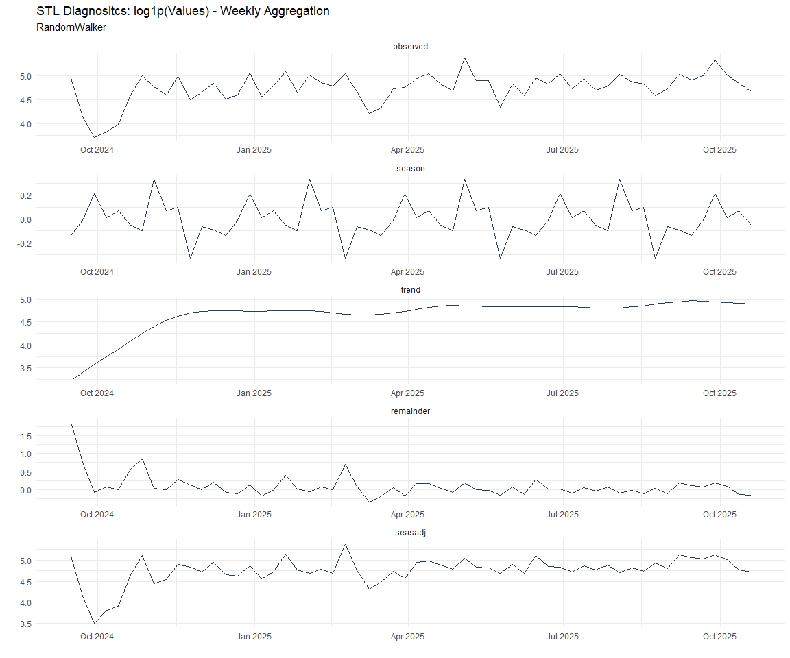

Time Series Analysis and Modeling of the Healthyverse Packages
================
Steven P. Sanderson II, MPH - Data Scientist/IT Manager
24 May, 2022

## Get Data

``` r
glimpse(downloads_tbl)
```

    ## Rows: 37,691
    ## Columns: 11
    ## $ date      <date> 2020-11-23, 2020-11-23, 2020-11-23, 2020-11-23, 2020-11-23,…
    ## $ time      <Period> 15H 36M 55S, 11H 26M 39S, 23H 34M 44S, 18H 39M 32S, 9H 0M…
    ## $ date_time <dttm> 2020-11-23 15:36:55, 2020-11-23 11:26:39, 2020-11-23 23:34:…
    ## $ size      <int> 4858294, 4858294, 4858301, 4858295, 361, 4863722, 4864794, 4…
    ## $ r_version <chr> NA, "4.0.3", "3.5.3", "3.5.2", NA, NA, NA, NA, NA, NA, NA, N…
    ## $ r_arch    <chr> NA, "x86_64", "x86_64", "x86_64", NA, NA, NA, NA, NA, NA, NA…
    ## $ r_os      <chr> NA, "mingw32", "mingw32", "linux-gnu", NA, NA, NA, NA, NA, N…
    ## $ package   <chr> "healthyR.data", "healthyR.data", "healthyR.data", "healthyR…
    ## $ version   <chr> "1.0.0", "1.0.0", "1.0.0", "1.0.0", "1.0.0", "1.0.0", "1.0.0…
    ## $ country   <chr> "US", "US", "US", "GB", "US", "US", "DE", "HK", "JP", "US", …
    ## $ ip_id     <int> 2069, 2804, 78827, 27595, 90474, 90474, 42435, 74, 7655, 638…

The last day in the data set is 2022-05-22 19:42:39, the file was
birthed on: 2021-11-29 11:38:26, and at report knit time is -4179.07
hours old. Happy analyzing!

Now that we have our data lets take a look at it using the `skimr`
package.

``` r
skim(downloads_tbl)
```

|                                                  |               |
|:-------------------------------------------------|:--------------|
| Name                                             | downloads_tbl |
| Number of rows                                   | 37691         |
| Number of columns                                | 11            |
| \_\_\_\_\_\_\_\_\_\_\_\_\_\_\_\_\_\_\_\_\_\_\_   |               |
| Column type frequency:                           |               |
| character                                        | 6             |
| Date                                             | 1             |
| numeric                                          | 2             |
| POSIXct                                          | 1             |
| Timespan                                         | 1             |
| \_\_\_\_\_\_\_\_\_\_\_\_\_\_\_\_\_\_\_\_\_\_\_\_ |               |
| Group variables                                  | None          |

Data summary

**Variable type: character**

| skim_variable | n_missing | complete_rate | min | max | empty | n_unique | whitespace |
|:--------------|----------:|--------------:|----:|----:|------:|---------:|-----------:|
| r_version     |     25293 |          0.33 |   5 |   5 |     0 |       31 |          0 |
| r_arch        |     25293 |          0.33 |   3 |   7 |     0 |        5 |          0 |
| r_os          |     25293 |          0.33 |   7 |  15 |     0 |       11 |          0 |
| package       |         0 |          1.00 |   8 |  13 |     0 |        6 |          0 |
| version       |         0 |          1.00 |   5 |   5 |     0 |       21 |          0 |
| country       |      3027 |          0.92 |   2 |   2 |     0 |      108 |          0 |

**Variable type: Date**

| skim_variable | n_missing | complete_rate | min        | max        | median     | n_unique |
|:--------------|----------:|--------------:|:-----------|:-----------|:-----------|---------:|
| date          |         0 |             1 | 2020-11-23 | 2022-05-22 | 2021-10-26 |      546 |

**Variable type: numeric**

| skim_variable | n_missing | complete_rate |       mean |         sd |  p0 |   p25 |    p50 |     p75 |    p100 | hist  |
|:--------------|----------:|--------------:|-----------:|-----------:|----:|------:|-------:|--------:|--------:|:------|
| size          |         0 |             1 | 1451090.96 | 1825945.04 | 357 | 16873 | 271489 | 3241524 | 5677952 | ▇▁▂▂▁ |
| ip_id         |         0 |             1 |    8704.85 |   16682.79 |   1 |   186 |   2659 |    8643 |  143633 | ▇▁▁▁▁ |

**Variable type: POSIXct**

| skim_variable | n_missing | complete_rate | min                 | max                 | median              | n_unique |
|:--------------|----------:|--------------:|:--------------------|:--------------------|:--------------------|---------:|
| date_time     |         0 |             1 | 2020-11-23 09:00:41 | 2022-05-22 19:42:39 | 2021-10-26 05:20:30 |    21916 |

**Variable type: Timespan**

| skim_variable | n_missing | complete_rate | min | max |      median | n_unique |
|:--------------|----------:|--------------:|----:|----:|------------:|---------:|
| time          |         0 |             1 |   0 |  59 | 11H 11M 15S |       60 |

We can see that the following columns are missing a lot of data and for
us are most likely not useful anyways, so we will drop them
`c(r_version, r_arch, r_os)`

## Plots

Now lets take a look at a time-series plot of the total daily downloads
by package. We will use a log scale and place a vertical line at each
version release for each package.

<!-- --><!-- -->

Now lets take a look at some time series decomposition graphs.

<!-- --><!-- --><!-- --><!-- -->

## Feature Engineering

Now that we have our basic data and a shot of what it looks like, let’s
add some features to our data which can be very helpful in modeling.
Lets start by making a `tibble` that is aggregated by the day and
package, as we are going to be interested in forecasting the next 4
weeks or 28 days for each package. First lets get our base data.

Now we are going to do some basic pre-processing.

``` r
data_padded_tbl <- base_data %>%
  pad_by_time(
    .date_var  = date,
    .pad_value = 0
  )

# Get log interval and standardization parameters
log_params  <- liv(data_padded_tbl$value, limit_lower = 0, offset = 1, silent = TRUE)
limit_lower <- log_params$limit_lower
limit_upper <- log_params$limit_upper
offset      <- log_params$offset

data_liv_tbl <- data_padded_tbl %>%
  # Get log interval transform
  mutate(value_trans = liv(value, limit_lower = 0, offset = 1, silent = TRUE)$log_scaled)

# Get Standardization Params
std_params <- standard_vec(data_liv_tbl$value_trans, silent = TRUE)
std_mean   <- std_params$mean
std_sd     <- std_params$sd

data_transformed_tbl <- data_liv_tbl %>%
  # get standardization
  mutate(value_trans = standard_vec(value_trans, silent = TRUE)$standard_scaled) %>%
  select(-value)
```

Now that we have our full data set and saved our parameters we can
create the full data set.

``` r
horizon         <- 4*7
lag_period      <- 4*7
rolling_periods <- c(7, 14, 28)

data_prepared_full_tbl <- data_transformed_tbl %>%
  group_by(package) %>%
  
  # Add future windows
  bind_rows(
    future_frame(., .date_var = date, .length_out = horizon)
  ) %>%
  
  # Add autocorolated lags
  tk_augment_lags(value_trans, .lags = lag_period) %>%
  
  # Add rolling features
  tk_augment_slidify(
    .value     = value_trans_lag28
    , .f       = median
    , .period  = rolling_periods
    , .align   = "center"
    , .partial = TRUE
  ) %>%
  
  # Format columns
  rename_with(.cols = contains("lag"), .fn = ~ str_c("lag_", .)) %>%
  select(date, package, everything()) %>%
  ungroup()

data_prepared_full_tbl %>% 
  group_by(package) %>% 
  pivot_longer(-c(date, package)) %>% 
  plot_time_series(
    .date_var = date
    , .value = value
    , .color_var = name
    , .smooth = FALSE
    , .interactive = FALSE
    , .facet_scales = "free"
  ) +
  theme_minimal() +
  theme(legend.position = "bottom")
```

<!-- -->

Since this is panel data we can follow one of two different modeling
strategies. We can search for a global model in the panel data or we can
use nested forecasting finding the best model for each of the time
series. Since we only have 5 panels, we will use nested forecasting.

To do this we will use the `nest_timeseries` and
`split_nested_timeseries` functions to create a nested `tibble`.

``` r
data_prepared_tbl <- data_prepared_full_tbl %>%
  filter(!is.na(value_trans))

forecast_tbl <- data_prepared_full_tbl %>%
  filter(is.na(value_trans))

nested_data_tbl <- data_prepared_tbl %>%
  nest_timeseries(
    .id_var = package
    , .length_future = horizon
  ) %>%
  split_nested_timeseries(
    .length_test = horizon
  )
```

Now it is time to make some recipes and models using the modeltime
workflow.

## Modeltime Workflow

### Recipe Object

``` r
recipe_base <- recipe(
  value_trans ~ .
  , data = extract_nested_test_split(nested_data_tbl)
  ) %>%
  step_mutate(yr = lubridate::year(date)) %>%
  step_harmonic(yr, frequency = 365/12, cycle_size = 1) %>%
  step_hai_fourier(value_trans, scale_type = "sincos", period = 365/12, order = 1) %>%
  step_lag(value_trans, lag = 1) %>%
  step_impute_knn(contains("lag_"))

recipe_base
```

    ## Recipe
    ## 
    ## Inputs:
    ## 
    ##       role #variables
    ##    outcome          1
    ##  predictor          5
    ## 
    ## Operations:
    ## 
    ## Variable mutation for lubridate::year(date)
    ## Harmonic numeric variables for yr
    ## Fourier Transformation on value_trans
    ## Lagging value_trans
    ## K-nearest neighbor imputation for contains("lag_")

### Models

``` r
# Models ------------------------------------------------------------------

# Auto ARIMA --------------------------------------------------------------

model_spec_arima_no_boost <- arima_reg() %>%
  set_engine(engine = "auto_arima")

wflw_auto_arima <- workflow() %>%
  add_recipe(recipe = recipe_base) %>%
  add_model(model_spec_arima_no_boost)

# NNETAR ------------------------------------------------------------------

model_spec_nnetar <- nnetar_reg(
  mode              = "regression"
  , seasonal_period = "auto"
) %>%
  set_engine("nnetar")

wflw_nnetar <- workflow() %>%
  add_recipe(recipe = recipe_base) %>%
  add_model(model_spec_nnetar)

# TSLM --------------------------------------------------------------------

model_spec_lm <- linear_reg() %>%
  set_engine("lm")

wflw_lm <- workflow() %>%
  add_recipe(recipe = recipe_base) %>%
  add_model(model_spec_lm)

model_spec_glm <- linear_reg(
  penalty = 1,
  mixture = 0.5
) %>%
  set_engine("glmnet")

wflw_glm <- workflow() %>%
  add_recipe(recipe = recipe_base) %>%
  add_model(model_spec_glm)

# MARS --------------------------------------------------------------------

model_spec_mars <- mars(mode = "regression") %>%
  set_engine("earth")

wflw_mars <- workflow() %>%
  add_recipe(recipe = recipe_base) %>%
  add_model(model_spec_mars)
```

### Nested Modeltime Tables

``` r
nested_modeltime_tbl <- modeltime_nested_fit(
  # Nested Data
  nested_data = nested_data_tbl,
   control = control_nested_fit(
     verbose = TRUE,
     allow_par = FALSE
   ),
  # Add workflows
  wflw_auto_arima,
  wflw_glm,
  wflw_lm,
  wflw_mars,
  wflw_nnetar
)
```

``` r
nested_modeltime_tbl
```

    ## # Nested Modeltime Table
    ##   # A tibble: 6 × 5
    ##   package       .actual_data      .future_data .splits          .modeltime_tabl…
    ##   <chr>         <list>            <list>       <list>           <list>          
    ## 1 healthyR.data <tibble>          <tibble>     <split [487|28]> <mdl_time_tbl>  
    ## 2 healthyR      <tibble>          <tibble>     <split [479|28]> <mdl_time_tbl>  
    ## 3 healthyR.ts   <tibble>          <tibble>     <split [428|28]> <mdl_time_tbl>  
    ## 4 healthyverse  <tibble>          <tibble>     <split [404|28]> <mdl_time_tbl>  
    ## 5 healthyR.ai   <tibble>          <tibble>     <split [218|28]> <mdl_time_tbl>  
    ## 6 TidyDensity   <tibble [94 × 6]> <tibble>     <split [66|28]>  <mdl_time_tbl>

### Model Accuracy

``` r
nested_modeltime_tbl %>%
  extract_nested_test_accuracy() %>%
  knitr::kable()
```

| package       | .model_id | .model_desc | .type |       mae |        mape |      mase |      smape |      rmse |       rsq |
|:--------------|----------:|:------------|:------|----------:|------------:|----------:|-----------:|----------:|----------:|
| healthyR.data |         1 | REGRESSION  | Test  | 0.0605038 |   8.5556832 | 0.0393451 |  8.4450390 | 0.0780486 | 0.9939475 |
| healthyR.data |         2 | NULL        | NA    |        NA |          NA |        NA |         NA |        NA |        NA |
| healthyR.data |         3 | LM          | Test  | 0.0711214 |  10.2947966 | 0.0462497 | 10.0545088 | 0.0875842 | 0.9927818 |
| healthyR.data |         4 | EARTH       | Test  | 0.0419573 |   5.3379549 | 0.0272845 |  5.1363133 | 0.0749482 | 0.9950180 |
| healthyR.data |         5 | NNAR        | Test  | 0.0509993 |   4.1006247 | 0.0331644 |  3.7198825 | 0.1866617 | 0.9748751 |
| healthyR      |         1 | REGRESSION  | Test  | 0.0405594 |  13.0142120 | 0.0307029 | 10.7855948 | 0.0471024 | 0.9980672 |
| healthyR      |         2 | NULL        | NA    |        NA |          NA |        NA |         NA |        NA |        NA |
| healthyR      |         3 | LM          | Test  | 0.0410297 |  13.3241504 | 0.0310589 | 10.8982989 | 0.0479137 | 0.9980718 |
| healthyR      |         4 | EARTH       | Test  | 0.0160608 |   3.1389425 | 0.0121578 |  3.0644531 | 0.0233990 | 0.9997829 |
| healthyR      |         5 | NNAR        | Test  | 0.0469208 |   5.2200138 | 0.0355184 |  5.1004026 | 0.1316701 | 0.9872975 |
| healthyR.ts   |         1 | REGRESSION  | Test  | 0.0430583 |   8.0000505 | 0.0310229 |  7.4697598 | 0.0537205 | 0.9974940 |
| healthyR.ts   |         2 | NULL        | NA    |        NA |          NA |        NA |         NA |        NA |        NA |
| healthyR.ts   |         3 | LM          | Test  | 0.0427144 |   8.7169515 | 0.0307751 |  8.0571531 | 0.0527073 | 0.9976142 |
| healthyR.ts   |         4 | EARTH       | Test  | 0.0154458 |   2.9928457 | 0.0111285 |  2.9257897 | 0.0182223 | 0.9998908 |
| healthyR.ts   |         5 | NNAR        | Test  | 0.0090386 |   1.8178539 | 0.0065122 |  1.8790278 | 0.0176233 | 0.9997899 |
| healthyverse  |         1 | REGRESSION  | Test  | 0.0370688 |   9.6304238 | 0.0312504 |  8.8184513 | 0.0448737 | 0.9979908 |
| healthyverse  |         2 | NULL        | NA    |        NA |          NA |        NA |         NA |        NA |        NA |
| healthyverse  |         3 | LM          | Test  | 0.0358776 |   9.3389465 | 0.0302462 |  8.4143572 | 0.0436287 | 0.9979978 |
| healthyverse  |         4 | EARTH       | Test  | 0.0110146 |   3.1431906 | 0.0092857 |  3.2119274 | 0.0152070 | 0.9997198 |
| healthyverse  |         5 | NNAR        | Test  | 0.0059736 |   0.9182168 | 0.0050360 |  0.9277768 | 0.0102058 | 0.9999020 |
| healthyR.ai   |         1 | NULL        | NA    |        NA |          NA |        NA |         NA |        NA |        NA |
| healthyR.ai   |         2 | NULL        | NA    |        NA |          NA |        NA |         NA |        NA |        NA |
| healthyR.ai   |         3 | LM          | Test  | 0.0435896 |   8.9241303 | 0.0318605 |  8.3596431 | 0.0606284 | 0.9964431 |
| healthyR.ai   |         4 | EARTH       | Test  | 0.0163764 |   2.6263908 | 0.0119698 |  2.5892038 | 0.0205300 | 0.9996765 |
| healthyR.ai   |         5 | NNAR        | Test  | 0.0209010 |   5.1728226 | 0.0152769 |  3.9478070 | 0.0493585 | 0.9986002 |
| TidyDensity   |         1 | REGRESSION  | Test  | 0.0491880 |  15.2293768 | 0.0344684 | 14.0090082 | 0.0586422 | 0.9972521 |
| TidyDensity   |         2 | NULL        | NA    |        NA |          NA |        NA |         NA |        NA |        NA |
| TidyDensity   |         3 | LM          | Test  | 0.1275915 |  52.1320565 | 0.0894095 | 42.8501254 | 0.1403228 | 0.9956682 |
| TidyDensity   |         4 | EARTH       | Test  | 0.0119457 |   1.2205625 | 0.0083709 |  1.2183128 | 0.0177679 | 0.9997312 |
| TidyDensity   |         5 | NNAR        | Test  | 0.4459022 | 146.6879444 | 0.3124652 | 87.1139469 | 0.5331913 | 0.9548403 |

### Plot Models

``` r
nested_modeltime_tbl %>%
  extract_nested_test_forecast() %>%
  group_by(package) %>%
  plot_modeltime_forecast(
    .interactive = FALSE,
    .conf_interval_show  = FALSE,
    .facet_scales = "free"
  ) +
  theme_minimal() +
  theme(legend.position = "bottom")
```

<!-- -->

### Best Model

``` r
best_nested_modeltime_tbl <- nested_modeltime_tbl %>%
  modeltime_nested_select_best(
    metric = "rmse",
    minimize = TRUE,
    filter_test_forecasts = TRUE
  )

best_nested_modeltime_tbl %>%
  extract_nested_best_model_report()
```

    ## # Nested Modeltime Table
    ##   # A tibble: 6 × 10
    ##   package   .model_id .model_desc .type     mae  mape    mase smape   rmse   rsq
    ##   <chr>         <int> <chr>       <chr>   <dbl> <dbl>   <dbl> <dbl>  <dbl> <dbl>
    ## 1 healthyR…         4 EARTH       Test  0.0420  5.34  0.0273  5.14  0.0749 0.995
    ## 2 healthyR          4 EARTH       Test  0.0161  3.14  0.0122  3.06  0.0234 1.00 
    ## 3 healthyR…         5 NNAR        Test  0.00904 1.82  0.00651 1.88  0.0176 1.00 
    ## 4 healthyv…         5 NNAR        Test  0.00597 0.918 0.00504 0.928 0.0102 1.00 
    ## 5 healthyR…         4 EARTH       Test  0.0164  2.63  0.0120  2.59  0.0205 1.00 
    ## 6 TidyDens…         4 EARTH       Test  0.0119  1.22  0.00837 1.22  0.0178 1.00

``` r
best_nested_modeltime_tbl %>%
  extract_nested_test_forecast() %>%
  filter(!is.na(.model_id)) %>%
  group_by(package) %>%
  plot_modeltime_forecast(
    .interactive = FALSE,
    .conf_interval_alpha = 0.2,
    .facet_scales = "free"
  ) +
  theme_minimal() +
  theme(legend.position = "bottom")
```

<!-- -->

## Refitting and Future Forecast

Now that we have the best models, we can make our future forecasts.

``` r
nested_modeltime_refit_tbl <- best_nested_modeltime_tbl %>%
  modeltime_nested_refit(
    control = control_nested_refit(
      verbose = TRUE, 
      allow_par = FALSE
    )
  )
```

``` r
nested_modeltime_refit_tbl
```

    ## # Nested Modeltime Table
    ##   # A tibble: 6 × 5
    ##   package       .actual_data      .future_data .splits          .modeltime_tabl…
    ##   <chr>         <list>            <list>       <list>           <list>          
    ## 1 healthyR.data <tibble>          <tibble>     <split [487|28]> <mdl_time_tbl>  
    ## 2 healthyR      <tibble>          <tibble>     <split [479|28]> <mdl_time_tbl>  
    ## 3 healthyR.ts   <tibble>          <tibble>     <split [428|28]> <mdl_time_tbl>  
    ## 4 healthyverse  <tibble>          <tibble>     <split [404|28]> <mdl_time_tbl>  
    ## 5 healthyR.ai   <tibble>          <tibble>     <split [218|28]> <mdl_time_tbl>  
    ## 6 TidyDensity   <tibble [94 × 6]> <tibble>     <split [66|28]>  <mdl_time_tbl>

``` r
nested_modeltime_refit_tbl %>%
  extract_nested_future_forecast() %>%
  mutate(across(.value:.conf_hi, .fns = ~ standard_inv_vec(
    x    = .,
    mean = std_mean,
    sd   = std_sd
  )$standard_inverse_value)) %>%
  mutate(across(.value:.conf_hi, .fns = ~ liiv(
    x = .,
    limit_lower = limit_lower,
    limit_upper = limit_upper,
    offset      = offset
  )$rescaled_v)) %>%
  group_by(package) %>%
  plot_modeltime_forecast(
    .interactive = FALSE,
    .conf_interval_alpha = 0.2,
    .facet_scales = "free"
  ) +
  theme_minimal() +
  theme(legend.position = "bottom")
```

<!-- -->
