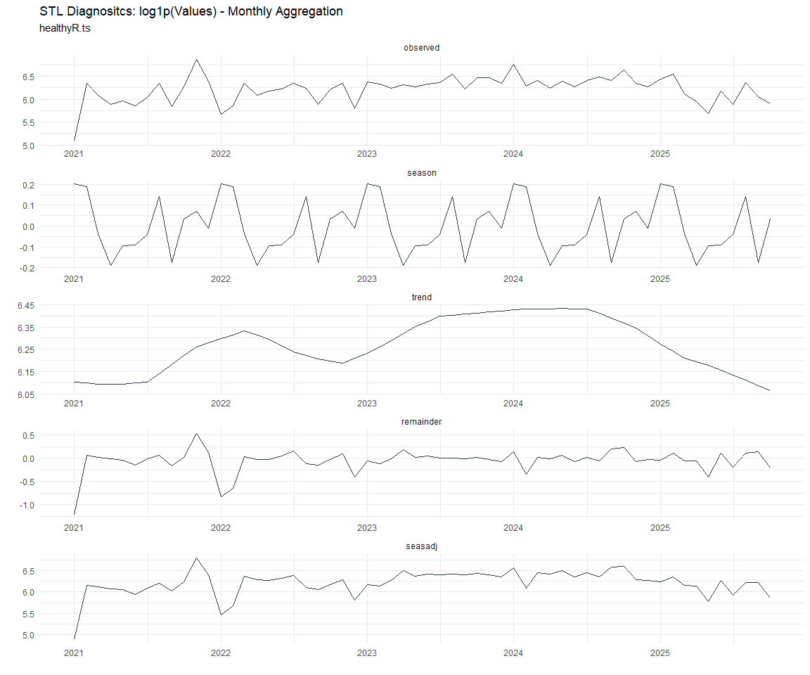
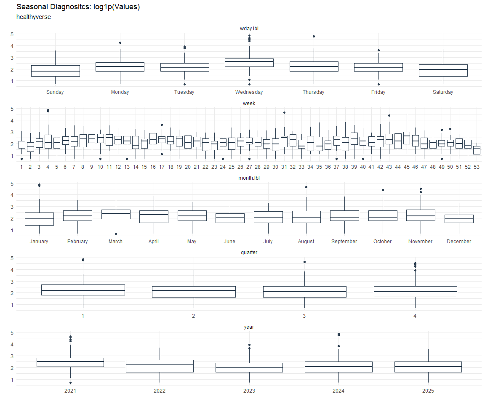

# Time Series Analysis, Modeling and Forecasting of the Healthyverse
Packages
Steven P. Sanderson II, MPH - Date:
2025-11-28

# Introduction

This analysis follows a *Nested Modeltime Workflow* from **`modeltime`**
along with using the **`NNS`** package. I use this to monitor the
downloads of all of my packages:

- [`healthyR`](https://www.spsanderson.com/healthyR/)
- [`healthyR.data`](https://www.spsanderson.com/healthyR.data/)
- [`healthyR.ts`](https://www.spsanderson.com/healthyR.ts/)
- [`healthyR.ai`](https://www.spsanderson.com/healthyR.ai/)
- [`healthyverse`](https://www.spsanderson.com/healthyverse/)
- [`TidyDensity`](https://www.spsanderson.com/TidyDensity/)
- [`tidyAML`](https://www.spsanderson.com/tidyAML/)
- [`RandomWalker`](https://www.spsanderson.com/RandomWalker/)

## Get Data

``` r
glimpse(downloads_tbl)
```

    Rows: 161,421
    Columns: 11
    $ date      <date> 2020-11-23, 2020-11-23, 2020-11-23, 2020-11-23, 2020-11-23,…
    $ time      <Period> 15H 36M 55S, 11H 26M 39S, 23H 34M 44S, 18H 39M 32S, 9H 0M…
    $ date_time <dttm> 2020-11-23 15:36:55, 2020-11-23 11:26:39, 2020-11-23 23:34:…
    $ size      <int> 4858294, 4858294, 4858301, 4858295, 361, 4863722, 4864794, 4…
    $ r_version <chr> NA, "4.0.3", "3.5.3", "3.5.2", NA, NA, NA, NA, NA, NA, NA, N…
    $ r_arch    <chr> NA, "x86_64", "x86_64", "x86_64", NA, NA, NA, NA, NA, NA, NA…
    $ r_os      <chr> NA, "mingw32", "mingw32", "linux-gnu", NA, NA, NA, NA, NA, N…
    $ package   <chr> "healthyR.data", "healthyR.data", "healthyR.data", "healthyR…
    $ version   <chr> "1.0.0", "1.0.0", "1.0.0", "1.0.0", "1.0.0", "1.0.0", "1.0.0…
    $ country   <chr> "US", "US", "US", "GB", "US", "US", "DE", "HK", "JP", "US", …
    $ ip_id     <int> 2069, 2804, 78827, 27595, 90474, 90474, 42435, 74, 7655, 638…

The last day in the data set is 2025-11-26 23:05:03, the file was
birthed on: 2022-07-02 23:58:17.511888, and at report knit time is
2.982711^{4} hours old. Happy analyzing!

Now that we have our data lets take a look at it using the `skimr`
package.

``` r
skim(downloads_tbl)
```

|                                                  |               |
|:-------------------------------------------------|:--------------|
| Name                                             | downloads_tbl |
| Number of rows                                   | 161421        |
| Number of columns                                | 11            |
| \_\_\_\_\_\_\_\_\_\_\_\_\_\_\_\_\_\_\_\_\_\_\_   |               |
| Column type frequency:                           |               |
| character                                        | 6             |
| Date                                             | 1             |
| numeric                                          | 2             |
| POSIXct                                          | 1             |
| Timespan                                         | 1             |
| \_\_\_\_\_\_\_\_\_\_\_\_\_\_\_\_\_\_\_\_\_\_\_\_ |               |
| Group variables                                  | None          |

Data summary

**Variable type: character**

| skim_variable | n_missing | complete_rate | min | max | empty | n_unique | whitespace |
|:--------------|----------:|--------------:|----:|----:|------:|---------:|-----------:|
| r_version     |    118405 |          0.27 |   5 |   7 |     0 |       50 |          0 |
| r_arch        |    118405 |          0.27 |   1 |   7 |     0 |        6 |          0 |
| r_os          |    118405 |          0.27 |   7 |  19 |     0 |       24 |          0 |
| package       |         0 |          1.00 |   7 |  13 |     0 |        8 |          0 |
| version       |         0 |          1.00 |   5 |  17 |     0 |       62 |          0 |
| country       |     15150 |          0.91 |   2 |   2 |     0 |      166 |          0 |

**Variable type: Date**

| skim_variable | n_missing | complete_rate | min | max | median | n_unique |
|:---|---:|---:|:---|:---|:---|---:|
| date | 0 | 1 | 2020-11-23 | 2025-11-26 | 2023-10-31 | 1823 |

**Variable type: numeric**

| skim_variable | n_missing | complete_rate | mean | sd | p0 | p25 | p50 | p75 | p100 | hist |
|:---|---:|---:|---:|---:|---:|---:|---:|---:|---:|:---|
| size | 0 | 1 | 1124481.3 | 1489350.96 | 355 | 27068 | 310137 | 2354888 | 5677952 | ▇▁▂▁▁ |
| ip_id | 0 | 1 | 11329.3 | 21985.02 | 1 | 227 | 2889 | 11961 | 299146 | ▇▁▁▁▁ |

**Variable type: POSIXct**

| skim_variable | n_missing | complete_rate | min | max | median | n_unique |
|:---|---:|---:|:---|:---|:---|---:|
| date_time | 0 | 1 | 2020-11-23 09:00:41 | 2025-11-26 23:05:03 | 2023-10-31 10:18:32 | 101727 |

**Variable type: Timespan**

| skim_variable | n_missing | complete_rate | min | max |     median | n_unique |
|:--------------|----------:|--------------:|----:|----:|-----------:|---------:|
| time          |         0 |             1 |   0 |  59 | 12H 6M 30S |       60 |

We can see that the following columns are missing a lot of data and for
us are most likely not useful anyways, so we will drop them
`c(r_version, r_arch, r_os)`

## Plots

Now lets take a look at a time-series plot of the total daily downloads
by package. We will use a log scale and place a vertical line at each
version release for each package.


    [[1]]


    [[2]]


    [[3]]


    [[4]]


    [[5]]


    [[6]]


    [[7]]


    [[8]]


Now lets take a look at some time series decomposition graphs.

    [[1]]


    [[2]]


    [[3]]


    [[4]]


    [[5]]


    [[6]]


    [[7]]


    [[8]]


    [[1]]


    [[2]]


    [[3]]


    [[4]]


    [[5]]


    [[6]]




    [[7]]


    [[8]]


Seasonal Diagnostics:

    [[1]]


    [[2]]


    [[3]]


    [[4]]


    [[5]]


    [[6]]


    [[7]]




    [[8]]


ACF and PACF Diagnostics:

    [[1]]


    [[2]]


    [[3]]


    [[4]]


    [[5]]


    [[6]]


    [[7]]


    [[8]]


## Feature Engineering

Now that we have our basic data and a shot of what it looks like, let’s
add some features to our data which can be very helpful in modeling.
Lets start by making a `tibble` that is aggregated by the day and
package, as we are going to be interested in forecasting the next 4
weeks or 28 days for each package. First lets get our base data.


    Call:
    stats::lm(formula = .formula, data = df)

    Residuals:
        Min      1Q  Median      3Q     Max 
    -145.66  -36.57  -11.27   27.12  819.90 

    Coefficients:
                                                         Estimate Std. Error
    (Intercept)                                        -1.860e+02  6.113e+01
    date                                                1.137e-02  3.242e-03
    lag(value, 1)                                       1.106e-01  2.328e-02
    lag(value, 7)                                       8.916e-02  2.401e-02
    lag(value, 14)                                      7.676e-02  2.396e-02
    lag(value, 21)                                      8.233e-02  2.406e-02
    lag(value, 28)                                      6.572e-02  2.400e-02
    lag(value, 35)                                      5.654e-02  2.404e-02
    lag(value, 42)                                      6.135e-02  2.416e-02
    lag(value, 49)                                      6.050e-02  2.406e-02
    month(date, label = TRUE).L                        -1.034e+01  5.061e+00
    month(date, label = TRUE).Q                         7.732e-01  5.000e+00
    month(date, label = TRUE).C                        -1.553e+01  5.023e+00
    month(date, label = TRUE)^4                        -5.854e+00  4.982e+00
    month(date, label = TRUE)^5                        -6.533e+00  4.931e+00
    month(date, label = TRUE)^6                         1.404e+00  4.938e+00
    month(date, label = TRUE)^7                        -4.446e+00  4.861e+00
    month(date, label = TRUE)^8                        -3.961e+00  4.830e+00
    month(date, label = TRUE)^9                         2.743e+00  4.838e+00
    month(date, label = TRUE)^10                        8.983e-01  4.854e+00
    month(date, label = TRUE)^11                       -4.041e+00  4.840e+00
    fourier_vec(date, type = "sin", K = 1, period = 7) -1.143e+01  2.226e+00
    fourier_vec(date, type = "cos", K = 1, period = 7)  7.278e+00  2.306e+00
                                                       t value Pr(>|t|)    
    (Intercept)                                         -3.042 0.002383 ** 
    date                                                 3.509 0.000462 ***
    lag(value, 1)                                        4.749 2.21e-06 ***
    lag(value, 7)                                        3.713 0.000211 ***
    lag(value, 14)                                       3.203 0.001384 ** 
    lag(value, 21)                                       3.422 0.000637 ***
    lag(value, 28)                                       2.738 0.006248 ** 
    lag(value, 35)                                       2.351 0.018810 *  
    lag(value, 42)                                       2.539 0.011203 *  
    lag(value, 49)                                       2.514 0.012010 *  
    month(date, label = TRUE).L                         -2.044 0.041122 *  
    month(date, label = TRUE).Q                          0.155 0.877122    
    month(date, label = TRUE).C                         -3.092 0.002022 ** 
    month(date, label = TRUE)^4                         -1.175 0.240172    
    month(date, label = TRUE)^5                         -1.325 0.185391    
    month(date, label = TRUE)^6                          0.284 0.776269    
    month(date, label = TRUE)^7                         -0.915 0.360547    
    month(date, label = TRUE)^8                         -0.820 0.412222    
    month(date, label = TRUE)^9                          0.567 0.570739    
    month(date, label = TRUE)^10                         0.185 0.853200    
    month(date, label = TRUE)^11                        -0.835 0.403908    
    fourier_vec(date, type = "sin", K = 1, period = 7)  -5.136 3.12e-07 ***
    fourier_vec(date, type = "cos", K = 1, period = 7)   3.156 0.001625 ** 
    ---
    Signif. codes:  0 '***' 0.001 '**' 0.01 '*' 0.05 '.' 0.1 ' ' 1

    Residual standard error: 59.37 on 1751 degrees of freedom
      (49 observations deleted due to missingness)
    Multiple R-squared:  0.2303,    Adjusted R-squared:  0.2206 
    F-statistic: 23.81 on 22 and 1751 DF,  p-value: < 2.2e-16


## NNS Forecasting

This is something I have been wanting to try for a while. The `NNS`
package is a great package for forecasting time series data.

[NNS GitHub](https://github.com/OVVO-Financial/NNS)

``` r
library(NNS)

data_list <- base_data |>
    select(package, value) |>
    group_split(package)

data_list |>
    imap(
        \(x, idx) {
            obj <- x
            x <- obj |> pull(value) |> tail(7*52)
            train_set_size <- length(x) - 56
            pkg <- obj |> pluck(1) |> unique()
#            sf <- NNS.seas(x, modulo = 7, plot = FALSE)$periods
            seas <- t(
                sapply(
                    1:25, 
                    function(i) c(
                        i,
                        sqrt(
                            mean((
                                NNS.ARMA(x, 
                                         h = 28, 
                                         training.set = train_set_size, 
                                         method = "lin", 
                                         seasonal.factor = i, 
                                         plot=FALSE
                                         ) - tail(x, 28)) ^ 2)))
                    )
                )
            colnames(seas) <- c("Period", "RMSE")
            sf <- seas[which.min(seas[, 2]), 1]
            
            cat(paste0("Package: ", pkg, "\n"))
            NNS.ARMA.optim(
                variable = x,
                h = 28,
                training.set = train_set_size,
                #seasonal.factor = seq(12, 60, 7),
                seasonal.factor = sf,
                pred.int = 0.95,
                plot = TRUE
            )
            title(
                sub = paste0("\n",
                             "Package: ", pkg, " - NNS Optimization")
            )
        }
    )
```

    Package: healthyR
    [1] "CURRNET METHOD: lin"
    [1] "COPY LATEST PARAMETERS DIRECTLY FOR NNS.ARMA() IF ERROR:"
    [1] "NNS.ARMA(... method =  'lin' , seasonal.factor =  c( 12 ) ...)"
    [1] "CURRENT lin OBJECTIVE FUNCTION = 5.87829711587755"
    [1] "BEST method = 'lin' PATH MEMBER = c( 12 )"
    [1] "BEST lin OBJECTIVE FUNCTION = 5.87829711587755"
    [1] "CURRNET METHOD: nonlin"
    [1] "COPY LATEST PARAMETERS DIRECTLY FOR NNS.ARMA() IF ERROR:"
    [1] "NNS.ARMA(... method =  'nonlin' , seasonal.factor =  c( 12 ) ...)"
    [1] "CURRENT nonlin OBJECTIVE FUNCTION = 7.75321741652326"
    [1] "BEST method = 'nonlin' PATH MEMBER = c( 12 )"
    [1] "BEST nonlin OBJECTIVE FUNCTION = 7.75321741652326"
    [1] "CURRNET METHOD: both"
    [1] "COPY LATEST PARAMETERS DIRECTLY FOR NNS.ARMA() IF ERROR:"
    [1] "NNS.ARMA(... method =  'both' , seasonal.factor =  c( 12 ) ...)"
    [1] "CURRENT both OBJECTIVE FUNCTION = 5.69045287431933"
    [1] "BEST method = 'both' PATH MEMBER = c( 12 )"
    [1] "BEST both OBJECTIVE FUNCTION = 5.69045287431933"


    Package: healthyR.ai
    [1] "CURRNET METHOD: lin"
    [1] "COPY LATEST PARAMETERS DIRECTLY FOR NNS.ARMA() IF ERROR:"
    [1] "NNS.ARMA(... method =  'lin' , seasonal.factor =  c( 6 ) ...)"
    [1] "CURRENT lin OBJECTIVE FUNCTION = 16.2364986397636"
    [1] "BEST method = 'lin' PATH MEMBER = c( 6 )"
    [1] "BEST lin OBJECTIVE FUNCTION = 16.2364986397636"
    [1] "CURRNET METHOD: nonlin"
    [1] "COPY LATEST PARAMETERS DIRECTLY FOR NNS.ARMA() IF ERROR:"
    [1] "NNS.ARMA(... method =  'nonlin' , seasonal.factor =  c( 6 ) ...)"
    [1] "CURRENT nonlin OBJECTIVE FUNCTION = 19.5099886140369"
    [1] "BEST method = 'nonlin' PATH MEMBER = c( 6 )"
    [1] "BEST nonlin OBJECTIVE FUNCTION = 19.5099886140369"
    [1] "CURRNET METHOD: both"
    [1] "COPY LATEST PARAMETERS DIRECTLY FOR NNS.ARMA() IF ERROR:"
    [1] "NNS.ARMA(... method =  'both' , seasonal.factor =  c( 6 ) ...)"
    [1] "CURRENT both OBJECTIVE FUNCTION = 26.863157428609"
    [1] "BEST method = 'both' PATH MEMBER = c( 6 )"
    [1] "BEST both OBJECTIVE FUNCTION = 26.863157428609"


    Package: healthyR.data
    [1] "CURRNET METHOD: lin"
    [1] "COPY LATEST PARAMETERS DIRECTLY FOR NNS.ARMA() IF ERROR:"
    [1] "NNS.ARMA(... method =  'lin' , seasonal.factor =  c( 1 ) ...)"
    [1] "CURRENT lin OBJECTIVE FUNCTION = 3464.431610376"
    [1] "BEST method = 'lin' PATH MEMBER = c( 1 )"
    [1] "BEST lin OBJECTIVE FUNCTION = 3464.431610376"
    [1] "CURRNET METHOD: nonlin"
    [1] "COPY LATEST PARAMETERS DIRECTLY FOR NNS.ARMA() IF ERROR:"
    [1] "NNS.ARMA(... method =  'nonlin' , seasonal.factor =  c( 1 ) ...)"
    [1] "CURRENT nonlin OBJECTIVE FUNCTION = 68.3933591457815"
    [1] "BEST method = 'nonlin' PATH MEMBER = c( 1 )"
    [1] "BEST nonlin OBJECTIVE FUNCTION = 68.3933591457815"
    [1] "CURRNET METHOD: both"
    [1] "COPY LATEST PARAMETERS DIRECTLY FOR NNS.ARMA() IF ERROR:"
    [1] "NNS.ARMA(... method =  'both' , seasonal.factor =  c( 1 ) ...)"
    [1] "CURRENT both OBJECTIVE FUNCTION = 79.7754178304247"
    [1] "BEST method = 'both' PATH MEMBER = c( 1 )"
    [1] "BEST both OBJECTIVE FUNCTION = 79.7754178304247"


    Package: healthyR.ts
    [1] "CURRNET METHOD: lin"
    [1] "COPY LATEST PARAMETERS DIRECTLY FOR NNS.ARMA() IF ERROR:"
    [1] "NNS.ARMA(... method =  'lin' , seasonal.factor =  c( 11 ) ...)"
    [1] "CURRENT lin OBJECTIVE FUNCTION = 19.7439099254654"
    [1] "BEST method = 'lin' PATH MEMBER = c( 11 )"
    [1] "BEST lin OBJECTIVE FUNCTION = 19.7439099254654"
    [1] "CURRNET METHOD: nonlin"
    [1] "COPY LATEST PARAMETERS DIRECTLY FOR NNS.ARMA() IF ERROR:"
    [1] "NNS.ARMA(... method =  'nonlin' , seasonal.factor =  c( 11 ) ...)"
    [1] "CURRENT nonlin OBJECTIVE FUNCTION = 11.7718717082607"
    [1] "BEST method = 'nonlin' PATH MEMBER = c( 11 )"
    [1] "BEST nonlin OBJECTIVE FUNCTION = 11.7718717082607"
    [1] "CURRNET METHOD: both"
    [1] "COPY LATEST PARAMETERS DIRECTLY FOR NNS.ARMA() IF ERROR:"
    [1] "NNS.ARMA(... method =  'both' , seasonal.factor =  c( 11 ) ...)"
    [1] "CURRENT both OBJECTIVE FUNCTION = 17.1859847011571"
    [1] "BEST method = 'both' PATH MEMBER = c( 11 )"
    [1] "BEST both OBJECTIVE FUNCTION = 17.1859847011571"


    Package: healthyverse
    [1] "CURRNET METHOD: lin"
    [1] "COPY LATEST PARAMETERS DIRECTLY FOR NNS.ARMA() IF ERROR:"
    [1] "NNS.ARMA(... method =  'lin' , seasonal.factor =  c( 2 ) ...)"
    [1] "CURRENT lin OBJECTIVE FUNCTION = 17.2444310107178"
    [1] "BEST method = 'lin' PATH MEMBER = c( 2 )"
    [1] "BEST lin OBJECTIVE FUNCTION = 17.2444310107178"
    [1] "CURRNET METHOD: nonlin"
    [1] "COPY LATEST PARAMETERS DIRECTLY FOR NNS.ARMA() IF ERROR:"
    [1] "NNS.ARMA(... method =  'nonlin' , seasonal.factor =  c( 2 ) ...)"
    [1] "CURRENT nonlin OBJECTIVE FUNCTION = 108.605785105341"
    [1] "BEST method = 'nonlin' PATH MEMBER = c( 2 )"
    [1] "BEST nonlin OBJECTIVE FUNCTION = 108.605785105341"
    [1] "CURRNET METHOD: both"
    [1] "COPY LATEST PARAMETERS DIRECTLY FOR NNS.ARMA() IF ERROR:"
    [1] "NNS.ARMA(... method =  'both' , seasonal.factor =  c( 2 ) ...)"
    [1] "CURRENT both OBJECTIVE FUNCTION = 65.3025601331358"
    [1] "BEST method = 'both' PATH MEMBER = c( 2 )"
    [1] "BEST both OBJECTIVE FUNCTION = 65.3025601331358"


    Package: RandomWalker
    [1] "CURRNET METHOD: lin"
    [1] "COPY LATEST PARAMETERS DIRECTLY FOR NNS.ARMA() IF ERROR:"
    [1] "NNS.ARMA(... method =  'lin' , seasonal.factor =  c( 23 ) ...)"
    [1] "CURRENT lin OBJECTIVE FUNCTION = 10.187448238716"
    [1] "BEST method = 'lin' PATH MEMBER = c( 23 )"
    [1] "BEST lin OBJECTIVE FUNCTION = 10.187448238716"
    [1] "CURRNET METHOD: nonlin"
    [1] "COPY LATEST PARAMETERS DIRECTLY FOR NNS.ARMA() IF ERROR:"
    [1] "NNS.ARMA(... method =  'nonlin' , seasonal.factor =  c( 23 ) ...)"
    [1] "CURRENT nonlin OBJECTIVE FUNCTION = 8.18469864542095"
    [1] "BEST method = 'nonlin' PATH MEMBER = c( 23 )"
    [1] "BEST nonlin OBJECTIVE FUNCTION = 8.18469864542095"
    [1] "CURRNET METHOD: both"
    [1] "COPY LATEST PARAMETERS DIRECTLY FOR NNS.ARMA() IF ERROR:"
    [1] "NNS.ARMA(... method =  'both' , seasonal.factor =  c( 23 ) ...)"
    [1] "CURRENT both OBJECTIVE FUNCTION = 7.92930231481872"
    [1] "BEST method = 'both' PATH MEMBER = c( 23 )"
    [1] "BEST both OBJECTIVE FUNCTION = 7.92930231481872"


    Package: tidyAML
    [1] "CURRNET METHOD: lin"
    [1] "COPY LATEST PARAMETERS DIRECTLY FOR NNS.ARMA() IF ERROR:"
    [1] "NNS.ARMA(... method =  'lin' , seasonal.factor =  c( 5 ) ...)"
    [1] "CURRENT lin OBJECTIVE FUNCTION = 59.7991785855118"
    [1] "BEST method = 'lin' PATH MEMBER = c( 5 )"
    [1] "BEST lin OBJECTIVE FUNCTION = 59.7991785855118"
    [1] "CURRNET METHOD: nonlin"
    [1] "COPY LATEST PARAMETERS DIRECTLY FOR NNS.ARMA() IF ERROR:"
    [1] "NNS.ARMA(... method =  'nonlin' , seasonal.factor =  c( 5 ) ...)"
    [1] "CURRENT nonlin OBJECTIVE FUNCTION = 10.7485849295777"
    [1] "BEST method = 'nonlin' PATH MEMBER = c( 5 )"
    [1] "BEST nonlin OBJECTIVE FUNCTION = 10.7485849295777"
    [1] "CURRNET METHOD: both"
    [1] "COPY LATEST PARAMETERS DIRECTLY FOR NNS.ARMA() IF ERROR:"
    [1] "NNS.ARMA(... method =  'both' , seasonal.factor =  c( 5 ) ...)"
    [1] "CURRENT both OBJECTIVE FUNCTION = 16.1084500224275"
    [1] "BEST method = 'both' PATH MEMBER = c( 5 )"
    [1] "BEST both OBJECTIVE FUNCTION = 16.1084500224275"


    Package: TidyDensity
    [1] "CURRNET METHOD: lin"
    [1] "COPY LATEST PARAMETERS DIRECTLY FOR NNS.ARMA() IF ERROR:"
    [1] "NNS.ARMA(... method =  'lin' , seasonal.factor =  c( 16 ) ...)"
    [1] "CURRENT lin OBJECTIVE FUNCTION = 10.0745080763327"
    [1] "BEST method = 'lin' PATH MEMBER = c( 16 )"
    [1] "BEST lin OBJECTIVE FUNCTION = 10.0745080763327"
    [1] "CURRNET METHOD: nonlin"
    [1] "COPY LATEST PARAMETERS DIRECTLY FOR NNS.ARMA() IF ERROR:"
    [1] "NNS.ARMA(... method =  'nonlin' , seasonal.factor =  c( 16 ) ...)"
    [1] "CURRENT nonlin OBJECTIVE FUNCTION = 13.1691680796021"
    [1] "BEST method = 'nonlin' PATH MEMBER = c( 16 )"
    [1] "BEST nonlin OBJECTIVE FUNCTION = 13.1691680796021"
    [1] "CURRNET METHOD: both"
    [1] "COPY LATEST PARAMETERS DIRECTLY FOR NNS.ARMA() IF ERROR:"
    [1] "NNS.ARMA(... method =  'both' , seasonal.factor =  c( 16 ) ...)"
    [1] "CURRENT both OBJECTIVE FUNCTION = 9.85652665895305"
    [1] "BEST method = 'both' PATH MEMBER = c( 16 )"
    [1] "BEST both OBJECTIVE FUNCTION = 9.85652665895305"


    [[1]]
    NULL

    [[2]]
    NULL

    [[3]]
    NULL

    [[4]]
    NULL

    [[5]]
    NULL

    [[6]]
    NULL

    [[7]]
    NULL

    [[8]]
    NULL

## Pre-Processing

Now we are going to do some basic pre-processing.

``` r
data_padded_tbl <- base_data %>%
  pad_by_time(
    .date_var  = date,
    .pad_value = 0
  )

# Get log interval and standardization parameters
log_params  <- liv(data_padded_tbl$value, limit_lower = 0, offset = 1, silent = TRUE)
limit_lower <- log_params$limit_lower
limit_upper <- log_params$limit_upper
offset      <- log_params$offset

data_liv_tbl <- data_padded_tbl %>%
  # Get log interval transform
  mutate(value_trans = liv(value, limit_lower = 0, offset = 1, silent = TRUE)$log_scaled)

# Get Standardization Params
std_params <- standard_vec(data_liv_tbl$value_trans, silent = TRUE)
std_mean   <- std_params$mean
std_sd     <- std_params$sd

data_transformed_tbl <- data_liv_tbl %>%
  group_by(package) %>%
  # get standardization
  mutate(value_trans = standard_vec(value_trans, silent = TRUE)$standard_scaled) %>%
  tk_augment_fourier(
    .date_var = date,
    .periods  = c(7, 14, 30, 90, 180),
    .K        = 2
  ) %>%
  tk_augment_timeseries_signature(
    .date_var = date
  ) %>%
  ungroup() %>%
  select(-c(value, -year.iso))
```

Since this is panel data we can follow one of two different modeling
strategies. We can search for a global model in the panel data or we can
use nested forecasting finding the best model for each of the time
series. Since we only have 5 panels, we will use nested forecasting.

To do this we will use the `nest_timeseries` and
`split_nested_timeseries` functions to create a nested `tibble`.

``` r
horizon <- 4*7

nested_data_tbl <- data_transformed_tbl %>%

    # 0. Filter out column where package is NA
    filter(!is.na(package)) %>%
    
    # 1. Extending: We'll predict n days into the future.
    extend_timeseries(
        .id_var        = package,
        .date_var      = date,
        .length_future = horizon
    ) %>%
    
    # 2. Nesting: We'll group by id, and create a future dataset
    #    that forecasts n days of extended data and
    #    an actual dataset that contains n*2 days
    nest_timeseries(
        .id_var        = package,
        .length_future = horizon
        #.length_actual = horizon*2
    ) %>%
    
   # 3. Splitting: We'll take the actual data and create splits
   #    for accuracy and confidence interval estimation of n das (test)
   #    and the rest is training data
    split_nested_timeseries(
        .length_test = horizon
    )

nested_data_tbl
```

    # A tibble: 8 × 4
      package       .actual_data          .future_data       .splits          
      <fct>         <list>                <list>             <list>           
    1 healthyR.data <tibble [1,815 × 50]> <tibble [28 × 50]> <split [1787|28]>
    2 healthyR      <tibble [1,806 × 50]> <tibble [28 × 50]> <split [1778|28]>
    3 healthyR.ts   <tibble [1,751 × 50]> <tibble [28 × 50]> <split [1723|28]>
    4 healthyverse  <tibble [1,722 × 50]> <tibble [28 × 50]> <split [1694|28]>
    5 healthyR.ai   <tibble [1,548 × 50]> <tibble [28 × 50]> <split [1520|28]>
    6 TidyDensity   <tibble [1,399 × 50]> <tibble [28 × 50]> <split [1371|28]>
    7 tidyAML       <tibble [1,006 × 50]> <tibble [28 × 50]> <split [978|28]> 
    8 RandomWalker  <tibble [429 × 50]>   <tibble [28 × 50]> <split [401|28]> 

Now it is time to make some recipes and models using the modeltime
workflow.

## Modeltime Workflow

### Recipe Object

``` r
recipe_base <- recipe(
  value_trans ~ .
  , data = extract_nested_test_split(nested_data_tbl)
  )

recipe_base

recipe_date <- recipe(
  value_trans ~ date
  , data = extract_nested_test_split(nested_data_tbl)
  )
```

### Models

``` r
# Models ------------------------------------------------------------------

# Auto ARIMA --------------------------------------------------------------

model_spec_arima_no_boost <- arima_reg() %>%
  set_engine(engine = "auto_arima")

wflw_auto_arima <- workflow() %>%
  add_recipe(recipe = recipe_date) %>%
  add_model(model_spec_arima_no_boost)

# NNETAR ------------------------------------------------------------------

model_spec_nnetar <- nnetar_reg(
  mode              = "regression"
  , seasonal_period = "auto"
) %>%
  set_engine("nnetar")

wflw_nnetar <- workflow() %>%
  add_recipe(recipe = recipe_base) %>%
  add_model(model_spec_nnetar)

# TSLM --------------------------------------------------------------------

model_spec_lm <- linear_reg() %>%
  set_engine("lm")

wflw_lm <- workflow() %>%
  add_recipe(recipe = recipe_base) %>%
  add_model(model_spec_lm)

# MARS --------------------------------------------------------------------

model_spec_mars <- mars(mode = "regression") %>%
  set_engine("earth")

wflw_mars <- workflow() %>%
  add_recipe(recipe = recipe_date) %>%
  add_model(model_spec_mars)
```

### Nested Modeltime Tables

``` r
nested_modeltime_tbl <- modeltime_nested_fit(
  # Nested Data
  nested_data = nested_data_tbl,
   control = control_nested_fit(
     verbose = TRUE,
     allow_par = FALSE
   ),
  # Add workflows
  wflw_auto_arima,
  wflw_lm,
  wflw_mars,
  wflw_nnetar
)
```

``` r
nested_modeltime_tbl <- nested_modeltime_tbl[!is.na(nested_modeltime_tbl$package),]
```

### Model Accuracy

``` r
nested_modeltime_tbl %>%
  extract_nested_test_accuracy() %>%
  filter(!is.na(package)) %>%
  knitr::kable()
```

| package | .model_id | .model_desc | .type | mae | mape | mase | smape | rmse | rsq |
|:---|---:|:---|:---|---:|---:|---:|---:|---:|---:|
| healthyR.data | 1 | ARIMA | Test | 0.8220318 | 117.39759 | 0.6398703 | 162.9215 | 1.0109177 | 0.1864746 |
| healthyR.data | 2 | LM | Test | 0.7987473 | 158.44022 | 0.6217456 | 139.2760 | 0.9176038 | 0.0570384 |
| healthyR.data | 3 | EARTH | Test | 0.8662825 | 94.63076 | 0.6743152 | 176.3806 | 1.0450705 | 0.0301535 |
| healthyR.data | 4 | NNAR | Test | 0.8225255 | 190.52724 | 0.6402546 | 138.2287 | 0.9429775 | 0.0149315 |
| healthyR | 1 | ARIMA | Test | 0.8041057 | 103.64421 | 0.7356920 | 155.3745 | 1.1057673 | 0.0023156 |
| healthyR | 2 | LM | Test | 0.7869747 | 373.42272 | 0.7200185 | 135.1517 | 0.9755204 | 0.0662732 |
| healthyR | 3 | EARTH | Test | 1.0025534 | 270.95672 | 0.9172557 | 163.2723 | 1.2975378 | 0.0005287 |
| healthyR | 4 | NNAR | Test | 0.8761609 | 265.62100 | 0.8016167 | 147.6289 | 1.0939930 | 0.0275825 |
| healthyR.ts | 1 | ARIMA | Test | 0.6551898 | 108.80569 | 0.5471423 | 131.3732 | 0.9133513 | 0.2861474 |
| healthyR.ts | 2 | LM | Test | 0.9197336 | 336.80623 | 0.7680601 | 166.8299 | 1.1355688 | 0.0000193 |
| healthyR.ts | 3 | EARTH | Test | 0.7121460 | 131.90145 | 0.5947058 | 147.7951 | 0.9678980 | 0.0024833 |
| healthyR.ts | 4 | NNAR | Test | 0.9433528 | 357.56776 | 0.7877842 | 175.5509 | 1.1544876 | 0.0004625 |
| healthyverse | 1 | ARIMA | Test | 0.8053017 | 92.36181 | 1.0045479 | 153.5717 | 1.0561215 | 0.0613896 |
| healthyverse | 2 | LM | Test | 0.9152382 | 194.57690 | 1.1416847 | 153.6678 | 1.0486150 | 0.0061939 |
| healthyverse | 3 | EARTH | Test | 0.7272851 | 226.92817 | 0.9072286 | 104.4934 | 0.8548653 | 0.1396115 |
| healthyverse | 4 | NNAR | Test | 0.8879527 | 168.53757 | 1.1076482 | 140.8618 | 1.0862330 | 0.0077542 |
| healthyR.ai | 1 | ARIMA | Test | 0.7729485 | 99.83212 | 0.9266934 | 186.7569 | 1.0057561 | 0.0572963 |
| healthyR.ai | 2 | LM | Test | 0.9202436 | 169.38328 | 1.1032865 | 162.0510 | 1.0909144 | 0.0609868 |
| healthyR.ai | 3 | EARTH | Test | 0.6457277 | 92.45941 | 0.7741675 | 102.0640 | 0.9204559 | 0.3158408 |
| healthyR.ai | 4 | NNAR | Test | 0.9137917 | 171.64497 | 1.0955514 | 142.8025 | 1.1122150 | 0.0438956 |
| TidyDensity | 1 | ARIMA | Test | 0.8306429 | 209.62594 | 0.5213139 | 135.8976 | 0.9970458 | 0.4136668 |
| TidyDensity | 2 | LM | Test | 0.8881649 | 134.47642 | 0.5574149 | 149.4597 | 1.0590844 | 0.0527200 |
| TidyDensity | 3 | EARTH | Test | 1.4642185 | 384.64179 | 0.9189478 | 142.0299 | 1.7707078 | 0.0332037 |
| TidyDensity | 4 | NNAR | Test | 0.8870887 | 120.49284 | 0.5567394 | 148.8186 | 1.0773402 | 0.0348370 |
| tidyAML | 1 | ARIMA | Test | 0.8156112 | 130.65179 | 1.0596816 | 181.6244 | 0.9820819 | 0.1098195 |
| tidyAML | 2 | LM | Test | 0.6592240 | 176.45249 | 0.8564958 | 130.6378 | 0.7833631 | 0.1597657 |
| tidyAML | 3 | EARTH | Test | 0.8883235 | 144.79753 | 1.1541531 | 160.7823 | 1.0864160 | 0.0640180 |
| tidyAML | 4 | NNAR | Test | 0.6523976 | 155.49746 | 0.8476266 | 126.2968 | 0.8250661 | 0.1440150 |
| RandomWalker | 1 | ARIMA | Test | 0.7691491 | 115.97637 | 0.5909589 | 157.8176 | 0.8511688 | 0.3425902 |
| RandomWalker | 2 | LM | Test | 0.9298400 | 177.21037 | 0.7144222 | 160.5668 | 0.9997264 | 0.0029665 |
| RandomWalker | 3 | EARTH | Test | 0.9500630 | 171.07853 | 0.7299601 | 156.3397 | 1.0101216 | 0.0187394 |
| RandomWalker | 4 | NNAR | Test | 0.9596791 | 201.96362 | 0.7373484 | 161.4648 | 1.0303283 | 0.0114846 |

### Plot Models

``` r
nested_modeltime_tbl %>%
  extract_nested_test_forecast() %>%
  group_by(package) %>%
  filter_by_time(.date_var = .index, .start_date = max(.index) - 60) %>%
  ungroup() %>%
  plot_modeltime_forecast(
    .interactive = FALSE,
    .conf_interval_show  = FALSE,
    .facet_scales = "free"
  ) +
  theme_minimal() +
  facet_wrap(~ package, nrow = 3) +
  theme(legend.position = "bottom")
```


### Best Model

``` r
best_nested_modeltime_tbl <- nested_modeltime_tbl %>%
  modeltime_nested_select_best(
    metric = "rmse",
    minimize = TRUE,
    filter_test_forecasts = TRUE
  )

best_nested_modeltime_tbl %>%
  extract_nested_best_model_report()
```

    # Nested Modeltime Table
      

    # A tibble: 8 × 10
      package       .model_id .model_desc .type   mae  mape  mase smape  rmse    rsq
      <fct>             <int> <chr>       <chr> <dbl> <dbl> <dbl> <dbl> <dbl>  <dbl>
    1 healthyR.data         2 LM          Test  0.799 158.  0.622  139. 0.918 0.0570
    2 healthyR              2 LM          Test  0.787 373.  0.720  135. 0.976 0.0663
    3 healthyR.ts           1 ARIMA       Test  0.655 109.  0.547  131. 0.913 0.286 
    4 healthyverse          3 EARTH       Test  0.727 227.  0.907  104. 0.855 0.140 
    5 healthyR.ai           3 EARTH       Test  0.646  92.5 0.774  102. 0.920 0.316 
    6 TidyDensity           1 ARIMA       Test  0.831 210.  0.521  136. 0.997 0.414 
    7 tidyAML               2 LM          Test  0.659 176.  0.856  131. 0.783 0.160 
    8 RandomWalker          1 ARIMA       Test  0.769 116.  0.591  158. 0.851 0.343 

``` r
best_nested_modeltime_tbl %>%
  extract_nested_test_forecast() %>%
  #filter(!is.na(.model_id)) %>%
  group_by(package) %>%
  filter_by_time(.date_var = .index, .start_date = max(.index) - 60) %>%
  ungroup() %>%
  plot_modeltime_forecast(
    .interactive = FALSE,
    .conf_interval_alpha = 0.2,
    .facet_scales = "free"
  ) +
  facet_wrap(~ package, nrow = 3) +
  theme_minimal() +
  theme(legend.position = "bottom")
```


## Refitting and Future Forecast

Now that we have the best models, we can make our future forecasts.

``` r
nested_modeltime_refit_tbl <- best_nested_modeltime_tbl %>%
    modeltime_nested_refit(
        control = control_nested_refit(verbose = TRUE)
    )
```

``` r
nested_modeltime_refit_tbl
```

    # Nested Modeltime Table
      

    # A tibble: 8 × 5
      package       .actual_data .future_data .splits           .modeltime_tables 
      <fct>         <list>       <list>       <list>            <list>            
    1 healthyR.data <tibble>     <tibble>     <split [1787|28]> <mdl_tm_t [1 × 5]>
    2 healthyR      <tibble>     <tibble>     <split [1778|28]> <mdl_tm_t [1 × 5]>
    3 healthyR.ts   <tibble>     <tibble>     <split [1723|28]> <mdl_tm_t [1 × 5]>
    4 healthyverse  <tibble>     <tibble>     <split [1694|28]> <mdl_tm_t [1 × 5]>
    5 healthyR.ai   <tibble>     <tibble>     <split [1520|28]> <mdl_tm_t [1 × 5]>
    6 TidyDensity   <tibble>     <tibble>     <split [1371|28]> <mdl_tm_t [1 × 5]>
    7 tidyAML       <tibble>     <tibble>     <split [978|28]>  <mdl_tm_t [1 × 5]>
    8 RandomWalker  <tibble>     <tibble>     <split [401|28]>  <mdl_tm_t [1 × 5]>

``` r
nested_modeltime_refit_tbl %>%
  extract_nested_future_forecast() %>%
  group_by(package) %>%
  mutate(across(.value:.conf_hi, .fns = ~ standard_inv_vec(
    x    = .,
    mean = std_mean,
    sd   = std_sd
  )$standard_inverse_value)) %>%
  mutate(across(.value:.conf_hi, .fns = ~ liiv(
    x = .,
    limit_lower = limit_lower,
    limit_upper = limit_upper,
    offset      = offset
  )$rescaled_v)) %>%
  filter_by_time(.date_var = .index, .start_date = max(.index) - 60) %>%
  ungroup() %>%
  plot_modeltime_forecast(
    .interactive = FALSE,
    .conf_interval_alpha = 0.2,
    .facet_scales = "free"
  ) +
  facet_wrap(~ package, nrow = 3) +
  theme_minimal() +
  theme(legend.position = "bottom")
```


