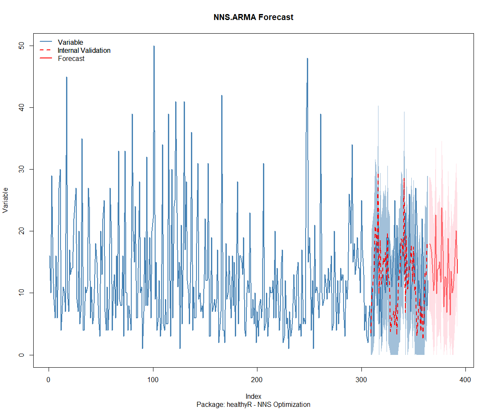

Time Series Analysis and Nested Modeling of the Healthyverse Packages
================
Steven P. Sanderson II, MPH - Date:
08 April, 2025

This analysis follows a *Nested Modeltime Workflow*.

## Get Data

``` r
glimpse(downloads_tbl)
```

    ## Rows: 136,162
    ## Columns: 11
    ## $ date      <date> 2020-11-23, 2020-11-23, 2020-11-23, 2020-11-23, 2020-11-23,…
    ## $ time      <Period> 15H 36M 55S, 11H 26M 39S, 23H 34M 44S, 18H 39M 32S, 9H 0M…
    ## $ date_time <dttm> 2020-11-23 15:36:55, 2020-11-23 11:26:39, 2020-11-23 23:34:…
    ## $ size      <int> 4858294, 4858294, 4858301, 4858295, 361, 4863722, 4864794, 4…
    ## $ r_version <chr> NA, "4.0.3", "3.5.3", "3.5.2", NA, NA, NA, NA, NA, NA, NA, N…
    ## $ r_arch    <chr> NA, "x86_64", "x86_64", "x86_64", NA, NA, NA, NA, NA, NA, NA…
    ## $ r_os      <chr> NA, "mingw32", "mingw32", "linux-gnu", NA, NA, NA, NA, NA, N…
    ## $ package   <chr> "healthyR.data", "healthyR.data", "healthyR.data", "healthyR…
    ## $ version   <chr> "1.0.0", "1.0.0", "1.0.0", "1.0.0", "1.0.0", "1.0.0", "1.0.0…
    ## $ country   <chr> "US", "US", "US", "GB", "US", "US", "DE", "HK", "JP", "US", …
    ## $ ip_id     <int> 2069, 2804, 78827, 27595, 90474, 90474, 42435, 74, 7655, 638…

The last day in the data set is 2025-04-06 23:15:36, the file was
birthed on: 2024-08-07 07:35:44, and at report knit time is -5819.66
hours old. Happy analyzing!

Now that we have our data lets take a look at it using the `skimr`
package.

``` r
skim(downloads_tbl)
```

|                                                  |               |
|:-------------------------------------------------|:--------------|
| Name                                             | downloads_tbl |
| Number of rows                                   | 136162        |
| Number of columns                                | 11            |
| \_\_\_\_\_\_\_\_\_\_\_\_\_\_\_\_\_\_\_\_\_\_\_   |               |
| Column type frequency:                           |               |
| character                                        | 6             |
| Date                                             | 1             |
| numeric                                          | 2             |
| POSIXct                                          | 1             |
| Timespan                                         | 1             |
| \_\_\_\_\_\_\_\_\_\_\_\_\_\_\_\_\_\_\_\_\_\_\_\_ |               |
| Group variables                                  | None          |

Data summary

**Variable type: character**

| skim_variable | n_missing | complete_rate | min | max | empty | n_unique | whitespace |
|:--------------|----------:|--------------:|----:|----:|------:|---------:|-----------:|
| r_version     |     97917 |          0.28 |   5 |   5 |     0 |       46 |          0 |
| r_arch        |     97917 |          0.28 |   3 |   7 |     0 |        5 |          0 |
| r_os          |     97917 |          0.28 |   7 |  15 |     0 |       21 |          0 |
| package       |         0 |          1.00 |   7 |  13 |     0 |        8 |          0 |
| version       |         0 |          1.00 |   5 |  17 |     0 |       60 |          0 |
| country       |     11457 |          0.92 |   2 |   2 |     0 |      163 |          0 |

**Variable type: Date**

| skim_variable | n_missing | complete_rate | min | max | median | n_unique |
|:---|---:|---:|:---|:---|:---|---:|
| date | 0 | 1 | 2020-11-23 | 2025-04-06 | 2023-05-27 | 1596 |

**Variable type: numeric**

| skim_variable | n_missing | complete_rate | mean | sd | p0 | p25 | p50 | p75 | p100 | hist |
|:---|---:|---:|---:|---:|---:|---:|---:|---:|---:|:---|
| size | 0 | 1 | 1134323.41 | 1523496.97 | 355 | 14701 | 271098 | 2367764.0 | 5677952 | ▇▁▂▁▁ |
| ip_id | 0 | 1 | 10353.72 | 18357.16 | 1 | 298 | 3064 | 11704.5 | 209747 | ▇▁▁▁▁ |

**Variable type: POSIXct**

| skim_variable | n_missing | complete_rate | min | max | median | n_unique |
|:---|---:|---:|:---|:---|:---|---:|
| date_time | 0 | 1 | 2020-11-23 09:00:41 | 2025-04-06 23:15:36 | 2023-05-27 15:41:55 | 82795 |

**Variable type: Timespan**

| skim_variable | n_missing | complete_rate | min | max | median | n_unique |
|:--------------|----------:|--------------:|----:|----:|-------:|---------:|
| time          |         0 |             1 |   0 |  59 |   16.5 |       60 |

We can see that the following columns are missing a lot of data and for
us are most likely not useful anyways, so we will drop them
`c(r_version, r_arch, r_os)`

## Plots

Now lets take a look at a time-series plot of the total daily downloads
by package. We will use a log scale and place a vertical line at each
version release for each package.

<!-- --><!-- -->

Now lets take a look at some time series decomposition graphs.

<!-- --><!-- --><!-- --><!-- -->

## Feature Engineering

Now that we have our basic data and a shot of what it looks like, let’s
add some features to our data which can be very helpful in modeling.
Lets start by making a `tibble` that is aggregated by the day and
package, as we are going to be interested in forecasting the next 4
weeks or 28 days for each package. First lets get our base data.

    ## 
    ## Call:
    ## stats::lm(formula = .formula, data = df)
    ## 
    ## Residuals:
    ##     Min      1Q  Median      3Q     Max 
    ## -148.90  -35.45  -10.72   26.56  812.59 
    ## 
    ## Coefficients:
    ##                                                      Estimate Std. Error
    ## (Intercept)                                        -1.830e+02  7.337e+01
    ## date                                                1.115e-02  3.892e-03
    ## lag(value, 1)                                       1.080e-01  2.480e-02
    ## lag(value, 7)                                       9.812e-02  2.568e-02
    ## lag(value, 14)                                      9.590e-02  2.582e-02
    ## lag(value, 21)                                      6.574e-02  2.585e-02
    ## lag(value, 28)                                      6.006e-02  2.576e-02
    ## lag(value, 35)                                      6.882e-02  2.583e-02
    ## lag(value, 42)                                      4.798e-02  2.592e-02
    ## lag(value, 49)                                      7.629e-02  2.590e-02
    ## month(date, label = TRUE).L                        -1.020e+01  5.142e+00
    ## month(date, label = TRUE).Q                         2.774e+00  5.200e+00
    ## month(date, label = TRUE).C                        -1.237e+01  5.233e+00
    ## month(date, label = TRUE)^4                        -6.628e+00  5.194e+00
    ## month(date, label = TRUE)^5                        -1.220e+01  5.207e+00
    ## month(date, label = TRUE)^6                        -3.191e+00  5.281e+00
    ## month(date, label = TRUE)^7                        -6.149e+00  5.163e+00
    ## month(date, label = TRUE)^8                        -4.517e+00  5.182e+00
    ## month(date, label = TRUE)^9                         5.371e+00  5.227e+00
    ## month(date, label = TRUE)^10                        4.596e+00  5.291e+00
    ## month(date, label = TRUE)^11                       -5.917e+00  5.337e+00
    ## fourier_vec(date, type = "sin", K = 1, period = 7) -1.175e+01  2.391e+00
    ## fourier_vec(date, type = "cos", K = 1, period = 7)  8.093e+00  2.517e+00
    ##                                                    t value Pr(>|t|)    
    ## (Intercept)                                         -2.494 0.012719 *  
    ## date                                                 2.863 0.004248 ** 
    ## lag(value, 1)                                        4.356 1.41e-05 ***
    ## lag(value, 7)                                        3.821 0.000138 ***
    ## lag(value, 14)                                       3.714 0.000211 ***
    ## lag(value, 21)                                       2.543 0.011103 *  
    ## lag(value, 28)                                       2.331 0.019857 *  
    ## lag(value, 35)                                       2.664 0.007798 ** 
    ## lag(value, 42)                                       1.851 0.064369 .  
    ## lag(value, 49)                                       2.946 0.003269 ** 
    ## month(date, label = TRUE).L                         -1.984 0.047448 *  
    ## month(date, label = TRUE).Q                          0.533 0.593778    
    ## month(date, label = TRUE).C                         -2.363 0.018230 *  
    ## month(date, label = TRUE)^4                         -1.276 0.202128    
    ## month(date, label = TRUE)^5                         -2.343 0.019256 *  
    ## month(date, label = TRUE)^6                         -0.604 0.545691    
    ## month(date, label = TRUE)^7                         -1.191 0.233829    
    ## month(date, label = TRUE)^8                         -0.872 0.383500    
    ## month(date, label = TRUE)^9                          1.028 0.304343    
    ## month(date, label = TRUE)^10                         0.869 0.385106    
    ## month(date, label = TRUE)^11                        -1.109 0.267740    
    ## fourier_vec(date, type = "sin", K = 1, period = 7)  -4.916 9.81e-07 ***
    ## fourier_vec(date, type = "cos", K = 1, period = 7)   3.215 0.001330 ** 
    ## ---
    ## Signif. codes:  0 '***' 0.001 '**' 0.01 '*' 0.05 '.' 0.1 ' ' 1
    ## 
    ## Residual standard error: 58.67 on 1524 degrees of freedom
    ##   (49 observations deleted due to missingness)
    ## Multiple R-squared:  0.2496, Adjusted R-squared:  0.2388 
    ## F-statistic: 23.04 on 22 and 1524 DF,  p-value: < 2.2e-16

<!-- -->

## NNS Forecasting

This is something I have been wanting to try for a while. The `NNS`
package is a great package for forecasting time series data.

[NNS GitHub](https://github.com/OVVO-Financial/NNS)

``` r
library(NNS)

data_list <- base_data |>
    select(package, value) |>
    group_split(package)

data_list |>
    imap(
        \(x, idx) {
            obj <- x
            x <- obj |> pull(value) |> tail(7*52)
            train_set_size <- length(x) - 56
            pkg <- obj |> pluck(1) |> unique()
            sf <- NNS.seas(x, modulo = 7, plot = FALSE)$periods
            
            cat(paste0("Package: ", pkg, "\n"))
            NNS.ARMA.optim(
                variable = x,
                h = 28,
                training.set = train_set_size,
                #seasonal.factor = seq(12, 60, 7),
                seasonal.factor = sf,
                pred.int = 0.95,
                plot = TRUE
            )
            title(
                sub = paste0("\n",
                             "Package: ", pkg, " - NNS Optimization")
            )
        }
    )
```

    ## Package: healthyR
    ## [1] "CURRNET METHOD: lin"
    ## [1] "COPY LATEST PARAMETERS DIRECTLY FOR NNS.ARMA() IF ERROR:"
    ## [1] "NNS.ARMA(... method =  'lin' , seasonal.factor =  c( 35 ) ...)"
    ## [1] "CURRENT lin OBJECTIVE FUNCTION = 2.80067414706878"
    ## [1] "NNS.ARMA(... method =  'lin' , seasonal.factor =  c( 35, 21 ) ...)"
    ## [1] "CURRENT lin OBJECTIVE FUNCTION = 2.55639063247449"
    ## [1] "NNS.ARMA(... method =  'lin' , seasonal.factor =  c( 35, 21, 70 ) ...)"
    ## [1] "CURRENT lin OBJECTIVE FUNCTION = 2.47801470395239"
    ## [1] "NNS.ARMA(... method =  'lin' , seasonal.factor =  c( 35, 21, 70, 91 ) ...)"
    ## [1] "CURRENT lin OBJECTIVE FUNCTION = 2.46227910267296"
    ## [1] "BEST method = 'lin', seasonal.factor = c( 35, 21, 70, 91 )"
    ## [1] "BEST lin OBJECTIVE FUNCTION = 2.46227910267296"
    ## [1] "CURRNET METHOD: nonlin"
    ## [1] "COPY LATEST PARAMETERS DIRECTLY FOR NNS.ARMA() IF ERROR:"
    ## [1] "NNS.ARMA(... method =  'nonlin' , seasonal.factor =  c( 35, 21, 70, 91 ) ...)"
    ## [1] "CURRENT nonlin OBJECTIVE FUNCTION = 2.95628989945016"
    ## [1] "BEST method = 'nonlin' PATH MEMBER = c( 35, 21, 70, 91 )"
    ## [1] "BEST nonlin OBJECTIVE FUNCTION = 2.95628989945016"
    ## [1] "CURRNET METHOD: both"
    ## [1] "COPY LATEST PARAMETERS DIRECTLY FOR NNS.ARMA() IF ERROR:"
    ## [1] "NNS.ARMA(... method =  'both' , seasonal.factor =  c( 35, 21, 70, 91 ) ...)"
    ## [1] "CURRENT both OBJECTIVE FUNCTION = 2.54106067315041"
    ## [1] "BEST method = 'both' PATH MEMBER = c( 35, 21, 70, 91 )"
    ## [1] "BEST both OBJECTIVE FUNCTION = 2.54106067315041"

<!-- -->

    ## Package: healthyR.ai
    ## [1] "CURRNET METHOD: lin"
    ## [1] "COPY LATEST PARAMETERS DIRECTLY FOR NNS.ARMA() IF ERROR:"
    ## [1] "NNS.ARMA(... method =  'lin' , seasonal.factor =  c( 21 ) ...)"
    ## [1] "CURRENT lin OBJECTIVE FUNCTION = 2.19086628832043"
    ## [1] "NNS.ARMA(... method =  'lin' , seasonal.factor =  c( 21, 98 ) ...)"
    ## [1] "CURRENT lin OBJECTIVE FUNCTION = 1.83485988287094"
    ## [1] "NNS.ARMA(... method =  'lin' , seasonal.factor =  c( 21, 98, 77 ) ...)"
    ## [1] "CURRENT lin OBJECTIVE FUNCTION = 1.76913613911465"
    ## [1] "NNS.ARMA(... method =  'lin' , seasonal.factor =  c( 21, 98, 77, 63 ) ...)"
    ## [1] "CURRENT lin OBJECTIVE FUNCTION = 1.74678036205171"
    ## [1] "BEST method = 'lin', seasonal.factor = c( 21, 98, 77, 63 )"
    ## [1] "BEST lin OBJECTIVE FUNCTION = 1.74678036205171"
    ## [1] "CURRNET METHOD: nonlin"
    ## [1] "COPY LATEST PARAMETERS DIRECTLY FOR NNS.ARMA() IF ERROR:"
    ## [1] "NNS.ARMA(... method =  'nonlin' , seasonal.factor =  c( 21, 98, 77, 63 ) ...)"
    ## [1] "CURRENT nonlin OBJECTIVE FUNCTION = 1.93692970292356"
    ## [1] "BEST method = 'nonlin' PATH MEMBER = c( 21, 98, 77, 63 )"
    ## [1] "BEST nonlin OBJECTIVE FUNCTION = 1.93692970292356"
    ## [1] "CURRNET METHOD: both"
    ## [1] "COPY LATEST PARAMETERS DIRECTLY FOR NNS.ARMA() IF ERROR:"
    ## [1] "NNS.ARMA(... method =  'both' , seasonal.factor =  c( 21, 98, 77, 63 ) ...)"
    ## [1] "CURRENT both OBJECTIVE FUNCTION = 1.7691927695209"
    ## [1] "BEST method = 'both' PATH MEMBER = c( 21, 98, 77, 63 )"
    ## [1] "BEST both OBJECTIVE FUNCTION = 1.7691927695209"

<!-- -->

    ## Package: healthyR.data
    ## [1] "CURRNET METHOD: lin"
    ## [1] "COPY LATEST PARAMETERS DIRECTLY FOR NNS.ARMA() IF ERROR:"
    ## [1] "NNS.ARMA(... method =  'lin' , seasonal.factor =  c( 98 ) ...)"
    ## [1] "CURRENT lin OBJECTIVE FUNCTION = 2.17886253233414"
    ## [1] "BEST method = 'lin', seasonal.factor = c( 98 )"
    ## [1] "BEST lin OBJECTIVE FUNCTION = 2.17886253233414"
    ## [1] "CURRNET METHOD: nonlin"
    ## [1] "COPY LATEST PARAMETERS DIRECTLY FOR NNS.ARMA() IF ERROR:"
    ## [1] "NNS.ARMA(... method =  'nonlin' , seasonal.factor =  c( 98 ) ...)"
    ## [1] "CURRENT nonlin OBJECTIVE FUNCTION = 2.70657264284894"
    ## [1] "BEST method = 'nonlin' PATH MEMBER = c( 98 )"
    ## [1] "BEST nonlin OBJECTIVE FUNCTION = 2.70657264284894"
    ## [1] "CURRNET METHOD: both"
    ## [1] "COPY LATEST PARAMETERS DIRECTLY FOR NNS.ARMA() IF ERROR:"
    ## [1] "NNS.ARMA(... method =  'both' , seasonal.factor =  c( 98 ) ...)"
    ## [1] "CURRENT both OBJECTIVE FUNCTION = 2.25610944511273"
    ## [1] "BEST method = 'both' PATH MEMBER = c( 98 )"
    ## [1] "BEST both OBJECTIVE FUNCTION = 2.25610944511273"

<!-- -->

    ## Package: healthyR.ts
    ## [1] "CURRNET METHOD: lin"
    ## [1] "COPY LATEST PARAMETERS DIRECTLY FOR NNS.ARMA() IF ERROR:"
    ## [1] "NNS.ARMA(... method =  'lin' , seasonal.factor =  c( 63 ) ...)"
    ## [1] "CURRENT lin OBJECTIVE FUNCTION = 2.22317694478769"
    ## [1] "NNS.ARMA(... method =  'lin' , seasonal.factor =  c( 63, 98 ) ...)"
    ## [1] "CURRENT lin OBJECTIVE FUNCTION = 1.69216679213033"
    ## [1] "BEST method = 'lin', seasonal.factor = c( 63, 98 )"
    ## [1] "BEST lin OBJECTIVE FUNCTION = 1.69216679213033"
    ## [1] "CURRNET METHOD: nonlin"
    ## [1] "COPY LATEST PARAMETERS DIRECTLY FOR NNS.ARMA() IF ERROR:"
    ## [1] "NNS.ARMA(... method =  'nonlin' , seasonal.factor =  c( 63, 98 ) ...)"
    ## [1] "CURRENT nonlin OBJECTIVE FUNCTION = 2.56946418422645"
    ## [1] "BEST method = 'nonlin' PATH MEMBER = c( 63, 98 )"
    ## [1] "BEST nonlin OBJECTIVE FUNCTION = 2.56946418422645"
    ## [1] "CURRNET METHOD: both"
    ## [1] "COPY LATEST PARAMETERS DIRECTLY FOR NNS.ARMA() IF ERROR:"
    ## [1] "NNS.ARMA(... method =  'both' , seasonal.factor =  c( 63, 98 ) ...)"
    ## [1] "CURRENT both OBJECTIVE FUNCTION = 1.99347359693564"
    ## [1] "BEST method = 'both' PATH MEMBER = c( 63, 98 )"
    ## [1] "BEST both OBJECTIVE FUNCTION = 1.99347359693564"

<!-- -->

    ## Package: healthyverse
    ## [1] "CURRNET METHOD: lin"
    ## [1] "COPY LATEST PARAMETERS DIRECTLY FOR NNS.ARMA() IF ERROR:"
    ## [1] "NNS.ARMA(... method =  'lin' , seasonal.factor =  c( 49 ) ...)"
    ## [1] "CURRENT lin OBJECTIVE FUNCTION = 2.73034806386444"
    ## [1] "NNS.ARMA(... method =  'lin' , seasonal.factor =  c( 49, 77 ) ...)"
    ## [1] "CURRENT lin OBJECTIVE FUNCTION = 2.32092527326071"
    ## [1] "BEST method = 'lin', seasonal.factor = c( 49, 77 )"
    ## [1] "BEST lin OBJECTIVE FUNCTION = 2.32092527326071"
    ## [1] "CURRNET METHOD: nonlin"
    ## [1] "COPY LATEST PARAMETERS DIRECTLY FOR NNS.ARMA() IF ERROR:"
    ## [1] "NNS.ARMA(... method =  'nonlin' , seasonal.factor =  c( 49, 77 ) ...)"
    ## [1] "CURRENT nonlin OBJECTIVE FUNCTION = 4.11671529242261"
    ## [1] "BEST method = 'nonlin' PATH MEMBER = c( 49, 77 )"
    ## [1] "BEST nonlin OBJECTIVE FUNCTION = 4.11671529242261"
    ## [1] "CURRNET METHOD: both"
    ## [1] "COPY LATEST PARAMETERS DIRECTLY FOR NNS.ARMA() IF ERROR:"
    ## [1] "NNS.ARMA(... method =  'both' , seasonal.factor =  c( 49, 77 ) ...)"
    ## [1] "CURRENT both OBJECTIVE FUNCTION = 2.99656708817426"
    ## [1] "BEST method = 'both' PATH MEMBER = c( 49, 77 )"
    ## [1] "BEST both OBJECTIVE FUNCTION = 2.99656708817426"

<!-- -->

    ## Package: RandomWalker
    ## [1] "CURRNET METHOD: lin"
    ## [1] "COPY LATEST PARAMETERS DIRECTLY FOR NNS.ARMA() IF ERROR:"
    ## [1] "NNS.ARMA(... method =  'lin' , seasonal.factor =  c( 35 ) ...)"
    ## [1] "CURRENT lin OBJECTIVE FUNCTION = 3.49906133771862"
    ## [1] "BEST method = 'lin', seasonal.factor = c( 35 )"
    ## [1] "BEST lin OBJECTIVE FUNCTION = 3.49906133771862"
    ## [1] "CURRNET METHOD: nonlin"
    ## [1] "COPY LATEST PARAMETERS DIRECTLY FOR NNS.ARMA() IF ERROR:"
    ## [1] "NNS.ARMA(... method =  'nonlin' , seasonal.factor =  c( 35 ) ...)"
    ## [1] "CURRENT nonlin OBJECTIVE FUNCTION = 5.31438624904805"
    ## [1] "BEST method = 'nonlin' PATH MEMBER = c( 35 )"
    ## [1] "BEST nonlin OBJECTIVE FUNCTION = 5.31438624904805"
    ## [1] "CURRNET METHOD: both"
    ## [1] "COPY LATEST PARAMETERS DIRECTLY FOR NNS.ARMA() IF ERROR:"
    ## [1] "NNS.ARMA(... method =  'both' , seasonal.factor =  c( 35 ) ...)"
    ## [1] "CURRENT both OBJECTIVE FUNCTION = 4.35757024276108"
    ## [1] "BEST method = 'both' PATH MEMBER = c( 35 )"
    ## [1] "BEST both OBJECTIVE FUNCTION = 4.35757024276108"

<!-- -->

    ## Package: tidyAML
    ## [1] "CURRNET METHOD: lin"
    ## [1] "COPY LATEST PARAMETERS DIRECTLY FOR NNS.ARMA() IF ERROR:"
    ## [1] "NNS.ARMA(... method =  'lin' , seasonal.factor =  c( 28 ) ...)"
    ## [1] "CURRENT lin OBJECTIVE FUNCTION = 4.44153516673922"
    ## [1] "NNS.ARMA(... method =  'lin' , seasonal.factor =  c( 28, 56 ) ...)"
    ## [1] "CURRENT lin OBJECTIVE FUNCTION = 4.42203936943709"
    ## [1] "BEST method = 'lin', seasonal.factor = c( 28, 56 )"
    ## [1] "BEST lin OBJECTIVE FUNCTION = 4.42203936943709"
    ## [1] "CURRNET METHOD: nonlin"
    ## [1] "COPY LATEST PARAMETERS DIRECTLY FOR NNS.ARMA() IF ERROR:"
    ## [1] "NNS.ARMA(... method =  'nonlin' , seasonal.factor =  c( 28, 56 ) ...)"
    ## [1] "CURRENT nonlin OBJECTIVE FUNCTION = 4.23008505522823"
    ## [1] "BEST method = 'nonlin' PATH MEMBER = c( 28, 56 )"
    ## [1] "BEST nonlin OBJECTIVE FUNCTION = 4.23008505522823"
    ## [1] "CURRNET METHOD: both"
    ## [1] "COPY LATEST PARAMETERS DIRECTLY FOR NNS.ARMA() IF ERROR:"
    ## [1] "NNS.ARMA(... method =  'both' , seasonal.factor =  c( 28, 56 ) ...)"
    ## [1] "CURRENT both OBJECTIVE FUNCTION = 3.88546147978182"
    ## [1] "BEST method = 'both' PATH MEMBER = c( 28, 56 )"
    ## [1] "BEST both OBJECTIVE FUNCTION = 3.88546147978182"

<!-- -->

    ## Package: TidyDensity
    ## [1] "CURRNET METHOD: lin"
    ## [1] "COPY LATEST PARAMETERS DIRECTLY FOR NNS.ARMA() IF ERROR:"
    ## [1] "NNS.ARMA(... method =  'lin' , seasonal.factor =  c( 63 ) ...)"
    ## [1] "CURRENT lin OBJECTIVE FUNCTION = 2.01948164669681"
    ## [1] "NNS.ARMA(... method =  'lin' , seasonal.factor =  c( 63, 77 ) ...)"
    ## [1] "CURRENT lin OBJECTIVE FUNCTION = 1.72527127865971"
    ## [1] "BEST method = 'lin', seasonal.factor = c( 63, 77 )"
    ## [1] "BEST lin OBJECTIVE FUNCTION = 1.72527127865971"
    ## [1] "CURRNET METHOD: nonlin"
    ## [1] "COPY LATEST PARAMETERS DIRECTLY FOR NNS.ARMA() IF ERROR:"
    ## [1] "NNS.ARMA(... method =  'nonlin' , seasonal.factor =  c( 63, 77 ) ...)"
    ## [1] "CURRENT nonlin OBJECTIVE FUNCTION = 3.14346045345962"
    ## [1] "BEST method = 'nonlin' PATH MEMBER = c( 63, 77 )"
    ## [1] "BEST nonlin OBJECTIVE FUNCTION = 3.14346045345962"
    ## [1] "CURRNET METHOD: both"
    ## [1] "COPY LATEST PARAMETERS DIRECTLY FOR NNS.ARMA() IF ERROR:"
    ## [1] "NNS.ARMA(... method =  'both' , seasonal.factor =  c( 63, 77 ) ...)"
    ## [1] "CURRENT both OBJECTIVE FUNCTION = 2.16561192872252"
    ## [1] "BEST method = 'both' PATH MEMBER = c( 63, 77 )"
    ## [1] "BEST both OBJECTIVE FUNCTION = 2.16561192872252"

<!-- -->

    ## [[1]]
    ## NULL
    ## 
    ## [[2]]
    ## NULL
    ## 
    ## [[3]]
    ## NULL
    ## 
    ## [[4]]
    ## NULL
    ## 
    ## [[5]]
    ## NULL
    ## 
    ## [[6]]
    ## NULL
    ## 
    ## [[7]]
    ## NULL
    ## 
    ## [[8]]
    ## NULL

## Pre-Processing

Now we are going to do some basic pre-processing.

``` r
data_padded_tbl <- base_data %>%
  pad_by_time(
    .date_var  = date,
    .pad_value = 0
  )

# Get log interval and standardization parameters
log_params  <- liv(data_padded_tbl$value, limit_lower = 0, offset = 1, silent = TRUE)
limit_lower <- log_params$limit_lower
limit_upper <- log_params$limit_upper
offset      <- log_params$offset

data_liv_tbl <- data_padded_tbl %>%
  # Get log interval transform
  mutate(value_trans = liv(value, limit_lower = 0, offset = 1, silent = TRUE)$log_scaled)

# Get Standardization Params
std_params <- standard_vec(data_liv_tbl$value_trans, silent = TRUE)
std_mean   <- std_params$mean
std_sd     <- std_params$sd

data_transformed_tbl <- data_liv_tbl %>%
  # get standardization
  mutate(value_trans = standard_vec(value_trans, silent = TRUE)$standard_scaled) %>%
  select(-value)
```

Since this is panel data we can follow one of two different modeling
strategies. We can search for a global model in the panel data or we can
use nested forecasting finding the best model for each of the time
series. Since we only have 5 panels, we will use nested forecasting.

To do this we will use the `nest_timeseries` and
`split_nested_timeseries` functions to create a nested `tibble`.

``` r
horizon <- 4*7

nested_data_tbl <- data_transformed_tbl %>%
    
    # 1. Extending: We'll predict n days into the future.
    extend_timeseries(
        .id_var        = package,
        .date_var      = date,
        .length_future = horizon
    ) %>%
    
    # 2. Nesting: We'll group by id, and create a future dataset
    #    that forecasts n days of extended data and
    #    an actual dataset that contains n*2 days
    nest_timeseries(
        .id_var        = package,
        .length_future = horizon
        #.length_actual = horizon*2
    ) %>%
    
   # 3. Splitting: We'll take the actual data and create splits
   #    for accuracy and confidence interval estimation of n das (test)
   #    and the rest is training data
    split_nested_timeseries(
        .length_test = horizon
    )

nested_data_tbl
```

    ## # A tibble: 8 × 4
    ##   package       .actual_data         .future_data      .splits          
    ##   <fct>         <list>               <list>            <list>           
    ## 1 healthyR.data <tibble [1,589 × 2]> <tibble [28 × 2]> <split [1561|28]>
    ## 2 healthyR      <tibble [1,582 × 2]> <tibble [28 × 2]> <split [1554|28]>
    ## 3 healthyR.ts   <tibble [1,526 × 2]> <tibble [28 × 2]> <split [1498|28]>
    ## 4 healthyverse  <tibble [1,497 × 2]> <tibble [28 × 2]> <split [1469|28]>
    ## 5 healthyR.ai   <tibble [1,321 × 2]> <tibble [28 × 2]> <split [1293|28]>
    ## 6 TidyDensity   <tibble [1,172 × 2]> <tibble [28 × 2]> <split [1144|28]>
    ## 7 tidyAML       <tibble [780 × 2]>   <tibble [28 × 2]> <split [752|28]> 
    ## 8 RandomWalker  <tibble [202 × 2]>   <tibble [28 × 2]> <split [174|28]>

Now it is time to make some recipes and models using the modeltime
workflow.

## Modeltime Workflow

### Recipe Object

``` r
recipe_base <- recipe(
  value_trans ~ date
  , data = extract_nested_test_split(nested_data_tbl)
  )

recipe_base

recipe_date <- recipe_base %>%
    step_mutate(date = as.numeric(date))
```

### Models

``` r
# Models ------------------------------------------------------------------

# Auto ARIMA --------------------------------------------------------------

model_spec_arima_no_boost <- arima_reg() %>%
  set_engine(engine = "auto_arima")

wflw_auto_arima <- workflow() %>%
  add_recipe(recipe = recipe_base) %>%
  add_model(model_spec_arima_no_boost)

# NNETAR ------------------------------------------------------------------

model_spec_nnetar <- nnetar_reg(
  mode              = "regression"
  , seasonal_period = "auto"
) %>%
  set_engine("nnetar")

wflw_nnetar <- workflow() %>%
  add_recipe(recipe = recipe_base) %>%
  add_model(model_spec_nnetar)

# TSLM --------------------------------------------------------------------

model_spec_lm <- linear_reg() %>%
  set_engine("lm")

wflw_lm <- workflow() %>%
  add_recipe(recipe = recipe_base) %>%
  add_model(model_spec_lm)

# MARS --------------------------------------------------------------------

model_spec_mars <- mars(mode = "regression") %>%
  set_engine("earth")

wflw_mars <- workflow() %>%
  add_recipe(recipe = recipe_base) %>%
  add_model(model_spec_mars)
```

### Nested Modeltime Tables

``` r
nested_modeltime_tbl <- modeltime_nested_fit(
  # Nested Data
  nested_data = nested_data_tbl,
   control = control_nested_fit(
     verbose = TRUE,
     allow_par = FALSE
   ),
  # Add workflows
  wflw_auto_arima,
  wflw_lm,
  wflw_mars,
  wflw_nnetar
)
```

``` r
nested_modeltime_tbl <- nested_modeltime_tbl[!is.na(nested_modeltime_tbl$package),]
```

### Model Accuracy

``` r
nested_modeltime_tbl %>%
  extract_nested_test_accuracy() %>%
  filter(!is.na(package)) %>%
  knitr::kable()
```

| package | .model_id | .model_desc | .type | mae | mape | mase | smape | rmse | rsq |
|:---|---:|:---|:---|---:|---:|---:|---:|---:|---:|
| healthyR.data | 1 | ARIMA | Test | 0.7491514 | 129.51398 | 0.6471674 | 171.64154 | 0.9452743 | 0.0680152 |
| healthyR.data | 2 | LM | Test | 0.6948483 | 160.92743 | 0.6002567 | 132.64155 | 0.8491319 | 0.0002576 |
| healthyR.data | 3 | EARTH | Test | 0.7601144 | 110.41083 | 0.6566379 | 145.37350 | 1.0357410 | 0.0002576 |
| healthyR.data | 4 | NNAR | Test | 0.7262268 | 109.13182 | 0.6273635 | 166.01903 | 0.9594073 | 0.0762190 |
| healthyR | 1 | ARIMA | Test | 0.7551470 | 103.09400 | 0.7723372 | 174.99246 | 0.9380416 | 0.0382761 |
| healthyR | 2 | LM | Test | 0.7486197 | 98.37976 | 0.7656613 | 186.69684 | 0.9226243 | 0.0182090 |
| healthyR | 3 | EARTH | Test | 0.7443441 | 96.44817 | 0.7612884 | 181.77152 | 0.9201282 | 0.0182090 |
| healthyR | 4 | NNAR | Test | 0.6979541 | 89.50666 | 0.7138424 | 150.25201 | 0.8900019 | 0.0628557 |
| healthyR.ts | 1 | ARIMA | Test | 1.0302779 | 262.24174 | 0.7869002 | 142.80920 | 1.2671600 | 0.0139552 |
| healthyR.ts | 2 | LM | Test | 1.0366008 | 268.75680 | 0.7917294 | 142.43669 | 1.2742983 | 0.0139552 |
| healthyR.ts | 3 | EARTH | Test | 1.0566141 | 288.62301 | 0.8070151 | 141.64810 | 1.2959186 | 0.0139552 |
| healthyR.ts | 4 | NNAR | Test | 0.9022140 | 99.47047 | 0.6890882 | 164.39554 | 1.1420967 | 0.0442369 |
| healthyverse | 1 | ARIMA | Test | 0.6444846 | 280.75147 | 0.6995559 | 103.25342 | 0.7967650 | 0.0000029 |
| healthyverse | 2 | LM | Test | 0.6466712 | 363.10542 | 0.7019293 | 99.34490 | 0.7657504 | 0.0171073 |
| healthyverse | 3 | EARTH | Test | 0.6772195 | 222.92184 | 0.7350880 | 117.69289 | 0.8405643 | 0.0171073 |
| healthyverse | 4 | NNAR | Test | 0.6666696 | 207.94874 | 0.7236366 | 116.05535 | 0.8418025 | 0.0021650 |
| healthyR.ai | 1 | ARIMA | Test | 0.7303270 | 91.95517 | 0.6989732 | 154.06775 | 0.9548642 | 0.0502634 |
| healthyR.ai | 2 | LM | Test | 0.7246495 | 135.41487 | 0.6935394 | 142.25510 | 0.9338090 | 0.1100681 |
| healthyR.ai | 3 | EARTH | Test | 0.8771390 | 171.66504 | 0.8394824 | 184.03405 | 1.0577381 | 0.1100681 |
| healthyR.ai | 4 | NNAR | Test | 0.6615406 | 123.19226 | 0.6331399 | 127.01044 | 0.8809447 | 0.1685452 |
| TidyDensity | 1 | ARIMA | Test | 0.6097508 | 167.56115 | 0.6320979 | 112.52685 | 0.7670661 | 0.1001023 |
| TidyDensity | 2 | LM | Test | 0.6763470 | 240.55086 | 0.7011348 | 106.48514 | 0.8644186 | 0.0033312 |
| TidyDensity | 3 | EARTH | Test | 0.6429727 | 187.47962 | 0.6665374 | 113.40779 | 0.7978278 | 0.0033312 |
| TidyDensity | 4 | NNAR | Test | 0.6130120 | 106.65771 | 0.6354786 | 140.81577 | 0.7465158 | 0.1233022 |
| tidyAML | 1 | ARIMA | Test | 0.6265095 | 331.76573 | 0.6716812 | 95.10598 | 0.7977804 | 0.0019539 |
| tidyAML | 2 | LM | Test | 0.6253112 | 321.84060 | 0.6703965 | 97.15813 | 0.7888800 | 0.0165192 |
| tidyAML | 3 | EARTH | Test | 0.6569679 | 361.75976 | 0.7043356 | 98.06204 | 0.8096623 | 0.0165192 |
| tidyAML | 4 | NNAR | Test | 0.5890529 | 310.84178 | 0.6315239 | 92.93828 | 0.7630314 | 0.0786888 |
| RandomWalker | 1 | ARIMA | Test | 1.4325013 | 164.85131 | 0.8156590 | 164.42429 | 1.6478375 | 0.0905510 |
| RandomWalker | 2 | LM | Test | 1.2683520 | 107.55620 | 0.7221932 | 195.68645 | 1.3985689 | 0.0047563 |
| RandomWalker | 3 | EARTH | Test | 1.1895417 | 90.23906 | 0.6773190 | 166.30134 | 1.3553619 | NA |
| RandomWalker | 4 | NNAR | Test | 1.2914438 | 123.48775 | 0.7353415 | 171.06244 | 1.4643832 | 0.0023307 |

### Plot Models

``` r
nested_modeltime_tbl %>%
  extract_nested_test_forecast() %>%
  group_by(package) %>%
  plot_modeltime_forecast(
    .interactive = FALSE,
    .conf_interval_show  = FALSE,
    .facet_scales = "free"
  ) +
  theme_minimal() +
  theme(legend.position = "bottom")
```

<!-- -->

### Best Model

``` r
best_nested_modeltime_tbl <- nested_modeltime_tbl %>%
  modeltime_nested_select_best(
    metric = "rmse",
    minimize = TRUE,
    filter_test_forecasts = TRUE
  )

best_nested_modeltime_tbl %>%
  extract_nested_best_model_report()
```

    ## # Nested Modeltime Table
    ## 

    ## # A tibble: 8 × 10
    ##   package     .model_id .model_desc .type   mae  mape  mase smape  rmse      rsq
    ##   <fct>           <int> <chr>       <chr> <dbl> <dbl> <dbl> <dbl> <dbl>    <dbl>
    ## 1 healthyR.d…         2 LM          Test  0.695 161.  0.600 133.  0.849  2.58e-4
    ## 2 healthyR            4 NNAR        Test  0.698  89.5 0.714 150.  0.890  6.29e-2
    ## 3 healthyR.ts         4 NNAR        Test  0.902  99.5 0.689 164.  1.14   4.42e-2
    ## 4 healthyver…         2 LM          Test  0.647 363.  0.702  99.3 0.766  1.71e-2
    ## 5 healthyR.ai         4 NNAR        Test  0.662 123.  0.633 127.  0.881  1.69e-1
    ## 6 TidyDensity         4 NNAR        Test  0.613 107.  0.635 141.  0.747  1.23e-1
    ## 7 tidyAML             4 NNAR        Test  0.589 311.  0.632  92.9 0.763  7.87e-2
    ## 8 RandomWalk…         3 EARTH       Test  1.19   90.2 0.677 166.  1.36  NA

``` r
best_nested_modeltime_tbl %>%
  extract_nested_test_forecast() %>%
  #filter(!is.na(.model_id)) %>%
  group_by(package) %>%
  plot_modeltime_forecast(
    .interactive = FALSE,
    .conf_interval_alpha = 0.2,
    .facet_scales = "free"
  ) +
  theme_minimal() +
  theme(legend.position = "bottom")
```

<!-- -->

## Refitting and Future Forecast

Now that we have the best models, we can make our future forecasts.

``` r
nested_modeltime_refit_tbl <- best_nested_modeltime_tbl %>%
    modeltime_nested_refit(
        control = control_nested_refit(verbose = TRUE)
    )
```

``` r
nested_modeltime_refit_tbl
```

    ## # Nested Modeltime Table
    ## 

    ## # A tibble: 8 × 5
    ##   package       .actual_data .future_data .splits           .modeltime_tables 
    ##   <fct>         <list>       <list>       <list>            <list>            
    ## 1 healthyR.data <tibble>     <tibble>     <split [1561|28]> <mdl_tm_t [1 × 5]>
    ## 2 healthyR      <tibble>     <tibble>     <split [1554|28]> <mdl_tm_t [1 × 5]>
    ## 3 healthyR.ts   <tibble>     <tibble>     <split [1498|28]> <mdl_tm_t [1 × 5]>
    ## 4 healthyverse  <tibble>     <tibble>     <split [1469|28]> <mdl_tm_t [1 × 5]>
    ## 5 healthyR.ai   <tibble>     <tibble>     <split [1293|28]> <mdl_tm_t [1 × 5]>
    ## 6 TidyDensity   <tibble>     <tibble>     <split [1144|28]> <mdl_tm_t [1 × 5]>
    ## 7 tidyAML       <tibble>     <tibble>     <split [752|28]>  <mdl_tm_t [1 × 5]>
    ## 8 RandomWalker  <tibble>     <tibble>     <split [174|28]>  <mdl_tm_t [1 × 5]>

``` r
nested_modeltime_refit_tbl %>%
  extract_nested_future_forecast() %>%
  mutate(across(.value:.conf_hi, .fns = ~ standard_inv_vec(
    x    = .,
    mean = std_mean,
    sd   = std_sd
  )$standard_inverse_value)) %>%
  mutate(across(.value:.conf_hi, .fns = ~ liiv(
    x = .,
    limit_lower = limit_lower,
    limit_upper = limit_upper,
    offset      = offset
  )$rescaled_v)) %>%
  group_by(package) %>%
  plot_modeltime_forecast(
    .interactive = FALSE,
    .conf_interval_alpha = 0.2,
    .facet_scales = "free"
  ) +
  theme_minimal() +
  theme(legend.position = "bottom")
```

<!-- -->
