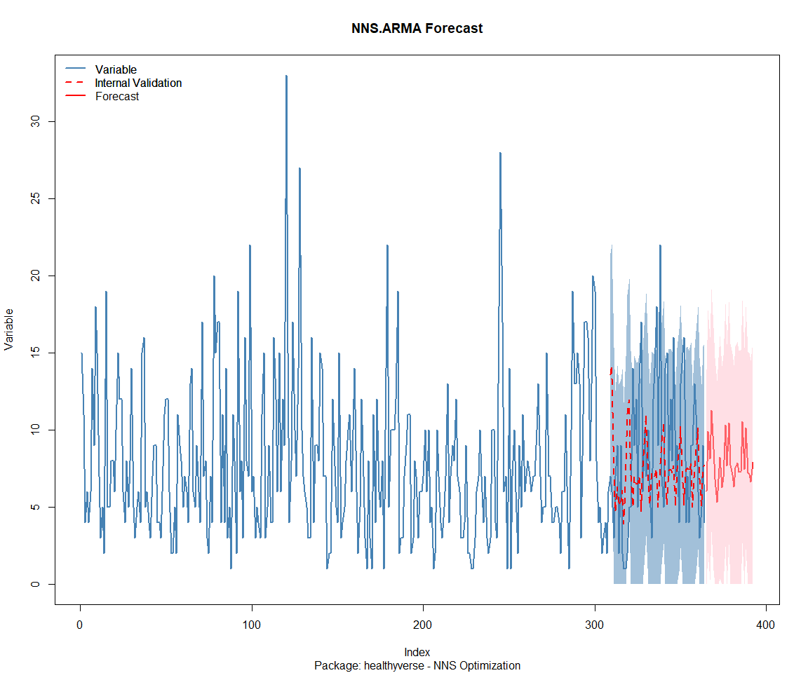

Time Series Analysis, Modeling and Forecasting of the Healthyverse
Packages
================
Steven P. Sanderson II, MPH - Date:
26 August, 2025

This analysis follows a *Nested Modeltime Workflow*.

## Get Data

``` r
glimpse(downloads_tbl)
```

    ## Rows: 150,249
    ## Columns: 11
    ## $ date      <date> 2020-11-23, 2020-11-23, 2020-11-23, 2020-11-23, 2020-11-23,…
    ## $ time      <Period> 15H 36M 55S, 11H 26M 39S, 23H 34M 44S, 18H 39M 32S, 9H 0M…
    ## $ date_time <dttm> 2020-11-23 15:36:55, 2020-11-23 11:26:39, 2020-11-23 23:34:…
    ## $ size      <int> 4858294, 4858294, 4858301, 4858295, 361, 4863722, 4864794, 4…
    ## $ r_version <chr> NA, "4.0.3", "3.5.3", "3.5.2", NA, NA, NA, NA, NA, NA, NA, N…
    ## $ r_arch    <chr> NA, "x86_64", "x86_64", "x86_64", NA, NA, NA, NA, NA, NA, NA…
    ## $ r_os      <chr> NA, "mingw32", "mingw32", "linux-gnu", NA, NA, NA, NA, NA, N…
    ## $ package   <chr> "healthyR.data", "healthyR.data", "healthyR.data", "healthyR…
    ## $ version   <chr> "1.0.0", "1.0.0", "1.0.0", "1.0.0", "1.0.0", "1.0.0", "1.0.0…
    ## $ country   <chr> "US", "US", "US", "GB", "US", "US", "DE", "HK", "JP", "US", …
    ## $ ip_id     <int> 2069, 2804, 78827, 27595, 90474, 90474, 42435, 74, 7655, 638…

The last day in the data set is 2025-08-24 23:36:00, the file was
birthed on: 2022-07-02 23:58:17.511888, and at report knit time is
-2.757163^{4} hours old. Happy analyzing!

Now that we have our data lets take a look at it using the `skimr`
package.

``` r
skim(downloads_tbl)
```

|                                                  |               |
|:-------------------------------------------------|:--------------|
| Name                                             | downloads_tbl |
| Number of rows                                   | 150249        |
| Number of columns                                | 11            |
| \_\_\_\_\_\_\_\_\_\_\_\_\_\_\_\_\_\_\_\_\_\_\_   |               |
| Column type frequency:                           |               |
| character                                        | 6             |
| Date                                             | 1             |
| numeric                                          | 2             |
| POSIXct                                          | 1             |
| Timespan                                         | 1             |
| \_\_\_\_\_\_\_\_\_\_\_\_\_\_\_\_\_\_\_\_\_\_\_\_ |               |
| Group variables                                  | None          |

Data summary

**Variable type: character**

| skim_variable | n_missing | complete_rate | min | max | empty | n_unique | whitespace |
|:--------------|----------:|--------------:|----:|----:|------:|---------:|-----------:|
| r_version     |    109093 |          0.27 |   5 |   5 |     0 |       48 |          0 |
| r_arch        |    109093 |          0.27 |   3 |   7 |     0 |        5 |          0 |
| r_os          |    109093 |          0.27 |   7 |  15 |     0 |       23 |          0 |
| package       |         0 |          1.00 |   7 |  13 |     0 |        8 |          0 |
| version       |         0 |          1.00 |   5 |  17 |     0 |       61 |          0 |
| country       |     12819 |          0.91 |   2 |   2 |     0 |      165 |          0 |

**Variable type: Date**

| skim_variable | n_missing | complete_rate | min | max | median | n_unique |
|:---|---:|---:|:---|:---|:---|---:|
| date | 0 | 1 | 2020-11-23 | 2025-08-24 | 2023-08-22 | 1736 |

**Variable type: numeric**

| skim_variable | n_missing | complete_rate | mean | sd | p0 | p25 | p50 | p75 | p100 | hist |
|:---|---:|---:|---:|---:|---:|---:|---:|---:|---:|:---|
| size | 0 | 1 | 1130513.95 | 1505176.4 | 355 | 14701 | 306589 | 2365953 | 5677952 | ▇▁▂▁▁ |
| ip_id | 0 | 1 | 11249.99 | 21571.8 | 1 | 280 | 3064 | 12119 | 299146 | ▇▁▁▁▁ |

**Variable type: POSIXct**

| skim_variable | n_missing | complete_rate | min | max | median | n_unique |
|:---|---:|---:|:---|:---|:---|---:|
| date_time | 0 | 1 | 2020-11-23 09:00:41 | 2025-08-24 23:36:00 | 2023-08-22 23:11:58 | 93316 |

**Variable type: Timespan**

| skim_variable | n_missing | complete_rate | min | max |     median | n_unique |
|:--------------|----------:|--------------:|----:|----:|-----------:|---------:|
| time          |         0 |             1 |   0 |  59 | 12H 6M 30S |       60 |

We can see that the following columns are missing a lot of data and for
us are most likely not useful anyways, so we will drop them
`c(r_version, r_arch, r_os)`

## Plots

Now lets take a look at a time-series plot of the total daily downloads
by package. We will use a log scale and place a vertical line at each
version release for each package.

<!-- --><!-- -->

Now lets take a look at some time series decomposition graphs.

<!-- --><!-- --><!-- --><!-- -->

## Feature Engineering

Now that we have our basic data and a shot of what it looks like, let’s
add some features to our data which can be very helpful in modeling.
Lets start by making a `tibble` that is aggregated by the day and
package, as we are going to be interested in forecasting the next 4
weeks or 28 days for each package. First lets get our base data.

    ## 
    ## Call:
    ## stats::lm(formula = .formula, data = df)
    ## 
    ## Residuals:
    ##     Min      1Q  Median      3Q     Max 
    ## -147.61  -36.12  -11.05   26.87  817.64 
    ## 
    ## Coefficients:
    ##                                                      Estimate Std. Error
    ## (Intercept)                                        -1.818e+02  6.332e+01
    ## date                                                1.114e-02  3.353e-03
    ## lag(value, 1)                                       1.078e-01  2.378e-02
    ## lag(value, 7)                                       8.997e-02  2.458e-02
    ## lag(value, 14)                                      8.098e-02  2.466e-02
    ## lag(value, 21)                                      6.639e-02  2.469e-02
    ## lag(value, 28)                                      6.919e-02  2.464e-02
    ## lag(value, 35)                                      6.705e-02  2.472e-02
    ## lag(value, 42)                                      5.865e-02  2.482e-02
    ## lag(value, 49)                                      6.663e-02  2.470e-02
    ## month(date, label = TRUE).L                        -9.549e+00  5.106e+00
    ## month(date, label = TRUE).Q                         3.034e+00  4.992e+00
    ## month(date, label = TRUE).C                        -1.371e+01  5.092e+00
    ## month(date, label = TRUE)^4                        -6.872e+00  5.073e+00
    ## month(date, label = TRUE)^5                        -1.073e+01  5.037e+00
    ## month(date, label = TRUE)^6                        -4.020e+00  5.128e+00
    ## month(date, label = TRUE)^7                        -7.620e+00  4.996e+00
    ## month(date, label = TRUE)^8                        -3.738e+00  4.989e+00
    ## month(date, label = TRUE)^9                         5.396e+00  4.995e+00
    ## month(date, label = TRUE)^10                        3.685e+00  4.928e+00
    ## month(date, label = TRUE)^11                       -2.880e+00  4.823e+00
    ## fourier_vec(date, type = "sin", K = 1, period = 7) -1.160e+01  2.275e+00
    ## fourier_vec(date, type = "cos", K = 1, period = 7)  7.738e+00  2.387e+00
    ##                                                    t value Pr(>|t|)    
    ## (Intercept)                                         -2.871  0.00414 ** 
    ## date                                                 3.323  0.00091 ***
    ## lag(value, 1)                                        4.534 6.21e-06 ***
    ## lag(value, 7)                                        3.660  0.00026 ***
    ## lag(value, 14)                                       3.284  0.00104 ** 
    ## lag(value, 21)                                       2.689  0.00724 ** 
    ## lag(value, 28)                                       2.808  0.00504 ** 
    ## lag(value, 35)                                       2.713  0.00674 ** 
    ## lag(value, 42)                                       2.363  0.01823 *  
    ## lag(value, 49)                                       2.697  0.00706 ** 
    ## month(date, label = TRUE).L                         -1.870  0.06164 .  
    ## month(date, label = TRUE).Q                          0.608  0.54341    
    ## month(date, label = TRUE).C                         -2.693  0.00716 ** 
    ## month(date, label = TRUE)^4                         -1.355  0.17567    
    ## month(date, label = TRUE)^5                         -2.130  0.03331 *  
    ## month(date, label = TRUE)^6                         -0.784  0.43314    
    ## month(date, label = TRUE)^7                         -1.525  0.12738    
    ## month(date, label = TRUE)^8                         -0.749  0.45375    
    ## month(date, label = TRUE)^9                          1.080  0.28015    
    ## month(date, label = TRUE)^10                         0.748  0.45464    
    ## month(date, label = TRUE)^11                        -0.597  0.55059    
    ## fourier_vec(date, type = "sin", K = 1, period = 7)  -5.100 3.78e-07 ***
    ## fourier_vec(date, type = "cos", K = 1, period = 7)   3.242  0.00121 ** 
    ## ---
    ## Signif. codes:  0 '***' 0.001 '**' 0.01 '*' 0.05 '.' 0.1 ' ' 1
    ## 
    ## Residual standard error: 58.77 on 1664 degrees of freedom
    ##   (49 observations deleted due to missingness)
    ## Multiple R-squared:  0.2332, Adjusted R-squared:  0.2231 
    ## F-statistic: 23.01 on 22 and 1664 DF,  p-value: < 2.2e-16

<!-- -->

## NNS Forecasting

This is something I have been wanting to try for a while. The `NNS`
package is a great package for forecasting time series data.

[NNS GitHub](https://github.com/OVVO-Financial/NNS)

``` r
library(NNS)

data_list <- base_data |>
    select(package, value) |>
    group_split(package)

data_list |>
    imap(
        \(x, idx) {
            obj <- x
            x <- obj |> pull(value) |> tail(7*52)
            train_set_size <- length(x) - 56
            pkg <- obj |> pluck(1) |> unique()
#            sf <- NNS.seas(x, modulo = 7, plot = FALSE)$periods
            seas <- t(
                sapply(
                    1:25, 
                    function(i) c(
                        i,
                        sqrt(
                            mean((
                                NNS.ARMA(x, 
                                         h = 28, 
                                         training.set = train_set_size, 
                                         method = "lin", 
                                         seasonal.factor = i, 
                                         plot=FALSE
                                         ) - tail(x, 28)) ^ 2)))
                    )
                )
            colnames(seas) <- c("Period", "RMSE")
            sf <- seas[which.min(seas[, 2]), 1]
            
            cat(paste0("Package: ", pkg, "\n"))
            NNS.ARMA.optim(
                variable = x,
                h = 28,
                training.set = train_set_size,
                #seasonal.factor = seq(12, 60, 7),
                seasonal.factor = sf,
                pred.int = 0.95,
                plot = TRUE
            )
            title(
                sub = paste0("\n",
                             "Package: ", pkg, " - NNS Optimization")
            )
        }
    )
```

    ## Package: healthyR
    ## [1] "CURRNET METHOD: lin"
    ## [1] "COPY LATEST PARAMETERS DIRECTLY FOR NNS.ARMA() IF ERROR:"
    ## [1] "NNS.ARMA(... method =  'lin' , seasonal.factor =  c( 13 ) ...)"
    ## [1] "CURRENT lin OBJECTIVE FUNCTION = 4.12635982005044"
    ## [1] "BEST method = 'lin' PATH MEMBER = c( 13 )"
    ## [1] "BEST lin OBJECTIVE FUNCTION = 4.12635982005044"
    ## [1] "CURRNET METHOD: nonlin"
    ## [1] "COPY LATEST PARAMETERS DIRECTLY FOR NNS.ARMA() IF ERROR:"
    ## [1] "NNS.ARMA(... method =  'nonlin' , seasonal.factor =  c( 13 ) ...)"
    ## [1] "CURRENT nonlin OBJECTIVE FUNCTION = 6.18213531845389"
    ## [1] "BEST method = 'nonlin' PATH MEMBER = c( 13 )"
    ## [1] "BEST nonlin OBJECTIVE FUNCTION = 6.18213531845389"
    ## [1] "CURRNET METHOD: both"
    ## [1] "COPY LATEST PARAMETERS DIRECTLY FOR NNS.ARMA() IF ERROR:"
    ## [1] "NNS.ARMA(... method =  'both' , seasonal.factor =  c( 13 ) ...)"
    ## [1] "CURRENT both OBJECTIVE FUNCTION = 3.67018262396718"
    ## [1] "BEST method = 'both' PATH MEMBER = c( 13 )"
    ## [1] "BEST both OBJECTIVE FUNCTION = 3.67018262396718"

<!-- -->

    ## Package: healthyR.ai
    ## [1] "CURRNET METHOD: lin"
    ## [1] "COPY LATEST PARAMETERS DIRECTLY FOR NNS.ARMA() IF ERROR:"
    ## [1] "NNS.ARMA(... method =  'lin' , seasonal.factor =  c( 13 ) ...)"
    ## [1] "CURRENT lin OBJECTIVE FUNCTION = 10.720172931071"
    ## [1] "BEST method = 'lin' PATH MEMBER = c( 13 )"
    ## [1] "BEST lin OBJECTIVE FUNCTION = 10.720172931071"
    ## [1] "CURRNET METHOD: nonlin"
    ## [1] "COPY LATEST PARAMETERS DIRECTLY FOR NNS.ARMA() IF ERROR:"
    ## [1] "NNS.ARMA(... method =  'nonlin' , seasonal.factor =  c( 13 ) ...)"
    ## [1] "CURRENT nonlin OBJECTIVE FUNCTION = 9.2094213496319"
    ## [1] "BEST method = 'nonlin' PATH MEMBER = c( 13 )"
    ## [1] "BEST nonlin OBJECTIVE FUNCTION = 9.2094213496319"
    ## [1] "CURRNET METHOD: both"
    ## [1] "COPY LATEST PARAMETERS DIRECTLY FOR NNS.ARMA() IF ERROR:"
    ## [1] "NNS.ARMA(... method =  'both' , seasonal.factor =  c( 13 ) ...)"
    ## [1] "CURRENT both OBJECTIVE FUNCTION = 9.11750278338716"
    ## [1] "BEST method = 'both' PATH MEMBER = c( 13 )"
    ## [1] "BEST both OBJECTIVE FUNCTION = 9.11750278338716"

<!-- -->

    ## Package: healthyR.data
    ## [1] "CURRNET METHOD: lin"
    ## [1] "COPY LATEST PARAMETERS DIRECTLY FOR NNS.ARMA() IF ERROR:"
    ## [1] "NNS.ARMA(... method =  'lin' , seasonal.factor =  c( 13 ) ...)"
    ## [1] "CURRENT lin OBJECTIVE FUNCTION = 6.54467033031601"
    ## [1] "BEST method = 'lin' PATH MEMBER = c( 13 )"
    ## [1] "BEST lin OBJECTIVE FUNCTION = 6.54467033031601"
    ## [1] "CURRNET METHOD: nonlin"
    ## [1] "COPY LATEST PARAMETERS DIRECTLY FOR NNS.ARMA() IF ERROR:"
    ## [1] "NNS.ARMA(... method =  'nonlin' , seasonal.factor =  c( 13 ) ...)"
    ## [1] "CURRENT nonlin OBJECTIVE FUNCTION = 7.49154591433088"
    ## [1] "BEST method = 'nonlin' PATH MEMBER = c( 13 )"
    ## [1] "BEST nonlin OBJECTIVE FUNCTION = 7.49154591433088"
    ## [1] "CURRNET METHOD: both"
    ## [1] "COPY LATEST PARAMETERS DIRECTLY FOR NNS.ARMA() IF ERROR:"
    ## [1] "NNS.ARMA(... method =  'both' , seasonal.factor =  c( 13 ) ...)"
    ## [1] "CURRENT both OBJECTIVE FUNCTION = 5.95592900010221"
    ## [1] "BEST method = 'both' PATH MEMBER = c( 13 )"
    ## [1] "BEST both OBJECTIVE FUNCTION = 5.95592900010221"

<!-- -->

    ## Package: healthyR.ts
    ## [1] "CURRNET METHOD: lin"
    ## [1] "COPY LATEST PARAMETERS DIRECTLY FOR NNS.ARMA() IF ERROR:"
    ## [1] "NNS.ARMA(... method =  'lin' , seasonal.factor =  c( 22 ) ...)"
    ## [1] "CURRENT lin OBJECTIVE FUNCTION = 10.2051068922001"
    ## [1] "BEST method = 'lin' PATH MEMBER = c( 22 )"
    ## [1] "BEST lin OBJECTIVE FUNCTION = 10.2051068922001"
    ## [1] "CURRNET METHOD: nonlin"
    ## [1] "COPY LATEST PARAMETERS DIRECTLY FOR NNS.ARMA() IF ERROR:"
    ## [1] "NNS.ARMA(... method =  'nonlin' , seasonal.factor =  c( 22 ) ...)"
    ## [1] "CURRENT nonlin OBJECTIVE FUNCTION = 8.94115693939198"
    ## [1] "BEST method = 'nonlin' PATH MEMBER = c( 22 )"
    ## [1] "BEST nonlin OBJECTIVE FUNCTION = 8.94115693939198"
    ## [1] "CURRNET METHOD: both"
    ## [1] "COPY LATEST PARAMETERS DIRECTLY FOR NNS.ARMA() IF ERROR:"
    ## [1] "NNS.ARMA(... method =  'both' , seasonal.factor =  c( 22 ) ...)"
    ## [1] "CURRENT both OBJECTIVE FUNCTION = 7.23302214264699"
    ## [1] "BEST method = 'both' PATH MEMBER = c( 22 )"
    ## [1] "BEST both OBJECTIVE FUNCTION = 7.23302214264699"

<!-- -->

    ## Package: healthyverse
    ## [1] "CURRNET METHOD: lin"
    ## [1] "COPY LATEST PARAMETERS DIRECTLY FOR NNS.ARMA() IF ERROR:"
    ## [1] "NNS.ARMA(... method =  'lin' , seasonal.factor =  c( 3 ) ...)"
    ## [1] "CURRENT lin OBJECTIVE FUNCTION = 29.9781074568039"
    ## [1] "BEST method = 'lin' PATH MEMBER = c( 3 )"
    ## [1] "BEST lin OBJECTIVE FUNCTION = 29.9781074568039"
    ## [1] "CURRNET METHOD: nonlin"
    ## [1] "COPY LATEST PARAMETERS DIRECTLY FOR NNS.ARMA() IF ERROR:"
    ## [1] "NNS.ARMA(... method =  'nonlin' , seasonal.factor =  c( 3 ) ...)"
    ## [1] "CURRENT nonlin OBJECTIVE FUNCTION = 9.3241965337596"
    ## [1] "BEST method = 'nonlin' PATH MEMBER = c( 3 )"
    ## [1] "BEST nonlin OBJECTIVE FUNCTION = 9.3241965337596"
    ## [1] "CURRNET METHOD: both"
    ## [1] "COPY LATEST PARAMETERS DIRECTLY FOR NNS.ARMA() IF ERROR:"
    ## [1] "NNS.ARMA(... method =  'both' , seasonal.factor =  c( 3 ) ...)"
    ## [1] "CURRENT both OBJECTIVE FUNCTION = 12.0055336396428"
    ## [1] "BEST method = 'both' PATH MEMBER = c( 3 )"
    ## [1] "BEST both OBJECTIVE FUNCTION = 12.0055336396428"

<!-- -->

    ## Package: RandomWalker
    ## [1] "CURRNET METHOD: lin"
    ## [1] "COPY LATEST PARAMETERS DIRECTLY FOR NNS.ARMA() IF ERROR:"
    ## [1] "NNS.ARMA(... method =  'lin' , seasonal.factor =  c( 13 ) ...)"
    ## [1] "CURRENT lin OBJECTIVE FUNCTION = 7.20574513086826"
    ## [1] "BEST method = 'lin' PATH MEMBER = c( 13 )"
    ## [1] "BEST lin OBJECTIVE FUNCTION = 7.20574513086826"
    ## [1] "CURRNET METHOD: nonlin"
    ## [1] "COPY LATEST PARAMETERS DIRECTLY FOR NNS.ARMA() IF ERROR:"
    ## [1] "NNS.ARMA(... method =  'nonlin' , seasonal.factor =  c( 13 ) ...)"
    ## [1] "CURRENT nonlin OBJECTIVE FUNCTION = 3.57279481130047"
    ## [1] "BEST method = 'nonlin' PATH MEMBER = c( 13 )"
    ## [1] "BEST nonlin OBJECTIVE FUNCTION = 3.57279481130047"
    ## [1] "CURRNET METHOD: both"
    ## [1] "COPY LATEST PARAMETERS DIRECTLY FOR NNS.ARMA() IF ERROR:"
    ## [1] "NNS.ARMA(... method =  'both' , seasonal.factor =  c( 13 ) ...)"
    ## [1] "CURRENT both OBJECTIVE FUNCTION = 3.87031344937701"
    ## [1] "BEST method = 'both' PATH MEMBER = c( 13 )"
    ## [1] "BEST both OBJECTIVE FUNCTION = 3.87031344937701"

<!-- -->

    ## Package: tidyAML
    ## [1] "CURRNET METHOD: lin"
    ## [1] "COPY LATEST PARAMETERS DIRECTLY FOR NNS.ARMA() IF ERROR:"
    ## [1] "NNS.ARMA(... method =  'lin' , seasonal.factor =  c( 1 ) ...)"
    ## [1] "CURRENT lin OBJECTIVE FUNCTION = 142.651494562998"
    ## [1] "BEST method = 'lin' PATH MEMBER = c( 1 )"
    ## [1] "BEST lin OBJECTIVE FUNCTION = 142.651494562998"
    ## [1] "CURRNET METHOD: nonlin"
    ## [1] "COPY LATEST PARAMETERS DIRECTLY FOR NNS.ARMA() IF ERROR:"
    ## [1] "NNS.ARMA(... method =  'nonlin' , seasonal.factor =  c( 1 ) ...)"
    ## [1] "CURRENT nonlin OBJECTIVE FUNCTION = 65.0690027087201"
    ## [1] "BEST method = 'nonlin' PATH MEMBER = c( 1 )"
    ## [1] "BEST nonlin OBJECTIVE FUNCTION = 65.0690027087201"
    ## [1] "CURRNET METHOD: both"
    ## [1] "COPY LATEST PARAMETERS DIRECTLY FOR NNS.ARMA() IF ERROR:"
    ## [1] "NNS.ARMA(... method =  'both' , seasonal.factor =  c( 1 ) ...)"
    ## [1] "CURRENT both OBJECTIVE FUNCTION = 72.1144527897877"
    ## [1] "BEST method = 'both' PATH MEMBER = c( 1 )"
    ## [1] "BEST both OBJECTIVE FUNCTION = 72.1144527897877"

<!-- -->

    ## Package: TidyDensity
    ## [1] "CURRNET METHOD: lin"
    ## [1] "COPY LATEST PARAMETERS DIRECTLY FOR NNS.ARMA() IF ERROR:"
    ## [1] "NNS.ARMA(... method =  'lin' , seasonal.factor =  c( 9 ) ...)"
    ## [1] "CURRENT lin OBJECTIVE FUNCTION = 13.1604902716776"
    ## [1] "BEST method = 'lin' PATH MEMBER = c( 9 )"
    ## [1] "BEST lin OBJECTIVE FUNCTION = 13.1604902716776"
    ## [1] "CURRNET METHOD: nonlin"
    ## [1] "COPY LATEST PARAMETERS DIRECTLY FOR NNS.ARMA() IF ERROR:"
    ## [1] "NNS.ARMA(... method =  'nonlin' , seasonal.factor =  c( 9 ) ...)"
    ## [1] "CURRENT nonlin OBJECTIVE FUNCTION = 8.90700932817029"
    ## [1] "BEST method = 'nonlin' PATH MEMBER = c( 9 )"
    ## [1] "BEST nonlin OBJECTIVE FUNCTION = 8.90700932817029"
    ## [1] "CURRNET METHOD: both"
    ## [1] "COPY LATEST PARAMETERS DIRECTLY FOR NNS.ARMA() IF ERROR:"
    ## [1] "NNS.ARMA(... method =  'both' , seasonal.factor =  c( 9 ) ...)"
    ## [1] "CURRENT both OBJECTIVE FUNCTION = 11.7418695421974"
    ## [1] "BEST method = 'both' PATH MEMBER = c( 9 )"
    ## [1] "BEST both OBJECTIVE FUNCTION = 11.7418695421974"

<!-- -->

    ## [[1]]
    ## NULL
    ## 
    ## [[2]]
    ## NULL
    ## 
    ## [[3]]
    ## NULL
    ## 
    ## [[4]]
    ## NULL
    ## 
    ## [[5]]
    ## NULL
    ## 
    ## [[6]]
    ## NULL
    ## 
    ## [[7]]
    ## NULL
    ## 
    ## [[8]]
    ## NULL

## Pre-Processing

Now we are going to do some basic pre-processing.

``` r
data_padded_tbl <- base_data %>%
  pad_by_time(
    .date_var  = date,
    .pad_value = 0
  )

# Get log interval and standardization parameters
log_params  <- liv(data_padded_tbl$value, limit_lower = 0, offset = 1, silent = TRUE)
limit_lower <- log_params$limit_lower
limit_upper <- log_params$limit_upper
offset      <- log_params$offset

data_liv_tbl <- data_padded_tbl %>%
  # Get log interval transform
  mutate(value_trans = liv(value, limit_lower = 0, offset = 1, silent = TRUE)$log_scaled)

# Get Standardization Params
std_params <- standard_vec(data_liv_tbl$value_trans, silent = TRUE)
std_mean   <- std_params$mean
std_sd     <- std_params$sd

data_transformed_tbl <- data_liv_tbl %>%
  # get standardization
  mutate(value_trans = standard_vec(value_trans, silent = TRUE)$standard_scaled) %>%
  select(-value)
```

Since this is panel data we can follow one of two different modeling
strategies. We can search for a global model in the panel data or we can
use nested forecasting finding the best model for each of the time
series. Since we only have 5 panels, we will use nested forecasting.

To do this we will use the `nest_timeseries` and
`split_nested_timeseries` functions to create a nested `tibble`.

``` r
horizon <- 4*7

nested_data_tbl <- data_transformed_tbl %>%
    
    # 1. Extending: We'll predict n days into the future.
    extend_timeseries(
        .id_var        = package,
        .date_var      = date,
        .length_future = horizon
    ) %>%
    
    # 2. Nesting: We'll group by id, and create a future dataset
    #    that forecasts n days of extended data and
    #    an actual dataset that contains n*2 days
    nest_timeseries(
        .id_var        = package,
        .length_future = horizon
        #.length_actual = horizon*2
    ) %>%
    
   # 3. Splitting: We'll take the actual data and create splits
   #    for accuracy and confidence interval estimation of n das (test)
   #    and the rest is training data
    split_nested_timeseries(
        .length_test = horizon
    )

nested_data_tbl
```

    ## # A tibble: 8 × 4
    ##   package       .actual_data         .future_data      .splits          
    ##   <fct>         <list>               <list>            <list>           
    ## 1 healthyR.data <tibble [1,728 × 2]> <tibble [28 × 2]> <split [1700|28]>
    ## 2 healthyR      <tibble [1,720 × 2]> <tibble [28 × 2]> <split [1692|28]>
    ## 3 healthyR.ts   <tibble [1,665 × 2]> <tibble [28 × 2]> <split [1637|28]>
    ## 4 healthyverse  <tibble [1,636 × 2]> <tibble [28 × 2]> <split [1608|28]>
    ## 5 healthyR.ai   <tibble [1,461 × 2]> <tibble [28 × 2]> <split [1433|28]>
    ## 6 TidyDensity   <tibble [1,312 × 2]> <tibble [28 × 2]> <split [1284|28]>
    ## 7 tidyAML       <tibble [920 × 2]>   <tibble [28 × 2]> <split [892|28]> 
    ## 8 RandomWalker  <tibble [342 × 2]>   <tibble [28 × 2]> <split [314|28]>

Now it is time to make some recipes and models using the modeltime
workflow.

## Modeltime Workflow

### Recipe Object

``` r
recipe_base <- recipe(
  value_trans ~ date
  , data = extract_nested_test_split(nested_data_tbl)
  )

recipe_base

recipe_date <- recipe_base %>%
    step_mutate(date = as.numeric(date))
```

### Models

``` r
# Models ------------------------------------------------------------------

# Auto ARIMA --------------------------------------------------------------

model_spec_arima_no_boost <- arima_reg() %>%
  set_engine(engine = "auto_arima")

wflw_auto_arima <- workflow() %>%
  add_recipe(recipe = recipe_base) %>%
  add_model(model_spec_arima_no_boost)

# NNETAR ------------------------------------------------------------------

model_spec_nnetar <- nnetar_reg(
  mode              = "regression"
  , seasonal_period = "auto"
) %>%
  set_engine("nnetar")

wflw_nnetar <- workflow() %>%
  add_recipe(recipe = recipe_base) %>%
  add_model(model_spec_nnetar)

# TSLM --------------------------------------------------------------------

model_spec_lm <- linear_reg() %>%
  set_engine("lm")

wflw_lm <- workflow() %>%
  add_recipe(recipe = recipe_base) %>%
  add_model(model_spec_lm)

# MARS --------------------------------------------------------------------

model_spec_mars <- mars(mode = "regression") %>%
  set_engine("earth")

wflw_mars <- workflow() %>%
  add_recipe(recipe = recipe_base) %>%
  add_model(model_spec_mars)
```

### Nested Modeltime Tables

``` r
nested_modeltime_tbl <- modeltime_nested_fit(
  # Nested Data
  nested_data = nested_data_tbl,
   control = control_nested_fit(
     verbose = TRUE,
     allow_par = FALSE
   ),
  # Add workflows
  wflw_auto_arima,
  wflw_lm,
  wflw_mars,
  wflw_nnetar
)
```

``` r
nested_modeltime_tbl <- nested_modeltime_tbl[!is.na(nested_modeltime_tbl$package),]
```

### Model Accuracy

``` r
nested_modeltime_tbl %>%
  extract_nested_test_accuracy() %>%
  filter(!is.na(package)) %>%
  knitr::kable()
```

| package | .model_id | .model_desc | .type | mae | mape | mase | smape | rmse | rsq |
|:---|---:|:---|:---|---:|---:|---:|---:|---:|---:|
| healthyR.data | 1 | ARIMA | Test | 0.8556420 | 170.16229 | 1.3563366 | 153.92798 | 1.0218238 | 0.0095022 |
| healthyR.data | 2 | LM | Test | 0.8506261 | 186.50853 | 1.3483855 | 153.35279 | 0.9894972 | 0.1595053 |
| healthyR.data | 3 | EARTH | Test | 0.8386677 | 180.15949 | 1.3294295 | 153.25724 | 0.9793865 | 0.1595053 |
| healthyR.data | 4 | NNAR | Test | 0.7224909 | 107.89058 | 1.1452696 | 187.21962 | 0.8948663 | 0.0324386 |
| healthyR | 1 | ARIMA | Test | 0.7378442 | 118.53882 | 1.0577894 | 161.14933 | 0.8931304 | 0.0115261 |
| healthyR | 2 | LM | Test | 0.7166249 | 111.28096 | 1.0273689 | 173.42930 | 0.8587310 | 0.3595713 |
| healthyR | 3 | EARTH | Test | 0.8065789 | 172.22854 | 1.1563289 | 151.55013 | 0.9357135 | 0.3595713 |
| healthyR | 4 | NNAR | Test | 0.7187352 | 114.49731 | 1.0303943 | 169.68643 | 0.8589301 | 0.0256092 |
| healthyR.ts | 1 | ARIMA | Test | 0.8103157 | 112.08334 | 1.1098865 | 142.87675 | 1.0090896 | 0.0015729 |
| healthyR.ts | 2 | LM | Test | 0.7651048 | 117.69097 | 1.0479612 | 123.98843 | 0.9298377 | 0.0239257 |
| healthyR.ts | 3 | EARTH | Test | 1.1180114 | 182.78059 | 1.5313361 | 159.63374 | 1.3777058 | 0.0239257 |
| healthyR.ts | 4 | NNAR | Test | 0.8514179 | 93.75662 | 1.1661840 | 168.74527 | 1.0497750 | 0.0076541 |
| healthyverse | 1 | ARIMA | Test | 0.8174822 | 243.86397 | 1.2903708 | 119.82685 | 0.9460023 | 0.0060646 |
| healthyverse | 2 | LM | Test | 0.8190727 | 237.39475 | 1.2928813 | 119.92033 | 0.9429865 | 0.1519332 |
| healthyverse | 3 | EARTH | Test | 0.7721430 | 195.49456 | 1.2188043 | 123.88130 | 0.8923632 | NA |
| healthyverse | 4 | NNAR | Test | 0.7539288 | 181.87030 | 1.1900537 | 128.38766 | 0.8637147 | 0.0375023 |
| healthyR.ai | 1 | ARIMA | Test | 0.8231980 | 126.30360 | 1.7412231 | 152.66449 | 0.9753299 | 0.0930792 |
| healthyR.ai | 2 | LM | Test | 0.7416780 | 104.51687 | 1.5687926 | 153.87630 | 0.8824118 | 0.2801327 |
| healthyR.ai | 3 | EARTH | Test | 0.8299602 | 132.57543 | 1.7555265 | 145.82057 | 0.9863666 | 0.2801327 |
| healthyR.ai | 4 | NNAR | Test | 0.7769366 | 106.88827 | 1.6433713 | 154.60076 | 0.9410344 | 0.1044727 |
| TidyDensity | 1 | ARIMA | Test | 0.5717029 | 176.09569 | 1.0520473 | 90.05733 | 0.7144394 | 0.0270107 |
| TidyDensity | 2 | LM | Test | 0.5743900 | 214.89013 | 1.0569922 | 85.78198 | 0.6973247 | 0.5701189 |
| TidyDensity | 3 | EARTH | Test | 0.6264603 | 345.93742 | 1.1528118 | 79.65578 | 0.7529189 | 0.5701189 |
| TidyDensity | 4 | NNAR | Test | 0.6176402 | 114.60594 | 1.1365810 | 115.84717 | 0.7897775 | 0.0787557 |
| tidyAML | 1 | ARIMA | Test | 0.7493552 | 384.52545 | 1.6528448 | 129.39994 | 0.8667844 | 0.0775032 |
| tidyAML | 2 | LM | Test | 0.7091426 | 359.20229 | 1.5641482 | 130.36881 | 0.8032860 | 0.2470664 |
| tidyAML | 3 | EARTH | Test | 1.5447742 | 832.63015 | 3.4072919 | 142.68578 | 1.6649613 | 0.2470664 |
| tidyAML | 4 | NNAR | Test | 0.7105650 | 361.36993 | 1.5672855 | 130.39634 | 0.8055217 | 0.0000477 |
| RandomWalker | 1 | ARIMA | Test | 0.9770358 | 108.44539 | 0.6998765 | 186.81959 | 1.2615831 | 0.0511761 |
| RandomWalker | 2 | LM | Test | 0.9351616 | 107.32976 | 0.6698809 | 174.94872 | 1.2040924 | 0.0002037 |
| RandomWalker | 3 | EARTH | Test | 0.9412451 | 100.24643 | 0.6742386 | 178.53371 | 1.2439592 | NA |
| RandomWalker | 4 | NNAR | Test | 1.1457973 | 202.32879 | 0.8207648 | 160.47020 | 1.3341934 | 0.0544644 |

### Plot Models

``` r
nested_modeltime_tbl %>%
  extract_nested_test_forecast() %>%
  group_by(package) %>%
  plot_modeltime_forecast(
    .interactive = FALSE,
    .conf_interval_show  = FALSE,
    .facet_scales = "free"
  ) +
  theme_minimal() +
  theme(legend.position = "bottom")
```

<!-- -->

### Best Model

``` r
best_nested_modeltime_tbl <- nested_modeltime_tbl %>%
  modeltime_nested_select_best(
    metric = "rmse",
    minimize = TRUE,
    filter_test_forecasts = TRUE
  )

best_nested_modeltime_tbl %>%
  extract_nested_best_model_report()
```

    ## # Nested Modeltime Table
    ## 

    ## # A tibble: 8 × 10
    ##   package      .model_id .model_desc .type   mae  mape  mase smape  rmse     rsq
    ##   <fct>            <int> <chr>       <chr> <dbl> <dbl> <dbl> <dbl> <dbl>   <dbl>
    ## 1 healthyR.da…         4 NNAR        Test  0.722  108. 1.15  187.  0.895 3.24e-2
    ## 2 healthyR             2 LM          Test  0.717  111. 1.03  173.  0.859 3.60e-1
    ## 3 healthyR.ts          2 LM          Test  0.765  118. 1.05  124.  0.930 2.39e-2
    ## 4 healthyverse         4 NNAR        Test  0.754  182. 1.19  128.  0.864 3.75e-2
    ## 5 healthyR.ai          2 LM          Test  0.742  105. 1.57  154.  0.882 2.80e-1
    ## 6 TidyDensity          2 LM          Test  0.574  215. 1.06   85.8 0.697 5.70e-1
    ## 7 tidyAML              2 LM          Test  0.709  359. 1.56  130.  0.803 2.47e-1
    ## 8 RandomWalker         2 LM          Test  0.935  107. 0.670 175.  1.20  2.04e-4

``` r
best_nested_modeltime_tbl %>%
  extract_nested_test_forecast() %>%
  #filter(!is.na(.model_id)) %>%
  group_by(package) %>%
  plot_modeltime_forecast(
    .interactive = FALSE,
    .conf_interval_alpha = 0.2,
    .facet_scales = "free"
  ) +
  theme_minimal() +
  theme(legend.position = "bottom")
```

<!-- -->

## Refitting and Future Forecast

Now that we have the best models, we can make our future forecasts.

``` r
nested_modeltime_refit_tbl <- best_nested_modeltime_tbl %>%
    modeltime_nested_refit(
        control = control_nested_refit(verbose = TRUE)
    )
```

``` r
nested_modeltime_refit_tbl
```

    ## # Nested Modeltime Table
    ## 

    ## # A tibble: 8 × 5
    ##   package       .actual_data .future_data .splits           .modeltime_tables 
    ##   <fct>         <list>       <list>       <list>            <list>            
    ## 1 healthyR.data <tibble>     <tibble>     <split [1700|28]> <mdl_tm_t [1 × 5]>
    ## 2 healthyR      <tibble>     <tibble>     <split [1692|28]> <mdl_tm_t [1 × 5]>
    ## 3 healthyR.ts   <tibble>     <tibble>     <split [1637|28]> <mdl_tm_t [1 × 5]>
    ## 4 healthyverse  <tibble>     <tibble>     <split [1608|28]> <mdl_tm_t [1 × 5]>
    ## 5 healthyR.ai   <tibble>     <tibble>     <split [1433|28]> <mdl_tm_t [1 × 5]>
    ## 6 TidyDensity   <tibble>     <tibble>     <split [1284|28]> <mdl_tm_t [1 × 5]>
    ## 7 tidyAML       <tibble>     <tibble>     <split [892|28]>  <mdl_tm_t [1 × 5]>
    ## 8 RandomWalker  <tibble>     <tibble>     <split [314|28]>  <mdl_tm_t [1 × 5]>

``` r
nested_modeltime_refit_tbl %>%
  extract_nested_future_forecast() %>%
  mutate(across(.value:.conf_hi, .fns = ~ standard_inv_vec(
    x    = .,
    mean = std_mean,
    sd   = std_sd
  )$standard_inverse_value)) %>%
  mutate(across(.value:.conf_hi, .fns = ~ liiv(
    x = .,
    limit_lower = limit_lower,
    limit_upper = limit_upper,
    offset      = offset
  )$rescaled_v)) %>%
  group_by(package) %>%
  plot_modeltime_forecast(
    .interactive = FALSE,
    .conf_interval_alpha = 0.2,
    .facet_scales = "free"
  ) +
  theme_minimal() +
  theme(legend.position = "bottom")
```

<!-- -->
