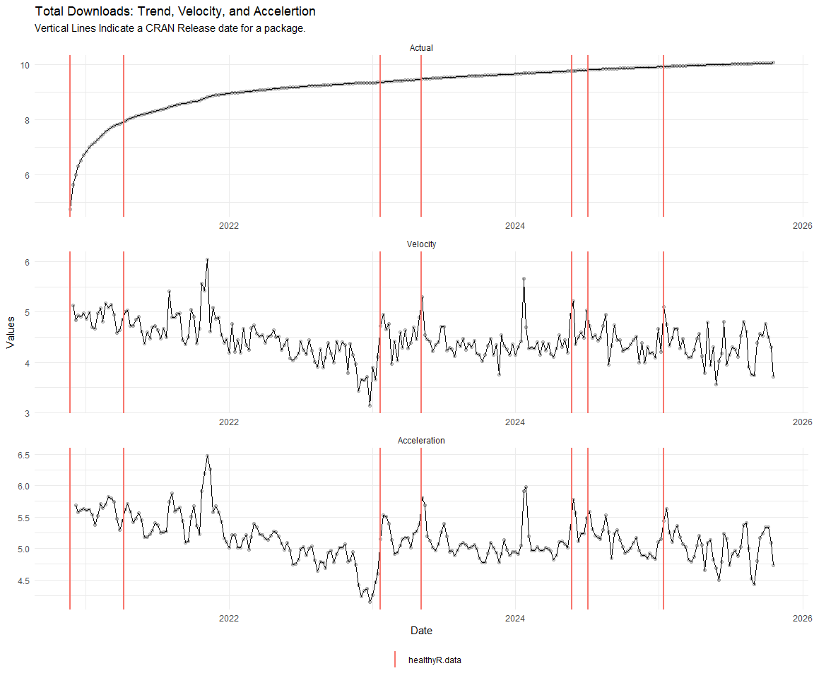
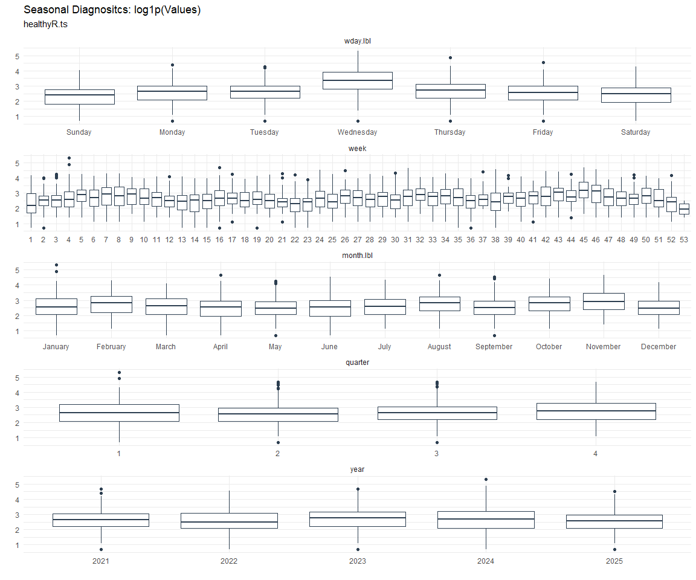

# Time Series Analysis, Modeling and Forecasting of the Healthyverse
Packages
Steven P. Sanderson II, MPH - Date:
2026-01-29

# Introduction

This analysis follows a *Nested Modeltime Workflow* from **`modeltime`**
along with using the **`NNS`** package. I use this to monitor the
downloads of all of my packages:

- [`healthyR`](https://www.spsanderson.com/healthyR/)
- [`healthyR.data`](https://www.spsanderson.com/healthyR.data/)
- [`healthyR.ts`](https://www.spsanderson.com/healthyR.ts/)
- [`healthyR.ai`](https://www.spsanderson.com/healthyR.ai/)
- [`healthyverse`](https://www.spsanderson.com/healthyverse/)
- [`TidyDensity`](https://www.spsanderson.com/TidyDensity/)
- [`tidyAML`](https://www.spsanderson.com/tidyAML/)
- [`RandomWalker`](https://www.spsanderson.com/RandomWalker/)

## Get Data

``` r
glimpse(downloads_tbl)
```

    Rows: 166,986
    Columns: 11
    $ date      <date> 2020-11-23, 2020-11-23, 2020-11-23, 2020-11-23, 2020-11-23,…
    $ time      <Period> 15H 36M 55S, 11H 26M 39S, 23H 34M 44S, 18H 39M 32S, 9H 0M…
    $ date_time <dttm> 2020-11-23 15:36:55, 2020-11-23 11:26:39, 2020-11-23 23:34:…
    $ size      <int> 4858294, 4858294, 4858301, 4858295, 361, 4863722, 4864794, 4…
    $ r_version <chr> NA, "4.0.3", "3.5.3", "3.5.2", NA, NA, NA, NA, NA, NA, NA, N…
    $ r_arch    <chr> NA, "x86_64", "x86_64", "x86_64", NA, NA, NA, NA, NA, NA, NA…
    $ r_os      <chr> NA, "mingw32", "mingw32", "linux-gnu", NA, NA, NA, NA, NA, N…
    $ package   <chr> "healthyR.data", "healthyR.data", "healthyR.data", "healthyR…
    $ version   <chr> "1.0.0", "1.0.0", "1.0.0", "1.0.0", "1.0.0", "1.0.0", "1.0.0…
    $ country   <chr> "US", "US", "US", "GB", "US", "US", "DE", "HK", "JP", "US", …
    $ ip_id     <int> 2069, 2804, 78827, 27595, 90474, 90474, 42435, 74, 7655, 638…

The last day in the data set is 2026-01-27 23:29:15, the file was
birthed on: 2025-10-31 10:47:59.603742, and at report knit time is
2120.69 hours old. Happy analyzing!

Now that we have our data lets take a look at it using the `skimr`
package.

``` r
skim(downloads_tbl)
```

|                                                  |               |
|:-------------------------------------------------|:--------------|
| Name                                             | downloads_tbl |
| Number of rows                                   | 166986        |
| Number of columns                                | 11            |
| \_\_\_\_\_\_\_\_\_\_\_\_\_\_\_\_\_\_\_\_\_\_\_   |               |
| Column type frequency:                           |               |
| character                                        | 6             |
| Date                                             | 1             |
| numeric                                          | 2             |
| POSIXct                                          | 1             |
| Timespan                                         | 1             |
| \_\_\_\_\_\_\_\_\_\_\_\_\_\_\_\_\_\_\_\_\_\_\_\_ |               |
| Group variables                                  | None          |

Data summary

**Variable type: character**

| skim_variable | n_missing | complete_rate | min | max | empty | n_unique | whitespace |
|:--------------|----------:|--------------:|----:|----:|------:|---------:|-----------:|
| r_version     |    123015 |          0.26 |   5 |   7 |     0 |       50 |          0 |
| r_arch        |    123015 |          0.26 |   1 |   7 |     0 |        6 |          0 |
| r_os          |    123015 |          0.26 |   7 |  19 |     0 |       24 |          0 |
| package       |         0 |          1.00 |   7 |  13 |     0 |        8 |          0 |
| version       |         0 |          1.00 |   5 |  17 |     0 |       63 |          0 |
| country       |     15636 |          0.91 |   2 |   2 |     0 |      166 |          0 |

**Variable type: Date**

| skim_variable | n_missing | complete_rate | min | max | median | n_unique |
|:---|---:|---:|:---|:---|:---|---:|
| date | 0 | 1 | 2020-11-23 | 2026-01-27 | 2023-11-30 | 1885 |

**Variable type: numeric**

| skim_variable | n_missing | complete_rate | mean | sd | p0 | p25 | p50 | p75 | p100 | hist |
|:---|---:|---:|---:|---:|---:|---:|---:|---:|---:|:---|
| size | 0 | 1 | 1124808.46 | 1484738.57 | 355 | 35495 | 313210 | 2347811 | 5677952 | ▇▁▂▁▁ |
| ip_id | 0 | 1 | 11207.45 | 21831.19 | 1 | 223 | 2793 | 11729 | 299146 | ▇▁▁▁▁ |

**Variable type: POSIXct**

| skim_variable | n_missing | complete_rate | min | max | median | n_unique |
|:---|---:|---:|:---|:---|:---|---:|
| date_time | 0 | 1 | 2020-11-23 09:00:41 | 2026-01-27 23:29:15 | 2023-11-30 02:14:37 | 105656 |

**Variable type: Timespan**

| skim_variable | n_missing | complete_rate | min | max | median | n_unique |
|:--------------|----------:|--------------:|----:|----:|-------:|---------:|
| time          |         0 |             1 |   0 |  59 |     52 |       60 |

We can see that the following columns are missing a lot of data and for
us are most likely not useful anyways, so we will drop them
`c(r_version, r_arch, r_os)`

## Plots

Now lets take a look at a time-series plot of the total daily downloads
by package. We will use a log scale and place a vertical line at each
version release for each package.


    [[1]]


    [[2]]


    [[3]]


    [[4]]


    [[5]]




    [[6]]


    [[7]]


    [[8]]


Now lets take a look at some time series decomposition graphs.

    [[1]]


    [[2]]


    [[3]]


    [[4]]


    [[5]]


    [[6]]


    [[7]]


    [[8]]


    [[1]]


    [[2]]


    [[3]]


    [[4]]


    [[5]]


    [[6]]


    [[7]]


    [[8]]


Seasonal Diagnostics:

    [[1]]


    [[2]]


    [[3]]


    [[4]]


    [[5]]


    [[6]]




    [[7]]


    [[8]]


ACF and PACF Diagnostics:

    [[1]]


    [[2]]


    [[3]]


    [[4]]


    [[5]]


    [[6]]


    [[7]]


    [[8]]


## Feature Engineering

Now that we have our basic data and a shot of what it looks like, let’s
add some features to our data which can be very helpful in modeling.
Lets start by making a `tibble` that is aggregated by the day and
package, as we are going to be interested in forecasting the next 4
weeks or 28 days for each package. First lets get our base data.


    Call:
    stats::lm(formula = .formula, data = df)

    Residuals:
        Min      1Q  Median      3Q     Max 
    -148.51  -37.04  -11.51   27.12  823.78 

    Coefficients:
                                                         Estimate Std. Error
    (Intercept)                                        -1.648e+02  5.758e+01
    date                                                1.028e-02  3.048e-03
    lag(value, 1)                                       1.028e-01  2.289e-02
    lag(value, 7)                                       9.103e-02  2.370e-02
    lag(value, 14)                                      7.741e-02  2.365e-02
    lag(value, 21)                                      8.329e-02  2.372e-02
    lag(value, 28)                                      6.242e-02  2.365e-02
    lag(value, 35)                                      5.097e-02  2.365e-02
    lag(value, 42)                                      6.777e-02  2.376e-02
    lag(value, 49)                                      6.724e-02  2.369e-02
    month(date, label = TRUE).L                        -8.960e+00  4.845e+00
    month(date, label = TRUE).Q                        -9.597e-01  4.757e+00
    month(date, label = TRUE).C                        -1.458e+01  4.803e+00
    month(date, label = TRUE)^4                        -7.292e+00  4.859e+00
    month(date, label = TRUE)^5                        -5.862e+00  4.851e+00
    month(date, label = TRUE)^6                         6.876e-01  4.896e+00
    month(date, label = TRUE)^7                        -4.111e+00  4.844e+00
    month(date, label = TRUE)^8                        -4.250e+00  4.823e+00
    month(date, label = TRUE)^9                         2.882e+00  4.837e+00
    month(date, label = TRUE)^10                        9.234e-01  4.853e+00
    month(date, label = TRUE)^11                       -4.123e+00  4.840e+00
    fourier_vec(date, type = "sin", K = 1, period = 7) -1.101e+01  2.176e+00
    fourier_vec(date, type = "cos", K = 1, period = 7)  7.265e+00  2.250e+00
                                                       t value Pr(>|t|)    
    (Intercept)                                         -2.863 0.004245 ** 
    date                                                 3.372 0.000763 ***
    lag(value, 1)                                        4.489 7.59e-06 ***
    lag(value, 7)                                        3.842 0.000126 ***
    lag(value, 14)                                       3.274 0.001082 ** 
    lag(value, 21)                                       3.511 0.000458 ***
    lag(value, 28)                                       2.639 0.008386 ** 
    lag(value, 35)                                       2.155 0.031319 *  
    lag(value, 42)                                       2.852 0.004396 ** 
    lag(value, 49)                                       2.839 0.004580 ** 
    month(date, label = TRUE).L                         -1.849 0.064562 .  
    month(date, label = TRUE).Q                         -0.202 0.840156    
    month(date, label = TRUE).C                         -3.035 0.002441 ** 
    month(date, label = TRUE)^4                         -1.501 0.133599    
    month(date, label = TRUE)^5                         -1.208 0.227034    
    month(date, label = TRUE)^6                          0.140 0.888316    
    month(date, label = TRUE)^7                         -0.849 0.396219    
    month(date, label = TRUE)^8                         -0.881 0.378286    
    month(date, label = TRUE)^9                          0.596 0.551333    
    month(date, label = TRUE)^10                         0.190 0.849121    
    month(date, label = TRUE)^11                        -0.852 0.394392    
    fourier_vec(date, type = "sin", K = 1, period = 7)  -5.059 4.65e-07 ***
    fourier_vec(date, type = "cos", K = 1, period = 7)   3.229 0.001263 ** 
    ---
    Signif. codes:  0 '***' 0.001 '**' 0.01 '*' 0.05 '.' 0.1 ' ' 1

    Residual standard error: 59.37 on 1813 degrees of freedom
      (49 observations deleted due to missingness)
    Multiple R-squared:  0.2225,    Adjusted R-squared:  0.2131 
    F-statistic: 23.58 on 22 and 1813 DF,  p-value: < 2.2e-16


## NNS Forecasting

This is something I have been wanting to try for a while. The `NNS`
package is a great package for forecasting time series data.

[NNS GitHub](https://github.com/OVVO-Financial/NNS)

``` r
library(NNS)

data_list <- base_data |>
    select(package, value) |>
    group_split(package)

data_list |>
    imap(
        \(x, idx) {
            obj <- x
            x <- obj |> pull(value) |> tail(7*52)
            train_set_size <- length(x) - 56
            pkg <- obj |> pluck(1) |> unique()
#            sf <- NNS.seas(x, modulo = 7, plot = FALSE)$periods
            seas <- t(
                sapply(
                    1:25, 
                    function(i) c(
                        i,
                        sqrt(
                            mean((
                                NNS.ARMA(x, 
                                         h = 28, 
                                         training.set = train_set_size, 
                                         method = "lin", 
                                         seasonal.factor = i, 
                                         plot=FALSE
                                         ) - tail(x, 28)) ^ 2)))
                    )
                )
            colnames(seas) <- c("Period", "RMSE")
            sf <- seas[which.min(seas[, 2]), 1]
            
            cat(paste0("Package: ", pkg, "\n"))
            NNS.ARMA.optim(
                variable = x,
                h = 28,
                training.set = train_set_size,
                #seasonal.factor = seq(12, 60, 7),
                seasonal.factor = sf,
                pred.int = 0.95,
                plot = TRUE
            )
            title(
                sub = paste0("\n",
                             "Package: ", pkg, " - NNS Optimization")
            )
        }
    )
```

    Package: healthyR
    [1] "CURRNET METHOD: lin"
    [1] "COPY LATEST PARAMETERS DIRECTLY FOR NNS.ARMA() IF ERROR:"
    [1] "NNS.ARMA(... method =  'lin' , seasonal.factor =  c( 25 ) ...)"
    [1] "CURRENT lin OBJECTIVE FUNCTION = 5.05681176423358"
    [1] "BEST method = 'lin' PATH MEMBER = c( 25 )"
    [1] "BEST lin OBJECTIVE FUNCTION = 5.05681176423358"
    [1] "CURRNET METHOD: nonlin"
    [1] "COPY LATEST PARAMETERS DIRECTLY FOR NNS.ARMA() IF ERROR:"
    [1] "NNS.ARMA(... method =  'nonlin' , seasonal.factor =  c( 25 ) ...)"
    [1] "CURRENT nonlin OBJECTIVE FUNCTION = 6.12043640118858"
    [1] "BEST method = 'nonlin' PATH MEMBER = c( 25 )"
    [1] "BEST nonlin OBJECTIVE FUNCTION = 6.12043640118858"
    [1] "CURRNET METHOD: both"
    [1] "COPY LATEST PARAMETERS DIRECTLY FOR NNS.ARMA() IF ERROR:"
    [1] "NNS.ARMA(... method =  'both' , seasonal.factor =  c( 25 ) ...)"
    [1] "CURRENT both OBJECTIVE FUNCTION = 4.70439047238501"
    [1] "BEST method = 'both' PATH MEMBER = c( 25 )"
    [1] "BEST both OBJECTIVE FUNCTION = 4.70439047238501"


    Package: healthyR.ai
    [1] "CURRNET METHOD: lin"
    [1] "COPY LATEST PARAMETERS DIRECTLY FOR NNS.ARMA() IF ERROR:"
    [1] "NNS.ARMA(... method =  'lin' , seasonal.factor =  c( 3 ) ...)"
    [1] "CURRENT lin OBJECTIVE FUNCTION = 101.983050461472"
    [1] "BEST method = 'lin' PATH MEMBER = c( 3 )"
    [1] "BEST lin OBJECTIVE FUNCTION = 101.983050461472"
    [1] "CURRNET METHOD: nonlin"
    [1] "COPY LATEST PARAMETERS DIRECTLY FOR NNS.ARMA() IF ERROR:"
    [1] "NNS.ARMA(... method =  'nonlin' , seasonal.factor =  c( 3 ) ...)"
    [1] "CURRENT nonlin OBJECTIVE FUNCTION = 10.3903729485468"
    [1] "BEST method = 'nonlin' PATH MEMBER = c( 3 )"
    [1] "BEST nonlin OBJECTIVE FUNCTION = 10.3903729485468"
    [1] "CURRNET METHOD: both"
    [1] "COPY LATEST PARAMETERS DIRECTLY FOR NNS.ARMA() IF ERROR:"
    [1] "NNS.ARMA(... method =  'both' , seasonal.factor =  c( 3 ) ...)"
    [1] "CURRENT both OBJECTIVE FUNCTION = 9.91729626355765"
    [1] "BEST method = 'both' PATH MEMBER = c( 3 )"
    [1] "BEST both OBJECTIVE FUNCTION = 9.91729626355765"


    Package: healthyR.data
    [1] "CURRNET METHOD: lin"
    [1] "COPY LATEST PARAMETERS DIRECTLY FOR NNS.ARMA() IF ERROR:"
    [1] "NNS.ARMA(... method =  'lin' , seasonal.factor =  c( 20 ) ...)"
    [1] "CURRENT lin OBJECTIVE FUNCTION = 12.7508897683222"
    [1] "BEST method = 'lin' PATH MEMBER = c( 20 )"
    [1] "BEST lin OBJECTIVE FUNCTION = 12.7508897683222"
    [1] "CURRNET METHOD: nonlin"
    [1] "COPY LATEST PARAMETERS DIRECTLY FOR NNS.ARMA() IF ERROR:"
    [1] "NNS.ARMA(... method =  'nonlin' , seasonal.factor =  c( 20 ) ...)"
    [1] "CURRENT nonlin OBJECTIVE FUNCTION = 5.89455872851956"
    [1] "BEST method = 'nonlin' PATH MEMBER = c( 20 )"
    [1] "BEST nonlin OBJECTIVE FUNCTION = 5.89455872851956"
    [1] "CURRNET METHOD: both"
    [1] "COPY LATEST PARAMETERS DIRECTLY FOR NNS.ARMA() IF ERROR:"
    [1] "NNS.ARMA(... method =  'both' , seasonal.factor =  c( 20 ) ...)"
    [1] "CURRENT both OBJECTIVE FUNCTION = 7.06643722643935"
    [1] "BEST method = 'both' PATH MEMBER = c( 20 )"
    [1] "BEST both OBJECTIVE FUNCTION = 7.06643722643935"


    Package: healthyR.ts
    [1] "CURRNET METHOD: lin"
    [1] "COPY LATEST PARAMETERS DIRECTLY FOR NNS.ARMA() IF ERROR:"
    [1] "NNS.ARMA(... method =  'lin' , seasonal.factor =  c( 11 ) ...)"
    [1] "CURRENT lin OBJECTIVE FUNCTION = 26.6078901632946"
    [1] "BEST method = 'lin' PATH MEMBER = c( 11 )"
    [1] "BEST lin OBJECTIVE FUNCTION = 26.6078901632946"
    [1] "CURRNET METHOD: nonlin"
    [1] "COPY LATEST PARAMETERS DIRECTLY FOR NNS.ARMA() IF ERROR:"
    [1] "NNS.ARMA(... method =  'nonlin' , seasonal.factor =  c( 11 ) ...)"
    [1] "CURRENT nonlin OBJECTIVE FUNCTION = 11.5754263945389"
    [1] "BEST method = 'nonlin' PATH MEMBER = c( 11 )"
    [1] "BEST nonlin OBJECTIVE FUNCTION = 11.5754263945389"
    [1] "CURRNET METHOD: both"
    [1] "COPY LATEST PARAMETERS DIRECTLY FOR NNS.ARMA() IF ERROR:"
    [1] "NNS.ARMA(... method =  'both' , seasonal.factor =  c( 11 ) ...)"
    [1] "CURRENT both OBJECTIVE FUNCTION = 17.5896000127571"
    [1] "BEST method = 'both' PATH MEMBER = c( 11 )"
    [1] "BEST both OBJECTIVE FUNCTION = 17.5896000127571"


    Package: healthyverse
    [1] "CURRNET METHOD: lin"
    [1] "COPY LATEST PARAMETERS DIRECTLY FOR NNS.ARMA() IF ERROR:"
    [1] "NNS.ARMA(... method =  'lin' , seasonal.factor =  c( 3 ) ...)"
    [1] "CURRENT lin OBJECTIVE FUNCTION = 61.9756592532723"
    [1] "BEST method = 'lin' PATH MEMBER = c( 3 )"
    [1] "BEST lin OBJECTIVE FUNCTION = 61.9756592532723"
    [1] "CURRNET METHOD: nonlin"
    [1] "COPY LATEST PARAMETERS DIRECTLY FOR NNS.ARMA() IF ERROR:"
    [1] "NNS.ARMA(... method =  'nonlin' , seasonal.factor =  c( 3 ) ...)"
    [1] "CURRENT nonlin OBJECTIVE FUNCTION = 15.3999828610111"
    [1] "BEST method = 'nonlin' PATH MEMBER = c( 3 )"
    [1] "BEST nonlin OBJECTIVE FUNCTION = 15.3999828610111"
    [1] "CURRNET METHOD: both"
    [1] "COPY LATEST PARAMETERS DIRECTLY FOR NNS.ARMA() IF ERROR:"
    [1] "NNS.ARMA(... method =  'both' , seasonal.factor =  c( 3 ) ...)"
    [1] "CURRENT both OBJECTIVE FUNCTION = 33.9948068539943"
    [1] "BEST method = 'both' PATH MEMBER = c( 3 )"
    [1] "BEST both OBJECTIVE FUNCTION = 33.9948068539943"


    Package: RandomWalker
    [1] "CURRNET METHOD: lin"
    [1] "COPY LATEST PARAMETERS DIRECTLY FOR NNS.ARMA() IF ERROR:"
    [1] "NNS.ARMA(... method =  'lin' , seasonal.factor =  c( 16 ) ...)"
    [1] "CURRENT lin OBJECTIVE FUNCTION = 14.9179587262231"
    [1] "BEST method = 'lin' PATH MEMBER = c( 16 )"
    [1] "BEST lin OBJECTIVE FUNCTION = 14.9179587262231"
    [1] "CURRNET METHOD: nonlin"
    [1] "COPY LATEST PARAMETERS DIRECTLY FOR NNS.ARMA() IF ERROR:"
    [1] "NNS.ARMA(... method =  'nonlin' , seasonal.factor =  c( 16 ) ...)"
    [1] "CURRENT nonlin OBJECTIVE FUNCTION = 4.60571522181754"
    [1] "BEST method = 'nonlin' PATH MEMBER = c( 16 )"
    [1] "BEST nonlin OBJECTIVE FUNCTION = 4.60571522181754"
    [1] "CURRNET METHOD: both"
    [1] "COPY LATEST PARAMETERS DIRECTLY FOR NNS.ARMA() IF ERROR:"
    [1] "NNS.ARMA(... method =  'both' , seasonal.factor =  c( 16 ) ...)"
    [1] "CURRENT both OBJECTIVE FUNCTION = 6.2682288509071"
    [1] "BEST method = 'both' PATH MEMBER = c( 16 )"
    [1] "BEST both OBJECTIVE FUNCTION = 6.2682288509071"


    Package: tidyAML
    [1] "CURRNET METHOD: lin"
    [1] "COPY LATEST PARAMETERS DIRECTLY FOR NNS.ARMA() IF ERROR:"
    [1] "NNS.ARMA(... method =  'lin' , seasonal.factor =  c( 8 ) ...)"
    [1] "CURRENT lin OBJECTIVE FUNCTION = 11.8387988264058"
    [1] "BEST method = 'lin' PATH MEMBER = c( 8 )"
    [1] "BEST lin OBJECTIVE FUNCTION = 11.8387988264058"
    [1] "CURRNET METHOD: nonlin"
    [1] "COPY LATEST PARAMETERS DIRECTLY FOR NNS.ARMA() IF ERROR:"
    [1] "NNS.ARMA(... method =  'nonlin' , seasonal.factor =  c( 8 ) ...)"
    [1] "CURRENT nonlin OBJECTIVE FUNCTION = 11.5399288115919"
    [1] "BEST method = 'nonlin' PATH MEMBER = c( 8 )"
    [1] "BEST nonlin OBJECTIVE FUNCTION = 11.5399288115919"
    [1] "CURRNET METHOD: both"
    [1] "COPY LATEST PARAMETERS DIRECTLY FOR NNS.ARMA() IF ERROR:"
    [1] "NNS.ARMA(... method =  'both' , seasonal.factor =  c( 8 ) ...)"
    [1] "CURRENT both OBJECTIVE FUNCTION = 10.5275570095888"
    [1] "BEST method = 'both' PATH MEMBER = c( 8 )"
    [1] "BEST both OBJECTIVE FUNCTION = 10.5275570095888"


    Package: TidyDensity
    [1] "CURRNET METHOD: lin"
    [1] "COPY LATEST PARAMETERS DIRECTLY FOR NNS.ARMA() IF ERROR:"
    [1] "NNS.ARMA(... method =  'lin' , seasonal.factor =  c( 16 ) ...)"
    [1] "CURRENT lin OBJECTIVE FUNCTION = 19.3847801917076"
    [1] "BEST method = 'lin' PATH MEMBER = c( 16 )"
    [1] "BEST lin OBJECTIVE FUNCTION = 19.3847801917076"
    [1] "CURRNET METHOD: nonlin"
    [1] "COPY LATEST PARAMETERS DIRECTLY FOR NNS.ARMA() IF ERROR:"
    [1] "NNS.ARMA(... method =  'nonlin' , seasonal.factor =  c( 16 ) ...)"
    [1] "CURRENT nonlin OBJECTIVE FUNCTION = 3.42317707972579"
    [1] "BEST method = 'nonlin' PATH MEMBER = c( 16 )"
    [1] "BEST nonlin OBJECTIVE FUNCTION = 3.42317707972579"
    [1] "CURRNET METHOD: both"
    [1] "COPY LATEST PARAMETERS DIRECTLY FOR NNS.ARMA() IF ERROR:"
    [1] "NNS.ARMA(... method =  'both' , seasonal.factor =  c( 16 ) ...)"
    [1] "CURRENT both OBJECTIVE FUNCTION = 5.81528551130106"
    [1] "BEST method = 'both' PATH MEMBER = c( 16 )"
    [1] "BEST both OBJECTIVE FUNCTION = 5.81528551130106"


    [[1]]
    NULL

    [[2]]
    NULL

    [[3]]
    NULL

    [[4]]
    NULL

    [[5]]
    NULL

    [[6]]
    NULL

    [[7]]
    NULL

    [[8]]
    NULL

## Pre-Processing

Now we are going to do some basic pre-processing.

``` r
data_padded_tbl <- base_data %>%
  pad_by_time(
    .date_var  = date,
    .pad_value = 0
  )

# Get log interval and standardization parameters
log_params  <- liv(data_padded_tbl$value, limit_lower = 0, offset = 1, silent = TRUE)
limit_lower <- log_params$limit_lower
limit_upper <- log_params$limit_upper
offset      <- log_params$offset

data_liv_tbl <- data_padded_tbl %>%
  # Get log interval transform
  mutate(value_trans = liv(value, limit_lower = 0, offset = 1, silent = TRUE)$log_scaled)

# Get Standardization Params
std_params <- standard_vec(data_liv_tbl$value_trans, silent = TRUE)
std_mean   <- std_params$mean
std_sd     <- std_params$sd

data_transformed_tbl <- data_liv_tbl %>%
  group_by(package) %>%
  # get standardization
  mutate(value_trans = standard_vec(value_trans, silent = TRUE)$standard_scaled) %>%
  tk_augment_fourier(
    .date_var = date,
    .periods  = c(7, 14, 30, 90, 180),
    .K        = 2
  ) %>%
  tk_augment_timeseries_signature(
    .date_var = date
  ) %>%
  ungroup() %>%
  select(-c(value, -year.iso))
```

Since this is panel data we can follow one of two different modeling
strategies. We can search for a global model in the panel data or we can
use nested forecasting finding the best model for each of the time
series. Since we only have 5 panels, we will use nested forecasting.

To do this we will use the `nest_timeseries` and
`split_nested_timeseries` functions to create a nested `tibble`.

``` r
horizon <- 4*7

nested_data_tbl <- data_transformed_tbl %>%

    # 0. Filter out column where package is NA
    filter(!is.na(package)) %>%
    
    # 1. Extending: We'll predict n days into the future.
    extend_timeseries(
        .id_var        = package,
        .date_var      = date,
        .length_future = horizon
    ) %>%
    
    # 2. Nesting: We'll group by id, and create a future dataset
    #    that forecasts n days of extended data and
    #    an actual dataset that contains n*2 days
    nest_timeseries(
        .id_var        = package,
        .length_future = horizon
        #.length_actual = horizon*2
    ) %>%
    
   # 3. Splitting: We'll take the actual data and create splits
   #    for accuracy and confidence interval estimation of n das (test)
   #    and the rest is training data
    split_nested_timeseries(
        .length_test = horizon
    )

nested_data_tbl
```

    # A tibble: 8 × 4
      package       .actual_data          .future_data       .splits          
      <fct>         <list>                <list>             <list>           
    1 healthyR.data <tibble [1,875 × 50]> <tibble [28 × 50]> <split [1847|28]>
    2 healthyR      <tibble [1,868 × 50]> <tibble [28 × 50]> <split [1840|28]>
    3 healthyR.ts   <tibble [1,804 × 50]> <tibble [28 × 50]> <split [1776|28]>
    4 healthyverse  <tibble [1,768 × 50]> <tibble [28 × 50]> <split [1740|28]>
    5 healthyR.ai   <tibble [1,610 × 50]> <tibble [28 × 50]> <split [1582|28]>
    6 TidyDensity   <tibble [1,461 × 50]> <tibble [28 × 50]> <split [1433|28]>
    7 tidyAML       <tibble [1,068 × 50]> <tibble [28 × 50]> <split [1040|28]>
    8 RandomWalker  <tibble [491 × 50]>   <tibble [28 × 50]> <split [463|28]> 

Now it is time to make some recipes and models using the modeltime
workflow.

## Modeltime Workflow

### Recipe Object

``` r
recipe_base <- recipe(
  value_trans ~ .
  , data = extract_nested_test_split(nested_data_tbl)
  )

recipe_base

recipe_date <- recipe(
  value_trans ~ date
  , data = extract_nested_test_split(nested_data_tbl)
  )
```

### Models

``` r
# Models ------------------------------------------------------------------

# Auto ARIMA --------------------------------------------------------------

model_spec_arima_no_boost <- arima_reg() %>%
  set_engine(engine = "auto_arima")

wflw_auto_arima <- workflow() %>%
  add_recipe(recipe = recipe_date) %>%
  add_model(model_spec_arima_no_boost)

# NNETAR ------------------------------------------------------------------

model_spec_nnetar <- nnetar_reg(
  mode              = "regression"
  , seasonal_period = "auto"
) %>%
  set_engine("nnetar")

wflw_nnetar <- workflow() %>%
  add_recipe(recipe = recipe_base) %>%
  add_model(model_spec_nnetar)

# TSLM --------------------------------------------------------------------

model_spec_lm <- linear_reg() %>%
  set_engine("lm")

wflw_lm <- workflow() %>%
  add_recipe(recipe = recipe_base) %>%
  add_model(model_spec_lm)

# MARS --------------------------------------------------------------------

model_spec_mars <- mars(mode = "regression") %>%
  set_engine("earth")

wflw_mars <- workflow() %>%
  add_recipe(recipe = recipe_date) %>%
  add_model(model_spec_mars)
```

### Nested Modeltime Tables

``` r
nested_modeltime_tbl <- modeltime_nested_fit(
  # Nested Data
  nested_data = nested_data_tbl,
   control = control_nested_fit(
     verbose = TRUE,
     allow_par = FALSE
   ),
  # Add workflows
  wflw_auto_arima,
  wflw_lm,
  wflw_mars,
  wflw_nnetar
)
```

``` r
nested_modeltime_tbl <- nested_modeltime_tbl[!is.na(nested_modeltime_tbl$package),]
```

### Model Accuracy

``` r
nested_modeltime_tbl %>%
  extract_nested_test_accuracy() %>%
  filter(!is.na(package)) %>%
  knitr::kable()
```

| package | .model_id | .model_desc | .type | mae | mape | mase | smape | rmse | rsq |
|:---|---:|:---|:---|---:|---:|---:|---:|---:|---:|
| healthyR.data | 1 | ARIMA | Test | 0.7861257 | 148.51882 | 0.7325263 | 148.32190 | 0.9765162 | 0.0347229 |
| healthyR.data | 2 | LM | Test | 0.6707149 | 122.03877 | 0.6249844 | 152.76197 | 0.8591373 | 0.0828554 |
| healthyR.data | 3 | EARTH | Test | 0.7128457 | 140.62649 | 0.6642426 | 138.87775 | 0.9087615 | 0.0201941 |
| healthyR.data | 4 | NNAR | Test | 0.7714193 | 177.33233 | 0.7188226 | 153.52162 | 0.9453784 | 0.0019735 |
| healthyR | 1 | ARIMA | Test | 0.6969470 | 444.10659 | 0.5719717 | 119.55143 | 0.9332107 | 0.0306813 |
| healthyR | 2 | LM | Test | 0.7253123 | 498.22767 | 0.5952506 | 125.46270 | 0.9470043 | 0.0775172 |
| healthyR | 3 | EARTH | Test | 0.6998876 | 616.60440 | 0.5743850 | 109.35748 | 0.9368951 | 0.0006382 |
| healthyR | 4 | NNAR | Test | 0.7558256 | 540.09648 | 0.6202923 | 128.67513 | 0.9898973 | 0.0450697 |
| healthyR.ts | 1 | ARIMA | Test | 1.0993203 | 100.60224 | 0.8326380 | 162.45130 | 1.3690996 | 0.0070127 |
| healthyR.ts | 2 | LM | Test | 1.1915530 | 144.62787 | 0.9024962 | 151.39576 | 1.4899607 | 0.0445971 |
| healthyR.ts | 3 | EARTH | Test | 1.0103668 | 275.44845 | 0.7652636 | 112.56529 | 1.2829877 | 0.1413370 |
| healthyR.ts | 4 | NNAR | Test | 1.2171139 | 171.73169 | 0.9218563 | 147.75712 | 1.5526050 | 0.1485170 |
| healthyverse | 1 | ARIMA | Test | 1.1924345 | 84.36053 | 1.4340005 | 145.61504 | 1.3771293 | 0.0050349 |
| healthyverse | 2 | LM | Test | 1.1184336 | 92.48080 | 1.3450084 | 128.48236 | 1.2851467 | 0.0731136 |
| healthyverse | 3 | EARTH | Test | 2.7519753 | 238.18463 | 3.3094765 | 191.49688 | 3.0097494 | 0.1297871 |
| healthyverse | 4 | NNAR | Test | 1.1991143 | 98.25826 | 1.4420335 | 143.35471 | 1.3670193 | 0.0806083 |
| healthyR.ai | 1 | ARIMA | Test | 0.7002754 | 87.59895 | 0.8389962 | 148.64846 | 0.8035017 | 0.1250908 |
| healthyR.ai | 2 | LM | Test | 0.7826767 | 130.76340 | 0.9377207 | 146.60331 | 0.9133871 | 0.0858783 |
| healthyR.ai | 3 | EARTH | Test | 1.7216247 | 517.51167 | 2.0626693 | 115.10396 | 1.9141738 | 0.0268126 |
| healthyR.ai | 4 | NNAR | Test | 0.7667847 | 137.70574 | 0.9186806 | 139.25446 | 0.9020992 | 0.0324612 |
| TidyDensity | 1 | ARIMA | Test | 1.0199895 | 122.09842 | 0.6090573 | 167.28801 | 1.2569990 | 0.0000543 |
| TidyDensity | 2 | LM | Test | 1.1053368 | 312.53278 | 0.6600199 | 162.83046 | 1.2041230 | 0.0459268 |
| TidyDensity | 3 | EARTH | Test | 1.0092686 | 140.58837 | 0.6026556 | 137.41413 | 1.3054063 | 0.0043465 |
| TidyDensity | 4 | NNAR | Test | 1.0629201 | 293.91149 | 0.6346920 | 160.18976 | 1.1954292 | 0.0481894 |
| tidyAML | 1 | ARIMA | Test | 0.6202493 | 108.98397 | 0.6070450 | 84.48303 | 0.8141327 | 0.1091012 |
| tidyAML | 2 | LM | Test | 1.0905811 | 167.31951 | 1.0673641 | 156.56941 | 1.3428815 | 0.0242122 |
| tidyAML | 3 | EARTH | Test | 2.7924093 | 906.03109 | 2.7329626 | 133.53045 | 3.1029415 | 0.0396336 |
| tidyAML | 4 | NNAR | Test | 0.8032429 | 169.67553 | 0.7861429 | 140.45166 | 1.0598661 | 0.0180034 |
| RandomWalker | 1 | ARIMA | Test | 1.0809094 | 120.73027 | 0.6529512 | 185.95200 | 1.1759656 | 0.0907719 |
| RandomWalker | 2 | LM | Test | 1.1807757 | 217.39646 | 0.7132779 | 168.27049 | 1.2366247 | 0.0214180 |
| RandomWalker | 3 | EARTH | Test | 0.9472123 | 103.43790 | 0.5721880 | 147.73908 | 1.1311154 | 0.0007775 |
| RandomWalker | 4 | NNAR | Test | 1.2054573 | 205.14477 | 0.7281875 | 177.03437 | 1.2612058 | 0.0378941 |

### Plot Models

``` r
nested_modeltime_tbl %>%
  extract_nested_test_forecast() %>%
  group_by(package) %>%
  filter_by_time(.date_var = .index, .start_date = max(.index) - 60) %>%
  ungroup() %>%
  plot_modeltime_forecast(
    .interactive = FALSE,
    .conf_interval_show  = FALSE,
    .facet_scales = "free"
  ) +
  theme_minimal() +
  facet_wrap(~ package, nrow = 3) +
  theme(legend.position = "bottom")
```


### Best Model

``` r
best_nested_modeltime_tbl <- nested_modeltime_tbl %>%
  modeltime_nested_select_best(
    metric = "rmse",
    minimize = TRUE,
    filter_test_forecasts = TRUE
  )

best_nested_modeltime_tbl %>%
  extract_nested_best_model_report()
```

    # Nested Modeltime Table
      

    # A tibble: 8 × 10
      package      .model_id .model_desc .type   mae  mape  mase smape  rmse     rsq
      <fct>            <int> <chr>       <chr> <dbl> <dbl> <dbl> <dbl> <dbl>   <dbl>
    1 healthyR.da…         2 LM          Test  0.671 122.  0.625 153.  0.859 8.29e-2
    2 healthyR             1 ARIMA       Test  0.697 444.  0.572 120.  0.933 3.07e-2
    3 healthyR.ts          3 EARTH       Test  1.01  275.  0.765 113.  1.28  1.41e-1
    4 healthyverse         2 LM          Test  1.12   92.5 1.35  128.  1.29  7.31e-2
    5 healthyR.ai          1 ARIMA       Test  0.700  87.6 0.839 149.  0.804 1.25e-1
    6 TidyDensity          4 NNAR        Test  1.06  294.  0.635 160.  1.20  4.82e-2
    7 tidyAML              1 ARIMA       Test  0.620 109.  0.607  84.5 0.814 1.09e-1
    8 RandomWalker         3 EARTH       Test  0.947 103.  0.572 148.  1.13  7.77e-4

``` r
best_nested_modeltime_tbl %>%
  extract_nested_test_forecast() %>%
  #filter(!is.na(.model_id)) %>%
  group_by(package) %>%
  filter_by_time(.date_var = .index, .start_date = max(.index) - 60) %>%
  ungroup() %>%
  plot_modeltime_forecast(
    .interactive = FALSE,
    .conf_interval_alpha = 0.2,
    .facet_scales = "free"
  ) +
  facet_wrap(~ package, nrow = 3) +
  theme_minimal() +
  theme(legend.position = "bottom")
```


## Refitting and Future Forecast

Now that we have the best models, we can make our future forecasts.

``` r
nested_modeltime_refit_tbl <- best_nested_modeltime_tbl %>%
    modeltime_nested_refit(
        control = control_nested_refit(verbose = TRUE)
    )
```

``` r
nested_modeltime_refit_tbl
```

    # Nested Modeltime Table
      

    # A tibble: 8 × 5
      package       .actual_data .future_data .splits           .modeltime_tables 
      <fct>         <list>       <list>       <list>            <list>            
    1 healthyR.data <tibble>     <tibble>     <split [1847|28]> <mdl_tm_t [1 × 5]>
    2 healthyR      <tibble>     <tibble>     <split [1840|28]> <mdl_tm_t [1 × 5]>
    3 healthyR.ts   <tibble>     <tibble>     <split [1776|28]> <mdl_tm_t [1 × 5]>
    4 healthyverse  <tibble>     <tibble>     <split [1740|28]> <mdl_tm_t [1 × 5]>
    5 healthyR.ai   <tibble>     <tibble>     <split [1582|28]> <mdl_tm_t [1 × 5]>
    6 TidyDensity   <tibble>     <tibble>     <split [1433|28]> <mdl_tm_t [1 × 5]>
    7 tidyAML       <tibble>     <tibble>     <split [1040|28]> <mdl_tm_t [1 × 5]>
    8 RandomWalker  <tibble>     <tibble>     <split [463|28]>  <mdl_tm_t [1 × 5]>

``` r
nested_modeltime_refit_tbl %>%
  extract_nested_future_forecast() %>%
  group_by(package) %>%
  mutate(across(.value:.conf_hi, .fns = ~ standard_inv_vec(
    x    = .,
    mean = std_mean,
    sd   = std_sd
  )$standard_inverse_value)) %>%
  mutate(across(.value:.conf_hi, .fns = ~ liiv(
    x = .,
    limit_lower = limit_lower,
    limit_upper = limit_upper,
    offset      = offset
  )$rescaled_v)) %>%
  filter_by_time(.date_var = .index, .start_date = max(.index) - 60) %>%
  ungroup() %>%
  plot_modeltime_forecast(
    .interactive = FALSE,
    .conf_interval_alpha = 0.2,
    .facet_scales = "free"
  ) +
  facet_wrap(~ package, nrow = 3) +
  theme_minimal() +
  theme(legend.position = "bottom")
```


